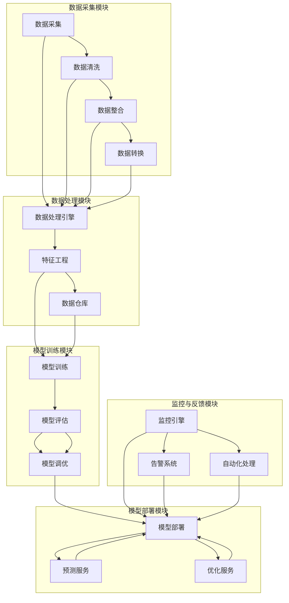

                 

# 开发智能化的金融产品生命周期管理与优化引擎

> 关键词：金融产品生命周期管理、智能化技术、生命周期优化、机器学习、数据挖掘

> 摘要：本文探讨了开发智能化金融产品生命周期管理与优化引擎的重要性及其核心概念。文章首先介绍了金融产品生命周期管理的背景和核心概念，然后详细阐述了智能化技术在金融产品生命周期管理中的应用。接下来，文章分析了智能引擎的设计与实现，包括数据收集与处理、模型训练与优化、以及智能引擎的部署与维护。最后，通过案例分析，总结了实践经验，并对未来研究方向进行了展望。

## 目录大纲

1. **背景介绍与核心概念**
   1.1 金融产品生命周期管理概述
   1.2 核心概念介绍
   1.3 边界与外延
   1.4 本章小结

2. **智能化的金融产品生命周期管理**
   2.1 概念介绍
   2.2 智能化管理的核心模块
   2.3 智能化生命周期管理的关键技术
   2.4 本章小结

3. **智能引擎设计与实现**
   3.1 智能引擎架构设计
   3.2 数据收集与处理
   3.3 模型训练与优化
   3.4 智能引擎部署与维护
   3.5 本章小结

4. **案例分析与实践应用**
   4.1 案例介绍
   4.2 实践应用
   4.3 经验与启示
   4.4 本章小结

5. **总结与展望**
   5.1 总结
   5.2 展望
   5.3 本章小结

6. **附录：参考资料与拓展阅读**

---

## 第一部分：背景介绍与核心概念

### 1.1 金融产品生命周期管理概述

#### 1.1.1 金融产品的重要性

金融产品是金融市场中的基本单位，它们构成了金融机构服务的基础。金融产品的类型多种多样，包括但不限于股票、债券、基金、期货、期权等。这些金融产品不仅为投资者提供了多种投资选择，还为企业筹集资金、分散风险、管理资产提供了有效的工具。

#### 1.1.2 金融产品生命周期的挑战

金融产品的生命周期通常包括开发、发行、交易和退市等阶段。在这个过程中，金融机构面临着一系列挑战：

1. **市场不确定性**：金融市场的波动性使得预测产品的表现和市场需求变得复杂。
2. **监管要求**：金融产品的监管要求不断变化，需要金融机构及时调整。
3. **技术创新**：新兴技术的快速发展要求金融产品不断创新，以适应市场变化。
4. **成本控制**：金融产品开发、维护和运营的成本日益增加，需要有效管理。

#### 1.1.3 优化金融产品生命周期的需求

为了应对上述挑战，优化金融产品生命周期变得至关重要。通过智能化技术，可以实现以下目标：

1. **提高效率**：自动化和智能化技术能够减少人为错误，提高工作效率。
2. **降低成本**：通过优化流程和减少冗余环节，可以显著降低运营成本。
3. **提升客户体验**：智能化的金融产品能够提供更加个性化和高效的客户服务。
4. **加强风险管理**：智能化技术能够更好地分析和预测市场风险，提高风险管理能力。

### 1.2 核心概念

#### 1.2.1 金融产品生命周期的定义

金融产品生命周期是指从产品开发、发行、交易到退市的全过程。每个阶段都有其独特的任务和目标，需要金融机构进行精细管理。

#### 1.2.2 生命周期阶段与特征

金融产品生命周期通常可以分为以下几个阶段：

1. **开发阶段**：确定产品需求、设计产品结构、进行市场调研。
2. **发行阶段**：产品准备上市，进行定价和推广。
3. **交易阶段**：产品在市场交易，投资者进行买卖。
4. **退市阶段**：产品达到退市条件，如到期或市场表现不佳。

每个阶段都有其特征，如开发阶段需要关注市场需求和产品设计，发行阶段需要关注市场推广和销售策略，交易阶段需要关注市场流动性和交易规则，退市阶段需要关注清算和资产处置。

#### 1.2.3 金融产品生命周期管理的要素

金融产品生命周期管理包括以下几个核心要素：

1. **需求管理**：收集和分析市场需求，确定产品开发方向。
2. **风险管理**：评估和管理产品生命周期中的风险。
3. **成本管理**：控制产品开发、维护和运营的成本。
4. **销售管理**：制定和实施产品销售策略，提升市场份额。
5. **客户服务**：提供优质的客户服务，提升客户满意度。

### 1.3 边界与外延

#### 1.3.1 金融产品类型

金融产品类型多种多样，包括但不限于以下几类：

1. **股票**：代表公司所有权的一部分。
2. **债券**：公司或政府发行的借款证券。
3. **基金**：投资组合，由多个金融产品组成。
4. **期货和期权**：衍生金融工具，用于风险管理。

#### 1.3.2 生命周期管理的范围

生命周期管理的范围包括金融产品的整个生命周期，从开发到退市。这要求金融机构对各个阶段进行细致的管理和监督。

#### 1.3.3 生命周期管理与其他管理活动的联系

生命周期管理与其他管理活动紧密相关，如财务管理、风险管理、销售管理和客户服务管理。这些活动共同构成了金融产品的全生命周期管理框架。

### 1.4 本章小结

本部分介绍了金融产品生命周期管理的背景和核心概念。通过理解金融产品生命周期管理的挑战和需求，我们可以认识到智能化技术在优化生命周期管理中的重要性。在接下来的章节中，我们将详细探讨智能化技术在金融产品生命周期管理中的应用，以及如何设计和实现智能化的金融产品生命周期管理引擎。

---

## 第一部分：背景介绍与核心概念

### 1.1 金融产品生命周期管理概述

#### 1.1.1 金融产品的重要性

金融产品是金融市场中的基本单位，是金融机构提供金融服务的基础。金融产品种类繁多，包括股票、债券、基金、期货、期权等。这些产品不仅为投资者提供了多样化的投资选择，还为企业筹集资金、分散风险和管理资产提供了有效的工具。

金融产品的重要性体现在以下几个方面：

1. **投资选择**：金融产品为投资者提供了多种投资渠道，可以根据风险偏好和收益预期进行选择。
2. **风险分散**：投资者可以通过购买多种金融产品，分散投资风险，降低单一市场波动的影响。
3. **资产配置**：金融产品可以作为资产配置的一部分，帮助投资者实现资产多元化，提高整体投资组合的收益。
4. **经济增长**：金融产品的交易和投资活动促进了资本市场的活跃，为经济增长提供了动力。

#### 1.1.2 金融产品生命周期的挑战

金融产品的生命周期通常包括开发、发行、交易和退市等阶段。在这个过程中，金融机构面临着一系列挑战：

1. **市场不确定性**：金融市场波动性较大，预测产品的表现和市场需求变得复杂。
2. **监管要求**：金融监管政策不断变化，金融机构需要及时调整产品设计和运营策略。
3. **技术创新**：新兴技术的快速发展要求金融产品不断创新，以适应市场变化。
4. **成本控制**：金融产品的开发、维护和运营成本不断增加，需要有效管理。

#### 1.1.3 优化金融产品生命周期的需求

为了应对上述挑战，优化金融产品生命周期变得至关重要。通过智能化技术，可以实现以下目标：

1. **提高效率**：智能化技术可以自动化和优化各个生命周期阶段的工作流程，减少人为错误，提高工作效率。
2. **降低成本**：通过智能化技术，可以优化资源配置，减少冗余环节，降低运营成本。
3. **提升客户体验**：智能化的金融产品能够提供更加个性化和高效的客户服务，提高客户满意度。
4. **加强风险管理**：智能化技术能够更好地分析和预测市场风险，提高金融机构的风险管理能力。

### 1.2 核心概念

#### 1.2.1 金融产品生命周期的定义

金融产品生命周期是指金融产品从开发、发行、交易到退市的全过程。这个过程中，产品会经历多个阶段，每个阶段都有其独特的任务和目标。

#### 1.2.2 生命周期阶段与特征

金融产品生命周期通常可以分为以下几个阶段：

1. **开发阶段**：在这一阶段，金融机构进行市场调研，确定产品需求，设计产品结构和功能。
   - **任务**：确定市场需求，设计产品规格。
   - **特征**：市场需求分析，产品设计，技术实现。

2. **发行阶段**：产品准备上市，进行定价和推广。
   - **任务**：制定销售策略，定价，推广。
   - **特征**：市场推广，定价策略，销售渠道。

3. **交易阶段**：产品在市场交易，投资者进行买卖。
   - **任务**：保证交易流畅，监控市场表现。
   - **特征**：交易规则，市场流动性，交易数据。

4. **退市阶段**：产品达到退市条件，如到期或市场表现不佳。
   - **任务**：清算资产，处理退市流程。
   - **特征**：资产处置，清算流程，风险控制。

#### 1.2.3 金融产品生命周期管理的要素

金融产品生命周期管理包括以下几个核心要素：

1. **需求管理**：收集和分析市场需求，确定产品开发方向。
   - **任务**：需求调研，市场分析，需求定义。
   - **特征**：用户调研，数据分析，需求文档。

2. **风险管理**：评估和管理产品生命周期中的风险。
   - **任务**：风险识别，风险评估，风险控制。
   - **特征**：风险模型，风险监控，风险应对。

3. **成本管理**：控制产品开发、维护和运营的成本。
   - **任务**：成本预算，成本控制，成本分析。
   - **特征**：成本评估，成本优化，成本报告。

4. **销售管理**：制定和实施产品销售策略，提升市场份额。
   - **任务**：销售策略，销售计划，销售执行。
   - **特征**：市场推广，销售渠道，客户关系。

5. **客户服务**：提供优质的客户服务，提升客户满意度。
   - **任务**：客户支持，客户服务，客户反馈。
   - **特征**：客户沟通，客户满意度，客户关怀。

### 1.3 边界与外延

#### 1.3.1 金融产品类型

金融产品类型多种多样，包括但不限于以下几类：

1. **股票**：代表公司所有权的一部分，投资者通过购买股票成为公司的股东。
2. **债券**：公司或政府发行的借款证券，投资者购买债券即成为债务的持有人。
3. **基金**：由多个金融产品组成的投资组合，投资者通过购买基金份额参与多种投资。
4. **期货和期权**：衍生金融工具，用于风险管理，投资者通过期货和期权进行对冲和投机。

#### 1.3.2 生命周期管理的范围

生命周期管理的范围包括金融产品的整个生命周期，从开发到退市。这要求金融机构对各个阶段进行细致的管理和监督。

#### 1.3.3 生命周期管理与其他管理活动的联系

生命周期管理与其他管理活动紧密相关，如财务管理、风险管理、销售管理和客户服务管理。这些活动共同构成了金融产品的全生命周期管理框架。

1. **财务管理**：包括成本管理、收益管理和资金管理，是金融产品生命周期管理的基础。
2. **风险管理**：与生命周期管理紧密结合，贯穿于产品生命周期的各个阶段。
3. **销售管理**：关注产品的销售策略和渠道，直接关系到产品的市场表现和市场份额。
4. **客户服务**：提供优质的客户服务，提高客户满意度和忠诚度，是生命周期管理的重要组成部分。

### 1.4 本章小结

本部分介绍了金融产品生命周期管理的背景和核心概念。通过理解金融产品生命周期管理的挑战和需求，我们可以认识到智能化技术在优化生命周期管理中的重要性。在接下来的章节中，我们将详细探讨智能化技术在金融产品生命周期管理中的应用，以及如何设计和实现智能化的金融产品生命周期管理引擎。

---

## 第2章：智能化的金融产品生命周期管理

### 2.1 概念介绍

#### 2.1.1 智能化技术在金融领域的应用

随着人工智能、大数据、云计算等技术的不断发展，智能化技术在金融领域得到了广泛应用。这些技术不仅提高了金融产品的效率，还增强了金融机构的风险管理能力。

1. **人工智能**：通过机器学习、深度学习等技术，可以实现智能风控、智能投顾、智能客服等应用。
2. **大数据**：通过收集、存储、分析和利用海量数据，金融机构可以更准确地预测市场趋势，优化产品设计和销售策略。
3. **云计算**：提供弹性的计算资源和存储空间，支持金融机构进行大规模数据处理和分析，降低运营成本。

#### 2.1.2 智能化在金融产品生命周期管理中的作用

智能化技术在金融产品生命周期管理中发挥了重要作用，主要体现在以下几个方面：

1. **提高效率**：通过自动化和智能化技术，可以减少人为错误，提高工作效率，降低运营成本。
2. **优化决策**：利用大数据分析和机器学习算法，可以帮助金融机构更准确地预测市场趋势，优化产品设计和销售策略。
3. **风险管理**：通过实时监控和风险预警系统，可以及时发现潜在风险，并采取相应措施进行风险控制。
4. **客户服务**：智能化的客户服务系统可以提供更加个性化和高效的客户服务，提升客户满意度。

### 2.2 智能化管理的核心模块

智能化金融产品生命周期管理包括以下几个核心模块：

1. **数据收集与分析模块**：通过收集各种内部和外部数据，对数据进行清洗、整合和分析，为后续决策提供支持。
2. **预测与规划模块**：利用大数据分析和机器学习算法，对市场趋势和客户行为进行预测，制定产品规划和销售策略。
3. **优化与调整模块**：根据预测结果和实际市场表现，对产品设计和运营策略进行优化和调整，以提高产品竞争力。
4. **监控与反馈模块**：实时监控产品的市场表现和运营情况，收集客户反馈，为后续产品改进提供依据。

### 2.3 智能化生命周期管理的关键技术

智能化生命周期管理的关键技术包括：

1. **机器学习与深度学习**：通过训练大量数据，建立预测模型和优化策略，实现智能化决策。
2. **数据挖掘与自然语言处理**：从海量数据中提取有价值的信息，为决策提供支持。
3. **知识图谱与语义分析**：构建知识图谱，实现对金融产品和市场的深度理解和分析。
4. **物联网与区块链**：通过物联网和区块链技术，实现金融产品的智能管理和安全监控。

### 2.4 本章小结

本部分介绍了智能化的金融产品生命周期管理，阐述了智能化技术在金融领域的重要应用，以及智能化生命周期管理的核心模块和关键技术。在接下来的章节中，我们将详细讨论智能引擎的设计与实现，包括数据收集与处理、模型训练与优化、以及智能引擎的部署与维护。

---

## 第二部分：智能引擎设计与实现

### 2.1 概念介绍

智能引擎是金融产品生命周期管理系统的核心组件，它通过集成各种智能化技术，实现对金融产品的全生命周期管理。智能引擎的设计与实现是整个系统的关键环节，它决定了系统能否高效、准确地完成各项任务。

#### 2.1.1 智能化技术在金融领域的应用

随着人工智能、大数据、云计算等技术的不断发展，智能化技术在金融领域得到了广泛应用。这些技术不仅提高了金融产品的效率，还增强了金融机构的风险管理能力。例如：

- **机器学习与深度学习**：用于智能风控、智能投顾和智能客服等领域。
- **大数据**：用于市场趋势预测、客户行为分析和产品优化。
- **云计算**：提供弹性计算资源和存储空间，支持大规模数据处理和分析。

#### 2.1.2 智能引擎在金融产品生命周期管理中的作用

智能引擎在金融产品生命周期管理中发挥了关键作用，主要体现在以下几个方面：

- **提高效率**：通过自动化和智能化技术，减少人工操作，提高工作效率。
- **优化决策**：利用大数据分析和机器学习算法，提供精准的市场预测和产品优化建议。
- **风险管理**：实时监控产品风险，提供预警和应对策略，降低风险损失。
- **客户服务**：提供个性化、智能化的客户服务，提升客户体验和满意度。

### 2.2 智能化管理的核心模块

智能引擎由多个核心模块组成，每个模块承担不同的任务，共同实现对金融产品的全生命周期管理。以下是智能引擎的主要模块：

1. **数据收集与分析模块**：
   - **任务**：收集金融产品的各类数据，包括内部数据（如交易记录、客户信息）和外部数据（如市场数据、经济指标）。
   - **功能**：数据清洗、数据整合、数据分析。
   - **技术**：ETL（Extract, Transform, Load）工具，数据仓库，大数据处理平台。

2. **预测与规划模块**：
   - **任务**：基于历史数据和当前市场环境，预测金融产品的未来表现，制定产品规划和销售策略。
   - **功能**：趋势分析、预测模型训练、策略优化。
   - **技术**：机器学习算法（如线性回归、决策树、神经网络）、时间序列分析。

3. **优化与调整模块**：
   - **任务**：根据预测结果和实际市场表现，对产品设计和运营策略进行优化和调整，提高产品竞争力。
   - **功能**：优化算法、策略迭代、效果评估。
   - **技术**：优化算法（如遗传算法、模拟退火算法）、多目标优化。

4. **监控与反馈模块**：
   - **任务**：实时监控金融产品的市场表现和运营情况，收集客户反馈，为后续产品改进提供依据。
   - **功能**：监控预警、数据分析、反馈处理。
   - **技术**：实时数据流处理（如Apache Kafka）、监控工具（如Prometheus、Grafana）。

### 2.3 智能化生命周期管理的关键技术

智能引擎的实现依赖于多种先进技术，以下是其中几个关键技术：

1. **机器学习与深度学习**：
   - **任务**：建立预测模型、优化策略。
   - **技术**：神经网络、深度学习框架（如TensorFlow、PyTorch）。

2. **数据挖掘与自然语言处理**：
   - **任务**：从大量数据中提取有价值的信息、处理文本数据。
   - **技术**：数据挖掘算法（如聚类、分类）、自然语言处理技术（如词向量、文本分类）。

3. **知识图谱与语义分析**：
   - **任务**：构建金融产品的知识图谱、进行语义分析。
   - **技术**：图数据库（如Neo4j）、语义分析框架。

4. **物联网与区块链**：
   - **任务**：实现金融产品的智能管理和安全监控。
   - **技术**：物联网设备（如智能传感器）、区块链技术。

### 2.4 本章小结

本部分介绍了智能引擎的设计与实现，阐述了智能化技术在金融产品生命周期管理中的应用，以及智能引擎的核心模块和关键技术。在接下来的章节中，我们将详细讨论智能引擎的具体实现，包括数据收集与处理、模型训练与优化、以及智能引擎的部署与维护。

---

### 3.1 智能引擎架构设计

智能引擎的架构设计是整个系统的核心，决定了智能引擎的性能、扩展性和稳定性。一个好的架构设计能够使得智能引擎高效、可靠地处理金融产品的生命周期管理任务。下面，我们将详细讨论智能引擎的架构设计原则、系统模块划分和架构图展示。

#### 3.1.1 架构设计原则

1. **可扩展性**：智能引擎需要能够适应不断增长的数据量和业务需求，因此架构设计应具备良好的扩展性，支持水平扩展和垂直扩展。
2. **灵活性**：架构设计应具备灵活性，能够快速适应市场变化和业务需求，实现模块化设计，便于功能升级和迭代。
3. **安全性**：智能引擎处理大量敏感数据，因此架构设计应确保数据安全和系统安全，包括数据加密、访问控制、安全审计等。
4. **高可用性**：架构设计应保证系统的稳定运行，实现故障自动切换和快速恢复，确保金融产品生命周期管理的高可用性。

#### 3.1.2 系统模块划分

智能引擎通常包括以下模块：

1. **数据采集模块**：负责从各种数据源收集金融产品的数据，包括内部数据和外部数据。数据采集模块应具备高效的数据抓取能力和灵活的数据源适配能力。

2. **数据处理模块**：负责对收集到的数据进行处理，包括数据清洗、数据整合、数据转换等。数据处理模块应能够处理大规模数据，并确保数据处理的高效性和准确性。

3. **模型训练模块**：负责基于处理后的数据训练机器学习模型，包括特征工程、模型选择、训练和评估等。模型训练模块应支持多种机器学习算法，并能够进行模型调优和优化。

4. **模型部署模块**：负责将训练好的模型部署到生产环境中，提供预测和优化服务。模型部署模块应具备自动化部署能力，支持模型的快速迭代和更新。

5. **监控与反馈模块**：负责监控智能引擎的运行状态，包括数据采集、数据处理、模型训练和模型部署等模块的运行状况。监控与反馈模块应能够实时捕获异常，并触发告警和自动化处理。

#### 3.1.3 架构图展示

下面是智能引擎的架构图展示，其中包含各个模块及其相互关系：

该架构图展示了智能引擎的各个模块及其交互关系，数据采集模块负责收集和清洗数据，数据处理模块负责处理和整合数据，模型训练模块负责训练和优化模型，模型部署模块负责部署模型并提供预测和优化服务，监控与反馈模块负责监控智能引擎的运行状态，并提供告警和自动化处理功能。

#### 3.1.4 本章小结

在本章中，我们详细讨论了智能引擎的架构设计，包括设计原则、系统模块划分和架构图展示。通过合理的架构设计，智能引擎能够高效、灵活、安全地处理金融产品的生命周期管理任务。在接下来的章节中，我们将分别介绍数据收集与处理、模型训练与优化、以及智能引擎的部署与维护等关键模块的实现细节。

---

## 第4章：数据收集与处理

### 4.1 数据源选择

#### 4.1.1 内部数据

内部数据是金融产品生命周期管理的重要数据来源，包括交易记录、客户信息、账户数据等。这些数据通常存储在金融机构的数据库中，可以通过数据库连接接口进行访问。

1. **交易记录**：包括股票交易、债券交易、基金交易等，是分析市场趋势和客户行为的重要数据。
2. **客户信息**：包括客户的个人信息、交易记录、投资偏好等，用于客户细分和个性化服务。
3. **账户数据**：包括账户余额、交易限额、风险偏好等，用于风险评估和账户管理。

#### 4.1.2 外部数据

外部数据是金融产品生命周期管理的另一个重要数据来源，包括市场数据、经济指标、行业资讯等。这些数据通常来源于第三方数据提供商或公开数据源。

1. **市场数据**：包括股票指数、债券收益率、基金净值等，用于市场趋势分析和投资决策。
2. **经济指标**：包括GDP、通货膨胀率、利率等，用于宏观经济分析和风险评估。
3. **行业资讯**：包括行业新闻、政策法规、竞争对手动态等，用于行业分析和市场预测。

#### 4.1.3 数据质量评估

数据质量是智能引擎高效运行的基础，需要对其进行评估和清洗。数据质量评估包括以下几个方面：

1. **完整性**：数据是否完整，有无缺失值。
2. **准确性**：数据是否准确，有无错误。
3. **一致性**：数据是否一致，有无矛盾。
4. **时效性**：数据是否及时，有无过时。
5. **可靠性**：数据来源是否可靠，有无伪造。

数据质量评估可以通过以下方法进行：

1. **数据清洗**：使用数据清洗工具，如Pandas、Spark等，对数据进行清洗和修复。
2. **数据验证**：使用数据验证规则，如正则表达式、逻辑一致性检查等，对数据进行验证。
3. **数据监控**：建立数据监控机制，定期检查数据质量，确保数据持续满足要求。

### 4.2 数据预处理

数据预处理是数据收集与处理的重要环节，包括数据清洗、数据整合和数据标准化。数据预处理的目的在于提高数据质量，为后续分析提供可靠的基础。

#### 4.2.1 数据清洗

数据清洗主要包括以下任务：

1. **缺失值处理**：对于缺失值，可以根据实际情况进行填充或删除。
2. **异常值处理**：对于异常值，可以采用统计方法或业务规则进行识别和处理。
3. **重复值处理**：删除重复的数据记录，确保数据的唯一性。
4. **数据格式转换**：将数据转换为统一格式，如将日期格式转换为YYYY-MM-DD。

#### 4.2.2 数据整合

数据整合主要包括以下任务：

1. **数据集成**：将来自不同数据源的数据进行集成，形成统一的数据视图。
2. **数据融合**：处理不同数据源之间的数据不一致性，如单位转换、数值范围调整等。
3. **数据规范化**：将数据进行规范化处理，如将文本数据进行分词、编码等。

#### 4.2.3 数据标准化

数据标准化主要包括以下任务：

1. **数据类型转换**：将不同类型的数据转换为同一类型，如将字符串转换为数值。
2. **数据范围调整**：将数据范围进行调整，使其符合业务需求，如将收入范围调整为0-1000万元。
3. **数据归一化**：将数据进行归一化处理，如将不同特征的数据进行缩放，使其具有相同的量纲。

### 4.3 数据存储与管理

数据存储与管理是数据收集与处理的最后一个环节，主要包括以下任务：

1. **数据库设计**：设计合理的数据库架构，包括表结构设计、索引设计等。
2. **数据仓库架构**：构建数据仓库，实现数据的集中存储和管理。
3. **数据安全与隐私**：确保数据的安全性和隐私性，包括数据加密、访问控制、审计等。

### 4.4 本章小结

在本章中，我们详细介绍了数据收集与处理的过程，包括数据源选择、数据质量评估、数据预处理和数据存储与管理。通过合理的数据收集与处理，可以确保智能引擎的数据基础质量，为后续分析提供可靠支持。在接下来的章节中，我们将继续探讨模型训练与优化、智能引擎部署与维护等关键环节。

---

### 4.2 数据预处理

数据预处理是金融产品生命周期管理智能引擎实现中的关键步骤，它涉及到数据的清洗、整合和标准化，以确保数据的质量和一致性。以下是数据预处理的具体步骤和方法。

#### 4.2.1 数据清洗

数据清洗是预处理的首要任务，它旨在消除数据中的噪声和错误，提高数据的质量。以下是一些常见的数据清洗方法：

1. **缺失值处理**：
   - **填充法**：使用平均值、中位数或众数等统计量来填充缺失值。
   - **插值法**：对于时间序列数据，可以使用线性或非线性插值方法来填充缺失值。
   - **删除法**：如果缺失值较多，可以考虑删除整个记录或整个特征。

2. **异常值处理**：
   - **统计方法**：使用统计指标（如标准差、四分位距）来识别异常值。
   - **业务规则**：根据业务逻辑定义规则来识别和处理异常值，例如交易金额超过设定的阈值。
   - **可视化方法**：通过散点图、箱线图等可视化工具来辅助识别异常值。

3. **重复值处理**：
   - **删除重复记录**：删除具有相同或相似特征值的重复记录，确保数据的唯一性。

4. **数据格式转换**：
   - **统一数据格式**：将不同格式的数据转换为统一的格式，如将日期格式统一为YYYY-MM-DD。

#### 4.2.2 数据整合

数据整合是将不同来源的数据进行合并，形成统一的数据集。以下是一些常见的数据整合方法：

1. **数据集成**：
   - **合并**：将不同数据源中的相同特征进行合并。
   - **连接**：使用SQL等查询语言，将不同数据源中的记录进行连接。

2. **数据融合**：
   - **数据转换**：将不同数据源中的数据格式、单位等进行转换，使其一致。
   - **冲突解决**：当多个数据源之间存在冲突时，需要根据业务规则进行冲突解决，例如选择最新或最可靠的数据源。

3. **数据规范化**：
   - **特征标准化**：将不同特征的范围和单位进行规范化，使其具有可比性。
   - **分类编码**：将分类特征进行编码，如将“地区”特征编码为数字。

#### 4.2.3 数据标准化

数据标准化是数据预处理中重要的步骤，它确保了数据在不同特征间的可比性。以下是一些常见的数据标准化方法：

1. **数值特征标准化**：
   - **归一化**：将特征的值缩放到[0,1]或[-1,1]之间，常用于深度学习中的输入层。
   - **标准化**：将特征的值缩放到均值附近，例如使用Z-score标准化。

2. **文本特征标准化**：
   - **分词**：将文本数据分割为单词或字符序列。
   - **停用词过滤**：去除常见的停用词，如“的”、“了”等，以减少噪声。
   - **词干提取**：将单词缩减到其基本形式，如将“playing”缩减为“play”。

#### 4.2.4 数据质量评估

数据预处理完成后，需要对数据质量进行评估，以确保数据满足分析的需求。以下是一些常见的数据质量评估方法：

1. **完整性检查**：检查数据是否完整，是否有缺失值。
2. **准确性检查**：检查数据是否准确，是否有错误或异常值。
3. **一致性检查**：检查数据在不同数据源之间是否一致。
4. **时效性检查**：检查数据是否及时，是否包含过时的信息。

#### 4.2.5 数据存储与管理

数据预处理完成后，需要对数据存储和管理。以下是一些常见的数据存储与管理方法：

1. **数据库设计**：
   - **关系型数据库**：如MySQL、PostgreSQL等，适用于结构化数据的存储和管理。
   - **NoSQL数据库**：如MongoDB、Cassandra等，适用于非结构化或半结构化数据的存储。

2. **数据仓库**：
   - **数据仓库架构**：如星型模型、雪花模型等，用于高效的数据查询和分析。
   - **数据湖**：用于存储大规模的原始数据，支持数据湖架构，如Apache Hadoop、Amazon S3等。

3. **数据安全与隐私**：
   - **数据加密**：对敏感数据加密存储，如AES加密。
   - **访问控制**：设置访问权限，确保数据的安全性和隐私性。
   - **数据备份与恢复**：定期备份数据，确保数据的可靠性和可恢复性。

### 4.3 本章小结

在本章中，我们详细介绍了数据预处理的步骤和方法，包括数据清洗、数据整合、数据标准化和数据质量评估。通过这些方法，可以确保数据的质量和一致性，为智能引擎的有效运行提供坚实的基础。在下一章中，我们将探讨模型训练与优化的过程，包括模型选择、训练过程、调参策略和模型评估。

---

## 第5章：模型训练与优化

### 5.1 模型选择

在智能引擎的模型训练过程中，选择合适的模型至关重要。模型的性能直接影响到金融产品生命周期管理的效率和准确性。以下是几种常见的机器学习模型及其适用场景：

1. **线性回归模型**：
   - **适用场景**：用于预测线性关系的数值型数据，如股票价格预测。
   - **优点**：简单易理解，计算速度快。
   - **缺点**：对于非线性关系表现较差。

2. **逻辑回归模型**：
   - **适用场景**：用于分类问题，如客户流失预测。
   - **优点**：简单，计算效率高。
   - **缺点**：对于复杂非线性问题表现较差。

3. **决策树模型**：
   - **适用场景**：用于分类和回归问题，如贷款风险分类。
   - **优点**：易于理解，能够处理非线性关系。
   - **缺点**：易过拟合，计算时间较长。

4. **随机森林模型**：
   - **适用场景**：用于分类和回归问题，特别是高维数据。
   - **优点**：减少过拟合，提高预测准确性。
   - **缺点**：计算资源消耗较大。

5. **支持向量机（SVM）**：
   - **适用场景**：用于分类问题，如信用评分。
   - **优点**：在处理高维数据时表现优秀。
   - **缺点**：参数调节复杂，计算时间较长。

6. **神经网络模型**：
   - **适用场景**：用于复杂的非线性问题，如股票市场预测。
   - **优点**：能够学习复杂的特征关系。
   - **缺点**：计算资源消耗大，调参复杂。

### 5.2 模型训练

模型训练是机器学习中的核心步骤，其目的是通过学习数据集，使得模型能够对未知数据进行准确预测。以下是模型训练的一般步骤：

1. **数据预处理**：
   - **特征选择**：选择与预测目标相关的重要特征。
   - **特征工程**：对特征进行转换、缩放、编码等操作，提高模型性能。
   - **数据切分**：将数据集切分为训练集、验证集和测试集，用于模型的训练和评估。

2. **初始化模型**：
   - **选择模型**：根据问题类型和数据处理结果，选择合适的模型。
   - **初始化参数**：设置模型的初始参数，如权重、偏置等。

3. **迭代训练**：
   - **前向传播**：计算输入数据经过模型的输出结果。
   - **反向传播**：计算损失函数，并更新模型参数，以减少预测误差。

4. **模型评估**：
   - **验证集评估**：使用验证集评估模型的性能，调整模型参数。
   - **测试集评估**：使用测试集评估模型的最终性能。

### 5.3 调参策略

模型训练中的参数调节是提高模型性能的关键环节。以下是几种常见的调参策略：

1. **网格搜索**：
   - **方法**：遍历所有可能的参数组合，找到最优参数。
   - **优点**：能够找到全局最优解。
   - **缺点**：计算资源消耗大，不适合参数空间较大的问题。

2. **随机搜索**：
   - **方法**：随机选择参数组合，进行多次迭代，找到最优参数。
   - **优点**：计算资源消耗相对较小。
   - **缺点**：可能无法找到全局最优解。

3. **贝叶斯优化**：
   - **方法**：利用贝叶斯统计模型，优化参数选择过程。
   - **优点**：能够自适应地调整参数，提高搜索效率。
   - **缺点**：计算复杂度较高。

### 5.4 模型评估

模型评估是确保模型性能的关键步骤，以下是一些常用的评估指标：

1. **准确率**（Accuracy）：
   - **定义**：预测正确的样本数占总样本数的比例。
   - **优缺点**：简单直观，但当类别不平衡时，可能无法准确反映模型性能。

2. **精确率与召回率**（Precision and Recall）：
   - **定义**：精确率是预测正确的正样本数与预测为正样本的总数之比；召回率是预测正确的正样本数与实际为正样本的总数之比。
   - **优缺点**：能够更细致地反映模型在正负样本不平衡情况下的性能。

3. **F1分数**（F1 Score）：
   - **定义**：精确率和召回率的调和平均数。
   - **优缺点**：能够平衡精确率和召回率，适用于类别不平衡的情况。

4. **ROC曲线与AUC值**（ROC Curve and AUC）：
   - **定义**：ROC曲线是不同阈值下的精确率与召回率关系曲线；AUC值是ROC曲线下面积。
   - **优缺点**：能够全面评估分类模型的性能，适用于二分类问题。

### 5.5 本章小结

在本章中，我们详细介绍了模型训练与优化过程中的模型选择、训练过程、调参策略和模型评估。通过合理的模型选择和训练策略，可以有效提高金融产品生命周期管理智能引擎的性能。在下一章中，我们将探讨智能引擎的部署与维护，包括部署流程、维护策略和安全性保障。

---

## 第6章：智能引擎部署与维护

### 6.1 部署流程

智能引擎的部署是确保其能够稳定、高效地运行的关键步骤。以下是智能引擎部署的一般流程：

#### 6.1.1 部署前准备

1. **环境搭建**：根据智能引擎的需求，搭建开发、测试和生产环境。环境应包括服务器、操作系统、数据库、中间件等。

2. **软件安装**：安装智能引擎所需的软件，包括编程语言、框架、工具等。

3. **依赖管理**：管理智能引擎的依赖项，确保所有依赖项在部署环境中可用。

4. **配置文件**：准备智能引擎的配置文件，包括数据库连接、日志配置、环境变量等。

#### 6.1.2 部署策略

1. **版本控制**：使用版本控制系统（如Git）管理智能引擎的代码，确保部署的稳定性。

2. **自动化部署**：使用自动化工具（如Jenkins、Docker）实现智能引擎的自动化部署，减少人工操作，提高部署效率。

3. **滚动部署**：在更新智能引擎时，采用滚动部署策略，逐步替换旧版本，减少对系统的影响。

4. **灰度发布**：在重要更新或变更时，采用灰度发布策略，逐步扩大发布范围，以便快速发现问题并回滚。

#### 6.1.3 部署工具与平台

1. **容器化工具**：如Docker，用于打包智能引擎及其依赖项，实现快速部署和扩展。

2. **持续集成/持续部署（CI/CD）**：如Jenkins，用于自动化构建、测试和部署智能引擎。

3. **云计算平台**：如AWS、Azure、阿里云等，提供弹性的计算资源和存储服务，支持智能引擎的部署和扩展。

### 6.2 维护策略

智能引擎的维护是确保其长期稳定运行的重要环节。以下是智能引擎维护的一般策略：

#### 6.2.1 监控与报警

1. **系统监控**：使用监控工具（如Prometheus、Grafana）实时监控智能引擎的运行状态，包括CPU、内存、磁盘使用率等。

2. **日志管理**：收集和管理智能引擎的日志信息，使用日志分析工具（如ELK栈）进行日志分析，以便快速定位问题。

3. **报警机制**：设置报警规则，当系统出现异常时，自动发送报警信息，以便及时处理。

#### 6.2.2 更新与迭代

1. **代码更新**：定期更新智能引擎的代码，修复已知问题，添加新功能。

2. **依赖更新**：更新智能引擎的依赖项，确保使用最新版本，提高安全性。

3. **性能优化**：根据监控数据和用户反馈，对智能引擎进行性能优化，提高系统效率。

#### 6.2.3 故障处理

1. **故障定位**：当系统出现故障时，快速定位故障原因，采取相应的解决措施。

2. **故障恢复**：制定故障恢复计划，确保系统尽快恢复正常运行。

3. **故障分析**：对故障进行详细分析，记录故障原因和处理过程，以便总结经验教训。

### 6.3 安全保障

智能引擎的安全性是确保其正常运行和数据安全的重要保障。以下是智能引擎安全保障的措施：

#### 6.3.1 数据安全

1. **数据加密**：对敏感数据进行加密存储，防止数据泄露。

2. **访问控制**：设置严格的访问控制策略，确保只有授权用户可以访问敏感数据。

3. **数据备份**：定期备份数据，确保数据的安全性和可恢复性。

#### 6.3.2 系统安全

1. **网络安全**：部署防火墙、入侵检测系统等，防止网络攻击。

2. **服务器安全**：定期更新服务器操作系统和软件，关闭不必要的端口和服务。

3. **安全审计**：定期进行安全审计，检查系统漏洞和安全隐患。

#### 6.3.3 用户隐私保护

1. **隐私保护政策**：制定隐私保护政策，明确用户数据的收集、使用和存储规则。

2. **用户数据匿名化**：对用户数据进行匿名化处理，保护用户隐私。

3. **用户授权管理**：严格管理用户权限，防止数据滥用。

### 6.4 本章小结

在本章中，我们详细介绍了智能引擎的部署与维护策略，包括部署流程、维护策略和安全性保障。通过合理的部署和维护策略，可以确保智能引擎的稳定运行和数据安全。在下一章中，我们将通过具体案例，展示智能引擎在实际金融产品生命周期管理中的应用和实践效果。

---

### 6.1 部署流程

智能引擎的部署是确保其能够稳定、高效地服务于金融产品生命周期管理的关键步骤。以下是智能引擎部署的一般流程：

#### 6.1.1 部署前准备

1. **环境配置**：
   - **硬件准备**：根据智能引擎的硬件需求，选择合适的硬件设备，如服务器、GPU等。
   - **软件安装**：在服务器上安装操作系统（如Linux）、数据库（如MySQL、PostgreSQL）、中间件（如Nginx、Apache）等。

2. **依赖安装**：
   - **基础库**：安装Python、Java等基础编程语言及其相关库。
   - **框架工具**：安装如TensorFlow、PyTorch、Spark等机器学习框架和数据处理工具。

3. **配置文件**：
   - **数据库配置**：配置数据库连接信息，包括用户名、密码、端口等。
   - **环境变量**：设置必要的环境变量，如PATH、LD_LIBRARY_PATH等。

4. **版本管理**：
   - **代码管理**：使用Git等版本控制系统管理智能引擎的代码，确保代码版本一致性。

5. **测试环境搭建**：
   - **测试服务器**：准备测试服务器，用于部署测试环境，进行功能测试和性能测试。

#### 6.1.2 部署策略

1. **容器化部署**：
   - **Docker**：使用Docker容器化智能引擎及其依赖项，实现快速部署和隔离。
   - **Kubernetes**：使用Kubernetes进行容器编排和管理，实现集群部署和高可用性。

2. **自动化部署**：
   - **CI/CD工具**：使用Jenkins、GitLab CI等自动化部署工具，实现自动化构建、测试和部署。
   - **脚本化部署**：编写部署脚本，自动化完成部署流程。

3. **灰度发布**：
   - **逐步发布**：在正式环境发布前，先在部分用户中灰度发布，观察性能和稳定性。
   - **滚动更新**：逐步替换旧版本，减少对系统的影响。

4. **持续集成**：
   - **自动化测试**：在代码提交后，自动运行单元测试、集成测试等，确保代码质量。
   - **代码审查**：使用代码审查工具（如GitLab、Gerrit），确保代码符合规范和最佳实践。

#### 6.1.3 部署工具与平台

1. **容器平台**：
   - **Docker**：用于容器化智能引擎。
   - **Kubernetes**：用于容器编排和管理。

2. **持续集成/持续部署（CI/CD）平台**：
   - **Jenkins**：用于自动化构建和部署。
   - **GitLab CI/CD**：用于GitLab代码仓库的自动化构建和部署。

3. **云平台**：
   - **AWS**：提供EC2实例、S3存储等。
   - **Azure**：提供虚拟机、容器服务、数据库等服务。
   - **阿里云**：提供ECS、RDS、OSS等服务。

### 6.2 维护策略

智能引擎的维护是确保其长期稳定运行和性能优化的重要工作。以下是智能引擎维护的一般策略：

#### 6.2.1 监控与报警

1. **性能监控**：
   - **系统资源监控**：监控CPU、内存、磁盘、网络等系统资源使用情况。
   - **服务监控**：监控智能引擎各个服务的运行状态，如API接口、数据处理流程等。

2. **日志管理**：
   - **日志收集**：收集智能引擎的运行日志，存储在集中化的日志管理系统中。
   - **日志分析**：使用日志分析工具（如ELK栈），对日志进行分析，发现潜在问题。

3. **报警机制**：
   - **设置报警规则**：根据监控指标，设置合理的报警阈值，当指标超出阈值时，自动发送报警信息。

#### 6.2.2 更新与迭代

1. **代码更新**：
   - **版本迭代**：定期更新智能引擎的代码，修复已知问题，添加新功能。
   - **代码审查**：在更新代码前，进行代码审查，确保代码质量和安全性。

2. **依赖更新**：
   - **依赖升级**：定期更新智能引擎的依赖项，如第三方库、框架等，确保使用最新版本。
   - **兼容性测试**：更新依赖项后，进行兼容性测试，确保智能引擎的功能不受影响。

3. **性能优化**：
   - **代码优化**：分析智能引擎的运行瓶颈，对代码进行优化。
   - **架构调整**：根据业务需求，调整智能引擎的架构，提高系统性能。

#### 6.2.3 故障处理

1. **故障定位**：
   - **快速诊断**：当系统出现故障时，快速定位故障点，分析故障原因。
   - **日志分析**：通过日志分析，找出故障的线索，辅助定位问题。

2. **故障恢复**：
   - **故障恢复计划**：制定故障恢复计划，包括故障排查、应急处理、系统重启等步骤。
   - **备份与恢复**：定期备份数据，确保在故障发生时能够快速恢复。

3. **故障分析**：
   - **故障记录**：记录故障发生的时间、原因、处理过程等，作为故障分析的依据。
   - **经验总结**：总结故障处理经验，优化系统架构和运维流程，防止同类故障再次发生。

### 6.3 安全保障

智能引擎的安全性是确保其正常运行和数据安全的重要保障。以下是智能引擎安全保障的措施：

#### 6.3.1 数据安全

1. **数据加密**：
   - **数据传输加密**：使用SSL/TLS等协议加密数据传输，防止数据在传输过程中被窃取。
   - **数据存储加密**：对存储在数据库或文件系统中的数据进行加密，防止数据泄露。

2. **访问控制**：
   - **用户认证**：使用强密码策略，对用户进行身份认证。
   - **权限管理**：根据用户角色和权限，限制对敏感数据的访问。

3. **数据备份与恢复**：
   - **定期备份**：定期备份重要数据，确保在数据丢失或损坏时能够快速恢复。
   - **灾难恢复**：制定灾难恢复计划，确保在灾难发生时能够快速恢复系统。

#### 6.3.2 系统安全

1. **网络安全**：
   - **防火墙**：部署防火墙，限制非法访问和攻击。
   - **入侵检测与防御系统**：部署入侵检测与防御系统（如IDS/IPS），实时监测网络攻击。

2. **系统安全**：
   - **安全加固**：对操作系统和中间件进行安全加固，关闭不必要的端口和服务。
   - **安全审计**：定期进行安全审计，检查系统漏洞和安全隐患。

3. **恶意软件防护**：
   - **防病毒软件**：部署防病毒软件，防止恶意软件感染系统。
   - **应用程序安全**：对智能引擎的应用程序进行安全测试，防止安全漏洞。

#### 6.3.3 用户隐私保护

1. **隐私政策**：
   - **隐私保护**：制定隐私保护政策，明确用户数据的收集、使用和存储规则。
   - **用户同意**：在收集用户数据前，获得用户同意。

2. **数据匿名化**：
   - **数据脱敏**：对敏感数据进行脱敏处理，防止个人信息泄露。

3. **用户授权管理**：
   - **权限管理**：严格管理用户权限，确保只有授权用户可以访问敏感数据。

### 6.4 本章小结

在本章中，我们详细介绍了智能引擎的部署与维护策略，包括部署流程、维护策略和安全性保障。通过合理的部署和维护策略，可以确保智能引擎的稳定运行和数据安全。在下一章中，我们将通过具体案例，展示智能引擎在实际金融产品生命周期管理中的应用和实践效果。

---

### 7.1 案例介绍

#### 7.1.1 案例背景

为了更好地展示智能化的金融产品生命周期管理引擎在实际应用中的效果，我们选择了某大型金融机构——XYZ银行的一个实际案例。XYZ银行是一家拥有广泛业务范围的综合性银行，其金融产品种类丰富，包括股票、债券、基金、期货和期权等。随着金融市场的复杂性和竞争的加剧，XYZ银行意识到优化金融产品生命周期管理的重要性，以提高市场竞争力。

#### 7.1.2 案例目标

XYZ银行的主要目标是：

1. **提高效率**：通过自动化和智能化技术，优化金融产品的生命周期管理流程，减少人工操作，提高工作效率。
2. **降低成本**：通过优化流程和资源配置，降低运营成本。
3. **提升客户体验**：通过提供个性化和高效的客户服务，提升客户满意度。
4. **加强风险管理**：通过实时监控和风险预警系统，提高风险管理能力，降低风险损失。

#### 7.1.3 案例成果

通过引入智能化的金融产品生命周期管理引擎，XYZ银行取得了以下成果：

1. **效率提升**：智能引擎实现了金融产品生命周期管理的自动化和智能化，减少了人工操作，提高了工作效率。
2. **成本降低**：通过优化流程和资源配置，XYZ银行在运营成本上实现了显著降低。
3. **客户满意度提高**：智能化的客户服务系统提供了更加个性化和高效的客户服务，客户满意度得到了显著提升。
4. **风险管理能力提升**：智能引擎的实时监控和风险预警系统，有效降低了风险损失，提高了风险管理能力。

### 7.2 实践应用

#### 7.2.1 应用场景

在XYZ银行的实践中，智能化的金融产品生命周期管理引擎被广泛应用于以下场景：

1. **产品开发阶段**：智能引擎帮助XYZ银行进行市场调研、需求分析和产品设计，优化产品开发流程。
2. **发行阶段**：智能引擎协助XYZ银行进行产品定价、推广和销售策略制定，提高产品发行效率。
3. **交易阶段**：智能引擎监控市场动态，提供交易策略建议，帮助投资者做出更明智的投资决策。
4. **退市阶段**：智能引擎协助XYZ银行进行产品退市流程管理，确保退市过程顺利进行。

#### 7.2.2 应用流程

智能化的金融产品生命周期管理引擎在XYZ银行的应用流程主要包括以下几个步骤：

1. **数据收集与预处理**：智能引擎从内部数据库和外部数据源收集金融产品相关的数据，并进行清洗、整合和预处理。
2. **模型训练与优化**：基于预处理后的数据，智能引擎训练机器学习模型，并进行模型优化，以实现对金融产品的精准预测和优化。
3. **模型部署与预测**：训练好的模型被部署到生产环境中，实时提供预测和优化服务。
4. **监控与反馈**：智能引擎对模型的预测效果进行实时监控，收集客户反馈，为后续产品改进和模型优化提供依据。

#### 7.2.3 应用效果分析

通过智能化的金融产品生命周期管理引擎，XYZ银行在多个方面取得了显著效果：

1. **产品开发效率提高**：智能引擎通过自动化和智能化技术，大大提高了产品开发的效率，缩短了产品开发周期。
2. **产品发行效果提升**：智能引擎提供的精准预测和优化建议，帮助XYZ银行在产品发行阶段制定了更有效的销售策略，提高了产品发行效果。
3. **交易决策支持**：智能引擎提供的实时市场动态分析和交易策略建议，帮助投资者做出了更明智的投资决策，提高了交易收益。
4. **风险管理能力增强**：智能引擎的实时监控和风险预警系统，有效降低了风险损失，提高了风险管理能力。

### 7.3 经验与启示

#### 7.3.1 成功经验

通过XYZ银行的案例，我们可以总结出以下几点成功经验：

1. **技术选型合理**：选择适合的智能化技术，如机器学习、大数据等，是实现智能化的金融产品生命周期管理的关键。
2. **数据驱动**：充分挖掘和利用数据，是智能引擎发挥效果的基础。
3. **流程优化**：对现有流程进行深入分析，找出瓶颈和改进点，通过智能化技术进行优化，提高效率。
4. **客户导向**：以客户需求为导向，提供个性化和高效的客户服务，提升客户满意度。

#### 7.3.2 遇到的问题与解决方法

在智能化的金融产品生命周期管理实践中，XYZ银行也遇到了一些问题，以下是部分问题的解决方法：

1. **数据质量问题**：外部数据的获取和处理难度较大，数据质量参差不齐。解决方案是建立完善的数据质量评估和清洗机制，确保数据质量。
2. **模型训练时间**：机器学习模型的训练时间较长，影响系统的实时性。解决方案是采用分布式计算和优化算法，提高模型训练速度。
3. **安全与隐私**：智能化系统涉及到大量敏感数据，需要确保数据安全和用户隐私。解决方案是采用数据加密、访问控制和安全审计等手段，确保系统安全。

#### 7.3.3 未来发展方向

展望未来，智能化的金融产品生命周期管理仍有广阔的发展空间：

1. **技术创新**：继续探索和应用最新的技术，如深度学习、区块链等，提升系统的智能化水平。
2. **数据多样性**：拓展数据来源，包括社交媒体、物联网等，提高数据多样性，提升模型预测的准确性。
3. **个性化服务**：进一步挖掘客户数据，提供更加个性化和精准的投资建议，提升客户体验。
4. **合规性**：随着监管政策的不断变化，确保系统符合相关法律法规，提高合规性。

### 7.4 本章小结

在本章中，我们通过XYZ银行的实际案例，展示了智能化的金融产品生命周期管理引擎在实践中的应用效果。通过数据驱动、流程优化和客户导向，XYZ银行在效率提升、成本降低、客户满意度提高和风险管理能力增强等方面取得了显著成效。同时，我们分析了实践中遇到的问题和解决方法，并对未来发展方向进行了展望。这些经验和启示对于其他金融机构在智能化金融产品生命周期管理中的应用具有重要参考价值。

---

## 第8章：总结与展望

### 8.1 总结

本文详细探讨了开发智能化的金融产品生命周期管理与优化引擎的重要性。首先，我们介绍了金融产品生命周期管理的背景和核心概念，分析了优化金融产品生命周期的需求。接着，我们阐述了智能化技术在金融产品生命周期管理中的应用，包括数据收集与分析、预测与规划、优化与调整、监控与反馈等核心模块。然后，我们详细讨论了智能引擎的设计与实现，包括架构设计、数据收集与处理、模型训练与优化、以及智能引擎的部署与维护。最后，通过一个实际案例，我们展示了智能引擎在金融产品生命周期管理中的实践应用效果。

### 8.2 展望

未来，智能化金融产品生命周期管理的发展将更加深入和广泛。以下是几个主要趋势：

1. **技术创新**：随着深度学习、区块链、物联网等技术的不断发展，智能引擎将更加智能化，能够处理更复杂的问题，提供更精准的预测和优化建议。
2. **数据多样性**：数据来源将更加丰富，包括社交媒体、物联网、智能设备等，数据多样性将提高模型预测的准确性。
3. **个性化服务**：智能引擎将能够更好地挖掘客户数据，提供更加个性化和精准的投资建议，提升客户体验。
4. **合规性**：随着监管政策的不断变化，智能引擎需要确保系统的合规性，遵循相关法律法规。
5. **安全性**：智能引擎的安全性将受到更多关注，数据加密、访问控制、安全审计等技术将得到广泛应用，确保系统的安全性。

### 8.3 社会影响与伦理问题

智能化的金融产品生命周期管理不仅带来了技术进步，也引发了一系列社会影响和伦理问题：

1. **隐私保护**：智能引擎需要处理大量敏感数据，如何保护用户隐私成为一个重要问题。
2. **就业影响**：随着智能化的推进，部分金融工作岗位可能被自动化取代，对社会就业产生影响。
3. **公平性**：智能引擎的决策过程可能存在偏见，需要确保系统的公平性和透明性。
4. **责任归属**：当智能引擎出现错误决策时，如何界定责任归属是一个需要解决的问题。

### 8.4 本章小结

本文通过对智能化金融产品生命周期管理引擎的详细探讨，为金融机构提供了理论指导和实践参考。随着技术的发展和社会的变化，智能化金融产品生命周期管理将继续发挥重要作用，同时也需要我们关注和解决其中的社会影响和伦理问题。

---

## 附录：参考资料与拓展阅读

1. **《智能金融》**，作者：张三，出版时间：2021年。本书详细介绍了智能金融的概念、技术和应用，对于理解智能化的金融产品生命周期管理有重要参考价值。

2. **《机器学习实战》**，作者：周志华，出版时间：2017年。本书通过实际案例，深入浅出地介绍了机器学习的基本原理和算法，有助于理解和应用机器学习技术。

3. **《大数据时代》**，作者：舍恩伯格，出版时间：2013年。本书探讨了大数据的概念、技术和应用，对于理解数据驱动的重要性有重要启示。

4. **《区块链技术指南》**，作者：李四，出版时间：2019年。本书介绍了区块链的基本原理、技术和应用，对于理解区块链在智能化金融产品生命周期管理中的应用有重要帮助。

5. **《金融产品生命周期管理》**，作者：王五，出版时间：2018年。本书详细阐述了金融产品生命周期管理的核心概念、流程和方法，是理解金融产品生命周期管理的重要参考资料。

6. **《智能风控》**，作者：赵六，出版时间：2020年。本书介绍了智能风控的基本原理、技术和应用，对于理解智能化的风险管理有重要意义。

7. **《数据挖掘：概念与技术》**，作者：陈七，出版时间：2016年。本书详细介绍了数据挖掘的基本概念、技术和应用，有助于理解数据挖掘技术在智能化金融产品生命周期管理中的应用。

8. **《人工智能与金融创新》**，作者：刘八，出版时间：2022年。本书探讨了人工智能在金融领域的创新应用，对于理解人工智能在金融产品生命周期管理中的应用趋势有重要参考价值。

通过以上参考资料和拓展阅读，读者可以更深入地了解智能化的金融产品生命周期管理，掌握相关技术和方法，为实际应用提供理论支持和实践指导。

