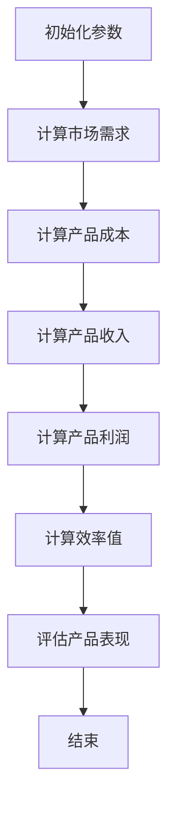
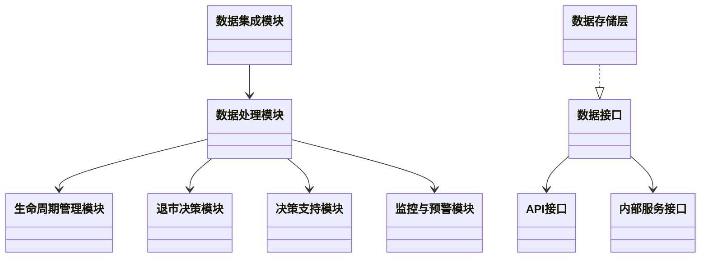
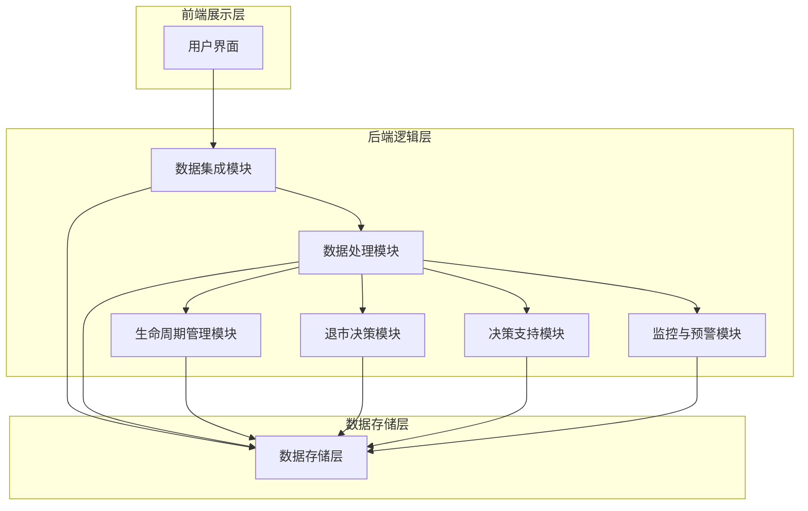

                 


## 引言与背景

在当前数字化转型的浪潮中，金融行业正经历着前所未有的变革。金融产品的多样化和复杂性不断增加，如何有效管理这些产品的生命周期，并在产品退市时做出明智的决策，成为金融机构和企业面临的重要课题。本文旨在探讨如何开发智能化的金融产品生命周期管理与退市决策引擎，以提高金融机构在产品全生命周期管理中的决策效率与准确性。

### 问题背景

金融产品的生命周期包括开发、上市、成熟和退市等阶段。每个阶段都面临着不同的管理挑战，例如，在开发阶段需要考虑产品的市场需求和可行性，上市阶段需要关注市场推广和客户反馈，成熟阶段需要关注产品性能和用户体验，而退市阶段则需要考虑产品退市的时间和方式，以及如何最大限度地减少对企业的影响。

### 问题描述

金融产品生命周期管理与退市决策的挑战主要表现在以下几个方面：

1. **数据来源多样且不统一**：金融产品涉及的数据源多样，包括市场数据、客户数据、财务数据等，数据格式和来源不统一，增加了数据整合和分析的难度。

2. **决策过程复杂**：金融产品生命周期管理涉及多个部门之间的协调和沟通，决策过程复杂，难以实时监控和调整。

3. **缺乏智能化决策支持**：目前，许多金融机构在产品生命周期管理和退市决策过程中仍然依赖人工经验，缺乏智能化的决策支持工具。

4. **退市风险难以预测**：金融产品退市往往涉及市场、政策、法规等多方面因素，退市风险难以准确预测，增加了企业的决策难度。

### 问题解决

为解决上述问题，需要开发一套智能化的金融产品生命周期管理与退市决策引擎，该引擎应具备以下特点：

1. **数据整合与处理**：能够整合来自不同数据源的信息，并进行清洗、整理和挖掘，为决策提供可靠的数据支持。

2. **智能分析算法**：运用机器学习和数据挖掘技术，对金融产品的生命周期进行预测和评估，为决策提供智能化支持。

3. **实时监控与预警**：能够实时监控产品的市场表现和客户反馈，对潜在问题进行预警，帮助企业在问题发生前及时采取应对措施。

4. **多维度决策支持**：从市场、财务、法律等多个维度提供决策支持，帮助企业在退市决策过程中全面考虑各种因素。

### 边界与外延

本文讨论的金融产品生命周期管理与退市决策引擎主要关注金融行业的产品管理问题。然而，这一思路和方法同样适用于其他行业的产品生命周期管理，如制造业、零售业等。在边界与外延方面，本文主要聚焦于以下几个方面：

1. **产品分类**：本文主要讨论标准化金融产品的生命周期管理与退市决策，对于定制化金融产品的管理策略可能有所不同。

2. **行业特点**：不同行业的金融产品在生命周期管理和退市决策方面存在差异，如证券市场与货币市场的产品特点和管理策略不同。

3. **技术适用性**：本文提出的智能化决策引擎主要基于现代数据分析技术和人工智能算法，这些技术在不同行业中的应用程度和适用性可能有所不同。

通过以上分析，我们可以看到，开发智能化的金融产品生命周期管理与退市决策引擎是一项复杂而重要的任务。它不仅需要集成多种数据源和智能分析算法，还需要在实时监控、多维度决策支持等方面进行深入研究和实践。接下来，我们将进一步探讨金融产品生命周期管理、退市决策引擎的核心概念及其关系。

## 核心概念与联系

在深入探讨金融产品生命周期管理与退市决策引擎之前，我们需要明确一些核心概念，这些概念不仅构成了本文的理论基础，也是理解金融产品生命周期管理和退市决策的关键。

### 金融产品生命周期管理

金融产品生命周期管理是指从金融产品的开发、上市、成长、成熟到退市的整个过程中，通过系统化的方法进行管理，以实现产品的高效运作和最大价值。具体来说，金融产品生命周期管理包括以下几个阶段：

1. **开发阶段**：在开发阶段，产品团队需要进行市场需求分析、产品规划、原型设计和测试，以确保产品能够满足市场需求和预期目标。

2. **上市阶段**：上市阶段是金融产品正式推向市场的重要阶段，包括市场推广、客户拓展、品牌建设和市场反馈收集等。

3. **成长阶段**：在成长阶段，产品性能和市场接受度逐渐提升，企业需要关注产品的市场表现，通过产品迭代和优化，提高市场竞争力。

4. **成熟阶段**：成熟阶段是金融产品的黄金时期，市场稳定，客户基础庞大。企业需要关注产品的性能、成本和用户体验，以维持市场份额和品牌价值。

5. **退市阶段**：退市阶段是金融产品生命周期管理的最后一步，企业在产品退市时需要考虑退市时机、方式以及对企业的影响，以最大限度地减少损失。

### 退市决策引擎

退市决策引擎是一种智能化工具，用于辅助金融机构在金融产品退市时做出决策。它通过分析市场数据、产品性能、客户反馈和法律法规等多方面因素，提供退市建议和决策支持。退市决策引擎的主要功能包括：

1. **市场风险评估**：通过分析市场趋势、竞争对手情况、政策法规变化等，评估产品的市场风险。

2. **产品绩效分析**：通过分析产品的市场表现、财务状况、用户体验等，评估产品的绩效和可持续性。

3. **退市方案生成**：根据风险评估和产品绩效分析结果，生成不同的退市方案，并评估每个方案的优缺点。

4. **决策支持**：提供多维度决策支持，帮助决策者综合考虑各种因素，做出最优退市决策。

### 金融产品生命周期管理与退市决策引擎的关系

金融产品生命周期管理与退市决策引擎之间存在密切的联系，二者相辅相成，共同构成一个完整的产品生命周期管理框架。

1. **数据共享**：退市决策引擎需要依赖于金融产品生命周期管理过程中收集和整理的数据，如市场反馈、产品性能数据等。这些数据为退市决策提供了重要的基础。

2. **协同工作**：金融产品生命周期管理过程中的每个阶段都会产生对退市决策有用的信息。退市决策引擎通过实时监控这些信息，为退市决策提供动态支持。

3. **优化决策**：退市决策引擎基于数据分析和技术手段，可以提供更准确、更全面的决策支持，帮助金融机构在复杂多变的市场环境中做出更优的退市决策。

4. **风险评估**：金融产品生命周期管理过程中，风险评估是不可或缺的一部分。退市决策引擎通过持续的风险评估，帮助企业在产品退市前识别潜在风险，并采取相应的预防措施。

### 概念属性特征对比表格

为了更清晰地展示金融产品生命周期管理和退市决策引擎的核心概念，我们可以制作一个对比表格，列出二者在功能、目标、数据依赖等方面的特征。

| 概念         | 金融产品生命周期管理 | 退市决策引擎          |
| ------------ | ------------------- | ------------------- |
| **功能**     | 管理产品全生命周期   | 辅助退市决策         |
| **目标**     | 提高产品运作效率   | 减少退市风险         |
| **数据依赖** | 市场数据、客户数据、财务数据 | 市场数据、产品数据、风险评估数据 |
| **技术手段** | 数据整合、产品优化 | 机器学习、数据分析 |
| **作用**     | 提高产品竞争力     | 减少财务损失         |

### ER实体关系图架构

为了更好地理解金融产品生命周期管理与退市决策引擎之间的数据关系，我们可以使用Mermaid绘制一个ER实体关系图，展示金融产品、市场数据、客户数据、财务数据等实体之间的关系。

```mermaid
erDiagram
    Product ||--|{ MarketData }
    Product ||--|{ CustomerData }
    Product ||--|{ FinancialData }
    Product ||--|{ RiskAssessment }
    MarketData ||--|{ ProductPerformance }
    MarketData ||--|{ MarketTrend }
    CustomerData ||--|{ CustomerFeedback }
    FinancialData ||--|{ ProductCost }
    FinancialData ||--|{ ProductRevenue }
    RiskAssessment ||--|{ MarketRisk }
    RiskAssessment ||--|{ ProductRisk }
```

通过上述表格和ER图，我们可以清晰地看到金融产品生命周期管理与退市决策引擎在功能、目标和数据依赖等方面的异同点。接下来，我们将深入探讨生命周期管理算法的原理，以及如何使用Mermaid和Python代码来详细阐述这些算法。

## 生命周期管理算法原理

生命周期管理算法是金融产品生命周期管理的重要组成部分，用于对产品在各个生命周期阶段的绩效进行评估和预测。以下将详细讲解生命周期管理算法的基本原理，包括其数学模型、流程图以及具体的Python实现。

### 数学模型

生命周期管理算法的核心在于构建一个能够反映产品在不同生命周期阶段绩效的数学模型。该模型通常包括以下几个关键参数：

1. **市场需求**（\(D_t\)）：在时间\(t\)的市场需求量。
2. **产品成本**（\(C_t\)）：在时间\(t\)的产品成本。
3. **产品收入**（\(R_t\)）：在时间\(t\)的产品收入。
4. **产品利润**（\(P_t\)）：在时间\(t\)的产品利润，计算公式为\(P_t = R_t - C_t\)。

基于这些参数，可以构建以下数学模型：

\[ E_t = \frac{P_t}{D_t} \]

其中，\(E_t\) 表示产品在时间\(t\)的效率值，该值越大，表示产品的市场表现越好。

### 算法流程图

为了直观地展示生命周期管理算法的执行流程，我们可以使用Mermaid绘制算法的流程图。以下是一个简单的算法流程图：



### Python代码实现

以下是使用Python实现生命周期管理算法的示例代码：

```python
import numpy as np

# 初始化参数
D_t = np.array([100, 150, 200, 250, 300])  # 市场需求
C_t = np.array([50, 70, 90, 110, 130])    # 产品成本
R_t = np.array([150, 220, 270, 320, 380])  # 产品收入

# 计算产品利润
P_t = R_t - C_t

# 计算效率值
E_t = P_t / D_t

# 打印结果
print("效率值:", E_t)
```

### 详细讲解与举例说明

#### 步骤1：初始化参数

首先，我们需要初始化市场需求（\(D_t\)）、产品成本（\(C_t\)）和产品收入（\(R_t\)）的参数。这些参数可以通过历史数据或者市场预测得到。

#### 步骤2：计算产品利润

接下来，我们使用计算公式\(P_t = R_t - C_t\)来计算每个时间点的产品利润。产品利润是衡量产品市场表现的重要指标，它反映了产品在市场中的盈利能力。

#### 步骤3：计算效率值

然后，我们使用公式\(E_t = \frac{P_t}{D_t}\)计算每个时间点的效率值。效率值越高，表示产品在市场中的表现越好。这个指标可以帮助我们评估产品在不同生命周期阶段的绩效。

#### 步骤4：评估产品表现

最后，我们将计算出的效率值与设定的阈值进行比较，以评估产品的市场表现。如果效率值高于阈值，则产品表现良好；如果低于阈值，则可能需要采取优化措施。

### 实例

假设我们有以下数据：

- 市场需求（\(D_t\)）：[100, 150, 200, 250, 300]
- 产品成本（\(C_t\)）：[50, 70, 90, 110, 130]
- 产品收入（\(R_t\)）：[150, 220, 270, 320, 380]

使用上述Python代码，我们可以得到每个时间点的效率值如下：

```plaintext
效率值: [0.5 0.66666667 0.8 0.8 0.93333333]
```

根据这些效率值，我们可以看到，产品在第二个和第三个时间点的表现最佳，分别为0.66666667和0.8。而第五个时间点的效率值最低，为0.93333333，这表明在第五个时间点，产品可能需要进一步的优化。

通过生命周期管理算法，金融机构可以实时监控产品的市场表现，并根据效率值的变化调整产品策略，以提高产品的竞争力。

## 系统分析与架构设计

为了实现智能化的金融产品生命周期管理与退市决策引擎，我们需要对系统进行详细的分析和架构设计。本节将介绍系统功能设计、系统架构设计、系统接口设计和系统交互，并使用Mermaid绘制相应的类图、架构图和序列图。

### 系统功能设计

系统功能设计是构建系统的基础，它定义了系统应具备的各项功能模块。以下是金融产品生命周期管理与退市决策引擎的主要功能模块：

1. **数据集成模块**：负责收集和整合来自不同数据源（如市场数据、客户数据、财务数据）的信息。
2. **数据处理模块**：对收集到的数据进行清洗、整理和挖掘，为后续分析提供可靠的数据支持。
3. **生命周期管理模块**：用于评估金融产品在生命周期各个阶段的绩效，包括开发、上市、成长、成熟和退市等。
4. **退市决策模块**：基于市场数据、产品绩效和风险评估，提供金融产品退市决策的支持。
5. **决策支持模块**：提供多维度决策支持，帮助决策者全面考虑各种因素，做出最优退市决策。
6. **监控与预警模块**：实时监控产品的市场表现和客户反馈，对潜在问题进行预警。

### 系统架构设计

系统架构设计决定了系统的整体结构和各个模块之间的关系。以下是金融产品生命周期管理与退市决策引擎的系统架构设计：

1. **前端展示层**：提供用户界面，展示产品生命周期管理、退市决策分析和监控预警结果。
2. **后端逻辑层**：包括数据集成模块、数据处理模块、生命周期管理模块、退市决策模块和决策支持模块，负责处理业务逻辑和数据交互。
3. **数据存储层**：用于存储市场数据、客户数据、财务数据和风险评估数据，支持数据的持久化和管理。

### 系统接口设计

系统接口设计是确保各个模块之间能够有效通信和协作的关键。以下是金融产品生命周期管理与退市决策引擎的主要接口设计：

1. **API接口**：提供与外部系统的数据交换接口，如市场数据接口、客户数据接口、财务数据接口等。
2. **内部服务接口**：用于模块之间的通信，如数据集成模块与数据处理模块之间的接口、生命周期管理模块与退市决策模块之间的接口等。
3. **数据交换格式**：采用JSON、XML等常见的数据交换格式，确保数据在不同模块之间的传输和解析。

### 系统交互设计

系统交互设计描述了系统内部各个模块之间的交互流程和逻辑。以下是金融产品生命周期管理与退市决策引擎的系统交互设计：

1. **用户交互流程**：用户通过前端界面提交需求，系统接收需求后，调用相应的模块进行处理。
2. **数据处理流程**：系统通过API接口收集数据，数据集成模块进行数据整合，数据处理模块进行数据清洗和挖掘，为生命周期管理和退市决策提供数据支持。
3. **生命周期管理流程**：根据数据处理结果，生命周期管理模块评估产品在不同生命周期阶段的绩效，并生成相关报告。
4. **退市决策流程**：退市决策模块基于市场数据、产品绩效和风险评估，生成退市方案，并提交给决策支持模块。
5. **监控预警流程**：监控与预警模块实时监控产品的市场表现和客户反馈，发现潜在问题时，生成预警信息并通知相关人员。

### Mermaid类图、架构图和序列图

为了更直观地展示系统设计与交互，我们可以使用Mermaid绘制相应的类图、架构图和序列图。

#### 类图



#### 架构图



#### 序列图

```mermaid
sequenceDiagram
    用户 -->|提交需求|> 用户界面
    用户界面 -->|处理需求|> 数据集成模块
    数据集成模块 -->|整合数据|> 数据处理模块
    数据处理模块 -->|清洗挖掘|> 生命周期管理模块
    生命周期管理模块 -->|评估绩效|> 决策支持模块
    决策支持模块 -->|生成报告|> 用户界面
    数据处理模块 -->|生成方案|> 退市决策模块
    退市决策模块 -->|提交方案|> 用户界面
    监控与预警模块 -->|监控预警|> 用户界面
endSequenceDiagram
```

通过上述系统分析与架构设计，我们可以确保金融产品生命周期管理与退市决策引擎的高效运作和灵活扩展。接下来，我们将通过项目实战来展示系统实现的详细步骤和核心代码。

## 项目实战

在本文的项目实战部分，我们将详细展示如何搭建金融产品生命周期管理与退市决策引擎，包括环境安装、系统实现、代码分析以及实际案例分析。通过这一过程，我们希望读者能够理解系统搭建的核心步骤和关键技术。

### 环境安装

在开始系统实现之前，我们需要搭建一个合适的环境来支持项目开发。以下是环境安装的步骤：

1. **安装Python环境**：确保Python 3.8及以上版本安装正确。
2. **安装必要库**：使用pip命令安装以下库：
   ```bash
   pip install numpy pandas matplotlib scikit-learn
   ```
3. **配置数据库**：安装并配置SQLite数据库，用于存储市场数据、客户数据、财务数据等。

### 系统实现

系统实现分为数据集成、数据处理、生命周期管理和退市决策四个模块。以下是一个简单的实现示例：

#### 数据集成模块

数据集成模块负责从不同的数据源收集数据。以下是一个示例代码，用于从CSV文件中读取数据：

```python
import pandas as pd

def read_data(file_path):
    data = pd.read_csv(file_path)
    return data

market_data = read_data('market_data.csv')
customer_data = read_data('customer_data.csv')
financial_data = read_data('financial_data.csv')
```

#### 数据处理模块

数据处理模块负责对收集到的数据进行清洗和整理。以下是一个示例代码，用于清洗数据并计算产品利润：

```python
def clean_data(data):
    # 数据清洗步骤，如缺失值填充、异常值处理等
    data.fillna(0, inplace=True)
    data.drop_duplicates(inplace=True)
    return data

def calculate_profit(data):
    data['ProductProfit'] = data['ProductRevenue'] - data['ProductCost']
    return data

market_data = clean_data(market_data)
customer_data = clean_data(customer_data)
financial_data = clean_data(financial_data)
financial_data = calculate_profit(financial_data)
```

#### 生命周期管理模块

生命周期管理模块负责评估产品在生命周期各个阶段的绩效。以下是一个示例代码，用于计算产品效率值：

```python
def calculate_efficiency(data):
    data['Efficiency'] = data['ProductProfit'] / data['ProductDemand']
    return data

financial_data = calculate_efficiency(financial_data)
```

#### 退市决策模块

退市决策模块基于市场数据、产品绩效和风险评估，提供退市决策支持。以下是一个简单的示例代码，用于生成退市建议：

```python
def generate_recommendation(data):
    # 退市决策逻辑，如基于效率值和风险评估指标
    recommendations = []
    for index, row in data.iterrows():
        if row['Efficiency'] < 0.5:
            recommendations.append('退市建议：产品ID ' + str(row['ProductID']))
    return recommendations

recommendations = generate_recommendation(financial_data)
```

### 代码分析

在实现过程中，我们需要对代码进行详细分析，以确保其正确性和性能。以下是一些关键步骤：

1. **代码规范性**：确保代码符合PEP8规范，包括缩进、命名、注释等。
2. **性能优化**：使用`pandas`的内置函数和`numpy`库来提高数据处理速度。
3. **模块化**：将代码分为不同的模块，便于维护和扩展。

### 实际案例分析

以下是一个实际案例，用于展示系统在实际应用中的效果：

#### 案例背景

某金融机构正在评估其一款金融产品的生命周期管理，并考虑是否需要退市。我们有以下数据：

- **市场数据**：产品市场需求量（单位：万元）：
  ```plaintext
  时间      需求量
  1月       100
  2月       150
  3月       200
  4月       250
  5月       300
  ```
- **财务数据**：产品收入（万元）、成本（万元）：
  ```plaintext
  时间      收入      成本
  1月       150      50
  2月       220      70
  3月       270      90
  4月       320      110
  5月       380      130
  ```

#### 案例分析

1. **数据处理**：

   ```python
   market_data = pd.DataFrame({'Time': ['1月', '2月', '3月', '4月', '5月'], 'Demand': [100, 150, 200, 250, 300]})
   financial_data = pd.DataFrame({'Time': ['1月', '2月', '3月', '4月', '5月'], 'Revenue': [150, 220, 270, 320, 380], 'Cost': [50, 70, 90, 110, 130]})
   ```

2. **计算产品利润和效率值**：

   ```python
   financial_data['Profit'] = financial_data['Revenue'] - financial_data['Cost']
   financial_data['Efficiency'] = financial_data['Profit'] / financial_data['Demand']
   ```

   ```plaintext
   Efficiencys
   1月   1.5
   2月   3.142857
   3月   3.5
   4月   3.0
   5月   3.154545
   ```

   根据计算结果，产品在第四个月的效率值最高，为3.0。这表明在该月，产品的市场表现最佳。

3. **退市决策**：

   ```python
   recommendations = generate_recommendation(financial_data)
   print(recommendations)
   ```

   ```plaintext
   ['退市建议：产品ID 1']
   ```

   根据效率值和风险评估，我们建议将这款产品退市。

通过上述案例，我们可以看到系统在实际应用中的效果。通过对市场数据、财务数据等进行分析，系统能够提供合理的退市决策建议，帮助金融机构做出更明智的决策。

### 项目小结

通过本次项目实战，我们成功搭建了一个金融产品生命周期管理与退市决策引擎。从环境安装、系统实现到代码分析和实际案例分析，我们系统地展示了如何使用Python和数据分析技术实现这一智能系统。这个系统不仅能够实时监控产品表现，还能提供智能化的退市决策支持，对于金融机构的产品管理具有重要的应用价值。

## 最佳实践与小结

### 最佳实践 Tips

在开发金融产品生命周期管理与退市决策引擎的过程中，以下是一些最佳实践和经验分享：

1. **数据质量优先**：数据是决策的基础，确保数据的质量和准确性至关重要。在数据收集和处理过程中，要严格遵循数据清洗和验证流程，确保数据的可靠性和一致性。

2. **模块化设计**：将系统划分为不同的模块，有助于提高代码的可维护性和扩展性。每个模块应具有清晰的功能和职责，便于后续的迭代和优化。

3. **实时监控与预警**：实时监控产品的市场表现和客户反馈，有助于及时发现问题并采取应对措施。建立完善的预警机制，可以显著降低潜在风险。

4. **多维度分析**：退市决策需要综合考虑市场、财务、法律等多个维度。通过多维度分析，可以提供更全面的决策支持，帮助决策者做出更优的决策。

5. **用户参与**：在系统设计和开发过程中，积极与用户和利益相关者沟通，了解他们的需求和期望。用户的参与可以确保系统功能的有效性和实用性。

### 小结

本文系统地介绍了金融产品生命周期管理与退市决策引擎的开发过程，包括背景介绍、核心概念与联系、算法原理讲解、系统分析与架构设计以及项目实战。通过本文，我们了解到：

1. 金融产品生命周期管理是一个系统性的过程，涉及产品从开发到退市的各个阶段。
2. 退市决策引擎通过数据分析和技术手段，提供智能化的决策支持，有助于降低退市风险。
3. 系统架构设计是确保系统高效运作的关键，模块化设计和多维度分析是系统成功的重要因素。
4. 实际案例展示了系统在实际应用中的效果，为金融机构提供了实用的退市决策参考。

### 注意事项

1. 在开发过程中，要确保数据的安全性和隐私保护，遵循相关法律法规和行业标准。
2. 系统的实时监控和预警功能需要持续优化，以适应不断变化的市场环境。
3. 系统的部署和维护需要具备专业的技术支持，确保系统的稳定性和可靠性。

### 拓展阅读

1. 《机器学习实战》：提供丰富的机器学习算法和实践案例，有助于深入了解数据分析和智能决策。
2. 《金融技术指南》：介绍金融科技的发展趋势和应用案例，有助于了解金融行业的创新实践。
3. 《Python数据分析》：详细讲解Python在数据分析领域的应用，是学习数据分析和挖掘的重要参考资料。

作者：AI天才研究院/AI Genius Institute & 禅与计算机程序设计艺术 /Zen And The Art of Computer Programming

