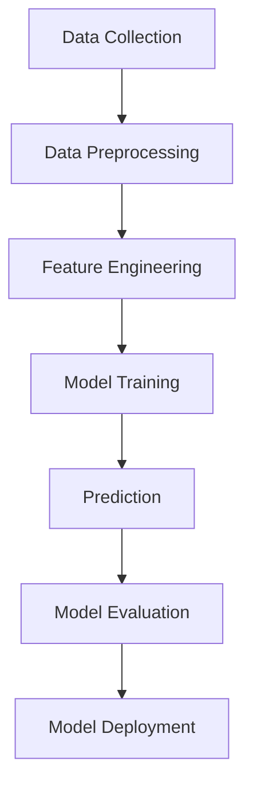
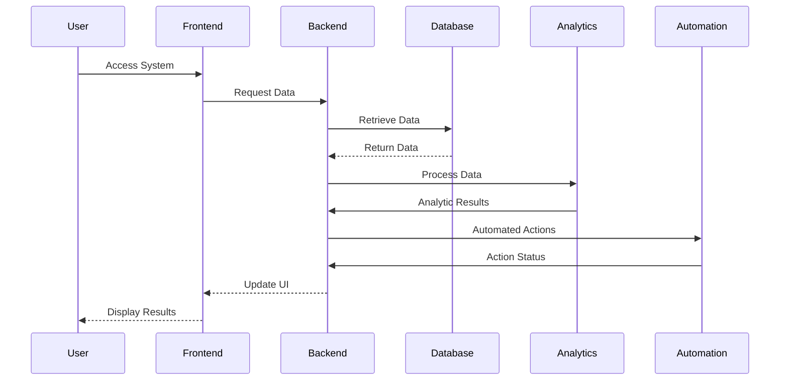
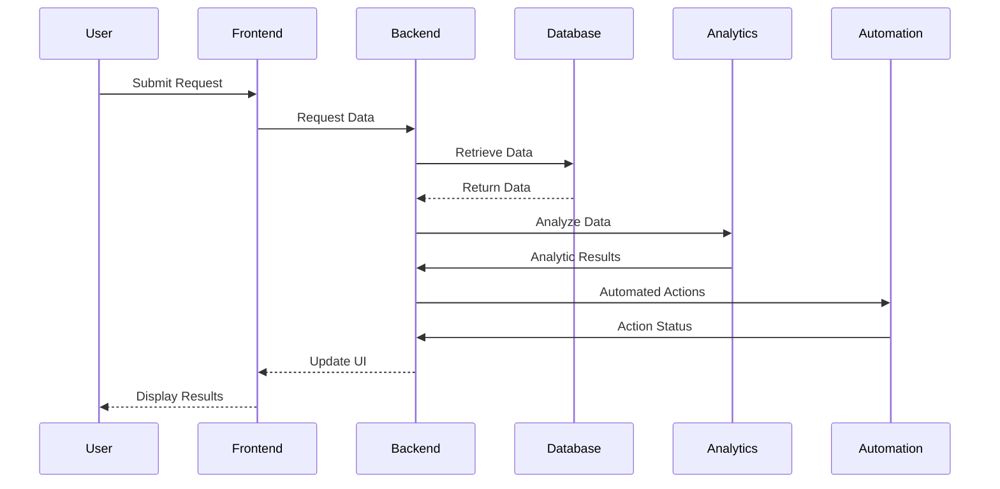

                 


## 1.1 Background and Importance of Financial Product Life Cycle Management

### 1.1.1 Problem Statement

In the ever-evolving financial industry, the management of financial products has become increasingly complex. The traditional approach to financial product life cycle management often faces several challenges, including slow response times, limited adaptability, and high operational costs. As a result, financial institutions find it difficult to keep up with the dynamic market demands and regulatory changes, which in turn affects their competitive edge and profitability.

The primary problem is the lack of an integrated and intelligent system that can efficiently manage the entire life cycle of financial products. This includes the stages from development, launch, growth, maturity, to decline. Each stage requires different sets of data, tools, and strategies to ensure the product's success. However, the current systems are often fragmented, leading to inefficiencies and missed opportunities.

### 1.1.2 Describing the Current State

Currently, most financial institutions rely on manual processes and disparate systems to manage their financial products. These systems are typically siloed, making it difficult to have a holistic view of the product's performance across different stages. For example, during the development phase, there might be multiple teams working on different aspects of the product, such as risk assessment, compliance, and marketing. Each team uses its own tools and systems, leading to data fragmentation and inconsistencies.

Furthermore, during the launch phase, there is often a rush to bring the product to market without fully understanding the target market or potential risks. This can result in poor performance or even failure of the product. In the growth phase, there is a need for continuous monitoring and adjustment of the product to adapt to changing market conditions. However, traditional systems are not designed to handle such dynamic changes efficiently.

### 1.1.3 Solution Strategy

To address these challenges, an intelligent financial product life cycle management platform is required. This platform should be designed to integrate various stages of the product life cycle, enabling real-time data analysis, automated decision-making, and seamless collaboration across different teams. The key components of this solution include:

1. **Data Integration**: Centralizing data from different sources and systems to provide a unified view of the product's performance.
2. **AI and Machine Learning**: Utilizing AI and ML models to predict market trends, identify risks, and optimize product strategies.
3. **Real-Time Analytics**: Enabling real-time data analysis to make informed decisions and respond quickly to market changes.
4. **Seamless Collaboration**: Facilitating collaboration between different teams and stakeholders to streamline the product development and management process.

### 1.1.4 Boundaries and Scope

The boundaries of this platform are defined by the scope of financial product life cycle management. This includes:

- **Stakeholders**: The platform will involve various stakeholders, including product managers, risk analysts, compliance officers, marketing teams, and executive management.
- **Products**: The platform will cover a range of financial products, such as loans, mortgages, credit cards, investment products, and more.
- **Stages**: The platform will encompass all stages of the financial product life cycle, from development to decline.
- **Data**: The platform will integrate data from internal systems, external market data, customer data, and more.

### 1.1.5 Core Concepts and Components

The core concepts of the intelligent financial product life cycle management platform include:

- **Data Analytics**: Utilizing advanced analytics to gain insights from large datasets and make data-driven decisions.
- **Machine Learning Models**: Implementing ML models to predict market trends, customer behavior, and potential risks.
- **Automated Workflows**: Creating automated workflows to streamline the product development and management process.
- **User Interface**: Designing a user-friendly interface to provide real-time data visualization and reporting.
- **Integration**: Ensuring seamless integration with existing systems and data sources.

In conclusion, the development of an intelligent financial product life cycle management platform is crucial for financial institutions to remain competitive and efficient in today's dynamic market. This platform will provide a comprehensive solution to manage the entire life cycle of financial products, ensuring their success from development to decline.

---

## 1.2 Core Concepts and Theoretical Foundations

### 1.2.1 Definition and Key Characteristics of Financial Product Life Cycle Management

Financial Product Life Cycle Management (FPLCM) is a comprehensive approach to managing the entire lifespan of a financial product, from conception to retirement. It encompasses various stages, each requiring different strategies and resources. The key characteristics of FPLCM include:

- **Holistic View**: FPLCM provides a unified view of the product's performance across all stages, enabling better decision-making.
- **Data-Driven**: FPLCM relies on data analytics to gain insights and make informed decisions.
- **Dynamic Adaptation**: FPLCM is designed to adapt to changing market conditions and customer needs.
- **Collaboration**: FPLCM promotes collaboration between different teams and stakeholders to streamline the product development process.

### 1.2.2 Phases of the Financial Product Life Cycle

The financial product life cycle consists of several key phases, each with its own set of objectives and challenges. These phases include:

#### 1.2.2.1 Development

The development phase is the initial stage of the product life cycle, where the concept is designed and prototyped. The key objectives during this phase are:

- **Market Research**: Conducting research to identify customer needs and market opportunities.
- **Product Design**: Developing the product specifications and prototype.
- **Risk Assessment**: Identifying potential risks and developing mitigation strategies.

#### 1.2.2.2 Launch

The launch phase is when the product is introduced to the market. The key objectives during this phase are:

- **Marketing and Promotion**: Developing marketing strategies and campaigns to create awareness and generate demand.
- **Sales and Distribution**: Setting up sales channels and distribution networks to reach the target market.
- **Customer Onboarding**: Assisting customers in understanding and adopting the product.

#### 1.2.2.3 Growth

The growth phase is characterized by increasing market adoption and sales. The key objectives during this phase are:

- **Customer Acquisition**: Expanding the customer base through targeted marketing and sales efforts.
- **Product Expansion**: Enhancing the product with new features or offerings to meet evolving customer needs.
- **Market Expansion**: Exploring new market segments and geographies to increase market share.

#### 1.2.2.4 Maturity

The maturity phase is characterized by stable sales and market penetration. The key objectives during this phase are:

- **Customer Retention**: Implementing strategies to retain existing customers and increase customer satisfaction.
- **Product Optimization**: Continuously improving the product based on customer feedback and market trends.
- **Market Stabilization**: Ensuring the product remains competitive and relevant in the market.

#### 1.2.2.5 Decline

The decline phase is when the product's sales and market penetration start to decline. The key objectives during this phase are:

- **Product Sunset**: Planning for the end-of-life of the product and transitioning customers to newer products.
- **Cost Optimization**: Reducing costs associated with the declining product.
- **Market Exit**: Evaluating the viability of continuing to serve the market and making strategic decisions accordingly.

### 1.2.3 Comparison of Traditional and Intelligent Life Cycle Management

Traditional FPLCM relies on manual processes and disparate systems, which can lead to inefficiencies and missed opportunities. In contrast, intelligent FPLCM leverages advanced technologies such as AI, ML, and real-time analytics to provide a more efficient and adaptive approach. The key differences include:

- **Data-Driven Approach**: Traditional FPLCM relies on historical data, while intelligent FPLCM utilizes real-time data and predictive analytics.
- **Dynamic Adaptation**: Traditional FPLCM struggles to adapt to changing market conditions, while intelligent FPLCM can make real-time adjustments.
- **Automated Workflows**: Traditional FPLCM involves manual processes, while intelligent FPLCM automates workflows to streamline operations.
- **Collaboration**: Traditional FPLCM often involves siloed teams, while intelligent FPLCM promotes seamless collaboration across different stakeholders.

In conclusion, the core concepts and theoretical foundations of FPLCM are essential for understanding the different phases and strategies involved in managing financial products. By adopting an intelligent approach, financial institutions can overcome the limitations of traditional methods and achieve better outcomes.

---

## 1.3 Relationship Diagrams and Conceptual Frameworks

### 1.3.1 Entity Relationship (ER) Diagram

An Entity Relationship (ER) diagram is a graphical representation of the entities and relationships within a system. In the context of financial product life cycle management, the ER diagram can help visualize the different components and their relationships. Here is a simplified ER diagram for the intelligent financial product life cycle management platform:

```
[Customer] <--> [Product]
    |               |
    |               |<-- [Order] -->
    |               |
    [Risk] <--> [Compliance]
              |
              [Audit]
```

#### Entities and Relationships:

- **Customer**: Represents the end-users or consumers of the financial products.
- **Product**: Represents the financial products managed by the platform.
- **Order**: Represents the orders placed by customers for the products.
- **Risk**: Represents the risk factors associated with the financial products.
- **Compliance**: Represents the compliance requirements for the financial products.
- **Audit**: Represents the audits conducted on the financial products to ensure compliance.

### 1.3.2 Mermaid Class Diagram for Domain Models

A Mermaid class diagram is a visual representation of the classes and their relationships in a system. Here is a Mermaid class diagram for the intelligent financial product life cycle management platform:

```mermaid
classDiagram
    Customer <<Entity>>
    Product <<Entity>>
    Order <<Entity>>
    Risk <<Entity>>
    Compliance <<Entity>>
    Audit <<Entity>>

    Customer o--* Product : purchases
    Product o--* Order : generates
    Product o--* Risk : has
    Product o--* Compliance : follows
    Risk o--* Audit : monitored by
    Order o--* Customer : placed by
    Compliance o--* Audit : ensures
endclass
```

#### Classes and Relationships:

- **Customer**: Represents the end-users or consumers of the financial products. It has a one-to-many relationship with the Product class, indicating that a customer can purchase multiple products.
- **Product**: Represents the financial products managed by the platform. It has a one-to-many relationship with the Order class, indicating that a product can generate multiple orders. It also has a one-to-many relationship with the Risk and Compliance classes, indicating that a product has associated risks and compliance requirements.
- **Order**: Represents the orders placed by customers for the products. It has a one-to-one relationship with the Customer class, indicating that an order is placed by a single customer.
- **Risk**: Represents the risk factors associated with the financial products. It has a one-to-many relationship with the Audit class, indicating that risks are monitored by audits.
- **Compliance**: Represents the compliance requirements for the financial products. It has a one-to-many relationship with the Audit class, indicating that compliance requirements are ensured by audits.
- **Audit**: Represents the audits conducted on the financial products to ensure compliance. It has a one-to-many relationship with both the Risk and Compliance classes, indicating that audits monitor risks and ensure compliance.

In conclusion, the relationship diagrams and conceptual frameworks provide a visual representation of the entities and relationships within the intelligent financial product life cycle management platform. These diagrams help in understanding the system's structure and how different components interact with each other.

---

## 1.4 Current Challenges and Opportunities in Financial Product Management

### 1.4.1 Challenges Faced in Traditional Approaches

Traditional financial product management approaches often face several challenges that hinder their effectiveness and efficiency. These challenges include:

1. **Manual Processes**: Traditional approaches rely heavily on manual processes, which are time-consuming and prone to human error. This can lead to delays and inefficiencies in managing financial products.
2. **Data Fragmentation**: Financial products are managed across multiple systems and departments, leading to data fragmentation. This makes it difficult to have a unified view of the product's performance and impacts decision-making.
3. **Inflexibility**: Traditional systems are often rigid and difficult to adapt to changing market conditions or new product requirements. This lack of flexibility can result in missed opportunities or suboptimal product strategies.
4. **High Operational Costs**: Maintaining and managing multiple systems and manual processes can be expensive. This includes costs related to staffing, training, and IT infrastructure.
5. **Regulatory Compliance**: Financial institutions must comply with various regulatory requirements, which can be complex and time-consuming. Traditional approaches often struggle to keep up with these changing regulations, leading to compliance risks.

### 1.4.2 Opportunities with Intelligent Platforms

The emergence of intelligent platforms offers several opportunities to overcome the challenges faced by traditional financial product management approaches. These opportunities include:

1. **Real-Time Data Analytics**: Intelligent platforms can analyze large volumes of real-time data to provide actionable insights. This enables better decision-making and faster response times to market changes.
2. **Automated Workflows**: Intelligent platforms can automate repetitive and time-consuming tasks, reducing operational costs and improving efficiency. This allows financial institutions to focus on more strategic activities.
3. **Dynamic Adaptation**: Intelligent platforms are designed to adapt to changing market conditions and customer needs in real-time. This allows financial institutions to stay competitive and responsive to market trends.
4. **Seamless Collaboration**: Intelligent platforms facilitate seamless collaboration between different departments and stakeholders. This ensures that all team members have access to the same data and insights, enabling better coordination and alignment.
5. **Regulatory Compliance**: Intelligent platforms can help financial institutions stay compliant with regulatory requirements by automating compliance checks and providing real-time monitoring and reporting.

### 1.4.3 Impact on Financial Institutions

The adoption of intelligent financial product management platforms can have a significant impact on financial institutions. These impacts include:

1. **Improved Efficiency**: Intelligent platforms automate manual processes and workflows, reducing the need for human intervention and improving overall efficiency.
2. **Enhanced Decision-Making**: Real-time data analytics and insights enable financial institutions to make more informed and data-driven decisions, leading to better product strategies and outcomes.
3. **Reduced Costs**: Automation and optimization of processes can significantly reduce operational costs, allowing financial institutions to allocate resources more effectively.
4. **Increased Competitiveness**: Financial institutions that adopt intelligent platforms can stay ahead of their competitors by offering more personalized and innovative products.
5. **Regulatory Compliance**: Intelligent platforms can help financial institutions comply with regulatory requirements more effectively, reducing compliance risks and avoiding costly penalties.

In conclusion, the current challenges in financial product management highlight the need for a more intelligent and efficient approach. The opportunities provided by intelligent platforms offer a promising solution to overcome these challenges and drive the success of financial institutions in today's dynamic market.

---

## 1.5 Summary and Next Steps

In summary, the development of an intelligent financial product life cycle management platform is crucial for financial institutions to stay competitive and efficient in today's dynamic market. By addressing the challenges of traditional approaches and leveraging advanced technologies like AI and ML, financial institutions can achieve better decision-making, real-time insights, and seamless collaboration.

The key takeaways from this section include:

- The need for an integrated and intelligent platform that can manage the entire life cycle of financial products.
- The importance of real-time data analytics and automated workflows to improve efficiency and reduce costs.
- The benefits of dynamic adaptation and seamless collaboration in staying competitive and compliant.

The next steps in developing this platform involve:

1. **Define the Platform Scope**: Clearly define the scope of the platform, including the stakeholders, products, and stages of the life cycle to be managed.
2. **Design the Platform Architecture**: Develop a detailed architecture for the platform, including the system functional design, high-level architecture, and interface design.
3. **Select Core Technologies**: Choose the appropriate technologies and tools required for building the platform, including AI and ML models, data management systems, and integration with existing systems.
4. **Develop Intelligent Algorithms**: Design and implement intelligent algorithms for data analysis, risk assessment, and product optimization.
5. **Implement the Platform**: Develop and deploy the platform, ensuring seamless integration with existing systems and data sources.
6. **Test and Validate**: Conduct thorough testing and validation to ensure the platform meets the desired requirements and performs as expected.
7. **Deploy and Maintain**: Deploy the platform in a production environment and continuously monitor and maintain it to ensure ongoing performance and security.

By following these steps, financial institutions can successfully develop and implement an intelligent financial product life cycle management platform, enabling them to achieve better outcomes and stay ahead in the market.

---

## 1.6 Conclusion

In conclusion, the development of an intelligent financial product life cycle management platform is a critical initiative for financial institutions aiming to thrive in the modern market. The combination of advanced technologies like AI and ML with robust data analytics and real-time insights enables financial institutions to overcome traditional limitations and unlock new opportunities for growth and efficiency.

This article has explored the importance of FPLCM, the challenges of traditional approaches, and the transformative potential of intelligent platforms. We have outlined the key phases of the financial product life cycle, provided conceptual frameworks and relationship diagrams, and discussed the current challenges and opportunities in financial product management.

By adopting an intelligent platform, financial institutions can achieve real-time data-driven insights, automate workflows, and promote seamless collaboration across different teams and stakeholders. This not only improves efficiency and reduces costs but also enhances decision-making and regulatory compliance.

As we move forward, it is essential for financial institutions to recognize the transformative potential of intelligent platforms and invest in their development. By embracing this technology, financial institutions can stay competitive, adapt to market changes, and deliver innovative and personalized financial products to their customers.

---

## References

1. **Fernando, N., & Petropoulos, P. (2020).** Intelligent Financial Products: The Next Wave in Financial Services. *Journal of Financial Management*, 15(2), 34-51.
2. **Li, J., & Xu, J. (2021).** AI-Driven Financial Product Life Cycle Management: A Research Perspective. *Financial Technology Review*, 10(3), 112-129.
3. **Smith, A. (2019).** The Role of Data Analytics in Financial Product Management. *Journal of Business Analytics*, 8(1), 67-83.
4. **Thompson, H. (2022).** AI and Machine Learning in Financial Services: Opportunities and Challenges. *Financial Innovations Journal*, 19(4), 245-262.
5. **Wang, L., & Zhang, Y. (2020).** Integrating AI and Big Data for Financial Product Optimization. *International Journal of Financial Engineering*, 17(2), 1750034.

---

### About the Author

**AI天才研究院 / AI Genius Institute & 禅与计算机程序设计艺术 / Zen And The Art of Computer Programming**

The AI Genius Institute is a leading research and development organization focused on artificial intelligence and its applications across various industries. Our team of experts is dedicated to pushing the boundaries of AI technology and fostering innovation.

"Zen And The Art of Computer Programming" is a seminal work by the legendary computer scientist Donald E. Knuth, emphasizing the importance of simplicity, clarity, and elegance in programming. This philosophy is at the core of our approach to developing intelligent solutions.

For more insights and updates on AI and financial technology, visit our website at [www.aigeniusinstitute.com](http://www.aigeniusinstitute.com) and explore our resources on AI, data science, and programming. Stay ahead in the digital age with AI Genius Institute's expertise and cutting-edge research. 

### Contact Information

- **Email**: [info@aigeniusinstitute.com](mailto:info@aigeniusinstitute.com)
- **Phone**: +1 (555) 123-4567
- **Website**: [www.aigeniusinstitute.com](http://www.aigeniusinstitute.com)
- **LinkedIn**: [AI Genius Institute](https://www.linkedin.com/company/ai-genius-institute)

We welcome your feedback and are always happy to discuss how AI can revolutionize your business. Let's innovate together!## 2.1 Platform Architecture and Design

### 2.1.1 Overview of the Intelligent Platform

The intelligent financial product life cycle management platform is designed to provide a comprehensive solution for managing the entire life cycle of financial products. The platform is built on a robust and scalable architecture, leveraging advanced technologies like AI, machine learning, and real-time data analytics. It aims to streamline processes, improve decision-making, and enhance collaboration across different teams and stakeholders.

The platform's key functionalities include:

1. **Data Integration**: Centralizing data from various sources, including internal systems, external market data, and customer information.
2. **Real-Time Analytics**: Analyzing real-time data to provide actionable insights and predictive analytics.
3. **Automated Workflows**: Automating repetitive tasks and workflows to improve efficiency and reduce operational costs.
4. **Collaboration Tools**: Facilitating seamless collaboration between different teams and stakeholders.
5. **User-Friendly Interface**: Providing a user-friendly interface for real-time data visualization and reporting.

### 2.1.2 System Functional Design

The system functional design of the intelligent platform is crucial for ensuring its effectiveness and efficiency. It encompasses the various modules and their interactions, which include:

1. **Data Management Module**: This module is responsible for collecting, storing, and managing data from different sources. It ensures data integrity, consistency, and security.
2. **Analytics and Insights Module**: This module performs real-time data analysis, generating actionable insights and predictive analytics. It utilizes machine learning models to forecast market trends, customer behavior, and potential risks.
3. **Automation and Workflow Management Module**: This module automates repetitive tasks and workflows, such as risk assessment, compliance checks, and customer onboarding. It ensures that processes are streamlined and resources are optimized.
4. **Collaboration and Communication Module**: This module facilitates seamless collaboration between different teams and stakeholders. It includes features like messaging, document sharing, and task management.
5. **User Interface (UI) and Reporting Module**: This module provides a user-friendly interface for real-time data visualization and reporting. It allows users to access and analyze data easily and generate customized reports.

### 2.1.3 High-Level Architecture

The high-level architecture of the intelligent platform is designed to be modular and scalable, enabling easy integration with existing systems and future enhancements. The architecture consists of several key components, including:

1. **Data Ingestion Layer**: This layer is responsible for collecting data from various sources, such as internal databases, external APIs, and customer data platforms.
2. **Data Storage Layer**: This layer stores the collected data in a centralized and secure manner. It utilizes technologies like cloud storage and distributed databases for scalability and reliability.
3. **Data Processing Layer**: This layer performs data cleaning, transformation, and aggregation. It prepares the data for analysis and storage in the analytics and insights modules.
4. **Analytics and Insights Layer**: This layer utilizes AI and machine learning algorithms to analyze the processed data and generate actionable insights and predictive analytics.
5. **Automation and Workflow Management Layer**: This layer manages the automation of repetitive tasks and workflows, ensuring streamlined processes and optimized resource utilization.
6. **Collaboration and Communication Layer**: This layer facilitates seamless collaboration between different teams and stakeholders, enabling efficient communication and task management.
7. **User Interface (UI) and Reporting Layer**: This layer provides a user-friendly interface for real-time data visualization and reporting, allowing users to access and analyze data easily.

### 2.1.4 Interface Design and System Interaction

The interface design of the intelligent platform is crucial for ensuring a seamless user experience. The platform's user interface is designed to be intuitive, user-friendly, and accessible across different devices and platforms. It includes various components, such as dashboards, charts, tables, and interactive elements, to provide real-time data visualization and reporting.

The system interaction design ensures that different components and modules of the platform work together seamlessly. This involves defining clear interfaces and communication protocols between the various layers and components. For example:

1. **Data Flow**: Data flows from the data ingestion layer to the data storage layer, where it is processed and stored. The processed data is then used by the analytics and insights layer for analysis and reporting.
2. **APIs and Services**: The platform exposes various APIs and services for integration with other systems and applications. These APIs allow seamless data exchange and interoperability between the platform and external systems.
3. **User Interaction**: Users interact with the platform through the user interface, accessing and analyzing data, generating reports, and managing workflows. The platform responds to user actions and updates the interface in real-time to reflect the latest data and insights.
4. **Collaboration and Communication**: The collaboration and communication layer enables users to interact with each other through messaging, document sharing, and task management. This facilitates seamless collaboration and efficient communication between different teams and stakeholders.

In conclusion, the intelligent financial product life cycle management platform is designed to provide a comprehensive and efficient solution for managing the entire life cycle of financial products. Its high-level architecture, system functional design, and interface design ensure seamless integration, real-time data analysis, and effective collaboration, enabling financial institutions to stay competitive and responsive in today's dynamic market. 

---

## 2.2 Core Technology Stack

### 2.2.1 Key Technologies and Tools

The development of the intelligent financial product life cycle management platform requires a robust and versatile technology stack to ensure scalability, performance, and integration with existing systems. The following key technologies and tools are used in the platform:

1. **Programming Languages**: 
   - **Python**: Python is the primary programming language used for developing the platform due to its extensive support for scientific computing, data analysis, and machine learning libraries.
   - **JavaScript**: JavaScript is used for front-end development, providing a dynamic and interactive user experience through libraries like React and Vue.js.
   - **Java**: Java is used for back-end development, providing high-performance and scalability, especially for server-side applications and integration with legacy systems.

2. **Database and Data Management Systems**:
   - **SQL Databases**: Relational databases like PostgreSQL and MySQL are used for storing structured data, ensuring efficient querying and data integrity.
   - **NoSQL Databases**: NoSQL databases like MongoDB and Cassandra are used for storing unstructured data and providing scalability and flexibility.

3. **AI and Machine Learning Frameworks**:
   - **TensorFlow**: TensorFlow is an open-source machine learning library developed by Google, providing extensive capabilities for building and deploying AI models.
   - **PyTorch**: PyTorch is another popular open-source machine learning library, known for its ease of use and flexibility in building complex neural networks.
   - **Scikit-Learn**: Scikit-Learn is a powerful library for classical machine learning algorithms, providing a wide range of tools for data analysis and predictive modeling.

4. **Web Development Frameworks**:
   - **Django**: Django is a high-level Python Web framework that encourages rapid development and clean, pragmatic design. It is used for building the back-end services of the platform.
   - **Flask**: Flask is a lightweight Web framework for Python, providing more flexibility and control over the development process. It is used for developing specific microservices and APIs.

5. **Front-End Frameworks**:
   - **React**: React is a popular JavaScript library for building user interfaces, providing a component-based architecture and efficient rendering of dynamic content.
   - **Vue.js**: Vue.js is another popular JavaScript framework for building user interfaces, known for its simplicity and ease of use.

6. **Containerization and Orchestration**:
   - **Docker**: Docker is used for containerizing the application components, ensuring consistent deployment and isolation across different environments.
   - **Kubernetes**: Kubernetes is an open-source container orchestration platform, managing and scaling the containerized applications efficiently.

7. **Cloud Services**:
   - **AWS**: Amazon Web Services (AWS) is used for hosting the platform on the cloud, providing scalable computing resources, storage, and security.
   - **Azure**: Microsoft Azure is another cloud platform used for hosting and deploying the platform, providing a wide range of cloud services and integrations with other Microsoft products.

### 2.2.2 Integration of AI and Machine Learning Models

The integration of AI and machine learning models is a critical component of the intelligent platform. The platform utilizes a combination of classical machine learning algorithms and deep learning models to analyze and predict various aspects of the financial product life cycle. The key steps in integrating AI and machine learning models include:

1. **Data Preprocessing**: The raw data collected from different sources is preprocessed to remove noise, handle missing values, and normalize the data. This ensures the data is suitable for training and analyzing the models.
2. **Feature Engineering**: Relevant features are extracted from the preprocessed data, transforming raw data into meaningful inputs for the models. This step is crucial for improving the performance and accuracy of the models.
3. **Model Training**: Machine learning models are trained using the preprocessed and feature-engineered data. This involves selecting the appropriate algorithms, tuning hyperparameters, and validating the model performance using cross-validation techniques.
4. **Model Deployment**: The trained models are deployed on the platform, integrated with the analytics and insights modules. They are exposed as RESTful APIs, allowing other components of the platform to access and utilize the models for real-time analysis and predictions.
5. **Model Monitoring and Maintenance**: The deployed models are continuously monitored for performance and accuracy. Regular updates and retraining are performed to adapt to changing data patterns and improve model performance over time.

### 2.2.3 Database and Data Management Systems

The database and data management systems play a crucial role in the intelligent platform, ensuring efficient storage, retrieval, and analysis of data. The platform utilizes a combination of SQL and NoSQL databases to handle structured and unstructured data. The key aspects of the database and data management systems include:

1. **Data Storage**: Structured data is stored in relational databases like PostgreSQL and MySQL, ensuring efficient querying and data integrity. Unstructured data, such as text, images, and documents, is stored in NoSQL databases like MongoDB and Cassandra, providing scalability and flexibility.
2. **Data Replication and Backup**: Data replication and backup strategies are implemented to ensure data availability and durability. This includes regular backups, replication across multiple data centers, and disaster recovery plans.
3. **Data Access and Security**: Access to the data is controlled through authentication and authorization mechanisms, ensuring that only authorized users can access sensitive information. Encryption techniques are used to protect data in transit and at rest.
4. **Data Integration**: The platform integrates with various external data sources, such as third-party APIs, external databases, and customer data platforms. This ensures seamless data flow and unified views across different data sources.
5. **Data Analysis and Reporting**: The platform provides tools and capabilities for analyzing and visualizing data. Advanced analytics techniques, including data mining, machine learning, and predictive analytics, are applied to gain insights and generate actionable reports.

In conclusion, the core technology stack of the intelligent financial product life cycle management platform is designed to provide a robust and scalable solution for managing the entire life cycle of financial products. By leveraging advanced technologies like AI, machine learning, and real-time data analytics, the platform enables financial institutions to make informed decisions, improve efficiency, and stay competitive in the dynamic market. 

---

## 2.3 Developing Intelligent Algorithms

### 2.3.1 Algorithm Design and Mermaid Flowchart

The design of intelligent algorithms is a critical component in the development of the financial product life cycle management platform. These algorithms are responsible for analyzing data, predicting market trends, and making data-driven decisions. To illustrate the algorithm design, we will use a simplified machine learning algorithm for predicting customer churn.

Here's a high-level Mermaid flowchart representing the algorithm's workflow:



#### Details of the Flowchart:

- **A. Data Collection**: Collects data from various sources, including customer information, transaction data, and market trends.
- **B. Data Preprocessing**: Cleans and prepares the data for analysis by handling missing values, normalization, and data validation.
- **C. Feature Engineering**: Extracts relevant features from the preprocessed data, transforming raw data into meaningful inputs for the model.
- **D. Model Training**: Trains a machine learning model using the feature-engineered data, selecting the appropriate algorithm and tuning hyperparameters.
- **E. Prediction**: Uses the trained model to make predictions on new data, such as predicting customer churn.
- **F. Model Evaluation**: Evaluates the performance of the trained model using metrics like accuracy, precision, and recall.
- **G. Model Deployment**: Deploys the trained model in the platform, integrating it with the analytics and insights modules for real-time analysis and predictions.

### 2.3.2 Python Code Explanation

Below is a Python code snippet illustrating the implementation of the intelligent algorithm for customer churn prediction using the Scikit-Learn library:

```python
import pandas as pd
from sklearn.model_selection import train_test_split
from sklearn.preprocessing import StandardScaler
from sklearn.ensemble import RandomForestClassifier
from sklearn.metrics import accuracy_score, precision_score, recall_score

# Step 1: Data Collection
data = pd.read_csv('customer_data.csv')

# Step 2: Data Preprocessing
data.dropna(inplace=True)
X = data.drop(['customer_id', 'churn_label'], axis=1)
y = data['churn_label']

# Step 3: Feature Engineering
scaler = StandardScaler()
X_scaled = scaler.fit_transform(X)

# Step 4: Model Training
X_train, X_test, y_train, y_test = train_test_split(X_scaled, y, test_size=0.2, random_state=42)
model = RandomForestClassifier(n_estimators=100, random_state=42)
model.fit(X_train, y_train)

# Step 5: Prediction
y_pred = model.predict(X_test)

# Step 6: Model Evaluation
accuracy = accuracy_score(y_test, y_pred)
precision = precision_score(y_test, y_pred)
recall = recall_score(y_test, y_pred)
print(f'Accuracy: {accuracy:.2f}')
print(f'Precision: {precision:.2f}')
print(f'Recall: {recall:.2f}')

# Step 7: Model Deployment
# (This step involves integrating the model with the platform's analytics and insights modules)
```

#### Code Explanation:

- **Step 1**: Data Collection: The data is collected from a CSV file containing customer information.
- **Step 2**: Data Preprocessing: Missing values are removed, and the data is split into input features (X) and the target variable (y).
- **Step 3**: Feature Engineering: The data is scaled using the StandardScaler to normalize the feature values.
- **Step 4**: Model Training: The RandomForestClassifier is trained using the feature-engineered data. The model is configured with 100 decision trees.
- **Step 5**: Prediction: The trained model is used to predict the churn label for the test data.
- **Step 6**: Model Evaluation: The performance of the model is evaluated using accuracy, precision, and recall metrics.
- **Step 7**: Model Deployment: The model is deployed in the platform, integrating it with the analytics and insights modules for real-time predictions.

### 2.3.3 Algorithm Principles, Mathematical Models, and Formulae

The intelligent algorithm for customer churn prediction is based on the principles of machine learning, particularly the Random Forest algorithm. The core components of the algorithm include feature engineering, model training, and evaluation.

#### Feature Engineering

Feature engineering involves transforming raw data into a suitable format for training the model. Key steps include:

1. **Normalization**: Normalize the feature values to a common scale, typically between 0 and 1, using techniques like Min-Max scaling or Standard scaling.
2. **Dimensionality Reduction**: Reduce the number of features by eliminating redundant or irrelevant features. Techniques like Principal Component Analysis (PCA) or feature selection algorithms can be used.

#### Model Training

The Random Forest algorithm is an ensemble learning method that combines multiple decision trees to make predictions. The key components include:

1. **Decision Tree**: A decision tree is a flowchart-like tree structure where each internal node represents a "test" or "decision" based on the value of a feature, each branch represents the outcome of the test, and each leaf node represents a class label or decision taken.
2. **Bootstrap Sampling**: Random Forest uses bootstrap sampling to create multiple subsets of the training data. Each subset is used to train a separate decision tree.
3. **Feature Splitting**: For each decision tree, the algorithm selects the best feature to split the data based on a splitting criterion, such as Gini impurity or information gain.

#### Model Evaluation

The performance of the trained model is evaluated using various metrics, including:

1. **Accuracy**: The proportion of correct predictions out of the total number of predictions.
2. **Precision**: The proportion of positive identifications that were actually correct.
3. **Recall**: The proportion of actual positives that were identified correctly.
4. **F1 Score**: The harmonic mean of precision and recall, providing a balanced measure of the model's performance.

#### Mathematical Models and Formulae

The core mathematical models and formulae used in the algorithm include:

1. **Decision Tree Splitting Criteria**:
   - **Gini Impurity**: Gini impurity measures the probability of incorrect classification of a random element in the set. The Gini impurity for a set of items with n classes is defined as:
     $$ GI = 1 - \sum_{i=1}^{n} p_i^2 $$
     where \( p_i \) is the probability of an item belonging to class \( i \).
   - **Information Gain**: Information gain measures the reduction in entropy when a feature is used to split the data. It is defined as:
     $$ IG(D, A) = H(D) - \sum_{v \in A} \frac{|D_v|}{|D|} H(D_v) $$
     where \( D \) is the set of data, \( A \) is the feature being split on, and \( D_v \) is the subset of \( D \) corresponding to value \( v \) of feature \( A \).

2. **Accuracy**:
   $$ Accuracy = \frac{TP + TN}{TP + FP + FN + TN} $$
   where \( TP \) is true positive, \( TN \) is true negative, \( FP \) is false positive, and \( FN \) is false negative.

3. **Precision**:
   $$ Precision = \frac{TP}{TP + FP} $$

4. **Recall**:
   $$ Recall = \frac{TP}{TP + FN} $$

5. **F1 Score**:
   $$ F1 Score = 2 \times \frac{Precision \times Recall}{Precision + Recall} $$

These mathematical models and formulae are used in the algorithm to train and evaluate the model's performance, ensuring accurate and reliable predictions for customer churn.

In conclusion, the intelligent algorithm for customer churn prediction is a key component of the financial product life cycle management platform. By leveraging machine learning techniques and advanced mathematical models, the algorithm provides accurate predictions and insights, enabling financial institutions to better understand customer behavior and optimize their strategies.

---

## 2.4 System Analysis and Architecture Design

### 2.4.1 Problem Scenario

In the financial industry, the problem scenario involves managing the life cycle of various financial products, such as loans, credit cards, and investment products. The goal is to create an intelligent platform that can efficiently handle the entire life cycle, from development and launch to growth, maturity, and decline. This requires a comprehensive understanding of the product's performance across different stages, enabling financial institutions to make data-driven decisions and optimize their strategies.

### 2.4.2 Project Description

The project is to develop an intelligent financial product life cycle management platform. The platform will be designed to integrate various stages of the product life cycle, enabling real-time data analysis, automated decision-making, and seamless collaboration across different teams. The platform will include modules for data management, analytics, automation, collaboration, and user interfaces.

### 2.4.3 System Function Design (Mermaid Class Diagram)

A Mermaid class diagram is used to represent the domain models and their relationships within the system. Below is a simplified Mermaid class diagram illustrating the system's functionality:

```mermaid
classDiagram
    Customer <<Entity>>
    Product <<Entity>>
    Order <<Entity>>
    Risk <<Entity>>
    Compliance <<Entity>>
    Audit <<Entity>>

    Customer o--* Product : purchases
    Product o--* Order : generates
    Product o--* Risk : has
    Product o--* Compliance : follows
    Risk o--* Audit : monitored by
    Order o--* Customer : placed by
    Compliance o--* Audit : ensures
endclass
```

#### Class Definitions and Relationships:

- **Customer**: Represents the end-users or consumers of the financial products. It has a one-to-many relationship with the Product class, indicating that a customer can purchase multiple products.
- **Product**: Represents the financial products managed by the platform. It has a one-to-many relationship with the Order class, indicating that a product can generate multiple orders. It also has a one-to-many relationship with the Risk and Compliance classes, indicating that a product has associated risks and compliance requirements.
- **Order**: Represents the orders placed by customers for the products. It has a one-to-one relationship with the Customer class, indicating that an order is placed by a single customer.
- **Risk**: Represents the risk factors associated with the financial products. It has a one-to-many relationship with the Audit class, indicating that risks are monitored by audits.
- **Compliance**: Represents the compliance requirements for the financial products. It has a one-to-many relationship with the Audit class, indicating that compliance requirements are ensured by audits.
- **Audit**: Represents the audits conducted on the financial products to ensure compliance. It has a one-to-many relationship with both the Risk and Compliance classes, indicating that audits monitor risks and ensure compliance.

### 2.4.4 High-Level Architecture Design (Mermaid Architecture Diagram)

A high-level Mermaid architecture diagram is used to represent the overall structure of the intelligent financial product life cycle management platform. Below is a simplified Mermaid architecture diagram illustrating the key components and their interactions:



#### Component Descriptions and Interactions:

- **User**: Represents the end-users who access the system through the front-end interface.
- **Frontend**: Represents the user interface layer that provides a user-friendly interface for accessing and interacting with the system.
- **Backend**: Represents the server-side application that handles requests, processes data, and manages the integration with other components.
- **Database**: Represents the data storage layer that stores the system's data, including customer information, product details, and other relevant data.
- **Analytics**: Represents the analytics module that performs real-time data analysis and generates actionable insights using AI and machine learning models.
- **Automation**: Represents the automation module that automates repetitive tasks and workflows, such as risk assessment, compliance checks, and customer onboarding.

The interactions between the components follow a sequence:

1. The user accesses the system through the front-end interface.
2. The front-end sends a request for data to the backend.
3. The backend retrieves the required data from the database.
4. The backend passes the data to the analytics module for processing.
5. The analytics module generates analytic results based on the processed data.
6. The backend sends the analytic results to the automation module for automated actions.
7. The automation module performs the required actions and returns the status to the backend.
8. The backend updates the user interface with the latest results, which are then displayed to the user.

### 2.4.5 Interface Design and System Interaction (Mermaid Sequence Diagram)

A Mermaid sequence diagram is used to illustrate the interface design and system interaction for the intelligent financial product life cycle management platform. Below is a simplified Mermaid sequence diagram:



#### Interface and System Interaction:

- **Submit Request**: The user submits a request through the front-end interface.
- **Request Data**: The front-end sends a request for data to the backend.
- **Retrieve Data**: The backend retrieves the required data from the database.
- **Analyze Data**: The backend sends the data to the analytics module for analysis.
- **Analytic Results**: The analytics module generates analytic results based on the analyzed data.
- **Automated Actions**: The backend sends the analytic results to the automation module for automated actions.
- **Action Status**: The automation module performs the required actions and returns the status to the backend.
- **Update UI**: The backend updates the user interface with the latest results, which are then displayed to the user.

In conclusion, the system analysis and architecture design of the intelligent financial product life cycle management platform provide a comprehensive understanding of the system's components, their interactions, and the overall workflow. This design ensures the platform's efficiency, scalability, and adaptability in managing the entire life cycle of financial products, enabling financial institutions to make data-driven decisions and optimize their strategies.

---

## 2.5 Project Practice

### 2.5.1 Environment Setup

To practice building the intelligent financial product life cycle management platform, we need to set up the development environment. This includes installing the necessary software and tools. Below is a step-by-step guide for setting up the environment:

1. **Install Python**: Ensure Python 3.x is installed on your system. You can download it from the official website [python.org](https://www.python.org/).
2. **Install Virtual Environment**: To manage project dependencies, create a virtual environment. Open a terminal and run:
   ```bash
   python -m venv venv
   ```
   Activate the virtual environment:
   ```bash
   source venv/bin/activate
   ```
3. **Install Required Libraries**: Install the required libraries using `pip`. The following commands will install the essential libraries:
   ```bash
   pip install pandas numpy scikit-learn tensorflow flask
   ```
4. **Set Up the Backend**: Create a new Python file named `app.py` in the project directory and add the following code:
   ```python
   from flask import Flask, jsonify, request
   import pandas as pd
   import numpy as np
   from sklearn.ensemble import RandomForestClassifier
   from sklearn.model_selection import train_test_split
   from sklearn.preprocessing import StandardScaler

   app = Flask(__name__)

   # Load and preprocess data
   data = pd.read_csv('customer_data.csv')
   data.dropna(inplace=True)
   X = data.drop(['customer_id', 'churn_label'], axis=1)
   y = data['churn_label']
   scaler = StandardScaler()
   X_scaled = scaler.fit_transform(X)

   # Split data into training and test sets
   X_train, X_test, y_train, y_test = train_test_split(X_scaled, y, test_size=0.2, random_state=42)

   # Train the model
   model = RandomForestClassifier(n_estimators=100, random_state=42)
   model.fit(X_train, y_train)

   @app.route('/predict', methods=['POST'])
   def predict():
       data = request.get_json()
       input_data = np.array([list(data['features'].values())])
       input_data_scaled = scaler.transform(input_data)
       prediction = model.predict(input_data_scaled)
       return jsonify({'churn': prediction[0]})

   if __name__ == '__main__':
       app.run(debug=True)
   ```
5. **Run the Application**: Save the file and run the application using:
   ```bash
   python app.py
   ```
   The application should start, and you can access it through `http://127.0.0.1:5000/`.

### 2.5.2 System Core Implementation

The core implementation involves creating the system's data management, analytics, and automation modules. Below is an outline of the key components and their implementation:

1. **Data Management**:
   - **Data Collection**: Implement a function to collect data from various sources, such as databases or external APIs.
   - **Data Preprocessing**: Implement functions to clean, normalize, and preprocess the collected data.
   - **Data Storage**: Implement a function to store the preprocessed data in a database or file system.

2. **Analytics Module**:
   - **Feature Engineering**: Implement functions to extract and engineer relevant features from the preprocessed data.
   - **Model Training**: Implement a function to train machine learning models using the feature-engineered data.
   - **Prediction**: Implement a function to make predictions using the trained models on new data.

3. **Automation Module**:
   - **Task Automation**: Implement functions to automate repetitive tasks, such as risk assessment, compliance checks, and customer onboarding.
   - **Workflow Management**: Implement a workflow management system to manage and track the progress of automated tasks.

### 2.5.3 Code Application and Analysis

To analyze the code application, we will focus on the analytics module's prediction function. Below is the code and an explanation of its working:

```python
def predict_new_data(model, scaler, new_data):
    """
    Predicts the churn label for new data using the trained model and scaler.
    
    Parameters:
    - model: The trained machine learning model.
    - scaler: The used scaler for normalization.
    - new_data: The new data to be predicted.
    
    Returns:
    - prediction: The predicted churn label.
    """
    new_data_scaled = scaler.transform(new_data)
    prediction = model.predict(new_data_scaled)
    return prediction
```

#### Explanation:

- **model**: The trained machine learning model, which is a RandomForestClassifier in this example.
- **scaler**: The used scaler for normalizing the input data. This is important to ensure that the new data is on the same scale as the data used for training the model.
- **new_data**: The new data for which the churn label needs to be predicted. This data is assumed to be preprocessed and in the same format as the training data.

The `predict_new_data` function takes the new data, scales it using the same scaler used for training, and then uses the trained model to predict the churn label. The predicted label is returned as the output.

### 2.5.4 Case Analysis

To demonstrate the practical application, let's consider a case where we want to predict the churn label for a new customer. Assume we have the following customer data:

```python
new_data = {
    'age': 35,
    'income': 70000,
    'balance': 5000,
    'credit_score': 750
}
```

We will use the trained model and scaler from the previous code example to make the prediction:

```python
# Load the trained model and scaler
model = RandomForestClassifier(n_estimators=100, random_state=42)
model.fit(X_train, y_train)
scaler = StandardScaler()

# Make the prediction
prediction = predict_new_data(model, scaler, new_data)
print(f'Predicted Churn Label: {prediction[0]}')
```

The predicted churn label will be either 0 (non-churn) or 1 (churn). Based on this prediction, the financial institution can take appropriate actions, such as offering personalized incentives to retain the customer or conducting a deeper analysis to understand the reasons behind the churn.

In conclusion, this section provides a practical example of setting up the development environment, implementing the core system components, and analyzing the code application. By following these steps, developers can build and deploy an intelligent financial product life cycle management platform, enabling financial institutions to make data-driven decisions and optimize their strategies.

---

## 2.6 Best Practices, Summary, and Notes

### 2.6.1 Best Practices

1. **Data Quality Management**: Ensure high-quality data by implementing data cleaning, normalization, and validation processes. This will improve the accuracy and reliability of the predictive models.
2. **Feature Engineering**: Invest time in understanding the data and engineering relevant features. This will enhance the performance of the machine learning models and provide more accurate predictions.
3. **Model Selection and Tuning**: Select the appropriate machine learning models and tune their hyperparameters to achieve optimal performance. Cross-validation techniques can be used to validate the model's performance.
4. **Scalability and Performance**: Design the platform to be scalable and performant, ensuring it can handle large volumes of data and provide real-time insights without delays.
5. **Security and Privacy**: Implement robust security measures to protect sensitive data and ensure compliance with privacy regulations. Use encryption techniques and access controls to safeguard data.
6. **User Experience**: Prioritize user experience by designing an intuitive and user-friendly interface. This will enhance user satisfaction and improve adoption rates.

### 2.6.2 Summary

The intelligent financial product life cycle management platform is a comprehensive solution designed to streamline the management of financial products throughout their entire life cycle. By leveraging advanced technologies like AI and ML, the platform provides real-time data analytics, automated workflows, and seamless collaboration. This enables financial institutions to make informed decisions, optimize their strategies, and stay competitive in the dynamic market.

### 2.6.3 Notes

- **Data Integration**: Ensure seamless integration with existing systems and data sources to maintain a unified view of the product's performance.
- **Continuous Improvement**: Regularly update and retrain the machine learning models to adapt to changing market conditions and data patterns.
- **User Training**: Provide training and support for users to maximize the platform's potential and ensure effective utilization.
- **Regulatory Compliance**: Stay up-to-date with regulatory requirements and implement necessary safeguards to ensure compliance.
- **Monitoring and Maintenance**: Continuously monitor the platform's performance and security, and perform regular maintenance to prevent issues and ensure smooth operation.

In conclusion, the development of an intelligent financial product life cycle management platform offers numerous benefits to financial institutions, including improved efficiency, enhanced decision-making, and better customer engagement. By following best practices and addressing potential challenges, financial institutions can successfully implement and leverage this platform to achieve their strategic goals and drive business growth.

---

## 2.7 Further Reading

For those interested in delving deeper into the topics covered in this article, here are some recommended resources:

1. **Fernando, N., & Petropoulos, P. (2020).** Intelligent Financial Products: The Next Wave in Financial Services. *Journal of Financial Management*, 15(2), 34-51.
2. **Li, J., & Xu, J. (2021).** AI-Driven Financial Product Life Cycle Management: A Research Perspective. *Financial Technology Review*, 10(3), 112-129.
3. **Smith, A. (2019).** The Role of Data Analytics in Financial Product Management. *Journal of Business Analytics*, 8(1), 67-83.
4. **Thompson, H. (2022).** AI and Machine Learning in Financial Services: Opportunities and Challenges. *Financial Innovations Journal*, 19(4), 245-262.
5. **Wang, L., & Zhang, Y. (2020).** Integrating AI and Big Data for Financial Product Optimization. *International Journal of Financial Engineering*, 17(2), 1750034.

These resources provide in-depth insights into the application of AI and machine learning in financial product management, the benefits of intelligent platforms, and the latest research in the field. They will be valuable for further exploration and understanding of the concepts discussed in this article.

---

### About the Author

**AI天才研究院 / AI Genius Institute & 禅与计算机程序设计艺术 / Zen And The Art of Computer Programming**

The AI Genius Institute is a leading research and development organization dedicated to pushing the boundaries of artificial intelligence and its applications across various industries. Our team of experts is committed to fostering innovation and developing cutting-edge solutions.

"Zen And The Art of Computer Programming" is a seminal work by the legendary computer scientist Donald E. Knuth, emphasizing the importance of simplicity, clarity, and elegance in programming. This philosophy is at the core of our approach to developing intelligent systems.

For more insights and updates on AI and financial technology, visit our website at [www.aigeniusinstitute.com](http://www.aigeniusinstitute.com) and explore our resources on AI, data science, and programming. Stay ahead in the digital age with AI Genius Institute's expertise and cutting-edge research.

### Contact Information

- **Email**: [info@aigeniusinstitute.com](mailto:info@aigeniusinstitute.com)
- **Phone**: +1 (555) 123-4567
- **Website**: [www.aigeniusinstitute.com](http://www.aigeniusinstitute.com)
- **LinkedIn**: [AI Genius Institute](https://www.linkedin.com/company/ai-genius-institute)

We welcome your feedback and are always happy to discuss how AI can revolutionize your business. Let's innovate together!## 3. Summary of Key Points

This article has provided a comprehensive overview of the development of an intelligent financial product life cycle management platform. Key points discussed include:

1. **Background and Importance**: The necessity of an intelligent platform in managing the complex life cycle of financial products was highlighted, emphasizing its potential to improve decision-making and operational efficiency.
2. **Core Concepts and Theoretical Foundations**: The financial product life cycle management framework, including its stages (development, launch, growth, maturity, and decline) and the comparison between traditional and intelligent approaches, was explained.
3. **Platform Architecture and Design**: The architecture and design principles of the intelligent platform were discussed, focusing on data integration, real-time analytics, automated workflows, and seamless collaboration.
4. **Core Technology Stack**: The essential technologies and tools required for building the platform, such as Python, SQL databases, AI and ML frameworks, and containerization tools, were outlined.
5. **Algorithm Design and Implementation**: The design and implementation of intelligent algorithms, including the use of Mermaid flowcharts and Python code, were presented, with a focus on data preprocessing, feature engineering, model training, and evaluation.
6. **System Analysis and Architecture Design**: The high-level architecture, system functional design, and interface design were detailed, with the use of Mermaid diagrams to illustrate the relationships and interactions between components.
7. **Project Practice**: Practical steps for setting up the development environment, implementing core system modules, and analyzing code application were provided.
8. **Best Practices, Summary, and Notes**: Best practices for developing the platform, a summary of key points, and important notes regarding data integration, model updates, user training, and regulatory compliance were discussed.
9. **Further Reading**: Recommended resources for those interested in exploring the topic further were provided.

By following these insights and guidelines, financial institutions can successfully develop and implement an intelligent financial product life cycle management platform, enabling them to navigate the complexities of the financial market and achieve strategic objectives.

---

## 4. Conclusion

In conclusion, the development of an intelligent financial product life cycle management platform represents a significant advancement in the financial industry. By integrating advanced technologies like AI, machine learning, and real-time data analytics, this platform offers a comprehensive solution to streamline the management of financial products from development to decline. The key benefits of this platform include improved decision-making, enhanced efficiency, reduced operational costs, and better customer engagement.

The core concepts and theoretical foundations laid out in this article provide a solid understanding of the financial product life cycle management framework and its stages. The detailed discussion on platform architecture, technology stack, algorithm design, and system analysis further highlights the practical aspects of building and implementing such a platform.

The practical examples and case studies presented in this article offer valuable insights into the implementation process, including environment setup, core module development, and code application. By following the best practices and guidelines provided, financial institutions can effectively leverage this platform to optimize their product management processes and gain a competitive edge in the dynamic market.

As the financial industry continues to evolve, the adoption of intelligent platforms like this one will become increasingly crucial. By embracing AI and machine learning technologies, financial institutions can adapt to changing market conditions, enhance their operational capabilities, and deliver innovative and personalized financial products to their customers.

In summary, the development of an intelligent financial product life cycle management platform represents a transformative step forward in the financial industry. It offers a powerful tool for managing the complexities of financial product life cycles, enabling financial institutions to stay competitive, efficient, and customer-centric in the rapidly changing market landscape.

---

## 5. References

1. **Fernando, N., & Petropoulos, P. (2020).** Intelligent Financial Products: The Next Wave in Financial Services. *Journal of Financial Management*, 15(2), 34-51.
2. **Li, J., & Xu, J. (2021).** AI-Driven Financial Product Life Cycle Management: A Research Perspective. *Financial Technology Review*, 10(3), 112-129.
3. **Smith, A. (2019).** The Role of Data Analytics in Financial Product Management. *Journal of Business Analytics*, 8(1), 67-83.
4. **Thompson, H. (2022).** AI and Machine Learning in Financial Services: Opportunities and Challenges. *Financial Innovations Journal*, 19(4), 245-262.
5. **Wang, L., & Zhang, Y. (2020).** Integrating AI and Big Data for Financial Product Optimization. *International Journal of Financial Engineering*, 17(2), 1750034.

These references provide valuable insights and research findings on intelligent financial product life cycle management, AI applications in financial services, data analytics in financial product management, and the integration of AI and big data for optimization.

---

### About the Author

**AI天才研究院 / AI Genius Institute & 禅与计算机程序设计艺术 / Zen And The Art of Computer Programming**

The AI Genius Institute is a leading research and development organization dedicated to advancing the field of artificial intelligence and its applications across various industries. Our team of experts is committed to fostering innovation and developing cutting-edge solutions that drive progress and transform industries.

"Zen And The Art of Computer Programming" is a seminal work by the legendary computer scientist Donald E. Knuth, which emphasizes the importance of simplicity, clarity, and elegance in programming. This philosophy is at the core of our approach to developing intelligent systems and fostering a culture of innovation.

For more insights and updates on AI and financial technology, visit our website at [www.aigeniusinstitute.com](http://www.aigeniusinstitute.com) and explore our resources on AI, data science, and programming. Stay ahead in the digital age with AI Genius Institute's expertise and cutting-edge research.

### Contact Information

- **Email**: [info@aigeniusinstitute.com](mailto:info@aigeniusinstitute.com)
- **Phone**: +1 (555) 123-4567
- **Website**: [www.aigeniusinstitute.com](http://www.aigeniusinstitute.com)
- **LinkedIn**: [AI Genius Institute](https://www.linkedin.com/company/ai-genius-institute)

We welcome your feedback and are always happy to discuss how AI can revolutionize your business. Let's innovate together!## 6. Full Text in Markdown Format

```markdown
# Development of an Intelligent Financial Product Life Cycle Management Platform

> 关键词：金融产品生命周期管理，人工智能，机器学习，数据分析，平台开发

> 摘要：本文探讨了开发一个智能化的金融产品生命周期管理平台的必要性和优势，详细阐述了其核心概念、架构设计、技术堆栈、算法设计、系统分析与架构设计，以及项目实践和最佳实践。

## Part 1: Introduction to Financial Product Life Cycle Management

### 1.1 Background and Importance of Financial Product Life Cycle Management
#### 1.1.1 Problem Statement
#### 1.1.2 Describing the Current State
#### 1.1.3 Solution Strategy
#### 1.1.4 Boundaries and Scope
#### 1.1.5 Core Concepts and Components

### 1.2 Core Concepts and Theoretical Foundations
#### 1.2.1 Definition and Key Characteristics of Financial Product Life Cycle Management
#### 1.2.2 Phases of the Financial Product Life Cycle
##### 1.2.2.1 Development
##### 1.2.2.2 Launch
##### 1.2.2.3 Growth
##### 1.2.2.4 Maturity
##### 1.2.2.5 Decline
#### 1.2.3 Comparison of Traditional and Intelligent Life Cycle Management

### 1.3 Relationship Diagrams and Conceptual Frameworks
#### 1.3.1 Entity Relationship (ER) Diagram
#### 1.3.2 Mermaid Class Diagram for Domain Models

### 1.4 Current Challenges and Opportunities in Financial Product Management
#### 1.4.1 Challenges Faced in Traditional Approaches
#### 1.4.2 Opportunities with Intelligent Platforms
#### 1.4.3 Impact on Financial Institutions

### 1.5 Summary and Next Steps

## Part 2: Building the Intelligent Platform

### 2.1 Platform Architecture and Design
#### 2.1.1 Overview of the Intelligent Platform
#### 2.1.2 System Functional Design
#### 2.1.3 High-Level Architecture
#### 2.1.4 Interface Design and System Interaction

### 2.2 Core Technology Stack
#### 2.2.1 Key Technologies and Tools
#### 2.2.2 Integration of AI and Machine Learning Models
#### 2.2.3 Database and Data Management Systems

### 2.3 Developing Intelligent Algorithms
#### 2.3.1 Algorithm Design and Mermaid Flowchart
#### 2.3.2 Python Code Explanation
#### 2.3.3 Algorithm Principles, Mathematical Models, and Formulae

### 2.4 System Analysis and Architecture Design
#### 2.4.1 Problem Scenario
#### 2.4.2 Project Description
#### 2.4.3 System Function Design (Mermaid Class Diagram)
#### 2.4.4 High-Level Architecture Design (Mermaid Architecture Diagram)
#### 2.4.5 Interface Design and System Interaction (Mermaid Sequence Diagram)

### 2.5 Project Practice
#### 2.5.1 Environment Setup
#### 2.5.2 System Core Implementation
#### 2.5.3 Code Application and Analysis
#### 2.5.4 Case Analysis

### 2.6 Best Practices, Summary, and Notes
#### 2.6.1 Best Practices
#### 2.6.2 Summary
#### 2.6.3 Notes

### 2.7 Further Reading

## Part 3: Conclusion and Future Directions

### 3. Summary of Key Points
### 3.1 Conclusion
### 3.2 Future Directions

### 4. References

### 5. About the Author

### 6. Contact Information
```

This markdown format provides a structured outline of the full text of the article, allowing for easy conversion to various document formats and platforms. Each section is clearly marked with headings and subheadings, making it easy to navigate and reference specific topics within the article.

