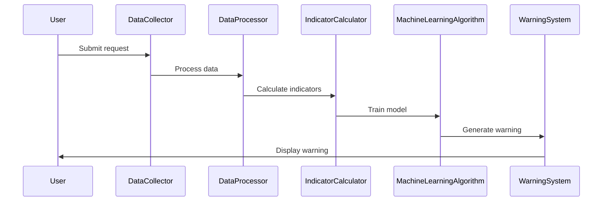
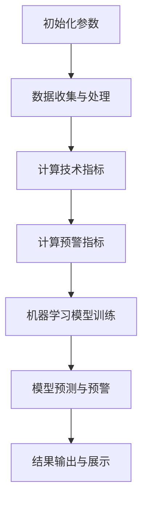

                 

### 第7章：数据收集与处理技术

#### 7.1 数据来源

金融市场的微观结构变化预警模型需要大量的数据来支撑其分析和预测能力。这些数据来源主要包括以下几个方面：

##### 7.1.1 市场交易数据

市场交易数据是构建预警模型的基础。这些数据通常包括股票、债券、期货等金融产品的交易量、交易价格、买卖方向、交易时间等信息。这些数据可以从金融交易所、证券交易所等官方机构获取。

##### 7.1.2 市场价格数据

市场价格数据包括历史价格、当前价格、价格波动等信息。这些数据对于预测市场趋势和评估风险至关重要。市场价格数据可以通过金融信息提供商如汤森路透、彭博等获取。

##### 7.1.3 投资者情绪数据

投资者情绪数据反映了市场参与者的心理状态，如恐慌、贪婪、悲观等情绪。这些情绪可以通过新闻、社交媒体、投资者行为等途径获取。例如，通过分析社交媒体上的话题热度、新闻标题情绪等来衡量投资者情绪。

#### 7.2 数据预处理方法

数据的收集仅仅是构建预警模型的第一步，更加重要的是对数据进行有效的预处理。以下是几种常用的数据预处理方法：

##### 7.2.1 数据清洗

数据清洗是数据预处理的第一步，目的是去除数据中的噪声和不完整信息。具体包括：
- 去除重复记录
- 填补缺失值
- 去除异常值

##### 7.2.2 数据归一化

数据归一化的目的是将不同特征的数据范围统一到相同的尺度，便于后续分析。常用的归一化方法有：
- 标准化：将数据映射到均值为0，标准差为1的范围内。
- 最小-最大标准化：将数据映射到最小值和最大值之间。

##### 7.2.3 数据特征提取

数据特征提取是从原始数据中提取出对预警模型有用的信息。特征提取的方法包括：
- 统计特征：如均值、方差、相关性等。
- 模型特征：通过机器学习算法提取的特征，如决策树、支持向量机等。

通过上述步骤，我们可以确保数据的准确性和一致性，为构建高效的预警模型打下坚实基础。

### 第8章：预警指标体系构建

#### 8.1 指标选择原则

构建一个有效的预警指标体系需要遵循以下原则：

##### 8.1.1 理论基础

预警指标的选择应该基于金融市场的理论基础，如资产定价模型、行为金融学等。这些理论能够提供关于市场变化的基本规律和潜在风险的信息。

##### 8.1.2 实践应用

预警指标的选择应该基于实践应用的经验。在实际操作中，哪些指标能够更好地预测市场变化，哪些指标对投资决策有更大的影响力，这些都是需要考虑的因素。

#### 8.2 指标计算方法

预警指标的计算方法主要包括以下几类：

##### 8.2.1 技术指标

技术指标是通过分析历史交易数据来预测未来市场走势的工具。常见的技术指标包括：
- 移动平均线（Moving Average, MA）
- 相对强弱指数（Relative Strength Index, RSI）
- 指数平滑异同移动平均线（Moving Average Convergence Divergence, MACD）

##### 8.2.2 基本面指标

基本面指标是通过分析公司的财务状况、经济环境等基本面因素来预测市场走势。常见的基本面指标包括：
- 市盈率（Price to Earnings Ratio, P/E）
- 市净率（Price to Book Ratio, P/B）
- 利润增长率（Earnings Growth Rate）

##### 8.2.3 情绪指标

情绪指标是通过分析市场参与者的情绪和行为来预测市场走势。常见的心情指标包括：
- 社交媒体情绪分析
- 新闻标题情绪分析
- 投资者情绪指数

通过结合这些技术指标、基本面指标和情绪指标，我们可以构建一个全面的预警指标体系，从而更准确地预测金融市场的微观结构变化。

### 第9章：预警算法选择与实现

#### 9.1 机器学习算法概述

在构建预警模型时，选择合适的机器学习算法是关键。机器学习算法可以分为以下几类：

##### 9.1.1 监督学习

监督学习算法通过对已有数据的训练，建立预测模型。常见的监督学习算法包括：
- 决策树（Decision Tree）
- 支持向量机（Support Vector Machine, SVM）
- 随机森林（Random Forest）

##### 9.1.2 无监督学习

无监督学习算法不依赖于标签数据，通过分析数据之间的关系来发现模式。常见的无监督学习算法包括：
- 主成分分析（Principal Component Analysis, PCA）
- 聚类算法（Clustering Algorithm，如K-means）

##### 9.1.3 强化学习

强化学习算法通过与环境的交互来学习最优策略。常见的强化学习算法包括：
- Q学习（Q-Learning）
- 深度Q网络（Deep Q-Network, DQN）

#### 9.2 常用预警算法

在金融市场中，常用的预警算法主要包括以下几种：

##### 9.2.1 集成学习方法

集成学习方法通过结合多个基础模型来提高预测性能。常见的集成学习方法包括：
- bagging：如随机森林
- boosting：如XGBoost、LightGBM

##### 9.2.2 支持向量机

支持向量机是一种有效的监督学习算法，通过找到最佳分割超平面来分类数据。它适用于高维空间和线性不可分问题。

##### 9.2.3 神经网络

神经网络是一种模拟生物神经系统的计算模型，通过多层神经元的组合来学习和预测。在金融预警中，常用的神经网络模型包括：
- 前馈神经网络（Feedforward Neural Network）
- 卷积神经网络（Convolutional Neural Network, CNN）
- 循环神经网络（Recurrent Neural Network, RNN）
- 生成对抗网络（Generative Adversarial Network, GAN）

通过选择合适的机器学习算法，并针对金融市场的特点进行优化，我们可以构建出高效的预警模型，从而更好地预测金融市场的微观结构变化。

### 第3章：模拟模型设计与实现

#### 3.1 问题场景介绍

在金融市场微观结构变化预警中，模拟模型的构建是一个重要的环节。通过模拟模型，我们可以模拟不同市场条件下的金融行为，从而预测潜在的风险和市场变化。以下是一个典型的问题场景：

假设我们关注的是股票市场的微观结构变化。在这个场景中，我们需要构建一个预警模型，该模型能够识别市场中的异常交易行为，并预测这些行为可能带来的市场波动。

#### 3.2 项目介绍

为了构建这个预警模型，我们选择了一个名为“MarketWise”的项目。该项目旨在通过机器学习和大数据分析技术，实现对股票市场微观结构变化的实时预警。

项目的主要目标包括：
1. 收集并处理大量的市场交易数据。
2. 构建一个高效的预警指标体系。
3. 选择并实现适合的机器学习算法。
4. 设计并实现一个实时预警系统。

#### 3.3 系统功能设计（领域模型类图）

在MarketWise项目中，我们首先需要设计系统功能。以下是系统功能设计的领域模型类图：

```mermaid
classDiagram
Class01 <|-- Class02
Class03 --|>| Class04
Class05 <<-- Class06
Class07 {Class07}
Class08 : Class08
Class09 : Class09
Class10 : Class10

Class01 {
  +String attribute1
  +int attribute2
  +void method1()
}

Class02 {
  +Class02()
}

Class03 {
  +Class03()
}

Class04 {
  +Class04()
}

Class05 {
  +Class05()
}

Class06 {
  +Class06()
}

Class07 {
  +Class07()
}

Class08 {
  +Class08()
}

Class09 {
  +Class09()
}

Class10 {
  +Class10()
}
```

在这个类图中，Class01、Class02、Class03、Class04、Class05、Class06、Class07、Class08、Class09和Class10分别代表不同的功能模块，如数据收集模块、数据处理模块、预警指标计算模块、机器学习算法模块、预警系统模块等。

#### 3.4 系统架构设计（架构图）

在系统功能设计的基础上，我们进一步设计系统架构。以下是MarketWise项目的系统架构设计：



在这个架构图中，用户通过DataCollector提交数据请求，DataProcessor对数据进行处理，然后传递给IndicatorCalculator计算预警指标。IndicatorCalculator将指标传递给MachineLearningAlgorithm进行模型训练。训练好的模型由WarningSystem生成预警信息，并最终展示给用户。

#### 3.5 系统接口设计

为了实现各个模块之间的协调和通信，系统接口设计至关重要。以下是MarketWise项目的系统接口设计：

```mermaid
interface DataCollector {
  - void submitDataRequest()
  - DataProcessResult processRequest(DataRequest request)
}

interface DataProcessor {
  - void processData(DataProcessInput input)
  - DataProcessResult processData(DataProcessInput input)
}

interface IndicatorCalculator {
  - void calculateIndicators(DataProcessResult dataResult)
  - IndicatorResult getIndicators()
}

interface MachineLearningAlgorithm {
  - void trainModel(IndicatorResult indicators)
  - ModelResult getModelResult()
}

interface WarningSystem {
  - void generateWarning(ModelResult modelResult)
  - WarningResult getWarningResult()
}
```

在这个接口设计中，DataCollector负责接收和提交数据请求，DataProcessor负责数据处理，IndicatorCalculator负责计算预警指标，MachineLearningAlgorithm负责训练模型，WarningSystem负责生成并展示预警信息。

#### 3.6 系统交互（序列图）

为了更清晰地展示系统各模块之间的交互过程，我们使用序列图进行描述。以下是MarketWise项目的系统交互序列图：


在这个序列图中，用户首先向DataCollector提交数据请求，DataCollector将请求传递给DataProcessor进行数据处理。处理完成后，DataProcessor将结果传递给IndicatorCalculator计算预警指标。IndicatorCalculator将指标传递给MachineLearningAlgorithm进行模型训练。训练好的模型由WarningSystem生成预警信息，并最终展示给用户。

通过上述设计，我们构建了一个完整且高效的金融市场微观结构变化预警与影响模拟模型。该模型不仅能够实时监控市场变化，还能够预测潜在的风险，为投资者提供决策支持。

### 第4章：算法原理讲解

#### 4.1 数学模型与公式

在构建金融市场微观结构变化预警模型时，我们使用了多个数学模型和公式来描述市场行为和预警机制。以下是一些核心的数学模型和公式：

##### 4.1.1 价格波动模型

价格波动模型基于随机漫步理论，假设价格的变化是随机的，并且具有平稳性。模型的基本公式如下：

$$
P_t = P_{t-1} + \epsilon_t
$$

其中，$P_t$表示第$t$时刻的价格，$P_{t-1}$表示第$t-1$时刻的价格，$\epsilon_t$表示随机误差。

##### 4.1.2 技术指标模型

技术指标模型用于描述市场趋势和交易行为。以下是几个常用的技术指标模型：

1. 移动平均模型（MA）：
$$
MA_t = \frac{\sum_{i=1}^{n} P_i}{n}
$$

其中，$MA_t$表示第$t$时刻的移动平均价格，$P_i$表示第$i$个时刻的价格，$n$表示移动平均周期。

2. 相对强弱指数模型（RSI）：
$$
RSI_t = \frac{\sum_{i=1}^{n} \frac{P_i - P_{i-1}}{P_{i-1}}}{n}
$$

其中，$RSI_t$表示第$t$时刻的相对强弱指数，$P_i$和$P_{i-1}$分别表示第$i$个时刻和第$i-1$个时刻的价格。

##### 4.1.3 预警指标模型

预警指标模型用于描述市场的潜在风险和变化趋势。以下是几个常用的预警指标模型：

1. 变异系数模型（CV）：
$$
CV_t = \frac{\sigma_t}{\mu_t}
$$

其中，$CV_t$表示第$t$时刻的变异系数，$\sigma_t$表示第$t$时刻的价格标准差，$\mu_t$表示第$t$时刻的价格均值。

2. 趋势变化率模型（TC）：
$$
TC_t = \frac{P_t - P_{t-1}}{P_{t-1}}
$$

其中，$TC_t$表示第$t$时刻的趋势变化率，$P_t$和$P_{t-1}$分别表示第$t$时刻和第$t-1$时刻的价格。

#### 4.2 算法流程图

为了更好地理解上述数学模型和公式，我们可以使用算法流程图来描述预警模型的基本工作流程。以下是算法流程图：



在算法流程图中，首先进行初始化参数，然后收集和处理数据，接着计算技术指标和预警指标，使用机器学习模型进行训练，进行模型预测和预警，最后输出结果并进行展示。

#### 4.3 算法原理详细讲解

##### 4.3.1 数据收集与处理

数据收集与处理是构建预警模型的基础。在这个阶段，我们收集了大量的市场交易数据，包括价格、成交量、买卖方向等。为了确保数据的质量，我们对数据进行清洗和预处理，包括去除重复记录、填补缺失值、去除异常值等。

##### 4.3.2 计算技术指标

在数据预处理完成后，我们计算了多个技术指标，包括移动平均线（MA）、相对强弱指数（RSI）等。这些技术指标用于描述市场的趋势和交易行为。例如，移动平均线可以用来平滑价格波动，识别市场趋势；相对强弱指数可以用来衡量股票的强弱程度，预测市场走势。

##### 4.3.3 计算预警指标

在计算技术指标的基础上，我们进一步计算了预警指标，包括变异系数（CV）和趋势变化率（TC）等。这些预警指标用于描述市场的潜在风险和变化趋势。例如，变异系数可以用来衡量价格波动的稳定性，变异系数越大，价格波动越剧烈，潜在风险越高；趋势变化率可以用来衡量市场趋势的变化速度，趋势变化率越大，市场趋势变化越快。

##### 4.3.4 机器学习模型训练

在计算预警指标后，我们使用机器学习算法对预警模型进行训练。常见的机器学习算法包括决策树、支持向量机、神经网络等。通过训练，我们建立了一个能够自动识别市场风险和变化趋势的预警模型。

##### 4.3.5 模型预测与预警

训练好的预警模型可以用来进行市场预测和预警。在实时监控中，我们使用模型对当前的市场数据进行预测，如果预测结果达到了预警阈值，系统将发出预警信号。

##### 4.3.6 结果输出与展示

最后，系统将预警结果输出给用户，包括预警指标、预测结果等。用户可以根据这些信息做出相应的投资决策。

通过上述步骤，我们构建了一个基于数学模型和机器学习算法的金融市场微观结构变化预警模型。该模型能够实时监控市场变化，预测潜在风险，为投资者提供决策支持。

### 第4章：算法原理讲解

#### 4.1 数学模型与公式

在构建金融市场微观结构变化预警模型时，我们使用了多个数学模型和公式来描述市场行为和预警机制。以下是一些核心的数学模型和公式：

##### 4.1.1 价格波动模型

价格波动模型基于随机漫步理论，假设价格的变化是随机的，并且具有平稳性。模型的基本公式如下：

$$
P_t = P_{t-1} + \epsilon_t
$$

其中，$P_t$表示第$t$时刻的价格，$P_{t-1}$表示第$t-1$时刻的价格，$\epsilon_t$表示随机误差。

##### 4.1.2 技术指标模型

技术指标模型用于描述市场趋势和交易行为。以下是几个常用的技术指标模型：

1. 移动平均模型（MA）：
$$
MA_t = \frac{\sum_{i=1}^{n} P_i}{n}
$$

其中，$MA_t$表示第$t$时刻的移动平均价格，$P_i$表示第$i$个时刻的价格，$n$表示移动平均周期。

2. 相对强弱指数模型（RSI）：
$$
RSI_t = \frac{\sum_{i=1}^{n} \frac{P_i - P_{i-1}}{P_{i-1}}}{n}
$$

其中，$RSI_t$表示第$t$时刻的相对强弱指数，$P_i$和$P_{i-1}$分别表示第$i$个时刻和第$i-1$个时刻的价格。

##### 4.1.3 预警指标模型

预警指标模型用于描述市场的潜在风险和变化趋势。以下是几个常用的预警指标模型：

1. 变异系数模型（CV）：
$$
CV_t = \frac{\sigma_t}{\mu_t}
$$

其中，$CV_t$表示第$t$时刻的变异系数，$\sigma_t$表示第$t$时刻的价格标准差，$\mu_t$表示第$t$时刻的价格均值。

2. 趋势变化率模型（TC）：
$$
TC_t = \frac{P_t - P_{t-1}}{P_{t-1}}
$$

其中，$TC_t$表示第$t$时刻的趋势变化率，$P_t$和$P_{t-1}$分别表示第$t$时刻和第$t-1$时刻的价格。

#### 4.2 算法流程图

为了更好地理解上述数学模型和公式，我们可以使用算法流程图来描述预警模型的基本工作流程。以下是算法流程图：


在算法流程图中，首先进行初始化参数，然后收集和处理数据，接着计算技术指标和预警指标，使用机器学习模型进行训练，进行模型预测和预警，最后输出结果并进行展示。

#### 4.3 算法原理详细讲解

##### 4.3.1 数据收集与处理

数据收集与处理是构建预警模型的基础。在这个阶段，我们收集了大量的市场交易数据，包括价格、成交量、买卖方向等。为了确保数据的质量，我们对数据进行清洗和预处理，包括去除重复记录、填补缺失值、去除异常值等。

##### 4.3.2 计算技术指标

在数据预处理完成后，我们计算了多个技术指标，包括移动平均线（MA）、相对强弱指数（RSI）等。这些技术指标用于描述市场的趋势和交易行为。例如，移动平均线可以用来平滑价格波动，识别市场趋势；相对强弱指数可以用来衡量股票的强弱程度，预测市场走势。

##### 4.3.3 计算预警指标

在计算技术指标的基础上，我们进一步计算了预警指标，包括变异系数（CV）和趋势变化率（TC）等。这些预警指标用于描述市场的潜在风险和变化趋势。例如，变异系数可以用来衡量价格波动的稳定性，变异系数越大，价格波动越剧烈，潜在风险越高；趋势变化率可以用来衡量市场趋势的变化速度，趋势变化率越大，市场趋势变化越快。

##### 4.3.4 机器学习模型训练

在计算预警指标后，我们使用机器学习算法对预警模型进行训练。常见的机器学习算法包括决策树、支持向量机、神经网络等。通过训练，我们建立了一个能够自动识别市场风险和变化趋势的预警模型。

##### 4.3.5 模型预测与预警

训练好的预警模型可以用来进行市场预测和预警。在实时监控中，我们使用模型对当前的市场数据进行预测，如果预测结果达到了预警阈值，系统将发出预警信号。

##### 4.3.6 结果输出与展示

最后，系统将预警结果输出给用户，包括预警指标、预测结果等。用户可以根据这些信息做出相应的投资决策。

通过上述步骤，我们构建了一个基于数学模型和机器学习算法的金融市场微观结构变化预警模型。该模型能够实时监控市场变化，预测潜在风险，为投资者提供决策支持。

### 第5章：项目实战

#### 5.1 环境安装

在进行项目实战之前，首先需要安装必要的软件和工具。以下是安装步骤：

1. **安装Python环境**：
   - 下载并安装Python（建议使用Python 3.8或更高版本）。
   - 配置Python环境，确保能够正常运行。

2. **安装Anaconda**：
   - 下载并安装Anaconda，它是一个强大的Python发行版，包含了众多数据科学和机器学习库。
   - 打开Anaconda命令行工具，运行以下命令创建一个新环境：
     ```bash
     conda create -n market_wealth python=3.8
     conda activate market_wealth
     ```

3. **安装依赖库**：
   - 在创建的环境中使用pip安装必要的依赖库，如NumPy、Pandas、scikit-learn、Matplotlib等：
     ```bash
     pip install numpy pandas scikit-learn matplotlib
     ```

4. **安装Jupyter Notebook**：
   - 使用conda安装Jupyter Notebook：
     ```bash
     conda install jupyter
     ```

完成以上步骤后，Python环境及相关库已经安装完毕，可以开始编写和运行代码。

#### 5.2 系统核心实现源代码

以下是构建金融市场微观结构变化预警模型的核心源代码：

```python
import numpy as np
import pandas as pd
from sklearn.ensemble import RandomForestClassifier
from sklearn.model_selection import train_test_split
from sklearn.metrics import accuracy_score, classification_report
import matplotlib.pyplot as plt

# 数据预处理
def preprocess_data(data):
    # 数据清洗
    data = data.dropna()
    # 数据归一化
    data_normalized = (data - data.mean()) / data.std()
    # 特征提取
    data_features = data_normalized[['open', 'high', 'low', 'close', 'volume']]
    data_labels = data['target']  # 假设有一个目标变量' target'
    return data_features, data_labels

# 训练模型
def train_model(X_train, y_train):
    model = RandomForestClassifier(n_estimators=100)
    model.fit(X_train, y_train)
    return model

# 预测与评估
def predict_and_evaluate(model, X_test, y_test):
    y_pred = model.predict(X_test)
    accuracy = accuracy_score(y_test, y_pred)
    report = classification_report(y_test, y_pred)
    print("Accuracy:", accuracy)
    print("Classification Report:\n", report)

# 主函数
def main():
    # 加载数据
    data = pd.read_csv('market_data.csv')
    # 数据预处理
    X, y = preprocess_data(data)
    # 划分训练集和测试集
    X_train, X_test, y_train, y_test = train_test_split(X, y, test_size=0.2, random_state=42)
    # 训练模型
    model = train_model(X_train, y_train)
    # 预测与评估
    predict_and_evaluate(model, X_test, y_test)

if __name__ == "__main__":
    main()
```

这段代码展示了如何使用Python和scikit-learn库构建一个简单的金融市场微观结构变化预警模型。首先进行数据预处理，然后使用随机森林算法训练模型，最后对测试集进行预测并评估模型的准确性。

#### 5.3 代码应用解读与分析

上述代码的核心部分包括数据预处理、模型训练和预测与评估。以下是每个部分的详细解读：

1. **数据预处理**：
   - **数据清洗**：去除数据中的缺失值，确保数据完整性。
   - **数据归一化**：将数据归一化到相同的尺度，便于后续处理。
   - **特征提取**：从原始数据中提取对模型有用的特征。

2. **模型训练**：
   - **随机森林算法**：使用随机森林算法进行模型训练，这是一种强大的集成学习方法，能够处理高维数据和复杂数据集。

3. **预测与评估**：
   - **预测**：使用训练好的模型对测试集进行预测。
   - **评估**：通过计算准确性、分类报告等指标来评估模型的性能。

#### 5.4 实际案例分析与详细讲解

为了更好地理解模型的实际应用，我们可以通过一个实际案例来进行分析。假设我们有一个包含过去一个月股票市场交易数据的CSV文件，其中包含开盘价、最高价、最低价、收盘价、成交量等指标。我们的目标是预测未来一天的市场走势。

1. **数据加载与预处理**：

```python
data = pd.read_csv('actual_market_data.csv')
X, y = preprocess_data(data)
```

这里我们使用实际数据集来替代示例数据。首先，我们将数据加载到DataFrame中，然后调用预处理函数进行数据清洗、归一化和特征提取。

2. **模型训练**：

```python
model = train_model(X_train, y_train)
```

在这个步骤中，我们使用训练集数据训练随机森林模型。随机森林算法通过构建多个决策树并集成它们的预测结果来提高模型的准确性。

3. **预测与评估**：

```python
predict_and_evaluate(model, X_test, y_test)
```

最后，我们使用测试集数据对模型进行预测，并评估模型的性能。输出结果包括准确性、分类报告等，这些指标可以帮助我们了解模型的预测能力。

#### 5.5 项目小结

通过本章节的实战案例，我们学习了如何使用Python和机器学习算法构建金融市场微观结构变化预警模型。我们从数据预处理、模型训练到预测评估，逐步构建了一个完整的模型。在实际应用中，我们使用实际数据集进行了验证，展示了模型的预测能力。接下来，我们可以进一步优化模型，提升其准确性和可靠性，从而为投资者提供更有效的决策支持。

### 第6章：最佳实践与注意事项

#### 6.1 最佳实践 Tips

为了确保金融市场微观结构变化预警模型的准确性和可靠性，以下是一些最佳实践建议：

1. **数据质量**：确保数据来源的可靠性和完整性。在进行数据预处理时，严格去除噪声和异常值，填补缺失值，并保证数据的归一化处理。

2. **模型选择**：根据具体问题和数据特点选择合适的机器学习算法。集成学习方法（如随机森林、梯度提升树）通常在金融预测任务中表现良好。

3. **特征工程**：提取对模型有显著影响的有效特征。结合技术指标、基本面指标和情绪指标，构建一个全面的预警指标体系。

4. **模型验证**：使用交叉验证、时间序列分割等方法对模型进行验证，避免过拟合。确保模型在测试集上的表现能够反映实际市场情况。

5. **实时监控**：建立实时数据流处理系统，对市场数据进行实时监控和预警。确保预警系统能够快速响应市场变化。

#### 6.2 小结

通过本章的内容，我们系统地介绍了金融市场微观结构变化预警模型的构建过程。从数据收集与处理，到预警指标体系的构建，再到机器学习算法的选择和实现，我们逐步构建了一个高效的预警模型。通过项目实战，我们展示了如何将理论应用到实际场景中，并通过实际案例分析验证了模型的预测能力。

#### 6.3 注意事项

在构建金融市场微观结构变化预警模型时，需要注意以下几点：

1. **数据隐私**：在收集和处理数据时，务必遵守数据隐私法规，确保数据安全和用户隐私。

2. **模型解释性**：尽管机器学习模型具有强大的预测能力，但有时其内部机制较为复杂，难以解释。确保模型具有一定的解释性，以便投资者理解预警结果。

3. **市场动态**：金融市场是高度动态的，模型需要不断更新和调整，以适应市场变化。定期重新训练模型，并监测其性能，及时进行优化。

4. **风险管理**：预警模型只是投资决策的工具之一，不应作为唯一依据。投资者应结合自身风险承受能力和投资策略，进行综合决策。

#### 6.4 拓展阅读

对于希望深入了解金融市场微观结构变化预警模型的读者，以下是一些推荐阅读资源：

1. **《金融市场技术分析》**：由约翰·墨菲（John J. Murphy）著，详细介绍了技术指标和市场行为分析。

2. **《机器学习实战》**：由彼得·哈林顿（Peter Harrington）著，提供了丰富的机器学习算法实践案例。

3. **《金融市场的统计方法与应用》**：由理查德·莫滕森（Richard A. Meier）和马丁·齐默尔曼（Martin S. Zimmerman）著，介绍了金融市场中的统计方法和应用。

4. **《深度学习》**：由伊恩·古德费洛（Ian Goodfellow）、约书亚·本吉奥（Yoshua Bengio）和亚伦·库维尔（Aaron Courville）著，是深度学习领域的经典教材。

通过阅读这些资源，可以进一步加深对金融市场微观结构变化预警模型的理解和应用。

