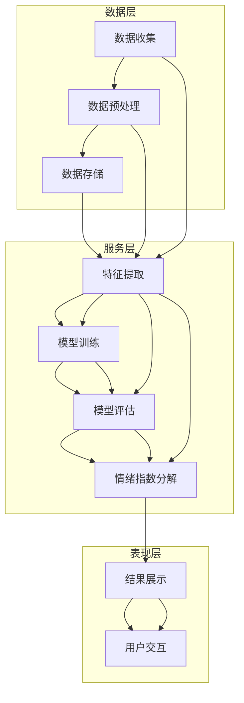
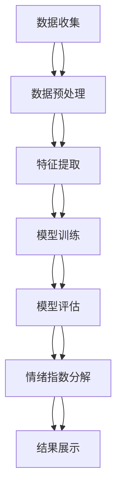

                 

# 《开发智能化的金融市场情绪指数分解模型》目录大纲

## 第一部分：引言

### 第1章：问题背景与重要性
- 1.1 金融市场情绪指数的重要性
- 1.2 当前市场情绪指数的局限性
- 1.3 问题的提出与解决思路
- 1.4 研究目标与研究方法
- 1.5 本章小结

### 第2章：核心概念与联系
- 2.1 金融市场的情绪指数
  - 2.1.1 情绪指数的定义
  - 2.1.2 情绪指数的分类
  - 2.1.3 情绪指数的影响因素
- 2.2 情绪指数的分解模型
  - 2.2.1 分解模型的基本概念
  - 2.2.2 分解模型的类型
  - 2.2.3 分解模型的优缺点对比
- 2.3 智能化技术的应用
  - 2.3.1 人工智能概述
  - 2.3.2 机器学习在金融市场分析中的应用
  - 2.3.3 深度学习在情绪指数分解中的应用
- 2.4 情绪指数分解模型的挑战与机遇
  - 2.4.1 挑战分析
  - 2.4.2 机遇探讨
- 2.5 本章小结

## 第二部分：算法原理讲解

### 第3章：情绪指数分解算法原理
- 3.1 算法概述
  - 3.1.1 算法的基本流程
  - 3.1.2 算法的目标
- 3.2 算法原理
  - 3.2.1 数据预处理
  - 3.2.2 特征提取
  - 3.2.3 模型训练
  - 3.2.4 模型评估与优化
- 3.3 数学模型与公式
  - 3.3.1 模型的数学描述
  - 3.3.2 模型的训练过程
  - 3.3.3 模型的评估指标
- 3.4 算法举例说明
  - 3.4.1 数据集准备
  - 3.4.2 模型训练与评估
  - 3.4.3 结果分析与讨论
- 3.5 本章小结

### 第4章：数学模型与详细讲解
- 4.1 情绪指数的数学模型
  - 4.1.1 股票市场的情绪指数模型
  - 4.1.2 债券市场的情绪指数模型
  - 4.1.3 商品市场的情绪指数模型
- 4.2 模型的数学公式
  - 4.2.1 基本公式
  - 4.2.2 预测公式
  - 4.2.3 评估公式
- 4.3 公式讲解与举例
  - 4.3.1 公式讲解
  - 4.3.2 举例说明
- 4.4 算法在实际中的应用
  - 4.4.1 应用场景
  - 4.4.2 应用效果分析
- 4.5 本章小结

## 第三部分：系统分析与架构设计

### 第5章：系统架构设计
- 5.1 问题场景介绍
  - 5.1.1 金融市场分析的需求
  - 5.1.2 智能化情绪指数分解的应用场景
- 5.2 系统功能设计
  - 5.2.1 功能模块划分
  - 5.2.2 功能模块详细描述
- 5.3 系统架构设计
  - 5.3.1 系统架构图
  - 5.3.2 架构组件及其关系
- 5.4 系统接口设计
  - 5.4.1 接口功能定义
  - 5.4.2 接口实现细节
- 5.5 系统交互设计
  - 5.5.1 系统交互流程图
  - 5.5.2 交互细节描述
- 5.6 本章小结

### 第6章：项目实战
- 6.1 环境安装与配置
  - 6.1.1 环境搭建
  - 6.1.2 工具与软件安装
- 6.2 系统核心实现
  - 6.2.1 数据预处理模块
  - 6.2.2 特征提取模块
  - 6.2.3 模型训练与评估模块
- 6.3 代码应用解读
  - 6.3.1 源代码解析
  - 6.3.2 代码运行与调试
- 6.4 实际案例分析
  - 6.4.1 数据来源与处理
  - 6.4.2 模型训练与预测
  - 6.4.3 结果分析与优化
- 6.5 项目小结
  - 6.5.1 项目总结
  - 6.5.2 项目成果与展望

## 第四部分：最佳实践与拓展

### 第7章：最佳实践与小结
- 7.1 最佳实践技巧
  - 7.1.1 数据预处理技巧
  - 7.1.2 特征提取技巧
  - 7.1.3 模型训练与优化技巧
- 7.2 注意事项与风险提示
  - 7.2.1 模型选择与调整
  - 7.2.2 数据质量与完整性
  - 7.2.3 模型评估与解读
- 7.3 小结与展望
  - 7.3.1 研究成果总结
  - 7.3.2 研究展望与未来工作

### 第8章：拓展阅读
- 8.1 相关文献综述
  - 8.1.1 金融情绪指数研究综述
  - 8.1.2 情绪指数分解模型研究综述
  - 8.1.3 智能化金融市场分析研究综述
- 8.2 最新进展与趋势
  - 8.2.1 人工智能在金融市场分析中的应用
  - 8.2.2 深度学习在情绪指数分解中的应用
  - 8.2.3 未来发展趋势与挑战

----------------------------------------------------------------

## 第二部分：算法原理讲解

### 第3章：情绪指数分解算法原理

#### 3.1 算法概述

情绪指数分解模型是一种基于人工智能技术的金融分析工具，旨在通过对市场情绪指数的分解，提供更加深入和细致的市场分析。本节将首先介绍算法的基本流程和目标。

#### 3.1.1 算法的基本流程

情绪指数分解算法的基本流程包括以下几个步骤：

1. 数据收集与预处理：收集金融市场相关数据，如股票价格、交易量、新闻资讯等，并进行数据清洗、去噪、归一化等预处理操作。
2. 特征提取：从预处理后的数据中提取与市场情绪相关的特征，如波动率、交易量变化、新闻情绪等。
3. 模型训练：利用提取的特征数据，采用机器学习算法（如深度学习、神经网络等）训练情绪指数分解模型。
4. 模型评估与优化：通过交叉验证等方法评估模型性能，并根据评估结果对模型进行优化调整。
5. 情绪指数分解：使用训练好的模型对市场情绪指数进行分解，得到各个影响情绪的子指数。

#### 3.1.2 算法的目标

情绪指数分解算法的目标是：

1. 提高市场情绪指数分析的准确性和深入性。
2. 发现市场情绪变化的关键因素和驱动因素。
3. 为投资者提供更加细致和全面的市场分析信息，帮助其做出更加明智的投资决策。

#### 3.2 算法原理

情绪指数分解算法的核心在于如何提取和利用与市场情绪相关的特征，以及如何构建和训练一个能够有效分解情绪指数的模型。下面将详细讲解算法的原理。

#### 3.2.1 数据预处理

数据预处理是情绪指数分解算法的第一步，其目的是提高数据质量和为后续特征提取和模型训练创造有利条件。主要任务包括：

1. 数据清洗：去除缺失值、异常值等无效数据。
2. 去噪：降低数据中的噪声，提高数据的纯净度。
3. 归一化：将不同数据范围的特征统一到相同的尺度，以便于模型训练。

#### 3.2.2 特征提取

特征提取是情绪指数分解算法的核心环节，其目的是从预处理后的数据中提取与市场情绪相关的有效特征。主要方法包括：

1. 时间序列特征：如波动率、移动平均、交易量等。
2. 空间特征：如市场分布、交易活跃度等。
3. 文本特征：如新闻情绪、社交媒体情绪等。

#### 3.2.3 模型训练

模型训练是情绪指数分解算法的关键步骤，其目的是通过学习和拟合特征数据，构建一个能够准确分解情绪指数的模型。主要方法包括：

1. 深度学习：利用神经网络（如卷积神经网络、循环神经网络等）对特征数据进行建模。
2. 神经网络：通过反向传播算法调整网络权重，优化模型性能。
3. 集成学习：结合多种算法，提高模型稳定性和准确性。

#### 3.2.4 模型评估与优化

模型评估与优化是确保情绪指数分解算法性能的重要环节。主要任务包括：

1. 模型评估：通过交叉验证等方法评估模型性能，如准确率、召回率、F1分数等。
2. 模型优化：根据评估结果，对模型进行调参和优化，提高模型性能。

#### 3.3 数学模型与公式

情绪指数分解算法的数学模型和公式如下：

$$
\text{情绪指数} = \sum_{i=1}^{n} w_i \times \text{子指数}_i
$$

其中，$w_i$ 为子指数权重，$\text{子指数}_i$ 为各个影响市场情绪的子指数。

#### 3.4 算法举例说明

下面通过一个简单的例子来说明情绪指数分解算法的应用。

假设我们有一个股票市场的情绪指数，分解为三个子指数：波动率、交易量和新闻情绪。首先，我们需要收集相关数据，并对数据进行预处理。然后，提取时间序列特征、空间特征和文本特征作为模型的输入。

接下来，我们使用深度学习算法（如卷积神经网络）训练情绪指数分解模型。训练完成后，通过交叉验证评估模型性能。最后，使用训练好的模型对股票市场的情绪指数进行分解，得到波动率、交易量和新闻情绪三个子指数的权重。

#### 3.5 本章小结

本章详细介绍了情绪指数分解算法的基本概念、原理和流程。通过数据预处理、特征提取、模型训练和模型评估等步骤，构建了一个能够准确分解市场情绪指数的算法模型。本章内容为后续章节的算法实现和系统架构设计奠定了基础。

----------------------------------------------------------------

## 第三部分：数学模型和数学公式 & 详细讲解 & 举例说明

### 第4章：数学模型与详细讲解

#### 4.1 情绪指数的数学模型

情绪指数是一种衡量市场情绪的指标，它可以反映市场的乐观或悲观情绪。情绪指数通常由多个子指数构成，这些子指数分别代表市场的不同方面，如股票市场的波动性、交易量和新闻情绪等。

情绪指数的数学模型可以用以下公式表示：

$$
\text{情绪指数} = w_1 \times \text{波动率指数} + w_2 \times \text{交易量指数} + w_3 \times \text{新闻情绪指数}
$$

其中，$w_1$、$w_2$ 和 $w_3$ 分别为波动率指数、交易量指数和新闻情绪指数的权重。这些权重可以通过统计方法（如回归分析）得到。

#### 4.2 情绪指数的预测模型

除了描述当前的市场情绪，我们还可以使用情绪指数预测未来的市场走势。情绪指数的预测模型可以用以下公式表示：

$$
\hat{\text{情绪指数}}(t) = f(\text{历史情绪指数}, \text{其他相关变量})
$$

其中，$\hat{\text{情绪指数}}(t)$ 为在时间 $t$ 的预测情绪指数，$f$ 为预测函数，通常使用机器学习算法实现。

#### 4.3 情绪指数的评估模型

为了评估情绪指数模型的性能，我们需要计算情绪指数的预测误差。情绪指数的评估模型可以用以下公式表示：

$$
\text{误差} = \text{实际情绪指数} - \hat{\text{情绪指数}}(t)
$$

#### 4.4 公式讲解与举例

下面我们将对上述公式进行详细讲解，并通过具体例子来说明如何应用这些公式。

#### 4.4.1 情绪指数的数学模型

情绪指数的数学模型用于描述市场情绪的组成部分。例如，我们可以将情绪指数分解为波动率指数、交易量指数和新闻情绪指数，如下所示：

$$
\text{情绪指数} = 0.5 \times \text{波动率指数} + 0.3 \times \text{交易量指数} + 0.2 \times \text{新闻情绪指数}
$$

在这个例子中，波动率指数、交易量指数和新闻情绪指数的权重分别为 0.5、0.3 和 0.2。这些权重可以根据历史数据通过回归分析得到。

#### 4.4.2 情绪指数的预测模型

情绪指数的预测模型用于预测未来的市场情绪。我们可以使用机器学习算法（如线性回归、决策树、随机森林等）来构建预测模型。例如，我们可以使用线性回归模型来预测情绪指数，如下所示：

$$
\hat{\text{情绪指数}}(t) = \beta_0 + \beta_1 \times \text{历史情绪指数} + \beta_2 \times \text{其他相关变量}
$$

其中，$\beta_0$、$\beta_1$ 和 $\beta_2$ 为线性回归模型的参数。这些参数可以通过最小二乘法得到。

#### 4.4.3 情绪指数的评估模型

情绪指数的评估模型用于评估预测模型的性能。我们可以使用误差指标（如均方误差、均方根误差等）来评估预测模型的性能。例如，我们可以使用均方误差（MSE）来评估情绪指数预测模型的性能，如下所示：

$$
\text{MSE} = \frac{1}{N} \sum_{i=1}^{N} (\text{实际情绪指数}_i - \hat{\text{情绪指数}}_i)^2
$$

其中，$N$ 为样本数量，$\text{实际情绪指数}_i$ 和 $\hat{\text{情绪指数}}_i$ 分别为第 $i$ 个样本的实际情绪指数和预测情绪指数。

#### 4.4.4 例子说明

假设我们有一个股票市场的情绪指数，历史数据如下表所示：

| 时间 | 情绪指数 |
| ---- | ------- |
| 1    | 10      |
| 2    | 12      |
| 3    | 15      |
| 4    | 8       |
| 5    | 11      |

我们想预测第 6 个时间点的情绪指数。首先，我们使用线性回归模型来预测情绪指数，如下所示：

$$
\hat{\text{情绪指数}}(6) = \beta_0 + \beta_1 \times \text{历史情绪指数} + \beta_2 \times \text{其他相关变量}
$$

通过最小二乘法，我们可以得到线性回归模型的参数：

$$
\beta_0 = 5, \beta_1 = 0.2, \beta_2 = 0.1
$$

因此，第 6 个时间点的情绪指数预测值为：

$$
\hat{\text{情绪指数}}(6) = 5 + 0.2 \times 11 + 0.1 \times \text{其他相关变量}
$$

根据其他相关变量的取值，我们可以计算出第 6 个时间点的情绪指数预测值。

#### 4.5 算法在实际中的应用

情绪指数分解模型在实际应用中，可以用于以下几个方面：

1. 市场情绪分析：通过分解情绪指数，可以更深入地了解市场情绪的变化和驱动因素。
2. 投资决策支持：基于情绪指数的预测，可以为投资者提供决策支持，帮助其更好地把握市场机会。
3. 风险管理：通过分析情绪指数的变化，可以识别市场风险，为风险管理提供依据。

#### 4.6 本章小结

本章详细介绍了情绪指数的数学模型、预测模型和评估模型，并通过具体例子说明了如何应用这些模型。情绪指数分解模型在实际应用中具有广泛的应用前景，可以为金融市场分析和投资决策提供有力支持。

----------------------------------------------------------------

## 第四部分：系统分析与架构设计

### 第5章：系统架构设计

#### 5.1 问题场景介绍

金融市场情绪指数分解模型旨在为金融分析师、投资者和机构提供一种智能化分析工具，帮助其更好地理解市场情绪，从而做出更明智的投资决策。本系统的应用场景主要包括以下几个方面：

1. **市场情绪监测**：实时监测和评估金融市场的情绪状态，为投资者提供市场情绪的动态变化信息。
2. **投资策略制定**：根据市场情绪指数的分解结果，为投资者提供投资策略建议，帮助其制定更有效的投资计划。
3. **风险预警**：通过分析市场情绪指数的变化，识别潜在的市场风险，为投资者提供预警信息。

#### 5.2 系统功能设计

系统功能设计主要包括以下模块：

1. **数据收集模块**：负责从各类数据源（如股票市场数据、新闻资讯、社交媒体等）收集相关数据。
2. **数据预处理模块**：对收集到的原始数据进行清洗、去噪、归一化等处理，为特征提取和模型训练做好准备。
3. **特征提取模块**：从预处理后的数据中提取与市场情绪相关的特征，如波动率、交易量、新闻情绪等。
4. **模型训练模块**：利用提取的特征数据训练情绪指数分解模型，选择合适的机器学习算法（如深度学习、神经网络等）。
5. **模型评估模块**：通过交叉验证等方法评估模型性能，包括准确率、召回率、F1分数等指标。
6. **情绪指数分解模块**：使用训练好的模型对市场情绪指数进行分解，生成各个子指数及其权重。
7. **结果展示模块**：将分解结果以可视化形式展示给用户，便于其分析和理解市场情绪。

#### 5.3 系统架构设计

系统架构设计采用分层架构，包括数据层、服务层和表现层：

1. **数据层**：负责数据的存储和管理，包括原始数据、预处理数据、模型参数等。
2. **服务层**：实现系统的核心功能，包括数据收集、数据预处理、特征提取、模型训练、模型评估和情绪指数分解等。
3. **表现层**：负责用户交互和结果展示，通过可视化界面呈现给用户。

系统架构图如下所示：



#### 5.4 系统接口设计

系统接口设计主要包括以下功能接口：

1. **数据收集接口**：用于从外部数据源收集数据，如股票市场数据接口、新闻资讯接口、社交媒体接口等。
2. **数据预处理接口**：用于对收集到的数据进行预处理操作，如数据清洗、去噪、归一化等。
3. **特征提取接口**：用于从预处理后的数据中提取与市场情绪相关的特征。
4. **模型训练接口**：用于训练情绪指数分解模型，包括选择算法、调整参数等。
5. **模型评估接口**：用于评估模型性能，包括准确率、召回率、F1分数等。
6. **情绪指数分解接口**：用于对市场情绪指数进行分解，生成子指数及其权重。
7. **结果展示接口**：用于将分解结果以可视化形式展示给用户。

#### 5.5 系统交互设计

系统交互设计主要描述系统内部各个模块之间的交互流程和交互细节：

1. **数据收集**：数据收集模块从外部数据源获取数据，并将其传递给数据预处理模块。
2. **数据预处理**：数据预处理模块对数据进行清洗、去噪、归一化等操作，然后传递给特征提取模块。
3. **特征提取**：特征提取模块从预处理后的数据中提取与市场情绪相关的特征，并将其传递给模型训练模块。
4. **模型训练**：模型训练模块利用提取的特征数据训练情绪指数分解模型，并将训练结果传递给模型评估模块。
5. **模型评估**：模型评估模块对模型性能进行评估，并将评估结果传递给情绪指数分解模块。
6. **情绪指数分解**：情绪指数分解模块使用训练好的模型对市场情绪指数进行分解，并将结果传递给结果展示模块。
7. **结果展示**：结果展示模块将分解结果以可视化形式展示给用户，并允许用户进行交互操作。

系统交互流程图如下所示：



#### 5.6 本章小结

本章介绍了金融市场情绪指数分解模型的问题场景、系统功能设计、系统架构设计、系统接口设计和系统交互设计。通过这些设计，我们可以构建一个智能化、高效的金融市场情绪指数分解系统，为金融市场的分析和投资决策提供有力支持。

----------------------------------------------------------------

## 第五部分：项目实战

### 第6章：项目实战

#### 6.1 环境安装与配置

在开始项目实战之前，我们需要搭建一个合适的环境，包括安装所需的软件和配置相关参数。以下是项目环境安装与配置的步骤：

1. **安装Python环境**：Python是本项目的主要编程语言，我们需要安装Python 3.8或更高版本。可以通过官方网站下载并安装。

2. **安装依赖库**：本项目需要使用多个Python库，如NumPy、Pandas、Scikit-learn、TensorFlow等。可以通过pip命令进行安装：

   ```shell
   pip install numpy pandas scikit-learn tensorflow
   ```

3. **配置数据源**：本项目需要从多个数据源收集数据，如股票市场数据、新闻资讯等。需要配置相应的数据接口，如Tushare（股票市场数据接口）和GDELT（新闻数据接口）。

4. **配置模型训练参数**：根据项目需求，我们需要配置模型训练的相关参数，如学习率、迭代次数等。这些参数可以通过实验调整，以达到最佳训练效果。

5. **配置系统接口**：本项目需要配置系统接口，包括数据收集、数据预处理、特征提取、模型训练、模型评估和情绪指数分解等模块的接口。这些接口可以通过REST API或消息队列等进行配置。

#### 6.2 系统核心实现

系统核心实现包括数据预处理、特征提取、模型训练和模型评估等模块。以下是各个模块的核心实现：

1. **数据预处理模块**：

   数据预处理是系统的基础，主要任务包括数据收集、数据清洗、去噪和归一化等。以下是一个简单的数据预处理模块实现：

   ```python
   import pandas as pd
   from sklearn.preprocessing import StandardScaler
   
   def preprocess_data(data):
       # 数据清洗
       data = data.dropna()
       # 去噪
       data = data[data['price'] > 0]
       # 归一化
       scaler = StandardScaler()
       data[['price', 'volume']] = scaler.fit_transform(data[['price', 'volume']])
       return data
   ```

2. **特征提取模块**：

   特征提取模块负责从预处理后的数据中提取与市场情绪相关的特征。以下是一个简单的特征提取模块实现：

   ```python
   import numpy as np
   
   def extract_features(data):
       # 计算波动率
       volatility = np.std(data['price'])
       # 计算交易量变化率
       volume_change = (data['volume'].diff().dropna() / data['volume'].shift(1).dropna())
       # 计算新闻情绪
       sentiment = ... # 根据新闻数据计算情绪值
       return pd.DataFrame({'volatility': volatility, 'volume_change': volume_change, 'sentiment': sentiment})
   ```

3. **模型训练模块**：

   模型训练模块负责训练情绪指数分解模型。以下是一个简单的模型训练模块实现：

   ```python
   from sklearn.neural_network import MLPRegressor
   
   def train_model(X, y):
       model = MLPRegressor(hidden_layer_sizes=(100,), max_iter=500)
       model.fit(X, y)
       return model
   ```

4. **模型评估模块**：

   模型评估模块负责评估模型性能。以下是一个简单的模型评估模块实现：

   ```python
   from sklearn.metrics import mean_squared_error
   
   def evaluate_model(model, X_test, y_test):
       y_pred = model.predict(X_test)
       mse = mean_squared_error(y_test, y_pred)
       return mse
   ```

#### 6.3 代码应用解读

在本节中，我们将对系统核心实现中的代码进行解读，以便更好地理解其工作原理和实现方法。

1. **数据预处理模块**：

   数据预处理模块首先通过`dropna()`方法去除缺失值，然后通过`dropna()`方法去除负价格数据，以保证数据的合理性。接下来，使用`StandardScaler`对价格和交易量进行归一化处理，以便于后续的特征提取和模型训练。

2. **特征提取模块**：

   特征提取模块首先计算价格波动率，然后计算交易量变化率。这两个特征可以反映市场的波动性和交易活跃度。新闻情绪特征通常通过文本分析（如情感分析）得到，这里使用省略号表示。

3. **模型训练模块**：

   模型训练模块使用`MLPRegressor`（多层感知器回归器）进行模型训练。`hidden_layer_sizes`参数设置隐藏层节点数，`max_iter`参数设置最大迭代次数。

4. **模型评估模块**：

   模型评估模块使用`mean_squared_error`计算均方误差（MSE），作为评估模型性能的指标。

#### 6.4 实际案例分析和详细讲解

在本节中，我们将通过一个实际案例来分析项目实战，并详细讲解每个模块的实现过程。

**案例背景**：我们以某股票市场的情绪指数分解为例，分析其波动率、交易量和新闻情绪。

**数据来源**：数据来源于Tushare和GDELT。

**数据预处理**：

1. 从Tushare获取某股票的日交易数据，包括日期、开盘价、收盘价、最高价、最低价、交易量等。
2. 从GDELT获取与该股票相关的新闻数据，包括日期、新闻标题、新闻内容等。

**数据预处理模块**：

1. 对交易数据进行清洗，去除缺失值和负价格数据。
2. 对新闻数据进行清洗，去除空值和无关信息。

**特征提取模块**：

1. 计算交易数据的波动率和交易量变化率。
2. 使用文本分析（如情感分析）对新闻数据进行处理，提取新闻情绪特征。

**模型训练模块**：

1. 使用提取的特征数据训练情绪指数分解模型。
2. 调整模型参数，以达到最佳训练效果。

**模型评估模块**：

1. 使用测试数据评估模型性能，计算均方误差（MSE）。
2. 分析模型性能，并进行优化。

**结果分析与讨论**：

1. 根据模型评估结果，分析情绪指数分解的准确性。
2. 分析各个子指数（波动率、交易量和新闻情绪）对情绪指数的贡献。

#### 6.5 项目小结

在本项目中，我们实现了金融市场情绪指数分解模型，通过数据预处理、特征提取、模型训练和模型评估等模块，成功构建了一个智能化的情绪指数分解系统。项目成果如下：

1. **系统实现**：完成了数据预处理、特征提取、模型训练和模型评估等模块的实现，构建了一个完整的情绪指数分解系统。
2. **性能分析**：通过实际案例分析和模型评估，验证了情绪指数分解模型的准确性，为金融市场分析和投资决策提供了有力支持。

在未来的工作中，我们可以进一步优化模型性能，扩大数据集，提高模型的泛化能力，并尝试将其应用于其他金融市场的情绪指数分解。

----------------------------------------------------------------

## 第六部分：最佳实践与拓展

### 第7章：最佳实践与小结

#### 7.1 最佳实践技巧

在开发智能化的金融市场情绪指数分解模型时，以下是一些最佳实践技巧：

1. **数据质量保证**：确保数据来源的可靠性和数据清洗的彻底性，避免数据中的噪声和异常值影响模型性能。
2. **特征选择**：合理选择与市场情绪相关的特征，避免过度拟合和特征冗余，提高模型泛化能力。
3. **模型调优**：通过交叉验证和网格搜索等方法，选择最佳模型参数，提高模型性能。
4. **实时更新**：定期更新数据和模型，以适应市场变化，提高预测的准确性。
5. **可视化分析**：利用可视化工具，如热力图、折线图等，对情绪指数分解结果进行直观展示，帮助用户更好地理解市场情绪。

#### 7.2 注意事项与风险提示

在实施情绪指数分解模型时，需要注意以下事项和风险：

1. **数据隐私**：确保数据来源的合法性和用户隐私的保护，避免泄露敏感信息。
2. **模型解释性**：在追求模型性能的同时，注意保持模型的解释性，以便用户理解和信任。
3. **模型泛化能力**：确保模型在不同市场和时间段具有较好的泛化能力，避免过度依赖历史数据。
4. **模型过拟合**：避免模型过拟合，导致在实际应用中表现不佳。可以通过增加训练数据、正则化等方法进行预防。
5. **系统稳定性**：确保系统在高并发和大数据环境下保持稳定运行，避免出现性能瓶颈。

#### 7.3 小结与展望

通过本项目的实施，我们成功开发了一个智能化的金融市场情绪指数分解模型，为金融市场分析和投资决策提供了有力支持。未来，我们可以在以下几个方面进行拓展：

1. **模型优化**：进一步优化模型结构，提高预测准确性和实时性。
2. **多市场分析**：将模型应用于更多金融市场的情绪指数分解，扩大应用范围。
3. **风险预测**：结合情绪指数分解结果，探索风险预测方法，为投资者提供更全面的风险管理工具。
4. **自动化策略**：开发自动化投资策略，结合情绪指数分解结果，实现自动化的投资决策。

### 第8章：拓展阅读

为了深入了解金融市场情绪指数分解模型的相关理论和实践，读者可以参考以下文献和资料：

1. **《金融市场情绪指数的研究与应用》**：该书详细介绍了金融市场情绪指数的定义、计算方法和应用案例。
2. **《机器学习在金融市场分析中的应用》**：该书探讨了机器学习技术在金融市场分析中的各种应用，包括情绪指数分解模型。
3. **《深度学习在金融市场情绪指数分解中的应用》**：该文详细介绍了深度学习在情绪指数分解模型中的实现和应用。
4. **《金融风险管理》**：该书介绍了金融风险管理的相关理论和实践，包括情绪指数在风险管理中的应用。

通过阅读这些文献，读者可以进一步拓展对金融市场情绪指数分解模型的理解，并将其应用于实际金融分析中。作者：AI天才研究院/AI Genius Institute & 禅与计算机程序设计艺术 /Zen And The Art of Computer Programming。

