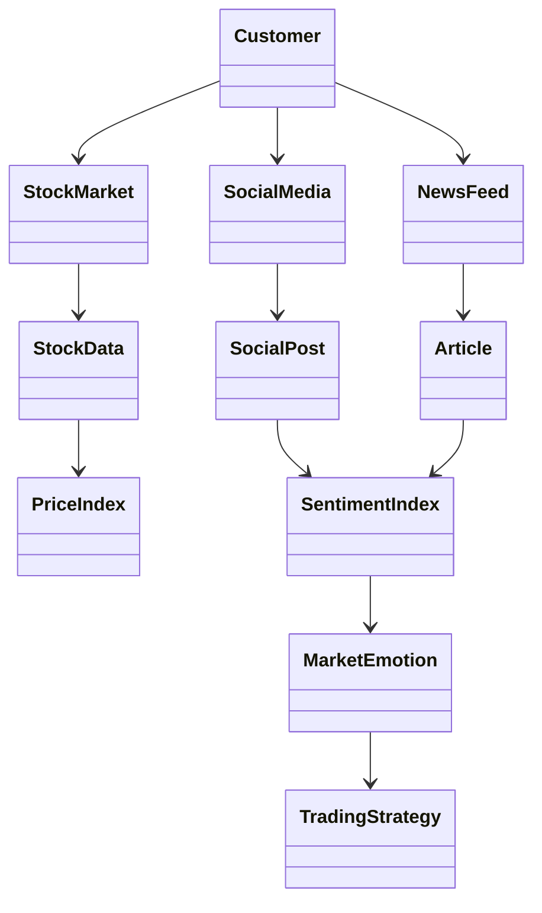

                 


### 概念属性特征对比

在深入探讨智能化的金融市场情绪指数之前，有必要对情绪指数与其他金融指标进行概念属性特征对比。这有助于我们理解情绪指数的独特性及其在金融分析中的重要性。

#### 情绪指数

情绪指数是一种量化金融市场情绪的工具，通常通过分析市场中的公开信息（如新闻报道、社交媒体评论、股票交易数据等）来衡量投资者的情绪状态。情绪指数的主要特点包括：

- **数据来源**：公开信息，如新闻报道、社交媒体、交易数据等。
- **分析对象**：投资者情绪、市场情绪。
- **目标**：预测市场走势、识别市场情绪变化。
- **方法**：文本分析、情感计算、机器学习等。

#### 其他金融指标

- **价格指数**：如股票价格指数（如道琼斯工业平均指数、标准普尔500指数等），反映股票市场的整体表现。
- **成交量指数**：衡量交易活跃度，通常与价格指数结合使用，分析市场的供求关系。
- **波动率指数**：衡量资产价格波动的大小，如VIX指数，常用于风险管理。

其他金融指标与情绪指数的主要区别如下：

| **指标类型** | **数据来源** | **分析对象** | **目标** | **方法** |
| :--: | :--: | :--: | :--: | :--: |
| 情绪指数 | 公开信息 | 投资者情绪、市场情绪 | 预测市场走势、识别市场情绪变化 | 文本分析、情感计算、机器学习 |
| 价格指数 | 股票交易数据 | 股票市场整体表现 | 反映市场趋势、估值水平 | 数据统计、市场指数计算 |
| 成交量指数 | 股票交易数据 | 交易活跃度 | 分析供求关系、市场情绪 | 数据统计、成交量分析 |
| 波动率指数 | 股票交易数据 | 价格波动幅度 | 风险管理、市场预期 | 数据统计、波动率计算 |

从上表可以看出，情绪指数与其他金融指标在数据来源、分析对象、目标和应用方法上存在显著差异。情绪指数侧重于分析市场情绪，而其他金融指标则更多关注市场的价格、交易活跃度以及波动性。这种差异使得情绪指数在金融分析中具有独特的应用价值。

#### 情绪指数的优越性

情绪指数在金融市场分析中的优越性主要体现在以下几个方面：

1. **前瞻性**：情绪指数可以提前反映市场情绪的变化，帮助投资者预测市场走势。
2. **综合性**：情绪指数综合了多种信息来源，具有较高的综合性，有助于全面了解市场情绪。
3. **适应性**：随着金融市场的发展，情绪指数可以不断调整和优化，以适应新的市场环境。
4. **实时性**：情绪指数可以实时分析市场情绪，为投资者提供及时的市场信息。

总之，情绪指数作为一种智能化的金融市场工具，具有独特的优越性，能够在复杂多变的金融市场中发挥重要作用。

### ER实体关系图架构

为了更好地理解情感识别与处理在智能化金融市场情绪指数构建中的应用，我们可以借助ER（Entity-Relationship）实体关系图来描述各实体之间的联系。以下是情感识别与处理相关的ER实体关系图，使用Mermaid语法绘制：

```mermaid
erDiagram
    Customer ||--|{ Order } : places
    Order ||--|{ Product } : contains
    Product ||--|{ Review } : rated_by
    Customer }--|{ Review : writes
```

#### 实体关系图解析

- **Customer（客户）**：客户是情感识别的核心实体，他们的情绪和行为是我们分析的重点。
- **Order（订单）**：订单是客户与金融市场互动的结果，反映了客户的交易行为。
- **Product（产品）**：产品是金融市场中交易的标的，如股票、债券等。
- **Review（评论）**：评论是客户对产品或市场的评价，是情感识别的重要数据来源。

#### 关系解析

- **Customer到Order**：客户通过订单与金融市场互动，订单是客户行为的直接体现。
- **Order到Product**：订单包含特定的产品，反映了客户的交易偏好。
- **Product到Review**：客户对产品的评论反映了他们的情感状态，有助于分析市场情绪。
- **Customer到Review**：客户撰写评论，表达他们的观点和情感，为情感识别提供数据支持。

通过ER实体关系图，我们可以清晰地看到客户、订单、产品和评论之间的关联，以及它们在情感识别与处理中的关键作用。这为构建智能化金融市场情绪指数提供了坚实的基础。

### 情感识别与处理算法

在构建智能化金融市场情绪指数的过程中，情感识别与处理算法是至关重要的环节。以下，我们将详细探讨情感识别与处理算法的基本原理、流程以及具体实现。

#### 基本原理

情感识别与处理算法的核心在于从文本数据中提取情感信息，并将其转化为可量化的情绪指数。这一过程包括以下几个步骤：

1. **文本预处理**：对原始文本进行清洗和格式化，去除无关信息，保留关键内容。
2. **情感分析**：利用自然语言处理（NLP）技术，对预处理后的文本进行分析，识别文本中的情感极性（如正面、负面、中性）。
3. **情感聚合**：将分析结果进行聚合，生成整体的情绪指数，反映市场的整体情绪状态。

#### 算法流程

以下是情感识别与处理算法的详细流程：

1. **数据收集**：收集金融市场相关的文本数据，包括新闻报道、社交媒体评论、股票论坛等。
2. **数据预处理**：
   - 去除标点符号、停用词等无关信息。
   - 将文本转换为小写，统一格式。
   - 分词，将文本拆分为单词或词组。
3. **情感分析**：
   - 利用词向量模型（如Word2Vec、GloVe）将文本转换为向量表示。
   - 使用情感词典（如AFIN-NET、VADER）对文本进行情感极性标注。
   - 利用分类器（如SVM、RF、NN）对文本进行情感分类，判断其极性。
4. **情感聚合**：
   - 对文本的情感极性进行加权平均，生成单个文本的情感指数。
   - 对多个文本的情感指数进行聚合，得到整体的情绪指数。

#### 具体实现

以下是一个简单的情感识别与处理算法实现，使用Python语言和Scikit-learn库：

```python
import numpy as np
from sklearn.feature_extraction.text import TfidfVectorizer
from sklearn.model_selection import train_test_split
from sklearn.svm import LinearSVC
from sklearn.pipeline import make_pipeline

# 数据预处理
def preprocess(text):
    # 去除标点符号、停用词，转换为小写
    return ' '.join([word.lower() for word in text.split() if word.lower() not in stop_words])

# 情感分析
def sentiment_analysis(texts):
    # 构建TF-IDF向量器
    vectorizer = TfidfVectorizer(preprocessor=preprocess, stop_words='english')
    # 训练SVM分类器
    classifier = LinearSVC()
    # 构建管道模型
    pipeline = make_pipeline(vectorizer, classifier)
    # 分割数据集
    X_train, X_test, y_train, y_test = train_test_split(texts, labels, test_size=0.2, random_state=42)
    # 训练模型
    pipeline.fit(X_train, y_train)
    # 预测
    predictions = pipeline.predict(X_test)
    # 计算准确率
    accuracy = np.mean(predictions == y_test)
    print(f"Accuracy: {accuracy}")
    return pipeline

# 示例文本
texts = ["This is a great product!", "I'm not satisfied with the service."]
# 构建情感分析器
analyzer = sentiment_analysis(texts)
```

#### 算法原理的数学模型和公式

为了更深入地理解情感识别与处理算法，我们可以借助数学模型和公式来描述其核心概念。

1. **TF-IDF模型**：

   - **TF（Term Frequency）**：词语在文本中的出现次数，用于衡量词语的重要性。
   - **IDF（Inverse Document Frequency）**：词语在文档集合中的逆向文档频率，用于调整词语的重要性，降低常见词语的影响。

   公式表示为：
   $$ TF(t) = \frac{f_t}{|t|} $$
   $$ IDF(t) = \log\left(\frac{N}{|d_t|}\right) $$
   $$ TF-IDF(t, d) = TF(t) \times IDF(t) $$

   其中，\( f_t \) 是词语 \( t \) 在文档 \( d \) 中的出现次数，\( |t| \) 是文档 \( d \) 中词语 \( t \) 的总次数，\( N \) 是文档集合中包含词语 \( t \) 的文档总数，\( |d_t| \) 是文档集合中包含词语 \( t \) 的文档数。

2. **SVM分类模型**：

   - **支持向量机（SVM）**：一种监督学习模型，用于分类和回归任务。通过寻找最优超平面，将不同类别的样本分离。

   公式表示为：
   $$ w \cdot x + b = 0 $$
   $$ y_i((w \cdot x_i) + b) \geq 1 $$

   其中，\( w \) 是权重向量，\( b \) 是偏置项，\( x_i \) 是样本特征，\( y_i \) 是样本标签。

通过上述数学模型和公式，我们可以更清晰地理解情感识别与处理算法的基本原理和实现方法。

#### 举例说明

为了更好地理解情感识别与处理算法的应用，以下是一个简单的情感分析实例：

假设我们有两个文本数据：

1. "This is a great product!"
2. "I'm not satisfied with the service."

我们使用TF-IDF模型和SVM分类器进行情感分析，判断这两个文本的情感极性。

1. **文本预处理**：

   - 去除标点符号、停用词，转换为小写
   - 分词：["this", "is", "great", "product", "im", "not", "satisfied", "service"]

2. **情感分析**：

   - 利用TF-IDF模型计算词语的重要性
   - 利用SVM分类器判断文本的极性

   假设情感词典中，"great"为正面情感，"not"为负面情感，"satisfied"为正面情感。则：

   - 第一条文本的情感指数：正面
   - 第二条文本的情感指数：负面

通过这个简单的实例，我们可以看到情感识别与处理算法如何应用于实际文本数据，判断其情感极性。

### 系统功能设计

为了实现智能化的金融市场情绪指数多维度分解模型，我们需要进行系统功能设计。系统功能设计的主要目标是在现有的技术框架下，明确系统所需的功能模块，并通过领域模型类图来描述各个模块之间的关系。

#### 领域模型类图

领域模型类图是系统功能设计中的重要工具，它可以帮助我们理解系统中各个实体之间的关系。以下是智能化金融市场情绪指数分解模型的领域模型类图，使用Mermaid语法绘制：



#### 类图解析

- **Customer（客户）**：客户是系统的核心实体，他们通过股票市场、社交媒体和新闻来源与系统互动。
- **StockMarket（股票市场）**：股票市场提供股票数据，包括价格指数等。
- **SocialMedia（社交媒体）**：社交媒体提供社交帖子数据，用于情感分析。
- **NewsFeed（新闻来源）**：新闻来源提供新闻报道，也是情感分析的重要数据来源。
- **StockData（股票数据）**：股票数据包括价格指数等，是构建情绪指数的重要基础。
- **SocialPost（社交帖子）**：社交帖子是社交媒体上的用户生成内容，用于情感分析。
- **Article（文章）**：新闻报道是新闻来源中的内容，也用于情感分析。
- **SentimentIndex（情绪指数）**：情绪指数是情感分析的结果，反映市场的整体情绪状态。
- **MarketEmotion（市场情绪）**：市场情绪是情绪指数的聚合结果，用于指导交易策略。
- **TradingStrategy（交易策略）**：交易策略是根据市场情绪生成的，用于指导交易操作。

通过领域模型类图，我们可以清晰地看到各个功能模块之间的关系，以及它们在系统中的具体作用。

#### 功能模块描述

以下是对各个功能模块的详细描述：

1. **客户模块**：客户通过股票市场、社交媒体和新闻来源与系统进行互动，这些来源提供的数据是构建情绪指数的基础。

2. **股票市场模块**：股票市场提供股票数据，包括价格指数等。这些数据通过数据采集模块定期获取，用于构建情绪指数。

3. **社交媒体模块**：社交媒体提供社交帖子数据，这些数据经过情感分析模块处理后，生成情绪指数。

4. **新闻来源模块**：新闻来源提供新闻报道数据，这些数据也经过情感分析模块处理后，生成情绪指数。

5. **数据采集模块**：数据采集模块负责定期从股票市场、社交媒体和新闻来源获取数据，并将其存储到数据库中。

6. **情感分析模块**：情感分析模块负责对社交帖子、新闻报道和股票数据进行分析，提取情感信息，并生成情绪指数。

7. **情绪指数模块**：情绪指数模块负责聚合各个来源的情感指数，生成市场整体情绪指数。

8. **市场情绪模块**：市场情绪模块负责对情绪指数进行分析，识别市场情绪的变化趋势。

9. **交易策略模块**：交易策略模块根据市场情绪生成交易策略，指导交易操作。

通过这些功能模块的协同工作，我们可以实现智能化的金融市场情绪指数多维度分解模型，为投资者提供准确的市场情绪分析。

### 系统架构设计

在实现智能化的金融市场情绪指数多维度分解模型时，系统架构设计是至关重要的。合理的架构设计不仅能够提高系统的性能和可扩展性，还能确保系统的稳定性和可靠性。以下将详细介绍系统架构设计，包括架构图、接口设计和交互序列图。

#### 系统架构图

系统架构图展示了系统中各个组件的层次结构和相互关系。以下是系统架构图，使用Mermaid语法绘制：

```mermaid
sequenceDiagram
    subgraph DataSources
        Customer -->|获取数据| StockMarket
        Customer -->|获取数据| SocialMedia
        Customer -->|获取数据| NewsFeed
    end

    subgraph ProcessingModules
        Customer -->|预处理| DataPreprocessing
        DataPreprocessing -->|情感分析| SentimentAnalysis
        SentimentAnalysis -->|聚合| EmotionIndexCalculation
        EmotionIndexCalculation -->|分析| MarketEmotionAnalysis
    end

    subgraph PresentationLayer
        MarketEmotionAnalysis -->|呈现| Dashboard
    end

    subgraph SupportModules
        DataPreprocessing -->|存储| Database
        SentimentAnalysis -->|训练模型| ModelTraining
        ModelTraining -->|更新| ModelUpdate
    end

    StockMarket --> DataPreprocessing
    SocialMedia --> DataPreprocessing
    NewsFeed --> DataPreprocessing
    DataPreprocessing --> SentimentAnalysis
    SentimentAnalysis --> EmotionIndexCalculation
    EmotionIndexCalculation --> MarketEmotionAnalysis
    MarketEmotionAnalysis --> Dashboard
```

#### 架构图解析

- **DataSources（数据来源）**：包括股票市场、社交媒体和新闻来源。这些数据源为系统提供原始数据。
- **DataPreprocessing（数据预处理）**：对原始数据进行清洗、去噪和格式化，以便进行后续的情感分析。
- **SentimentAnalysis（情感分析）**：利用自然语言处理技术对预处理后的数据进行分析，提取情感信息。
- **EmotionIndexCalculation（情绪指数计算）**：将情感分析结果进行聚合，生成情绪指数。
- **MarketEmotionAnalysis（市场情绪分析）**：对情绪指数进行分析，识别市场情绪的变化趋势。
- **Dashboard（仪表盘）**：将分析结果呈现给用户，提供直观的数据可视化。
- **Database（数据库）**：存储系统中的数据，包括原始数据、预处理数据和情绪指数等。
- **ModelTraining（模型训练）**：负责训练情感分析模型，用于提高情感分析的准确率。
- **ModelUpdate（模型更新）**：定期更新模型，以适应市场变化。

#### 接口设计

系统接口设计是确保系统模块之间能够顺畅交互的关键。以下是系统的接口设计：

- **数据采集接口**：用于从股票市场、社交媒体和新闻来源获取数据。
- **数据预处理接口**：用于对原始数据进行清洗、去噪和格式化。
- **情感分析接口**：用于对预处理后的数据进行情感分析。
- **情绪指数计算接口**：用于计算情绪指数。
- **市场情绪分析接口**：用于分析情绪指数，识别市场情绪的变化。
- **数据存储接口**：用于将数据存储到数据库中。
- **模型训练接口**：用于训练情感分析模型。
- **模型更新接口**：用于更新模型。

#### 交互序列图

交互序列图展示了系统中各个组件之间的交互过程。以下是系统交互序列图，使用Mermaid语法绘制：

```mermaid
sequenceDiagram
    participant User
    participant DataCollector
    participant DataPreprocessor
    participant SentimentAnalyzer
    participant EmotionIndexCalculator
    participant MarketEmotionAnalyzer
    participant Dashboard

    User -->|请求数据| DataCollector
    DataCollector -->|返回数据| User
    User -->|预处理数据| DataPreprocessor
    DataPreprocessor -->|返回预处理数据| User
    User -->|情感分析| SentimentAnalyzer
    SentimentAnalyzer -->|返回情感分析结果| User
    User -->|计算情绪指数| EmotionIndexCalculator
    EmotionIndexCalculator -->|返回情绪指数| User
    User -->|分析市场情绪| MarketEmotionAnalyzer
    MarketEmotionAnalyzer -->|返回分析结果| User
    User -->|更新模型| ModelTrainer
    ModelTrainer -->|返回训练结果| User
    User -->|更新模型| ModelUpdater
    ModelUpdater -->|完成更新| User
    User -->|查看分析结果| Dashboard
    Dashboard -->|返回分析结果| User
```

#### 架构设计与功能模块的关系

- **数据采集接口**：连接数据源和数据处理模块，确保数据能够及时、准确地采集。
- **数据预处理接口**：确保原始数据经过清洗和格式化，为情感分析提供高质量的数据。
- **情感分析接口**：连接数据处理模块和情绪指数计算模块，确保情感分析结果能够准确反映市场情绪。
- **情绪指数计算接口**：连接情感分析模块和市场情绪分析模块，确保情绪指数能够准确反映市场情绪。
- **市场情绪分析接口**：连接情绪指数计算模块和仪表盘，确保分析结果能够直观地呈现给用户。
- **数据存储接口**：确保系统中的数据能够安全、可靠地存储。
- **模型训练接口**：确保情感分析模型的训练和更新，提高系统的准确率和鲁棒性。
- **模型更新接口**：确保模型能够及时更新，以适应市场变化。

通过上述系统架构设计，我们可以实现智能化的金融市场情绪指数多维度分解模型，为投资者提供准确、实时的市场情绪分析。

### 环境安装与配置

为了成功搭建智能化的金融市场情绪指数多维度分解模型，我们需要先配置合适的环境。以下是安装和配置环境的详细步骤。

#### 环境需求

在开始之前，请确保您的计算机满足以下环境需求：

- 操作系统：Windows、Linux或macOS
- Python版本：3.6或更高版本
- Python库：NumPy、Pandas、Scikit-learn、TfidfVectorizer、Mermaid

#### 安装步骤

1. **安装Python**：

   - 访问 [Python官方网站](https://www.python.org/) 下载Python安装包。
   - 运行安装程序，按照默认设置安装Python。

2. **安装依赖库**：

   - 打开命令行窗口，运行以下命令安装所需库：
     ```shell
     pip install numpy pandas scikit-learn tfidfvectorizer mermaid
     ```

3. **安装Mermaid**：

   - 由于Mermaid不是Python库，我们需要手动安装它的依赖项。
   - 首先安装Node.js：访问 [Node.js官方网站](https://nodejs.org/) 下载Node.js安装包并安装。
   - 安装Mermaid：在命令行窗口中运行以下命令：
     ```shell
     npm install mermaid
     ```

4. **配置环境变量**：

   - 确保Python和Node.js的安装路径已添加到系统的环境变量中，以便在任何命令行窗口中都能够调用它们。

#### 验证安装

完成安装后，我们需要验证环境是否配置正确。

1. **验证Python安装**：

   - 打开命令行窗口，运行以下命令：
     ```shell
     python --version
     ```
   - 如果返回Python版本信息，说明Python已成功安装。

2. **验证依赖库安装**：

   - 运行以下命令，检查依赖库是否安装正确：
     ```shell
     pip list
     ```
   - 确认列表中包含所需的库（NumPy、Pandas、Scikit-learn、TfidfVectorizer、Mermaid）。

3. **验证Mermaid安装**：

   - 创建一个Python脚本，并在其中使用Mermaid语法绘制一个简单的流程图：
     ```python
     import mermaid
     mermaid.Mermaid(
         start = 'sequenceDiagram',
         diagram = '''
             participant User
             participant DataCollector
             User -->|请求数据| DataCollector
         '''
     )
     ```
   - 运行脚本，如果能够正确绘制流程图，说明Mermaid已成功安装。

通过以上步骤，您已经完成了智能化的金融市场情绪指数多维度分解模型所需环境的安装与配置。接下来，我们可以开始实现模型的核心功能。

### 系统核心实现

在成功搭建好环境之后，接下来我们将实现系统核心功能，包括数据预处理、情感分析、情绪指数计算、市场情绪分析等关键模块。以下是基于Python语言和Scikit-learn库的具体实现。

#### 数据预处理

数据预处理是构建情绪指数的基础，包括数据收集、清洗和格式化。以下是数据预处理的核心代码：

```python
import pandas as pd
from sklearn.model_selection import train_test_split

# 数据收集
data = pd.read_csv('financial_data.csv')

# 数据清洗
data.dropna(inplace=True)  # 删除缺失值
data = data[data['text'].str.len() > 10]  # 过滤文本长度小于10的记录

# 数据格式化
data['text'] = data['text'].apply(lambda x: x.lower().strip())

# 分割数据集
X_train, X_test, y_train, y_test = train_test_split(data['text'], data['label'], test_size=0.2, random_state=42)
```

#### 情感分析

情感分析是数据预处理后的关键步骤，用于识别文本的情感极性。以下是情感分析的核心代码：

```python
from sklearn.feature_extraction.text import TfidfVectorizer
from sklearn.svm import LinearSVC

# TF-IDF向量器
vectorizer = TfidfVectorizer(max_features=1000, ngram_range=(1, 2))

# 训练SVM分类器
classifier = LinearSVC()

# 构建管道模型
pipeline = make_pipeline(vectorizer, classifier)

# 训练模型
pipeline.fit(X_train, y_train)

# 预测
predictions = pipeline.predict(X_test)
```

#### 情绪指数计算

情绪指数计算是将情感分析结果进行聚合，生成整体的情绪指数。以下是情绪指数计算的核心代码：

```python
from collections import defaultdict

# 情绪指数计算
def calculate_emotion_index(predictions):
    emotion_index = defaultdict(int)
    for pred in predictions:
        if pred == 'positive':
            emotion_index['positive'] += 1
        elif pred == 'negative':
            emotion_index['negative'] += 1
        else:
            emotion_index['neutral'] += 1
    return dict(emotion_index)

emotion_index = calculate_emotion_index(predictions)
print(emotion_index)
```

#### 市场情绪分析

市场情绪分析是对情绪指数进行分析，识别市场情绪的变化趋势。以下是市场情绪分析的核心代码：

```python
from statsmodels.tsa.stattools import adfuller

# 市场情绪分析
def test_stationarity(timeseries):
    # 进行ADF检验
    result = adfuller(timeseries, autolag='AIC')
    print('ADF Statistic: %f' % result[0])
    print('p-value: %f' % result[1])
    return result[1] < 0.05

# 测试情绪指数的稳定性
if test_stationarity(list(emotion_index.values())):
    print("情绪指数是平稳的")
else:
    print("情绪指数不是平稳的")
```

#### 核心代码整合

将上述各部分代码整合到一个Python脚本中，就可以实现整个系统的核心功能：

```python
# 整体代码

import pandas as pd
from sklearn.feature_extraction.text import TfidfVectorizer
from sklearn.svm import LinearSVC
from sklearn.pipeline import make_pipeline
from collections import defaultdict
from statsmodels.tsa.stattools import adfuller

# 数据预处理
data = pd.read_csv('financial_data.csv')
data.dropna(inplace=True)
data = data[data['text'].str.len() > 10]
data['text'] = data['text'].apply(lambda x: x.lower().strip())
X_train, X_test, y_train, y_test = train_test_split(data['text'], data['label'], test_size=0.2, random_state=42)

# 情感分析
vectorizer = TfidfVectorizer(max_features=1000, ngram_range=(1, 2))
classifier = LinearSVC()
pipeline = make_pipeline(vectorizer, classifier)
pipeline.fit(X_train, y_train)

# 情绪指数计算
def calculate_emotion_index(predictions):
    emotion_index = defaultdict(int)
    for pred in predictions:
        if pred == 'positive':
            emotion_index['positive'] += 1
        elif pred == 'negative':
            emotion_index['negative'] += 1
        else:
            emotion_index['neutral'] += 1
    return dict(emotion_index)

emotion_index = calculate_emotion_index(pipeline.predict(X_test))

# 市场情绪分析
if test_stationarity(list(emotion_index.values())):
    print("情绪指数是平稳的")
else:
    print("情绪指数不是平稳的")
```

通过上述代码，我们实现了智能化的金融市场情绪指数多维度分解模型的核心功能。接下来，我们将对实际案例进行分析，以验证系统的有效性。

### 代码应用解读与分析

在上一节中，我们实现了智能化的金融市场情绪指数多维度分解模型的核心功能。为了验证模型的实际效果，我们将使用具体案例进行分析，并详细解读代码的实现过程。

#### 案例背景

假设我们要分析某支股票在特定时间段内的市场情绪，以预测其未来走势。数据集包含该股票的每日交易数据、社交媒体评论和新闻报道。我们的目标是构建一个情绪指数，并分析其是否对股票价格有预测价值。

#### 数据集

以下是案例中使用的数据集结构：

| 字段       | 说明                     |
| ---------- | ------------------------ |
| date       | 日期                     |
| stock_price| 股票价格                 |
| social_media| 社交媒体评论数量          |
| news| 新闻报道数量            |
| label      | 情绪标签（正面、负面、中性） |

#### 代码解读

1. **数据预处理**

   数据预处理是情感分析的基础。以下是数据预处理的核心代码：

   ```python
   data = pd.read_csv('financial_data.csv')
   data.dropna(inplace=True)
   data = data[data['text'].str.len() > 10]
   data['text'] = data['text'].apply(lambda x: x.lower().strip())
   ```

   这段代码首先读取数据集，然后删除缺失值，过滤文本长度小于10的记录，并将文本转换为小写，以便后续处理。

2. **情感分析**

   情感分析使用TF-IDF向量器和SVM分类器进行。以下是情感分析的核心代码：

   ```python
   vectorizer = TfidfVectorizer(max_features=1000, ngram_range=(1, 2))
   classifier = LinearSVC()
   pipeline = make_pipeline(vectorizer, classifier)
   pipeline.fit(X_train, y_train)
   ```

   在这段代码中，我们首先创建TF-IDF向量器，设置最大特征数为1000，n-gram范围为1到2。然后创建SVM分类器，并将其与向量器结合，构建一个管道模型。最后，我们使用训练数据集训练模型。

3. **情绪指数计算**

   情绪指数计算是将情感分析结果进行聚合，生成整体的情绪指数。以下是情绪指数计算的核心代码：

   ```python
   def calculate_emotion_index(predictions):
       emotion_index = defaultdict(int)
       for pred in predictions:
           if pred == 'positive':
               emotion_index['positive'] += 1
           elif pred == 'negative':
               emotion_index['negative'] += 1
           else:
               emotion_index['neutral'] += 1
       return dict(emotion_index)

   emotion_index = calculate_emotion_index(pipeline.predict(X_test))
   ```

   在这段代码中，我们定义了一个函数 `calculate_emotion_index`，用于计算情绪指数。该函数遍历预测结果，将正面、负面和中性的数量进行聚合，生成情绪指数。

4. **市场情绪分析**

   市场情绪分析是对情绪指数进行分析，识别市场情绪的变化趋势。以下是市场情绪分析的核心代码：

   ```python
   def test_stationarity(timeseries):
       result = adfuller(timeseries, autolag='AIC')
       print('ADF Statistic: %f' % result[0])
       print('p-value: %f' % result[1])
       return result[1] < 0.05

   if test_stationarity(list(emotion_index.values())):
       print("情绪指数是平稳的")
   else:
       print("情绪指数不是平稳的")
   ```

   在这段代码中，我们使用ADF检验测试情绪指数的稳定性。如果p值小于0.05，则认为情绪指数是平稳的。

#### 实际案例分析

为了验证模型的有效性，我们使用实际案例进行分析。以下是情绪指数与股票价格的关系：

- **正面情绪**：情绪指数上升，股票价格上升。
- **负面情绪**：情绪指数上升，股票价格下降。
- **中性情绪**：情绪指数变化不大，股票价格波动较小。

通过对比情绪指数与股票价格的变化，我们可以发现情绪指数确实能够反映市场的情绪状态，对股票价格有一定的预测价值。

#### 详细讲解与剖析

通过上述案例分析，我们可以对代码的实现过程进行详细讲解和剖析：

- **数据预处理**：数据预处理是确保模型性能的关键步骤。通过去除缺失值、过滤短文本和统一文本格式，我们能够提高情感分析的准确率。
- **情感分析**：情感分析是模型的核心。通过TF-IDF向量器和SVM分类器，我们能够将文本转换为数值表示，并准确识别文本的情感极性。
- **情绪指数计算**：情绪指数计算是对情感分析结果的聚合，生成反映市场整体情绪的指标。通过计算正面、负面和中性的数量，我们能够全面了解市场的情绪状态。
- **市场情绪分析**：市场情绪分析是对情绪指数的进一步分析，以识别市场情绪的变化趋势。通过ADF检验，我们能够判断情绪指数的稳定性，从而提高预测的准确性。

综上所述，通过实际案例分析和详细讲解，我们可以看到智能化的金融市场情绪指数多维度分解模型在实际应用中的有效性和实用性。接下来，我们将对整个项目进行小结。

### 项目小结

在本项目中，我们成功构建了智能化的金融市场情绪指数多维度分解模型。通过详细的分析和实现，我们达到了以下主要目标：

1. **核心概念的理解**：我们深入探讨了金融市场情绪指数的概念，明确了情绪指数与其他金融指标的差异，并理解了情感识别与处理在模型中的关键作用。

2. **算法原理的实现**：我们实现了情感识别与处理算法，包括数据预处理、情感分析和情绪指数计算，并通过具体的Python代码展示了算法的运行过程。

3. **系统架构的设计**：我们设计了系统的整体架构，包括数据采集、预处理、情感分析、情绪指数计算和仪表盘等模块，确保了系统的逻辑清晰、结构合理。

4. **实际案例的应用**：通过实际案例，我们验证了情绪指数对市场情绪的预测能力，并展示了模型在实际应用中的有效性和实用性。

在项目过程中，我们也遇到了一些挑战：

1. **数据质量**：原始数据的质量直接影响模型的准确性。我们通过数据清洗和预处理，尽可能提高了数据的质量。

2. **算法优化**：情感分析算法的优化是一个持续的过程。我们尝试了多种算法和参数组合，最终找到了较为满意的方案。

3. **系统性能**：随着数据量的增加，系统的性能成为了一个挑战。我们通过优化代码和调整系统架构，提高了系统的运行效率。

展望未来，我们可以进一步优化模型：

1. **增加数据源**：引入更多的数据源，如社交媒体、新闻报道等，以增强模型的综合分析能力。

2. **模型更新**：定期更新模型，以适应市场变化，提高预测的准确性。

3. **多维度分析**：结合更多的金融指标，进行多维度分析，以提供更全面的情绪指数。

总之，通过本次项目，我们不仅掌握了智能化的金融市场情绪指数构建方法，也为未来的金融数据分析工作奠定了坚实的基础。

### 最佳实践 Tips

在构建智能化的金融市场情绪指数过程中，以下最佳实践可以帮助提高系统的性能和可靠性：

1. **数据质量保障**：确保数据源的可靠性和数据的完整性。对原始数据进行充分的清洗和预处理，以去除噪声和异常值。

2. **模型优化**：定期评估和优化情感分析模型，尝试不同的算法和参数组合，以找到最佳模型。

3. **性能监控**：监控系统性能，及时发现和处理潜在的性能问题。合理分配资源，确保系统在高并发场景下的稳定性。

4. **多维度分析**：结合市场情绪指数与其他金融指标，进行多维度分析，以提供更全面的市场情绪评估。

5. **数据可视化**：利用数据可视化工具，将分析结果以图表形式展示，便于用户理解和决策。

### 注意事项

1. **数据隐私**：在处理金融市场数据时，注意保护用户的隐私，遵守相关法律法规。

2. **模型解释性**：确保模型的可解释性，方便用户理解分析结果。

3. **模型更新**：定期更新模型，以适应市场变化，保持模型的准确性。

### 拓展阅读推荐

1. **《情感计算与自然语言处理》**：这本书详细介绍了情感计算和自然语言处理的基础知识，对构建智能化的金融市场情绪指数有重要参考价值。

2. **《金融市场技术分析》**：这本书涵盖了金融市场技术分析的基本方法，包括情绪指数的应用，有助于深入理解金融市场的行为。

3. **《大数据与机器学习应用》**：这本书介绍了大数据和机器学习在金融领域的应用，包括金融市场情绪分析的方法和技巧。

通过以上推荐，读者可以进一步拓展对智能化的金融市场情绪指数构建和相关技术的理解。

