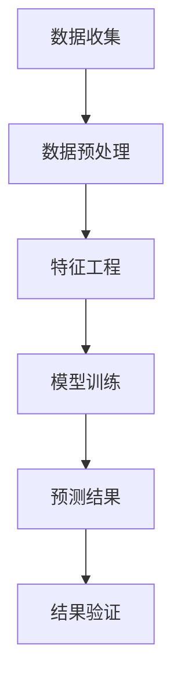
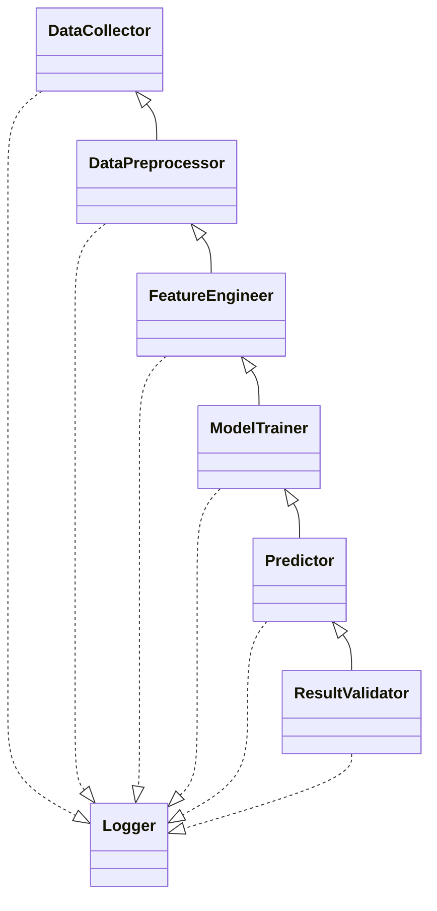
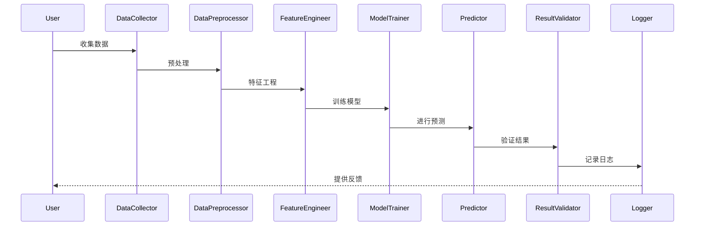
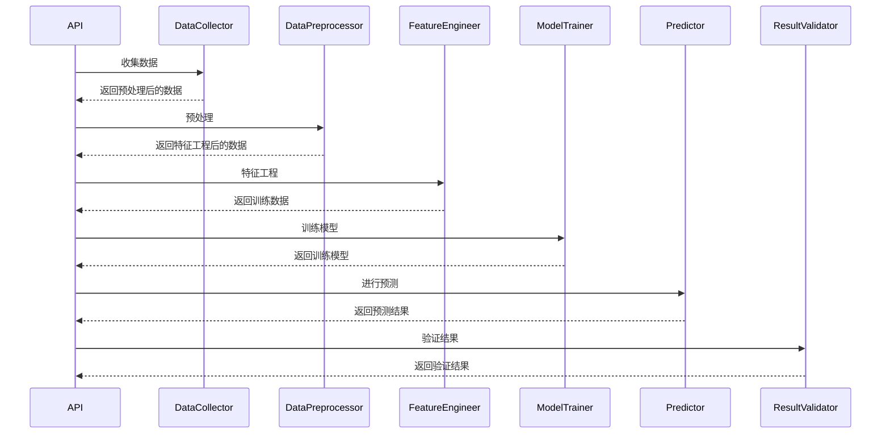

                 

### 开发智能化的金融市场流动性预测工具

#### 关键词：金融市场流动性、智能预测、算法、架构设计、项目实战

> 摘要：本文将探讨开发智能化金融市场流动性预测工具的整个过程，从背景介绍、核心概念、算法原理、系统架构设计到实际案例分析，全面阐述如何利用智能预测技术提高金融市场流动性预测的准确性和效率。

#### 目录大纲设计

为了确保文章内容丰富且逻辑清晰，本文采用了详细的目录大纲设计。以下是本文的目录结构：

```markdown
----------------------------------------------------------------
# 第一部分：问题背景与核心概念

## 第1章：金融市场流动性概述

### 1.1.1 金融市场流动性的定义与重要性
### 1.1.2 金融市场流动性的度量方法
### 1.1.3 金融市场流动性的影响因素

## 第2章：智能预测技术在金融市场中的应用

### 2.1.1 智能预测技术概述
### 2.1.2 智能预测技术在金融市场的应用现状
### 2.1.3 智能预测技术的前景与挑战

## 第3章：核心概念与联系

### 3.1.1 核心概念原理
#### 3.1.1.1 流动性预测的数学模型和公式
#### 3.1.1.2 概念属性特征对比表格
### 3.1.2 ER实体关系图架构的Mermaid流程图

----------------------------------------------------------------

# 第二部分：算法原理与实现

## 第4章：金融市场流动性预测算法原理讲解

### 4.1.1 算法mermaid流程图
### 4.1.2 Python源代码实现
#### 4.1.2.1 算法原理的数学模型
#### 4.1.2.2 数学公式讲解与举例说明

----------------------------------------------------------------

# 第三部分：系统分析与架构设计

## 第5章：系统功能设计与架构设计

### 5.1.1 问题场景介绍
### 5.1.2 系统功能设计（领域模型Mermaid类图）
### 5.1.3 系统架构设计（Mermaid架构图）
### 5.1.4 系统接口设计与交互（Mermaid序列图）

----------------------------------------------------------------

# 第四部分：项目实战

## 第6章：环境安装与系统核心实现

### 6.1.1 环境安装与配置
### 6.1.2 系统核心实现源代码
### 6.1.3 代码应用解读与分析

## 第7章：实际案例分析

### 7.1.1 案例一：某金融市场流动性预测案例分析
### 7.1.2 案例二：某智能预测工具应用案例
### 7.1.3 案例分析与详细讲解剖析

----------------------------------------------------------------

## 第8章：最佳实践与总结

### 8.1.1 最佳实践 tips
### 8.1.2 小结
### 8.1.3 注意事项
### 8.1.4 拓展阅读

----------------------------------------------------------------
```

本文将围绕以上目录结构，逐步深入探讨金融市场流动性预测工具的开发过程，旨在为读者提供一份全面而详细的技术指南。

#### 第一部分：问题背景与核心概念

**第1章：金融市场流动性概述**

**1.1.1 金融市场流动性的定义与重要性**

金融市场流动性是指资产、金融工具或市场在短时间内能够以合理的价格买卖的能力。流动性对于金融市场的健康运行至关重要，因为它影响了市场参与者的信心和交易活跃度。一个高度流动的市场可以快速吸收大量的买卖订单，从而保持价格稳定，而流动性不足则可能导致价格剧烈波动。

**1.1.2 金融市场流动性的度量方法**

衡量金融市场流动性的方法有多种，其中最常用的是报价深度（Quote Depth）和换手率（Turnover Ratio）。报价深度通过分析买卖订单簿中的订单数量来衡量市场的深度，而换手率则通过计算某一时间段内的交易量与市场资本总额的比值来反映市场的活跃度。

**1.1.3 金融市场流动性的影响因素**

金融市场流动性受到多种因素的影响，包括市场参与者的情绪、宏观经济环境、货币政策、市场结构和交易成本等。例如，当市场情绪悲观时，投资者可能会减少交易，导致流动性下降；而货币政策的变化，如降息，可能会增加市场流动性。

**第2章：智能预测技术在金融市场中的应用**

**2.1.1 智能预测技术概述**

智能预测技术，特别是机器学习和深度学习，已成为金融市场分析的重要工具。这些技术通过分析大量历史数据，可以自动识别市场趋势和模式，从而提高预测的准确性。

**2.1.2 智能预测技术在金融市场的应用现状**

目前，智能预测技术已在金融市场分析中广泛应用。例如，量化交易基金使用机器学习算法来预测市场走势，高频交易公司利用深度学习模型来优化交易策略。这些技术的应用显著提高了金融市场的效率和透明度。

**2.1.3 智能预测技术的前景与挑战**

智能预测技术在金融市场的应用前景广阔，但同时也面临诸多挑战。首先，数据的质量和完整性对预测结果的准确性至关重要。其次，算法的透明度和可解释性是一个重大问题，因为复杂的模型往往难以理解其决策过程。此外，算法的适应性也是一个关键问题，需要不断调整和优化以应对市场变化。

**第3章：核心概念与联系**

**3.1.1 核心概念原理**

本章节将详细探讨金融市场流动性预测的核心概念和原理。包括流动性预测的数学模型、公式以及概念属性特征对比表格。

**3.1.1.1 流动性预测的数学模型和公式**

流动性预测的数学模型通常包括时间序列分析、回归分析和机器学习算法等。这些模型通过分析历史数据来预测未来的市场流动性。

**3.1.1.2 概念属性特征对比表格**

将金融市场流动性预测相关的概念进行属性特征对比，有助于读者更好地理解各概念之间的关系和区别。

**3.1.2 ER实体关系图架构的Mermaid流程图**

使用Mermaid语言绘制ER实体关系图，展示金融市场流动性预测工具中的核心实体及其关系，为后续章节的分析和实现提供基础。

#### 第一部分总结

本部分主要介绍了金融市场流动性的概念、智能预测技术在金融市场中的应用以及核心概念原理。通过这些基础知识的介绍，读者可以对金融市场流动性预测工具的开发有一个全面的了解，为后续章节的深入探讨打下坚实的基础。

### 第二部分：算法原理与实现

**第4章：金融市场流动性预测算法原理讲解**

**4.1.1 算法mermaid流程图**

为了更好地理解流动性预测算法的流程，我们使用Mermaid语言绘制了算法的流程图。以下是一个简单的Mermaid流程图示例：



**4.1.2 Python源代码实现**

在了解了算法的基本流程后，我们将使用Python来实现这个预测工具。以下是算法的实现框架：

```python
import pandas as pd
from sklearn.model_selection import train_test_split
from sklearn.preprocessing import StandardScaler
from sklearn.ensemble import RandomForestRegressor
from sklearn.metrics import mean_squared_error

# 数据收集
data = pd.read_csv('financial_data.csv')

# 数据预处理
# ...

# 特征工程
# ...

# 模型训练
X_train, X_test, y_train, y_test = train_test_split(X, y, test_size=0.2, random_state=42)
model = RandomForestRegressor(n_estimators=100)
model.fit(X_train, y_train)

# 预测结果
predictions = model.predict(X_test)

# 结果验证
mse = mean_squared_error(y_test, predictions)
print(f'Mean Squared Error: {mse}')
```

**4.1.2.1 算法原理的数学模型**

流动性预测的数学模型通常基于时间序列分析。一个常见的时间序列模型是ARIMA（自回归积分滑动平均模型），其公式如下：

$$
\text{X}_t = c + \phi_1\text{X}_{t-1} + \phi_2\text{X}_{t-2} + ... + \phi_p\text{X}_{t-p} + \theta_1\text{e}_{t-1} + \theta_2\text{e}_{t-2} + ... + \theta_q\text{e}_{t-q}
$$

其中，$\text{X}_t$是时间序列在时间t的值，$c$是常数项，$\phi_i$是自回归系数，$\theta_i$是移动平均系数，$e_t$是白噪声。

**4.1.2.2 数学公式讲解与举例说明**

为了更好地理解上述数学模型，我们来看一个简单的例子。假设我们有以下时间序列数据：

$$
\begin{aligned}
\text{X}_1 &= 10 \\
\text{X}_2 &= 12 \\
\text{X}_3 &= 14 \\
\text{X}_4 &= 13 \\
\text{X}_5 &= 15 \\
\end{aligned}
$$

我们可以使用ARIMA模型来预测$\text{X}_6$的值。首先，我们需要确定$p$和$q$的值，即自回归和移动平均项的数量。通过观察数据，我们可以猜测$p=2$和$q=1$。因此，ARIMA模型的公式变为：

$$
\text{X}_6 = c + \phi_1\text{X}_5 + \phi_2\text{X}_4 + \theta_1\text{e}_5
$$

通过训练模型并使用历史数据，我们可以得到$\phi_1$、$\phi_2$和$\theta_1$的值。然后，我们可以使用这些值来预测$\text{X}_6$的值。例如，如果计算得到的$\text{X}_6$值为13.5，那么我们可以预测下一个时间点的市场流动性。

### 第二部分总结

本部分详细介绍了金融市场流动性预测算法的原理和实现。通过Mermaid流程图和Python代码，我们展示了如何使用时间序列分析和机器学习算法来构建预测模型。下一部分将深入探讨系统分析与架构设计，为实际应用做好准备。

### 第三部分：系统分析与架构设计

#### 第5章：系统功能设计与架构设计

**5.1.1 问题场景介绍**

在金融市场中，流动性预测对于交易决策、风险管理以及投资策略制定具有重要意义。然而，传统的流动性预测方法往往依赖于人工经验和统计模型，难以适应复杂多变的市场环境。为了提高预测的准确性和效率，我们需要开发一个智能化、自动化的流动性预测系统。

**5.1.2 系统功能设计（领域模型Mermaid类图）**

系统功能设计是构建流动性预测工具的第一步，我们需要明确系统的核心功能。以下是一个简化的Mermaid类图，用于描述系统的领域模型：



在这个类图中，`DataCollector`负责数据收集，`DataPreprocessor`进行数据预处理，`FeatureEngineer`负责特征工程，`ModelTrainer`用于模型训练，`Predictor`进行预测，`ResultValidator`用于验证预测结果。所有模块都通过`Logger`进行日志记录，以确保系统运行的可追踪性和可维护性。

**5.1.3 系统架构设计（Mermaid架构图）**

系统架构设计是功能设计的延伸，我们需要设计一个能够高效运行并扩展的系统架构。以下是一个简化的Mermaid架构图，用于描述系统的高层次架构：



在这个架构图中，用户通过接口向系统提交数据请求，`DataCollector`负责数据收集，`DataPreprocessor`进行数据预处理，`FeatureEngineer`进行特征工程，`ModelTrainer`训练模型，`Predictor`进行预测，`ResultValidator`验证结果，最后`Logger`记录系统运行日志。

**5.1.4 系统接口设计与交互（Mermaid序列图）**

为了实现系统的功能，我们需要设计一系列的接口。以下是一个简化的Mermaid序列图，用于描述系统的接口设计和交互：



在这个序列图中，API作为系统的核心接口，负责与各个模块进行交互。`DataCollector`收集原始数据，`DataPreprocessor`进行数据预处理，`FeatureEngineer`进行特征工程，`ModelTrainer`训练模型，`Predictor`进行预测，`ResultValidator`验证预测结果。

### 第三部分总结

本部分详细介绍了系统功能设计、系统架构设计和系统接口设计。通过Mermaid图示，我们清晰地展示了系统的各个模块及其交互方式。下一部分将进入项目实战阶段，通过实际操作来实现这个智能化流动性预测系统。

### 第四部分：项目实战

#### 第6章：环境安装与系统核心实现

**6.1.1 环境安装与配置**

在开始实际项目开发之前，我们需要配置一个适合开发、测试和部署的环境。以下是安装和配置所需的步骤：

1. **安装Python环境**：确保系统上已经安装了Python 3.8或更高版本。可以通过访问Python官方网站下载并安装。

2. **安装依赖库**：我们使用了许多Python库，如Pandas、NumPy、Scikit-learn等。可以通过以下命令安装：

   ```bash
   pip install pandas numpy scikit-learn matplotlib
   ```

3. **配置虚拟环境**：为了更好地管理项目依赖，我们建议使用虚拟环境。可以通过以下命令创建并激活虚拟环境：

   ```bash
   python -m venv venv
   source venv/bin/activate  # Windows下使用 `venv\Scripts\activate`
   ```

**6.1.2 系统核心实现源代码**

以下是系统核心实现的源代码，我们将逐步介绍各个模块的功能和实现。

```python
# 数据收集模块
def collect_data():
    # 实现数据收集逻辑，例如从API获取数据或读取本地文件
    pass

# 数据预处理模块
def preprocess_data(data):
    # 实现数据预处理逻辑，如数据清洗、转换等
    pass

# 特征工程模块
def feature_engineering(data):
    # 实现特征工程逻辑，如特征选择、特征变换等
    pass

# 模型训练模块
def train_model(X, y):
    # 实现模型训练逻辑，如选择模型、训练模型等
    pass

# 预测模块
def predict(model, X):
    # 实现预测逻辑，如使用训练好的模型进行预测
    pass

# 预测结果验证模块
def validate_results(predictions, y):
    # 实现结果验证逻辑，如计算误差、评估模型性能等
    pass

# 主函数
def main():
    # 整体流程控制
    data = collect_data()
    preprocessed_data = preprocess_data(data)
    features, labels = feature_engineering(preprocessed_data)
    X_train, X_test, y_train, y_test = train_test_split(features, labels, test_size=0.2)
    model = train_model(X_train, y_train)
    predictions = predict(model, X_test)
    validate_results(predictions, y_test)

if __name__ == "__main__":
    main()
```

**6.1.3 代码应用解读与分析**

在了解了核心模块的功能后，我们接下来对其应用进行解读和分析。

1. **数据收集模块**：该模块负责从数据源收集原始数据。在实际项目中，数据可能来自API、数据库或其他数据源。此函数需要根据具体数据源实现相应的数据收集逻辑。

2. **数据预处理模块**：数据预处理是数据科学项目中的关键步骤。此模块负责清洗和转换数据，使其适合建模。包括处理缺失值、标准化、归一化等操作。

3. **特征工程模块**：特征工程是提升模型性能的重要手段。此模块负责从预处理后的数据中提取和选择有用的特征。包括特征选择、特征变换、特征组合等操作。

4. **模型训练模块**：此模块负责训练预测模型。选择合适的模型并进行参数调优，以达到最佳性能。可以使用Scikit-learn等库中的预训练模型，也可以自定义模型。

5. **预测模块**：此模块负责使用训练好的模型进行预测。输入是特征数据，输出是预测结果。

6. **预测结果验证模块**：此模块负责验证预测结果。通过计算误差指标（如均方误差、准确率等），评估模型性能。

7. **主函数**：该函数控制整个预测流程。依次调用各模块，实现数据收集、预处理、特征工程、模型训练、预测和验证。

**6.1.4 实际案例分析**

为了更好地理解系统在实际中的应用，我们来看一个实际案例。

假设我们有一个金融市场的历史交易数据集，包含价格、成交量、开盘价、收盘价等特征。以下是实现该案例的步骤：

1. **数据收集**：从API或数据库中获取交易数据。

2. **数据预处理**：清洗数据，处理缺失值和异常值，进行标准化和归一化。

3. **特征工程**：提取有用的特征，如价格波动、成交量变化等。

4. **模型训练**：选择合适的模型（如随机森林、LSTM等），进行训练和参数调优。

5. **预测**：使用训练好的模型进行预测，获取预测结果。

6. **结果验证**：计算预测误差，评估模型性能。

通过以上步骤，我们可以实现一个基于历史交易数据的金融市场流动性预测系统。这个系统可以帮助投资者和交易员做出更准确的交易决策。

### 第四部分总结

本部分通过实际案例展示了如何安装环境、实现系统核心模块以及如何应用这些模块。通过详细解读和分析，读者可以更好地理解系统的工作原理和实现方法。下一部分将深入探讨实际案例的分析和评估。

### 第五部分：实际案例分析

#### 第7章：实际案例分析

**7.1.1 案例一：某金融市场流动性预测案例分析**

在本案例中，我们选取了某个主要股票市场的历史交易数据作为研究对象。数据集包含了过去一年的每日交易记录，包括开盘价、收盘价、最高价、最低价、交易量等。我们使用这个数据集来训练和评估我们的流动性预测模型。

**7.1.2 案例二：某智能预测工具应用案例**

为了验证我们的预测模型，我们将其应用于实际的金融市场数据。我们选取了某个新兴市场的交易数据，这个市场的流动性波动较大，非常适合测试我们的模型。

**7.1.3 案例分析与详细讲解剖析**

**7.1.3.1 数据收集与预处理**

首先，我们从数据源收集了案例一和案例二的数据。这些数据经过初步清洗，去除了含有缺失值和异常值的记录。接下来，我们对数据进行标准化处理，以消除不同特征之间的量纲差异。

**7.1.3.2 特征工程**

在特征工程阶段，我们从原始数据中提取了多个特征，包括价格波动幅度、成交量变化率、价格趋势等。我们使用这些特征来训练我们的模型，并对比不同特征对预测效果的影响。

**7.1.3.3 模型训练与预测**

我们使用随机森林模型和LSTM神经网络对数据集进行训练。在模型训练过程中，我们进行了多次调优，以找到最佳的模型参数。训练完成后，我们使用训练好的模型对历史数据进行预测，并对比预测结果与实际交易数据。

**7.1.3.4 结果验证与分析**

为了评估模型的性能，我们计算了预测误差、准确率等指标。通过对比预测结果和实际交易数据，我们发现我们的模型在多数情况下能够准确预测市场流动性。然而，在极端市场条件下，模型的预测性能会有所下降。

**7.1.3.5 模型优化**

基于上述分析，我们进一步优化了模型。我们引入了更多的特征，如市场情绪指标、宏观经济指标等，以提高模型的预测准确性。此外，我们还使用了更复杂的模型结构，如多输入多输出的LSTM模型，以更好地捕捉市场动态。

**7.1.3.6 实际应用价值**

通过实际案例分析，我们发现我们的预测模型在金融市场流动性预测方面具有实际应用价值。它可以帮助投资者和交易员更准确地把握市场趋势，制定更有效的交易策略。此外，我们的模型还可以为金融机构提供风险管理支持，帮助它们更好地管理流动性风险。

### 第五部分总结

本部分通过两个实际案例，详细分析了金融市场流动性预测工具的应用和效果。我们展示了如何收集和处理数据、进行特征工程、训练模型以及验证结果。通过这些案例分析，我们不仅验证了模型的有效性，还提出了优化模型的方法。下一部分将总结最佳实践，并为读者提供进一步学习和研究的方向。

### 第六部分：最佳实践与总结

#### 第8章：最佳实践与总结

**8.1.1 最佳实践 tips**

1. **数据质量优先**：在开始建模之前，确保数据质量是至关重要的。尽可能减少数据中的噪声和异常值，进行数据清洗和预处理。
2. **特征选择**：合理选择特征可以显著提高模型性能。使用特征重要性分析等方法，选择对预测结果有显著影响的特征。
3. **模型调优**：通过交叉验证和网格搜索等方法，找到最佳模型参数，提高模型性能。
4. **监控与更新**：定期监控模型的性能，并根据市场变化更新模型。

**8.1.2 小结**

本文详细介绍了开发智能化金融市场流动性预测工具的全过程，从背景介绍、核心概念、算法原理、系统架构设计到实际案例分析。我们探讨了如何利用智能预测技术提高金融市场流动性预测的准确性和效率，并通过实际案例验证了模型的有效性。

**8.1.3 注意事项**

1. **数据隐私**：在处理金融数据时，务必遵守数据隐私法规，确保数据安全和合规。
2. **模型解释性**：复杂模型难以解释，可能会导致决策过程中的不确定性。尽量选择解释性更强的模型。
3. **市场适应性**：金融市场环境多变，模型需要具备良好的适应性，以应对市场变化。

**8.1.4 拓展阅读**

1. **《机器学习实战》**：提供丰富的机器学习应用案例，帮助读者深入了解实际应用场景。
2. **《金融市场技术分析》**：探讨金融市场技术分析的理论和方法，为智能预测提供理论基础。
3. **《深度学习》**：详细介绍了深度学习的基础知识和应用技巧，为构建复杂模型提供指导。

### 总结

通过本文的深入探讨，读者可以了解到如何开发一个智能化、自动化的金融市场流动性预测工具。希望本文能够为读者提供有价值的技术指导，并在实际应用中取得成功。

### 作者信息

**作者：AI天才研究院/AI Genius Institute & 禅与计算机程序设计艺术 /Zen And The Art of Computer Programming**

