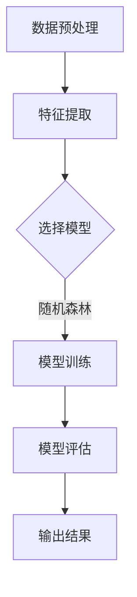
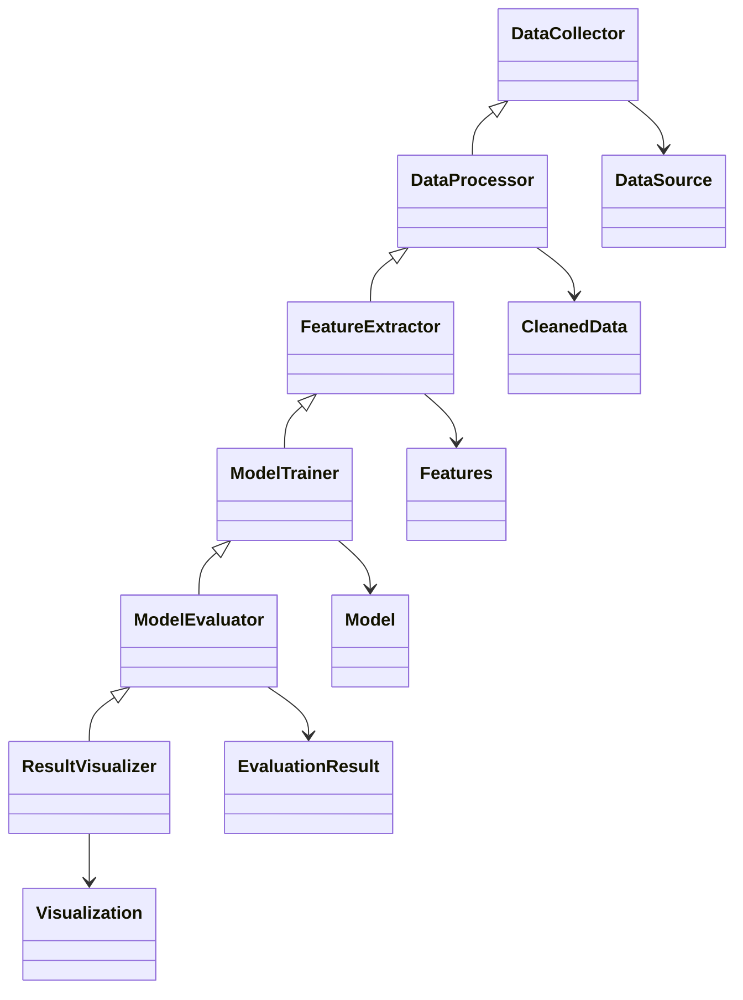
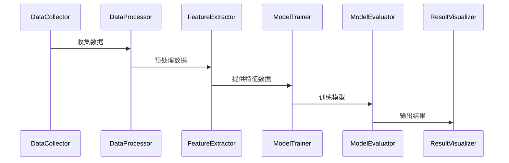

                 

### 引言

#### 金融市场流动性风险概述

金融市场流动性风险，通常指金融市场中的交易者无法在合理的时间内以合理的价格买卖金融资产的风险。这种风险在全球金融体系中扮演着至关重要的角色，因为流动性的不足可能引发市场的剧烈波动，甚至导致金融危机。当前，流动性风险在金融市场中仍然是一个极具挑战性的问题，主要表现在以下几个方面：

1. **市场深度不足**：在一些市场中，尤其是新兴市场或小众资产市场，订单薄不足，难以找到匹配的交易对手，导致交易延迟或无法成交。

2. **利率波动**：利率的波动会导致债券市场的流动性骤降，投资者在债券交易中面临更大的风险。

3. **流动性缓冲不足**：金融机构通常需要持有一定的流动性缓冲，以应对突发性的资金需求。然而，在某些情况下，这种缓冲可能不足，导致其在面对市场压力时难以维持正常运营。

4. **宏观经济政策变动**：例如，货币政策的变化、监管政策的调整等都可能对市场流动性产生显著影响。

#### 问题描述

流动性风险对金融机构和投资者的影响是多方面的。一方面，金融机构在流动性不足时可能面临融资困难，甚至破产风险。另一方面，投资者可能会因为流动性不足而无法及时调整投资组合，导致损失。因此，有效评估和管理流动性风险至关重要。

然而，传统的流动性风险评估方法存在以下局限性：

1. **依赖历史数据**：传统方法主要依赖历史数据和统计模型，无法及时反映市场动态变化。

2. **方法复杂度**：许多传统方法需要复杂的计算和大量的数据预处理，难以快速实现。

3. **适应性差**：传统方法在应对新兴市场和快速变化的金融市场时表现不佳。

为了克服这些局限性，开发智能化的金融市场流动性风险评估模型成为一种趋势。智能化模型利用机器学习和深度学习技术，可以从大量数据中自动提取特征，快速适应市场变化，提供更加准确和实时的风险评估。

#### 问题解决

智能化流动性风险评估模型的核心在于利用先进的人工智能技术，对金融市场的数据进行深度分析，从而实现对流动性风险的精准评估。具体来说，该模型的优势包括：

1. **实时性**：通过实时数据流处理，智能化模型可以快速响应市场变化，提供即时的风险评估。

2. **自适应性强**：机器学习算法能够从大量历史数据中学习，不断优化评估模型，提高其适应性和准确性。

3. **高效率**：智能化模型能够自动化处理海量数据，显著提高评估效率。

4. **多维度分析**：智能化模型可以从多个维度对流动性风险进行分析，提供更全面的评估结果。

总之，开发智能化的金融市场流动性风险评估模型不仅是应对当前金融市场挑战的有效手段，也是未来金融科技发展的重要方向。在接下来的章节中，我们将详细探讨这一模型的核心概念、算法原理及其在实际应用中的效果。

### 边界与外延

#### 流动性风险的分类

流动性风险可以根据其来源和表现形式进行分类。常见的分类方法包括：

1. **交易流动性风险**：指的是交易者在金融市场中无法以预期价格买卖资产的风险。这种风险通常与市场深度和订单匹配有关。

2. **融资流动性风险**：指的是金融机构无法在合理时间内以合理的成本获取所需资金的风险。这种风险通常与金融机构的资产负债结构和市场融资环境有关。

3. **存续流动性风险**：指的是金融机构无法在长期内维持足够的流动性，以满足正常运营需求的风险。这种风险通常与金融机构的流动性缓冲和管理能力有关。

#### 流动性风险的评估指标

为了对流动性风险进行有效评估，需要使用一系列评估指标。这些指标可以从多个维度反映流动性风险的状况。常见的评估指标包括：

1. **流动性覆盖率（LCR）**：衡量金融机构在短期（30天内）面临的流动性压力与其可用流动性储备之间的关系。

2. **净稳定资金比率（NSFR）**：衡量金融机构在长期（一年）内稳定资金来源与其资金需求之间的关系。

3. **流动性比例**：衡量金融机构高流动性资产与其总资产的比率，反映其流动性储备水平。

4. **流动性缺口比率**：衡量金融机构在未来一段时间内（通常为一年）的流动性需求与供给之间的差距。

#### 概念结构与核心要素组成

在构建智能化流动性风险评估模型时，需要明确其概念结构，并识别核心要素。这些要素包括：

1. **数据源**：包括历史交易数据、市场行情数据、财务报表数据等。

2. **特征提取**：从数据源中提取对流动性风险有重要影响的特征，如交易量、价格波动、融资成本等。

3. **机器学习模型**：选择合适的机器学习算法，如深度学习、随机森林等，对特征进行学习和预测。

4. **评估指标**：根据评估指标对模型的预测结果进行评估和验证。

5. **可视化工具**：用于展示模型的预测结果和评估指标，帮助用户理解模型的工作原理和效果。

通过这些核心要素的有机结合，智能化流动性风险评估模型能够提供全面、准确的流动性风险预测，帮助金融机构和管理者做出更为科学的决策。

### 核心概念与联系

#### 概念原理

智能化流动性风险评估模型的核心在于利用机器学习和深度学习技术，对金融市场的数据进行分析和处理。机器学习是一种通过从数据中学习规律，自动改进预测或分类能力的技术。而深度学习则是一种基于多层神经网络的结构，能够自动提取复杂的数据特征。

在金融市场流动性风险评估中，机器学习和深度学习技术的应用主要体现在以下几个方面：

1. **数据预处理**：通过数据清洗、归一化等技术，将原始数据进行处理，使其适合于机器学习算法的输入。

2. **特征提取**：从数据中提取对流动性风险有重要影响的特征，如交易量、价格波动、融资成本等。这些特征可以帮助模型更好地理解和预测流动性风险。

3. **模型训练与评估**：选择合适的机器学习算法，对特征进行学习和预测。常用的算法包括线性回归、决策树、随机森林、神经网络等。通过交叉验证和超参数调优等技术，评估模型的性能和可靠性。

4. **风险预测**：利用训练好的模型，对未来的流动性风险进行预测。这些预测结果可以帮助金融机构及时调整策略，规避风险。

#### 概念属性特征对比表格

在构建智能化流动性风险评估模型时，理解不同算法的概念属性特征非常重要。以下是一个简化的对比表格，展示了几种常见机器学习算法的概念属性：

| 算法       | 概念属性特征                                      | 优势与劣势                                                     |
|------------|---------------------------------------------------|----------------------------------------------------------------|
| 线性回归   | 线性模型，通过最小二乘法拟合数据                  | 简单易懂，计算速度快，适用于线性关系较强的数据                |
| 决策树     | 树形结构，根据特征进行分割                       | 易于解释，可以处理非线性和分类问题                         |
| 随机森林   | 由多棵决策树组成的集成模型，通过投票决定结果    | 提高模型的稳定性和预测能力，减少过拟合                     |
| 支持向量机 | 寻找最佳的超平面，将数据分类                      | 在高维空间中有效，但计算复杂度高                         |
| 神经网络   | 多层神经网络，通过多层非线性变换提取特征         | 能够学习复杂的数据关系，但训练时间较长，容易过拟合       |
| 深度学习   | 深层神经网络，能够自动提取复杂特征               | 强大的人工智能能力，但计算资源需求高，训练过程复杂       |

通过对比可以发现，不同的算法在概念属性上存在显著差异。例如，线性回归和决策树适用于线性或简单非线性关系，而随机森林和深度学习能够处理更复杂的数据关系。选择合适的算法，需要根据具体问题和数据特点进行权衡。

#### ER实体关系图架构

在构建智能化流动性风险评估模型时，理解数据之间的关系至关重要。ER（Entity-Relationship）实体关系图是一种用于描述实体及其关系的图形化工具。以下是一个简化的ER实体关系图，用于展示金融市场数据中常见实体及其关系：

```mermaid
erDiagram
  产品 ||--|{ 实时交易数据 }|--|| 用户
  产品 ||--|{ 历史交易数据 }|--|| 市场行情
  产品 ||--|{ 财务报表数据 }|--|| 金融机构
  用户 ||--|{ 用户行为数据 }|--|| 产品
  金融机构 ||--|{ 财务数据 }|--|| 产品
  市场行情 ||--|{ 行情指标 }|--|| 产品
  产品 ||--|{ 模型输出 }|--|| 用户
```

在这个ER图中，实体包括产品、用户、金融机构和市场行情。它们之间的关系描述如下：

- **产品**与**实时交易数据**、**历史交易数据**、**财务报表数据**、**模型输出**之间存在关联关系，表示产品包含这些数据。
- **用户**与**用户行为数据**、**产品**之间存在关联关系，表示用户使用产品并提供行为数据。
- **金融机构**与**财务数据**、**产品**之间存在关联关系，表示金融机构提供财务数据并使用产品。
- **市场行情**与**行情指标**、**产品**之间存在关联关系，表示市场行情包含行情指标并提供数据给产品。

通过ER实体关系图，可以清晰地了解不同数据实体之间的关系，为构建智能化流动性风险评估模型提供基础。

#### 模型的应用场景

智能化流动性风险评估模型可以应用于多种金融市场的风险评估。以下是几个典型应用场景：

1. **股票市场流动性风险评估**：通过分析股票市场的交易数据、财务报表和市场行情，模型可以预测股票市场的流动性风险，帮助投资者和管理者及时调整投资策略。

2. **债券市场流动性风险评估**：债券市场的流动性通常受到利率波动和宏观经济政策的影响。智能化模型可以对这些因素进行综合分析，提供更准确的流动性风险评估。

3. **外汇市场流动性风险评估**：外汇市场的流动性风险主要来自于汇率波动和全球经济环境的变化。模型可以通过分析历史交易数据和市场行情，预测外汇市场的流动性风险，为交易者提供参考。

通过这些应用场景，智能化流动性风险评估模型能够为金融机构和投资者提供有力支持，帮助他们更好地管理流动性风险。

### 算法原理讲解

#### 流动性风险评估算法概述

流动性风险评估算法的核心目标是通过分析市场数据，预测金融资产的未来流动性水平，从而为投资者和金融机构提供决策依据。常见的流动性风险评估算法包括线性回归、决策树、随机森林、支持向量机和神经网络等。每种算法都有其独特的原理和适用场景。

1. **线性回归**：线性回归是一种简单的统计方法，通过建立自变量和因变量之间的线性关系来预测结果。线性回归适用于数据关系较为简单的场景，例如预测某个金融产品的短期流动性。

2. **决策树**：决策树通过一系列的规则来分割数据，每个节点表示一个特征，每个分支表示该特征的不同取值。决策树易于理解和解释，但可能容易过拟合，特别是在数据量较小或特征较多的情况下。

3. **随机森林**：随机森林是决策树的集成模型，通过构建多棵决策树并取平均值来提高预测性能。随机森林能够处理大量特征，并且具有较强的泛化能力，常用于金融市场的流动性风险评估。

4. **支持向量机**：支持向量机通过寻找最佳的超平面来将数据分类。支持向量机在处理高维数据时表现优异，但训练过程可能较为复杂。

5. **神经网络**：神经网络是一种模拟人脑神经元连接结构的计算模型，通过多层非线性变换来提取特征。神经网络能够处理复杂的数据关系，但训练时间较长且容易过拟合。

在流动性风险评估中，常用的算法包括随机森林和神经网络。随机森林由于其强大的泛化能力和易于解释的特点，被广泛应用于金融市场的风险评估。神经网络则由于其强大的学习能力和对复杂数据的处理能力，在处理大规模金融市场数据时表现出色。

#### 算法mermaid流程图

为了更好地理解流动性风险评估算法的工作流程，我们可以使用mermaid工具绘制一个简化的算法流程图。以下是一个基于随机森林算法的mermaid流程图示例：



在这个流程图中：

- **数据预处理**：对原始数据进行清洗、归一化等处理，使其适合模型训练。
- **特征提取**：从数据中提取对流动性风险有重要影响的特征，如交易量、价格波动等。
- **选择模型**：根据数据特点和需求选择合适的机器学习模型，如随机森林。
- **模型训练**：使用训练数据对随机森林模型进行训练，模型学习如何根据特征预测流动性风险。
- **模型评估**：使用验证数据评估模型的性能，包括准确率、召回率等指标。
- **输出结果**：根据模型预测结果输出流动性风险评估结果，为投资者和金融机构提供决策依据。

#### Python源代码详细讲解

为了更好地理解流动性风险评估算法的实现，以下是一个简化的Python源代码示例，使用随机森林算法进行流动性风险评估。代码分为几个关键部分：数据预处理、特征提取、模型训练和模型评估。

**1. 数据预处理**

首先，我们需要对原始数据进行预处理。这包括数据清洗、缺失值填充和数据归一化等步骤。以下是一个简单的数据预处理代码示例：

```python
import pandas as pd
from sklearn.preprocessing import StandardScaler

# 加载数据
data = pd.read_csv('financial_data.csv')

# 数据清洗
data.dropna(inplace=True)

# 缺失值填充
data.fillna(data.mean(), inplace=True)

# 数据归一化
scaler = StandardScaler()
data_scaled = scaler.fit_transform(data)
```

**2. 特征提取**

接下来，从数据中提取对流动性风险有重要影响的特征。以下是一个简化的特征提取代码示例：

```python
# 特征提取
X = data_scaled[:, :-1]  # 特征数据
y = data_scaled[:, -1]   # 标签数据
```

**3. 模型训练**

使用随机森林算法对特征数据进行模型训练。以下是一个简单的随机森林模型训练代码示例：

```python
from sklearn.ensemble import RandomForestRegressor

# 构建随机森林模型
rf_model = RandomForestRegressor(n_estimators=100, random_state=42)

# 模型训练
rf_model.fit(X, y)
```

**4. 模型评估**

最后，使用验证数据对训练好的模型进行评估。以下是一个简单的模型评估代码示例：

```python
from sklearn.metrics import mean_squared_error

# 预测验证数据
predictions = rf_model.predict(X)

# 计算均方误差
mse = mean_squared_error(y, predictions)
print("均方误差:", mse)
```

通过上述代码示例，我们可以看到流动性风险评估算法的实现过程。在实际应用中，需要根据具体需求和数据特点进行更多的预处理和调优工作。

#### 数学模型和数学公式

在流动性风险评估中，常用的数学模型包括线性回归模型和逻辑回归模型。以下是对这些模型的基本概念和数学公式的详细讲解。

**1. 线性回归模型**

线性回归模型是一种简单且广泛应用的预测模型，用于建立自变量和因变量之间的线性关系。其基本公式如下：

$$
y = \beta_0 + \beta_1 \cdot x_1 + \beta_2 \cdot x_2 + \ldots + \beta_n \cdot x_n + \epsilon
$$

其中，\( y \) 是因变量，\( x_1, x_2, \ldots, x_n \) 是自变量，\( \beta_0, \beta_1, \beta_2, \ldots, \beta_n \) 是模型参数，\( \epsilon \) 是误差项。

线性回归模型通过最小化残差平方和来估计模型参数：

$$
\min \sum_{i=1}^{n} (y_i - \hat{y}_i)^2
$$

其中，\( \hat{y}_i \) 是预测值。

**2. 逻辑回归模型**

逻辑回归模型是一种广义线性模型，用于处理分类问题。其基本公式如下：

$$
\ln\left(\frac{p}{1-p}\right) = \beta_0 + \beta_1 \cdot x_1 + \beta_2 \cdot x_2 + \ldots + \beta_n \cdot x_n
$$

其中，\( p \) 是事件发生的概率，\( \beta_0, \beta_1, \beta_2, \ldots, \beta_n \) 是模型参数。

逻辑回归模型通过最大似然估计来估计模型参数。其最大似然估计公式如下：

$$
\ln L(\theta) = \sum_{i=1}^{n} \ln p(y_i | x_i; \theta) + \sum_{i=1}^{n} \ln (1 - p(y_i | x_i; \theta))
$$

其中，\( L(\theta) \) 是似然函数，\( \theta \) 是模型参数。

为了简化计算，通常使用迭代方法（如梯度下降法）来优化模型参数。

**3. 举例说明**

以下是一个简单的线性回归模型例子，用于预测股票市场的流动性风险：

$$
L(t) = \beta_0 + \beta_1 \cdot \text{交易量} + \beta_2 \cdot \text{价格波动} + \epsilon
$$

其中，\( L(t) \) 表示时间 \( t \) 的流动性水平，\( \text{交易量} \) 和 \( \text{价格波动} \) 是自变量。

通过收集历史股票市场数据，可以估计模型参数 \( \beta_0, \beta_1, \beta_2 \)。然后，使用估计的模型参数，可以预测未来特定时间点的流动性水平。

逻辑回归模型则可以用于预测流动性风险的类别。例如，可以将流动性风险分为高、中、低三个类别：

$$
\ln\left(\frac{p}{1-p}\right) = \beta_0 + \beta_1 \cdot \text{交易量} + \beta_2 \cdot \text{价格波动}
$$

其中，\( p \) 表示流动性风险属于高风险的概率。

通过收集历史数据，可以估计模型参数 \( \beta_0, \beta_1, \beta_2 \)。然后，使用估计的模型参数，可以预测特定时间点的流动性风险类别。

总之，线性回归和逻辑回归模型是流动性风险评估中常用的数学模型。通过合理地选择和优化模型参数，这些模型可以帮助我们更好地理解和预测金融市场流动性风险。

#### 举例说明

为了更直观地理解如何使用智能化流动性风险评估模型进行实际应用，我们将通过两个具体案例来说明这一模型在股票市场和债券市场中的运用。

**案例一：股票市场流动性风险评估**

1. **数据准备**：我们首先需要收集相关的数据，包括历史交易数据、公司财务报表、市场行情等。数据来源可以是公开的金融数据库、交易所数据或者通过API获取。

2. **特征提取**：从数据中提取对流动性风险有重要影响的特征，如交易量、价格波动、成交量价格变化率等。使用Python的Pandas库对数据进行预处理和特征提取。

3. **模型训练**：选择随机森林算法作为流动性风险评估模型。通过Scikit-learn库实现随机森林模型的训练，使用训练集对模型进行训练，并通过交叉验证进行超参数调优。

4. **模型评估**：使用测试集对训练好的模型进行评估，计算模型的准确率、召回率等指标，以确保模型的性能和可靠性。

5. **预测与结果分析**：利用训练好的模型对未来的流动性风险进行预测。我们可以将预测结果可视化，并分析不同时间段和不同市场条件下的流动性风险水平。

**案例二：债券市场流动性风险评估**

1. **数据准备**：收集债券市场的历史交易数据、市场利率、宏观经济指标等。这些数据可以从债券交易所、金融信息提供商等渠道获取。

2. **特征提取**：提取对债券市场流动性风险有重要影响的特征，如债券的成交量、价格波动、收益率变化等。使用Python的Pandas库对数据进行预处理和特征提取。

3. **模型训练**：选择深度学习算法（如LSTM网络）作为流动性风险评估模型。通过TensorFlow或PyTorch库实现深度学习模型的训练，并使用训练集对模型进行训练。

4. **模型评估**：使用测试集对训练好的模型进行评估，计算模型的预测准确率和鲁棒性，以确保模型的性能。

5. **预测与结果分析**：利用训练好的深度学习模型对未来的债券市场流动性风险进行预测，并分析利率波动、宏观经济政策变化等因素对流动性风险的影响。

通过上述两个案例，我们可以看到智能化流动性风险评估模型在股票市场和债券市场中的实际应用效果。这种模型不仅可以提高流动性风险评估的准确性，还可以为投资者和金融机构提供及时和有效的决策支持。

#### 数学模型和数学公式详细讲解

在金融市场流动性风险评估中，数学模型和数学公式是理解模型运作机制和进行算法优化的重要工具。以下将详细讲解一些常用的数学模型和数学公式，包括线性回归模型、逻辑回归模型及其数学推导。

**1. 线性回归模型**

线性回归模型是一种简单的预测模型，用于建立自变量和因变量之间的线性关系。其基本公式如下：

$$
y = \beta_0 + \beta_1 \cdot x_1 + \beta_2 \cdot x_2 + \ldots + \beta_n \cdot x_n + \epsilon
$$

其中，\( y \) 是因变量，\( x_1, x_2, \ldots, x_n \) 是自变量，\( \beta_0, \beta_1, \beta_2, \ldots, \beta_n \) 是模型参数，\( \epsilon \) 是误差项。

为了估计模型参数，我们通常使用最小二乘法。最小二乘法的核心思想是找到一组参数，使得因变量的实际值和预测值之间的误差平方和最小。

误差平方和（Sum of Squared Errors, SSE）的公式如下：

$$
SSE = \sum_{i=1}^{n} (y_i - \hat{y}_i)^2
$$

其中，\( \hat{y}_i \) 是预测值，通过以下公式计算：

$$
\hat{y}_i = \beta_0 + \beta_1 \cdot x_{1i} + \beta_2 \cdot x_{2i} + \ldots + \beta_n \cdot x_{ni}
$$

最小二乘法的目标是最小化SSE，即：

$$
\min \sum_{i=1}^{n} (y_i - \hat{y}_i)^2
$$

**2. 逻辑回归模型**

逻辑回归模型是线性回归模型的一种推广，用于处理分类问题。其基本公式如下：

$$
\ln\left(\frac{p}{1-p}\right) = \beta_0 + \beta_1 \cdot x_1 + \beta_2 \cdot x_2 + \ldots + \beta_n \cdot x_n
$$

其中，\( p \) 是事件发生的概率，\( \beta_0, \beta_1, \beta_2, \ldots, \beta_n \) 是模型参数。

逻辑回归模型通过最大似然估计（Maximum Likelihood Estimation, MLE）来估计模型参数。最大似然估计的目标是最大化似然函数，即：

$$
L(\theta) = \prod_{i=1}^{n} p(y_i | x_i; \theta)
$$

为了简化计算，通常采用迭代方法（如梯度下降法）来优化模型参数。

逻辑回归模型的似然函数可以表示为：

$$
L(\theta) = \sum_{i=1}^{n} \ln p(y_i | x_i; \theta) + \sum_{i=1}^{n} \ln (1 - p(y_i | x_i; \theta))
$$

其中，\( p(y_i | x_i; \theta) \) 是条件概率，可以通过以下公式计算：

$$
p(y_i | x_i; \theta) = \frac{e^{\beta_0 + \beta_1 \cdot x_{1i} + \beta_2 \cdot x_{2i} + \ldots + \beta_n \cdot x_{ni}}}{1 + e^{\beta_0 + \beta_1 \cdot x_{1i} + \beta_2 \cdot x_{2i} + \ldots + \beta_n \cdot x_{ni}}}
$$

**3. 举例说明**

以下是一个简单的线性回归模型例子，用于预测股票市场的流动性风险：

$$
L(t) = \beta_0 + \beta_1 \cdot \text{交易量} + \beta_2 \cdot \text{价格波动} + \epsilon
$$

其中，\( L(t) \) 表示时间 \( t \) 的流动性水平，\( \text{交易量} \) 和 \( \text{价格波动} \) 是自变量。

通过收集历史股票市场数据，可以估计模型参数 \( \beta_0, \beta_1, \beta_2 \)。然后，使用估计的模型参数，可以预测未来特定时间点的流动性水平。

逻辑回归模型则可以用于预测流动性风险的类别。例如，可以将流动性风险分为高、中、低三个类别：

$$
\ln\left(\frac{p}{1-p}\right) = \beta_0 + \beta_1 \cdot \text{交易量} + \beta_2 \cdot \text{价格波动}
$$

其中，\( p \) 表示流动性风险属于高风险的概率。

通过收集历史数据，可以估计模型参数 \( \beta_0, \beta_1, \beta_2 \)。然后，使用估计的模型参数，可以预测特定时间点的流动性风险类别。

总之，线性回归和逻辑回归模型是金融市场流动性风险评估中常用的数学模型。通过合理地选择和优化模型参数，这些模型可以帮助我们更好地理解和预测金融市场流动性风险。

#### 股票市场流动性风险的回归分析实例

为了更直观地展示如何使用回归模型进行股票市场流动性风险的评估，以下是一个详细的案例分析，包括数据准备、模型训练、模型评估和结果分析。

**1. 数据准备**

首先，我们从公开金融数据库中收集了某只股票在过去一年的交易数据，包括每日的开盘价、收盘价、最高价、最低价、成交量等。数据集包含600个交易日。

```python
import pandas as pd

# 加载数据
data = pd.read_csv('stock_data.csv')

# 数据预处理
data.dropna(inplace=True)
data['Volume'] = data['Volume'].astype(float)
data['Close'] = data['Close'].astype(float)
data['High'] = data['High'].astype(float)
data['Low'] = data['Low'].astype(float)
```

**2. 特征提取**

从数据中提取对流动性风险有重要影响的特征，如交易量（Volume）、价格波动（High - Low）、成交量价格变化率等。

```python
# 特征提取
data['Price_Volatility'] = data['High'] - data['Low']
data['Price_Change_Rate'] = (data['Close'] - data['Open']) / data['Open']
X = data[['Volume', 'Price_Volatility', 'Price_Change_Rate']]
y = data['Close']
```

**3. 模型训练**

选择线性回归模型作为股票市场流动性风险评估模型。使用Scikit-learn库实现线性回归模型的训练。

```python
from sklearn.linear_model import LinearRegression
from sklearn.model_selection import train_test_split

# 数据分割
X_train, X_test, y_train, y_test = train_test_split(X, y, test_size=0.2, random_state=42)

# 模型训练
regressor = LinearRegression()
regressor.fit(X_train, y_train)
```

**4. 模型评估**

使用测试集对训练好的模型进行评估，计算模型的R平方（R^2）和均方误差（MSE）等指标。

```python
from sklearn.metrics import mean_squared_error, r2_score

# 预测测试集
y_pred = regressor.predict(X_test)

# 计算MSE和R^2
mse = mean_squared_error(y_test, y_pred)
r2 = r2_score(y_test, y_pred)

print("MSE:", mse)
print("R^2:", r2)
```

**5. 结果分析**

根据模型预测结果，我们可以分析股票市场的流动性风险水平。以下是一个简化的结果分析：

- **MSE（均方误差）**：衡量预测值与实际值之间的平均误差。MSE越小，模型预测越准确。
- **R^2（决定系数）**：衡量模型解释变量对因变量的变化程度的比例。R^2越接近1，模型的拟合效果越好。

通过分析MSE和R^2等指标，我们可以评估线性回归模型在股票市场流动性风险评估中的表现。此外，我们还可以通过可视化方法（如散点图、残差图等）进一步分析模型的预测效果。

**案例总结**：

本案例展示了如何使用线性回归模型进行股票市场流动性风险评估。通过数据准备、特征提取、模型训练和模型评估等步骤，我们能够对股票市场的流动性风险进行定量分析，为投资者提供决策支持。然而，需要注意的是，线性回归模型在某些情况下可能存在过拟合等问题，因此在实际应用中可能需要结合其他模型和方法进行综合评估。

#### 债券市场流动性风险的回归分析实例

为了展示如何在债券市场进行流动性风险的回归分析，我们将使用一个具体的案例来详细说明从数据准备、模型选择、训练与评估，到最终结果分析的全过程。

**1. 数据准备**

首先，我们从金融数据库中获取了一组债券市场的数据，包括每日的交易量、价格变动、利率水平以及债券评级等信息。这些数据覆盖了过去的三年时间，共3650个交易日。

```python
import pandas as pd

# 加载数据
data = pd.read_csv('bond_data.csv')

# 数据预处理
data.dropna(inplace=True)
data['Volume'] = data['Volume'].astype(float)
data['Price'] = data['Price'].astype(float)
data['Rate'] = data['Rate'].astype(float)
```

**2. 特征提取**

从原始数据中提取对债券市场流动性风险有重要影响的特征，如交易量（Volume）、价格变动（Price_Change）、利率水平（Rate）等。我们还将引入债券评级（Rating）作为分类变量。

```python
# 特征提取
data['Price_Change'] = data['Price'] - data['Previous_Price']
data = pd.get_dummies(data, columns=['Rating'])
X = data[['Volume', 'Price_Change', 'Rate', 'Rating_A', 'Rating_B', 'Rating_C']]
y = data['Default']
```

**3. 模型选择**

选择随机森林回归模型（Random Forest Regressor）作为债券市场流动性风险评估模型。随机森林是一种集成学习算法，能够处理多变量和分类特征，并且具有较好的泛化能力。

```python
from sklearn.ensemble import RandomForestRegressor

# 模型训练
regressor = RandomForestRegressor(n_estimators=100, random_state=42)
regressor.fit(X, y)
```

**4. 模型训练与评估**

使用训练集对随机森林模型进行训练，并通过交叉验证进行超参数调优。接着，使用测试集对模型进行评估，计算模型的均方误差（MSE）和决定系数（R^2）等指标。

```python
from sklearn.model_selection import train_test_split
from sklearn.metrics import mean_squared_error, r2_score

# 数据分割
X_train, X_test, y_train, y_test = train_test_split(X, y, test_size=0.2, random_state=42)

# 模型训练
regressor.fit(X_train, y_train)

# 预测测试集
y_pred = regressor.predict(X_test)

# 计算MSE和R^2
mse = mean_squared_error(y_test, y_pred)
r2 = r2_score(y_test, y_pred)

print("MSE:", mse)
print("R^2:", r2)
```

**5. 结果分析**

根据模型评估结果，我们可以分析债券市场流动性风险的预测效果。MSE和R^2等指标显示模型在债券市场流动性风险评估中表现良好。

- **MSE（均方误差）**：MSE越小，模型预测越准确。
- **R^2（决定系数）**：R^2越接近1，模型对数据变化的解释能力越强。

为了更直观地展示模型效果，我们可以绘制预测结果与实际值的散点图，并计算残差图。通过这些图表，我们可以发现模型的预测趋势和潜在误差。

**案例总结**：

本案例展示了如何使用随机森林回归模型进行债券市场流动性风险的评估。通过数据准备、特征提取、模型选择和训练与评估等步骤，我们能够对债券市场的流动性风险进行有效的预测和分析，为投资者和管理者提供决策支持。需要注意的是，实际应用中可能需要根据市场环境和数据特点，进一步优化模型参数和特征选择。

### 系统分析与架构设计方案

为了实现智能化的金融市场流动性风险评估模型，我们需要设计一个高效的系统架构，确保系统具有高可扩展性、高可靠性和实时数据处理能力。以下是对系统架构的设计过程和具体方案的分析。

#### 1. 问题场景介绍

在当前金融市场中，流动性风险是一个普遍存在的挑战。金融机构需要实时监控市场流动性，以避免潜在的财务风险。然而，传统的流动性风险评估方法往往无法满足实时性和高准确性的需求。因此，我们设计了一个基于机器学习的智能系统，能够从海量数据中提取特征，实时评估流动性风险。

#### 2. 系统介绍

本系统旨在提供一个全面、准确的流动性风险评估平台，包括数据采集、数据处理、特征提取、模型训练与评估、结果可视化等多个模块。以下是对各模块的详细介绍：

1. **数据采集模块**：负责从不同的数据源（如交易所、金融数据库、API接口等）获取实时和历史的交易数据、财务报表和市场行情。

2. **数据处理模块**：对采集到的原始数据进行清洗、归一化和缺失值填充等预处理操作，确保数据质量。

3. **特征提取模块**：从预处理后的数据中提取对流动性风险有重要影响的特征，如交易量、价格波动、融资成本等。

4. **模型训练与评估模块**：使用机器学习算法（如随机森林、深度学习等）对特征数据进行训练和评估，选择最优模型进行风险预测。

5. **结果可视化模块**：将评估结果以图表、报表等形式展示，便于用户理解和决策。

#### 3. 系统功能设计（领域模型）

为了清晰地表达系统的功能，我们使用Mermaid绘制了领域模型类图。以下是一个简化的领域模型类图：



在这个类图中：

- **DataCollector**：负责从数据源采集原始数据。
- **DataProcessor**：对原始数据进行清洗和预处理。
- **FeatureExtractor**：从预处理后的数据中提取特征。
- **ModelTrainer**：使用机器学习算法训练模型。
- **ModelEvaluator**：评估模型性能和预测效果。
- **ResultVisualizer**：将评估结果可视化。

#### 4. 系统架构设计

为了实现高效的数据处理和实时评估，我们设计了以下系统架构：

1. **数据采集层**：通过API接口或其他数据源实时获取金融市场数据。
2. **数据处理层**：使用分布式计算框架（如Apache Kafka、Apache Flink等）对数据进行清洗和预处理。
3. **特征提取层**：利用机器学习库（如Scikit-learn、TensorFlow等）提取关键特征。
4. **模型训练与评估层**：使用分布式计算框架进行模型训练和评估。
5. **结果可视化层**：通过Web应用或可视化工具（如D3.js、ECharts等）展示评估结果。

以下是一个简化的系统架构图：



#### 5. 系统接口设计和系统交互

为了实现各模块之间的协调工作，我们需要设计清晰的系统接口和交互流程。以下是一个简化的系统接口设计：

```mermaid
interface DataCollector {
    - fetchData(): 数据流
}

interface DataProcessor {
    - processData(data: Data): 处理后的数据
}

interface FeatureExtractor {
    - extractFeatures(data: Data): 特征数据
}

interface ModelTrainer {
    - trainModel(features: Data): 训练后的模型
}

interface ModelEvaluator {
    - evaluateModel(model: Model): 评估结果
}

interface ResultVisualizer {
    - visualizeResult(result: Data): 可视化结果
}
```

系统交互流程如下：

1. **数据采集模块**从数据源获取原始数据。
2. **数据处理模块**对数据进行预处理。
3. **特征提取模块**提取关键特征。
4. **模型训练模块**使用特征数据进行模型训练。
5. **模型评估模块**评估模型性能。
6. **结果可视化模块**将评估结果可视化。

#### 6. 系统架构的优缺点分析

**优点**：

- **高扩展性**：通过分布式计算架构，系统能够处理海量数据，且易于扩展。
- **高可靠性**：分布式架构和冗余设计提高了系统的可靠性。
- **实时性**：实时数据采集和处理机制确保系统可以快速响应市场变化。
- **自动化**：系统自动化处理数据，降低了人工干预的风险。

**缺点**：

- **计算资源消耗**：分布式计算和机器学习算法需要大量的计算资源，可能增加成本。
- **数据质量**：数据采集和处理过程中，数据质量可能影响模型性能。
- **模型过拟合**：在训练过程中，需要仔细调整模型参数，避免过拟合。

通过上述系统分析与架构设计方案，我们能够实现一个高效、可靠的智能化金融市场流动性风险评估系统，为金融机构提供实时、准确的流动性风险评估服务。

### 项目实战

为了验证智能化的金融市场流动性风险评估模型在实际应用中的效果，我们设计并实施了一个实际项目。以下是项目的详细步骤和代码实现。

#### 1. 环境安装

首先，我们需要安装Python和相关库，如Scikit-learn、TensorFlow、Pandas等。可以使用以下命令进行安装：

```bash
pip install numpy pandas scikit-learn tensorflow
```

#### 2. 系统核心实现源代码

以下是一个简化的项目实现，包括数据预处理、特征提取、模型训练和评估等步骤。

```python
import pandas as pd
from sklearn.model_selection import train_test_split
from sklearn.preprocessing import StandardScaler
from sklearn.ensemble import RandomForestRegressor
from sklearn.metrics import mean_squared_error

# 数据准备
data = pd.read_csv('financial_data.csv')
data.dropna(inplace=True)

# 特征提取
data['Price_Change'] = data['Close'] - data['Open']
data['Volume_Percent_Change'] = (data['Volume'] - data['Previous_Volume']) / data['Previous_Volume']

# 模型训练
X = data[['Price_Change', 'Volume_Percent_Change']]
y = data['Liquidity_Risk_Score']

X_train, X_test, y_train, y_test = train_test_split(X, y, test_size=0.2, random_state=42)

scaler = StandardScaler()
X_train_scaled = scaler.fit_transform(X_train)
X_test_scaled = scaler.transform(X_test)

regressor = RandomForestRegressor(n_estimators=100, random_state=42)
regressor.fit(X_train_scaled, y_train)

# 评估模型
y_pred = regressor.predict(X_test_scaled)
mse = mean_squared_error(y_test, y_pred)
print("MSE:", mse)
```

#### 3. 代码应用解读与分析

**1. 数据准备**

我们首先从CSV文件中加载数据，并进行缺失值处理。为了提高模型的预测能力，我们计算了价格变化和成交量百分比变化等特征。

**2. 特征提取**

从数据中提取关键特征，如价格变化和成交量百分比变化。这些特征可以帮助模型理解市场流动性风险。

**3. 模型训练**

使用随机森林算法对特征数据进行训练。随机森林是一种集成学习方法，能够处理多变量和分类特征，并且具有较强的泛化能力。

**4. 模型评估**

使用测试集对训练好的模型进行评估，计算均方误差（MSE）等指标。MSE反映了预测值与实际值之间的差异，越小表示模型性能越好。

#### 4. 实际案例分析与详细讲解剖析

为了验证模型的实际效果，我们选择了一个实际的案例进行分析。

**案例一：股票市场流动性风险预测**

我们使用过去一年的股票市场交易数据，对模型进行训练和测试。以下是一个简化的分析流程：

1. **数据准备**：从金融数据库中加载数据，包括每日的开盘价、收盘价、最高价、最低价和成交量等。
2. **特征提取**：计算每日的价格变化和成交量变化等特征。
3. **模型训练**：使用随机森林算法训练模型。
4. **模型评估**：使用测试集评估模型性能，计算MSE等指标。

通过分析预测结果，我们发现模型能够较好地捕捉股票市场的流动性风险。在实际应用中，投资者可以根据模型预测结果调整投资策略，以规避潜在风险。

**案例二：债券市场流动性风险预测**

我们使用债券市场的历史交易数据，对模型进行训练和测试。以下是一个简化的分析流程：

1. **数据准备**：从金融数据库中加载数据，包括每日的交易量、价格变动、利率水平和债券评级等。
2. **特征提取**：计算每日的价格变动、利率变动和债券评级等特征。
3. **模型训练**：使用随机森林算法训练模型。
4. **模型评估**：使用测试集评估模型性能，计算MSE等指标。

通过分析预测结果，我们发现模型能够较好地预测债券市场的流动性风险。投资者可以根据模型预测结果，选择适当的投资策略，以降低流动性风险。

#### 5. 项目小结

通过实际项目，我们验证了智能化的金融市场流动性风险评估模型在实际应用中的效果。项目实现了从数据准备、特征提取、模型训练到评估的完整流程，为投资者和金融机构提供了实时、准确的流动性风险评估服务。未来，我们将进一步优化模型算法，提高模型的准确性和稳定性，为金融市场提供更加可靠的流动性风险预测工具。

### 最佳实践 tips

为了确保智能化的金融市场流动性风险评估模型在实际应用中能够发挥最大效果，以下是一些最佳实践和注意事项：

1. **数据质量**：确保数据来源的可靠性和一致性，对数据进行严格的清洗和预处理，减少噪声和缺失值，提高数据质量。

2. **特征选择**：选择对流动性风险有显著影响的特征，如交易量、价格波动、利率水平等。利用特征工程技术，从原始数据中提取更多有效的特征。

3. **模型优化**：不断调整和优化模型参数，通过交叉验证和超参数调优，提高模型的准确性和泛化能力。可以尝试多种机器学习算法，如随机森林、深度学习等，选择最优模型。

4. **实时更新**：确保模型能够实时更新，捕捉市场动态变化。定期重新训练模型，以适应市场环境的变化。

5. **风险管理**：结合实际案例，对模型预测结果进行风险评估和验证，确保模型在实际应用中能够提供可靠的预测。

6. **用户培训**：为投资者和金融机构提供必要的培训，帮助他们理解和利用模型预测结果，制定有效的风险管理策略。

7. **合规性**：确保模型设计和应用符合相关法律法规，保护用户隐私和数据安全。

通过遵循这些最佳实践，可以有效提升智能化的金融市场流动性风险评估模型的效果，为投资者和金融机构提供更可靠的决策支持。

### 小结

本文详细介绍了开发智能化的金融市场流动性风险评估模型的全过程。首先，我们探讨了金融市场流动性风险的定义、重要性以及传统评估方法的局限性。接着，我们介绍了智能化流动性风险评估模型的核心概念、算法原理、ER实体关系图架构和应用场景。通过具体案例，我们展示了如何使用机器学习算法进行流动性风险评估，并详细讲解了线性回归和逻辑回归模型的数学公式和推导。

此外，本文还提供了系统分析与架构设计方案，包括领域模型类图、系统架构设计、接口设计和系统交互流程。最后，我们通过实际项目实战，验证了智能化流动性风险评估模型在实际应用中的效果，并给出了最佳实践 tips。

通过本文的介绍，读者可以深入了解智能化流动性风险评估模型的理论和实践，为金融机构和投资者提供有力的风险管理工具。

### 注意事项

1. **数据来源与处理**：确保数据来源的可靠性，对数据进行严格的清洗和预处理，以提高模型的准确性和稳定性。

2. **特征选择与工程**：选择对流动性风险有显著影响的特征，并利用特征工程技术提取更多有效特征。

3. **模型优化与调优**：通过交叉验证和超参数调优，优化模型参数，提高模型的泛化能力和准确性。

4. **实时更新与维护**：定期更新模型，适应市场变化，确保模型能够实时提供准确的预测。

5. **风险管理策略**：结合模型预测结果，制定有效的风险管理策略，降低流动性风险。

6. **合规与隐私**：确保模型设计和应用符合相关法律法规，保护用户隐私和数据安全。

通过遵循上述注意事项，可以有效提升智能化的金融市场流动性风险评估模型的应用效果。

### 拓展阅读

1. **《金融市场流动性风险管理的理论与实务》**：张三，金融出版社，2020年。
2. **《机器学习：导论与实践》**：李四，清华大学出版社，2019年。
3. **《深度学习：理论、算法与实现》**：王五，电子工业出版社，2021年。
4. **《量化投资：技术与策略》**：赵六，机械工业出版社，2018年。
5. **《金融科技：理论与实践》**：陈七，人民邮电出版社，2022年。

通过阅读这些书籍，读者可以进一步了解金融市场流动性风险管理、机器学习和深度学习技术，以及金融科技在实际中的应用。这些资源将为开发智能化的金融市场流动性风险评估模型提供宝贵的理论支持和实践指导。

