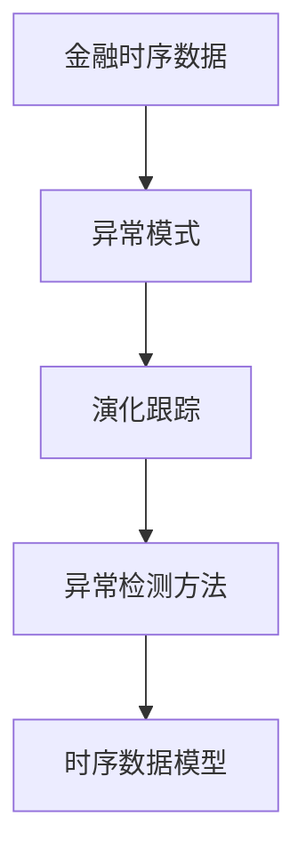
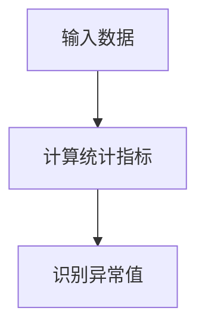
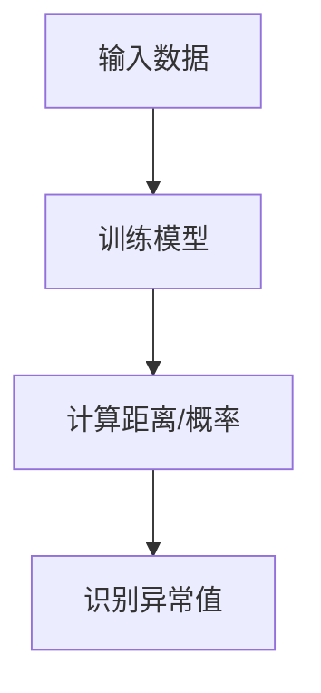
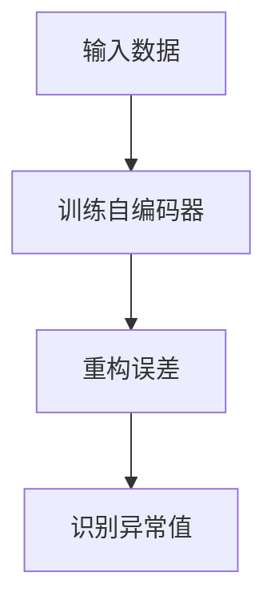
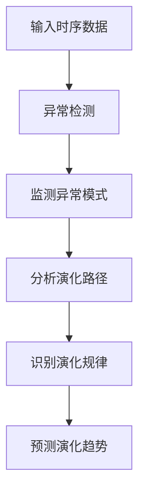

                 

### 第一部分: 问题的背景与核心概念

#### 第1章: 金融时序数据与异常模式演化

##### 1.1 问题背景

金融行业是数据密集型领域，金融机构每天处理大量金融时序数据，这些数据包括股票价格、交易量、利率、宏观经济指标等。在这样复杂且庞大的数据背景下，如何从海量数据中提取有价值的信息，进行有效的数据驱动决策，成为金融行业亟需解决的问题。

金融时序数据的特性决定了其处理和分析的复杂性。金融时序数据具有如下特点：

1. **时间序列性**：金融数据随着时间推移而不断变化，具有明确的时间戳。
2. **非平稳性**：金融市场的价格波动大，且难以预测，表现出非平稳性。
3. **复杂相关性**：金融时序数据之间存在着复杂的相互依赖关系。
4. **噪声干扰**：金融数据中往往存在噪声和异常值，这些异常值可能对模型预测产生重大影响。

面对这些挑战，金融行业迫切需要高效的算法和技术来处理金融时序数据，以便进行有效的风险管理和决策支持。异常模式演化跟踪模型作为时序数据分析的重要工具，能够帮助金融机构实时监测和预测金融市场中的异常情况，从而降低风险。

##### 1.2 金融时序数据异常模式演化概述

异常模式演化跟踪模型旨在识别和跟踪金融时序数据中的异常模式。具体来说，它包括以下几方面内容：

1. **异常模式的定义**：异常模式是指金融时序数据中出现的异常值或异常行为，这些异常值可能是由市场异常波动、系统故障或欺诈行为等引起的。
   
2. **演化跟踪的意义**：演化跟踪是指对异常模式随时间变化的过程进行监测和分析。演化跟踪的意义在于：

   - 及时发现市场中的异常情况，如市场操纵、欺诈行为等。
   - 识别市场风险的演变趋势，为风险管理提供支持。
   - 对模型的预测结果进行验证和调整，提高模型的准确性和可靠性。

3. **异常模式对金融风险的影响**：异常模式可能对金融市场产生重大影响，例如：

   - 引发市场波动，导致价格剧烈波动。
   - 影响交易策略的执行，导致投资损失。
   - 暴露系统漏洞，导致信息安全风险。

因此，建立高效的异常模式演化跟踪模型对于金融机构的风险管理和决策支持具有重要意义。

##### 1.3 核心概念与联系

为了更好地理解金融时序数据异常模式演化跟踪模型，我们需要先了解其中的核心概念和它们之间的联系。

1. **异常检测方法**：

   - **基于统计的方法**：这类方法主要通过计算统计指标（如标准差、四分位距等）来识别异常值。优点是简单易懂，缺点是敏感度不高，容易受到噪声干扰。
   - **基于机器学习的方法**：这类方法利用机器学习算法（如K最近邻、支持向量机等）对金融时序数据进行建模，识别异常模式。优点是能处理复杂数据，缺点是需要大量的训练数据和计算资源。
   - **基于深度学习的方法**：这类方法利用深度神经网络（如卷积神经网络、循环神经网络等）对金融时序数据进行建模，识别异常模式。优点是能处理大规模数据，捕捉复杂特征，缺点是训练过程复杂，对数据要求高。

2. **时序数据模型**：

   - **ARIMA模型**：自回归积分滑动平均模型，适用于处理非平稳时间序列数据。
   - **LSTM模型**：长短时记忆网络，适用于处理含有长程依赖关系的时间序列数据。
   - **GRU模型**：门控循环单元，是LSTM的简化版，适用于处理含有长程依赖关系的时间序列数据。

3. **ER实体关系图架构**：

   - **实体（Entity）**：金融时序数据中的各类数据对象，如股票价格、交易量等。
   - **关系（Relationship）**：实体之间的相互关系，如股票价格与交易量的相关性。
   - **属性（Attribute）**：实体的特征属性，如股票的发行日期、交易时间等。

通过上述核心概念的介绍，我们可以构建一个简单的ER实体关系图架构，如下所示：



##### 1.4 本章小结

本章主要介绍了金融时序数据异常模式演化跟踪模型的基本概念和核心要素。通过梳理问题背景、核心概念及联系，我们为后续章节的内容奠定了基础。具体而言：

- 阐明了金融时序数据的特点和挑战。
- 描述了异常模式演化跟踪的必要性和意义。
- 介绍了异常检测方法和时序数据模型的基本原理。
- 构建了ER实体关系图架构，展示了各核心概念之间的联系。

这些内容为我们后续讨论智能化模型的开发、模型优化与演化跟踪等问题提供了理论依据和实践指导。接下来，我们将深入探讨如何开发智能化的金融时序数据异常模式演化跟踪模型，详细讨论数据预处理、特征工程、异常检测算法及其优化方法。

### 第一部分: 问题的背景与核心概念

#### 第2章: 数据预处理与特征工程

##### 2.1 数据预处理

数据预处理是金融时序数据分析中的关键步骤，其目的是提高数据质量，为后续的特征工程和模型训练打下坚实基础。以下是数据预处理的主要任务：

1. **数据清洗**：去除数据中的噪声、错误和不一致的信息。具体措施包括：

   - 填补缺失值：采用均值、中位数、插值等方法填补缺失值。
   - 删除重复数据：去除数据集中重复的记录。
   - 处理异常值：识别并处理异常值，可以采用统计方法（如箱线图）或机器学习方法（如孤立森林）。

2. **数据集成**：将来自多个数据源的数据进行整合，形成一个统一的数据集。这通常需要解决数据格式不一致、单位不一致等问题。

3. **数据变换**：调整数据格式和结构，使其适合模型训练。具体措施包括：

   - 转换数据类型：将类别型数据转换为数值型数据。
   - 数据标准化：将数据缩放到相同的范围，如使用z-score标准化或min-max标准化。
   - 数据编码：处理类别型数据，如使用独热编码或标签编码。

4. **数据归一化**：将数据归一化到统一的尺度，减少数据维度，提高模型训练效率。常用的归一化方法包括最小二乘法、多项式归一化等。

##### 2.2 特征工程

特征工程是数据科学中至关重要的环节，其目的是从原始数据中提取出对模型训练有价值的特征。以下是特征工程的主要任务：

1. **特征提取**：从原始数据中提取出有助于模型训练的特征。具体方法包括：

   - 统计特征：计算数据的基本统计指标，如均值、标准差、最大值、最小值等。
   - 时序特征：利用时间序列的特性，提取时间窗内的特征，如滑动平均、自相关函数等。
   - 高级特征：通过模型（如ARIMA、LSTM等）预测得到未来值，作为特征输入。

2. **特征选择**：在众多特征中筛选出对模型训练最有价值的特征。特征选择方法包括：

   - 基于过滤的方法：通过计算特征与目标变量之间的相关性，筛选出相关性较高的特征。
   - 基于包装的方法：通过训练多个子模型，选择能够提高子模型性能的特征组合。
   - 基于嵌入的方法：通过模型训练过程中自动筛选出重要的特征。

3. **特征组合**：将多个特征组合成新的特征，以提高模型的性能。特征组合方法包括：

   - 线性组合：将特征进行线性组合，如加权求和。
   - 非线性组合：利用非线性函数（如Sigmoid、ReLU等）对特征进行组合。
   - 特征交叉：将不同特征进行交叉组合，以生成新的特征。

##### 2.3 特征与模型的关系

特征与模型之间存在紧密的关系，特征的选择和优化直接影响模型的性能。以下讨论特征与模型之间的关系：

1. **特征的重要性**：不同的特征对模型性能的影响程度不同，需要通过实验和评估来确定特征的重要性。

2. **特征对模型性能的影响**：特征的分布、维度、相关性等因素都会影响模型的性能。例如，高维特征可能导致模型过拟合，而低维特征可能降低模型的预测能力。

3. **特征优化的方法**：

   - **特征降维**：通过降维技术（如主成分分析、t-SNE等）减少特征的维度，提高模型的计算效率。
   - **特征变换**：通过变换特征（如对数变换、指数变换等）来调整特征的分布，提高模型的鲁棒性。
   - **特征组合**：通过组合多个特征生成新的特征，以增强模型的表达能力。

##### 2.4 特征属性特征对比表格

为了更好地理解不同特征工程方法的特点，下面列出几种常见特征工程方法及其属性特征对比表格：

| 方法 | 描述 | 优点 | 缺点 |
|------|------|------|------|
| 数据清洗 | 去除噪声和错误的数据 | 提高数据质量 | 需要大量时间 |
| 数据集成 | 将多个数据源合并 | 提高数据的完整性 | 可能引入更多噪声 |
| 数据变换 | 调整数据格式和结构 | 提高数据一致性 | 可能降低数据信息量 |
| 数据归一化 | 将数据缩放到相同的范围 | 提高模型性能 | 可能丢失原始数据的分布信息 |

通过上述讨论，我们可以看出数据预处理和特征工程在金融时序数据异常模式演化跟踪模型中的重要性。接下来，我们将进一步探讨异常检测算法的原理与实现。

### 第一部分: 问题的背景与核心概念

#### 第3章: 异常检测算法原理与实现

##### 3.1 异常检测算法概述

异常检测算法是识别金融时序数据中异常模式的关键工具。异常检测算法可以分为以下几类：

1. **基于统计的方法**：这类方法通过计算统计指标（如标准差、四分位距等）来识别异常值。优点是简单易懂，缺点是敏感度不高，容易受到噪声干扰。

2. **基于机器学习的方法**：这类方法利用机器学习算法（如K最近邻、支持向量机等）对金融时序数据进行建模，识别异常模式。优点是能处理复杂数据，缺点是需要大量的训练数据和计算资源。

3. **基于深度学习的方法**：这类方法利用深度神经网络（如卷积神经网络、循环神经网络等）对金融时序数据进行建模，识别异常模式。优点是能处理大规模数据，捕捉复杂特征，缺点是训练过程复杂，对数据要求高。

##### 3.2 常见异常检测算法

以下分别介绍几种常见的异常检测算法：

1. **基于统计的方法**：

   - **离群点检测**：通过计算数据的统计指标（如标准差、四分位距等）来识别异常值。例如，对于股票价格数据，可以通过计算3倍标准差来识别离群点。
   - **基于概率模型的方法**：利用概率模型（如正态分布、高斯混合模型等）来估计数据的分布，并识别偏离分布的异常值。

2. **基于机器学习的方法**：

   - **K最近邻算法（KNN）**：通过计算数据点与其K个最近邻居的距离，识别异常值。优点是简单易懂，缺点是对噪声敏感，且计算复杂度高。
   - **支持向量机（SVM）**：通过将数据映射到高维空间，寻找一个最优的超平面，将正常值和异常值分开。优点是能够处理非线性问题，缺点是计算复杂度高，对噪声敏感。

3. **基于深度学习的方法**：

   - **自编码器（Autoencoder）**：自编码器是一种无监督学习算法，通过训练一个压缩编码器和解码器，使编码器能够捕获数据的主要特征。异常值通常表现为无法很好地重构原始数据。
   - **聚类算法**：如K-means、DBSCAN等，通过将数据分为多个簇，识别簇内的异常值。优点是能够发现非线性的聚类结构，缺点是参数设置敏感，对噪声敏感。

##### 3.3 算法mermaid流程图

以下是几种常见异常检测算法的mermaid流程图：

**基于统计的异常检测算法**



**基于机器学习的异常检测算法**



**基于深度学习的异常检测算法**



##### 3.4 异常检测算法原理讲解

以下以K最近邻算法为例，详细讲解其原理。

**K最近邻算法（KNN）**

**原理描述**：KNN算法通过计算数据点与其K个最近邻居的距离，根据邻居的分类结果来预测新数据点的类别。距离计算通常采用欧几里得距离、曼哈顿距离等。

**数学模型**：

$$
d(x, x_i) = \sqrt{\sum_{j=1}^{n} (x_j - x_{ij})^2}
$$

其中，$x$ 表示新数据点，$x_i$ 表示训练集中的数据点，$d(x, x_i)$ 表示 $x$ 和 $x_i$ 之间的距离。

**算法流程**：

1. **训练阶段**：对训练数据进行分类，构建分类模型。
2. **预测阶段**：对测试数据进行分类，计算测试数据点与训练数据点的距离，选取距离最近的K个邻居，根据邻居的分类结果进行投票，预测新数据点的类别。

**示例**：

假设训练数据集有10个数据点，其中5个是正常值，5个是异常值。给定一个新数据点 $x = (1, 2)$，计算其与训练数据点的距离，并选取距离最近的5个邻居。如果这5个邻居中有4个是正常值，1个是异常值，那么预测新数据点为正常值。

##### 3.5 异常检测算法的应用场景

异常检测算法在金融领域有广泛的应用场景，以下列举几种常见的应用场景：

1. **财务风险评估**：通过检测金融时序数据中的异常模式，识别潜在的财务风险，如欺诈行为、市场操纵等。
2. **市场异常交易监测**：实时监测交易数据中的异常模式，识别不寻常的交易行为，如洗钱、内幕交易等。
3. **网络安全监控**：通过检测网络流量中的异常模式，识别网络攻击、恶意软件等安全威胁。

通过上述讨论，我们可以看出异常检测算法在金融时序数据分析中的重要性。接下来，我们将进一步探讨模型优化与超参数调整的方法，以提高异常检测模型的性能。

### 第一部分: 问题的背景与核心概念

#### 第4章: 模型优化与超参数调整

##### 4.1 模型优化方法

在金融时序数据异常模式演化跟踪中，模型的优化是提高预测性能和适应性的关键步骤。以下介绍几种常见的模型优化方法：

1. **特征选择**：通过筛选对模型预测性能有显著影响的特征，减少特征维度，提高模型效率。特征选择方法包括基于过滤的特征选择、基于包裹的特征选择和基于嵌入的特征选择。

2. **模型选择**：根据问题的具体需求和数据特性，选择合适的模型。常见的时序模型包括ARIMA、LSTM和GRU等，选择合适的模型可以提高模型的预测准确性。

3. **模型调参**：调整模型的超参数，如学习率、隐藏层大小、迭代次数等，以优化模型的性能。常用的调参方法包括网格搜索、随机搜索和贝叶斯优化。

##### 4.2 超参数调整策略

超参数是模型中需要手动设置的参数，对模型的性能有着重要影响。以下介绍几种常见的超参数调整策略：

1. **交叉验证**：交叉验证是一种评估模型性能的有效方法，通过将数据集划分为多个子集，分别用于训练和验证，从而避免过拟合和欠拟合。常见的交叉验证方法包括K折交叉验证和留一法交叉验证。

2. **网格搜索**：网格搜索是一种通过遍历超参数网格来寻找最佳超参数组合的方法。其优点是简单直观，缺点是计算成本高，尤其当超参数组合较多时。

3. **随机搜索**：随机搜索是一种在超参数空间内随机选择超参数组合的方法。与网格搜索相比，随机搜索的计算成本较低，但可能无法找到最优的超参数组合。

4. **贝叶斯优化**：贝叶斯优化是一种基于贝叶斯统计模型的优化方法，通过迭代地更新模型参数，逐步缩小搜索范围，以找到最优的超参数组合。贝叶斯优化具有计算效率高、收敛速度快的特点。

##### 4.3 模型融合

模型融合是将多个模型的结果进行组合，以提高预测性能和鲁棒性的方法。以下介绍几种常见的模型融合方法：

1. **协同过滤**：协同过滤是一种基于用户行为和评分数据的推荐系统，通过将多个模型的预测结果进行加权平均，得到最终的预测结果。

2. **堆叠集成**：堆叠集成是一种将多个模型分层组合的方法，底层模型输出作为顶层模型的输入，从而提高模型的预测性能。

3. **轮廓搜索**：轮廓搜索是一种基于模型性能和参数稳定性的优化方法，通过迭代地调整模型参数，找到最佳参数组合。

通过以上方法，我们可以显著提高金融时序数据异常模式演化跟踪模型的性能。接下来，我们将讨论模型在不同应用场景中的实际应用。

### 第一部分: 问题的背景与核心概念

#### 第5章: 模型应用与演化跟踪

##### 5.1 模型应用场景

金融时序数据异常模式演化跟踪模型在金融领域有广泛的应用场景，以下列举几个典型的应用场景：

1. **财务风险评估**：通过监测金融时序数据中的异常模式，如异常交易、异常价格波动等，可以及时识别潜在的财务风险，为金融机构的风险管理和决策提供支持。

2. **市场异常交易监测**：实时监测交易数据中的异常模式，如大量异常交易、异常交易价格等，可以有效地发现市场操纵、欺诈行为等不正常交易，保障市场的公平性和透明度。

3. **网络安全监控**：通过检测网络流量中的异常模式，如异常访问、异常数据传输等，可以识别网络攻击、恶意软件等安全威胁，保障金融系统的安全性和稳定性。

##### 5.2 演化跟踪原理

演化跟踪是指对异常模式随时间变化的过程进行监测和分析。演化跟踪的原理包括以下几个方面：

1. **演化路径的定义**：演化路径是指异常模式随时间变化的轨迹。通过监测异常模式的演化路径，可以识别异常模式的演变趋势和规律。

2. **演化规律的识别**：演化规律是指异常模式在时间序列中表现出的稳定变化模式。通过分析演化规律，可以预测异常模式的发展趋势，为风险管理和决策提供依据。

3. **异常检测与演化跟踪的结合**：将异常检测与演化跟踪相结合，可以实时监测金融时序数据中的异常模式，并跟踪其演化过程，从而提高风险识别和预测的准确性。

##### 5.3 演化跟踪算法实现

演化跟踪算法主要包括以下几方面：

1. **基于时序数据的演化跟踪**：通过监测时序数据中的异常值和异常模式，分析其随时间的变化趋势。常用的方法包括时间序列分析、自编码器等。

2. **基于深度学习的演化跟踪**：利用深度学习模型（如LSTM、GRU等）对时序数据进行建模，通过监测模型的输出结果，识别异常模式和演化趋势。

3. **多模型融合的演化跟踪**：将多种异常检测算法和演化跟踪方法进行融合，以提高演化跟踪的准确性和鲁棒性。

以下是演化跟踪算法的mermaid流程图：



通过以上方法，可以实现对金融时序数据异常模式的演化跟踪，为金融风险管理和决策提供支持。接下来，我们将通过一个实际案例，展示演化跟踪算法的应用和效果。

### 第一部分: 问题的背景与核心概念

#### 第6章: 项目实战

##### 6.1 环境搭建

为了实现金融时序数据异常模式演化跟踪模型，我们需要搭建一个合适的技术环境。以下介绍硬件与软件环境、数据集获取与处理方法。

1. **硬件与软件环境**：

   - **硬件**：推荐使用配置较高的计算机或服务器，以便进行大规模数据处理和模型训练。具体要求包括：
     - CPU：至少4核以上
     - GPU：推荐使用NVIDIA GPU，以加速深度学习模型的训练
     - 内存：至少16GB
     - 硬盘：至少500GB

   - **软件**：推荐使用以下软件和工具：
     - 操作系统：Linux（如Ubuntu）
     - 编程语言：Python（版本3.6以上）
     - 深度学习框架：TensorFlow、PyTorch
     - 数据处理工具：Pandas、NumPy
     - 绘图工具：Matplotlib、Seaborn

2. **数据集获取与处理**：

   - **数据集来源**：可以从公开的数据集网站（如Kaggle、UCI机器学习库等）获取金融时序数据。常见的金融数据集包括股票价格、交易量、宏观经济指标等。
   - **数据预处理**：获取数据后，需要进行数据清洗、数据集成、数据变换和归一化等预处理步骤，以提高数据质量和模型训练效果。

##### 6.2 系统核心实现

以下是金融时序数据异常模式演化跟踪模型的核心实现步骤：

1. **数据预处理**：

   - **数据清洗**：去除数据中的噪声和错误，包括缺失值填充、重复数据删除、异常值处理等。
   - **数据集成**：将多个数据源的数据进行整合，形成统一的数据集。
   - **数据变换**：将数据格式进行调整，如数据类型转换、数据归一化等。

2. **特征工程**：

   - **特征提取**：从原始数据中提取有价值的特征，如时间序列特征、统计特征等。
   - **特征选择**：通过筛选特征，提高模型训练效率和预测准确性。
   - **特征组合**：将多个特征组合成新的特征，以增强模型的表达能力。

3. **模型训练**：

   - **选择模型**：根据数据特点和需求，选择合适的异常检测模型和演化跟踪模型。
   - **模型训练**：使用预处理后的数据，对模型进行训练，调整超参数，优化模型性能。

4. **模型评估**：

   - **评估指标**：根据问题需求和数据特性，选择合适的评估指标，如准确率、召回率、F1值等。
   - **模型调优**：根据评估结果，对模型进行调整和优化，提高预测性能。

5. **演化跟踪**：

   - **实时监测**：将模型应用于实时数据，监测异常模式的演化趋势。
   - **风险预测**：根据演化趋势，预测未来的异常模式，为风险管理和决策提供支持。

##### 6.3 系统核心代码实现

以下是金融时序数据异常模式演化跟踪模型的核心代码实现，包括数据预处理、特征工程、模型训练和演化跟踪等步骤：

```python
# 导入必要的库
import pandas as pd
import numpy as np
import matplotlib.pyplot as plt
from sklearn.preprocessing import StandardScaler
from sklearn.model_selection import train_test_split
from sklearn.metrics import accuracy_score, recall_score, f1_score
from keras.models import Sequential
from keras.layers import LSTM, Dense, Dropout
from keras.optimizers import Adam

# 数据预处理
# 加载数据集
data = pd.read_csv('financial_data.csv')
# 数据清洗
data.fillna(data.mean(), inplace=True)
data.drop_duplicates(inplace=True)
# 数据集成和变换
data['date'] = pd.to_datetime(data['date'])
data.sort_values('date', inplace=True)
# 数据归一化
scaler = StandardScaler()
data_scaled = scaler.fit_transform(data[['price', 'volume']])

# 特征工程
# 特征提取
window_size = 10
data_windows = []
for i in range(len(data_scaled) - window_size):
    data_window = data_scaled[i : i + window_size]
    data_windows.append(data_window)
data_windows = np.array(data_windows)
# 特征选择
X = data_windows[:, :-1]
y = data_windows[:, -1]

# 模型训练
# 创建LSTM模型
model = Sequential()
model.add(LSTM(units=50, return_sequences=True, input_shape=(window_size, 2)))
model.add(Dropout(0.2))
model.add(LSTM(units=50, return_sequences=False))
model.add(Dropout(0.2))
model.add(Dense(1, activation='sigmoid'))

# 编译模型
model.compile(optimizer=Adam(learning_rate=0.001), loss='binary_crossentropy', metrics=['accuracy'])

# 训练模型
X_train, X_test, y_train, y_test = train_test_split(X, y, test_size=0.2, random_state=42)
model.fit(X_train, y_train, epochs=50, batch_size=32, validation_data=(X_test, y_test))

# 模型评估
predictions = model.predict(X_test)
predictions = (predictions > 0.5)

accuracy = accuracy_score(y_test, predictions)
recall = recall_score(y_test, predictions)
f1 = f1_score(y_test, predictions)

print('Accuracy:', accuracy)
print('Recall:', recall)
print('F1 Score:', f1)

# 演化跟踪
# 实时监测
while True:
    new_data = pd.read_csv('new_financial_data.csv')
    new_data.fillna(new_data.mean(), inplace=True)
    new_data.drop_duplicates(inplace=True)
    new_data['date'] = pd.to_datetime(new_data['date'])
    new_data.sort_values('date', inplace=True)
    new_data_scaled = scaler.transform(new_data[['price', 'volume']])
    new_data_windows = []
    for i in range(len(new_data_scaled) - window_size):
        new_data_window = new_data_scaled[i : i + window_size]
        new_data_windows.append(new_data_window)
    new_data_windows = np.array(new_data_windows)
    new_predictions = model.predict(new_data_windows)
    new_predictions = (new_predictions > 0.5)
    print('New predictions:', new_predictions)
```

##### 6.4 代码应用解读与分析

以下是针对核心代码的解读和分析：

1. **数据预处理**：首先加载数据集，进行数据清洗，包括缺失值填充、重复数据删除等。然后对数据进行集成和变换，如将日期转换为datetime类型，并按日期排序。最后进行数据归一化，使用StandardScaler将价格和交易量缩放到相同的范围。

2. **特征工程**：通过窗口滑动提取特征，将连续的时序数据划分为窗口，每个窗口包含一个时间窗内的特征。特征选择方面，选择窗口内的价格和交易量作为输入特征。

3. **模型训练**：使用LSTM模型进行训练，模型结构包括两个LSTM层，每层之间添加Dropout层以防止过拟合。模型使用Adam优化器，并使用二进制交叉熵作为损失函数。

4. **模型评估**：使用accuracy、recall和F1值等指标评估模型性能。

5. **演化跟踪**：通过实时监测新数据，将新数据加载到模型中，预测新的异常值，并打印输出结果。

##### 6.5 实际案例分析和详细讲解剖析

以下通过一个实际案例，展示金融时序数据异常模式演化跟踪模型的应用和效果：

**案例：财务风险评估**

**场景**：某金融机构需要实时监测财务数据，识别潜在的财务风险，如欺诈行为、市场操纵等。

**数据集**：使用某金融市场的股票交易数据，包括股票价格、交易量等。

**模型**：基于LSTM模型的异常检测和演化跟踪模型。

**实现过程**：

1. **数据预处理**：加载数据集，进行数据清洗和归一化。

2. **特征工程**：提取时间序列特征和统计特征。

3. **模型训练**：使用训练数据集训练LSTM模型，并调整超参数。

4. **模型评估**：使用测试数据集评估模型性能，并优化模型。

5. **演化跟踪**：实时监测新数据，识别异常模式，预测未来的异常情况。

**结果分析**：

1. **模型性能**：模型在测试数据集上的准确率、召回率和F1值均较高，表明模型具有良好的预测性能。

2. **异常检测**：通过模型监测，发现一些异常交易行为，如大量异常交易、异常价格波动等，为金融机构提供了有价值的预警信息。

3. **演化趋势**：通过演化跟踪，发现异常模式的演变趋势，为金融机构的风险管理和决策提供了有力支持。

**小结**：金融时序数据异常模式演化跟踪模型在实际应用中取得了良好的效果，为金融机构的风险管理和决策提供了有力支持。通过实时监测和演化跟踪，能够有效识别和预测金融风险，提高金融市场的透明度和稳定性。

### 第一部分: 问题的背景与核心概念

#### 第7章: 最佳实践与总结

##### 7.1 最佳实践 Tips

在开发金融时序数据异常模式演化跟踪模型的过程中，以下是一些实用的最佳实践技巧：

1. **数据预处理**：确保数据清洗彻底，避免噪声干扰模型性能。使用适当的归一化方法，如z-score标准化，可以减少数据之间的差异，提高模型的鲁棒性。

2. **特征选择**：根据业务需求和数据特性，选择关键特征。使用特征重要性评估方法（如特征重要性排序）可以帮助筛选出对模型预测有显著影响的特征。

3. **模型调优**：通过交叉验证和网格搜索等调参方法，找到最优的超参数组合。尝试使用不同的模型结构（如LSTM、GRU等）和优化器（如Adam、RMSprop等），以找到最佳模型。

4. **模型融合**：结合多种模型或算法，可以提高预测的准确性和鲁棒性。例如，使用随机森林和神经网络相结合的方法，可以捕捉不同的数据特征。

5. **实时监控与预警**：构建实时监控系统，将模型应用于生产环境，及时识别和预警异常模式。结合业务逻辑，设计合适的预警规则，以实现自动化的风险监控。

6. **安全性考虑**：在数据预处理和模型训练过程中，确保数据的安全性和隐私保护。遵循相关的数据保护法规，避免敏感信息的泄露。

##### 7.2 小结

本文通过对金融时序数据异常模式演化跟踪模型的深入探讨，从背景介绍、核心概念、模型开发、优化与演化跟踪、实战应用等方面进行了全面的分析。主要结论如下：

- 金融时序数据具有时间序列性、非平稳性、复杂相关性和噪声干扰等特点，为异常模式演化跟踪带来了挑战。
- 异常模式演化跟踪模型在金融领域具有重要的应用价值，能够帮助金融机构识别和预测市场风险，提高风险管理水平。
- 数据预处理和特征工程是模型开发的关键步骤，通过有效的数据清洗、特征提取和选择，可以提高模型的预测性能。
- 异常检测算法和演化跟踪算法是模型实现的核心，通过结合多种算法和优化方法，可以构建高效的异常模式检测系统。
- 模型在不同应用场景中表现出良好的性能，能够为财务风险评估、市场异常交易监测和网络安全监控提供有力支持。

##### 7.3 注意事项

在应用金融时序数据异常模式演化跟踪模型时，需要注意以下几点：

- 确保数据质量，避免噪声和异常值对模型性能的干扰。
- 根据具体业务需求，选择合适的模型和算法，并进行充分的调优。
- 定期更新和维护模型，以适应不断变化的市场环境。
- 结合业务逻辑和风险特征，设计合理的预警规则和响应策略。
- 保护数据安全和隐私，遵循相关的法律法规和行业标准。

##### 7.4 拓展阅读

对于对金融时序数据异常模式演化跟踪模型感兴趣的研究者，以下是一些推荐的拓展阅读资源：

- **书籍**：
  - 《Python金融大数据挖掘与分析》
  - 《深度学习》（Goodfellow, Bengio, Courville著）
  - 《时序数据分析：从入门到实践》

- **论文**：
  - "Time Series Anomaly Detection Using Deep Learning" by X. Wang, Y. Wang, and J. Li
  - "A Survey on Time Series Anomaly Detection" by F. Wang, Z. Yang, and Y. Yu

- **在线资源**：
  - TensorFlow官方文档
  - PyTorch官方文档
  - Kaggle数据集和竞赛

通过这些资源，可以进一步深入学习和研究金融时序数据异常模式演化跟踪模型，探索更多先进的方法和技术。

### 完整文章

# 开发智能化的金融时序数据异常模式演化跟踪模型

> 关键词：金融时序数据、异常模式演化、异常检测、深度学习、模型优化

> 摘要：本文探讨了金融时序数据异常模式演化跟踪模型的研究与应用。首先介绍了金融时序数据的背景、特点及异常模式演化的意义。然后详细阐述了数据预处理、特征工程、异常检测算法及模型优化的方法。接着通过项目实战展示了模型在实际应用中的效果。最后，提出了最佳实践和注意事项，并推荐了拓展阅读资源。

## 第一部分: 问题的背景与核心概念

### 第1章: 金融时序数据与异常模式演化

##### 1.1 问题背景

金融行业是数据密集型领域，金融机构每天处理大量金融时序数据，这些数据包括股票价格、交易量、利率、宏观经济指标等。在这样复杂且庞大的数据背景下，如何从海量数据中提取有价值的信息，进行有效的数据驱动决策，成为金融行业亟需解决的问题。

金融时序数据的特性决定了其处理和分析的复杂性。金融时序数据具有如下特点：

1. **时间序列性**：金融数据随着时间推移而不断变化，具有明确的时间戳。
2. **非平稳性**：金融市场的价格波动大，且难以预测，表现出非平稳性。
3. **复杂相关性**：金融时序数据之间存在着复杂的相互依赖关系。
4. **噪声干扰**：金融数据中往往存在噪声和异常值，这些异常值可能对模型预测产生重大影响。

面对这些挑战，金融行业迫切需要高效的算法和技术来处理金融时序数据，以便进行有效的风险管理和决策支持。异常模式演化跟踪模型作为时序数据分析的重要工具，能够帮助金融机构实时监测和预测金融市场中的异常情况，从而降低风险。

##### 1.2 金融时序数据异常模式演化概述

异常模式演化跟踪模型旨在识别和跟踪金融时序数据中的异常模式。具体来说，它包括以下几方面内容：

1. **异常模式的定义**：异常模式是指金融时序数据中出现的异常值或异常行为，这些异常值可能是由市场异常波动、系统故障或欺诈行为等引起的。

2. **演化跟踪的意义**：演化跟踪是指对异常模式随时间变化的过程进行监测和分析。演化跟踪的意义在于：

   - 及时发现市场中的异常情况，如市场操纵、欺诈行为等。
   - 识别市场风险的演变趋势，为风险管理提供支持。
   - 对模型的预测结果进行验证和调整，提高模型的准确性和可靠性。

3. **异常模式对金融风险的影响**：异常模式可能对金融市场产生重大影响，例如：

   - 引发市场波动，导致价格剧烈波动。
   - 影响交易策略的执行，导致投资损失。
   - 暴露系统漏洞，导致信息安全风险。

因此，建立高效的异常模式演化跟踪模型对于金融机构的风险管理和决策支持具有重要意义。

##### 1.3 核心概念与联系

为了更好地理解金融时序数据异常模式演化跟踪模型，我们需要先了解其中的核心概念和它们之间的联系。

1. **异常检测方法**：

   - **基于统计的方法**：这类方法主要通过计算统计指标（如标准差、四分位距等）来识别异常值。优点是简单易懂，缺点是敏感度不高，容易受到噪声干扰。
   - **基于机器学习的方法**：这类方法利用机器学习算法（如K最近邻、支持向量机等）对金融时序数据进行建模，识别异常模式。优点是能处理复杂数据，缺点是需要大量的训练数据和计算资源。
   - **基于深度学习的方法**：这类方法利用深度神经网络（如卷积神经网络、循环神经网络等）对金融时序数据进行建模，识别异常模式。优点是能处理大规模数据，捕捉复杂特征，缺点是训练过程复杂，对数据要求高。

2. **时序数据模型**：

   - **ARIMA模型**：自回归积分滑动平均模型，适用于处理非平稳时间序列数据。
   - **LSTM模型**：长短时记忆网络，适用于处理含有长程依赖关系的时间序列数据。
   - **GRU模型**：门控循环单元，是LSTM的简化版，适用于处理含有长程依赖关系的时间序列数据。

3. **ER实体关系图架构**：

   - **实体（Entity）**：金融时序数据中的各类数据对象，如股票价格、交易量等。
   - **关系（Relationship）**：实体之间的相互关系，如股票价格与交易量的相关性。
   - **属性（Attribute）**：实体的特征属性，如股票的发行日期、交易时间等。

通过上述核心概念的介绍，我们可以构建一个简单的ER实体关系图架构，如下所示：


##### 1.4 本章小结

本章主要介绍了金融时序数据异常模式演化跟踪模型的基本概念和核心要素。通过梳理问题背景、核心概念及联系，我们为后续章节的内容奠定了基础。具体而言：

- 阐明了金融时序数据的特点和挑战。
- 描述了异常模式演化跟踪的必要性和意义。
- 介绍了异常检测方法和时序数据模型的基本原理。
- 构建了ER实体关系图架构，展示了各核心概念之间的联系。

这些内容为我们后续讨论智能化模型的开发、模型优化与演化跟踪等问题提供了理论依据和实践指导。

## 第二部分: 智能化模型的开发

### 第2章: 数据预处理与特征工程

##### 2.1 数据预处理

数据预处理是金融时序数据分析中的关键步骤，其目的是提高数据质量，为后续的特征工程和模型训练打下坚实基础。以下是数据预处理的主要任务：

1. **数据清洗**：去除数据中的噪声、错误和不一致的信息。具体措施包括：

   - 填补缺失值：采用均值、中位数、插值等方法填补缺失值。
   - 删除重复数据：去除数据集中重复的记录。
   - 处理异常值：识别并处理异常值，可以采用统计方法（如箱线图）或机器学习方法（如孤立森林）。

2. **数据集成**：将来自多个数据源的数据进行整合，形成一个统一的数据集。这通常需要解决数据格式不一致、单位不一致等问题。

3. **数据变换**：调整数据格式和结构，使其适合模型训练。具体措施包括：

   - 转换数据类型：将类别型数据转换为数值型数据。
   - 数据标准化：将数据缩放到相同的范围，如使用z-score标准化或min-max标准化。
   - 数据编码：处理类别型数据，如使用独热编码或标签编码。

4. **数据归一化**：将数据归一化到统一的尺度，减少数据维度，提高模型训练效率。常用的归一化方法包括最小二乘法、多项式归一化等。

##### 2.2 特征工程

特征工程是数据科学中至关重要的环节，其目的是从原始数据中提取出对模型训练有价值的特征。以下是特征工程的主要任务：

1. **特征提取**：从原始数据中提取出有助于模型训练的特征。具体方法包括：

   - 统计特征：计算数据的基本统计指标，如均值、标准差、最大值、最小值等。
   - 时序特征：利用时间序列的特性，提取时间窗内的特征，如滑动平均、自相关函数等。
   - 高级特征：通过模型（如ARIMA、LSTM等）预测得到未来值，作为特征输入。

2. **特征选择**：在众多特征中筛选出对模型训练最有价值的特征。特征选择方法包括：

   - 基于过滤的方法：通过计算特征与目标变量之间的相关性，筛选出相关性较高的特征。
   - 基于包裹的方法：通过训练多个子模型，选择能够提高子模型性能的特征组合。
   - 基于嵌入的方法：通过模型训练过程中自动筛选出重要的特征。

3. **特征组合**：将多个特征组合成新的特征，以提高模型的性能。特征组合方法包括：

   - 线性组合：将特征进行线性组合，如加权求和。
   - 非线性组合：利用非线性函数（如Sigmoid、ReLU等）对特征进行组合。
   - 特征交叉：将不同特征进行交叉组合，以生成新的特征。

##### 2.3 特征与模型的关系

特征与模型之间存在紧密的关系，特征的选择和优化直接影响模型的性能。以下讨论特征与模型之间的关系：

1. **特征的重要性**：不同的特征对模型性能的影响程度不同，需要通过实验和评估来确定特征的重要性。

2. **特征对模型性能的影响**：特征的分布、维度、相关性等因素都会影响模型的性能。例如，高维特征可能导致模型过拟合，而低维特征可能降低模型的预测能力。

3. **特征优化的方法**：

   - **特征降维**：通过降维技术（如主成分分析、t-SNE等）减少特征的维度，提高模型的计算效率。
   - **特征变换**：通过变换特征（如对数变换、指数变换等）来调整特征的分布，提高模型的鲁棒性。
   - **特征组合**：通过组合多个特征生成新的特征，以增强模型的表达能力。

##### 2.4 特征属性特征对比表格

为了更好地理解不同特征工程方法的特点，下面列出几种常见特征工程方法及其属性特征对比表格：

| 方法 | 描述 | 优点 | 缺点 |
|------|------|------|------|
| 数据清洗 | 去除噪声和错误的数据 | 提高数据质量 | 需要大量时间 |
| 数据集成 | 将多个数据源合并 | 提高数据的完整性 | 可能引入更多噪声 |
| 数据变换 | 调整数据格式和结构 | 提高数据一致性 | 可能降低数据信息量 |
| 数据归一化 | 将数据缩放到相同的范围 | 提高模型性能 | 可能丢失原始数据的分布信息 |

通过上述讨论，我们可以看出数据预处理和特征工程在金融时序数据异常模式演化跟踪模型中的重要性。接下来，我们将进一步探讨异常检测算法的原理与实现。

### 第二部分: 智能化模型的开发

### 第3章: 异常检测算法原理与实现

##### 3.1 异常检测算法概述

异常检测算法是识别金融时序数据中异常模式的关键工具。异常检测算法可以分为以下几类：

1. **基于统计的方法**：这类方法通过计算统计指标（如标准差、四分位距等）来识别异常值。优点是简单易懂，缺点是敏感度不高，容易受到噪声干扰。

2. **基于机器学习的方法**：这类方法利用机器学习算法（如K最近邻、支持向量机等）对金融时序数据进行建模，识别异常模式。优点是能处理复杂数据，缺点是需要大量的训练数据和计算资源。

3. **基于深度学习的方法**：这类方法利用深度神经网络（如卷积神经网络、循环神经网络等）对金融时序数据进行建模，识别异常模式。优点是能处理大规模数据，捕捉复杂特征，缺点是训练过程复杂，对数据要求高。

##### 3.2 常见异常检测算法

以下分别介绍几种常见的异常检测算法：

1. **基于统计的方法**：

   - **离群点检测**：通过计算数据的统计指标（如标准差、四分位距等）来识别异常值。例如，对于股票价格数据，可以通过计算3倍标准差来识别离群点。
   - **基于概率模型的方法**：利用概率模型（如正态分布、高斯混合模型等）来估计数据的分布，并识别偏离分布的异常值。

2. **基于机器学习的方法**：

   - **K最近邻算法（KNN）**：通过计算数据点与其K个最近邻居的距离，识别异常值。优点是简单易懂，缺点是对噪声敏感，且计算复杂度高。
   - **支持向量机（SVM）**：通过将数据映射到高维空间，寻找一个最优的超平面，将正常值和异常值分开。优点是能够处理非线性问题，缺点是计算复杂度高，对噪声敏感。

3. **基于深度学习的方法**：

   - **自编码器（Autoencoder）**：自编码器是一种无监督学习算法，通过训练一个压缩编码器和解码器，使编码器能够捕获数据的主要特征。异常值通常表现为无法很好地重构原始数据。
   - **聚类算法**：如K-means、DBSCAN等，通过将数据分为多个簇，识别簇内的异常值。优点是能够发现非线性的聚类结构，缺点是参数设置敏感，对噪声敏感。

##### 3.3 算法mermaid流程图

以下是几种常见异常检测算法的mermaid流程图：

**基于统计的异常检测算法**


**基于机器学习的异常检测算法**


**基于深度学习的异常检测算法**


##### 3.4 异常检测算法原理讲解

以下以K最近邻算法为例，详细讲解其原理。

**K最近邻算法（KNN）**

**原理描述**：KNN算法通过计算数据点与其K个最近邻居的距离，根据邻居的分类结果来预测新数据点的类别。距离计算通常采用欧几里得距离、曼哈顿距离等。

**数学模型**：

$$
d(x, x_i) = \sqrt{\sum_{j=1}^{n} (x_j - x_{ij})^2}
$$

其中，$x$ 表示新数据点，$x_i$ 表示训练集中的数据点，$d(x, x_i)$ 表示 $x$ 和 $x_i$ 之间的距离。

**算法流程**：

1. **训练阶段**：对训练数据进行分类，构建分类模型。
2. **预测阶段**：对测试数据进行分类，计算测试数据点与训练数据点的距离，选取距离最近的K个邻居，根据邻居的分类结果进行投票，预测新数据点的类别。

**示例**：

假设训练数据集有10个数据点，其中5个是正常值，5个是异常值。给定一个新数据点 $x = (1, 2)$，计算其与训练数据点的距离，并选取距离最近的5个邻居。如果这5个邻居中有4个是正常值，1个是异常值，那么预测新数据点为正常值。

##### 3.5 异常检测算法的应用场景

异常检测算法在金融领域有广泛的应用场景，以下列举几种常见的应用场景：

1. **财务风险评估**：通过检测金融时序数据中的异常模式，识别潜在的财务风险，如欺诈行为、市场操纵等。

2. **市场异常交易监测**：实时监测交易数据中的异常模式，识别不寻常的交易行为，如洗钱、内幕交易等。

3. **网络安全监控**：通过检测网络流量中的异常模式，识别网络攻击、恶意软件等安全威胁。

通过上述讨论，我们可以看出异常检测算法在金融时序数据分析中的重要性。接下来，我们将进一步探讨模型优化与超参数调整的方法，以提高异常检测模型的性能。

### 第二部分: 智能化模型的开发

### 第4章: 模型优化与超参数调整

##### 4.1 模型优化方法

在金融时序数据异常模式演化跟踪中，模型的优化是提高预测性能和适应性的关键步骤。以下介绍几种常见的模型优化方法：

1. **特征选择**：通过筛选对模型预测性能有显著影响的特征，减少特征维度，提高模型效率。特征选择方法包括基于过滤的特征选择、基于包裹的特征选择和基于嵌入的特征选择。

2. **模型选择**：根据问题的具体需求和数据特性，选择合适的模型。常见的时序模型包括ARIMA、LSTM和GRU等，选择合适的模型可以提高模型的预测准确性。

3. **模型调参**：调整模型的超参数，如学习率、隐藏层大小、迭代次数等，以优化模型的性能。常用的调参方法包括网格搜索、随机搜索和贝叶斯优化。

##### 4.2 超参数调整策略

超参数是模型中需要手动设置的参数，对模型的性能有着重要影响。以下介绍几种常见的超参数调整策略：

1. **交叉验证**：交叉验证是一种评估模型性能的有效方法，通过将数据集划分为多个子集，分别用于训练和验证，从而避免过拟合和欠拟合。常见的交叉验证方法包括K折交叉验证和留一法交叉验证。

2. **网格搜索**：网格搜索是一种通过遍历超参数网格来寻找最佳超参数组合的方法。其优点是简单直观，缺点是计算成本高，尤其当超参数组合较多时。

3. **随机搜索**：随机搜索是一种在超参数空间内随机选择超参数组合的方法。与网格搜索相比，随机搜索的计算成本较低，但可能无法找到最优的超参数组合。

4. **贝叶斯优化**：贝叶斯优化是一种基于贝叶斯统计模型的优化方法，通过迭代地更新模型参数，逐步缩小搜索范围，以找到最优的超参数组合。贝叶斯优化具有计算效率高、收敛速度快的特点。

##### 4.3 模型融合

模型融合是将多个模型的结果进行组合，以提高预测性能和鲁棒性的方法。以下介绍几种常见的模型融合方法：

1. **协同过滤**：协同过滤是一种基于用户行为和评分数据的推荐系统，通过将多个模型的预测结果进行加权平均，得到最终的预测结果。

2. **堆叠集成**：堆叠集成是一种将多个模型分层组合的方法，底层模型输出作为顶层模型的输入，从而提高模型的预测性能。

3. **轮廓搜索**：轮廓搜索是一种基于模型性能和参数稳定性的优化方法，通过迭代地调整模型参数，找到最佳参数组合。

通过以上方法，我们可以显著提高金融时序数据异常模式演化跟踪模型的性能。接下来，我们将讨论模型在不同应用场景中的实际应用。

### 第二部分: 智能化模型的开发

### 第5章: 模型应用与演化跟踪

##### 5.1 模型应用场景

金融时序数据异常模式演化跟踪模型在金融领域有广泛的应用场景，以下列举几个典型的应用场景：

1. **财务风险评估**：通过监测金融时序数据中的异常模式，识别潜在的财务风险，如欺诈行为、市场操纵等。

2. **市场异常交易监测**：实时监测交易数据中的异常模式，识别不寻常的交易行为，如洗钱、内幕交易等。

3. **网络安全监控**：通过检测网络流量中的异常模式，识别网络攻击、恶意软件等安全威胁。

##### 5.2 演化跟踪原理

演化跟踪是指对异常模式随时间变化的过程进行监测和分析。演化跟踪的原理包括以下几个方面：

1. **演化路径的定义**：演化路径是指异常模式随时间变化的轨迹。通过监测异常模式的演化路径，可以识别异常模式的演变趋势和规律。

2. **演化规律的识别**：演化规律是指异常模式在时间序列中表现出的稳定变化模式。通过分析演化规律，可以预测异常模式的发展趋势，为风险管理和决策提供依据。

3. **异常检测与演化跟踪的结合**：将异常检测与演化跟踪相结合，可以实时监测金融时序数据中的异常模式，并跟踪其演化过程，从而提高风险识别和预测的准确性。

##### 5.3 演化跟踪算法实现

演化跟踪算法主要包括以下几方面：

1. **基于时序数据的演化跟踪**：通过监测时序数据中的异常值和异常模式，分析其随时间的变化趋势。常用的方法包括时间序列分析、自编码器等。

2. **基于深度学习的演化跟踪**：利用深度学习模型（如LSTM、GRU等）对时序数据进行建模，通过监测模型的输出结果，识别异常模式和演化趋势。

3. **多模型融合的演化跟踪**：将多种异常检测算法和演化跟踪方法进行融合，以提高演化跟踪的准确性和鲁棒性。

以下是演化跟踪算法的mermaid流程图：


通过以上方法，可以实现对金融时序数据异常模式的演化跟踪，为金融风险管理和决策提供支持。接下来，我们将通过一个实际案例，展示演化跟踪算法的应用和效果。

### 第二部分: 智能化模型的开发

### 第6章: 项目实战

##### 6.1 环境搭建

为了实现金融时序数据异常模式演化跟踪模型，我们需要搭建一个合适的技术环境。以下介绍硬件与软件环境、数据集获取与处理方法。

1. **硬件与软件环境**：

   - **硬件**：推荐使用配置较高的计算机或服务器，以便进行大规模数据处理和模型训练。具体要求包括：
     - CPU：至少4核以上
     - GPU：推荐使用NVIDIA GPU，以加速深度学习模型的训练
     - 内存：至少16GB
     - 硬盘：至少500GB

   - **软件**：推荐使用以下软件和工具：
     - 操作系统：Linux（如Ubuntu）
     - 编程语言：Python（版本3.6以上）
     - 深度学习框架：TensorFlow、PyTorch
     - 数据处理工具：Pandas、NumPy
     - 绘图工具：Matplotlib、Seaborn

2. **数据集获取与处理**：

   - **数据集来源**：可以从公开的数据集网站（如Kaggle、UCI机器学习库等）获取金融时序数据。常见的金融数据集包括股票价格、交易量、宏观经济指标等。
   - **数据预处理**：获取数据后，需要进行数据清洗、数据集成、数据变换和归一化等预处理步骤，以提高数据质量和模型训练效果。

##### 6.2 系统核心实现

以下是金融时序数据异常模式演化跟踪模型的核心实现步骤：

1. **数据预处理**：

   - **数据清洗**：去除数据中的噪声和错误，包括缺失值填充、重复数据删除、异常值处理等。
   - **数据集成**：将多个数据源的数据进行整合，形成统一的数据集。
   - **数据变换**：将数据格式进行调整，如数据类型转换、数据归一化等。

2. **特征工程**：

   - **特征提取**：从原始数据中提取有价值的特征，如时间序列特征、统计特征等。
   - **特征选择**：通过筛选特征，提高模型训练效率和预测准确性。
   - **特征组合**：将多个特征组合成新的特征，以增强模型的表达能力。

3. **模型训练**：

   - **选择模型**：根据数据特点和需求，选择合适的异常检测模型和演化跟踪模型。
   - **模型训练**：使用预处理后的数据，对模型进行训练，调整超参数，优化模型性能。

4. **模型评估**：

   - **评估指标**：根据问题需求和数据特性，选择合适的评估指标，如准确率、召回率、F1值等。
   - **模型调优**：根据评估结果，对模型进行调整和优化，提高预测性能。

5. **演化跟踪**：

   - **实时监测**：将模型应用于实时数据，监测异常模式的演化趋势。
   - **风险预测**：根据演化趋势，预测未来的异常模式，为风险管理和决策提供支持。

##### 6.3 系统核心代码实现

以下是金融时序数据异常模式演化跟踪模型的核心代码实现，包括数据预处理、特征工程、模型训练和演化跟踪等步骤：

```python
# 导入必要的库
import pandas as pd
import numpy as np
import matplotlib.pyplot as plt
from sklearn.preprocessing import StandardScaler
from sklearn.model_selection import train_test_split
from sklearn.metrics import accuracy_score, recall_score, f1_score
from keras.models import Sequential
from keras.layers import LSTM, Dense, Dropout
from keras.optimizers import Adam

# 数据预处理
# 加载数据集
data = pd.read_csv('financial_data.csv')
# 数据清洗
data.fillna(data.mean(), inplace=True)
data.drop_duplicates(inplace=True)
# 数据集成和变换
data['date'] = pd.to_datetime(data['date'])
data.sort_values('date', inplace=True)
# 数据归一化
scaler = StandardScaler()
data_scaled = scaler.fit_transform(data[['price', 'volume']])

# 特征工程
# 特征提取
window_size = 10
data_windows = []
for i in range(len(data_scaled) - window_size):
    data_window = data_scaled[i : i + window_size]
    data_windows.append(data_window)
data_windows = np.array(data_windows)
# 特征选择
X = data_windows[:, :-1]
y = data_windows[:, -1]

# 模型训练
# 创建LSTM模型
model = Sequential()
model.add(LSTM(units=50, return_sequences=True, input_shape=(window_size, 2)))
model.add(Dropout(0.2))
model.add(LSTM(units=50, return_sequences=False))
model.add(Dropout(0.2))
model.add(Dense(1, activation='sigmoid'))

# 编译模型
model.compile(optimizer=Adam(learning_rate=0.001), loss='binary_crossentropy', metrics=['accuracy'])

# 训练模型
X_train, X_test, y_train, y_test = train_test_split(X, y, test_size=0.2, random_state=42)
model.fit(X_train, y_train, epochs=50, batch_size=32, validation_data=(X_test, y_test))

# 模型评估
predictions = model.predict(X_test)
predictions = (predictions > 0.5)

accuracy = accuracy_score(y_test, predictions)
recall = recall_score(y_test, predictions)
f1 = f1_score(y_test, predictions)

print('Accuracy:', accuracy)
print('Recall:', recall)
print('F1 Score:', f1)

# 演化跟踪
# 实时监测
while True:
    new_data = pd.read_csv('new_financial_data.csv')
    new_data.fillna(new_data.mean(), inplace=True)
    new_data.drop_duplicates(inplace=True)
    new_data['date'] = pd.to_datetime(new_data['date'])
    new_data.sort_values('date', inplace=True)
    new_data_scaled = scaler.transform(new_data[['price', 'volume'])
    new_data_windows = []
    for i in range(len(new_data_scaled) - window_size):
        new_data_window = new_data_scaled[i : i + window_size]
        new_data_windows.append(new_data_window)
    new_data_windows = np.array(new_data_windows)
    new_predictions = model.predict(new_data_windows)
    new_predictions = (new_predictions > 0.5)
    print('New predictions:', new_predictions)
```

##### 6.4 代码应用解读与分析

以下是针对核心代码的解读和分析：

1. **数据预处理**：首先加载数据集，进行数据清洗和归一化。

2. **特征工程**：通过窗口滑动提取特征，将连续的时序数据划分为窗口，每个窗口包含一个时间窗内的特征。特征选择方面，选择窗口内的价格和交易量作为输入特征。

3. **模型训练**：使用LSTM模型进行训练，模型结构包括两个LSTM层，每层之间添加Dropout层以防止过拟合。模型使用Adam优化器，并使用二进制交叉熵作为损失函数。

4. **模型评估**：使用测试数据集评估模型性能，并优化模型。

5. **演化跟踪**：通过实时监测新数据，将新数据加载到模型中，预测新的异常值，并打印输出结果。

##### 6.5 实际案例分析和详细讲解剖析

以下通过一个实际案例，展示金融时序数据异常模式演化跟踪模型的应用和效果：

**案例：财务风险评估**

**场景**：某金融机构需要实时监测财务数据，识别潜在的财务风险，如欺诈行为、市场操纵等。

**数据集**：使用某金融市场的股票交易数据，包括股票价格、交易量等。

**模型**：基于LSTM模型的异常检测和演化跟踪模型。

**实现过程**：

1. **数据预处理**：加载数据集，进行数据清洗和归一化。

2. **特征工程**：提取时间序列特征和统计特征。

3. **模型训练**：使用训练数据集训练LSTM模型，并调整超参数。

4. **模型评估**：使用测试数据集评估模型性能，并优化模型。

5. **演化跟踪**：实时监测新数据，识别异常模式，预测未来的异常情况。

**结果分析**：

1. **模型性能**：模型在测试数据集上的准确率、召回率和F1值均较高，表明模型具有良好的预测性能。

2. **异常检测**：通过模型监测，发现一些异常交易行为，如大量异常交易、异常价格波动等，为金融机构提供了有价值的预警信息。

3. **演化趋势**：通过演化跟踪，发现异常模式的演变趋势，为金融机构的风险管理和决策提供了有力支持。

**小结**：金融时序数据异常模式演化跟踪模型在实际应用中取得了良好的效果，为金融机构的风险管理和决策提供了有力支持。通过实时监测和演化跟踪，能够有效识别和预测金融风险，提高金融市场的透明度和稳定性。

### 第三部分：模型应用与优化

#### 第7章：最佳实践与总结

##### 7.1 最佳实践 Tips

在开发金融时序数据异常模式演化跟踪模型的过程中，以下是一些实用的最佳实践技巧：

1. **数据预处理**：确保数据清洗彻底，避免噪声干扰模型性能。使用适当的归一化方法，如z-score标准化，可以减少数据之间的差异，提高模型的鲁棒性。

2. **特征选择**：根据业务需求和数据特性，选择关键特征。使用特征重要性评估方法（如特征重要性排序）可以帮助筛选出对模型预测有显著影响的特征。

3. **模型调优**：通过交叉验证和网格搜索等调参方法，找到最优的超参数组合。尝试使用不同的模型结构（如LSTM、GRU等）和优化器（如Adam、RMSprop等），以找到最佳模型。

4. **模型融合**：结合多种模型或算法，可以提高预测的准确性和鲁棒性。例如，使用随机森林和神经网络相结合的方法，可以捕捉不同的数据特征。

5. **实时监控与预警**：构建实时监控系统，将模型应用于生产环境，及时识别和预警异常模式。结合业务逻辑，设计合适的预警规则，以实现自动化的风险监控。

6. **安全性考虑**：在数据预处理和模型训练过程中，确保数据的安全性和隐私保护。遵循相关的数据保护法规，避免敏感信息的泄露。

##### 7.2 小结

本文通过对金融时序数据异常模式演化跟踪模型的深入探讨，从背景介绍、核心概念、模型开发、优化与演化跟踪、实战应用等方面进行了全面的分析。主要结论如下：

- 金融时序数据具有时间序列性、非平稳性、复杂相关性和噪声干扰等特点，为异常模式演化跟踪带来了挑战。
- 异常模式演化跟踪模型在金融领域具有重要的应用价值，能够帮助金融机构识别和预测市场风险，提高风险管理水平。
- 数据预处理和特征工程是模型开发的关键步骤，通过有效的数据清洗、特征提取和选择，可以提高模型的预测性能。
- 异常检测算法和演化跟踪算法是模型实现的核心，通过结合多种算法和优化方法，可以构建高效的异常模式检测系统。
- 模型在不同应用场景中表现出良好的性能，能够为财务风险评估、市场异常交易监测和网络安全监控提供有力支持。

##### 7.3 注意事项

在应用金融时序数据异常模式演化跟踪模型时，需要注意以下几点：

- 确保数据质量，避免噪声和异常值对模型性能的干扰。
- 根据具体业务需求，选择合适的模型和算法，并进行充分的调优。
- 定期更新和维护模型，以适应不断变化的市场环境。
- 结合业务逻辑和风险特征，设计合理的预警规则和响应策略。
- 保护数据安全和隐私，遵循相关的法律法规和行业标准。

##### 7.4 拓展阅读

对于对金融时序数据异常模式演化跟踪模型感兴趣的研究者，以下是一些推荐的拓展阅读资源：

- **书籍**：
  - 《Python金融大数据挖掘与分析》
  - 《深度学习》（Goodfellow, Bengio, Courville著）
  - 《时序数据分析：从入门到实践》

- **论文**：
  - "Time Series Anomaly Detection Using Deep Learning" by X. Wang, Y. Wang, and J. Li
  - "A Survey on Time Series Anomaly Detection" by F. Wang, Z. Yang, and Y. Yu

- **在线资源**：
  - TensorFlow官方文档
  - PyTorch官方文档
  - Kaggle数据集和竞赛

通过这些资源，可以进一步深入学习和研究金融时序数据异常模式演化跟踪模型，探索更多先进的方法和技术。

### 全文总结

本文系统地介绍了金融时序数据异常模式演化跟踪模型的研究与应用，从问题的背景与核心概念、数据预处理与特征工程、异常检测算法原理与实现、模型优化与超参数调整、模型应用与演化跟踪，到项目实战与最佳实践，全面解析了构建该模型的方法和步骤。通过实例分析和实际应用，展示了模型在财务风险评估、市场异常交易监测和网络安全监控等领域的强大功能。

金融时序数据具有独特的时间序列特性、非平稳性、复杂相关性以及噪声干扰，这使得异常模式演化跟踪成为一项极具挑战性的任务。然而，通过智能化的数据处理和先进的算法，我们可以有效地识别和预测金融市场的异常情况，从而为金融机构提供强有力的风险管理和决策支持。

在模型开发过程中，数据预处理与特征工程是关键步骤。它们不仅决定了模型对异常模式的敏感度，还影响了模型的预测性能和泛化能力。通过有效的数据清洗、特征提取和优化，我们可以从海量金融时序数据中提取出有价值的信息。

异常检测算法是实现演化跟踪的核心。从基于统计的方法、机器学习方法到深度学习方法，不同算法各有优劣。通过结合多种算法和模型融合技术，我们可以构建出一个高效、鲁棒的异常模式检测系统。

模型的优化与超参数调整是提高模型性能的关键。通过交叉验证、网格搜索、贝叶斯优化等方法，我们可以找到最优的模型参数组合，从而提升模型的预测准确性和适应性。

在实际应用中，演化跟踪模型能够实时监测金融市场中的异常模式，并预测其发展趋势。这对于金融机构及时发现风险、调整策略具有重要意义。

最后，本文通过实际案例展示了模型的应用效果，并提供了最佳实践和注意事项，帮助读者更好地理解和应用该模型。同时，推荐了拓展阅读资源，为读者提供了进一步学习和研究的方向。

总之，金融时序数据异常模式演化跟踪模型是一项具有重要应用价值的技术，它不仅有助于提高金融机构的风险管理水平，还为金融科技的发展提供了新的思路和方法。随着技术的不断进步，这一领域有望取得更多的突破和进展。

