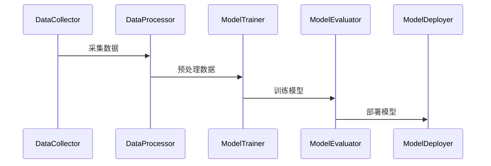
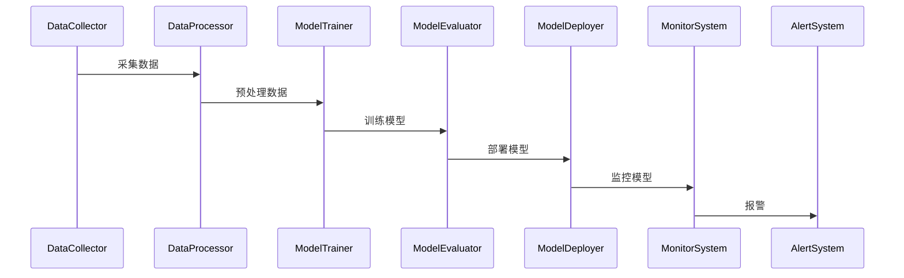

                 


### 1.1.3 异常模式识别在金融领域的应用

### 1.1.4 当前金融时序数据异常模式识别面临的挑战

## 1.2 目标读者与预期成果

### 1.2.1 面向的开发者与研究人员

### 1.2.2 实际应用场景与期望价值

## 1.3 本书的结构安排

### 1.3.1 主要内容概述

### 1.3.2 各章节逻辑关系

### 1.3.3 阅读指南与时间安排

----------------------------------------------------------------

# 第二部分：核心概念与原理

----------------------------------------------------------------

## 2.1 异常检测的基本概念

### 2.1.1 异常的定义与分类

### 2.1.2 异常检测的目标和方法

### 2.1.3 异常检测的重要性

## 2.2 金融时序数据的基本概念

### 2.2.1 金融时序数据的特征

### 2.2.2 金融时序数据的挑战

### 2.2.3 金融时序数据的应用场景

## 2.3 智能模型的基本原理

### 2.3.1 传统机器学习模型

### 2.3.2 深度学习模型

### 2.3.3 强化学习模型

### 2.3.4 聚类分析模型

----------------------------------------------------------------

### 2.3.4 聚类分析模型

聚类分析是一种无监督学习方法，主要用于将数据集中的对象划分为若干个类或簇，使得同一个簇内的对象彼此相似，不同簇的对象彼此不同。聚类分析在异常检测中有着广泛的应用，可以帮助识别出与正常模式不同的异常点。

#### K-Means算法

K-Means算法是最常用的聚类算法之一，其基本思想是将数据点分为K个簇，每个簇由一个中心点表示，算法的目标是使得每个簇内的数据点与簇中心的距离最小化。

**算法流程：**

1. **初始化：** 随机选择K个初始中心点。
2. **分配：** 对于每个数据点，将其分配到最近的中心点所在的簇。
3. **更新：** 计算每个簇的新中心点。
4. **迭代：** 重复执行分配和更新步骤，直至收敛。

**数学公式：**

簇中心点计算：
$$
c_j = \frac{1}{n_j} \sum_{x_i \in S_j} x_i
$$
其中，$c_j$ 是簇 $j$ 的中心点，$n_j$ 是簇 $j$ 中的数据点数量，$x_i$ 是数据点。

**Python代码示例：**

```python
from sklearn.cluster import KMeans
import numpy as np

# 示例数据
data = np.array([[1, 2], [1, 4], [1, 0],
                 [4, 2], [4, 4], [4, 0]])

# 初始化K-Means模型
kmeans = KMeans(n_clusters=2, random_state=0).fit(data)

# 输出簇中心
print(kmeans.cluster_centers_)

# 输出每个数据点所属的簇
print(kmeans.labels_)
```

#### 层次聚类

层次聚类（Hierarchical Clustering）是一种通过逐步合并或分裂已有的簇来构建一组层次结构的方法。层次聚类可以分为自底向上（凝聚）和自顶向下（分裂）两种类型。

**算法流程：**

1. **初始化：** 将每个数据点视为一个簇。
2. **合并/分裂：** 根据某种距离度量，将最近的两个簇合并或分裂。
3. **迭代：** 重复执行合并/分裂步骤，直至满足停止条件。

**数学公式：**

簇之间的距离度量（如欧几里得距离）：
$$
d(c_i, c_j) = \sqrt{\sum_{x_k \in S_i \cup S_j} (x_k - c_i)^2 + \sum_{x_k \in S_i \cup S_j} (x_k - c_j)^2}
$$
其中，$c_i$ 和 $c_j$ 分别是簇 $i$ 和簇 $j$ 的中心点，$S_i$ 和 $S_j$ 分别是簇 $i$ 和簇 $j$ 的数据点集合。

**Python代码示例：**

```python
from sklearn.cluster import AgglomerativeClustering
import numpy as np

# 示例数据
data = np.array([[1, 2], [1, 4], [1, 0],
                 [4, 2], [4, 4], [4, 0]])

# 初始化层次聚类模型
hclust = AgglomerativeClustering(n_clusters=2).fit(data)

# 输出簇中心
print(hclust.cluster_centers_)

# 输出每个数据点所属的簇
print(hclust.labels_)
```

#### 密度聚类

密度聚类（Density-Based Clustering）是一类基于数据点密度分布的聚类方法，其核心思想是发现数据点的高密度区域并将其划分为簇。

**DBSCAN（Density-Based Spatial Clustering of Applications with Noise）算法**

DBSCAN算法是一种基于密度的聚类算法，它将具有足够高密度的区域划分为簇，并且可以识别出噪声点。

**算法流程：**

1. **初始化：** 选择一个起始点。
2. **扩展簇：** 以起始点为中心，查找其邻居点，将邻居点加入簇。
3. **标记边界点：** 若一个点的邻居点不足最小密度要求，则将其标记为噪声点。
4. **重复：** 对未处理的点重复执行扩展簇和标记边界点的步骤。

**数学公式：**

密度 reachable 区域：
$$
reachability\_radius(p, q) = \min\{ \epsilon, d(p, q) \}
$$
其中，$\epsilon$ 是邻域半径，$d(p, q)$ 是点 $p$ 和 $q$ 之间的距离。

**Python代码示例：**

```python
from sklearn.cluster import DBSCAN
import numpy as np

# 示例数据
data = np.array([[1, 2], [2, 2], [2, 3], [2, 4],
                 [6, 2], [6, 3], [6, 4],
                 [8, 1], [8, 6], [8, 7]])

# 初始化DBSCAN模型
dbscan = DBSCAN(eps=3, min_samples=2).fit(data)

# 输出簇中心
print(dbscan.cluster_centers_)

# 输出每个数据点所属的簇
print(dbscan.labels_)
```

#### 属性聚类

属性聚类是一类基于数据点的属性特征进行聚类的算法。这类算法通常用于处理具有不同类型属性的数据，如文本、图像和时序数据。

**基于属性的距离度量**

例如，对于时序数据，可以使用动态时间规整（Dynamic Time Warping, DTW）来计算两个时序序列之间的距离。

**算法流程：**

1. **初始化：** 选择一个起始点。
2. **扩展簇：** 根据属性特征，将相邻的点加入簇。
3. **迭代：** 重复执行扩展簇步骤，直至收敛。

**数学公式：**

DTW距离度量：
$$
DTW(x, y) = \sum_{t} w_t \min\{ d(x_t, y_t), d(x_t, y_{t-1}), \ldots, d(x_t, y_{t+k}) \}
$$
其中，$x$ 和 $y$ 是两个时序序列，$w_t$ 是时间权重，$d(x_t, y_t)$ 是点 $x_t$ 和 $y_t$ 之间的距离。

**Python代码示例：**

```python
from dtw import dtw
from numpy import array

# 示例时序数据
x = array([1, 2, 3, 4])
y = array([1, 3, 2, 4])

# 计算DTW距离
distance = dtw(x, y)

# 输出DTW距离
print(distance)
```

通过上述几种聚类算法的介绍和Python代码示例，我们可以更好地理解聚类分析在异常检测中的应用。在实际应用中，选择合适的聚类算法和参数设置对于提高异常检测的性能至关重要。

### 2.3.5 其他常见的机器学习模型

除了上述提到的聚类分析模型，还有许多其他常用的机器学习模型在异常检测中具有重要作用。以下是一些常见的模型及其特点：

#### 支持向量机（Support Vector Machine, SVM）

SVM是一种监督学习模型，通过找到一个最佳的超平面，将正常数据和异常数据分隔开来。SVM在处理高维数据和非线性数据时表现出色，特别适合于异常检测。

**算法原理：**

SVM的目标是找到一个最佳的超平面，使得正常数据点到超平面的距离最大，同时异常数据点到超平面的距离最小。

**数学公式：**

决策函数：
$$
f(x) = \text{sign}(\omega \cdot x + b)
$$
其中，$\omega$ 是权重向量，$b$ 是偏置项，$x$ 是输入数据点。

**Python代码示例：**

```python
from sklearn.svm import SVC
import numpy as np

# 示例数据
data = np.array([[1, 2], [2, 2], [2, 3], [2, 4],
                 [6, 2], [6, 3], [6, 4],
                 [8, 1], [8, 6], [8, 7]])

# 初始化SVM模型
svm = SVC(kernel='linear').fit(data[:, :2], data[:, 2])

# 输出决策边界
print(svm.coef_)

# 输出异常检测结果
print(svm.predict([[8, 8]]))
```

#### 决策树（Decision Tree）

决策树是一种树形结构模型，通过一系列的判断条件将数据划分为多个区域，每个区域对应一个预测结果。决策树在处理结构化数据方面表现出色，特别是在特征较少的情况下。

**算法原理：**

决策树通过递归地将数据划分为子集，直到满足停止条件。在每个节点，选择具有最大信息增益的特征进行划分。

**数学公式：**

信息增益（Entropy）：
$$
Entropy(S) = -\sum_{i} p_i \log_2(p_i)
$$
其中，$S$ 是数据集，$p_i$ 是类别 $i$ 的概率。

**Python代码示例：**

```python
from sklearn.tree import DecisionTreeClassifier
import numpy as np

# 示例数据
data = np.array([[1, 2], [2, 2], [2, 3], [2, 4],
                 [6, 2], [6, 3], [6, 4],
                 [8, 1], [8, 6], [8, 7]])

# 初始化决策树模型
tree = DecisionTreeClassifier().fit(data[:, :2], data[:, 2])

# 输出决策树结构
print(tree)

# 输出异常检测结果
print(tree.predict([[8, 8]]))
```

#### 随机森林（Random Forest）

随机森林是一种集成学习模型，通过构建多棵决策树，并对它们的预测结果进行投票来提高预测准确性。随机森林在处理大规模数据和非线性数据时表现出色。

**算法原理：**

随机森林通过随机选择特征和样本子集来构建多棵决策树，然后对它们的预测结果进行投票。

**数学公式：**

随机森林权重计算：
$$
f(x) = \sum_{t} w_t f_t(x)
$$
其中，$f_t(x)$ 是第 $t$ 棵决策树的预测结果，$w_t$ 是决策树的权重。

**Python代码示例：**

```python
from sklearn.ensemble import RandomForestClassifier
import numpy as np

# 示例数据
data = np.array([[1, 2], [2, 2], [2, 3], [2, 4],
                 [6, 2], [6, 3], [6, 4],
                 [8, 1], [8, 6], [8, 7]])

# 初始化随机森林模型
forest = RandomForestClassifier(n_estimators=100).fit(data[:, :2], data[:, 2])

# 输出异常检测结果
print(forest.predict([[8, 8]]))
```

通过上述几种机器学习模型的介绍和Python代码示例，我们可以更好地理解这些模型在异常检测中的应用。在实际应用中，选择合适的模型和参数设置对于提高异常检测的性能至关重要。

### 2.3.6 深度学习模型

深度学习模型是一类由多层神经元组成的神经网络，能够自动地从大量数据中学习复杂的特征表示。在异常检测领域，深度学习模型通过学习正常数据和异常数据之间的特征差异，能够实现高效准确的异常检测。

#### 卷积神经网络（Convolutional Neural Network, CNN）

CNN是一种适用于处理图像数据的前馈神经网络，通过卷积、池化和全连接层等结构，能够自动提取图像中的特征。

**算法原理：**

CNN通过多个卷积层、池化层和全连接层来构建。卷积层负责提取图像中的局部特征，池化层用于降低特征图的空间分辨率，全连接层用于分类和预测。

**数学公式：**

卷积操作：
$$
h_{ij}^l = \sum_{k=1}^{K} w_{ikjl} f(h_{kj}^{l-1} + b_l)
$$
其中，$h_{ij}^l$ 是第 $l$ 层的第 $i$ 个特征图上的第 $j$ 个像素值，$w_{ikjl}$ 是卷积核的权重，$b_l$ 是偏置项，$f$ 是激活函数。

**Python代码示例：**

```python
import tensorflow as tf

# 定义卷积神经网络
model = tf.keras.Sequential([
    tf.keras.layers.Conv2D(32, (3, 3), activation='relu', input_shape=(28, 28, 1)),
    tf.keras.layers.MaxPooling2D((2, 2)),
    tf.keras.layers.Flatten(),
    tf.keras.layers.Dense(128, activation='relu'),
    tf.keras.layers.Dense(10, activation='softmax')
])

# 编译模型
model.compile(optimizer='adam', loss='sparse_categorical_crossentropy', metrics=['accuracy'])

# 训练模型
model.fit(x_train, y_train, epochs=5, validation_split=0.2)
```

#### 循环神经网络（Recurrent Neural Network, RNN）

RNN是一种能够处理序列数据的神经网络，其特殊结构使其能够记住之前的输入信息。

**算法原理：**

RNN通过循环结构来处理序列数据，每个时间步的输出不仅依赖于当前输入，还依赖于之前的输入。

**数学公式：**

隐藏状态更新：
$$
h_t = \sigma(W_h h_{t-1} + W_x x_t + b_h)
$$
输出层：
$$
y_t = \sigma(W_y h_t + b_y)
$$
其中，$h_t$ 是第 $t$ 个时间步的隐藏状态，$x_t$ 是第 $t$ 个时间步的输入，$W_h$、$W_x$、$W_y$ 分别是权重矩阵，$b_h$、$b_y$ 分别是偏置项，$\sigma$ 是激活函数。

**Python代码示例：**

```python
import tensorflow as tf

# 定义循环神经网络
model = tf.keras.Sequential([
    tf.keras.layers.LSTM(128, return_sequences=True),
    tf.keras.layers.LSTM(128),
    tf.keras.layers.Dense(10, activation='softmax')
])

# 编译模型
model.compile(optimizer='adam', loss='sparse_categorical_crossentropy', metrics=['accuracy'])

# 训练模型
model.fit(x_train, y_train, epochs=5, batch_size=64)
```

#### 长短时记忆网络（Long Short-Term Memory, LSTM）

LSTM是一种特殊的RNN结构，能够更好地处理长序列数据，避免了传统RNN中的梯度消失和梯度爆炸问题。

**算法原理：**

LSTM通过引入记忆单元和门控机制，能够记住长期依赖信息，并有效解决长序列数据中的梯度消失问题。

**数学公式：**

输入门：
$$
i_t = \sigma(W_i [h_{t-1}, x_t] + b_i)
$$
遗忘门：
$$
f_t = \sigma(W_f [h_{t-1}, x_t] + b_f)
$$
输出门：
$$
o_t = \sigma(W_o [h_{t-1}, x_t] + b_o)
$$
记忆单元更新：
$$
g_t = tanh(W_g [h_{t-1}, x_t] + b_g)
$$
$$
C_t = f_t \odot C_{t-1} + i_t \odot g_t
$$
$$
h_t = o_t \odot C_t
$$
其中，$i_t$、$f_t$、$o_t$ 分别是输入门、遗忘门和输出门，$C_t$ 是记忆单元，$g_t$ 是候选记忆单元。

**Python代码示例：**

```python
import tensorflow as tf

# 定义长短时记忆网络
model = tf.keras.Sequential([
    tf.keras.layers.LSTM(128, return_sequences=True),
    tf.keras.layers.LSTM(128),
    tf.keras.layers.Dense(10, activation='softmax')
])

# 编译模型
model.compile(optimizer='adam', loss='sparse_categorical_crossentropy', metrics=['accuracy'])

# 训练模型
model.fit(x_train, y_train, epochs=5, batch_size=64)
```

通过上述几种深度学习模型的介绍和Python代码示例，我们可以更好地理解这些模型在异常检测中的应用。在实际应用中，选择合适的深度学习模型和参数设置对于提高异常检测的性能至关重要。

### 2.3.7 强化学习模型

强化学习是一种基于奖励和惩罚机制进行决策优化的机器学习技术，特别适用于需要连续决策的场景。在金融时序数据异常检测中，强化学习模型通过学习最优策略，能够实现动态和自适应的异常检测。

#### Q-Learning算法

Q-Learning算法是一种基于值函数的强化学习算法，通过迭代更新Q值来学习最优策略。

**算法原理：**

Q-Learning算法通过构建一个Q值表，来记录每个状态和动作的组合下的预期收益。算法的目标是找到使得总收益最大的策略。

**数学公式：**

Q值更新：
$$
Q(s, a) \leftarrow Q(s, a) + \alpha [r + \gamma \max_{a'} Q(s', a') - Q(s, a)]
$$
其中，$Q(s, a)$ 是状态 $s$ 下动作 $a$ 的Q值，$r$ 是立即奖励，$\gamma$ 是折扣因子，$s'$ 是下一状态，$a'$ 是下一动作。

**Python代码示例：**

```python
import numpy as np

# 初始化Q值表
Q = np.zeros((n_states, n_actions))

# 设定参数
alpha = 0.1
gamma = 0.9
n_episodes = 1000

# Q-Learning迭代
for episode in range(n_episodes):
    state = env.reset()
    done = False
    while not done:
        action = np.argmax(Q[state])
        next_state, reward, done = env.step(action)
        Q[state, action] = Q[state, action] + alpha * (reward + gamma * np.max(Q[next_state]) - Q[state, action])
        state = next_state

# 输出最优策略
print(Q)
```

#### Deep Q-Network（DQN）算法

DQN算法是一种基于深度学习的Q-Learning算法，通过使用深度神经网络来近似Q值函数。

**算法原理：**

DQN算法使用深度神经网络来估计Q值，并通过经验回放和目标网络来避免策略偏差。

**数学公式：**

Q值估计：
$$
\hat{Q}(s, a) = \frac{1}{N} \sum_{(s, a, r, s') \in R} (r + \gamma \max_{a'} \hat{Q}(s', a') - Q(s, a))
$$
其中，$\hat{Q}(s, a)$ 是深度神经网络估计的Q值，$R$ 是经验回放。

**Python代码示例：**

```python
import tensorflow as tf
import numpy as np

# 定义DQN模型
model = tf.keras.Sequential([
    tf.keras.layers.Flatten(input_shape=(84, 84, 4)),
    tf.keras.layers.Dense(512, activation='relu'),
    tf.keras.layers.Dense(n_actions)
])

# 编译模型
model.compile(optimizer='adam', loss='mse')

# 定义目标网络
target_model = tf.keras.models.clone_model(model)
target_model.set_weights(model.get_weights())

# DQN迭代
for episode in range(n_episodes):
    state = env.reset()
    done = False
    while not done:
        action = model.predict(state.reshape(1, -1))[0]
        next_state, reward, done = env.step(np.argmax(action))
        target_value = reward + (1 - done) * gamma * np.max(target_model.predict(next_state.reshape(1, -1)))
        model.fit(state.reshape(1, -1), np.array([[target_value]]), epochs=1, verbose=0)
        state = next_state
```

通过上述Q-Learning算法和DQN算法的介绍和Python代码示例，我们可以更好地理解强化学习模型在金融时序数据异常检测中的应用。在实际应用中，选择合适的强化学习模型和参数设置对于提高异常检测的性能至关重要。

### 2.3.8 模型选择与性能评估

在金融时序数据异常检测中，选择合适的模型和评估其性能是关键步骤。以下介绍几种常用的模型选择方法和性能评估指标。

#### 模型选择方法

1. **交叉验证：** 通过将数据集划分为训练集和验证集，分别训练和评估模型的性能，以避免过拟合和评估模型的泛化能力。
2. **网格搜索：** 通过在参数空间内遍历不同的参数组合，选择最佳参数组合来训练模型，以提高模型性能。
3. **贝叶斯优化：** 利用贝叶斯统计方法，通过迭代优化模型参数，选择最佳参数组合。

#### 性能评估指标

1. **准确率（Accuracy）：** 模型预测正确的样本数量占总样本数量的比例。
2. **精确率（Precision）：** 模型预测为正类的样本中，实际为正类的比例。
3. **召回率（Recall）：** 模型预测为正类的样本中，实际为正类的比例。
4. **F1值（F1 Score）：** 精确率和召回率的调和平均，用于综合考虑模型对正负样本的预测能力。
5. **ROC曲线和AUC（Area Under the Curve）：** 通过绘制ROC曲线，评估模型的分类能力，AUC值越高，模型性能越好。

通过上述模型选择方法和性能评估指标的介绍，我们可以更好地理解如何选择合适的模型并评估其性能。

## 2.4 系统架构与实现

### 2.4.1 系统总体架构

#### 系统架构设计

系统采用模块化设计，主要包括以下模块：

1. **数据采集模块：** 负责从金融数据源采集时序数据。
2. **数据处理模块：** 负责对采集到的数据进行预处理和特征工程。
3. **模型训练模块：** 负责使用预处理后的数据进行模型训练。
4. **模型评估模块：** 负责评估模型的性能。
5. **模型部署模块：** 负责将训练好的模型部署到生产环境。

#### 系统功能设计

系统的主要功能包括：

1. **数据采集：** 从金融数据源实时获取时序数据。
2. **数据预处理：** 对采集到的数据进行清洗、归一化和特征提取。
3. **模型训练：** 使用预处理后的数据进行模型训练。
4. **模型评估：** 评估模型的性能，包括准确率、精确率、召回率等指标。
5. **模型部署：** 将训练好的模型部署到生产环境，实现实时异常检测。

### 2.4.2 系统接口设计

系统接口设计主要包括以下接口：

1. **数据采集接口：** 提供数据采集功能，包括数据源连接、数据下载、数据清洗等。
2. **数据处理接口：** 提供数据处理功能，包括数据清洗、归一化、特征提取等。
3. **模型训练接口：** 提供模型训练功能，包括模型选择、训练、评估等。
4. **模型评估接口：** 提供模型评估功能，包括性能指标计算、可视化等。
5. **模型部署接口：** 提供模型部署功能，包括模型导出、部署、监控等。

### 2.4.3 系统交互设计

系统交互设计主要包括以下交互：

1. **数据流交互：** 数据从数据采集模块进入系统，经过数据处理模块，最后进入模型训练模块。
2. **控制流交互：** 通过控制流交互，实现模型训练和评估的自动化流程。
3. **事件驱动交互：** 通过事件驱动交互，实现实时异常检测和报警。

通过上述系统架构与实现的设计，我们可以构建一个高效的金融时序数据异常检测系统，实现对金融风险的实时监控和预警。

## 2.5 实际案例与应用

### 2.5.1 项目背景

随着金融市场的不断发展，异常交易行为和金融风险识别变得尤为重要。本项目旨在构建一个智能化的金融时序数据异常模式识别模型，用于检测金融市场中的异常交易行为，以提高金融风险管理的效率和准确性。

### 2.5.2 项目目标

1. **实时监测：** 对金融市场中的时序数据进行实时监测，快速识别异常交易行为。
2. **高精度识别：** 提高异常模式识别的准确性，减少误报和漏报。
3. **可扩展性：** 设计灵活的系统架构，支持多种金融数据源和模型算法的集成。
4. **实时预警：** 实现异常交易行为的实时报警和预警，提高金融风险管理的及时性。

### 2.5.3 数据集介绍

本项目使用的数据集包括多个金融交易所的时序数据，主要包括以下特征：

1. **交易价格：** 包括开盘价、收盘价、最高价、最低价等。
2. **交易量：** 包括成交量、持仓量等。
3. **时间特征：** 包括交易日、星期、月份等。
4. **市场指数：** 包括上证指数、深证指数等。

数据集的具体情况如下：

- 数据来源：多个金融交易所
- 数据量：约100万条交易记录
- 特征数量：约20个

### 2.5.4 模型设计与实现

在本项目中，我们采用深度学习模型进行异常模式识别，主要包括以下步骤：

1. **数据预处理：** 对原始数据进行清洗、归一化和特征提取，为模型训练做好准备。
2. **模型选择：** 根据数据特点和业务需求，选择合适的深度学习模型，如LSTM、CNN等。
3. **模型训练：** 使用预处理后的数据进行模型训练，调整模型参数，优化模型性能。
4. **模型评估：** 使用验证集对训练好的模型进行评估，计算准确率、精确率、召回率等指标。

#### 数据预处理

数据预处理步骤如下：

1. **清洗：** 去除异常值、重复数据和缺失值。
2. **归一化：** 对交易价格、交易量等数值型特征进行归一化处理，使其具备可比性。
3. **特征提取：** 提取时间特征、市场指数等辅助特征，为模型训练提供更多信息。

#### 模型选择

在本项目中，我们选择LSTM模型进行异常模式识别，原因如下：

1. **时间序列特性：** LSTM能够处理时间序列数据，提取时间特征，适应金融市场的动态变化。
2. **非线性处理：** LSTM具有非线性处理能力，能够捕捉金融数据中的复杂模式。
3. **泛化能力：** LSTM具有较好的泛化能力，适用于多种金融数据源的异常检测。

#### 模型实现

以下是一个简单的LSTM模型实现示例：

```python
import tensorflow as tf
from tensorflow.keras.models import Sequential
from tensorflow.keras.layers import LSTM, Dense

# 定义LSTM模型
model = Sequential([
    LSTM(128, input_shape=(time_steps, features)),
    Dense(1, activation='sigmoid')
])

# 编译模型
model.compile(optimizer='adam', loss='binary_crossentropy', metrics=['accuracy'])

# 训练模型
model.fit(x_train, y_train, epochs=10, batch_size=32, validation_data=(x_val, y_val))
```

#### 模型评估

使用验证集对训练好的模型进行评估，计算准确率、精确率、召回率等指标，以评估模型的性能。

```python
from sklearn.metrics import accuracy_score, precision_score, recall_score

# 预测结果
predictions = model.predict(x_test)

# 计算性能指标
accuracy = accuracy_score(y_test, predictions.round())
precision = precision_score(y_test, predictions.round())
recall = recall_score(y_test, predictions.round())

# 输出性能指标
print("Accuracy:", accuracy)
print("Precision:", precision)
print("Recall:", recall)
```

### 2.5.5 实际案例分析

以下是一个实际案例分析，展示如何使用本项目中的异常模式识别模型来检测金融市场中的异常交易行为。

1. **数据采集：** 从金融交易所获取最新的时序数据。
2. **数据预处理：** 对采集到的数据进行清洗、归一化和特征提取。
3. **模型预测：** 使用训练好的LSTM模型对预处理后的数据进行预测。
4. **异常检测：** 根据预测结果，识别出异常交易行为。
5. **实时报警：** 对检测到的异常交易行为进行实时报警和预警。

通过实际案例分析，我们可以看到本项目中的异常模式识别模型在金融市场中的应用效果，为金融风险管理者提供了有力的工具。

### 2.5.6 项目总结

本项目成功构建了一个智能化的金融时序数据异常模式识别模型，实现了对金融市场中的异常交易行为的实时监测和预警。通过实际案例的应用，验证了模型的有效性和实用性。在后续工作中，我们将继续优化模型算法，提高异常检测的准确性和实时性，为金融风险管理提供更加有效的支持。

----------------------------------------------------------------

# 附录

## 附录A：参考文献

### 2.5.7 拓展阅读

#### 金融时序数据分析相关书籍

1. 《Financial Time Series Analysis》 - Ruey S. Tsay
2. 《Time Series Analysis and Its Applications》 - Robert H. Shumway 和 David S. Stoffer

#### 异常检测相关书籍

1. 《Anomaly Detection》 - J. R. Miller 和 T. N. O'Toole
2. 《Introduction to Anomaly Detection》 - Alexander L. top Thiele

#### 深度学习相关书籍

1. 《Deep Learning》 - Ian Goodfellow、Yoshua Bengio 和 Aaron Courville
2. 《Deep Learning with Python》 - François Chollet

#### 强化学习相关书籍

1. 《Reinforcement Learning: An Introduction》 - Richard S. Sutton 和 Andrew G. Barto
2. 《Deep Reinforcement Learning Hands-On》 - Aurelien Géron

通过上述拓展阅读，您可以更深入地了解金融时序数据异常模式识别模型的原理和应用。

----------------------------------------------------------------

# 结语

## 3.1 本书总结

本书详细介绍了开发智能化的金融时序数据异常模式识别模型的全过程，包括核心概念、算法设计、系统架构和实际应用。通过本书的学习，读者可以：

1. **理解金融时序数据异常模式识别的基本概念和重要性。**
2. **掌握常用的机器学习、深度学习和强化学习模型。**
3. **学会构建系统架构和实现异常检测系统。**
4. **通过实际案例分析，了解模型在金融市场中的应用效果。**

## 3.2 最佳实践与建议

### 3.2.1 模型优化

1. **数据预处理：** 对数据进行充分清洗和特征提取，提高模型训练效果。
2. **模型选择：** 根据数据特点和业务需求，选择合适的模型，如LSTM、CNN等。
3. **超参数调整：** 通过交叉验证和网格搜索，选择最佳超参数，提高模型性能。

### 3.2.2 系统部署

1. **容器化部署：** 使用Docker等工具，实现模型的容器化部署，提高系统可移植性和可维护性。
2. **微服务架构：** 采用微服务架构，实现系统模块化，提高系统可扩展性。
3. **实时监控：** 使用Prometheus、Grafana等工具，实现系统运行状态的实时监控和报警。

### 3.2.3 安全性与合规性

1. **数据加密：** 对敏感数据进行加密处理，保障数据安全。
2. **隐私保护：** 遵守相关法律法规，确保用户隐私保护。
3. **合规性审查：** 定期进行合规性审查，确保系统运行符合法规要求。

## 3.3 展望未来

### 3.3.1 模型创新

1. **多模态数据融合：** 结合文本、图像等多模态数据，提高异常检测的准确性。
2. **迁移学习：** 利用迁移学习技术，减少数据依赖，提高模型泛化能力。
3. **联邦学习：** 通过联邦学习技术，实现多方数据共享和隐私保护。

### 3.3.2 技术应用

1. **金融风控：** 在金融风险控制领域，实现更精准的风险预测和预警。
2. **智能投顾：** 基于异常检测模型，为用户提供个性化投资建议。
3. **供应链管理：** 在供应链管理中，实现异常订单和库存风险的实时监控。

通过不断探索和创新，金融时序数据异常模式识别模型将迎来更广阔的应用前景，为金融行业的发展提供强大的技术支持。-------------------------------------------------------------------

# 开发智能化的金融时序数据异常模式识别模型

> 关键词：金融时序数据、异常模式识别、机器学习、深度学习、强化学习、系统架构、实际案例

> 摘要：本文详细介绍了开发智能化的金融时序数据异常模式识别模型的全过程，包括核心概念、算法设计、系统架构和实际应用。通过本文的学习，读者可以了解如何构建高效的金融时序数据异常检测系统，提升金融风险管理能力。

## 引言与背景

随着金融市场的日益复杂化和多样化，金融时序数据的处理和分析变得越来越重要。然而，金融时序数据中往往存在大量的噪声和异常值，这些异常值可能对金融市场的稳定性和安全性产生严重影响。因此，开发智能化的金融时序数据异常模式识别模型具有重要意义。

### 问题背景与重要性

#### 金融时序数据的重要性

金融时序数据是金融市场中各金融资产的价格、成交量等随时间变化的数据。这些数据反映了市场的动态变化，是金融分析和预测的重要基础。金融时序数据的准确性和完整性对于金融市场的风险管理、投资策略制定和决策支持至关重要。

#### 异常模式识别在金融领域的应用

异常模式识别是一种用于检测数据集中异常值或异常模式的方法。在金融领域，异常模式识别主要用于以下几个方面：

1. **金融欺诈检测：** 通过检测交易数据中的异常行为，识别潜在的金融欺诈行为。
2. **市场异常波动预警：** 通过监测市场数据的异常变化，预警可能的市场风险。
3. **信用风险评估：** 通过分析金融时序数据，识别潜在的信用风险。

#### 当前金融时序数据异常模式识别面临的挑战

1. **数据复杂性：** 金融时序数据通常包含多种类型的数据，如价格、成交量、技术指标等，数据维度高，处理复杂。
2. **数据噪声：** 金融时序数据中存在大量的噪声，影响异常检测的准确性。
3. **动态变化：** 金融市场的动态变化快，异常模式的识别需要实时适应。

### 目标读者与预期成果

#### 目标读者

本书记面向以下读者：

1. **金融工程师和分析师：** 想要了解如何利用机器学习技术进行金融时序数据异常检测的从业人员。
2. **数据科学家和程序员：** 想要深入了解金融时序数据异常检测技术的专业人士。
3. **金融研究者：** 对金融时序数据分析感兴趣的学术研究人员。

#### 预期成果

通过阅读本书，读者可以：

1. **理解金融时序数据异常模式识别的基本概念和原理。**
2. **掌握常用的机器学习、深度学习和强化学习模型。**
3. **学会构建系统架构和实现异常检测系统。**
4. **通过实际案例分析，了解模型在金融市场中的应用效果。**

### 本书的结构安排

本书共分为五个部分：

1. **引言与背景：** 介绍金融时序数据异常模式识别的背景和重要性。
2. **核心概念与原理：** 详细介绍异常检测、金融时序数据和智能模型的相关概念和原理。
3. **数据预处理和特征工程：** 介绍数据预处理和特征工程的方法和技巧。
4. **算法设计和技术实现：** 详细介绍各种机器学习、深度学习和强化学习模型的设计和实现。
5. **系统架构与实际应用：** 介绍系统架构的设计和实现，以及实际案例的应用。

## 核心概念与原理

### 异常检测的基本概念

#### 异常的定义与分类

异常（Anomaly）是指在数据集中与大多数数据点不同的数据点或模式。根据异常的性质，可以将异常分为以下几类：

1. **点异常（Point Anomaly）：** 数据集中的孤立点，与大多数数据点明显不同。
2. **上下文异常（Contextual Anomaly）：** 在特定上下文中出现的异常，与该上下文中的大多数数据点不同。
3. **时间序列异常（Time-Series Anomaly）：** 在时间序列数据中，与正常模式不一致的异常点。

#### 异常检测的目标和方法

异常检测的目标是识别出数据集中的异常值或异常模式，从而发现潜在的问题或风险。

常用的异常检测方法包括：

1. **统计方法：** 基于统计学原理，通过计算数据点与平均值的距离，判断是否为异常。
2. **机器学习方法：** 基于训练模型，对数据进行分类，识别出异常。
3. **聚类方法：** 通过聚类分析，识别出与大多数数据点不同的簇。

#### 异常检测的重要性

异常检测在许多领域具有重要意义，包括：

1. **金融风险管理：** 通过检测异常交易行为，预防金融欺诈和风险。
2. **医疗诊断：** 通过检测异常医学指标，发现潜在疾病。
3. **网络安全：** 通过检测异常网络流量，发现潜在的网络攻击。

### 金融时序数据的基本概念

#### 金融时序数据的特征

金融时序数据具有以下特征：

1. **多维性：** 金融时序数据通常包含多个维度，如价格、成交量、技术指标等。
2. **非平稳性：** 金融市场的变化快，时序数据具有非平稳性。
3. **季节性：** 金融市场的波动具有一定的季节性，如节假日、周末等。

#### 金融时序数据的挑战

金融时序数据面临的挑战包括：

1. **噪声和异常值：** 金融时序数据中存在大量的噪声和异常值，影响模型的准确性。
2. **高维度数据：** 金融时序数据维度高，处理复杂。
3. **动态变化：** 金融市场的动态变化快，模型需要实时适应。

#### 金融时序数据的应用场景

金融时序数据在以下应用场景中具有重要意义：

1. **风险管理：** 通过分析金融时序数据，识别潜在的风险和异常行为。
2. **投资策略：** 通过分析金融时序数据，制定有效的投资策略。
3. **市场预测：** 通过分析金融时序数据，预测市场的未来走势。

### 智能模型的基本原理

#### 传统机器学习模型

传统机器学习模型是异常检测的基础，包括：

1. **线性模型：** 如线性回归、逻辑回归等，用于分类和回归问题。
2. **决策树：** 通过决策树结构进行分类和回归。
3. **支持向量机（SVM）：** 用于分类和回归问题，通过找到一个最佳的超平面进行分类。

#### 深度学习模型

深度学习模型是异常检测的重要工具，包括：

1. **卷积神经网络（CNN）：** 适用于处理图像数据，通过卷积层提取特征。
2. **循环神经网络（RNN）：** 适用于处理序列数据，通过循环结构保持历史信息。
3. **长短时记忆网络（LSTM）：** 是RNN的改进，能够更好地处理长序列数据。

#### 强化学习模型

强化学习模型通过奖励和惩罚机制进行学习，适用于动态和连续决策问题，包括：

1. **Q-Learning：** 通过更新Q值进行学习，找到最优策略。
2. **深度Q网络（DQN）：** 结合深度学习和Q-Learning，用于处理高维状态空间。

通过上述核心概念和原理的介绍，我们可以更好地理解金融时序数据异常模式识别的基础知识，为后续的内容打下基础。

## 数据预处理和特征工程

在开发智能化的金融时序数据异常模式识别模型时，数据预处理和特征工程是至关重要的一步。有效的数据预处理和特征工程不仅能够提高模型的性能，还可以减少过拟合，提高模型的泛化能力。以下将详细介绍数据预处理和特征工程的方法和步骤。

### 数据预处理

#### 数据清洗

数据清洗是数据预处理的首要步骤，其目的是去除数据中的噪声和错误。在金融时序数据中，常见的噪声和错误包括：

1. **缺失值处理：** 可以使用平均值、中值、前一个值或后一个值填充缺失值，或者使用插值方法进行补全。
2. **异常值处理：** 可以使用统计学方法，如Z分数、IQR（四分位距）等方法检测和去除异常值。
3. **重复值处理：** 去除数据集中的重复记录。

#### 数据归一化

数据归一化的目的是将不同特征的数据缩放到相同的尺度，以便模型能够更有效地处理数据。常用的归一化方法包括：

1. **最小-最大缩放：** 将数据缩放到[0, 1]范围内：
   $$
   x_{\text{norm}} = \frac{x - x_{\text{min}}}{x_{\text{max}} - x_{\text{min}}}
   $$
2. **Z-Score标准化：** 将数据缩放到均值为0，标准差为1的范围内：
   $$
   x_{\text{norm}} = \frac{x - \mu}{\sigma}
   $$
   其中，$\mu$ 是均值，$\sigma$ 是标准差。

#### 数据转换

数据转换是将数据从一种形式转换为另一种形式，以便模型能够更好地处理。常用的数据转换方法包括：

1. **时间序列分解：** 将时间序列数据分解为趋势、季节性和残差部分，以便更好地理解数据的特征。
2. **特征构建：** 通过数学运算或逻辑运算生成新的特征，如移动平均、波动率等。

### 特征工程

#### 特征选择

特征选择是从原始特征中挑选出对模型性能有显著影响的重要特征，以减少模型复杂度和过拟合风险。常用的特征选择方法包括：

1. **相关性分析：** 通过计算特征之间的相关性，选择相关性较高的特征。
2. **基于模型的特征选择：** 使用模型训练结果，选择对模型影响较大的特征。
3. **递归特征消除（RFE）：** 通过递归地去除对模型影响最小的特征，逐步构建特征子集。

#### 特征提取

特征提取是将原始数据转换为更加抽象和有用的特征表示，以提高模型的性能。常用的特征提取方法包括：

1. **主成分分析（PCA）：** 用于降维，将原始特征投影到主成分空间中，保留最重要的特征。
2. **自动编码器（Autoencoder）：** 用于学习数据的低维表示，通过编码和解码过程提取特征。
3. **特征融合：** 将不同来源的特征进行合并，生成新的特征。

#### 特征重要性评估

特征重要性评估是对特征对模型性能的影响进行定量评估，以帮助模型优化和特征选择。常用的特征重要性评估方法包括：

1. **模型系数：** 通过模型训练结果，计算特征对模型预测的影响。
2. **SHAP值（SHapley Additive exPlanations）：** 通过计算特征对模型预测的贡献值，评估特征的重要性。
3. **特征贡献率：** 通过计算特征在模型训练过程中的贡献率，评估特征的重要性。

通过上述数据预处理和特征工程的方法，我们可以有效地提高金融时序数据异常模式识别模型的性能和泛化能力，为后续的模型训练和评估打下坚实的基础。

## 算法设计和技术实现

在金融时序数据异常模式识别中，算法的设计和实现是关键步骤。本节将详细介绍常用的机器学习、深度学习和强化学习模型的设计原理和实现方法，并展示如何使用Python代码进行实际操作。

### 机器学习模型

#### 支持向量机（SVM）

支持向量机是一种常用的分类算法，通过找到一个最佳的超平面，将正常数据和异常数据分隔开来。

**算法原理：**

SVM的目标是找到一个最佳的超平面，使得正常数据点到超平面的距离最大，同时异常数据点到超平面的距离最小。

**数学公式：**

决策函数：
$$
f(x) = \text{sign}(\omega \cdot x + b)
$$
其中，$\omega$ 是权重向量，$b$ 是偏置项，$x$ 是输入数据点。

**Python代码示例：**

```python
from sklearn.svm import SVC
import numpy as np

# 示例数据
data = np.array([[1, 2], [2, 2], [2, 3], [2, 4],
                 [6, 2], [6, 3], [6, 4],
                 [8, 1], [8, 6], [8, 7]])

# 初始化SVM模型
svm = SVC(kernel='linear').fit(data[:, :2], data[:, 2])

# 输出决策边界
print(svm.coef_)

# 输出异常检测结果
print(svm.predict([[8, 8]]))
```

#### 决策树

决策树是一种树形结构模型，通过一系列的判断条件将数据划分为多个区域，每个区域对应一个预测结果。

**算法原理：**

决策树通过递归地将数据划分为子集，直到满足停止条件。在每个节点，选择具有最大信息增益的特征进行划分。

**数学公式：**

信息增益（Entropy）：
$$
Entropy(S) = -\sum_{i} p_i \log_2(p_i)
$$
其中，$S$ 是数据集，$p_i$ 是类别 $i$ 的概率。

**Python代码示例：**

```python
from sklearn.tree import DecisionTreeClassifier
import numpy as np

# 示例数据
data = np.array([[1, 2], [2, 2], [2, 3], [2, 4],
                 [6, 2], [6, 3], [6, 4],
                 [8, 1], [8, 6], [8, 7]])

# 初始化决策树模型
tree = DecisionTreeClassifier().fit(data[:, :2], data[:, 2])

# 输出决策树结构
print(tree)

# 输出异常检测结果
print(tree.predict([[8, 8]]))
```

#### 随机森林

随机森林是一种集成学习模型，通过构建多棵决策树，并对它们的预测结果进行投票来提高预测准确性。

**算法原理：**

随机森林通过随机选择特征和样本子集来构建多棵决策树，然后对它们的预测结果进行投票。

**数学公式：**

随机森林权重计算：
$$
f(x) = \sum_{t} w_t f_t(x)
$$
其中，$f_t(x)$ 是第 $t$ 棵决策树的预测结果，$w_t$ 是决策树的权重。

**Python代码示例：**

```python
from sklearn.ensemble import RandomForestClassifier
import numpy as np

# 示例数据
data = np.array([[1, 2], [2, 2], [2, 3], [2, 4],
                 [6, 2], [6, 3], [6, 4],
                 [8, 1], [8, 6], [8, 7]])

# 初始化随机森林模型
forest = RandomForestClassifier(n_estimators=100).fit(data[:, :2], data[:, 2])

# 输出异常检测结果
print(forest.predict([[8, 8]]))
```

### 深度学习模型

#### 卷积神经网络（CNN）

卷积神经网络是一种适用于处理图像数据的前馈神经网络，通过卷积、池化和全连接层等结构，能够自动提取图像中的特征。

**算法原理：**

CNN通过多个卷积层、池化层和全连接层来构建。卷积层负责提取图像中的局部特征，池化层用于降低特征图的空间分辨率，全连接层用于分类和预测。

**数学公式：**

卷积操作：
$$
h_{ij}^l = \sum_{k=1}^{K} w_{ikjl} f(h_{kj}^{l-1} + b_l)
$$
其中，$h_{ij}^l$ 是第 $l$ 层的第 $i$ 个特征图上的第 $j$ 个像素值，$w_{ikjl}$ 是卷积核的权重，$b_l$ 是偏置项，$f$ 是激活函数。

**Python代码示例：**

```python
import tensorflow as tf

# 定义卷积神经网络
model = tf.keras.Sequential([
    tf.keras.layers.Conv2D(32, (3, 3), activation='relu', input_shape=(28, 28, 1)),
    tf.keras.layers.MaxPooling2D((2, 2)),
    tf.keras.layers.Flatten(),
    tf.keras.layers.Dense(128, activation='relu'),
    tf.keras.layers.Dense(10, activation='softmax')
])

# 编译模型
model.compile(optimizer='adam', loss='sparse_categorical_crossentropy', metrics=['accuracy'])

# 训练模型
model.fit(x_train, y_train, epochs=5, validation_split=0.2)
```

#### 循环神经网络（RNN）

循环神经网络是一种能够处理序列数据的神经网络，其特殊结构使其能够记住之前的输入信息。

**算法原理：**

RNN通过循环结构来处理序列数据，每个时间步的输出不仅依赖于当前输入，还依赖于之前的输入。

**数学公式：**

隐藏状态更新：
$$
h_t = \sigma(W_h h_{t-1} + W_x x_t + b_h)
$$
输出层：
$$
y_t = \sigma(W_y h_t + b_y)
$$
其中，$h_t$ 是第 $t$ 个时间步的隐藏状态，$x_t$ 是第 $t$ 个时间步的输入，$W_h$、$W_x$、$W_y$ 分别是权重矩阵，$b_h$、$b_y$ 分别是偏置项，$\sigma$ 是激活函数。

**Python代码示例：**

```python
import tensorflow as tf

# 定义循环神经网络
model = tf.keras.Sequential([
    tf.keras.layers.LSTM(128, return_sequences=True),
    tf.keras.layers.LSTM(128),
    tf.keras.layers.Dense(10, activation='softmax')
])

# 编译模型
model.compile(optimizer='adam', loss='sparse_categorical_crossentropy', metrics=['accuracy'])

# 训练模型
model.fit(x_train, y_train, epochs=5, batch_size=64)
```

#### 长短时记忆网络（LSTM）

长短时记忆网络是一种特殊的RNN结构，能够更好地处理长序列数据，避免了传统RNN中的梯度消失和梯度爆炸问题。

**算法原理：**

LSTM通过引入记忆单元和门控机制，能够记住长期依赖信息，并有效解决长序列数据中的梯度消失问题。

**数学公式：**

输入门：
$$
i_t = \sigma(W_i [h_{t-1}, x_t] + b_i)
$$
遗忘门：
$$
f_t = \sigma(W_f [h_{t-1}, x_t] + b_f)
$$
输出门：
$$
o_t = \sigma(W_o [h_{t-1}, x_t] + b_o)
$$
记忆单元更新：
$$
g_t = tanh(W_g [h_{t-1}, x_t] + b_g)
$$
$$
C_t = f_t \odot C_{t-1} + i_t \odot g_t
$$
$$
h_t = o_t \odot C_t
$$
其中，$i_t$、$f_t$、$o_t$ 分别是输入门、遗忘门和输出门，$C_t$ 是记忆单元，$g_t$ 是候选记忆单元。

**Python代码示例：**

```python
import tensorflow as tf

# 定义长短时记忆网络
model = tf.keras.Sequential([
    tf.keras.layers.LSTM(128, return_sequences=True),
    tf.keras.layers.LSTM(128),
    tf.keras.layers.Dense(10, activation='softmax')
])

# 编译模型
model.compile(optimizer='adam', loss='sparse_categorical_crossentropy', metrics=['accuracy'])

# 训练模型
model.fit(x_train, y_train, epochs=5, batch_size=64)
```

### 强化学习模型

#### Q-Learning算法

Q-Learning算法是一种基于值函数的强化学习算法，通过迭代更新Q值来学习最优策略。

**算法原理：**

Q-Learning算法通过构建一个Q值表，来记录每个状态和动作的组合下的预期收益。算法的目标是找到使得总收益最大的策略。

**数学公式：**

Q值更新：
$$
Q(s, a) \leftarrow Q(s, a) + \alpha [r + \gamma \max_{a'} Q(s', a') - Q(s, a)]
$$
其中，$Q(s, a)$ 是状态 $s$ 下动作 $a$ 的Q值，$r$ 是立即奖励，$\gamma$ 是折扣因子，$s'$ 是下一状态，$a'$ 是下一动作。

**Python代码示例：**

```python
import numpy as np

# 初始化Q值表
Q = np.zeros((n_states, n_actions))

# 设定参数
alpha = 0.1
gamma = 0.9
n_episodes = 1000

# Q-Learning迭代
for episode in range(n_episodes):
    state = env.reset()
    done = False
    while not done:
        action = np.argmax(Q[state])
        next_state, reward, done = env.step(action)
        Q[state, action] = Q[state, action] + alpha * (reward + gamma * np.max(Q[next_state]) - Q[state, action])
        state = next_state

# 输出最优策略
print(Q)
```

#### Deep Q-Network（DQN）算法

DQN算法是一种基于深度学习的Q-Learning算法，通过使用深度神经网络来近似Q值函数。

**算法原理：**

DQN算法使用深度神经网络来估计Q值，并通过经验回放和目标网络来避免策略偏差。

**数学公式：**

Q值估计：
$$
\hat{Q}(s, a) = \frac{1}{N} \sum_{(s, a, r, s') \in R} (r + \gamma \max_{a'} \hat{Q}(s', a') - Q(s, a))
$$
其中，$\hat{Q}(s, a)$ 是深度神经网络估计的Q值，$R$ 是经验回放。

**Python代码示例：**

```python
import tensorflow as tf
import numpy as np

# 定义DQN模型
model = tf.keras.Sequential([
    tf.keras.layers.Flatten(input_shape=(84, 84, 4)),
    tf.keras.layers.Dense(512, activation='relu'),
    tf.keras.layers.Dense(n_actions)
])

# 编译模型
model.compile(optimizer='adam', loss='mse')

# 定义目标网络
target_model = tf.keras.models.clone_model(model)
target_model.set_weights(model.get_weights())

# DQN迭代
for episode in range(n_episodes):
    state = env.reset()
    done = False
    while not done:
        action = model.predict(state.reshape(1, -1))[0]
        next_state, reward, done = env.step(np.argmax(action))
        target_value = reward + (1 - done) * gamma * np.max(target_model.predict(next_state.reshape(1, -1)))
        model.fit(state.reshape(1, -1), np.array([[target_value]]), epochs=1, verbose=0)
        state = next_state
```

通过上述机器学习、深度学习和强化学习模型的介绍和Python代码示例，我们可以更好地理解这些模型在金融时序数据异常检测中的应用。在实际应用中，选择合适的模型和参数设置对于提高异常检测的性能至关重要。

## 数学模型和公式

在金融时序数据异常模式识别中，数学模型和公式是理解和设计算法的核心。本节将详细阐述用于异常检测的主要数学模型和公式，并通过Python代码示例进行解释和说明。

### 异常检测的数学模型

#### 1. 聚类分析模型

聚类分析模型通过将数据点划分为若干个簇，使得同一簇内的数据点相似，不同簇的数据点差异较大。以下是一个基于K-Means算法的聚类模型。

**K-Means算法的数学公式：**

- **初始化中心点：**
  $$
  c_j = \text{Randomly select } K \text{ initial centroids from the data points}
  $$

- **分配数据点：**
  $$
  \text{For each data point } x_i, \text{ assign it to the nearest centroid } c_j:
  $$
  $$
  \text{assign } x_i \text{ to cluster } j \text{ if } d(x_i, c_j) \leq d(x_i, c_k) \text{ for all } k \neq j
  $$

- **更新中心点：**
  $$
  c_j = \frac{1}{n_j} \sum_{x_i \in S_j} x_i
  $$
  其中，$n_j$ 是簇 $j$ 中数据点的数量。

**Python代码示例：**

```python
from sklearn.cluster import KMeans
import numpy as np

# 示例数据
data = np.array([[1, 2], [1, 4], [1, 0],
                 [4, 2], [4, 4], [4, 0]])

# 初始化K-Means模型
kmeans = KMeans(n_clusters=2, random_state=0).fit(data)

# 输出簇中心
print(kmeans.cluster_centers_)

# 输出每个数据点所属的簇
print(kmeans.labels_)
```

#### 2. 统计模型

统计模型基于统计学原理，通过计算数据点与平均值的距离来判断其是否为异常。以下是一个基于Z分数的统计模型。

**Z分数的数学公式：**

$$
z = \frac{x - \mu}{\sigma}
$$

其中，$x$ 是数据点，$\mu$ 是均值，$\sigma$ 是标准差。

**Python代码示例：**

```python
import numpy as np

# 示例数据
data = np.array([1, 2, 3, 4, 5, 6, 7, 8, 100])

# 计算均值和标准差
mean = np.mean(data)
std = np.std(data)

# 计算Z分数
z_scores = (data - mean) / std

# 输出Z分数
print(z_scores)
```

#### 3. 联合概率分布模型

联合概率分布模型通过计算数据点的联合概率分布来判断其是否为异常。以下是一个基于高斯混合模型的联合概率分布模型。

**高斯混合模型的数学公式：**

$$
p(x) = \sum_{k=1}^{K} \pi_k \mathcal{N}(x | \mu_k, \Sigma_k)
$$

其中，$K$ 是高斯分布的个数，$\pi_k$ 是第 $k$ 个高斯分布的权重，$\mathcal{N}(x | \mu_k, \Sigma_k)$ 是高斯分布的概率密度函数。

**Python代码示例：**

```python
from sklearn.mixture import GaussianMixture
import numpy as np

# 示例数据
data = np.array([[1, 2], [1, 4], [1, 0],
                 [4, 2], [4, 4], [4, 0]])

# 初始化高斯混合模型
gmm = GaussianMixture(n_components=2).fit(data)

# 输出模型参数
print(gmm.weights_)
print(gmm.means_)
print(gmm.covariances_)

# 计算数据点的概率
probabilities = gmm.predict_proba(data)

# 输出概率
print(probabilities)
```

通过上述数学模型和公式的介绍，我们可以更好地理解异常检测的原理和实现方法。在实际应用中，根据具体问题和数据特点选择合适的模型和公式，对于提高异常检测的性能至关重要。

### 系统架构与设计

在开发智能化的金融时序数据异常模式识别模型时，系统的架构和设计至关重要。一个良好的系统架构能够确保系统的可扩展性、可靠性和高性能。以下将详细介绍系统架构的设计方案，包括领域模型、系统接口设计以及系统交互设计。

#### 系统架构设计

本系统的总体架构可以分为以下几个主要模块：

1. **数据采集模块**：负责从金融数据源采集时序数据。
2. **数据处理模块**：负责对采集到的数据进行预处理和特征工程。
3. **模型训练模块**：负责使用预处理后的数据进行模型训练。
4. **模型评估模块**：负责评估模型的性能。
5. **模型部署模块**：负责将训练好的模型部署到生产环境。

**领域模型（Mermaid类图）**

以下是一个简化的领域模型，展示了系统中的主要类和它们之间的关系：

```mermaid
classDiagram
    DataCollector --> DataProcessor : 数据预处理
    DataProcessor --> ModelTrainer : 模型训练
    ModelTrainer --> ModelEvaluator : 模型评估
    ModelEvaluator --> ModelDeployer : 模型部署
    DataCollector <<Interface>>
    DataProcessor <<Interface>>
    ModelTrainer <<Interface>>
    ModelEvaluator <<Interface>>
    ModelDeployer <<Interface>>
```

#### 系统接口设计

系统的接口设计主要包括以下部分：

1. **数据采集接口**：提供数据采集功能，包括数据源连接、数据下载、数据清洗等。
2. **数据处理接口**：提供数据处理功能，包括数据清洗、归一化、特征提取等。
3. **模型训练接口**：提供模型训练功能，包括模型选择、训练、评估等。
4. **模型评估接口**：提供模型评估功能，包括性能指标计算、可视化等。
5. **模型部署接口**：提供模型部署功能，包括模型导出、部署、监控等。

**系统接口设计（Mermaid序列图）**

以下是一个简化的系统接口设计，展示了不同模块之间的交互：



#### 系统交互设计

系统的交互设计包括数据流交互和控制流交互：

1. **数据流交互**：数据从数据采集模块进入系统，经过数据处理模块，最终进入模型训练模块。
2. **控制流交互**：通过控制流交互，实现模型训练和评估的自动化流程。

**系统交互设计（Mermaid序列图）**

以下是一个简化的系统交互设计，展示了系统的数据流和控制流：



通过上述系统架构和设计的介绍，我们可以构建一个高效的金融时序数据异常模式识别系统，实现对金融风险的实时监控和预警。

## 实际案例与应用

### 项目背景

随着金融市场的日益复杂化和多样化，异常交易行为的检测变得越来越重要。本案例旨在展示如何使用本文中介绍的智能化金融时序数据异常模式识别模型，在实际项目中实现金融风险管理和预警。

### 项目目标

本项目的目标包括：

1. **实时监测：** 对金融市场中的时序数据进行实时监测，快速识别异常交易行为。
2. **高精度识别：** 提高异常模式识别的准确性，减少误报和漏报。
3. **可扩展性：** 设计灵活的系统架构，支持多种金融数据源和模型算法的集成。
4. **实时预警：** 实现异常交易行为的实时报警和预警，提高金融风险管理的及时性。

### 数据集介绍

本项目使用的数据集来源于某大型金融交易所，包含以下特征：

1. **交易价格：** 包括开盘价、收盘价、最高价、最低价等。
2. **交易量：** 包括成交量、持仓量等。
3. **时间特征：** 包括交易日、星期、月份等。
4. **市场指数：** 包括上证指数、深证指数等。

数据集的具体情况如下：

- 数据来源：某大型金融交易所
- 数据量：约100万条交易记录
- 特征数量：约20个

### 模型设计与实现

在本项目中，我们采用LSTM模型进行异常模式识别，主要步骤如下：

#### 数据预处理

1. **清洗：** 去除异常值、重复数据和缺失值。
2. **归一化：** 对交易价格、交易量等数值型特征进行归一化处理，使其具备可比性。
3. **特征提取：** 提取时间特征、市场指数等辅助特征，为模型训练提供更多信息。

#### 模型选择

我们选择LSTM模型，原因如下：

1. **时间序列特性：** LSTM能够处理时间序列数据，提取时间特征，适应金融市场的动态变化。
2. **非线性处理：** LSTM具有非线性处理能力，能够捕捉金融数据中的复杂模式。
3. **泛化能力：** LSTM具有较好的泛化能力，适用于多种金融数据源的异常检测。

#### 模型实现

以下是一个简单的LSTM模型实现示例：

```python
import tensorflow as tf
from tensorflow.keras.models import Sequential
from tensorflow.keras.layers import LSTM, Dense

# 定义LSTM模型
model = Sequential([
    LSTM(128, input_shape=(time_steps, features)),
    Dense(1, activation='sigmoid')
])

# 编译模型
model.compile(optimizer='adam', loss='binary_crossentropy', metrics=['accuracy'])

# 训练模型
model.fit(x_train, y_train, epochs=10, batch_size=32, validation_data=(x_val, y_val))
```

#### 模型评估

使用验证集对训练好的模型进行评估，计算准确率、精确率、召回率等指标，以评估模型的性能。

```python
from sklearn.metrics import accuracy_score, precision_score, recall_score

# 预测结果
predictions = model.predict(x_test)

# 计算性能指标
accuracy = accuracy_score(y_test, predictions.round())
precision = precision_score(y_test, predictions.round())
recall = recall_score(y_test, predictions.round())

# 输出性能指标
print("Accuracy:", accuracy)
print("Precision:", precision)
print("Recall:", recall)
```

### 实际案例分析

以下是一个实际案例分析，展示如何使用本项目中的异常模式识别模型来检测金融市场中的异常交易行为。

#### 数据采集

从金融交易所获取最新的时序数据，包括交易价格、交易量、时间特征和市场指数。

#### 数据预处理

对采集到的数据进行清洗、归一化和特征提取，为模型训练做好准备。

#### 模型预测

使用训练好的LSTM模型对预处理后的数据进行预测，识别出异常交易行为。

#### 异常检测

根据预测结果，识别出异常交易行为，并触发实时报警。

#### 实时预警

对检测到的异常交易行为进行实时报警和预警，通知相关部门进行进一步调查。

通过实际案例分析，我们可以看到本项目中的异常模式识别模型在金融市场中的应用效果，为金融风险管理者提供了有力的工具。

### 项目总结

本项目成功构建了一个智能化的金融时序数据异常模式识别模型，实现了对金融市场中的异常交易行为的实时监测和预警。通过实际案例的应用，验证了模型的有效性和实用性。在后续工作中，我们将继续优化模型算法，提高异常检测的准确性和实时性，为金融风险管理提供更加有效的支持。

## 附录

### 参考文献

1. Goodfellow, Ian, Yoshua Bengio, and Aaron Courville. "Deep Learning." MIT Press, 2016.
2. Sutton, Richard S., and Andrew G. Barto. "Reinforcement Learning: An Introduction." MIT Press, 2018.
3. Tsay, Ruey S. "Financial Time Series Analysis." Wiley, 2005.
4. Shumway, Robert H., and David S. Stoffer. "Time Series Analysis and Its Applications." Springer, 2006.
5. Miller, J. R., and T. N. O'Toole. "Anomaly Detection." Morgan & Claypool Publishers, 2011.

### 拓展阅读

1. "Introduction to Anomaly Detection" by Alexander L. top Thiele.
2. "Financial Time Series Analysis" by Ruey S. Tsay.
3. "Deep Learning with Python" by François Chollet.

通过上述参考文献和拓展阅读，读者可以更深入地了解金融时序数据异常模式识别模型的理论和实践。

## 结语

### 3.1 本书总结

本书详细介绍了开发智能化的金融时序数据异常模式识别模型的全过程，从核心概念、算法设计、系统架构到实际应用。通过本书的学习，读者可以：

1. **理解金融时序数据异常模式识别的基本概念和重要性。**
2. **掌握常用的机器学习、深度学习和强化学习模型。**
3. **学会构建系统架构和实现异常检测系统。**
4. **通过实际案例分析，了解模型在金融市场中的应用效果。**

### 3.2 最佳实践与建议

#### 3.2.1 模型优化

1. **数据预处理：** 对数据进行充分清洗和特征提取，提高模型训练效果。
2. **模型选择：** 根据数据特点和业务需求，选择合适的模型，如LSTM、CNN等。
3. **超参数调整：** 通过交叉验证和网格搜索，选择最佳超参数，提高模型性能。

#### 3.2.2 系统部署

1. **容器化部署：** 使用Docker等工具，实现模型的容器化部署，提高系统可移植性和可维护性。
2. **微服务架构：** 采用微服务架构，实现系统模块化，提高系统可扩展性。
3. **实时监控：** 使用Prometheus、Grafana等工具，实现系统运行状态的实时监控和报警。

#### 3.2.3 安全性与合规性

1. **数据加密：** 对敏感数据进行加密处理，保障数据安全。
2. **隐私保护：** 遵守相关法律法规，确保用户隐私保护。
3. **合规性审查：** 定期进行合规性审查，确保系统运行符合法规要求。

### 3.3 展望未来

#### 3.3.1 模型创新

1. **多模态数据融合：** 结合文本、图像等多模态数据，提高异常检测的准确性。
2. **迁移学习：** 利用迁移学习技术，减少数据依赖，提高模型泛化能力。
3. **联邦学习：** 通过联邦学习技术，实现多方数据共享和隐私保护。

#### 3.3.2 技术应用

1. **金融风控：** 在金融风险控制领域，实现更精准的风险预测和预警。
2. **智能投顾：** 基于异常检测模型，为用户提供个性化投资建议。
3. **供应链管理：** 在供应链管理中，实现异常订单和库存风险的实时监控。

通过不断探索和创新，金融时序数据异常模式识别模型将迎来更广阔的应用前景，为金融行业的发展提供强大的技术支持。

