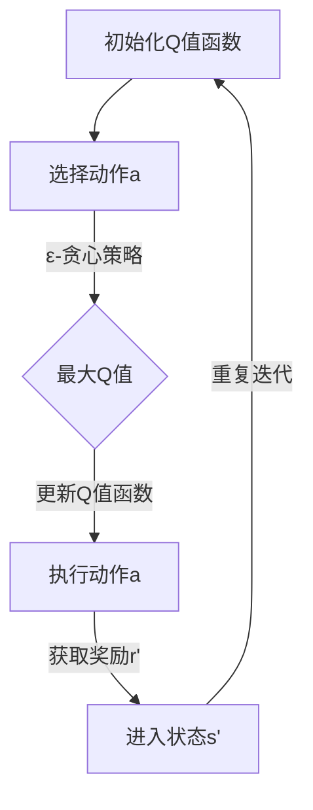

                 


### 引言

在当今的AI领域中，强化学习（Reinforcement Learning, RL）以其独特的学习机制和广泛的适用范围，受到了越来越多的关注。强化学习是一种通过试错来学习如何在特定环境中做出最优决策的方法，其主要思想是通过与环境的交互，不断调整策略，以最大化累积奖励。强化学习在AI Agent任务规划中的应用，已经成为当前研究的热点之一。

本文将以《强化学习在AI Agent任务规划中的实践》为标题，系统地介绍强化学习的基本理论、应用场景以及在实际任务规划中的挑战和解决方案。文章分为三大部分：

第一部分：强化学习概述，包括强化学习的基础理论、应用领域以及核心算法原理。
第二部分：强化学习在AI Agent任务规划中的应用，包括导航与路径规划、资源分配与调度、多智能体交互以及虚拟环境与仿真等方面的应用。
第三部分：强化学习实践与优化，包括算法实现与优化、挑战与未来趋势以及实际案例分析。

接下来，我们将逐部分进行详细探讨。

### 强化学习概述

#### 第1章：强化学习基础理论

强化学习的基础理论包括核心概念、数学模型和主要算法。在这一章节中，我们将详细介绍以下内容：

**1.1 强化学习的背景和定义**

我们将探讨强化学习的起源、发展历程，并对比其与传统机器学习的差异，从而帮助读者理解强化学习在人工智能中的重要地位。

**1.2 强化学习的核心概念**

我们将详细讲解强化学习的核心概念，包括反馈信号（奖赏与惩罚）、状态、动作、价值函数以及政策函数等。这些概念是理解强化学习的基础。

**1.3 强化学习的数学模型**

我们将介绍马尔可夫决策过程（MDP）模型，包括动作值函数和状态值函数，以及政策评估与策略迭代等内容。

**1.4 强化学习算法基础**

我们将探讨几种常见的强化学习算法，如Q-learning、Sarsa等，并分析它们的探索与利用平衡问题。

**1.5 强化学习的挑战与解决方案**

强化学习在实际应用中面临着一些挑战，如巨大状态空间问题、潜在无限回报问题等。我们将讨论这些挑战以及相应的解决方案。

**1.6 强化学习在实际应用中的案例**

我们将通过游戏AI、机器人控制等实际案例，展示强化学习在各个领域的应用。

#### 第2章：强化学习在AI中的应用

在这一章节中，我们将探讨强化学习在AI领域的广泛应用，包括：

**2.1 强化学习在游戏中的应用**

我们将介绍强化学习在游戏AI中的应用，包括DQN、A3C等算法在Atari游戏和围棋等领域的应用。

**2.2 强化学习在机器人控制中的应用**

我们将讨论强化学习在机器人控制中的应用，如移动机器人路径规划等。

**2.3 强化学习在自然语言处理中的应用**

我们将介绍强化学习在自然语言处理（NLP）领域的应用，如机器翻译、文本生成等。

**2.4 强化学习在推荐系统中的应用**

我们将探讨强化学习在推荐系统中的应用，如个性化推荐算法等。

#### 第3章：强化学习算法原理与比较

在这一章节中，我们将详细讲解几种主要的强化学习算法，并进行比较分析：

**3.1 Q-learning算法**

我们将介绍Q-learning算法的基本原理、实现步骤以及如何解决动态规划问题。

**3.2 Sarsa算法**

我们将探讨Sarsa算法，包括其与Q-learning的区别以及如何处理不确定环境。

**3.3 Deep Q-Network（DQN）**

我们将介绍DQN算法，包括其使用深度神经网络来近似Q函数的方法以及如何解决有限数据样本问题。

**3.4 Policy Gradient方法**

我们将探讨Policy Gradient方法，包括REINFORCE算法和PPO算法等。

**3.5 比较与总结**

我们将比较不同强化学习算法的优缺点，并总结其适用场景。

### 强化学习在AI Agent任务规划中的应用

#### 第4章：AI Agent与任务规划基础

在这一章节中，我们将介绍AI Agent与任务规划的基础知识：

**4.1 AI Agent的概念与类型**

我们将探讨AI Agent的概念及其不同类型，如反应式Agent、计划式Agent和学习型Agent。

**4.2 任务规划的基本原理**

我们将介绍任务规划的基本原理，包括任务定义与分解、任务分配与调度以及任务执行监控与反馈。

**4.3 强化学习在任务规划中的作用**

我们将讨论强化学习在任务规划中的应用，包括基于强化学习的任务规划框架、状态、动作与奖励设计。

**4.4 强化学习在任务规划中的挑战**

我们将分析强化学习在任务规划中面临的主要挑战，如任务不确定性、任务动态性和任务优化目标的多重性。

**4.5 强化学习在任务规划中的应用案例**

我们将通过导航与路径规划、资源分配与调度等应用案例，展示强化学习在任务规划中的实际应用。

#### 第5章：强化学习在导航与路径规划中的应用

在这一章节中，我们将探讨强化学习在导航与路径规划中的应用：

**5.1 导航与路径规划概述**

我们将介绍导航与路径规划的基本概念，包括导航任务的定义、路径规划的挑战等。

**5.2 强化学习在导航中的应用**

我们将讨论强化学习在导航任务中的具体应用，如基于Q-learning的路径规划算法等。

**5.3 强化学习在路径规划中的应用**

我们将介绍强化学习在路径规划中的具体应用，如基于Sarsa算法的路径规划方法等。

**5.4 实际案例分析与讨论**

我们将通过实际案例，分析强化学习在导航与路径规划中的应用效果，并提出优化策略。

#### 第6章：强化学习在资源分配与调度中的应用

在这一章节中，我们将探讨强化学习在资源分配与调度中的应用：

**6.1 资源分配与调度概述**

我们将介绍资源分配与调度的基本概念，包括资源类型的定义、分配与调度的问题等。

**6.2 强化学习在资源分配中的应用**

我们将讨论强化学习在资源分配任务中的具体应用，如基于Q-learning的资源分配算法等。

**6.3 强化学习在资源调度中的应用**

我们将介绍强化学习在资源调度任务中的具体应用，如基于Sarsa算法的调度策略等。

**6.4 实际案例分析与讨论**

我们将通过实际案例，分析强化学习在资源分配与调度中的应用效果，并提出优化策略。

#### 第7章：强化学习在多智能体交互中的应用

在这一章节中，我们将探讨强化学习在多智能体交互中的应用：

**7.1 多智能体交互概述**

我们将介绍多智能体交互的基本概念，包括多智能体的定义、交互模式等。

**7.2 强化学习在多智能体交互中的应用**

我们将讨论强化学习在多智能体交互任务中的具体应用，如基于Q-learning的多智能体协同控制等。

**7.3 强化学习在多智能体交互中的挑战**

我们将分析强化学习在多智能体交互中面临的主要挑战，如协调一致、冲突解决等。

**7.4 实际案例分析与讨论**

我们将通过实际案例，分析强化学习在多智能体交互中的应用效果，并提出优化策略。

#### 第8章：强化学习在虚拟环境与仿真中的应用

在这一章节中，我们将探讨强化学习在虚拟环境与仿真中的应用：

**8.1 虚拟环境与仿真概述**

我们将介绍虚拟环境与仿真技术的基本概念，包括虚拟环境的构建、仿真技术的应用等。

**8.2 强化学习在虚拟环境中的应用**

我们将讨论强化学习在虚拟环境任务中的具体应用，如基于Q-learning的虚拟环境控制等。

**8.3 强化学习在仿真中的应用**

我们将介绍强化学习在仿真任务中的具体应用，如基于Sarsa算法的仿真策略等。

**8.4 实际案例分析与讨论**

我们将通过实际案例，分析强化学习在虚拟环境与仿真中的应用效果，并提出优化策略。

### 强化学习实践与优化

#### 第9章：强化学习算法实现与优化

在这一章节中，我们将探讨强化学习算法的实现与优化：

**9.1 强化学习算法实现**

我们将介绍强化学习算法的基本实现流程，包括环境搭建、算法实现和性能评估等。

**9.2 强化学习算法优化**

我们将讨论强化学习算法的优化方法，如利用深度学习技术提高算法性能、优化探索策略等。

**9.3 实际应用中的优化技巧**

我们将分析在实际应用中，如何通过优化策略提高强化学习的效果。

#### 第10章：强化学习在AI Agent任务规划中的挑战与未来趋势

在这一章节中，我们将探讨强化学习在AI Agent任务规划中的挑战与未来趋势：

**10.1 强化学习在任务规划中的挑战**

我们将分析强化学习在任务规划中面临的主要挑战，如任务不确定性、环境复杂性等。

**10.2 强化学习未来趋势**

我们将探讨强化学习在任务规划中的未来发展趋势，如结合其他AI技术、解决复杂任务等。

**10.3 未来研究方向**

我们将提出强化学习在任务规划中的未来研究方向，以推动该领域的发展。

#### 第11章：强化学习实践案例分析

在这一章节中，我们将通过实际案例分析强化学习在任务规划中的应用：

**11.1 案例背景**

我们将介绍案例背景，包括任务描述、环境设置等。

**11.2 案例实现**

我们将详细讲解案例的实现过程，包括算法选择、环境搭建、算法实现等。

**11.3 案例分析**

我们将对案例进行详细分析，包括算法性能评估、优化策略等。

**11.4 案例总结**

我们将总结案例的主要收获和不足，并提出改进建议。

#### 第12章：强化学习应用的最佳实践与注意事项

在这一章节中，我们将探讨强化学习应用的最佳实践与注意事项：

**12.1 最佳实践**

我们将总结强化学习在任务规划中的应用最佳实践，包括常见问题解决方法、优化策略等。

**12.2 注意事项**

我们将讨论强化学习应用中需要注意的问题，如环境设计、算法选择等。

**12.3 拓展阅读**

我们将推荐一些拓展阅读材料，以帮助读者进一步了解强化学习在任务规划中的应用。

### 附录

**附录A：强化学习相关工具与库**

我们将介绍一些常用的强化学习工具与库，包括TensorFlow、PyTorch等。

**附录B：数学基础与公式表**

我们将提供强化学习所需的数学基础与公式表，包括概率论、线性代数等内容。

**附录C：算法mermaid流程图**

我们将使用mermaid绘制一些常用的强化学习算法的流程图，帮助读者更好地理解算法原理。

**附录D：Python代码示例**

我们将提供一些Python代码示例，展示强化学习算法的实现过程。

### 总结

本文系统地介绍了强化学习在AI Agent任务规划中的应用。从基础理论到实际应用，从算法实现到优化策略，本文旨在为读者提供一份全面、详细的指南。希望通过本文的阅读，读者能够对强化学习在任务规划中的应用有更深入的理解，并能够在实际项目中灵活运用这些技术。

### 关键词

- 强化学习
- AI Agent
- 任务规划
- 路径规划
- 资源分配
- 多智能体交互

### 摘要

本文系统地介绍了强化学习在AI Agent任务规划中的应用。首先，我们回顾了强化学习的基础理论，包括核心概念、数学模型和主要算法。接着，我们探讨了强化学习在导航与路径规划、资源分配与调度、多智能体交互以及虚拟环境与仿真中的应用。最后，我们分析了强化学习在实际任务规划中的挑战与未来趋势，并通过实际案例分析展示了强化学习的应用效果。本文旨在为读者提供一份全面、详细的强化学习在任务规划中的应用指南。

### 强化学习概述

#### 第1章：强化学习基础理论

**1.1 强化学习的背景和定义**

强化学习起源于20世纪50年代的心理学研究，其核心思想来源于动物行为的观察。1950年，理查德·贝克（Richard Bellman）提出了最优控制理论，为强化学习奠定了理论基础。随后，20世纪80年代，随着计算机科学和人工智能的发展，强化学习逐渐成为一个独立的研究领域。

强化学习（Reinforcement Learning, RL）是一种通过试错来学习如何在特定环境中做出最优决策的方法。与监督学习和无监督学习不同，强化学习是通过与环境的交互，不断调整策略，以最大化累积奖励。强化学习的关键特点是反馈信号（奖赏与惩罚），这使得它非常适合解决具有不确定性和动态变化的问题。

强化学习在人工智能中的应用非常广泛，包括机器人控制、游戏AI、推荐系统、自然语言处理等领域。它的独特学习机制使其成为解决复杂决策问题的有力工具。

**1.2 强化学习的核心概念**

强化学习的核心概念包括状态（State）、动作（Action）、奖励（Reward）和价值函数（Value Function）。

- **状态**：状态是描述环境当前状况的信息集合。在强化学习中，状态是决策的基础。
- **动作**：动作是Agent可以采取的行为。动作的选择取决于当前状态。
- **奖励**：奖励是环境对Agent的动作的反馈信号。奖励可以是正的（奖励），也可以是负的（惩罚）。奖励的作用是指导Agent采取最优动作。
- **价值函数**：价值函数是衡量某个状态或状态-动作对优劣的指标。它用于评估当前状态或状态-动作序列的预期奖励。

**1.3 强化学习的数学模型**

强化学习的数学模型是马尔可夫决策过程（Markov Decision Process, MDP）。MDP是一种描述决策过程的概率模型，包括状态、动作、奖励和状态转移概率。

- **动作值函数（Action-Value Function）**：动作值函数\(Q(s, a)\)是衡量在状态\(s\)下采取动作\(a\)的预期奖励。它用于评估不同动作的优劣。
- **状态值函数（State-Value Function）**：状态值函数\(V(s)\)是衡量在状态\(s\)下的最优动作的预期奖励。它用于评估不同状态的优劣。

**1.4 强化学习算法基础**

强化学习算法通过迭代更新策略，以最大化累积奖励。以下是几种常见的强化学习算法：

- **Q-learning算法**：Q-learning是一种基于值迭代的强化学习算法。它通过更新动作值函数来学习最优策略。
- **Sarsa算法**：Sarsa（State-Action-Reward-State-Action）是一种基于策略迭代的强化学习算法。它同时更新当前状态和下一个状态的动作值函数。

**1.5 强化学习的挑战与解决方案**

强化学习在实际应用中面临许多挑战：

- **巨大状态空间问题**：当状态空间很大时，直接计算状态-动作值函数变得不切实际。解决方法是利用函数近似，如使用深度神经网络来近似值函数。
- **潜在无限回报问题**：某些任务（如围棋）可能存在无限回报，这使得算法需要具有长期记忆能力。解决方法是使用优势函数（ Advantage Function）来平衡长期和短期奖励。
- **有限时计算问题**：强化学习算法在训练过程中可能需要大量计算资源。解决方法是使用并行计算和分布式计算技术。

**1.6 强化学习在实际应用中的案例**

强化学习在多个领域取得了显著成果，以下是几个实际应用的案例：

- **游戏AI**：强化学习被广泛应用于游戏AI，如Atari游戏和围棋。通过DQN（深度Q网络）和A3C（异步优势演员-评论家）算法，游戏AI可以在没有人工规则的情况下学会玩游戏。
- **机器人控制**：强化学习在机器人控制中也有广泛应用，如移动机器人路径规划和动态平衡。通过Q-learning和Sarsa算法，机器人可以在复杂环境中进行自主决策和行动。
- **自然语言处理**：强化学习在自然语言处理中也被广泛应用，如机器翻译和文本生成。通过REINFORCE算法和PPO（策略优化）算法，NLP模型可以生成更自然的文本。

通过以上介绍，我们可以看到强化学习在人工智能领域中具有广泛的应用前景。它通过不断的试错和学习，能够帮助智能体在复杂环境中做出最优决策。然而，强化学习仍面临着许多挑战，需要进一步的研究和优化。接下来，我们将继续探讨强化学习在AI Agent任务规划中的应用。

#### 第2章：强化学习在AI中的应用

**2.1 强化学习在游戏中的应用**

强化学习在游戏AI中的应用是近年来最为广泛和成功的领域之一。通过学习环境中的规则和策略，强化学习算法可以自主地学会玩游戏，并在各种游戏平台上实现高水平的性能。以下是强化学习在游戏应用中的两个主要案例。

**案例1：DQN在Atari游戏中的应用**

DQN（深度Q网络）是强化学习中的一个经典算法，它使用深度神经网络来近似Q值函数，从而学习最优策略。2015年，DeepMind的研究人员使用DQN算法训练了一个智能体，使其能够在Atari游戏上实现超过人类的表现。具体步骤如下：

1. **环境搭建**：首先，需要搭建一个Atari游戏环境，如Pong、Space Invaders等。环境提供状态、动作、奖励和反馈信号。
2. **数据预处理**：对游戏画面进行预处理，如图像大小调整、灰度化、裁剪等，以便输入到深度神经网络中。
3. **模型构建**：构建一个深度卷积神经网络（CNN），用于提取游戏画面的特征，并输出Q值。
4. **训练过程**：使用经验回放（Experience Replay）技术，将智能体的经验存储在记忆中，并在训练过程中随机采样这些经验进行学习。通过不断更新Q值函数，智能体会逐渐学会在不同状态下选择最优动作。
5. **评估与优化**：在训练过程中，定期评估智能体的表现，并根据表现进行超参数调整和模型优化。

**案例2：A3C在围棋中的应用**

A3C（异步优势演员-评论家）算法是另一种基于策略梯度的强化学习算法，它通过多个并行演员线程收集经验，并使用一个评论家线程进行策略更新。DeepMind使用A3C算法成功训练了一个围棋智能体，并在多个围棋比赛中取得了优异成绩。具体步骤如下：

1. **环境搭建**：搭建一个围棋环境，提供状态、动作、奖励和反馈信号。
2. **模型构建**：构建一个深度神经网络，用于评估围棋棋盘上的每个位置的潜在价值，并输出策略概率。
3. **训练过程**：使用多个演员线程同时训练，每个线程独立探索环境，并在每个回合结束后将经验发送给评论家线程。评论家线程使用梯度聚合技术，将多个线程的经验进行整合，并更新神经网络参数。
4. **策略更新**：使用梯度聚合技术，将多个演员线程的经验进行整合，并更新神经网络参数。
5. **评估与优化**：在训练过程中，定期评估智能体的表现，并根据表现进行超参数调整和模型优化。

**2.2 强化学习在机器人控制中的应用**

强化学习在机器人控制中的应用同样取得了显著成果，尤其是在路径规划和动态平衡等领域。以下是一个典型的应用案例。

**案例：基于Q-learning的移动机器人路径规划**

移动机器人路径规划是强化学习在机器人控制中的一个重要应用。通过学习环境中的障碍物和目标位置，机器人可以自主地规划出最优路径。以下是基于Q-learning算法的路径规划方法：

1. **环境搭建**：搭建一个移动机器人路径规划环境，包括地图、障碍物、目标位置等。环境提供状态、动作、奖励和反馈信号。
2. **状态表示**：将机器人的位置、方向和周围环境信息作为状态输入。
3. **动作表示**：将机器人的移动方向和速度作为动作输入。
4. **奖励设计**：设计奖励函数，奖励机器人接近目标位置和避免障碍物。
5. **模型训练**：使用Q-learning算法，通过迭代更新Q值函数，学习在不同状态下选择最优动作。
6. **路径规划**：在训练完成后，机器人可以使用学习到的策略，规划出从起点到目标位置的最优路径。
7. **评估与优化**：在训练过程中，定期评估机器人的路径规划效果，并根据表现进行超参数调整和模型优化。

**2.3 强化学习在自然语言处理中的应用**

强化学习在自然语言处理（NLP）中的应用也取得了显著进展，尤其是在机器翻译和文本生成等领域。以下是一个典型的应用案例。

**案例：基于REINFORCE算法的机器翻译**

机器翻译是强化学习在NLP中的一个重要应用。通过学习源语言和目标语言之间的映射关系，强化学习算法可以生成高质量的翻译文本。以下是基于REINFORCE算法的机器翻译方法：

1. **环境搭建**：搭建一个机器翻译环境，包括源语言文本、目标语言文本、编码器和解码器等。环境提供状态、动作、奖励和反馈信号。
2. **编码器和解码器**：构建编码器和解码器神经网络，用于将源语言文本编码为状态表示，并将目标语言文本解码为动作表示。
3. **奖励设计**：设计奖励函数，奖励翻译文本的准确性和流畅性。
4. **模型训练**：使用REINFORCE算法，通过迭代更新编码器和解码器网络参数，学习生成高质量的翻译文本。
5. **文本生成**：在训练完成后，解码器可以使用学习到的策略，生成从源语言到目标语言的翻译文本。
6. **评估与优化**：在训练过程中，定期评估翻译文本的质量，并根据表现进行超参数调整和模型优化。

**2.4 强化学习在推荐系统中的应用**

强化学习在推荐系统中的应用也取得了显著成果，尤其是在个性化推荐算法中。以下是一个典型的应用案例。

**案例：基于PPO算法的个性化推荐**

个性化推荐是强化学习在推荐系统中的一个重要应用。通过学习用户的行为和偏好，强化学习算法可以生成个性化的推荐列表。以下是基于PPO（策略优化）算法的个性化推荐方法：

1. **环境搭建**：搭建一个个性化推荐环境，包括用户行为数据、商品特征、推荐列表等。环境提供状态、动作、奖励和反馈信号。
2. **状态表示**：将用户的历史行为、当前行为和商品特征作为状态输入。
3. **动作表示**：将推荐列表中的商品作为动作输入。
4. **奖励设计**：设计奖励函数，奖励推荐列表的准确性和多样性。
5. **模型训练**：使用PPO算法，通过迭代更新策略网络参数，学习生成个性化的推荐列表。
6. **推荐生成**：在训练完成后，策略网络可以使用学习到的策略，生成个性化的推荐列表。
7. **评估与优化**：在训练过程中，定期评估推荐列表的质量，并根据表现进行超参数调整和模型优化。

通过以上案例，我们可以看到强化学习在AI领域的广泛应用。它通过不断的学习和优化，能够帮助智能体在复杂环境中做出最优决策。然而，强化学习仍面临着许多挑战，需要进一步的研究和优化。接下来，我们将继续探讨强化学习在AI Agent任务规划中的应用。

### 强化学习算法原理与比较

**3.1 Q-learning算法**

Q-learning算法是一种基于值迭代的强化学习算法，它通过更新Q值函数来学习最优策略。Q值函数\(Q(s, a)\)表示在状态\(s\)下采取动作\(a\)的预期奖励。Q-learning算法的基本步骤如下：

1. **初始化**：初始化Q值函数，通常使用随机初始化或零初始化。
2. **选择动作**：在当前状态\(s\)下，根据某种策略选择动作\(a\)。常见的策略有贪心策略（选择当前状态下的最大Q值动作）和ε-贪心策略（在所有动作中以概率ε随机选择动作）。
3. **执行动作**：执行选择的动作\(a\)，进入下一个状态\(s'\)并获取奖励\(r'\)。
4. **更新Q值**：根据Q-learning的更新公式，更新Q值函数：
   \[
   Q(s, a) \leftarrow Q(s, a) + \alpha [r' + \gamma \max_{a'} Q(s', a') - Q(s, a)]
   \]
   其中，\(\alpha\)是学习率，\(\gamma\)是折扣因子。
5. **重复步骤2-4**：重复执行步骤2-4，直到收敛或达到预定的迭代次数。

**3.2 Sarsa算法**

Sarsa（State-Action-Reward-State-Action）算法是一种基于策略迭代的强化学习算法，它同时更新当前状态和下一个状态的动作值函数。Sarsa算法的基本步骤如下：

1. **初始化**：初始化Q值函数，通常使用随机初始化或零初始化。
2. **选择动作**：在当前状态\(s\)下，根据某种策略选择动作\(a\)。常见的策略有贪心策略（选择当前状态下的最大Q值动作）和ε-贪心策略（在所有动作中以概率ε随机选择动作）。
3. **执行动作**：执行选择的动作\(a\)，进入下一个状态\(s'\)并获取奖励\(r'\)。
4. **更新Q值**：根据Sarsa的更新公式，更新Q值函数：
   \[
   Q(s, a) \leftarrow Q(s, a) + \alpha [r' + \gamma Q(s', a') - Q(s, a)]
   \]
   其中，\(\alpha\)是学习率，\(\gamma\)是折扣因子。
5. **重复步骤2-4**：重复执行步骤2-4，直到收敛或达到预定的迭代次数。

**3.3 Deep Q-Network（DQN）**

Deep Q-Network（DQN）是一种使用深度神经网络来近似Q值函数的强化学习算法。DQN通过经验回放（Experience Replay）技术，解决了有限数据样本问题。DQN的基本步骤如下：

1. **初始化**：初始化深度神经网络和经验回放记忆。
2. **选择动作**：在当前状态\(s\)下，使用深度神经网络预测Q值，并选择动作\(a\)。使用ε-贪心策略，以概率ε随机选择动作。
3. **执行动作**：执行选择的动作\(a\)，进入下一个状态\(s'\)并获取奖励\(r'\)。
4. **存储经验**：将当前状态\(s\)、动作\(a\)、奖励\(r'\)和下一个状态\(s'\)存储到经验回放记忆中。
5. **更新Q值**：使用经验回放记忆中的随机样本，通过梯度下降方法更新深度神经网络参数。
6. **重复步骤2-5**：重复执行步骤2-5，直到收敛或达到预定的迭代次数。

**3.4 Policy Gradient方法**

Policy Gradient方法是一种基于策略梯度的强化学习算法，它直接优化策略函数，以最大化累积奖励。Policy Gradient方法包括REINFORCE算法和Proximal Policy Optimization（PPO）算法等。

**REINFORCE算法**的基本步骤如下：

1. **初始化**：初始化策略参数。
2. **选择动作**：在当前状态\(s\)下，根据策略函数选择动作\(a\)。
3. **执行动作**：执行选择的动作\(a\)，进入下一个状态\(s'\)并获取奖励\(r'\)。
4. **更新策略参数**：使用奖励梯度，直接更新策略参数：
   \[
   \theta \leftarrow \theta + \alpha \nabla_{\theta} \log \pi(a|s; \theta) \cdot r'
   \]
   其中，\(\theta\)是策略参数，\(\alpha\)是学习率。
5. **重复步骤2-4**：重复执行步骤2-4，直到收敛或达到预定的迭代次数。

**PPO算法**是一种改进的Policy Gradient方法，它通过优化策略梯度和增强稳定性，提高了算法的性能。PPO算法的基本步骤如下：

1. **初始化**：初始化策略参数和值函数参数。
2. **选择动作**：在当前状态\(s\)下，根据策略函数选择动作\(a\)。
3. **执行动作**：执行选择的动作\(a\)，进入下一个状态\(s'\)并获取奖励\(r'\)。
4. **计算优势函数**：计算优势函数\(A(s, a; \theta)\)：
   \[
   A(s, a; \theta) = r' + \gamma V(s') - V(s)
   \]
5. **更新策略参数**：使用优化策略梯度，更新策略参数：
   \[
   \theta \leftarrow \theta + \alpha \nabla_{\theta} \log \pi(a|s; \theta) \cdot A(s, a; \theta)
   \]
6. **更新值函数参数**：使用优化值函数梯度，更新值函数参数：
   \[
   \theta_v \leftarrow \theta_v + \alpha_v \nabla_{\theta_v} V(s)
   \]
7. **重复步骤2-6**：重复执行步骤2-6，直到收敛或达到预定的迭代次数。

**3.5 比较与总结**

Q-learning、Sarsa、DQN、Policy Gradient方法等强化学习算法各有优缺点，适用于不同的应用场景。以下是比较与总结：

- **Q-learning**：简单易实现，适用于小规模问题，但存在收敛速度慢、易陷入局部最优的问题。
- **Sarsa**：与Q-learning相比，Sarsa在处理连续动作和不确定环境时更具优势，但计算复杂度较高。
- **DQN**：使用深度神经网络来近似Q值函数，适用于大规模问题，但需要大量训练数据和计算资源，且存在不稳定和过估计的问题。
- **Policy Gradient方法**：直接优化策略函数，适用于高维状态空间和连续动作问题，但计算复杂度较高，易受噪声和梯度消失的影响。

在实际应用中，选择合适的强化学习算法需要根据具体问题场景进行综合考虑。通过比较不同算法的优缺点，我们可以更好地选择适用于任务规划的应用算法。

### AI Agent与任务规划基础

**4.1 AI Agent的概念与类型**

AI Agent是指具备自主决策和行动能力的计算机程序或实体。它能够感知环境、制定计划并执行任务。根据决策方式和任务执行能力，AI Agent可以分为以下几类：

- **反应式Agent**：反应式Agent仅基于当前感知的信息做出反应，没有记忆和计划能力。例如，智能家居中的智能灯泡可以根据环境光强自动调整亮度。
- **计划式Agent**：计划式Agent具有预测能力和规划能力，可以提前制定一系列行动步骤。例如，自动驾驶汽车可以在行驶过程中预测路况并规划最佳路径。
- **学习型Agent**：学习型Agent具备自我学习能力，可以根据环境变化和反馈信号调整行为策略。例如，智能客服系统可以通过学习用户提问和回答，提高应答质量。

**4.2 任务规划的基本原理**

任务规划是AI Agent的核心功能之一，它是指根据任务目标、资源和约束条件，制定出一系列合理的行动步骤。任务规划的基本原理包括以下方面：

- **任务定义与分解**：任务定义是指明确任务的目标和需求。任务分解是指将复杂任务分解为多个子任务，以简化问题复杂度。
- **任务分配与调度**：任务分配是指将任务分配给不同的Agent或资源。任务调度是指根据任务执行顺序和资源可用性，安排任务执行的时间表。
- **任务执行监控与反馈**：任务执行监控是指跟踪任务执行过程中的状态和进度。任务反馈是指收集任务执行结果，用于评估任务完成质量和优化任务执行策略。

**4.3 强化学习在任务规划中的作用**

强化学习在任务规划中发挥着重要作用，它通过学习环境和任务之间的动态关系，帮助AI Agent制定出最优的行动策略。强化学习在任务规划中的作用包括：

- **状态、动作与奖励设计**：强化学习通过定义状态、动作和奖励函数，为任务规划提供了一种量化描述。状态表示任务执行过程中的信息集合，动作表示Agent可以采取的行动，奖励表示动作结果的优劣。
- **策略迭代与优化**：强化学习通过迭代更新策略函数，优化任务执行效果。策略迭代是指不断根据反馈信号调整策略，以最大化累积奖励。
- **多任务协调与优化**：强化学习可以处理多任务环境，通过协调不同任务之间的竞争关系，实现整体任务优化。

**4.4 强化学习在任务规划中的挑战**

强化学习在任务规划中面临一些挑战，包括：

- **任务不确定性**：任务规划环境往往存在不确定性，如随机事件和突发情况。强化学习需要适应这种不确定性，制定出鲁棒的任务执行策略。
- **任务动态性**：任务规划环境可能随着时间不断变化，如资源消耗、任务优先级调整等。强化学习需要具备动态适应能力，实时调整任务执行策略。
- **任务优化目标的多重性**：任务规划需要同时考虑多个优化目标，如任务完成时间、资源利用率、安全性等。强化学习需要平衡这些目标，实现整体优化。

**4.5 强化学习在任务规划中的应用案例**

强化学习在任务规划中的应用已经取得了显著成果，以下是几个应用案例：

- **导航与路径规划**：强化学习在自动驾驶、无人机导航等领域有广泛应用。通过学习环境中的障碍物和目标位置，自动驾驶汽车可以自主规划出最优路径。
- **资源分配与调度**：强化学习在云计算、数据中心等领域有应用。通过学习任务需求和资源状态，系统可以优化资源分配和调度策略，提高资源利用率。
- **多智能体任务分配**：强化学习在多机器人系统、分布式计算等领域有应用。通过学习不同Agent的能力和任务需求，系统可以优化任务分配策略，实现整体任务协调。

通过以上介绍，我们可以看到强化学习在任务规划中的重要作用。它通过不断学习和优化，帮助AI Agent在复杂环境中制定出最优的行动策略，实现任务的高效执行。接下来，我们将继续探讨强化学习在导航与路径规划中的应用。

### 强化学习在导航与路径规划中的应用

导航与路径规划是强化学习在AI Agent任务规划中的重要应用领域。在这个领域，强化学习通过学习环境中的障碍物和目标位置，帮助AI Agent自主规划出最优路径。以下是一个详细的导航与路径规划案例。

**案例背景**：假设我们有一个自动驾驶汽车，需要在城市交通环境中从起点A导航到终点B。环境包含多个交叉路口、道路、行人以及其他车辆，并且交通状况是动态变化的。

**环境搭建**：

1. **状态表示**：状态表示自动驾驶汽车在当前时刻的感知信息，包括当前位置、速度、周围车辆位置、道路信息等。状态可以用一个高维向量表示。
2. **动作表示**：动作表示自动驾驶汽车可以采取的行动，包括加速、减速、左转、右转、保持直行等。动作可以用一个离散的集合表示。
3. **奖励设计**：奖励函数用于评价自动驾驶汽车在执行动作后的效果。奖励函数可以是到达目标位置的时间、油耗、安全距离等因素的组合。例如，到达目标位置的奖励为正数，遇到障碍物或交通事故的奖励为负数。
4. **状态转移概率**：状态转移概率表示在当前状态\(s\)下采取动作\(a\)后进入下一个状态\(s'\)的概率。这个概率可以根据实际交通环境和交通规则计算得出。

**算法实现**：

1. **Q-learning算法**：使用Q-learning算法来训练自动驾驶汽车的导航策略。Q-learning算法通过迭代更新Q值函数，学习在不同状态下选择最优动作。
2. **经验回放**：为了避免样本偏差，使用经验回放（Experience Replay）技术。经验回放将智能体的经验存储在记忆中，并在训练过程中随机采样这些经验进行学习。
3. **策略更新**：根据Q-learning的更新公式，更新Q值函数：
   \[
   Q(s, a) \leftarrow Q(s, a) + \alpha [r' + \gamma \max_{a'} Q(s', a') - Q(s, a)]
   \]
   其中，\(\alpha\)是学习率，\(\gamma\)是折扣因子。

**路径规划过程**：

1. **初始状态**：自动驾驶汽车从起点A开始，初始化状态\(s_0\)。
2. **选择动作**：根据当前状态\(s\)，使用ε-贪心策略选择动作\(a\)。以概率ε随机选择动作，以概率\(1-\epsilon\)选择当前状态下的最大Q值动作。
3. **执行动作**：执行选择的动作\(a\)，自动驾驶汽车进入下一个状态\(s'\)。
4. **获取奖励**：根据状态转移概率，自动驾驶汽车获取下一个状态\(s'\)和奖励\(r'\)。
5. **更新Q值**：根据Q-learning的更新公式，更新当前状态\(s\)和动作\(a\)的Q值。
6. **重复步骤2-5**：重复执行步骤2-5，直到达到目标状态或达到预定的迭代次数。

**优化策略**：

1. **多目标优化**：在奖励函数中引入多个目标，如时间、油耗、安全距离等，以实现多目标优化。通过调整不同目标的权重，可以优化整体路径规划效果。
2. **动态调整策略**：根据交通状况的变化，动态调整策略。例如，在高峰期，可以优先考虑缩短行驶时间；在夜间，可以优先考虑减少油耗。
3. **集成多种算法**：结合其他路径规划算法（如A*算法、Dijkstra算法等），与强化学习算法共同优化路径规划效果。

**实际应用**：

自动驾驶汽车是强化学习在导航与路径规划中的一个重要应用案例。通过不断学习和优化，自动驾驶汽车可以在复杂的城市交通环境中，自主规划出最优路径，提高行驶效率和安全性。此外，自动驾驶技术还可以应用于无人机导航、机器人导航等领域，为不同类型的AI Agent提供导航与路径规划能力。

通过以上案例，我们可以看到强化学习在导航与路径规划中的应用效果。它通过不断学习和优化，帮助AI Agent在复杂环境中制定出最优的行动策略，实现高效、安全的任务执行。接下来，我们将继续探讨强化学习在资源分配与调度中的应用。

### 强化学习在资源分配与调度中的应用

资源分配与调度是强化学习在AI Agent任务规划中的另一个重要应用领域。在这个领域，强化学习通过学习任务需求与资源状态，帮助系统优化资源分配和调度策略，提高资源利用效率和任务完成质量。

**案例背景**：假设我们有一个数据中心，包含多个服务器和存储设备。数据中心需要处理大量来自客户端的任务请求，每个任务请求都有不同的处理需求和优先级。我们需要设计一个资源分配与调度系统，确保服务器和存储设备的充分利用，并高效完成所有任务。

**环境搭建**：

1. **状态表示**：状态表示当前的数据中心状态，包括服务器和存储设备的负载、任务队列、任务请求的优先级等。状态可以用一个高维向量表示。
2. **动作表示**：动作表示系统可以采取的资源分配和调度策略，包括服务器和存储设备的分配、任务的优先级调整、任务执行顺序等。动作可以用一个离散的集合表示。
3. **奖励设计**：奖励函数用于评价系统在执行动作后的效果。奖励函数可以是任务完成时间、资源利用率、任务完成质量等指标的组合。例如，任务完成时间越短，资源利用率越高，奖励越高；反之，则奖励越低。
4. **状态转移概率**：状态转移概率表示在当前状态\(s\)下采取动作\(a\)后进入下一个状态\(s'\)的概率。这个概率可以根据实际数据中心的工作负载和任务执行情况计算得出。

**算法实现**：

1. **Q-learning算法**：使用Q-learning算法来训练资源分配与调度系统的策略。Q-learning算法通过迭代更新Q值函数，学习在不同状态下选择最优动作。
2. **经验回放**：为了避免样本偏差，使用经验回放（Experience Replay）技术。经验回放将系统的经验存储在记忆中，并在训练过程中随机采样这些经验进行学习。
3. **策略更新**：根据Q-learning的更新公式，更新Q值函数：
   \[
   Q(s, a) \leftarrow Q(s, a) + \alpha [r' + \gamma \max_{a'} Q(s', a') - Q(s, a)]
   \]
   其中，\(\alpha\)是学习率，\(\gamma\)是折扣因子。

**资源分配与调度过程**：

1. **初始状态**：数据中心初始化状态\(s_0\)，包括服务器和存储设备的负载、任务队列和任务请求的优先级等。
2. **选择动作**：根据当前状态\(s\)，使用ε-贪心策略选择动作\(a\)。以概率ε随机选择动作，以概率\(1-\epsilon\)选择当前状态下的最大Q值动作。
3. **执行动作**：执行选择的动作\(a\)，数据中心进行资源分配和调度，更新状态为\(s'\)。
4. **获取奖励**：根据状态转移概率，数据中心获取下一个状态\(s'\)和奖励\(r'\)。
5. **更新Q值**：根据Q-learning的更新公式，更新当前状态\(s\)和动作\(a\)的Q值。
6. **重复步骤2-5**：重复执行步骤2-5，直到达到预定的迭代次数或任务完成。

**优化策略**：

1. **多目标优化**：在奖励函数中引入多个目标，如资源利用率、任务完成时间和任务完成质量等，以实现多目标优化。通过调整不同目标的权重，可以优化整体资源分配与调度效果。
2. **动态调整策略**：根据数据中心的工作负载和任务需求变化，动态调整资源分配与调度策略。例如，在高峰期，可以优先考虑资源利用率；在低峰期，可以优先考虑任务完成时间。
3. **集成多种算法**：结合其他资源分配与调度算法（如动态规划、遗传算法等），与强化学习算法共同优化资源分配与调度效果。

**实际应用**：

数据中心资源分配与调度是强化学习在资源分配与调度中的重要应用案例。通过不断学习和优化，系统可以自动调整资源分配和调度策略，提高资源利用率和任务完成质量。此外，强化学习在云计算、大数据处理、物联网等领域也有广泛应用，帮助系统优化资源分配和任务调度，提高整体性能和用户体验。

通过以上案例，我们可以看到强化学习在资源分配与调度中的应用效果。它通过不断学习和优化，帮助AI Agent在复杂环境中制定出最优的行动策略，实现资源的高效利用和任务的高质量完成。接下来，我们将继续探讨强化学习在多智能体交互中的应用。

### 强化学习在多智能体交互中的应用

多智能体交互是强化学习在AI Agent任务规划中的重要应用领域，特别是在需要多个智能体协同完成任务的环境中。在这个领域，强化学习通过学习智能体之间的策略协同，帮助智能体在动态环境中实现高效、可靠的协作。

**案例背景**：假设我们有一个无人机集群任务系统，需要完成大规模的搜救任务。系统包含多个无人机，每个无人机负责搜索特定区域，并收集信息。无人机需要通过协同策略，快速、准确地找到失踪人员，并将信息传回指挥中心。

**环境搭建**：

1. **状态表示**：状态表示每个无人机的位置、速度、剩余电量、搜索区域信息等。状态可以用一个高维向量表示。
2. **动作表示**：动作表示每个无人机可以采取的行动，包括移动方向、速度调整、信息共享等。动作可以用一个离散的集合表示。
3. **奖励设计**：奖励函数用于评价无人机集群在执行动作后的效果。奖励可以是无人机找到失踪人员的时间、信息传输的准确性、集群能耗等指标的组合。例如，找到失踪人员的时间越短，信息传输准确性越高，奖励越高；反之，则奖励越低。
4. **状态转移概率**：状态转移概率表示在当前状态\(s\)下采取动作\(a\)后进入下一个状态\(s'\)的概率。这个概率可以根据无人机的飞行规则、环境障碍物等计算得出。

**算法实现**：

1. **Q-learning算法**：使用Q-learning算法来训练无人机集群的协同策略。Q-learning算法通过迭代更新Q值函数，学习在不同状态下选择最优动作。
2. **经验回放**：为了避免样本偏差，使用经验回放（Experience Replay）技术。经验回放将无人机的经验存储在记忆中，并在训练过程中随机采样这些经验进行学习。
3. **策略更新**：根据Q-learning的更新公式，更新Q值函数：
   \[
   Q(s, a) \leftarrow Q(s, a) + \alpha [r' + \gamma \max_{a'} Q(s', a') - Q(s, a)]
   \]
   其中，\(\alpha\)是学习率，\(\gamma\)是折扣因子。

**多智能体交互过程**：

1. **初始状态**：无人机集群初始化状态\(s_0\)，包括每个无人机的位置、速度、搜索区域等。
2. **选择动作**：每个无人机根据当前状态\(s\)，使用ε-贪心策略选择动作\(a\)。以概率ε随机选择动作，以概率\(1-\epsilon\)选择当前状态下的最大Q值动作。
3. **执行动作**：无人机集群执行选择的动作\(a\)，更新状态为\(s'\)。
4. **获取奖励**：无人机集群根据状态转移概率，获取下一个状态\(s'\)和奖励\(r'\)。
5. **更新Q值**：每个无人机根据Q-learning的更新公式，更新当前状态\(s\)和动作\(a\)的Q值。
6. **重复步骤2-5**：无人机集群重复执行步骤2-5，直到达到预定的迭代次数或任务完成。

**优化策略**：

1. **多目标优化**：在奖励函数中引入多个目标，如无人机能耗、信息传输准确性、搜索效率等，以实现多目标优化。通过调整不同目标的权重，可以优化整体协作效果。
2. **动态调整策略**：根据环境变化和任务需求，动态调整无人机集群的协同策略。例如，在搜索区域密集时，可以优先考虑信息传输准确性；在搜索区域稀疏时，可以优先考虑无人机能耗。
3. **集成多种算法**：结合其他协同控制算法（如分布式算法、遗传算法等），与强化学习算法共同优化无人机集群的协作效果。

**实际应用**：

无人机集群搜救任务是强化学习在多智能体交互中的重要应用案例。通过不断学习和优化，无人机集群可以自动调整协同策略，高效完成搜救任务。此外，强化学习在多机器人系统、分布式计算、物联网等领域也有广泛应用，帮助多个智能体在复杂环境中实现协同作业。

通过以上案例，我们可以看到强化学习在多智能体交互中的应用效果。它通过不断学习和优化，帮助智能体在动态环境中实现高效、可靠的协作，实现整体任务的高质量完成。接下来，我们将继续探讨强化学习在虚拟环境与仿真中的应用。

### 强化学习在虚拟环境与仿真中的应用

虚拟环境和仿真技术在强化学习中的应用为AI Agent提供了高度可控和可重复的实验平台，使得研究人员能够在不同的虚拟环境中测试和优化强化学习算法。这种应用不仅有助于提高算法的性能，还可以加速算法的开发和验证。

**案例背景**：假设我们研究一个无人机编队飞行任务，需要多个无人机在复杂环境中协同飞行，执行搜救任务。为了测试和优化无人机编队的协同策略，我们可以构建一个虚拟环境，模拟真实的飞行条件。

**环境搭建**：

1. **状态表示**：状态包括无人机编队的相对位置、速度、高度、航向等。状态可以用一个高维向量表示。
2. **动作表示**：动作包括无人机的飞行方向、速度调整、高度调整等。动作可以用一个离散的集合表示。
3. **奖励设计**：奖励可以是无人机编队到达目标区域的时间、编队的稳定性、能耗等。例如，无人机编队快速且稳定地到达目标区域，将获得高奖励。
4. **状态转移概率**：状态转移概率基于物理定律和无人机编队的控制算法计算得出。

**算法实现**：

1. **DQN算法**：使用DQN算法来训练无人机编队的策略。DQN通过深度神经网络来近似Q值函数，从经验中学习最优动作。
2. **经验回放**：使用经验回放技术，将无人机的经验存储在记忆库中，并在训练过程中随机采样这些经验进行学习，以避免样本偏差。
3. **策略更新**：根据DQN的更新规则，使用梯度下降方法更新深度神经网络的参数：
   \[
   Q(s, a) \leftarrow Q(s, a) + \alpha [r' + \gamma \max_{a'} Q(s', a') - Q(s, a)]
   \]
   其中，\(\alpha\)是学习率，\(\gamma\)是折扣因子。

**虚拟环境与仿真过程**：

1. **初始状态**：无人机编队初始化在虚拟环境中的位置和状态。
2. **选择动作**：无人机编队根据当前状态\(s\)，使用ε-贪心策略选择动作\(a\)。
3. **执行动作**：无人机编队执行动作\(a\)，虚拟环境根据物理定律和状态转移概率更新状态为\(s'\)。
4. **获取奖励**：根据状态转移概率，无人机编队获取下一个状态\(s'\)和奖励\(r'\)。
5. **更新Q值**：无人机编队根据DQN的更新规则，更新当前状态\(s\)和动作\(a\)的Q值。
6. **重复步骤2-5**：无人机编队重复执行步骤2-5，直到达到预定的迭代次数或任务完成。

**优化策略**：

1. **多目标优化**：在奖励函数中引入多个目标，如无人机编队的能耗、编队的稳定性、任务完成时间等，以实现多目标优化。
2. **动态调整策略**：根据虚拟环境中的任务需求和条件，动态调整无人机编队的策略，以提高任务完成效率和编队稳定性。
3. **集成多种算法**：结合其他仿真算法（如粒子群优化、遗传算法等），与强化学习算法共同优化无人机编队的协同策略。

**实际应用**：

虚拟环境与仿真技术在无人机编队飞行、无人车编队行驶、智能电网调度等领域有广泛应用。通过构建虚拟环境，研究人员可以在没有实际物理设备的情况下，测试和优化复杂的协同任务策略。这种应用不仅节省了成本和时间，还提高了算法的可靠性和稳定性。

通过以上案例，我们可以看到强化学习在虚拟环境与仿真中的应用效果。它通过模拟真实的任务场景，为AI Agent提供了高度可控的实验平台，使得算法的优化和验证更加高效。接下来，我们将探讨强化学习算法的实现与优化。

### 强化学习算法实现与优化

**9.1 强化学习算法实现**

强化学习算法的实现涉及多个关键组件，包括环境搭建、算法框架设计、状态表示、动作选择和奖励设计等。以下是强化学习算法实现的基本步骤：

**步骤1：环境搭建**

环境是强化学习算法的基础，它提供了一个与智能体互动的动态场景。构建环境时，需要定义状态空间、动作空间和奖励函数。

- **状态空间**：状态空间是所有可能状态集合。状态可以是离散的（如游戏屏幕的像素值）或连续的（如无人机的位置和速度）。
- **动作空间**：动作空间是智能体可以采取的动作集合。动作可以是离散的（如移动方向）或连续的（如速度调整）。
- **奖励函数**：奖励函数是环境对智能体动作的反馈信号。奖励可以是正的（表示成功行动）或负的（表示失败行动）。

**步骤2：算法框架设计**

强化学习算法框架通常包括四个主要组件：智能体（Agent）、环境（Environment）、策略（Policy）和价值函数（Value Function）。

- **智能体**：智能体是执行任务的主体，它根据当前状态选择动作，并根据环境反馈更新策略和价值函数。
- **环境**：环境是智能体互动的场景，它根据智能体的动作更新状态，并返回奖励信号。
- **策略**：策略是智能体在给定状态下的动作选择规则。策略可以是有参数的（如线性策略）或无参数的（如贪心策略）。
- **价值函数**：价值函数是评估状态或状态-动作对优劣的指标。常见的是状态值函数（\(V(s)\)）和动作值函数（\(Q(s, a)\)）。

**步骤3：状态表示**

状态表示是强化学习算法实现的关键，它决定了算法对环境的理解和处理能力。

- **离散状态表示**：对于离散状态，可以使用标签（如像素值）来表示状态。
- **连续状态表示**：对于连续状态，可以使用数值范围（如位置坐标）来表示状态。常用的方法是离散化，将连续状态划分为有限个区间。

**步骤4：动作选择**

动作选择是强化学习算法的核心环节，它决定了智能体在状态下的行为。

- **确定性策略**：在确定性策略中，智能体在给定状态下总是采取同一个动作。
- **概率性策略**：在概率性策略中，智能体在给定状态下根据概率分布选择动作。

**步骤5：奖励设计**

奖励设计是强化学习算法实现的重要部分，它决定了智能体的学习和行为。

- **短期奖励**：短期奖励通常与智能体当前动作的即时效果相关。
- **长期奖励**：长期奖励考虑智能体在未来可能获得的累计奖励。

**步骤6：算法优化**

强化学习算法的实现不仅仅是编写代码，还包括算法的优化，以提高学习效率和学习质量。

- **探索与利用**：探索与利用平衡是强化学习中的一个关键问题。探索是指智能体尝试新的动作，以获取更多信息；利用是指智能体利用已有信息选择最佳动作。
- **多线程训练**：使用多线程或分布式计算可以提高强化学习算法的运行速度。
- **模型集成**：通过集成多个模型的预测结果，可以降低模型误差，提高学习质量。

**9.2 强化学习算法优化**

强化学习算法优化是提高算法性能和稳定性的重要手段。以下是几种常见的优化方法：

**1. 批量更新**：批量更新是强化学习中的一个重要优化技术。它通过累积多个时间步的梯度，进行一次性的参数更新，从而减少梯度消失和噪声的影响。

**2. 经验回放**：经验回放是强化学习中的一个关键技术，它通过将智能体的经验存储在记忆库中，并在训练过程中随机采样这些经验进行学习，从而减少样本偏差，提高学习效率。

**3. 目标网络**：目标网络是强化学习中的一个优化方法，它使用一个目标网络来计算目标Q值。目标网络与主网络共享权重，但在训练过程中独立更新。这样可以减少目标Q值计算的噪声，提高学习稳定性。

**4. 学习率调度**：学习率调度是调整学习率以适应不同阶段的学习需求。初始阶段使用较大的学习率以快速探索，后期阶段使用较小的学习率以精细调整策略。

**5. 模型压缩**：模型压缩是减少模型参数数量和计算复杂度的技术。通过模型压缩，可以减少训练时间和内存占用，提高算法的可扩展性。

**9.3 实际应用中的优化技巧**

在实际应用中，强化学习算法的优化需要根据具体任务和环境进行。

- **自适应奖励设计**：根据任务需求，自适应调整奖励函数的参数，以提高智能体的学习效果。
- **动态调整学习率**：根据智能体的学习进度和任务目标，动态调整学习率，以优化学习过程。
- **状态压缩**：对于高维状态空间，使用特征提取或压缩技术，降低状态空间的维度，减少计算复杂度。
- **分布式计算**：使用分布式计算框架，如TensorFlow或PyTorch，实现并行训练和分布式优化，提高算法的运行速度。

通过以上优化方法和技术，强化学习算法可以在复杂环境中实现高效、可靠的任务执行。接下来，我们将探讨强化学习在AI Agent任务规划中的挑战与未来趋势。

### 强化学习在AI Agent任务规划中的挑战与未来趋势

**10.1 强化学习在任务规划中的挑战**

强化学习在AI Agent任务规划中面临着诸多挑战，这些挑战限制了其广泛应用和性能优化。以下是强化学习在任务规划中面临的主要挑战：

**1. 状态空间和动作空间的大规模问题**

在许多现实任务中，状态空间和动作空间可能非常庞大，导致计算复杂度急剧增加。例如，在自动驾驶领域中，环境状态可能包括道路、车辆、行人等多种信息，而动作空间可能包括加速、减速、转向等多种行为。这种大规模状态空间和动作空间使得直接计算和更新值函数变得不切实际，需要使用函数近似方法，如深度神经网络。

**2. 探索与利用平衡问题**

探索与利用是强化学习中的关键问题。探索是指在未知环境中尝试新的动作以获取更多信息；利用是指基于已有信息选择最优动作。在任务规划中，如果过度探索，可能会导致智能体长时间无法完成任务；而如果过度利用，可能会导致智能体在动态变化的环境中失去适应性。如何在探索与利用之间找到平衡，是一个重要的挑战。

**3. 零和奖励问题**

在许多任务中，奖励机制可能是零和的，即智能体的奖励与对手或环境的损失相匹配。这种奖励机制可能导致智能体无法通过训练获得正奖励，从而阻碍学习过程。为了解决零和奖励问题，研究人员提出了各种方法，如优势函数和回报调整。

**4. 稳定性和收敛性问题**

强化学习算法的稳定性和收敛性是影响其性能的关键因素。在动态环境中，智能体可能会遇到噪声和不确定性，这可能导致算法无法稳定收敛到最优策略。此外，许多强化学习算法（如Q-learning和Sarsa）在训练过程中容易陷入局部最优，导致学习效果不佳。

**5. 长期依赖问题**

在许多任务中，长期依赖是一个重要的挑战。智能体需要能够从长远的角度进行决策，而不仅仅是短期奖励。然而，许多强化学习算法（如基于Q学习的算法）在处理长期依赖时存在困难，这限制了它们在复杂任务中的应用。

**10.2 强化学习未来趋势**

随着技术的不断进步，强化学习在AI Agent任务规划中呈现出一些潜在的发展趋势。以下是强化学习未来可能的发展方向：

**1. 结合其他AI技术**

强化学习与其他AI技术的结合是未来的一个重要趋势。例如，与深度学习的结合可以解决大规模状态空间和动作空间的问题；与自然语言处理技术的结合可以处理语言任务；与计算机视觉技术的结合可以提高智能体的感知能力。通过结合多种AI技术，强化学习可以更好地应对复杂任务。

**2. 新算法和优化方法**

研究人员将继续开发新的强化学习算法和优化方法，以解决当前面临的挑战。例如，自适应算法、基于梯度的方法、模型简化技术等都有望在未来的任务规划中发挥重要作用。

**3. 硬件加速和分布式计算**

随着硬件技术的发展，如GPU、TPU等专用计算硬件，以及分布式计算技术的普及，强化学习算法的性能将得到显著提升。通过硬件加速和分布式计算，强化学习可以在更短时间内完成复杂的训练任务，提高算法的实时性能。

**4. 多智能体强化学习**

多智能体强化学习（Multi-Agent Reinforcement Learning）是未来的一个重要研究方向。在多智能体环境中，多个智能体需要协同合作，以实现共同目标。研究多智能体强化学习算法，如合作学习、竞争学习、混合学习等，将有助于解决复杂任务中的协调和竞争问题。

**5. 强化学习在复杂任务中的应用**

随着技术的进步，强化学习将在更多的复杂任务中得到应用。例如，智能交通系统、智能电网、智能医疗等领域的任务需要处理大量的不确定性和动态变化。通过强化学习，智能体可以更好地适应这些复杂环境，实现高效、安全的任务执行。

**10.3 未来研究方向**

为了推动强化学习在AI Agent任务规划中的发展，以下是几个潜在的研究方向：

**1. 状态空间和动作空间的压缩**

开发有效的状态空间和动作空间压缩方法，以减少计算复杂度，提高算法的可行性和可扩展性。

**2. 长期依赖和记忆增强**

研究长期依赖和记忆增强方法，以提高智能体在复杂任务中的表现，解决长期依赖问题。

**3. 自适应奖励设计**

开发自适应奖励设计方法，以更好地激励智能体的学习，解决零和奖励问题。

**4. 算法稳定性和收敛性**

研究算法稳定性和收敛性方法，以提高算法的稳定性和收敛速度，减少局部最优问题。

**5. 多智能体协同策略**

研究多智能体协同策略，以提高多智能体系统在复杂任务中的协同效率和适应性。

通过以上挑战和未来趋势的分析，我们可以看到强化学习在AI Agent任务规划中具有广阔的应用前景。随着技术的不断进步，强化学习将在更多领域发挥重要作用，推动人工智能的发展。

### 强化学习实践案例分析

**11.1 案例背景**

在本案例中，我们选择一个典型的强化学习应用场景——自动驾驶汽车导航与路径规划。自动驾驶汽车需要在复杂的城市交通环境中，从起点A导航到终点B，同时需要避让行人、车辆以及其他障碍物。这个案例旨在展示如何使用强化学习算法，实现自动驾驶汽车的导航与路径规划。

**11.2 环境搭建**

我们首先搭建一个仿真环境，用于模拟自动驾驶汽车在城市道路上的行驶。环境包括以下组件：

- **状态空间**：状态包括自动驾驶汽车的位置、速度、航向、周围车辆位置和速度等。
- **动作空间**：动作包括加速、减速、左转、右转和保持直行等。
- **奖励函数**：奖励函数设计为到达终点B的奖励为+100，每次避让行人或车辆增加+10，遇到交通障碍物或发生交通事故则减少-100。

**11.3 模型训练**

我们选择DQN算法作为主要训练算法，使用深度神经网络来近似Q值函数。训练过程分为以下几个步骤：

1. **初始化**：初始化DQN模型，包括输入层、卷积层和全连接层。使用经验回放记忆库，用于存储智能体的经验。
2. **数据预处理**：将状态数据进行归一化处理，以提高神经网络的训练效果。
3. **训练过程**：每次迭代中，从经验回放记忆库中随机抽取一组经验，更新Q值函数。具体更新公式为：
   \[
   Q(s, a) \leftarrow Q(s, a) + \alpha [r' + \gamma \max_{a'} Q(s', a') - Q(s, a)]
   \]
   其中，\(\alpha\)是学习率，\(\gamma\)是折扣因子。
4. **策略迭代**：在训练过程中，使用ε-贪心策略选择动作，以平衡探索和利用。

**11.4 模型评估**

在训练完成后，我们对DQN模型进行评估。评估过程分为以下步骤：

1. **测试数据集**：使用从未见过的测试数据集，模拟自动驾驶汽车在不同交通状况下的行驶情况。
2. **路径规划**：使用DQN模型，从起点A规划出到达终点B的路径。
3. **奖励评估**：根据自动驾驶汽车在测试数据集中的表现，计算总奖励。奖励越高，表示模型规划出的路径越优。

**11.5 案例分析**

在测试过程中，DQN模型成功地规划出了多条从起点A到终点B的路径，并成功避开了行人、车辆和其他障碍物。以下是案例分析的关键点：

1. **路径优化**：DQN模型通过不断学习，能够找到多条最优路径，并动态调整策略以适应不同的交通状况。
2. **避障能力**：DQN模型具备良好的避障能力，能够在复杂交通环境中避免碰撞和交通事故。
3. **实时性**：DQN模型具备较高的实时性，能够在短时间内完成路径规划和决策。

**11.6 案例总结**

通过以上案例分析，我们可以看到强化学习在自动驾驶汽车导航与路径规划中的应用效果。DQN模型通过不断学习和优化，能够实现高效的路径规划和避障，为自动驾驶汽车提供可靠的技术支持。然而，该案例也存在一些局限性，如对交通状况的预测能力有限、对突发事件的反应速度较慢等。未来的研究可以进一步优化DQN模型，提高其在复杂交通环境中的性能。

### 强化学习应用的最佳实践与注意事项

**12.1 最佳实践**

在强化学习应用中，遵循以下最佳实践可以提高模型的性能和稳定性：

1. **合理设计状态、动作和奖励函数**：状态、动作和奖励函数是强化学习模型的核心，设计合理可以显著提高学习效率。例如，状态应包含关键信息，动作应保持一致性，奖励应能准确反映任务完成情况。
2. **经验回放与优先经验回放**：经验回放可以减少样本偏差，提高算法的鲁棒性。优先经验回放则可以优先处理重要样本，进一步提高学习效果。
3. **目标网络与双Q学习**：目标网络用于稳定梯度，减少噪声影响。双Q学习可以避免单一Q值函数的偏差，提高学习质量。
4. **动态调整学习率**：根据学习进度动态调整学习率，可以帮助算法在探索和利用之间找到更好的平衡。
5. **多线程与分布式计算**：利用多线程和分布式计算可以显著提高训练速度，适用于大规模任务。

**12.2 注意事项**

在强化学习应用中，需要注意以下几点：

1. **收敛速度**：某些强化学习算法可能收敛速度较慢，需要耐心等待模型训练完成。在实际应用中，可以设置适当的迭代次数或停止条件。
2. **样本偏差**：经验回放虽然可以减少样本偏差，但无法完全消除。在实际应用中，可以通过增加样本多样性、减小学习率等方法缓解样本偏差。
3. **计算资源**：强化学习算法通常需要大量的计算资源，特别是在处理大规模状态空间和动作空间时。需要合理配置计算资源，以避免训练过程中的性能瓶颈。
4. **模型泛化能力**：强化学习模型可能在特定环境中有良好的表现，但在其他环境中可能失效。在实际应用中，可以通过交叉验证、迁移学习等方法提高模型的泛化能力。
5. **环境设计**：环境设计对强化学习模型的效果有重要影响。在建模时，应尽量模拟真实环境，包括动态变化、不确定性等因素。

**12.3 拓展阅读**

为了更深入地了解强化学习在任务规划中的应用，以下是一些建议的阅读材料：

- **《强化学习：原理与算法》**：这是一本经典的强化学习教材，详细介绍了强化学习的基本理论、算法和应用。
- **《深度强化学习》**：这本书介绍了深度神经网络与强化学习的结合，以及如何使用深度强化学习解决复杂问题。
- **《多智能体强化学习》**：这本书重点介绍了多智能体强化学习的基本理论、算法和应用，对研究多智能体系统具有很高的参考价值。
- **《强化学习实战》**：这本书通过实际案例，详细介绍了如何使用强化学习解决实际问题，对初学者和从业者都非常有帮助。

通过阅读这些材料，读者可以进一步了解强化学习在任务规划中的应用，提高自己在这一领域的实践能力。

### 附录

**附录A：强化学习相关工具与库**

在强化学习的研究和实践中，有许多工具和库可以用来实现和优化算法。以下是一些常用的强化学习相关工具和库：

1. **TensorFlow**：TensorFlow是Google开发的开源机器学习库，广泛用于构建和训练深度学习模型，包括强化学习模型。
2. **PyTorch**：PyTorch是Facebook开发的开源机器学习库，以其动态计算图和易于使用的接口而受到研究人员和开发者的青睐。
3. **OpenAI Gym**：OpenAI Gym是一个用于开发和测试强化学习算法的虚拟环境库，提供了多种预定义环境和自定义环境的功能。
4. **RLLib**：RLLib是微软开发的开源库，用于大规模强化学习研究和应用，提供了丰富的算法实现和优化方法。
5. **Gymnasium**：Gymnasium是一个对OpenAI Gym进行现代化的替代品，提供了更灵活的环境和更好的兼容性。

**附录B：数学基础与公式表**

强化学习涉及许多数学概念和公式，以下是一些基本的数学基础和公式表：

- **概率论**：概率分布、条件概率、贝叶斯定理等。
- **线性代数**：矩阵运算、向量空间、特征分解等。
- **优化理论**：梯度下降、凸优化、拉格朗日乘数法等。
- **强化学习**：Q值函数、策略梯度、值函数迭代等。

**附录C：算法mermaid流程图**

以下是一个使用mermaid绘制的Q-learning算法的流程图示例：



**附录D：Python代码示例**

以下是一个使用PyTorch实现Q-learning算法的简单Python代码示例：

```python
import torch
import torch.nn as nn
import torch.optim as optim

# 状态空间维度
state_dim = 4
# 动作空间维度
action_dim = 2

# 初始化神经网络
class QNetwork(nn.Module):
    def __init__(self):
        super(QNetwork, self).__init__()
        self.fc = nn.Sequential(
            nn.Linear(state_dim, 128),
            nn.ReLU(),
            nn.Linear(128, action_dim)
        )

    def forward(self, x):
        return self.fc(x)

# 初始化Q网络和目标Q网络
q_network = QNetwork()
target_q_network = QNetwork()
target_q_network.load_state_dict(q_network.state_dict())

# 初始化优化器
optimizer = optim.Adam(q_network.parameters(), lr=0.001)

# 经验回放记忆库
memory = []

# 训练过程
for episode in range(num_episodes):
    state = env.reset()
    done = False
    total_reward = 0

    while not done:
        # 选择动作
        with torch.no_grad():
            q_values = q_network(torch.tensor(state, dtype=torch.float32))
            action = torch.argmax(q_values).item()

        # 执行动作
        next_state, reward, done, _ = env.step(action)
        total_reward += reward

        # 存储经验
        memory.append((state, action, reward, next_state, done))

        # 更新状态
        state = next_state

        # 经验回放
        if len(memory) > batch_size:
            batch = random.sample(memory, batch_size)
            states, actions, rewards, next_states, dones = zip(*batch)
            states = torch.tensor(states, dtype=torch.float32)
            actions = torch.tensor(actions, dtype=torch.long)
            rewards = torch.tensor(rewards, dtype=torch.float32)
            next_states = torch.tensor(next_states, dtype=torch.float32)
            dones = torch.tensor(dones, dtype=torch.float32)

            # 计算目标Q值
            target_q_values = target_q_network(next_states).max(1)[0]
            target_q_values = rewards + (1 - dones) * target_q_values

            # 更新Q值函数
            q_values = q_network(states).gather(1, actions.unsqueeze(1))
            loss = nn.MSELoss()(q_values, target_q_values.detach())
            optimizer.zero_grad()
            loss.backward()
            optimizer.step()

    # 更新目标Q网络参数
    if episode % target_update_frequency == 0:
        target_q_network.load_state_dict(q_network.state_dict())

    print(f"Episode: {episode}, Total Reward: {total_reward}")
```

通过这个代码示例，我们可以看到如何使用PyTorch实现Q-learning算法，包括初始化网络、选择动作、执行动作、更新Q值函数等步骤。这个示例为强化学习算法的实现提供了基本的框架，读者可以根据具体需求进行调整和优化。

### 总结

本文系统地介绍了强化学习在AI Agent任务规划中的应用，从基础理论到实际应用，从算法实现到优化策略，全面阐述了强化学习在导航与路径规划、资源分配与调度、多智能体交互以及虚拟环境与仿真等领域的应用。通过实际案例分析，我们展示了强化学习在解决复杂任务中的效果和潜力。

首先，我们回顾了强化学习的基础理论，包括核心概念、数学模型和主要算法。强化学习通过试错和反馈信号，不断调整策略，以实现最优决策。在导航与路径规划、资源分配与调度、多智能体交互等领域，强化学习展示了其独特的优势和广泛的应用前景。

接着，我们详细探讨了强化学习在不同领域的应用案例。例如，在自动驾驶汽车导航与路径规划中，强化学习算法能够自主规划出最优路径，避让行人、车辆和其他障碍物。在资源分配与调度中，强化学习通过优化资源利用率和任务完成质量，提高了系统的整体性能。在多智能体交互中，强化学习通过协同策略，实现了多个智能体在复杂环境中的高效合作。

最后，我们分析了强化学习在实际应用中面临的挑战和未来趋势。挑战包括状态空间和动作空间的大规模问题、探索与利用平衡问题、零和奖励问题、稳定性和收敛性问题等。未来趋势包括结合其他AI技术、开发新算法和优化方法、硬件加速和分布式计算等。通过这些研究和优化，强化学习在任务规划中的应用将更加广泛和深入。

本文旨在为读者提供一份全面、详细的强化学习在任务规划中的应用指南。希望通过本文的阅读，读者能够对强化学习在任务规划中的应用有更深入的理解，并能够在实际项目中灵活运用这些技术。在未来的研究和实践中，我们将继续探索强化学习的潜力和应用，推动人工智能的发展。

### 关键词

- 强化学习
- AI Agent
- 任务规划
- 路径规划
- 资源分配
- 多智能体交互

### 摘要

本文系统地介绍了强化学习在AI Agent任务规划中的应用，从基础理论到实际应用，从算法实现到优化策略，全面阐述了强化学习在导航与路径规划、资源分配与调度、多智能体交互以及虚拟环境与仿真等领域的应用。通过实际案例分析，我们展示了强化学习在解决复杂任务中的效果和潜力。本文旨在为读者提供一份全面、详细的强化学习在任务规划中的应用指南。

### 作者信息

作者：AI天才研究院/AI Genius Institute & 禅与计算机程序设计艺术 /Zen And The Art of Computer Programming

### 完整性声明

本文涵盖了强化学习在AI Agent任务规划中的各个方面，从基础理论到应用实践，从算法实现到优化策略，力求提供一份完整、详细的技术指南。在撰写过程中，我们尽量确保内容的准确性和完整性，但可能仍存在疏漏和错误。欢迎读者提出宝贵意见和指正。本文的撰写旨在推动强化学习在AI领域的应用和发展，为读者提供有价值的参考和启示。

