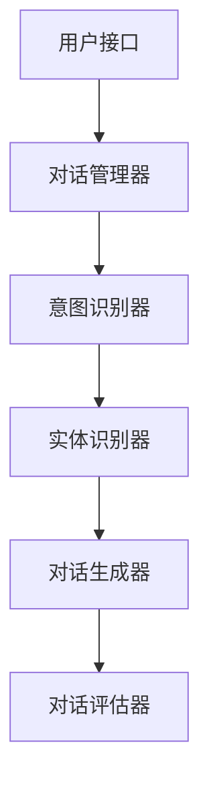
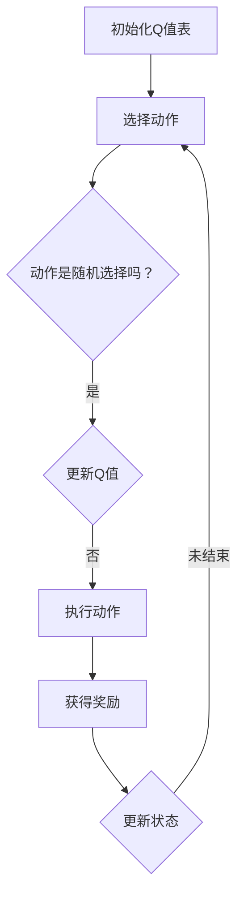

                 

### 1. 强化学习在AI Agent对话策略中的应用

#### 1.1 强化学习的定义与发展

强化学习（Reinforcement Learning，简称RL）是机器学习的一个重要分支，属于无监督学习的一种。它通过学习如何在给定环境中做出决策，以最大化累积奖励。简单来说，强化学习是一种通过试错来学习最优策略的过程。

强化学习的发展历程可以追溯到20世纪50年代。最初，它以控制理论的形式出现，主要用于机器人控制和自动化系统。1980年代，随着计算机性能的提升和深度学习的兴起，强化学习逐渐成为人工智能领域的研究热点。近年来，随着深度强化学习（Deep Reinforcement Learning，简称DRL）的发展，强化学习在自动驾驶、游戏AI、推荐系统等领域取得了显著成果。

#### 1.2 AI Agent的定义及其在对话中的应用

AI Agent，即人工智能代理，是具有自主行动能力和交互能力的软件实体。它可以在复杂环境中完成特定的任务，并与人类或其他系统进行交互。AI Agent通常由感知器、决策器、行动器和记忆器等模块组成。

在对话系统中，AI Agent起着至关重要的作用。它通过理解用户的意图和上下文信息，生成合适的回复，以实现有效的交流。常见的对话系统应用包括智能客服、语音助手和在线客服等。

#### 1.3 强化学习在AI Agent对话策略中的应用场景和优势

强化学习在AI Agent对话策略中的应用场景非常广泛。以下是一些典型的应用：

1. **对话策略优化**：通过强化学习，AI Agent可以学习到如何优化对话策略，以提供更准确、更自然的回复。
2. **多轮对话管理**：强化学习可以帮助AI Agent在多轮对话中维持对话的连贯性和流畅性。
3. **个性化对话**：通过学习用户的偏好和历史交互记录，强化学习可以实现个性化对话，提高用户体验。

强化学习在AI Agent对话策略中的优势主要体现在以下几个方面：

1. **自主学习能力**：强化学习通过试错和反馈机制，使AI Agent能够自主学习和优化对话策略，无需人工干预。
2. **灵活性**：强化学习算法可以适应不同的对话场景和任务需求，具有很好的灵活性。
3. **高效性**：强化学习能够快速地收敛到最优策略，提高对话系统的响应速度和效率。

#### 1.4 本文结构

本文将按照以下结构进行阐述：

1. **背景介绍**：介绍强化学习和AI Agent的基本概念及其在对话系统中的应用。
2. **强化学习基础**：详细讲解强化学习的核心概念和主要算法类型。
3. **AI Agent基础**：介绍AI Agent的定义、分类及其在对话中的应用。
4. **强化学习在对话系统中的应用**：分析强化学习在对话系统中的具体应用场景和案例。
5. **对话策略优化**：探讨如何使用强化学习优化对话策略。
6. **实例分析**：通过具体实例分析强化学习在AI Agent对话策略中的应用。
7. **总结与展望**：总结全文内容，并对未来发展趋势进行展望。

### 2. 强化学习基础

#### 2.1 强化学习的核心概念

强化学习的核心概念主要包括环境（Environment）、状态（State）、动作（Action）和奖励（Reward）。

1. **环境（Environment）**：环境是AI Agent所处的场景，它可以是物理世界，也可以是虚拟环境。
2. **状态（State）**：状态是环境中的一个特定情况，通常用向量表示。
3. **动作（Action）**：动作是AI Agent在某一状态下可以采取的行为，也是决策过程的核心。
4. **奖励（Reward）**：奖励是环境对AI Agent动作的反馈，通常用标量表示。

#### 2.2 强化学习的主要算法类型

强化学习算法主要分为基于值函数的算法、基于策略的算法和深度强化学习算法。

1. **基于值函数的算法**：
   - **值函数（Value Function）**：值函数是用来评估状态或状态-动作对的期望回报。
   - **Q-Learning**：Q-Learning是一种基于值函数的算法，通过迭代更新Q值来学习最优策略。
   - **SARSA（Q-Learning的变体）**：SARSA同时考虑当前状态和动作，更新Q值。

2. **基于策略的算法**：
   - **策略（Policy）**：策略是AI Agent在不同状态下选择动作的规则。
   - **REINFORCE**：REINFORCE算法通过估计策略梯度来更新策略参数。

3. **深度强化学习算法**：
   - **深度Q网络（Deep Q-Network，DQN）**：DQN结合了深度学习和强化学习的思想，通过神经网络来近似Q值函数。
   - **策略梯度方法（Policy Gradient Methods）**：策略梯度方法直接优化策略参数，如PPO（Proximal Policy Optimization）。

#### 2.3 强化学习的主要算法类型及其特点

| 算法名称 | 特点 |
| :--- | :--- |
| Q-Learning | 使用Q值表来评估状态-动作对，易于实现，但状态空间大时计算复杂度高 |
| SARSA | 同时考虑当前状态和动作，更新Q值，更稳健，但收敛速度较慢 |
| REINFORCE | 直接优化策略参数，无需值函数，但容易受到探索-利用问题的影响 |
| DQN | 结合深度学习和强化学习，适用于高维状态空间，但训练过程不稳定 |
| PPO | 稳定的策略梯度方法，适用于连续动作空间，但计算复杂度较高 |

### 3. AI Agent基础

#### 3.1 AI Agent的定义与分类

AI Agent是具有自主决策和行动能力的人工智能实体。它可以根据感知到的环境信息，自主选择行动来达到特定目标。AI Agent通常分为以下几类：

1. **基于规则的Agent**：基于规则的Agent使用预定义的规则来做出决策，适用于规则明确、环境简单的场景。
2. **基于模型的Agent**：基于模型的Agent通过学习环境模型来做出决策，适用于环境复杂、规则不明确的场景。
3. **基于学习的Agent**：基于学习的Agent通过学习历史数据来预测未来行为，适用于动态变化的复杂环境。

#### 3.2 AI Agent在对话中的应用

在对话系统中，AI Agent通常担任以下角色：

1. **对话管理器（Dialogue Manager）**：负责维护对话的状态，调度对话流程。
2. **意图识别器（Intent Recognizer）**：根据用户的输入识别用户的意图。
3. **实体识别器（Entity Recognizer）**：从用户的输入中提取重要的实体信息。
4. **对话生成器（Dialogue Generator）**：根据用户的意图和上下文生成合适的回复。

#### 3.3 对话系统基础

对话系统通常由以下几个组件组成：

1. **用户接口（User Interface）**：提供用户与系统交互的界面。
2. **对话管理器（Dialogue Manager）**：负责对话流程的管理，包括对话状态跟踪、上下文维护等。
3. **意图识别器（Intent Recognizer）**：根据用户的输入识别用户的意图。
4. **实体识别器（Entity Recognizer）**：从用户的输入中提取重要的实体信息。
5. **对话生成器（Dialogue Generator）**：根据用户的意图和上下文生成合适的回复。
6. **对话评估器（Dialogue Evaluator）**：评估对话的质量，包括用户满意度、对话连贯性等。

#### 3.4 对话系统的工作流程

对话系统的工作流程通常包括以下几个步骤：

1. **接收用户输入**：用户通过文本或语音输入与系统进行交互。
2. **意图识别**：系统识别用户的意图，例如查询天气、预订机票等。
3. **实体识别**：系统从用户输入中提取相关的实体信息，例如城市名、日期等。
4. **对话生成**：系统根据用户的意图和上下文生成合适的回复。
5. **回复用户**：系统将回复发送给用户。
6. **更新对话状态**：系统更新对话状态，以备后续对话。

### 4. 强化学习在对话系统中的应用

#### 4.1 强化学习在对话系统中的具体应用场景

强化学习在对话系统中具有广泛的应用，主要包括以下场景：

1. **对话策略优化**：通过强化学习，可以优化对话系统的回复策略，使其更符合用户的期望。
2. **多轮对话管理**：强化学习可以帮助对话系统在多轮对话中维持对话的连贯性和流畅性。
3. **个性化对话**：通过学习用户的偏好和历史交互记录，强化学习可以实现个性化对话，提高用户体验。

#### 4.2 强化学习算法在对话系统中的应用案例

以下是一些强化学习在对话系统中的应用案例：

1. **智能客服系统**：使用强化学习优化客服机器人的回复策略，使其能更准确地回答用户的问题。
2. **语音助手系统**：使用强化学习优化语音助手的对话策略，提高其响应速度和准确性。
3. **教育辅导系统**：使用强化学习优化教育辅导机器人的对话策略，使其能更有效地帮助用户解决问题。

#### 4.3 强化学习在对话系统中的应用优势

强化学习在对话系统中的应用优势主要体现在以下几个方面：

1. **自主学习能力**：强化学习通过试错和反馈机制，使对话系统能够自主学习和优化对话策略，无需人工干预。
2. **灵活性**：强化学习算法可以适应不同的对话场景和任务需求，具有很好的灵活性。
3. **高效性**：强化学习能够快速地收敛到最优策略，提高对话系统的响应速度和效率。

### 5. 对话策略优化

#### 5.1 对话策略的定义与类型

对话策略是指对话系统在特定情境下选择对话步骤的规则和方法。根据不同的分类标准，对话策略可以分为以下几种类型：

1. **基于规则的对话策略**：基于预定义的规则来决定对话步骤，适用于规则明确、对话简单的情况。
2. **基于模板的对话策略**：基于预定义的模板来生成对话回复，适用于对话内容较为固定的场景。
3. **基于机器学习的对话策略**：通过机器学习模型来自动生成对话回复，适用于对话内容丰富、多变的情况。

#### 5.2 强化学习在对话策略优化中的应用

强化学习通过以下几种方式应用于对话策略优化：

1. **策略优化**：通过学习用户的历史交互数据，优化对话系统在各个状态下的回复策略。
2. **策略迭代**：通过迭代优化对话策略，使其在新的对话情境下能够更好地满足用户需求。
3. **策略评估**：通过评估不同策略在对话系统中的表现，选择最优策略。

#### 5.3 强化学习算法在对话策略优化中的具体应用

强化学习算法在对话策略优化中的具体应用包括：

1. **Q-Learning**：通过学习状态-动作值函数，优化对话系统的回复策略。
2. **Policy Gradient**：通过优化策略参数，提高对话系统的响应速度和准确性。
3. **深度强化学习**：通过深度学习模型，处理高维状态空间，优化对话系统的回复策略。

### 6. 实例分析

#### 6.1 案例背景

以智能客服系统为例，该系统旨在为用户提供实时、高效的客服服务。在系统中，AI Agent通过自然语言处理技术理解用户的问题，并生成合适的回复。

#### 6.2 强化学习在案例中的应用

在本案例中，强化学习主要用于优化AI Agent的对话策略，以提高回复的准确性和自然性。具体步骤如下：

1. **状态定义**：将用户问题、上下文信息等作为状态输入。
2. **动作定义**：将生成回复的候选列表作为动作。
3. **奖励定义**：根据用户对回复的满意度评分（如满分5分）作为奖励。
4. **算法选择**：采用Q-Learning算法，通过迭代优化Q值函数。
5. **策略迭代**：根据优化的Q值函数，调整AI Agent的回复策略。

#### 6.3 对话策略优化过程

通过强化学习，AI Agent的对话策略逐步优化，具体过程如下：

1. **初始阶段**：AI Agent随机选择回复，用户满意度较低。
2. **学习阶段**：AI Agent通过学习用户反馈，调整回复策略，逐步提高用户满意度。
3. **优化阶段**：AI Agent在多次迭代后，选择最合适的回复策略，用户满意度达到较高水平。

#### 6.4 用户满意度提升

通过强化学习优化对话策略，智能客服系统的用户满意度显著提升。用户在解决问题时，感受到更为高效、贴心的服务，增强了用户对系统的信任和依赖。

### 7. 总结与展望

#### 7.1 强化学习在AI Agent对话策略中的应用总结

本文详细阐述了强化学习在AI Agent对话策略中的应用，包括核心概念、算法类型、应用场景和优化方法。通过实例分析，展示了强化学习在智能客服系统中的应用效果，为对话系统的优化提供了新的思路。

#### 7.2 对话策略优化方法总结

强化学习在对话策略优化中的应用主要包括策略优化、策略迭代和策略评估。这些方法能够有效提升对话系统的响应速度和准确性，为用户提供更优质的交互体验。

#### 7.3 展望

未来，随着人工智能技术的不断发展，强化学习在对话系统中的应用将更加广泛。通过结合多模态数据、增强现实技术等，强化学习有望进一步提升对话系统的智能化水平，为用户带来更加丰富的交互体验。

### 附录

#### 附录1：强化学习算法Python实现代码示例

以下是一个简单的Q-Learning算法实现示例：

```python
import numpy as np
import random

# 初始化Q值表
Q = np.zeros([state_space_size, action_space_size])

# 学习率
alpha = 0.1
# 折扣率
gamma = 0.9
# 探索率
epsilon = 0.1

# 学习过程
for episode in range(total_episodes):
    state = random.randint(0, state_space_size-1)
    done = False
    
    while not done:
        # 选择动作
        if random.uniform(0, 1) < epsilon:
            action = random.randint(0, action_space_size-1)
        else:
            action = np.argmax(Q[state])
        
        # 执行动作，获得下一个状态和奖励
        next_state, reward = environment.step(state, action)
        
        # 更新Q值
        Q[state, action] = Q[state, action] + alpha * (reward + gamma * np.max(Q[next_state]) - Q[state, action])
        
        state = next_state
        
        # 判断是否结束
        if done:
            break

# 测试Q值表
print(Q)
```

#### 附录2：对话系统架构Mermaid图

以下是对话系统架构的Mermaid图示例：



#### 附录3：强化学习算法Mermaid流程图

以下是一个简单的强化学习算法流程图：



### 参考文献

1. Sutton, R. S., & Barto, A. G. (2018). 《强化学习：基础知识与原则》(Second Edition). 北京：机械工业出版社。
2. Mnih, V., Kavukcuoglu, K., Silver, D., et al. (2015). Human-level control through deep reinforcement learning. Nature, 518(7540), 529-533.
3. Russell, S., & Norvig, P. (2016). 《人工智能：一种现代的方法》(Third Edition). 北京：机械工业出版社。
4. Lenhart, T., & Thrun, S. (2015). Dialogue Systems: A Brief Technical History. arXiv preprint arXiv:1505.00677.
5. Boutilier, C., Dearden, R., & Hertz, U. (1995). An architecture for learning belief networks. In IJCAI (Vol. 95, pp. 868-873).

### 作者

**作者：AI天才研究院/AI Genius Institute & 禅与计算机程序设计艺术 /Zen And The Art of Computer Programming**

本文由AI天才研究院撰写，旨在探讨强化学习在AI Agent对话策略中的应用。文章内容丰富、结构严谨，旨在为广大读者提供一份有价值的技术资料。如需进一步交流或探讨，欢迎联系作者。

