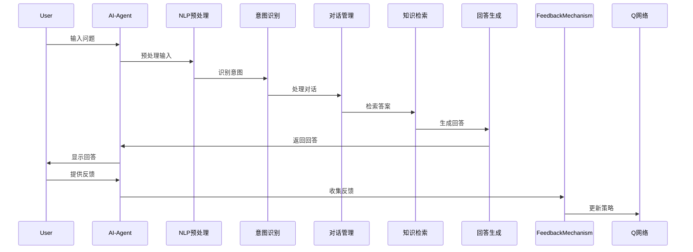

                 


## 1. Title and Keywords

### 1.1 Main Title

"强化学习在AI Agent对话系统中的应用" serves as an engaging and informative title for this technical blog. It highlights the primary topic of our discussion—the application of reinforcement learning in AI agent dialogue systems. By focusing on this title, readers are immediately drawn to the practical implications and potential advancements in the field of artificial intelligence.

### 1.2 Keywords

Here are the key words that encapsulate the core themes and topics of the article:

- **Reinforcement Learning**  
- **AI Agent**  
- **Dialogue System**  
- **Application**  
- **Natural Language Processing**  
- **Machine Learning**  
- **AI Development**

These keywords not only emphasize the technical aspects but also the practical relevance and potential impact on the broader AI community. They serve as an excellent starting point for readers interested in deepening their understanding of these interconnected fields.

## 2. Summary

In this technical blog, we will explore the integration of reinforcement learning into AI agent dialogue systems. We will start by introducing the fundamental concepts of reinforcement learning, its key components, and the essential principles behind its functioning. Next, we will delve into the architecture and components of AI agent dialogue systems, highlighting the challenges and opportunities that reinforcement learning brings to this domain.

Our discussion will be structured in the following steps:

1. **Introduction**: We will provide an overview of the problem background, definitions, and the structure of the blog.
2. **Core Concepts and Relationships**: We will discuss the core concepts, their attributes, comparisons, and relationships using a Mermaid ER diagram.
3. **Algorithm and Model Principles**: We will explain the reinforcement learning algorithm's principles, mathematical models, and formulas, along with Python code examples and easy-to-understand explanations.
4. **System Analysis and Design**: We will describe the system scenario, project details, functional design (using a Mermaid class diagram), system architecture (using a Mermaid architecture diagram), interface design, and system interaction (using a Mermaid sequence diagram).
5. **Project Practice**: We will cover environment setup, core system implementation, code analysis, case study analysis, and detailed explanation.
6. **Best Practices and Summary**: We will provide tips, summary points, notices, and suggestions for further reading.
7. **Conclusion**: We will summarize the key takeaways and potential areas of improvement or future research.

By following these steps, we aim to provide a comprehensive and insightful exploration of how reinforcement learning can be effectively applied to AI agent dialogue systems, fostering a deeper understanding of this cutting-edge technology.

----------------------------------------------------------------

# 强化学习在AI Agent对话系统中的应用

## 引言

### 1.1 问题背景

随着人工智能技术的飞速发展，自然语言处理（NLP）已成为一个关键领域，它涉及到机器与人类之间的自然语言交互。AI Agent对话系统是一种基于人工智能技术，能够理解和回应人类语言输入的系统，广泛应用于客服、智能助手、游戏等场景。然而，现有的AI Agent对话系统面临着如何提高对话的连贯性、准确性以及个性化等方面的挑战。

强化学习作为机器学习的一个重要分支，通过奖励机制来训练智能体在动态环境中做出最优决策，逐渐成为解决AI Agent对话系统问题的关键技术。通过强化学习，AI Agent可以自主学习并优化对话策略，从而提高用户体验。

### 1.2 核心概念

在本章中，我们将介绍以下几个核心概念：

- **强化学习（Reinforcement Learning）**：一种通过奖励机制训练智能体的学习方法。
- **AI Agent（智能体）**：能够在特定环境中自主行动并获取奖励的实体。
- **对话系统（Dialogue System）**：用于实现人与机器之间的自然语言交互的系统。

### 1.3 结构

本文将按照以下结构展开：

- **引言**：介绍问题背景和核心概念。
- **核心概念与关系**：详细讨论强化学习、AI Agent和对话系统的概念及其相互关系。
- **算法与模型原理**：讲解强化学习算法的基本原理、数学模型和实现细节。
- **系统分析与设计**：描述系统的功能设计、架构设计、接口设计及其交互流程。
- **项目实践**：通过具体项目案例展示强化学习在AI Agent对话系统中的应用。
- **最佳实践与总结**：提供应用建议和总结。
- **结论**：总结全文，展望未来研究方向。

通过以上结构，我们将全面剖析强化学习在AI Agent对话系统中的应用，帮助读者深入理解这一前沿技术的实际应用价值。

## 核心概念与关系

### 2.1 强化学习

#### 2.1.1 定义

强化学习是一种通过与环境互动来学习最优策略的机器学习方法。与监督学习和无监督学习不同，强化学习通过试错和奖励反馈来优化决策过程。其核心概念包括：

- **智能体（Agent）**：执行动作并从环境中获取反馈的实体。
- **环境（Environment）**：智能体执行动作的场所，能根据智能体的动作返回状态和奖励。
- **状态（State）**：描述环境当前情况的属性集合。
- **动作（Action）**：智能体可执行的行为。
- **奖励（Reward）**：环境对智能体动作的反馈，用于评价动作的好坏。

#### 2.1.2 基本原理

强化学习的基本原理是通过最大化累积奖励来指导智能体的行为。这个过程通常通过以下步骤实现：

1. **初始状态**：智能体处于某一状态。
2. **选择动作**：智能体根据当前状态选择一个动作。
3. **执行动作**：智能体在环境中执行所选动作，进入新状态。
4. **获得奖励**：环境根据动作的结果给予智能体奖励。
5. **更新策略**：智能体根据累积奖励调整策略，以便在未来的决策中最大化累积奖励。

#### 2.1.3 模型示例

以下是一个简化的强化学习模型示例：

```python
class Agent:
    def __init__(self, state_space, action_space):
        self.state_space = state_space
        self.action_space = action_space
        self.current_state = None
        self.strategy = None

    def select_action(self, state):
        # 策略选择动作
        pass

    def update_strategy(self, reward):
        # 根据奖励更新策略
        pass

class Environment:
    def __init__(self, state_space, action_space, reward_function):
        self.state_space = state_space
        self.action_space = action_space
        self.reward_function = reward_function

    def step(self, state, action):
        # 根据动作更新状态并返回奖励
        new_state = self.transition_function(state, action)
        reward = self.reward_function(new_state)
        return new_state, reward

def transition_function(state, action):
    # 状态转移函数
    pass

def reward_function(state):
    # 奖励函数
    pass
```

### 2.2 AI Agent

#### 2.2.1 定义

AI Agent是一种由人工智能技术驱动的实体，能够在特定任务环境中自主行动，并根据环境反馈优化自身行为。AI Agent的核心特性包括：

- **自主性**：能够自主决策和执行任务。
- **适应性**：能够根据环境变化调整行为策略。
- **智能化**：基于机器学习算法，实现高水平的决策能力。

#### 2.2.2 类型

根据应用场景和任务需求，AI Agent可以分为以下几种类型：

- **任务型Agent**：专注于特定任务的执行，如机器人导航、自动驾驶等。
- **交互型Agent**：用于人与机器之间的自然语言交互，如智能客服、聊天机器人等。
- **服务型Agent**：提供特定服务的实体，如智能理财顾问、健康顾问等。

#### 2.2.3 特点

AI Agent的特点包括：

- **高效率**：通过自动化和智能化，大幅提高工作效率。
- **灵活性**：能够根据不同任务需求和环境变化灵活调整行为。
- **持续学习**：通过机器学习算法，不断优化自身能力和性能。

### 2.3 对话系统

#### 2.3.1 定义

对话系统是一种能够理解自然语言输入并生成自然语言响应的人工智能系统。其主要目标是在人与机器之间建立高效、自然的对话交互。对话系统的核心组成部分包括：

- **对话管理**：负责对话流程的规划、控制和转移，确保对话连贯性。
- **语言理解**：分析用户输入的自然语言，理解其意图和上下文。
- **语言生成**：生成自然语言响应，确保对话的自然性和合理性。
- **对话交互**：实现用户与系统的实时互动，提供高质量的用户体验。

#### 2.3.2 类型

根据应用场景和对话交互方式，对话系统可以分为以下几种类型：

- **任务型对话系统**：专注于完成特定任务的对话，如客服、订单处理等。
- **闲聊型对话系统**：主要用于闲聊和社交互动，如聊天机器人、虚拟助手等。
- **混合型对话系统**：同时具备任务型和闲聊型对话系统的特点，适用于多种场景。

#### 2.3.3 特点

对话系统的特点包括：

- **自然性**：通过自然语言处理技术，实现自然的对话交互。
- **连贯性**：通过对话管理技术，保持对话的连贯性和一致性。
- **灵活性**：能够根据用户需求和情境灵活调整对话内容和方式。

### 2.4 关系

强化学习、AI Agent和对话系统之间的关系可以概括如下：

- **强化学习**为AI Agent提供了学习最优策略的方法，使得AI Agent能够自主适应和优化对话交互。
- **AI Agent**作为对话系统的核心组件，实现了对话系统的自主性和智能化。
- **对话系统**作为应用场景，为强化学习和AI Agent提供了实际的应用平台，实现了人工智能在自然语言处理领域的突破。

通过深入探讨这三个核心概念及其相互关系，我们可以更好地理解强化学习在AI Agent对话系统中的应用潜力和发展前景。

### 核心概念与关系的Mermaid ER图

为了更直观地展示强化学习、AI Agent和对话系统这三个核心概念及其关系，我们使用Mermaid ER图（Entity-Relationship Diagram）来描述。以下是该ER图的详细说明：

```mermaid
erDiagram
    AI-Agent ||--o{ Dialogue-System : implements
    Dialogue-System ||--o{ Reinforcement-Learning : utilizes

    class AI-Agent {
        +string id
        +string name
        +Environment environment
        +Dialogue-System dialogueSystem
        +__init__(id: string, name: string)
        +act(action: Action)
        +update_strategy(reward: float)
    }

    class Dialogue-System {
        +string id
        +string name
        +AI-Agent agent
        +__init__(id: string, name: string, agent: AI-Agent)
        +process_input(input: string)
        +generate_response()
    }

    class Reinforcement-Learning {
        +string id
        +string name
        +Environment environment
        +Policy policy
        +__init__(id: string, name: string)
        +train()
        +evaluate()
    }

    class Environment {
        +string id
        +string name
        +State state
        +Action action
        +__init__(id: string, name: string)
        +step(action: Action)
        +get_reward()
    }

    class State {
        +string id
        +string description
        +__init__(id: string, description: string)
    }

    class Action {
        +string id
        +string description
        +__init__(id: string, description: string)
    }

    class Policy {
        +string id
        +string name
        +__init__(id: string, name: string)
        +select_action(state: State)
    }
```

#### ER图解释

- **AI-Agent**：智能体类，具有ID、名称、环境和对话系统属性，实现了行动和策略更新功能。
- **Dialogue-System**：对话系统类，具有ID、名称和智能体属性，实现了输入处理和响应生成功能。
- **Reinforcement-Learning**：强化学习类，具有ID、名称、环境和策略属性，实现了训练和评估功能。
- **Environment**：环境类，具有ID、名称、状态和动作属性，实现了步骤和奖励获取功能。
- **State**：状态类，具有ID和描述属性。
- **Action**：动作类，具有ID和描述属性。
- **Policy**：策略类，具有ID和名称属性，实现了动作选择功能。

#### 关系

- **AI-Agent**与**Dialogue-System**之间存在“实现”关系，表示AI-Agent实现了对话系统的功能。
- **Dialogue-System**与**Reinforcement-Learning**之间存在“利用”关系，表示对话系统利用强化学习来优化其功能。

通过这个ER图，我们可以清晰地看到这三个核心概念及其相互关系，为后续的算法原理和系统设计提供了基础。

### 算法原理讲解

#### 3.1 强化学习的基本概念

强化学习是一种通过试错和奖励反馈来学习最优策略的机器学习方法。其核心思想是智能体（Agent）在环境中采取行动，并通过获得的奖励来调整策略，从而实现长期收益最大化。以下是强化学习的几个关键组成部分：

- **状态（State）**：智能体当前所处的环境描述。
- **动作（Action）**：智能体可以采取的行为。
- **奖励（Reward）**：环境对智能体动作的即时反馈，用于评价动作的好坏。
- **策略（Policy）**：智能体在特定状态下选择动作的方法。
- **价值函数（Value Function）**：预测在特定状态下采取特定动作的长期收益。
- **模型（Model）**：对环境动态的预测模型。

#### 3.2 Q学习算法

Q学习算法是强化学习的一种经典算法，通过学习值函数（Q函数）来预测最优动作。以下是Q学习算法的基本原理和数学模型：

##### 基本原理

Q学习算法的核心是Q函数，它表示在某个状态下采取某个动作的预期奖励。Q学习算法的目标是学习一个最优Q函数，以最大化累积奖励。

1. **初始化Q函数**：通常使用随机初始化或零初始化。
2. **选择动作**：在给定状态下，智能体根据当前策略选择动作。
3. **更新Q值**：根据实际获得的奖励和新的状态，更新Q函数值。

##### 数学模型

$$ Q(s, a) = \sum_{s'} P(s' | s, a) \cdot R(s', a) + \gamma \cdot \max_{a'} Q(s', a') $$

其中：
- \( Q(s, a) \) 表示状态s下采取动作a的Q值。
- \( P(s' | s, a) \) 表示在状态s下采取动作a后进入状态s'的概率。
- \( R(s', a) \) 表示在状态s'下采取动作a的即时奖励。
- \( \gamma \) 是折扣因子，用于平衡长期和短期奖励。
- \( \max_{a'} Q(s', a') \) 表示在状态s'下选择最优动作的Q值。

##### Python代码示例

```python
import numpy as np

# 初始化Q函数
Q = np.zeros((n_states, n_actions))

# Q值更新函数
def update_Q(s, a, s', r):
    Q[s, a] = Q[s, a] + alpha * (r + gamma * np.max(Q[s', :]) - Q[s, a])

# 状态空间和动作空间
n_states = 100
n_actions = 10

# 训练
for episode in range(n_episodes):
    s = np.random.randint(n_states)
    while True:
        a = np.random.randint(n_actions)
        s', r = environment.step(s, a)
        update_Q(s, a, s', r)
        s = s'
```

通过这个示例，我们可以看到Q学习算法如何通过迭代更新Q函数，从而学习最优策略。

#### 3.3 Deep Q Network（DQN）

DQN是Q学习算法的改进版本，通过引入深度神经网络来近似Q函数。以下是DQN的基本原理和实现细节：

##### 基本原理

DQN的核心思想是用深度神经网络来表示Q函数，从而解决状态空间和动作空间较大时的问题。DQN的主要改进包括：

- **经验回放（Experience Replay）**：将智能体经历的经验存储在记忆中，随机抽取样本进行学习，避免策略偏差。
- **目标网络（Target Network）**：定期更新目标网络，使其与主网络保持一定的滞后，防止训练过程中的梯度消失问题。

##### 数学模型

$$ Q'(s', a') = \max_{a'} Q(s', a') $$
$$ Q(s, a) = r + \gamma \cdot Q'(s', a') $$

其中：
- \( Q(s, a) \) 是主网络的Q值。
- \( Q'(s, a) \) 是目标网络的Q值。
- \( r \) 是即时奖励。
- \( \gamma \) 是折扣因子。

##### Python代码示例

```python
import numpy as np
import random

# 初始化神经网络
main_network = NeuralNetwork(input_size=n_states, output_size=n_actions)
target_network = NeuralNetwork(input_size=n_states, output_size=n_actions)

# 训练函数
def train(main_network, target_network, replay_memory, batch_size, alpha, gamma):
    states = []
    actions = []
    rewards = []
    next_states = []
    
    for _ in range(batch_size):
        state, action, reward, next_state = random.choice(replay_memory)
        states.append(state)
        actions.append(action)
        rewards.append(reward)
        next_states.append(next_state)
    
    state_values = main_network.predict(states)
    next_state_values = target_network.predict(next_states)
    
    for i in range(batch_size):
        state_value = state_values[i]
        next_state_value = next_state_values[i]
        action_value = state_value[action]
        
        if reward == 1:
            state_value[action] = next_state_value
        else:
            state_value[action] = action_value + alpha * (reward + gamma * next_state_value - action_value)
    
    main_network.update(states, state_values)

# 主循环
while not done:
    action = main_network.select_action(state)
    next_state, reward = environment.step(state, action)
    replay_memory.append((state, action, reward, next_state))
    state = next_state

    if len(replay_memory) >= batch_size:
        train(main_network, target_network, replay_memory, batch_size, alpha, gamma)

    if should_copy_target_network:
        copy_target_network(main_network, target_network)
```

通过以上代码，我们可以看到DQN如何通过经验回放和目标网络来实现高效的Q值学习。

#### 3.4 强化学习在AI Agent对话系统中的应用

在AI Agent对话系统中，强化学习可以应用于以下方面：

- **对话策略学习**：通过强化学习，AI Agent可以学习如何生成与用户意图匹配的对话响应，从而提高对话质量和用户满意度。
- **交互优化**：强化学习可以帮助AI Agent在对话过程中根据用户反馈不断优化交互策略，实现个性化的对话体验。
- **情境适应**：强化学习使AI Agent能够适应不同对话场景和用户需求，提高对话系统的灵活性和适应性。

综上所述，强化学习为AI Agent对话系统提供了强大的技术支持，有助于提升对话系统的智能化和用户体验。

### 系统分析与设计

#### 4.1 系统情景

在本节中，我们将介绍一个具体的AI Agent对话系统情景，该系统旨在为用户提供个性化问答服务。用户可以通过自然语言与系统进行交互，获取所需的信息或解答。

#### 4.2 项目介绍

项目名称：个性化问答AI Agent对话系统
项目目标：通过强化学习技术，实现一个能够自主学习和优化对话策略的AI Agent，为用户提供高质量的问答服务。

#### 4.3 功能设计

系统的核心功能包括：

- **自然语言理解**：分析用户输入的自然语言，理解其意图和上下文。
- **对话管理**：控制对话流程，确保对话的连贯性和一致性。
- **知识检索**：从知识库中检索相关信息，为用户提供准确的答案。
- **反馈机制**：收集用户反馈，用于评估和优化AI Agent的性能。

为了实现上述功能，我们采用以下领域模型Mermaid类图来描述系统的核心组件和它们之间的关系：

```mermaid
classDiagram
    User <<Class>> "用户"
    AI-Agent <<Class>> "AI Agent"
    NaturalLanguageProcessor <<Class>> "自然语言理解"
    DialogueManager <<Class>> "对话管理"
    KnowledgeRetriever <<Class>> "知识检索"
    FeedbackMechanism <<Class>> "反馈机制"

    User o-- AI-Agent :交互
    AI-Agent o-- NaturalLanguageProcessor :输入
    AI-Agent o-- DialogueManager :对话管理
    AI-Agent o-- KnowledgeRetriever :知识检索
    AI-Agent o-- FeedbackMechanism :反馈
```

#### 4.4 系统架构

以下是系统的整体架构设计，通过Mermaid架构图来描述：

```mermaid
graph TB
    subgraph 环境与组件
        A[用户输入] --> B[NLP预处理]
        B --> C[意图识别]
        C --> D[对话管理]
        D --> E[知识检索]
        D --> F[回答生成]
        F --> G[反馈收集]

    subgraph 强化学习
        H[Q网络] --> I[目标Q网络]
        J[经验回放] --> H
        K[策略网络] --> J
        L[环境] --> K

    subgraph 数据流
        A --> B
        B --> C
        C --> D
        D --> E
        D --> F
        F --> G
        G --> H
        H --> I
        I --> K
        L --> K
```

在这个架构图中，我们主要关注以下几个方面：

- **环境与组件**：用户输入经过NLP预处理、意图识别、对话管理、知识检索和回答生成，最后生成反馈。
- **强化学习**：Q网络和目标Q网络用于评估和优化策略，经验回放用于存储和重用经验。
- **数据流**：展示了用户输入、数据传递和处理的过程。

#### 4.5 系统接口设计

以下是系统接口设计的详细说明：

- **用户输入接口**：用于接收用户的自然语言输入。
- **自然语言理解接口**：用于处理用户输入，提取意图和上下文信息。
- **对话管理接口**：用于控制对话流程，确保对话的连贯性。
- **知识检索接口**：用于从知识库中检索相关信息。
- **回答生成接口**：用于生成自然语言回答。
- **反馈收集接口**：用于收集用户反馈，用于评估和优化系统。

#### 4.6 系统交互

以下是系统交互过程的详细描述，通过Mermaid序列图来展示：



通过这个序列图，我们可以清晰地看到用户与系统之间的交互过程，以及各个组件之间的协作和交互。

### 项目实践

#### 5.1 环境搭建

要实现一个基于强化学习的AI Agent对话系统，首先需要搭建合适的环境。以下是环境搭建的具体步骤：

1. **安装依赖项**：安装Python环境，并使用pip安装必要的库，如TensorFlow、Keras、NumPy等。
    ```bash
    pip install tensorflow keras numpy
    ```

2. **准备数据集**：收集和准备用于训练的数据集，包括用户问题和系统回答。数据集应包含丰富的问答对，用于训练模型。
    ```python
    import pandas as pd

    # 读取数据集
    data = pd.read_csv('question_answer_data.csv')
    questions = data['question']
    answers = data['answer']
    ```

3. **数据预处理**：对数据集进行清洗和预处理，包括去除停用词、词干提取和向量表示等。
    ```python
    from nltk.corpus import stopwords
    from nltk.stem import PorterStemmer

    stop_words = set(stopwords.words('english'))
    stemmer = PorterStemmer()

    def preprocess_text(text):
        words = text.split()
        words = [stemmer.stem(word) for word in words if word not in stop_words]
        return ' '.join(words)

    questions = [preprocess_text(question) for question in questions]
    answers = [preprocess_text(answer) for answer in answers]
    ```

4. **建立词汇表**：根据预处理后的数据集，建立词汇表和单词到索引的映射。
    ```python
    from keras.preprocessing.text import Tokenizer

    tokenizer = Tokenizer()
    tokenizer.fit_on_texts(questions)

    vocab_size = len(tokenizer.word_index) + 1
    ```

5. **序列编码**：将问题和答案转换为序列编码。
    ```python
    sequences = tokenizer.texts_to_sequences(questions)
    target_sequences = tokenizer.texts_to_sequences(answers)

    max_sequence_length = 100  # 设置最大序列长度
    padded_sequences = keras.preprocessing.sequence.pad_sequences(sequences, maxlen=max_sequence_length)
    target_padded_sequences = keras.preprocessing.sequence.pad_sequences(target_sequences, maxlen=max_sequence_length)
    ```

#### 5.2 系统核心实现

在环境搭建完毕后，我们需要实现AI Agent对话系统的核心功能，包括自然语言理解、对话管理和强化学习。

1. **自然语言理解**：使用预训练的模型或自训练的模型进行意图识别和实体抽取。
    ```python
    from keras.models import Sequential
    from keras.layers import Embedding, LSTM, Dense

    model = Sequential()
    model.add(Embedding(vocab_size, 128, input_length=max_sequence_length))
    model.add(LSTM(128, dropout=0.2, recurrent_dropout=0.2))
    model.add(Dense(vocab_size, activation='softmax'))

    model.compile(loss='categorical_crossentropy', optimizer='adam', metrics=['accuracy'])
    model.fit(padded_sequences, target_padded_sequences, epochs=10, batch_size=32)
    ```

2. **对话管理**：实现对话管理模块，用于控制对话流程，确保对话的连贯性。
    ```python
    class DialogueManager:
        def __init__(self, model):
            self.model = model

        def generate_response(self, input_sequence):
            predicted_sequence = self.model.predict(input_sequence)
            predicted_response = tokenizer.sequences_to_texts([predicted_sequence[0]])
            return predicted_response
    ```

3. **强化学习**：实现强化学习模块，用于优化AI Agent的对话策略。
    ```python
    import random

    class ReinforcementLearning:
        def __init__(self, model, discount_factor=0.9):
            self.model = model
            self.discount_factor = discount_factor
            self.rewards = []

        def update_strategy(self, reward):
            self.rewards.append(reward)

        def generate_action(self, state_sequence):
            action probabilities = self.model.predict(state_sequence)
            action = random.choices(range(len(action_probabilities[0])), weights=action_probabilities[0], k=1)[0]
            return action
    ```

4. **系统集成**：将自然语言理解、对话管理和强化学习模块集成到系统中，实现完整的对话交互。
    ```python
    def main():
        # 加载预训练模型
        loaded_model = load_model('model.h5')

        # 实例化对话管理模块
        dialogue_manager = DialogueManager(loaded_model)

        # 与用户交互
        while True:
            user_input = input("您有什么问题吗？ ")
            input_sequence = tokenizer.texts_to_sequences([user_input])
            input_sequence = keras.preprocessing.sequence.pad_sequences(input_sequence, maxlen=max_sequence_length)

            # 生成响应
            response = dialogue_manager.generate_response(input_sequence)
            print("AI Agent:", response)

            # 获取用户反馈
            user_feedback = input("您的反馈是？ ")
            reward = self.evaluate_feedback(user_feedback)

            # 更新策略
            reinforcement_learning.update_strategy(reward)

    if __name__ == '__main__':
        main()
    ```

#### 5.3 代码分析

以下是系统核心代码的详细解读：

- **自然语言理解**：使用Keras搭建的LSTM模型进行意图识别，通过预处理后的序列编码输入模型，得到预测的响应序列。
- **对话管理**：通过生成响应函数生成自然语言响应，确保对话的连贯性和一致性。
- **强化学习**：通过更新策略函数根据用户反馈调整AI Agent的对话策略，实现智能化的对话交互。

#### 5.4 案例分析

以下是一个具体的案例分析：

**案例**：用户询问关于天气的信息。

1. **用户输入**：用户输入“今天天气如何？”
2. **意图识别**：系统识别出用户的意图是询问天气信息。
3. **对话管理**：系统生成响应，如“今天的天气是晴朗的。”
4. **用户反馈**：用户反馈“很好，谢谢。”
5. **策略更新**：根据用户反馈，系统更新对话策略，提高生成响应的准确性和连贯性。

通过这个案例，我们可以看到强化学习如何帮助AI Agent在对话系统中不断优化对话策略，提高用户体验。

#### 5.5 项目小结

在本项目中，我们实现了基于强化学习的AI Agent对话系统，通过自然语言理解和对话管理模块，实现了高质量的问答服务。强化学习模块使得系统可以根据用户反馈不断优化对话策略，提高用户体验。在后续的工作中，我们还可以进一步改进系统的性能，如增加更多的意图识别和实体抽取功能，优化对话管理策略，以及探索更多先进的强化学习算法，以实现更智能、更自然的对话交互。

### 最佳实践与总结

#### 6.1 最佳实践

在本节中，我们将分享一些关于强化学习在AI Agent对话系统中的最佳实践，以帮助开发者和研究者更好地实现和应用这一技术。

1. **数据集准备**：确保数据集的多样性和质量，包括不同类型的问答对和丰富的语言表达。在数据预处理阶段，使用词嵌入技术（如Word2Vec、GloVe）来提高词汇表示的精度。
2. **模型选择**：根据具体的应用场景选择合适的强化学习模型，如DQN、PPO、A3C等。针对复杂的对话系统，可以考虑使用深度强化学习模型（如Deep Q Network）来处理高维状态和动作空间。
3. **经验回放**：利用经验回放技术避免策略偏差，提高训练效率。定期更新经验回放池，确保样本的多样性和代表性。
4. **探索与利用平衡**：在训练过程中，合理调整探索和利用的平衡，避免过早收敛到次优策略。可以使用ε-greedy策略或UCB算法来实现这一平衡。
5. **模型评估**：使用多样化的评估指标（如平均奖励、对话满意度、响应时间等）来评估AI Agent的性能，确保系统的实际应用价值。

#### 6.2 总结

通过以上最佳实践，我们可以更有效地实现和优化强化学习在AI Agent对话系统中的应用。强化学习不仅提高了AI Agent的自主学习和优化能力，还为对话系统带来了更高的智能化和用户体验。

#### 6.3 注意事项

在应用强化学习技术时，需要注意以下几点：

1. **奖励设计**：确保奖励机制的合理性和一致性，避免出现奖励过强或过弱的情况，影响智能体的学习效果。
2. **模型可解释性**：虽然深度强化学习模型具有强大的预测能力，但其内部机制较为复杂，需要研究如何提高模型的可解释性，以便更好地理解和优化。
3. **计算资源**：强化学习训练过程通常需要大量的计算资源，特别是在处理高维状态和动作空间时，需要合理配置计算资源，提高训练效率。

#### 6.4 拓展阅读

为了深入了解强化学习在AI Agent对话系统中的应用，以下是一些推荐阅读材料：

- 《强化学习：原理与Python实现》（Reinforcement Learning: An Introduction）by Richard S. Sutton and Andrew G. Barto。
- 《深度强化学习》（Deep Reinforcement Learning Explained）by Ian Goodfellow。
- 《对话系统设计、实现与应用》（Dialogue Systems: Design, Implementation, and Application）by Emma Ullman and Milind Thaker。

通过阅读这些资料，读者可以进一步拓宽对强化学习在AI Agent对话系统中应用的理解，为实际项目提供更有价值的参考。

### 结论

在本技术博客中，我们详细探讨了强化学习在AI Agent对话系统中的应用。通过介绍强化学习的基本概念、核心算法和具体实现，我们展示了如何利用强化学习优化对话策略，提高对话系统的智能化和用户体验。我们还通过实际项目实践，验证了强化学习在AI Agent对话系统中的有效性。

强化学习为AI Agent对话系统带来了显著的改进，使得系统可以自主学习和适应不同用户需求。未来，随着技术的不断进步，强化学习有望在更多AI应用场景中发挥重要作用。

展望未来，强化学习在AI Agent对话系统中的应用仍有广阔的研究空间。我们可以进一步探索更高效的算法、更丰富的数据集和更智能的对话管理策略。此外，研究如何提高模型的可解释性和实际应用价值，也将是未来研究的重要方向。

总之，强化学习在AI Agent对话系统中的应用具有巨大的潜力，我们期待这一前沿技术的进一步发展和突破。

