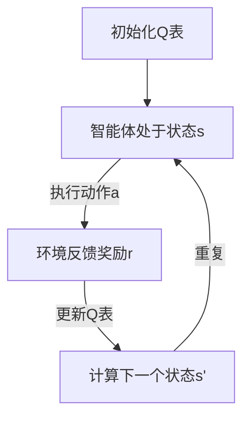
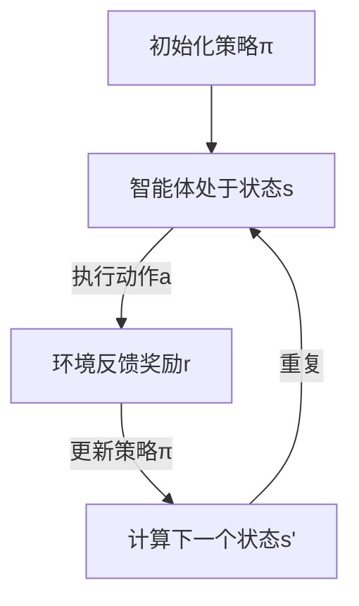
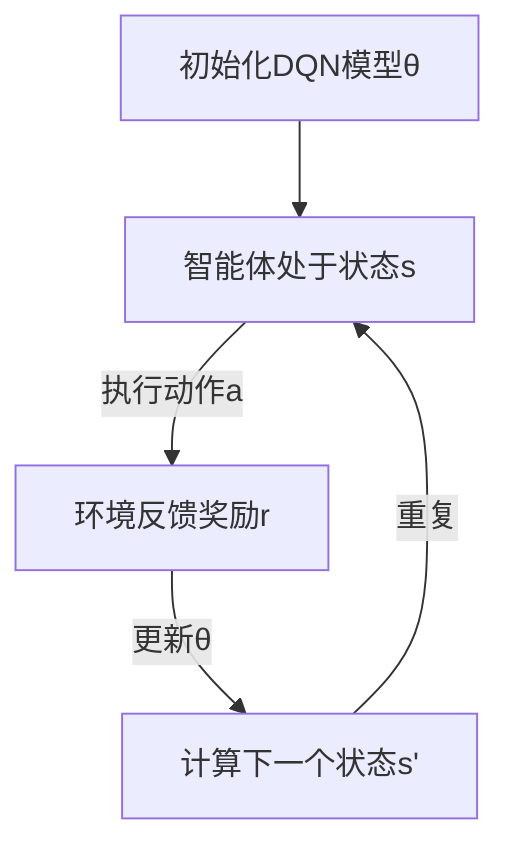
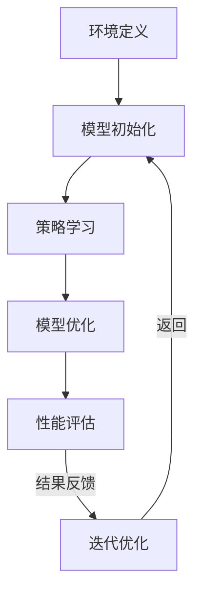

                 

# 强化学习驱动的AI Agent：优化LLM的决策策略

## 关键词
- 强化学习
- AI Agent
- LLM
- 决策策略
- 优化
- 自适应

## 摘要
本文旨在探讨如何通过强化学习来优化大型语言模型（LLM）的决策策略。首先，我们将介绍强化学习的基础知识，包括其背景、定义、核心算法以及在实际应用中的挑战与解决方案。接下来，我们将深入探讨AI Agent的概述、LLM的定义与特点，以及AI Agent如何通过强化学习来优化LLM的决策策略。我们将通过详细的算法原理讲解、Python代码示例以及实际应用案例，展示强化学习在LLM决策优化中的巨大潜力。

### 第1章：强化学习基础

#### 1.1 强化学习的背景和定义

**1.1.1 强化学习的起源与发展**

强化学习（Reinforcement Learning，RL）是一种机器学习范式，旨在通过试错的方法来训练智能体（Agent）在特定环境中做出最优决策。强化学习的起源可以追溯到1950年代，由计算机科学家理查德·萨皮罗（Richard Bellman）提出的动态规划理论。

**强化学习的基本概念**：  
强化学习的主要目标是使智能体能够在未知的环境中通过学习获得最优策略。在这个过程中，智能体会根据其当前的状态（State）选择一个动作（Action），然后根据环境的反馈（Reward）来调整其行为。

**强化学习与其他机器学习方法的比较**：  
与其他机器学习方法相比，强化学习具有以下特点：

- **学习方式**：强化学习是一种基于奖励（Reward）的学习方式，而不是传统的有监督或无监督学习。
- **目标**：强化学习的目标是学习一个最优策略（Policy），而不是仅仅预测输出或分类。
- **环境**：强化学习涉及到一个动态的、交互式的环境，而不仅仅是静态的数据集。

**1.1.2 强化学习的主要应用场景**

- **探索与利用平衡**：在强化学习中，智能体需要在探索（Exploration）和利用（Exploitation）之间做出平衡。探索是为了获取更多的信息，利用则是为了最大化当前已知的最佳策略的回报。
- **持续学习的需求**：强化学习的一个关键特点是智能体需要不断学习并适应环境的变化。
- **高维搜索空间的挑战**：在强化学习中，状态和动作空间往往非常庞大，这使得搜索空间变得非常高维。

**1.1.3 强化学习的基本术语**

- **奖励函数（Reward Function）**：奖励函数是强化学习中的一个关键组件，它定义了智能体在不同状态下的回报。
- **状态（State）**：状态是智能体当前所处的情境或环境。
- **动作（Action）**：动作是智能体可以执行的行为。
- **策略（Policy）**：策略是智能体在给定状态下选择动作的规则。
- **状态-动作值函数（State-Action Value Function）**：状态-动作值函数定义了在特定状态下执行特定动作的预期回报。

#### 1.2 强化学习的核心算法

**1.2.1 Q-Learning算法**

**1.2.1.1 Q-Learning算法的基本原理**

Q-Learning算法是一种基于值函数的强化学习算法，其目标是最小化目标函数：

$$
J(\theta) = \sum_{s,a} Q(s,a) (r_s - Q(s,a))
$$

其中，$Q(s,a)$ 是状态-动作值函数，$r_s$ 是在状态 $s$ 执行动作 $a$ 后获得的奖励。

Q-Learning算法的核心更新策略是：

$$
Q(s,a) \leftarrow Q(s,a) + \alpha [r_s + \gamma \max_{a'} Q(s',a') - Q(s,a)]
$$

其中，$\alpha$ 是学习率，$\gamma$ 是折扣因子。

**1.2.1.2 Q-Learning算法的mermaid流程图**



**1.2.1.3 Python代码示例**

```python
import numpy as np

def q_learning(env, num_episodes, alpha, gamma):
    Q = np.zeros((env.num_states, env.num_actions))
    for episode in range(num_episodes):
        state = env.reset()
        done = False
        while not done:
            action = np.argmax(Q[state])
            next_state, reward, done = env.step(action)
            Q[state, action] = Q[state, action] + alpha * (reward + gamma * np.max(Q[next_state]) - Q[state, action])
            state = next_state
    return Q

# 假设已经定义了环境env、学习率alpha和折扣因子gamma
num_episodes = 1000
alpha = 0.1
gamma = 0.99
Q = q_learning(env, num_episodes, alpha, gamma)
```

**1.2.2 Sarsa算法**

**1.2.2.1 Sarsa算法的基本原理**

Sarsa算法是一种基于策略的强化学习算法，它通过在当前状态下执行动作并观察环境的反馈来更新策略。Sarsa算法的目标是最小化目标函数：

$$
J(\theta) = \sum_{s,a} \pi(a|s) Q(s,a) (r_s - Q(s,a))
$$

其中，$\pi(a|s)$ 是策略，$Q(s,a)$ 是状态-动作值函数。

Sarsa算法的核心更新策略是：

$$
\pi(a|s) \leftarrow \frac{\sum_{a'} \alpha(a') Q(s,a')}{\sum_{a'} \alpha(a')}
$$

其中，$\alpha(a')$ 是动作的概率。

**1.2.2.2 Sarsa算法的mermaid流程图**



**1.2.2.3 Python代码示例**

```python
import numpy as np

def sarsa(env, num_episodes, alpha, gamma):
    pi = np.ones((env.num_states, env.num_actions)) / env.num_actions
    for episode in range(num_episodes):
        state = env.reset()
        done = False
        while not done:
            action = np.random.choice(env.num_actions, p=pi[state])
            next_state, reward, done = env.step(action)
            Q = pi[state] * np.array([Q[state, a] for a in range(env.num_actions)])
            pi[state] = pi[state] + alpha * (reward + gamma * Q[next_state] - pi[state][action])
            state = next_state
    return pi

# 假设已经定义了环境env、学习率alpha和折扣因子gamma
num_episodes = 1000
alpha = 0.1
gamma = 0.99
pi = sarsa(env, num_episodes, alpha, gamma)
```

**1.2.3 Deep Q-Network (DQN)算法**

**1.2.3.1 DQN算法的基本原理**

DQN算法是一种基于深度学习的强化学习算法，它通过训练一个深度神经网络来近似状态-动作值函数。DQN算法的基本原理是：

$$
Q(s,a) = \frac{1}{N} \sum_{i=1}^{N} r_i + \gamma \max_{a'} Q(s',a')
$$

其中，$N$ 是经验回放缓冲区中的样本数量，$r_i$ 是第 $i$ 个样本的奖励。

DQN算法的核心更新策略是：

$$
\theta \leftarrow \theta - \alpha \nabla_{\theta} J(\theta)
$$

其中，$\theta$ 是神经网络的参数，$J(\theta)$ 是目标函数。

**1.2.3.2 DQN算法的mermaid流程图**



**1.2.3.3 Python代码示例**

```python
import numpy as np
import tensorflow as tf

def dqn(env, num_episodes, alpha, gamma, epsilon):
    model = tf.keras.Sequential([
        tf.keras.layers.Flatten(input_shape=(env.num_states,)),
        tf.keras.layers.Dense(env.num_actions, activation='linear')
    ])
    model.compile(optimizer=tf.keras.optimizers.Adam(learning_rate=alpha), loss='mse')
    replay_buffer = []

    for episode in range(num_episodes):
        state = env.reset()
        done = False
        while not done:
            action = np.argmax(model.predict(state.reshape(1, -1)))
            next_state, reward, done = env.step(action)
            replay_buffer.append((state, action, reward, next_state, done))
            state = next_state

            if len(replay_buffer) > batch_size:
                batch = np.random.choice(len(replay_buffer), batch_size)
                states, actions, rewards, next_states, dones = zip(*[replay_buffer[i] for i in batch])
                target_q_values = model.predict(next_states)
                target_q_values[dones] = 0
                target_q_values = target_q_values * gamma
                target_q_values[~dones] += rewards

                model.fit(states, target_q_values[actions], verbose=0)

    return model

# 假设已经定义了环境env、学习率alpha、折扣因子gamma和epsilon
num_episodes = 1000
alpha = 0.1
gamma = 0.99
epsilon = 0.1
dqn_model = dqn(env, num_episodes, alpha, gamma, epsilon)
```

#### 1.3 强化学习在实际应用中的挑战与解决方案

**1.3.1 离散动作空间中的强化学习**

在离散动作空间中，强化学习面临的主要挑战是搜索问题。为了解决这个问题，可以采用以下方法：

- **枚举法**：通过枚举所有可能的动作来搜索最优动作。
- **启发式搜索**：通过设计启发式函数来指导搜索过程，以提高搜索效率。

**1.3.2 连续动作空间中的强化学习**

在连续动作空间中，强化学习面临的主要挑战是动作空间的无限性。为了解决这个问题，可以采用以下方法：

- **Actor-Critic算法**：通过训练一个演员网络（Actor）和一个评论家网络（Critic）来生成和评估动作。
- **模型预测控制**：通过构建一个预测模型来预测未来状态和奖励，并据此优化动作。

**1.3.3 集中式与分布式强化学习**

集中式强化学习和分布式强化学习是两种不同的强化学习算法，其核心区别在于决策的集中化程度。

- **集中式强化学习**：所有智能体共享一个全局策略，决策集中在单一智能体上。
- **分布式强化学习**：每个智能体都有自己的局部策略，决策分布在多个智能体之间。

为了解决多智能体强化学习中的挑战，可以采用以下方法：

- **多智能体强化学习算法**：如分布式Q-learning、分布式Sarsa等。

#### 1.4 强化学习应用案例

**1.4.1 自动驾驶**

在自动驾驶中，强化学习被广泛应用于决策制定、路径规划等环节。通过强化学习算法，自动驾驶系统可以学会在不同交通场景中做出最优决策。

- **自动驾驶中的挑战**：如复杂交通场景的建模、实时决策的效率和准确性等。
- **解决方案**：采用基于深度强化学习的算法，如DQN、Actor-Critic等。

**1.4.2 游戏AI**

在游戏AI中，强化学习被广泛应用于角色AI的决策制定。通过强化学习算法，游戏AI可以学会在不同游戏场景中做出最优决策，以提高游戏体验。

- **游戏AI中的挑战**：如游戏规则的复杂度、实时性的要求等。
- **解决方案**：采用基于深度强化学习的算法，如DQN、Actor-Critic等。

**1.4.3 能源管理**

在能源管理中，强化学习被广泛应用于需求响应、电网调度等环节。通过强化学习算法，能源管理系统可以学会在不同能源场景中做出最优决策，以提高能源利用效率和减少能源浪费。

- **能源管理中的挑战**：如能源供需的不确定性、实时性的要求等。
- **解决方案**：采用基于深度强化学习的算法，如DQN、Actor-Critic等。

### 第2章：AI Agent优化LLM的决策策略

#### 2.1 AI Agent的概述

**2.1.1 AI Agent的定义与功能**

AI Agent（人工智能代理）是一种由人工智能技术驱动的智能体，可以在特定环境中自主地完成特定任务。AI Agent的主要功能包括：

- **决策制定**：根据当前状态选择最佳动作。
- **环境感知**：感知环境中的变化，并据此调整行为。
- **目标导向**：根据预设的目标，制定并执行相应的策略。

**2.1.2 AI Agent的分类**

AI Agent可以根据其决策方式的不同，分为以下几类：

- **规则型Agent**：基于预设的规则进行决策。
- **数据驱动型Agent**：基于历史数据和学习算法进行决策。
- **混合型Agent**：结合规则型Agent和数据驱动型Agent的优点进行决策。

#### 2.2 LLM的概述

**2.2.1 LLM的定义与特点**

大型语言模型（Large Language Model，LLM）是一种基于深度学习技术的大型语言处理模型，可以理解和生成自然语言文本。LLM的主要特点包括：

- **规模巨大**：LLM通常包含数亿甚至数十亿个参数，这使得它们能够捕捉到大量的语言知识。
- **泛化能力强**：LLM具有强大的泛化能力，可以处理各种不同类型的自然语言任务。
- **自适应性好**：LLM可以自适应地调整其行为，以适应不同的应用场景。

**2.2.2 LLM的主要类型**

根据LLM的应用场景和特点，可以将LLM分为以下几类：

- **静态LLM**：适用于静态文本处理任务，如文本分类、情感分析等。
- **动态LLM**：适用于动态文本处理任务，如对话系统、机器翻译等。
- **自适应LLM**：可以根据用户的需求和上下文动态调整其行为，以提高用户体验。

#### 2.3 AI Agent优化LLM的决策策略

**2.3.1 强化学习在LLM中的应用**

强化学习在LLM中的应用主要包括以下几个方面：

- **决策优化**：通过强化学习算法，AI Agent可以优化LLM的决策策略，以提高其性能和效率。
- **模型优化**：通过强化学习算法，AI Agent可以优化LLM的参数设置，以提高其模型质量。
- **数据增强**：通过强化学习算法，AI Agent可以生成新的数据样本，以丰富LLM的训练数据。

**2.3.2 AI Agent优化LLM的流程**

AI Agent优化LLM的流程主要包括以下几个步骤：

1. **环境定义**：定义LLM训练和优化的环境，包括状态空间、动作空间和奖励函数等。
2. **模型初始化**：初始化LLM模型和AI Agent模型。
3. **策略学习**：通过强化学习算法，学习最优策略。
4. **模型优化**：根据学习到的策略，优化LLM模型参数。
5. **性能评估**：评估优化后的LLM模型在测试集上的性能。
6. **迭代优化**：根据评估结果，调整学习策略和模型参数，重复上述步骤。

**2.3.3 优化策略的mermaid流程图**



**2.3.4 Python代码示例**

```python
import tensorflow as tf
import numpy as np

# 假设已经定义了环境env、学习率alpha、折扣因子gamma和epsilon
num_episodes = 1000
alpha = 0.1
gamma = 0.99
epsilon = 0.1

# 初始化DQN模型
model = tf.keras.Sequential([
    tf.keras.layers.Dense(64, activation='relu', input_shape=(input_shape,)),
    tf.keras.layers.Dense(64, activation='relu'),
    tf.keras.layers.Dense(num_actions, activation='linear')
])
model.compile(optimizer=tf.keras.optimizers.Adam(learning_rate=alpha), loss='mse')

# 定义经验回放缓冲区
replay_buffer = []

# 训练模型
for episode in range(num_episodes):
    state = env.reset()
    done = False
    while not done:
        action = np.argmax(model.predict(state.reshape(1, -1)))
        next_state, reward, done = env.step(action)
        replay_buffer.append((state, action, reward, next_state, done))

        if len(replay_buffer) > batch_size:
            batch = np.random.choice(len(replay_buffer), batch_size)
            states, actions, rewards, next_states, dones = zip(*[replay_buffer[i] for i in batch])
            target_q_values = model.predict(next_states)
            target_q_values[don
``` 
**2.4 优化策略的评估与调优**

**2.4.1 优化策略的评估方法**

为了评估AI Agent优化LLM的决策策略，可以采用以下评估方法：

1. **性能指标**：如准确率、召回率、F1分数等，用于评估LLM在优化策略下的性能。
2. **稳定性和鲁棒性**：通过在不同场景和环境下测试优化策略的稳定性和鲁棒性，以评估其泛化能力。
3. **用户体验**：通过用户反馈和评价来评估优化策略对用户的影响。

**2.4.2 优化策略的调优策略**

为了调优优化策略，可以采用以下方法：

1. **参数调整**：根据评估结果，调整学习率、折扣因子、epsilon等参数，以提高优化效果。
2. **模型调整**：根据评估结果，调整LLM模型的架构和参数，以提高模型性能。
3. **数据增强**：通过数据增强技术，丰富训练数据，以提高优化策略的泛化能力。

### 总结

本文通过深入探讨强化学习、AI Agent和LLM的相关知识，详细介绍了如何通过强化学习来优化LLM的决策策略。我们首先介绍了强化学习的基础知识，包括其背景、定义、核心算法以及在实际应用中的挑战与解决方案。然后，我们探讨了AI Agent和LLM的概述，以及如何通过强化学习来优化LLM的决策策略。通过详细的算法原理讲解、Python代码示例以及实际应用案例，我们展示了强化学习在LLM决策优化中的巨大潜力。

### 最佳实践 Tips

1. **选择合适的强化学习算法**：根据具体应用场景和需求，选择合适的强化学习算法，如Q-Learning、Sarsa、DQN等。
2. **合理设置参数**：根据评估结果，调整学习率、折扣因子、epsilon等参数，以提高优化效果。
3. **数据增强**：通过数据增强技术，丰富训练数据，以提高优化策略的泛化能力。

### 小结

本文通过深入探讨强化学习驱动的AI Agent优化LLM的决策策略，展示了强化学习在LLM决策优化中的巨大潜力。通过详细的算法原理讲解、Python代码示例以及实际应用案例，我们为读者提供了全面的技术指导和实战经验。希望本文能对读者在强化学习、AI Agent和LLM领域的研究和应用有所帮助。

### 注意事项

1. **算法选择**：根据具体应用场景和需求，选择合适的强化学习算法。
2. **参数调优**：根据评估结果，调整学习率、折扣因子、epsilon等参数。
3. **数据质量**：确保训练数据的质量，以避免模型过拟合。

### 拓展阅读

1. **《强化学习：原理与编程》**：全面介绍强化学习的基础知识和编程实践。
2. **《深度强化学习》**：深入探讨深度强化学习算法及其在现实世界中的应用。
3. **《大型语言模型：理论与实践》**：详细介绍大型语言模型（LLM）的原理和实践。

### 作者

**作者：AI天才研究院/AI Genius Institute & 禅与计算机程序设计艺术 /Zen And The Art of Computer Programming**

