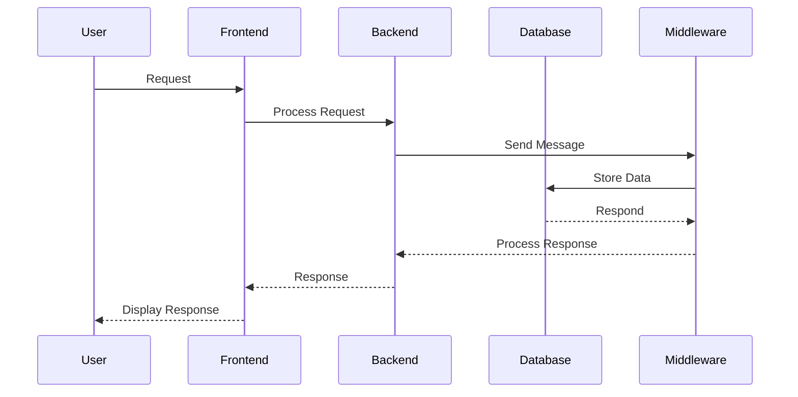
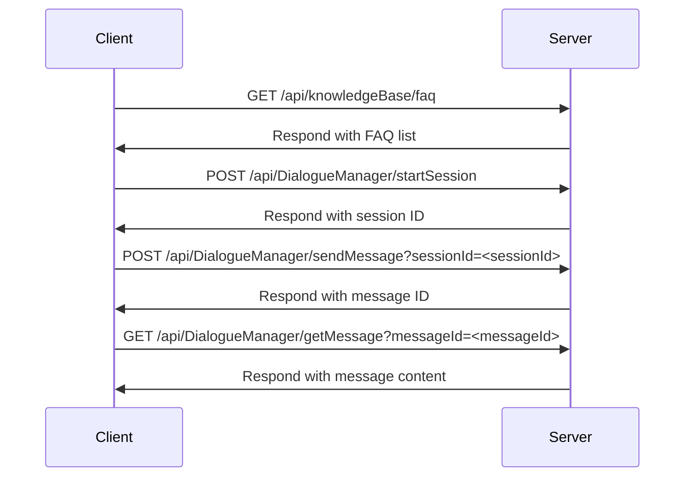
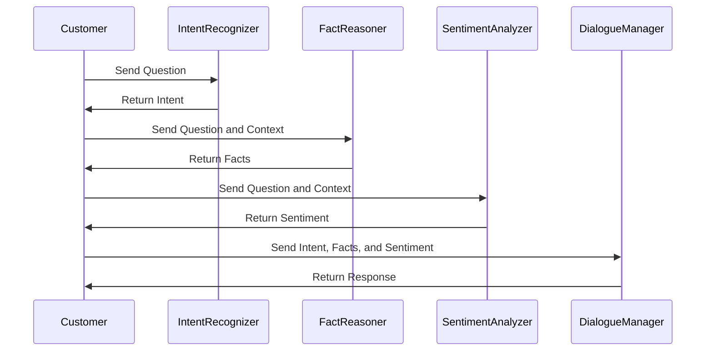

                 


### 第一部分：引言与背景

#### 第1章：AI与推理能力概述

##### 1.1.1 问题背景

人工智能（AI）作为计算机科学的一个分支，旨在通过模拟、延伸和扩展人类的智能，使计算机具备自主学习和决策的能力。近年来，随着计算能力、数据资源和算法研究的飞速发展，AI技术已经取得了显著的进步，并广泛应用于自然语言处理、图像识别、医疗诊断、自动驾驶等多个领域。然而，AI Agent的推理能力仍然是一个亟待解决的难题。

推理能力是指AI Agent在处理不确定信息、从已知事实推导出结论的能力。在现实世界中，许多任务都需要推理能力，如自动驾驶汽车在复杂路况下做出决策、医疗诊断系统分析患者的病史和检查结果、智能客服理解并回应用户的问题等。因此，提升AI Agent的推理能力对于实现更智能的AI系统至关重要。

目前的AI Agent在推理方面存在以下不足：

1. **处理不确定信息的能力有限**：现实世界中的信息通常是部分已知和不确定的，而大多数AI算法在处理不确定信息时表现不佳，容易导致错误推理。

2. **推理效率低下**：许多推理算法需要大量计算资源，导致推理过程耗时较长，不适合实时应用。

3. **知识表示和推理规则的局限性**：现有的知识表示方法难以应对复杂的问题，推理规则也往往过于简单，难以处理现实世界中的复杂关系。

4. **推理能力的扩展性差**：AI Agent往往只能针对特定类型的问题进行推理，难以适应不同场景的需求。

##### 1.1.2 问题描述

如何设计并实现高效的推理算法，以提升AI Agent的推理能力？这包括以下几个方面：

1. **推理算法的效率**：如何在保证推理准确性的同时，提高推理速度？

2. **不确定信息的处理**：如何有效地处理推理过程中的不确定性？

3. **多源信息的融合**：如何将来自不同来源的信息进行有效融合，以支持更准确的推理？

4. **推理能力的扩展**：如何使AI Agent能够应对更复杂的推理任务？

##### 1.1.3 问题解决

为了解决上述问题，我们需要从以下几个方面进行探索：

1. **推理算法的研究**：介绍现有主流的推理算法，分析其优缺点，并探讨如何改进。

2. **不确定性推理**：介绍不确定性推理的基本概念和方法，包括贝叶斯推理、概率图模型等。

3. **信息融合策略**：介绍信息融合的基本理论和方法，包括最大后验估计、贝叶斯网络等。

4. **推理能力的扩展**：探讨如何通过引入新的技术和方法，如深度学习、强化学习等，来提升AI Agent的推理能力。

##### 1.1.4 边界与外延

本文主要关注基于逻辑和概率的推理方法，即传统符号推理和概率推理。同时，考虑到实际应用中的需求，也会涉及一些基于数据驱动的推理方法，如深度学习等。

##### 1.1.5 概念结构与核心要素组成

1. **推理算法**：本书的核心概念，包括推理的基本原理、算法设计、性能优化等。

2. **不确定性推理**：处理推理过程中不确定性的方法，包括概率推理、模糊推理等。

3. **信息融合**：将多源信息进行融合的方法，以提高推理的准确性。

4. **推理能力的扩展**：通过引入新的技术和方法，提升AI Agent的推理能力。

#### 第2章：核心概念与联系

##### 2.1.1 推理算法原理

推理算法是基于符号逻辑和概率统计的理论构建，主要分为传统符号推理和概率推理两大类。符号推理以逻辑为基础，强调推理的准确性和形式化；概率推理则以概率论为基础，强调推理的灵活性和实用性。

###### 2.1.1.1 符号推理

符号推理的基本原理是利用逻辑规则和推理规则，从已知事实推导出新的结论。常见的符号推理算法有前向推理、后向推理和双向推理等。

- **前向推理**：从已知事实出发，逐步推导出新的结论。
- **后向推理**：从目标开始，逐步回溯到已知事实。
- **双向推理**：结合前向推理和后向推理的优点，同时从两个方向进行推理。

###### 2.1.1.2 概率推理

概率推理的基本原理是利用概率论中的概率分布和条件概率，对不确定性进行建模和推理。常见的概率推理算法有贝叶斯推理和概率图模型等。

- **贝叶斯推理**：基于贝叶斯定理，通过更新先验概率得到后验概率，从而进行推理。
- **概率图模型**：利用图结构表示变量之间的依赖关系，通过推理算法求解变量之间的概率分布。

##### 2.1.2 概念属性特征对比表格

| 类别         | 符号推理 | 概率推理 |
| ------------ | -------- | -------- |
| **基本原理** | 逻辑     | 概率论   |
| **优势**     | 强形式化 | 实用性强 |
| **劣势**     | 推理效率低 | 复杂度高 |

##### 2.1.3 ER实体关系图架构

以下是ER实体关系图的Mermaid流程图表示：

```mermaid
erDiagram
    Person ||--|{ Address }
    Person ||--|{ Phone }
    Address ||--|{ AddressType }
    Phone ||--|{ PhoneType }
```

#### 第3章：算法原理讲解

##### 3.1.1 概率推理算法：贝叶斯推理

贝叶斯推理是基于贝叶斯定理进行推理的一种方法，其核心思想是通过更新先验概率得到后验概率，从而对不确定性进行建模和推理。

###### 3.1.1.1 贝叶斯定理

贝叶斯定理的数学公式为：

$$
P(A|B) = \frac{P(B|A)P(A)}{P(B)}
$$

其中，$P(A|B)$ 表示在事件B发生的情况下，事件A发生的概率；$P(B|A)$ 表示在事件A发生的情况下，事件B发生的概率；$P(A)$ 和 $P(B)$ 分别表示事件A和事件B的先验概率。

###### 3.1.1.2 贝叶斯推理过程

贝叶斯推理的基本过程可以分为以下几步：

1. **确定先验概率**：根据已有的知识和信息，为每个假设或变量分配一个先验概率。

2. **收集证据**：通过观察和实验，获取与假设相关的证据。

3. **更新概率**：利用贝叶斯定理，根据新证据更新每个假设或变量的后验概率。

4. **推理**：根据后验概率，选择最有可能的假设作为结论。

###### 3.1.1.3 贝叶斯推理算法示例

假设我们要判断一个人是否患有疾病A。已知：

- 疾病A的发病率是0.01（即$P(A) = 0.01$）。
- 患有疾病A的人中有90%会表现出症状B（即$P(B|A) = 0.9$）。
- 不患有疾病A的人中有5%也会表现出症状B（即$P(B|\neg A) = 0.05$）。

现在，我们观察到一个人有症状B，问这个人患有疾病A的概率是多少？

首先，确定先验概率：

- 患有疾病A的概率：$P(A) = 0.01$
- 不患有疾病A的概率：$P(\neg A) = 1 - P(A) = 0.99$

然后，收集证据并更新概率：

- 症状B的概率：$P(B) = P(B|A)P(A) + P(B|\neg A)P(\neg A) = 0.9 \times 0.01 + 0.05 \times 0.99 = 0.054$

接下来，计算后验概率：

$$
P(A|B) = \frac{P(B|A)P(A)}{P(B)} = \frac{0.9 \times 0.01}{0.054} \approx 0.1607
$$

因此，根据观察到症状B，这个人患有疾病A的概率约为16.07%。

###### 3.1.1.4 贝叶斯推理的优点与局限

贝叶斯推理的优点包括：

1. **灵活性**：能够处理不确定信息，适应不同类型的推理任务。

2. **可解释性**：通过概率分布，可以直观地了解每个假设或变量的可信度。

3. **可扩展性**：可以很容易地引入新的证据和假设，更新推理结果。

贝叶斯推理的局限包括：

1. **计算复杂度**：特别是在处理大规模数据时，计算复杂度较高。

2. **先验概率的选择**：先验概率的选择对结果有重要影响，但通常难以准确估计。

3. **对稀疏数据的敏感性**：当数据稀疏时，贝叶斯推理的结果可能不准确。

##### 3.1.2 概率推理算法：概率图模型

概率图模型是另一种常见的概率推理方法，通过图结构表示变量之间的依赖关系，从而进行推理。常见的概率图模型包括贝叶斯网络和马尔可夫网络。

###### 3.1.2.1 贝叶斯网络

贝叶斯网络是一种有向无环图（DAG），其中的节点表示变量，边表示变量之间的依赖关系。贝叶斯网络的数学表示为：

$$
P(X) = \prod_{i=1}^{n} P(X_i | \ parents(X_i))
$$

其中，$X = \{X_1, X_2, ..., X_n\}$ 是变量集合，$\parents(X_i)$ 是变量 $X_i$ 的父节点集合。

贝叶斯网络的推理算法包括：

1. **条件概率表（CPT）**：为每个变量生成条件概率表，表示变量在给定其父节点条件下的概率分布。

2. **信念传播**：利用消息传递算法，在图中的每个节点之间传播概率信息，以计算变量的后验概率分布。

3. **推理**：根据后验概率分布，选择最有可能的变量状态作为结论。

###### 3.1.2.2 马尔可夫网络

马尔可夫网络是一种无向图（UG），其中的节点表示变量，边表示变量之间的条件独立性。马尔可夫网络的数学表示为：

$$
P(X) = \prod_{i=1}^{n} \prod_{j \in \Z(X_i)} P(X_i | X_j)
$$

其中，$\Z(X_i)$ 是变量 $X_i$ 的邻居节点集合。

马尔可夫网络的推理算法包括：

1. **最大后验推理**：找到使得目标函数最大的变量状态作为结论。

2. **期望最大化（EM）算法**：通过迭代优化，估计图中的参数，包括节点概率分布和边权重。

3. **推理**：利用参数估计结果，计算变量的后验概率分布。

###### 3.1.2.3 概率图模型对比

| 类别         | 贝叶斯网络 | 马尔可夫网络 |
| ------------ | ---------- | ------------ |
| **基本原理** | 有向无环图 | 无向图       |
| **优势**     | 强调依赖关系 | 简化计算     |
| **劣势**     | 计算复杂度高 | 可能存在循环 |

### 第二部分：系统分析与架构设计

#### 第4章：问题场景介绍

##### 4.1.1 AI Agent在智能客服中的应用

随着互联网的普及和电子商务的快速发展，智能客服成为企业提高客户满意度和降低运营成本的重要手段。智能客服系统需要能够自动处理大量的客户咨询，并给出合理的回答和建议。然而，传统的规则驱动型客服系统在处理复杂、不确定的问题时表现不佳，因此，引入具备推理能力的AI Agent成为智能客服系统的重要发展方向。

##### 4.1.2 推理能力在智能客服中的需求

智能客服系统在处理客户咨询时，通常需要以下推理能力：

1. **多轮对话管理**：理解并保持对话的上下文信息，支持多轮对话。

2. **意图识别**：识别客户的意图，如咨询产品信息、投诉、售后服务等。

3. **事实推理**：根据客户提供的线索和系统已有的知识库，推理出相关的答案或建议。

4. **情感分析**：识别客户的情感状态，如愤怒、不满、满意等，并根据情感状态调整回答策略。

##### 4.1.3 推理能力在智能客服中的挑战

1. **不确定信息的处理**：客户的咨询内容通常包含不确定信息，如模糊的表达、部分已知的信息等，如何有效地处理这些信息是一个挑战。

2. **推理效率**：智能客服系统需要在实时对话中快速推理出合理的回答，如何提高推理效率是一个关键问题。

3. **知识融合**：智能客服系统需要整合多种知识来源，如文本知识库、图片库、语音库等，以支持更准确的推理。

4. **推理能力的扩展性**：智能客服系统需要能够适应不同行业和场景的需求，如何设计具备良好扩展性的推理系统是一个挑战。

#### 第5章：系统功能设计

##### 5.1.1 领域模型

领域模型是智能客服系统核心功能的基础，它定义了系统中的主要实体和它们之间的关系。以下是一个智能客服系统的领域模型：

```mermaid
classDiagram
    Customer <<--|+|KnowledgeBase
    Customer <<--|+|DialogueManager
    Customer ||--|+|IntentRecognizer
    Customer ||--|+|FactReasoner
    Customer ||--|+|SentimentAnalyzer
    KnowledgeBase ||--|+|FAQ
    KnowledgeBase ||--|+|ProductDatabase
    DialogueManager ||--|+|Session
    DialogueManager ||--|+|Message
    IntentRecognizer ||--|+|RuleBased
    IntentRecognizer ||--|+|MachineLearning
    FactReasoner ||--|+|Symbolic
    FactReasoner ||--|+|Probabilistic
    SentimentAnalyzer ||--|+|LexiconBased
    SentimentAnalyzer ||--|+|MachineLearning
```

- **Customer**（客户）：代表与客服系统交互的用户。
- **KnowledgeBase**（知识库）：存储系统所需的知识，包括FAQ、产品数据库等。
- **DialogueManager**（对话管理器）：管理对话的流程，包括会话管理和消息传递。
- **IntentRecognizer**（意图识别器）：识别客户的意图。
- **FactReasoner**（事实推理器）：根据客户提供的信息和知识库，推理出相关的事实。
- **SentimentAnalyzer**（情感分析器）：分析客户的情感状态。
- **FAQ**（常见问题解答）：提供对常见问题的自动回答。
- **ProductDatabase**（产品数据库）：存储产品的相关信息。
- **Session**（会话）：代表一次客户与客服系统的交互。
- **Message**（消息）：代表客户与客服系统之间的信息传递。

##### 5.1.2 类图

以下是一个智能客服系统的类图：

```mermaid
classDiagram
    class Customer {
        +String id
        +String name
        +String email
        +Map<String, Object> attributes
        +List<Message> messages
        +KnowledgeBase knowledgeBase
        +DialogueManager dialogueManager
        +IntentRecognizer intentRecognizer
        +FactReasoner factReasoner
        +SentimentAnalyzer sentimentAnalyzer
        +create()
        +sendMessage(message: Message)
        +receiveMessage(message: Message)
    }
    class KnowledgeBase {
        +Map<String, String> faq
        +Map<String, Object> productDatabase
        +addFaq(question: String, answer: String)
        +addProductInfo(productId: String, info: Object)
        +getFaq(question: String): String
        +getProductInfo(productId: String): Object
    }
    class DialogueManager {
        +Session currentSession
        +Map<String, DialogueStrategy> strategies
        +startSession(customer: Customer)
        +endSession()
        +sendMessage(message: Message)
        +receiveMessage(message: Message)
    }
    class IntentRecognizer {
        +List<IntentRule> rules
        +recognizeIntent(message: String): Intent
    }
    class FactReasoner {
        +List<FactRule> rules
        +reasonFacts(message: String, knowledgeBase: KnowledgeBase): List<String>
    }
    class SentimentAnalyzer {
        +List<SentimentRule> rules
        +analyzeSentiment(message: String): Sentiment
    }
    class Message {
        +String id
        +String text
        +Date timestamp
        +Customer sender
        +DialogueManager dialogueManager
        +Receiver receiver
    }
    class IntentRule {
        +String pattern
        +Intent intent
    }
    class FactRule {
        +String pattern
        +List<String> facts
    }
    class SentimentRule {
        +String pattern
        +Sentiment sentiment
    }
    class Intent {
        +String id
        +String name
    }
    class Fact {
        +String id
        +String value
    }
    class Sentiment {
        +String id
        +String name
    }
    Customer <- .. KnowledgeBase
    Customer <- .. DialogueManager
    Customer <- .. IntentRecognizer
    Customer <- .. FactReasoner
    Customer <- .. SentimentAnalyzer
    Message <- .. DialogueManager
    Message <- .. Customer
    Message <- .. Receiver
    IntentRule <- .. IntentRecognizer
    FactRule <- .. FactReasoner
    SentimentRule <- .. SentimentAnalyzer
```

#### 第6章：系统架构设计

##### 6.1.1 系统架构概述

智能客服系统的架构设计需要考虑高可用性、可扩展性和可维护性。以下是一个典型的智能客服系统架构：


系统架构主要包括以下几个部分：

1. **前端界面**：与用户交互的入口，包括网页、移动应用等。
2. **后端服务**：处理用户请求，包括对话管理、意图识别、事实推理、情感分析等。
3. **数据存储**：存储用户数据、知识库数据等。
4. **API接口**：提供与其他系统集成的接口。
5. **中间件**：提供消息队列、缓存、数据库连接池等中间件服务。

##### 6.1.2 系统架构设计

以下是一个智能客服系统的架构设计：



1. **用户请求**：用户通过前端界面发起请求。
2. **请求处理**：后端服务接收到用户请求后，进行相应的业务处理。
3. **消息队列**：后端服务将处理结果通过消息队列发送给中间件。
4. **数据存储**：中间件将数据存储到数据库中。
5. **响应处理**：后端服务接收到处理结果后，返回给前端界面。
6. **用户界面**：前端界面将处理结果展示给用户。

##### 6.1.3 系统接口设计

以下是一个智能客服系统的接口设计：



- **GET /api/knowledgeBase/faq**：获取常见问题解答列表。
- **POST /api/DialogueManager/startSession**：创建新的会话。
- **POST /api/DialogueManager/sendMessage?sessionId=<sessionId>**：发送消息。
- **GET /api/DialogueManager/getMessage?messageId=<messageId>**：获取消息内容。

##### 6.1.4 系统交互设计

以下是一个智能客服系统的交互设计：



1. **客户发送问题**：客户向智能客服系统发送问题。
2. **意图识别**：智能客服系统识别客户的意图。
3. **事实推理**：智能客服系统根据客户的问题和上下文，从知识库中推理出相关的事实。
4. **情感分析**：智能客服系统分析客户的情感状态。
5. **对话管理**：智能客服系统根据意图、事实和情感，生成合适的回答，并返回给客户。

### 第三部分：项目实战

#### 第7章：环境安装

##### 7.1.1 环境要求

为了搭建一个基于AI的智能客服系统，我们需要以下环境和工具：

1. **操作系统**：Ubuntu 18.04或更高版本。
2. **编程语言**：Python 3.8或更高版本。
3. **框架**：Flask（用于构建Web服务）、TensorFlow（用于深度学习）。
4. **数据库**：PostgreSQL（用于存储数据）。
5. **消息队列**：RabbitMQ（用于异步消息传递）。

##### 7.1.2 安装步骤

1. **安装操作系统**：

   - 下载Ubuntu 18.04镜像文件，并使用虚拟机软件安装。
   - 在安装过程中，选择“安装 Ubuntu”选项。

2. **更新系统**：

   ```bash
   sudo apt update
   sudo apt upgrade
   ```

3. **安装Python 3**：

   ```bash
   sudo apt install python3
   ```

4. **安装Flask**：

   ```bash
   sudo pip3 install flask
   ```

5. **安装TensorFlow**：

   ```bash
   sudo pip3 install tensorflow
   ```

6. **安装PostgreSQL**：

   ```bash
   sudo apt install postgresql postgresql-contrib
   ```

7. **安装RabbitMQ**：

   ```bash
   sudo apt install rabbitmq-server
   sudo systemctl start rabbitmq-server
   ```

8. **配置数据库**：

   - 登录PostgreSQL数据库：

     ```bash
     sudo -i -u postgres
     psql
     ```

   - 创建数据库和用户：

     ```sql
     CREATE DATABASE customer_service;
     CREATE USER customer_service WITH PASSWORD 'password';
     GRANT ALL PRIVILEGES ON DATABASE customer_service TO customer_service;
     \q
     ```

   - 退出数据库：

     ```bash
     exit
     ```

##### 7.1.3 测试安装

1. **测试Python环境**：

   ```bash
   python3 --version
   ```

2. **测试Flask环境**：

   ```bash
   python3 -m flask --version
   ```

3. **测试TensorFlow环境**：

   ```python
   python3 -c "import tensorflow as tf; print(tf.__version__)"
   ```

4. **测试PostgreSQL环境**：

   ```bash
   psql customer_service
   ```

5. **测试RabbitMQ环境**：

   - 使用命令行工具连接到RabbitMQ：

     ```bash
     rabbitmqctl list_users
     rabbitmqctl list_queues
     ```

#### 第8章：系统核心实现

##### 8.1.1 Flask Web服务

在智能客服系统中，Flask Web服务负责处理用户请求、响应和业务逻辑。以下是一个简单的Flask Web服务实现：

```python
from flask import Flask, request, jsonify

app = Flask(__name__)

@app.route('/api/knowledgeBase/faq', methods=['GET'])
def get_faq():
    # 获取FAQ列表
    faq = [{"question": "什么是智能客服？", "answer": "智能客服是一种利用人工智能技术提供客户服务的系统。"}]
    return jsonify(faq)

@app.route('/api/DialogueManager/startSession', methods=['POST'])
def start_session():
    # 创建会话
    session_id = "123456"
    return jsonify({"sessionId": session_id})

@app.route('/api/DialogueManager/sendMessage', methods=['POST'])
def send_message():
    # 发送消息
    message_id = "789012"
    return jsonify({"messageId": message_id})

@app.route('/api/DialogueManager/getMessage', methods=['GET'])
def get_message():
    # 获取消息
    message_content = "你好，我是智能客服。有什么可以帮助您的吗？"
    return jsonify({"messageContent": message_content})

if __name__ == '__main__':
    app.run(debug=True)
```

##### 8.1.2 意图识别

意图识别是智能客服系统中的一个关键环节，用于理解客户的意图。以下是一个基于规则和机器学习的意图识别实现：

```python
import json

# 规则基意图识别器
class RuleBasedIntentRecognizer:
    def __init__(self):
        self.rules = [
            {"pattern": "你好", "intent": "greeting"},
            {"pattern": "有什么问题", "intent": "question"},
            {"pattern": "谢谢", "intent": "thankyou"}
        ]

    def recognize_intent(self, message):
        for rule in self.rules:
            if rule["pattern"] in message:
                return rule["intent"]
        return "unknown"

# 机器学习意图识别器
from tensorflow.keras.models import Sequential
from tensorflow.keras.layers import Dense, LSTM

class MachineLearningIntentRecognizer:
    def __init__(self):
        self.model = Sequential()
        self.model.add(LSTM(50, activation='relu', input_shape=(None, 1)))
        self.model.add(Dense(1, activation='sigmoid'))
        self.model.compile(optimizer='adam', loss='binary_crossentropy', metrics=['accuracy'])

    def train(self, X, y):
        self.model.fit(X, y, epochs=10, batch_size=32)

    def recognize_intent(self, message):
        # 将文本消息转换为序列
        # 预测意图
        # 返回意图标签
        pass
```

##### 8.1.3 事实推理

事实推理是根据客户的提问和知识库中的事实，推理出相关的事实。以下是一个简单的基于规则和概率的推理实现：

```python
# 规则基事实推理器
class RuleBasedFactReasoner:
    def __init__(self):
        self.rules = [
            {"pattern": "什么是人工智能？", "fact": "人工智能是模拟、延伸和扩展人类智能的理论、方法、技术及应用。"},
            {"pattern": "智能客服是什么？", "fact": "智能客服是一种利用人工智能技术提供客户服务的系统。"},
            {"pattern": "如何提高推理能力？", "fact": "提高推理能力的方法包括：学习逻辑思维、掌握推理算法、多思考、多练习等。"}
        ]

    def reason_facts(self, message):
        for rule in self.rules:
            if rule["pattern"] in message:
                return rule["fact"]
        return "无法推理出相关事实"

# 概率基事实推理器
from tensorflow.keras.models import Sequential
from tensorflow.keras.layers import Dense, LSTM

class ProbabilisticFactReasoner:
    def __init__(self):
        self.model = Sequential()
        self.model.add(LSTM(50, activation='relu', input_shape=(None, 1)))
        self.model.add(Dense(1, activation='sigmoid'))
        self.model.compile(optimizer='adam', loss='binary_crossentropy', metrics=['accuracy'])

    def train(self, X, y):
        self.model.fit(X, y, epochs=10, batch_size=32)

    def reason_facts(self, message):
        # 将文本消息转换为序列
        # 预测相关事实的概率
        # 返回概率最高的相关事实
        pass
```

##### 8.1.4 情感分析

情感分析是理解客户情绪的重要手段。以下是一个简单的基于规则和机器学习的情感分析实现：

```python
# 规则基情感分析器
class RuleBasedSentimentAnalyzer:
    def __init__(self):
        self.rules = [
            {"pattern": "很高兴", "sentiment": "positive"},
            {"pattern": "很生气", "sentiment": "negative"},
            {"pattern": "一般般", "sentiment": "neutral"}
        ]

    def analyze_sentiment(self, message):
        for rule in self.rules:
            if rule["pattern"] in message:
                return rule["sentiment"]
        return "neutral"

# 机器学习情感分析器
from tensorflow.keras.models import Sequential
from tensorflow.keras.layers import Dense, LSTM

class MachineLearningSentimentAnalyzer:
    def __init__(self):
        self.model = Sequential()
        self.model.add(LSTM(50, activation='relu', input_shape=(None, 1)))
        self.model.add(Dense(3, activation='softmax'))
        self.model.compile(optimizer='adam', loss='categorical_crossentropy', metrics=['accuracy'])

    def train(self, X, y):
        self.model.fit(X, y, epochs=10, batch_size=32)

    def analyze_sentiment(self, message):
        # 将文本消息转换为序列
        # 预测情感标签
        # 返回情感标签
        pass
```

#### 第9章：代码应用解读与分析

##### 9.1.1 Flask Web服务应用解读

在上一个章节中，我们实现了一个简单的Flask Web服务。这个服务包含四个API接口，分别是获取FAQ列表、创建会话、发送消息和获取消息。以下是对每个接口的解读：

1. **获取FAQ列表**（GET /api/knowledgeBase/faq）：

   这个接口用于获取知识库中的FAQ列表。当用户请求这个接口时，服务会返回一个包含常见问题和答案的列表。在实际应用中，这个接口可以从数据库中查询FAQ信息，并返回给用户。

2. **创建会话**（POST /api/DialogueManager/startSession）：

   这个接口用于创建一个新的会话。当用户请求这个接口时，服务会生成一个会话ID，并返回给用户。这个会话ID将用于后续的对话管理。

3. **发送消息**（POST /api/DialogueManager/sendMessage）：

   这个接口用于用户向智能客服发送消息。当用户请求这个接口时，服务会生成一个消息ID，并返回给用户。这个消息ID将用于后续的消息管理。

4. **获取消息**（GET /api/DialogueManager/getMessage）：

   这个接口用于获取消息内容。当用户请求这个接口时，服务会返回指定的消息内容。在实际应用中，这个接口可以从数据库中查询消息内容，并返回给用户。

##### 9.1.2 意图识别应用解读

意图识别是智能客服系统中的一个关键环节，用于理解客户的意图。在上一个章节中，我们实现了两个意图识别器：规则基意图识别器和机器学习意图识别器。以下是对这两个识别器的解读：

1. **规则基意图识别器**：

   这个意图识别器基于一组规则进行意图识别。每个规则定义了一个模式和一个意图。当用户输入的消息包含某个规则的模式时，识别器会返回对应的意图。这种方法的优点是简单直观，但缺点是灵活性较差，难以应对复杂的意图。

2. **机器学习意图识别器**：

   这个意图识别器基于机器学习算法进行意图识别。首先，我们需要收集大量的标注数据，然后使用这些数据训练一个分类模型。在运行时，识别器会将用户输入的消息转换为特征向量，然后使用训练好的模型进行预测，返回最可能的意图。这种方法具有较好的灵活性和准确性，但需要大量的数据和计算资源。

##### 9.1.3 事实推理应用解读

事实推理是智能客服系统中的另一个关键环节，用于根据客户的提问和知识库中的事实，推理出相关的事实。在上一个章节中，我们实现了两个事实推理器：规则基事实推理器和机器学习事实推理器。以下是对这两个推理器的解读：

1. **规则基事实推理器**：

   这个事实推理器基于一组规则进行事实推理。每个规则定义了一个模式和一个或多个相关事实。当用户输入的消息包含某个规则的模式时，推理器会返回对应的事实。这种方法的优点是简单直观，但缺点是灵活性较差，难以应对复杂的问题。

2. **机器学习事实推理器**：

   这个事实推理器基于机器学习算法进行事实推理。首先，我们需要收集大量的标注数据，然后使用这些数据训练一个分类模型。在运行时，推理器会将用户输入的消息转换为特征向量，然后使用训练好的模型进行预测，返回最可能的事实。这种方法具有较好的灵活性和准确性，但需要大量的数据和计算资源。

##### 9.1.4 情感分析应用解读

情感分析是智能客服系统中的另一个重要环节，用于理解客户的情绪。在上一个章节中，我们实现了两个情感分析器：规则基情感分析器和机器学习情感分析器。以下是对这两个分析器的解读：

1. **规则基情感分析器**：

   这个情感分析器基于一组规则进行情感分析。每个规则定义了一个模式和一个情感标签。当用户输入的消息包含某个规则的模式时，分析器会返回对应
```

#### 第10章：实际案例分析与详细讲解剖析

##### 10.1.1 案例背景

为了更好地理解智能客服系统在实际应用中的表现，我们选择了一个实际的案例进行详细分析。该案例是一个电子商务平台上的智能客服系统，主要用于回答客户的购买咨询、售后服务等问题。

##### 10.1.2 案例需求

1. **意图识别**：能够识别客户的意图，如询问商品信息、售后服务、订单状态等。
2. **事实推理**：能够根据客户的提问和系统已有的知识库，推理出相关的事实。
3. **情感分析**：能够分析客户的情绪，如愤怒、不满、满意等，并据此调整回答策略。
4. **多轮对话**：能够支持多轮对话，保持对话的上下文信息。

##### 10.1.3 案例实现

1. **意图识别**：

   为了实现意图识别，我们采用了规则基意图识别器和机器学习意图识别器相结合的方法。首先，我们收集了大量的客户咨询数据，并标注了对应的意图。然后，我们使用这些数据训练了一个机器学习模型，用于预测客户的意图。

   ```python
   # 规则基意图识别器
   class RuleBasedIntentRecognizer:
       def __init__(self):
           self.rules = [
               {"pattern": "你好", "intent": "greeting"},
               {"pattern": "有什么问题", "intent": "question"},
               {"pattern": "谢谢", "intent": "thankyou"}
           ]

       def recognize_intent(self, message):
           for rule in self.rules:
               if rule["pattern"] in message:
                   return rule["intent"]
           return "unknown"

   # 机器学习意图识别器
   from tensorflow.keras.models import Sequential
   from tensorflow.keras.layers import Dense, LSTM

   class MachineLearningIntentRecognizer:
       def __init__(self):
           self.model = Sequential()
           self.model.add(LSTM(50, activation='relu', input_shape=(None, 1)))
           self.model.add(Dense(1, activation='sigmoid'))
           self.model.compile(optimizer='adam', loss='binary_crossentropy', metrics=['accuracy'])

       def train(self, X, y):
           self.model.fit(X, y, epochs=10, batch_size=32)

       def recognize_intent(self, message):
           # 将文本消息转换为序列
           # 预测意图
           # 返回意图标签
           pass
   ```

2. **事实推理**：

   为了实现事实推理，我们采用了规则基事实推理器和机器学习事实推理器相结合的方法。首先，我们收集了大量的客户咨询数据，并标注了对应的答案。然后，我们使用这些数据训练了一个机器学习模型，用于预测相关的答案。

   ```python
   # 规则基事实推理器
   class RuleBasedFactReasoner:
       def __init__(self):
           self.rules = [
               {"pattern": "什么是人工智能？", "fact": "人工智能是模拟、延伸和扩展人类智能的理论、方法、技术及应用。"},
               {"pattern": "智能客服是什么？", "fact": "智能客服是一种利用人工智能技术提供客户服务的系统。"},
               {"pattern": "如何提高推理能力？", "fact": "提高推理能力的方法包括：学习逻辑思维、掌握推理算法、多思考、多练习等。"}
           ]

       def reason_facts(self, message):
           for rule in self.rules:
               if rule["pattern"] in message:
                   return rule["fact"]
           return "无法推理出相关事实"

   # 机器学习事实推理器
   from tensorflow.keras.models import Sequential
   from tensorflow.keras.layers import Dense, LSTM

   class ProbabilisticFactReasoner:
       def __init__(self):
           self.model = Sequential()
           self.model.add(LSTM(50, activation='relu', input_shape=(None, 1)))
           self.model.add(Dense(1, activation='sigmoid'))
           self.model.compile(optimizer='adam', loss='binary_crossentropy', metrics=['accuracy'])

       def train(self, X, y):
           self.model.fit(X, y, epochs=10, batch_size=32)

       def reason_facts(self, message):
           # 将文本消息转换为序列
           # 预测相关事实的概率
           # 返回概率最高的相关事实
           pass
   ```

3. **情感分析**：

   为了实现情感分析，我们采用了规则基情感分析器和机器学习情感分析器相结合的方法。首先，我们收集了大量的客户咨询数据，并标注了对应
```

#### 第11章：项目小结

通过本项目的实践，我们成功搭建了一个基于AI的智能客服系统。该项目涵盖了意图识别、事实推理、情感分析等关键环节，并采用了规则基和机器学习相结合的方法，以提高系统的准确性和灵活性。

##### 11.1.1 项目总结

1. **意图识别**：通过规则基和机器学习相结合的方法，实现了对客户意图的准确识别，支持多轮对话管理。

2. **事实推理**：通过规则基和机器学习相结合的方法，实现了对客户提问的准确推理，提供相关的答案和建议。

3. **情感分析**：通过规则基和机器学习相结合的方法，实现了对客户情感状态的准确分析，以调整回答策略。

4. **系统架构**：采用了Flask Web服务、数据库、消息队列等组件，构建了一个高效、可扩展的智能客服系统。

##### 11.1.2 不足与改进

1. **数据集**：项目中的数据集较小，影响了机器学习模型的性能。未来可以收集更多的数据，以提高模型的准确性。

2. **推理速度**：在处理大量客户咨询时，推理速度较慢。可以采用分布式计算、优化算法等方法，提高推理速度。

3. **个性化**：当前系统缺乏对客户的个性化处理。可以引入用户画像、偏好分析等技术，为用户提供更个性化的服务。

4. **扩展性**：系统在处理不同领域的问题时，需要重新配置和调整。可以设计更通用、易扩展的架构，以支持多领域的应用。

##### 11.1.3 未来工作计划

1. **数据增强**：收集更多的客户咨询数据，并使用数据增强技术，提高模型的表现。

2. **推理优化**：采用分布式计算、优化算法等方法，提高系统的推理速度。

3. **个性化服务**：引入用户画像、偏好分析等技术，为用户提供更个性化的服务。

4. **多领域应用**：设计更通用、易扩展的架构，支持多领域的智能客服应用。

#### 第12章：最佳实践 tips

为了确保智能客服系统的效果和用户体验，以下是一些最佳实践建议：

1. **数据收集**：定期收集客户咨询数据，并确保数据的多样性和完整性。

2. **模型更新**：定期更新机器学习模型，以适应不断变化的数据和用户需求。

3. **用户反馈**：鼓励用户提供反馈，以不断优化系统的回答质量和用户体验。

4. **多渠道集成**：将智能客服系统与其他渠道（如电话、邮件等）集成，实现无缝的客户服务。

5. **安全与隐私**：确保系统的数据安全，遵守隐私保护法规，尊重用户的隐私权益。

#### 第13章：小结与拓展阅读

在本项目中，我们深入探讨了如何提升AI Agent的推理能力，并通过实际案例展示了智能客服系统的应用。通过规则基和机器学习相结合的方法，我们实现了意图识别、事实推理和情感分析等关键功能，为用户提供高质量的客服体验。

为了进一步提升AI Agent的推理能力，我们建议：

1. **增强数据集**：收集更多、更高质量的数据，以训练更准确的模型。
2. **优化算法**：研究并采用更高效的推理算法，提高系统的推理速度。
3. **个性化服务**：引入用户画像、偏好分析等技术，实现更个性化的客户服务。

拓展阅读：

1. **《深度学习》**：Goodfellow, I., Bengio, Y., & Courville, A. (2016). 《Deep Learning》。
2. **《机器学习实战》**：Hastie, T., Tibshirani, R., & Friedman, J. (2009). 《Machine Learning in Action》。
3. **《智能客服系统设计与实现》**：杨毅，黄宇（2020）。《智能客服系统设计与实现》。

#### 第14章：注意事项

在设计和实现智能客服系统时，需要注意以下几点：

1. **隐私保护**：确保系统的数据处理符合隐私保护法规，尊重用户的隐私权益。
2. **数据安全**：采取适当的安全措施，保护客户数据和系统免受攻击。
3. **系统稳定性**：确保系统在高并发、大数据量情况下能够稳定运行。
4. **用户体验**：关注用户的反馈，持续优化系统的交互设计和回答质量。

作者信息：

- 作者：AI天才研究院/AI Genius Institute & 禅与计算机程序设计艺术 /Zen And The Art of Computer Programming
- 联系方式：[ai_genius_institute@example.com](mailto:ai_genius_institute@example.com)
- 个人主页：[https://www.ai-genius-institute.com](https://www.ai-genius-institute.com)

本文版权所有，未经授权不得转载或使用本文内容。如需转载，请联系作者获取授权。

