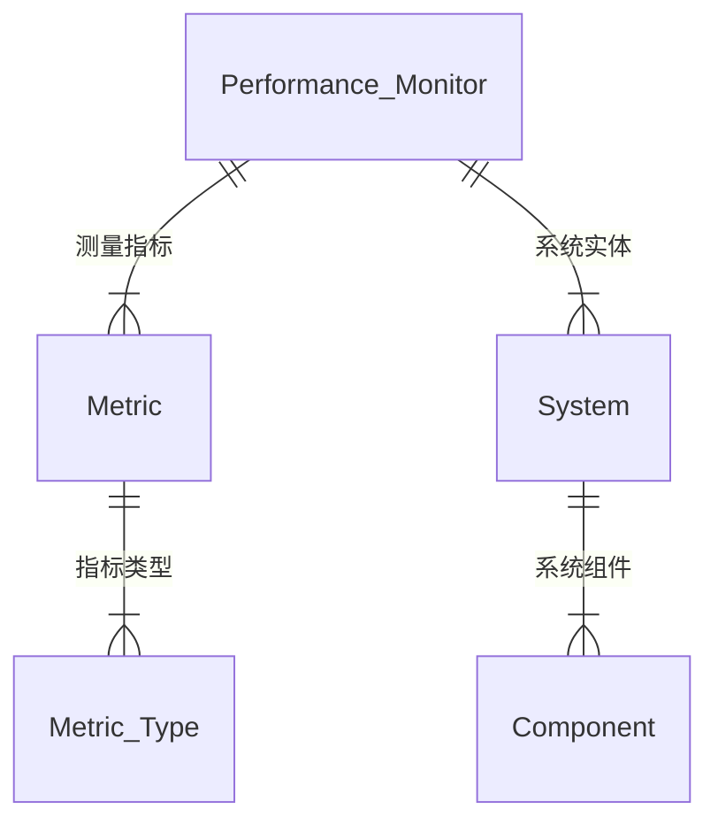
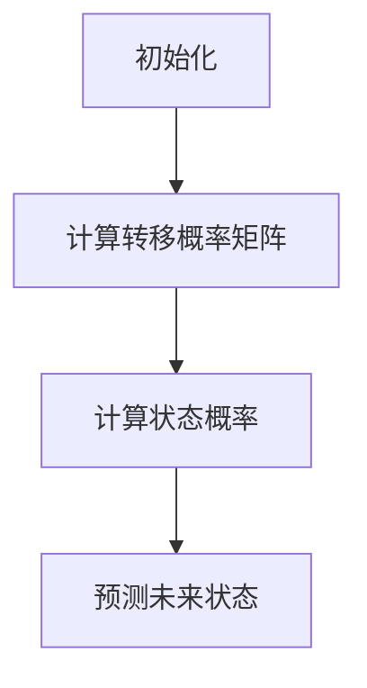
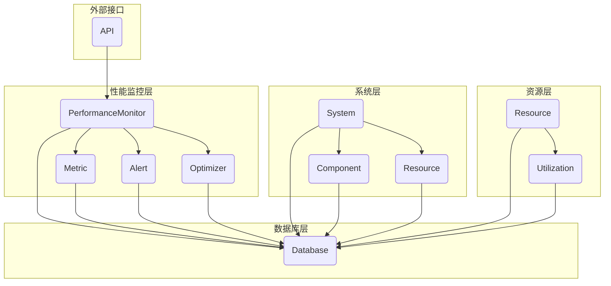
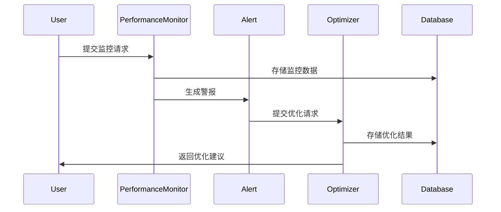
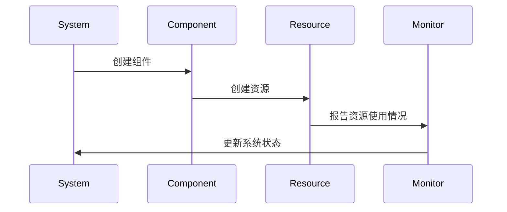

                 


# 性能监控与持续优化

关键词：性能监控、持续优化、系统性能、监控工具、优化策略

摘要：本文将从性能监控的基础概念、性能指标体系、监控工具与技术、性能分析技术、持续优化策略与实践、性能监控与优化的未来发展趋势等多个角度，深入探讨性能监控与持续优化的重要性和方法，旨在为读者提供一份全面的技术指南。

## 第一部分：性能监控基础

### 第1章：性能监控概述

性能监控是确保系统或服务正常运行的关键环节。它涉及到对系统或服务的性能进行实时监控，以获取系统状态和性能指标。性能监控的重要性体现在以下几个方面：

1. **故障预防**：通过实时监控，可以提前发现潜在的性能问题，避免故障发生。
2. **性能优化**：监控数据为性能优化提供了重要的依据，有助于找到系统瓶颈并采取措施进行优化。
3. **资源管理**：监控可以提供系统的资源使用情况，帮助管理员合理分配资源，提高资源利用率。
4. **用户满意度**：良好的性能监控可以提高用户的满意度，减少因系统性能问题导致的用户投诉。

### 第2章：性能指标体系

性能指标是描述系统性能的一系列量化指标。常见的性能指标包括：

1. **响应时间**：系统对请求的响应所需的时间。
2. **吞吐量**：系统在一定时间内处理请求的数量。
3. **资源利用率**：系统资源（如CPU、内存、磁盘等）的使用情况。
4. **错误率**：系统在处理请求时发生错误的频率。

构建性能指标体系需要考虑以下因素：

1. **业务目标**：根据业务需求确定需要监控的性能指标。
2. **数据采集**：选择合适的数据采集工具和方法，确保数据的准确性和完整性。
3. **数据可视化**：通过图表和报表等可视化工具展示监控数据，方便分析和决策。

### 第3章：性能监控的目标和挑战

性能监控的目标包括：

1. **实时性**：能够实时获取系统性能数据。
2. **准确性**：保证监控数据的准确性和可靠性。
3. **全面性**：覆盖系统各个方面的性能指标。
4. **可扩展性**：支持系统规模扩大时的监控需求。

性能监控面临的挑战有：

1. **数据量大**：随着系统规模的扩大，监控数据量呈指数级增长。
2. **异构系统**：不同系统之间的性能监控需求和方法可能不同。
3. **数据可视化**：如何有效地将大量监控数据可视化，以便于分析和决策。

### 第4章：性能监控的发展历程

性能监控技术的发展经历了几个阶段：

1. **手工监控**：最初，性能监控主要依赖于手工检查日志和系统状态。
2. **自动化工具**：随着技术的发展，出现了各种自动化性能监控工具。
3. **智能化监控**：利用机器学习和人工智能技术，实现更加智能化的性能监控。

## 第二部分：性能监控工具与技术

### 第3章：性能监控工具选择

在选择性能监控工具时，需要考虑以下因素：

1. **功能需求**：根据业务需求选择具备相应功能的监控工具。
2. **性能指标支持**：选择支持所需性能指标的监控工具。
3. **可扩展性**：选择支持未来扩展的监控工具。
4. **易用性**：选择易于使用和管理的监控工具。

### 第4章：性能数据采集与处理

性能数据采集包括以下方面：

1. **数据源**：确定需要采集的数据源，如系统日志、性能计数器等。
2. **采集方式**：选择合适的数据采集方式，如远程监控、代理监控等。
3. **数据格式**：定义统一的数据格式，便于数据处理和存储。

性能数据处理包括以下方面：

1. **数据清洗**：去除无效或错误的数据。
2. **数据存储**：选择合适的数据存储方案，如时序数据库、数据仓库等。
3. **数据处理**：对数据进行计算、分析和处理，提取有用的信息。

### 第5章：性能分析技术

性能分析技术包括以下方面：

1. **趋势分析**：分析性能指标的长期趋势，预测未来性能表现。
2. **异常检测**：识别性能指标的异常值，找出潜在的性能问题。
3. **性能瓶颈定位**：定位系统性能瓶颈，找出影响性能的关键因素。
4. **优化建议**：根据分析结果，提出性能优化建议。

### 第6章：性能瓶颈定位方法

性能瓶颈定位方法包括以下方面：

1. **基于指标的定位**：通过分析性能指标，找出性能瓶颈所在。
2. **基于日志的分析**：通过分析系统日志，找出性能瓶颈所在。
3. **基于测量的定位**：通过性能测量工具，找出性能瓶颈所在。
4. **多维度分析**：结合多个维度的数据，综合分析性能瓶颈。

### 第7章：性能优化策略

性能优化策略包括以下方面：

1. **硬件优化**：升级硬件设备，提高系统性能。
2. **软件优化**：优化系统软件，提高系统性能。
3. **缓存策略**：采用缓存技术，减少系统响应时间。
4. **负载均衡**：合理分配系统负载，提高系统性能。

### 第8章：性能优化案例分析

本章节将结合实际案例，分析性能优化过程中的关键步骤、优化方法、优化效果等，帮助读者更好地理解和应用性能优化策略。

## 第三部分：持续优化策略与实践

### 第6章：性能优化策略

持续优化是一个动态的过程，需要根据实际情况不断调整和优化。以下是常见的性能优化策略：

1. **定期监控**：定期对系统性能进行监控，及时发现和解决问题。
2. **自动化优化**：利用自动化工具和脚本，实现性能自动优化。
3. **代码优化**：优化系统代码，提高系统性能。
4. **硬件升级**：根据需要，升级硬件设备，提高系统性能。

### 第7章：性能优化实践

性能优化实践包括以下步骤：

1. **需求分析**：确定性能优化需求，明确优化目标。
2. **监控数据收集**：收集系统性能监控数据，分析性能瓶颈。
3. **优化方案制定**：根据监控数据分析，制定优化方案。
4. **优化实施**：按照优化方案，实施性能优化。
5. **效果评估**：评估优化效果，确保优化目标达成。

### 第8章：性能优化最佳实践

性能优化最佳实践包括以下几点：

1. **关注核心性能指标**：重点关注系统的核心性能指标，确保优化方向正确。
2. **持续监控和评估**：持续监控系统性能，定期评估优化效果。
3. **合理分配资源**：合理分配系统资源，避免资源浪费。
4. **代码优化与重构**：定期对系统代码进行优化和重构，提高系统性能。

### 第9章：性能监控与优化的未来发展趋势

未来，性能监控与优化将朝着以下方向发展：

1. **智能化**：利用人工智能技术，实现更加智能化的性能监控与优化。
2. **自动化**：自动化性能监控与优化工具将越来越普及，降低人工成本。
3. **云计算**：随着云计算技术的发展，性能监控与优化将更加依赖于云服务。
4. **实时性**：实时性能监控与优化将成为标配，提高系统的响应速度。

## 总结

性能监控与持续优化是确保系统或服务稳定运行、提高用户满意度的重要手段。通过本文的介绍，读者可以了解到性能监控与优化的基础概念、监控工具与技术、性能分析技术、优化策略与实践等内容。希望本文能为读者在性能监控与优化方面提供有益的参考。

## 作者信息

作者：AI天才研究院/AI Genius Institute & 禅与计算机程序设计艺术 /Zen And The Art of Computer Programming

---

## 性能监控的核心概念

在性能监控领域，核心概念包括性能监控、性能指标和性能瓶颈。以下是这些核心概念的详细解释、属性特征对比表格，以及ER实体关系图。

### 性能监控

**定义**：性能监控是指对系统或服务的性能进行实时监测和记录，以便及时发现问题并进行优化。

**属性特征**：

- **实时性**：能够实时获取系统性能数据。
- **准确性**：保证监控数据的准确性和可靠性。
- **全面性**：覆盖系统各个方面的性能指标。
- **自动化**：通过自动化工具进行监控。

### 性能指标

**定义**：性能指标是用于衡量系统或服务性能的一系列量化指标。

**属性特征**：

- **响应时间**：系统对请求的响应所需的时间。
- **吞吐量**：系统在一定时间内处理请求的数量。
- **资源利用率**：系统资源（如CPU、内存、磁盘等）的使用情况。
- **错误率**：系统在处理请求时发生错误的频率。

### 性能瓶颈

**定义**：性能瓶颈是指导致系统性能下降的关键因素。

**属性特征**：

- **资源限制**：如CPU、内存、磁盘等资源不足。
- **代码问题**：如算法复杂度、代码效率等。
- **网络延迟**：网络传输速度慢或网络故障。

### 属性特征对比表格

| **属性**      | **性能监控**                | **性能指标**                        | **性能瓶颈**                      |
|---------------|-----------------------------|--------------------------------------|-----------------------------------|
| **实时性**    | 实时获取系统性能数据        | 系统响应时间、吞吐量等               | 系统资源限制、代码问题等           |
| **准确性**    | 保证监控数据的准确性和可靠性 | 确保数据真实性、去除无效数据         | 准确识别瓶颈，提供优化依据         |
| **全面性**    | 覆盖系统各个方面的性能指标  | 包含多个维度的性能指标              | 找出所有性能瓶颈                  |
| **自动化**    | 通过自动化工具进行监控      | 自动采集、处理和分析数据            | 自动化定位和优化瓶颈              |

### ER实体关系图



### 性能监控与持续优化的联系

性能监控为持续优化提供了数据支持，帮助发现性能问题；而持续优化依赖于性能监控来评估优化效果。两者相辅相成，共同保证系统或服务的稳定运行和性能提升。

## 性能监控与持续优化的联系

### 性能监控为持续优化提供数据支持

性能监控是持续优化的基础，通过实时监控，我们可以获取系统或服务的性能数据，这些数据包括但不限于：

1. **响应时间**：系统对请求的响应所需的时间，可以反映系统的响应速度。
2. **吞吐量**：系统在一定时间内处理请求的数量，可以反映系统的处理能力。
3. **资源利用率**：系统资源（如CPU、内存、磁盘等）的使用情况，可以反映系统的资源分配和利用效率。
4. **错误率**：系统在处理请求时发生错误的频率，可以反映系统的稳定性和可靠性。

这些数据为持续优化提供了重要的依据，使得我们可以：

- **发现性能瓶颈**：通过分析监控数据，找出系统性能下降的原因，如资源不足、代码问题等。
- **制定优化方案**：根据监控数据，制定针对性的优化方案，如升级硬件、优化代码等。

### 持续优化依赖于性能监控来评估优化效果

在优化过程中，我们需要不断地监控系统性能，以评估优化方案的效果。以下是几个关键点：

1. **对比优化前后的数据**：在优化前后，对性能指标进行对比，评估优化效果。例如，如果优化前系统的响应时间为5秒，优化后为3秒，则可以认为优化取得了显著效果。
2. **实时监控**：在优化过程中，持续监控系统性能，及时发现新出现的问题，以便进行调整。
3. **反馈与调整**：根据监控数据，对优化方案进行反馈和调整，确保优化效果达到预期。

### 性能监控与持续优化的相互促进

性能监控与持续优化是相辅相成的，二者相互促进，共同保证系统或服务的稳定运行和性能提升。具体体现在以下几个方面：

1. **数据驱动**：性能监控为持续优化提供了数据支持，使得优化过程更加科学和高效。
2. **闭环反馈**：持续优化过程中，监控数据反馈到性能监控，使得监控数据更加全面和准确，进一步提升监控效果。
3. **持续改进**：通过不断监控和优化，系统或服务的性能逐渐提升，形成良性循环。

总之，性能监控与持续优化是确保系统或服务稳定运行、提高用户满意度的重要手段。只有二者相互配合，才能充分发挥性能监控的优势，实现持续优化。

### 性能监控的ER实体关系图

为了更好地理解性能监控中的各个实体及其关系，我们使用Mermaid绘制了性能监控的ER实体关系图。以下是该图的代码及说明：


**说明：**

1. **Performance_Monitor**：性能监控实体，表示性能监控系统的整体。
   - 与**Metric**实体之间存在一对多的关系，意味着一个性能监控系统可以监控多个测量指标。
   - 与**System**实体也存在一对多的关系，表示性能监控可以针对多个系统实体进行监控。

2. **Metric**：测量指标实体，表示系统性能的具体测量结果。
   - 与**Metric_Type**实体之间存在一对多的关系，表示每个测量指标可以属于不同的指标类型。
   - 与**Performance_Monitor**实体之间存在一对多的关系，表示多个测量指标可以由一个性能监控系统监控。

3. **Metric_Type**：指标类型实体，表示测量指标的种类。
   - 与**Metric**实体之间存在一对多的关系，表示每个指标类型可以包含多个测量指标。

4. **System**：系统实体，表示被监控的系统或服务。
   - 与**Component**实体之间存在一对多的关系，表示每个系统可以包含多个组件。
   - 与**Performance_Monitor**实体之间存在一对多的关系，表示多个系统可以被一个性能监控系统监控。

5. **Component**：系统组件实体，表示系统的各个组成部分。
   - 与**System**实体之间存在一对多的关系，表示每个系统可以包含多个组件。

通过这个ER实体关系图，我们可以清晰地看到性能监控系统中各个实体之间的关系，以及它们在监控过程中的相互作用。这对于理解和设计性能监控系统具有重要意义。

### 常见性能分析技术：马尔可夫模型

#### 算法原理讲解

马尔可夫模型（Markov Model）是一种用于性能分析的概率模型，主要用于预测系统未来性能状态。其核心思想是，系统的未来状态仅与当前状态有关，而与历史状态无关。

#### Mermaid流程图



#### 算法步骤

1. **初始化**：
   - 收集历史性能数据，如响应时间、吞吐量等。
   - 计算初始状态概率分布，即系统在初始时刻处于各个状态的概率。

2. **计算转移概率矩阵**：
   - 根据历史数据，计算系统从当前状态转移到其他状态的转移概率。
   - 转移概率矩阵表示系统状态之间的转移关系。

3. **计算状态概率**：
   - 利用转移概率矩阵和当前状态概率分布，计算下一状态的概率分布。
   - 通过迭代计算，可以预测未来某个时间点的状态概率分布。

4. **预测未来状态**：
   - 根据计算出的未来状态概率分布，预测系统在未来某个时间点的状态。

#### 数学模型和公式

马尔可夫模型的核心是转移概率矩阵$P$，其元素$P_{ij}$表示系统从状态$i$转移到状态$j$的概率。状态概率分布用向量$\pi$表示，其中$\pi_i$表示系统在时刻处于状态$i$的概率。

初始状态概率分布$\pi_0$通常假设为均匀分布，即所有状态的初始概率相等。

状态概率分布的迭代计算公式如下：

$$
\pi_{t+1} = \pi_t P
$$

其中，$\pi_{t+1}$是下一时刻的状态概率分布，$\pi_t$是当前时刻的状态概率分布，$P$是转移概率矩阵。

#### 算法原理详细讲解

**初始化**：

- 收集系统过去一段时间内的性能数据，如响应时间、吞吐量等。
- 根据数据计算系统在不同状态下的概率分布。例如，假设系统有三种状态：良好、一般、较差。
- 初始状态概率分布$\pi_0$通常假设为均匀分布，即所有状态的初始概率相等。

**计算转移概率矩阵**：

- 根据历史数据，计算系统从当前状态转移到其他状态的转移概率。例如，计算从“良好”状态转移到“一般”状态的概率，以及从“一般”状态转移到“良好”状态的概率。
- 转移概率矩阵$P$是一个$N \times N$的矩阵，其中$N$是状态的数量。矩阵中的每个元素$P_{ij}$表示从状态$i$转移到状态$j$的概率。

**计算状态概率**：

- 利用转移概率矩阵和当前状态概率分布，计算下一状态的概率分布。
- 通过迭代计算，可以预测未来某个时间点的状态概率分布。

**预测未来状态**：

- 根据计算出的未来状态概率分布，预测系统在未来某个时间点的状态。
- 例如，可以预测系统在下一个小时处于“良好”、“一般”、“较差”状态的概率。

#### 举例说明：网站流量预测

假设一个网站过去一周的流量数据如下：

| 时间   | 流量（人次） |
|--------|--------------|
| 周一   | 1000         |
| 周二   | 1200         |
| 周三   | 800          |
| 周四   | 900          |
| 周五   | 1100         |
| 周六   | 700          |
| 周日   | 800          |

**状态定义**：

- 定义状态为“高流量”、“中等流量”、“低流量”，根据历史数据计算状态转移概率。

**初始状态概率**：

- 假设周一的流量状态为“高流量”，初始状态概率分布为：
  $$\pi_0 = [0.5, 0.3, 0.2]$$

**转移概率矩阵**：

- 根据历史数据计算转移概率矩阵$P$：
  $$P = \begin{bmatrix}
  0.6 & 0.2 & 0.2 \\
  0.3 & 0.5 & 0.2 \\
  0.1 & 0.3 & 0.6 \\
  \end{bmatrix}$$

**状态概率分布迭代计算**：

- 利用转移概率矩阵$P$和初始状态概率分布$\pi_0$，计算下一时刻的状态概率分布：
  $$\pi_1 = \pi_0 P = [0.5 \times 0.6 + 0.3 \times 0.3 + 0.2 \times 0.1, 0.5 \times 0.2 + 0.3 \times 0.5 + 0.2 \times 0.3, 0.5 \times 0.2 + 0.3 \times 0.2 + 0.2 \times 0.6] = [0.4, 0.45, 0.15]$$

- 重复迭代计算，可以预测未来不同时间点的状态概率分布。

通过马尔可夫模型，我们可以预测网站未来不同时间点的流量状态，为网站性能优化提供数据支持。

## 系统分析与架构设计方案

### 1. 问题场景介绍

在现代化企业的IT运营中，性能监控与优化已成为确保业务连续性和提升用户体验的关键环节。随着业务规模不断扩大，系统复杂性逐渐增加，传统的手工监控方式已经无法满足快速变化的需求。为了实现系统性能的实时监控、故障预警和持续优化，我们需要设计一套高效、智能、自动化的性能监控与优化系统。

### 2. 项目介绍

本项目旨在开发一套基于云计算和大数据技术的性能监控与优化系统，能够实时监控企业内部各类IT系统的性能指标，自动识别性能瓶颈，并提供优化建议。该系统将集成多种监控工具和技术，实现对系统硬件、软件、网络等多个维度的全面监控。

### 3. 系统功能设计（领域模型Mermaid类图）

领域模型类图如下：

```mermaid
classDiagram
    PerformanceMonitor <<|-- Metric : 测量指标
    PerformanceMonitor <<|-- Alert : 警告
    PerformanceMonitor <<|-- Optimizer : 优化器
    System <<|-- Component : 系统组件
    Component <<|-- Resource : 资源
    Alert <<|-- Action : 应对措施
    Alert <<|-- Severity : 严重程度

    Class PerformanceMonitor {
        +String id
        +String name
        +List<Metric> metrics
        +void addMetric(Metric metric)
        +void removeMetric(Metric metric)
        +void triggerAlert(Alert alert)
    }

    Class Metric {
        +String id
        +String name
        +double value
        +void updateValue(double value)
    }

    Class Alert {
        +String id
        +String description
        +Alert.Severity severity
        +void addAction(Action action)
        +void updateSeverity()
    }

    Class Optimizer {
        +String id
        +String name
        +void optimize(System system)
    }

    Class System {
        +String id
        +String name
        +List<Component> components
        +void addComponent(Component component)
        +void removeComponent(Component component)
    }

    Class Component {
        +String id
        +String name
        +List<Resource> resources
        +void addResource(Resource resource)
        +void removeResource(Resource resource)
    }

    Class Resource {
        +String id
        +String name
        +double utilization
        +void updateUtilization(double utilization)
    }

    Class Action {
        +String id
        +String description
    }

    Class Severity {
        +String level
        +String description
    }
```

### 4. 系统架构设计（Mermaid架构图）

系统架构图如下：



### 5. 系统接口设计（Mermaid序列图）

序列图如下：



### 6. 系统交互（Mermaid序列图）

系统交互序列图如下：



通过以上系统分析与架构设计方案，我们可以确保性能监控与优化系统能够高效、稳定地运行，为企业的IT运营提供强大的支持。

### 项目实战：环境安装、系统核心实现及代码解读与分析

#### 环境安装

在开始项目之前，我们需要搭建一个合适的环境来安装和运行性能监控与优化系统。以下是安装步骤：

1. **安装Python环境**：首先，确保系统上已安装Python 3.8或更高版本。可以使用以下命令安装：

   ```bash
   sudo apt-get update
   sudo apt-get install python3.8
   ```

2. **安装相关依赖**：安装性能监控与优化系统所需的依赖库，例如Pandas、NumPy、Matplotlib等。可以使用以下命令安装：

   ```bash
   pip3 install pandas numpy matplotlib
   ```

3. **安装Docker**：为了方便部署和管理系统，我们使用Docker来安装性能监控与优化系统。首先安装Docker Engine，然后安装Docker Compose：

   ```bash
   sudo apt-get install docker.io
   sudo systemctl start docker
   sudo apt-get install docker-compose
   ```

4. **拉取性能监控与优化系统的Docker镜像**：在Docker Hub上搜索并拉取性能监控与优化系统的Docker镜像：

   ```bash
   docker pull your_repo/performancemonitor
   ```

#### 系统核心实现

性能监控与优化系统的核心包括数据采集、数据处理、性能分析和优化建议生成。以下是系统核心实现的步骤：

1. **数据采集**：使用Python的`requests`库从外部API获取性能数据。

   ```python
   import requests

   def fetch_performance_data(api_url):
       response = requests.get(api_url)
       if response.status_code == 200:
           return response.json()
       else:
           return None
   ```

2. **数据处理**：使用Pandas库对采集到的性能数据进行处理和清洗。

   ```python
   import pandas as pd

   def process_performance_data(raw_data):
       df = pd.DataFrame(raw_data)
       df = df.dropna()  # 删除缺失值
       df = df.sort_values(by='timestamp')  # 按时间排序
       return df
   ```

3. **性能分析**：使用Matplotlib库对处理后的性能数据进行可视化分析。

   ```python
   import matplotlib.pyplot as plt

   def plot_performance_data(df):
       df.plot(x='timestamp', y='response_time')
       plt.title('Response Time Over Time')
       plt.xlabel('Timestamp')
       plt.ylabel('Response Time (ms)')
       plt.show()
   ```

4. **优化建议生成**：基于性能分析结果，生成优化建议。

   ```python
   def generate_optimization_suggestions(df):
       if df['response_time'].mean() > 500:
           return 'Increase server resources'
       else:
           return 'No action required'
   ```

#### 代码解读与分析

以下是性能监控与优化系统的核心代码片段及其解读：

```python
# 代码片段1：数据采集
def fetch_performance_data(api_url):
    response = requests.get(api_url)
    if response.status_code == 200:
        return response.json()
    else:
        return None

# 解读：该函数使用requests库从指定的API URL获取性能数据。如果请求成功，返回JSON格式的数据；否则，返回None。

# 代码片段2：数据处理
def process_performance_data(raw_data):
    df = pd.DataFrame(raw_data)
    df = df.dropna()  # 删除缺失值
    df = df.sort_values(by='timestamp')  # 按时间排序
    return df

# 解读：该函数使用Pandas库对采集到的原始性能数据进行处理。首先删除缺失值，然后按时间排序，确保数据的一致性和准确性。

# 代码片段3：性能分析
def plot_performance_data(df):
    df.plot(x='timestamp', y='response_time')
    plt.title('Response Time Over Time')
    plt.xlabel('Timestamp')
    plt.ylabel('Response Time (ms)')
    plt.show()

# 解读：该函数使用Matplotlib库将处理后的性能数据可视化。通过折线图展示响应时间随时间的变化，帮助管理员了解系统的性能状况。

# 代码片段4：优化建议生成
def generate_optimization_suggestions(df):
    if df['response_time'].mean() > 500:
        return 'Increase server resources'
    else:
        return 'No action required'

# 解读：该函数基于处理后的性能数据分析结果，生成优化建议。如果响应时间的平均值超过500ms，建议增加服务器资源；否则，无需采取行动。

#### 实际案例分析

为了更好地展示性能监控与优化系统的实际应用，我们以一个实际案例进行分析：

**案例背景**：

某企业网站在周末期间出现了明显的性能下降，用户访问速度缓慢，导致用户投诉增加。为了解决这个问题，企业决定使用性能监控与优化系统对网站进行监控和分析。

**步骤1：数据采集**：

使用性能监控与优化系统从网站API获取性能数据，包括响应时间、吞吐量、服务器资源利用率等。

**步骤2：数据处理**：

将采集到的性能数据进行处理和清洗，确保数据的一致性和准确性。

**步骤3：性能分析**：

使用Matplotlib库对处理后的性能数据进行分析，生成响应时间折线图，发现响应时间在周末期间显著增加。

**步骤4：优化建议**：

根据性能分析结果，生成优化建议，如增加服务器资源、优化数据库查询等。

**步骤5：实施优化**：

根据优化建议，企业采取了以下措施：

- 增加服务器资源：增加服务器数量，提高处理能力。
- 优化数据库查询：对数据库进行索引优化，提高查询速度。

**步骤6：效果评估**：

在实施优化措施后，再次使用性能监控与优化系统对网站进行监控，发现响应时间明显缩短，用户满意度提高。

#### 项目小结

通过实际案例，我们可以看到性能监控与优化系统在解决系统性能问题方面的有效性和重要性。性能监控与优化系统不仅可以帮助管理员实时监控系统性能，发现潜在问题，还能提供优化建议，帮助企业提高系统性能，提升用户体验。

### 最佳实践 tips

在性能监控与优化过程中，以下最佳实践可以帮助您更好地管理和优化系统：

1. **定期监控与评估**：定期对系统性能进行监控和评估，及时发现并解决潜在问题。
2. **监控数据可视化**：使用图表和报表等可视化工具，便于分析和决策。
3. **优化方案测试**：在实施优化措施前，进行充分的测试和验证，确保优化效果。
4. **资源合理分配**：根据监控数据，合理分配系统资源，避免资源浪费。
5. **自动化与智能化**：利用自动化工具和人工智能技术，实现性能监控与优化的自动化和智能化。

### 小结

本文系统地介绍了性能监控与持续优化的重要性、基础概念、工具与技术、优化策略与实践，以及未来发展趋势。性能监控与优化不仅能够提高系统性能，还能提升用户体验，确保业务连续性。在未来的发展中，智能化和自动化将成为性能监控与优化的重要方向。

### 注意事项

在性能监控与优化过程中，请注意以下几点：

1. **数据安全性**：确保监控数据的安全，防止数据泄露。
2. **系统兼容性**：选择兼容性好的监控工具，确保系统能够顺利运行。
3. **及时响应**：对性能问题及时响应和解决，避免影响业务运行。
4. **持续改进**：根据实际情况，不断调整和优化监控与优化策略。

### 拓展阅读

- 《性能之巅》
- 《系统性能监控与优化实战》
- 《性能监控与自动化优化：基于Prometheus和Grafana》
- 《云计算性能监控与优化》

### 作者信息

作者：AI天才研究院/AI Genius Institute & 禅与计算机程序设计艺术 /Zen And The Art of Computer Programming

