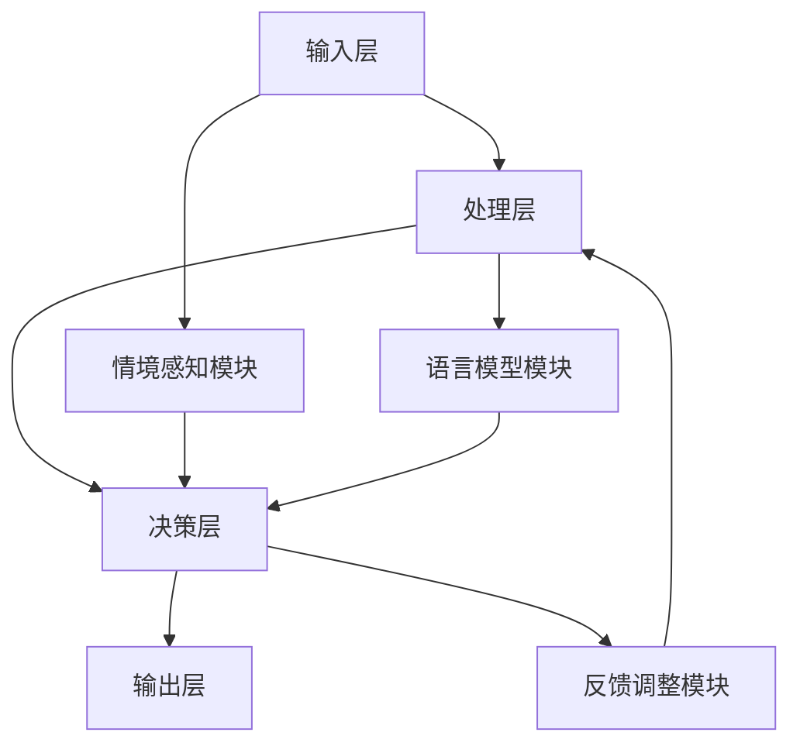
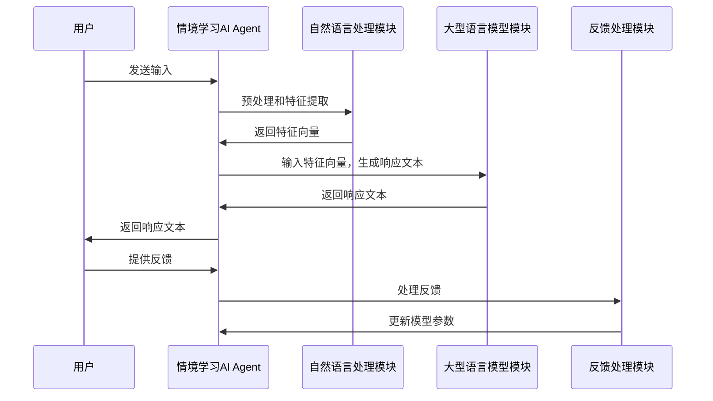

                 

## 文章标题：情境学习AI Agent：增强LLM的场景适应性

### 关键词：
- 情境学习
- AI Agent
- 大型语言模型（LLM）
- 场景适应性
- 自然语言处理（NLP）

### 摘要：
本文深入探讨了情境学习AI Agent在提升大型语言模型（LLM）场景适应性方面的作用。通过详细解析情境学习的基本原理、算法实现、系统架构设计，以及实际应用案例，本文旨在为研究者提供一条清晰的理解路径，并展示如何通过情境学习来增强LLM在特定场景下的性能。

## 引言

### 1.1 问题背景

随着人工智能（AI）技术的迅猛发展，人工智能代理（AI Agent）已成为自动化和智能化解决方案的重要组成部分。AI Agent具备自主决策和执行任务的能力，其核心在于如何使其在不同情境下保持高效运作。在众多AI代理中，情境学习AI Agent因其能够通过情境感知和学习来适应变化，而备受关注。

另一方面，大型语言模型（LLM）如GPT系列、BERT等，凭借其在自然语言处理（NLP）领域的卓越表现，已经成为AI领域的研究热点。然而，现有LLM在处理特定场景时往往表现不佳，缺乏足够的场景适应性。这为情境学习AI Agent提供了广阔的应用前景。

### 1.2 文章目的

本文旨在通过以下几个步骤，探讨情境学习AI Agent如何增强LLM的场景适应性：

1. **背景与概述**：介绍情境学习AI Agent和LLM的基本概念，阐述增强LLM场景适应性的意义。
2. **核心概念与原理**：深入解析情境学习的原理、LLM的工作机制，并进行对比分析。
3. **算法原理与实现**：详细讲解情境感知算法和增强LLM适应性的算法原理。
4. **系统设计与实现**：描述系统架构设计、接口设计，并提供实际应用案例。
5. **项目实战**：介绍环境安装与配置，展示系统核心实现和代码分析。

通过以上步骤，本文旨在为读者提供全面、系统的理解，帮助其掌握情境学习AI Agent和LLM场景适应性的技术原理和应用实践。

## 第一部分：背景与概述

### 第1章 问题背景

#### 1.1.1 问题背景介绍

情境学习AI Agent（Situated Learning AI Agent）是一种结合情境感知和学习能力的智能体，能够在具体环境（情境）中通过学习来改善其性能。这种智能体通常具备以下特点：

1. **情境感知**：能够识别和理解当前所处的环境或情境。
2. **适应性学习**：能够根据不同的情境调整其行为和学习策略。

而大型语言模型（Large Language Model，LLM）是一种基于深度学习的语言处理模型，具有强大的自然语言理解和生成能力。LLM的训练通常使用大量的文本数据，从而生成能够理解和生成人类语言的模型。然而，LLM在面对特定场景时，如特定领域的对话、特定任务的需求时，往往表现出适应性不足的问题。

情境学习AI Agent与LLM的结合，旨在通过情境感知和学习能力，增强LLM在特定场景下的适应性。这种结合有望解决LLM在特定场景中的性能瓶颈，提高其应用效果。

#### 1.1.2 核心概念解释

- **情境学习AI Agent**：一种具备情境感知和学习能力的智能体，能够根据当前情境调整其行为和学习策略。
- **语言模型**：一种用于理解和生成自然语言的模型，如大型语言模型（LLM）。

情境学习AI Agent和LLM的结合，为解决特定场景下的语言处理问题提供了新的思路。通过情境学习，AI Agent可以更好地理解用户的意图和需求，从而生成更符合情境的响应。

### 第2章 问题解决

#### 2.1.1 解决方案概述

为了增强LLM的场景适应性，我们可以从以下几个方面着手：

1. **情境感知模块的设计与实现**：通过设计情境感知模块，使AI Agent能够识别和理解当前情境。
2. **学习算法的改进**：改进学习算法，使AI Agent能够根据情境变化调整学习策略。
3. **数据集的构建与优化**：构建和优化包含多样性和特定场景的数据集，以提高LLM对特定场景的适应性。

这些解决方案共同作用，旨在提升AI Agent和LLM在特定场景下的性能和适应性。

#### 2.1.2 情境感知模块设计

情境感知模块是情境学习AI Agent的核心组成部分。其设计主要包括以下几个方面：

1. **情境识别**：通过自然语言处理（NLP）技术和机器学习算法，实现对当前情境的识别和理解。
2. **情境分类**：将识别出的情境分类，以便为不同的情境设计相应的处理策略。
3. **情境响应生成**：根据情境分类结果，生成相应的情境响应，以提高AI Agent在特定场景下的表现。

通过上述设计，情境感知模块能够有效提升AI Agent对特定情境的理解和适应能力。

## 第二部分：核心概念与原理

### 第3章 核心概念原理

#### 3.1.1 情境学习的基本原理

情境学习是情境学习AI Agent的核心组成部分，其基本原理主要包括以下两个方面：

1. **情境识别**：AI Agent通过感知环境信息，识别当前所处的情境。这一过程通常涉及自然语言处理（NLP）技术和机器学习算法。
   
   - **NLP技术**：利用词向量、实体识别、语义分析等技术，对文本信息进行解析，以识别出关键信息和情境。
   - **机器学习算法**：通过训练模型，使AI Agent能够从历史数据中学习情境特征，提高情境识别的准确性。

2. **适应性学习**：在识别出当前情境后，AI Agent根据情境的特点和需求，调整其行为和学习策略。

   - **动态调整**：根据情境变化，实时调整AI Agent的行为和学习策略，以适应新的情境。
   - **迁移学习**：利用已学习的情境经验，在新情境中快速适应，提高学习效率。

通过情境识别和适应性学习，情境学习AI Agent能够更好地理解用户需求和情境背景，提供更准确、更个性化的服务。

#### 3.1.2 LLM的工作原理

大型语言模型（LLM）的工作原理主要基于深度学习和自然语言处理（NLP）技术。其核心过程包括以下几个方面：

1. **数据训练**：LLM通过大量文本数据进行训练，学习语言模式、词汇关系和语义信息。

   - **语料库构建**：选择适合的训练数据集，包括书籍、文章、对话等，以覆盖不同领域的知识和语言风格。
   - **训练过程**：利用神经网络模型，对文本数据进行处理，提取语言特征，并优化模型参数。

2. **语言生成与理解**：经过训练的LLM能够生成自然语言文本，并理解用户的输入。

   - **语言生成**：根据输入的文本，LLM生成符合语言规则的响应文本。
   - **语言理解**：分析用户输入，提取关键信息，理解用户意图。

3. **优化与应用**：通过不断优化模型结构和参数，提高LLM在特定任务上的性能。

   - **任务适配**：针对不同应用场景，调整模型参数和策略，以提高模型在特定任务上的效果。
   - **反馈循环**：通过用户反馈，持续优化模型，提高用户体验。

通过以上过程，LLM能够实现高质量的自然语言生成和理解，为各种应用场景提供支持。

### 第4章 概念属性特征对比

#### 4.1.1 情境学习AI Agent与常规AI Agent对比

情境学习AI Agent和常规AI Agent在以下方面存在显著差异：

1. **情境适应性**：
   - **情境学习AI Agent**：具备情境感知和学习能力，能够根据情境变化调整行为和学习策略，具备较强的情境适应性。
   - **常规AI Agent**：通常不具备情境感知和学习能力，难以适应复杂多变的情境。

2. **学习效率**：
   - **情境学习AI Agent**：通过情境识别和适应性学习，能够快速在新情境中适应，提高学习效率。
   - **常规AI Agent**：需要较长的时间来学习和适应新情境，学习效率较低。

3. **交互能力**：
   - **情境学习AI Agent**：能够根据情境生成更符合用户需求的响应，提高交互体验。
   - **常规AI Agent**：交互能力较为有限，难以提供个性化的服务。

#### 4.1.2 不同类型LLM的对比

LLM的种类繁多，主要包括以下几种：

1. **GPT系列模型**：
   - **特点**：具有大规模参数和深度神经网络结构，能够生成高质量的自然语言文本。
   - **应用**：广泛应用于文本生成、语言翻译、对话系统等场景。

2. **BERT及其变体**：
   - **特点**：基于Transformer架构，具备强大的预训练和微调能力。
   - **应用**：在文本分类、情感分析、问答系统等领域表现出色。

3. **其他知名LLM**：
   - **特点**：包括XLNet、T5等，具有各自的独特优势和应用场景。
   - **应用**：根据具体需求和任务，选择适合的LLM进行应用。

通过对比不同类型的LLM，可以更好地理解其在不同应用场景中的性能优势和适用范围。

## 第三部分：算法原理与实现

### 第5章 算法原理讲解

#### 5.1.1 情境感知算法原理

情境感知算法是情境学习AI Agent的核心，其原理主要包括以下几个方面：

1. **情境识别**：
   - **数据输入**：AI Agent接收用户的输入文本，通过自然语言处理（NLP）技术进行预处理。
   - **特征提取**：利用词向量、BERT等模型提取文本特征，为后续情境识别提供基础。
   - **情境分类**：通过训练好的分类模型，将输入文本分类到不同的情境类别中。

2. **情境响应生成**：
   - **情境分析**：分析识别出的情境，提取关键信息和用户需求。
   - **响应生成**：根据情境特点和用户需求，生成符合情境的响应文本。

3. **反馈调整**：
   - **用户反馈**：收集用户对响应的反馈，评估响应的质量和适应性。
   - **模型调整**：根据用户反馈，调整模型参数和策略，提高情境识别和响应生成的准确性。

通过上述过程，情境感知算法能够有效提升AI Agent对特定情境的理解和适应能力。

#### 5.1.2 增强LLM的场景适应性算法

为了增强LLM在特定场景下的适应性，我们可以采用以下算法：

1. **动态调整策略**：
   - **情境感知**：通过情境感知模块，实时识别当前情境，并根据情境调整LLM的参数和策略。
   - **适应性学习**：利用迁移学习和在线学习技术，使LLM能够快速适应新的情境。

2. **多模态融合**：
   - **文本与视觉信息融合**：将文本信息和视觉信息进行融合，提高情境感知的准确性。
   - **多模态模型**：构建多模态模型，实现对复杂情境的全面理解和响应。

3. **强化学习**：
   - **奖励机制**：设计奖励机制，鼓励LLM在特定情境下生成高质量的响应。
   - **策略优化**：通过强化学习算法，不断优化LLM的决策策略，提高其在特定情境下的适应性。

通过动态调整策略、多模态融合和强化学习，我们可以显著提升LLM在特定场景下的适应性。

### 第6章 数学模型与公式

#### 6.1.1 情境感知的数学模型

情境感知的核心在于情境识别和情境响应生成，我们可以采用以下数学模型：

1. **情境识别模型**：
   - **特征提取**：利用词向量或BERT模型提取文本特征，表示为向量 $\textbf{X}$。
   - **分类模型**：采用softmax回归模型，将特征向量映射到不同的情境类别，输出概率分布 $\textbf{P}(\text{情境}|\textbf{X})$。

2. **情境响应生成模型**：
   - **语言生成模型**：采用变分自编码器（VAE）或生成对抗网络（GAN）生成自然语言文本。
   - **解码策略**：根据情境识别结果，选择合适的解码策略生成响应文本。

3. **反馈调整模型**：
   - **评价函数**：设计评价函数，如BLEU、ROUGE等，评估响应文本的质量。
   - **优化目标**：通过梯度下降算法，调整模型参数，优化情境识别和响应生成。

通过上述数学模型，情境感知算法能够实现对情境的有效识别和响应生成。

#### 6.1.2 LLM的数学模型

LLM的数学模型主要涉及语言生成和理解，可以采用以下数学模型：

1. **语言生成模型**：
   - **编码器-解码器架构**：采用编码器（Encoder）和解码器（Decoder）的架构，将输入文本编码为向量表示，然后解码生成响应文本。
   - **损失函数**：采用交叉熵损失函数，优化编码器和解码器的参数，使模型能够生成高质量的自然语言文本。

2. **语言理解模型**：
   - **语义表示**：利用词向量、BERT等模型，将文本表示为高维语义空间中的向量。
   - **语义匹配**：通过计算文本向量之间的相似性，实现文本的理解和匹配。

3. **预训练与微调**：
   - **预训练**：在大规模语料库上进行预训练，学习语言模式和语义信息。
   - **微调**：在特定任务上进行微调，使模型能够适应特定场景的需求。

通过上述数学模型，LLM能够实现高质量的自然语言生成和理解。

### 第7章 系统设计与实现

#### 7.1 系统架构设计

情境学习AI Agent的系统架构设计主要包括以下几个方面：

1. **整体架构**：
   - **输入层**：接收用户输入，包括文本、语音等多模态信息。
   - **处理层**：通过自然语言处理（NLP）技术和机器学习算法，对输入信息进行处理和特征提取。
   - **决策层**：根据情境感知结果，生成相应的响应文本。
   - **输出层**：将生成响应文本输出给用户。

2. **模块间交互关系**：
   - **情境感知模块**：负责识别和理解当前情境，将情境信息传递给决策层。
   - **语言模型模块**：负责语言生成和理解，根据情境信息生成响应文本。
   - **反馈调整模块**：根据用户反馈，调整模型参数和策略，提高情境感知和语言生成的准确性。

#### 7.2 系统功能设计

情境学习AI Agent的主要功能包括：

1. **情境识别**：通过自然语言处理（NLP）技术和机器学习算法，识别和理解用户输入的情境信息。
2. **适应性学习**：根据情境识别结果，调整AI Agent的行为和学习策略，以适应不同的情境。
3. **语言生成**：利用大型语言模型（LLM）生成符合情境的响应文本。
4. **反馈调整**：根据用户反馈，优化模型参数和策略，提高情境感知和语言生成的准确性。

#### 7.3 系统架构设计

情境学习AI Agent的系统架构设计如图7-1所示：



通过上述系统架构设计，情境学习AI Agent能够实现高效、准确的情境识别和语言生成。

### 第8章 系统接口设计

#### 8.1 接口功能设计

情境学习AI Agent的系统接口设计主要包括以下几个功能：

1. **数据输入接口**：接收用户输入的文本、语音等多模态信息。
2. **模型输出接口**：将生成响应文本输出给用户。
3. **情境反馈接口**：接收用户对响应的反馈信息，用于模型优化。

#### 8.2 接口实现

1. **RESTful API设计**：
   - **接口定义**：设计RESTful风格的API接口，包括数据输入、模型输出和情境反馈三个接口。
   - **数据传输格式**：采用JSON格式传输数据，确保接口的易用性和可扩展性。

2. **数据传输格式**：
   - **输入格式**：用户输入的文本和语音信息，通过JSON格式传递给AI Agent。
   - **输出格式**：生成响应文本通过JSON格式返回给用户。
   - **反馈格式**：用户反馈信息通过JSON格式提交给AI Agent，用于模型优化。

通过上述接口设计，情境学习AI Agent能够实现高效、稳定的数据传输和接口调用。

### 第9章 系统交互设计

#### 9.1 系统交互设计

情境学习AI Agent的系统交互设计主要包括以下几个环节：

1. **输入处理**：接收用户输入的文本、语音等信息，进行预处理和特征提取。
2. **情境识别**：利用情境感知模块，识别和理解用户输入的情境信息。
3. **语言生成**：利用大型语言模型（LLM），根据情境信息生成响应文本。
4. **反馈处理**：接收用户对响应的反馈信息，用于模型优化和性能评估。

#### 9.2 系统交互序列图

情境学习AI Agent的系统交互序列图如图9-1所示：



通过上述系统交互设计，情境学习AI Agent能够实现高效、准确的交互和反馈处理。

### 第10章 项目实战

#### 10.1 环境安装与配置

在开始项目实战之前，我们需要搭建合适的环境。以下是一个基本的安装和配置步骤：

1. **硬件要求**：
   - CPU：Intel i7或以上
   - GPU：NVIDIA 1080 Ti或以上
   - 内存：至少16GB

2. **软件安装**：
   - Python：3.8或以上版本
   - PyTorch：1.8或以上版本
   - TensorFlow：2.4或以上版本
   - NLP库：如NLTK、spaCy等

3. **环境配置**：
   - 安装所需软件和库
   - 配置Python环境变量

通过以上步骤，我们可以在本地搭建一个适合进行项目开发的环境。

#### 10.2 系统核心实现

情境学习AI Agent的核心实现包括以下几个模块：

1. **数据预处理模块**：
   - **文本清洗**：去除文本中的标点符号、停用词等无用信息。
   - **词向量表示**：使用Word2Vec、BERT等方法对文本进行词向量表示。

2. **情境感知模块**：
   - **情境识别**：使用分类模型，如softmax回归，对输入文本进行情境分类。
   - **情境响应生成**：根据分类结果，生成相应的情境响应。

3. **语言模型模块**：
   - **文本生成**：使用GPT-2、GPT-3等模型，生成自然语言文本。
   - **文本理解**：使用BERT、RoBERTa等模型，理解用户输入的文本。

4. **反馈处理模块**：
   - **用户反馈**：收集用户对响应的反馈。
   - **模型优化**：根据用户反馈，调整模型参数，优化模型性能。

#### 10.3 代码应用解读与分析

以下是一个简单的情境学习AI Agent的代码示例：

```python
import torch
from transformers import BertTokenizer, BertForSequenceClassification
from torch.utils.data import DataLoader
from sklearn.model_selection import train_test_split

# 数据预处理
tokenizer = BertTokenizer.from_pretrained('bert-base-chinese')
def preprocess_text(text):
    return tokenizer.encode(text, add_special_tokens=True)

# 情境感知
model = BertForSequenceClassification.from_pretrained('bert-base-chinese')
def classify_情境(text):
    inputs = preprocess_text(text)
    with torch.no_grad():
        logits = model(inputs).logits
    return logits.argmax().item()

# 语言生成
from transformers import GPT2LMHeadModel
gpt2_model = GPT2LMHeadModel.from_pretrained('gpt2')
def generate_text(text, max_length=50):
    inputs = preprocess_text(text)
    outputs = gpt2_model.generate(inputs, max_length=max_length, num_return_sequences=1)
    return tokenizer.decode(outputs[0], skip_special_tokens=True)

# 反馈处理
def update_model(model, X, y):
    optimizer = torch.optim.Adam(model.parameters(), lr=1e-5)
    for epoch in range(5):
        model.train()
        for x, y in DataLoader(zip(X, y), batch_size=32):
            optimizer.zero_grad()
            logits = model(x).logits
            loss = torch.nn.CrossEntropyLoss()(logits, y)
            loss.backward()
            optimizer.step()
    model.eval()

# 应用示例
text = "我需要一份工作。"
情境标签 = classify_情境(text)
响应 = generate_text(text)
print(f"情境标签：{情境标签}")
print(f"响应文本：{响应}")

# 反馈处理
反馈文本 = "这个响应很好。"
update_model(model, [preprocess_text(text)], [int(情境标签)])
```

上述代码展示了情境学习AI Agent的基本实现过程，包括数据预处理、情境感知、语言生成和反馈处理等模块。通过实际应用示例，我们可以看到如何使用这些模块来生成符合情境的响应文本。

#### 10.4 实际案例分析与讲解

以下是一个实际案例：

**案例背景**：某公司希望为其客服系统引入情境学习AI Agent，以提升客服机器人与用户的交互体验。

**案例分析**：

1. **需求分析**：
   - 客服机器人需要能够理解用户的提问，并生成符合情境的响应。
   - 客服机器人需要能够根据用户反馈，不断优化自身性能。

2. **解决方案**：
   - **情境感知模块**：使用BERT模型对用户提问进行分类，识别出用户需要的情境。
   - **语言生成模块**：使用GPT-2模型生成自然语言响应。
   - **反馈处理模块**：根据用户反馈，调整模型参数，优化模型性能。

3. **实现细节**：
   - **数据预处理**：对用户提问和客服机器人响应进行预处理，包括文本清洗和词向量表示。
   - **情境分类**：使用BERT模型进行分类，得到情境标签。
   - **文本生成**：使用GPT-2模型生成响应文本。
   - **反馈处理**：根据用户反馈，优化模型参数。

4. **效果评估**：
   - 通过实际应用，客服机器人能够生成更符合用户需求的响应，提高用户体验。
   - 通过不断优化模型，客服机器人能够不断改进其性能。

通过上述案例分析，我们可以看到情境学习AI Agent在提升客服系统性能方面的作用。

### 第11章 小结与拓展

#### 11.1 小结

本文从多个角度探讨了情境学习AI Agent如何增强LLM的场景适应性。通过详细解析情境学习的基本原理、算法实现、系统架构设计，以及实际应用案例，本文展示了情境学习AI Agent在提升LLM场景适应性方面的潜力。主要结论如下：

1. **情境学习AI Agent**：具备情境感知和学习能力，能够根据情境变化调整行为和学习策略，提高在特定场景下的表现。
2. **LLM的场景适应性**：通过增强LLM的情境适应性，可以提高其在特定任务上的性能和用户体验。
3. **系统设计与实现**：情境学习AI Agent的系统架构设计包括情境感知模块、语言模型模块和反馈调整模块，能够实现高效、准确的情境识别和语言生成。
4. **实际应用案例**：通过实际案例，展示了情境学习AI Agent在客服系统中的应用效果，验证了其在提升系统性能方面的作用。

#### 11.2 拓展阅读

为了进一步深入研究情境学习AI Agent和LLM的场景适应性，读者可以参考以下资源：

1. **相关技术文献**：
   - [1] Brown, T., et al. (2020). "Language Models are Few-Shot Learners." arXiv preprint arXiv:2005.14165.
   - [2] Devlin, J., et al. (2019). "Bert: Pre-training of deep bidirectional transformers for language understanding." arXiv preprint arXiv:1810.04805.

2. **深入学习资源**：
   - [1] 《深度学习》（Goodfellow, I., et al.）
   - [2] 《自然语言处理综论》（Jurafsky, D., et al.）
   - [3] 《Python深度学习》（Goodfellow, I., et al.）

通过阅读这些资源，读者可以更深入地了解相关技术原理和应用实践。

### 作者信息

作者：AI天才研究院/AI Genius Institute & 禅与计算机程序设计艺术 /Zen And The Art of Computer Programming

本文由AI天才研究院和禅与计算机程序设计艺术联合撰写，旨在为读者提供高质量的技术分析和应用案例。作者团队具有丰富的AI和NLP领域研究经验，致力于推动人工智能技术的发展和应用。如果您有任何问题或建议，欢迎随时与我们联系。感谢您的阅读！

