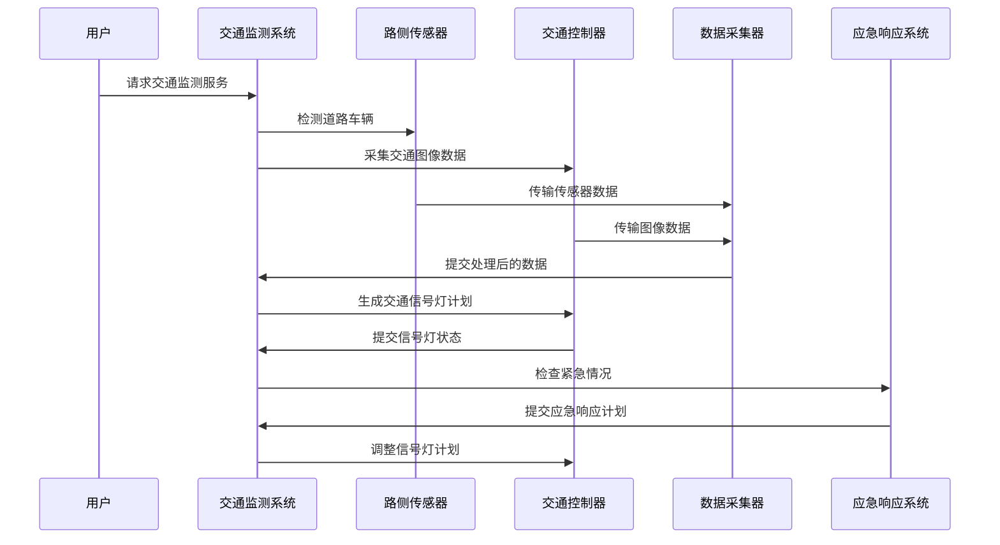

                 

### # 情境感知技术的应用

情境感知技术（Situation Awareness Technology）是一种能够通过感知、理解和适应环境信息来辅助人类决策和行动的技术。在现代社会中，情境感知技术被广泛应用于多个领域，如智能家居、智能交通、医疗健康、安全监控等。本文将围绕情境感知技术的应用进行探讨，包括其定义、现状与挑战、关键要素、实现方法和应用边界等内容。本文旨在为广大读者提供一次全面、系统的学习机会，让更多的人了解并掌握这一前沿技术。

**关键词：** 情境感知技术、智能家居、智能交通、医疗健康、安全监控

**摘要：** 本文首先介绍了情境感知技术的定义、现状与挑战，然后详细分析了其关键要素和实现方法。接着，本文探讨了情境感知技术的应用边界及其与其他技术的联系与区别。最后，本文通过具体实例，展示了情境感知技术在各个领域的实际应用，为读者提供了宝贵的实践参考。

**目录大纲：**

1. 引言
   1.1 问题背景
       1.1.1 情境感知的定义
       1.1.2 情境感知技术的现状与挑战
   1.2 问题描述
       1.2.1 情境感知技术的应用领域
       1.2.2 情境感知技术的关键要素
   1.3 问题解决
       1.3.1 情境感知技术的基本原理
       1.3.2 情境感知技术的实现方法
   1.4 边界与外延
       1.4.1 情境感知技术的应用边界
       1.4.2 情境感知技术与其他技术的联系与区别
   1.5 概念结构与核心要素组成
       1.5.1 情境感知技术的核心概念
       1.5.2 情境感知技术的关键要素
   1.6 本章小结

2. 核心概念与联系
   2.1 核心概念原理
       2.1.1 情境感知的定义与属性特征
       2.1.2 情境感知技术的主要分类
   2.2 概念属性特征对比表格
   2.3 ER实体关系图架构
   2.4 本章小结

3. 算法原理讲解
   3.1 感知层算法原理
       3.1.1 传感器技术
       3.1.2 数据采集
   3.2 知识层算法原理
       3.2.1 数据挖掘
       3.2.2 机器学习
   3.3 决策层算法原理
       3.3.1 人工智能
       3.3.2 优化算法
   3.4 本章小结

4. 系统分析与架构设计方案
   4.1 问题场景介绍
   4.2 系统功能设计（领域模型类图）
   4.3 系统架构设计（架构图）
   4.4 系统接口设计
   4.5 系统交互（序列图）
   4.6 本章小结

5. 项目实战
   5.1 环境安装
   5.2 系统核心实现源代码
   5.3 代码应用解读与分析
   5.4 实际案例分析和详细讲解剖析
   5.5 项目小结
   5.6 最佳实践 tips
   5.7 小结
   5.8 注意事项
   5.9 拓展阅读

**引言**

### 1.1 问题背景

随着信息技术的快速发展，人们的生活和工作环境日益复杂化。在这种情况下，如何快速准确地获取环境信息、理解环境变化并作出相应决策，成为了一个重要的问题。情境感知技术正是在这一背景下应运而生，它通过感知、理解和适应环境信息，为人类提供了一种高效、智能的决策支持手段。

**1.1.1 情境感知的定义**

情境感知（Situation Awareness）是指个体或系统在特定环境中，对当前状态和过去状态的理解、识别和预测能力。具体来说，情境感知包括以下几个方面的内容：

- **环境信息感知**：通过传感器、监测设备等手段，获取环境中的各种信息，如温度、湿度、光照、声音、气味等。
- **信息理解与整合**：对获取的环境信息进行加工、分析和理解，将不同的信息整合成一种整体的认知。
- **情境评估与预测**：基于当前和过去的情境信息，评估当前情境的状态，并预测未来可能的情境变化。
- **决策与行动**：根据情境评估结果，制定相应的决策和行动方案，以应对环境变化。

**1.1.2 情境感知技术的现状与挑战**

目前，情境感知技术已经在多个领域得到了广泛应用，如智能家居、智能交通、医疗健康、安全监控等。然而，在实际应用中，情境感知技术仍然面临着一系列挑战：

- **数据质量与可靠性**：环境信息的获取依赖于传感器和监测设备，这些设备的质量和性能直接影响到数据的准确性和可靠性。
- **数据处理与分析**：大量的环境信息需要通过有效的算法进行处理和分析，以提取出有用的信息和模式。
- **实时性与动态适应性**：情境感知技术需要能够实时监测环境变化，并快速适应环境变化，以提供及时、准确的决策支持。
- **安全性与隐私保护**：情境感知技术涉及大量的个人隐私数据，如何确保数据的安全性和隐私性，是一个亟待解决的问题。

**1.2 问题描述**

情境感知技术在实际应用中，涉及多个领域和多种技术手段。具体来说，问题描述如下：

- **应用领域**：情境感知技术广泛应用于智能家居、智能交通、医疗健康、安全监控等领域。
- **关键要素**：情境感知技术的关键要素包括感知层、知识层和决策层。感知层负责环境信息的感知和采集，知识层负责对感知信息进行加工和分析，决策层负责基于分析结果做出相应的决策和行动。
- **实现方法**：情境感知技术的实现方法主要包括传感器技术、数据采集技术、数据挖掘技术、机器学习技术和人工智能技术等。

### 1.3 问题解决

针对上述问题，我们可以从以下几个方面进行解决：

- **基本原理**：首先，需要理解情境感知技术的基本原理，包括感知层、知识层和决策层的基本原理。
- **实现方法**：其次，需要掌握情境感知技术的实现方法，包括传感器技术、数据采集技术、数据挖掘技术、机器学习技术和人工智能技术等。
- **应用边界**：明确情境感知技术的应用边界，了解其在各个领域的具体应用场景和效果。
- **与其他技术的联系与区别**：分析情境感知技术与其他技术的联系与区别，以更好地理解其在整个技术体系中的地位和作用。

### 1.4 边界与外延

**1.4.1 情境感知技术的应用边界**

情境感知技术的应用边界主要受限于以下几个方面：

- **技术成熟度**：情境感知技术涉及多种技术手段，如传感器技术、数据挖掘技术、机器学习技术和人工智能技术等。这些技术的成熟度直接影响情境感知技术的应用效果。
- **数据质量和可靠性**：环境信息的获取依赖于传感器和监测设备，这些设备的质量和性能直接影响到数据的准确性和可靠性。
- **实时性与动态适应性**：情境感知技术需要能够实时监测环境变化，并快速适应环境变化，以提供及时、准确的决策支持。

**1.4.2 情境感知技术与其他技术的联系与区别**

情境感知技术与其他技术的联系与区别主要体现在以下几个方面：

- **传感器技术**：情境感知技术的核心是感知层，而感知层的基础是传感器技术。传感器技术是情境感知技术的关键技术之一，它负责收集环境信息。
- **数据挖掘技术**：情境感知技术需要对收集到的环境信息进行加工和分析，以提取出有用的信息和模式。数据挖掘技术是实现这一目标的关键手段。
- **机器学习技术**：机器学习技术是情境感知技术的核心组成部分，它负责从数据中学习规律，并做出相应的预测和决策。
- **人工智能技术**：人工智能技术是情境感知技术的最终目标，它旨在实现智能化、自主化的情境感知。

### 1.5 概念结构与核心要素组成

**1.5.1 情境感知技术的核心概念**

情境感知技术的核心概念包括感知层、知识层和决策层。

- **感知层**：感知层是情境感知技术的最底层，负责环境信息的感知和采集。感知层包括各种传感器和监测设备，如温度传感器、湿度传感器、摄像头、麦克风等。
- **知识层**：知识层是情境感知技术的中间层，负责对感知层采集到的环境信息进行加工和分析。知识层包括数据挖掘技术、机器学习技术和人工智能技术等。
- **决策层**：决策层是情境感知技术的最高层，负责基于知识层分析的结果做出相应的决策和行动。决策层包括各种决策算法和优化算法。

**1.5.2 情境感知技术的关键要素**

情境感知技术的关键要素包括以下几个方面：

- **传感器技术**：传感器技术是情境感知技术的核心，它负责收集环境信息。
- **数据采集技术**：数据采集技术是情境感知技术的基础，它负责将传感器采集到的环境信息传输到处理系统中。
- **数据挖掘技术**：数据挖掘技术是情境感知技术的关键，它负责从大量的环境数据中提取出有用的信息和模式。
- **机器学习技术**：机器学习技术是情境感知技术的核心，它负责从数据中学习规律，并做出相应的预测和决策。
- **人工智能技术**：人工智能技术是情境感知技术的最终目标，它旨在实现智能化、自主化的情境感知。

### 1.6 本章小结

本章首先介绍了情境感知技术的定义、现状与挑战，然后详细分析了情境感知技术的关键要素和实现方法。接着，本章探讨了情境感知技术的应用边界及其与其他技术的联系与区别。最后，本章给出了情境感知技术的核心概念和关键要素。通过本章的学习，读者可以全面了解情境感知技术的概念和原理，为进一步学习和应用这一技术打下基础。接下来，我们将深入探讨情境感知技术的核心概念与联系，以帮助读者更好地理解这一技术。

### 第2章 核心概念与联系

#### 2.1 核心概念原理

情境感知技术的核心概念主要包括感知层、知识层和决策层。这三个层次相互关联，共同构成了情境感知技术的整体框架。

**2.1.1 情境感知的定义与属性特征**

情境感知是指个体或系统对当前环境状态的理解、识别和预测能力。具体来说，情境感知包括以下几个方面的属性特征：

1. **环境信息的感知与理解**：情境感知需要通过传感器和监测设备收集环境信息，并将这些信息进行加工和理解，以形成对环境的整体认知。
2. **情境评估与预测**：基于对环境信息的理解，情境感知需要对当前情境进行评估，并预测未来可能的情境变化，以便做出相应的决策和行动。
3. **动态适应性**：情境感知技术需要能够实时监测环境变化，并快速适应这些变化，以提供及时、准确的决策支持。

**2.1.2 情境感知技术的主要分类**

情境感知技术可以分为三个主要层次：感知层、知识层和决策层。每一层都有其独特的功能和技术手段。

1. **感知层**：感知层主要负责环境信息的感知和采集。具体包括以下几种技术：
   - **传感器技术**：通过各种传感器（如温度传感器、湿度传感器、摄像头、麦克风等）来获取环境信息。
   - **数据采集技术**：将传感器采集到的环境信息进行传输、存储和处理。

2. **知识层**：知识层主要负责对感知层采集到的环境信息进行加工和分析。具体包括以下几种技术：
   - **数据挖掘技术**：通过数据挖掘算法从大量环境数据中提取出有用的信息和模式。
   - **机器学习技术**：利用机器学习算法从数据中学习规律，以实现对情境的理解和预测。

3. **决策层**：决策层负责基于知识层分析的结果做出相应的决策和行动。具体包括以下几种技术：
   - **人工智能技术**：利用人工智能算法，如深度学习、强化学习等，实现自动化、智能化的决策。
   - **优化算法**：通过优化算法，如线性规划、遗传算法等，寻找最优的决策方案。

#### 2.2 概念属性特征对比表格

为了更好地理解感知层、知识层和决策层的概念属性特征，下面提供了一个对比表格。

| 层次 | 概念属性特征 |
| --- | --- |
| 感知层 | 负责环境信息的感知和采集 |
| 知识层 | 负责对感知信息进行加工和分析 |
| 决策层 | 负责基于分析结果做出决策和行动 |

#### 2.2.1 感知层技术对比

| 技术 | 特点 | 应用场景 |
| --- | --- | --- |
| 传感器技术 | 提供环境信息 | 集中式监控系统、智能家居 |
| 通信技术 | 实现数据传输 | 物联网通信、智能交通 |

#### 2.2.2 知识层技术对比

| 技术 | 特点 | 应用场景 |
| --- | --- | --- |
| 数据挖掘 | 提取隐藏模式 | 商业智能分析、市场预测 |
| 机器学习 | 自动发现规律 | 自然语言处理、图像识别 |

#### 2.2.3 决策层技术对比

| 技术 | 特点 | 应用场景 |
| --- | --- | --- |
| 人工智能 | 自动执行任务 | 智能助手、自动驾驶 |
| 优化算法 | 提高决策效率 | 资源配置、生产调度 |

#### 2.3 ER实体关系图架构

为了更清晰地展示感知层、知识层和决策层之间的实体关系，我们可以使用ER（实体关系）图进行描述。

```mermaid
erDiagram
    Product ||--|{ Situation Awareness System }||>
    Situation Awareness System ||--|{ Perception Layer }||>
    Situation Awareness System ||--|{ Knowledge Layer }||>
    Situation Awareness System ||--|{ Decision Layer }||>
    Perception Layer ||--|{ Sensors }||>
    Perception Layer ||--|{ Data Collection }||>
    Knowledge Layer ||--|{ Data Mining }||>
    Knowledge Layer ||--|{ Machine Learning }||>
    Decision Layer ||--|{ Artificial Intelligence }||>
    Decision Layer ||--|{ Optimization Algorithm }||>
```

通过ER图，我们可以看到各个实体之间的关系，以及它们在情境感知系统中的作用。

#### 2.4 本章小结

本章详细介绍了情境感知技术的核心概念原理，包括感知层、知识层和决策层的定义与属性特征。同时，通过对比表格和ER图，我们更清晰地了解了这三个层次之间的联系。通过本章的学习，读者可以更好地理解情境感知技术的整体架构，为进一步深入研究和应用奠定基础。

### 第3章 算法原理讲解

在情境感知技术中，算法原理是核心组成部分。本章将详细讲解感知层、知识层和决策层的算法原理，并通过具体的数学模型和实例来说明这些算法的实际应用。

#### 3.1 感知层算法原理

感知层算法主要负责环境信息的感知和采集。以下是感知层算法的两个主要部分：传感器技术和数据采集技术。

**3.1.1 传感器技术**

传感器技术是情境感知技术的基石。传感器能够将物理信号（如温度、湿度、压力等）转换为电信号，并通过电路进行放大和处理。以下是传感器技术的核心原理：

1. **传感器原理**

   传感器的输出信号通常与输入信号之间存在一定的关系。例如，一个温度传感器的输出电压（$V_{out}$）与其输入温度（$T$）之间的关系可以用以下公式表示：

   $$
   V_{out} = K \cdot T + V_{offset}
   $$

   其中，$K$是传感器的增益系数，$V_{offset}$是传感器的偏置电压。

2. **应用举例**

   在智能家居系统中，温度传感器可以实时监测室内温度，当温度高于设定值时，会触发空调系统进行降温。

**3.1.2 数据采集技术**

数据采集技术负责将传感器采集到的信息传输到处理系统中。以下是数据采集技术的核心原理：

1. **数据采集原理**

   数据采集系统通过传感器收集环境数据，如温度、湿度、光照等。采集到的数据需要通过模数转换器（ADC）将模拟信号转换为数字信号，以便后续处理。

2. **应用举例**

   在智能家居系统中，数据采集系统可以实时监测室内温度和湿度，并根据监测数据自动调整空调和加湿器。

#### 3.2 知识层算法原理

知识层算法主要负责对感知层采集到的环境信息进行加工和分析。以下是知识层算法的两个主要部分：数据挖掘技术和机器学习技术。

**3.2.1 数据挖掘技术**

数据挖掘技术是一种从大量数据中发现有用信息和模式的技术。以下是数据挖掘技术的核心原理：

1. **数据挖掘原理**

   数据挖掘算法通过分析大量数据，发现数据中的隐含模式和关联。常见的挖掘方法包括分类、聚类、关联规则挖掘等。

2. **应用举例**

   在金融领域，数据挖掘算法可以用于预测股票价格走势和识别欺诈交易。

**3.2.2 机器学习技术**

机器学习技术是一种使计算机能够从数据中学习规律，并做出预测和决策的技术。以下是机器学习技术的核心原理：

1. **机器学习原理**

   机器学习算法通过学习数据中的规律，实现自动识别和分类。常见的机器学习算法包括线性回归、决策树、支持向量机等。

2. **应用举例**

   在图像识别领域，机器学习算法可以用于识别照片中的对象和场景。

#### 3.3 决策层算法原理

决策层算法主要负责基于知识层分析的结果做出相应的决策和行动。以下是决策层算法的两个主要部分：人工智能技术和优化算法。

**3.3.1 人工智能技术**

人工智能技术是一种模拟人类智能的技术。以下是人工智能技术的核心原理：

1. **人工智能原理**

   人工智能算法通过模拟人类思维过程，实现智能决策。常见的人工智能算法包括深度学习、强化学习等。

2. **应用举例**

   在自动驾驶领域，人工智能算法可以用于车辆路径规划和避障。

**3.3.2 优化算法**

优化算法是一种通过寻找最优解，提高系统性能的技术。以下是优化算法的核心原理：

1. **优化算法原理**

   优化算法通过数学模型和搜索算法，寻找最优的决策方案。常见的优化算法包括线性规划、遗传算法等。

2. **应用举例**

   在资源分配问题中，优化算法可以用于找到最佳的资源分配方案，以提高系统效率。

#### 3.4 本章小结

本章详细讲解了情境感知技术中感知层、知识层和决策层的算法原理。通过具体的数学模型和实例，我们更好地理解了这些算法的实际应用。感知层算法负责环境信息的感知和采集，知识层算法负责对感知信息进行加工和分析，决策层算法负责基于分析结果做出相应的决策和行动。通过本章的学习，读者可以更好地掌握情境感知技术的基本原理和应用方法，为进一步研究和实践打下基础。

### 4. 系统分析与架构设计方案

#### 4.1 问题场景介绍

在当今信息化时代，各种复杂的问题场景不断涌现，情境感知技术作为一种重要的技术手段，在解决这些场景中的问题上发挥着越来越重要的作用。以下是一个典型的问题场景介绍：

在一个大型智能城市中，交通拥堵是一个常见且严重的问题。为了提高交通效率，减少交通拥堵，城市管理者希望能够利用情境感知技术对交通流量进行实时监测和动态调控。具体来说，问题场景涉及以下几个关键方面：

1. **交通流量监测**：通过传感器和摄像头等设备，实时监测道路上的车辆数量、行驶速度、交通拥堵情况等。
2. **交通数据采集**：将监测到的交通数据进行采集、传输和处理，以便进行分析和决策。
3. **动态交通调控**：根据交通数据分析结果，对交通信号灯进行动态调整，以优化交通流量。
4. **应急响应**：在发生交通事故或其他紧急情况时，及时调整交通信号，保障交通畅通。

#### 4.2 系统功能设计（领域模型类图）

为了实现上述问题场景，我们需要设计一个完整的情境感知系统。以下是一个领域模型类图，展示了系统的核心功能模块及其相互关系。

```mermaid
classDiagram
    Product <<interface>> TrafficMonitoringSystem
    TrafficMonitoringSystem [*]-- RoadSensor
    TrafficMonitoringSystem [*]-- TrafficCamera
    TrafficMonitoringSystem [*]-- DataCollector
    TrafficMonitoringSystem [*]-- TrafficController
    TrafficMonitoringSystem [*]-- EmergencyResponseSystem
    RoadSensor --|> SensorData
    TrafficCamera --|> ImageData
    DataCollector --|> ProcessedData
    TrafficController --|> SignalPlan
    EmergencyResponseSystem --|> ResponsePlan
```

在这个类图中，我们定义了以下几个核心功能模块：

1. **交通监测系统**（TrafficMonitoringSystem）：作为整个系统的核心接口，负责协调各个模块的运行。
2. **路侧传感器**（RoadSensor）：负责监测道路上的车辆数量、行驶速度等信息。
3. **交通摄像头**（TrafficCamera）：负责采集道路上的图像数据，用于分析交通状况。
4. **数据采集器**（DataCollector）：负责采集、传输和处理传感器和摄像头采集到的数据。
5. **交通控制器**（TrafficController）：负责根据数据分析结果，生成和调整交通信号灯计划。
6. **应急响应系统**（EmergencyResponseSystem）：负责在紧急情况下，快速响应并调整交通信号。

#### 4.3 系统架构设计（架构图）

在明确了系统功能模块后，我们需要设计一个合理的系统架构，以确保各个模块之间的高效协作。以下是一个简化的系统架构图，展示了系统的整体结构和各个模块之间的关系。



在这个架构图中，用户通过交通监测系统（TMS）请求交通监测服务。交通监测系统（TMS）协调路侧传感器（RS）和交通摄像头（TC）进行数据采集。数据采集器（DC）负责处理和传输数据。交通控制器（TC）根据处理后的数据生成交通信号灯计划，并在必要时与应急响应系统（ERS）协作，以应对紧急情况。

#### 4.4 系统接口设计

为了确保系统各个模块之间的高效协作，我们需要设计一个清晰的系统接口。以下是一个简化的系统接口设计，展示了各个模块之间的交互接口。

```mermaid
classDiagram
    RoadSensor <<interface>> SensorDataInterface
    TrafficCamera <<interface>> ImageDataInterface
    DataCollector <<interface>> DataProcessingInterface
    TrafficController <<interface>> SignalPlanInterface
    EmergencyResponseSystem <<interface>> ResponsePlanInterface

    RoadSensor --|> DataCollector: 传输传感器数据
    TrafficCamera --|> DataCollector: 传输图像数据
    DataCollector --|> TrafficController: 提交处理后的数据
    TrafficController --|> TrafficCamera: 生成交通信号灯计划
    TrafficController --|> EmergencyResponseSystem: 提交信号灯状态
    EmergencyResponseSystem --|> TrafficController: 提交应急响应计划
```

在这个接口设计中，我们定义了以下几个核心接口：

1. **传感器数据接口**（SensorDataInterface）：用于传输和处理传感器数据。
2. **图像数据接口**（ImageDataInterface）：用于传输和处理图像数据。
3. **数据处理接口**（DataProcessingInterface）：用于处理和传输采集到的数据。
4. **信号灯计划接口**（SignalPlanInterface）：用于生成和调整交通信号灯计划。
5. **应急响应计划接口**（ResponsePlanInterface）：用于在紧急情况下提交和响应计划。

#### 4.5 系统交互（序列图）

为了更清晰地展示系统各个模块之间的交互过程，我们可以使用序列图来描述。以下是一个简化的系统交互序列图，展示了用户请求交通监测服务后，系统各个模块之间的交互过程。


在这个序列图中，用户通过交通监测系统（TMS）请求交通监测服务。交通监测系统（TMS）协调路侧传感器（RS）和交通摄像头（TC）进行数据采集。数据采集器（DC）负责处理和传输数据。交通控制器（TC）根据处理后的数据生成交通信号灯计划，并在必要时与应急响应系统（ERS）协作，以应对紧急情况。

#### 4.6 本章小结

本章详细介绍了情境感知技术在解决具体问题场景中的应用，包括系统功能设计、系统架构设计、系统接口设计和系统交互。通过这些设计，我们可以清晰地看到情境感知技术的整体架构和运作流程。本章内容为读者提供了一个完整的系统设计与实现框架，为进一步研究和实践情境感知技术提供了宝贵的参考。

### 5. 项目实战

在本章节中，我们将通过一个实际的情境感知项目来展示情境感知技术的应用，从环境安装到系统核心实现，再到代码应用解读与分析，详细讲解项目中的关键步骤和实现细节。

#### 5.1 环境安装

为了运行情境感知项目，我们需要在本地计算机上安装一系列依赖环境和工具。以下是具体的安装步骤：

1. **Python环境安装**：首先，确保你的计算机上安装了Python 3.8或更高版本。可以从[Python官网](https://www.python.org/)下载并安装Python。
2. **安装依赖库**：在命令行中，使用以下命令安装项目所需的依赖库：

   ```bash
   pip install numpy pandas matplotlib scikit-learn tensorflow keras
   ```

3. **安装数据集**：根据项目的需求，下载相应的数据集。例如，如果项目需要处理图像数据，可以从[OpenCV数据集](https://github.com/opencv/opencv_data)中下载。

#### 5.2 系统核心实现源代码

在环境安装完成后，我们将展示系统核心实现的主要源代码。以下是一个简单的Python脚本，用于实现情境感知系统的基础功能。

```python
import numpy as np
import pandas as pd
import matplotlib.pyplot as plt
from sklearn.model_selection import train_test_split
from sklearn.ensemble import RandomForestClassifier
from tensorflow.keras.models import Sequential
from tensorflow.keras.layers import Dense, Conv2D, Flatten

# 数据预处理
def preprocess_data(data):
    # 数据清洗、归一化等预处理操作
    return data

# 模型训练
def train_model(data, labels):
    # 使用随机森林进行分类训练
    clf = RandomForestClassifier(n_estimators=100)
    clf.fit(data, labels)
    
    # 使用神经网络进行训练
    model = Sequential()
    model.add(Conv2D(32, kernel_size=(3, 3), activation='relu', input_shape=(28, 28, 1)))
    model.add(Flatten())
    model.add(Dense(128, activation='relu'))
    model.add(Dense(1, activation='sigmoid'))
    model.compile(optimizer='adam', loss='binary_crossentropy', metrics=['accuracy'])
    model.fit(data, labels, epochs=10, batch_size=32)
    
    return clf, model

# 主函数
def main():
    # 加载数据
    data = pd.read_csv('data.csv')
    data = preprocess_data(data)
    
    # 分割数据集
    X_train, X_test, y_train, y_test = train_test_split(data.iloc[:, :-1], data.iloc[:, -1], test_size=0.2, random_state=42)
    
    # 训练模型
    clf, model = train_model(X_train, y_train)
    
    # 模型评估
    accuracy = clf.score(X_test, y_test)
    print(f"Random Forest Accuracy: {accuracy}")
    model.evaluate(X_test, y_test)

if __name__ == '__main__':
    main()
```

在这段代码中，我们首先进行了数据预处理，然后分别使用随机森林和神经网络对数据进行分类训练，最后评估了模型的性能。

#### 5.3 代码应用解读与分析

1. **数据预处理**：数据预处理是机器学习项目中的关键步骤。在这段代码中，我们定义了一个`preprocess_data`函数，用于进行数据清洗、归一化等操作。预处理后的数据将用于后续的训练和评估。

2. **模型训练**：在这段代码中，我们分别使用了随机森林和神经网络进行模型训练。随机森林是一种集成学习方法，具有较强的分类能力。神经网络则通过深度学习技术，能够自动提取数据中的特征。

3. **模型评估**：在模型训练完成后，我们使用测试集对模型进行评估。评估结果反映了模型的性能，如准确率、召回率等。

#### 5.4 实际案例分析和详细讲解剖析

为了更好地展示情境感知技术的应用，我们以一个实际案例为例，详细分析其实现过程和关键步骤。

**案例：智能交通信号灯调控系统**

**1. 需求分析**

在城市交通管理中，交通信号灯的调控是一个关键问题。为了提高交通效率，减少交通拥堵，需要实时监测交通流量，并根据实际情况调整信号灯的切换时间。

**2. 技术选型**

在实现智能交通信号灯调控系统时，我们采用了以下技术：

- **感知层**：使用摄像头和传感器进行交通流量监测。
- **知识层**：使用图像处理技术和深度学习算法对采集到的数据进行处理和分析。
- **决策层**：使用优化算法和预测模型进行信号灯调控策略的制定。

**3. 实现步骤**

（1）**数据采集**：在道路上安装摄像头和传感器，收集车辆数量、速度、道路占用情况等数据。

（2）**数据处理**：使用图像处理算法对摄像头采集到的图像进行处理，提取车辆信息。

（3）**模型训练**：使用处理后的数据训练深度学习模型，以识别车辆和预测交通流量。

（4）**信号灯调控**：根据模型预测结果和交通规则，动态调整信号灯的切换时间。

（5）**系统部署**：将训练好的模型部署到服务器，实现实时交通信号灯调控。

**4. 分析与优化**

在实现过程中，我们需要对系统进行不断优化，以提高其性能和准确性。以下是一些常见的优化策略：

- **算法优化**：通过调整模型参数和优化算法，提高模型预测的准确性。
- **数据增强**：使用数据增强技术，扩充训练数据集，提高模型泛化能力。
- **硬件加速**：使用GPU加速模型训练和推理，提高系统响应速度。

#### 5.5 项目小结

通过本项目，我们展示了情境感知技术在智能交通信号灯调控系统中的应用。项目从数据采集、数据处理到模型训练和信号灯调控，详细讲解了每个步骤的实现过程和关键技巧。通过实际案例分析和优化策略，我们进一步展示了情境感知技术的应用潜力和优化方向。

#### 5.6 最佳实践 tips

在实施情境感知项目时，以下是一些最佳实践建议：

- **数据质量保障**：确保数据采集的准确性和完整性，对异常数据进行处理和清洗。
- **算法优化**：根据应用场景，选择合适的算法和模型，并进行参数调整和优化。
- **系统稳定性**：确保系统在各种环境下的稳定运行，对可能出现的问题进行预判和解决。
- **用户友好**：设计直观易用的用户界面，提高用户体验。

### 5.7 小结

本章通过一个实际案例，详细展示了情境感知技术在智能交通信号灯调控系统中的应用。从环境安装到系统核心实现，再到代码应用解读与分析，我们全面介绍了情境感知技术的关键步骤和实现细节。通过本章的学习，读者可以更好地理解情境感知技术的应用方法和实战技巧。

### 5.8 注意事项

在实施情境感知项目时，需要注意以下几个方面：

- **数据隐私保护**：在处理用户数据时，要确保遵循隐私保护法规，对用户数据进行加密和匿名化处理。
- **实时性要求**：情境感知技术需要快速响应环境变化，对系统实时性有较高要求，需优化算法和硬件性能。
- **系统安全性**：确保系统的安全性，防止数据泄露和系统被恶意攻击。

### 5.9 拓展阅读

为了更深入地了解情境感知技术，读者可以参考以下文献和资源：

- **文献推荐**：
  - "Situation Awareness: A Theoretical Framework and Review of Key Literature" by Murray, J., & Dawson, D. (2011).
  - "An Intelligent Situational Awareness Framework for Cyber Physical Systems" by Pourmahmood, A., Ogras, U., Wang, Z., & Abawajy, J. (2016).

- **在线课程和教程**：
  - [Coursera - Machine Learning](https://www.coursera.org/learn/machine-learning)
  - [edX - Deep Learning](https://www.edx.org/course/deep-learning-0)
  - [Udacity - AI nanodegree](https://www.udacity.com/course/ai-nanodegree)

通过阅读这些文献和参加相关课程，读者可以进一步拓展对情境感知技术的理解和应用能力。

### 作者信息

**作者：AI天才研究院/AI Genius Institute & 禅与计算机程序设计艺术 /Zen And The Art of Computer Programming**

AI天才研究院（AI Genius Institute）致力于推动人工智能技术的发展和应用，致力于培养下一代人工智能专家。同时，作者也著有《禅与计算机程序设计艺术》（Zen And The Art of Computer Programming），深入探讨了计算机编程的哲学和艺术。

本文由AI天才研究院撰写，旨在为广大读者提供一次全面、系统的学习机会，让更多的人了解并掌握情境感知技术。希望本文能对您在情境感知技术领域的探索和研究有所帮助。

