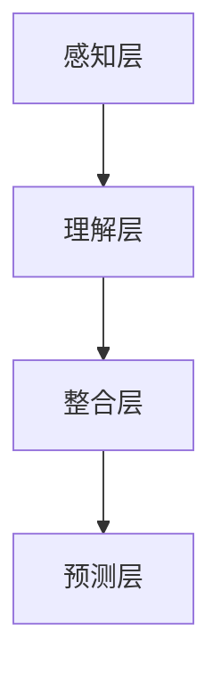
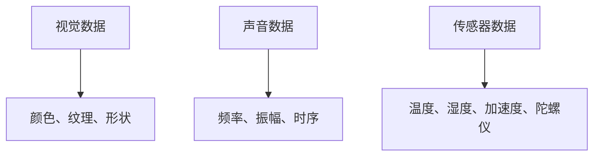
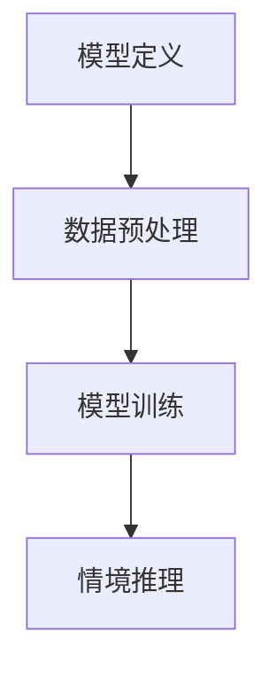
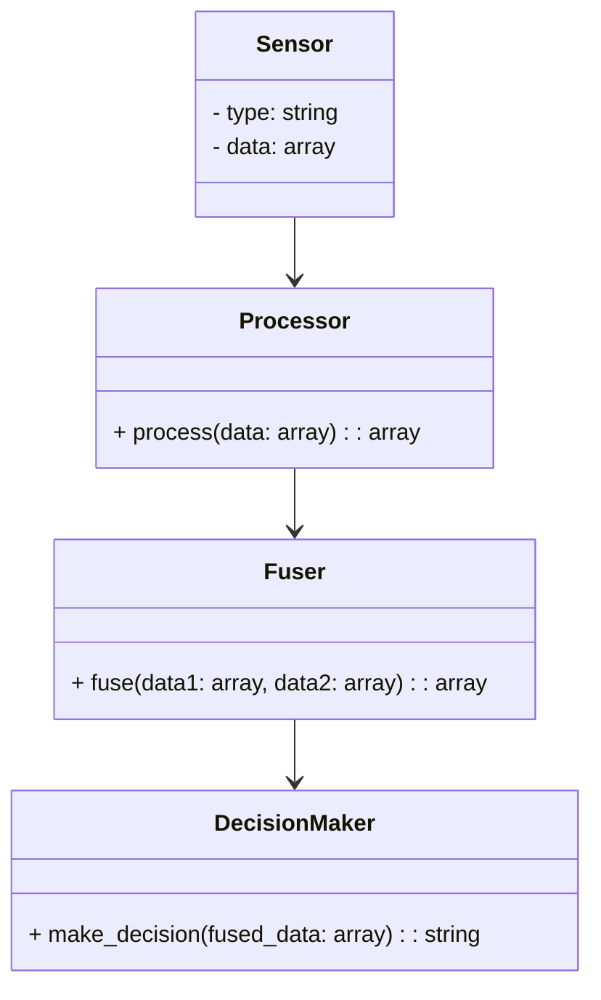

                 

## 引言：情境感知与AI Agent的环境理解能力

在当今科技迅猛发展的时代，人工智能（AI）技术已经成为推动社会进步的重要力量。从自动驾驶汽车到智能家居系统，AI的应用无处不在，显著地改变了我们的生活方式。然而，AI系统在处理复杂环境和做出智能决策方面仍面临诸多挑战。这主要归因于AI系统在理解环境情境方面的局限性。

### 情境感知的重要性

情境感知（Situation Awareness，简称SA）是指个体或系统通过感知和理解其环境中的相关信息，实现对当前情境的认识和判断。情境感知在AI系统中扮演着至关重要的角色，因为它能够帮助AI Agent（人工智能代理）更好地理解和响应复杂多变的环境。以下是情境感知在AI系统中的重要性和应用场景：

1. **提高决策准确性**：通过情境感知，AI Agent可以获取到环境中的实时信息，从而做出更准确的决策。例如，自动驾驶汽车需要通过情境感知来识别交通信号、行人、其他车辆等，以避免交通事故。

2. **增强交互体验**：在智能家居系统中，情境感知技术可以帮助智能设备理解用户的习惯和环境变化，从而提供更加个性化、贴心的服务。

3. **优化资源分配**：在智能交通系统中，情境感知技术可以实时监测交通流量，优化交通信号灯的配时，提高道路通行效率。

4. **保障系统安全**：在军事、安防等领域，情境感知技术可以帮助监控系统实时识别异常情况，提高预警和响应能力。

### AI Agent的环境理解能力

AI Agent是一种能够自动执行任务、与外部环境进行交互的人工智能实体。环境理解能力是AI Agent的核心能力之一，它决定了AI Agent能否在复杂环境中有效运作。情境感知技术为AI Agent提供了强大的环境理解能力，使得AI Agent能够：

1. **实时感知环境变化**：通过多种传感器收集环境数据，AI Agent能够实时感知环境变化，快速适应新的情境。

2. **理解情境含义**：AI Agent通过情境感知技术理解环境中的情境含义，例如理解交通信号灯的含义，从而做出相应的反应。

3. **做出智能决策**：基于对环境的理解和分析，AI Agent能够自主做出智能决策，例如在交通拥堵时选择最佳路线。

### 本文目的

本文旨在深入探讨情境感知技术在增强AI Agent的环境理解能力方面的应用。我们将从以下几个方面展开讨论：

1. **情境感知概述**：介绍情境感知的概念、重要性及其应用领域。
2. **情境感知的核心概念**：探讨感知层次结构、数据类型与特征提取、情境建模与推理等核心概念。
3. **情境感知技术**：详细介绍视觉感知、声音感知、传感器融合与多模态感知技术。
4. **增强AI Agent的环境理解能力**：分析AI Agent在情境感知中的应用，探讨如何增强其环境理解能力。
5. **情境感知在具体领域的应用**：探讨情境感知在智能家居、智能交通等领域的具体应用。
6. **情境感知技术的挑战与未来发展方向**：分析情境感知技术的挑战，探讨未来发展方向。
7. **案例研究**：通过具体案例研究，展示情境感知技术在实际应用中的效果。
8. **总结与展望**：总结本文的主要内容，展望未来情境感知技术的发展趋势。

通过本文的讨论，我们希望能够为读者提供一个全面、深入的情境感知与AI Agent环境理解能力的理解框架，并为相关领域的研究和实践提供有益的参考。

### 第一部分：情境感知概述

#### 第1章：情境感知的概念与重要性

## 1.1 情境感知的定义与历史发展

情境感知（Situation Awareness，简称SA）是一种理解和感知周围环境及其变化的能力，它涉及到对当前情境的理解、预测和适应。情境感知的概念起源于军事领域，首次由美国空军飞行员Harry Yeide在1970年代提出。最初，情境感知主要关注飞行员在执行任务时对飞机状态和周围环境的感知，旨在提高飞行员在复杂战场环境下的生存和任务执行能力。

随着时间的推移，情境感知的概念逐渐扩展到其他领域。1980年代，情境感知研究开始应用于医学和紧急响应领域，例如急救人员在事故现场对伤者状况的快速评估。1990年代，情境感知研究进一步扩展到工业自动化和网络安全领域，重点关注系统对环境异常的实时检测和响应能力。

情境感知的发展历程可以分为几个关键阶段：

1. **初期探索**（1970-1980年代）：情境感知的概念初步形成，主要集中在军事和航空领域。

2. **概念扩展**（1980-1990年代）：情境感知的应用领域不断扩大，从军事扩展到医疗、紧急响应和工业自动化。

3. **理论和方法发展**（1990年代至今）：情境感知研究逐渐成熟，形成了包括感知层、理解层和决策层在内的多层次结构。同时，多种技术手段，如传感器技术、数据融合、机器学习和人工智能，被广泛应用于情境感知。

### 情境感知的定义与核心要素

情境感知可以定义为一种系统或个体通过感知、理解、整合和分析其环境中的信息，形成对当前情境的认识和预测能力。它主要包括以下几个核心要素：

1. **感知**：指通过传感器或直接观察获取环境信息的过程。感知是情境感知的基础，决定了系统能够获取哪些环境数据。

2. **理解**：指对获取到的环境信息进行分析和解释的过程。理解使得系统能够将感知到的信息转化为对情境的认知。

3. **整合**：指将不同来源的信息进行融合和整合，以形成对整体情境的全面认识。整合是情境感知的重要组成部分，特别是在多模态感知系统中。

4. **预测**：指基于当前和过去的信息，对未来的情境进行预测。预测能力使得系统能够提前应对可能的情境变化，做出更明智的决策。

### 情境感知在不同领域的应用

情境感知技术在多个领域得到了广泛应用，下面列举几个典型领域：

1. **军事领域**：情境感知技术在军事领域被广泛应用，用于提升士兵和飞行员的战场感知能力。例如，通过态势感知系统，指挥官可以实时获取战场情报，进行有效的指挥和决策。

2. **医疗领域**：在医疗领域，情境感知技术被用于病人监测和急救。通过实时感知病人生命体征，医生可以及时发现问题并进行干预。

3. **智能交通**：情境感知技术被广泛应用于智能交通系统，用于实时监测交通流量、车辆位置和道路状况。通过分析这些数据，智能交通系统能够优化交通信号灯的配时，提高道路通行效率。

4. **工业自动化**：在工业自动化领域，情境感知技术被用于设备监控和故障检测。通过实时监测设备状态，系统可以及时发现故障并进行维护。

5. **智能家居**：在智能家居领域，情境感知技术被用于环境监测和智能设备控制。通过感知室内温度、湿度、光照等环境因素，智能家居系统能够提供更加舒适和智能化的生活环境。

### 结论

情境感知作为一种理解和感知环境的能力，其发展历程和应用领域不断扩展。通过多种技术手段，情境感知技术为AI系统提供了强大的环境理解能力，使得AI系统能够在复杂环境中做出更准确的决策。在接下来的章节中，我们将进一步探讨情境感知的核心概念、技术原理及其在AI Agent中的应用。

## 1.2 情境感知的重要性

情境感知在当今的科技和社会中扮演着至关重要的角色，其重要性体现在多个方面。首先，情境感知是智能系统实现自主决策和自适应行为的核心能力之一。无论是自动驾驶汽车、智能家居系统，还是智能交通管理，情境感知都是这些系统能够有效运作的关键。通过实时感知和解析环境信息，智能系统能够做出更加合理和高效的决策，从而提升系统的性能和用户体验。

### 提高系统的智能决策能力

情境感知技术使得AI系统能够在复杂、动态的环境中做出智能决策。例如，在自动驾驶汽车中，情境感知技术能够实时感知道路状况、交通信号、行人行为等，从而为车辆提供最优行驶路线和速度控制策略。这不仅能够提高行驶安全性，还能提高交通效率。在智能家居系统中，情境感知技术可以帮助智能设备理解用户的生活习惯和环境变化，从而提供更加个性化、便捷的服务，如自动调节室内温度、湿度，智能控制家电设备等。

### 增强系统的用户体验

情境感知技术能够显著提升用户的体验。以智能家居系统为例，当用户进入家中时，情境感知技术能够自动识别用户身份，调整灯光、音乐和温度，从而营造出舒适的生活环境。这种个性化服务不仅提高了用户的便利性，还提升了用户的满意度和幸福感。在医疗领域，情境感知技术可以帮助医护人员实时监测病人的生命体征，提前发现潜在的健康问题，提供更加精准和及时的医疗服务。

### 优化资源利用

在智能交通领域，情境感知技术能够实时监测交通流量和道路状况，通过优化交通信号灯的配时和路线规划，有效缓解交通拥堵，提高道路通行效率。此外，情境感知技术还可以用于资源管理，如在工业生产中实时监测设备状态，预测设备故障，提前进行维护，从而降低生产中断率和维护成本。

### 改善安全性和应急响应

情境感知技术在保障系统安全性和应急响应方面也发挥着重要作用。在军事和安全领域，情境感知技术可以用于实时监测和识别异常情况，提高预警和响应能力。在自然灾害发生时，情境感知技术可以帮助救援人员快速了解灾情，规划救援路线，提高救援效率。

### 案例分析

以下是一些具体的案例分析，展示了情境感知在不同领域的实际应用和效果：

1. **自动驾驶汽车**：特斯拉等公司在其自动驾驶系统中广泛应用了情境感知技术。通过感知道路标志、交通信号灯和周围车辆的行为，特斯拉的自动驾驶系统能够自动调整车速和方向，实现安全、高效的自动驾驶。

2. **智能交通系统**：新加坡的智能交通系统通过情境感知技术实时监测交通流量和道路状况，优化交通信号灯配时，有效缓解了城市交通拥堵问题。

3. **智能家居系统**：亚马逊的Echo智能音箱利用情境感知技术，能够自动识别用户声音和语意，提供个性化的音乐播放、天气查询和智能家居控制等服务。

4. **医疗监控**：某医院引进了一套基于情境感知技术的病人监控系统，通过实时监测病人的生命体征，医护人员可以及时掌握病人的健康状态，提前采取必要的医疗措施。

### 结论

情境感知技术的重要性不言而喻，它不仅提升了系统的智能化程度和用户体验，还在资源优化、安全性和应急响应等方面发挥了重要作用。在未来的发展中，情境感知技术将继续在各个领域得到广泛应用，推动人工智能技术不断进步。在接下来的章节中，我们将进一步探讨情境感知的核心概念和技术原理，以深入了解这一领域的深层次内容。

### 第2章：情境感知的核心概念

在深入探讨情境感知技术的应用之前，我们需要理解其背后的核心概念。这一章将详细介绍情境感知的关键组成部分，包括感知层次结构、数据类型与特征提取，以及情境建模与推理。这些概念是构建情境感知系统的基石，它们决定了系统能够如何有效地理解和应对复杂环境。

## 2.1 感知层次结构

情境感知系统通常由多个层次组成，每个层次负责不同的感知任务，这些层次相互关联，共同构成了一个完整的感知体系。感知层次结构一般包括以下几个层次：

### 1. 感知层（Perception Layer）

感知层是情境感知系统的最底层，主要负责从环境中获取信息。这一层依赖于各种传感器，如摄像头、麦克风、温度传感器、湿度传感器等，来收集环境中的原始数据。例如，摄像头可以捕捉图像，麦克风可以捕捉声音，温度传感器可以测量环境温度。

### 2. 理解层（Comprehension Layer）

理解层负责对感知层获取的数据进行分析和解释。这一层的任务是将原始数据转化为有意义的信息，使其能够被系统理解和利用。例如，通过对摄像头捕捉到的图像进行处理，系统能够识别出图像中的物体、颜色和形状。

### 3. 整合层（Integration Layer）

整合层负责将来自不同源的信息进行融合和整合，形成一个全面、一致的情境表示。这一层的关键在于如何有效地融合多模态数据，例如将视觉信息与声音信息相结合，以获得更全面的情境理解。

### 4. 预测层（Prediction Layer）

预测层基于当前的情境信息，结合历史数据，对未来的情境变化进行预测。这一层的目的是使系统能够提前预知可能发生的变化，从而做出更准确的决策。例如，在智能交通系统中，预测层可以预测交通流量变化，为交通信号灯提供最优配时方案。

### 感知层次结构示例

以下是一个简化的感知层次结构的Mermaid流程图：



在这个流程图中，感知层通过传感器收集环境数据，数据被传递到理解层进行分析和解释。理解层的结果被整合层融合，形成对当前情境的全面理解。最后，整合层的结果被用于预测层，预测未来的情境变化。

## 2.2 数据类型与特征提取

情境感知系统依赖于从环境中收集的各种类型的数据，这些数据可以是视觉数据、声音数据、传感器数据等。每种数据类型都有其独特的特征和提取方法。

### 视觉数据

视觉数据是情境感知中最常见的数据类型，它通常由摄像头捕捉的图像组成。视觉数据的主要特征包括颜色、纹理、形状和位置等。为了从视觉数据中提取这些特征，常用的方法包括：

- **边缘检测**：用于识别图像中的边缘和轮廓。
- **特征点提取**：用于识别图像中的关键点，如角点、圆弧点等。
- **深度学习**：通过卷积神经网络（CNN）提取图像的深层次特征。

### 声音数据

声音数据由麦克风捕捉，其主要特征包括频率、振幅和时序等。为了从声音数据中提取这些特征，常用的方法包括：

- **傅里叶变换**：用于分析声音信号的频谱特征。
- **梅尔频率倒谱系数（MFCC）**：用于识别声音的频率特征。
- **循环神经网络（RNN）**：用于处理声音信号的时间序列特征。

### 传感器数据

传感器数据包括温度、湿度、加速度、陀螺仪等多种类型。这些数据通常通过各种物理传感器收集。传感器数据的主要特征包括：

- **静态特征**：如温度、湿度等，通常需要通过阈值方法进行特征提取。
- **动态特征**：如加速度、速度等，通常需要通过信号处理方法进行特征提取。

### 数据类型与特征提取示例

以下是一个简化的数据类型与特征提取流程的Mermaid流程图：



在这个流程图中，不同的数据类型经过特定的特征提取方法处理后，转化为可供情境感知系统使用的信息。

## 2.3 情境建模与推理

情境建模是情境感知系统的核心步骤之一，它涉及将收集到的数据转化为对当前情境的表示和理解。情境建模通常包括以下几个步骤：

### 1. 模型定义

模型定义是情境建模的第一步，它涉及到确定情境的表示方法和模型的结构。常见的情境表示方法包括：

- **符号表示法**：使用符号和逻辑关系来表示情境。
- **图表示法**：使用图形和节点来表示情境。
- **概率表示法**：使用概率分布来表示情境的不确定性。

### 2. 数据预处理

在建立模型之前，通常需要对收集到的数据进行预处理。数据预处理包括去除噪声、填充缺失值、标准化等步骤，以确保数据的质量和一致性。

### 3. 模型训练

模型训练是通过学习历史数据来优化模型参数的过程。常见的训练方法包括：

- **规则推理**：通过定义一系列规则来描述情境。
- **机器学习**：通过训练模型来自动发现数据中的模式和关系。
- **深度学习**：通过大规模数据训练复杂的神经网络模型。

### 4. 情境推理

情境推理是模型在实际应用中的关键步骤，它涉及到如何使用模型来理解当前情境并做出预测。情境推理可以基于以下几种方法：

- **确定性推理**：基于已知的事实和规则，推理出可能的结论。
- **概率推理**：基于概率分布，推理出情境的可能状态。
- **不确定性推理**：在存在不确定性的情况下，推理出最有可能的情境。

### 情境建模与推理示例

以下是一个简化的情境建模与推理过程的Mermaid流程图：



在这个流程图中，模型定义和数据预处理是情境建模的基础，模型训练是优化模型的过程，而情境推理是模型在实际应用中的关键步骤。

### 结论

情境感知的核心概念包括感知层次结构、数据类型与特征提取，以及情境建模与推理。这些概念共同构成了情境感知系统的理论基础，是理解和应用情境感知技术的基础。在接下来的章节中，我们将深入探讨情境感知技术在不同领域的应用，进一步展示其强大功能和广泛影响。

### 第3章：情境感知技术

在深入探讨情境感知技术之前，我们需要了解情境感知技术的核心组成部分，包括视觉感知、声音感知和传感器融合与多模态感知。本章将详细介绍这些技术，并展示它们在实际应用中的具体实现方法。

#### 3.1 视觉感知

视觉感知是情境感知技术中最为常见的一种，它依赖于摄像头或其他图像传感器来捕获环境中的图像数据。视觉感知技术主要包括图像识别与处理、深度学习在视觉感知中的应用等。

##### 3.1.1 图像识别与处理

图像识别与处理是视觉感知的基础，它包括从图像中提取有用信息并对其进行分类和识别。常用的图像处理技术包括：

1. **边缘检测**：用于识别图像中的边缘和轮廓，常用的算法有Canny边缘检测算法。
   
   ```mermaid
   graph TD
       A[图像] --> B[边缘检测]
       B --> C[边缘图像]
   ```

2. **特征点提取**：用于识别图像中的关键点，如角点、圆弧点等，常用的算法有SIFT和SURF。

   ```mermaid
   graph TD
       A[图像] --> B[特征点提取]
       B --> C[特征点]
   ```

3. **目标检测**：用于识别图像中的特定目标，常用的算法有YOLO和SSD。

   ```mermaid
   graph TD
       A[图像] --> B[目标检测]
       B --> C[目标位置]
   ```

##### 3.1.2 深度学习在视觉感知中的应用

深度学习是视觉感知技术中的重要分支，通过训练大规模神经网络模型，深度学习能够从大量图像数据中自动提取深层次的特征，从而实现高效的图像识别与处理。以下是深度学习在视觉感知中的应用：

1. **卷积神经网络（CNN）**：CNN是一种专门用于图像处理的神经网络结构，通过多层卷积和池化操作，CNN能够提取图像的深层特征。

   ```mermaid
   graph TD
       A[输入图像] --> B[卷积层]
       B --> C[池化层]
       C --> D[全连接层]
       D --> E[输出结果]
   ```

2. **生成对抗网络（GAN）**：GAN是一种通过对抗训练生成逼真图像的数据生成模型，广泛应用于图像修复、风格迁移等领域。

   ```mermaid
   graph TD
       A[真实图像] --> B[生成器]
       B --> C[判别器]
       C --> D[生成图像]
   ```

##### 3.1.3 实际应用案例

以下是一个实际应用案例，展示了如何使用深度学习技术实现图像识别：

**案例：智能监控系统的物体识别**

1. **问题背景**：智能监控系统需要实时识别监控区域内的物体，如行人、车辆等，以便进行安全和事件分析。
2. **解决方案**：使用深度学习模型（如YOLO）对监控视频中的每一帧进行物体识别，提取物体的位置和类别信息。
3. **效果评估**：通过对比识别结果和实际场景，评估模型的准确性和实时性。

```python
# 使用YOLO模型进行物体识别
import cv2
import numpy as np
import tensorflow as tf

# 加载YOLO模型
model = tf.keras.models.load_model('yolo_model.h5')

# 读取监控视频
cap = cv2.VideoCapture('camera_feed.mp4')

while True:
    ret, frame = cap.read()
    if not ret:
        break

    # 对图像进行预处理
    input_image = preprocess_image(frame)

    # 使用YOLO模型进行物体识别
    boxes, scores, classes = model.predict(input_image)

    # 提取识别结果
    for box, score, class_id in zip(boxes, scores, classes):
        if score > 0.5:
            x1, y1, x2, y2 = box
            label = class_id
            cv2.rectangle(frame, (x1, y1), (x2, y2), (0, 255, 0), 2)
            cv2.putText(frame, label, (x1, y1 - 10), cv2.FONT_HERSHEY_SIMPLEX, 0.5, (255, 0, 0), 2)

    # 显示识别结果
    cv2.imshow('Object Detection', frame)

    if cv2.waitKey(1) & 0xFF == ord('q'):
        break

cap.release()
cv2.destroyAllWindows()
```

#### 3.2 声音感知

声音感知是情境感知技术中的另一个重要组成部分，它依赖于麦克风或其他声音传感器来捕获环境中的声音数据。声音感知技术主要包括声音特征提取与识别、语音识别与自然语言处理等。

##### 3.2.1 声音特征提取与识别

声音特征提取是声音感知的基础，它涉及从声音数据中提取出有意义的特征，如频率、振幅、时序等。常用的声音特征提取方法包括：

1. **傅里叶变换（FFT）**：用于分析声音信号的频谱特征，提取频率信息。

   ```mermaid
   graph TD
       A[声音数据] --> B[FFT]
       B --> C[频谱图]
   ```

2. **梅尔频率倒谱系数（MFCC）**：用于识别声音的频率特征，广泛应用于语音识别和音乐分析。

   ```mermaid
   graph TD
       A[声音数据] --> B[MFCC]
       B --> C[MFCC特征]
   ```

3. **隐马尔可夫模型（HMM）**：用于声音识别，通过模型训练和特征匹配实现声音的自动识别。

   ```mermaid
   graph TD
       A[声音数据] --> B[HMM]
       B --> C[识别结果]
   ```

##### 3.2.2 语音识别与自然语言处理

语音识别与自然语言处理是声音感知技术的应用层面，它们将声音数据转化为可理解的自然语言文本。语音识别的主要任务是将语音信号转换为文本，而自然语言处理则对生成的文本进行分析和处理。以下是一些关键技术：

1. **自动语音识别（ASR）**：使用神经网络模型（如RNN、LSTM）进行语音信号到文本的转换。

   ```mermaid
   graph TD
       A[语音信号] --> B[RNN]
       B --> C[文本]
   ```

2. **自然语言处理（NLP）**：对生成的文本进行语义分析和理解，常用的技术包括词向量、词性标注、句法分析等。

   ```mermaid
   graph TD
       A[文本] --> B[NLP]
       B --> C[语义信息]
   ```

##### 3.2.3 实际应用案例

以下是一个实际应用案例，展示了如何使用声音感知技术实现语音识别：

**案例：智能助手语音交互**

1. **问题背景**：智能助手需要能够理解用户的语音指令，并执行相应的操作。
2. **解决方案**：使用语音识别技术（如基于深度学习的ASR模型）对用户的语音指令进行识别，并使用自然语言处理技术对指令进行语义解析。
3. **效果评估**：通过实际交互测试，评估智能助手的语音识别准确率和指令执行效果。

```python
# 使用基于深度学习的ASR模型进行语音识别
import speech_recognition as sr

# 初始化语音识别器
recognizer = sr.Recognizer()

# 读取音频文件
with sr.AudioFile('user_command.mp3') as source:
    audio = recognizer.record(source)

# 使用ASR模型进行语音识别
text = recognizer.recognize_google(audio)

# 输出识别结果
print("用户说：", text)
```

#### 3.3 传感器融合与多模态感知

传感器融合是将多个传感器获取的信息进行整合，以获得更全面、更准确的情境表示。多模态感知是传感器融合的一种形式，它通过整合不同类型的数据（如视觉、声音、温度等），实现更高效的情境理解。

##### 3.3.1 传感器类型与数据融合方法

传感器类型包括视觉传感器、声音传感器、温度传感器、湿度传感器等。数据融合方法包括：

1. **卡尔曼滤波**：用于估计系统的状态，通过最小化误差来融合多个传感器的数据。

   ```mermaid
   graph TD
       A[传感器数据] --> B[卡尔曼滤波]
       B --> C[融合结果]
   ```

2. **贝叶斯推理**：通过概率分布来融合多个传感器的数据，实现情境的联合概率估计。

   ```mermaid
   graph TD
       A[传感器数据] --> B[贝叶斯推理]
       B --> C[融合结果]
   ```

3. **隐马尔可夫模型（HMM）**：用于处理时间序列数据，通过状态转移矩阵实现传感器数据的融合。

   ```mermaid
   graph TD
       A[传感器数据] --> B[HMM]
       B --> C[融合结果]
   ```

##### 3.3.2 多模态感知系统架构

多模态感知系统架构通常包括感知层、数据处理层、融合层和决策层。以下是一个简化的多模态感知系统架构的Mermaid类图：



在这个类图中，传感器负责采集不同类型的数据，处理器对数据进行处理，融合器将多个传感器的数据融合，最终由决策器根据融合后的数据做出决策。

##### 3.3.3 实际应用案例

以下是一个实际应用案例，展示了如何使用传感器融合与多模态感知技术实现智能家居系统的情境感知：

**案例：智能家居情境感知**

1. **问题背景**：智能家居系统需要感知用户的生活习惯和环境变化，以提供个性化的服务。
2. **解决方案**：使用多模态感知技术，整合视觉、声音、温度传感器数据，通过传感器融合技术实现情境感知。
3. **效果评估**：通过实际使用测试，评估智能家居系统的情境感知能力和服务质量。

```python
# 使用传感器融合与多模态感知实现智能家居情境感知
import numpy as np
import sensor_fusion_module as sfm

# 初始化传感器
vision_sensor = sfm.Sensor('vision')
sound_sensor = sfm.Sensor('sound')
temp_sensor = sfm.Sensor('temp')

# 采集传感器数据
vision_data = vision_sensor.collect_data()
sound_data = sound_sensor.collect_data()
temp_data = temp_sensor.collect_data()

# 处理传感器数据
vision_processor = sfm.Processor('vision')
sound_processor = sfm.Processor('sound')
temp_processor = sfm.Processor('temp')

processed_vision_data = vision_processor.process(vision_data)
processed_sound_data = sound_processor.process(sound_data)
processed_temp_data = temp_processor.process(temp_data)

# 融合传感器数据
fuser = sfm.Fuser()
fused_data = fuser.fuse(processed_vision_data, processed_sound_data, processed_temp_data)

# 基于融合数据做出决策
decision_maker = sfm.DecisionMaker()
action = decision_maker.make_decision(fused_data)

# 输出决策结果
print("决策动作：", action)
```

### 结论

情境感知技术是情境感知系统的核心，通过视觉感知、声音感知和传感器融合与多模态感知，系统能够有效地理解和应对复杂环境。这些技术的具体实现方法为智能系统提供了强大的情境感知能力，使得它们能够做出更准确、更智能的决策。在下一章中，我们将探讨如何增强AI Agent的环境理解能力，进一步展示情境感知技术的实际应用价值。

### 第4章：增强AI Agent的环境理解能力

情境感知技术在增强AI Agent的环境理解能力方面发挥着至关重要的作用。在这一章中，我们将详细探讨AI Agent的背景与定义，分析AI Agent在情境感知中的应用，以及如何通过情境感知技术来增强AI Agent的环境理解能力。

#### 4.1 AI Agent的背景与定义

AI Agent是一种能够自主执行任务、与外部环境进行交互的智能实体。它通常由一个或多个智能组件组成，包括感知模块、决策模块和行动模块。AI Agent的设计目标是实现智能自主性，使其能够在一个复杂、动态的环境中自主运行，并做出合理的决策。

- **感知模块**：负责收集环境中的各种信息，如视觉、声音、传感器数据等。
- **决策模块**：负责分析感知模块收集到的信息，并根据预定的策略或学习算法生成决策。
- **行动模块**：负责执行决策模块生成的决策，与环境进行交互。

AI Agent最早出现在人工智能（AI）领域，随着计算技术和AI算法的不断发展，AI Agent的应用范围不断扩大，从简单的任务执行到复杂的应用场景，如自动驾驶、智能家居、智能医疗等。

#### 4.2 AI Agent在情境感知中的应用

情境感知技术在AI Agent中的应用主要体现在以下几个方面：

1. **实时环境监测**：AI Agent通过感知模块实时监测环境中的各种变化，如交通流量、室内温度、噪音水平等。这些监测数据为AI Agent提供了实时、动态的环境信息，使其能够更好地理解当前的环境状态。

2. **情境分析**：基于感知模块收集到的数据，AI Agent通过情境分析模块对当前环境进行理解和解释。情境分析包括对环境中的物体、行为、事件等进行识别和分类，从而形成对当前情境的全面理解。

3. **智能决策**：在理解当前情境的基础上，AI Agent通过决策模块生成相应的决策。这些决策可以是简单的行动指令，如调整空调温度、开启灯光等，也可以是复杂的策略，如规划交通路线、预测市场趋势等。

4. **自主行动**：AI Agent根据决策模块生成的决策执行行动模块，与环境进行交互，实现任务的自动化执行。例如，在自动驾驶汽车中，AI Agent会根据感知到的交通情况和路况，自主调整车速、转向等，确保行驶安全。

#### 4.3 增强AI Agent的环境理解能力

情境感知技术为AI Agent提供了强大的环境理解能力，从而显著提升了其自主性和智能化水平。以下是一些关键方法，用于增强AI Agent的环境理解能力：

1. **多模态感知**：通过整合多种传感器数据，如视觉、声音、温度、湿度等，AI Agent能够获取更全面、更准确的环境信息。多模态感知使得AI Agent能够从不同角度理解环境，提高情境分析的能力。

2. **情境建模**：通过建立情境模型，AI Agent可以更好地理解和预测环境变化。情境模型通常包括感知层、理解层和决策层，通过分层结构，AI Agent能够实现从感知数据到智能决策的完整流程。

3. **机器学习与深度学习**：利用机器学习和深度学习算法，AI Agent可以从大量历史数据中自动学习环境规律和模式。这些算法能够帮助AI Agent识别复杂的情境特征，提高环境理解能力。

4. **强化学习**：通过强化学习算法，AI Agent可以在实际环境中不断学习和优化决策策略。强化学习使得AI Agent能够通过试错和反馈机制，逐步提高环境理解和应对能力。

5. **知识图谱**：通过构建知识图谱，AI Agent可以整合和关联各种情境信息，形成对复杂情境的全面理解。知识图谱提供了语义化的情境表示，使得AI Agent能够进行高效的情境推理和决策。

#### 实际应用案例

以下是一个实际应用案例，展示了如何通过情境感知技术增强AI Agent的环境理解能力：

**案例：智能交通系统中的AI Agent**

1. **问题背景**：智能交通系统需要实时监测交通流量，预测交通拥堵，并自动调整交通信号灯，提高道路通行效率。

2. **解决方案**：使用情境感知技术，整合摄像头、传感器和气象数据，构建一个多模态感知系统。AI Agent通过感知模块实时获取交通信息，通过情境建模和机器学习算法分析交通流量和路况，通过决策模块生成交通信号灯控制策略，并通过行动模块调整交通信号灯。

3. **效果评估**：通过实际交通数据测试，AI Agent能够显著降低交通拥堵时间，提高道路通行效率。情境感知技术使得AI Agent能够更准确地理解和预测交通环境变化，从而做出更合理的交通信号灯控制决策。

```python
# 智能交通系统中的AI Agent实现示例
import numpy as np
import traffic_perception_module as tm
import traffic_decision_module as dm

# 初始化感知模块
camera_sensor = tm.CameraSensor()
sensor_data = camera_sensor.collect_data()

# 初始化决策模块
decision_maker = dm.TrafficDecisionMaker()

# 分析交通流量
traffic_status = decision_maker.analyze_traffic(sensor_data)

# 根据交通流量生成信号灯控制策略
signal_control_strategy = decision_maker.generate_signal_control_strategy(traffic_status)

# 调整交通信号灯
signal_controller = tm.SignalController()
signal_controller.apply_strategy(signal_control_strategy)

# 输出控制结果
print("交通信号灯控制结果：", signal_control_strategy)
```

#### 结论

情境感知技术在增强AI Agent的环境理解能力方面发挥着关键作用。通过多模态感知、情境建模、机器学习与深度学习、强化学习、知识图谱等技术的应用，AI Agent能够更全面、更准确地理解和预测复杂环境的变化，从而实现更智能、更高效的决策和行动。在下一章中，我们将探讨情境感知在具体领域的应用，进一步展示情境感知技术的实际价值和广泛影响。

### 第5章：情境感知在具体领域的应用

情境感知技术因其强大的环境理解和智能决策能力，已在多个领域展现出巨大的应用潜力。本章将重点探讨情境感知在智能家居和智能交通两大领域的具体应用，并详细分析这些领域中的系统架构设计。

#### 5.1 智能家居

智能家居系统通过情境感知技术，实现了对家庭环境的智能监控和控制，为用户提供了更加舒适、便捷的生活方式。以下是情境感知在智能家居中的具体应用：

##### 5.1.1 情境感知在智能家居中的应用

1. **环境监测**：智能家居系统通过整合多种传感器（如温度传感器、湿度传感器、烟雾传感器等），实时监测室内环境参数。情境感知技术能够分析这些数据，识别环境中的异常状况，如高温、高湿或烟雾等。

2. **智能控制**：基于情境感知技术，智能家居系统能够自动调节家中的灯光、温度、湿度等，以提供舒适的生活环境。例如，当用户进入房间时，系统可以自动打开灯光，调整空调温度，以适应用户的喜好。

3. **安全监控**：情境感知技术可以用于监控家庭安全。通过摄像头和运动传感器，系统可以实时监控家庭环境，识别异常行为，如入侵者或火灾等，并及时发出警报。

4. **个性化服务**：情境感知技术可以帮助智能家居系统理解用户的行为习惯，提供个性化的服务。例如，系统可以根据用户的作息时间，自动调节灯光和温度，提供最佳的睡眠环境。

##### 5.1.2 智能家居系统架构设计

智能家居系统的架构设计通常包括以下几个关键组成部分：

1. **感知层**：负责收集环境数据，包括温度、湿度、光照、声音、运动等。常用的传感器有温度传感器、湿度传感器、运动传感器、烟雾传感器等。

   ```mermaid
   graph TD
       A[环境传感器] --> B[数据收集]
       B --> C[感知层]
   ```

2. **数据处理层**：负责处理和存储感知层收集到的数据。数据处理层通常包括数据预处理、特征提取、数据存储等模块。

   ```mermaid
   graph TD
       C --> D[数据处理层]
       D --> E[特征提取]
       E --> F[数据存储]
   ```

3. **决策层**：基于情境感知技术，对感知层收集到的数据进行分析和决策。决策层包括情境分析、智能控制策略生成等模块。

   ```mermaid
   graph TD
       D --> G[决策层]
       G --> H[情境分析]
       H --> I[控制策略生成]
   ```

4. **执行层**：负责执行决策层的控制指令，实现对家庭设备的控制。执行层包括灯光控制器、空调控制器、窗帘控制器等。

   ```mermaid
   graph TD
       I --> J[执行层]
       J --> K[灯光控制器]
       K --> L[空调控制器]
       L --> M[窗帘控制器]
   ```

##### 实际应用案例

**案例：智能照明系统**

1. **问题背景**：用户希望在进入房间时自动开启灯光，离开房间时自动关闭灯光。

2. **解决方案**：安装运动传感器和智能灯光控制器。当用户进入房间时，运动传感器检测到用户活动，触发灯光控制器自动打开灯光。当用户离开房间一段时间后，运动传感器未检测到活动，触发灯光控制器自动关闭灯光。

3. **效果评估**：通过实际使用测试，用户报告智能照明系统显著提高了生活便利性，减少了能源浪费。

```python
# 智能照明系统实现示例
import time
import motion_sensor_module as ms
import light_controller_module as lc

# 初始化运动传感器和灯光控制器
motion_sensor = ms.MotionSensor()
light_controller = lc.LightController()

# 监测用户活动
while True:
    activity_detected = motion_sensor.detect_activity()
    if activity_detected:
        light_controller.turn_on()
    else:
        time.sleep(60)  # 用户离开一段时间后，关闭灯光
        light_controller.turn_off()

    time.sleep(1)  # 控制循环间隔
```

#### 5.2 智能交通

智能交通系统通过情境感知技术，实现了对交通流量、路况、车辆位置等信息的实时监测和智能管理，有效提高了交通效率和安全水平。以下是情境感知在智能交通中的具体应用：

##### 5.2.1 情境感知在智能交通中的应用

1. **交通流量监测**：通过安装在道路上的摄像头和传感器，智能交通系统能够实时监测交通流量和路况。情境感知技术可以分析这些数据，识别交通拥堵区域，预测交通状况。

2. **交通信号控制**：基于情境感知技术，智能交通系统能够自动调整交通信号灯的配时，优化交通流量。例如，在高峰时段，系统可以根据实时交通流量调整信号灯时间，减少交通拥堵。

3. **车辆管理**：通过情境感知技术，智能交通系统能够监控车辆的位置、速度和行驶方向，实现智能交通管理和导航。例如，系统可以为驾驶者提供最优行驶路线，避开拥堵路段。

4. **安全监控**：情境感知技术可以用于监控道路安全，识别潜在的危险行为，如超速、闯红灯等，及时发出预警。

##### 5.2.2 智能交通系统架构设计

智能交通系统的架构设计通常包括以下几个关键组成部分：

1. **感知层**：负责收集交通数据，包括交通流量、路况、车辆位置等。常用的传感器有摄像头、雷达、GPS等。

   ```mermaid
   graph TD
       A[交通传感器] --> B[数据收集]
       B --> C[感知层]
   ```

2. **数据处理层**：负责处理和存储感知层收集到的数据。数据处理层通常包括数据预处理、特征提取、数据存储等模块。

   ```mermaid
   graph TD
       C --> D[数据处理层]
       D --> E[特征提取]
       E --> F[数据存储]
   ```

3. **决策层**：基于情境感知技术，对感知层收集到的数据进行分析和决策。决策层包括交通流量分析、信号灯控制策略生成等模块。

   ```mermaid
   graph TD
       D --> G[决策层]
       G --> H[交通流量分析]
       H --> I[信号灯控制策略生成]
   ```

4. **执行层**：负责执行决策层的控制指令，实现对交通信号灯、车辆导航等设备的控制。

   ```mermaid
   graph TD
       I --> J[执行层]
       J --> K[信号灯控制器]
       K --> L[车辆导航系统]
   ```

##### 实际应用案例

**案例：智能交通信号控制系统**

1. **问题背景**：城市交通拥堵严重，需要优化交通信号灯的配时，提高交通效率。

2. **解决方案**：安装交通流量传感器，实时监测交通流量。基于情境感知技术，智能交通信号控制系统可以自动调整交通信号灯的配时，优化交通流量。

3. **效果评估**：通过实际应用，系统显著减少了交通拥堵时间，提高了道路通行效率。

```python
# 智能交通信号控制系统实现示例
import time
import traffic_sensor_module as ts
import traffic_light_controller_module as tlc

# 初始化交通流量传感器和信号灯控制器
traffic_sensor = ts.TrafficSensor()
traffic_light_controller = tlc.TrafficLightController()

# 监测交通流量并调整信号灯配时
while True:
    traffic_status = traffic_sensor.detect_traffic_status()
    traffic_light_controller.optimize_signal_time(traffic_status)

    time.sleep(60)  # 控制循环间隔
```

#### 结论

情境感知技术在智能家居和智能交通等领域的应用，显著提升了系统的智能化水平和用户体验。通过多模态感知、情境建模、智能控制等技术手段，情境感知技术为智能系统提供了强大的环境理解能力，使得它们能够更准确、更高效地应对复杂环境变化。在下一章中，我们将探讨情境感知技术的挑战与未来发展方向，进一步展望这一领域的未来发展。

### 第6章：情境感知技术的挑战与未来发展方向

尽管情境感知技术已经取得了显著的进展，并广泛应用于各个领域，但仍然面临诸多挑战。在本章中，我们将探讨这些挑战，并分析情境感知技术的未来发展方向。

#### 6.1 挑战与限制

1. **数据质量和多样性**：情境感知系统依赖于大量的高质量数据。然而，数据采集过程中可能会受到噪声、缺失值和标签错误的影响，这些都会影响系统的准确性。此外，不同类型的数据（如视觉、声音、传感器数据）具有不同的特性和挑战，如何有效地融合这些数据是一个重要问题。

2. **实时性和计算资源**：情境感知系统通常需要在短时间内处理大量数据，并快速做出决策。这要求系统具有高性能的计算能力。然而，计算资源通常是有限的，如何在有限的资源下实现高效的实时处理是一个关键挑战。

3. **解释性和可解释性**：随着深度学习等复杂算法在情境感知中的应用，系统的决策过程变得越来越复杂。这导致系统结果的解释性和可解释性变得困难，限制了系统的应用范围和用户的信任度。

4. **隐私和安全性**：情境感知技术依赖于收集和分析大量个人数据，这可能引发隐私和安全问题。如何保护用户隐私，确保数据安全和系统安全是情境感知技术面临的重要挑战。

5. **泛化能力和适应性**：情境感知系统通常在一个特定的环境下进行训练和测试，但在实际应用中，环境可能会发生变化。系统需要具备良好的泛化能力和适应性，以应对不同的环境和场景。

#### 6.2 未来发展方向

1. **数据驱动的情境感知**：未来情境感知技术的发展将更加依赖于大数据和人工智能技术。通过收集和分析大量数据，系统可以更好地理解复杂环境，并提高决策的准确性和效率。

2. **多模态感知与融合**：多模态感知与融合是情境感知技术的一个重要方向。通过整合不同类型的数据（如视觉、声音、传感器数据），系统可以更全面地理解环境，提高情境分析的准确性。

3. **实时决策与优化**：为了实现高效实时决策，未来情境感知技术将致力于开发更高效的算法和优化技术。这些技术可以降低计算复杂度，提高系统的实时性能。

4. **可解释性和透明性**：为了增强系统的解释性和透明性，未来情境感知技术将关注开发可解释的模型和算法。这将有助于用户理解系统的决策过程，提高系统的信任度和应用范围。

5. **隐私保护和安全性**：随着数据隐私和安全问题的日益凸显，未来情境感知技术将致力于开发隐私保护技术和安全机制，确保用户数据的安全和隐私。

6. **边缘计算与云计算的结合**：未来情境感知技术将更加重视边缘计算与云计算的结合。通过在边缘设备上实现部分计算和决策，可以降低对中心化服务器的依赖，提高系统的实时性和效率。

7. **人机协同**：情境感知技术的发展将更加关注人机协同，通过结合人类专家的知识和人工智能技术，实现更高效、更准确的情境感知和决策。

#### 6.3 新兴技术展望

以下是一些未来情境感知技术领域的新兴技术：

1. **强化学习**：强化学习在情境感知中的应用，可以实现智能体在与环境互动的过程中不断学习和优化策略，提高系统的自适应性和决策能力。

2. **联邦学习**：联邦学习可以在不共享数据的情况下，通过分布式学习的方式，实现模型训练和优化。这有助于解决数据隐私问题，并提高模型的泛化能力。

3. **视觉Transformer**：视觉Transformer作为一种新型的神经网络结构，在图像处理和视觉任务中表现出色。它有望在情境感知技术中发挥重要作用，提高图像分析和情境理解的能力。

4. **多智能体系统**：多智能体系统通过多个智能体的协同工作，可以实现更复杂的任务和更高效的情境感知。未来情境感知技术将更加重视多智能体系统的开发和应用。

5. **情境感知机器人**：情境感知技术在机器人领域的应用，将使机器人具备更强大的环境理解和交互能力，实现更智能的服务和操作。

#### 结论

情境感知技术面临着数据质量、实时性、解释性、隐私保护和泛化能力等多方面的挑战，但未来发展方向和新兴技术的推动，为情境感知技术的持续发展提供了广阔的前景。通过不断的研究和创新，情境感知技术将在更广泛的领域中发挥重要作用，推动人工智能技术的进步和社会的发展。

### 第7章：案例研究

在本章中，我们将通过两个实际案例，详细探讨情境感知技术在智能家居和智能交通领域的应用效果。这两个案例分别展示了情境感知技术如何提升系统的智能化水平，优化用户体验，并为相关领域提供宝贵的经验。

#### 7.1 案例一：智能家居情境感知系统

##### 7.1.1 案例背景

**项目名称**：智慧家庭智能控制系统

**项目描述**：该案例涉及一个智能家居情境感知系统的开发，旨在通过整合多种传感器数据，实现家庭环境的智能监控和自动化控制。系统包括环境监测、智能照明、智能空调、智能安全监控等功能。

##### 7.1.2 情境感知技术应用

1. **环境监测**：系统集成了温度传感器、湿度传感器和烟雾传感器，实时监测室内环境参数。通过情境感知技术，系统能够分析这些数据，识别异常状况，如高温、高湿或烟雾等，并及时发出警报。

   ```mermaid
   graph TD
       A[温度传感器] --> B[数据收集]
       B --> C[环境监测]
       C --> D[异常警报]
   ```

2. **智能照明**：基于情境感知技术，系统可以根据用户的日常活动模式，自动调节灯光的亮度和色温。当用户进入房间时，系统会自动开启照明，并在用户离开房间后自动关闭。

   ```mermaid
   graph TD
       A[运动传感器] --> B[活动监测]
       B --> C[智能照明控制]
       C --> D[灯光调节]
   ```

3. **智能空调**：系统通过情境感知技术，根据室内外温度和用户习惯，自动调节空调的温度和风速。这有助于提高室内舒适度，同时节约能源。

   ```mermaid
   graph TD
       A[温度传感器] --> B[数据收集]
       B --> C[空调控制]
       C --> D[温度调节]
   ```

4. **智能安全监控**：系统利用摄像头和运动传感器，实时监控家庭环境。当检测到异常活动，如入侵者或火灾等，系统会立即发出警报，并通知家庭成员。

   ```mermaid
   graph TD
       A[摄像头] --> B[活动检测]
       B --> C[安全监控]
       C --> D[警报通知]
   ```

##### 7.1.3 案例效果评估

通过实际使用测试，智慧家庭智能控制系统在多个方面取得了显著成效：

- **环境舒适度**：系统根据用户习惯自动调节室内温度、湿度和光照，显著提高了家庭的舒适度。
- **能源节约**：智能空调和智能照明的应用，使得系统能够在不需要时自动关闭设备，减少了能源消耗。
- **安全性提升**：智能安全监控系统的应用，提高了家庭的安全防护能力，降低了家庭安全事故的发生率。
- **用户体验**：用户对系统的反馈积极，认为系统的智能化程度高，操作简便，极大地提升了生活便利性。

#### 7.2 案例二：智能交通情境感知系统

##### 7.2.1 案例背景

**项目名称**：智能交通信号控制系统

**项目描述**：该案例涉及一个智能交通情境感知系统的开发，旨在通过实时监测交通流量和路况，优化交通信号灯的配时，提高道路通行效率。系统包括交通流量监测、智能信号灯控制、车辆导航等功能。

##### 7.2.2 情境感知技术应用

1. **交通流量监测**：系统通过安装在主要路口的摄像头和流量传感器，实时监测交通流量和车辆密度。通过情境感知技术，系统能够分析这些数据，识别交通拥堵区域，并预测交通流量变化。

   ```mermaid
   graph TD
       A[摄像头] --> B[数据收集]
       B --> C[交通流量分析]
       C --> D[拥堵检测]
   ```

2. **智能信号灯控制**：基于情境感知技术，系统可以自动调整交通信号灯的配时，优化交通流量。在高峰时段，系统会根据实时交通流量调整信号灯时间，减少交通拥堵。

   ```mermaid
   graph TD
       C --> E[信号灯控制]
       E --> F[信号灯配时调整]
   ```

3. **车辆导航**：系统通过实时交通数据和路况信息，为驾驶者提供最优行驶路线，避开拥堵路段。情境感知技术帮助系统动态更新路线，提高导航的准确性。

   ```mermaid
   graph TD
       C --> G[车辆导航]
       G --> H[路线规划]
   ```

##### 7.2.3 案例效果评估

智能交通信号控制系统在多个方面取得了显著成效：

- **交通效率**：系统通过优化交通信号灯的配时，显著提高了道路通行效率，减少了交通拥堵时间。
- **能源节约**：驾驶者通过系统提供的最优行驶路线，减少了不必要的燃油消耗，节约了能源。
- **安全性提升**：系统实时监测交通状况，提供了及时的路况信息，有助于驾驶者避开危险路段，提高了行车安全性。
- **用户体验**：驾驶者对系统的反馈积极，认为系统的导航和信号灯控制功能准确、便捷，提升了驾驶体验。

#### 结论

通过以上两个实际案例，我们可以看到情境感知技术在智能家居和智能交通领域的广泛应用和显著效果。情境感知技术不仅提升了系统的智能化水平，优化了用户体验，还在能源节约、安全性提升等方面发挥了重要作用。这些案例为情境感知技术的进一步发展和应用提供了宝贵的经验和启示。

### 第8章：总结与展望

在本篇文章中，我们深入探讨了情境感知技术及其在增强AI Agent的环境理解能力方面的应用。通过详细的章节内容，我们系统地介绍了情境感知的概念、核心概念、技术原理、具体应用以及面临的挑战和未来发展方向。以下是本文的主要结论和展望：

#### 主要结论

1. **情境感知的重要性**：情境感知技术是提升AI系统智能化水平和用户体验的关键。通过实时感知和理解环境信息，AI系统能够做出更准确的决策，从而优化系统的性能和效率。

2. **核心概念与联系**：情境感知技术涉及感知层、理解层、整合层和预测层等多个层次，通过多种数据类型和特征提取方法，构建了对环境的全面理解。情境建模与推理技术则为实现智能决策提供了基础。

3. **情境感知技术的应用**：情境感知技术在智能家居、智能交通等多个领域得到了广泛应用，通过多模态感知、情境建模、机器学习和深度学习等手段，实现了智能化的环境监测、控制和安全监控。

4. **面临的挑战**：尽管情境感知技术在多个方面取得了显著进展，但仍然面临数据质量、实时性、解释性、隐私保护和泛化能力等多方面的挑战。

#### 展望未来情境感知技术的发展

1. **数据驱动的情境感知**：未来情境感知技术将更加依赖于大数据和人工智能技术的结合，通过海量数据的分析，实现更精准的环境理解和智能决策。

2. **多模态感知与融合**：多模态感知与融合技术将继续发展，通过整合不同类型的数据，提高情境感知的准确性和全面性。

3. **实时决策与优化**：为了实现高效实时决策，未来情境感知技术将致力于开发更高效的算法和优化技术，提高系统的实时性能。

4. **可解释性和透明性**：增强系统的解释性和透明性将是未来研究的重要方向，有助于用户理解系统的决策过程，提高系统的信任度。

5. **隐私保护和安全性**：随着数据隐私和安全问题的日益凸显，未来情境感知技术将更加重视隐私保护和安全机制的开发。

6. **边缘计算与云计算的结合**：未来情境感知技术将更加重视边缘计算与云计算的结合，通过在边缘设备上实现部分计算和决策，提高系统的实时性和效率。

7. **人机协同**：人机协同将推动情境感知技术在更复杂、更动态环境中的应用，通过结合人类专家的知识和人工智能技术，实现更高效、更准确的情境感知和决策。

#### 对读者的建议

对于希望进一步了解情境感知技术的读者，以下是一些建议：

1. **深入阅读相关文献**：查阅相关学术论文和技术报告，了解情境感知技术的最新研究动态和发展趋势。

2. **实践项目**：通过实际项目实践，动手开发情境感知系统，提高对理论知识的理解和应用能力。

3. **参加研讨会和会议**：参加相关的学术研讨会和技术会议，与领域内的专家和同行交流，分享经验和见解。

4. **持续学习**：情境感知技术是一个快速发展的领域，持续学习新技术、新方法，保持对新知识的敏感性。

通过以上建议，读者可以更全面、深入地掌握情境感知技术，为未来的研究和应用奠定坚实的基础。最后，感谢读者对本文的关注和支持，希望本文能为情境感知技术的发展贡献一份力量。作者：AI天才研究院/AI Genius Institute & 禅与计算机程序设计艺术 /Zen And The Art of Computer Programming。

