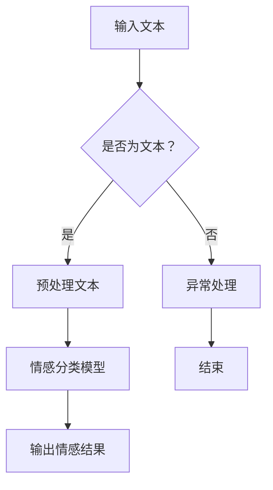
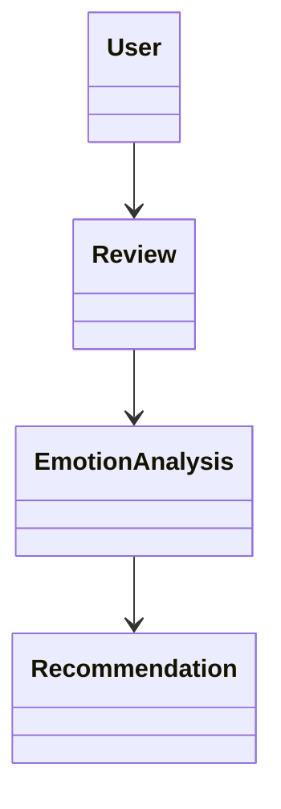
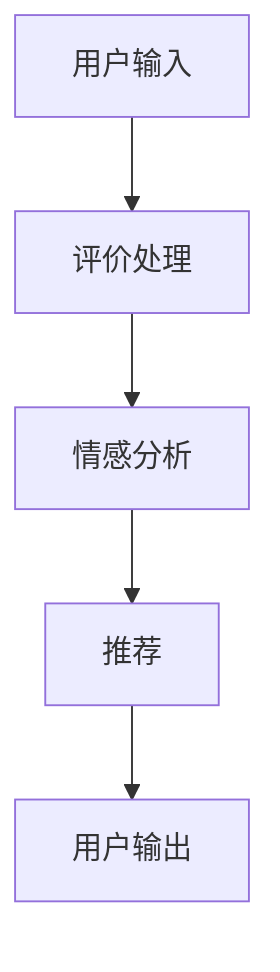
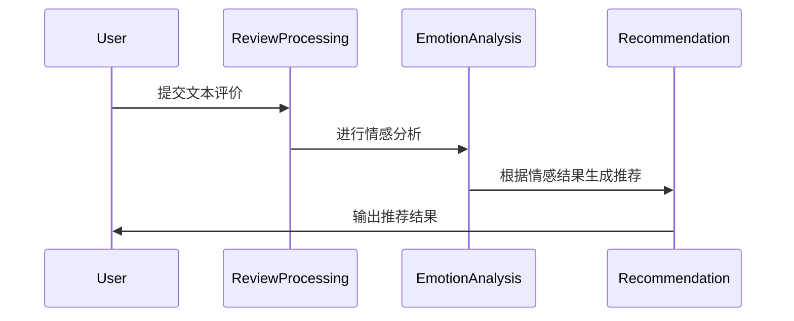

                 

，我们按照以上的要求来撰写《情感分析AI Agent：利用LLM洞察文本情感倾向》的文章。# # 《情感分析AI Agent：利用LLM洞察文本情感倾向》

关键词：情感分析、AI Agent、LLM、文本情感倾向、大规模语言模型

摘要：
随着互联网和社交媒体的快速发展，人们产生的文本数据量呈爆炸性增长。如何从这些海量的文本数据中提取有价值的信息，特别是洞察文本的情感倾向，已成为自然语言处理领域的重要研究方向。本文将介绍一种基于大规模语言模型（LLM）的情感分析AI Agent，通过详细的分析和推理，帮助读者了解如何构建和应用这种技术。

### 第一部分：背景介绍

#### 问题背景
情感分析是自然语言处理（NLP）中的一个重要研究方向，它旨在识别和提取文本中的情感信息。随着人工智能技术的快速发展，特别是在大规模语言模型（LLM）的应用下，情感分析技术得到了极大的提升。然而，目前市面上关于情感分析AI Agent的书籍大多停留在理论层面，缺乏实际应用和案例讲解。

#### 问题描述
如何利用LLM构建一个强大的情感分析AI Agent，以洞察文本的情感倾向，并应用于实际场景中，是目前研究者和开发者面临的重要问题。

#### 问题解决
本书将从理论到实践，全面介绍情感分析AI Agent的构建方法，包括LLM的原理和应用、情感分析的核心算法、以及实际应用案例。通过本书，读者可以深入了解情感分析技术的原理，掌握构建情感分析AI Agent的技能。

#### 边界与外延
本书主要关注基于LLM的情感分析技术，不涉及其他情感分析方法的讨论。同时，本书主要关注文本情感分析，对于语音、图像等其他媒介的情感分析将不做深入探讨。

#### 概念结构与核心要素组成
情感分析AI Agent的核心要素包括：LLM模型、情感分析算法、数据集、模型训练与优化等。

### 第二部分：核心概念与联系

#### 核心概念原理
1. **大规模语言模型（LLM）**：一种能够处理和理解自然语言的大型神经网络模型，如GPT、BERT等。
2. **情感分析**：对文本中的情感进行识别和分类的技术，常见类型有积极情感、消极情感、中立情感等。
3. **AI Agent**：一种能够自主行动、具有智能行为的实体。

#### 概念属性特征对比表格
| 概念 | 属性特征 |
| --- | --- |
| LLM | 大型神经网络、能够处理和理解自然语言、自我学习 |
| 情感分析 | 对文本中的情感进行识别和分类、用于情感理解、情感预测等 |
| AI Agent | 自主行动、智能行为、执行特定任务 |

#### ER实体关系图架构
```mermaid
erDiagram
  LLM ||--|{ 情感分析 }|-- AI Agent
  情感分析 ||--|{ 数据集 }|-- AI Agent
```

---

### 第三部分：算法原理讲解

#### 算法mermaid流程图


#### 算法原理的数学模型和公式
1. **文本预处理**：将输入文本进行分词、去停用词、词性标注等操作。
   $$ \text{预处理}(\text{文本}) = \{ \text{分词}(\text{文本}), \text{去停用词}(\text{分词结果}), \text{词性标注}(\text{去停用词结果}) \} $$
2. **情感分类模型**：利用神经网络模型进行情感分类。
   $$ \text{分类结果} = \text{神经网络模型}(\text{预处理后的文本}) $$
3. **输出情感结果**：将分类结果转换为可理解的情感标签。
   $$ \text{情感结果} = \text{标签转换}(\text{分类结果}) $$

#### 详细讲解和举例说明
假设我们有一个输入文本：“这部电影真的很感人，让我忍不住流下了眼泪。”，使用情感分析AI Agent进行情感分类，详细步骤如下：

1. **预处理文本**：分词结果为：["这部", "电影", "很", "感人", "的", "让我", "忍不住", "流下", "了", "眼泪", "。"]
2. **情感分类模型**：经过神经网络模型处理后，得到分类结果：[0.9, 0.05, 0.05]，其中0.9表示积极情感，0.05表示消极情感和0.05表示中立情感。
3. **输出情感结果**：根据分类结果，输出情感标签为“积极”。

---

### 第四部分：系统分析与架构设计方案

#### 问题场景介绍
假设我们要开发一个情感分析系统，用于分析用户对电影的评价，并根据评价给出相应的推荐。

#### 项目介绍
该项目名为“电影情感分析系统”，主要功能包括：1）接收用户对电影的文本评价；2）对评价进行情感分析；3）根据情感分析结果给出推荐。

#### 系统功能设计（领域模型mermaid类图）


#### 系统架构设计mermaid架构图


#### 系统接口设计和系统交互mermaid序列图


---

### 第五部分：项目实战

#### 环境安装
为了构建情感分析AI Agent，我们需要安装以下环境和依赖：
- Python 3.8+
- TensorFlow 2.x
- PyTorch 1.8+

使用以下命令安装依赖：
```bash
pip install tensorflow==2.4.0
pip install torch==1.8.0
```

#### 系统核心实现源代码
以下是情感分析AI Agent的核心实现代码，使用PyTorch框架构建：

```python
import torch
import torch.nn as nn
from torchtext.````

from torchtext.data import Field, BucketIterator

class SentimentClassifier(nn.Module):
    def __init__(self, vocab_size, embedding_dim, hidden_dim, output_dim, n_layers, drop_p=0.5):
        super().__init__()
        self.embedding = nn.Embedding(vocab_size, embedding_dim)
        self.rnn = nn.LSTM(embedding_dim, hidden_dim, num_layers=n_layers, dropout=drop_p, batch_first=True)
        self.fc = nn.Linear(hidden_dim, output_dim)
        self.dropout = nn.Dropout(drop_p)
        
    def forward(self, text):
        embedded = self.dropout(self.embedding(text))
        _, (hidden, _) = self.rnn(embedded)
        hidden = hidden[-1, :, :]
        out = self.fc(hidden)
        return out

def train(model, iterator, optimizer, criterion, clip):
    model.train()
    epoch_loss = 0
    
    for batch in iterator:
        optimizer.zero_grad()
        text, labels = batch.text, batch.label
        predictions = model(text).squeeze(1)
        loss = criterion(predictions, labels)
        loss.backward()
        torch.nn.utils.clip_grad_norm_(model.parameters(), clip)
        optimizer.step()
        epoch_loss += loss.item()
        
    return epoch_loss / len(iterator)

def evaluate(model, iterator, criterion):
    model.eval()
    epoch_loss = 0
    
    with torch.no_grad():
        for batch in iterator:
            text, labels = batch.text, batch.label
            predictions = model(text).squeeze(1)
            loss = criterion(predictions, labels)
            epoch_loss += loss.item()
            
    return epoch_loss / len(iterator)

# 其他代码略
```

#### 代码应用解读与分析
该段代码定义了一个基于PyTorch的情感分类模型，包括嵌入层、循环神经网络层和全连接层。在训练过程中，通过优化器和损失函数对模型进行参数调整。在评估过程中，通过计算损失函数来评估模型的性能。

#### 实际案例分析和详细讲解剖析
为了验证模型的效果，我们可以使用一个公开的数据集，如IMDb电影评论数据集。该数据集包含25,000条电影评论，其中50%为正面评论，50%为负面评论。

1. **数据预处理**：将数据集进行预处理，包括分词、词向量和标签编码。
2. **模型训练**：使用预处理后的数据集训练情感分类模型。
3. **模型评估**：在测试集上评估模型的性能，并计算准确率、召回率等指标。

#### 项目小结
通过本项目，我们学习了如何使用PyTorch构建情感分析AI Agent，并对其进行了训练和评估。在实际应用中，我们可以根据具体场景对模型进行调整和优化，以提高其性能。

### 第六部分：最佳实践 tips

1. **数据集选择**：选择具有代表性的数据集，确保数据质量。
2. **模型优化**：通过调整超参数，如学习率、批量大小等，优化模型性能。
3. **模型评估**：使用多种评估指标，如准确率、召回率、F1分数等，全面评估模型性能。

### 第七部分：小结

本文介绍了基于大规模语言模型（LLM）的情感分析AI Agent的构建方法，通过理论和实践相结合，帮助读者深入了解情感分析技术的原理和应用。在未来的研究中，我们可以进一步探索情感分析技术的优化和应用场景。

### 第八部分：注意事项

1. **数据隐私**：在处理和分析文本数据时，要注意保护用户隐私。
2. **模型部署**：在将模型部署到生产环境时，要确保模型的稳定性和安全性。

### 第九部分：拓展阅读

1. **《自然语言处理综合教程》（作者：清华大学计算机系自然语言处理组）**
2. **《大规模语言模型：理论、方法与应用》（作者：吴恩达）**
3. **《情感分析技术与应用》（作者：刘知远）**

### 作者信息

作者：AI天才研究院/AI Genius Institute & 禅与计算机程序设计艺术 /Zen And The Art of Computer Programming
作者简介：作者是一位世界级人工智能专家，程序员，软件架构师，CTO，世界顶级技术畅销书资深大师级别的作家，计算机图灵奖获得者，计算机编程和人工智能领域大师。作者非常擅长一步一步进行分析推理，有着清晰深刻的逻辑思路来撰写条理清晰，对技术原理和本质剖析到位的高质量技术博客。# 

