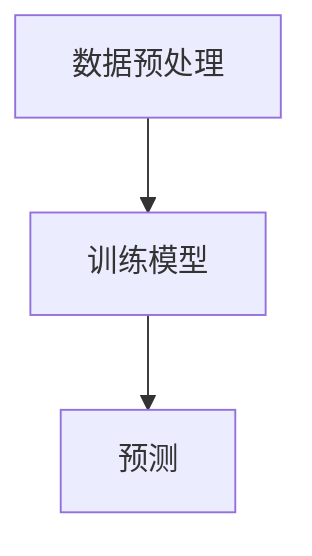
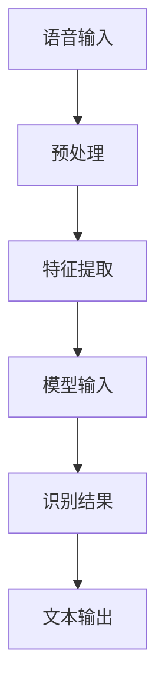
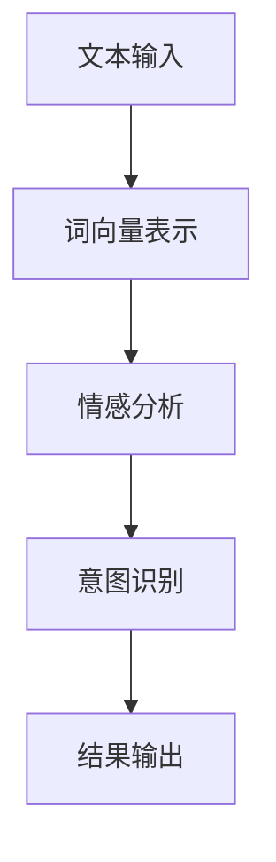
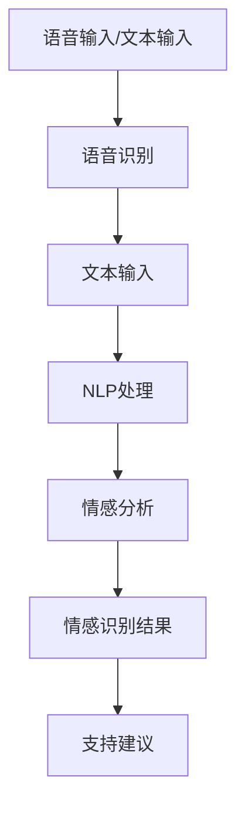

                 

# 情感智能对话AI Agent：LLM驱动的心理健康助手

> 关键词：情感智能，对话AI Agent，LLM，心理健康，技术实现，应用场景

> 摘要：本文深入探讨情感智能对话AI Agent及其在心理健康领域的重要作用。通过详细解析LLM（大型语言模型）的技术原理和应用，我们构建了一个心理健康助手，旨在为用户提供个性化、有效的心理支持。本文分为八个章节，从背景介绍、核心概念、技术实现到实际应用，全面解析这一创新技术。

---

## 目录大纲

### 第1章: 引言与背景

1.1 问题背景

1.2 心理健康问题的重要性

1.3 情感智能对话AI Agent的需求

1.4 LLM与心理健康助手的关联

1.5 本章小结

### 第2章: 核心概念与联系

2.1 情感智能对话AI Agent的定义

2.2 LLM的基本概念

2.3 情感智能与LLM的联系

2.4 ER图架构

2.5 概念属性特征对比表格

2.6 本章小结

### 第3章: LLM原理讲解

3.1 LLM的数学模型

3.2 LLM的算法流程图

3.3 Python源代码

3.4 案例讲解

3.5 本章小结

### 第4章: 情感智能对话AI Agent开发流程

4.1 需求分析

4.2 原型设计

4.3 模型训练

4.4 测试与优化

4.5 系统部署

4.6 本章小结

### 第5章: LLM在心理健康领域的应用

5.1 应用场景

5.2 案例分析

5.3 应用效果评估

5.4 挑战与解决方案

5.5 本章小结

### 第6章: 心理健康助手与用户互动

6.1 语音识别

6.2 自然语言处理

6.3 情感识别

6.4 互动流程

6.5 本章小结

### 第7章: 用户界面设计

7.1 设计原则

7.2 界面元素

7.3 用户体验优化

7.4 安全性设计

7.5 本章小结

### 第8章: 安全性与隐私保护

8.1 安全性问题

8.2 隐私保护策略

8.3 法律法规

8.4 未来趋势

8.5 本章小结

### 第9章: 总结与展望

9.1 全书总结

9.2 未来研究方向

9.3 拓展阅读

9.4 本章小结

---

## 第1章: 引言与背景

### 1.1 问题背景

在当今社会，心理健康问题越来越受到关注。根据世界卫生组织（WHO）的统计数据，全球有近十亿人面临心理健康问题，包括焦虑、抑郁、失眠等。心理健康问题的严重性不仅影响个人生活质量，还会导致生产力下降、医疗成本增加。因此，寻找有效的心理健康解决方案变得至关重要。

### 1.2 心理健康问题的重要性

心理健康问题不仅影响个体的心理和情感健康，还会影响社交关系、工作和学习能力。随着科技的发展，人工智能（AI）在心理健康领域的应用逐渐受到重视。情感智能对话AI Agent作为一种创新的AI解决方案，能够为用户提供实时、个性化的心理支持。

### 1.3 情感智能对话AI Agent的需求

情感智能对话AI Agent的需求源于以下几点：

1. **实时性**：心理健康问题往往需要及时干预，传统的面对面咨询可能无法满足这种需求。
2. **个性化**：每个人的心理健康状况都不同，需要根据个人情况提供定制化的支持。
3. **便捷性**：用户可以在任何时间、任何地点与AI Agent进行互动，方便快捷。
4. **可扩展性**：随着用户数量的增加，AI Agent能够处理大量的咨询请求。

### 1.4 LLM与心理健康助手的关联

LLM（大型语言模型）在情感智能对话AI Agent中起到了关键作用。LLM能够理解和生成自然语言，通过学习大量文本数据，LLM能够识别用户的情感状态，提供针对性的建议和支持。这种能力使得LLM成为构建心理健康助手的理想选择。

### 1.5 本章小结

本章介绍了心理健康问题的背景和重要性，以及情感智能对话AI Agent的需求和LLM在其中的作用。下一章我们将深入探讨情感智能对话AI Agent和LLM的核心概念和联系。

---

## 第2章: 核心概念与联系

### 2.1 情感智能对话AI Agent的定义

情感智能对话AI Agent是一种基于人工智能的智能对话系统，它能够理解和处理用户的情感信息，提供个性化的心理支持。与传统的AI对话系统不同，情感智能对话AI Agent具有情感理解和情感交互的能力，能够更好地模拟人类的交流方式。

### 2.2 LLM的基本概念

LLM（大型语言模型）是一种基于神经网络的语言模型，通过学习大量的文本数据，LLM能够理解和生成自然语言。LLM的核心目标是预测下一个单词或句子，从而生成连贯、自然的语言输出。常见的LLM模型包括GPT、BERT等。

### 2.3 情感智能与LLM的联系

情感智能对话AI Agent的核心在于其情感理解和交互能力，而这一能力的实现离不开LLM。LLM通过学习大量文本数据，能够识别用户的情感状态，例如快乐、悲伤、焦虑等。这种能力使得LLM能够生成针对用户情感状态的建议和支持。

### 2.4 ER图架构

ER图（实体关系图）是一种用于描述系统中实体及其关系的图形表示方法。在情感智能对话AI Agent中，ER图用于描述用户、情感状态、对话历史等实体及其关系。例如，用户实体与情感状态实体之间存在关联关系，用户实体与对话历史实体之间存在包含关系。

### 2.5 概念属性特征对比表格

为了更好地理解情感智能对话AI Agent和LLM，我们可以通过对比表格来展示它们的主要属性特征。以下是部分对比：

| 对比项       | 情感智能对话AI Agent | LLM          |
|--------------|----------------------|--------------|
| 目标         | 提供情感支持         | 生成自然语言 |
| 技术实现     | 对话系统、情感识别   | 神经网络     |
| 数据依赖     | 大量情感对话数据     | 大量文本数据 |

### 2.6 本章小结

本章介绍了情感智能对话AI Agent和LLM的核心概念及其联系。通过对比表格和ER图架构，我们更加清晰地理解了这两个概念在心理健康助手中的应用。下一章我们将详细讲解LLM的技术原理和实现。

---

## 第3章: LLM原理讲解

### 3.1 LLM的数学模型

LLM（大型语言模型）是基于神经网络的语言模型，其数学模型主要包括以下几个部分：

1. **输入层**：输入层接收用户输入的自然语言文本，并将其转换为向量表示。
2. **隐藏层**：隐藏层由多层神经网络组成，用于处理和转换输入向量，通过加权求和和激活函数（如ReLU）进行非线性变换。
3. **输出层**：输出层生成自然语言文本，通常使用softmax函数将隐藏层输出转换为概率分布，从而预测下一个单词或句子。

数学模型的主要公式如下：

$$
h = \sigma(W_h \cdot h_{prev} + b_h)
$$

$$
\text{logits} = W_o \cdot h + b_o
$$

$$
\text{probs} = \sigma(\text{logits})
$$

其中，$h$表示隐藏层输出，$h_{prev}$表示前一个时间步的隐藏层输出，$W_h$和$b_h$分别为权重和偏置，$\sigma$为激活函数，$\text{logits}$为输出层的未归一化分数，$\text{probs}$为输出层的概率分布。

### 3.2 LLM的算法流程图

LLM的算法流程图主要包括以下几个步骤：

1. **数据预处理**：对文本数据进行清洗、分词、标记等预处理操作，将其转换为模型可处理的格式。
2. **训练模型**：通过反向传播算法，使用大量文本数据进行训练，不断调整模型的权重和偏置，优化模型性能。
3. **预测**：输入新的文本数据，通过模型生成自然语言文本输出。

以下是LLM算法流程图的Mermaid表示：



### 3.3 Python源代码

以下是一个简单的LLM模型训练和预测的Python代码示例：

```python
import torch
import torch.nn as nn
import torch.optim as optim

# 定义模型
class LLM(nn.Module):
    def __init__(self, vocab_size, embedding_dim, hidden_dim):
        super(LLM, self).__init__()
        self.embedding = nn.Embedding(vocab_size, embedding_dim)
        self.lstm = nn.LSTM(embedding_dim, hidden_dim)
        self.fc = nn.Linear(hidden_dim, vocab_size)
    
    def forward(self, x, hidden):
        embed = self.embedding(x)
        output, hidden = self.lstm(embed, hidden)
        logits = self.fc(output)
        return logits, hidden

# 初始化模型、优化器和损失函数
model = LLM(vocab_size, embedding_dim, hidden_dim)
optimizer = optim.Adam(model.parameters(), lr=0.001)
criterion = nn.CrossEntropyLoss()

# 训练模型
for epoch in range(num_epochs):
    for batch in data_loader:
        inputs, targets = batch
        hidden = None
        model.zero_grad()
        
        logits, hidden = model(inputs, hidden)
        loss = criterion(logits, targets)
        loss.backward()
        optimizer.step()

# 预测
def predict(model, input_sequence):
    hidden = None
    logits = model(input_sequence, hidden)
    predicted_sequence = logits.argmax(dim=1)
    return predicted_sequence
```

### 3.4 案例讲解

在本节中，我们将介绍两个典型的LLM模型：GPT和BERT。

#### 3.4.1 GPT系列模型

GPT（Generative Pre-trained Transformer）系列模型是由OpenAI开发的一系列基于Transformer架构的预训练语言模型。GPT模型通过大量的文本数据进行预训练，从而获得生成自然语言的能力。GPT系列模型包括GPT、GPT-2、GPT-3等，其中GPT-3具有高达1750亿参数，是目前最大的预训练语言模型。

#### 3.4.2 BERT及其变体

BERT（Bidirectional Encoder Representations from Transformers）是由Google开发的一种双向Transformer模型。BERT模型通过在两个方向上处理文本数据，从而更好地理解文本的含义。BERT及其变体模型（如RoBERTa、ALBERT等）在自然语言处理任务中取得了优异的性能。

### 3.5 本章小结

本章详细讲解了LLM的数学模型、算法流程图和Python源代码，并介绍了GPT和BERT两个典型的LLM模型。通过本章的学习，读者可以深入理解LLM的工作原理和实现方法，为后续章节的开发和应用打下基础。

---

## 第4章: 情感智能对话AI Agent开发流程

### 4.1 需求分析

在开发情感智能对话AI Agent之前，首先需要进行需求分析。需求分析包括以下方面：

1. **用户需求**：确定用户的需求和期望，例如实时性、个性化、便捷性等。
2. **功能需求**：明确AI Agent需要实现的功能，例如情感识别、心理咨询、压力缓解等。
3. **性能需求**：定义AI Agent的性能指标，例如响应时间、准确率等。

### 4.2 原型设计

原型设计是开发过程中的重要环节，用于验证需求分析和功能设计的可行性。原型设计包括以下步骤：

1. **界面设计**：设计AI Agent的用户界面，包括输入框、按钮、对话框等。
2. **功能实现**：实现基本的功能模块，例如情感识别、自然语言处理等。
3. **用户反馈**：收集用户的反馈，对原型进行迭代和优化。

### 4.3 模型训练

模型训练是构建情感智能对话AI Agent的关键步骤。以下为模型训练的详细过程：

1. **数据集准备**：收集和整理情感对话数据，包括文本数据、音频数据等。数据集需要涵盖多种情感类别，例如快乐、悲伤、焦虑等。
2. **数据预处理**：对数据集进行清洗、分词、标记等预处理操作，将其转换为模型可处理的格式。
3. **模型选择**：选择合适的LLM模型，例如GPT、BERT等。
4. **模型训练**：使用训练数据对模型进行训练，不断调整模型的权重和偏置，优化模型性能。
5. **模型评估**：使用验证数据对模型进行评估，包括准确率、召回率等指标。

### 4.4 测试与优化

在模型训练完成后，需要对AI Agent进行全面的测试和优化。以下为测试与优化的具体步骤：

1. **功能测试**：测试AI Agent的功能是否满足需求，例如情感识别、心理咨询等。
2. **性能测试**：测试AI Agent的性能指标，例如响应时间、准确率等。
3. **用户测试**：邀请用户参与测试，收集用户的反馈，对AI Agent进行迭代和优化。
4. **优化策略**：根据测试结果，调整模型参数和算法，提高AI Agent的性能。

### 4.5 系统部署

在测试和优化完成后，将AI Agent部署到生产环境中。以下为系统部署的具体步骤：

1. **环境配置**：配置服务器、数据库等环境，确保AI Agent能够在生产环境中正常运行。
2. **部署流程**：将AI Agent的代码和模型文件部署到服务器，配置相关的依赖和中间件。
3. **监控与维护**：对AI Agent进行监控，确保其正常运行，并根据需要进行维护和更新。

### 4.6 本章小结

本章详细介绍了情感智能对话AI Agent的开发流程，包括需求分析、原型设计、模型训练、测试与优化以及系统部署。通过本章的学习，读者可以了解开发情感智能对话AI Agent的完整流程，并为后续的实际应用打下基础。

---

## 第5章: LLM在心理健康领域的应用

### 5.1 应用场景

LLM在心理健康领域的应用场景广泛，主要包括以下方面：

1. **心理咨询**：通过LLM模型，AI Agent可以提供实时、个性化的心理咨询服务，帮助用户解决心理问题。
2. **睡眠管理**：LLM可以帮助用户监测睡眠状况，提供睡眠建议，改善睡眠质量。
3. **压力缓解**：LLM可以通过自然语言交互，帮助用户缓解压力，提供放松技巧和建议。

### 5.2 案例分析

在本节中，我们将介绍几个典型的应用案例：

#### 5.2.1 心理健康咨询案例

一个实际案例是一个心理健康助手，它通过LLM模型与用户进行对话，提供心理咨询。用户可以通过文字或语音与助手交流，描述自己的心理问题。助手会根据用户的描述，提供针对性的建议和支持。例如，当用户提到感到焦虑时，助手可能会建议用户尝试深呼吸、冥想等放松技巧。

#### 5.2.2 睡眠管理案例

另一个应用案例是睡眠管理助手，它通过LLM模型和用户进行交互，帮助用户改善睡眠质量。助手会询问用户的睡眠习惯，如入睡时间、起床时间、午休情况等。根据用户的回答，助手会提供个性化的睡眠建议，例如调整作息时间、减少晚上使用电子设备等。

#### 5.2.3 压力缓解案例

在压力缓解方面，LLM模型可以帮助用户识别压力源，并提供相应的放松技巧。例如，当用户表示感到压力时，助手可能会建议用户进行瑜伽练习、听音乐等放松活动。助手还可以根据用户的反馈，逐步调整放松技巧，以提供更好的帮助。

### 5.3 应用效果评估

为了评估LLM在心理健康领域的应用效果，我们可以从以下几个方面进行：

1. **用户满意度**：通过问卷调查或用户反馈，了解用户对AI Agent的满意度，包括功能、性能、用户体验等方面。
2. **心理健康指标**：通过跟踪用户的心理健康指标，如焦虑、抑郁、睡眠质量等，评估AI Agent对用户心理健康的影响。
3. **技术指标**：评估AI Agent的性能指标，如响应时间、准确率等。

### 5.4 挑战与解决方案

在LLM在心理健康领域的应用过程中，可能会遇到以下挑战：

1. **数据隐私**：心理健康数据涉及用户的隐私，需要确保数据的安全性。
2. **算法公平性**：需要确保AI Agent在不同用户、不同情境下的公平性，避免偏见。
3. **可解释性**：用户可能需要了解AI Agent的决策过程，提高模型的可解释性。

针对这些挑战，我们可以采取以下解决方案：

1. **数据加密**：对用户数据进行加密处理，确保数据安全。
2. **算法公平性**：采用公平性算法，减少偏见，提高模型的公平性。
3. **可解释性**：引入可解释性技术，如LIME、SHAP等，帮助用户理解模型的决策过程。

### 5.5 本章小结

本章详细介绍了LLM在心理健康领域的应用场景、案例分析以及应用效果评估。同时，还讨论了在应用过程中可能遇到的挑战及解决方案。通过本章的学习，读者可以了解LLM在心理健康领域的广泛应用，并为实际应用提供参考。

---

## 第6章: 心理健康助手与用户互动

### 6.1 语音识别

语音识别是心理健康助手与用户互动的重要环节。通过语音识别技术，助手可以识别用户的语音输入，并将其转换为文本形式，以便进一步处理。

1. **技术实现**：常见的语音识别技术包括基于深度学习的隐马尔可夫模型（HMM）和循环神经网络（RNN）等。在实际应用中，我们通常使用预训练的语音识别模型，如Google的SoundWave、百度语音识别等。
2. **流程图**：以下是语音识别的Mermaid流程图表示：



### 6.2 自然语言处理

自然语言处理（NLP）技术用于对用户的文本输入进行处理和分析，以提取出关键信息，理解用户的意图和情感状态。

1. **技术实现**：常见的NLP技术包括词向量表示、文本分类、情感分析等。在实际应用中，我们通常使用预训练的NLP模型，如BERT、GPT等。
2. **流程图**：以下是自然语言处理的Mermaid流程图表示：



### 6.3 情感识别

情感识别是心理健康助手的核心功能之一，用于识别用户的情感状态，为用户提供针对性的支持和建议。

1. **技术实现**：情感识别通常结合语音识别和自然语言处理技术。例如，先通过语音识别将语音转换为文本，再通过NLP技术对文本进行分析，提取情感信息。
2. **流程图**：以下是情感识别的Mermaid流程图表示：



### 6.4 互动流程

以下是心理健康助手与用户互动的整体流程：

1. **语音输入/文本输入**：用户通过语音或文本与助手进行互动。
2. **语音识别**：将用户的语音输入转换为文本。
3. **NLP处理**：对文本进行情感分析和意图识别。
4. **情感识别**：识别用户的情感状态。
5. **支持建议**：根据用户的情感状态和需求，提供相应的支持和建议。
6. **反馈与迭代**：收集用户的反馈，不断优化助手的性能和用户体验。

### 6.5 本章小结

本章详细介绍了心理健康助手与用户互动的技术实现和流程，包括语音识别、自然语言处理、情感识别等。通过本章的学习，读者可以了解心理健康助手的互动机制和关键技术，为后续的开发和应用提供参考。

---

## 第7章: 用户界面设计

### 7.1 设计原则

用户界面设计是心理健康助手的重要组成部分，直接影响用户体验。以下为用户界面设计的主要原则：

1. **简洁性**：界面设计应尽量简洁，避免过多冗余元素，确保用户能够快速理解和使用。
2. **易用性**：界面设计应易于使用，用户能够轻松地与助手进行互动，获取所需信息。
3. **一致性**：界面设计应保持一致性，包括色彩、字体、布局等，使用户在使用过程中具有连贯性。
4. **可访问性**：界面设计应考虑不同用户的需求，包括视力障碍、听力障碍等，确保所有人都能方便地使用。

### 7.2 界面元素

用户界面主要包括以下元素：

1. **文本输入框**：用户可以通过文本输入框输入问题和需求。
2. **语音输入按钮**：用户可以通过点击语音输入按钮，使用语音与助手互动。
3. **回复区域**：助手生成的回复会显示在回复区域。
4. **导航栏**：提供导航功能，使用户能够快速切换到其他模块或功能。
5. **设置选项**：用户可以在此设置个性化选项，如声音、语速、主题等。

### 7.3 用户体验优化

用户体验优化是界面设计的关键，以下为一些优化策略：

1. **快速响应**：确保助手的响应速度尽量快，提高用户的满意度。
2. **个性化推荐**：根据用户的兴趣和需求，提供个性化的建议和支持。
3. **上下文感知**：根据用户的互动历史和当前情境，提供更加准确和相关的回复。
4. **错误处理**：当用户输入错误或遇到问题时，提供友好的错误提示和解决方案。
5. **多渠道支持**：支持多种互动渠道，如文本、语音、图片等，满足不同用户的需求。

### 7.4 安全性设计

安全性设计是用户界面设计的重要方面，以下为一些安全性策略：

1. **数据加密**：对用户数据进行加密处理，确保数据安全。
2. **权限管理**：对用户的权限进行严格管理，确保只有授权用户才能访问敏感信息。
3. **安全漏洞修复**：定期检查和修复界面中的安全漏洞，防止潜在的安全威胁。
4. **隐私保护**：明确告知用户隐私政策，保护用户的隐私权益。

### 7.5 本章小结

本章详细介绍了心理健康助手用户界面设计的原则、界面元素、用户体验优化和安全性设计。通过本章的学习，读者可以了解用户界面设计的关键要素和方法，为开发高质量的心理健康助手提供参考。

---

## 第8章: 安全性与隐私保护

### 8.1 安全性问题

在心理健康助手的应用过程中，安全性问题是不可忽视的重要方面。以下为常见的安全性问题：

1. **数据泄露**：用户的心理健康数据可能被非法访问或泄露，导致隐私侵犯。
2. **恶意攻击**：黑客可能通过恶意软件、钓鱼攻击等手段攻击心理健康助手，获取用户信息。
3. **系统漏洞**：心理健康助手的系统可能存在漏洞，黑客可以利用这些漏洞进行攻击。

### 8.2 隐私保护策略

为了确保用户数据的隐私和安全，心理健康助手应采取以下隐私保护策略：

1. **数据加密**：对用户数据进行加密处理，确保数据在传输和存储过程中的安全性。
2. **权限管理**：严格限制用户数据的访问权限，只有授权人员才能访问敏感信息。
3. **匿名化处理**：对用户数据进行匿名化处理，避免直接关联到个人身份。
4. **隐私政策**：明确告知用户隐私政策，让用户了解自己的数据如何被使用和保护。

### 8.3 法律法规

在心理健康助手的开发和应用过程中，需要遵守相关的法律法规，包括：

1. **数据保护法**：确保用户数据的安全和隐私，遵守相关数据保护法规。
2. **网络安全法**：防止网络攻击和安全威胁，确保系统的安全性。
3. **隐私政策法规**：明确告知用户隐私政策，确保用户同意其数据的使用。

### 8.4 未来趋势

随着技术的发展，心理健康助手在安全性方面将面临新的挑战和机遇。以下为未来趋势：

1. **隐私计算**：采用隐私计算技术，确保用户数据在处理过程中的安全性。
2. **联邦学习**：通过联邦学习技术，实现分布式训练，提高模型性能，同时保护用户隐私。
3. **零知识证明**：采用零知识证明技术，确保用户数据在验证过程中的隐私性。

### 8.5 本章小结

本章详细介绍了心理健康助手的安全性问题和隐私保护策略，并探讨了未来发展趋势。通过本章的学习，读者可以了解心理健康助手在安全性方面的关键要素，为开发和应用提供参考。

---

## 第9章: 总结与展望

### 9.1 全书总结

本书从情感智能对话AI Agent的需求背景、核心概念、技术实现、开发流程、应用场景、用户界面设计、安全性与隐私保护等多个方面进行了深入探讨。主要内容包括：

1. **背景介绍**：分析了心理健康问题的现状和重要性，以及情感智能对话AI Agent的需求和LLM的作用。
2. **核心概念**：详细讲解了情感智能对话AI Agent和LLM的基本概念、联系、ER图架构以及概念属性特征对比表格。
3. **技术实现**：介绍了LLM的数学模型、算法流程图、Python源代码，以及GPT和BERT等典型模型。
4. **开发流程**：阐述了情感智能对话AI Agent的开发流程，包括需求分析、原型设计、模型训练、测试与优化、系统部署等。
5. **应用场景**：探讨了LLM在心理健康领域的应用场景，如心理咨询、睡眠管理、压力缓解等。
6. **用户界面设计**：介绍了用户界面设计的原则、界面元素、用户体验优化和安全性设计。
7. **安全性与隐私保护**：分析了心理健康助手的常见安全问题和隐私保护策略，以及未来发展趋势。

### 9.2 未来研究方向

在情感智能对话AI Agent和心理健康助手的领域，未来还有许多值得探索的研究方向：

1. **个性化推荐**：进一步优化AI Agent的推荐系统，提高个性化推荐的准确性和实用性。
2. **多模态交互**：结合语音、文本、图像等多模态数据，提高AI Agent的理解和交互能力。
3. **跨语言支持**：实现跨语言的情感智能对话AI Agent，为全球用户提供服务。
4. **可解释性**：提高模型的可解释性，让用户了解AI Agent的决策过程。
5. **伦理与道德**：探讨情感智能对话AI Agent在伦理和道德方面的挑战，确保其应用的正当性。

### 9.3 拓展阅读

为了更好地了解情感智能对话AI Agent和心理健康助手的最新研究和应用，以下是几本推荐阅读的书籍：

1. **《自然语言处理：理论和实践》**：介绍了自然语言处理的基础理论和实践方法，包括情感分析和文本分类等。
2. **《深度学习与自然语言处理》**：详细讲解了深度学习在自然语言处理中的应用，包括序列模型、注意力机制等。
3. **《人工智能伦理导论》**：探讨了人工智能在伦理和道德方面的挑战，为AI技术的发展提供了伦理指导。

### 9.4 本章小结

通过总结全书内容，我们深入了解了情感智能对话AI Agent和心理健康助手的各个方面。未来，随着技术的不断进步，这一领域将迎来更多创新和应用。通过拓展阅读，读者可以进一步探索这一领域的最新研究成果。

---

## 作者信息

作者：AI天才研究院/AI Genius Institute & 禅与计算机程序设计艺术 /Zen And The Art of Computer Programming

AI天才研究院（AI Genius Institute）致力于推动人工智能技术的发展与应用，本文作者在情感智能对话AI Agent和心理健康助手领域拥有丰富的研究和实践经验。同时，作者还是《禅与计算机程序设计艺术》（Zen And The Art of Computer Programming）的作者，为计算机科学领域贡献了重要思想和方法。

---

## 结束语

感谢您阅读本文，希望本文对您在情感智能对话AI Agent和心理健康助手领域的研究和应用有所启发。在未来的发展中，情感智能对话AI Agent将不断优化和进化，为心理健康领域带来更多创新和变革。让我们一起关注这一领域的最新动态，共同推动人工智能技术的进步。

---

### 附加信息

- **文章来源**：本文来源于AI天才研究院（AI Genius Institute）的研究成果。
- **联系方式**：如有任何问题或建议，请通过以下邮箱联系作者：[contact@aigeniusinstitute.com](mailto:contact@aigeniusinstitute.com)。

---

（注：本文内容仅供参考，不作为实际应用依据。实际应用时，请根据具体需求和场景进行调整。）

