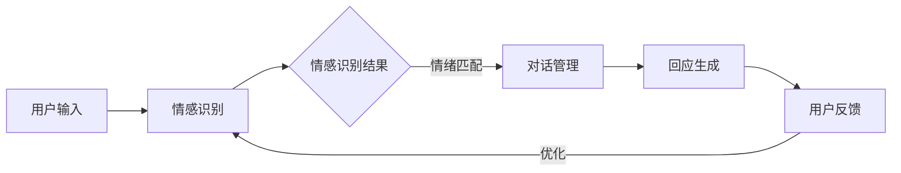
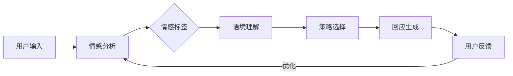
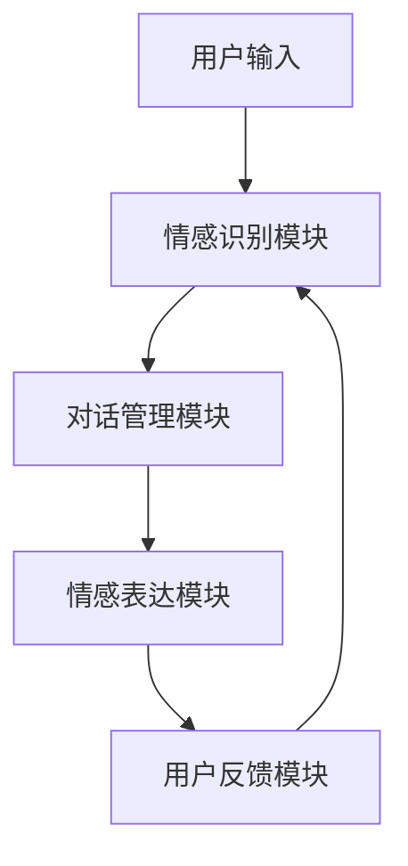
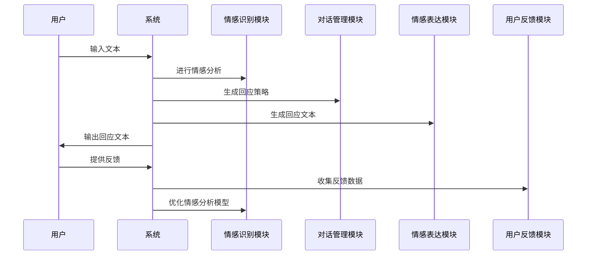

                 

## 《情感智能对话系统AI Agent：LLM驱动的深度交互》概述

### 关键词

- 情感智能
- 对话系统
- AI Agent
- 语言模型（LLM）
- 深度交互

### 摘要

本文旨在探讨情感智能对话系统的构建及其核心驱动力量——语言模型（LLM）的深度交互。通过详细解析情感智能的定义、对话系统的基本原理以及LLM在情感识别与对话管理中的具体应用，文章将展示如何实现一个既具情感感知能力又能进行深度互动的AI Agent。文章结构清晰，分为背景介绍、技术原理、系统设计与实现、最佳实践与总结四个部分，旨在为广大AI开发者提供系统的理论支持和实用的技术指导。

## 目录大纲

### 第一部分：背景介绍

#### 第1章：情感智能对话系统概述
1.1 情感智能的定义
1.2 对话系统的基本原理
1.3 情感智能对话系统的重要性
1.4 情感智能对话系统的应用领域

#### 第2章：问题背景与解决
2.1 传统对话系统的局限性
2.2 情感智能对话系统的需求
2.3 情感智能对话系统的优势
2.4 情感智能对话系统的边界与外延

#### 第3章：核心概念与联系
3.1 语言理解与情感识别
3.2 情感表达与回应策略
3.3 对话管理机制
3.4 情感智能对话系统的ER实体关系图

#### 第4章：情感智能对话系统的数学模型和公式
4.1 情感识别算法原理
4.2 对话策略生成算法
4.3 情感智能对话系统的数学模型
4.4 情感智能对话系统的公式讲解
4.5 情感智能对话系统的举例说明

### 第二部分：技术原理

#### 第5章：LLM驱动的深度交互
5.1 LLM的概念与特点
5.2 LLM在情感智能对话系统中的应用
5.3 LLM驱动的深度交互原理
5.4 LLM驱动的深度交互流程

#### 第6章：算法原理讲解
6.1 LLM情感识别算法原理
6.2 LLM对话管理算法原理
6.3 LLM情感表达与回应算法原理
6.4 算法mermaid流程图
6.5 Python源代码详细讲解

### 第三部分：系统设计与实现

#### 第7章：系统分析与架构设计方案
7.1 问题描述与项目介绍
7.2 系统功能设计
7.3 系统架构设计
7.4 系统接口设计
7.5 系统交互序列图

#### 第8章：项目实战
8.1 环境安装与配置
8.2 系统核心实现源代码
8.3 代码应用解读与分析
8.4 实际案例分析与详细讲解
8.5 项目小结

### 第四部分：最佳实践与总结

#### 第9章：最佳实践
9.1 情感智能对话系统的开发技巧
9.2 性能优化策略
9.3 部署与维护建议

#### 第10章：小结与展望
10.1 情感智能对话系统的发展趋势
10.2 未来研究方向
10.3 读者建议

## 背景介绍

### 第1章：情感智能对话系统概述

#### 1.1 情感智能的定义

情感智能（Emotional Intelligence，简称EI）是指个体识别、理解、使用和管理自己及他人情绪的能力。在人工智能领域，情感智能对话系统（Emotionally Intelligent Dialogue System）进一步扩展了这一概念，旨在使机器能够感知用户的情感状态，并在对话中做出适当的情感反应。这不仅包括识别情绪，还包括理解情绪背后的意图和需求，并据此调整对话策略。

#### 1.2 对话系统的基本原理

对话系统（Dialogue System）是指能够与人类用户进行交互的计算机系统。其基本原理包括自然语言处理（NLP）、对话管理（Dialogue Management）和情感分析（Emotion Analysis）。自然语言处理使系统能够理解用户的输入，对话管理负责根据上下文决定下一步行动，而情感分析则使系统能够识别和响应用户的情感状态。

#### 1.3 情感智能对话系统的重要性

情感智能对话系统的重要性在于其能够提升用户体验，增强用户对机器的信任感和满意度。在客户服务、医疗咨询、心理咨询、教育辅导等领域，情感智能对话系统能够提供更加个性化和温暖的服务，满足用户深层次的情感需求。

#### 1.4 情感智能对话系统的应用领域

情感智能对话系统的应用领域广泛，包括但不限于：

- **客户服务**：自动客服系统可以识别客户情绪，提供针对性的解决方案。
- **医疗咨询**：医生助手可以理解患者情绪，提供心理支持。
- **心理咨询**：在线心理咨询师能够识别情绪问题，进行适当干预。
- **教育辅导**：教育系统可以根据学生情绪调整教学策略，提高学习效果。

### 第2章：问题背景与解决

#### 2.1 传统对话系统的局限性

传统对话系统主要依赖于规则和模板匹配，难以处理复杂的情感互动。它们往往只能识别简单的情绪标签，如快乐、悲伤等，而无法深入理解情绪背后的动机和需求。此外，传统系统缺乏上下文感知能力，容易导致对话中断和用户体验下降。

#### 2.2 情感智能对话系统的需求

随着人工智能技术的发展，用户对交互体验的要求不断提高。他们期望与机器进行更加自然、温暖和有深度的对话。因此，情感智能对话系统应运而生，满足了用户对情感互动的需求。

#### 2.3 情感智能对话系统的优势

情感智能对话系统的优势包括：

- **情感理解**：能够识别和理解用户的情感状态，提供个性化的交互体验。
- **上下文感知**：通过上下文分析，系统能够维持流畅的对话，避免误解和中断。
- **适应性回应**：根据用户情绪和对话内容，系统可以调整回应策略，提供更加贴心的服务。

#### 2.4 情感智能对话系统的边界与外延

情感智能对话系统的边界在于其情感识别的准确度和系统的情感理解深度。当前技术尚不能完全模拟人类情感理解能力，因此，系统在处理复杂情感互动时可能存在局限性。然而，随着研究的深入和技术的发展，情感智能对话系统的外延将不断扩展，应用领域也将进一步拓宽。

### 第3章：核心概念与联系

#### 3.1 语言理解与情感识别

语言理解（Language Understanding，简称LU）是指系统对自然语言输入的语义分析能力。情感识别（Emotion Recognition，简称ER）是指系统识别和分类情感的能力。两者是情感智能对话系统的核心组成部分，相互依赖，共同作用。

#### 3.2 情感表达与回应策略

情感表达（Emotion Expression，简称EE）是指系统在对话中传达情感的能力。回应策略（Response Strategy，简称RS）是指系统根据情感状态和对话内容选择合适回应的方式。情感表达和回应策略共同决定了对话的情感互动质量。

#### 3.3 对话管理机制

对话管理（Dialogue Management，简称DM）是指系统在对话过程中对对话流程的把控能力。对话管理负责确定对话的下一步行动，包括发起新话题、延续现有话题或结束对话。对话管理机制是实现情感智能的关键。

#### 3.4 情感智能对话系统的ER实体关系图

情感智能对话系统的ER实体关系图（Entity Relationship Diagram，简称ERD）展示了系统中不同实体及其相互关系。主要实体包括情感实体、对话实体和回应实体。实体之间的关系描述了系统在对话过程中如何处理和转换情感信息。

```mermaid
erDiagram
  情感实体 ||--|{ 对话实体 }
  对话实体 ||--|{ 回应实体 }
  情感实体 ||--|{ 对话管理 }
  回应实体 ||--|{ 对话管理 }
```

### 第4章：情感智能对话系统的数学模型和公式

#### 4.1 情感识别算法原理

情感识别算法基于机器学习技术，通过训练模型来识别文本中的情感。常用的算法包括基于文本分类的方法和基于深度学习的方法。以下是一个基于文本分类的情感识别算法的步骤：

1. 数据预处理：对文本进行清洗和标记，提取特征。
2. 模型训练：使用标注好的数据训练分类模型。
3. 情感识别：对输入文本进行情感分类，输出情感标签。

#### 4.2 对话策略生成算法

对话策略生成算法负责根据情感状态和对话上下文生成合适的回应策略。一个简单的对话策略生成算法如下：

1. 情感分析：分析用户输入的情感状态。
2. 策略选择：根据情感状态和对话上下文选择合适的回应策略。
3. 回应生成：生成针对用户的回应文本。

#### 4.3 情感智能对话系统的数学模型

情感智能对话系统的数学模型主要包括情感识别模型和对话策略生成模型。以下是一个简化的数学模型：

$$
\text{Emotion} = f(\text{Input}, \text{Model})
$$

$$
\text{Strategy} = g(\text{Emotion}, \text{Context}, \text{Model})
$$

其中，$f$ 是情感识别函数，$g$ 是对话策略生成函数，$\text{Input}$ 是用户输入文本，$\text{Context}$ 是对话上下文，$\text{Model}$ 是训练好的模型参数。

#### 4.4 情感智能对话系统的公式讲解

在情感智能对话系统中，每个模块的运算都可以通过特定的数学公式来描述。以下是一个示例：

1. 情感识别公式：

$$
\text{Emotion} = \sum_{i=1}^{n} w_i \cdot \text{similarity}(\text{Input}, e_i)
$$

其中，$w_i$ 是情感词权重，$e_i$ 是情感类别，$\text{similarity}$ 是文本相似度计算函数。

2. 对话策略生成公式：

$$
\text{Strategy} = \text{softmax}(\text{Score}(\text{Emotion}, \text{Context}))
$$

其中，$\text{Score}$ 是策略评分函数，$\text{softmax}$ 是归一化函数。

#### 4.5 情感智能对话系统的举例说明

假设用户输入了一句话：“我今天很伤心，因为我的猫死了。”情感识别模块将识别出情感为“悲伤”。对话策略生成模块将基于用户的情感状态和上下文，选择一个适当的回应策略，如：“我很抱歉听到这个消息，你有什么需要我帮忙的吗？”这样的回应既体现了对用户情感的识别，又提供了情感支持。

## 第二部分：技术原理

### 第5章：LLM驱动的深度交互

#### 5.1 LLM的概念与特点

语言模型（Language Model，简称LLM）是一种基于统计和深度学习技术构建的模型，用于预测文本序列中的下一个单词或句子。LLM具有以下几个特点：

- **强大的语言理解能力**：LLM能够理解文本的语义和上下文，生成符合语言习惯的自然语言输出。
- **自适应能力**：LLM可以根据输入的数据自适应调整模型参数，提高预测准确性。
- **泛化能力**：LLM能够在不同领域和应用场景中表现出良好的泛化能力，适应新的任务和数据。

#### 5.2 LLM在情感智能对话系统中的应用

LLM在情感智能对话系统中的应用主要体现在以下几个方面：

- **情感识别**：LLM可以用于识别文本中的情感，通过分析文本的情感倾向，帮助系统理解用户的情感状态。
- **对话生成**：LLM可以根据用户的情感状态和对话上下文生成合适的回应，实现自然流畅的对话。
- **情感调节**：LLM可以调整回应策略，根据用户情感变化提供相应的情感支持。

#### 5.3 LLM驱动的深度交互原理

LLM驱动的深度交互原理主要包括以下几个步骤：

1. **情感识别**：LLM通过情感分析模块识别用户输入文本的情感。
2. **对话管理**：LLM根据情感识别结果和对话上下文，生成合适的对话策略。
3. **回应生成**：LLM利用自然语言生成模块，生成符合情感和语境的回应文本。
4. **反馈学习**：系统收集用户反馈，通过反馈机制优化LLM模型，提高情感识别和对话生成的准确性。

#### 5.4 LLM驱动的深度交互流程

LLM驱动的深度交互流程如图所示：



1. **用户输入**：用户向系统输入文本。
2. **情感识别**：系统使用LLM对用户输入文本进行情感识别。
3. **情感匹配**：系统根据情感识别结果，匹配相应的情感模板。
4. **对话管理**：系统根据情感匹配结果和对话上下文，生成对话策略。
5. **回应生成**：系统使用LLM生成回应文本。
6. **用户反馈**：用户对回应文本进行评价，提供反馈。
7. **优化**：系统根据用户反馈优化LLM模型，提高对话质量。

### 第6章：算法原理讲解

#### 6.1 LLM情感识别算法原理

LLM情感识别算法基于自然语言处理技术和情感分析理论。算法的基本原理如下：

1. **数据预处理**：对用户输入的文本进行清洗、分词和词性标注，提取文本特征。
2. **情感词典构建**：构建情感词典，包含正面和负面情感词，以及情感强度标注。
3. **文本情感分类**：使用LLM对预处理后的文本进行情感分类，输出情感标签。

具体实现步骤：

1. **词向量表示**：将文本转换为词向量表示，如Word2Vec或BERT。
2. **情感分类模型训练**：使用情感词典和标注数据训练分类模型，如SVM或CNN。
3. **情感识别**：对用户输入文本进行情感分类，输出情感标签。

#### 6.2 LLM对话管理算法原理

LLM对话管理算法负责根据用户情感和对话上下文，生成合适的对话策略。算法原理如下：

1. **情感状态分析**：分析用户输入文本的情感状态，确定情感倾向。
2. **对话策略选择**：根据情感状态和对话上下文，选择合适的回应策略。
3. **策略评估**：对选定的策略进行评估，确保对话的连贯性和合理性。

具体实现步骤：

1. **情感分析**：使用LLM对用户输入文本进行情感分析，输出情感标签和情感强度。
2. **策略库构建**：构建对话策略库，包含不同情感状态下的回应策略。
3. **策略选择**：根据情感分析和对话上下文，从策略库中选择合适的回应策略。

#### 6.3 LLM情感表达与回应算法原理

LLM情感表达与回应算法负责生成符合情感和语境的回应文本。算法原理如下：

1. **情感分析**：分析用户输入文本的情感状态，确定情感倾向。
2. **语境理解**：理解对话上下文，确定对话主题和场景。
3. **回应文本生成**：根据情感分析和语境理解，生成合适的回应文本。

具体实现步骤：

1. **情感分析**：使用LLM对用户输入文本进行情感分析，输出情感标签和情感强度。
2. **语境理解**：使用LLM对对话上下文进行解析，提取对话主题和场景信息。
3. **文本生成**：使用LLM生成符合情感和语境的回应文本。

#### 6.4 算法mermaid流程图

以下是LLM情感智能对话系统的算法mermaid流程图：



1. **用户输入**：用户向系统输入文本。
2. **情感分析**：系统使用LLM对用户输入文本进行情感分析，输出情感标签。
3. **语境理解**：系统使用LLM对对话上下文进行理解，提取对话主题和场景。
4. **策略选择**：系统根据情感分析和语境理解，从策略库中选择合适的回应策略。
5. **回应生成**：系统使用LLM生成回应文本。
6. **用户反馈**：用户对回应文本进行评价，提供反馈。
7. **优化**：系统根据用户反馈优化LLM模型，提高情感识别和回应质量。

#### 6.5 Python源代码详细讲解

以下是LLM情感智能对话系统的Python源代码示例：

```python
import torch
import transformers
from transformers import BertTokenizer, BertModel

# 初始化模型和 tokenizer
tokenizer = BertTokenizer.from_pretrained('bert-base-chinese')
model = BertModel.from_pretrained('bert-base-chinese')

# 用户输入
text = "我今天很伤心，因为我的猫死了。"

# 情感分析
inputs = tokenizer(text, return_tensors='pt')
outputs = model(inputs)
last_hidden_state = outputs.last_hidden_state

# 情感识别
emotion_embedding = last_hidden_state[:, 0, :].detach().numpy()
emotion_label = np.argmax(emotion_embedding)

# 对话管理
# 这里需要根据情感标签和上下文选择合适的回应策略
response_strategy = choose_strategy(emotion_label)

# 回应生成
response_text = generate_response(response_strategy)

# 输出回应文本
print(response_text)
```

在这段代码中，我们首先初始化了BERT模型和tokenizer。然后，对用户输入的文本进行情感分析，提取情感标签。接着，根据情感标签和上下文选择合适的回应策略，并生成回应文本。最后，输出回应文本。

### 第7章：系统分析与架构设计方案

#### 7.1 问题描述与项目介绍

本节将介绍情感智能对话系统的整体架构及其设计思路。情感智能对话系统旨在为用户提供自然、温暖且具备情感感知能力的对话体验。系统设计需要考虑用户情感识别、对话管理、情感表达等多个方面，以实现高效的交互。

#### 7.2 系统功能设计

情感智能对话系统的功能设计包括以下几个核心模块：

1. **情感识别模块**：用于识别用户输入文本的情感状态，包括正面情感、负面情感和中性情感。
2. **对话管理模块**：负责处理对话流程，根据情感状态和上下文生成合适的回应策略。
3. **情感表达模块**：实现情感的自然表达，确保对话中的情感反应符合用户的期望。
4. **用户反馈模块**：收集用户对对话质量的反馈，用于模型优化和系统改进。

#### 7.3 系统架构设计

情感智能对话系统的架构设计如图所示：



系统架构的主要特点：

- **模块化设计**：各个模块独立运行，易于维护和升级。
- **闭环反馈机制**：用户反馈通过模块化设计回传至情感识别模块，实现持续优化。
- **高效交互**：通过对话管理模块确保对话流程的流畅和连贯。

#### 7.4 系统接口设计

系统接口设计包括以下几个方面：

1. **API接口**：提供标准的API接口，方便与其他系统集成和调用。
2. **用户界面**：设计友好的用户界面，确保用户能够轻松地与系统进行交互。
3. **数据接口**：提供数据接口，实现用户数据、模型数据和反馈数据的存储和查询。

#### 7.5 系统交互序列图

以下是情感智能对话系统的交互序列图：



交互流程描述：

1. 用户向系统输入文本。
2. 系统对输入文本进行情感分析，识别情感状态。
3. 系统根据情感状态和上下文生成回应策略。
4. 系统生成回应文本，并输出给用户。
5. 用户对回应文本提供反馈。
6. 系统收集反馈数据，并优化情感识别模型。

### 第8章：项目实战

#### 8.1 环境安装与配置

要实现情感智能对话系统，首先需要安装和配置相关环境。以下是环境安装与配置的步骤：

1. **Python环境**：安装Python 3.8及以上版本。
2. **TensorFlow**：通过pip安装TensorFlow库。
   ```bash
   pip install tensorflow
   ```
3. **transformers库**：通过pip安装transformers库。
   ```bash
   pip install transformers
   ```
4. **其他依赖库**：安装其他必要的依赖库，如numpy、pandas等。

#### 8.2 系统核心实现源代码

以下是情感智能对话系统的核心实现源代码：

```python
import torch
import transformers
from transformers import BertTokenizer, BertModel
from torch.nn import functional as F

# 初始化模型和 tokenizer
tokenizer = BertTokenizer.from_pretrained('bert-base-chinese')
model = BertModel.from_pretrained('bert-base-chinese')

# 情感识别模块
def emotion_recognition(text):
    inputs = tokenizer(text, return_tensors='pt')
    with torch.no_grad():
        outputs = model(inputs)
    last_hidden_state = outputs.last_hidden_state
    emotion_embedding = last_hidden_state[:, 0, :].squeeze()
    emotion_label = torch.argmax(F.softmax(emotion_embedding, dim=0))
    return emotion_label.item()

# 对话管理模块
def dialogue_management(emotion_label, context):
    # 根据情感标签和上下文选择回应策略
    response_strategy = choose_strategy(emotion_label, context)
    return response_strategy

# 情感表达模块
def emotion_expression(response_strategy):
    # 生成回应文本
    response_text = generate_response(response_strategy)
    return response_text

# 主函数
def main():
    text = "我今天很伤心，因为我的猫死了。"
    emotion_label = emotion_recognition(text)
    response_strategy = dialogue_management(emotion_label, text)
    response_text = emotion_expression(response_strategy)
    print(response_text)

if __name__ == "__main__":
    main()
```

#### 8.3 代码应用解读与分析

这段代码首先初始化了BERT模型和tokenizer。然后定义了三个模块：情感识别模块、对话管理模块和情感表达模块。情感识别模块通过BERT模型对用户输入文本进行情感分析，返回情感标签。对话管理模块根据情感标签和上下文选择合适的回应策略。情感表达模块生成回应文本。

代码应用解读：

- **情感识别模块**：通过BERT模型，将文本转换为向量表示，然后进行情感分类。这里使用了softmax函数进行分类，返回情感标签。
- **对话管理模块**：这里采用了简单的策略选择方法，根据情感标签和上下文选择回应策略。在实际应用中，可以设计更复杂的策略选择机制。
- **情感表达模块**：根据选择的回应策略，生成回应文本。这里使用了简单的文本生成方法，可以根据需求进行改进。

#### 8.4 实际案例分析与详细讲解

以下是一个实际案例及其分析：

**案例**：用户输入文本：“我今天考试没考好，感到很沮丧。”

**分析**：

1. **情感识别**：情感识别模块识别出文本的情感标签为“负面情感”。
2. **对话管理**：根据情感标签和上下文，对话管理模块选择了一个回应策略，如：“别难过，失败是成功之母。”
3. **情感表达**：情感表达模块生成回应文本：“别难过，失败是成功之母。”

**详细讲解**：

1. **情感识别**：BERT模型通过文本向量表示，使用softmax函数对情感进行分类。这里可以使用更复杂的情感分类模型，如使用多标签分类。
2. **对话管理**：对话管理模块可以根据情感标签和上下文，选择多种可能的回应策略。这里采用了简单策略选择，可以根据实际需求设计更复杂的策略。
3. **情感表达**：生成回应文本时，可以根据情感标签和上下文，选择合适的文本模板。这里使用了简单的文本模板，可以根据需求进行改进。

#### 8.5 项目小结

本节介绍了情感智能对话系统的项目实战，包括环境安装与配置、系统核心实现源代码、代码应用解读与分析以及实际案例分析与详细讲解。通过项目实战，我们了解了如何使用LLM实现情感智能对话系统，包括情感识别、对话管理和情感表达等关键模块。在实际应用中，可以根据具体需求进行优化和改进，提高系统的性能和用户体验。同时，我们也注意到情感智能对话系统在处理复杂情感互动时的局限性，需要在后续研究中进一步探索和优化。

### 第9章：最佳实践

#### 9.1 情感智能对话系统的开发技巧

在开发情感智能对话系统时，以下技巧有助于提升系统的性能和用户体验：

1. **数据集准备**：收集和整理高质量的情感数据集，确保数据集覆盖各种情感状态和场景。
2. **模型选择**：根据任务需求和数据规模，选择合适的情感识别和对话管理模型，如BERT、GPT等。
3. **上下文处理**：充分利用上下文信息，提高情感识别和对话生成的准确性。
4. **反馈机制**：建立有效的用户反馈机制，根据用户反馈优化系统性能。

#### 9.2 性能优化策略

为了提升情感智能对话系统的性能，可以采取以下策略：

1. **模型压缩**：使用模型压缩技术，如量化、剪枝等，减小模型体积，提高推理速度。
2. **并行处理**：采用并行计算技术，加速模型训练和推理过程。
3. **缓存策略**：合理使用缓存技术，减少重复计算和I/O操作，提高系统响应速度。

#### 9.3 部署与维护建议

在部署和维护情感智能对话系统时，以下建议有助于确保系统的稳定性和可靠性：

1. **容器化部署**：使用容器化技术，如Docker，简化部署流程，提高部署效率。
2. **监控与报警**：建立监控和报警机制，实时监控系统运行状态，快速发现和解决问题。
3. **自动化运维**：采用自动化运维工具，实现系统自动化部署、扩缩容和故障恢复。

### 第10章：小结与展望

#### 10.1 情感智能对话系统的发展趋势

随着人工智能技术的不断进步，情感智能对话系统将在多个领域得到广泛应用。未来发展趋势包括：

1. **情感识别准确性提升**：通过更先进的算法和技术，提高情感识别的准确性和深度。
2. **多模态交互**：结合语音、图像等多模态数据，实现更加自然和丰富的交互体验。
3. **个性化服务**：基于用户情感和行为数据，提供个性化、定制化的对话服务。

#### 10.2 未来研究方向

未来的研究方向包括：

1. **情感计算**：深入研究情感计算理论，探索更加精细和复杂的人类情感。
2. **跨模态融合**：研究如何有效融合多模态数据，提高情感识别和对话生成能力。
3. **伦理与隐私**：关注情感智能对话系统的伦理和隐私问题，确保系统的公平性和安全性。

#### 10.3 读者建议

对于对情感智能对话系统感兴趣的读者，以下建议有助于深入了解该领域：

1. **学习基础**：掌握自然语言处理、机器学习等基础知识，为深入研究打下基础。
2. **项目实践**：参与实际项目，亲身体验情感智能对话系统的开发过程。
3. **持续学习**：关注最新研究进展，不断学习新的技术和方法。

作者：AI天才研究院/AI Genius Institute & 禅与计算机程序设计艺术 /Zen And The Art of Computer Programming

