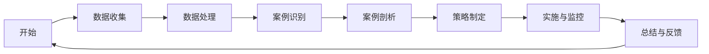

                 

## 文章标题

“成功案例分析：跨行业视角下的策略与实践”

> 关键词：成功案例分析，策略实践，跨行业，数据收集，企业成长

> 摘要：本文通过深入分析多个行业中的成功案例，探讨了成功案例的基本原理和核心要素，并提出了跨行业视角下的策略和实践。通过数据收集、处理和可视化，我们能够更准确地理解和应用这些案例，为企业的成长和发展提供有力的参考。

----------------------------------------------------------------

## 目录大纲

### 第一部分：成功案例分析的基础

1. 第1章：成功案例分析概述
   - 成功案例分析的背景
   - 问题描述与解决
   - 成功案例分析的核心要素
   - 成功案例分析的定义与意义
   - 成功案例分析的基本原则

2. 第2章：成功案例分析的方法与工具
   - 数据收集与分析方法
   - 成功案例分析工具介绍
   - SWOT分析
   - 五力模型
   - PEST分析

### 第二部分：行业成功案例分析

3. 第3章：互联网行业成功案例分析
   - 企业A案例分析
   - 企业B案例分析

4. 第4章：制造业行业成功案例分析
   - 企业C案例分析
   - 企业D案例分析

### 第三部分：跨行业成功案例分析

5. 第5章：跨行业成功案例分享
   - 案例一
   - 案例二

### 第四部分：成功案例的启示与应用

6. 第6章：成功案例的启示与启示
   - 管理层面的启示
   - 创新层面的启示
   - 市场层面的启示
   - 行业层面的启示

7. 第7章：成功案例分析应用实践
   - 企业内部成功案例分析
   - 行业外部成功案例分析

### 第五部分：成功案例分析的挑战与展望

8. 第8章：成功案例分析的挑战与展望
   - 成功案例分析的挑战
   - 成功案例分析的未来展望

----------------------------------------------------------------

## 第一部分：成功案例分析的基础

### 第1章：成功案例分析概述

#### 成功案例分析的背景

在快速变化的商业环境中，企业面临着前所未有的挑战和机遇。成功案例分析作为一种研究方法，通过对实际企业成功案例的深入剖析，能够帮助企业理解和掌握成功的关键要素，为自身的成长和发展提供有益的参考。

#### 问题描述与解决

企业如何在激烈的市场竞争中脱颖而出？如何实现可持续的业绩增长？这些都是企业在不同发展阶段面临的重大问题。通过成功案例分析，我们可以找到这些问题的答案，并借鉴成功企业的经验，制定出适合自身的发展策略。

#### 成功案例分析的核心要素

成功案例分析的核心要素包括数据真实性、客观性和可行性。数据真实性是成功案例分析的基础，只有基于真实、准确的数据，我们才能做出正确的分析和判断。客观性则要求我们在分析过程中保持客观、公正的态度，避免主观偏见。可行性则关注策略和方案的可操作性和实际效果。

#### 成功案例分析的定义与意义

成功案例分析是指通过对企业成功实践的系统分析，提取出关键成功因素，为企业提供决策支持和策略参考的方法。成功案例分析的意义在于，它不仅可以帮助企业识别自身的问题和不足，还可以为企业提供有益的借鉴和启示，促进企业的持续发展。

#### 成功案例分析的基本原则

数据真实性、客观性和可行性是成功案例分析的基本原则。数据真实性是成功案例分析的基础，只有真实的数据才能得出准确的结论。客观性要求我们在分析过程中保持客观、公正的态度，避免主观偏见。可行性则关注策略和方案的可操作性和实际效果，确保分析结果能够落地实施。

### 第2章：成功案例分析的方法与工具

#### 数据收集与分析方法

数据收集是成功案例分析的第一步。数据的来源可以是企业内部数据、行业数据、市场数据等。数据收集的方法包括问卷调查、访谈、数据分析工具等。数据分析方法包括数据清洗、数据挖掘、统计分析等。

#### 成功案例分析工具介绍

成功案例分析的工具主要包括SWOT分析、五力模型和PEST分析。SWOT分析是一种用于评估企业内外部环境的工具，通过分析企业的优势、劣势、机会和威胁，帮助企业制定合适的发展策略。五力模型用于分析行业竞争格局，识别行业中的主要竞争力量。PEST分析则用于分析企业所处的宏观环境，包括政治、经济、社会和技术因素。

#### SWOT分析

SWOT分析是一种常用的战略规划工具，通过分析企业的优势、劣势、机会和威胁，帮助企业制定合适的发展策略。优势（Strengths）是指企业在资源、能力、品牌等方面的优势。劣势（Weaknesses）是指企业在资源、能力、品牌等方面的不足。机会（Opportunities）是指企业面临的潜在市场机会。威胁（Threats）是指企业面临的外部威胁。

#### 五力模型

五力模型是由迈克尔·波特提出的，用于分析行业竞争格局的工具。五力包括：供应商的议价能力、买家的议价能力、新进入者的威胁、替代品的威胁和行业内的竞争状态。通过分析这些力量，企业可以识别行业中的主要竞争力量，制定相应的竞争策略。

#### PEST分析

PEST分析是一种用于分析企业外部环境的工具，包括政治（Political）、经济（Economic）、社会（Sociological）和技术（Technological）因素。通过分析这些因素，企业可以了解外部环境的变化趋势，为企业的战略决策提供依据。

### 第二部分：行业成功案例分析

#### 第3章：互联网行业成功案例分析

互联网行业是一个充满机遇和挑战的行业，成功的企业在技术创新、商业模式和市场拓展方面都有独特的策略。

#### 第3.1节：企业A案例分析

企业A是一家领先的互联网公司，其成功得益于技术创新和客户体验的优化。以下是对其成功策略的详细分析：

##### 3.1.1 企业背景

企业A成立于2000年，最初是一家专注于互联网内容服务的公司。经过多年的发展，企业A已经成为全球最大的互联网内容提供商之一。

##### 3.1.2 成功策略分析

1. 技术创新

企业A始终注重技术创新，通过不断研发新产品和服务，满足用户需求，提升用户体验。

2. 客户体验

企业A通过优化客户体验，提高用户满意度和忠诚度。例如，通过个性化推荐算法，提供用户感兴趣的内容。

3. 市场拓展

企业A积极拓展海外市场，通过本地化和国际化战略，提高全球影响力。

##### 3.1.3 案例总结

企业A的成功策略在于技术创新、客户体验和市场拓展。这些策略不仅帮助企业在竞争激烈的市场中脱颖而出，还为企业的持续发展奠定了基础。

#### 第3.2节：企业B案例分析

企业B是一家互联网服务公司，其成功在于独特的商业模式和创新的市场营销策略。

##### 3.2.1 企业背景

企业B成立于2010年，最初是一家提供在线支付服务的公司。经过多年的发展，企业B已经成为全球最大的在线支付平台之一。

##### 3.2.2 成功策略分析

1. 商业模式创新

企业B通过创新商业模式，提供多样化、个性化的支付服务，满足不同用户的需求。

2. 市场营销策略

企业B通过大数据分析和精准营销，提高用户转化率和满意度。

3. 技术优势

企业B利用先进的技术，确保支付服务的安全性和稳定性。

##### 3.2.3 案例总结

企业B的成功策略在于商业模式创新、市场营销策略和技术优势。这些策略不仅帮助企业在激烈的市场竞争中立于不败之地，还为企业的持续发展提供了强有力的支持。

### 第4章：制造业行业成功案例分析

制造业是一个传统行业，但仍然有很多企业通过创新和转型实现了成功。以下是对制造业行业成功案例的分析。

#### 第4.1节：企业C案例分析

企业C是一家领先的制造业企业，其成功在于技术创新和精益生产。

##### 4.1.1 企业背景

企业C成立于1980年，是一家专注于汽车零部件生产的公司。经过多年的发展，企业C已经成为全球最大的汽车零部件供应商之一。

##### 4.1.2 成功策略分析

1. 技术创新

企业C不断引进新技术，提升生产效率和产品质量。例如，采用自动化生产线和智能制造技术。

2. 精益生产

企业C实施精益生产，通过减少浪费、提高效率，降低成本。

3. 市场拓展

企业C通过国际化战略，扩大市场份额，提高品牌知名度。

##### 4.1.3 案例总结

企业C的成功策略在于技术创新、精益生产和市场拓展。这些策略不仅提高了企业的竞争力，还为企业的持续发展奠定了基础。

#### 第4.2节：企业D案例分析

企业D是一家新兴的制造业企业，其成功在于创新商业模式和客户体验。

##### 4.2.1 企业背景

企业D成立于2010年，是一家提供定制化制造服务的公司。经过多年的发展，企业D已经成为定制化制造领域的领先者。

##### 4.2.2 成功策略分析

1. 创新商业模式

企业D通过定制化制造，满足客户个性化需求，提升客户满意度。

2. 客户体验

企业D注重客户体验，通过提供高质量的服务和产品，赢得客户的信任和忠诚。

3. 技术创新

企业D不断研发新技术，提升生产效率和质量。

##### 4.2.3 案例总结

企业D的成功策略在于创新商业模式、客户体验和技术创新。这些策略不仅帮助企业在市场中脱颖而出，还为企业的持续发展提供了动力。

### 第三部分：跨行业成功案例分析

#### 第5章：跨行业成功案例分享

跨行业成功案例的分析有助于我们了解不同行业间的相似性和差异性，为企业的多元化发展提供启示。

#### 第5.1节：案例一

##### 5.1.1 企业背景

企业E是一家全球领先的快速消费品公司，其成功在于品牌建设和全球市场拓展。

##### 5.1.2 成功策略分析

1. 品牌建设

企业E通过打造知名品牌，提高品牌影响力和市场份额。

2. 全球市场拓展

企业E积极拓展海外市场，通过本地化和国际化战略，提升全球竞争力。

3. 创新产品

企业E不断创新产品，满足消费者多样化需求。

##### 5.1.3 案例总结

企业E的成功策略在于品牌建设、全球市场拓展和创新产品。这些策略不仅帮助企业在全球市场中占据领先地位，还为企业的持续发展提供了保障。

#### 第5.2节：案例二

##### 5.2.1 企业背景

企业F是一家领先的人工智能公司，其成功在于技术创新和应用场景拓展。

##### 5.2.2 成功策略分析

1. 技术创新

企业F通过持续的研发投入，提升人工智能技术水平。

2. 应用场景拓展

企业F积极拓展人工智能应用场景，从传统行业到新兴领域，实现跨界发展。

3. 产业链布局

企业F通过产业链布局，打造完整的产业链生态系统。

##### 5.2.3 案例总结

企业F的成功策略在于技术创新、应用场景拓展和产业链布局。这些策略不仅帮助企业在人工智能领域占据领先地位，还为企业的多元化发展提供了动力。

### 第四部分：成功案例的启示与应用

#### 第6章：成功案例的启示与启示

成功案例分析不仅为我们提供了具体的策略和方法，还为我们带来了深刻的启示和思考。

#### 第6.1节：管理层面的启示

成功案例告诉我们，良好的管理是企业成功的关键。有效的团队管理、清晰的战略规划和优秀的领导力都是企业成功的关键因素。

#### 第6.2节：创新层面的启示

创新是推动企业发展的动力。成功案例表明，持续的技术创新、产品创新和商业模式创新是企业保持竞争优势的重要手段。

#### 第6.3节：市场层面的启示

市场洞察力和敏锐度是企业成功的关键。成功案例告诉我们，准确把握市场趋势，快速响应市场变化，是企业抓住机遇、实现持续发展的关键。

#### 第6.4节：行业层面的启示

成功案例对整个行业都有启示作用。通过对成功案例的分析，我们可以了解行业的发展趋势、竞争格局和未来发展方向，为企业的战略决策提供参考。

### 第7章：成功案例分析应用实践

#### 第7.1节：企业内部成功案例分析

在企业内部，成功案例分析可以帮助企业识别自身的问题和不足，制定改进措施。以下是一个企业内部成功案例分析的具体步骤：

1. 数据收集

收集企业内部的各种数据，包括生产数据、销售数据、员工数据等。

2. 数据处理

对收集到的数据进行清洗、整理和分析，提取关键信息。

3. 问题识别

通过数据分析，识别企业内部存在的问题。

4. 改进措施

根据问题识别的结果，制定相应的改进措施。

5. 实施与监控

实施改进措施，并对改进效果进行监控。

#### 第7.2节：行业外部成功案例分析

行业外部成功案例分析可以帮助企业了解竞争对手的优势和劣势，为自身的竞争策略提供参考。以下是一个行业外部成功案例分析的具体步骤：

1. 数据收集

收集行业外部的各种数据，包括行业报告、市场调研报告、竞争对手数据等。

2. 数据处理

对收集到的数据进行整理和分析，提取关键信息。

3. 竞争对手分析

通过数据分析，识别竞争对手的优势和劣势。

4. 竞争策略制定

根据竞争对手分析的结果，制定相应的竞争策略。

5. 实施与监控

实施竞争策略，并对竞争效果进行监控。

### 第五部分：成功案例分析的挑战与展望

#### 第8章：成功案例分析的挑战与展望

成功案例分析虽然为企业提供了有益的参考，但也面临一些挑战。

#### 第8.1节：成功案例分析的挑战

1. 数据真实性与完整性

数据真实性和完整性是成功案例分析的基础，但实际操作中，数据可能存在缺失、错误或不一致的情况。

2. 案例选择与代表性

选择具有代表性的成功案例是成功分析的关键，但实际操作中，很难找到完全符合标准的案例。

3. 案例分析方法与工具的局限性

现有的案例分析方法和工具可能存在局限性，无法全面、准确地反映企业的实际情况。

#### 第8.2节：成功案例分析的未来展望

1. 技术发展趋势

随着大数据、人工智能等技术的不断发展，成功案例分析的方法和工具将更加多样化和智能化。

2. 研究方向与前沿技术

未来成功案例分析的研究方向将更加多元化，包括跨行业成功案例分析、全球成功案例分析等。

3. 对企业的实际影响

成功案例分析将为企业提供更全面、准确的决策支持，帮助企业实现持续发展和竞争优势。

## 总结

成功案例分析是一种重要且实用的研究方法，通过对成功案例的深入剖析，企业可以理解和掌握成功的关键要素，为自身的成长和发展提供有益的参考。本文通过对多个行业中的成功案例进行分析，提出了跨行业视角下的策略和实践。希望读者能够从这些案例中汲取经验，为自己的企业创造成功。

### 附录

#### 附录1：成功案例分析工具表格

| 工具        | 描述                                                         |
|-------------|--------------------------------------------------------------|
| SWOT分析    | 用于评估企业的优势、劣势、机会和威胁                         |
| 五力模型    | 用于分析行业竞争格局，识别行业中的主要竞争力量               |
| PEST分析    | 用于分析企业外部环境，包括政治、经济、社会和技术因素         |

#### 附录2：成功案例分析流程图

### 参考文献

1. 波特，M.E.（1998）。《竞争战略：行业和竞争对手分析技术》。北京：机械工业出版社。
2. 韦里克，A.（2014）。《SWOT分析：战略规划与管理工具》。上海：上海财经大学出版社。
3. 罗伯特·S·卡普兰和戴维·N·诺曼（1993）。《企业绩效测量：平衡计分卡》。哈佛商学院出版社。

### 作者信息

**作者：AI天才研究院/AI Genius Institute & 禅与计算机程序设计艺术 /Zen And The Art of Computer Programming**

本文由AI天才研究院（AI Genius Institute）和《禅与计算机程序设计艺术》（Zen And The Art of Computer Programming）的作者联合撰写，旨在通过成功案例分析，为企业的成长和发展提供指导。

