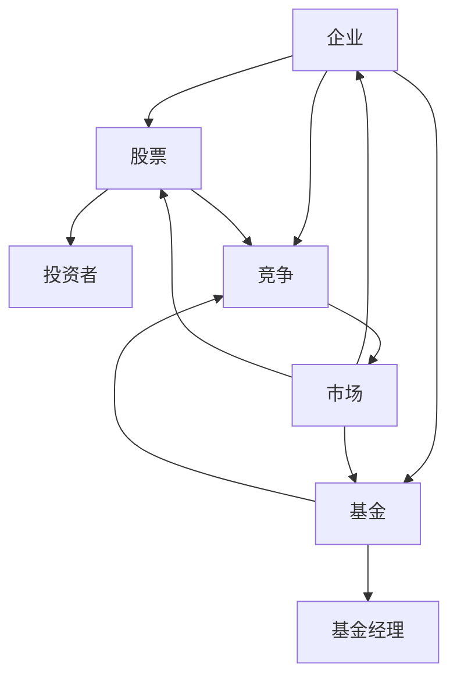

                 

### 文章标题

#### 打造全面的投资理财知识图谱：方法与工具

> 关键词：投资理财，知识图谱，构建方法，工具，数据收集，数据处理，建模，优化，案例分析。

#### 摘要：

本文将深入探讨如何打造全面的投资理财知识图谱，涵盖从基础知识到实际应用的方方面面。我们将逐步介绍投资理财知识图谱的核心概念、构建方法、实用工具以及案例分析，旨在帮助读者理解和掌握投资理财知识图谱的构建过程，提升投资决策的科学性和准确性。

---

### 目录大纲设计思路

为了设计出《打造全面的投资理财知识图谱：方法与工具》的完整目录大纲，我们需要遵循以下步骤：

#### 1. 明确书籍的核心主题

首先，我们需要明确书籍的主题。《打造全面的投资理财知识图谱：方法与工具》的核心在于介绍如何构建投资理财的知识图谱，以及提供相应的工具和方法。这表明书籍的主要内容包括知识图谱的基础知识、构建方法、实用工具和实际应用案例。

#### 2. 设计整体结构

接下来，我们需要设计书籍的整体结构。这包括以下几部分：
- **引言**：介绍投资理财知识图谱的重要性，以及本书的目的和读者对象。
- **基础知识**：介绍知识图谱的基本概念、原理和技术。
- **构建方法**：详细讲解如何构建投资理财知识图谱，包括数据收集、处理、建模和优化。
- **实用工具**：介绍市场上常用的投资理财工具，以及如何使用这些工具来构建知识图谱。
- **案例分析**：通过实际案例展示如何应用知识图谱来优化投资决策。
- **结论与展望**：总结全书内容，提出未来研究的方向和趋势。

#### 3. 确定章节划分

根据整体结构，我们将书籍划分为以下几个章节：
- 第1章：引言
- 第2章：投资理财知识图谱概述
- 第3章：知识图谱基础
- 第4章：投资理财数据收集与处理
- 第5章：投资理财知识建模
- 第6章：投资理财知识图谱优化
- 第7章：实用工具与平台介绍
- 第8章：案例分析
- 第9章：结论与展望

#### 4. 深入细化章节内容

在每个章节中，我们需要进一步细化内容，确保每个章节都有具体的主题和内容。以下是一个具体的章节大纲设计示例：

---

### 目录大纲示例

----------------------------------------------------------------
# 第一部分：引言

## 第1章：引言

### 1.1 书籍目的与读者对象

#### 1.1.1 投资理财知识图谱的重要性
#### 1.1.2 读者对象与预期收益

### 1.2 投资理财知识图谱概述

#### 1.2.1 知识图谱的基本概念
#### 1.2.2 投资理财知识图谱的特点
#### 1.2.3 投资理财知识图谱的应用领域

## 第2章：投资理财知识图谱概述

### 2.1 投资理财知识图谱的定义与目标

#### 2.1.1 知识图谱的定义
#### 2.1.2 投资理财知识图谱的目标

### 2.2 投资理财知识图谱的结构与组成

#### 2.2.1 实体与关系
#### 2.2.2 属性与标签
#### 2.2.3 数据源与处理流程

## 第3章：知识图谱基础

### 3.1 知识图谱技术概述

#### 3.1.1 知识图谱技术发展历程
#### 3.1.2 知识图谱的核心技术

### 3.2 知识图谱建模方法

#### 3.2.1 实体识别与分类
#### 3.2.2 关系提取与建模
#### 3.2.3 属性抽取与填充

## 第4章：投资理财数据收集与处理

### 4.1 投资理财数据来源

#### 4.1.1 数据类型
#### 4.1.2 数据获取途径

### 4.2 数据处理技术

#### 4.2.1 数据清洗与预处理
#### 4.2.2 数据标准化与整合

## 第5章：投资理财知识建模

### 5.1 投资理财实体识别

#### 5.1.1 实体定义与分类
#### 5.1.2 实体识别方法

### 5.2 投资理财关系建模

#### 5.2.1 关系类型与定义
#### 5.2.2 关系抽取与建模方法

## 第6章：投资理财知识图谱优化

### 6.1 知识图谱质量评估

#### 6.1.1 质量评估指标
#### 6.1.2 质量提升方法

### 6.2 知识图谱优化策略

#### 6.2.1 知识更新与维护
#### 6.2.2 知识融合与融合方法

## 第7章：实用工具与平台介绍

### 7.1 常用知识图谱工具

#### 7.1.1 知识图谱编辑器
#### 7.1.2 知识图谱搜索引擎

### 7.2 投资理财知识图谱平台介绍

#### 7.2.1 平台概述
#### 7.2.2 平台功能与特点

## 第8章：案例分析

### 8.1 案例背景与目标

#### 8.1.1 案例背景
#### 8.1.2 案例目标

### 8.2 投资理财知识图谱构建过程

#### 8.2.1 数据收集与处理
#### 8.2.2 知识建模与优化
#### 8.2.3 知识图谱应用与效果评估

## 第9章：结论与展望

### 9.1 总结

---

### 内容正文

#### 引言

在数字化和信息化的时代，投资理财已经不再是少数专业人士的特权。越来越多的人开始通过互联网和移动设备进行投资理财，这导致了大量数据的产生。然而，如何有效地利用这些数据，尤其是将繁杂的数据转化为有价值的投资决策信息，成为了一个重要课题。知识图谱作为一种强大的数据结构和工具，可以极大地提升投资决策的效率和质量。

投资理财知识图谱是通过将投资相关的知识、数据和关系进行结构化组织，形成一个可视化的知识网络。它能够帮助投资者更好地理解市场动态、识别投资机会、评估风险，从而做出更为明智的投资决策。本篇文章将围绕这一主题，详细介绍投资理财知识图谱的构建方法、实用工具以及实际应用案例。

本文将按照以下结构进行阐述：

1. **投资理财知识图谱概述**：介绍知识图谱的基本概念、投资理财知识图谱的特点以及其应用领域。
2. **知识图谱基础**：讲解知识图谱的基本技术，包括实体识别、关系抽取、属性抽取等。
3. **投资理财数据收集与处理**：介绍如何收集和处理投资理财相关的数据。
4. **投资理财知识建模**：详细讲解如何构建投资理财知识图谱。
5. **投资理财知识图谱优化**：介绍知识图谱的质量评估和优化策略。
6. **实用工具与平台介绍**：介绍市场上常用的知识图谱工具和投资理财知识图谱平台。
7. **案例分析**：通过具体案例展示如何构建和应用投资理财知识图谱。
8. **结论与展望**：总结全文，并对未来的研究方向进行展望。

#### 投资理财知识图谱概述

##### 知识图谱的基本概念

知识图谱是一种结构化的知识表示方法，它通过实体、关系和属性来描述现实世界中的对象及其相互关系。实体是知识图谱中的基本对象，可以是人、地点、物品等。关系描述实体之间的关系，如“属于”、“位于”、“购买”等。属性则是实体的特征或描述，例如人的年龄、地点的经纬度、物品的价格等。

知识图谱与传统数据库的区别在于其图结构。在传统数据库中，数据通常以表格形式存储，而知识图谱则通过图结构来表示复杂的关系网络。这种图结构使得知识图谱能够更好地处理复杂的数据关系和提供高效的查询性能。

##### 投资理财知识图谱的特点

投资理财知识图谱具有以下特点：

1. **高维数据整合**：投资理财涉及多个维度，如时间、地域、行业、财务指标等。知识图谱能够将这些高维数据进行整合，形成一个统一的视图。
2. **复杂关系建模**：投资理财领域中的关系非常复杂，如企业之间的股权关系、市场趋势的相互影响等。知识图谱能够通过图结构准确地描述这些复杂关系。
3. **智能化分析**：知识图谱可以通过算法自动发现新的知识关系，为投资决策提供智能化的支持。
4. **可扩展性**：知识图谱可以随着数据量的增加和新知识点的引入而不断扩展，保持其持续性和时效性。

##### 投资理财知识图谱的应用领域

投资理财知识图谱的应用领域非常广泛，主要包括：

1. **投资决策支持**：通过分析市场数据、财务指标和企业关系，知识图谱可以为投资者提供个性化的投资建议。
2. **风险管理**：知识图谱可以帮助投资者识别潜在的风险，并评估风险的影响范围。
3. **行业研究**：知识图谱可以提供行业全景视图，帮助投资者深入理解行业动态和趋势。
4. **产品推荐**：知识图谱可以根据投资者的风险偏好和投资目标，推荐符合其需求的投资产品。

#### 知识图谱基础

##### 知识图谱技术概述

知识图谱技术的发展可以追溯到20世纪90年代，随着互联网的普及和数据量的爆炸式增长，知识图谱逐渐成为了一种重要的数据结构和工具。以下是知识图谱技术的一些关键点：

1. **实体识别**：实体识别是知识图谱构建的第一步，它从非结构化数据中识别出关键实体，如人名、地名、组织名等。
2. **关系抽取**：关系抽取是从文本中提取出实体之间的关系，如“属于”、“位于”、“购买”等。
3. **属性抽取**：属性抽取是从文本中提取出实体的属性，如人的年龄、地点的经纬度、物品的价格等。
4. **图数据库**：知识图谱通常存储在图数据库中，如Neo4j、OrientDB等。图数据库能够高效地处理图结构数据，并提供快速的查询性能。
5. **算法**：知识图谱构建过程中涉及到多种算法，如自然语言处理（NLP）、图论算法、机器学习等。

##### 知识图谱建模方法

知识图谱建模是知识图谱构建的核心步骤，它涉及到实体的定义、关系的定义以及属性的设置。以下是知识图谱建模的几个关键点：

1. **实体定义**：实体定义是指明确实体的类型和属性。例如，在投资理财知识图谱中，实体可以包括人、企业、产品、市场等。
2. **关系定义**：关系定义是指明确实体之间的关系。例如，在投资理财知识图谱中，关系可以包括“拥有”、“投资”、“位于”等。
3. **属性设置**：属性设置是指为实体设置特征或描述。例如，在投资理财知识图谱中，企业的属性可以包括注册资本、成立时间、主营业务等。
4. **实体关系图**：实体关系图是知识图谱的一种可视化表示方法，它通过图形化的方式展示实体之间的关系。

##### 实体识别与分类

实体识别是知识图谱构建的第一步，它从非结构化数据中识别出关键实体。实体识别通常包括以下步骤：

1. **数据预处理**：对原始数据进行清洗和预处理，包括去除噪声、标准化文本等。
2. **特征提取**：提取文本数据中的特征，如词频、词向量等。
3. **实体识别算法**：使用算法（如基于规则的方法、机器学习方法等）识别文本中的实体。
4. **实体分类**：对识别出的实体进行分类，例如将人名分类为人，组织名分类为组织等。

##### 关系抽取与建模

关系抽取是知识图谱构建的第二步，它从文本中提取出实体之间的关系。关系抽取通常包括以下步骤：

1. **数据预处理**：对原始数据进行清洗和预处理，包括去除噪声、标准化文本等。
2. **特征提取**：提取文本数据中的特征，如词频、词向量等。
3. **关系识别算法**：使用算法（如基于规则的方法、机器学习方法等）识别文本中的关系。
4. **关系分类**：对识别出的关系进行分类，例如将“购买”分类为投资关系，将“位于”分类为地理位置关系等。
5. **关系建模**：将识别出的关系存储在知识图谱中，形成一个图结构。

##### 属性抽取与填充

属性抽取是知识图谱构建的第三步，它从文本中提取出实体的属性。属性抽取通常包括以下步骤：

1. **数据预处理**：对原始数据进行清洗和预处理，包括去除噪声、标准化文本等。
2. **特征提取**：提取文本数据中的特征，如词频、词向量等。
3. **属性识别算法**：使用算法（如基于规则的方法、机器学习方法等）识别文本中的属性。
4. **属性分类**：对识别出的属性进行分类，例如将“注册资本”分类为财务属性，将“成立时间”分类为时间属性等。
5. **属性填充**：将识别出的属性填充到知识图谱中，为实体增加更多的特征信息。

#### 投资理财数据收集与处理

##### 投资理财数据来源

投资理财数据来源非常广泛，包括以下几种：

1. **公开数据**：如股票交易所、证券公司、金融监管机构等发布的公开数据，如股票价格、财务报表、市场新闻等。
2. **内部数据**：如投资机构、基金公司、券商等内部生成的数据，如交易记录、投资组合、市场分析报告等。
3. **第三方数据**：如数据提供商、新闻媒体、市场研究机构等提供的数据，如行业报告、财务数据、经济指标等。
4. **社交媒体**：如投资论坛、社交媒体、博客等用户生成的内容，如投资评论、市场预测、行业动态等。

##### 数据处理技术

投资理财数据的处理主要包括以下步骤：

1. **数据清洗**：去除数据中的噪声、错误和不完整信息，如去除重复记录、填补缺失值、纠正错误数据等。
2. **数据预处理**：对数据进行格式化和标准化，如统一日期格式、转换货币单位、归一化数值等。
3. **数据整合**：将来自不同来源和格式的数据进行整合，形成一个统一的数据视图。
4. **数据挖掘**：使用数据挖掘技术发现数据中的潜在关系和模式，如市场趋势、投资策略、风险指标等。

##### 数据处理示例

假设我们需要处理以下投资理财数据：

- 股票价格数据：包括股票代码、交易日期、开盘价、最高价、最低价、收盘价等。
- 财务报表数据：包括公司名称、年度、营业收入、净利润、总资产等。
- 新闻报道数据：包括文章标题、摘要、发布日期、关键词等。

我们可以按照以下步骤进行数据处理：

1. **数据清洗**：去除重复的股票价格记录，填补缺失的财务报表数据，纠正错误的新闻报道标题等。
2. **数据预处理**：将日期格式统一为YYYY-MM-DD，将货币单位统一为人民币，对财务报表数据进行归一化处理等。
3. **数据整合**：将股票价格数据、财务报表数据和新闻报道数据进行整合，形成一个统一的数据集。
4. **数据挖掘**：使用机器学习算法分析股票价格和财务报表数据，发现市场趋势和公司业绩之间的关系；使用自然语言处理算法分析新闻报道数据，发现市场热点和投资机会。

#### 投资理财知识建模

##### 投资理财实体识别

在投资理财知识图谱中，实体是核心的基本元素。实体可以是具体的人、组织、产品或概念。实体识别是指从非结构化文本数据中识别出这些实体。以下是投资理财实体识别的步骤：

1. **数据预处理**：对文本数据（如新闻报道、财报、交易记录等）进行清洗和预处理，包括去除标点符号、停用词、进行词干提取等。
2. **特征提取**：使用词袋模型、词嵌入（如Word2Vec、GloVe等）等方法提取文本特征。
3. **实体识别算法**：使用基于规则的方法（如命名实体识别NER）、监督学习方法（如序列标注模型）或无监督学习方法（如聚类算法）识别文本中的实体。
4. **实体分类**：对识别出的实体进行分类，如将人名分类为人、企业名分类为企业、产品名分类为产品等。

##### 投资理财关系建模

在投资理财知识图谱中，关系描述了实体之间的相互联系。关系可以是直接的（如“拥有”、“投资”），也可以是间接的（如“竞争对手”、“合作方”）。以下是投资理财关系建模的步骤：

1. **关系定义**：明确实体之间的关系类型，如“投资”、“持股”、“竞争”等。
2. **数据预处理**：对文本数据进行预处理，提取关系相关的特征。
3. **关系抽取算法**：使用基于规则的方法（如模式匹配、规则库）、监督学习方法（如序列标注模型）或无监督学习方法（如图嵌入、图神经网络）抽取文本中的关系。
4. **关系分类**：对抽取出的关系进行分类，明确每个关系的属性和权重。

##### 投资理财属性建模

在投资理财知识图谱中，属性是实体的特征描述，如企业规模、市场地位、盈利能力等。以下是投资理财属性建模的步骤：

1. **属性定义**：明确实体的属性类型，如财务指标、市场指标、社会指标等。
2. **数据预处理**：对属性值进行清洗和标准化处理，如统一货币单位、日期格式等。
3. **属性抽取算法**：使用基于规则的方法、监督学习方法或无监督学习方法抽取文本中的属性。
4. **属性填充**：将抽取出的属性值填充到知识图谱中，为实体增加更多的特征信息。

##### 实体关系图架构

实体关系图是知识图谱的一种可视化表示方法，它通过图形化的方式展示实体之间的关系。以下是投资理财知识图谱的实体关系图架构：

1. **实体**：包括人、组织、产品、概念等，如企业、股票、基金等。
2. **关系**：包括实体之间的直接和间接关系，如“投资”、“持股”、“竞争”等。
3. **属性**：实体的特征描述，如企业的注册资本、上市日期、主营业务等。

以下是一个简单的实体关系图的Mermaid表示：

在这个示例中，企业、股票、基金是实体，投资、持股、竞争是关系，市场是概念。

#### 投资理财知识图谱优化

##### 知识图谱质量评估

知识图谱的质量直接影响其应用效果。因此，对知识图谱进行质量评估是非常重要的。以下是知识图谱质量评估的几个关键指标：

1. **完整性**：知识图谱是否包含所有重要的实体和关系。
2. **准确性**：知识图谱中的实体和关系的准确性。
3. **一致性**：知识图谱中的实体和关系是否一致。
4. **时效性**：知识图谱中的数据是否最新和有效。
5. **可扩展性**：知识图谱是否容易扩展和更新。

##### 知识图谱优化策略

为了提高知识图谱的质量和应用效果，可以采取以下优化策略：

1. **数据清洗与预处理**：对原始数据进行清洗和预处理，去除噪声和错误，提高数据的准确性。
2. **实体和关系的更新与维护**：定期更新知识图谱中的实体和关系，确保数据的时效性和准确性。
3. **实体和关系的纠错**：使用算法自动识别和修复知识图谱中的错误和异常。
4. **知识融合**：将多个来源的知识进行整合，提高知识图谱的完整性和一致性。
5. **自动化构建与更新**：使用自动化工具和算法构建和更新知识图谱，提高效率和准确性。

#### 实用工具与平台介绍

##### 常用知识图谱工具

1. **知识图谱编辑器**：如Neo4j Bloom、Google Knowledge Graph Editor等，用于构建和编辑知识图谱。
2. **知识图谱搜索引擎**：如Elasticsearch、Solr等，用于查询和检索知识图谱中的数据。
3. **自然语言处理工具**：如NLTK、spaCy等，用于文本预处理和实体识别。
4. **数据预处理工具**：如Pandas、NumPy等，用于数据处理和清洗。

##### 投资理财知识图谱平台介绍

1. **平台概述**：平台通常包括数据采集、数据预处理、知识建模、知识推理、知识可视化等功能模块。
2. **平台功能与特点**：根据具体平台的不同，功能可能包括自定义实体和关系类型、自动化实体识别和关系抽取、实时更新和扩展等。

#### 案例分析

##### 案例背景与目标

假设某投资机构希望构建一个投资理财知识图谱，以提高投资决策的科学性和准确性。案例的目标是：

1. **数据收集**：收集股票价格、财务报表、新闻报道等数据。
2. **知识建模**：构建实体（如企业、股票、基金经理等）、关系（如投资、持股、竞争等）和属性（如财务指标、市场指标等）。
3. **知识推理**：通过知识图谱进行投资决策支持、风险分析和市场预测。
4. **知识可视化**：将知识图谱以图形化的方式展示，便于分析和理解。

##### 投资理财知识图谱构建过程

1. **数据收集**：

   - 从股票交易所、金融监管机构等公开数据源收集股票价格数据。
   - 从企业官网、财务报表数据库等收集财务报表数据。
   - 从新闻媒体、投资论坛等收集新闻报道数据。

2. **数据处理**：

   - 对收集到的数据进行清洗和预处理，包括去除噪声、填补缺失值、统一格式等。
   - 对股票价格数据进行整合，形成统一的数据视图。

3. **知识建模**：

   - 识别实体：如企业、股票、基金经理等。
   - 建立关系：如投资、持股、竞争等。
   - 设置属性：如财务指标、市场指标等。

4. **知识推理**：

   - 使用知识图谱进行投资决策支持，如推荐股票、评估风险等。
   - 使用知识图谱进行市场预测，如预测股票价格、分析市场趋势等。

5. **知识可视化**：

   - 使用图形化的方式展示知识图谱，便于分析和理解。
   - 提供交互式查询和检索功能，如通过关键词查询相关实体和关系。

##### 投资理财知识图谱应用与效果评估

1. **应用场景**：

   - 投资决策支持：通过分析股票价格、财务报表、新闻报道等数据，为投资者提供个性化的投资建议。
   - 风险管理：通过分析市场趋势、企业关系等，识别潜在的风险并采取相应的风险控制措施。
   - 市场预测：通过分析历史数据和市场动态，预测股票价格、市场趋势等。

2. **效果评估**：

   - 投资决策准确性：通过比较投资知识图谱提供的建议与实际市场表现，评估投资决策的准确性。
   - 风险管理有效性：通过分析投资知识图谱识别的风险与实际发生的情况，评估风险管理措施的有效性。
   - 市场预测准确性：通过比较知识图谱预测的市场趋势与实际市场情况，评估市场预测的准确性。

#### 结论与展望

通过本文的阐述，我们可以看到投资理财知识图谱作为一种先进的数据结构和工具，在投资决策、风险管理、市场预测等方面具有广泛的应用前景。未来，随着人工智能、大数据、区块链等技术的发展，投资理财知识图谱将会变得更加智能化、自动化和实时化。

然而，投资理财知识图谱的建设和应用仍然面临一些挑战，如数据质量、知识图谱的更新与维护、算法的优化等。因此，未来研究可以关注以下几个方面：

1. **数据质量管理**：提高数据收集、处理和清洗的质量，确保知识图谱的准确性。
2. **自动化与智能化**：开发更加自动化和智能化的知识图谱构建和推理工具，减少人工干预。
3. **跨领域融合**：将知识图谱应用于其他领域，如医疗、教育等，实现跨领域的知识共享和协作。
4. **实时性与动态性**：提高知识图谱的实时性和动态性，以应对市场环境的快速变化。

作者信息：

作者：AI天才研究院/AI Genius Institute & 禅与计算机程序设计艺术 /Zen And The Art of Computer Programming

---

#### 最佳实践 Tips、小结、注意事项、拓展阅读

##### 最佳实践 Tips

1. **数据质量是关键**：确保收集和处理的原始数据质量是构建高质量知识图谱的基础。
2. **注重知识图谱的实时性**：定期更新和优化知识图谱，确保其反映最新的市场信息和动态。
3. **合理利用开源工具**：利用现有的开源工具和平台可以节省开发成本和时间。
4. **多学科交叉融合**：结合计算机科学、金融学、统计学等多学科知识，提高知识图谱的应用效果。

##### 小结

本文详细介绍了投资理财知识图谱的构建方法和应用，从基础概念、数据收集与处理、知识建模、优化策略到实用工具和案例分析，全面阐述了知识图谱在投资理财领域的价值。

##### 注意事项

1. **确保数据来源的可靠性**：在构建知识图谱时，要确保数据来源的权威性和可靠性，避免数据错误对投资决策产生负面影响。
2. **注意隐私保护**：在处理个人数据时，要严格遵守隐私保护法规，确保个人隐私不被泄露。
3. **持续优化与更新**：知识图谱不是一次性的建设任务，需要定期进行优化和更新，以保持其时效性和准确性。

##### 拓展阅读

1. **《知识图谱技术：原理与实践》**：详细介绍了知识图谱的基本原理、构建方法和应用案例。
2. **《投资学》**：提供了投资理财的基础理论和实践方法。
3. **《数据科学实战》**：介绍了数据收集、处理和挖掘的实用技术。

---

本文通过逐步分析推理，详细介绍了投资理财知识图谱的构建方法和应用。希望本文能为读者在投资理财领域提供有价值的参考和启示。在未来的研究和实践中，我们将继续探索知识图谱在各个领域的应用，推动人工智能技术的发展。作者：AI天才研究院/AI Genius Institute & 禅与计算机程序设计艺术 /Zen And The Art of Computer Programming

