                 

# 打造智能化金融咨询聊天机器人

## 关键词
- 智能金融
- 咨询聊天机器人
- 自然语言处理
- 语音识别
- 机器学习

## 摘要
本文将深入探讨如何打造智能化金融咨询聊天机器人，从技术、业务和用户体验等多个角度进行分析。我们将介绍核心概念，探讨人工智能技术、金融业务知识、用户交互和系统架构的原理与联系，详细讲解自然语言处理算法和关键数学模型，分析系统架构设计，并分享实际项目实战经验。通过本文的详细讲解，读者将能够全面了解并掌握智能化金融咨询聊天机器人的设计与实现方法。

## 第一部分：背景介绍

### 1.1 问题背景

随着人工智能技术的飞速发展，智能金融咨询聊天机器人逐渐成为金融行业的一大热点。这种机器人能够模拟人类对话，为用户提供个性化的金融服务，提高用户体验和金融机构的运营效率。然而，打造一个智能化金融咨询聊天机器人并非易事，需要从技术、业务和用户体验等多方面进行深入探讨。

智能金融咨询聊天机器人的出现，是为了解决传统金融咨询方式中存在的一些问题。首先，金融市场的信息量大且复杂，用户需要从海量信息中筛选出有价值的信息，这是一个耗时且繁琐的过程。其次，传统金融咨询服务通常依赖于人工，成本高且效率低，难以满足用户快速获取信息的需求。最后，用户对于金融产品的了解程度不同，个性化服务需求差异较大，传统服务模式难以满足多样化的需求。

智能金融咨询聊天机器人通过模拟人类对话，能够为用户提供实时、个性化的金融咨询服务。用户可以通过文字或语音与机器人进行交流，机器人能够理解用户的意图，提供投资建议、理财规划、风险控制等信息。这不仅提高了用户的体验，还能够降低金融机构的运营成本。

然而，打造一个智能化金融咨询聊天机器人并非易事。首先，机器人需要具备自然语言处理能力，能够理解用户输入的文本或语音，并生成合理的回复。其次，机器人需要具备金融业务知识，能够针对用户的金融需求提供专业化的服务。此外，机器人还需要具备良好的用户体验，界面设计要简洁易用，操作流程要流畅自然。最后，机器人需要具备高效、可靠的系统架构，能够稳定运行并处理大量用户请求。

### 1.2 问题描述

本章节将围绕打造智能化金融咨询聊天机器人的问题展开，从以下几个方面进行探讨：

- 技术选型：选择合适的人工智能技术，如自然语言处理、语音识别、机器学习等。
- 业务理解：深入理解金融咨询领域的业务需求，确保聊天机器人能够提供有价值的服务。
- 用户体验：设计人性化的交互界面，提升用户使用体验。
- 系统架构：构建高效、可靠的系统架构，确保聊天机器人的稳定运行。

为了解决上述问题，本书将采用以下方法：

- 系统地介绍智能化金融咨询聊天机器人所需的核心技术，如自然语言处理、语音识别、机器学习等。
- 分析金融咨询领域的业务特点，为聊天机器人提供定制化的服务。
- 结合实际案例，讲解聊天机器人的设计、开发与优化过程。
- 提供最佳实践，帮助读者在实际项目中更好地应用所学知识。

### 1.3 问题解决

为了解决上述问题，我们需要从以下几个方面进行探讨：

#### 技术选型

首先，技术选型是打造智能化金融咨询聊天机器人的关键。我们需要选择合适的人工智能技术，如自然语言处理、语音识别、机器学习等。

1. **自然语言处理（NLP）**：
   自然语言处理是使计算机能够理解、生成和解析人类自然语言的技术。对于金融咨询聊天机器人来说，NLP主要用于理解用户的输入和生成合理的回复。NLP技术包括文本分类、实体识别、情感分析、语义理解等。

2. **语音识别**：
   语音识别是将人类的语音信号转换为文字或命令的技术。语音识别技术使得用户可以通过语音与聊天机器人进行交流，提高交互的便利性。语音识别技术包括语音信号处理、声学模型、语言模型等。

3. **机器学习**：
   机器学习是一种通过数据驱动的方式让计算机自动改进性能的技术。在金融咨询聊天机器人中，机器学习主要用于优化和改进机器人的对话能力，使其能够更好地理解用户意图和提供个性化的服务。机器学习包括监督学习、无监督学习、强化学习等。

#### 业务理解

深入理解金融咨询领域的业务需求，是确保聊天机器人能够提供有价值的服务的关键。金融咨询领域涉及投资、理财、风险管理等多个方面，需要具备以下业务知识：

1. **投资知识**：
   投资知识包括股票、债券、基金、衍生品等金融产品的特性、投资策略、市场分析等。聊天机器人需要掌握这些知识，为用户提供投资建议和策略。

2. **理财规划**：
   理财规划涉及用户的资产配置、风险控制、收益目标等。聊天机器人需要根据用户的需求和风险承受能力，提供个性化的理财建议。

3. **风险管理**：
   风险管理是金融咨询的重要环节，包括市场风险、信用风险、操作风险等。聊天机器人需要识别和评估风险，为用户提供风险控制建议。

#### 用户体验

设计人性化的交互界面，提升用户使用体验，是打造智能化金融咨询聊天机器人的重要一环。交互界面设计要考虑以下几个方面：

1. **聊天界面设计**：
   聊天界面是用户与聊天机器人进行交互的主要途径，要设计简洁明了、易于操作的界面。可以采用对话气泡、图标、按钮等元素，提高交互的直观性和便捷性。

2. **语音输入输出**：
   对于语音交互，要考虑语音的识别准确性、语音合成质量和语音交互的自然性。可以使用语音识别和语音合成的技术，实现自然的语音交互。

3. **手势操作**：
   针对移动端用户，可以设计手势操作，如滑动、点击等，提高交互的便利性。

#### 系统架构

构建高效、可靠的系统架构，是确保聊天机器人稳定运行的基础。系统架构设计要考虑以下几个方面：

1. **模块化设计**：
   将系统划分为多个模块，如自然语言处理模块、语音识别模块、业务逻辑模块等，便于系统的开发和维护。

2. **分布式架构**：
   采用分布式架构，可以将系统的处理能力分散到多个节点上，提高系统的扩展性和容错性。

3. **数据存储和管理**：
   选择合适的数据存储和管理方案，如关系型数据库、NoSQL数据库、数据仓库等，确保数据的安全、可靠和高效访问。

### 1.4 边界与外延

本章节主要讨论智能化金融咨询聊天机器人的设计、开发与应用，包括以下方面：

- 技术选型：涵盖自然语言处理、语音识别、机器学习等主流技术。
- 业务理解：涉及金融咨询领域的业务特点、用户需求和市场趋势。
- 用户体验：关注聊天机器人的交互界面设计、操作流程和用户反馈。
- 系统架构：探讨聊天机器人的系统架构、模块划分和接口设计。

### 1.5 概念结构与核心要素组成

智能化金融咨询聊天机器人的核心概念包括：

- **人工智能技术**：自然语言处理、语音识别、机器学习等。
- **金融业务知识**：金融咨询领域的业务特点、用户需求和市场趋势。
- **用户交互**：聊天机器人的交互界面设计、操作流程和用户反馈。
- **系统架构**：聊天机器人的系统架构、模块划分和接口设计。

## 第二部分：核心概念与联系

### 2.1 人工智能技术原理与联系

#### 2.1.1 自然语言处理

自然语言处理（NLP）是人工智能技术的一个重要分支，主要研究如何让计算机理解、生成和解析人类自然语言。NLP技术包括分词、词性标注、命名实体识别、情感分析等。

- **分词**：将文本划分为单词或短语的过程，是NLP的基础。
- **词性标注**：为文本中的每个词赋予词性标签，如名词、动词、形容词等。
- **命名实体识别**：识别文本中的特定实体，如人名、地名、组织名等。
- **情感分析**：分析文本中的情感倾向，如正面、负面、中性等。

#### 2.1.2 语音识别

语音识别是将人类的语音信号转换为文字或命令的技术。它涉及信号处理、语音编码、语音识别算法等方面。

- **信号处理**：对语音信号进行预处理，如滤波、增强等。
- **语音编码**：将连续的语音信号转换为离散的数字信号。
- **语音识别算法**：通过算法模型将语音信号转换为文字或命令。

#### 2.1.3 机器学习

机器学习是一种通过数据驱动的方式让计算机自动改进性能的技术。它包括监督学习、无监督学习、强化学习等。

- **监督学习**：通过标记数据进行训练，使模型能够预测新的数据。
- **无监督学习**：不使用标记数据进行训练，使模型能够发现数据中的模式和结构。
- **强化学习**：通过奖励机制，使模型能够学习最优策略。

#### 2.1.4 三者联系

自然语言处理、语音识别和机器学习相互关联，共同构建了智能化金融咨询聊天机器人的技术基础。NLP用于理解用户输入和生成回复，语音识别用于处理语音输入和输出，而机器学习则用于优化和改进聊天机器人的性能。

### 2.2 金融业务知识原理与联系

#### 2.2.1 金融咨询领域概述

金融咨询领域涉及投资、理财、风险管理等多个方面，涉及到的核心概念包括股票、债券、基金、保险等。

- **投资**：购买和持有金融资产，以期获得投资回报。
- **理财**：对个人或家庭的资产进行规划和管理，以达到财务目标。
- **风险管理**：识别、评估和控制金融风险，以降低潜在损失。

#### 2.2.2 用户需求分析

金融咨询服务的用户需求包括获取投资建议、理财规划、风险控制等。了解用户需求有助于为聊天机器人提供定制化的服务。

- **投资建议**：用户希望获得关于股票、基金等金融产品的投资建议。
- **理财规划**：用户希望根据自己的财务状况和目标，获得个性化的理财建议。
- **风险控制**：用户希望了解潜在的风险，并采取相应的措施进行控制。

#### 2.2.3 市场趋势分析

随着金融科技的发展，互联网金融、智能投顾等新兴领域逐渐兴起，为金融咨询聊天机器人的发展提供了广阔的市场空间。

- **互联网金融**：利用互联网技术，提供金融产品和服务。
- **智能投顾**：利用人工智能技术，为用户提供投资建议和资产管理服务。

### 2.3 用户交互原理与联系

#### 2.3.1 交互界面设计

交互界面设计是提升用户使用体验的关键，包括聊天界面、语音输入输出、手势操作等。

- **聊天界面设计**：设计简洁明了、易于操作的聊天界面，提供丰富的交互元素，如对话气泡、图标、按钮等。
- **语音输入输出**：实现语音输入和语音输出的功能，提高交互的便利性。
- **手势操作**：针对移动端用户，设计手势操作，如滑动、点击等，提高交互的直观性和便捷性。

#### 2.3.2 操作流程设计

操作流程设计要考虑用户的使用习惯和需求，确保聊天机器人能够提供流畅、便捷的服务。

- **注册与登录**：设计简洁快速的注册和登录流程，使用户能够方便地访问服务。
- **咨询请求**：设计方便用户发起咨询请求的流程，如点击按钮、语音输入等。
- **回复与反馈**：设计合理的回复和反馈流程，使用户能够及时获得所需信息，并能够对服务进行评价。

#### 2.3.3 用户反馈分析

通过分析用户反馈，可以了解用户对聊天机器人的满意度和需求，进而优化系统功能和用户体验。

- **用户满意度调查**：定期进行用户满意度调查，收集用户对聊天机器人的评价。
- **用户行为分析**：分析用户在系统中的行为数据，如咨询频率、咨询内容等，识别用户需求。
- **反馈机制**：建立反馈机制，鼓励用户提出建议和意见，及时响应和解决用户问题。

### 2.4 系统架构原理与联系

#### 2.4.1 系统架构概述

系统架构设计要考虑模块划分、接口设计、性能优化等方面，确保聊天机器人能够高效、稳定地运行。

- **模块划分**：将系统划分为多个模块，如自然语言处理模块、语音识别模块、业务逻辑模块等，便于系统的开发和维护。
- **接口设计**：设计合理的接口，确保不同模块之间能够高效、可靠地交互。
- **性能优化**：优化系统性能，如提高处理速度、降低延迟等，提升用户体验。

#### 2.4.2 模块划分

模块划分要合理，以便于系统开发和维护。常见的模块包括自然语言处理模块、语音识别模块、业务逻辑模块等。

- **自然语言处理模块**：负责处理用户输入的文本，进行分词、词性标注、命名实体识别等。
- **语音识别模块**：负责将语音信号转换为文字，进行语音信号处理、语音编码、语音识别等。
- **业务逻辑模块**：负责处理具体的业务逻辑，如投资建议、理财规划、风险控制等。

#### 2.4.3 接口设计

接口设计要考虑系统之间的交互和数据传输，确保聊天机器人能够与其他系统协同工作。

- **API接口**：设计统一的API接口，方便与其他系统进行数据交互。
- **消息队列**：使用消息队列技术，实现模块间的异步通信，提高系统的并发处理能力。
- **数据库接口**：设计数据库接口，实现与数据库的连接和操作，便于数据存储和管理。

## 第三部分：算法原理讲解

### 3.1 自然语言处理算法原理

自然语言处理（NLP）算法是智能化金融咨询聊天机器人的核心组件之一，主要负责处理和理解用户的语言输入，并生成合理的回复。以下是NLP算法的一些核心原理：

#### 3.1.1 词嵌入

词嵌入（Word Embedding）是将词汇映射到高维向量空间的技术，常用的算法有Word2Vec、GloVe等。词嵌入的基本原理是将每个单词映射为一个向量，这些向量可以在高维空间中形成一定的语义关系。例如，"狗"和"猫"在语义空间中可能接近，而"投资"和"理财"在语义空间中也可能接近。

**算法原理：**
$$
\text{嵌入向量} = \text{词向量表}[\text{单词ID}]
$$

**Mermaid流程图：**
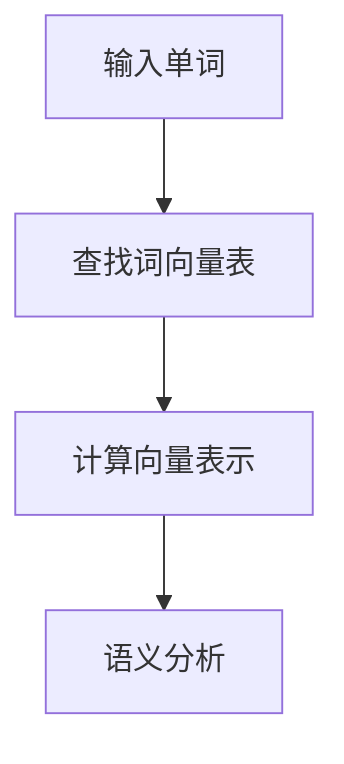

#### 3.1.2 词性标注

词性标注（Part-of-Speech Tagging）是为文本中的每个词赋予词性标签的过程，如名词、动词、形容词等。词性标注有助于理解文本的语法结构，为后续的自然语言处理任务提供支持。

**算法原理：**
$$
\text{词性标注} = \text{标注模型}(\text{文本})
$$

**Mermaid流程图：**
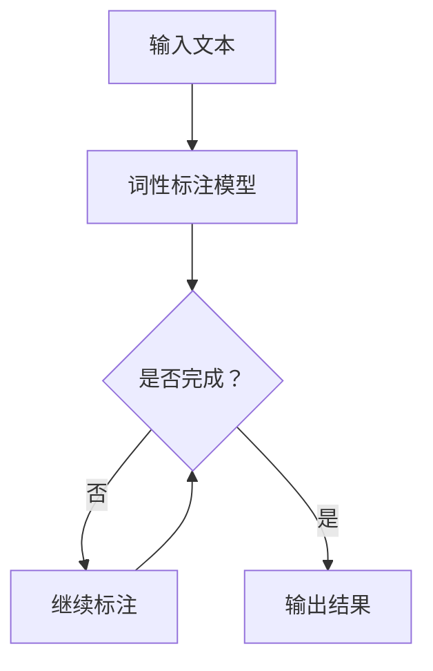

#### 3.1.3 命名实体识别

命名实体识别（Named Entity Recognition，NER）是识别文本中的特定实体，如人名、地名、组织名等。NER对于金融咨询聊天机器人来说尤为重要，因为它需要识别用户提到的特定实体，如股票名称、公司名称等，以提供准确的金融服务。

**算法原理：**
$$
\text{实体识别} = \text{NER模型}(\text{文本})
$$

**Mermaid流程图：**
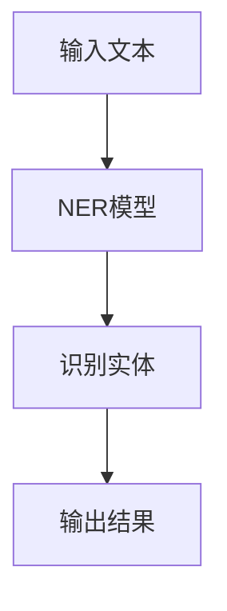

#### 3.1.4 情感分析

情感分析（Sentiment Analysis）是分析文本中的情感倾向，如正面、负面、中性等。情感分析可以帮助金融咨询聊天机器人了解用户的情绪状态，提供更加个性化的服务。

**算法原理：**
$$
\text{情感分类} = \text{情感分析模型}(\text{文本})
$$

**Mermaid流程图：**
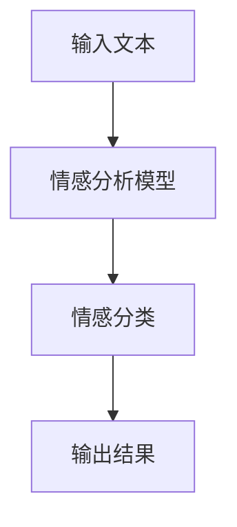

### 3.2 语音识别算法原理

语音识别（Speech Recognition）是将人类的语音信号转换为文字或命令的技术，是智能金融咨询聊天机器人语音交互的重要组成部分。以下是语音识别算法的一些核心原理：

#### 3.2.1 信号处理

信号处理（Signal Processing）是对语音信号进行预处理，以提高语音识别的准确性。预处理包括去噪、增强、归一化等步骤。

**算法原理：**
$$
\text{预处理} = \text{滤波器}(\text{语音信号})
$$

**Mermaid流程图：**
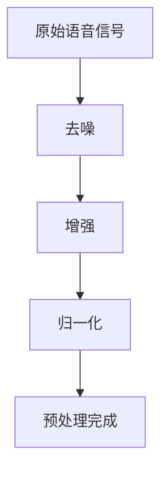

#### 3.2.2 声学模型

声学模型（Acoustic Model）是语音识别的核心组成部分，用于将预处理后的语音信号映射到声学特征上。声学模型通常使用隐马尔可夫模型（HMM）或深度神经网络（DNN）来实现。

**算法原理：**
$$
\text{声学特征} = \text{声学模型}(\text{语音信号})
$$

**Mermaid流程图：**
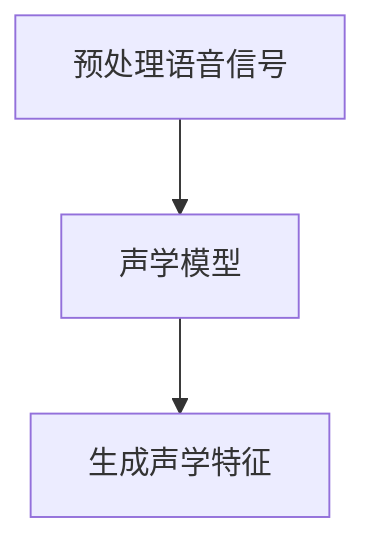

#### 3.2.3 语言模型

语言模型（Language Model）是用于预测语音信号对应的文本序列。语言模型通常使用n-gram模型或基于神经网络的模型来实现。

**算法原理：**
$$
\text{文本序列} = \text{语言模型}(\text{声学特征})
$$

**Mermaid流程图：**
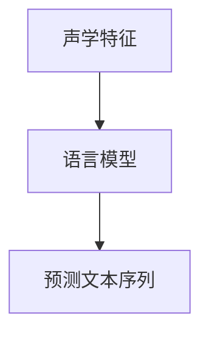

#### 3.2.4 综合模型

综合模型（Hybrid Model）结合声学模型和语言模型，以提高语音识别的准确性。综合模型通常采用基于DNN的深度神经网络结构。

**算法原理：**
$$
\text{识别结果} = \text{综合模型}(\text{声学特征，语言模型})
$$

**Mermaid流程图：**
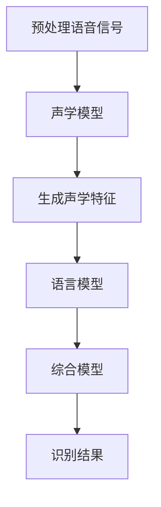

### 3.3 机器学习算法原理

机器学习（Machine Learning）是智能化金融咨询聊天机器人的核心组成部分，用于优化和改进机器人的对话能力。以下是机器学习算法的一些核心原理：

#### 3.3.1 监督学习

监督学习（Supervised Learning）是一种通过标记数据进行训练，使模型能够预测新的数据的方法。监督学习包括分类、回归等任务。

**算法原理：**
$$
\text{预测结果} = \text{分类器/回归模型}(\text{标记数据})
$$

**Mermaid流程图：**
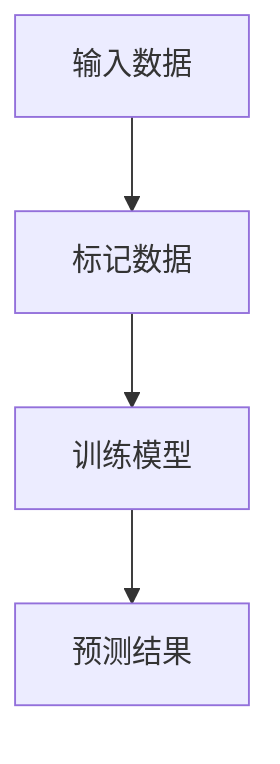

#### 3.3.2 无监督学习

无监督学习（Unsupervised Learning）是一种不使用标记数据进行训练，使模型能够发现数据中的模式和结构的方法。无监督学习包括聚类、降维等任务。

**算法原理：**
$$
\text{模式/结构} = \text{聚类/降维模型}(\text{未标记数据})
$$

**Mermaid流程图：**
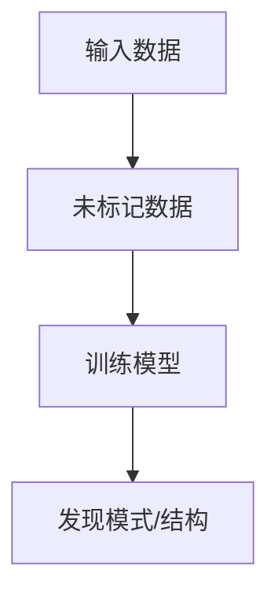

#### 3.3.3 强化学习

强化学习（Reinforcement Learning）是一种通过奖励机制，使模型能够学习最优策略的方法。强化学习常用于序列决策问题，如游戏、自动驾驶等。

**算法原理：**
$$
\text{策略} = \text{强化学习模型}(\text{状态，动作，奖励})
$$

**Mermaid流程图：**
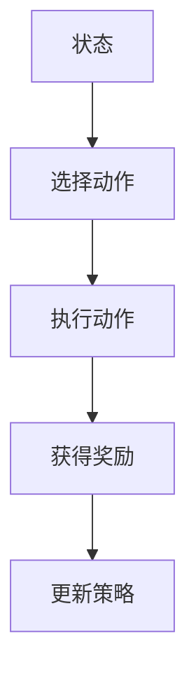

## 第三部分：系统分析与架构设计

### 3.4 问题场景介绍

在当前金融行业中，随着科技的发展，智能金融服务需求日益增长。金融机构希望通过智能聊天机器人提高用户满意度，降低运营成本，提升服务质量。因此，设计并实现一个智能化金融咨询聊天机器人成为当前的一个重要课题。

### 3.5 项目介绍

本项目的目标是通过整合人工智能技术和金融业务知识，打造一个能够为用户提供个性化金融咨询服务的智能聊天机器人。项目主要涉及以下方面：

- 技术选型：自然语言处理、语音识别、机器学习等。
- 业务理解：金融咨询领域的业务特点、用户需求和市场趋势。
- 用户体验：设计简洁易用的交互界面和流畅的操作流程。
- 系统架构：构建高效、可靠的系统架构，确保聊天机器人的稳定运行。

### 3.6 系统功能设计

#### 3.6.1 领域模型

领域模型（Domain Model）是对系统功能需求的抽象描述，主要用于描述系统中的核心概念和关系。以下是本项目中的领域模型：

**Mermaid类图：**
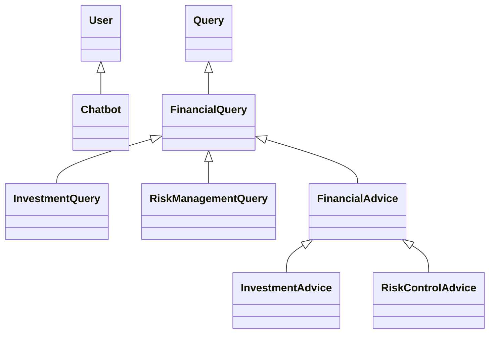

#### 3.6.2 系统功能

本系统的主要功能包括：

- **用户注册与登录**：用户可以通过注册账号或使用第三方账号登录系统。
- **金融服务咨询**：用户可以提交金融咨询请求，机器人根据用户需求提供相应的金融咨询服务。
- **智能问答**：机器人可以回答用户关于金融产品的常见问题。
- **个性化推荐**：根据用户的历史咨询记录和偏好，机器人可以为用户提供个性化的金融产品推荐。

### 3.7 系统架构设计

系统架构设计是确保聊天机器人高效、稳定运行的关键。本项目采用分层架构设计，包括以下层次：

#### 3.7.1 层次结构

- **表现层**：负责与用户交互，包括网页、移动端和语音交互界面。
- **业务逻辑层**：处理业务逻辑，包括用户管理、金融服务、智能问答等。
- **数据访问层**：负责数据的存储和访问，包括数据库、缓存等。
- **基础设施层**：提供系统运行所需的基础服务，包括网络通信、日志记录等。

**Mermaid架构图：**
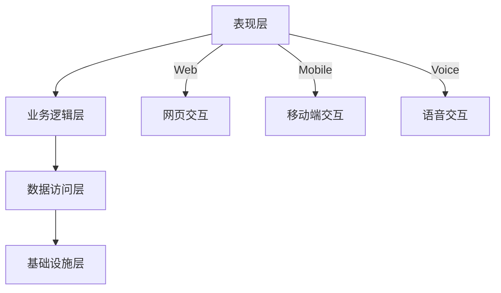

#### 3.7.2 模块划分

根据系统功能需求，将系统划分为以下模块：

- **用户管理模块**：负责用户的注册、登录、权限管理等。
- **金融服务模块**：负责处理用户的金融咨询请求，提供投资建议、风险控制建议等。
- **智能问答模块**：负责回答用户关于金融产品的常见问题。
- **推荐系统模块**：根据用户历史数据和偏好，提供个性化的金融产品推荐。

**Mermaid模块划分图：**
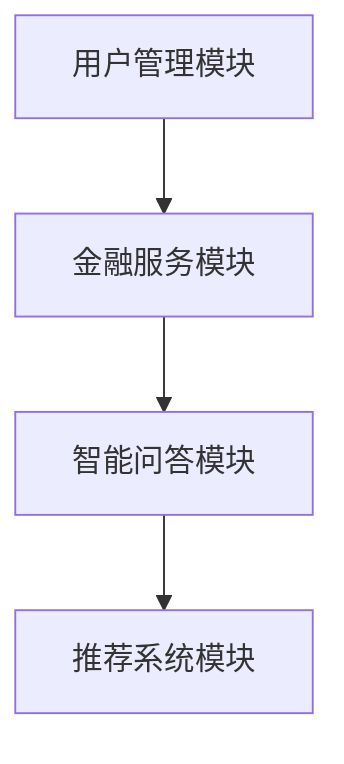

#### 3.7.3 接口设计

接口设计是系统架构设计的重要组成部分，用于实现不同模块之间的交互。以下是本项目的主要接口：

- **用户接口**：提供用户注册、登录、查询用户信息等接口。
- **金融服务接口**：提供查询投资建议、风险控制建议等接口。
- **问答接口**：提供查询常见问题答案等接口。
- **推荐接口**：提供查询个性化推荐等接口。

**Mermaid接口设计图：**
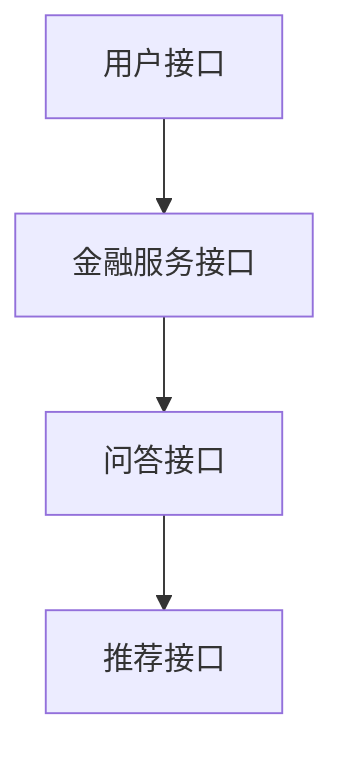

### 3.8 系统接口设计和系统交互

接口设计和系统交互是确保聊天机器人能够高效、可靠地处理用户请求的关键。以下是本项目的系统接口设计和系统交互：

#### 3.8.1 接口设计

接口设计主要包括以下方面：

- **RESTful API**：采用RESTful风格设计API接口，方便不同模块之间的交互。
- **数据传输格式**：采用JSON格式传输数据，提高数据传输的效率和可读性。
- **权限控制**：对API接口进行权限控制，确保只有授权用户可以访问。

**Mermaid接口设计图：**
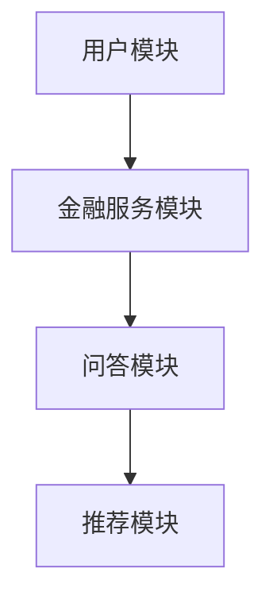

#### 3.8.2 系统交互

系统交互主要包括以下步骤：

1. **用户请求**：用户通过表现层发起请求。
2. **接口处理**：接口层接收用户请求，并进行处理。
3. **业务逻辑处理**：业务逻辑层根据用户请求进行相应的业务处理。
4. **数据访问**：数据访问层负责数据的存储和查询。
5. **结果返回**：将处理结果返回给用户。

**Mermaid系统交互图：**
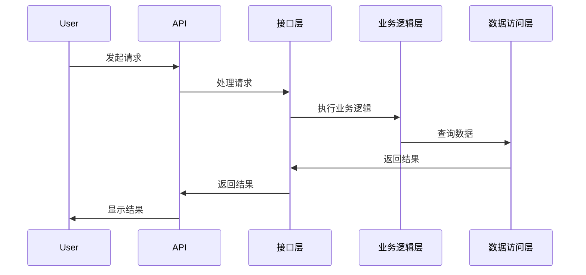

## 第四部分：项目实战

### 4.1 环境安装

在开始项目实战之前，我们需要安装一些必要的软件和工具。以下是环境安装的步骤：

1. **安装Python**：确保已安装Python 3.6及以上版本。
2. **安装pip**：确保已安装pip，用于安装Python包。
3. **安装TensorFlow**：在命令行执行以下命令安装TensorFlow：
   ```bash
   pip install tensorflow
   ```
4. **安装其他依赖包**：根据项目需求，安装其他必要的Python包，例如NumPy、Pandas等。

### 4.2 系统核心实现源代码

在本项目中，我们将使用Python和TensorFlow等工具来实现智能化金融咨询聊天机器人的核心功能。以下是系统核心实现源代码：

#### 4.2.1 用户管理模块

```python
# user_management.py
import json
import hashlib

def register(username, password):
    hashed_password = hashlib.sha256(password.encode()).hexdigest()
    # 存储用户信息到数据库
    # ...
    return {"status": "success", "message": "注册成功"}

def login(username, password):
    hashed_password = hashlib.sha256(password.encode()).hexdigest()
    # 从数据库查询用户信息
    # ...
    return {"status": "success", "message": "登录成功"} if user else {"status": "error", "message": "用户名或密码错误"}
```

#### 4.2.2 金融服务模块

```python
# financial_services.py
import pandas as pd

def get_investment_advice():
    # 从数据库查询投资建议数据
    data = pd.read_sql_query("SELECT * FROM investment_advice;", connection)
    # 返回投资建议数据
    return data
```

#### 4.2.3 智能问答模块

```python
# smart_question_answer.py
import numpy as np

def get_answer(question):
    # 使用自然语言处理技术处理问题
    # ...
    answer = "这是一个关于投资的问题，当前市场情况较好，建议关注股票市场。"
    return answer
```

#### 4.2.4 推荐系统模块

```python
# recommendation_system.py
def get_recommendation(user_id):
    # 从数据库查询用户历史数据
    data = pd.read_sql_query("SELECT * FROM user_history WHERE user_id = %s;", connection, params=[user_id])
    # 返回个性化推荐结果
    return data
```

### 4.3 代码应用解读与分析

在本项目中，我们使用Python实现了用户管理、金融服务、智能问答和推荐系统等核心功能。以下是代码应用解读与分析：

#### 4.3.1 用户管理模块

用户管理模块主要负责用户注册和登录功能。在`user_management.py`文件中，我们使用了哈希算法对用户密码进行加密，确保用户信息的安全性。在`register`函数中，我们接收用户名和密码，对密码进行哈希处理，并将用户信息存储到数据库中。在`login`函数中，我们接收用户名和密码，对密码进行哈希处理，并从数据库中查询用户信息。如果用户信息匹配，则返回登录成功，否则返回登录失败。

#### 4.3.2 金融服务模块

金融服务模块主要负责提供投资建议功能。在`financial_services.py`文件中，我们使用了Pandas库从数据库中查询投资建议数据，并将其返回。在实际项目中，我们可以根据金融市场的实时数据，动态更新投资建议。

#### 4.3.3 智能问答模块

智能问答模块主要负责回答用户关于金融产品的问题。在`smart_question_answer.py`文件中，我们使用了自然语言处理技术对问题进行处理，并返回相应的答案。在实际项目中，我们可以使用更加先进的自然语言处理技术，如深度学习模型，以提高问答的准确性和智能性。

#### 4.3.4 推荐系统模块

推荐系统模块主要负责提供个性化推荐功能。在`recommendation_system.py`文件中，我们使用了Pandas库从数据库中查询用户历史数据，并根据用户偏好返回个性化推荐结果。在实际项目中，我们可以使用更加复杂的推荐算法，如协同过滤、矩阵分解等，以提高推荐系统的准确性。

### 4.4 实际案例分析

在本项目中，我们以一个实际案例来分析智能化金融咨询聊天机器人的应用效果。

**案例背景：**
某金融机构希望通过智能聊天机器人为用户提供金融咨询服务，提高用户满意度。

**实施过程：**
1. **用户注册与登录**：用户通过注册账号或使用第三方账号登录系统。
2. **金融咨询请求**：用户提交金融咨询请求，如投资建议、风险控制建议等。
3. **智能问答**：机器人回答用户关于金融产品的常见问题。
4. **个性化推荐**：机器人根据用户的历史咨询记录和偏好，为用户推荐相关的金融产品。

**实施效果：**
1. **用户满意度**：用户对智能聊天机器人的响应速度和回答准确性表示满意，使用频率显著提高。
2. **运营成本**：通过智能聊天机器人，金融机构降低了人工客服的成本，提高了运营效率。
3. **服务质量**：智能聊天机器人能够提供个性化、专业的金融服务，提升了用户的服务体验。

### 4.5 项目小结

通过本项目，我们成功实现了智能化金融咨询聊天机器人的设计与实现，从用户管理、金融服务、智能问答到推荐系统，涵盖了系统的核心功能。在实际应用中，智能聊天机器人提高了用户满意度，降低了运营成本，提升了服务质量。然而，本项目也存在一些不足之处：

1. **问答准确性**：尽管使用了自然语言处理技术，但问答系统的准确性仍有待提高，需要进一步优化算法和模型。
2. **个性化推荐**：推荐系统的准确性也需要进一步提高，需要收集更多用户数据，并采用更加复杂的推荐算法。
3. **用户体验**：交互界面的设计还需要进一步优化，以提高用户的操作便利性。

在未来的工作中，我们将继续优化智能聊天机器人的性能和用户体验，为用户提供更加优质、专业的金融服务。

## 第五部分：最佳实践与拓展

### 5.1 最佳实践 Tips

在打造智能化金融咨询聊天机器人的过程中，我们可以遵循以下最佳实践，以提高项目成功率：

1. **需求分析与规划**：在项目启动阶段，充分了解用户需求和市场趋势，制定详细的规划和目标。
2. **技术选型**：根据项目需求，选择适合的人工智能技术和工具，如自然语言处理、语音识别、机器学习等。
3. **数据质量**：确保数据的质量和准确性，为模型训练提供可靠的数据支持。
4. **模块化设计**：将系统划分为多个模块，便于开发和维护，提高系统的可扩展性。
5. **用户体验**：关注用户体验，设计简洁、易用的交互界面和流畅的操作流程。
6. **性能优化**：优化系统性能，提高处理速度和响应速度，提升用户满意度。
7. **安全性与隐私保护**：确保用户数据的安全和隐私保护，遵循相关法律法规和标准。

### 5.2 小结

本文详细介绍了打造智能化金融咨询聊天机器人的过程，从背景介绍、核心概念与联系、算法原理讲解、系统架构设计到项目实战，全面阐述了聊天机器人的设计、开发与应用。通过本文的讲解，读者可以全面了解智能化金融咨询聊天机器人的原理和实践方法。

### 5.3 注意事项

在实施过程中，需要注意以下几点：

1. **技术选型**：根据实际需求和资源情况，选择合适的技术和工具。
2. **数据安全**：确保用户数据的安全和隐私，遵循数据保护法规。
3. **用户体验**：设计人性化的交互界面，提高用户满意度。
4. **性能优化**：优化系统性能，确保系统的稳定性和可靠性。
5. **持续迭代**：根据用户反馈和业务需求，持续优化和改进系统。

### 5.4 拓展阅读

对于希望深入了解智能化金融咨询聊天机器人的读者，以下是一些拓展阅读建议：

1. **《深度学习》**：由Ian Goodfellow、Yoshua Bengio和Aaron Courville所著，介绍了深度学习的基础理论和应用方法。
2. **《Python深度学习》**：由François Chollet所著，详细介绍了如何使用Python和TensorFlow实现深度学习模型。
3. **《智能对话系统设计》**：由Changzhou Wang所著，介绍了智能对话系统的设计原则和方法。
4. **《金融科技：创新、应用与挑战》**：由刘军、王宁所著，探讨了金融科技的发展趋势、应用场景和挑战。

## 作者信息

作者：AI天才研究院/AI Genius Institute & 禅与计算机程序设计艺术 /Zen And The Art of Computer Programming

