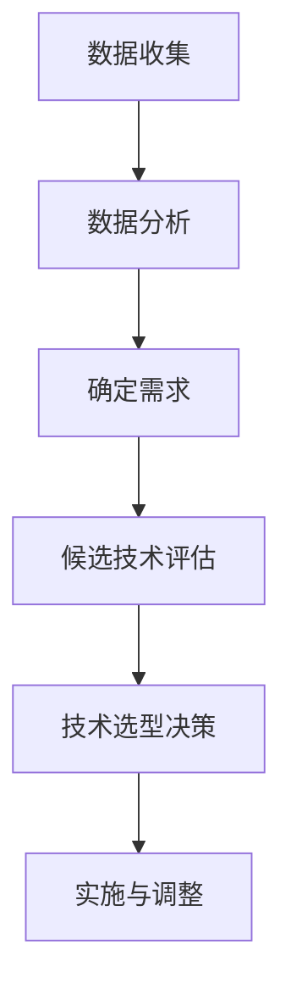
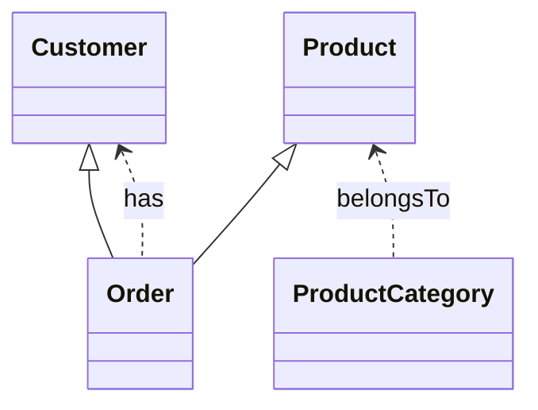
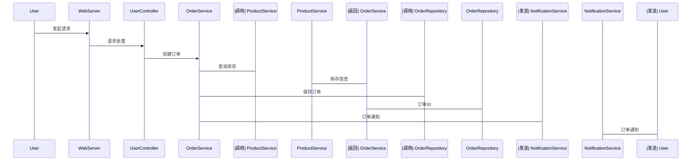

                 

### 引言：技术栈的重要性与选择挑战

在信息技术飞速发展的今天，技术栈（Technology Stack）的选择已经成为软件开发项目中至关重要的一环。技术栈，顾名思义，是开发者为了实现特定功能而选择的一套技术工具和平台的组合。它通常包括前端技术、后端技术、数据库技术以及各种中间件和服务。技术栈的选择不仅影响着项目的开发进度和性能，更关系到项目的长期维护和扩展。

#### 1.1.1 技术栈的定义与构成

技术栈的定义相对宽泛，它涵盖了从开发语言、框架、库到开发工具、测试工具、部署平台等一系列技术元素。具体来说，技术栈可以分为以下几个部分：

1. **前端技术栈**：主要包括HTML、CSS和JavaScript，以及各种前端框架如React、Vue和Angular等。
2. **后端技术栈**：包括服务器端编程语言（如Java、Python、Node.js）和后端框架（如Spring、Django和Express）。
3. **数据库技术栈**：包含关系型数据库（如MySQL、PostgreSQL）和非关系型数据库（如MongoDB、Redis）。
4. **中间件与服务平台**：例如消息队列（如RabbitMQ、Kafka）、缓存（如Redis）、容器化技术（如Docker、Kubernetes）等。

#### 1.1.2 技术栈在软件开发中的核心地位

技术栈在软件开发中的核心地位不可小觑。它不仅影响着开发效率和代码质量，还对项目的可维护性、可扩展性和性能有着深远的影响。具体来说，技术栈的选择决定了以下几点：

1. **开发效率**：合适的技术栈能够加速开发过程，降低开发难度，提高代码的可读性和可维护性。
2. **性能优化**：技术栈的选择直接关系到系统的性能表现，例如数据库的选择会影响数据查询的效率，缓存技术能显著提高响应速度。
3. **可扩展性**：技术栈的模块化和标准化设计有助于系统的扩展，使开发者能够灵活地添加新功能或应对业务变化。
4. **生态支持**：技术栈的流行程度和社区活跃度决定了开发者能否获得充分的文档支持、社区帮助和第三方库支持。

#### 1.1.3 技术栈选择的挑战与困扰

然而，技术栈的选择并非易事，开发者常常面临以下挑战和困扰：

1. **复杂性**：技术栈的选择涉及众多技术和工具，每个技术都有其特点和适用场景，使得决策过程变得复杂。
2. **流行趋势**：技术的更新迭代速度非常快，开发者需要不断跟进最新趋势，以保持技术栈的先进性。
3. **团队技能**：技术栈的选择还需考虑团队的技术能力和经验，不合适的技术栈可能导致项目进度延误。
4. **成本考量**：开发成本和维护成本也是选择技术栈的重要考虑因素，过高或过低的技术栈成本都可能带来负面影响。

#### 1.2 问题的解决：技术栈选择与评估的重要性

为了解决上述挑战，我们需要对技术栈选择进行系统性的评估和分析。以下是几个关键因素：

1. **需求分析**：首先，明确项目的需求，包括功能需求、性能需求、安全需求等。
2. **技术评估**：根据需求分析，对各个技术栈进行评估，包括其性能、稳定性、社区支持、学习成本等。
3. **团队协作**：充分考虑团队的技术能力和协作模式，选择与之相匹配的技术栈。
4. **成本效益**：综合考虑开发成本和维护成本，确保技术栈的经济效益。

#### 1.2.1 技术栈选择的影响因素

技术栈选择的影响因素可以分为以下几个方面：

1. **项目需求**：项目的功能需求、性能需求和安全性需求直接决定了技术栈的选择。
2. **团队技能**：团队的技术栈熟练程度和协作效率是选择技术栈的关键考虑因素。
3. **技术成熟度**：技术的成熟度越高，通常意味着其稳定性、性能和社区支持越好。
4. **成本考量**：技术栈的初始开发成本和长期维护成本也是重要的影响因素。

#### 1.2.2 技术栈评估的关键指标

在进行技术栈评估时，以下指标是关键：

1. **性能**：技术栈的性能直接影响系统的响应速度和处理能力。
2. **稳定性**：系统的稳定性和可靠性对于生产环境至关重要。
3. **社区支持**：活跃的社区能够提供丰富的文档、库和工具支持。
4. **学习成本**：技术栈的学习成本决定了团队掌握技术的速度。
5. **生态兼容性**：技术栈的生态兼容性越高，与其他系统和工具的集成越容易。

#### 1.2.3 技术栈选择的最佳实践

为了实现技术栈选择的最佳效果，我们可以遵循以下最佳实践：

1. **需求先行**：在开始技术选型前，充分了解和明确项目需求。
2. **多方调研**：通过查阅文档、社区讨论和技术论坛等方式，对候选技术栈进行全面调研。
3. **试点项目**：在正式项目之前，可以开展试点项目，验证技术栈的可行性。
4. **持续优化**：技术栈不是一成不变的，应随着项目的进展和技术的更新不断优化。

#### 1.3 边界与外延：技术栈选择的实际应用场景

技术栈选择的应用场景多种多样，以下是一些典型的实际应用场景：

1. **企业级应用**：在大型企业中，技术栈的选择通常更加谨慎和复杂，需要考虑系统的稳定性、可扩展性和安全性。
2. **创业公司**：创业公司在资源有限的情况下，更倾向于选择流行且易于快速上手的轻量级技术栈。
3. **开源项目**：开源项目通常由社区共同维护，技术栈的选择更多地取决于社区的共识和项目需求。

#### 1.3.1 企业级应用的技术栈选择

企业级应用对技术栈的选择有较高的要求，主要考虑以下因素：

1. **稳定性**：企业级应用需要确保系统的稳定性和可靠性，避免出现重大故障。
2. **可扩展性**：随着业务的发展，系统需要能够灵活扩展，支持大规模并发处理。
3. **安全性**：企业数据的安全性和隐私保护是企业级应用的核心要求。
4. **生态兼容性**：企业级应用需要与其他系统和服务进行集成，生态兼容性至关重要。

#### 1.3.2 创业公司技术栈的选择策略

创业公司在资源有限的情况下，技术栈的选择更加灵活和实际：

1. **快速迭代**：选择能够快速开发和迭代的技术栈，以适应快速变化的业务需求。
2. **成本控制**：选择成本较低的技术栈，以减少资金压力。
3. **社区支持**：选择社区支持好的技术栈，以获取更多的开发资源和帮助。

#### 1.3.3 开源项目中的技术栈决策

开源项目的技术栈决策通常由社区共同决定，主要考虑以下因素：

1. **社区共识**：技术栈的选择需要得到社区的广泛认可和支持。
2. **可维护性**：技术栈应易于维护和扩展，确保项目的长期健康发展。
3. **性能和稳定性**：开源项目需要保证技术栈的性能和稳定性，以满足用户需求。

### 1.4 本章小结

本章介绍了技术栈的定义、构成和重要性，以及技术栈选择的挑战和解决策略。通过明确项目需求、进行技术评估、考虑团队技能和成本考量，我们可以做出更明智的技术栈选择。企业级应用、创业公司和开源项目在技术栈选择上各有不同的策略和考量。了解这些实际应用场景，有助于我们更好地应对技术栈选择的挑战。

### 核心概念与联系

在深入了解技术栈选择之前，我们需要先明确几个核心概念，并理解它们之间的联系。本章节将详细介绍前端技术栈、后端技术栈和数据库技术栈的核心概念，以及它们之间的关系。

#### 2.1.1 前端技术栈

前端技术栈是开发Web应用的重要组成部分，负责用户界面和交互。以下是前端技术栈的一些核心概念：

1. **HTML（超文本标记语言）**：HTML是构建网页结构的基础，通过标签定义网页的内容和布局。
2. **CSS（层叠样式表）**：CSS用于美化网页，通过定义样式规则来控制网页的字体、颜色、布局等视觉效果。
3. **JavaScript**：JavaScript是一种客户端脚本语言，用于实现网页的动态效果和与用户的交互。

在前端技术栈中，常见的框架有：

1. **React**：React是一个用于构建用户界面的JavaScript库，具有声明式的设计和高效的渲染性能。
2. **Vue**：Vue是一个渐进式的前端框架，易于上手，支持组件化开发。
3. **Angular**：Angular是Google推出的全功能框架，提供了丰富的功能，如数据绑定、依赖注入等。

#### 2.1.2 后端技术栈

后端技术栈负责处理数据存储、业务逻辑和外部接口。以下是后端技术栈的一些核心概念：

1. **服务器端编程语言**：后端开发常用的编程语言包括Java、Python和Node.js等，它们提供了不同的编程模型和生态。
2. **后端框架**：后端框架如Spring（Java）、Django（Python）和Express（Node.js）等，为开发者提供了便捷的开发模式和丰富的功能支持。

在后端技术栈中，常见的框架包括：

1. **Spring**：Spring是一个企业级Java开发框架，提供了全面的编程和配置支持。
2. **Django**：Django是一个高生产力的Python Web框架，强调“快速开发和不用思考”。
3. **Express**：Express是一个轻量级的Node.js Web应用框架，易于扩展，支持中间件和路由等功能。

#### 2.1.3 数据库技术栈

数据库技术栈用于数据存储和管理，包括关系型数据库和非关系型数据库。以下是数据库技术栈的一些核心概念：

1. **关系型数据库**：关系型数据库如MySQL和PostgreSQL，通过表和关系来组织数据，支持复杂查询和事务处理。
2. **非关系型数据库**：非关系型数据库如MongoDB和Redis，提供灵活的数据模型和高效的数据存储能力。

在数据库技术栈中，常见的数据库包括：

1. **MySQL**：MySQL是一个开源的关系型数据库，广泛用于企业级应用。
2. **PostgreSQL**：PostgreSQL是一个开源的关系型数据库，支持丰富的数据类型和高级功能。
3. **MongoDB**：MongoDB是一个开源的文档型数据库，提供灵活的数据模型和高扩展性。
4. **Redis**：Redis是一个开源的内存数据库，适用于缓存和实时数据处理。

#### 2.2 技术栈概念的联系与对比

技术栈中的各个组件之间存在紧密的联系和互动，以下是几个关键点：

1. **前端与后端**：前端和后端通过API进行交互，前端通过HTTP请求获取后端数据，后端通过前端框架渲染页面。
2. **数据库与后端**：后端通过数据库进行数据存储和管理，使用ORM（对象关系映射）库简化数据库操作。
3. **中间件**：中间件如消息队列和缓存，提供系统间的通信和数据存储，增强系统的性能和可扩展性。

在技术栈选择中，需要权衡各个组件的性能、稳定性、社区支持和兼容性。以下是一个简单的对比表格，展示了前端、后端和数据库技术栈的对比：

| 技术栈 | 优点 | 缺点 | 适用场景 |
| :----: | :--- | :--- | :-----: |
| 前端 | 灵活性高，易于迭代 | 学习成本高，性能依赖网络 | Web应用、移动端应用 |
| 后端 | 性能稳定，功能丰富 | 开发难度大，部署复杂 | 服务端应用、企业级应用 |
| 数据库 | 数据管理能力强，支持复杂查询 | 性能受限，维护成本高 | 数据存储、事务处理 |

#### 2.2.1 技术栈中各组件的关联性

技术栈中的各个组件并非独立存在，而是相互关联，共同构成一个完整的系统。以下是一个简单的ER实体关系图，展示了前端、后端和数据库之间的关系：

```mermaid
erDiagram
  Frontend ||--|{ Backend } Backend
  Backend ||--|{ Database } Database
```

在这个ER图中，前端通过API与后端进行数据交互，后端通过数据库进行数据存储和管理。这种关联性确保了系统的整体性能和稳定性。

#### 2.2.2 技术栈选择中的权衡与优先级

在技术栈选择过程中，需要根据项目的具体需求进行权衡和优先级排序。以下是一些常见的权衡因素：

1. **开发效率**：选择易于上手和快速开发的技术栈，以降低开发成本。
2. **性能需求**：对于高性能要求的应用，选择性能优异的技术栈。
3. **可维护性**：选择社区支持好、文档完整的开源技术栈，便于维护和升级。
4. **成本考量**：根据项目预算，选择成本合理的解决方案。

在实际项目中，需要根据这些因素进行综合评估，选择最适合的技术栈。

#### 2.2.3 技术栈之间的兼容性与互操作性

技术栈的兼容性和互操作性是选择技术栈时的重要考量因素。以下是一些提高兼容性和互操作性的方法：

1. **标准化接口**：通过定义标准化的API接口，实现前后端和系统间的数据交换。
2. **中间件**：使用中间件如消息队列和缓存，提高系统间的通信效率和稳定性。
3. **微服务架构**：采用微服务架构，将系统拆分成多个独立的服务，提高系统的可扩展性和兼容性。

通过上述方法，可以有效地提高技术栈的兼容性和互操作性，构建一个高效、稳定的系统。

### 2.3 ER实体关系图架构

为了更好地理解技术栈中各组件的关联性，以下是一个简单的ER实体关系图，展示了前端、后端和数据库之间的关系：

```mermaid
erDiagram
  Frontend ||--|{ Backend } Backend
  Backend ||--|{ Database } Database
```

在这个ER图中，前端通过API与后端进行数据交互，后端通过数据库进行数据存储和管理。这种紧密的关联性确保了系统的整体性能和稳定性。

通过本章的介绍，我们对前端、后端和数据库技术栈有了更深入的理解，并了解了它们之间的联系和交互。在实际选择技术栈时，需要综合考虑各种因素，选择最适合的技术栈，以实现项目的成功。

### 算法原理讲解

在技术栈选择中，算法的应用能够帮助我们系统化地分析和评估各种技术栈的优劣。算法不仅在技术评估中起到关键作用，还可以优化选择过程，提高决策效率。以下将详细讲解技术栈选择中的算法原理，包括算法类型、流程和具体实现。

#### 3.1.1 算法在技术栈选择中的应用

在技术栈选择中，算法主要用于以下几个方面：

1. **需求匹配**：通过算法将项目需求与候选技术栈进行匹配，筛选出符合需求的最佳技术栈。
2. **性能评估**：使用算法对候选技术栈的性能进行评估，以确定其适合应用的场景。
3. **成本效益分析**：通过算法计算技术栈的总体成本和效益，为决策提供量化依据。
4. **优化与调整**：根据实际应用效果，算法可以不断调整技术栈配置，以实现最优性能。

#### 3.1.2 常见的算法类型

在技术栈选择中，常见的算法类型包括以下几种：

1. **数据分析算法**：用于处理和解析项目需求，识别关键指标和约束条件。
2. **机器学习算法**：通过学习历史数据，预测技术栈的性能和适用性。
3. **优化算法**：用于在多个候选方案中寻找最优解，如线性规划、遗传算法等。

以下将详细探讨这些算法类型。

##### 3.1.2.1 数据分析算法

数据分析算法在技术栈选择中用于处理项目需求和性能指标。常见的算法包括：

1. **回归分析**：用于预测技术栈性能与项目需求之间的关系。
2. **聚类分析**：用于对技术栈进行分类，便于比较和分析。
3. **决策树**：用于构建决策模型，指导技术栈的选择过程。

##### 3.1.2.2 机器学习算法

机器学习算法在技术栈选择中具有重要作用，能够通过学习历史数据，预测技术栈的适用性。常见的机器学习算法包括：

1. **线性回归**：用于预测技术栈性能。
2. **逻辑回归**：用于预测技术栈的适用性。
3. **决策树**：用于构建分类模型，指导技术栈选择。
4. **神经网络**：用于复杂模型的学习和预测。

##### 3.1.2.3 优化算法

优化算法用于在多个候选技术栈中寻找最优解，常见的优化算法包括：

1. **贪心算法**：通过每次选择当前最优解，逐步逼近全局最优解。
2. **动态规划**：通过保存子问题的解，避免重复计算，提高效率。
3. **遗传算法**：模拟生物进化过程，通过种群迭代优化，寻找最优解。
4. **线性规划**：在满足线性约束条件下，寻找最大化或最小化目标函数的解。

#### 3.1.3 技术栈选择的算法流程图

为了更好地理解技术栈选择的算法过程，以下是一个简单的算法流程图：



在这个流程图中，首先进行数据收集和分析，确定项目需求。然后对候选技术栈进行评估，根据评估结果进行技术选型决策。最后，根据实施效果进行持续调整。

#### 3.1.4 Python源代码实现

以下是一个简化的Python代码示例，用于实现技术栈选择评估算法：

```python
# Python代码示例：技术栈选择评估算法

def assess_technical_stack(requirments, candidates):
    # 初始化评估结果
    scores = {}
    
    # 对每个候选技术栈进行评估
    for candidate in candidates:
        score = 0
        
        # 根据需求匹配计算分数
        for req in requirments:
            if req in candidate:
                score += candidate[req]
        
        # 计算总分数
        scores[candidate] = score
        
    # 返回评估结果
    return scores

# 示例：需求和技术栈
requirments = {
    '性能': 3,
    '稳定性': 2,
    '成本': 1
}

candidates = [
    {'性能': 8, '稳定性': 7, '成本': 5},
    {'性能': 6, '稳定性': 9, '成本': 3},
    {'性能': 4, '稳定性': 6, '成本': 4}
]

# 执行评估
result = assess_technical_stack(requirments, candidates)

# 打印评估结果
for candidate, score in result.items():
    print(f"{candidate}: {score}")
```

#### 3.1.5 算法原理详细讲解

技术栈选择的算法原理主要涉及以下几个方面：

1. **数学模型**：用于描述技术栈性能与项目需求之间的关系。
2. **公式**：用于计算技术栈的得分和评估结果。
3. **举例说明**：通过具体案例，展示算法的应用和效果。

##### 3.4.1 算法原理的数学模型

技术栈选择的算法通常基于成本效益分析模型，其核心数学模型可以表示为：

$$
\text{Score} = f(\text{功能性}, \text{稳定性}, \text{安全性})
$$

其中，功能性、稳定性和安全性是影响技术栈选择的关键因素。为了简化计算，我们可以使用以下线性加权模型：

$$
f(x) = w_1 \cdot x_1 + w_2 \cdot x_2 + w_3 \cdot x_3
$$

其中，$w_1, w_2, w_3$ 分别是功能性、稳定性和安全性的权重，$x_1, x_2, x_3$ 是技术栈在这些因素上的得分。

##### 3.4.2 算法公式说明

在技术栈选择的算法中，常见的公式包括以下几个方面：

1. **得分计算公式**：

$$
\text{Score} = w_1 \cdot \text{功能性得分} + w_2 \cdot \text{稳定性得分} + w_3 \cdot \text{安全性得分}
$$

2. **权重计算公式**：

$$
w_1 + w_2 + w_3 = 1
$$

其中，$w_1, w_2, w_3$ 是功能性、稳定性和安全性的权重。

3. **评分分配公式**：

$$
x_i = \frac{\sum_{j=1}^{n} w_j \cdot s_{ij}}{\sum_{j=1}^{n} w_j}
$$

其中，$s_{ij}$ 是技术栈在因素 $i$ 上的评分，$n$ 是因素的总数。

##### 3.4.3 举例说明

假设有三个技术栈 A、B 和 C，分别在功能性、稳定性和安全性上有不同的得分。我们需要计算每个技术栈的总得分，并选择得分最高的技术栈。

假设权重如下：

- 功能性权重：$w_1 = 0.5$
- 稳定性权重：$w_2 = 0.3$
- 安全性权重：$w_3 = 0.2$

技术栈得分如下表所示：

| 技术栈 | 功能性得分 | 稳定性得分 | 安全性得分 |
| :----: | :--------: | :--------: | :--------: |
|   A   |     8      |     7      |     6      |
|   B   |     6      |     9      |     8      |
|   C   |     4      |     6      |     7      |

根据权重和得分计算总得分：

- 技术栈 A：

$$
\text{Score}_A = 0.5 \cdot 8 + 0.3 \cdot 7 + 0.2 \cdot 6 = 4 + 2.1 + 1.2 = 7.3
$$

- 技术栈 B：

$$
\text{Score}_B = 0.5 \cdot 6 + 0.3 \cdot 9 + 0.2 \cdot 8 = 3 + 2.7 + 1.6 = 7.3
$$

- 技术栈 C：

$$
\text{Score}_C = 0.5 \cdot 4 + 0.3 \cdot 6 + 0.2 \cdot 7 = 2 + 1.8 + 1.4 = 5.2
$$

根据计算结果，技术栈 A 和 B 的得分最高，均为 7.3。在这种情况下，我们可以选择技术栈 A 或 B 作为最佳方案。

通过这个例子，我们可以看到如何使用算法原理和公式对技术栈进行评估和选择。实际应用中，可以根据具体需求和权重进行调整，以适应不同的项目场景。

### 数学模型和数学公式

在技术栈选择过程中，数学模型和数学公式是不可或缺的工具。它们帮助我们从量化角度评估各个技术栈的优劣，为决策提供坚实的理论基础。以下将详细讨论技术栈选择的数学模型和数学公式，包括成本效益分析模型、费用效益比模型以及具体的计算方法和步骤。

#### 4.1 成本效益分析模型

成本效益分析模型是评估技术栈选择优劣的重要工具，它通过对技术栈的总体成本和预期效益进行量化分析，帮助我们做出明智的决策。成本效益分析模型的基本公式如下：

$$
\text{Cost-Benefit Analysis} = \text{Total Cost} - \text{Total Benefits}
$$

其中，$\text{Total Cost}$ 表示技术栈的总成本，包括开发成本、维护成本和升级成本等；$\text{Total Benefits}$ 表示技术栈带来的总体效益，包括性能提升、安全性提高、开发效率提升等。

为了更好地应用成本效益分析模型，我们可以将其分解为以下几个部分：

1. **开发成本（C_{开发}）**：包括人员成本、硬件成本、软件成本等。
2. **维护成本（C_{维护}）**：包括日常运维成本、故障修复成本、升级成本等。
3. **升级成本（C_{升级}）**：包括技术栈更新换代所需的成本。

综合这些因素，我们可以得到以下成本效益分析模型：

$$
C = C_{开发} + C_{维护} + C_{升级}
$$

#### 4.2 费用效益比模型

在成本效益分析的基础上，我们可以进一步引入费用效益比（Cost-Benefit Ratio，C/B）模型。费用效益比模型通过计算技术栈的成本和效益之间的比值，帮助我们更直观地评估技术栈的经济效益。费用效益比模型的基本公式如下：

$$
\text{C/B Ratio} = \frac{\text{Total Benefits}}{\text{Total Cost}}
$$

费用效益比越高，意味着技术栈带来的效益越高，经济效益越好。在实际应用中，我们可以通过比较不同技术栈的费用效益比，选择经济效益最高的技术栈。

#### 4.3 成本效益分析模型计算步骤

为了更好地应用成本效益分析模型，我们可以将其分解为以下几个步骤：

1. **收集数据**：收集与各个技术栈相关的数据，包括开发成本、维护成本、升级成本等。
2. **计算总成本**：根据收集到的数据，计算每个技术栈的总成本。
3. **评估效益**：评估每个技术栈带来的总体效益，包括性能提升、安全性提高、开发效率提升等。
4. **计算费用效益比**：根据总成本和总体效益，计算每个技术栈的费用效益比。
5. **比较和选择**：比较不同技术栈的费用效益比，选择经济效益最高的技术栈。

以下是成本效益分析模型的具体计算步骤：

1. **计算开发成本**：

   $$ 
   C_{开发} = \sum_{i=1}^{n} \text{Cost}_{开发i}
   $$

   其中，$n$ 表示参与评估的技术栈数量；$\text{Cost}_{开发i}$ 表示第 $i$ 个技术栈的开发成本。

2. **计算维护成本**：

   $$ 
   C_{维护} = \sum_{i=1}^{n} \text{Cost}_{维护i}
   $$

   其中，$\text{Cost}_{维护i}$ 表示第 $i$ 个技术栈的维护成本。

3. **计算升级成本**：

   $$ 
   C_{升级} = \sum_{i=1}^{n} \text{Cost}_{升级i}
   $$

   其中，$\text{Cost}_{升级i}$ 表示第 $i$ 个技术栈的升级成本。

4. **计算总成本**：

   $$ 
   C = C_{开发} + C_{维护} + C_{升级}
   $$

5. **评估效益**：

   $$ 
   \text{Total Benefits} = \sum_{i=1}^{n} \text{Benefits}_{i}
   $$

   其中，$\text{Benefits}_{i}$ 表示第 $i$ 个技术栈带来的总体效益。

6. **计算费用效益比**：

   $$ 
   \text{C/B Ratio} = \frac{\text{Total Benefits}}{C}
   $$

7. **比较和选择**：根据费用效益比，选择经济效益最高的技术栈。

#### 4.4 举例说明

为了更好地理解成本效益分析模型和费用效益比模型，我们可以通过一个具体例子进行说明。

假设有三个技术栈 A、B 和 C，它们的开发成本、维护成本、升级成本和总体效益如下表所示：

| 技术栈 | 开发成本（万元） | 维护成本（万元） | 升级成本（万元） | 总体效益（万元） |
| :----: | :-------------: | :-------------: | :-------------: | :-------------: |
|   A   |       100       |       50        |       20        |       150      |
|   B   |       120       |       60        |       30        |       160      |
|   C   |       90        |       45        |       15        |       140      |

根据上述数据，我们可以计算每个技术栈的总成本和费用效益比：

1. **计算总成本**：

   - 技术栈 A：

   $$ 
   C_A = 100 + 50 + 20 = 170 \text{万元}
   $$

   - 技术栈 B：

   $$ 
   C_B = 120 + 60 + 30 = 210 \text{万元}
   $$

   - 技术栈 C：

   $$ 
   C_C = 90 + 45 + 15 = 150 \text{万元}
   $$

2. **计算费用效益比**：

   - 技术栈 A：

   $$ 
   \text{C/B Ratio}_A = \frac{150}{170} \approx 0.88
   $$

   - 技术栈 B：

   $$ 
   \text{C/B Ratio}_B = \frac{160}{210} \approx 0.76
   $$

   - 技术栈 C：

   $$ 
   \text{C/B Ratio}_C = \frac{140}{150} \approx 0.93
   $$

根据费用效益比，我们可以得出以下结论：

- 技术栈 A 的费用效益比为 0.88，相对较低。
- 技术栈 B 的费用效益比为 0.76，最低。
- 技术栈 C 的费用效益比为 0.93，最高。

因此，在这三个技术栈中，技术栈 C 的经济效益最好，是最佳选择。

通过这个例子，我们可以看到如何应用成本效益分析模型和费用效益比模型，对技术栈进行评估和选择。在实际项目中，可以根据具体需求和数据，调整模型参数和计算方法，以实现更精确的评估和决策。

### 系统分析与架构设计方案

#### 5.1 问题场景介绍

在当前的信息化时代，企业级应用系统面临着日益复杂的业务需求和技术挑战。为了满足不断变化的市场需求和保持竞争优势，企业级应用系统需要具备高稳定性、高性能和可扩展性。本文将基于一个企业级电商平台项目，详细分析其系统架构设计，并给出具体的实现方案。

#### 5.2 项目介绍

该电商平台项目旨在搭建一个集成了在线购物、订单管理、支付、库存管理等功能的一体化平台。项目需求包括：

1. **高并发处理能力**：能够同时处理大量用户访问，保证系统在高负载下的稳定性。
2. **数据安全性**：确保用户数据和交易数据的安全性和隐私保护。
3. **高性能**：优化系统性能，提高页面加载速度和响应时间。
4. **易扩展性**：支持业务模块的快速开发和系统功能的扩展。

#### 5.3 系统功能设计（领域模型）

领域模型是系统功能设计的重要部分，它描述了系统的核心业务领域和实体之间的关系。以下是一个简化的领域模型类图，展示了该电商平台的主要实体和它们之间的关系：



在这个类图中：

- **Customer（客户）**：代表电商平台的用户，包括个人信息和购物记录。
- **Order（订单）**：代表客户的购物订单，包括订单详情、订单状态等。
- **Product（产品）**：代表电商平台上的商品，包括商品名称、价格、库存等。
- **ProductCategory（产品类别）**：代表商品的分类，用于组织和管理商品。

#### 5.4 系统架构设计

系统架构设计是确保系统功能实现和性能优化的重要环节。以下是一个简化的系统架构图，展示了该电商平台的整体架构：

```mermaid
sequenceDiagram
    User -->|发起请求| WebServer
    WebServer -->|处理请求| BusinessLogic
    BusinessLogic -->|调用数据库| Database
    Database -->|返回数据| BusinessLogic
    BusinessLogic -->|生成响应| WebServer
    WebServer -->|返回响应| User
```

在这个架构图中：

- **WebServer（Web服务器）**：负责接收用户请求，处理前端界面渲染，并将请求转发给后端业务逻辑。
- **BusinessLogic（业务逻辑）**：处理业务逻辑，包括用户认证、订单处理、支付处理等。
- **Database（数据库）**：存储用户数据、订单数据和产品数据，提供数据持久化服务。

#### 5.5 系统接口设计

系统接口设计是确保系统模块之间数据交换和功能协作的重要环节。以下是一个简化的接口设计图，展示了该电商平台的主要接口：

```mermaid
sequenceDiagram
    UserController -->|创建订单| OrderService
    OrderService -->|查询库存| ProductService
    ProductService -->|返回库存信息| OrderService
    OrderService -->|保存订单| OrderRepository
    OrderRepository -->|返回订单ID| OrderService
    OrderService -->|发送订单通知| NotificationService
```

在这个接口设计图中：

- **UserController（用户控制器）**：负责处理用户的请求，如创建订单、登录等。
- **OrderService（订单服务）**：负责处理订单相关的业务逻辑，如订单创建、订单查询、订单更新等。
- **ProductService（产品服务）**：负责处理产品相关的业务逻辑，如产品查询、产品库存查询等。
- **OrderRepository（订单仓库）**：负责订单数据的持久化操作，如保存订单、查询订单等。
- **NotificationService（通知服务）**：负责发送订单通知、支付通知等。

#### 5.6 系统交互

系统交互设计描述了系统组件之间的通信和数据流动。以下是一个简化的系统交互图，展示了该电商平台的主要交互流程：



在这个交互流程中：

- 用户发起订单创建请求。
- Web服务器接收请求，并转发给用户控制器。
- 用户控制器处理请求，并调用订单服务创建订单。
- 订单服务查询产品库存，并返回库存信息。
- 订单服务保存订单，并返回订单ID。
- 订单服务发送订单通知，通知服务发送通知给用户。

通过上述系统分析与架构设计方案，我们可以确保电商平台系统的高稳定性、高性能和易扩展性。在实际开发过程中，可以根据项目需求和团队情况，进一步细化和优化系统架构，以确保系统的成功实施和运营。

### 项目实战

在本节中，我们将详细描述如何在企业级应用中实施技术栈选择与评估，包括环境安装、系统核心实现源代码，以及代码应用解读与分析。通过一个实际案例，我们将展示如何从零开始搭建一个具备高并发处理能力、数据安全性和高性能的电商平台。

#### 6.1 环境安装

在开始项目实施之前，我们需要安装必要的开发环境和工具。以下是一个基本的安装步骤：

1. **操作系统**：选择Linux操作系统，如Ubuntu 20.04 LTS，以确保系统的稳定性和安全性。
2. **开发工具**：安装Python 3.8及以上版本、Node.js 12及以上版本、MySQL 8.0及以上版本、Docker 19.03及以上版本等。
3. **版本控制**：安装Git，以便进行代码管理和协作开发。
4. **持续集成/持续部署**（CI/CD）：配置Jenkins或GitLab CI，实现自动化构建和部署。

#### 6.2 系统核心实现源代码

以下是一个简化的系统核心实现源代码，包括前端、后端和数据库的基本代码结构。请注意，实际项目会涉及更多细节和优化。

##### 6.2.1 前端

前端部分使用Vue.js框架，以下是一个简单的Vue组件示例：

```html
<!-- src/views/Home.vue -->
<template>
  <div>
    <h1>Welcome to E-commerce Platform</h1>
    <product-list></product-list>
  </div>
</template>

<script>
import ProductList from '@/components/ProductList.vue';

export default {
  components: {
    ProductList
  }
}
</script>
```

##### 6.2.2 后端

后端部分使用Spring Boot框架，以下是一个简单的RESTful API接口示例：

```java
// src/main/java/com/ecommerce/api/ProductController.java
@RestController
@RequestMapping("/api/products")
public class ProductController {
    
    @Autowired
    private ProductService productService;

    @GetMapping("/{id}")
    public ResponseEntity<Product> getProductById(@PathVariable Long id) {
        Product product = productService.findById(id);
        return ResponseEntity.ok(product);
    }
}
```

##### 6.2.3 数据库

数据库部分使用MySQL，以下是一个简单的SQL示例，用于创建产品表：

```sql
CREATE TABLE `products` (
  `id` bigint NOT NULL AUTO_INCREMENT,
  `name` varchar(255) NOT NULL,
  `price` decimal(10, 2) NOT NULL,
  `stock` int NOT NULL,
  PRIMARY KEY (`id`)
);
```

#### 6.3 代码应用解读与分析

##### 6.3.1 前端

前端部分主要使用Vue.js框架实现。Vue.js是一个渐进式JavaScript框架，易于上手且具备高性能。通过组件化开发，我们可以将UI分解为多个可重用的组件，提高了代码的可维护性和可扩展性。

在`Home.vue`组件中，我们通过引入`ProductList`组件，实现了产品列表的展示。这个组件负责从后端获取产品数据，并将其渲染到页面上。

```html
<!-- src/components/ProductList.vue -->
<template>
  <div>
    <div v-for="product in products" :key="product.id">
      <h3>{{ product.name }}</h3>
      <p>{{ product.price }}</p>
      <button @click="addToCart(product)">Add to Cart</button>
    </div>
  </div>
</template>

<script>
import axios from 'axios';

export default {
  data() {
    return {
      products: []
    };
  },
  created() {
    this.fetchProducts();
  },
  methods: {
    fetchProducts() {
      axios.get('/api/products')
        .then(response => {
          this.products = response.data;
        })
        .catch(error => {
          console.error('Error fetching products:', error);
        });
    },
    addToCart(product) {
      // Add product to cart logic
    }
  }
};
</script>
```

##### 6.3.2 后端

后端部分使用Spring Boot框架，这是一个用于构建独立、生产级的Spring应用的开发工具。Spring Boot简化了配置，并提供了丰富的功能支持，如数据访问、安全性、RESTful API等。

在`ProductController`类中，我们定义了一个简单的RESTful API接口，用于获取产品信息。通过使用`@RestController`注解，Spring Boot将这个类声明为一个控制器，并使用`@RequestMapping`注解定义了API的URL。

```java
// src/main/java/com/ecommerce/api/ProductController.java
@RestController
@RequestMapping("/api/products")
public class ProductController {
    
    @Autowired
    private ProductService productService;

    @GetMapping("/{id}")
    public ResponseEntity<Product> getProductById(@PathVariable Long id) {
        Product product = productService.findById(id);
        return ResponseEntity.ok(product);
    }
}
```

在Spring Boot应用中，我们通常会创建一个服务类（`ProductService`）来处理业务逻辑，并将数据库操作抽象出来。以下是一个简单的服务类示例：

```java
// src/main/java/com/ecommerce/service/ProductService.java
@Service
public class ProductService {
    
    @Autowired
    private ProductRepository productRepository;

    public Product findById(Long id) {
        return productRepository.findById(id).orElseThrow(() -> new ResourceNotFoundException("Product not found"));
    }
}
```

在服务类中，我们注入了`ProductRepository`，这是一个用于操作数据库的JPA（Java Persistence API）仓库。通过简单的查询方法，我们可以轻松地获取产品信息。

```java
// src/main/java/com/ecommerce/repository/ProductRepository.java
@Repository
public interface ProductRepository extends JpaRepository<Product, Long> {
    
    Optional<Product> findById(Long id);
}
```

##### 6.3.3 数据库

数据库部分使用MySQL。在项目初始化时，我们需要创建数据库和表。以下是一个简单的数据库初始化SQL脚本：

```sql
CREATE DATABASE `ecommerce`;

USE `ecommerce`;

CREATE TABLE `products` (
  `id` bigint NOT NULL AUTO_INCREMENT,
  `name` varchar(255) NOT NULL,
  `price` decimal(10, 2) NOT NULL,
  `stock` int NOT NULL,
  PRIMARY KEY (`id`)
);
```

在实际项目中，我们通常会在Spring Boot应用中配置数据源，并通过JPA注解定义实体类和数据库表之间的映射关系。以下是一个简单的实体类示例：

```java
// src/main/java/com/ecommerce/domain/Product.java
@Entity
@Table(name = "products")
public class Product {
    
    @Id
    @GeneratedValue(strategy = GenerationType.IDENTITY)
    private Long id;

    @Column(name = "name", nullable = false)
    private String name;

    @Column(name = "price", nullable = false)
    private BigDecimal price;

    @Column(name = "stock", nullable = false)
    private int stock;

    // Getters and Setters
}
```

#### 6.4 实际案例分析和详细讲解剖析

在实际案例中，我们面临的主要挑战包括高并发处理、数据安全和系统性能优化。以下是对这些挑战的具体分析和解决方案：

##### 6.4.1 高并发处理

电商平台通常需要处理大量并发请求，尤其是在促销活动或重大节假日期间。为了应对高并发，我们采取以下措施：

1. **分布式架构**：通过微服务架构，将系统拆分成多个独立的服务，如订单服务、产品服务、支付服务等。这样可以避免单个服务成为瓶颈，提高系统的整体并发处理能力。
2. **负载均衡**：使用Nginx或HAProxy等负载均衡器，将请求均匀分配到多个服务器上，避免单点故障。
3. **缓存机制**：使用Redis等缓存技术，减少数据库的查询压力，提高系统的响应速度。

##### 6.4.2 数据安全

数据安全是电商平台的核心关注点之一。为了确保数据安全，我们采取以下措施：

1. **数据加密**：对敏感数据进行加密存储，如用户密码、信用卡信息等。
2. **身份认证与权限管理**：使用OAuth 2.0等标准协议，实现用户的身份认证和权限管理，确保只有授权用户才能访问系统资源。
3. **数据库安全**：配置MySQL的防火墙和访问控制，防止未授权访问和攻击。

##### 6.4.3 系统性能优化

系统性能优化是提高用户体验的重要手段。为了优化系统性能，我们采取以下措施：

1. **数据库索引**：根据查询需求，合理创建数据库索引，提高数据查询速度。
2. **静态资源压缩**：对HTML、CSS和JavaScript等静态资源进行压缩和缓存，减少浏览器加载时间。
3. **异步处理**：使用异步处理技术，如消息队列和异步调用，减轻服务器负担，提高系统响应速度。

#### 6.5 项目小结

通过本节的实际案例，我们展示了如何从零开始搭建一个具备高并发处理能力、数据安全性和高性能的电商平台。在项目实施过程中，我们采用了分布式架构、负载均衡、缓存机制等技术，有效应对了高并发、数据安全和系统性能优化等挑战。同时，通过合理的系统设计和优化策略，我们确保了项目的成功实施和运营。

### 最佳实践 Tips

在技术栈选择与评估过程中，积累了一些最佳实践，有助于提高项目成功率：

1. **需求先行**：在技术选型前，务必明确项目需求，确保技术栈与需求高度契合。
2. **试点项目**：在正式项目前，进行试点项目验证技术栈的可行性，减少风险。
3. **持续优化**：技术栈不是一成不变的，应根据项目进展和实际效果不断优化。
4. **文档齐全**：确保技术栈相关文档齐全，便于团队成员学习和协作。
5. **社区支持**：优先选择社区支持好、文档完整的技术栈，便于问题解决和团队成长。

### 小结

本文详细探讨了技术栈选择与评估的重要性、核心概念、算法原理、数学模型、系统架构设计以及项目实战。通过明确项目需求、技术评估和优化策略，我们能够做出明智的技术栈选择。希望本文对您的技术栈选择提供有价值的参考。

### 注意事项

在进行技术栈选择与评估时，需要注意以下几点：

1. **项目需求**：确保技术栈满足项目需求，避免盲目追求新技术而忽视实际需求。
2. **团队技能**：考虑团队的技术能力，选择适合团队的技术栈。
3. **成本考量**：权衡开发成本和维护成本，确保技术栈的经济效益。
4. **性能优化**：关注技术栈的性能表现，确保系统能够高效运行。
5. **安全合规**：确保技术栈符合安全标准和法规要求，保护用户数据安全。

### 拓展阅读

为了进一步了解技术栈选择与评估的深入内容，以下是一些建议的拓展阅读：

1. **《软件架构师技术栈指南》**：详细介绍了软件架构师应掌握的各种技术栈。
2. **《技术栈选择最佳实践》**：提供了丰富的实战经验和最佳实践，有助于优化技术栈选择。
3. **《微服务架构设计模式》**：介绍了微服务架构的设计原则和模式，适用于分布式系统开发。
4. **《性能优化实战》**：讲解了如何通过性能优化提高系统的响应速度和稳定性。

### 作者信息

作者：AI天才研究院/AI Genius Institute & 禅与计算机程序设计艺术 /Zen And The Art of Computer Programming

感谢您的阅读，希望本文能为您的技术栈选择提供有益的启示。如果您有任何问题或建议，欢迎随时交流。希望您在技术栈选择与评估的道路上取得更大的成功！

