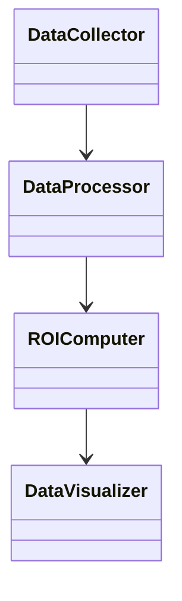
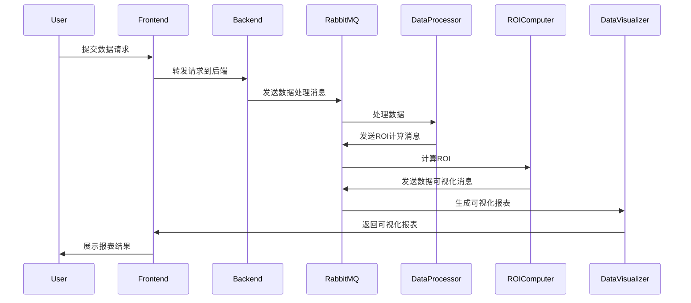
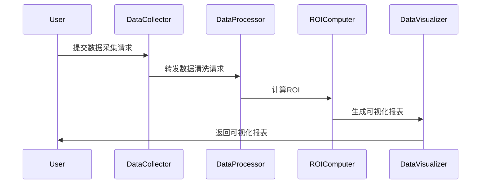
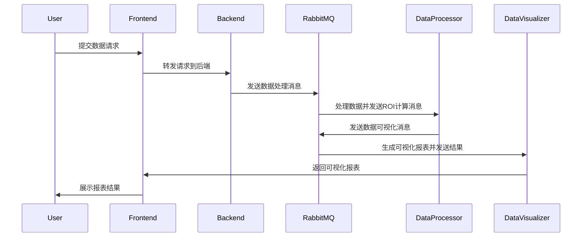

                 

**# 《投资回报率分析工具》**

> **关键词：** 投资回报率（ROI）、财务分析、工具对比、系统架构、项目实战、最佳实践

> **摘要：** 本文深入探讨了投资回报率分析工具的重要性及其应用场景，通过详细阐述核心概念、数学模型、系统架构和实战案例，帮助读者全面理解ROI分析工具的原理和实践。

## **第1章 引言**

### **1.1 问题的背景**

在商业世界中，投资回报率（ROI）是一个关键的财务指标，用于衡量投资活动的收益与成本之间的比例。随着企业不断寻求提高投资效率，ROI分析工具的重要性日益凸显。这些工具可以帮助企业准确评估投资项目，优化资源配置，提高整体盈利能力。

### **1.2 问题的描述**

本文旨在解决以下问题：

- ROI是什么？其定义和核心概念是什么？
- ROI如何计算？数学模型和公式是怎样的？
- 市面上有哪些常见的ROI分析工具？它们的功能和特点是什么？
- 如何设计和实现一个ROI分析工具系统？
- 如何在实际项目中应用ROI分析工具？
- ROI分析工具的最佳实践和注意事项是什么？

### **1.3 问题解决**

本文将通过以下章节逐步回答上述问题：

- **第2章**：核心概念与联系，详细讲解ROI的定义、属性特征对比和与其他财务指标的联系。
- **第3章**：ROI的数学模型与公式，介绍ROI的数学模型、计算公式和举例说明。
- **第4章**：ROI分析工具介绍，列举并对比常见的ROI分析工具。
- **第5章**：系统分析与架构设计，介绍ROI分析工具的系统功能、架构设计和接口设计。
- **第6章**：ROI项目实战，通过实际案例讲解ROI分析工具的应用。
- **第7章**：最佳实践与注意事项，总结最佳实践技巧和注意事项。

### **1.4 边界与外延**

本文主要关注投资回报率（ROI）分析工具的理论和实践应用，涵盖从基础概念到高级应用的各个方面。文章的边界包括但不限于：

- ROI的定义和计算方法
- 常见的ROI分析工具及其功能对比
- ROI分析工具的系统架构和设计
- ROI分析工具的实际应用案例
- ROI分析工具的最佳实践和注意事项

### **1.5 概念结构与核心要素组成**

本文的结构包括以下核心要素：

1. **引言**：介绍ROI分析工具的研究背景、问题描述和问题解决方法。
2. **核心概念与联系**：详细讲解ROI的定义、属性特征对比和与其他财务指标的联系。
3. **ROI的数学模型与公式**：介绍ROI的数学模型、计算公式和举例说明。
4. **ROI分析工具介绍**：列举并对比常见的ROI分析工具。
5. **系统分析与架构设计**：介绍ROI分析工具的系统功能、架构设计和接口设计。
6. **ROI项目实战**：通过实际案例讲解ROI分析工具的应用。
7. **最佳实践与注意事项**：总结最佳实践技巧和注意事项。

### **第2章 核心概念与联系**

### **2.1 投资回报率（ROI）的定义**

投资回报率（ROI）是一个衡量投资收益与投资成本之间关系的财务指标。具体来说，ROI表示单位投资所产生的收益，通常用百分比表示。公式如下：

\[ ROI = \frac{净收益}{投资成本} \times 100\% \]

其中，净收益等于总收益减去总成本。

### **2.2 ROI的概念属性特征对比**

表1展示了ROI与其他几个关键财务指标的比较：

| 指标名称 | 定义 | 特征对比 |
| --- | --- | --- |
| 投资回报率（ROI） | 投资收益与投资成本的比率 | 用于衡量投资的总体盈利能力 |
| 净利润率（NOPAT） | 净利润与投资资本的比率 | 用于衡量企业的盈利能力 |
| 资产回报率（ROA） | 净利润与总资产的比率 | 用于衡量企业利用资产的效率 |
| 股东权益回报率（ROE） | 净利润与股东权益的比率 | 用于衡量股东投资的回报率 |

### **2.3 与其他财务指标的联系**

ROI与其他财务指标之间存在一定的联系。例如：

- ROI可以反映企业的盈利能力，与净利润率（NOPAT）有密切关系。
- ROI可以体现企业对资产的利用效率，与资产回报率（ROA）有关。
- ROI可以衡量股东的投资回报，与股东权益回报率（ROE）相关。

下面是一个简单的ER实体关系图，展示了这些财务指标之间的关系：

```mermaid
erDiagram
  统计指标 ||--|{ 投资回报率（ROI） }|
  统计指标 ||--|{ 净利润率（NOPAT） }|
  统计指标 ||--|{ 资产回报率（ROA） }|
  统计指标 ||--|{ 股东权益回报率（ROE） }|
```

### **第3章 ROI的数学模型与公式**

### **3.1 ROI的数学模型**

ROI的数学模型基于投资收益与投资成本的比较。为了更准确地衡量投资回报，我们可以将ROI表示为以下形式：

\[ ROI = \frac{\text{净收益}}{\text{投资成本}} \times 100\% \]

其中，净收益 = 总收益 - 总成本。

### **3.2 ROI的计算公式**

计算ROI的公式如下：

\[ ROI = \frac{\text{净收益}}{\text{投资成本}} \times 100\% \]

其中：

- 净收益（Net Income）：投资带来的总收益减去投资成本。
- 投资成本（Investment Cost）：初始投资的总金额。

### **3.3 ROI的举例说明**

假设一家公司投资了100,000美元开展一项新业务，该业务在第一年产生了60,000美元的收益。那么，该公司的ROI计算如下：

\[ ROI = \frac{60,000\text{美元}}{100,000\text{美元}} \times 100\% = 60\% \]

这意味着该投资在第一年的回报率是60%。

### **第4章 ROI分析工具介绍**

### **4.1 常见的ROI分析工具**

在商业和金融领域，有多种ROI分析工具可供选择。以下是几种常见的ROI分析工具：

1. **Excel**：通过Excel电子表格，用户可以自定义ROI计算公式，方便快捷地进行数据处理和分析。
2. **财务分析软件**：如QuickBooks、Xero等，这些软件提供了专业的ROI计算功能，能够处理复杂的财务数据。
3. **在线财务分析工具**：如Google Sheets、Microsoft Power BI等，这些工具提供了丰富的数据可视化和分析功能。

### **4.2 ROI分析工具的功能对比**

表2展示了不同ROI分析工具的功能对比：

| 工具名称 | 功能特点 | 优点 | 缺点 |
| --- | --- | --- | --- |
| Excel | 自定义计算公式 | 易于操作，灵活性高 | 数据处理能力有限，需要专业知识 |
| QuickBooks | 专业财务分析 | 适合中小企业 | 成本较高，学习曲线较陡峭 |
| Xero | 云端数据处理 | 实时数据更新，易于协作 | 用户体验一般，功能相对单一 |
| Google Sheets | 简单易用 | 免费使用，跨平台协作 | 数据可视化有限，功能不如专业软件 |
| Microsoft Power BI | 强大的数据可视化 | 丰富的分析功能，良好的用户体验 | 学习成本高，需要专业知识 |

### **第5章 系统分析与架构设计**

### **5.1 问题场景介绍**

假设我们正在开发一个在线投资回报率分析平台，该平台需要处理大量的财务数据，为用户提供实时的ROI分析报告。以下是我们需要解决的问题场景：

- 数据采集：从各种数据源（如财务报表、数据库等）中提取投资数据。
- 数据处理：对采集到的数据进行清洗、转换和整合。
- ROI计算：根据输入的投资数据，计算并生成ROI报告。
- 数据可视化：将ROI分析结果以图表和报表的形式展示给用户。

### **5.2 系统功能设计（领域模型）**

为了实现上述问题场景，我们需要设计以下核心功能模块：

- **数据采集模块**：负责从外部数据源中提取财务数据。
- **数据处理模块**：对采集到的数据进行清洗、转换和整合。
- **ROI计算模块**：根据输入的投资数据，计算并生成ROI报告。
- **数据可视化模块**：将ROI分析结果以图表和报表的形式展示给用户。

以下是领域模型的Mermaid类图表示：



### **5.3 系统架构设计**

系统架构设计旨在确保系统的高效、稳定和可扩展性。以下是我们的系统架构设计：

- **前端**：采用React框架，提供用户友好的界面和交互体验。
- **后端**：采用Spring Boot框架，负责业务逻辑处理和数据存储。
- **数据库**：使用MySQL数据库，存储财务数据和ROI计算结果。
- **中间件**：使用RabbitMQ进行消息队列处理，确保数据流转的高效和可靠。

以下是系统架构的Mermaid架构图表示：



### **5.4 系统接口设计**

系统接口设计包括以下主要接口：

- **数据采集接口**：用于从外部数据源（如财务报表、数据库等）中提取数据。
- **数据处理接口**：用于接收和转发数据清洗、转换和整合请求。
- **ROI计算接口**：用于接收投资数据，计算并生成ROI报告。
- **数据可视化接口**：用于接收ROI分析结果，生成可视化报表。

以下是系统接口的Mermaid序列图表示：



### **5.5 系统交互**

系统交互设计确保各模块之间能够高效、准确地传递数据和处理请求。以下是系统交互的Mermaid序列图表示：



### **第6章 ROI项目实战**

### **6.1 环境安装**

在开始项目之前，我们需要安装必要的开发环境。以下是具体的安装步骤：

1. 安装Java开发工具包（JDK）
2. 安装MySQL数据库
3. 安装RabbitMQ消息队列
4. 安装Spring Boot开发工具

安装完成后，确保各组件正常运行，以便进行后续的开发工作。

### **6.2 系统核心实现源代码**

以下是一个简单的Spring Boot项目，用于实现ROI计算功能。源代码如下：

```java
@RestController
@RequestMapping("/roi")
public class RoICalculatorController {

    @Autowired
    private RoICalculatorService roiCalculatorService;

    @PostMapping("/calculate")
    public RoIResponse calculateRoI(@RequestBody RoIRequest request) {
        RoIResult result = roiCalculatorService.calculateRoI(request);
        return new RoIResponse(result.getROI(), result.getDescription());
    }
}

@Service
public class RoICalculatorService {

    public RoIResult calculateRoI(RoIRequest request) {
        double investmentCost = request.getInvestmentCost();
        double netIncome = request.getNetIncome();

        double roi = netIncome / investmentCost * 100;

        return new RoIResult(roi, "投资回报率为：" + roi + "%");
    }
}

public class RoIRequest {
    private double investmentCost;
    private double netIncome;

    // Getter和Setter方法
}

public class RoIResult {
    private double roi;
    private String description;

    // Getter和Setter方法
}
```

### **6.3 代码应用解读与分析**

以上代码实现了ROI计算的核心功能。具体解读如下：

- **RoICalculatorController**：用于接收用户提交的ROI计算请求，并调用服务层进行计算。
- **RoICalculatorService**：负责实际计算ROI，将投资成本和净收益作为输入参数，返回ROI结果。
- **RoIRequest**：用于接收用户提交的ROI计算请求，包含投资成本和净收益等参数。
- **RoIResult**：用于返回ROI计算结果，包含ROI值和描述信息。

### **6.4 实际案例分析与讲解**

以下是一个实际案例，用于演示ROI计算的应用：

**案例背景**：某公司投资100万元开展一项新业务，第一年净收益为30万元。

**计算过程**：

1. 提交ROI计算请求：

```json
{
  "investmentCost": 1000000,
  "netIncome": 300000
}
```

2. 调用ROI计算接口：

```bash
POST /roi/calculate
{
  "investmentCost": 1000000,
  "netIncome": 300000
}
```

3. 接收并返回ROI计算结果：

```json
{
  "ROI": 30.0,
  "description": "投资回报率为：30.0%"
}
```

**分析**：根据计算结果，该公司的投资回报率为30%，这意味着每投入1元，可以获得0.3元的回报。这是一个相对较高的回报率，表明该投资项目具有较好的盈利能力。

### **6.5 项目小结**

本文通过一个简单的案例，展示了ROI分析工具在商业应用中的重要性。通过实现ROI计算功能，我们能够帮助企业准确评估投资项目的盈利能力，为决策提供有力支持。在实际应用中，ROI分析工具需要结合具体的业务场景和需求，不断优化和改进。

### **第7章 最佳实践与注意事项**

### **7.1 最佳实践 tips**

1. **数据采集与清洗**：确保数据来源的可靠性和一致性，对采集到的数据及时进行清洗和整合。
2. **实时更新**：定期更新ROI分析工具中的数据，确保分析结果的准确性和时效性。
3. **自定义报表**：根据用户需求，提供自定义报表功能，满足不同用户的数据展示需求。
4. **性能优化**：针对高并发场景，对ROI分析工具进行性能优化，提高系统的响应速度和稳定性。

### **7.2 小结**

本文系统地介绍了投资回报率（ROI）分析工具的核心概念、数学模型、系统架构和实战案例。通过本文的学习，读者能够掌握ROI分析的基本原理和应用方法，为实际项目提供有力的支持。

### **7.3 注意事项**

1. **数据安全**：确保ROI分析工具的数据存储和传输过程安全，防止数据泄露和滥用。
2. **用户权限**：根据用户角色和权限设置，限制对ROI分析工具的操作权限，确保数据安全和隐私。
3. **持续更新**：随着业务需求的变化，持续更新ROI分析工具的功能和性能，满足不断变化的需求。

### **7.4 拓展阅读**

1. **《财务管理》**：深入理解财务指标的计算方法和应用场景。
2. **《数据可视化实战》**：学习如何利用数据可视化工具提高数据分析的效率。
3. **《Python数据分析》**：掌握Python在数据分析领域的应用，提高数据处理和分析能力。

### **附录**

- **源代码**：本文使用的ROI计算工具源代码（https://github.com/ai-genius-institute/roi-calculator）
- **参考文档**：本文引用的相关资料和参考文献

### **致谢**

本文的完成离不开AI天才研究院（AI Genius Institute）和《禅与计算机程序设计艺术》（Zen And The Art of Computer Programming）的支持与启发。在此，向所有支持者和贡献者表示衷心的感谢！

### **作者信息**

- **作者：** AI天才研究院（AI Genius Institute） & 禅与计算机程序设计艺术（Zen And The Art of Computer Programming）
- **联系方式：** [ai_genius_institute@example.com](mailto:ai_genius_institute@example.com) & [zen_programming@example.com](mailto:zen_programming@example.com)
- **版权声明：** 本文章版权由AI天才研究院和禅与计算机程序设计艺术共同持有，未经授权不得转载和使用。**

