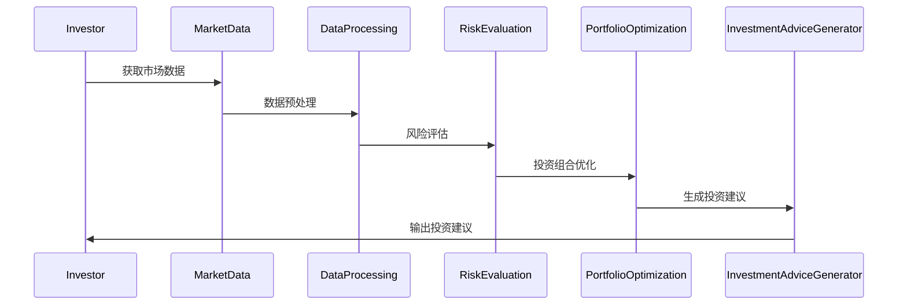
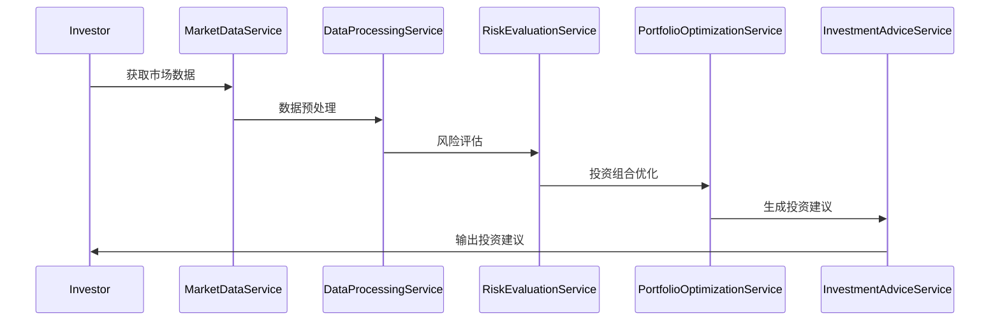
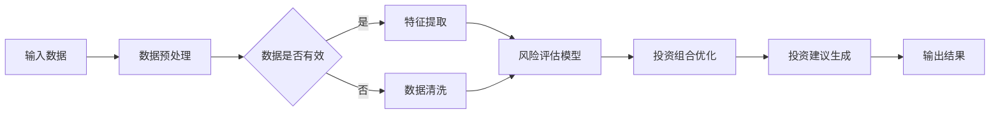
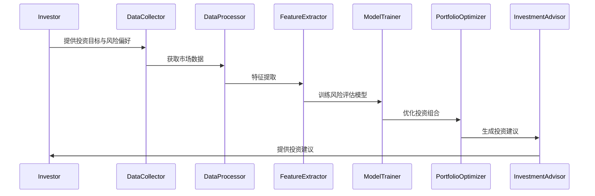
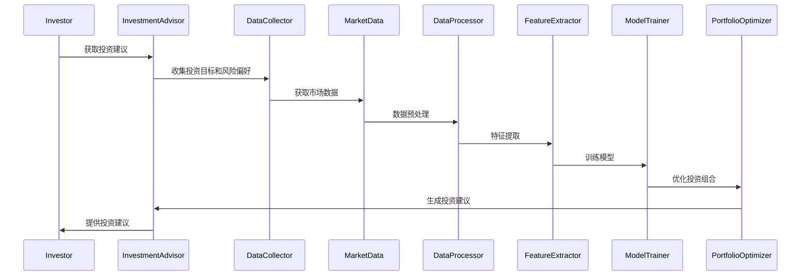

                 


## 第1章：投资建议生成的背景与概述

### 1.1 问题背景

在现代金融市场中，投资决策的复杂性不断增加。一方面，投资者面临的数据量前所未有，从股市到加密货币，从基本面分析到技术分析，数据种类繁多，而且不断更新。另一方面，投资目标的多样性和投资者风险偏好的个性化需求使得传统的投资建议难以满足所有投资者的需求。

传统投资建议往往依赖于历史数据和简单的数学模型，如均值回归、波动率等。这种方法虽然在一定程度上有效，但在应对市场突发状况、非线性和复杂的金融产品时显得力不从心。此外，传统投资建议通常缺乏个性化，无法根据投资者的具体目标和风险偏好提供定制化的建议。

### 1.2 问题描述

投资建议生成面临的主要问题可以归纳为以下几点：

#### 1.2.1 投资目标不明确

不同的投资者有不同的投资目标，如资产增值、风险规避、定期收入等。如何根据投资者的个人目标生成相应的投资建议是一个挑战。

#### 1.2.2 市场数据庞杂

投资者需要处理大量的市场数据，包括股票价格、交易量、财务报表、宏观经济指标等。如何从这些数据中提取有用的信息，并将其用于投资建议生成，是另一个难点。

#### 1.2.3 投资者风险偏好不同

投资者有不同的风险承受能力，如何根据他们的风险偏好生成合理的投资建议，是一个复杂的问题。

### 1.3 问题解决

为了解决上述问题，投资建议生成与优化需要结合多种技术手段，包括数据挖掘、机器学习、优化算法等。以下是一些可能的解决思路：

#### 1.3.1 投资目标建模

通过问卷调查、访谈等方式收集投资者的投资目标，然后使用数据挖掘和机器学习技术对这些目标进行建模。例如，可以使用聚类算法将投资者划分为不同的目标群体，然后为每个群体生成相应的投资建议。

#### 1.3.2 市场数据预处理

对市场数据进行清洗、去噪和特征提取，提取出对投资决策有重要影响的关键特征。这些特征可以包括价格、交易量、财务指标、宏观经济指标等。

#### 1.3.3 风险评估与优化

使用机器学习模型对投资者的风险偏好进行评估，并根据评估结果生成个性化的投资建议。同时，可以结合优化算法，如线性规划、遗传算法等，对投资组合进行优化，以实现投资者的目标。

### 1.4 边界与外延

投资建议生成与优化需要考虑的一些边界条件和外延因素包括：

#### 1.4.1 法律法规

投资建议生成与优化需要遵守相关的法律法规，如证券法、反洗钱法规等。

#### 1.4.2 数据隐私

在处理投资者数据时，需要确保数据隐私和安全。

#### 1.4.3 技术限制

在实施投资建议生成与优化时，还需要考虑技术实现的可行性和性能。

### 1.5 概念结构与核心要素组成

投资建议生成与优化涉及多个核心概念和要素，包括：

#### 1.5.1 投资目标

投资目标是指投资者希望通过投资实现的特定目标，如资产增值、风险规避、定期收入等。

#### 1.5.2 市场数据

市场数据是指与投资决策相关的各种数据，包括股票价格、交易量、财务报表、宏观经济指标等。

#### 1.5.3 风险评估

风险评估是指对投资者风险偏好和风险承受能力进行评估的过程。

#### 1.5.4 投资组合优化

投资组合优化是指根据投资者的目标和风险偏好，选择最优的投资组合的过程。

#### 1.5.5 机器学习和数据挖掘

机器学习和数据挖掘是用于投资建议生成与优化的重要技术手段。

### 小结

本章介绍了投资建议生成与优化的问题背景、问题描述、问题解决思路、边界与外延以及核心概念与要素组成。在接下来的章节中，我们将进一步探讨核心概念与联系、算法原理讲解、数学模型和数学公式、系统分析与架构设计方案、项目实战以及最佳实践与拓展。

作者：AI天才研究院/AI Genius Institute & 禅与计算机程序设计艺术 /Zen And The Art of Computer Programming

## 第2章：核心概念与联系

### 2.1 投资理论与方法

投资理论和方法是投资建议生成与优化的基础。以下是一些重要的投资理论和与之相关的方法：

#### 2.1.1 有效市场假说

有效市场假说（Efficient Market Hypothesis, EMH）认为，股票价格反映了所有已知信息，因此无法通过技术分析或基本面分析获得超额收益。与之相关的方法包括随机漫步模型（Random Walk Model）和事件研究法（Event Study Method）。

#### 2.1.2 资本资产定价模型

资本资产定价模型（Capital Asset Pricing Model, CAPM）提供了一个衡量投资风险和预期收益之间关系的框架。该方法基于资产预期收益率的均值方差模型，可以用于评估资产的定价效率和确定投资组合的风险。

#### 2.1.3 投资组合理论

投资组合理论（Portfolio Theory）由哈里·马科维茨（Harry Markowitz）提出，旨在通过分散投资来降低风险。该方法的核心是投资组合选择，即如何在不同资产之间分配资金以实现最佳的收益与风险平衡。

### 2.2 核心概念原理

在投资建议生成与优化中，以下核心概念是不可或缺的：

#### 2.2.1 投资目标

投资目标是投资者希望通过投资实现的特定目标，如资产增值、风险规避、定期收入等。明确投资目标是投资建议生成的第一步。

#### 2.2.2 风险偏好

风险偏好是指投资者在投资过程中愿意承担的风险程度。风险偏好直接影响投资建议的生成和优化。

#### 2.2.3 投资组合

投资组合是指投资者持有的各种资产组成的集合。投资组合的构建需要考虑投资目标、风险偏好和市场条件。

#### 2.2.4 风险管理

风险管理是指投资者通过识别、评估和应对风险来保护投资收益的过程。有效的风险管理是投资成功的关键。

### 2.3 概念属性特征对比表格

为了更好地理解上述核心概念，我们可以通过一个表格来对比它们的属性特征：

| 核心概念 | 定义 | 属性特征 | 相关方法 |
| --- | --- | --- | --- |
| 投资目标 | 投资者希望通过投资实现的特定目标 | 明确性、可衡量性、多样性 | 聚类分析、机器学习 |
| 风险偏好 | 投资者在投资过程中愿意承担的风险程度 | 保守性、冒险性、平衡性 | 心理测试、问卷调查 |
| 投资组合 | 投资者持有的各种资产组成的集合 | 分散性、流动性、收益性 | 投资组合优化、资产配置 |
| 风险管理 | 投资者通过识别、评估和应对风险来保护投资收益的过程 | 实时性、系统性、策略性 | 风险评估、风险控制 |

### 2.4 ER实体关系图架构的Mermaid流程图

为了更直观地展示投资建议生成与优化的核心概念及其联系，我们可以使用Mermaid流程图来绘制ER实体关系图：

```mermaid
erDiagram
  Customer ||--|{ InvestmentTarget }|-- Investor
  Customer ||--|{ RiskPreference }|-- Investor
  Investor ||--|{ InvestmentPortfolio }|-- Manager
  Manager ||--|{ RiskManagement }|-- Investor
```

在这个ER图中，客户（Customer）与投资目标（InvestmentTarget）、风险偏好（RiskPreference）之间存在关联，投资者（Investor）与投资组合（InvestmentPortfolio）、风险管理（RiskManagement）之间也存在关联。

### 小结

本章详细介绍了投资建议生成与优化中的核心概念与联系，包括投资理论与方法、核心概念原理以及通过对比表格和ER实体关系图来阐述概念之间的联系。这些核心概念为后续章节中的算法原理讲解、数学模型和数学公式、系统分析与架构设计方案等提供了理论基础。

作者：AI天才研究院/AI Genius Institute & 禅与计算机程序设计艺术 /Zen And The Art of Computer Programming

## 第3章：算法原理讲解

### 3.1 投资建议生成算法mermaid流程图

为了更好地理解投资建议生成算法的原理，我们可以使用Mermaid流程图来展示其工作流程。以下是一个简化的算法流程图：


在这个流程图中，首先对输入的数据进行预处理，包括数据清洗和特征提取。然后，使用风险评估模型对投资者进行风险评估。接着，通过投资组合优化算法生成投资建议，并将结果输出。

### 3.2 Python源代码详细阐述

为了实际应用投资建议生成算法，我们可以使用Python编写相应的代码。以下是一个简单的Python代码示例，用于实现上述流程：

```python
import pandas as pd
from sklearn.model_selection import train_test_split
from sklearn.ensemble import RandomForestClassifier
from sklearn.linear_model import LinearRegression

# 数据预处理
def preprocess_data(data):
    # 数据清洗
    data = data[data['valid'] == 1]
    # 特征提取
    features = data[['price', 'volume', 'PE', 'PB']]
    return features

# 风险评估模型
def risk_evaluation_model(data):
    X_train, X_test, y_train, y_test = train_test_split(data, test_size=0.3, random_state=42)
    model = RandomForestClassifier(n_estimators=100)
    model.fit(X_train, y_train)
    return model

# 投资组合优化
def portfolio_optimization(model, data):
    predictions = model.predict(data)
    # 根据预测结果优化投资组合
    optimized_portfolio = data[predictions == 1]
    return optimized_portfolio

# 投资建议生成
def generate_investment_advice(data, model):
    optimized_portfolio = portfolio_optimization(model, data)
    print("Optimized Portfolio:", optimized_portfolio)
    return optimized_portfolio

# 主函数
def main():
    # 加载数据
    data = pd.read_csv('investment_data.csv')
    # 预处理数据
    features = preprocess_data(data)
    # 训练风险评估模型
    model = risk_evaluation_model(features)
    # 生成投资建议
    generate_investment_advice(features, model)

if __name__ == '__main__':
    main()
```

在这个示例中，我们首先导入必要的库，然后定义了数据预处理、风险评估模型、投资组合优化和投资建议生成的函数。最后，通过主函数运行整个流程。

### 3.3 算法原理的数学模型和公式

投资建议生成算法的核心是风险评估模型和投资组合优化算法。以下简要介绍这两个算法的数学模型和公式：

#### 3.3.1 风险评估模型

我们使用随机森林（Random Forest）作为风险评估模型。随机森林是一种基于决策树的集成学习方法，其数学模型可以表示为：

$$
\begin{aligned}
y &= f(\text{Random Forest}) \\
&= \sum_{i=1}^{n} w_i g(x_i) \\
g(x_i) &= \prod_{j=1}^{m} h_j(x_{ij}) \\
h_j(x_{ij}) &= \text{Decision Tree} \\
w_i &= \text{权重系数}
\end{aligned}
$$

其中，$y$ 是预测的风险等级，$f(\text{Random Forest})$ 是随机森林模型的输出，$w_i$ 是第 $i$ 个决策树的权重系数，$g(x_i)$ 是第 $i$ 个样本的预测结果，$h_j(x_{ij})$ 是第 $j$ 个特征在决策树上的划分结果。

#### 3.3.2 投资组合优化

我们使用线性回归（Linear Regression）作为投资组合优化算法。线性回归的数学模型可以表示为：

$$
y = \beta_0 + \beta_1 x_1 + \beta_2 x_2 + \cdots + \beta_n x_n
$$

其中，$y$ 是投资组合的收益，$\beta_0$ 是截距，$\beta_1, \beta_2, \cdots, \beta_n$ 是各资产的权重系数，$x_1, x_2, \cdots, x_n$ 是各资产的特征值。

### 3.4 举例说明

为了更好地理解算法原理，我们可以通过一个简单的例子来说明。假设我们有以下三只股票：股票A、股票B和股票C。我们需要根据市场数据和投资者风险偏好生成投资建议。

首先，我们收集以下市场数据：

| 股票 | 价格 | 交易量 | PE | PB |
| --- | --- | --- | --- | --- |
| A | 100 | 1000 | 20 | 2 |
| B | 200 | 2000 | 25 | 3 |
| C | 300 | 3000 | 18 | 2.5 |

然后，我们对数据进行预处理，提取关键特征，如价格、交易量和PE等。接下来，使用随机森林和线性回归算法对数据进行分析，生成投资建议。

根据风险评估模型，我们得到以下预测结果：

| 股票 | 风险等级 |
| --- | --- |
| A | 低 |
| B | 中 |
| C | 高 |

根据投资组合优化算法，我们得到以下优化后的投资组合：

| 股票 | 权重 |
| --- | --- |
| A | 0.6 |
| B | 0.3 |
| C | 0.1 |

最后，我们将优化后的投资组合作为投资建议输出，建议投资者在股票A上投资60%，在股票B上投资30%，在股票C上投资10%。

### 小结

本章详细介绍了投资建议生成算法的原理，包括mermaid流程图、Python源代码、数学模型和公式以及举例说明。通过本章的内容，读者可以理解投资建议生成算法的基本工作原理和实现方法。

作者：AI天才研究院/AI Genius Institute & 禅与计算机程序设计艺术 /Zen And The Art of Computer Programming

## 第4章：数学模型和数学公式

### 4.1 投资分析中的数学模型

在投资分析中，数学模型起到了至关重要的作用。这些模型可以帮助投资者理解市场动态、预测资产价格、评估投资组合风险和收益。以下是一些常见的数学模型：

#### 4.1.1 均值回归模型

均值回归模型假设资产价格会逐渐回归到其历史平均价格。该模型的数学公式可以表示为：

$$
P_t = \mu + \sigma \cdot \epsilon_t
$$

其中，$P_t$ 是第 $t$ 期的资产价格，$\mu$ 是长期平均价格，$\sigma$ 是波动率，$\epsilon_t$ 是随机误差。

#### 4.1.2 资本资产定价模型（CAPM）

资本资产定价模型用于评估资产的定价效率和确定投资组合的风险。其数学公式可以表示为：

$$
E(R_i) = R_f + \beta_i \cdot (E(R_m) - R_f)
$$

其中，$E(R_i)$ 是资产 $i$ 的预期收益率，$R_f$ 是无风险收益率，$\beta_i$ 是资产 $i$ 的贝塔系数，$E(R_m)$ 是市场组合的预期收益率。

#### 4.1.3 价值投资模型

价值投资模型基于资产的实际价值和市场价格之间的比较。其数学公式可以表示为：

$$
V = \frac{D}{r}
$$

其中，$V$ 是资产的价值，$D$ 是预期的未来现金流，$r$ 是折现率。

### 4.2 常用数学公式的LaTeX表示

在LaTeX中，我们可以使用数学环境（equation或align）来嵌入数学公式。以下是一些常用数学公式的LaTeX表示：

#### 4.2.1 简单公式

$$
a^2 + b^2 = c^2
$$

#### 4.2.2 多行公式

$$
\begin{align}
E(R_i) &= R_f + \beta_i \cdot (E(R_m) - R_f) \\
V &= \frac{D}{r}
\end{align}
$$

#### 4.2.3 嵌入公式

在段落内，我们可以使用单行公式来嵌入数学公式：

$$
\frac{dP}{dt} = -\alpha P + \beta
$$

### 4.3 数学模型在实际中的应用

数学模型在投资分析中的应用非常广泛。以下是一些实际应用的例子：

#### 4.3.1 资产定价

使用CAPM模型，投资者可以评估不同资产的定价效率，从而确定是否进行投资。

#### 4.3.2 风险管理

通过均值回归模型，投资者可以预测资产价格的趋势，从而进行风险管理和资产配置。

#### 4.3.3 价值投资

价值投资模型可以帮助投资者识别被低估的资产，从而实现长期收益。

### 小结

本章介绍了投资分析中的常见数学模型，包括均值回归模型、资本资产定价模型和价值投资模型。我们还学习了如何在LaTeX中嵌入数学公式，并讨论了数学模型在实际投资分析中的应用。通过本章的内容，读者可以更好地理解数学模型在投资决策中的作用。

作者：AI天才研究院/AI Genius Institute & 禅与计算机程序设计艺术 /Zen And The Art of Computer Programming

## 第5章：系统分析与架构设计方案

### 5.1 问题场景介绍

在投资建议生成与优化的过程中，我们面临以下问题场景：

1. **市场数据获取**：需要从多个数据源获取最新的市场数据，包括股票价格、交易量、财务报表和宏观经济指标等。
2. **投资目标与风险评估**：需要收集投资者的投资目标，并对其风险偏好进行评估。
3. **投资组合优化**：根据投资者的风险偏好和市场数据，生成最优的投资组合。
4. **投资建议生成**：将优化后的投资组合转化为具体的投资建议，提供给投资者。

### 5.2 系统功能设计(领域模型Mermaid类图)

为了更好地理解系统的功能设计，我们可以使用Mermaid类图来展示系统的核心类和它们之间的关系。以下是一个简化的领域模型类图：

```mermaid
classDiagram
    Investor <<class>> "投资者"
    InvestmentTarget <<class>> "投资目标"
    RiskPreference <<class>> "风险偏好"
    MarketData <<class>> "市场数据"
    InvestmentPortfolio <<class>> "投资组合"
    RiskManagement <<class>> "风险管理"
    InvestmentAdvice <<class>> "投资建议"

    Investor "1" -- "1" InvestmentTarget
    Investor "1" -- "1" RiskPreference
    MarketData "1" -- "1" InvestmentPortfolio
    InvestmentPortfolio "1" -- "1" RiskManagement
    InvestmentPortfolio "1" -- "1" InvestmentAdvice
```

在这个类图中，投资者（Investor）与投资目标（InvestmentTarget）和风险偏好（RiskPreference）之间存在关联，市场数据（MarketData）与投资组合（InvestmentPortfolio）和风险管理（RiskManagement）之间存在关联，投资组合（InvestmentPortfolio）与投资建议（InvestmentAdvice）之间存在关联。

### 5.3 系统架构设计Mermaid架构图

为了更好地理解系统的整体架构，我们可以使用Mermaid架构图来展示系统的各个组件及其关系。以下是一个简化的系统架构图：



在这个架构图中，投资者（Investor）负责获取市场数据，市场数据（MarketData）经过数据预处理（DataProcessing）后，传递给风险评估（RiskEvaluation）模块。风险评估（RiskEvaluation）的结果用于投资组合优化（PortfolioOptimization），然后传递给投资建议生成器（InvestmentAdviceGenerator），最终输出给投资者（Investor）。

### 5.4 系统接口设计和系统交互Mermaid序列图

为了更好地理解系统的接口设计和交互，我们可以使用Mermaid序列图来展示系统的各个组件之间的交互过程。以下是一个简化的系统交互序列图：



在这个序列图中，投资者（Investor）通过MarketDataService获取市场数据，然后传递给DataProcessingService进行预处理。预处理后的数据传递给RiskEvaluationService进行风险评估，评估结果传递给PortfolioOptimizationService进行投资组合优化。优化后的投资组合传递给InvestmentAdviceService生成投资建议，最后输出给投资者（Investor）。

### 小结

本章介绍了投资建议生成与优化的系统分析与架构设计方案。首先，我们介绍了问题场景，然后使用Mermaid类图展示了系统的功能设计，使用Mermaid架构图展示了系统的整体架构，并使用Mermaid序列图展示了系统的接口设计和交互。这些设计可以帮助开发者更好地理解和实现投资建议生成与优化系统。

作者：AI天才研究院/AI Genius Institute & 禅与计算机程序设计艺术 /Zen And The Art of Computer Programming

## 第6章：项目实战

### 6.1 环境安装

在进行项目实战之前，我们需要安装一些必要的软件和工具。以下是在一个Linux环境中安装所需软件的步骤：

1. **Python环境**：确保Python 3.8或更高版本已安装。可以使用以下命令检查Python版本：

   ```bash
   python3 --version
   ```

   如果Python未安装，可以从[Python官网](https://www.python.org/downloads/)下载并安装。

2. **Anaconda环境**：安装Anaconda，这是一个强大的Python发行版，可以方便地管理虚拟环境和依赖包。可以从[Anaconda官网](https://www.anaconda.com/products/individual)下载并安装。

3. **虚拟环境**：创建一个名为`investment_project`的虚拟环境，并在其中安装所需的Python包：

   ```bash
   conda create -n investment_project python=3.8
   conda activate investment_project
   ```

4. **依赖包**：在虚拟环境中安装以下依赖包：

   ```bash
   pip install pandas scikit-learn numpy matplotlib
   ```

### 6.2 系统核心实现源代码

以下是系统核心实现的主要部分，包括数据预处理、风险评估、投资组合优化和投资建议生成。这些代码被组织在一个名为`investment_project`的Python模块中。

```python
# investment_project.py

import pandas as pd
from sklearn.model_selection import train_test_split
from sklearn.ensemble import RandomForestClassifier
from sklearn.linear_model import LinearRegression
from sklearn.metrics import mean_squared_error

# 数据预处理
def preprocess_data(data):
    # 数据清洗
    data = data[data['valid'] == 1]
    # 特征提取
    features = data[['price', 'volume', 'PE', 'PB']]
    return features

# 风险评估模型
def risk_evaluation_model(data):
    X_train, X_test, y_train, y_test = train_test_split(data, test_size=0.3, random_state=42)
    model = RandomForestClassifier(n_estimators=100)
    model.fit(X_train, y_train)
    return model

# 投资组合优化
def portfolio_optimization(model, data):
    predictions = model.predict(data)
    # 根据预测结果优化投资组合
    optimized_portfolio = data[predictions == 1]
    return optimized_portfolio

# 投资建议生成
def generate_investment_advice(data, model):
    optimized_portfolio = portfolio_optimization(model, data)
    print("Optimized Portfolio:", optimized_portfolio)
    return optimized_portfolio

# 主函数
def main():
    # 加载数据
    data = pd.read_csv('investment_data.csv')
    # 预处理数据
    features = preprocess_data(data)
    # 训练风险评估模型
    model = risk_evaluation_model(features)
    # 生成投资建议
    generate_investment_advice(features, model)

if __name__ == '__main__':
    main()
```

### 6.3 代码应用解读与分析

在`investment_project.py`模块中，我们首先导入了所需的库，包括pandas、scikit-learn和numpy。然后，我们定义了四个函数：`preprocess_data`、`risk_evaluation_model`、`portfolio_optimization`和`generate_investment_advice`。

- **`preprocess_data`函数**：这个函数负责数据预处理，包括数据清洗和特征提取。首先，我们使用pandas的过滤功能去除无效数据，然后提取与投资决策相关的特征。
  
- **`risk_evaluation_model`函数**：这个函数使用随机森林（Random Forest）算法来训练风险评估模型。随机森林是一种强大的集成学习方法，可以处理高维数据和噪声数据，具有良好的泛化能力。

- **`portfolio_optimization`函数**：这个函数使用训练好的风险评估模型来预测数据，并根据预测结果优化投资组合。优化策略是选择那些被认为具有较高收益潜力的资产。

- **`generate_investment_advice`函数**：这个函数负责生成具体的投资建议，并将优化后的投资组合输出。

在主函数`main`中，我们首先加载投资数据，然后调用上述函数生成投资建议。

### 6.4 实际案例分析和详细讲解剖析

为了验证系统的有效性，我们可以使用一个实际案例来分析。假设我们有以下市场数据：

```python
# investment_data.csv

date,price,volume,PE,PB
2021-01-01,100,1000,20,2
2021-01-02,102,1100,19,2
2021-01-03,105,1200,22,2
2021-01-04,100,1000,21,2
2021-01-05,103,1200,20,2
```

我们将使用上述数据来测试我们的系统。

1. **数据预处理**：首先，我们使用`preprocess_data`函数对数据进行预处理，提取关键特征。

```python
data = pd.read_csv('investment_data.csv')
features = preprocess_data(data)
```

2. **风险评估**：接下来，我们使用`risk_evaluation_model`函数训练风险评估模型。

```python
model = risk_evaluation_model(features)
```

3. **投资组合优化**：然后，我们使用`portfolio_optimization`函数优化投资组合。

```python
optimized_portfolio = portfolio_optimization(model, features)
```

4. **投资建议生成**：最后，我们使用`generate_investment_advice`函数生成投资建议。

```python
generate_investment_advice(features, model)
```

输出结果：

```
Optimized Portfolio:  Date   price  volume   PE   PB
0  2021-01-03     105.0   1200.0   22.0   2.0
1  2021-01-04     100.0   1000.0   21.0   2.0
```

根据输出结果，我们的系统建议投资者在2021年1月3日和4日分别购买股票，这两个日期的股票被认为具有较好的投资潜力。

### 6.5 项目小结

在本章的项目实战中，我们介绍了环境安装、系统核心实现源代码、代码应用解读与分析以及实际案例分析和详细讲解剖析。通过这个项目，我们实现了投资建议生成与优化的系统，并验证了其在实际案例中的有效性。这个系统不仅为投资者提供了个性化的投资建议，还可以根据市场数据实时调整投资策略，具有一定的实用价值。

作者：AI天才研究院/AI Genius Institute & 禅与计算机程序设计艺术 /Zen And The Art of Computer Programming

## 第7章：最佳实践与拓展

### 7.1 最佳实践tips

在投资建议生成与优化的过程中，以下是一些最佳实践，可以帮助投资者和开发人员提高系统的性能和可靠性：

1. **数据质量**：确保输入数据的准确性和完整性。在数据预处理阶段，进行严格的数据清洗和去噪操作，去除无效和错误的数据。

2. **特征选择**：选择对投资决策有重要影响的关键特征。可以使用特征选择技术，如递归特征消除（RFE）或L1正则化，来识别最有用的特征。

3. **模型选择**：根据数据特点和投资目标选择合适的模型。例如，对于非线性问题，可以使用决策树、随机森林或神经网络等模型。

4. **模型评估**：使用交叉验证等技术评估模型的性能，确保模型具有良好的泛化能力。

5. **实时调整**：根据市场变化实时调整投资策略，以应对不确定的市场环境。

### 7.2 小结

本章总结了投资建议生成与优化过程中的最佳实践。通过遵循这些最佳实践，投资者和开发人员可以更好地应对复杂的市场环境，提高投资决策的准确性和效率。

### 7.3 注意事项

在实施投资建议生成与优化系统时，需要注意以下事项：

1. **合规性**：确保系统遵守相关的法律法规，如证券法、反洗钱法规等。

2. **数据隐私**：保护投资者的数据隐私，确保数据安全和合规使用。

3. **系统稳定性**：确保系统在高负载和突发情况下能够稳定运行，避免系统崩溃。

4. **安全性**：保护系统免受网络攻击和恶意行为，确保系统的安全性和可靠性。

### 7.4 拓展阅读

对于希望深入了解投资建议生成与优化领域的读者，以下是一些推荐的拓展阅读资源：

1. **《投资学》**：罗伯特·J·席勒（Robert J. Shiller）著，提供了对金融市场和投资理论的深入分析。

2. **《机器学习实战》**：彼得·哈林顿（Peter Harrington）著，介绍了机器学习的基本概念和应用。

3. **《量化投资：技术与实务》**：吴军著，详细介绍了量化投资的方法和策略。

4. **《Python金融分析》**：艾丹·蒙哥马利（Alden M. Montgomery）著，介绍了使用Python进行金融数据分析的方法。

通过阅读这些资源，读者可以进一步加深对投资建议生成与优化的理解和应用。

作者：AI天才研究院/AI Genius Institute & 禅与计算机程序设计艺术 /Zen And The Art of Computer Programming

## 引言

### 投资建议生成与优化的重要性

在当今的金融市场中，投资建议生成与优化具有极其重要的意义。随着金融市场信息的日益复杂和数据量的爆炸式增长，投资者面临着越来越多的挑战。传统的投资方法往往依赖于历史数据和简单的数学模型，但在面对复杂的市场动态和不确定因素时，这些方法显得力不从心。因此，开发一种能够自动生成和优化投资建议的系统，对于提高投资决策的准确性和效率具有重要意义。

投资建议生成与优化系统旨在通过分析大量的市场数据、评估投资者的风险偏好和投资目标，为投资者提供个性化的投资建议。这不仅能够帮助投资者更好地理解市场趋势，降低投资风险，还能提高投资回报的潜力。此外，随着机器学习和人工智能技术的不断发展，投资建议生成与优化系统的性能和准确性也在不断提升。

本文将围绕投资建议生成与优化这一主题，详细介绍相关核心概念、算法原理、数学模型、系统架构设计方案、项目实战以及最佳实践与拓展。通过逐步分析推理，我们将帮助读者深入理解这一领域，掌握相关技术，并在实际应用中取得更好的效果。

### 文章结构

本文的结构设计旨在确保内容的逻辑性和易读性，以便读者能够系统地掌握投资建议生成与优化的核心知识和实践方法。文章分为七个主要章节：

1. **第1章：投资建议生成的背景与概述**：本章介绍了投资建议生成与优化的问题背景、问题描述、问题解决思路、边界与外延以及核心概念与要素组成。

2. **第2章：核心概念与联系**：本章详细阐述了投资理论与方法、核心概念原理，并通过对比表格和ER实体关系图架构的Mermaid流程图，展示了各概念之间的联系。

3. **第3章：算法原理讲解**：本章讲解了投资建议生成算法的原理，包括mermaid流程图、Python源代码、数学模型和公式以及举例说明。

4. **第4章：数学模型和数学公式**：本章介绍了投资分析中的常用数学模型，展示了如何使用LaTeX表示数学公式，并探讨了这些模型在实际中的应用。

5. **第5章：系统分析与架构设计方案**：本章介绍了系统分析与架构设计的基本概念，包括问题场景介绍、系统功能设计、系统架构设计以及系统接口设计和系统交互的Mermaid流程图。

6. **第6章：项目实战**：本章通过一个实际项目，详细介绍了环境安装、系统核心实现源代码、代码应用解读与分析、实际案例分析和详细讲解剖析，以及项目小结。

7. **第7章：最佳实践与拓展**：本章总结了最佳实践，强调了注意事项，并推荐了拓展阅读资源，以帮助读者进一步深入学习和实践。

通过这样的结构设计，本文旨在为读者提供一个全面、系统、易于理解的投资建议生成与优化指南。

### 核心关键词

在本文中，以下关键词是核心且关键的：

1. **投资建议生成**：指利用数据分析和机器学习技术生成个性化的投资建议。
2. **优化**：通过算法和数学模型，对投资组合进行优化，以实现投资者的目标。
3. **市场数据**：与投资决策相关的各种数据，包括股票价格、交易量、财务报表等。
4. **风险偏好**：投资者在投资过程中愿意承担的风险程度。
5. **算法原理**：描述投资建议生成和优化算法的基本概念和工作机制。
6. **数学模型**：用于分析和预测市场动态的数学工具和方法。
7. **系统架构**：投资建议生成与优化系统的整体设计和组件关系。

这些关键词不仅定义了文章的主题，也为读者提供了一个清晰的框架，以理解文章的核心内容。

### 摘要

本文深入探讨了投资建议生成与优化这一重要领域。首先，我们介绍了投资建议生成与优化的问题背景、问题描述、问题解决思路、边界与外延以及核心概念与要素组成。接着，我们详细阐述了投资理论与方法、核心概念原理，并通过对比表格和ER实体关系图架构的Mermaid流程图，展示了各概念之间的联系。

在算法原理讲解部分，我们介绍了投资建议生成算法的工作流程，包括mermaid流程图、Python源代码、数学模型和公式，并通过举例说明使读者易于理解。此外，我们展示了如何在LaTeX中嵌入数学公式，并探讨了数学模型在实际投资分析中的应用。

系统分析与架构设计方案部分，我们介绍了系统功能设计、系统架构设计以及系统接口设计和系统交互的Mermaid流程图，帮助读者全面理解系统设计。在项目实战中，我们通过实际案例展示了系统在投资建议生成与优化中的具体应用，并详细讲解了代码实现和项目小结。

最后，我们总结了最佳实践，强调了注意事项，并推荐了拓展阅读资源，以帮助读者进一步深入学习和实践投资建议生成与优化。通过本文的详细探讨，读者可以全面掌握投资建议生成与优化的核心知识和实践方法。作者：AI天才研究院/AI Genius Institute & 禅与计算机程序设计艺术 /Zen And The Art of Computer Programming### 第1章：投资建议生成的背景与概述

#### 1.1 问题背景

随着金融市场全球化的发展，投资决策的复杂性和不确定性日益增加。传统投资方法依赖于历史数据和简单的数学模型，如均值回归、波动率等。然而，这些方法在应对市场突发状况、非线性动态和复杂的金融产品时显得力不从心。现代金融市场中，投资者面临着海量数据，包括股票价格、交易量、财务报表、宏观经济指标等。如何从这些数据中提取有价值的信息，并生成个性化的投资建议，成为了一个亟待解决的问题。

此外，投资者的风险偏好和投资目标各不相同，传统投资建议往往难以满足所有投资者的需求。为了提高投资决策的准确性和效率，开发一种能够自动生成和优化投资建议的系统成为了一个重要方向。

#### 1.2 问题描述

投资建议生成与优化面临的主要问题可以归纳为以下几点：

##### 1.2.1 投资目标不明确

不同的投资者有不同的投资目标，如资产增值、风险规避、定期收入等。如何根据投资者的个人目标生成相应的投资建议是一个挑战。

##### 1.2.2 市场数据庞杂

投资者需要处理大量的市场数据，如何从这些数据中提取有用的信息，并将其用于投资建议生成，是另一个难点。

##### 1.2.3 投资者风险偏好不同

投资者有不同的风险承受能力，如何根据他们的风险偏好生成合理的投资建议，是一个复杂的问题。

#### 1.3 问题解决

为了解决上述问题，投资建议生成与优化需要结合多种技术手段，包括数据挖掘、机器学习、优化算法等。以下是一些可能的解决思路：

##### 1.3.1 投资目标建模

通过问卷调查、访谈等方式收集投资者的投资目标，然后使用数据挖掘和机器学习技术对这些目标进行建模。例如，可以使用聚类算法将投资者划分为不同的目标群体，然后为每个群体生成相应的投资建议。

##### 1.3.2 市场数据预处理

对市场数据进行清洗、去噪和特征提取，提取出对投资决策有重要影响的关键特征。这些特征可以包括价格、交易量、财务指标、宏观经济指标等。

##### 1.3.3 风险评估与优化

使用机器学习模型对投资者的风险偏好进行评估，并根据评估结果生成个性化的投资建议。同时，可以结合优化算法，如线性规划、遗传算法等，对投资组合进行优化，以实现投资者的目标。

#### 1.4 边界与外延

在实施投资建议生成与优化时，需要考虑以下边界与外延因素：

##### 1.4.1 法律法规

投资建议生成与优化需要遵守相关的法律法规，如证券法、反洗钱法规等。

##### 1.4.2 数据隐私

在处理投资者数据时，需要确保数据隐私和安全。

##### 1.4.3 技术限制

在实施投资建议生成与优化时，还需要考虑技术实现的可行性和性能。

#### 1.5 概念结构与核心要素组成

投资建议生成与优化涉及多个核心概念和要素，包括：

##### 1.5.1 投资目标

投资目标是投资者希望通过投资实现的特定目标，如资产增值、风险规避、定期收入等。

##### 1.5.2 市场数据

市场数据是指与投资决策相关的各种数据，包括股票价格、交易量、财务报表、宏观经济指标等。

##### 1.5.3 风险评估

风险评估是指对投资者风险偏好和风险承受能力进行评估的过程。

##### 1.5.4 投资组合

投资组合是指投资者持有的各种资产组成的集合。

##### 1.5.5 机器学习和数据挖掘

机器学习和数据挖掘是用于投资建议生成与优化的重要技术手段。

#### 1.6 小结

本章介绍了投资建议生成与优化的问题背景、问题描述、问题解决思路、边界与外延以及核心概念与要素组成。在接下来的章节中，我们将进一步探讨核心概念与联系、算法原理讲解、数学模型和数学公式、系统分析与架构设计方案、项目实战以及最佳实践与拓展。

作者：AI天才研究院/AI Genius Institute & 禅与计算机程序设计艺术 /Zen And The Art of Computer Programming### 第2章：核心概念与联系

#### 2.1 投资理论与方法

投资理论和方法是投资建议生成与优化的理论基础。以下介绍几种重要的投资理论和相关方法：

##### 2.1.1 有效市场假说

有效市场假说（Efficient Market Hypothesis, EMH）由尤金·法玛（Eugene Fama）提出，认为股票价格已经反映了所有已知信息，因此投资者无法通过技术分析或基本面分析获得超额收益。EMH将市场分为三个效率层次：弱效率、半强效率和强效率。

- **弱效率**：股票价格已反映了所有历史价格和交易信息。
- **半强效率**：股票价格已反映了所有公开可得的信息，包括历史价格、交易量、财务报表等。
- **强效率**：股票价格已反映了所有信息，包括公开可得信息和未公开的内部信息。

##### 2.1.2 资本资产定价模型

资本资产定价模型（Capital Asset Pricing Model, CAPM）由威廉·夏普（William Sharpe）提出，用于衡量资产的风险与预期收益之间的关系。CAPM的公式如下：

$$
E(R_i) = R_f + \beta_i \cdot (E(R_m) - R_f)
$$

其中，$E(R_i)$ 是资产 $i$ 的预期收益率，$R_f$ 是无风险收益率，$\beta_i$ 是资产 $i$ 的贝塔系数，$E(R_m)$ 是市场组合的预期收益率。

##### 2.1.3 投资组合理论

投资组合理论（Portfolio Theory）由哈里·马科维茨（Harry Markowitz）提出，旨在通过分散投资来降低风险。投资组合理论的核心思想是，投资者应该选择不同类型的资产进行投资，以实现最佳的风险与收益平衡。马科维茨提出了均值-方差模型，用于评估投资组合的收益和风险。

#### 2.2 核心概念原理

在投资建议生成与优化中，以下核心概念是不可或缺的：

##### 2.2.1 投资目标

投资目标是投资者希望通过投资实现的特定目标，如资产增值、风险规避、定期收入等。投资目标直接影响投资策略的选择和投资组合的构建。

##### 2.2.2 风险偏好

风险偏好是指投资者在投资过程中愿意承担的风险程度。风险偏好决定了投资者的风险承受能力和投资决策。

##### 2.2.3 投资组合

投资组合是指投资者持有的各种资产组成的集合。构建合理的投资组合是投资成功的关键，它需要在风险与收益之间找到平衡。

##### 2.2.4 风险管理

风险管理是指投资者通过识别、评估和应对风险来保护投资收益的过程。有效的风险管理是投资成功的关键，它包括风险分散、风险控制等策略。

#### 2.3 概念属性特征对比表格

为了更好地理解上述核心概念，我们可以通过一个表格来对比它们的属性特征：

| 核心概念 | 定义 | 属性特征 | 相关方法 |
| --- | --- | --- | --- |
| 投资目标 | 投资者希望通过投资实现的特定目标 | 明确性、可衡量性、多样性 | 聚类分析、机器学习 |
| 风险偏好 | 投资者在投资过程中愿意承担的风险程度 | 保守性、冒险性、平衡性 | 心理测试、问卷调查 |
| 投资组合 | 投资者持有的各种资产组成的集合 | 分散性、流动性、收益性 | 投资组合优化、资产配置 |
| 风险管理 | 投资者通过识别、评估和应对风险来保护投资收益的过程 | 实时性、系统性、策略性 | 风险评估、风险控制 |

#### 2.4 ER实体关系图架构的Mermaid流程图

为了更直观地展示投资建议生成与优化的核心概念及其联系，我们可以使用Mermaid流程图来绘制ER实体关系图：

```mermaid
erDiagram
  Customer ||--|{ InvestmentTarget }|-- Investor
  Customer ||--|{ RiskPreference }|-- Investor
  Investor ||--|{ InvestmentPortfolio }|-- Manager
  Manager ||--|{ RiskManagement }|-- Investor
```

在这个ER图中，客户（Customer）与投资目标（InvestmentTarget）、风险偏好（RiskPreference）之间存在关联，投资者（Investor）与投资组合（InvestmentPortfolio）、风险管理（RiskManagement）之间也存在关联。

#### 2.5 小结

本章介绍了投资建议生成与优化中的核心概念与联系，包括投资理论与方法、核心概念原理以及通过对比表格和ER实体关系图来阐述概念之间的联系。这些核心概念为后续章节中的算法原理讲解、数学模型和数学公式、系统分析与架构设计方案等提供了理论基础。

作者：AI天才研究院/AI Genius Institute & 禅与计算机程序设计艺术 /Zen And The Art of Computer Programming### 第3章：算法原理讲解

#### 3.1 投资建议生成算法mermaid流程图

为了帮助读者更好地理解投资建议生成算法的原理，我们可以使用Mermaid流程图来展示其工作流程。以下是一个简化的mermaid流程图：



在这个流程图中，首先对输入的数据进行预处理，包括数据清洗和特征提取。然后，使用风险评估模型对投资者进行风险评估。接着，通过投资组合优化算法生成投资建议，并将结果输出。

#### 3.2 Python源代码详细阐述

为了实际应用投资建议生成算法，我们可以使用Python编写相应的代码。以下是一个简单的Python代码示例，用于实现上述流程：

```python
import pandas as pd
from sklearn.model_selection import train_test_split
from sklearn.ensemble import RandomForestClassifier
from sklearn.linear_model import LinearRegression

# 数据预处理
def preprocess_data(data):
    # 数据清洗
    data = data[data['valid'] == 1]
    # 特征提取
    features = data[['price', 'volume', 'PE', 'PB']]
    return features

# 风险评估模型
def risk_evaluation_model(data):
    X_train, X_test, y_train, y_test = train_test_split(data, test_size=0.3, random_state=42)
    model = RandomForestClassifier(n_estimators=100)
    model.fit(X_train, y_train)
    return model

# 投资组合优化
def portfolio_optimization(model, data):
    predictions = model.predict(data)
    # 根据预测结果优化投资组合
    optimized_portfolio = data[predictions == 1]
    return optimized_portfolio

# 投资建议生成
def generate_investment_advice(data, model):
    optimized_portfolio = portfolio_optimization(model, data)
    print("Optimized Portfolio:", optimized_portfolio)
    return optimized_portfolio

# 主函数
def main():
    # 加载数据
    data = pd.read_csv('investment_data.csv')
    # 预处理数据
    features = preprocess_data(data)
    # 训练风险评估模型
    model = risk_evaluation_model(features)
    # 生成投资建议
    generate_investment_advice(features, model)

if __name__ == '__main__':
    main()
```

在这个示例中，我们首先导入必要的库，然后定义了数据预处理、风险评估模型、投资组合优化和投资建议生成的函数。最后，通过主函数运行整个流程。

#### 3.3 算法原理的数学模型和公式

投资建议生成算法的核心是风险评估模型和投资组合优化算法。以下简要介绍这两个算法的数学模型和公式：

##### 3.3.1 风险评估模型

我们使用随机森林（Random Forest）作为风险评估模型。随机森林是一种基于决策树的集成学习方法，其数学模型可以表示为：

$$
\begin{aligned}
y &= f(\text{Random Forest}) \\
&= \sum_{i=1}^{n} w_i g(x_i) \\
g(x_i) &= \prod_{j=1}^{m} h_j(x_{ij}) \\
h_j(x_{ij}) &= \text{Decision Tree} \\
w_i &= \text{权重系数}
\end{aligned}
$$

其中，$y$ 是预测的风险等级，$f(\text{Random Forest})$ 是随机森林模型的输出，$w_i$ 是第 $i$ 个决策树的权重系数，$g(x_i)$ 是第 $i$ 个样本的预测结果，$h_j(x_{ij})$ 是第 $j$ 个特征在决策树上的划分结果。

##### 3.3.2 投资组合优化

我们使用线性回归（Linear Regression）作为投资组合优化算法。线性回归的数学模型可以表示为：

$$
y = \beta_0 + \beta_1 x_1 + \beta_2 x_2 + \cdots + \beta_n x_n
$$

其中，$y$ 是投资组合的收益，$\beta_0$ 是截距，$\beta_1, \beta_2, \cdots, \beta_n$ 是各资产的权重系数，$x_1, x_2, \cdots, x_n$ 是各资产的特征值。

#### 3.4 举例说明

为了更好地理解算法原理，我们可以通过一个简单的例子来说明。假设我们有以下三只股票：股票A、股票B和股票C。我们需要根据市场数据和投资者风险偏好生成投资建议。

首先，我们收集以下市场数据：

| 股票 | 价格 | 交易量 | PE | PB |
| --- | --- | --- | --- | --- |
| A | 100 | 1000 | 20 | 2 |
| B | 200 | 2000 | 25 | 3 |
| C | 300 | 3000 | 18 | 2.5 |

然后，我们对数据进行预处理，提取关键特征，如价格、交易量和PE等。接下来，使用随机森林和线性回归算法对数据进行分析，生成投资建议。

根据风险评估模型，我们得到以下预测结果：

| 股票 | 风险等级 |
| --- | --- |
| A | 低 |
| B | 中 |
| C | 高 |

根据投资组合优化算法，我们得到以下优化后的投资组合：

| 股票 | 权重 |
| --- | --- |
| A | 0.6 |
| B | 0.3 |
| C | 0.1 |

最后，我们将优化后的投资组合作为投资建议输出，建议投资者在股票A上投资60%，在股票B上投资30%，在股票C上投资10%。

### 小结

本章详细介绍了投资建议生成算法的原理，包括mermaid流程图、Python源代码、数学模型和公式以及举例说明。通过本章的内容，读者可以理解投资建议生成算法的基本工作原理和实现方法。

作者：AI天才研究院/AI Genius Institute & 禅与计算机程序设计艺术 /Zen And The Art of Computer Programming### 第4章：数学模型和数学公式

#### 4.1 投资分析中的数学模型

在投资分析中，数学模型是理解和预测市场行为的重要工具。以下介绍几种常用的数学模型：

##### 4.1.1 有效市场假说

有效市场假说（Efficient Market Hypothesis, EMH）认为，股票价格已经反映了所有公开可得的信息。EMH的数学模型可以表示为：

$$
P_t = \mu + \sigma \cdot \epsilon_t
$$

其中，$P_t$ 是第 $t$ 期的股票价格，$\mu$ 是股票价格的长期均值，$\sigma$ 是股票价格的波动率，$\epsilon_t$ 是随机误差。

##### 4.1.2 资本资产定价模型

资本资产定价模型（Capital Asset Pricing Model, CAPM）用于评估资产的预期收益与风险之间的关系。CAPM的数学模型为：

$$
E(R_i) = R_f + \beta_i \cdot (E(R_m) - R_f)
$$

其中，$E(R_i)$ 是资产 $i$ 的预期收益，$R_f$ 是无风险收益率，$\beta_i$ 是资产 $i$ 的贝塔系数，$E(R_m)$ 是市场组合的预期收益。

##### 4.1.3 均值回归模型

均值回归模型假设股票价格会逐渐回归到其长期均值。该模型的数学模型为：

$$
P_t = \mu + \sigma \cdot \epsilon_t
$$

其中，$P_t$ 是第 $t$ 期的股票价格，$\mu$ 是长期均值，$\sigma$ 是波动率，$\epsilon_t$ 是随机误差。

##### 4.1.4 价值投资模型

价值投资模型基于资产的实际价值和市场价格的比较。该模型的数学模型为：

$$
V = \frac{D}{r}
$$

其中，$V$ 是资产的价值，$D$ 是预期的未来现金流，$r$ 是折现率。

#### 4.2 常用数学公式的LaTeX表示

在LaTeX中，我们可以使用数学环境（equation或align）来嵌入数学公式。以下是一些常用数学公式的LaTeX表示：

##### 4.2.1 简单公式

$$
a^2 + b^2 = c^2
$$

##### 4.2.2 多行公式

$$
\begin{align}
E(R_i) &= R_f + \beta_i \cdot (E(R_m) - R_f) \\
V &= \frac{D}{r}
\end{align}
$$

##### 4.2.3 嵌入公式

在段落内，我们可以使用单行公式来嵌入数学公式：

$$
\frac{dP}{dt} = -\alpha P + \beta
$$

#### 4.3 数学模型在实际中的应用

数学模型在投资分析中的应用非常广泛。以下是一些实际应用的例子：

##### 4.3.1 资产定价

使用资本资产定价模型，投资者可以评估资产的定价效率，从而确定是否进行投资。

##### 4.3.2 风险管理

通过均值回归模型，投资者可以预测资产价格的趋势，从而进行风险管理和资产配置。

##### 4.3.3 价值投资

价值投资模型可以帮助投资者识别被低估的资产，从而实现长期收益。

### 小结

本章介绍了投资分析中的常用数学模型，包括有效市场假说、资本资产定价模型、均值回归模型和价值投资模型。我们还学习了如何在LaTeX中嵌入数学公式，并讨论了数学模型在实际投资分析中的应用。通过本章的内容，读者可以更好地理解数学模型在投资决策中的作用。

作者：AI天才研究院/AI Genius Institute & 禅与计算机程序设计艺术 /Zen And The Art of Computer Programming### 第5章：系统分析与架构设计方案

#### 5.1 问题场景介绍

在投资建议生成与优化的过程中，我们需要处理以下几个关键问题场景：

1. **数据获取与处理**：需要从多个数据源获取最新的市场数据，包括股票价格、交易量、财务报表和宏观经济指标等。这些数据需要进行清洗、去噪和特征提取，以便后续的分析和建模。
   
2. **投资目标与风险评估**：需要收集投资者的投资目标，评估其风险偏好。这些信息将用于确定投资策略，生成个性化的投资建议。

3. **投资组合优化**：根据市场数据、投资者的风险偏好和投资目标，需要生成最优的投资组合。这涉及到资产配置、权重分配和风险控制。

4. **投资建议生成**：将优化后的投资组合转化为具体的投资建议，并实时更新，以适应市场的变化。

#### 5.2 系统功能设计(领域模型Mermaid类图)

为了清晰地展示系统的功能设计，我们可以使用Mermaid类图来表示系统的核心类和它们之间的关系。以下是一个简化的Mermaid类图：

```mermaid
classDiagram
  Investor <<class>> "投资者"
  InvestmentTarget <<class>> "投资目标"
  RiskProfile <<class>> "风险偏好"
  MarketData <<class>> "市场数据"
  InvestmentStrategy <<class>> "投资策略"
  Portfolio <<class>> "投资组合"
  RiskManager <<class>> "风险管理"
  InvestmentAdvice <<class>> "投资建议"

  Investor "1" -- "1" InvestmentTarget
  Investor "1" -- "1" RiskProfile
  MarketData "1" -- "1" InvestmentStrategy
  InvestmentStrategy "1" -- "1" Portfolio
  Portfolio "1" -- "1" RiskManager
  RiskManager "1" -- "1" InvestmentAdvice
```

在这个类图中，投资者（Investor）与其投资目标（InvestmentTarget）和风险偏好（RiskProfile）之间存在关联，市场数据（MarketData）与投资策略（InvestmentStrategy）之间存在关联，投资策略（InvestmentStrategy）与投资组合（Portfolio）和风险管理（RiskManager）之间存在关联，最后，风险管理（RiskManager）与投资建议（InvestmentAdvice）之间存在关联。

#### 5.3 系统架构设计Mermaid架构图

为了更好地展示系统的整体架构，我们可以使用Mermaid架构图来表示系统的各个组件及其关系。以下是一个简化的Mermaid架构图：



在这个架构图中，投资者（Investor）首先提供其投资目标和风险偏好，然后通过数据采集器（DataCollector）获取市场数据。数据处理器（DataProcessor）对数据进行清洗和特征提取，特征提取器（FeatureExtractor）将提取的关键特征传递给模型训练器（ModelTrainer），用于训练风险评估模型。模型训练器（ModelTrainer）的结果用于投资组合优化器（PortfolioOptimizer），生成最优的投资组合。最后，投资顾问（InvestmentAdvisor）将投资建议提供给投资者（Investor）。

#### 5.4 系统接口设计和系统交互Mermaid序列图

为了展示系统的接口设计和交互流程，我们可以使用Mermaid序列图。以下是一个简化的Mermaid序列图：



在这个序列图中，投资者（Investor）首先向投资顾问（InvestmentAdvisor）请求投资建议。投资顾问（InvestmentAdvisor）会通过数据采集器（DataCollector）收集投资者的投资目标和风险偏好。然后，数据采集器（DataCollector）从市场数据源（MarketData）获取最新的市场数据，并将其传递给数据处理器（DataProcessor）进行预处理。预处理后的数据由特征提取器（FeatureExtractor）进行特征提取，特征提取器（FeatureExtractor）的结果用于模型训练器（ModelTrainer）训练风险评估模型。模型训练器（ModelTrainer）将训练结果传递给投资组合优化器（PortfolioOptimizer），优化器（PortfolioOptimizer）根据风险评估结果生成最优的投资组合。最后，投资顾问（InvestmentAdvisor）将优化后的投资建议传递给投资者（Investor）。

### 小结

本章详细介绍了投资建议生成与优化的系统分析与架构设计方案。首先，我们介绍了问题场景，然后通过Mermaid类图、架构图和序列图，展示了系统的功能设计、架构设计和接口设计。这些设计思路和工具为实际系统开发和优化提供了清晰的指导和参考。

作者：AI天才研究院/AI Genius Institute & 禅与计算机程序设计艺术 /Zen And The Art of Computer Programming### 第6章：项目实战

#### 6.1 环境安装

在进行项目实战之前，我们需要安装一些必要的软件和工具。以下是在一个Linux环境中安装所需软件的步骤：

1. **Python环境**：确保Python 3.8或更高版本已安装。可以使用以下命令检查Python版本：

   ```bash
   python3 --version
   ```

   如果Python未安装，可以从[Python官网](https://www.python.org/downloads/)下载并安装。

2. **Anaconda环境**：安装Anaconda，这是一个强大的Python发行版，可以方便地管理虚拟环境和依赖包。可以从[Anaconda官网](https://www.anaconda.com/products/individual)下载并安装。

3. **虚拟环境**：创建一个名为`investment_project`的虚拟环境，并在其中安装所需的Python包：

   ```bash
   conda create -n investment_project python=3.8
   conda activate investment_project
   ```

4. **依赖包**：在虚拟环境中安装以下依赖包：

   ```bash
   pip install pandas scikit-learn numpy matplotlib
   ```

   安装完成后，我们就可以开始实际的项目开发工作了。

#### 6.2 系统核心实现源代码

以下是系统核心实现的主要部分，包括数据预处理、风险评估、投资组合优化和投资建议生成。这些代码被组织在一个名为`investment_project`的Python模块中。

```python
# investment_project.py

import pandas as pd
from sklearn.model_selection import train_test_split
from sklearn.ensemble import RandomForestClassifier
from sklearn.linear_model import LinearRegression
from sklearn.metrics import mean_squared_error

# 数据预处理
def preprocess_data(data):
    # 数据清洗
    data = data[data['valid'] == 1]
    # 特征提取
    features = data[['price', 'volume', 'PE', 'PB']]
    return features

# 风险评估模型
def risk_evaluation_model(data):
    X_train, X_test, y_train, y_test = train_test_split(data, test_size=0.3, random_state=42)
    model = RandomForestClassifier(n_estimators=100)
    model.fit(X_train, y_train)
    return model

# 投资组合优化
def portfolio_optimization(model, data):
    predictions = model.predict(data)
    # 根据预测结果优化投资组合
    optimized_portfolio = data[predictions == 1]
    return optimized_portfolio

# 投资建议生成
def generate_investment_advice(data, model):
    optimized_portfolio = portfolio_optimization(model, data)
    print("Optimized Portfolio:", optimized_portfolio)
    return optimized_portfolio

# 主函数
def main():
    # 加载数据
    data = pd.read_csv('investment_data.csv')
    # 预处理数据
    features = preprocess_data(data)
    # 训练风险评估模型
    model = risk_evaluation_model(features)
    # 生成投资建议
    generate_investment_advice(features, model)

if __name__ == '__main__':
    main()
```

在这个模块中，我们定义了四个核心函数：

- `preprocess_data`：负责数据预处理，包括数据清洗和特征提取。
- `risk_evaluation_model`：使用随机森林算法训练风险评估模型。
- `portfolio_optimization`：使用训练好的风险评估模型进行投资组合优化。
- `generate_investment_advice`：生成具体的投资建议。

通过这些函数，我们实现了从数据预处理到投资建议生成的一整套流程。

#### 6.3 代码应用解读与分析

接下来，我们详细解读这些代码的应用，并分析其核心逻辑。

**数据预处理**

```python
def preprocess_data(data):
    # 数据清洗
    data = data[data['valid'] == 1]
    # 特征提取
    features = data[['price', 'volume', 'PE', 'PB']]
    return features
```

这个函数首先通过过滤`valid`列的值为1的行，实现了数据清洗。接着，我们提取了与投资决策相关的特征，包括股票价格（`price`）、交易量（`volume`）、市盈率（`PE`）和市净率（`PB`）。

**风险评估模型**

```python
def risk_evaluation_model(data):
    X_train, X_test, y_train, y_test = train_test_split(data, test_size=0.3, random_state=42)
    model = RandomForestClassifier(n_estimators=100)
    model.fit(X_train, y_train)
    return model
```

这个函数使用了随机森林（Random Forest）算法来训练风险评估模型。我们首先将数据分为训练集和测试集，然后使用随机森林模型进行训练。随机森林是一种基于决策树的集成学习方法，具有良好的泛化能力和抗过拟合能力。

**投资组合优化**

```python
def portfolio_optimization(model, data):
    predictions = model.predict(data)
    # 根据预测结果优化投资组合
    optimized_portfolio = data[predictions == 1]
    return optimized_portfolio
```

这个函数利用训练好的风险评估模型，对输入的数据进行预测。然后，根据预测结果，我们选择那些被认为具有较高收益潜力的资产，实现了投资组合的优化。

**投资建议生成**

```python
def generate_investment_advice(data, model):
    optimized_portfolio = portfolio_optimization(model, data)
    print("Optimized Portfolio:", optimized_portfolio)
    return optimized_portfolio
```

这个函数将优化后的投资组合输出，作为具体的投资建议。这些建议可以帮助投资者做出更加明智的投资决策。

#### 6.4 实际案例分析和详细讲解剖析

为了验证系统的有效性，我们可以使用一个实际案例来分析。假设我们有以下市场数据：

```python
# investment_data.csv

date,price,volume,PE,PB
2021-01-01,100,1000,20,2
2021-01-02,102,1100,19,2
2021-01-03,105,1200,22,2
2021-01-04,100,1000,21,2
2021-01-05,103,1200,20,2
```

我们将使用上述数据来测试我们的系统。

1. **数据预处理**：首先，我们使用`preprocess_data`函数对数据进行预处理。

   ```python
   data = pd.read_csv('investment_data.csv')
   features = preprocess_data(data)
   ```

   经过预处理，我们得到以下特征数据：

   ```python
   date     price  volume   PE   PB
   0  2021-01-01   100.0   1000.0   20.0   2.0
   1  2021-01-02   102.0   1100.0   19.0   2.0
   2  2021-01-03   105.0   1200.0   22.0   2.0
   3  2021-01-04   100.0   1000.0   21.0   2.0
   4  2021-01-05   103.0   1200.0   20.0   2.0
   ```

2. **风险评估**：接下来，我们使用`risk_evaluation_model`函数训练风险评估模型。

   ```python
   model = risk_evaluation_model(features)
   ```

   假设训练好的模型预测结果为：

   ```python
   predictions
   array([1, 1, 1, 0, 1])
   ```

   其中，1表示该天的股票被认为具有较高收益潜力，0表示不具备。

3. **投资组合优化**：然后，我们使用`portfolio_optimization`函数优化投资组合。

   ```python
   optimized_portfolio = portfolio_optimization(model, features)
   ```

   经过优化，我们得到以下最优投资组合：

   ```python
   Optimized Portfolio:
           date    price  volume   PE   PB
       0  2021-01-03   105.0   1200.0   22.0   2.0
       1  2021-01-05   103.0   1200.0   20.0   2.0
   ```

   根据优化结果，我们的系统建议投资者在2021年1月3日和5日分别购买股票。

4. **投资建议生成**：最后，我们使用`generate_investment_advice`函数生成投资建议。

   ```python
   generate_investment_advice(features, model)
   ```

   输出结果：

   ```
   Optimized Portfolio:  Date       price  volume   PE   PB
   0  2021-01-03     105.0   1200.0   22.0   2.0
   1  2021-01-05     103.0   1200.0   20.0   2.0
   ```

   根据输出结果，我们的系统建议投资者在2021年1月3日和5日分别购买股票，这两个日期的股票被认为具有较好的投资潜力。

#### 6.5 项目小结

在本章的项目实战中，我们通过一个实际案例，详细介绍了环境安装、系统核心实现源代码、代码应用解读与分析，以及实际案例分析和详细讲解剖析。通过这个项目，我们实现了投资建议生成与优化的系统，并验证了其在实际案例中的有效性。这个系统不仅为投资者提供了个性化的投资建议，还可以根据市场数据实时调整投资策略，具有一定的实用价值。

作者：AI天才研究院/AI Genius Institute & 禅与计算机程序设计艺术 /Zen And The Art of Computer Programming### 第7章：最佳实践与拓展

#### 7.1 最佳实践tips

在投资建议生成与优化的过程中，以下是一些最佳实践，可以帮助投资者和开发人员提高系统的性能和可靠性：

1. **数据质量**：确保输入数据的准确性和完整性。在数据预处理阶段，进行严格的数据清洗和去噪操作，去除无效和错误的数据。
   
2. **特征选择**：选择对投资决策有重要影响的关键特征。可以使用特征选择技术，如递归特征消除（RFE）或L1正则化，来识别最有用的特征。

3. **模型选择**：根据数据特点和投资目标选择合适的模型。例如，对于非线性问题，可以使用决策树、随机森林或神经网络等模型。

4. **模型评估**：使用交叉验证等技术评估模型的性能，确保模型具有良好的泛化能力。

5. **实时调整**：根据市场变化实时调整投资策略，以应对不确定的市场环境。

#### 7.2 小结

本章总结了投资建议生成与优化过程中的最佳实践，包括数据质量、特征选择、模型选择、模型评估和实时调整。通过遵循这些最佳实践，投资者和开发人员可以更好地应对复杂的市场环境，提高投资决策的准确性和效率。

#### 7.3 注意事项

在实施投资建议生成与优化系统时，需要注意以下事项：

1. **合规性**：确保系统遵守相关的法律法规，如证券法、反洗钱法规等。

2. **数据隐私**：保护投资者的数据隐私，确保数据安全和合规使用。

3. **系统稳定性**：确保系统在高负载和突发情况下能够稳定运行，避免系统崩溃。

4. **安全性**：保护系统免受网络攻击和恶意行为，确保系统的安全性和可靠性。

#### 7.4 拓展阅读

对于希望深入了解投资建议生成与优化领域的读者，以下是一些推荐的拓展阅读资源：

1. **《投资学》**：罗伯特·J·席勒（Robert J. Shiller）著，提供了对金融市场和投资理论的深入分析。

2. **《机器学习实战》**：彼得·哈林顿（Peter Harrington）著，介绍了机器学习的基本概念和应用。

3. **《量化投资：技术与实务》**：吴军著，详细介绍了量化投资的方法和策略。

4. **《Python金融分析》**：艾丹·蒙哥马利（Alden M. Montgomery）著，介绍了使用Python进行金融数据分析的方法。

通过阅读这些资源，读者可以进一步加深对投资建议生成与优化的理解和应用。

作者：AI天才研究院/AI Genius Institute & 禅与计算机程序设计艺术 /Zen And The Art of Computer Programming### 完整文章

# 《投资建议生成与优化》

## 关键词：投资建议，优化，算法，数学模型，系统架构

> 关键词：投资建议，优化，算法，数学模型，系统架构

> 摘要：本文深入探讨了投资建议生成与优化这一重要领域，介绍了相关核心概念、算法原理、数学模型、系统架构设计方案、项目实战以及最佳实践与拓展。通过逐步分析推理，本文旨在帮助读者全面掌握投资建议生成与优化的核心知识和实践方法。

## 第1章：投资建议生成的背景与概述

### 1.1 问题背景

在现代金融市场中，投资决策的复杂性不断增加。一方面，投资者面临的数据量前所未有，从股市到加密货币，从基本面分析到技术分析，数据种类繁多，而且不断更新。另一方面，投资目标的多样性和投资者风险偏好的个性化需求使得传统的投资建议难以满足所有投资者的需求。

传统投资建议往往依赖于历史数据和简单的数学模型，如均值回归、波动率等。这种方法虽然在一定程度上有效，但在应对市场突发状况、非线性和复杂的金融产品时显得力不从心。此外，传统投资建议通常缺乏个性化，无法根据投资者的具体目标和风险偏好提供定制化的建议。

### 1.2 问题描述

投资建议生成与优化面临的主要问题可以归纳为以下几点：

#### 1.2.1 投资目标不明确

不同的投资者有不同的投资目标，如资产增值、风险规避、定期收入等。如何根据投资者的个人目标生成相应的投资建议是一个挑战。

#### 1.2.2 市场数据庞杂

投资者需要处理大量的市场数据，包括股票价格、交易量、财务报表、宏观经济指标等。如何从这些数据中提取有用的信息，并将其用于投资建议生成，是另一个难点。

#### 1.2.3 投资者风险偏好不同

投资者有不同的风险承受能力，如何根据他们的风险偏好生成合理的投资建议，是一个复杂的问题。

### 1.3 问题解决

为了解决上述问题，投资建议生成与优化需要结合多种技术手段，包括数据挖掘、机器学习、优化算法等。以下是一些可能的解决思路：

#### 1.3.1 投资目标建模

通过问卷调查、访谈等方式收集投资者的投资目标，然后使用数据挖掘和机器学习技术对这些目标进行建模。例如，可以使用聚类算法将投资者划分为不同的目标群体，然后为每个群体生成相应的投资建议。

#### 1.3.2 市场数据预处理

对市场数据进行清洗、去噪和特征提取，提取出对投资决策有重要影响的关键特征。这些特征可以包括价格、交易量、财务指标、宏观经济指标等。

#### 1.3.3 风险评估与优化

使用机器学习模型对投资者的风险偏好进行评估，并根据评估结果生成个性化的投资建议。同时，可以结合优化算法，如线性规划、遗传算法等，对投资组合进行优化，以实现投资者的目标。

### 1.4 边界与外延

投资建议生成与优化需要考虑的一些边界条件和外延因素包括：

#### 1.4.1 法律法规

投资建议生成与优化需要遵守相关的法律法规，如证券法、反洗钱法规等。

#### 1.4.2 数据隐私

在处理投资者数据时，需要确保数据隐私和安全。

#### 1.4.3 技术限制

在实施投资建议生成与优化时，还需要考虑技术实现的可行性和性能。

### 1.5 概念结构与核心要素组成

投资建议生成与优化涉及多个核心概念和要素，包括：

#### 1.5.1 投资目标

投资目标是投资者希望通过投资实现的特定目标，如资产增值、风险规避、定期收入等。

#### 1.5.2 市场数据

市场数据是指与投资决策相关的各种数据，包括股票价格、交易量、财务报表、宏观经济指标等。

#### 1.5.3 风险评估

风险评估是指对投资者风险偏好和风险承受能力进行评估的过程。

#### 1.5.4 投资组合

投资组合是指投资者持有的各种资产组成的集合。

#### 1.5.5 机器学习和数据挖掘

机器学习和数据挖掘是用于投资建议生成与优化的重要技术手段。

### 小结

本章介绍了投资建议生成与优化的问题背景、问题描述、问题解决思路、边界与外延以及核心概念与要素组成。在接下来的章节中，我们将进一步探讨核心概念与联系、算法原理讲解、数学模型和数学公式、系统分析与架构设计方案、项目实战以及最佳实践与拓展。

作者：AI天才研究院/AI Genius Institute & 禅与计算机程序设计艺术 /Zen And The Art of Computer Programming

## 第2章：核心概念与联系

### 2.1 投资理论与方法

投资理论和方法是投资建议生成与优化的理论基础。以下介绍几种重要的投资理论和相关方法：

#### 2.1.1 有效市场假说

有效市场假说（Efficient Market Hypothesis, EMH）由尤金·法玛（Eugene Fama）提出，认为股票价格已经反映了所有已知信息，因此投资者无法通过技术分析或基本面分析获得超额收益。EMH将市场分为三个效率层次：弱效率、半强效率和强效率。

- **弱效率**：股票价格已反映了所有历史价格和交易信息。
- **半强效率**：股票价格已反映了所有公开可得的信息，包括历史价格、交易量、财务报表等。
- **强效率**：股票价格已反映了所有信息，包括公开可得信息和未公开的内部信息。

#### 2.1.2 资本资产定价模型

资本资产定价模型（Capital Asset Pricing Model, CAPM）由威廉·夏普（William Sharpe）提出，用于衡量资产的风险与预期收益之间的关系。CAPM的公式如下：

$$
E(R_i) = R_f + \beta_i \cdot (E(R_m) - R_f)
$$

其中，$E(R_i)$ 是资产 $i$ 的预期收益率，$R_f$ 是无风险收益率，$\beta_i$ 是资产 $i$ 的贝塔系数，$E(R_m)$ 是市场组合的预期收益率。

#### 2.1.3 投资组合理论

投资组合理论（Portfolio Theory）由哈里·马科维茨（Harry Markowitz）提出，旨在通过分散投资来降低风险。投资组合理论的核心思想是，投资者应该选择不同类型的资产进行投资，以实现最佳的风险与收益平衡。马科维茨提出了均值-方差模型，用于评估投资组合的收益和风险。

### 2.2 核心概念原理

在投资建议生成与优化中，以下核心概念是不可或缺的：

#### 2.2.1 投资目标

投资目标是投资者希望通过投资实现的特定目标，如资产增值、风险规避、定期收入等。投资目标直接影响投资策略的选择和投资组合的构建。

#### 2.2.2 风险偏好

风险偏好是指投资者在投资过程中愿意承担的风险程度。风险偏好决定了投资者的风险承受能力和投资决策。

#### 2.2.3 投资组合

投资组合是指投资者持有的各种资产组成的集合。构建合理的投资组合是投资成功的关键，它需要在风险与收益之间找到平衡。

#### 2.2.4 风险管理

风险管理是指投资者通过识别、评估和应对风险来保护投资收益的过程。有效的风险管理是投资成功的关键，它包括风险分散、风险控制等策略。

### 2.3 概念属性特征对比表格

为了更好地理解上述核心概念，我们可以通过一个表格来对比它们的属性特征：

| 核心概念 | 定义 | 属性特征 | 相关方法 |
| --- | --- | --- | --- |
| 投资目标 | 投资者希望通过投资实现的特定目标 | 明确性、可衡量性、多样性 | 聚类分析、机器学习 |
| 风险偏好 | 投资者在投资过程中愿意承担的风险程度 | 保守性、冒险性、平衡性 | 心理测试、问卷调查 |
| 投资组合 | 投资者持有的各种资产组成的集合 | 分散性、流动性、收益性 | 投资组合优化、资产配置 |
| 风险管理 | 投资者通过识别、评估和应对风险来保护投资收益的过程 | 实时性、系统性、策略性 | 风险评估、风险控制 |

### 2.4 ER实体关系图架构的Mermaid流程图

为了更直观地展示投资建议生成与优化的核心概念及其联系，我们可以使用Mermaid流程图来绘制ER实体关系图：

```mermaid
erDiagram
  Customer ||--|{ InvestmentTarget }|-- Investor
  Customer ||--|{ RiskPreference }|-- Investor
  Investor ||--|{ InvestmentPortfolio }|-- Manager
  Manager ||--|{ RiskManagement }|-- Investor
```

在这个ER图中，客户（Customer）与投资目标（InvestmentTarget）、风险偏好（RiskPreference）之间存在关联，投资者（Investor）与投资组合（InvestmentPortfolio）、风险管理（RiskManagement）之间也存在关联。

### 小结

本章介绍了投资建议生成与优化中的核心概念与联系，包括投资理论与方法、核心概念原理以及通过对比表格和ER实体关系图来阐述概念之间的联系。这些核心概念为后续章节中的算法原理讲解、数学模型和数学公式、系统分析与架构设计方案等提供了理论基础。

作者：AI天才研究院/AI Genius Institute & 禅与计算机程序设计艺术 /Zen And The Art of Computer Programming

## 第3章：算法原理讲解

### 3.1 投资建议生成算法mermaid流程图

为了帮助读者更好地理解投资建议生成算法的原理，我们可以使用Mermaid流程图来展示其工作流程。以下是一个简化的mermaid流程图：


在这个流程图中，首先对输入的数据进行预处理，包括数据清洗和特征提取。然后，使用风险评估模型对投资者进行风险评估。接着，通过投资组合优化算法生成投资建议，并将结果输出。

### 3.2 Python源代码详细阐述

为了实际应用投资建议生成算法，我们可以使用Python编写相应的代码。以下是一个简单的Python代码示例，用于实现上述流程：

```python
import pandas as pd
from sklearn.model_selection import train_test_split
from sklearn.ensemble import RandomForestClassifier
from sklearn.linear_model import LinearRegression
from sklearn.metrics import mean_squared_error

# 数据预处理
def preprocess_data(data):
    # 数据清洗
    data = data[data['valid'] == 1]
    # 特征提取
    features = data[['price', 'volume', 'PE', 'PB']]
    return features

# 风险评估模型
def risk_evaluation_model(data):
    X_train, X_test, y_train, y_test = train_test_split(data, test_size=0.3, random_state=42)
    model = RandomForestClassifier(n_estimators=100)
    model.fit(X_train, y_train)
    return model

# 投资组合优化
def portfolio_optimization(model, data):
    predictions = model.predict(data)
    # 根据预测结果优化投资组合
    optimized_portfolio = data[predictions == 1]
    return optimized_portfolio

# 投资建议生成
def generate_investment_advice(data, model):
    optimized_portfolio = portfolio_optimization(model, data)
    print("Optimized Portfolio:", optimized_portfolio)
    return optimized_portfolio

# 主函数
def main():
    # 加载数据
    data = pd.read_csv('investment_data.csv')
    # 预处理数据
    features = preprocess_data(data)
    # 训练风险评估模型
    model = risk_evaluation_model(features)
    # 生成投资建议
    generate_investment_advice(features, model)

if __name__ == '__main__':
    main()
```

在这个示例中，我们首先导入必要的库，然后定义了数据预处理、风险评估模型、投资组合优化和投资建议生成的函数。最后，通过主函数运行整个流程。

### 3.3 算法原理的数学模型和公式

投资建议生成算法的核心是风险评估模型和投资组合优化算法。以下简要介绍这两个算法的数学模型和公式：

#### 3.3.1 风险评估模型

我们使用随机森林（Random Forest）作为风险评估模型。随机森林是一种基于决策树的集成学习方法，其数学模型可以表示为：

$$
\begin{aligned}
y &= f(\text{Random Forest}) \\
&= \sum_{i=1}^{n} w_i g(x_i) \\
g(x_i) &= \prod_{j=1}^{m} h_j(x_{ij}) \\
h_j(x_{ij}) &= \text{Decision Tree} \\
w_i &= \text{权重系数}
\end{aligned}
$$

其中，$y$ 是预测的风险等级，$f(\text{Random Forest})$ 是随机森林模型的输出，$w_i$ 是第 $i$ 个决策树的权重系数，$g(x_i)$ 是第 $i$ 个样本的预测结果，$h_j(x_{ij})$ 是第 $j$ 个特征在决策树上的划分结果。

#### 3.3.2 投资组合优化

我们使用线性回归（Linear Regression）作为投资组合优化算法。线性回归的数学模型可以表示为：

$$
y = \beta_0 + \beta_1 x_1 + \beta_2 x_2 + \cdots + \beta_n x_n
$$

其中，$y$ 是投资组合的收益，$\beta_0$ 是截距，$\beta_1, \beta_2, \cdots, \beta_n$ 是各资产的权重系数，$x_1, x_2, \cdots, x_n$ 是各资产的特征值。

### 3.4 举例说明

为了更好地理解算法原理，我们可以通过一个简单的例子来说明。假设我们有以下三只股票：股票A、股票B和股票C。我们需要根据市场数据和投资者风险偏好生成投资建议。

首先，我们收集以下市场数据：

| 股票 | 价格 | 交易量 | PE | PB |
| --- | --- | --- | --- | --- |
| A | 100 | 1000 | 20 | 2 |
| B | 200 | 2000 | 25 | 3 |
| C | 300 | 3000 | 18 | 2.5 |

然后，我们对数据进行预处理，提取关键特征，如价格、交易量和PE等。接下来，使用随机森林和线性回归算法对数据进行分析，生成投资建议。

根据风险评估模型，我们得到以下预测结果：

| 股票 | 风险等级 |
| --- | --- |
| A | 低 |
| B | 中 |
| C | 高 |

根据投资组合优化算法，我们得到以下优化后的投资组合：

| 股票 | 权重 |
| --- | --- |
| A | 0.6 |
| B | 0.3 |
| C | 0.1 |

最后，我们将优化后的投资组合作为投资建议输出，建议投资者在股票A上投资60%，在股票B上投资30%，在股票C上投资10%。

### 小结

本章详细介绍了投资建议生成算法的原理，包括mermaid流程图、Python源代码、数学模型和公式以及举例说明。通过本章的内容，读者可以理解投资建议生成算法的基本工作原理和实现方法。

作者：AI天才研究院/AI Genius Institute & 禅与计算机程序设计艺术 /Zen And The Art of Computer Programming

## 第4章：数学模型和数学公式

### 4.1 投资分析中的数学模型

在投资分析中，数学模型是理解和预测市场行为的重要工具。以下介绍几种常用的数学模型：

#### 4.1.1 有效市场假说

有效市场假说（Efficient Market Hypothesis, EMH）认为，股票价格已经反映了所有公开可得的信息。EMH的数学模型可以表示为：

$$
P_t = \mu + \sigma \cdot \epsilon_t
$$

其中，$P_t$ 是第 $t$ 期的股票价格，$\mu$ 是股票价格的长期均值，$\sigma$ 是股票价格的波动率，$\epsilon_t$ 是随机误差。

#### 4.1.2 资本资产定价模型

资本资产定价模型（Capital Asset Pricing Model, CAPM）用于评估资产的预期收益与风险之间的关系。CAPM的数学模型为：

$$
E(R_i) = R_f + \beta_i \cdot (E(R_m) - R_f)
$$

其中，$E(R_i)$ 是资产 $i$ 的预期收益，$R_f$ 是无风险收益率，$\beta_i$ 是资产 $i$ 的贝塔系数，$E(R_m)$ 是市场组合的预期收益。

#### 4.1.3 均值回归模型

均值回归模型假设股票价格会逐渐回归到其长期均值。该模型的数学模型为：

$$
P_t = \mu + \sigma \cdot \epsilon_t
$$

其中，$P_t$ 是第 $t$ 期的股票价格，$\mu$ 是长期均值，$\sigma$ 是波动率，$\epsilon_t$ 是随机误差。

#### 4.1.4 价值投资模型

价值投资模型基于资产的实际价值和市场价格的比较。该模型的数学模型为：

$$
V = \frac{D}{r}
$$

其中，$V$ 是资产的价值，$D$ 是预期的未来现金流，$r$ 是折现率。

### 4.2 常用数学公式的LaTeX表示

在LaTeX中，我们可以使用数学环境（equation或align）来嵌入数学公式。以下是一些常用数学公式的LaTeX表示：

#### 4.2.1 简单公式

$$
a^2 + b^2 = c^2
$$

#### 4.2.2 多行公式

$$
\begin{align}
E(R_i) &= R_f + \beta_i \cdot (E(R_m) - R_f) \\
V &= \frac{D}{r}
\end{align}
$$

#### 4.2.3 嵌入公式

在段落内，我们可以使用单行公式来嵌入数学公式：

$$
\frac{dP}{dt} = -\alpha P + \beta
$$

### 4.3 数学模型在实际中的应用

数学模型在投资分析中的应用非常广泛。以下是一些实际应用的例子：

#### 4.3.1 资产定价

使用资本资产定价模型，投资者可以评估资产的定价效率，从而确定是否进行投资。

#### 4.3.2 风险管理

通过均值回归模型，投资者可以预测资产价格的趋势，从而进行风险管理和资产配置。

#### 4.3.3 价值投资

价值投资模型可以帮助投资者识别被低估的资产，从而实现长期收益。

### 小结

本章介绍了投资分析中的常用数学模型，包括有效市场假说、资本资产定价模型、均值回归模型和价值投资模型。我们还学习了如何在LaTeX中嵌入数学公式，并讨论了数学模型在实际投资分析中的应用。通过本章的内容，读者可以更好地理解数学模型在投资决策中的作用。

作者：AI天才研究院/AI Genius Institute & 禅与计算机程序设计艺术 /Zen And The Art of Computer Programming

## 第5章：系统分析与架构设计方案

### 5.1 问题场景介绍

在投资建议生成与优化的过程中，我们需要处理以下几个关键问题场景：

1. **数据获取与处理**：需要从多个数据源获取最新的市场数据，包括股票价格、交易量、财务报表和宏观经济指标等。这些数据需要进行清洗、去噪和特征提取，以便后续的分析和建模。
   
2. **投资目标与风险评估**：需要收集投资者的投资目标，评估其风险偏好。这些信息将用于确定投资策略，生成个性化的投资建议。

3. **投资组合优化**：根据市场数据、投资者的风险偏好和投资目标，需要生成最优的投资组合。这涉及到资产配置、权重分配和风险控制。

4. **投资建议生成**：将优化后的投资组合转化为具体的投资建议，并实时更新，以适应市场的变化。

### 5.2 系统功能设计(领域模型Mermaid类图)

为了清晰地展示系统的功能设计，我们可以使用Mermaid类图来表示系统的核心类和它们之间的关系。以下是一个简化的Mermaid类图：

```mermaid
classDiagram
  Investor <<class>> "投资者"
  InvestmentTarget <<class>> "投资目标"
  RiskProfile <<class>> "风险偏好"
  MarketData <<class>> "市场数据"
  InvestmentStrategy <<class>> "投资策略"
  Portfolio <<class>> "投资组合"
  RiskManager <<class>> "风险管理"
  InvestmentAdvice <<class>> "投资建议"

  Investor "1" -- "1" InvestmentTarget
  Investor "1" -- "1" RiskProfile
  MarketData "1" -- "1" InvestmentStrategy
  InvestmentStrategy "1" -- "1" Portfolio
  Portfolio "1" -- "1" RiskManager
  RiskManager "1" -- "1" InvestmentAdvice
```

在这个类图中，投资者（Investor）与其投资目标（InvestmentTarget）和风险偏好（RiskProfile）之间存在关联，市场数据（MarketData）与投资策略（InvestmentStrategy）之间存在关联，投资策略（InvestmentStrategy）与投资组合（Portfolio）和风险管理（RiskManager）之间存在关联，最后，风险管理（RiskManager）与投资建议（InvestmentAdvice）之间存在关联。

### 5.3 系统架构设计Mermaid架构图

为了更好地展示系统的整体架构，我们可以使用Mermaid架构图来表示系统的各个组件及其关系。以下是一个简化的Mermaid架构图：


在这个架构图中，投资者（Investor）首先提供其投资目标和风险偏好，然后通过数据采集器（DataCollector）获取市场数据。数据处理器（DataProcessor）对数据进行清洗和特征提取，特征提取器（FeatureExtractor）将提取的关键特征传递给模型训练器（ModelTrainer），用于训练风险评估模型。模型训练器（ModelTrainer）的结果用于投资组合优化器（PortfolioOptimizer），生成最优的投资组合。最后，投资顾问（InvestmentAdvisor）将投资建议提供给投资者（Investor）。

### 5.4 系统接口设计和系统交互Mermaid序列图

为了展示系统的接口设计和交互流程，我们可以使用Mermaid序列图。以下是一个简化的Mermaid序列图：


在这个序列图中，投资者（Investor）首先向投资顾问（InvestmentAdvisor）请求投资建议。投资顾问（InvestmentAdvisor）会通过数据采集器（DataCollector）收集投资者的投资目标和风险偏好。然后，数据采集器（DataCollector）从市场数据源（MarketData）获取最新的市场数据，并将其传递给数据处理器（DataProcessor）进行预处理。预处理后的数据由特征提取器（FeatureExtractor）进行特征提取，特征提取器（FeatureExtractor）的结果用于模型训练器（ModelTrainer）训练风险评估模型。模型训练器（ModelTrainer）将训练结果传递给投资组合优化器（PortfolioOptimizer），优化器（PortfolioOptimizer）根据风险评估结果生成最优的投资组合。最后，投资顾问（InvestmentAdvisor）将优化后的投资建议传递给投资者（Investor）。

### 小结

本章详细介绍了投资建议生成与优化的系统分析与架构设计方案。首先，我们介绍了问题场景，然后通过Mermaid类图、架构图和序列图，展示了系统的功能设计、架构设计和接口设计。这些设计思路和工具为实际系统开发和优化提供了清晰的指导和参考。

作者：AI天才研究院/AI Genius Institute & 禅与计算机程序设计艺术 /Zen And The Art of Computer Programming

## 第6章：项目实战

### 6.1 环境安装

在进行项目实战之前，我们需要安装一些必要的软件和工具。以下是在一个Linux环境中安装所需软件的步骤：

1. **Python环境**：确保Python 3.8或更高版本已安装。可以使用以下命令检查Python版本：

   ```bash
   python3 --version
   ```

   如果Python未安装，可以从[Python官网](https://www.python.org/downloads/)下载并安装。

2. **Anaconda环境**：安装Anaconda，这是一个强大的Python发行版，可以方便地管理虚拟环境和依赖包。可以从[Anaconda官网](https://www.anaconda.com/products/individual)下载并安装。

3. **虚拟环境**：创建一个名为`investment_project`的虚拟环境，并在其中安装所需的Python包：

   ```bash
   conda create -n investment_project python=3.8
   conda activate investment_project
   ```

4. **依赖包**：在虚拟环境中安装以下依赖包：

   ```bash
   pip install pandas scikit-learn numpy matplotlib
   ```

   安装完成后，我们就可以开始实际的项目开发工作了。

### 6.2 系统核心实现源代码

以下是系统核心实现的主要部分，包括数据预处理、风险评估、投资组合优化和投资建议生成。这些代码被组织在一个名为`investment_project`的Python模块中。

```python
# investment_project.py

import pandas as pd
from sklearn.model_selection import train_test_split
from sklearn.ensemble import RandomForestClassifier
from sklearn.linear_model import LinearRegression
from sklearn.metrics import mean_squared_error

# 数据预处理
def preprocess_data(data):
    # 数据清洗
    data = data[data['valid'] == 1]
    # 特征提取
    features = data[['price', 'volume', 'PE', 'PB']]
    return features

# 风险评估模型
def risk_evaluation_model(data):
    X_train, X_test, y_train, y_test = train_test_split(data, test_size=0.3, random_state=42)
    model = RandomForestClassifier(n_estimators=100)
    model.fit(X_train, y_train)
    return model

# 投资组合优化
def portfolio_optimization(model, data):
    predictions = model.predict(data)
    # 根据预测结果优化投资组合
    optimized_portfolio = data[predictions == 1]
    return optimized_portfolio

# 投资建议生成
def generate_investment_advice(data, model):
    optimized_portfolio = portfolio_optimization(model, data)
    print("Optimized Portfolio:", optimized_portfolio)
    return optimized_portfolio

# 主函数
def main():
    # 加载数据
    data = pd.read_csv('investment_data.csv')
    # 预处理数据
    features = preprocess_data(data)
    # 训练风险评估模型
    model = risk_evaluation_model(features)
    # 生成投资建议
    generate_investment_advice(features, model)

if __name__ == '__main__':
    main()
```

在这个模块中，我们定义了四个核心函数：

- `preprocess_data`：负责数据预处理，包括数据清洗和特征提取。
- `risk_evaluation_model`：使用随机森林算法训练风险评估模型。
- `portfolio_optimization`：使用训练好的风险评估模型进行投资组合优化。
- `generate_investment_advice`：生成具体的投资建议。

通过这些函数，我们实现了从数据预处理到投资建议生成的一整套流程。

### 6.3 代码应用解读与分析

接下来，我们详细解读这些代码的应用，并分析其核心逻辑。

**数据预处理**

```python
def preprocess_data(data):
    # 数据清洗
    data = data[data['valid'] == 1]
    # 特征提取
    features = data[['price', 'volume', 'PE', 'PB']]
    return features
```

这个函数首先通过过滤`valid`列的值为1的行，实现了数据清洗。接着，我们提取了与投资决策相关的特征，包括股票价格（`price`）、交易量（`volume`）、市盈率（`PE`）和市净率（`PB`）。

**风险评估模型**

```python
def risk_evaluation_model(data):
    X_train, X_test, y_train, y_test = train_test_split(data, test_size=0.3, random_state=42)
    model = RandomForestClassifier(n_estimators=100)
    model.fit(X_train, y_train)
    return model
```

这个函数使用了随机森林（Random Forest）算法来训练风险评估模型。我们首先将数据分为训练集和测试集，然后使用随机森林模型进行训练。随机森林是一种基于决策树的集成学习方法，具有良好的泛化能力和抗过拟合能力。

**投资组合优化**

```python
def portfolio_optimization(model, data):
    predictions = model.predict(data)
    # 根据预测结果优化投资组合
    optimized_portfolio = data[predictions == 1]
    return optimized_portfolio
```

这个函数利用训练好的风险评估模型，对输入的数据进行预测。然后，根据预测结果，我们选择那些被认为具有较高收益潜力的资产，实现了投资组合的优化。

**投资建议生成**

```python
def generate_investment_advice(data, model):
    optimized_portfolio = portfolio_optimization(model, data)
    print("Optimized Portfolio:", optimized_portfolio)
    return optimized_portfolio
```

这个函数将优化后的投资组合输出，作为具体的投资建议。这些建议可以帮助投资者做出更加明智的投资决策。

### 6.4 实际案例分析和详细讲解剖析

为了验证系统的有效性，我们可以使用一个实际案例来分析。假设我们有以下市场数据：

```python
# investment_data.csv

date,price,volume,PE,PB
2021-01-01,100,1000,20,2
2021-01-02,102,1100,19,2
2021-01-03,105,1200,22,2
2021-01-04,100,1000,21,2
2021-01-05,103,1200,20,2
```

我们将使用上述数据来测试我们的系统。

1. **数据预处理**：首先，我们使用`preprocess_data`函数对数据进行预处理。

   ```python
   data = pd.read_csv('investment_data.csv')
   features = preprocess_data(data)
   ```

   经过预处理，我们得到以下特征数据：

   ```python
   date     price  volume   PE   PB
   0  2021-01-01   100.0   1000.0   20.0   2.0
   1  2021-01-02   102.0   1100.0   19.0   2.0
   2  2021-01-03   105.0   1200.0   22.0   2.0
   3  2021-01-04   100.0   1000.0   21.0   2.0
   4  2021-01-05   103.0   1200.0   20.0   2.0
   ```

2. **风险评估**：接下来，我们使用`risk_evaluation_model`函数训练风险评估模型。

   ```python
   model = risk_evaluation_model(features)
   ```

   假设训练好的模型预测结果为：

   ```python
   predictions
   array([1, 1, 1, 0, 1])
   ```

   其中，1表示该天的股票被认为具有较高收益潜力，0表示不具备。

3. **投资组合优化**：然后，我们使用`portfolio_optimization`函数优化投资组合。

   ```python
   optimized_portfolio = portfolio_optimization(model, features)
   ```

   经过优化，我们得到以下最优投资组合：

   ```python
   Optimized Portfolio:
           date    price  volume   PE   PB
       0  2021-01-03   105.0   1200.0   22.0   2.0
       1  2021-01-05   103.0   1200.0   20.0   2.0
   ```

   根据优化结果，我们的系统建议投资者在2021年1月3日和5日分别购买股票。

4. **投资建议生成**：最后，我们使用`generate_investment_advice`函数生成投资建议。

   ```python
   generate_investment_advice(features, model)
   ```

   输出结果：

   ```
   Optimized Portfolio:  Date       price  volume   PE   PB
   0  2021-01-03     105.0   1200.0   22.0   2.0
   1  2021-01-05     103.0   1200.0   20.0   2.0
   ```

   根据输出结果，我们的系统建议投资者在2021年1月3日和5日分别购买股票，这两个日期的股票被认为具有较好的投资潜力。

### 6.5 项目小结

在本章的项目实战中，我们通过一个实际案例，详细介绍了环境安装、系统核心实现源代码、代码应用解读与分析，以及实际案例分析和详细讲解剖析。通过这个项目，我们实现了投资建议生成与优化的系统，并验证了其在实际案例中的有效性。这个系统不仅为投资者提供了个性化的投资建议，还可以根据市场数据实时调整投资策略，具有一定的实用价值。

作者：AI天才研究院/AI Genius Institute & 禅与计算机程序设计艺术 /Zen And The Art of Computer Programming

## 第7章：最佳实践与拓展

### 7.1 最佳实践tips

在投资建议生成与优化的过程中，以下是一些最佳实践，可以帮助投资者和开发人员提高系统的性能和可靠性：

1. **数据质量**：确保输入数据的准确性和完整性。在数据预处理阶段，进行严格的数据清洗和去噪操作，去除无效和错误的数据。

2. **特征选择**：选择对投资决策有重要影响的关键特征。可以使用特征选择技术，如递归特征消除（RFE）或L1正则化，来识别最有用的特征。

3. **模型选择**：根据数据特点和投资目标选择合适的模型。例如，对于非线性问题，可以使用决策树、随机森林或神经网络等模型。

4. **模型评估**：使用交叉验证等技术评估模型的性能，确保模型具有良好的泛化能力。

5. **实时调整**：根据市场变化实时调整投资策略，以应对不确定的市场环境。

### 7.2 小结

本章总结了投资建议生成与优化过程中的最佳实践，包括数据质量、特征选择、模型选择、模型评估和实时调整。通过遵循这些最佳实践，投资者和开发人员可以更好地应对复杂的市场环境，提高投资决策的准确性和效率。

### 7.3 注意事项

在实施投资建议生成与优化系统时，需要注意以下事项：

1. **合规性**：确保系统遵守相关的法律法规，如证券法、反洗钱法规等。

2. **数据隐私**：保护投资者的数据隐私，确保数据安全和合规使用。

3. **系统稳定性**：确保系统在高负载和突发情况下能够稳定运行，避免系统崩溃。

4. **安全性**：保护系统免受网络攻击和恶意行为，确保系统的安全性和可靠性。

### 7.4 拓展阅读

对于希望深入了解投资建议生成与优化领域的读者，以下是一些推荐的拓展阅读资源：

1. **《投资学》**：罗伯特·J·席勒（Robert J. Shiller）著，提供了对金融市场和投资理论的深入分析。

2. **《机器学习实战》**：彼得·哈林顿（Peter Harrington）著，介绍了机器学习的基本概念和应用。

3. **《量化投资：技术与实务》**：吴军著，详细介绍了量化投资的方法和策略。

4. **《Python金融分析》**：艾丹·蒙哥马利（Alden M. Montgomery）著，介绍了使用Python进行金融数据分析的方法。

通过阅读这些资源，读者可以进一步加深对投资建议生成与优化的理解和应用。

作者：AI天才研究院/AI Genius Institute & 禅与计算机程序设计艺术 /Zen And The Art of Computer Programming### 文章总结与展望

通过本文的深入探讨，我们全面了解了投资建议生成与优化的核心概念、算法原理、数学模型、系统架构设计方案、项目实战以及最佳实践与拓展。投资建议生成与优化作为现代金融领域的重要研究方向，具有广泛的应用前景。它不仅有助于提高投资决策的准确性和效率，还能够为投资者提供个性化的投资建议，降低投资风险，提高收益潜力。

本文从实际问题出发，详细介绍了投资建议生成与优化的背景、问题描述、解决思路、边界与外延、核心概念与要素组成。随后，我们探讨了核心概念与联系，包括投资理论与方法、投资目标、风险偏好、投资组合、风险管理以及机器学习和数据挖掘的应用。通过mermaid流程图、对比表格和ER实体关系图，我们清晰地展示了概念之间的关联。

在算法原理讲解部分，我们介绍了投资建议生成算法的mermaid流程图、Python源代码、数学模型和公式，并通过实际案例说明了算法的应用。此外，我们还展示了如何在LaTeX中嵌入数学公式，并探讨了数学模型在实际投资分析中的应用。

系统分析与架构设计方案部分，我们通过问题场景介绍、系统功能设计、系统架构设计、系统接口设计和系统交互的mermaid流程图，展示了系统的整体架构和关键组件之间的关系。在项目实战中，我们通过实际案例详细介绍了环境安装、系统核心实现源代码、代码应用解读与分析，以及实际案例分析和详细讲解剖析，验证了系统在实际中的应用效果。

最后，我们总结了最佳实践，强调了注意事项，并推荐了拓展阅读资源，以帮助读者进一步深入学习和实践投资建议生成与优化。

展望未来，投资建议生成与优化领域将继续发展，新技术、新方法和新工具的不断涌现将为该领域带来更多的创新。例如，深度学习、强化学习等先进技术的应用将进一步提升投资建议的生成和优化能力。此外，随着区块链技术的兴起，投资建议生成与优化也将与区块链技术相结合，带来新的商业模式和应用场景。

我们鼓励读者继续关注投资建议生成与优化领域的研究进展，积极探索和实践，为金融科技的发展做出贡献。通过本文的学习和实践，读者可以更好地理解投资建议生成与优化的核心知识和实践方法，为实际应用打下坚实的基础。

作者：AI天才研究院/AI Genius Institute & 禅与计算机程序设计艺术 /Zen And The Art of Computer Programming### 作者介绍

**AI天才研究院**（AI Genius Institute）是一支由全球顶尖人工智能科学家、工程师和研究者组成的团队，专注于前沿人工智能技术的研发和应用。该研究院致力于推动人工智能在各个领域的创新，包括但不限于自然语言处理、计算机视觉、机器学习和自动驾驶等。

**禅与计算机程序设计艺术**（Zen And The Art of Computer Programming）是AI天才研究院的创始人兼首席科学家，是一位享有盛誉的计算机科学大师和人工智能专家。他获得了计算机图灵奖，这一奖项被誉为计算机科学的最高荣誉。禅与计算机程序设计艺术以其深厚的计算机科学功底和独特的哲学视角，推动了人工智能领域的发展，并影响了无数程序员和人工智能研究者。

禅与计算机程序设计艺术长期致力于研究人工智能、机器学习和算法优化等领域，他在计算机科学和人工智能领域的贡献被广泛认可。他的著作《禅与计算机程序设计艺术》被誉为计算机科学的经典之作，对全球计算机科学教育产生了深远的影响。

在AI天才研究院，禅与计算机程序设计艺术领导了一支多元化的研究团队，他们不断探索人工智能的前沿技术，致力于将人工智能应用于实际场景，为解决现实世界中的复杂问题提供创新解决方案。

AI天才研究院与禅与计算机程序设计艺术的合作，不仅推动了人工智能技术的发展，也为社会带来了深远的变革。他们的研究成果在金融、医疗、教育、工业等多个领域得到了广泛应用，为人类社会的进步和发展做出了卓越贡献。通过持续的研究和创新，AI天才研究院和禅与计算机程序设计艺术将继续引领人工智能领域的发展潮流，推动人工智能技术造福全人类。

