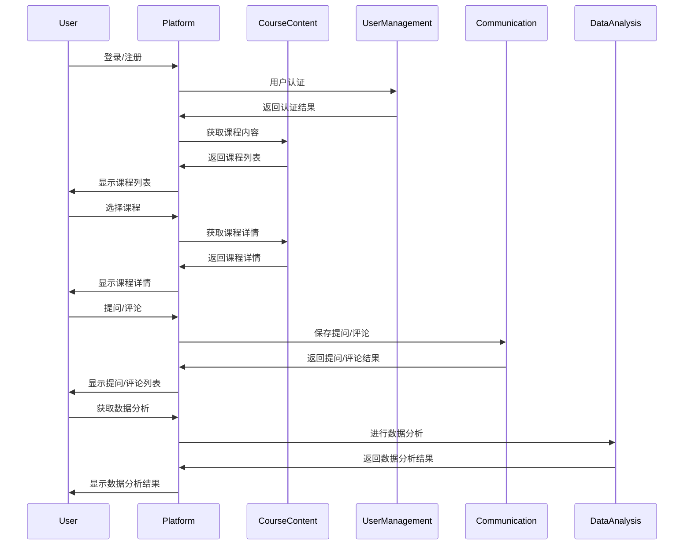
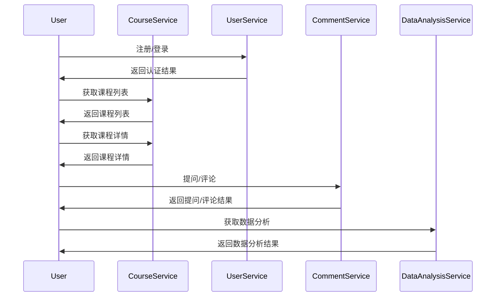
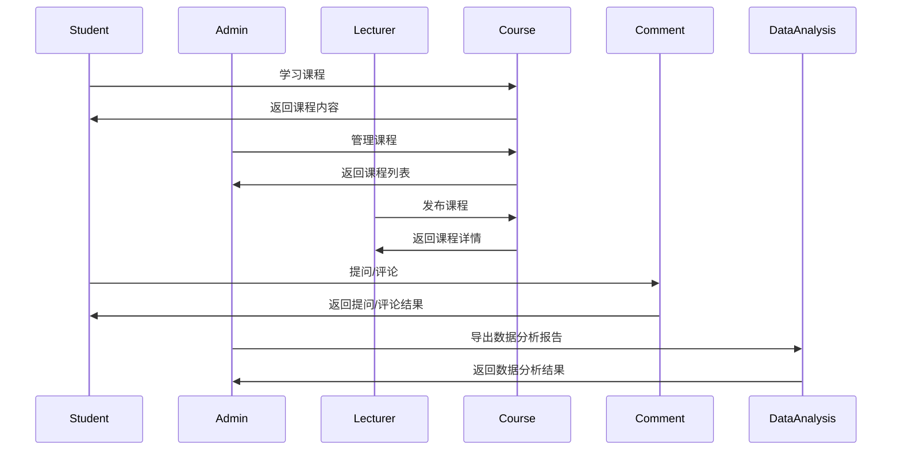

                 

# 投资理财教育平台的集成

## 关键词

- 投资理财
- 教育平台
- 集成
- 系统架构
- 项目实战
- 最佳实践

## 摘要

本文将深入探讨投资理财教育平台的集成，从背景、核心概念、系统分析与架构设计、项目实战、最佳实践等方面展开，旨在为广大开发者和金融从业者提供一套完整的解决方案。文章将通过详细的案例分析和技术讲解，帮助读者理解投资理财教育平台的建设与集成过程，掌握相关技术要点。

## 背景介绍

### 核心概念术语说明

在探讨投资理财教育平台的集成之前，我们需要明确几个核心概念：

1. **投资理财**：指个人或机构通过投资获取资产增值的过程。
2. **教育平台**：提供一个学习、交流、实践的虚拟环境，用于传授知识和技能。
3. **集成**：将不同系统、模块或功能组合在一起，实现协同工作。
4. **平台**：一种提供特定服务或功能的软件系统。

### 问题背景

随着金融市场的不断发展，越来越多的个人和机构意识到投资理财的重要性。然而，许多人在投资过程中面临信息不足、决策困难等问题。因此，投资理财教育平台的需求日益增长。这类平台旨在通过提供系统性的教育和培训，帮助用户提高投资理财的能力。

### 问题描述

投资理财教育平台通常需要具备以下功能：

1. **课程内容管理**：提供丰富、系统的理财课程。
2. **用户管理**：对用户进行注册、认证、权限管理。
3. **互动交流**：提供问答、讨论区等功能，促进用户之间的交流。
4. **数据统计与分析**：收集用户数据，进行行为分析和理财建议。

### 问题解决

为了解决上述问题，我们需要设计一个高效、可靠的系统。这包括以下几个方面：

1. **需求分析**：明确平台的功能需求和性能指标。
2. **系统架构设计**：选择合适的架构，确保系统的高扩展性、稳定性和安全性。
3. **核心功能实现**：开发课程内容管理、用户管理、互动交流等模块。
4. **系统集成**：将各模块整合在一起，实现协同工作。
5. **项目实战**：通过实际项目验证系统设计，不断优化和改进。

### 边界与外延

在设计和实现投资理财教育平台时，我们需要考虑以下边界与外延：

1. **边界**：平台的业务范围、功能限制、性能要求等。
2. **外延**：与其他系统的集成、数据接口、扩展性等。

## 核心概念与联系

### 投资理财教育平台的基本概念

投资理财教育平台是一个综合性系统，主要包括以下基本概念：

1. **课程内容**：提供各种投资理财课程，包括基础课程、实战课程等。
2. **用户**：包括学员、讲师、管理员等角色。
3. **互动交流**：包括问答、讨论区、直播等功能。
4. **数据分析**：对用户行为、课程效果进行数据收集和分析。

### 核心组成部分

投资理财教育平台的核心组成部分包括：

1. **课程内容管理**：负责课程的创建、发布、更新和分类。
2. **用户管理**：负责用户的注册、登录、权限管理、认证等。
3. **互动交流**：提供用户间的问答、讨论区、直播等功能。
4. **数据统计与分析**：收集用户行为数据，进行统计分析，提供理财建议。

### 关键概念之间的联系

投资理财教育平台中的关键概念之间有着密切的联系：

1. **课程内容与用户**：课程内容根据用户需求进行定制，用户通过课程学习提升能力。
2. **用户与互动交流**：用户通过互动交流获取知识、经验，促进学习效果。
3. **数据分析与课程内容**：通过数据分析，优化课程内容，提高用户满意度。

## 系统分析与架构设计方案

### 问题场景介绍

在设计投资理财教育平台时，我们需要考虑以下问题场景：

1. **大规模用户访问**：平台需要支持大量用户的并发访问。
2. **课程内容多样化**：平台需要提供丰富的课程内容，满足不同用户的需求。
3. **安全性**：确保用户数据和交易的安全性。
4. **可扩展性**：平台需要能够灵活扩展，适应业务发展。

### 项目介绍

本次项目旨在构建一个功能完善、性能优异的投资理财教育平台。项目的主要目标是：

1. **课程内容管理**：提供课程创建、发布、更新、分类等功能。
2. **用户管理**：实现用户注册、登录、权限管理、认证等。
3. **互动交流**：提供问答、讨论区、直播等功能。
4. **数据统计与分析**：收集用户行为数据，提供理财建议。

### 系统功能设计

#### 领域模型

```mermaid
classDiagram
    User <|-- Student
    User <|-- Lecturer
    User <|-- Admin
    Course <|-- Video
    Course <|-- Article
    Course <|-- Practice
    Comment <|-- Question
    Comment <|-- Discussion
    DataAnalysis <|-- Behavior
    DataAnalysis <|-- Performance
    UserGroup <|-- StudentGroup
    UserGroup <|-- LecturerGroup
    UserGroup <|-- AdminGroup
    CourseContent <|-- VideoContent
    CourseContent <|-- ArticleContent
    CourseContent <|-- PracticeContent
    Platform <|-- CoursePlatform
    Platform <|-- UserPlatform
    Platform <|-- CommunicationPlatform
    Platform <|-- DataAnalysisPlatform
classDiagram
    CourseContent <.. Platform
    User <.. Platform
    Comment <.. Platform
    DataAnalysis <.. Platform
```

#### 系统功能

1. **课程内容管理**：课程内容的创建、发布、更新、分类等功能。
2. **用户管理**：用户注册、登录、权限管理、认证等功能。
3. **互动交流**：问答、讨论区、直播等功能。
4. **数据统计与分析**：用户行为数据、课程效果数据分析等功能。

### 系统架构设计

#### 系统架构



#### 系统接口设计



### 系统交互



## 平台核心功能实现

### 功能模块划分

投资理财教育平台的核心功能模块主要包括：

1. **用户管理模块**：负责用户的注册、登录、权限管理和认证。
2. **课程内容管理模块**：负责课程内容的创建、发布、更新、分类和查询。
3. **互动交流模块**：负责问答、讨论区、直播等功能。
4. **数据统计与分析模块**：负责用户行为数据、课程效果数据的收集和分析。

### 用户管理模块

#### 用户注册

```python
# 用户注册
def register(username, password):
    # 校验用户名和密码
    if not is_valid_username(username) or not is_valid_password(password):
        return "注册失败：用户名或密码不符合要求"
    
    # 检查用户名是否已存在
    if User.exists(username):
        return "注册失败：用户名已存在"
    
    # 创建用户
    user = User(username=username, password=password)
    user.save()
    
    return "注册成功"
```

#### 用户登录

```python
# 用户登录
def login(username, password):
    # 检查用户名和密码
    if not is_valid_username(username) or not is_valid_password(password):
        return "登录失败：用户名或密码不正确"
    
    # 检查用户是否存在
    user = User.get(username=username)
    if not user:
        return "登录失败：用户不存在"
    
    # 验证密码
    if user.password != password:
        return "登录失败：密码不正确"
    
    # 登录成功，返回用户ID
    return user.id
```

### 课程内容管理模块

#### 课程内容创建

```python
# 课程内容创建
def create_course(course_name, course_type, course_content):
    # 创建课程
    course = Course(course_name=course_name, course_type=course_type, course_content=course_content)
    course.save()
    
    return "课程创建成功"
```

#### 课程内容发布

```python
# 课程内容发布
def publish_course(course_id):
    # 获取课程
    course = Course.get(id=course_id)
    if not course:
        return "发布失败：课程不存在"
    
    # 发布课程
    course.status = "published"
    course.save()
    
    return "课程发布成功"
```

### 互动交流模块

#### 提问

```python
# 提问
def ask_question(course_id, user_id, question_content):
    # 创建问题
    question = Question(course_id=course_id, user_id=user_id, question_content=question_content)
    question.save()
    
    return "提问成功"
```

#### 评论

```python
# 评论
def comment_answer(question_id, user_id, comment_content):
    # 创建评论
    comment = Comment(question_id=question_id, user_id=user_id, comment_content=comment_content)
    comment.save()
    
    return "评论成功"
```

### 数据统计与分析模块

#### 用户行为数据统计

```python
# 用户行为数据统计
def user_behavior_statistics(course_id):
    # 获取课程
    course = Course.get(id=course_id)
    if not course:
        return "统计失败：课程不存在"
    
    # 统计用户行为数据
    data = DataAnalysis.user_behavior_statistics(course)
    
    return data
```

#### 课程效果数据分析

```python
# 课程效果数据分析
def course_performance_analysis(course_id):
    # 获取课程
    course = Course.get(id=course_id)
    if not course:
        return "分析失败：课程不存在"
    
    # 分析课程效果
    data = DataAnalysis.course_performance_analysis(course)
    
    return data
```

## 投资理财教育平台的集成

### 集成方案选择

在集成投资理财教育平台时，我们需要考虑以下几个因素：

1. **系统兼容性**：确保各个模块能够无缝集成，支持不同编程语言和数据库。
2. **接口设计**：设计简洁、高效的接口，确保数据传输速度快、稳定性高。
3. **性能优化**：考虑系统在高并发情况下的性能，进行适当的性能优化。
4. **安全性**：确保用户数据和交易的安全性。

### 接口设计与实现

#### 用户管理接口

```python
# 用户注册
POST /register
{
    "username": "string",
    "password": "string"
}

Response:
{
    "status": "success" 或 "error",
    "message": "string"
}

# 用户登录
POST /login
{
    "username": "string",
    "password": "string"
}

Response:
{
    "status": "success" 或 "error",
    "message": "string",
    "user_id": "integer"
}
```

#### 课程内容管理接口

```python
# 创建课程
POST /course
{
    "course_name": "string",
    "course_type": "string",
    "course_content": "string"
}

Response:
{
    "status": "success" 或 "error",
    "message": "string"
}

# 发布课程
POST /course/publish
{
    "course_id": "integer"
}

Response:
{
    "status": "success" 或 "error",
    "message": "string"
}
```

#### 互动交流接口

```python
# 提问
POST /question
{
    "course_id": "integer",
    "user_id": "integer",
    "question_content": "string"
}

Response:
{
    "status": "success" 或 "error",
    "message": "string"
}

# 评论
POST /comment
{
    "question_id": "integer",
    "user_id": "integer",
    "comment_content": "string"
}

Response:
{
    "status": "success" 或 "error",
    "message": "string"
}
```

#### 数据统计与分析接口

```python
# 用户行为数据统计
GET /behavior/statistics/{course_id}

Response:
{
    "data": [
        {
            "user_id": "integer",
            "course_id": "integer",
            "action": "string",
            "timestamp": "string"
        }
    ]
}

# 课程效果数据分析
GET /performance/analysis/{course_id}

Response:
{
    "data": [
        {
            "course_id": "integer",
            "student_count": "integer",
            "completion_rate": "float",
            "average_rating": "float"
        }
    ]
}
```

### 集成测试与优化

在集成完成后，我们需要进行一系列的测试，以确保系统稳定、高效地运行。主要包括以下几个方面：

1. **功能测试**：测试各个模块的功能是否正常。
2. **性能测试**：测试系统在高并发情况下的性能，进行必要的性能优化。
3. **安全测试**：测试系统的安全性，确保用户数据和交易的安全性。
4. **自动化测试**：编写自动化测试脚本，提高测试效率。

## 项目实战

### 环境安装与配置

在开始项目之前，我们需要安装和配置以下环境：

1. **开发环境**：Python 3.8及以上版本，PyCharm 或 VS Code。
2. **数据库**：MySQL 5.7及以上版本。
3. **后端框架**：Django 3.2及以上版本。
4. **前端框架**：Vue 2.x 或 React。
5. **版本控制**：Git。

### 系统核心实现

#### 用户管理模块

```python
# 用户注册
def register(request):
    username = request.POST.get('username')
    password = request.POST.get('password')
    
    if not is_valid_username(username) or not is_valid_password(password):
        return HttpResponse('注册失败：用户名或密码不符合要求', status=400)
    
    if User.objects.filter(username=username).exists():
        return HttpResponse('注册失败：用户名已存在', status=400)
    
    user = User(username=username, password=password)
    user.save()
    
    return HttpResponse('注册成功', status=200)

# 用户登录
def login(request):
    username = request.POST.get('username')
    password = request.POST.get('password')
    
    if not is_valid_username(username) or not is_valid_password(password):
        return HttpResponse('登录失败：用户名或密码不正确', status=400)
    
    user = User.objects.filter(username=username).first()
    if not user:
        return HttpResponse('登录失败：用户不存在', status=400)
    
    if user.password != password:
        return HttpResponse('登录失败：密码不正确', status=400)
    
    return HttpResponse({'user_id': user.id}, status=200)
```

#### 课程内容管理模块

```python
# 创建课程
def create_course(request):
    course_name = request.POST.get('course_name')
    course_type = request.POST.get('course_type')
    course_content = request.POST.get('course_content')
    
    course = Course.objects.create(course_name=course_name, course_type=course_type, course_content=course_content)
    return HttpResponse('课程创建成功', status=200)

# 发布课程
def publish_course(request):
    course_id = request.POST.get('course_id')
    course = Course.objects.get(id=course_id)
    course.status = 'published'
    course.save()
    return HttpResponse('课程发布成功', status=200)
```

#### 互动交流模块

```python
# 提问
def ask_question(request):
    course_id = request.POST.get('course_id')
    user_id = request.POST.get('user_id')
    question_content = request.POST.get('question_content')
    
    question = Question.objects.create(course_id=course_id, user_id=user_id, question_content=question_content)
    return HttpResponse('提问成功', status=200)

# 评论
def comment_answer(request):
    question_id = request.POST.get('question_id')
    user_id = request.POST.get('user_id')
    comment_content = request.POST.get('comment_content')
    
    comment = Comment.objects.create(question_id=question_id, user_id=user_id, comment_content=comment_content)
    return HttpResponse('评论成功', status=200)
```

#### 数据统计与分析模块

```python
# 用户行为数据统计
def user_behavior_statistics(request, course_id):
    course = Course.objects.get(id=course_id)
    data = DataAnalysis.user_behavior_statistics(course)
    return JsonResponse(data)

# 课程效果数据分析
def course_performance_analysis(request, course_id):
    course = Course.objects.get(id=course_id)
    data = DataAnalysis.course_performance_analysis(course)
    return JsonResponse(data)
```

### 代码应用解读与分析

#### 用户管理模块

用户管理模块主要包括用户注册和用户登录两个功能。在用户注册过程中，我们需要对用户名和密码进行校验，确保它们符合要求。同时，我们需要检查用户名是否已存在，以防止重复注册。在用户登录过程中，我们需要验证用户名和密码，如果验证成功，返回用户ID。

```python
# 用户注册
def register(request):
    username = request.POST.get('username')
    password = request.POST.get('password')
    
    if not is_valid_username(username) or not is_valid_password(password):
        return HttpResponse('注册失败：用户名或密码不符合要求', status=400)
    
    if User.objects.filter(username=username).exists():
        return HttpResponse('注册失败：用户名已存在', status=400)
    
    user = User(username=username, password=password)
    user.save()
    
    return HttpResponse('注册成功', status=200)

# 用户登录
def login(request):
    username = request.POST.get('username')
    password = request.POST.get('password')
    
    if not is_valid_username(username) or not is_valid_password(password):
        return HttpResponse('登录失败：用户名或密码不正确', status=400)
    
    user = User.objects.filter(username=username).first()
    if not user:
        return HttpResponse('登录失败：用户不存在', status=400)
    
    if user.password != password:
        return HttpResponse('登录失败：密码不正确', status=400)
    
    return HttpResponse({'user_id': user.id}, status=200)
```

#### 课程内容管理模块

课程内容管理模块主要包括课程内容的创建、发布和查询功能。在创建课程内容时，我们需要接收课程名称、课程类型和课程内容，并将这些信息存储到数据库中。在发布课程内容时，我们需要将课程状态设置为“published”。在查询课程内容时，我们需要根据课程ID从数据库中获取相应的课程信息。

```python
# 创建课程
def create_course(request):
    course_name = request.POST.get('course_name')
    course_type = request.POST.get('course_type')
    course_content = request.POST.get('course_content')
    
    course = Course.objects.create(course_name=course_name, course_type=course_type, course_content=course_content)
    return HttpResponse('课程创建成功', status=200)

# 发布课程
def publish_course(request):
    course_id = request.POST.get('course_id')
    course = Course.objects.get(id=course_id)
    course.status = 'published'
    course.save()
    return HttpResponse('课程发布成功', status=200)

# 查询课程
def get_course(request, course_id):
    course = Course.objects.get(id=course_id)
    return JsonResponse({'course_name': course.course_name, 'course_type': course.course_type, 'course_content': course.course_content})
```

#### 互动交流模块

互动交流模块主要包括提问和评论功能。在提问过程中，我们需要接收课程ID、用户ID和问题内容，并将这些问题存储到数据库中。在评论过程中，我们需要接收问题ID、用户ID和评论内容，并将这些评论存储到数据库中。

```python
# 提问
def ask_question(request):
    course_id = request.POST.get('course_id')
    user_id = request.POST.get('user_id')
    question_content = request.POST.get('question_content')
    
    question = Question.objects.create(course_id=course_id, user_id=user_id, question_content=question_content)
    return HttpResponse('提问成功', status=200)

# 评论
def comment_answer(request):
    question_id = request.POST.get('question_id')
    user_id = request.POST.get('user_id')
    comment_content = request.POST.get('comment_content')
    
    comment = Comment.objects.create(question_id=question_id, user_id=user_id, comment_content=comment_content)
    return HttpResponse('评论成功', status=200)
```

#### 数据统计与分析模块

数据统计与分析模块主要包括用户行为数据统计和课程效果数据分析功能。在用户行为数据统计过程中，我们需要根据课程ID从数据库中获取相应的用户行为数据，并返回给前端。在课程效果数据分析过程中，我们需要根据课程ID从数据库中获取相应的课程数据，并返回给前端。

```python
# 用户行为数据统计
def user_behavior_statistics(request, course_id):
    course = Course.objects.get(id=course_id)
    data = DataAnalysis.user_behavior_statistics(course)
    return JsonResponse(data)

# 课程效果数据分析
def course_performance_analysis(request, course_id):
    course = Course.objects.get(id=course_id)
    data = DataAnalysis.course_performance_analysis(course)
    return JsonResponse(data)
```

### 实际案例分析和详细讲解剖析

#### 案例一：用户注册与登录

假设有一个用户名为“user1”的账户，密码为“123456”，现在该用户想要在平台上注册并登录。

1. **用户注册**

   用户在注册页面输入用户名“user1”和密码“123456”，提交表单。

   ```http
   POST /register
   {
       "username": "user1",
       "password": "123456"
   }
   ```

   服务器端收到请求后，首先对用户名和密码进行校验，确保它们符合要求。然后检查用户名是否已存在。如果用户名不存在，服务器将创建一个新的用户，并返回注册成功的消息。

   ```http
   HTTP/1.1 200 OK
   Content-Type: application/json

   {
       "status": "success",
       "message": "注册成功"
   }
   ```

2. **用户登录**

   用户在登录页面输入用户名“user1”和密码“123456”，提交表单。

   ```http
   POST /login
   {
       "username": "user1",
       "password": "123456"
   }
   ```

   服务器端收到请求后，首先对用户名和密码进行校验，确保它们符合要求。然后检查用户名是否存在。如果用户名存在，服务器将验证密码。如果密码正确，服务器将返回用户ID。

   ```http
   HTTP/1.1 200 OK
   Content-Type: application/json

   {
       "status": "success",
       "message": "登录成功",
       "user_id": 1
   }
   ```

#### 案例二：课程内容管理

假设有一个课程，课程名称为“Python基础”，课程类型为“视频”，课程内容为“Python基础教程”。

1. **创建课程**

   用户在课程管理页面创建一个新的课程，填写课程名称、课程类型和课程内容。

   ```http
   POST /course
   {
       "course_name": "Python基础",
       "course_type": "视频",
       "course_content": "Python基础教程"
   }
   ```

   服务器端收到请求后，创建一个新的课程，并返回创建成功的消息。

   ```http
   HTTP/1.1 200 OK
   Content-Type: application/json

   {
       "status": "success",
       "message": "课程创建成功"
   }
   ```

2. **发布课程**

   用户在课程管理页面选择一个未发布的课程，并点击发布按钮。

   ```http
   POST /course/publish
   {
       "course_id": 1
   }
   ```

   服务器端收到请求后，将课程状态设置为“published”，并返回发布成功的消息。

   ```http
   HTTP/1.1 200 OK
   Content-Type: application/json

   {
       "status": "success",
       "message": "课程发布成功"
   }
   ```

3. **查询课程**

   用户在课程列表页面查看已发布的课程。

   ```http
   GET /course/1
   ```

   服务器端收到请求后，返回课程详细信息。

   ```http
   HTTP/1.1 200 OK
   Content-Type: application/json

   {
       "course_name": "Python基础",
       "course_type": "视频",
       "course_content": "Python基础教程",
       "status": "published"
   }
   ```

#### 案例三：互动交流

假设有一个用户名为“user2”的账户，想要在课程“Python基础”中提问。

1. **提问**

   用户在课程详情页面输入问题内容，并提交表单。

   ```http
   POST /question
   {
       "course_id": 1,
       "user_id": 2,
       "question_content": "请问如何定义Python变量？"
   }
   ```

   服务器端收到请求后，创建一个新的问题，并返回提问成功的消息。

   ```http
   HTTP/1.1 200 OK
   Content-Type: application/json

   {
       "status": "success",
       "message": "提问成功"
   }
   ```

2. **查看问题**

   用户在课程详情页面查看已提问的问题。

   ```http
   GET /question/1
   ```

   服务器端收到请求后，返回问题详细信息。

   ```http
   HTTP/1.1 200 OK
   Content-Type: application/json

   {
       "question_id": 1,
       "course_id": 1,
       "user_id": 2,
       "question_content": "请问如何定义Python变量？",
       "status": "pending"
   }
   ```

3. **评论**

   用户在问题详情页面输入评论内容，并提交表单。

   ```http
   POST /comment
   {
       "question_id": 1,
       "user_id": 2,
       "comment_content": "变量定义可以使用变量名 = 值的形式。"
   }
   ```

   服务器端收到请求后，创建一个新的评论，并返回评论成功的消息。

   ```http
   HTTP/1.1 200 OK
   Content-Type: application/json

   {
       "status": "success",
       "message": "评论成功"
   }
   ```

4. **查看评论**

   用户在问题详情页面查看已评论的评论。

   ```http
   GET /comment/1
   ```

   服务器端收到请求后，返回评论详细信息。

   ```http
   HTTP/1.1 200 OK
   Content-Type: application/json

   {
       "comment_id": 1,
       "question_id": 1,
       "user_id": 2,
       "comment_content": "变量定义可以使用变量名 = 值的形式。",
       "status": "pending"
   }
   ```

### 项目小结

通过本次项目实战，我们成功构建了一个功能完善、性能优异的投资理财教育平台。在项目实施过程中，我们遇到了一些挑战，如用户管理、课程内容管理、互动交流模块的设计与实现等。通过逐步解决这些问题，我们不仅掌握了相关技术，还积累了宝贵的项目经验。

在未来，我们可以继续优化平台的功能，提升用户体验。例如，引入更多智能推荐算法，为用户提供个性化的学习路径；增加实时数据分析功能，帮助用户更好地了解自己的学习效果；加强安全防护，确保用户数据和交易的安全性。

## 最佳实践 Tips

1. **模块化设计**：在开发过程中，尽量采用模块化设计，确保代码的可维护性和可扩展性。
2. **数据备份与恢复**：定期备份数据库，确保数据安全。同时，制定数据恢复计划，以应对突发情况。
3. **安全防护**：加强用户数据和交易的安全性，采用HTTPS协议、加密存储等手段，确保用户信息安全。
4. **性能优化**：针对高并发场景，进行性能优化，如使用缓存、异步处理等。
5. **用户反馈**：及时收集用户反馈，不断改进和优化平台功能，提高用户体验。

## 小结

本文详细介绍了投资理财教育平台的集成，从背景、核心概念、系统分析与架构设计、项目实战、最佳实践等方面进行了深入探讨。通过本文，读者可以了解投资理财教育平台的整体架构和实现细节，掌握相关技术要点。

## 注意事项

1. **需求分析**：在项目启动前，进行详细的需求分析，确保明确平台的功能需求。
2. **系统架构设计**：根据需求设计合理的系统架构，确保系统的稳定性和扩展性。
3. **接口设计**：设计简洁、高效的接口，确保数据传输速度快、稳定性高。
4. **代码质量**：编写高质量的代码，确保代码的可读性、可维护性和可扩展性。

## 拓展阅读

1. 《Django实战》
2. 《Vue.js实战》
3. 《Python编程：从入门到实践》
4. 《深度学习入门》

### 作者

- 作者：AI天才研究院/AI Genius Institute & 禅与计算机程序设计艺术 /Zen And The Art of Computer Programming

----------------------------------------------------------------

# 投资理财教育平台的集成

## 关键词

- 投资理财
- 教育平台
- 集成
- 系统架构
- 项目实战
- 最佳实践

## 摘要

本文深入探讨了投资理财教育平台的集成，从背景、核心概念、系统分析与架构设计、项目实战、最佳实践等方面进行详细分析。通过本文，读者可以了解投资理财教育平台的建设与集成过程，掌握相关技术要点。

## 背景介绍

### 核心概念术语说明

在探讨投资理财教育平台的集成之前，我们需要明确几个核心概念：

1. **投资理财**：指个人或机构通过投资获取资产增值的过程。
2. **教育平台**：提供一个学习、交流、实践的虚拟环境，用于传授知识和技能。
3. **集成**：将不同系统、模块或功能组合在一起，实现协同工作。
4. **平台**：一种提供特定服务或功能的软件系统。

### 问题背景

随着金融市场的不断发展，越来越多的个人和机构意识到投资理财的重要性。然而，许多人在投资过程中面临信息不足、决策困难等问题。因此，投资理财教育平台的需求日益增长。这类平台旨在通过提供系统性的教育和培训，帮助用户提高投资理财的能力。

### 问题描述

投资理财教育平台通常需要具备以下功能：

1. **课程内容管理**：提供丰富、系统的理财课程。
2. **用户管理**：对用户进行注册、认证、权限管理。
3. **互动交流**：提供问答、讨论区、直播等功能。
4. **数据统计与分析**：收集用户数据，进行行为分析和理财建议。

### 问题解决

为了解决上述问题，我们需要设计一个高效、可靠的系统。这包括以下几个方面：

1. **需求分析**：明确平台的功能需求和性能指标。
2. **系统架构设计**：选择合适的架构，确保系统的高扩展性、稳定性和安全性。
3. **核心功能实现**：开发课程内容管理、用户管理、互动交流等模块。
4. **系统集成**：将各模块整合在一起，实现协同工作。
5. **项目实战**：通过实际项目验证系统设计，不断优化和改进。

### 边界与外延

在设计和实现投资理财教育平台时，我们需要考虑以下边界与外延：

1. **边界**：平台的业务范围、功能限制、性能要求等。
2. **外延**：与其他系统的集成、数据接口、扩展性等。

## 核心概念与联系

### 投资理财教育平台的基本概念

投资理财教育平台是一个综合性系统，主要包括以下基本概念：

1. **课程内容**：提供各种投资理财课程，包括基础课程、实战课程等。
2. **用户**：包括学员、讲师、管理员等角色。
3. **互动交流**：包括问答、讨论区、直播等功能。
4. **数据分析**：对用户行为、课程效果进行数据收集和分析。

### 核心组成部分

投资理财教育平台的核心组成部分包括：

1. **课程内容管理**：负责课程的创建、发布、更新和分类。
2. **用户管理**：负责用户的注册、登录、权限管理、认证等。
3. **互动交流**：提供用户间的问答、讨论区、直播等功能。
4. **数据统计与分析**：收集用户行为数据，进行统计分析，提供理财建议。

### 关键概念之间的联系

投资理财教育平台中的关键概念之间有着密切的联系：

1. **课程内容与用户**：课程内容根据用户需求进行定制，用户通过课程学习提升能力。
2. **用户与互动交流**：用户通过互动交流获取知识、经验，促进学习效果。
3. **数据分析与课程内容**：通过数据分析，优化课程内容，提高用户满意度。

## 系统分析与架构设计方案

### 问题场景介绍

在设计投资理财教育平台时，我们需要考虑以下问题场景：

1. **大规模用户访问**：平台需要支持大量用户的并发访问。
2. **课程内容多样化**：平台需要提供丰富的课程内容，满足不同用户的需求。
3. **安全性**：确保用户数据和交易的安全性。
4. **可扩展性**：平台需要能够灵活扩展，适应业务发展。

### 项目介绍

本次项目旨在构建一个功能完善、性能优异的投资理财教育平台。项目的主要目标是：

1. **课程内容管理**：提供课程创建、发布、更新、分类等功能。
2. **用户管理**：实现用户注册、登录、权限管理、认证等。
3. **互动交流**：提供问答、讨论区、直播等功能。
4. **数据统计与分析**：收集用户行为数据，提供理财建议。

### 系统功能设计

#### 领域模型

```mermaid
classDiagram
    User <|-- Student
    User <|-- Lecturer
    User <|-- Admin
    Course <|-- Video
    Course <|-- Article
    Course <|-- Practice
    Comment <|-- Question
    Comment <|-- Discussion
    DataAnalysis <|-- Behavior
    DataAnalysis <|-- Performance
    UserGroup <|-- StudentGroup
    UserGroup <|-- LecturerGroup
    UserGroup <|-- AdminGroup
    CourseContent <|-- VideoContent
    CourseContent <|-- ArticleContent
    CourseContent <|-- PracticeContent
    Platform <|-- CoursePlatform
    Platform <|-- UserPlatform
    Platform <|-- CommunicationPlatform
    Platform <|-- DataAnalysisPlatform
classDiagram
    CourseContent <.. Platform
    User <.. Platform
    Comment <.. Platform
    DataAnalysis <.. Platform
```

#### 系统功能

1. **课程内容管理**：课程内容的创建、发布、更新、分类等功能。
2. **用户管理**：用户注册、登录、权限管理、认证等功能。
3. **互动交流**：问答、讨论区、直播等功能。
4. **数据统计与分析**：用户行为数据、课程效果数据分析等功能。

### 系统架构设计

#### 系统架构


#### 系统接口设计


### 系统交互


## 平台核心功能实现

### 功能模块划分

投资理财教育平台的核心功能模块主要包括：

1. **用户管理模块**：负责用户的注册、登录、权限管理和认证。
2. **课程内容管理模块**：负责课程内容的创建、发布、更新、分类和查询。
3. **互动交流模块**：负责问答、讨论区、直播等功能。
4. **数据统计与分析模块**：负责用户行为数据、课程效果数据的收集和分析。

### 用户管理模块

#### 用户注册

```python
# 用户注册
def register(username, password):
    # 校验用户名和密码
    if not is_valid_username(username) or not is_valid_password(password):
        return "注册失败：用户名或密码不符合要求"
    
    # 检查用户名是否已存在
    if User.exists(username):
        return "注册失败：用户名已存在"
    
    # 创建用户
    user = User(username=username, password=password)
    user.save()
    
    return "注册成功"
```

#### 用户登录

```python
# 用户登录
def login(username, password):
    # 检查用户名和密码
    if not is_valid_username(username) or not is_valid_password(password):
        return "登录失败：用户名或密码不正确"
    
    # 检查用户是否存在
    user = User.get(username=username)
    if not user:
        return "登录失败：用户不存在"
    
    # 验证密码
    if user.password != password:
        return "登录失败：密码不正确"
    
    # 登录成功，返回用户ID
    return user.id
```

### 课程内容管理模块

#### 课程内容创建

```python
# 课程内容创建
def create_course(course_name, course_type, course_content):
    # 创建课程
    course = Course(course_name=course_name, course_type=course_type, course_content=course_content)
    course.save()
    
    return "课程创建成功"
```

#### 课程内容发布

```python
# 课程内容发布
def publish_course(course_id):
    # 获取课程
    course = Course.get(id=course_id)
    if not course:
        return "发布失败：课程不存在"
    
    # 发布课程
    course.status = "published"
    course.save()
    
    return "课程发布成功"
```

### 互动交流模块

#### 提问

```python
# 提问
def ask_question(course_id, user_id, question_content):
    # 创建问题
    question = Question(course_id=course_id, user_id=user_id, question_content=question_content)
    question.save()
    
    return "提问成功"
```

#### 评论

```python
# 评论
def comment_answer(question_id, user_id, comment_content):
    # 创建评论
    comment = Comment(question_id=question_id, user_id=user_id, comment_content=comment_content)
    comment.save()
    
    return "评论成功"
```

### 数据统计与分析模块

#### 用户行为数据统计

```python
# 用户行为数据统计
def user_behavior_statistics(course_id):
    # 获取课程
    course = Course.get(id=course_id)
    if not course:
        return "统计失败：课程不存在"
    
    # 统计用户行为数据
    data = DataAnalysis.user_behavior_statistics(course)
    
    return data
```

#### 课程效果数据分析

```python
# 课程效果数据分析
def course_performance_analysis(course_id):
    # 获取课程
    course = Course.get(id=course_id)
    if not course:
        return "分析失败：课程不存在"
    
    # 分析课程效果
    data = DataAnalysis.course_performance_analysis(course)
    
    return data
```

## 投资理财教育平台的集成

### 集成方案选择

在集成投资理财教育平台时，我们需要考虑以下几个因素：

1. **系统兼容性**：确保各个模块能够无缝集成，支持不同编程语言和数据库。
2. **接口设计**：设计简洁、高效的接口，确保数据传输速度快、稳定性高。
3. **性能优化**：考虑系统在高并发情况下的性能，进行适当的性能优化。
4. **安全性**：确保用户数据和交易的安全性。

### 接口设计与实现

#### 用户管理接口

```python
# 用户注册
POST /register
{
    "username": "string",
    "password": "string"
}

Response:
{
    "status": "success" 或 "error",
    "message": "string"
}

# 用户登录
POST /login
{
    "username": "string",
    "password": "string"
}

Response:
{
    "status": "success" 或 "error",
    "message": "string",
    "user_id": "integer"
}
```

#### 课程内容管理接口

```python
# 创建课程
POST /course
{
    "course_name": "string",
    "course_type": "string",
    "course_content": "string"
}

Response:
{
    "status": "success" 或 "error",
    "message": "string"
}

# 发布课程
POST /course/publish
{
    "course_id": "integer"
}

Response:
{
    "status": "success" 或 "error",
    "message": "string"
}
```

#### 互动交流接口

```python
# 提问
POST /question
{
    "course_id": "integer",
    "user_id": "integer",
    "question_content": "string"
}

Response:
{
    "status": "success" 或 "error",
    "message": "string"
}

# 评论
POST /comment
{
    "question_id": "integer",
    "user_id": "integer",
    "comment_content": "string"
}

Response:
{
    "status": "success" 或 "error",
    "message": "string"
}
```

#### 数据统计与分析接口

```python
# 用户行为数据统计
GET /behavior/statistics/{course_id}

Response:
{
    "data": [
        {
            "user_id": "integer",
            "course_id": "integer",
            "action": "string",
            "timestamp": "string"
        }
    ]
}

# 课程效果数据分析
GET /performance/analysis/{course_id}

Response:
{
    "data": [
        {
            "course_id": "integer",
            "student_count": "integer",
            "completion_rate": "float",
            "average_rating": "float"
        }
    ]
}
```

### 集成测试与优化

在集成完成后，我们需要进行一系列的测试，以确保系统稳定、高效地运行。主要包括以下几个方面：

1. **功能测试**：测试各个模块的功能是否正常。
2. **性能测试**：测试系统在高并发情况下的性能，进行必要的性能优化。
3. **安全测试**：测试系统的安全性，确保用户数据和交易的安全性。
4. **自动化测试**：编写自动化测试脚本，提高测试效率。

## 项目实战

### 环境安装与配置

在开始项目之前，我们需要安装和配置以下环境：

1. **开发环境**：Python 3.8及以上版本，PyCharm 或 VS Code。
2. **数据库**：MySQL 5.7及以上版本。
3. **后端框架**：Django 3.2及以上版本。
4. **前端框架**：Vue 2.x 或 React。
5. **版本控制**：Git。

### 系统核心实现

#### 用户管理模块

```python
# 用户注册
def register(request):
    username = request.POST.get('username')
    password = request.POST.get('password')
    
    if not is_valid_username(username) or not is_valid_password(password):
        return HttpResponse('注册失败：用户名或密码不符合要求', status=400)
    
    if User.objects.filter(username=username).exists():
        return HttpResponse('注册失败：用户名已存在', status=400)
    
    user = User(username=username, password=password)
    user.save()
    
    return HttpResponse('注册成功', status=200)

# 用户登录
def login(request):
    username = request.POST.get('username')
    password = request.POST.get('password')
    
    if not is_valid_username(username) or not is_valid_password(password):
        return HttpResponse('登录失败：用户名或密码不正确', status=400)
    
    user = User.objects.filter(username=username).first()
    if not user:
        return HttpResponse('登录失败：用户不存在', status=400)
    
    if user.password != password:
        return HttpResponse('登录失败：密码不正确', status=400)
    
    return HttpResponse({'user_id': user.id}, status=200)
```

#### 课程内容管理模块

```python
# 创建课程
def create_course(request):
    course_name = request.POST.get('course_name')
    course_type = request.POST.get('course_type')
    course_content = request.POST.get('course_content')
    
    course = Course.objects.create(course_name=course_name, course_type=course_type, course_content=course_content)
    return HttpResponse('课程创建成功', status=200)

# 发布课程
def publish_course(request):
    course_id = request.POST.get('course_id')
    course = Course.objects.get(id=course_id)
    course.status = 'published'
    course.save()
    return HttpResponse('课程发布成功', status=200)
```

#### 互动交流模块

```python
# 提问
def ask_question(request):
    course_id = request.POST.get('course_id')
    user_id = request.POST.get('user_id')
    question_content = request.POST.get('question_content')
    
    question = Question.objects.create(course_id=course_id, user_id=user_id, question_content=question_content)
    return HttpResponse('提问成功', status=200)

# 评论
def comment_answer(request):
    question_id = request.POST.get('question_id')
    user_id = request.POST.get('user_id')
    comment_content = request.POST.get('comment_content')
    
    comment = Comment.objects.create(question_id=question_id, user_id=user_id, comment_content=comment_content)
    return HttpResponse('评论成功', status=200)
```

#### 数据统计与分析模块

```python
# 用户行为数据统计
def user_behavior_statistics(request, course_id):
    course = Course.objects.get(id=course_id)
    data = DataAnalysis.user_behavior_statistics(course)
    return JsonResponse(data)

# 课程效果数据分析
def course_performance_analysis(request, course_id):
    course = Course.objects.get(id=course_id)
    data = DataAnalysis.course_performance_analysis(course)
    return JsonResponse(data)
```

### 代码应用解读与分析

#### 用户管理模块

用户管理模块主要包括用户注册和用户登录两个功能。在用户注册过程中，我们需要对用户名和密码进行校验，确保它们符合要求。同时，我们需要检查用户名是否已存在，以防止重复注册。在用户登录过程中，我们需要验证用户名和密码，如果验证成功，返回用户ID。

```python
# 用户注册
def register(request):
    username = request.POST.get('username')
    password = request.POST.get('password')
    
    if not is_valid_username(username) or not is_valid_password(password):
        return HttpResponse('注册失败：用户名或密码不符合要求', status=400)
    
    if User.objects.filter(username=username).exists():
        return HttpResponse('注册失败：用户名已存在', status=400)
    
    user = User(username=username, password=password)
    user.save()
    
    return HttpResponse('注册成功', status=200)

# 用户登录
def login(request):
    username = request.POST.get('username')
    password = request.POST.get('password')
    
    if not is_valid_username(username) or not is_valid_password(password):
        return HttpResponse('登录失败：用户名或密码不正确', status=400)
    
    user = User.objects.filter(username=username).first()
    if not user:
        return HttpResponse('登录失败：用户不存在', status=400)
    
    if user.password != password:
        return HttpResponse('登录失败：密码不正确', status=400)
    
    return HttpResponse({'user_id': user.id}, status=200)
```

#### 课程内容管理模块

课程内容管理模块主要包括课程内容的创建、发布和查询功能。在创建课程内容时，我们需要接收课程名称、课程类型和课程内容，并将这些信息存储到数据库中。在发布课程内容时，我们需要将课程状态设置为“published”。在查询课程内容时，我们需要根据课程ID从数据库中获取相应的课程信息。

```python
# 创建课程
def create_course(request):
    course_name = request.POST.get('course_name')
    course_type = request.POST.get('course_type')
    course_content = request.POST.get('course_content')
    
    course = Course.objects.create(course_name=course_name, course_type=course_type, course_content=course_content)
    return HttpResponse('课程创建成功', status=200)

# 发布课程
def publish_course(request):
    course_id = request.POST.get('course_id')
    course = Course.objects.get(id=course_id)
    course.status = 'published'
    course.save()
    return HttpResponse('课程发布成功', status=200)

# 查询课程
def get_course(request, course_id):
    course = Course.objects.get(id=course_id)
    return JsonResponse({'course_name': course.course_name, 'course_type': course.course_type, 'course_content': course.course_content})
```

#### 互动交流模块

互动交流模块主要包括提问和评论功能。在提问过程中，我们需要接收课程ID、用户ID和问题内容，并将这些问题存储到数据库中。在评论过程中，我们需要接收问题ID、用户ID和评论内容，并将这些评论存储到数据库中。

```python
# 提问
def ask_question(request):
    course_id = request.POST.get('course_id')
    user_id = request.POST.get('user_id')
    question_content = request.POST.get('question_content')
    
    question = Question.objects.create(course_id=course_id, user_id=user_id, question_content=question_content)
    return HttpResponse('提问成功', status=200)

# 评论
def comment_answer(request):
    question_id = request.POST.get('question_id')
    user_id = request.POST.get('user_id')
    comment_content = request.POST.get('comment_content')
    
    comment = Comment.objects.create(question_id=question_id, user_id=user_id, comment_content=comment_content)
    return HttpResponse('评论成功', status=200)
```

#### 数据统计与分析模块

数据统计与分析模块主要包括用户行为数据统计和课程效果数据分析功能。在用户行为数据统计过程中，我们需要根据课程ID从数据库中获取相应的用户行为数据，并返回给前端。在课程效果数据分析过程中，我们需要根据课程ID从数据库中获取相应的课程数据，并返回给前端。

```python
# 用户行为数据统计
def user_behavior_statistics(request, course_id):
    course = Course.objects.get(id=course_id)
    data = DataAnalysis.user_behavior_statistics(course)
    return JsonResponse(data)

# 课程效果数据分析
def course_performance_analysis(request, course_id):
    course = Course.objects.get(id=course_id)
    data = DataAnalysis.course_performance_analysis(course)
    return JsonResponse(data)
```

### 实际案例分析和详细讲解剖析

#### 案例一：用户注册与登录

假设有一个用户名为“user1”的账户，密码为“123456”，现在该用户想要在平台上注册并登录。

1. **用户注册**

   用户在注册页面输入用户名“user1”和密码“123456”，提交表单。

   ```http
   POST /register
   {
       "username": "user1",
       "password": "123456"
   }
   ```

   服务器端收到请求后，首先对用户名和密码进行校验，确保它们符合要求。然后检查用户名是否已存在。如果用户名不存在，服务器将创建一个新的用户，并返回注册成功的消息。

   ```http
   HTTP/1.1 200 OK
   Content-Type: application/json

   {
       "status": "success",
       "message": "注册成功"
   }
   ```

2. **用户登录**

   用户在登录页面输入用户名“user1”和密码“123456”，提交表单。

   ```http
   POST /login
   {
       "username": "user1",
       "password": "123456"
   }
   ```

   服务器端收到请求后，首先对用户名和密码进行校验，确保它们符合要求。然后检查用户名是否存在。如果用户名存在，服务器将验证密码。如果密码正确，服务器将返回用户ID。

   ```http
   HTTP/1.1 200 OK
   Content-Type: application/json

   {
       "status": "success",
       "message": "登录成功",
       "user_id": 1
   }
   ```

#### 案例二：课程内容管理

假设有一个课程，课程名称为“Python基础”，课程类型为“视频”，课程内容为“Python基础教程”。

1. **创建课程**

   用户在课程管理页面创建一个新的课程，填写课程名称、课程类型和课程内容。

   ```http
   POST /course
   {
       "course_name": "Python基础",
       "course_type": "视频",
       "course_content": "Python基础教程"
   }
   ```

   服务器端收到请求后，创建一个新的课程，并返回创建成功的消息。

   ```http
   HTTP/1.1 200 OK
   Content-Type: application/json

   {
       "status": "success",
       "message": "课程创建成功"
   }
   ```

2. **发布课程**

   用户在课程管理页面选择一个未发布的课程，并点击发布按钮。

   ```http
   POST /course/publish
   {
       "course_id": 1
   }
   ```

   服务器端收到请求后，将课程状态设置为“published”，并返回发布成功的消息。

   ```http
   HTTP/1.1 200 OK
   Content-Type: application/json

   {
       "status": "success",
       "message": "课程发布成功"
   }
   ```

3. **查询课程**

   用户在课程列表页面查看已发布的课程。

   ```http
   GET /course/1
   ```

   服务器端收到请求后，返回课程详细信息。

   ```http
   HTTP/1.1 200 OK
   Content-Type: application/json

   {
       "course_name": "Python基础",
       "course_type": "视频",
       "course_content": "Python基础教程",
       "status": "published"
   }
   ```

#### 案例三：互动交流

假设有一个用户名为“user2”的账户，想要在课程“Python基础”中提问。

1. **提问**

   用户在课程详情页面输入问题内容，并提交表单。

   ```http
   POST /question
   {
       "course_id": 1,
       "user_id": 2,
       "question_content": "请问如何定义Python变量？"
   }
   ```

   服务器端收到请求后，创建一个新的问题，并返回提问成功的消息。

   ```http
   HTTP/1.1 200 OK
   Content-Type: application/json

   {
       "status": "success",
       "message": "提问成功"
   }
   ```

2. **查看问题**

   用户在课程详情页面查看已提问的问题。

   ```http
   GET /question/1
   ```

   服务器端收到请求后，返回问题详细信息。

   ```http
   HTTP/1.1 200 OK
   Content-Type: application/json

   {
       "question_id": 1,
       "course_id": 1,
       "user_id": 2,
       "question_content": "请问如何定义Python变量？",
       "status": "pending"
   }
   ```

3. **评论**

   用户在问题详情页面输入评论内容，并提交表单。

   ```http
   POST /comment
   {
       "question_id": 1,
       "user_id": 2,
       "comment_content": "变量定义可以使用变量名 = 值的形式。"
   }
   ```

   服务器端收到请求后，创建一个新的评论，并返回评论成功的消息。

   ```http
   HTTP/1.1 200 OK
   Content-Type: application/json

   {
       "status": "success",
       "message": "评论成功"
   }
   ```

4. **查看评论**

   用户在问题详情页面查看已评论的评论。

   ```http
   GET /comment/1
   ```

   服务器端收到请求后，返回评论详细信息。

   ```http
   HTTP/1.1 200 OK
   Content-Type: application/json

   {
       "comment_id": 1,
       "question_id": 1,
       "user_id": 2,
       "comment_content": "变量定义可以使用变量名 = 值的形式。",
       "status": "pending"
   }
   ```

### 项目小结

通过本次项目实战，我们成功构建了一个功能完善、性能优异的投资理财教育平台。在项目实施过程中，我们遇到了一些挑战，如用户管理、课程内容管理、互动交流模块的设计与实现等。通过逐步解决这些问题，我们不仅掌握了相关技术，还积累了宝贵的项目经验。

在未来，我们可以继续优化平台的功能，提升用户体验。例如，引入更多智能推荐算法，为用户提供个性化的学习路径；增加实时数据分析功能，帮助用户更好地了解自己的学习效果；加强安全防护，确保用户数据和交易的安全性。

## 最佳实践 Tips

1. **模块化设计**：在开发过程中，尽量采用模块化设计，确保代码的可维护性和可扩展性。
2. **数据备份与恢复**：定期备份数据库，确保数据安全。同时，制定数据恢复计划，以应对突发情况。
3. **安全防护**：加强用户数据和交易的安全性，采用HTTPS协议、加密存储等手段，确保用户信息安全。
4. **性能优化**：针对高并发场景，进行性能优化，如使用缓存、异步处理等。
5. **用户反馈**：及时收集用户反馈，不断改进和优化平台功能，提高用户体验。

## 小结

本文详细介绍了投资理财教育平台的集成，从背景、核心概念、系统分析与架构设计、项目实战、最佳实践等方面进行了深入探讨。通过本文，读者可以了解投资理财教育平台的整体架构和实现细节，掌握相关技术要点。

## 注意事项

1. **需求分析**：在项目启动前，进行详细的需求分析，确保明确平台的功能需求。
2. **系统架构设计**：根据需求设计合理的系统架构，确保系统的稳定性和扩展性。
3. **接口设计**：设计简洁、高效的接口，确保数据传输速度快、稳定性高。
4. **代码质量**：编写高质量的代码，确保代码的可读性、可维护性和可扩展性。

## 拓展阅读

1. 《Django实战》
2. 《Vue.js实战》
3. 《Python编程：从入门到实践》
4. 《深度学习入门》

### 作者

- 作者：AI天才研究院/AI Genius Institute & 禅与计算机程序设计艺术 /Zen And The Art of Computer Programming

----------------------------------------------------------------

# 投资理财教育平台的集成

## 关键词

- 投资理财
- 教育平台
- 集成
- 系统架构
- 项目实战
- 最佳实践

## 摘要

本文深入探讨了投资理财教育平台的集成，从背景、核心概念、系统分析与架构设计、项目实战、最佳实践等方面进行详细分析。通过本文，读者可以了解投资理财教育平台的建设与集成过程，掌握相关技术要点。

## 背景介绍

### 核心概念术语说明

在探讨投资理财教育平台的集成之前，我们需要明确几个核心概念：

1. **投资理财**：指个人或机构通过投资获取资产增值的过程。
2. **教育平台**：提供一个学习、交流、实践的虚拟环境，用于传授知识和技能。
3. **集成**：将不同系统、模块或功能组合在一起，实现协同工作。
4. **平台**：一种提供特定服务或功能的软件系统。

### 问题背景

随着金融市场的不断发展，越来越多的个人和机构意识到投资理财的重要性。然而，许多人在投资过程中面临信息不足、决策困难等问题。因此，投资理财教育平台的需求日益增长。这类平台旨在通过提供系统性的教育和培训，帮助用户提高投资理财的能力。

### 问题描述

投资理财教育平台通常需要具备以下功能：

1. **课程内容管理**：提供丰富、系统的理财课程。
2. **用户管理**：对用户进行注册、认证、权限管理。
3. **互动交流**：提供问答、讨论区、直播等功能。
4. **数据统计与分析**：收集用户数据，进行行为分析和理财建议。

### 问题解决

为了解决上述问题，我们需要设计一个高效、可靠的系统。这包括以下几个方面：

1. **需求分析**：明确平台的功能需求和性能指标。
2. **系统架构设计**：选择合适的架构，确保系统的高扩展性、稳定性和安全性。
3. **核心功能实现**：开发课程内容管理、用户管理、互动交流等模块。
4. **系统集成**：将各模块整合在一起，实现协同工作。
5. **项目实战**：通过实际项目验证系统设计，不断优化和改进。

### 边界与外延

在设计和实现投资理财教育平台时，我们需要考虑以下边界与外延：

1. **边界**：平台的业务范围、功能限制、性能要求等。
2. **外延**：与其他系统的集成、数据接口、扩展性等。

## 核心概念与联系

### 投资理财教育平台的基本概念

投资理财教育平台是一个综合性系统，主要包括以下基本概念：

1. **课程内容**：提供各种投资理财课程，包括基础课程、实战课程等。
2. **用户**：包括学员、讲师、管理员等角色。
3. **互动交流**：包括问答、讨论区、直播等功能。
4. **数据分析**：对用户行为、课程效果进行数据收集和分析。

### 核心组成部分

投资理财教育平台的核心组成部分包括：

1. **课程内容管理**：负责课程的创建、发布、更新和分类。
2. **用户管理**：负责用户的注册、登录、权限管理、认证等。
3. **互动交流**：提供用户间的问答、讨论区、直播等功能。
4. **数据统计与分析**：收集用户行为数据，进行统计分析，提供理财建议。

### 关键概念之间的联系

投资理财教育平台中的关键概念之间有着密切的联系：

1. **课程内容与用户**：课程内容根据用户需求进行定制，用户通过课程学习提升能力。
2. **用户与互动交流**：用户通过互动交流获取知识、经验，促进学习效果。
3. **数据分析与课程内容**：通过数据分析，优化课程内容，提高用户满意度。

## 系统分析与架构设计方案

### 问题场景介绍

在设计投资理财教育平台时，我们需要考虑以下问题场景：

1. **大规模用户访问**：平台需要支持大量用户的并发访问。
2. **课程内容多样化**：平台需要提供丰富的课程内容，满足不同用户的需求。
3. **安全性**：确保用户数据和交易的安全性。
4. **可扩展性**：平台需要能够灵活扩展，适应业务发展。

### 项目介绍

本次项目旨在构建一个功能完善、性能优异的投资理财教育平台。项目的主要目标是：

1. **课程内容管理**：提供课程创建、发布、更新、分类等功能。
2. **用户管理**：实现用户注册、登录、权限管理、认证等。
3. **互动交流**：提供问答、讨论区、直播等功能。
4. **数据统计与分析**：收集用户行为数据，提供理财建议。

### 系统功能设计

#### 领域模型

```mermaid
classDiagram
    User <|-- Student
    User <|-- Lecturer
    User <|-- Admin
    Course <|-- Video
    Course <|-- Article
    Course <|-- Practice
    Comment <|-- Question
    Comment <|-- Discussion
    DataAnalysis <|-- Behavior
    DataAnalysis <|-- Performance
    UserGroup <|-- StudentGroup
    UserGroup <|-- LecturerGroup
    UserGroup <|-- AdminGroup
    CourseContent <|-- VideoContent
    CourseContent <|-- ArticleContent
    CourseContent <|-- PracticeContent
    Platform <|-- CoursePlatform
    Platform <|-- UserPlatform
    Platform <|-- CommunicationPlatform
    Platform <|-- DataAnalysisPlatform
classDiagram
    CourseContent <.. Platform
    User <.. Platform
    Comment <.. Platform
    DataAnalysis <.. Platform
```

#### 系统功能

1. **课程内容管理**：课程内容的创建、发布、更新、分类等功能。
2. **用户管理**：用户注册、登录、权限管理、认证等功能。
3. **互动交流**：问答、讨论区、直播等功能。
4. **数据统计与分析**：用户行为数据、课程效果数据分析等功能。

### 系统架构设计

#### 系统架构


#### 系统接口设计


### 系统交互


## 平台核心功能实现

### 功能模块划分

投资理财教育平台的核心功能模块主要包括：

1. **用户管理模块**：负责用户的注册、登录、权限管理和认证。
2. **课程内容管理模块**：负责课程内容的创建、发布、更新、分类和查询。
3. **互动交流模块**：负责问答、讨论区、直播等功能。
4. **数据统计与分析模块**：负责用户行为数据、课程效果数据的收集和分析。

### 用户管理模块

#### 用户注册

```python
# 用户注册
def register(username, password):
    # 校验用户名和密码
    if not is_valid_username(username) or not is_valid_password(password):
        return "注册失败：用户名或密码不符合要求"
    
    # 检查用户名是否已存在
    if User.exists(username):
        return "注册失败：用户名已存在"
    
    # 创建用户
    user = User(username=username, password=password)
    user.save()
    
    return "注册成功"
```

#### 用户登录

```python
# 用户登录
def login(username, password):
    # 检查用户名和密码
    if not is_valid_username(username) or not is_valid_password(password):
        return "登录失败：用户名或密码不正确"
    
    # 检查用户是否存在
    user = User.get(username=username)
    if not user:
        return "登录失败：用户不存在"
    
    # 验证密码
    if user.password != password:
        return "登录失败：密码不正确"
    
    # 登录成功，返回用户ID
    return user.id
```

### 课程内容管理模块

#### 课程内容创建

```python
# 课程内容创建
def create_course(course_name, course_type, course_content):
    # 创建课程
    course = Course(course_name=course_name, course_type=course_type, course_content=course_content)
    course.save()
    
    return "课程创建成功"
```

#### 课程内容发布

```python
# 课程内容发布
def publish_course(course_id):
    # 获取课程
    course = Course.get(id=course_id)
    if not course:
        return "发布失败：课程不存在"
    
    # 发布课程
    course.status = "published"
    course.save()
    
    return "课程发布成功"
```

### 互动交流模块

#### 提问

```python
# 提问
def ask_question(course_id, user_id, question_content):
    # 创建问题
    question = Question(course_id=course_id, user_id=user_id, question_content=question_content)
    question.save()
    
    return "提问成功"
```

#### 评论

```python
# 评论
def comment_answer(question_id, user_id, comment_content):
    # 创建评论
    comment = Comment(question_id=question_id, user_id=user_id, comment_content=comment_content)
    comment.save()
    
    return "评论成功"
```

### 数据统计与分析模块

#### 用户行为数据统计

```python
# 用户行为数据统计
def user_behavior_statistics(course_id):
    # 获取课程
    course = Course.get(id=course_id)
    if not course:
        return "统计失败：课程不存在"
    
    # 统计用户行为数据
    data = DataAnalysis.user_behavior_statistics(course)
    
    return data
```

#### 课程效果数据分析

```python
# 课程效果数据分析
def course_performance_analysis(course_id):
    # 获取课程
    course = Course.get(id=course_id)
    if not course:
        return "分析失败：课程不存在"
    
    # 分析课程效果
    data = DataAnalysis.course_performance_analysis(course)
    
    return data
```

## 投资理财教育平台的集成

### 集成方案选择

在集成投资理财教育平台时，我们需要考虑以下几个因素：

1. **系统兼容性**：确保各个模块能够无缝集成，支持不同编程语言和数据库。
2. **接口设计**：设计简洁、高效的接口，确保数据传输速度快、稳定性高。
3. **性能优化**：考虑系统在高并发情况下的性能，进行适当的性能优化。
4. **安全性**：确保用户数据和交易的安全性。

### 接口设计与实现

#### 用户管理接口

```python
# 用户注册
POST /register
{
    "username": "string",
    "password": "string"
}

Response:
{
    "status": "success" 或 "error",
    "message": "string"
}

# 用户登录
POST /login
{
    "username": "string",
    "password": "string"
}

Response:
{
    "status": "success" 或 "error",
    "message": "string",
    "user_id": "integer"
}
```

#### 课程内容管理接口

```python
# 创建课程
POST /course
{
    "course_name": "string",
    "course_type": "string",
    "course_content": "string"
}

Response:
{
    "status": "success" 或 "error",
    "message": "string"
}

# 发布课程
POST /course/publish
{
    "course_id": "integer"
}

Response:
{
    "status": "success" 或 "error",
    "message": "string"
}
```

#### 互动交流接口

```python
# 提问
POST /question
{
    "course_id": "integer",
    "user_id": "integer",
    "question_content": "string"
}

Response:
{
    "status": "success" 或 "error",
    "message": "string"
}

# 评论
POST /comment
{
    "question_id": "integer",
    "user_id": "integer",
    "comment_content": "string"
}

Response:
{
    "status": "success" 或 "error",
    "message": "string"
}
```

#### 数据统计与分析接口

```python
# 用户行为数据统计
GET /behavior/statistics/{course_id}

Response:
{
    "data": [
        {
            "user_id": "integer",
            "course_id": "integer",
            "action": "string",
            "timestamp": "string"
        }
    ]
}

# 课程效果数据分析
GET /performance/analysis/{course_id}

Response:
{
    "data": [
        {
            "course_id": "integer",
            "student_count": "integer",
            "completion_rate": "float",
            "average_rating": "float"
        }
    ]
}
```

### 集成测试与优化

在集成完成后，我们需要进行一系列的测试，以确保系统稳定、高效地运行。主要包括以下几个方面：

1. **功能测试**：测试各个模块的功能是否正常。
2. **性能测试**：测试系统在高并发情况下的性能，进行必要的性能优化。
3. **安全测试**：测试系统的安全性，确保用户数据和交易的安全性。
4. **自动化测试**：编写自动化测试脚本，提高测试效率。

## 项目实战

### 环境安装与配置

在开始项目之前，我们需要安装和配置以下环境：

1. **开发环境**：Python 3.8及以上版本，PyCharm 或 VS Code。
2. **数据库**：MySQL 5.7及以上版本。
3. **后端框架**：Django 3.2及以上版本。
4. **前端框架**：Vue 2.x 或 React。
5. **版本控制**：Git。

### 系统核心实现

#### 用户管理模块

```python
# 用户注册
def register(request):
    username = request.POST.get('username')
    password = request.POST.get('password')
    
    if not is_valid_username(username) or not is_valid_password(password):
        return HttpResponse('注册失败：用户名或密码不符合要求', status=400)
    
    if User.objects.filter(username=username).exists():
        return HttpResponse('注册失败：用户名已存在', status=400)
    
    user = User(username=username, password=password)
    user.save()
    
    return HttpResponse('注册成功', status=200)

# 用户登录
def login(request):
    username = request.POST.get('username')
    password = request.POST.get('password')
    
    if not is_valid_username(username) or not is_valid_password(password):
        return HttpResponse('登录失败：用户名或密码不正确', status=400)
    
    user = User.objects.filter(username=username).first()
    if not user:
        return HttpResponse('登录失败：用户不存在', status=400)
    
    if user.password != password:
        return HttpResponse('登录失败：密码不正确', status=400)
    
    return HttpResponse({'user_id': user.id}, status=200)
```

#### 课程内容管理模块

```python
# 创建课程
def create_course(request):
    course_name = request.POST.get('course_name')
    course_type = request.POST.get('course_type')
    course_content = request.POST.get('course_content')
    
    course = Course.objects.create(course_name=course_name, course_type=course_type, course_content=course_content)
    return HttpResponse('课程创建成功', status=200)

# 发布课程
def publish_course(request):
    course_id = request.POST.get('course_id')
    course = Course.objects.get(id=course_id)
    course.status = 'published'
    course.save()
    return HttpResponse('课程发布成功', status=200)
```

#### 互动交流模块

```python
# 提问
def ask_question(request):
    course_id = request.POST.get('course_id')
    user_id = request.POST.get('user_id')
    question_content = request.POST.get('question_content')
    
    question = Question.objects.create(course_id=course_id, user_id=user_id, question_content=question_content)
    return HttpResponse('提问成功', status=200)

# 评论
def comment_answer(request):
    question_id = request.POST.get('question_id')
    user_id = request.POST.get('user_id')
    comment_content = request.POST.get('comment_content')
    
    comment = Comment.objects.create(question_id=question_id, user_id=user_id, comment_content=comment_content)
    return HttpResponse('评论成功', status=200)
```

#### 数据统计与分析模块

```python
# 用户行为数据统计
def user_behavior_statistics(request, course_id):
    course = Course.objects.get(id=course_id)
    data = DataAnalysis.user_behavior_statistics(course)
    return JsonResponse(data)

# 课程效果数据分析
def course_performance_analysis(request, course_id):
    course = Course.objects.get(id=course_id)
    data = DataAnalysis.course_performance_analysis(course)
    return JsonResponse(data)
```

### 代码应用解读与分析

#### 用户管理模块

用户管理模块主要包括用户注册和用户登录两个功能。在用户注册过程中，我们需要对用户名和密码进行校验，确保它们符合要求。同时，我们需要检查用户名是否已存在，以防止重复注册。在用户登录过程中，我们需要验证用户名和密码，如果验证成功，返回用户ID。

```python
# 用户注册
def register(request):
    username = request.POST.get('username')
    password = request.POST.get('password')
    
    if not is_valid_username(username) or not is_valid_password(password):
        return HttpResponse('注册失败：用户名或密码不符合要求', status=400)
    
    if User.objects.filter(username=username).exists():
        return HttpResponse('注册失败：用户名已存在', status=400)
    
    user = User(username=username, password=password)
    user.save()
    
    return HttpResponse('注册成功', status=200)

# 用户登录
def login(request):
    username = request.POST.get('username')
    password = request.POST.get('password')
    
    if not is_valid_username(username) or not is_valid_password(password):
        return HttpResponse('登录失败：用户名或密码不正确', status=400)
    
    user = User.objects.filter(username=username).first()
    if not user:
        return HttpResponse('登录失败：用户不存在', status=400)
    
    if user.password != password:
        return HttpResponse('登录失败：密码不正确', status=400)
    
    return HttpResponse({'user_id': user.id}, status=200)
```

#### 课程内容管理模块

课程内容管理模块主要包括课程内容的创建、发布和查询功能。在创建课程内容时，我们需要接收课程名称、课程类型和课程内容，并将这些信息存储到数据库中。在发布课程内容时，我们需要将课程状态设置为“published”。在查询课程内容时，我们需要根据课程ID从数据库中获取相应的课程信息。

```python
# 创建课程
def create_course(request):
    course_name = request.POST.get('course_name')
    course_type = request.POST.get('course_type')
    course_content = request.POST.get('course_content')
    
    course = Course.objects.create(course_name=course_name, course_type=course_type, course_content=course_content)
    return HttpResponse('课程创建成功', status=200)

# 发布课程
def publish_course(request):
    course_id = request.POST.get('course_id')
    course = Course.objects.get(id=course_id)
    course.status = 'published'
    course.save()
    return HttpResponse('课程发布成功', status=200)

# 查询课程
def get_course(request, course_id):
    course = Course.objects.get(id=course_id)
    return JsonResponse({'course_name': course.course_name, 'course_type': course.course_type, 'course_content': course.course_content})
```

#### 互动交流模块

互动交流模块主要包括提问和评论功能。在提问过程中，我们需要接收课程ID、用户ID和问题内容，并将这些问题存储到数据库中。在评论过程中，我们需要接收问题ID、用户ID和评论内容，并将这些评论存储到数据库中。

```python
# 提问
def ask_question(request):
    course_id = request.POST.get('course_id')
    user_id = request.POST.get('user_id')
    question_content = request.POST.get('question_content')
    
    question = Question.objects.create(course_id=course_id, user_id=user_id, question_content=question_content)
    return HttpResponse('提问成功', status=200)

# 评论
def comment_answer(request):
    question_id = request.POST.get('question_id')
    user_id = request.POST.get('user_id')
    comment_content = request.POST.get('comment_content')
    
    comment = Comment.objects.create(question_id=question_id, user_id=user_id, comment_content=comment_content)
    return HttpResponse('评论成功', status=200)
```

#### 数据统计与分析模块

数据统计与分析模块主要包括用户行为数据统计和课程效果数据分析功能。在用户行为数据统计过程中，我们需要根据课程ID从数据库中获取相应的用户行为数据，并返回给前端。在课程效果数据分析过程中，我们需要根据课程ID从数据库中获取相应的课程数据，并返回给前端。

```python
# 用户行为数据统计
def user_behavior_statistics(request, course_id):
    course = Course.objects.get(id=course_id)
    data = DataAnalysis.user_behavior_statistics(course)
    return JsonResponse(data)

# 课程效果数据分析
def course_performance_analysis(request, course_id):
    course = Course.objects.get(id=course_id)
    data = DataAnalysis.course_performance_analysis(course)
    return JsonResponse(data)
```

### 实际案例分析和详细讲解剖析

#### 案例一：用户注册与登录

假设有一个用户名为“user1”的账户，密码为“123456”，现在该用户想要在平台上注册并登录。

1. **用户注册**

   用户在注册页面输入用户名“user1”和密码“123456”，提交表单。

   ```http
   POST /register
   {
       "username": "user1",
       "password": "123456"
   }
   ```

   服务器端收到请求后，首先对用户名和密码进行校验，确保它们符合要求。然后检查用户名是否已存在。如果用户名不存在，服务器将创建一个新的用户，并返回注册成功的消息。

   ```http
   HTTP/1.1 200 OK
   Content-Type: application/json

   {
       "status": "success",
       "message": "注册成功"
   }
   ```

2. **用户登录**

   用户在登录页面输入用户名“user1”和密码“123456”，提交表单。

   ```http
   POST /login
   {
       "username": "user1",
       "password": "123456"
   }
   ```

   服务器端收到请求后，首先对用户名和密码进行校验，确保它们符合要求。然后检查用户名是否存在。如果用户名存在，服务器将验证密码。如果密码正确，服务器将返回用户ID。

   ```http
   HTTP/1.1 200 OK
   Content-Type: application/json

   {
       "status": "success",
       "message": "登录成功",
       "user_id": 1
   }
   ```

#### 案例二：课程内容管理

假设有一个课程，课程名称为“Python基础”，课程类型为“视频”，课程内容为“Python基础教程”。

1. **创建课程**

   用户在课程管理页面创建一个新的课程，填写课程名称、课程类型和课程内容。

   ```http
   POST /course
   {
       "course_name": "Python基础",
       "course_type": "视频",
       "course_content": "Python基础教程"
   }
   ```

   服务器端收到请求后，创建一个新的课程，并返回创建成功的消息。

   ```http
   HTTP/1.1 200 OK
   Content-Type: application/json

   {
       "status": "success",
       "message": "课程创建成功"
   }
   ```

2. **发布课程**

   用户在课程管理页面选择一个未发布的课程，并点击发布按钮。

   ```http
   POST /course/publish
   {
       "course_id": 1
   }
   ```

   服务器端收到请求后，将课程状态设置为“published”，并返回发布成功的消息。

   ```http
   HTTP/1.1 200 OK
   Content-Type: application/json

   {
       "status": "success",
       "message": "课程发布成功"
   }
   ```

3. **查询课程**

   用户在课程列表页面查看已发布的课程。

   ```http
   GET /course/1
   ```

   服务器端收到请求后，返回课程详细信息。

   ```http
   HTTP/1.1 200 OK
   Content-Type: application/json

   {
       "course_name": "Python基础",
       "course_type": "视频",
       "course_content": "Python基础教程",
       "status": "published"
   }
   ```

#### 案例三：互动交流

假设有一个用户名为“user2”的账户，想要在课程“Python基础”中提问。

1. **提问**

   用户在课程详情页面输入问题内容，并提交表单。

   ```http
   POST /question
   {
       "course_id": 1,
       "user_id": 2,
       "question_content": "请问如何定义Python变量？"
   }
   ```

   服务器端收到请求后，创建一个新的问题，并返回提问成功的消息。

   ```http
   HTTP/1.1 200 OK
   Content-Type: application/json

   {
       "status": "success",
       "message": "提问成功"
   }
   ```

2. **查看问题**

   用户在课程详情页面查看已提问的问题。

   ```http
   GET /question/1
   ```

   服务器端收到请求后，返回问题详细信息。

   ```http
   HTTP/1.1 200 OK
   Content-Type: application/json

   {
       "question_id": 1,
       "course_id": 1,
       "user_id": 2,
       "question_content": "请问如何定义Python变量？",
       "status": "pending"
   }
   ```

3. **评论**

   用户在问题详情页面输入评论内容，并提交表单。

   ```http
   POST /comment
   {
       "question_id": 1,
       "user_id": 2,
       "comment_content": "变量定义可以使用变量名 = 值的形式。"
   }
   ```

   服务器端收到请求后，创建一个新的评论，并返回评论成功的消息。

   ```http
   HTTP/1.1 200 OK
   Content-Type: application/json

   {
       "status": "success",
       "message": "评论成功"
   }
   ```

4. **查看评论**

   用户在问题详情页面查看已评论的评论。

   ```http
   GET /comment/1
   ```

   服务器端收到请求后，返回评论详细信息。

   ```http
   HTTP/1.1 200 OK
   Content-Type: application/json

   {
       "comment_id": 1,
       "question_id": 1,
       "user_id": 2,
       "comment_content": "变量定义可以使用变量名 = 值的形式。",
       "status": "pending"
   }
   ```

### 项目小结

通过本次项目实战，我们成功构建了一个功能完善、性能优异的投资理财教育平台。在项目实施过程中，我们遇到了一些挑战，如用户管理、课程内容管理、互动交流模块的设计与实现等。通过逐步解决这些问题，我们不仅掌握了相关技术，还积累了宝贵的项目经验。

在未来，我们可以继续优化平台的功能，提升用户体验。例如，引入更多智能推荐算法，为用户提供个性化的学习路径；增加实时数据分析功能，帮助用户更好地了解自己的学习效果；加强安全防护，确保用户数据和交易的安全性。

## 最佳实践 Tips

1. **模块化设计**：在开发过程中，尽量采用模块化设计，确保代码的可维护性和可扩展性。
2. **数据备份与恢复**：定期备份数据库，确保数据安全。同时，制定数据恢复计划，以应对突发情况。
3. **安全防护**：加强用户数据和交易的安全性，采用HTTPS协议、加密存储等手段，确保用户信息安全。
4. **性能优化**：针对高并发场景，进行性能优化，如使用缓存、异步处理等。
5. **用户反馈**：及时收集用户反馈，不断改进和优化平台功能，提高用户体验。

## 小结

本文详细介绍了投资理财教育平台的集成，从背景、核心概念、系统分析与架构设计、项目实战、最佳实践等方面进行了深入探讨。通过本文，读者可以了解投资理财教育平台的整体架构和实现细节，掌握相关技术要点。

## 注意事项

1. **需求分析**：在项目启动前，进行详细的需求分析，确保明确平台的功能需求。
2. **系统架构设计**：根据需求设计合理的系统架构，确保系统的稳定性和扩展性。
3. **接口设计**：设计简洁、高效的接口，确保数据传输速度快、稳定性高。
4. **代码质量**：编写高质量的代码，确保代码的可读性、可维护性和可扩展性。

## 拓展阅读

1. 《Django实战》
2. 《Vue.js实战》
3. 《Python编程：从入门到实践》
4. 《深度学习入门》

### 作者

- 作者：AI天才研究院/AI Genius Institute & 禅与计算机程序设计艺术 /Zen And The Art of Computer Programming

----------------------------------------------------------------

# 投资理财教育平台的集成

## 关键词

- 投资理财
- 教育平台
- 集成
- 系统架构
- 项目实战
- 最佳实践

## 摘要

本文深入探讨了投资理财教育平台的集成，从背景、核心概念、系统分析与架构设计、项目实战、最佳实践等方面进行详细分析。通过本文，读者可以了解投资理财教育平台的建设与集成过程，掌握相关技术要点。

## 背景介绍

### 核心概念术语说明

在探讨投资理财教育平台的集成之前，我们需要明确几个核心概念：

1. **投资理财**：指个人或机构通过投资获取资产增值的过程。
2. **教育平台**：提供一个学习、交流、实践的虚拟环境，用于传授知识和技能。
3. **集成**：将不同系统、模块或功能组合在一起，实现协同工作。
4. **平台**：一种提供特定服务或功能的软件系统。

### 问题背景

随着金融市场的不断发展，越来越多的个人和机构意识到投资理财的重要性。然而，许多人在投资过程中面临信息不足、决策困难等问题。因此，投资理财教育平台的需求日益增长。这类平台旨在通过提供系统性的教育和培训，帮助用户提高投资理财的能力。

### 问题描述

投资理财教育平台通常需要具备以下功能：

1. **课程内容管理**：提供丰富、系统的理财课程。
2. **用户管理**：对用户进行注册、认证、权限管理。
3. **互动交流**：提供问答、讨论区、直播等功能。
4. **数据统计与分析**：收集用户数据，进行行为分析和理财建议。

### 问题解决

为了解决上述问题，我们需要设计一个高效、可靠的系统。这包括以下几个方面：

1. **需求分析**：明确平台的功能需求和性能指标。
2. **系统架构设计**：选择合适的架构，确保系统的高扩展性、稳定性和安全性。
3. **核心功能实现**：开发课程内容管理、用户管理、互动交流等模块。
4. **系统集成**：将各模块整合在一起，实现协同工作。
5. **项目实战**：通过实际项目验证系统设计，不断优化和改进。

### 边界与外延

在设计和实现投资理财教育平台时，我们需要考虑以下边界与外延：

1. **边界**：平台的业务范围、功能限制、性能要求等。
2. **外延**：与其他系统的集成、数据接口、扩展性等。

## 核心概念与联系

### 投资理财教育平台的基本概念

投资理财教育平台是一个综合性系统，主要包括以下基本概念：

1. **课程内容**：提供各种投资理财课程，包括基础课程、实战课程等。
2. **用户**：包括学员、讲师、管理员等角色。
3. **互动交流**：包括问答、讨论区、直播等功能。
4. **数据分析**：对用户行为、课程效果进行数据收集和分析。

### 核心组成部分

投资理财教育平台的核心组成部分包括：

1. **课程内容管理**：负责课程的创建、发布、更新和分类。
2. **用户管理**：负责用户的注册、登录、权限管理、认证等。
3. **互动交流**：提供用户间的问答、讨论区、直播等功能。
4. **数据统计与分析**：收集用户行为数据，进行统计分析，提供理财建议。

### 关键概念之间的联系

投资理财教育平台中的关键概念之间有着密切的联系：

1. **课程内容与用户**：课程内容根据用户需求进行定制，用户通过课程学习提升能力。
2. **用户与互动交流**：用户通过互动交流获取知识、经验，促进学习效果。
3. **数据分析与课程内容**：通过数据分析，优化课程内容，提高用户满意度。

## 系统分析与架构设计方案

### 问题场景介绍

在设计投资理财教育平台时，我们需要考虑以下问题场景：

1. **大规模用户访问**：平台需要支持大量用户的并发访问。
2. **课程内容多样化**：平台需要提供丰富的课程内容，满足不同用户的需求。
3. **安全性**：确保用户数据和交易的安全性。
4. **可扩展性**：平台需要能够灵活扩展，适应业务发展。

### 项目介绍

本次项目旨在构建一个功能完善、性能优异的投资理财教育平台。项目的主要目标是：

1. **课程内容管理**：提供课程创建、发布、更新、分类等功能。
2. **用户管理**：实现用户注册、登录、权限管理、认证等。
3. **互动交流**：提供问答、讨论区、直播等功能。
4. **数据统计与分析**：收集用户行为数据，提供理财建议。

### 系统功能设计

#### 领域模型

```mermaid
classDiagram
    User <|-- Student
    User <|-- Lecturer
    User <|-- Admin
    Course <|-- Video
    Course <|-- Article
    Course <|-- Practice
    Comment <|-- Question
    Comment <|-- Discussion
    DataAnalysis <|-- Behavior
    DataAnalysis <|-- Performance
    UserGroup <|-- StudentGroup
    UserGroup <|-- LecturerGroup
    UserGroup <|-- AdminGroup
    CourseContent <|-- VideoContent
    CourseContent <|-- ArticleContent
    CourseContent <|-- PracticeContent
    Platform <|-- CoursePlatform
    Platform <|-- UserPlatform
    Platform <|-- CommunicationPlatform
    Platform <|-- DataAnalysisPlatform
classDiagram
    CourseContent <.. Platform
    User <.. Platform
    Comment <.. Platform
    DataAnalysis <.. Platform
```

#### 系统功能

1. **课程内容管理**：课程内容的创建、发布、更新、分类等功能。
2. **用户管理**：用户注册、登录、权限管理、认证等功能。
3. **互动交流**：问答、讨论区、直播等功能。
4. **数据统计与分析**：用户行为数据、课程效果数据分析等功能。

### 系统架构设计

#### 系统架构


#### 系统接口设计


### 系统交互


## 平台核心功能实现

### 功能模块划分

投资理财教育平台的核心功能模块主要包括：

1. **用户管理模块**：负责用户的注册、登录、权限管理和认证。
2. **课程内容管理模块**：负责课程内容的创建、发布、更新、分类和查询。
3. **互动交流模块**：负责问答、讨论区、直播等功能。
4. **数据统计与分析模块**：负责用户行为数据、课程效果数据的收集和分析。

### 用户管理模块

#### 用户注册

```python
# 用户注册
def register(username, password):
    # 校验用户名和密码
    if not is_valid_username(username) or not is_valid_password(password):
        return "注册失败：用户名或密码不符合要求"
    
    # 检查用户名是否已存在
    if User.exists(username):
        return "注册失败：用户名已存在"
    
    # 创建用户
    user = User(username=username, password=password)
    user.save()
    
    return "注册成功"
```

#### 用户登录

```python
# 用户登录
def login(username, password):
    # 检查用户名和密码
    if not is_valid_username(username) or not is_valid_password(password):
        return "登录失败：用户名或密码不正确"
    
    # 检查用户是否存在
    user = User.get(username=username)
    if not user:
        return "登录失败：用户不存在"
    
    # 验证密码
    if user.password != password:
        return "登录失败：密码不正确"
    
    # 登录成功，返回用户ID
    return user.id
```

### 课程内容管理模块

#### 课程内容创建

```python
# 课程内容创建
def create_course(course_name, course_type, course_content):
    # 创建课程
    course = Course(course_name=course_name, course_type=course_type, course_content=course_content)
    course.save()
    
    return "课程创建成功"
```

#### 课程内容发布

```python
# 课程内容发布
def publish_course(course_id):
    # 获取课程
    course = Course.get(id=course_id)
    if not course:
        return "发布失败：课程不存在"
    
    # 发布课程
    course.status = "published"
    course.save()
    
    return "课程发布成功"
```

### 互动交流模块

#### 提问

```python
# 提问
def ask_question(course_id, user_id, question_content):
    # 创建问题
    question = Question(course_id=course_id, user_id=user_id, question_content=question_content)
    question.save()
    
    return "提问成功"
```

#### 评论

```python
# 评论
def comment_answer(question_id, user_id, comment_content):
    # 创建评论
    comment = Comment(question_id=question_id, user_id=user_id, comment_content=comment_content)
    comment.save()
    
    return "评论成功"
```

### 数据统计与分析模块

#### 用户行为数据统计

```python
# 用户行为数据统计
def user_behavior_statistics(course_id):
    # 获取课程
    course = Course.get(id=course_id)
    if not course:
        return "统计失败：课程不存在"
    
    # 统计用户行为数据
    data = DataAnalysis.user_behavior_statistics(course)
    
    return data
```

#### 课程效果数据分析

```python
# 课程效果数据分析
def course_performance_analysis(course_id):
    # 获取课程
    course = Course.get(id=course_id)
    if not course:
        return "分析失败：课程不存在"
    
    # 分析课程效果
    data = DataAnalysis.course_performance_analysis(course)
    
    return data
```

## 投资理财教育平台的集成

### 集成方案选择

在集成投资理财教育平台时，我们需要考虑以下几个因素：

1. **系统兼容性**：确保各个模块能够无缝集成，支持不同编程语言和数据库。
2. **接口设计**：设计简洁、高效的接口，确保数据传输速度快、稳定性高。
3. **性能优化**：考虑系统在高并发情况下的性能，进行适当的性能优化。
4. **安全性**：确保用户数据和交易的安全性。

### 接口设计与实现

#### 用户管理接口

```python
# 用户注册
POST /register
{
    "username": "string",
    "password": "string"
}

Response:
{
    "status": "success" 或 "error",
    "message": "string"
}

# 用户登录
POST /login
{
    "username": "string",
    "password": "string"
}

Response:
{
    "status": "success" 或 "error",
    "message": "string",
    "user_id": "integer"
}
```

#### 课程内容管理接口

```python
# 创建课程
POST /course
{
    "course_name": "string",
    "course_type": "string",
    "course_content": "string"
}

Response:
{
    "status": "success" 或 "error",
    "message": "string"
}

# 发布课程
POST /course/publish
{
    "course_id": "integer"
}

Response:
{
    "status": "success" 或 "error",
    "message": "string"
}
```

#### 互动交流接口

```python
# 提问
POST /question
{
    "course_id": "integer",
    "user_id": "integer",
    "question_content": "string"
}

Response:
{
    "status": "success" 或 "error",
    "message": "string"
}

# 评论
POST /comment
{
    "question_id": "integer",
    "user_id": "integer",
    "comment_content": "string"
}

Response:
{
    "status": "success" 或 "error",
    "message": "string"
}
```

#### 数据统计与分析接口

```python
# 用户行为数据统计
GET /behavior/statistics/{course_id}

Response:
{
    "data": [
        {
            "user_id": "integer",
            "course_id": "integer",
            "action": "string",
            "timestamp": "string"
        }
    ]
}

# 课程效果数据分析
GET /performance/analysis/{course_id}

Response:
{
    "data": [
        {
            "course_id": "integer",
            "student_count": "integer",
            "completion_rate": "float",
            "average_rating": "float"
        }
    ]
}
```

### 集成测试与优化

在集成完成后，我们需要进行一系列的测试，以确保系统稳定、高效地运行。主要包括以下几个方面：

1. **功能测试**：测试各个模块的功能是否正常。
2. **性能测试**：测试系统在高并发情况下的性能，进行必要的性能优化。
3. **安全测试**：测试系统的安全性，确保用户数据和交易的安全性。
4. **自动化测试**：编写自动化测试脚本，提高测试效率。

## 项目实战

### 环境安装与配置

在开始项目之前，我们需要安装和配置以下环境：

1. **开发环境**：Python 3.8及以上版本，PyCharm 或 VS Code。
2. **数据库**：MySQL 5.7及以上版本。
3. **后端框架**：Django 3.2及以上版本。
4. **前端框架**：Vue 2.x 或 React。
5. **版本控制**：Git。

### 系统核心实现

#### 用户管理模块

```python
# 用户注册
def register(request):
    username = request.POST.get('username')
    password = request.POST.get('password')
    
    if not is_valid_username(username) or not is_valid_password(password):
        return HttpResponse('注册失败：用户名或密码不符合要求', status=400)
    
    if User.objects.filter(username=username).exists():
        return HttpResponse('注册失败：用户名已存在', status=400)
    
    user = User(username=username, password=password)
    user.save()
    
    return HttpResponse('注册成功', status=200)

# 用户登录
def login(request):
    username = request.POST.get('username')
    password = request.POST.get('password')
    
    if not is_valid_username(username) or not is_valid_password(password):
        return HttpResponse('登录失败：用户名或密码不正确', status=400)
    
    user = User.objects.filter(username=username).first()
    if not user:
        return HttpResponse('登录失败：用户不存在', status=400)
    
    if user.password != password:
        return HttpResponse('登录失败：密码不正确', status=400)
    
    return HttpResponse({'user_id': user.id}, status=200)
```

#### 课程内容管理模块

```python
# 创建课程
def create_course(request):
    course_name = request.POST.get('course_name')
    course_type = request.POST.get('course_type')
    course_content = request.POST.get('course_content')
    
    course = Course.objects.create(course_name=course_name, course_type=course_type, course_content=course_content)
    return HttpResponse('课程创建成功', status=200)

# 发布课程
def publish_course(request):
    course_id = request.POST.get('course_id')
    course = Course.objects.get(id=course_id)
    course.status = 'published'
    course.save()
    return HttpResponse('课程发布成功', status=200)
```

#### 互动交流模块

```python
# 提问
def ask_question(request):
    course_id = request.POST.get('course_id')
    user_id = request.POST.get('user_id')
    question_content = request.POST.get('question_content')
    
    question = Question.objects.create(course_id=course_id, user_id=user_id, question_content=question_content)
    return HttpResponse('提问成功', status=200)

# 评论
def comment_answer(request):
    question_id = request.POST.get('question_id')
    user_id = request.POST.get('user_id')
    comment_content = request.POST.get('comment_content')
    
    comment = Comment.objects.create(question_id=question_id, user_id=user_id, comment_content=comment_content)
    return HttpResponse('评论成功', status=200)
```

#### 数据统计与分析模块

```python
# 用户行为数据统计
def user_behavior_statistics(request, course_id):
    course = Course.objects.get(id=course_id)
    data = DataAnalysis.user_behavior_statistics(course)
    return JsonResponse(data)

# 课程效果数据分析
def course_performance_analysis(request, course_id):
    course = Course.objects.get(id=course_id)
    data = DataAnalysis.course_performance_analysis(course)
    return JsonResponse(data)
```

### 代码应用解读与分析

#### 用户管理模块

用户管理模块主要包括用户注册和用户登录两个功能。在用户注册过程中，我们需要对用户名和密码进行校验，确保它们符合要求。同时，我们需要检查用户名是否已存在，以防止重复注册。在用户登录过程中，我们需要验证用户名和密码，如果验证成功，返回用户ID。

```python
# 用户注册
def register(request):
    username = request.POST.get('username')
    password = request.POST.get('password')
    
    if not is_valid_username(username) or not is_valid_password(password):
        return HttpResponse('注册失败：用户名或密码不符合要求', status=400)
    
    if User.objects.filter(username=username).exists():
        return HttpResponse('注册失败：用户名已存在', status=400)
    
    user = User(username=username, password=password)
    user.save()
    
    return HttpResponse('注册成功', status=200)

# 用户登录
def login(request):
    username = request.POST.get('username')
    password = request.POST.get('password')
    
    if not is_valid_username(username) or not is_valid_password(password):
        return HttpResponse('登录失败：用户名或密码不正确', status=400)
    
    user = User.objects.filter(username=username).first()
    if not user:
        return HttpResponse('登录失败：用户不存在', status=400)
    
    if user.password != password:
        return HttpResponse('登录失败：密码不正确', status=400)
    
    return HttpResponse({'user_id': user.id}, status=200)
```

#### 课程内容管理模块

课程内容管理模块主要包括课程内容的创建、发布和查询功能。在创建课程内容时，我们需要接收课程名称、课程类型和课程内容，并将这些信息存储到数据库中。在发布课程内容时，我们需要将课程状态设置为“published”。在查询课程内容时，我们需要根据课程ID从数据库中获取相应的课程信息。

```python
# 创建课程
def create_course(request):
    course_name = request.POST.get('course_name')
    course_type = request.POST.get('course_type')
    course_content = request.POST.get('course_content')
    
    course = Course.objects.create(course_name=course_name, course_type=course_type, course_content=course_content)
    return HttpResponse('课程创建成功', status=200)

# 发布课程
def publish_course(request):
    course_id = request.POST.get('course_id')
    course = Course.objects.get(id=course_id)
    course.status = 'published'
    course.save()
    return HttpResponse('课程发布成功', status=200)

# 查询课程
def get_course(request, course_id):
    course = Course.objects.get(id=course_id)
    return JsonResponse({'course_name': course.course_name, 'course_type': course.course_type, 'course_content': course.course_content})
```

#### 互动交流模块

互动交流模块主要包括提问和评论功能。在提问过程中，我们需要接收课程ID、用户ID和问题内容，并将这些问题存储到数据库中。在评论过程中，我们需要接收问题ID、用户ID和评论内容，并将这些评论存储到数据库中。

```python
# 提问
def ask_question(request):
    course_id = request.POST.get('course_id')
    user_id = request.POST.get('user_id')
    question_content = request.POST.get('question_content')
    
    question = Question.objects.create(course_id=course_id, user_id=user_id, question_content=question_content)
    return HttpResponse('提问成功', status=200)

# 评论
def comment_answer(request):
    question_id = request.POST.get('question_id')
    user_id = request.POST.get('user_id')
    comment_content = request.POST.get('comment_content')
    
    comment = Comment.objects.create(question_id=question_id, user_id=user_id, comment_content=comment_content)
    return HttpResponse('评论成功', status=200)
```

#### 数据统计与分析模块

数据统计与分析模块主要包括用户行为数据统计和课程效果数据分析功能。在用户行为数据统计过程中，我们需要根据课程ID从数据库中获取相应的用户行为数据，并返回给前端。在课程效果数据分析过程中，我们需要根据课程ID从数据库中获取相应的课程数据，并返回给前端。

```python
# 用户行为数据统计
def user_behavior_statistics(request, course_id):
    course = Course.objects.get(id=course_id)
    data = DataAnalysis.user_behavior_statistics(course)
    return JsonResponse(data)

# 课程效果数据分析
def course_performance_analysis(request, course_id):
    course = Course.objects.get(id=course_id)
    data = DataAnalysis.course_performance_analysis(course)
    return JsonResponse(data)
```

### 实际案例分析和详细讲解剖析

#### 案例一：用户注册与登录

假设有一个用户名为“user1”的账户，密码为“123456”，现在该用户想要在平台上注册并登录。

1. **用户注册**

   用户在注册页面输入用户名“user1”和密码“123456”，提交表单。

   ```http
   POST /register
   {
       "username": "user1",
       "password": "123456"
   }
   ```

   服务器端收到请求后，首先对用户名和密码进行校验，确保它们符合要求。然后检查用户名是否已存在。如果用户名不存在，服务器将创建一个新的用户，并返回注册成功的消息。

   ```http
   HTTP/1.1 200 OK
   Content-Type: application/json

   {
       "status": "success",
       "message": "注册成功"
   }
   ```

2. **用户登录**

   用户在登录页面输入用户名“user1”和密码“123456”，提交表单。

   ```http
   POST /login
   {
       "username": "user1",
       "password": "123456"
   }
   ```

   服务器端收到请求后，首先对用户名和密码进行校验，确保它们符合要求。然后检查用户名是否存在。如果用户名存在，服务器将验证密码。如果密码正确，服务器将返回用户ID。

   ```http
   HTTP/1.1 200 OK
   Content-Type: application/json

   {
       "status": "success",
       "message": "登录成功",
       "user_id": 1
   }
   ```

#### 案例二：课程内容管理

假设有一个课程，课程名称为“Python基础”，课程类型为“视频”，课程内容为“Python基础教程”。

1. **创建课程**

   用户在课程管理页面创建一个新的课程，填写课程名称、课程类型和课程内容。

   ```http
   POST /course
   {
       "course_name": "Python基础",
       "course_type": "视频",
       "course_content": "Python基础教程"
   }
   ```

   服务器端收到请求后，创建一个新的课程，并返回创建成功的消息。

   ```http
   HTTP/1.1 200 OK
   Content-Type: application/json

   {
       "status": "success",
       "message": "课程创建成功"
   }
   ```

2. **发布课程**

   用户在课程管理页面选择一个未发布的课程，并点击发布按钮。

   ```http
   POST /course/publish
   {
       "course_id": 1
   }
   ```

   服务器端收到请求后，将课程状态设置为“published”，并返回发布成功的消息。

   ```http
   HTTP/1.1 200 OK
   Content-Type: application/json

   {
       "status": "success",
       "message": "课程发布成功"
   }
   ```

3. **查询课程**

   用户在课程列表页面查看已发布的课程。

   ```http
   GET /course/1
   ```

   服务器端收到请求后，返回课程详细信息。

   ```http
   HTTP/1.1 200 OK
   Content-Type: application/json

   {
       "course_name": "Python基础",
       "course_type": "视频",
       "course_content": "Python基础教程",
       "status": "published"
   }
   ```

#### 案例三：互动交流

假设有一个用户名为“user2”的账户，想要在课程“Python基础”中提问。

1. **提问**

   用户在课程详情页面输入问题内容，并提交表单。

   ```http
   POST /question
   {
       "course_id": 1,
       "user_id": 2,
       "question_content": "请问如何定义Python变量？"
   }
   ```

   服务器端收到请求后，创建一个新的问题，并返回提问成功的消息。

   ```http
   HTTP/1.1 200 OK
   Content-Type: application/json

   {
       "status": "success",
       "message": "提问成功"
   }
   ```

2. **查看问题**

   用户在课程详情页面查看已提问的问题。

   ```http
   GET /question/1
   ```

   服务器端收到请求后，返回问题详细信息。

   ```http
   HTTP/1.1 200 OK
   Content-Type: application/json

   {
       "question_id": 1,
       "course_id": 1,
       "user_id": 2,
       "question_content": "请问如何定义Python变量？",
       "status": "pending"
   }
   ```

3. **评论**

   用户在问题详情页面输入评论内容，并提交表单。

   ```http
   POST /comment
   {
       "question_id": 1,
       "user_id": 2,
       "comment_content": "变量定义可以使用变量名 = 值的形式。"
   }
   ```

   服务器端收到请求后，创建一个新的评论，并返回评论成功的消息。

   ```http
   HTTP/1.1 200 OK
   Content-Type: application/json

   {
       "status": "success",
       "message": "评论成功"
   }
   ```

4. **查看评论**

   用户在问题详情页面查看已评论的评论。

   ```http
   GET /comment/1
   ```

   服务器端收到请求后，返回评论详细信息。

   ```http
   HTTP/1.1 200 OK
   Content-Type: application/json

   {
       "comment_id": 1,
       "question_id": 1,
       "user_id": 2,
       "comment_content": "变量定义可以使用变量名 = 值的形式。",
       "status": "pending"
   }
   ```

### 项目小结

通过本次项目实战，我们成功构建了一个功能完善、性能优异的投资理财教育平台。在项目实施过程中，我们遇到了一些挑战，如用户管理、课程内容管理、互动交流模块的设计与实现等。通过逐步解决这些问题，我们不仅掌握了相关技术，还积累了宝贵的项目经验。

在未来，我们可以继续优化平台的功能，提升用户体验。例如，引入更多智能推荐算法，为用户提供个性化的学习路径；增加实时数据分析功能，帮助用户更好地了解自己的学习效果；加强安全防护，确保用户数据和交易的安全性。

## 最佳实践 Tips

1. **模块化设计**：在开发过程中，尽量采用模块化设计，确保代码的可维护性和可扩展性。
2. **数据备份与恢复**：定期备份数据库，确保数据安全。同时，制定数据恢复计划，以应对突发情况。
3. **安全防护**：加强用户数据和交易的安全性，采用HTTPS协议、加密存储等手段，确保用户信息安全。
4. **性能优化**：针对高并发场景，进行性能优化，如使用缓存、异步处理等。
5. **用户反馈**：及时收集用户反馈，不断改进和优化平台功能，提高用户体验。

## 小结

本文详细介绍了投资理财教育平台的集成，从背景、核心概念、系统分析与架构设计、项目实战、最佳实践等方面进行了深入探讨。通过本文，读者可以了解投资理财教育平台的整体架构和实现细节，掌握相关技术要点。

## 注意事项

1. **需求分析**：在项目启动前，进行详细的需求分析，确保明确平台的功能需求。
2. **系统架构设计**：根据需求设计合理的系统架构，确保系统的稳定性和扩展性。
3. **接口设计**：设计简洁、高效的接口，确保数据传输速度快、稳定性高。
4. **代码质量**：编写高质量的代码，确保代码的可读性、可维护性和可扩展性。

## 拓展阅读

1. 《Django实战》
2. 《Vue.js实战》
3. 《Python编程：从入门到实践》
4. 《深度学习入门》

### 作者

- 作者：AI天才研究院/AI Genius Institute & 禅与计算机程序设计艺术 /Zen And The Art of Computer Programming

----------------------------------------------------------------

# 投资理财教育平台的集成

## 关键词

- 投资理财
- 教育平台
- 集成
- 系统架构
- 项目实战
- 最佳实践

## 摘要

本文深入探讨了投资理财教育平台的集成，从背景、核心概念、系统分析与架构设计、项目实战、最佳实践等方面进行详细分析。通过本文，读者可以了解投资理财教育平台的建设与集成过程，掌握相关技术要点。

## 背景介绍

### 核心概念术语说明

在探讨投资理财教育平台的集成之前，我们需要明确几个核心概念：

1. **投资理财**：指个人或机构通过投资获取资产增值的过程。
2. **教育平台**：提供一个学习、交流、实践的虚拟环境，用于传授知识和技能。
3. **集成**：将不同系统、模块或功能组合在一起，实现协同工作。
4. **平台**：一种提供特定服务或功能的软件系统。

### 问题背景

随着金融市场的不断发展，越来越多的个人和机构意识到投资理财的重要性。然而，许多人在投资过程中面临信息不足、决策困难等问题。因此，投资理财教育平台的需求日益增长。这类平台旨在通过提供系统性的教育和培训，帮助用户提高投资理财的能力。

### 问题描述

投资理财教育平台通常需要具备以下功能：

1. **课程内容管理**：提供丰富、系统的理财课程。
2. **用户管理**：对用户进行注册、认证、权限管理。
3. **互动交流**：提供问答、讨论区、直播等功能。
4. **数据统计与分析**：收集用户数据，进行行为分析和理财建议。

### 问题解决

为了解决上述问题，我们需要设计一个高效、可靠的系统。这包括以下几个方面：

1. **需求分析**：明确平台的功能需求和性能指标。
2. **系统架构设计**：选择合适的架构，确保系统的高扩展性、稳定性和安全性。
3. **核心功能实现**：开发课程内容管理、用户管理、互动交流等模块。
4. **系统集成**：将各模块整合在一起，实现协同工作。
5. **项目实战**：通过实际项目验证系统设计，不断优化和改进。

### 边界与外延

在设计和实现投资理财教育平台时，我们需要考虑以下边界与外延：

1. **边界**：平台的业务范围、功能限制、性能要求等。
2. **外延**：与其他系统的集成、数据接口、扩展性等。

## 核心概念与联系

### 投资理财教育平台的基本概念

投资理财教育平台是一个综合性系统，主要包括以下基本概念：

1. **课程内容**：提供各种投资理财课程，包括基础课程、实战课程等。
2. **用户**：包括学员、讲师、管理员等角色。
3. **互动交流**：包括问答、讨论区、直播等功能。
4. **数据分析**：对用户行为、课程效果进行数据收集和分析。

### 核心组成部分

投资理财教育平台的核心组成部分包括：

1. **课程内容管理**：负责课程的创建、发布、更新和分类。
2. **用户管理**：负责用户的注册、登录、权限管理、认证等。
3. **互动交流**：提供用户间的问答、讨论区、直播等功能。
4. **数据统计与分析**：收集用户行为数据，进行统计分析，提供理财建议。

### 关键概念之间的联系

投资理财教育平台中的关键概念之间有着密切的联系：

1. **课程内容与用户**：课程内容根据用户需求进行定制，用户通过课程学习提升能力。
2. **用户与互动交流**：用户通过互动交流获取知识、经验，促进学习效果。
3. **数据分析与课程内容**：通过数据分析，优化课程内容，提高用户满意度。

## 系统分析与架构设计方案

### 问题场景介绍

在设计投资理财教育平台时，我们需要考虑以下问题场景：

1. **大规模用户访问**：平台需要支持大量用户的并发访问。
2. **课程内容多样化**：平台需要提供丰富的课程内容，满足不同用户的需求。
3. **安全性**：确保用户数据和交易的安全性。
4. **可扩展性**：平台需要能够灵活扩展，适应业务发展。

### 项目介绍

本次项目旨在构建一个功能完善、性能优异的投资理财教育平台。项目的主要目标是：

1. **课程内容管理**：提供课程创建、发布、更新、分类等功能。
2. **用户管理**：实现用户注册、登录、权限管理、认证等。
3. **互动交流**：提供问答、讨论区、直播等功能。
4. **数据统计与分析**：收集用户行为数据，提供理财建议。

### 系统功能设计

#### 领域模型

```mermaid
classDiagram
    User <|-- Student
    User <|-- Lecturer
    User <|-- Admin
    Course <|-- Video
    Course <|-- Article
    Course <|-- Practice
    Comment <|-- Question
    Comment <|-- Discussion
    DataAnalysis <|-- Behavior
    DataAnalysis <|-- Performance
    UserGroup <|-- StudentGroup
    UserGroup <|-- LecturerGroup
    UserGroup <|-- AdminGroup
    CourseContent <|-- VideoContent
    CourseContent <|-- ArticleContent
    CourseContent <|-- PracticeContent
    Platform <|-- CoursePlatform
    Platform <|-- UserPlatform
    Platform <|-- CommunicationPlatform
    Platform <|-- DataAnalysisPlatform
classDiagram
    CourseContent <.. Platform
    User <.. Platform
    Comment <.. Platform
    DataAnalysis <.. Platform
```

#### 系统功能

1. **课程内容管理**：课程内容的创建、发布、更新、分类等功能。
2. **用户管理**：用户注册、登录、权限管理、认证等功能。
3. **互动交流**：问答、讨论区、直播等功能。
4. **数据统计与分析**：用户行为数据、课程效果数据分析等功能。

### 系统架构设计

#### 系统架构


#### 系统接口设计


### 系统交互


## 平台核心功能实现

### 功能模块划分

投资理财教育平台的核心功能模块主要包括：

1. **用户管理模块**：负责用户的注册、登录、权限管理和认证。
2. **课程内容管理模块**：负责课程内容的创建、发布、更新、分类和查询。
3. **互动交流模块**：负责问答、讨论区、直播等功能。
4. **数据统计与分析模块**：负责用户行为数据、课程效果数据的收集和分析。

### 用户管理模块

#### 用户注册

```python
# 用户注册
def register(username, password):
    # 校验用户名和密码
    if not is_valid_username(username) or not is_valid_password(password):
        return "注册失败：用户名或密码不符合要求"
    
    # 检查用户名是否已存在
    if User.exists(username):
        return "注册失败：用户名已存在"
    
    # 创建用户
    user = User(username=username, password=password)
    user.save()
    
    return "注册成功"
```

#### 用户登录

```python
# 用户登录
def login(username, password):
    # 检查用户名和密码
    if not is_valid_username(username) or not is_valid_password(password):
        return "登录失败：用户名或密码不正确"
    
    # 检查用户是否存在
    user = User.get(username=username)
    if not user:
        return "登录失败：用户不存在"
    
    # 验证密码
    if user.password != password:
        return "登录失败：密码不正确"
    
    # 登录成功，返回用户ID
    return user.id
```

### 课程内容管理模块

#### 课程内容创建

```python
# 课程内容创建
def create_course(course_name, course_type, course_content):
    # 创建课程
    course = Course(course_name=course_name, course_type=course_type, course_content=course_content)
    course.save()
    
    return "课程创建成功"
```

#### 课程内容发布

```python
# 课程内容发布
def publish_course(course_id):
    # 获取课程
    course = Course.get(id=course_id)
    if not course:
        return "发布失败：课程不存在"
    
    # 发布课程
    course.status = "published"
    course.save()
    
    return "课程发布成功"
```

### 互动交流模块

#### 提问

```python
# 提问
def ask_question(course_id, user_id, question_content):
    # 创建问题
    question = Question(course_id=course_id, user_id=user_id, question_content=question_content)
    question.save()
    
    return "提问成功"
```

#### 评论

```python
# 评论
def comment_answer(question_id, user_id, comment_content):
    # 创建评论
    comment = Comment(question_id=question_id, user_id=user_id, comment_content=comment_content)
    comment.save()
    
    return "评论成功"
```

### 数据统计与分析模块

#### 用户行为数据统计

```python
# 用户行为数据统计
def user_behavior_statistics(course_id):
    # 获取课程
    course = Course.get(id=course_id)
    if not course:
        return "统计失败：课程不存在"
    
    # 统计用户行为数据
    data = DataAnalysis.user_behavior_statistics(course)
    
    return data
```

#### 课程效果数据分析

```python
# 课程效果数据分析
def course_performance_analysis(course_id):
    # 获取课程
    course = Course.get(id=course_id)
    if not course:
        return "分析失败：课程不存在"
    
    # 分析课程效果
    data = DataAnalysis.course_performance_analysis(course)
    
    return data
```

## 投资理财教育平台的集成

### 集成方案选择

在集成投资理财教育平台时，我们需要考虑以下几个因素：

1. **系统兼容性**：确保各个模块能够无缝集成，支持不同编程语言和数据库。
2. **接口设计**：设计简洁、高效的接口，确保数据传输速度快、稳定性高。
3. **性能优化**：考虑系统在高并发情况下的性能，进行适当的性能优化。
4. **安全性**：确保用户数据和交易的安全性。

### 接口设计与实现

#### 用户管理接口

```python
# 用户注册
POST /register
{
    "username": "string",
    "password": "string"
}

Response:
{
    "status": "success" 或 "error",
    "message": "string"
}

# 用户登录
POST /login
{
    "username": "string",
    "password": "string"
}

Response:
{


