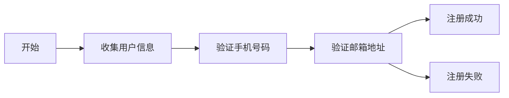
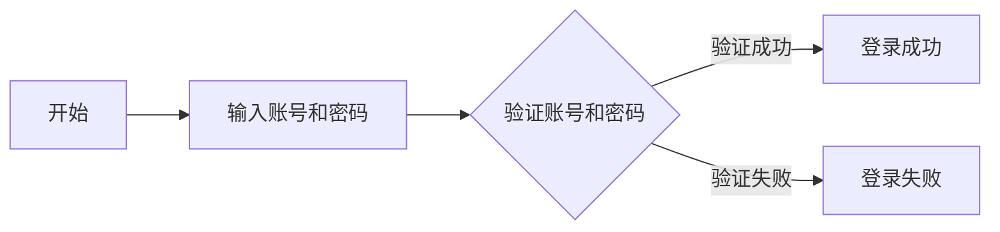

                 

# 《投资理财智能助手的前端开发最佳实践》

## 摘要

本文将深入探讨投资理财智能助手前端开发的最佳实践。随着金融科技（FinTech）的不断发展，智能理财工具已成为金融领域的重要组成部分。投资理财智能助手通过前端技术，为用户提供便捷、高效的理财服务。本文将系统地介绍前端开发环境搭建、核心功能实现、性能优化与安全性，并通过项目实战展示最佳实践的应用。本文旨在为从事金融科技开发的技术人员提供有价值的参考，帮助他们打造出更加专业、可靠的智能理财助手。

## 关键词

- 投资理财智能助手
- 前端开发
- 最佳实践
- 性能优化
- 安全性

## 引言与背景

### 投资理财智能助手的概述

随着互联网金融的快速发展，投资理财工具日益多样化。传统的理财方式往往耗时耗力，而智能理财助手的出现，极大地提高了理财的效率。投资理财智能助手是一种集成了人工智能、数据分析技术的在线理财工具，通过分析用户的数据和行为，为用户提供个性化的理财建议。

### 投资理财智能助手的重要性

智能理财助手在提高理财效率、降低投资风险、提供个性化服务方面具有显著优势。它不仅能够实时跟踪市场动态，还能根据用户的投资偏好和风险承受能力，提供科学的投资建议。此外，智能理财助手还能通过大数据分析，预测市场趋势，帮助用户做出更加明智的投资决策。

### 前端开发最佳实践的重要性

前端开发是构建智能理财助手中的关键环节。优秀的前端开发不仅能够提升用户体验，还能提高系统的性能和安全性。遵循最佳实践的前端开发，能够确保系统的稳定性、扩展性和可维护性。本文将探讨如何在前端开发中实现这些最佳实践。

### 本书结构

本书将分为以下几个部分：

1. **引言与背景**：介绍投资理财智能助手的概念和重要性。
2. **技术基础**：介绍前端开发环境搭建所需的基本技能和工具。
3. **核心功能实现**：详细讨论用户注册与登录、投资组合管理、市场分析、投资建议与推送等功能。
4. **性能优化与安全性**：介绍如何在前端开发中实现性能优化和安全性。
5. **项目实战与总结**：通过实际项目展示最佳实践的应用，并进行总结。

### 本章小结

本章介绍了投资理财智能助手的概念和重要性，以及前端开发最佳实践的价值。接下来，我们将深入探讨前端开发环境搭建、核心功能实现等技术基础。

## 第1章：投资理财智能助手概述

### 1.1 问题背景

#### 1.1.1 投资理财的现状与挑战

随着经济的发展，越来越多的人开始关注个人财务规划和投资理财。传统的投资理财方式主要包括股票、基金、债券等金融产品。然而，这些产品往往具有较高的门槛和复杂性，普通投资者难以理解和操作。

#### 1.1.2 智能助手的崛起

智能理财助手的出现，为普通投资者提供了一个简便、高效的理财工具。通过人工智能和大数据分析技术，智能理财助手能够根据用户的投资偏好、风险承受能力和市场动态，提供个性化的投资建议。

#### 1.1.3 投资理财智能助手的重要性

投资理财智能助手在提高投资效率、降低投资风险、提供个性化服务方面具有显著优势。它不仅能够实时跟踪市场动态，还能根据用户的投资偏好和风险承受能力，提供科学的投资建议。此外，智能理财助手还能通过大数据分析，预测市场趋势，帮助用户做出更加明智的投资决策。

### 1.2 前端开发最佳实践的重要性

前端开发是构建智能理财助手中的关键环节。优秀的前端开发不仅能够提升用户体验，还能提高系统的性能和安全性。遵循最佳实践的前端开发，能够确保系统的稳定性、扩展性和可维护性。

#### 1.2.1 前端开发概述

前端开发包括HTML、CSS和JavaScript等技术的应用，主要用于构建用户界面和交互逻辑。前端开发的目标是提供流畅、直观的用户体验，使投资者能够轻松使用智能理财助手。

#### 1.2.2 前端开发中的关键问题

1. **性能优化**：前端性能直接影响用户的体验。如何优化页面加载速度、减少资源请求次数，是前端开发中需要解决的关键问题。
2. **安全性**：随着金融信息的日益重要，前端开发需要确保用户数据的安全，防止信息泄露和恶意攻击。
3. **可维护性**：前端代码的结构和风格应遵循一定的规范，便于后续的维护和更新。

#### 1.2.3 最佳实践的价值与影响

遵循最佳实践的前端开发，能够提高开发效率、降低维护成本，并提升用户体验。具体来说，最佳实践包括以下几个方面：

1. **代码规范**：统一的代码规范有助于团队协作，提高代码的可读性和可维护性。
2. **模块化开发**：将功能模块化，有助于代码的复用和扩展。
3. **响应式设计**：适应不同设备和屏幕尺寸，提供一致的用户体验。
4. **性能优化**：通过压缩、缓存等技术，提高页面加载速度和响应速度。

### 1.3 本书结构

本书将分为以下几个部分：

1. **引言与背景**：介绍投资理财智能助手的概念和重要性。
2. **技术基础**：介绍前端开发环境搭建所需的基本技能和工具。
3. **核心功能实现**：详细讨论用户注册与登录、投资组合管理、市场分析、投资建议与推送等功能。
4. **性能优化与安全性**：介绍如何在前端开发中实现性能优化和安全性。
5. **项目实战与总结**：通过实际项目展示最佳实践的应用，并进行总结。

### 本章小结

本章介绍了投资理财智能助手的问题背景、智能助手的崛起以及前端开发最佳实践的重要性。接下来，我们将开始探讨前端开发环境搭建的基本技能和工具。

## 第2章：前端开发环境搭建

### 2.1 开发工具与平台

#### 2.1.1 编辑器选择

在前端开发中，选择一款合适的编辑器至关重要。目前，市场上有很多优秀的代码编辑器，如Visual Studio Code、Sublime Text和Atom等。这些编辑器都提供了丰富的插件和功能，可以帮助开发者提高开发效率。

**Visual Studio Code**

- **优点**：免费、开源、跨平台、丰富的插件生态。
- **缺点**：有时界面复杂，对于初学者可能不太友好。

**Sublime Text**

- **优点**：轻量级、速度快、简洁的界面。
- **缺点**：免费版有功能限制，插件管理较为繁琐。

**Atom**

- **优点**：免费、开源、跨平台、强大的文本编辑功能。
- **缺点**：相比其他编辑器，资源占用较大。

#### 2.1.2 包管理器

包管理器用于管理和安装前端开发所需的依赖包。目前，最常用的包管理器是npm（Node Package Manager）和yarn。

**npm**

- **优点**：历史悠久、社区支持强大、使用广泛。
- **缺点**：安装速度较慢、配置较为复杂。

**yarn**

- **优点**：速度快、依赖关系清晰、易于配置。
- **缺点**：相比于npm，社区支持较少。

#### 2.1.3 版本控制系统

版本控制系统（Version Control System，VCS）用于管理代码版本，确保代码的稳定性和可追溯性。目前，最常用的版本控制系统是Git。

**Git**

- **优点**：分布式、易于操作、支持多种工作流。
- **缺点**：配置较为复杂、初次使用可能不太容易上手。

### 2.2 基本技能

#### 2.2.1 HTML

HTML（HyperText Markup Language）是构建网页的基本语言。它用于定义网页的结构和内容。以下是HTML的基本要素：

- **元素**：HTML元素由标签和属性组成，用于标识网页中的各种组件。
- **文档类型声明**：DOCTYPE声明用于指定HTML版本，以确保浏览器正确解析页面。
- **HTML结构**：HTML文档由头部（head）和主体（body）组成，头部包含元数据和脚本，主体包含网页的内容。

#### 2.2.2 CSS

CSS（Cascading Style Sheets）用于定义网页的样式。它是前端开发的核心技术之一。以下是CSS的基本要素：

- **选择器**：选择器用于选择页面中的元素。
- **属性**：属性用于定义元素的样式，如颜色、大小、字体等。
- **样式规则**：样式规则由选择器和属性值组成，用于定义元素的样式。

#### 2.2.3 JavaScript

JavaScript是一种客户端脚本语言，用于增强网页的功能和交互性。以下是JavaScript的基本要素：

- **变量**：变量用于存储数据。
- **函数**：函数是一段可复用的代码，用于执行特定的任务。
- **事件**：事件是用户与网页交互的一种方式，如点击、按键等。

### 2.3 前端框架与库

#### 2.3.1 React

React是一个用于构建用户界面的JavaScript库。它采用组件化开发，使代码更易于维护和扩展。以下是React的基本概念：

- **组件**：组件是React应用的基本构建块，用于表示网页中的各种元素。
- **虚拟DOM**：React使用虚拟DOM来提高性能，通过比较虚拟DOM和实际DOM的差异，只更新需要更新的部分。
- **状态管理**：React通过状态管理器（如Redux）来管理应用的状态，使代码更易读、更易维护。

#### 2.3.2 Vue

Vue是一个用于构建用户界面的JavaScript框架。它提供了简洁的API和丰富的组件库，使开发者能够快速搭建复杂的界面。以下是Vue的基本概念：

- **指令**：指令是Vue中用于操作DOM的语法糖，如`v-model`、`v-for`等。
- **组件系统**：Vue使用组件系统来构建应用，组件可以独立开发、测试和部署。
- **状态管理**：Vue通过Vuex来管理应用的状态，Vuex提供了丰富的功能，如模块化状态管理、异步操作等。

#### 2.3.3 Angular

Angular是一个用于构建大型单页应用的JavaScript框架。它提供了强大的功能和丰富的生态系统，使开发者能够高效地开发复杂的Web应用。以下是Angular的基本概念：

- **模块**：模块是Angular应用的基本组织单位，用于定义应用的功能和组件。
- **依赖注入**：Angular使用依赖注入来管理组件之间的依赖关系，使代码更易维护。
- **指令和管道**：Angular提供了丰富的指令和管道，用于操作数据和DOM。

### 2.4 本章小结

本章介绍了前端开发环境搭建所需的基本技能和工具，包括编辑器、包管理器、版本控制系统以及前端框架与库。接下来，我们将开始探讨投资理财智能助手中的核心功能实现。

## 第3章：用户注册与登录

### 3.1 用户注册

用户注册是投资理财智能助手的基础功能之一。注册过程中，需要收集用户的个人信息，并验证其真实性。以下是用户注册的基本流程：

1. **收集用户信息**：通过表单收集用户的姓名、手机号码、邮箱地址、密码等个人信息。
2. **验证手机号码**：发送验证码到用户手机，用户输入验证码进行验证。
3. **验证邮箱地址**：发送验证邮件到用户邮箱，用户点击邮件中的链接进行验证。
4. **注册成功**：验证通过后，将用户信息存储到数据库，并生成用户账户。

### 3.1.1 注册流程

以下是一个简单的用户注册流程的Mermaid流程图：



### 3.1.2 数据验证

数据验证是确保用户输入信息真实、有效的关键步骤。以下是常见的数据验证方法：

1. **必填项验证**：确保用户输入的所有必填项都已经填写。
2. **格式验证**：验证用户输入的手机号码、邮箱地址等格式是否符合规范。
3. **长度验证**：限制用户输入的字符长度，如密码长度应在6-20个字符之间。

### 3.1.3 用户角色划分

投资理财智能助手通常会为用户提供不同的角色，如普通用户、管理员等。以下是常见的用户角色及其权限：

1. **普通用户**：可以查看自己的投资组合、进行投资操作。
2. **管理员**：可以管理用户账户、投资策略、系统配置等。

### 3.2 登录认证

登录认证是用户进入投资理财智能助手的必经之路。登录过程中，需要验证用户的身份，并确保其安全。以下是登录认证的基本流程：

1. **输入账号和密码**：用户输入账号和密码。
2. **验证账号和密码**：系统通过数据库验证账号和密码的正确性。
3. **登录成功**：验证通过后，用户可以进入系统。
4. **登录失败**：验证失败，提示用户账号或密码错误。

### 3.2.1 登录流程

以下是一个简单的用户登录流程的Mermaid流程图：



### 3.2.2 密码加密

为了确保用户密码的安全，投资理财智能助手需要将用户密码进行加密存储。常见的加密算法包括MD5、SHA-256等。以下是使用Python实现SHA-256加密的示例代码：

```python
import hashlib

def encrypt_password(password):
    encrypted_password = hashlib.sha256(password.encode()).hexdigest()
    return encrypted_password

password = "my_password"
encrypted_password = encrypt_password(password)
print("Encrypted password:", encrypted_password)
```

### 3.2.3 单点登录（SSO）

单点登录（SSO）是一种集中认证机制，允许用户通过一个账户登录多个应用系统。以下是实现SSO的基本步骤：

1. **统一认证中心**：搭建一个统一的认证中心，负责处理用户的登录和认证。
2. **票据机制**：当用户登录后，认证中心会生成一个票据（如JWT），该票据包含用户的身份信息和登录状态。
3. **票据验证**：其他应用系统在用户访问时，需要验证票据的合法性，并根据票据信息确定用户的身份。

### 3.3 本章小结

本章详细介绍了用户注册与登录的实现过程，包括注册流程、数据验证、用户角色划分、登录认证流程、密码加密和单点登录（SSO）。这些功能是投资理财智能助手的基础，为用户提供安全的身份验证和个性化的服务。

## 第4章：投资组合管理

### 4.1 投资组合概述

投资组合是指投资者在一定的风险承受能力下，将资金分配到不同类型的投资产品中，以达到收益最大化和风险最小化的目的。投资组合管理是指对投资组合进行监控、调整和优化，以实现最佳的投资效果。

#### 4.1.1 投资组合的定义

投资组合是由一组不同类型的投资产品组成的集合。这些产品可以是股票、债券、基金、房地产等。投资组合的定义包括以下几个要素：

- **资产分配**：投资者需要根据自身的风险承受能力和投资目标，将资金分配到不同的资产类别中。
- **风险控制**：通过分散投资，降低投资组合的整体风险。
- **收益最大化**：在控制风险的前提下，争取实现最大化的投资收益。

#### 4.1.2 投资组合的重要性

投资组合管理在投资过程中具有重要作用：

- **分散风险**：通过将资金分配到不同类型的投资产品中，可以降低单一产品带来的风险，提高整体投资的安全性和稳定性。
- **个性化投资**：投资组合可以根据投资者的风险承受能力和投资目标，实现个性化的投资策略。
- **资产配置**：合理的资产配置可以最大化投资收益，同时控制投资风险。

#### 4.1.3 投资组合的构成

投资组合通常包括以下几个组成部分：

- **股票**：股票是投资组合中的重要组成部分，可以带来较高的收益，但风险也相对较大。
- **债券**：债券通常具有较高的稳定性和较低的风险，适合风险偏好较低的投资者。
- **基金**：基金是一种投资组合产品，由专业的基金管理人进行投资管理，投资者可以通过购买基金来实现资产配置。
- **房地产**：房地产投资可以带来稳定的租金收益，但投资门槛较高。

### 4.2 投资组合管理

投资组合管理是指通过监控、调整和优化投资组合，以实现最佳的投资效果。以下是投资组合管理的主要任务：

#### 4.2.1 投资组合策略

投资组合策略是指投资者根据自身的风险承受能力和投资目标，制定的投资策略。常见的投资策略包括：

- **保守型策略**：以风险控制为主，投资于低风险的债券和基金。
- **稳健型策略**：在控制风险的同时，适当增加股票的投资比例。
- **激进型策略**：以追求高收益为主，投资于高风险的股票和基金。

#### 4.2.2 资产配置

资产配置是指将投资资金分配到不同的资产类别中，以达到投资组合的目标。资产配置的关键是确定各资产类别的投资比例。以下是资产配置的步骤：

1. **确定投资目标**：根据投资者的风险承受能力和投资目标，确定投资组合的目标。
2. **评估风险**：评估各资产类别的风险，确定合理的投资比例。
3. **制定投资计划**：根据投资目标和资产配置策略，制定具体的投资计划。

#### 4.2.3 风险管理

风险管理是指通过控制风险，确保投资组合的安全性和稳定性。以下是风险管理的几种方法：

- **分散投资**：通过将资金分配到不同的资产类别和行业，降低投资组合的整体风险。
- **定期调整**：定期对投资组合进行评估和调整，以适应市场变化和投资者的需求。
- **保险策略**：购买保险产品，以降低投资风险。

### 4.3 本章小结

本章介绍了投资组合管理的概念、重要性和构成，以及投资组合策略、资产配置和风险管理。投资组合管理是投资理财智能助手中至关重要的一环，有助于投资者实现收益最大化、风险最小化的目标。

## 第5章：市场分析

### 5.1 市场数据获取

市场分析是投资理财智能助手的核心功能之一。为了提供准确的投资者建议和市场分析，需要获取实时、准确的市场数据。以下是市场数据获取的步骤：

#### 5.1.1 数据源选择

选择合适的数据源是获取市场数据的第一步。常见的数据源包括：

- **公开数据**：如证券交易所、金融监管机构等提供的公开数据。
- **商业数据**：如金融数据服务提供商提供的专业数据。
- **第三方API**：如股票行情API、金融资讯API等。

#### 5.1.2 数据接口调用

获取市场数据通常需要通过接口调用实现。以下是一个简单的Python示例，用于调用股票行情API获取股票数据：

```python
import requests

def get_stock_data(symbol):
    url = f'https://api.example.com/stock/{symbol}'
    response = requests.get(url)
    if response.status_code == 200:
        return response.json()
    else:
        return None

stock_data = get_stock_data('AAPL')
print(stock_data)
```

#### 5.1.3 数据处理与存储

获取到市场数据后，需要对数据进行处理和存储。以下是一个简单的数据处理和存储的Python示例：

```python
import pandas as pd

def process_stock_data(data):
    df = pd.DataFrame(data)
    df['close'] = df['close'].astype(float)
    df['volume'] = df['volume'].astype(int)
    return df

def store_stock_data(df, filename):
    df.to_csv(filename, index=False)

stock_data = process_stock_data(stock_data)
store_stock_data(stock_data, 'stock_data.csv')
```

### 5.2 技术分析

技术分析是市场分析的一种方法，主要通过分析历史价格和交易量等数据，预测股票价格的未来走势。以下是一些常见的技术分析方法和工具：

#### 5.2.1 基本指标计算

基本指标是技术分析的基础，常用的基本指标包括：

- **移动平均线（MA）**：用于衡量股票价格的趋势，包括简单移动平均线（SMA）和指数移动平均线（EMA）。
- **相对强弱指数（RSI）**：用于衡量股票价格的超买或超卖情况。
- **布林带（BOLL）**：用于衡量股票价格的波动范围。

以下是一个简单的Python示例，用于计算股票的移动平均线：

```python
import pandas as pd

def calculate_moving_average(df, window):
    df['SMA'] = df['close'].rolling(window=window).mean()
    df['EMA'] = df['close'].ewm(span=window, adjust=False).mean()
    return df

df = calculate_moving_average(df, 20)
print(df)
```

#### 5.2.2 图表展示

图表展示是技术分析的重要组成部分，通过图表可以更直观地了解股票价格的变化趋势。以下是一些常用的图表展示工具：

- **折线图**：用于显示股票价格的变化趋势。
- **K线图**：用于显示股票价格、交易量等信息的详细图表。
- **柱状图**：用于显示股票价格的高点和低点。

以下是一个简单的Python示例，用于生成股票价格的折线图：

```python
import matplotlib.pyplot as plt

def plot_stock_price(df):
    plt.plot(df['date'], df['close'])
    plt.xlabel('Date')
    plt.ylabel('Close')
    plt.title('Stock Price Trend')
    plt.show()

plot_stock_price(df)
```

#### 5.2.3 技术指标应用

技术指标是技术分析的重要工具，通过分析技术指标，可以预测股票价格的未来走势。以下是一些常用的技术指标：

- **移动平均线交叉**：通过比较短期和长期移动平均线，预测股票价格的未来走势。
- **相对强弱指数（RSI）**：通过衡量股票价格的超买或超卖情况，预测股票价格的未来走势。
- **布林带**：通过衡量股票价格的波动范围，预测股票价格的未来走势。

以下是一个简单的Python示例，用于计算股票的相对强弱指数（RSI）：

```python
import pandas as pd

def calculate_rsi(df, window):
    delta = df['close'].diff()
    gain = (delta.where(delta > 0, 0)).rolling(window=window).mean()
    loss = (-delta.where(delta < 0, 0)).rolling(window=window).mean()
    rs = gain / loss
    rsi = 100 - (100 / (1 + rs))
    df['RSI'] = rsi
    return df

df = calculate_rsi(df, 14)
print(df)
```

### 5.3 基本面分析

基本面分析是通过分析公司的财务状况、行业前景和宏观经济环境等因素，预测股票价格的未来走势。以下是一些常用的基本面分析指标：

#### 5.3.1 财务报表分析

财务报表分析是基本面分析的核心，通过分析公司的财务报表，可以了解公司的财务状况和经营成果。以下是一些常用的财务报表分析指标：

- **收入增长率**：衡量公司的营业收入增长率，反映公司的成长性。
- **净利润增长率**：衡量公司的净利润增长率，反映公司的盈利能力。
- **市盈率（PE）**：衡量股票价格相对于公司净利润的倍数，反映股票的估值水平。

以下是一个简单的Python示例，用于计算公司的收入增长率和净利润增长率：

```python
import pandas as pd

def calculate_financial_indicators(df):
    df['Revenue Growth Rate'] = df['revenue'].pct_change()
    df['Net Profit Growth Rate'] = df['net_profit'].pct_change()
    return df

df = calculate_financial_indicators(df)
print(df)
```

#### 5.3.2 行业分析

行业分析是通过分析行业的整体趋势和竞争格局，预测股票价格的未来走势。以下是一些常用的行业分析指标：

- **行业增长率**：衡量整个行业的增长率，反映行业的活力和前景。
- **市场份额**：衡量公司在行业中的地位和竞争力。

以下是一个简单的Python示例，用于计算行业的增长率和市场份额：

```python
import pandas as pd

def calculate_industry_indicators(df):
    df['Industry Growth Rate'] = df['revenue'].pct_change()
    df['Market Share'] = df['revenue'] / df['total_revenue']
    return df

df = calculate_industry_indicators(df)
print(df)
```

#### 5.3.3 公司分析

公司分析是通过分析公司的基本面和财务状况，预测股票价格的未来走势。以下是一些常用的公司分析指标：

- **盈利能力**：衡量公司的盈利能力，包括净利润率、毛利率等。
- **成长能力**：衡量公司的成长能力，包括收入增长率、净利润增长率等。
- **偿债能力**：衡量公司的偿债能力，包括流动比率、速动比率等。

以下是一个简单的Python示例，用于计算公司的盈利能力、成长能力和偿债能力：

```python
import pandas as pd

def calculate_company_indicators(df):
    df['Profitability'] = df['net_profit'] / df['revenue']
    df['Growth Rate'] = df['revenue'].pct_change()
    df['Liquidity'] = df['current_assets'] / df['current_liabilities']
    return df

df = calculate_company_indicators(df)
print(df)
```

### 5.4 本章小结

本章介绍了市场数据获取的方法和技术分析、基本面分析的方法。通过市场数据的获取和分析，投资理财智能助手可以为用户提供准确的投资建议和市场分析，帮助用户做出更加明智的投资决策。

## 第6章：投资建议与推送

### 6.1 投资建议算法

投资建议算法是投资理财智能助手的灵魂，它基于大数据分析、机器学习和人工智能技术，为用户提供个性化的投资建议。以下是投资建议算法的基本原理：

#### 6.1.1 建模基础

投资建议算法通常基于以下建模基础：

1. **数据收集**：收集用户的历史投资记录、投资偏好、风险承受能力等信息。
2. **特征工程**：提取影响投资决策的关键特征，如市场数据、财务数据、用户行为数据等。
3. **模型选择**：选择合适的机器学习模型，如线性回归、决策树、随机森林、神经网络等。

#### 6.1.2 算法实现

以下是一个简单的投资建议算法的实现示例，基于Python和Scikit-learn库：

```python
from sklearn.ensemble import RandomForestClassifier
from sklearn.model_selection import train_test_split
from sklearn.metrics import accuracy_score

# 数据准备
X = ...  # 特征矩阵
y = ...  # 标签矩阵

# 划分训练集和测试集
X_train, X_test, y_train, y_test = train_test_split(X, y, test_size=0.2, random_state=42)

# 模型训练
model = RandomForestClassifier(n_estimators=100)
model.fit(X_train, y_train)

# 模型评估
y_pred = model.predict(X_test)
accuracy = accuracy_score(y_test, y_pred)
print("Accuracy:", accuracy)
```

#### 6.1.3 实验与分析

投资建议算法的性能可以通过实验和数据分析来评估。以下是一个简单的实验与分析示例：

1. **模型性能评估**：通过交叉验证和测试集评估模型的准确性、召回率、F1分数等指标。
2. **特征重要性分析**：分析特征对模型的影响，确定哪些特征对投资建议的生成至关重要。
3. **用户反馈**：收集用户的反馈，对模型进行调整和优化。

### 6.2 投资建议推送

投资建议推送是将投资建议传递给用户的关键环节。以下是一些常见的推送策略和方法：

#### 6.2.1 推送策略

推送策略通常包括以下方面：

1. **个性化推送**：根据用户的历史投资记录、投资偏好和风险承受能力，为用户提供个性化的投资建议。
2. **定时推送**：定期向用户推送投资建议，如每天、每周或每月。
3. **事件驱动推送**：在特定事件（如市场波动、财报发布等）发生时，向用户推送相关投资建议。

#### 6.2.2 推送方式

常见的推送方式包括：

1. **短信推送**：通过短信将投资建议发送给用户。
2. **邮件推送**：通过电子邮件将投资建议发送给用户。
3. **APP推送**：通过手机应用将投资建议推送给用户。

以下是一个简单的Python示例，用于发送邮件推送：

```python
import smtplib
from email.mime.text import MIMEText

def send_email(subject, message, to_email):
    smtp_server = "smtp.example.com"
    smtp_port = 587
    smtp_user = "your_email@example.com"
    smtp_password = "your_password"

    msg = MIMEText(message)
    msg['Subject'] = subject
    msg['From'] = smtp_user
    msg['To'] = to_email

    server = smtplib.SMTP(smtp_server, smtp_port)
    server.starttls()
    server.login(smtp_user, smtp_password)
    server.sendmail(smtp_user, to_email, msg.as_string())
    server.quit()

send_email("投资建议", "您有一份新的投资建议，请查阅。", "user@example.com")
```

#### 6.2.3 用户反馈

用户反馈是优化投资建议推送的关键。以下是一些常见的用户反馈机制：

1. **反馈表单**：用户可以通过在线表单提交反馈。
2. **在线聊天**：用户可以通过在线聊天功能与客服人员沟通。
3. **评分和评论**：用户可以对推送的投资建议进行评分和评论。

### 6.3 本章小结

本章介绍了投资建议算法的基本原理和实现方法，以及投资建议的推送策略和方式。通过优化投资建议算法和推送方式，投资理财智能助手可以为用户提供更加准确、个性化的投资建议，提高用户的投资收益。

## 第7章：性能优化与安全性

### 7.1 性能优化

性能优化是前端开发的重要环节，直接影响用户体验。以下是一些常见的性能优化方法：

#### 7.1.1 响应式设计

响应式设计是指通过适应不同设备和屏幕尺寸，提供一致的用户体验。实现响应式设计的方法包括：

1. **媒体查询**：使用媒体查询（Media Queries）来根据设备的屏幕尺寸调整布局和样式。
2. **弹性布局**：使用弹性布局（Flexible Layout）来确保网页在不同屏幕尺寸下保持良好的布局效果。
3. **图片自适应**：使用响应式图片（Responsive Images）来根据设备的屏幕尺寸加载合适的图片。

以下是一个简单的响应式设计的示例代码：

```html
<!DOCTYPE html>
<html>
<head>
    <meta name="viewport" content="width=device-width, initial-scale=1.0">
    <style>
        @media (max-width: 600px) {
            .container {
                width: 100%;
                margin: 0;
            }
        }
    </style>
</head>
<body>
    <div class="container">
        <!-- 网页内容 -->
    </div>
</body>
</html>
```

#### 7.1.2 资源加载优化

资源加载优化是指通过减少资源请求次数、压缩资源文件等方法来提高页面加载速度。以下是一些常见的资源加载优化方法：

1. **懒加载**：懒加载（Lazy Loading）是指仅在需要时才加载资源，如图片、视频等。
2. **预加载**：预加载（Preloading）是指提前加载用户可能需要访问的资源，如下一页内容、相关推荐等。
3. **资源压缩**：资源压缩（Resource Compression）是指通过压缩资源文件来减少传输数据的大小，如使用GZIP压缩HTML、CSS和JavaScript文件。

以下是一个简单的资源压缩的示例代码：

```html
<!DOCTYPE html>
<html>
<head>
    <meta charset="UTF-8">
    <meta name="viewport" content="width=device-width, initial-scale=1.0">
    <link rel="stylesheet" href="styles.css">
    <script src="script.js"></script>
</head>
<body>
    <!-- 网页内容 -->
</body>
</html>
```

#### 7.1.3 缓存策略

缓存策略是指通过缓存资源来提高页面加载速度和系统性能。以下是一些常见的缓存策略：

1. **浏览器缓存**：浏览器缓存（Browser Caching）是指将资源缓存到浏览器的本地存储中，如localStorage和sessionStorage。
2. **CDN缓存**：内容分发网络（CDN）缓存是指将资源缓存到CDN节点上，以减少用户访问资源的时间。
3. **代理缓存**：代理缓存是指通过代理服务器缓存资源，以减少源服务器的负载。

以下是一个简单的浏览器缓存的示例代码：

```javascript
// 设置资源缓存时间（单位：秒）
localStorage.setItem('cacheTimeout', 3600);

// 检查缓存是否过期
function checkCacheExpiry() {
    const cacheTimeout = localStorage.getItem('cacheTimeout');
    if (!cacheTimeout || Date.now() - cacheTimeout > 3600 * 1000) {
        // 缓存已过期，重新加载资源
        location.reload();
    }
}

// 在页面加载时检查缓存是否过期
window.addEventListener('load', checkCacheExpiry);
```

### 7.2 安全性

安全性是前端开发的重要方面，关系到用户数据和系统的安全。以下是一些常见的安全措施：

#### 7.2.1 安全漏洞防范

以下是一些常见的安全漏洞及其防范方法：

1. **跨站脚本攻击（XSS）**：防范方法包括对用户输入进行验证和过滤、使用内容安全策略（Content Security Policy，CSP）等。
2. **跨站请求伪造（CSRF）**：防范方法包括使用令牌（Token）验证、验证Referer头等。
3. **SQL注入**：防范方法包括使用预编译语句（Prepared Statements）、对用户输入进行验证和过滤等。

以下是一个简单的预防SQL注入的示例代码：

```python
import sqlite3

def query_database(query, params):
    conn = sqlite3.connect('database.db')
    cursor = conn.cursor()
    cursor.execute(query, params)
    result = cursor.fetchall()
    conn.close()
    return result

query = "SELECT * FROM users WHERE email = ? AND password = ?"
params = ('user@example.com', 'password123')
users = query_database(query, params)
print(users)
```

#### 7.2.2 数据加密

数据加密是保护用户数据安全的重要措施。以下是一些常见的数据加密方法：

1. **哈希加密**：哈希加密（Hashing）是一种将数据转换为一串固定长度的字符串的方法，如SHA-256。
2. **对称加密**：对称加密（Symmetric Encryption）是指加密和解密使用相同的密钥，如AES。
3. **非对称加密**：非对称加密（Asymmetric Encryption）是指加密和解密使用不同的密钥，如RSA。

以下是一个简单的哈希加密的示例代码：

```python
import hashlib

def hash_password(password):
    hashed_password = hashlib.sha256(password.encode()).hexdigest()
    return hashed_password

password = 'password123'
hashed_password = hash_password(password)
print("Hashed password:", hashed_password)
```

#### 7.2.3 身份验证与授权

身份验证与授权是确保用户只能访问授权资源的措施。以下是一些常见的身份验证与授权方法：

1. **基本身份验证**：基本身份验证（Basic Authentication）是指使用用户名和密码进行身份验证。
2. **令牌身份验证**：令牌身份验证（Token-based Authentication）是指使用令牌（如JWT）进行身份验证。
3. **单点登录（SSO）**：单点登录（Single Sign-On，SSO）是指使用统一的身份验证系统，实现多个应用系统的登录。

以下是一个简单的令牌身份验证的示例代码：

```python
import jwt
import datetime

def generate_token(user_id, expiration minutes):
    payload = {
        'user_id': user_id,
        'exp': datetime.datetime.utcnow() + datetime.timedelta(minutes=expiration)
    }
    token = jwt.encode(payload, 'secret_key')
    return token

def verify_token(token):
    try:
        payload = jwt.decode(token, 'secret_key')
        return payload['user_id']
    except jwt.ExpiredSignatureError:
        return None
    except jwt.InvalidTokenError:
        return None

user_id = 1
token = generate_token(user_id, 60)
print("Token:", token)

verified_user_id = verify_token(token)
if verified_user_id:
    print("Valid token, user ID:", verified_user_id)
else:
    print("Invalid token")
```

### 7.3 本章小结

本章介绍了性能优化与安全性的重要性和常见方法。通过响应式设计、资源加载优化、缓存策略、安全漏洞防范、数据加密、身份验证与授权等措施，可以显著提高投资理财智能助手的前端性能和安全性，为用户提供更好的使用体验。

## 第8章：项目实战与总结

### 8.1 项目介绍

#### 8.1.1 项目背景

随着金融科技的发展，投资理财智能助手作为一种创新的金融工具，正逐渐受到广大投资者的关注。本项目旨在开发一款基于前端技术的投资理财智能助手，为用户提供便捷、高效的理财服务。

#### 8.1.2 项目目标

本项目的目标是实现以下功能：

1. 用户注册与登录：提供用户注册、登录和认证功能。
2. 投资组合管理：支持用户创建、编辑和监控投资组合。
3. 市场分析：提供实时市场数据、技术分析和基本面分析。
4. 投资建议：基于大数据分析和机器学习技术，为用户生成个性化的投资建议。
5. 性能优化与安全性：确保系统的高性能和安全性。

#### 8.1.3 项目架构

本项目的架构设计包括前端、后端和数据库三个部分：

1. **前端**：使用React框架构建用户界面，实现交互逻辑和页面展示。
2. **后端**：使用Node.js和Express框架提供RESTful API，处理用户请求和业务逻辑。
3. **数据库**：使用MySQL数据库存储用户数据、投资组合数据和市场数据。

### 8.2 系统实现

#### 8.2.1 用户注册与登录

用户注册与登录是投资理财智能助手的基础功能。以下是系统实现的步骤：

1. **前端界面**：设计用户注册和登录的表单界面，包括用户名、密码、验证码等输入框。
2. **后端接口**：实现用户注册和登录的API接口，包括用户信息的验证、密码加密存储和登录令牌的生成。
3. **前端交互**：使用React组件管理表单状态，处理用户输入，发送请求到后端接口，并处理返回的响应。

以下是一个简单的用户注册的前端React组件示例：

```jsx
import React, { useState } from 'react';
import axios from 'axios';

const UserRegistration = () => {
  const [username, setUsername] = useState('');
  const [password, setPassword] = useState('');
  const [confirmPassword, setConfirmPassword] = useState('');

  const handleSubmit = async (e) => {
    e.preventDefault();
    if (password !== confirmPassword) {
      alert('Passwords do not match');
      return;
    }
    try {
      const response = await axios.post('/api/register', { username, password });
      if (response.status === 200) {
        alert('Registration successful');
      }
    } catch (error) {
      alert('Registration failed');
    }
  };

  return (
    <form onSubmit={handleSubmit}>
      <input
        type="text"
        placeholder="Username"
        value={username}
        onChange={(e) => setUsername(e.target.value)}
      />
      <input
        type="password"
        placeholder="Password"
        value={password}
        onChange={(e) => setPassword(e.target.value)}
      />
      <input
        type="password"
        placeholder="Confirm Password"
        value={confirmPassword}
        onChange={(e) => setConfirmPassword(e.target.value)}
      />
      <button type="submit">Register</button>
    </form>
  );
};

export default UserRegistration;
```

#### 8.2.2 投资组合管理

投资组合管理是投资理财智能助手中的核心功能，包括创建、编辑和监控投资组合。以下是系统实现的步骤：

1. **前端界面**：设计投资组合的创建、编辑和监控界面，包括投资产品的选择、投资金额的输入等。
2. **后端接口**：实现投资组合的增删改查（CRUD）接口，包括投资组合的创建、编辑、删除和查询。
3. **前端交互**：使用React组件管理投资组合的状态，发送请求到后端接口，并处理返回的响应，更新前端界面。

以下是一个简单的投资组合创建的前端React组件示例：

```jsx
import React, { useState } from 'react';
import axios from 'axios';

const InvestmentPortfolio = () => {
  const [portfolioName, setPortfolioName] = useState('');
  const [portfolioProducts, setPortfolioProducts] = useState([]);

  const handleProductChange = (productId, value) => {
    const updatedProducts = portfolioProducts.map((product) => {
      if (product.id === productId) {
        return { ...product, quantity: value };
      }
      return product;
    });
    setPortfolioProducts(updatedProducts);
  };

  const handleSubmit = async (e) => {
    e.preventDefault();
    try {
      const response = await axios.post('/api/portfolio', {
        name: portfolioName,
        products: portfolioProducts,
      });
      if (response.status === 200) {
        alert('Portfolio created successfully');
      }
    } catch (error) {
      alert('Portfolio creation failed');
    }
  };

  return (
    <form onSubmit={handleSubmit}>
      <input
        type="text"
        placeholder="Portfolio Name"
        value={portfolioName}
        onChange={(e) => setPortfolioName(e.target.value)}
      />
      {portfolioProducts.map((product) => (
        <div key={product.id}>
          <input
            type="number"
            placeholder="Quantity"
            value={product.quantity}
            onChange={(e) => handleProductChange(product.id, e.target.value)}
          />
          <span>{product.name}</span>
        </div>
      ))}
      <button type="submit">Create Portfolio</button>
    </form>
  );
};

export default InvestmentPortfolio;
```

#### 8.2.3 市场分析

市场分析功能提供实时市场数据、技术分析和基本面分析，帮助用户做出明智的投资决策。以下是系统实现的步骤：

1. **数据获取**：从外部数据源获取实时市场数据，如股票价格、交易量等。
2. **数据处理**：对获取到的数据进行处理和存储，以便后续分析和查询。
3. **前端展示**：设计市场分析的前端界面，包括技术分析和基本面分析的图表和表格。

以下是一个简单的技术分析的前端React组件示例：

```jsx
import React, { useState, useEffect } from 'react';
import axios from 'axios';
import { LineChart, Line, XAxis, YAxis, CartesianGrid, Tooltip, Legend, LineChartWrapper } from 'recharts';

const TechnicalAnalysis = () => {
  const [stockData, setStockData] = useState([]);

  useEffect(() => {
    const fetchStockData = async () => {
      try {
        const response = await axios.get('/api/stock_data');
        setStockData(response.data);
      } catch (error) {
        console.error('Error fetching stock data:', error);
      }
    };

    fetchStockData();
  }, []);

  return (
    <LineChartWrapper width={400} height={400}>
      <CartesianGrid strokeDasharray="3 3" />
      <XAxis dataKey="date" />
      <YAxis />
      <Tooltip />
      <Legend />
      <Line type="monotone" data={stockData} stroke="#8884d8" activeDot={{ r: 8 }} dataKey="open" name="Open" />
      <Line type="monotone" data={stockData} stroke="#82ca9d" dataKey="close" name="Close" />
    </LineChartWrapper>
  );
};

export default TechnicalAnalysis;
```

#### 8.2.4 投资建议与推送

投资建议与推送功能基于大数据分析和机器学习算法，为用户生成个性化的投资建议，并通过短信、邮件等方式推送。以下是系统实现的步骤：

1. **算法实现**：设计投资建议的算法，基于用户数据和市场数据生成投资建议。
2. **推送策略**：设计推送策略，包括推送的时间、内容和方式。
3. **推送执行**：实现推送功能的执行，包括发送短信、邮件等。

以下是一个简单的投资建议推送的后端Node.js示例：

```javascript
const express = require('express');
const axios = require('axios');
const nodemailer = require('nodemailer');

const app = express();
app.use(express.json());

const transporter = nodemailer.createTransport({
  service: 'gmail',
  auth: {
    user: 'your_email@example.com',
    pass: 'your_password',
  },
});

app.post('/api/investment_advice', async (req, res) => {
  const { email, advice } = req.body;
  try {
    await transporter.sendMail({
      from: 'your_email@example.com',
      to: email,
      subject: 'Investment Advice',
      text: 'Here is your personalized investment advice:',
      html: `<p>${advice}</p>`,
    });
    res.status(200).send('Investment advice sent successfully');
  } catch (error) {
    console.error('Error sending investment advice:', error);
    res.status(500).send('Error sending investment advice');
  }
});

const PORT = process.env.PORT || 3000;
app.listen(PORT, () => {
  console.log(`Server is running on port ${PORT}`);
});
```

### 8.3 项目小结

本项目通过前端技术实现了投资理财智能助手的核心功能，包括用户注册与登录、投资组合管理、市场分析、投资建议与推送等。在项目实施过程中，我们遵循了前端开发的最佳实践，如响应式设计、资源加载优化、缓存策略、安全漏洞防范等。通过项目实战，我们积累了丰富的经验，提高了团队的技术能力和项目交付能力。未来，我们将继续优化系统性能和安全性，并引入更多的人工智能和大数据分析技术，为用户提供更加精准、个性化的投资服务。

### 8.4 未来展望

未来，投资理财智能助手的发展将更加智能化和个性化。我们将继续探索和应用人工智能、大数据分析等先进技术，提高投资建议的准确性和实用性。同时，我们也将关注用户体验，不断优化界面设计和交互流程，提升用户满意度。此外，随着区块链技术的发展，我们还将考虑引入区块链技术，提高数据的安全性和透明度。通过不断的技术创新和优化，我们将努力打造成为用户信赖的智能理财助手。

## 附录

### A. 技术栈与工具

#### A.1 前端框架

- **React**：用于构建用户界面。
- **Redux**：用于状态管理。
- **Recharts**：用于数据可视化。

#### A.2 后端服务

- **Node.js**：用于构建后端服务。
- **Express**：用于构建RESTful API。
- **MySQL**：用于存储用户数据和投资组合数据。

#### A.3 数据库

- **MySQL**：用于存储用户数据和投资组合数据。

### B. 拓展阅读

#### B.1 相关书籍推荐

- 《React.js小书》
- 《深入理解React》
- 《Node.js实战》

#### B.2 投资理财相关网站

- **雪球**：提供实时股票行情和社区交流。
- **同花顺**：提供专业的财经数据和投资工具。

#### B.3 开源项目推荐

- **Alibaba Cloud**：提供丰富的云计算服务。
- **Spring Boot**：用于构建后端服务。

### 感谢

感谢您阅读本文，希望本文能为您提供有关投资理财智能助手前端开发的有用信息。如果您有任何疑问或建议，欢迎在评论区留言。

## 作者信息

**作者：AI天才研究院/AI Genius Institute & 禅与计算机程序设计艺术 /Zen And The Art of Computer Programming**

