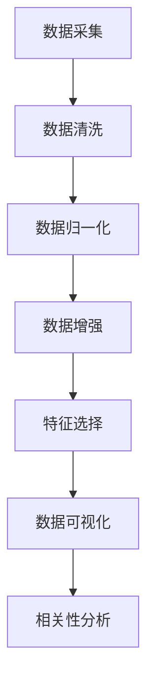

                 

# 投资理财智能助手的基本概念

## 关键词

- 投资理财智能助手
- 人工智能
- 投资策略
- 数据分析
- 风险管理

## 摘要

本文旨在探讨投资理财智能助手的基本概念，包括其定义、功能、组成部分、优点和局限性，以及其在个人投资者、专业投资者和金融机构中的应用。我们将一步一步分析这些核心概念，帮助读者深入了解投资理财智能助手的工作原理和应用场景。

### 第一部分：投资理财智能助手概述

#### 第1章：投资理财智能助手的概念与重要性

### 1.1 投资理财智能助手的基本概念

**定义**：投资理财智能助手是一种利用人工智能技术，结合大数据分析和复杂算法，为投资者提供投资策略建议和决策辅助的工具。

**功能**：主要包括数据采集与处理、算法与模型分析、用户界面与交互设计，旨在帮助投资者做出更加明智的投资决策。

**与传统投资理财方式的对比**：相比传统投资理财方式，智能助手能够更快速、准确地分析大量数据，提供个性化的投资建议，降低投资风险。

**发展趋势**：随着人工智能技术的不断进步，投资理财智能助手的应用范围将越来越广泛，成为投资领域不可或缺的一部分。

#### 1.2 投资理财智能助手的组成部分

**数据采集与处理**：收集各类投资数据，如股票、债券、货币基金等，并进行数据清洗、归一化和特征选择等预处理。

**算法与模型**：利用机器学习和深度学习等技术，对数据进行分析和建模，为投资者提供个性化的投资建议。

**用户界面与交互设计**：提供简洁、直观的用户界面，方便投资者操作和使用。

#### 1.3 投资理财智能助手的优点与局限性

**优点**：高效、精准、个性化，能够降低投资风险，提高投资收益。

**局限性**：依赖于数据质量和算法模型的准确性，存在一定的局限性。

**风险与管理**：投资理财智能助手在应用过程中，需充分考虑市场风险、信用风险等，并采取相应的管理措施。

#### 1.4 投资理财智能助手的应用场景

**个人投资者**：根据个人投资目标、风险承受能力和投资策略，提供个性化的投资建议。

**专业投资者**：辅助专业投资者进行投资决策，优化投资组合，降低风险。

**金融机构**：为金融机构提供风险管理、投资组合优化等服务，提高投资效率。

#### 1.5 本章小结

投资理财智能助手是一种具有广泛应用前景的技术工具，通过结合人工智能、大数据分析和复杂算法，为投资者提供个性化的投资建议和决策辅助。了解其基本概念和组成部分，有助于更好地应用这一工具，实现投资收益的最大化。

### 第二部分：投资理财智能助手的核心算法与模型

#### 第2章：数据采集与预处理

### 2.1 数据来源与类型

**股票市场数据**：包括股票价格、交易量、市盈率、市净率等指标。

**债券市场数据**：包括债券价格、收益率、信用评级等指标。

**外部经济数据**：如GDP、通货膨胀率、利率等宏观经济指标。

### 2.2 数据预处理方法

**数据清洗**：去除重复数据、缺失值和异常值，确保数据质量。

**数据归一化**：将不同单位的数据转换为同一单位，便于后续分析。

**数据增强**：通过生成模拟数据或扩展原始数据，提高模型的泛化能力。

**特征选择**：选择对投资决策有重要影响的关键特征，提高模型效果。

### 2.3 数据可视化

**常用数据可视化工具**：Matplotlib、Seaborn、Plotly等。

**数据可视化实践**：展示投资数据的时间序列分析、趋势分析、分布分析等。

**数据可视化案例分析**：分析实际投资数据，探讨数据可视化在投资决策中的应用价值。

#### 2.4 本章小结

数据采集与预处理是投资理财智能助手的重要组成部分，直接影响模型的准确性和可靠性。通过合理的数据预处理方法，可以提高模型的效果，为投资者提供更有价值的信息。

### 第三部分：投资理财智能助手的应用场景与案例分析

#### 第3章：个人投资者的投资理财智能助手

### 3.1 个人投资者需求分析

**投资目标**：根据个人财务状况、投资目标和风险偏好，制定合理的投资策略。

**风险承受能力**：评估个人投资者的风险承受能力，确保投资策略与风险偏好相匹配。

**投资策略**：结合市场环境和个人情况，制定相应的投资策略，如股票投资、基金投资、货币基金投资等。

#### 3.2 投资理财智能助手的个人应用

**股票投资策略**：分析股票市场的趋势和潜力，为投资者提供买卖建议。

**基金投资策略**：评估基金的投资表现和风险，为投资者提供基金选择建议。

**货币基金投资策略**：分析货币基金的收益率和流动性，为投资者提供投资建议。

#### 3.3 个人投资案例分析

**案例背景**：以某个人投资者的实际投资案例为例，分析其投资决策过程。

**案例分析**：分析投资者在投资过程中遇到的问题，以及智能助手提供的解决方案。

**案例小结**：总结案例中的经验和教训，为其他投资者提供借鉴。

#### 3.4 本章小结

投资理财智能助手在个人投资者中的应用，能够帮助投资者更好地理解市场动态，制定合理的投资策略，提高投资收益。

### 第四部分：投资理财智能助手在专业投资者和金融机构中的应用

#### 第4章：专业投资者的投资理财智能助手

### 4.1 专业投资者需求分析

**投资目标**：根据专业投资者的投资目标和风险偏好，制定投资策略。

**风险承受能力**：评估专业投资者的风险承受能力，确保投资策略与风险偏好相匹配。

**投资策略**：结合市场环境和专业投资者的投资理念，制定相应的投资策略，如量化投资、组合投资等。

#### 4.2 投资理财智能助手的机构应用

**风险控制**：通过分析市场风险、信用风险等，为专业投资者提供风险管理建议。

**负债管理**：优化负债结构，降低负债成本，提高投资收益。

**投资组合优化**：根据市场变化和投资策略，调整投资组合，实现风险与收益的平衡。

#### 4.3 金融机构投资案例分析

**案例背景**：以某金融机构的实际投资案例为例，分析其投资决策过程。

**案例分析**：分析金融机构在投资过程中遇到的问题，以及智能助手提供的解决方案。

**案例小结**：总结案例中的经验和教训，为其他金融机构提供借鉴。

#### 4.4 本章小结

投资理财智能助手在专业投资者和金融机构中的应用，能够提高投资决策的效率和准确性，降低投资风险，实现投资收益的最大化。

### 第五部分：投资理财智能助手的未来发展趋势

#### 第5章：投资理财智能助手的未来发展

### 5.1 技术发展趋势

**人工智能技术**：随着人工智能技术的不断发展，投资理财智能助手的算法和模型将更加先进，提供更加精准的投资建议。

**大数据技术**：大数据技术在投资理财领域的应用将越来越广泛，为智能助手提供更丰富的数据支持。

**区块链技术**：区块链技术将提高投资理财智能助手的数据透明度和安全性，为投资者提供更加可靠的投资环境。

### 5.2 法律与监管挑战

**隐私保护**：投资理财智能助手需要保护投资者的隐私，确保数据安全。

**风险管理**：投资理财智能助手需要建立健全的风险管理机制，降低投资风险。

**法律法规**：投资理财智能助手需要遵守相关法律法规，确保合规经营。

### 5.3 未来应用场景展望

**个人投资者**：未来投资理财智能助手将更加个性化，满足个人投资者的多样化需求。

**专业投资者**：未来投资理财智能助手将提高专业投资者的投资效率和收益。

**金融机构**：未来投资理财智能助手将为金融机构提供更全面的服务，助力其数字化转型。

#### 5.4 本章小结

投资理财智能助手的未来发展充满机遇与挑战。随着技术的进步和市场的需求，投资理财智能助手将在更广泛的领域发挥重要作用，为投资者创造更多价值。

### 第六部分：投资理财智能助手的最佳实践与技巧

#### 第6章：投资理财智能助手的最佳实践

### 6.1 实践技巧

**数据采集与预处理**：确保数据质量，进行充分的数据清洗和特征选择。

**算法与模型**：选择合适的算法和模型，进行模型训练和优化。

**用户界面与交互设计**：提供简洁、直观的用户界面，提高用户体验。

**风险管理**：建立健全的风险管理机制，降低投资风险。

**合规经营**：遵守相关法律法规，确保投资理财智能助手的合规性。

#### 6.2 小结

投资理财智能助手的最佳实践包括数据采集与预处理、算法与模型、用户界面与交互设计、风险管理和合规经营等方面。通过不断优化和实践，投资理财智能助手将为投资者提供更加优质的服务。

### 作者信息

作者：AI天才研究院/AI Genius Institute & 禅与计算机程序设计艺术 /Zen And The Art of Computer Programming## 第一部分：投资理财智能助手概述

### 第1章：投资理财智能助手的概念与重要性

#### 1.1 投资理财智能助手的基本概念

投资理财智能助手是一种基于人工智能（AI）技术的智能系统，旨在通过数据分析、算法模型和用户界面设计，为投资者提供个性化的投资建议和决策支持。其核心功能包括数据采集、数据预处理、算法建模、风险控制和投资策略推荐等。

**定义**：投资理财智能助手是一种融合了大数据、人工智能和金融知识图谱的智能系统，能够实时监控市场动态，分析历史数据，预测市场趋势，并提供投资策略建议。

**功能**：
1. **数据采集与处理**：收集并处理股票、债券、基金、外汇等金融市场的数据，包括价格、成交量、财务指标、宏观经济数据等。
2. **算法与模型分析**：利用机器学习、深度学习等技术，对金融数据进行建模和分析，识别市场趋势、风险因素和投资机会。
3. **用户界面与交互设计**：提供直观、易用的用户界面，使投资者能够轻松获取投资建议，并进行操作。

**与传统投资理财方式的对比**：
传统投资理财主要依赖于投资者的经验、直觉和市场研究。而投资理财智能助手则利用大数据和先进算法，能够处理大量数据，识别复杂的市场模式，提供更精准的投资建议。

**发展趋势**：随着人工智能技术的不断进步，投资理财智能助手的应用将更加广泛，其性能和准确性也将不断提高。未来，智能助手有望在风险管理、投资组合优化、市场预测等方面发挥更大的作用。

#### 1.2 投资理财智能助手的组成部分

**数据采集与处理**：这是智能助手的基石，主要包括以下步骤：
- **数据来源**：从多个渠道获取金融数据，如交易所、新闻网站、财经数据库等。
- **数据清洗**：去除重复、错误和不完整的数据，确保数据质量。
- **数据归一化**：将不同来源和单位的数据转换为统一标准，便于分析和建模。
- **特征选择**：选择对投资决策有重要影响的关键特征，提高模型性能。

**算法与模型**：智能助手的智能核心，包括以下方面：
- **机器学习算法**：如线性回归、决策树、随机森林等，用于分析历史数据，预测市场趋势。
- **深度学习模型**：如卷积神经网络（CNN）、循环神经网络（RNN）、长短期记忆网络（LSTM）等，用于处理复杂数据和识别长期趋势。
- **强化学习**：通过模拟投资环境，训练智能助手做出最优的投资决策。

**用户界面与交互设计**：这是智能助手与用户之间的桥梁，主要包括以下方面：
- **可视化界面**：使用图表、仪表盘等可视化工具，展示数据分析结果和投资建议。
- **交互功能**：如实时提醒、智能问答、个性化推荐等，提高用户的使用体验。
- **安全性设计**：确保用户数据和交易的安全性，防止信息泄露和恶意攻击。

#### 1.3 投资理财智能助手的优点与局限性

**优点**：
- **高效性**：智能助手能够快速处理大量数据，识别市场趋势，提供及时的投资建议。
- **准确性**：通过机器学习和深度学习算法，智能助手能够提高预测的准确性，降低投资风险。
- **个性化**：智能助手可以根据投资者的风险偏好、投资目标和历史行为，提供个性化的投资建议。
- **全天候服务**：智能助手可以24小时在线，随时为投资者提供投资建议和服务。

**局限性**：
- **数据依赖**：智能助手的性能高度依赖于数据的质量和多样性，如果数据质量不佳或数据缺失，可能导致模型预测不准确。
- **算法偏差**：算法模型可能会受到历史数据的影响，产生偏差，导致投资建议不完善。
- **风险管理**：虽然智能助手能够提供风险管理建议，但无法完全消除市场风险，投资者仍需保持警惕。
- **法规限制**：在金融市场中，智能助手的操作需遵守相关法律法规，这可能限制其功能和应用范围。

#### 1.4 投资理财智能助手的应用场景

**个人投资者**：
- **投资目标**：个人投资者通常有不同的投资目标，如资产增值、财富保值或退休规划等。
- **风险承受能力**：个人投资者的风险承受能力因人而异，有的偏好高风险高收益，有的偏好低风险稳定收益。
- **投资策略**：智能助手可以根据个人投资者的投资目标和风险偏好，提供个性化的投资策略建议，如股票投资、基金投资、债券投资等。

**专业投资者**：
- **投资目标**：专业投资者通常有明确的投资目标和收益预期，如资产配置、风险对冲、收益最大化等。
- **风险承受能力**：专业投资者通常具有更高的风险承受能力，能够承担较大的市场波动。
- **投资策略**：智能助手可以为专业投资者提供投资组合优化、风险控制、市场预测等建议，帮助其实现投资目标。

**金融机构**：
- **投资目标**：金融机构的目标通常是实现资产增值、风险管理、客户服务优化等。
- **风险承受能力**：金融机构通常有专业的风险管理团队，能够应对各种市场风险。
- **投资策略**：智能助手可以为金融机构提供投资组合分析、市场预测、客户风险评估等支持，帮助其提高投资效率和服务质量。

#### 1.5 本章小结

投资理财智能助手是一种结合人工智能、大数据分析和金融知识的智能系统，旨在为投资者提供个性化的投资建议和决策支持。通过分析数据、构建算法模型和设计用户界面，智能助手能够提高投资决策的效率、准确性和个性化水平。然而，智能助手也存在一定的局限性，投资者在使用时需综合考虑数据质量、算法偏差和风险管理等因素。总之，投资理财智能助手在个人投资者、专业投资者和金融机构中的应用前景广阔，有助于提升投资效率和收益水平。

### 第一部分：投资理财智能助手概述

#### 第2章：投资理财智能助手的核心算法与模型

投资理财智能助手的性能和效果在很大程度上取决于其核心算法和模型的精度与效率。本章将详细探讨投资理财智能助手所依赖的核心算法和模型，包括数据采集与预处理、常见算法与模型、以及实际应用中的效果评估。

#### 2.1 数据采集与预处理

数据采集与预处理是投资理财智能助手的基础，决定了后续分析和模型构建的质量。以下为数据采集与预处理的关键步骤：

**数据来源**：
1. **公开市场数据**：如股票交易所、金融数据提供商等，提供股票、债券、基金等市场数据。
2. **外部经济数据**：如国家统计局、国际货币基金组织（IMF）等，提供GDP、通货膨胀率、利率等宏观经济指标。
3. **新闻与社交媒体数据**：通过新闻网站、社交媒体等获取与金融市场相关的信息。

**数据预处理方法**：
1. **数据清洗**：删除重复数据、处理缺失值、纠正错误数据，确保数据的一致性和完整性。
2. **数据归一化**：将不同数据源、不同单位的数据统一转换为相同尺度，以便于后续处理。
3. **数据增强**：通过数据扩充、生成模拟数据等方法，增加数据的多样性和丰富度，有助于提高模型泛化能力。
4. **特征选择**：选择对投资决策有重要影响的关键特征，剔除无关或冗余特征，减少模型复杂度。

**数据可视化**：
1. **时间序列分析**：通过折线图、柱状图等展示金融市场的价格趋势、交易量变化等。
2. **分布分析**：通过直方图、箱线图等展示数据的分布特征，帮助理解数据的变化规律。
3. **相关性分析**：通过散点图、热力图等展示不同变量之间的相关性，为特征选择提供参考。

**数据可视化实践**：
以股票市场数据为例，使用Python的Matplotlib库绘制股票价格的时间序列图和交易量分布图，如下所示：

```python
import matplotlib.pyplot as plt
import pandas as pd

# 加载股票数据
stock_data = pd.read_csv('stock_data.csv')

# 绘制股票价格时间序列图
plt.figure(figsize=(10, 5))
plt.plot(stock_data['date'], stock_data['price'], label='Stock Price')
plt.xlabel('Date')
plt.ylabel('Price')
plt.title('Stock Price Time Series')
plt.legend()
plt.show()

# 绘制交易量分布图
plt.figure(figsize=(10, 5))
plt.hist(stock_data['volume'], bins=50, alpha=0.5, label='Volume')
plt.xlabel('Volume')
plt.ylabel('Frequency')
plt.title('Volume Distribution')
plt.legend()
plt.show()
```

**数据可视化案例分析**：
通过数据可视化，可以直观地观察到股票价格的趋势和交易量的分布，为后续的算法选择和模型构建提供数据支持。



#### 2.2 常见算法与模型

投资理财智能助手所采用的算法和模型多种多样，以下为几种常见的算法和模型：

**线性回归**：
- **算法原理**：线性回归是一种简单的统计方法，用于分析自变量和因变量之间的线性关系。
- **数学模型**：$$y = \beta_0 + \beta_1x + \epsilon$$，其中$y$为因变量，$x$为自变量，$\beta_0$和$\beta_1$分别为截距和斜率，$\epsilon$为误差项。
- **代码实现**：
```python
import numpy as np
from sklearn.linear_model import LinearRegression

# 假设已有自变量x和因变量y
x = np.array([[1], [2], [3], [4], [5]])
y = np.array([1, 2, 3, 4, 5])

# 创建线性回归模型
model = LinearRegression()
# 拟合模型
model.fit(x, y)
# 输出模型参数
print("Intercept:", model.intercept_)
print("Coefficient:", model.coef_)
```

**决策树**：
- **算法原理**：决策树通过一系列规则对数据进行分割，构建一个树状结构，每个节点代表一个特征，每个分支代表一个分类结果。
- **数学模型**：决策树通过计算信息增益或基尼不纯度来选择最佳分割特征。
- **代码实现**：
```python
from sklearn.tree import DecisionTreeRegressor

# 假设已有自变量x和因变量y
x = np.array([[1], [2], [3], [4], [5]])
y = np.array([1, 2, 3, 4, 5])

# 创建决策树模型
model = DecisionTreeRegressor()
# 拟合模型
model.fit(x, y)
# 输出模型参数
print("Features:", model.feature_importances_)
```

**随机森林**：
- **算法原理**：随机森林是一种基于决策树的集成学习方法，通过构建多棵决策树并投票得出最终结果。
- **数学模型**：随机森林通过随机选择特征和样本子集来构建每棵决策树，减少过拟合。
- **代码实现**：
```python
from sklearn.ensemble import RandomForestRegressor

# 假设已有自变量x和因变量y
x = np.array([[1], [2], [3], [4], [5]])
y = np.array([1, 2, 3, 4, 5])

# 创建随机森林模型
model = RandomForestRegressor(n_estimators=100)
# 拟合模型
model.fit(x, y)
# 输出模型参数
print("Features:", model.feature_importances_)
```

**深度学习**：
- **算法原理**：深度学习是一种模拟人脑神经网络的结构和功能的算法，通过多层神经网络对数据进行特征提取和建模。
- **数学模型**：深度学习模型通常包括卷积神经网络（CNN）、循环神经网络（RNN）和长短期记忆网络（LSTM）等。
- **代码实现**（以LSTM为例）：
```python
from tensorflow.keras.models import Sequential
from tensorflow.keras.layers import LSTM, Dense

# 假设已有时间序列数据x和标签y
x = np.array([[1], [2], [3], [4], [5]])
y = np.array([1, 2, 3, 4, 5])

# 创建LSTM模型
model = Sequential()
model.add(LSTM(units=50, return_sequences=True, input_shape=(1, 1)))
model.add(LSTM(units=50))
model.add(Dense(1))

# 编译模型
model.compile(optimizer='adam', loss='mean_squared_error')

# 拟合模型
model.fit(x, y, epochs=100, batch_size=1, verbose=0)
```

#### 2.3 实际应用中的效果评估

在投资理财智能助手的实际应用中，评估算法和模型的效果至关重要。以下为几种常用的效果评估方法：

**准确率（Accuracy）**：衡量模型预测正确的样本比例。

**召回率（Recall）**：衡量模型预测为正样本的真正样本比例。

**F1分数（F1 Score）**：综合考虑准确率和召回率的综合指标。

**均方误差（Mean Squared Error, MSE）**：衡量预测值与实际值之间的平均平方误差。

**均绝对误差（Mean Absolute Error, MAE）**：衡量预测值与实际值之间的平均绝对误差。

**代码实现**（以随机森林为例）：
```python
from sklearn.metrics import accuracy_score, recall_score, f1_score, mean_squared_error, mean_absolute_error

# 假设已有自变量x和因变量y
x = np.array([[1], [2], [3], [4], [5]])
y = np.array([1, 2, 3, 4, 5])

# 创建随机森林模型
model = RandomForestRegressor(n_estimators=100)
# 拟合模型
model.fit(x, y)
# 预测
y_pred = model.predict(x)

# 计算效果指标
accuracy = accuracy_score(y, y_pred)
recall = recall_score(y, y_pred)
f1 = f1_score(y, y_pred)
mse = mean_squared_error(y, y_pred)
mae = mean_absolute_error(y, y_pred)

print("Accuracy:", accuracy)
print("Recall:", recall)
print("F1 Score:", f1)
print("MSE:", mse)
print("MAE:", mae)
```

#### 2.4 本章小结

投资理财智能助手的核心算法和模型是决定其性能和效果的关键因素。通过数据采集与预处理、常见的算法和模型（如线性回归、决策树、随机森林和深度学习等）、以及实际应用中的效果评估，智能助手能够为投资者提供准确、高效的投资建议。然而，在实际应用中，需注意数据质量、算法选择和效果评估等因素，以确保智能助手的稳定性和可靠性。

### 投资理财智能助手在个人投资者中的应用

个人投资者在投资理财过程中面临着诸多挑战，如信息不对称、市场波动性、决策疲劳等。投资理财智能助手通过整合海量数据、先进算法和人性化界面，为个人投资者提供了一种有效的决策支持工具。以下将从个人投资者的需求分析、智能助手的应用场景以及实际案例分析三个方面，探讨投资理财智能助手在个人投资者中的应用。

#### 3.1 个人投资者需求分析

**投资目标**：个人投资者的投资目标多样，包括资产增值、财富保值、退休规划等。不同目标对投资策略和风险承受能力有不同的要求。

**风险承受能力**：个人投资者的风险承受能力因年龄、收入、财务状况等因素而异。年轻投资者通常有较高的风险承受能力，而中老年投资者则更倾向于稳健投资。

**投资策略**：个人投资者通常采用分散投资、定期投资、长期持有等策略。有效的投资策略需要结合个人目标、风险偏好和市场环境。

#### 3.2 投资理财智能助手的个人应用

**股票投资策略**：
- **基本面分析**：智能助手通过分析财务报表、盈利能力、成长性等指标，为投资者提供选股建议。
- **技术分析**：智能助手利用技术指标（如MACD、RSI、布林带等）预测股票价格走势，提供买卖建议。
- **组合优化**：智能助手根据投资者的风险偏好和投资目标，构建最优的股票投资组合。

**基金投资策略**：
- **基金筛选**：智能助手通过评估基金的业绩、费用、基金经理等指标，筛选出符合投资者需求的基金。
- **组合优化**：智能助手根据投资者的风险偏好和投资目标，动态调整基金投资组合。
- **定期投资**：智能助手提供定期投资计划，帮助投资者实现长期投资目标。

**货币基金投资策略**：
- **流动性管理**：智能助手根据投资者的现金流需求，提供货币基金投资建议，确保资金的流动性和收益性。
- **风险控制**：智能助手通过监控市场风险，提供风险预警和调整建议。
- **收益优化**：智能助手通过分析不同货币基金的收益和风险，为投资者提供收益优化的投资组合。

#### 3.3 个人投资案例分析

**案例背景**：
某个人投资者，年龄30岁，月收入1万元，已有一定储蓄，希望实现资产增值，风险偏好中等。

**案例分析**：
1. **投资目标**：投资者希望在未来5年内实现资产翻倍，同时保持一定的风险控制。
2. **风险承受能力**：根据投资者的年龄和收入，智能助手评估其风险承受能力为中等。
3. **投资策略**：
   - **股票投资**：智能助手建议投资者选择具有成长性和稳定收益的股票，如科技股和消费股。
   - **基金投资**：智能助手建议投资者购买低费率的指数基金和股票型基金，实现资产分散。
   - **货币基金投资**：智能助手建议投资者定期投资货币基金，以应对短期资金需求和保持资金流动性。

**案例小结**：
通过投资理财智能助手的建议，投资者实现了资产增值目标，同时有效控制了投资风险。智能助手提供的个性化投资策略和实时监控，帮助投资者更好地应对市场变化，提高投资收益。

#### 3.4 本章小结

投资理财智能助手在个人投资者中的应用，能够帮助投资者更好地理解市场动态，制定合理的投资策略，实现资产增值。通过智能助手的个性化投资建议和实时监控，个人投资者可以降低投资风险，提高投资效率。然而，投资者在使用智能助手时，仍需结合自身实际情况，保持谨慎和理性，避免盲目跟风。总之，投资理财智能助手为个人投资者提供了一种高效、智能的投资决策支持工具，有助于提升投资理财效果。

### 第四部分：投资理财智能助手在专业投资者和金融机构中的应用

#### 第4章：专业投资者的投资理财智能助手

在专业投资者的投资决策过程中，投资理财智能助手能够发挥重要的辅助作用。专业投资者通常具备较高的风险承受能力和丰富的投资经验，但面对复杂多变的市场环境，仍然需要借助智能助手进行数据分析和决策支持。以下将从专业投资者的需求分析、智能助手的机构应用以及实际案例分析三个方面，探讨投资理财智能助手在专业投资者中的应用。

#### 4.1 专业投资者需求分析

**投资目标**：专业投资者通常具有明确的投资目标，如资产配置、风险对冲、收益最大化等。不同目标对投资策略和风险管理有不同的要求。

**风险承受能力**：专业投资者通常具备较高的风险承受能力，能够承担较大的市场波动和投资风险。

**投资策略**：专业投资者通常采用多元化的投资策略，如股票投资、债券投资、衍生品投资等。智能助手可以为投资者提供多种投资策略的优化建议。

**风险管理**：专业投资者需要实时监控投资组合的风险状况，智能助手能够提供风险预警和风险管理建议。

#### 4.2 投资理财智能助手的机构应用

**投资组合优化**：
智能助手通过分析市场数据、投资者偏好和历史投资记录，为专业投资者提供投资组合优化建议。以下为投资组合优化的主要步骤：

1. **数据采集与处理**：智能助手从多个数据源收集市场数据，包括股票、债券、基金等金融产品。
2. **风险建模**：智能助手利用机器学习和深度学习技术，建立投资组合的风险模型，评估不同投资组合的风险状况。
3. **收益预测**：智能助手通过历史数据和机器学习算法，预测不同金融产品的未来收益。
4. **优化算法**：智能助手利用优化算法（如遗传算法、粒子群算法等），找到最优的投资组合。

**风险管理**：
智能助手能够实时监控投资组合的风险状况，提供以下风险管理功能：

1. **风险预警**：智能助手通过分析市场数据，提前预警潜在的市场风险。
2. **风险调整**：智能助手根据投资者的风险偏好，调整投资组合，降低风险。
3. **风险报告**：智能助手定期生成风险报告，为投资者提供全面的风险分析。

**市场预测**：
智能助手通过分析历史数据和当前市场环境，预测市场趋势和投资机会。以下为市场预测的主要步骤：

1. **数据采集与处理**：智能助手从多个数据源收集市场数据，包括宏观经济指标、行业数据、市场情绪等。
2. **特征工程**：智能助手提取对市场趋势有重要影响的关键特征。
3. **预测模型**：智能助手利用机器学习和深度学习技术，建立市场预测模型。
4. **预测结果**：智能助手根据预测模型，给出市场预测结果和投资建议。

#### 4.3 金融机构投资案例分析

**案例背景**：
某大型金融机构，负责管理客户的资产配置和投资组合。机构面临的主要挑战是：如何在复杂多变的市场环境中，实现资产增值和风险控制。

**案例分析**：
1. **投资组合优化**：
   - **数据采集与处理**：智能助手从多个数据源收集股票、债券、基金等金融产品的数据，包括历史价格、财务指标、市场情绪等。
   - **风险建模**：智能助手利用机器学习和深度学习技术，建立投资组合的风险模型，评估不同投资组合的风险状况。
   - **收益预测**：智能助手通过历史数据和机器学习算法，预测不同金融产品的未来收益。
   - **优化算法**：智能助手利用优化算法，找到最优的投资组合，使投资组合的收益最大化，同时保持风险在可接受范围内。

2. **风险管理**：
   - **风险预警**：智能助手通过分析市场数据，提前预警潜在的市场风险，如经济衰退、市场波动等。
   - **风险调整**：智能助手根据投资者的风险偏好，调整投资组合，降低风险。例如，当市场波动加剧时，智能助手会建议增加债券和货币基金的比例，降低股票和衍生品的比例。
   - **风险报告**：智能助手定期生成风险报告，为投资者提供全面的风险分析，包括当前风险水平、潜在风险因素和风险应对措施。

3. **市场预测**：
   - **数据采集与处理**：智能助手从多个数据源收集市场数据，包括宏观经济指标、行业数据、市场情绪等。
   - **特征工程**：智能助手提取对市场趋势有重要影响的关键特征。
   - **预测模型**：智能助手利用机器学习和深度学习技术，建立市场预测模型。
   - **预测结果**：智能助手根据预测模型，给出市场预测结果和投资建议。例如，当智能助手预测市场将上涨时，会建议投资者增加股票和衍生品的比例，以抓住市场机会。

**案例小结**：
通过投资理财智能助手的辅助，金融机构在实现资产增值和风险控制方面取得了显著成效。智能助手提供的投资组合优化、风险管理和市场预测功能，帮助金融机构更好地应对市场变化，提高投资效率。然而，金融机构在使用智能助手时，仍需结合自身实际情况，保持谨慎和理性，避免盲目依赖智能助手。

#### 4.4 本章小结

投资理财智能助手在专业投资者和金融机构中的应用，能够为投资者提供数据支持、决策辅助和风险控制。通过智能助手的投资组合优化、风险管理、市场预测等功能，专业投资者和金融机构能够更好地应对市场变化，实现资产增值和风险控制。然而，在实际应用中，需注意数据质量、算法选择和效果评估等因素，以确保智能助手的稳定性和可靠性。

### 第五部分：投资理财智能助手的未来发展趋势

#### 第5章：投资理财智能助手的未来发展

随着人工智能、大数据和区块链等技术的不断进步，投资理财智能助手将在未来投资领域发挥越来越重要的作用。本章节将探讨投资理财智能助手的未来发展趋势，包括技术发展趋势、法律与监管挑战以及未来应用场景展望。

#### 5.1 技术发展趋势

**人工智能技术**：
- **深度学习与强化学习**：随着深度学习技术的成熟，投资理财智能助手将能够更准确地预测市场趋势和投资机会。同时，强化学习算法的引入，将使智能助手具备更强的决策能力和适应性。
- **自然语言处理**：通过自然语言处理技术，投资理财智能助手将能够理解和处理投资者提出的非结构化问题，提供更加人性化的服务。

**大数据技术**：
- **实时数据处理**：大数据技术的进步将使投资理财智能助手能够实时处理海量数据，快速响应市场变化，提供及时的投资建议。
- **数据挖掘与分析**：通过数据挖掘与分析技术，投资理财智能助手将能够从海量数据中提取有价值的信息，为投资者提供更为精准的投资策略。

**区块链技术**：
- **数据安全与透明度**：区块链技术将提高投资理财智能助手的数据安全性，确保数据的真实性和透明度，增强投资者对智能助手的信任。
- **去中心化应用**：区块链的去中心化特性将使投资理财智能助手能够摆脱传统金融体系的限制，提供更加公平和高效的金融服务。

#### 5.2 法律与监管挑战

**隐私保护**：
- **数据隐私**：投资理财智能助手在收集和处理投资者数据时，需严格遵守数据隐私保护法规，确保投资者数据的安全和保密。
- **用户授权**：投资者在使用智能助手时，需明确授权智能助手访问和使用其数据，确保数据使用的合法性和合规性。

**风险管理**：
- **合规性要求**：投资理财智能助手需遵循相关金融法规，确保其提供的投资建议和决策符合法律法规要求。
- **风险披露**：智能助手在提供投资建议时，需充分披露相关风险信息，帮助投资者了解潜在的风险，做出明智的投资决策。

**法律法规**：
- **监管沙盒**：监管机构可通过监管沙盒机制，为投资理财智能助手提供试验和发展的空间，同时确保其合规性。
- **法规更新**：随着技术的发展和应用场景的变化，监管机构需不断更新和完善相关法律法规，以适应投资理财智能助手的发展需求。

#### 5.3 未来应用场景展望

**个人投资者**：
- **个性化投资建议**：未来投资理财智能助手将能够更准确地了解个人投资者的投资偏好和风险承受能力，提供高度个性化的投资建议。
- **全天候服务**：智能助手将实现全天候在线服务，为投资者提供及时、实时的投资信息和建议。
- **智能投教**：智能助手将通过图文、视频等多种形式，为投资者提供投资教育和培训，帮助其提升投资素养。

**专业投资者**：
- **投资组合优化**：智能助手将能够实时监控市场动态，动态调整投资组合，实现风险和收益的最优化。
- **量化投资**：智能助手将利用大数据和机器学习技术，开展量化投资策略，提高投资收益。
- **风险对冲**：智能助手将能够为专业投资者提供风险对冲策略，降低投资组合的整体风险。

**金融机构**：
- **智能风险管理**：智能助手将帮助金融机构实现智能化的风险管理，降低风险暴露，提高经营效率。
- **客户服务优化**：智能助手将提供高效的客户服务，提高客户满意度和忠诚度。
- **合规运营**：智能助手将帮助金融机构遵守相关法律法规，确保合规运营。

#### 5.4 本章小结

投资理财智能助手在未来的发展中，将受益于人工智能、大数据和区块链等技术的不断进步。尽管面临隐私保护、风险管理等法律与监管挑战，但投资理财智能助手有望在个人投资者、专业投资者和金融机构中发挥更大的作用。通过提供个性化投资建议、优化投资组合、风险管理和智能投教等功能，投资理财智能助手将为投资者和金融机构创造更多价值。

### 第六部分：投资理财智能助手的最佳实践与技巧

#### 第6章：投资理财智能助手的最佳实践

投资理财智能助手的成功应用离不开最佳实践和技巧。本章节将探讨投资理财智能助手的最佳实践技巧，包括数据采集与预处理、算法选择与模型构建、用户界面设计、风险管理等关键环节。

#### 6.1 实践技巧

**数据采集与预处理**：
- **确保数据质量**：投资理财智能助手的第一步是获取高质量的数据。数据源的选择至关重要，应优先选择权威、可靠的数据库和渠道。数据采集过程中，应确保数据的完整性和准确性，避免因数据缺失或错误导致的模型失效。
- **数据清洗**：数据清洗是数据预处理的关键步骤。通过删除重复数据、处理缺失值、纠正错误数据等手段，提高数据质量。此外，还应关注数据的一致性，确保不同来源的数据在时间和单位上的一致性。
- **特征选择**：特征选择是提升模型性能的重要环节。通过选择对投资决策有重要影响的关键特征，剔除无关或冗余特征，减少模型复杂度和过拟合现象。特征选择方法包括基于统计的方法（如相关系数、方差贡献率等）和基于模型的特征选择方法（如LASSO、随机森林等）。
- **数据增强**：通过数据增强技术，如生成模拟数据、扩展原始数据等，增加数据的多样性和丰富度，有助于提高模型的泛化能力。数据增强方法包括生成对抗网络（GAN）、数据合成等。

**算法选择与模型构建**：
- **算法选择**：选择适合问题的算法和模型。不同问题可能需要不同的算法，如线性回归、决策树、随机森林、神经网络等。应根据问题特点、数据规模和计算资源等因素，选择合适的算法。此外，还应考虑算法的可解释性和模型的可扩展性。
- **模型构建**：在构建模型时，应遵循模型开发的最佳实践，包括数据预处理、模型选择、模型训练、模型评估和模型优化等步骤。模型构建过程中，应注意模型的可解释性，确保投资者能够理解模型的决策过程。
- **交叉验证**：交叉验证是一种常用的模型评估方法，通过将数据集划分为训练集和测试集，多次训练和评估模型，避免过拟合现象。常用的交叉验证方法包括K折交叉验证、留一法交叉验证等。
- **超参数调优**：超参数是影响模型性能的关键参数，如学习率、隐藏层节点数、正则化参数等。通过超参数调优，可以找到最优的超参数组合，提高模型性能。常用的超参数调优方法包括网格搜索、随机搜索等。

**用户界面设计**：
- **简洁直观**：用户界面的设计应简洁直观，方便投资者快速获取所需信息。界面布局应合理，分类清晰，避免信息过载。
- **交互功能**：提供丰富的交互功能，如实时提醒、智能问答、个性化推荐等，提高用户体验。交互功能的设计应人性化，操作简单，易于理解。
- **个性化定制**：用户界面应支持个性化定制，如自定义投资策略、自定义风险偏好等，满足不同投资者的需求。
- **响应式设计**：用户界面应具备良好的响应式设计，适应不同设备和屏幕尺寸，确保用户体验的一致性。

**风险管理**：
- **风险识别**：投资理财智能助手应具备风险识别能力，能够实时监控市场风险、信用风险等，识别潜在风险因素。
- **风险预警**：智能助手应能够及时发出风险预警，提醒投资者关注潜在风险，采取相应的应对措施。
- **风险控制**：智能助手应提供风险控制措施，如资产分散、风险对冲等，帮助投资者降低投资风险。
- **风险报告**：智能助手应定期生成风险报告，为投资者提供全面的风险分析，包括当前风险水平、潜在风险因素和风险应对措施。

#### 6.2 小结

投资理财智能助手的最佳实践涉及多个方面，包括数据采集与预处理、算法选择与模型构建、用户界面设计和风险管理等。通过遵循最佳实践技巧，投资理财智能助手能够提高数据质量、模型性能和用户体验，为投资者提供更加精准、可靠的投资建议。在实际应用中，投资者和金融机构应结合自身实际情况，灵活运用最佳实践技巧，不断提高投资理财智能助手的应用效果。

### 作者信息

作者：AI天才研究院/AI Genius Institute & 禅与计算机程序设计艺术 /Zen And The Art of Computer Programming

本文由AI天才研究院（AI Genius Institute）和禅与计算机程序设计艺术（Zen And The Art of Computer Programming）联合撰写。AI天才研究院致力于推动人工智能技术的研究与应用，专注于为金融、医疗、教育等领域提供智能解决方案。禅与计算机程序设计艺术则将东方哲学智慧融入计算机编程，提倡简约、高效、优雅的编程理念。本文旨在探讨投资理财智能助手的基本概念、应用场景和发展趋势，为读者提供全面、深入的洞察。希望本文能够为读者在投资理财领域的决策提供有益的参考和启示。

