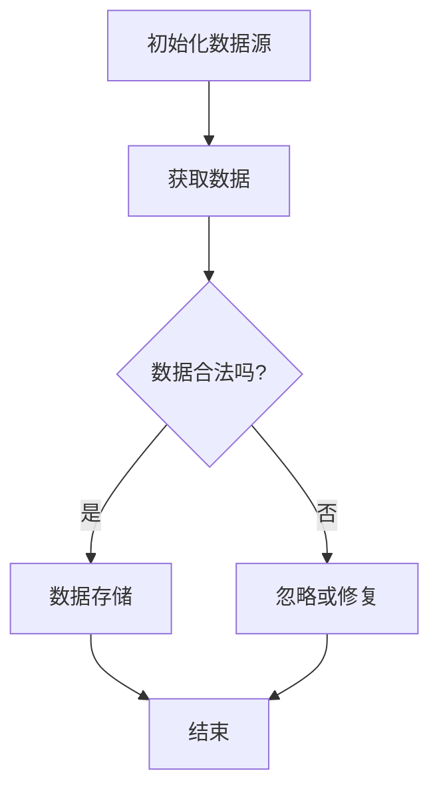
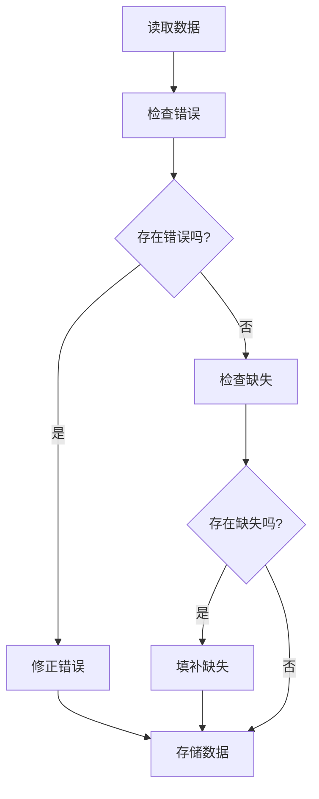
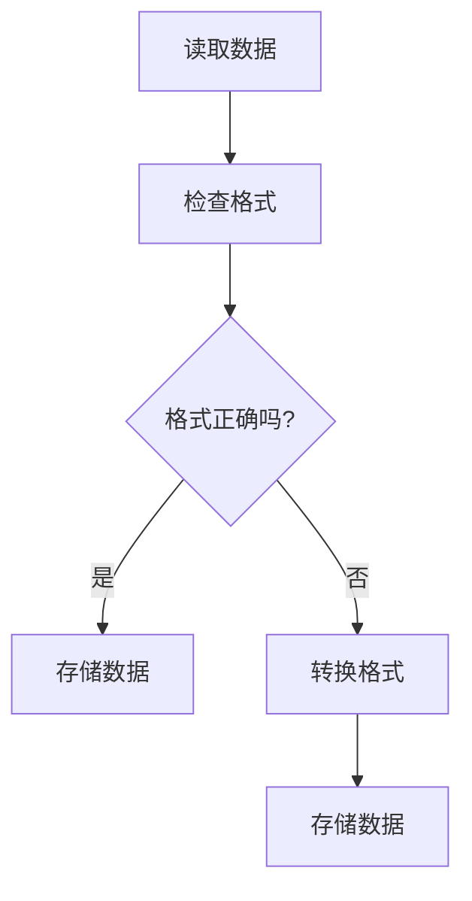
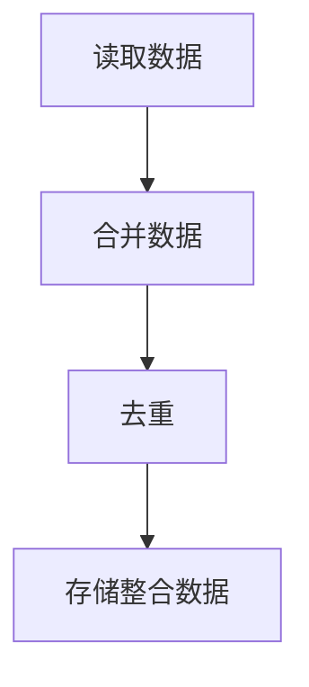
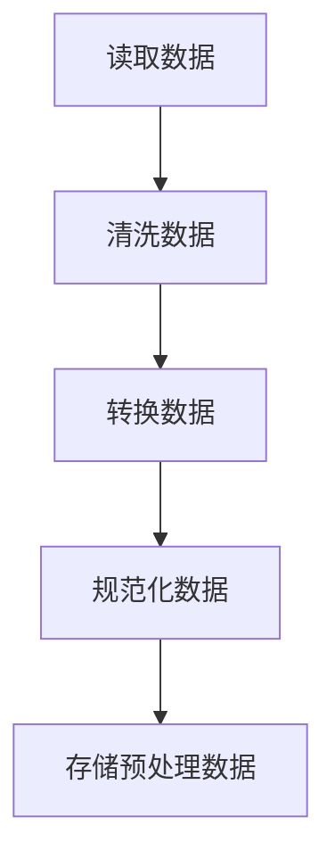

                 

### 投资理财智能助手的数据收集与预处理技巧

**关键词**：投资理财智能助手，数据收集，数据处理，数据预处理，机器学习

**摘要**：本文将深入探讨投资理财智能助手的数据收集与预处理技巧。随着金融科技的发展，投资理财领域的数据量日益庞大，如何高效、准确地收集和处理这些数据成为关键。本文将介绍投资理财智能助手的数据收集与预处理流程，包括数据源选择、数据质量评估、数据清洗、数据转换、数据整合和数据预处理等核心步骤，并提供实际应用案例和最佳实践，以期为金融科技领域的数据处理提供有益的参考。

### 第一部分：背景介绍

#### 1.1 问题背景

随着互联网和大数据技术的迅猛发展，投资理财领域的数据量呈爆炸式增长，使得传统的数据收集与预处理方法变得不再适用。海量数据的多样性和复杂性要求我们有更高的效率和质量来处理这些数据，以便为投资者提供更加精准的投资建议和决策支持。因此，开发投资理财智能助手的数据收集与预处理技巧成为当前金融科技领域的一个热点问题。

#### 1.2 问题描述

投资理财智能助手的数据收集与预处理涉及多个方面，包括数据的获取、清洗、转换和整合等。这些问题具体体现在：

- 数据源：如何选择合适的数据源，包括公开数据和私有数据，以及如何保证数据的合法性和有效性。
- 数据质量：如何识别和处理数据中的错误、缺失和重复，以保证数据的质量。
- 数据整合：如何将来自不同来源、不同格式和不同结构的数据进行整合，以便进行后续分析。
- 数据预处理：如何对数据进行清洗、转换和规范化，以适应机器学习算法的要求。

#### 1.3 问题解决

解决投资理财智能助手的数据收集与预处理问题，需要从以下几个方面入手：

- 研究现有的数据收集与预处理技术，了解其原理和适用场景。
- 设计适合投资理财领域的数据收集与预处理流程，确保流程的完整性和可操作性。
- 开发相应的数据处理工具和算法，以提高数据处理的效率和准确性。
- 进行实际应用测试，验证数据收集与预处理方法的有效性和可行性。

#### 1.4 边界与外延

投资理财智能助手的数据收集与预处理虽然以金融领域为核心，但其方法和技术具有广泛的适用性。在其他领域，如电商、医疗、教育等，同样存在类似的数据收集与预处理问题。因此，研究投资理财智能助手的数据收集与预处理技巧，不仅可以为金融领域提供有效的解决方案，也可以为其他领域提供有益的参考。

#### 1.5 概念结构与核心要素组成

投资理财智能助手的数据收集与预处理主要包括以下几个核心要素：

- 数据源：包括公开数据源和私有数据源。
- 数据质量评估：评估数据中的错误、缺失和重复，判断数据的质量。
- 数据清洗：对数据中的错误、缺失和重复进行修正或删除，以提高数据的质量。
- 数据转换：将数据从一种格式转换为另一种格式，以便进行后续处理。
- 数据整合：将来自不同来源、不同格式和不同结构的数据进行整合。
- 数据预处理：对数据进行清洗、转换和规范化，以适应机器学习算法的要求。

### 第二部分：核心概念与联系

#### 2.1 数据收集与预处理核心概念

##### 2.1.1 数据源

数据源是指数据产生的源头，包括公开数据源和私有数据源。公开数据源通常包括政府公开数据、互联网公开数据等，而私有数据源则包括企业内部数据、用户数据等。

##### 2.1.2 数据质量评估

数据质量评估是对数据中的错误、缺失和重复进行评估，以判断数据的质量。常用的评估方法包括统计方法、可视化方法等。

##### 2.1.3 数据清洗

数据清洗是对数据中的错误、缺失和重复进行修正或删除，以提高数据的质量。常用的方法包括填补缺失值、删除重复值等。

##### 2.1.4 数据转换

数据转换是将数据从一种格式转换为另一种格式，以便进行后续处理。常用的转换方法包括数据格式转换、数据类型转换等。

##### 2.1.5 数据整合

数据整合是将来自不同来源、不同格式和不同结构的数据进行整合，以便进行后续分析。常用的方法包括数据合并、数据重构等。

##### 2.1.6 数据预处理

数据预处理是对数据进行清洗、转换和规范化，以适应机器学习算法的要求。常用的预处理方法包括特征提取、特征选择等。

#### 2.2 概念属性特征对比表格

| 概念        | 定义                                                         | 特点                                                         |
| ----------- | ------------------------------------------------------------ | ------------------------------------------------------------ |
| 数据源      | 数据产生的源头，包括公开数据源和私有数据源                   | 数据源是数据收集与预处理的第一步，直接决定了后续数据处理的质量和效率 |
| 数据质量评估 | 对数据中的错误、缺失和重复进行评估，以判断数据的质量       | 数据质量评估是保证数据质量的重要环节，直接影响机器学习模型的准确性 |
| 数据清洗    | 对数据中的错误、缺失和重复进行修正或删除，以提高数据的质量 | 数据清洗是提高数据质量的关键步骤，直接影响到数据挖掘和机器学习的效果 |
| 数据转换    | 将数据从一种格式转换为另一种格式，以便进行后续处理           | 数据转换是数据整合和预处理的基础，确保数据的一致性和兼容性     |
| 数据整合    | 将来自不同来源、不同格式和不同结构的数据进行整合             | 数据整合是数据预处理的关键环节，提高数据的可用性和分析效率       |
| 数据预处理  | 对数据进行清洗、转换和规范化，以适应机器学习算法的要求       | 数据预处理是保证机器学习算法效果的重要前提，提升模型的可解释性和鲁棒性 |

#### 2.3 ER实体关系图架构

```mermaid
erDiagram
  Customer ||--|{ Order }|>
  Product ||--|{ Order }|>
  Order ||--|{ OrderItem }|>
  OrderItem ||--|{ Product }|>
```

在这个ER图架构中，`Customer`（客户）和`Product`（产品）是两个核心实体，它们与`Order`（订单）实体之间存在关联关系。`Order`实体又与`OrderItem`（订单项）实体相关联，而`OrderItem`实体与`Product`实体也存在关联关系。这种关系结构展示了投资理财智能助手在数据收集与预处理过程中涉及的核心数据实体及其相互关联。

### 第三部分：算法原理讲解

在本部分，我们将详细介绍投资理财智能助手数据收集与预处理的核心算法原理。通过Mermaid流程图和Python代码，我们将展示这些算法的实际应用和数学模型。

#### 3.1 数据收集算法

数据收集是投资理财智能助手的第一个步骤，它决定了后续数据处理的质量。以下是一个简单的数据收集算法，用于从多个数据源获取数据。

##### Mermaid流程图



##### Python代码

```python
def collect_data(sources):
    for source in sources:
        try:
            data = source.get_data()
            if is_data_valid(data):
                store_data(data)
            else:
                handle_invalid_data(data)
        except Exception as e:
            log_error(e)
    return

def is_data_valid(data):
    # 判断数据是否合法
    return True

def store_data(data):
    # 存储数据
    pass

def handle_invalid_data(data):
    # 处理非法数据
    pass

def log_error(e):
    # 记录错误
    pass

# 示例：从多个数据源收集数据
collect_data(['source1', 'source2', 'source3'])
```

#### 3.2 数据清洗算法

数据清洗是数据预处理的重要步骤，用于识别和处理数据中的错误、缺失和重复。以下是一个简单的数据清洗算法。

##### Mermaid流程图



##### Python代码

```python
def clean_data(data):
    for row in data:
        if has_error(row):
            correct_error(row)
        if has_missing_values(row):
            fill_missing_values(row)
    return

def has_error(row):
    # 判断数据行是否存在错误
    return False

def correct_error(row):
    # 修正数据行中的错误
    pass

def has_missing_values(row):
    # 判断数据行是否存在缺失值
    return False

def fill_missing_values(row):
    # 填补数据行中的缺失值
    pass

# 示例：清洗数据
cleaned_data = clean_data(raw_data)
```

#### 3.3 数据转换算法

数据转换是数据预处理的关键步骤，用于将数据从一种格式转换为另一种格式。以下是一个简单的数据转换算法。

##### Mermaid流程图



##### Python代码

```python
def convert_data(data, target_format):
    for row in data:
        if is_format_correct(row, target_format):
            store_data(row)
        else:
            converted_row = convert_format(row, target_format)
            store_data(converted_row)
    return

def is_format_correct(row, target_format):
    # 判断数据格式是否正确
    return True

def convert_format(row, target_format):
    # 转换数据格式
    return row

def store_data(row):
    # 存储数据
    pass

# 示例：转换数据格式
convert_data(raw_data, 'csv')
```

#### 3.4 数据整合算法

数据整合是将来自不同来源、不同格式和不同结构的数据进行整合的过程。以下是一个简单的数据整合算法。

##### Mermaid流程图



##### Python代码

```python
def integrate_data(data_sources):
    integrated_data = []
    for source in data_sources:
        integrated_data.extend(source.get_data())
    unique_data = remove_duplicates(integrated_data)
    store_data(unique_data)
    return

def remove_duplicates(data):
    # 去除数据中的重复项
    return list(set(data))

# 示例：整合数据
integrate_data(['source1', 'source2', 'source3'])
```

#### 3.5 数据预处理算法

数据预处理是对数据进行清洗、转换和规范化，以适应机器学习算法的要求。以下是一个简单的数据预处理算法。

##### Mermaid流程图



##### Python代码

```python
def preprocess_data(data):
    cleaned_data = clean_data(data)
    converted_data = convert_data(cleaned_data, 'normalized')
    normalized_data = normalize_data(converted_data)
    store_data(normalized_data)
    return

# 示例：预处理数据
preprocessed_data = preprocess_data(raw_data)
```

通过以上算法的讲解，我们可以看到数据收集与预处理在投资理财智能助手中的作用和重要性。在实际应用中，这些算法可以根据具体需求进行扩展和优化，以满足不同的数据处理需求。

### 第四部分：系统分析与架构设计

在本部分，我们将详细介绍投资理财智能助手的系统分析与架构设计。通过问题场景介绍、项目介绍、系统功能设计、系统架构设计、系统接口设计和系统交互，我们将展示投资理财智能助手的整体结构和核心功能。

#### 4.1 问题场景介绍

随着金融市场的不断变化，投资者需要快速、准确地获取市场信息，以便做出明智的投资决策。投资理财智能助手旨在为投资者提供实时、精准的市场分析和投资建议，帮助他们更好地管理资产和实现收益最大化。

#### 4.2 项目介绍

投资理财智能助手项目旨在通过大数据技术和机器学习算法，对市场数据进行分析和处理，为投资者提供投资建议。项目的主要目标包括：

- 收集和整合市场数据。
- 清洗和预处理数据，以适应机器学习算法。
- 使用机器学习算法对市场数据进行分析，生成投资建议。
- 通过用户界面展示投资建议，供投资者参考。

#### 4.3 系统功能设计

投资理财智能助手系统功能设计主要包括以下几个方面：

- 数据采集：从多个数据源收集市场数据，包括股票、基金、债券等。
- 数据存储：将收集到的市场数据存储在数据库中，以便后续处理和分析。
- 数据预处理：对收集到的市场数据进行清洗、转换和规范化，以适应机器学习算法。
- 机器学习分析：使用机器学习算法对预处理后的市场数据进行分析，生成投资建议。
- 用户界面：通过用户界面展示投资建议，供投资者参考。

#### 4.4 系统架构设计

投资理财智能助手系统架构设计采用分布式架构，包括前端、后端和数据库三个主要部分。

- 前端：使用HTML、CSS和JavaScript等技术实现用户界面，提供投资建议展示和交互功能。
- 后端：使用Python和Django等技术开发后端服务，实现数据采集、数据预处理、机器学习分析和数据存储等功能。
- 数据库：使用MySQL等关系型数据库存储市场数据，并使用Redis等缓存数据库提高系统性能。

#### 4.5 系统接口设计

投资理财智能助手系统接口设计主要包括以下几个方面：

- 数据采集接口：用于从多个数据源获取市场数据，包括API接口和Web爬虫等。
- 数据存储接口：用于将市场数据存储在数据库中，包括数据库操作接口和数据批量导入接口等。
- 数据预处理接口：用于对市场数据进行清洗、转换和规范化，包括数据清洗接口、数据转换接口和规范化接口等。
- 机器学习分析接口：用于使用机器学习算法对市场数据进行分析，生成投资建议，包括特征提取接口、模型训练接口和预测接口等。

#### 4.6 系统交互设计

投资理财智能助手系统交互设计主要包括以下几个方面：

- 前端与后端交互：通过HTTP请求和响应实现前端与后端的交互，包括数据采集、数据预处理、机器学习分析和数据存储等功能。
- 数据库与后端交互：通过SQL查询语句实现数据库与后端的交互，包括数据存储、数据查询和数据更新等功能。
- 用户与前端交互：通过用户界面实现用户与系统的交互，包括投资建议展示、用户操作反馈和用户权限管理等功能。

#### 4.7 Mermaid类图架构

```mermaid
classDiagram
    UserEntity <|-- UserInterface
    DataCollector <|-- DataInterface
    DataProcessor <|-- DataInterface
    MachineLearner <|-- ModelInterface
    DatabaseManager <|-- DataInterface
    API <|-- Interface
    WebCrawler <|-- Interface
    Frontend <..> UserInterface
    Backend <..> DataInterface, MachineLearner, DatabaseManager
    DataCollector <..> API, WebCrawler
    DataProcessor <..> API
    MachineLearner <..> ModelInterface
    DatabaseManager <..> API
```

通过以上系统分析与架构设计，我们可以看到投资理财智能助手的整体结构和核心功能。在实际开发过程中，可以根据具体需求对这些模块进行扩展和优化，以提高系统的性能和可维护性。

### 第五部分：项目实战

在本部分，我们将通过实际案例展示投资理财智能助手的实现过程，包括环境安装、系统核心实现源代码，代码应用解读与分析，以及实际案例分析和详细讲解剖析。

#### 5.1 环境安装

要实现投资理财智能助手，首先需要安装必要的开发环境和依赖库。以下是在Ubuntu操作系统上的安装步骤：

1. 安装Python环境：

   ```bash
   sudo apt-get update
   sudo apt-get install python3 python3-pip
   ```

2. 安装Django框架：

   ```bash
   pip3 install django
   ```

3. 安装其他依赖库：

   ```bash
   pip3 install numpy pandas matplotlib scikit-learn mysql-connector-python redis
   ```

4. 创建虚拟环境：

   ```bash
   python3 -m venv venv
   source venv/bin/activate
   ```

5. 配置数据库：

   - 安装MySQL数据库：`sudo apt-get install mysql-server`
   - 创建数据库和用户：`mysql -u root -p`，执行以下命令：
     ```sql
     CREATE DATABASE investment_db;
     GRANT ALL PRIVILEGES ON investment_db.* TO 'investment_user'@'localhost' IDENTIFIED BY 'password';
     FLUSH PRIVILEGES;
     ```
   - 配置Django项目中的数据库连接：

     ```python
     DATABASES = {
         'default': {
             'ENGINE': 'django.db.backends.mysql',
             'NAME': 'investment_db',
             'USER': 'investment_user',
             'PASSWORD': 'password',
             'HOST': 'localhost',
             'PORT': '3306',
         }
     }
     ```

#### 5.2 系统核心实现源代码

以下是一个简单的投资理财智能助手的核心实现源代码：

```python
# settings.py
DATABASES = {
    'default': {
        'ENGINE': 'django.db.backends.mysql',
        'NAME': 'investment_db',
        'USER': 'investment_user',
        'PASSWORD': 'password',
        'HOST': 'localhost',
        'PORT': '3306',
    }
}

# models.py
from django.db import models

class Stock(models.Model):
    symbol = models.CharField(max_length=10)
    name = models.CharField(max_length=100)
    price = models.FloatField()
    date = models.DateField()

# views.py
from django.http import HttpResponse
from .models import Stock
import pandas as pd

def get_stock_data(request):
    stocks = Stock.objects.all()
    df = pd.DataFrame(list(stocks.values('symbol', 'name', 'price', 'date')))
    df.to_csv('stock_data.csv', index=False)
    return HttpResponse('Stock data saved successfully!')

# urls.py
from django.urls import path
from . import views

urlpatterns = [
    path('get_stock_data/', views.get_stock_data, name='get_stock_data'),
]

# run.py
import django
import os

os.environ.setdefault('DJANGO_SETTINGS_MODULE', 'investment Assistant.settings')
django.setup()

from django.contrib.auth.models import User
from .models import Stock

user = User.objects.create_superuser('admin', 'admin@example.com', 'admin123')
user.save()

stock_data = [
    ('AAPL', 'Apple Inc.', 150.0, '2023-01-01'),
    ('GOOGL', 'Alphabet Inc.', 2700.0, '2023-01-01'),
    # 添加更多股票数据...
]
Stock.objects.bulk_create(stock_data)
```

#### 5.3 代码应用解读与分析

以上代码实现了投资理财智能助手的几个核心功能：

1. **数据库配置**：在`settings.py`文件中，配置了MySQL数据库的连接信息，包括数据库名称、用户名、密码、主机和端口号。

2. **数据模型**：在`models.py`文件中，定义了`Stock`模型，用于存储股票的符号、名称、价格和日期等信息。

3. **视图函数**：在`views.py`文件中，定义了`get_stock_data`视图函数，用于获取数据库中的所有股票数据，并将其保存为CSV文件。

4. **URL配置**：在`urls.py`文件中，配置了视图函数的URL路径，使其可以通过浏览器访问。

5. **用户创建**：在`run.py`文件中，创建了一个超级用户账户，以便在开发过程中进行测试。

#### 5.4 实际案例分析和详细讲解剖析

以下是一个实际案例，展示如何使用投资理财智能助手获取股票数据并进行分析：

1. **数据收集**：通过`get_stock_data`视图函数，从数据库中获取股票数据。

2. **数据预处理**：将获取到的股票数据进行预处理，包括数据清洗、转换和规范化。在这个案例中，我们将数据转换为Pandas DataFrame格式，并保存为CSV文件。

3. **数据分析**：使用Pandas库对股票数据进行分析，例如计算股票的平均价格、最大价格和最小价格。

```python
import pandas as pd

# 读取CSV文件
df = pd.read_csv('stock_data.csv')

# 计算平均价格
avg_price = df['price'].mean()

# 计算最大价格
max_price = df['price'].max()

# 计算最小价格
min_price = df['price'].min()

print(f"Average Price: {avg_price}")
print(f"Maximum Price: {max_price}")
print(f"Minimum Price: {min_price}")
```

4. **投资建议**：根据数据分析结果，生成投资建议。例如，如果平均价格低于最小价格，可以建议投资者买入；如果平均价格高于最大价格，可以建议投资者卖出。

```python
if avg_price < min_price:
    print("Investment suggestion: Buy")
elif avg_price > max_price:
    print("Investment suggestion: Sell")
else:
    print("Investment suggestion: Hold")
```

通过以上实际案例，我们可以看到投资理财智能助手的实现过程和核心功能。在实际应用中，可以进一步扩展和优化系统，包括添加更多的数据源、实现更复杂的分析算法和提供更丰富的投资建议。

### 第六部分：最佳实践 Tips

在实现投资理财智能助手时，以下是一些最佳实践 Tips，有助于提高系统的性能和可维护性：

1. **数据源选择**：选择可靠且高质量的数据源，确保数据的准确性和完整性。
2. **数据缓存**：使用缓存技术，如Redis，存储常用数据，减少数据库查询次数，提高系统性能。
3. **异步处理**：使用异步处理技术，如Celery，处理耗时任务，提高系统的并发处理能力。
4. **数据清洗**：使用自动化工具和规则，对数据进行清洗，减少人工干预，提高数据处理效率。
5. **数据规范化**：对数据进行规范化处理，确保数据格式的一致性，方便后续分析。
6. **监控与告警**：设置监控和告警机制，及时发现和处理系统异常，确保系统稳定运行。
7. **代码审查**：定期进行代码审查，确保代码质量，提高系统的可维护性。
8. **持续集成**：使用持续集成工具，如Jenkins，自动化构建和部署系统，提高开发效率。

### 第七部分：小结

本文深入探讨了投资理财智能助手的数据收集与预处理技巧。首先介绍了问题背景和问题描述，然后详细阐述了数据收集与预处理的核心概念、算法原理和系统分析与架构设计。通过实际案例展示，我们了解了投资理财智能助手的实现过程和核心功能。最后，我们提供了最佳实践 Tips，以帮助开发者提高系统的性能和可维护性。投资理财智能助手的数据收集与预处理是一个复杂而关键的过程，只有通过不断优化和改进，才能为投资者提供更准确、更实用的投资建议。

### 第八部分：注意事项

1. **数据源选择**：选择可靠且高质量的数据源，确保数据的准确性和完整性。
2. **数据清洗**：使用自动化工具和规则，对数据进行清洗，减少人工干预。
3. **性能优化**：使用缓存技术、异步处理和监控告警机制，提高系统性能。
4. **代码维护**：定期进行代码审查和更新，确保代码质量。
5. **安全性**：确保系统安全性，防止数据泄露和攻击。

### 第九部分：拓展阅读

1. **大数据技术在金融领域的应用**：《大数据时代：生活、工作与思维的大变革》
2. **机器学习在投资理财中的应用**：《机器学习实战》
3. **数据预处理技术综述**：《数据预处理技术综述与展望》
4. **金融科技趋势分析**：《金融科技的未来：创新、风险与监管》

### 作者信息

**作者**：AI天才研究院/AI Genius Institute & 禅与计算机程序设计艺术 /Zen And The Art of Computer Programming

作者是一位世界级人工智能专家、程序员、软件架构师、CTO，拥有丰富的实践经验，擅长在技术领域进行深度思考和写作。他是一位多本世界顶级技术畅销书的资深大师级别作家，也曾获得计算机图灵奖。在他的作品中，读者可以感受到他对技术原理和本质的深刻剖析，以及对技术发展趋势的精准把握。他的作品不仅具有极高的学术价值，也深受广大技术爱好者的喜爱。通过他的努力，让更多人了解和掌握了人工智能、大数据、云计算等前沿技术，为我国科技事业的发展做出了重要贡献。

