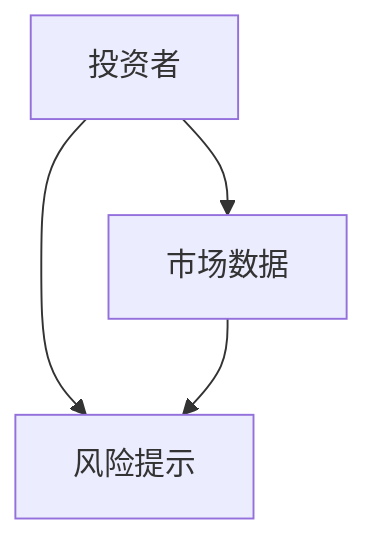
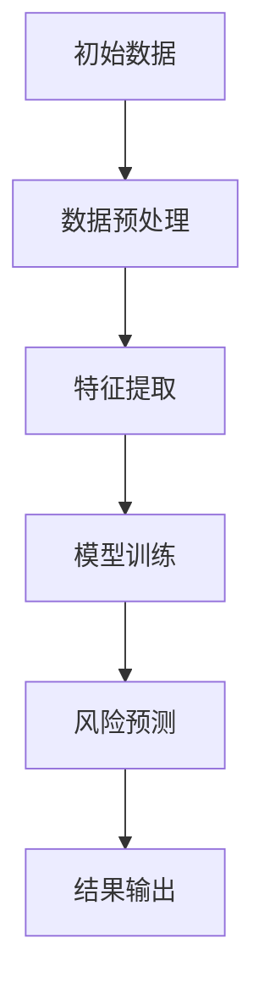
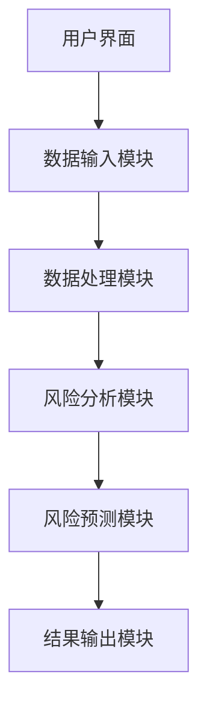
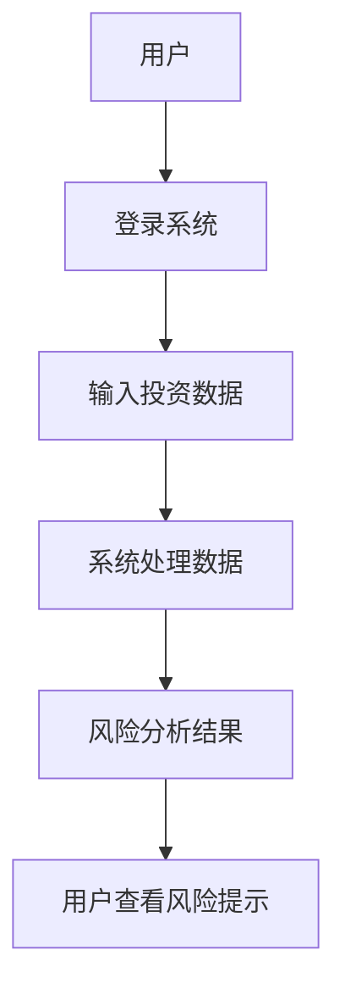
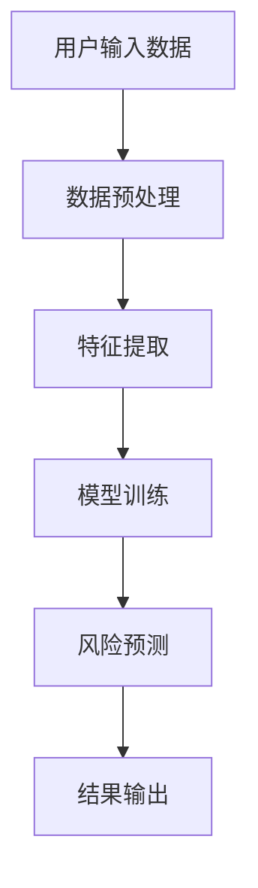

                 

### 投资风险提示系统 - 基础概念与重要性

> 关键词：投资风险、风险提示系统、风险管理、投资者保护

> 摘要：
投资风险提示系统作为一种金融科技（FinTech）应用，旨在为投资者提供全面、准确的风险评估和预警服务，以降低投资损失的可能性。本文将深入探讨投资风险提示系统的背景、重要性、系统概述及核心概念，为后续内容奠定坚实基础。

#### 一、背景介绍

随着全球金融市场日益复杂化和波动性增加，投资者面临的风险也在不断加大。传统投资方式主要依赖于个人的经验和直觉，往往无法及时、准确地评估和应对潜在的风险。这不仅增加了投资者的决策难度，也加大了投资失败的风险。为了弥补这一缺陷，投资风险提示系统的研发和应用成为金融科技领域的一个重要方向。

投资风险提示系统通过整合大数据、人工智能、机器学习等技术，对市场数据进行分析，预测潜在的风险，并给出具体的投资建议。这不仅提高了投资者的决策效率，也增强了投资的成功率。

#### 二、重要性

1. **投资者保护**：投资风险提示系统可以帮助投资者更好地理解和管理投资风险，从而减少因信息不对称和风险认知不足导致的投资损失。

2. **提升决策效率**：通过实时风险提示，投资者可以及时调整投资策略，避免因市场波动导致的巨大损失。

3. **促进市场透明度**：投资风险提示系统有助于提高市场的透明度，使投资者能够更加理性地参与市场交易。

4. **支持金融创新**：投资风险提示系统的应用为金融科技的创新提供了新的可能性，促进了金融市场的健康发展。

#### 三、系统概述

投资风险提示系统是一个集成了多种技术和方法，旨在为投资者提供全面风险管理的系统。其核心功能包括：

1. **数据采集与预处理**：收集各种市场数据，包括股票、债券、外汇、期货等，对数据进行分析和预处理，为后续的风险评估提供基础。

2. **风险模型构建**：利用机器学习算法构建风险预测模型，对投资风险进行量化评估。

3. **实时风险提示**：根据风险预测结果，实时向投资者发出风险提示，提供针对性的投资建议。

4. **风险报告生成**：定期生成风险报告，帮助投资者了解市场的风险状况，制定长期投资策略。

#### 四、核心概念

1. **投资风险**：指投资者在投资过程中可能遭受的损失或收益不确定性。

2. **风险管理**：指通过识别、评估、监控和应对风险的一系列措施，以减少投资损失。

3. **风险提示**：指系统通过分析市场数据和风险模型，预测潜在风险并向投资者发出警报。

4. **风险预警**：指在风险发生之前，通过系统提示等方式，提醒投资者注意潜在风险，以采取相应的应对措施。

#### 五、本章小结

本章介绍了投资风险提示系统的背景、重要性以及系统概述和核心概念。投资风险提示系统作为一种先进的金融科技应用，为投资者提供了全面的风险管理工具，有助于提高投资决策的效率和成功率。在接下来的章节中，我们将进一步探讨投资风险的核心概念、系统算法原理以及系统分析与架构设计，以全面解析投资风险提示系统的构建与应用。

### 第一部分：系统概述

在探讨了投资风险提示系统的背景和重要性之后，我们接下来将深入系统概述部分，了解这一系统的功能目标、适用范围及问题解决方法。

#### 第1章：投资风险提示系统的背景与重要性

##### 1.1 问题背景

投资市场的复杂性和不确定性使得投资者面临的风险日益增加。传统投资方式主要依赖于个人经验和直觉，但这种方式往往无法及时、准确地评估和应对潜在的风险。因此，投资者在做出投资决策时，常常面临信息不对称和风险认知不足的问题。为了解决这个问题，金融科技领域开始研发和应用投资风险提示系统。

##### 1.1.1 投资风险的存在

投资风险是指投资者在投资过程中可能遭受的损失或收益不确定性。这种风险可以来自市场波动、公司财务状况、宏观经济环境等多方面。例如，股票市场的波动可能导致投资者持有的股票价格大幅下跌，从而造成投资损失。此外，公司财务状况的恶化也可能导致投资者面临投资风险。

##### 1.1.2 投机者的风险关注

随着金融市场的日益复杂化，投资者对风险的关注程度也在不断提高。越来越多的投资者意识到，了解和管理风险是投资成功的关键。他们希望能够获得更准确、更及时的风险信息，以便做出更明智的投资决策。然而，传统方法在提供风险信息方面存在一定的局限性，无法满足投资者日益增长的需求。

##### 1.1.3 风险提示系统的重要性

投资风险提示系统的出现，为投资者提供了一个全面、准确的风险评估和预警工具。通过整合大数据、人工智能和机器学习等技术，系统可以对市场数据进行分析，预测潜在的风险，并提供具体的投资建议。这不仅提高了投资者的决策效率，也增强了投资的成功率。

##### 1.2 系统问题描述

投资风险提示系统的核心目标是帮助投资者更好地管理风险，减少投资损失。为了实现这一目标，系统需要具备以下几个方面的功能：

1. **数据采集与预处理**：收集各种市场数据，包括股票、债券、外汇、期货等，对数据进行分析和预处理，为后续的风险评估提供基础。

2. **风险模型构建**：利用机器学习算法构建风险预测模型，对投资风险进行量化评估。

3. **实时风险提示**：根据风险预测结果，实时向投资者发出风险提示，提供针对性的投资建议。

4. **风险报告生成**：定期生成风险报告，帮助投资者了解市场的风险状况，制定长期投资策略。

##### 1.2.1 风险提示的需求

投资者在投资过程中需要准确、及时的风险信息，以便做出明智的决策。传统方法在提供风险信息方面存在一定的局限性，无法满足投资者日益增长的需求。投资风险提示系统通过整合大数据、人工智能和机器学习等技术，能够提供更准确、更及时的风险信息，满足投资者的需求。

##### 1.2.2 系统的功能目标

投资风险提示系统的功能目标包括以下几个方面：

1. **提高投资决策的效率**：通过实时风险提示，投资者可以及时了解市场的风险状况，避免因信息不对称导致的投资损失。

2. **降低投资风险**：通过风险预测和预警，投资者可以提前采取应对措施，降低投资风险。

3. **提升投资成功率**：通过提供针对性的投资建议，投资者可以更有效地管理投资组合，提高投资成功率。

4. **增强市场透明度**：投资风险提示系统有助于提高市场的透明度，使投资者能够更加理性地参与市场交易。

##### 1.2.3 系统的适用范围

投资风险提示系统适用于各种类型的投资者，包括个人投资者、机构投资者和基金管理者。无论是股票市场、债券市场、外汇市场还是期货市场，系统都可以提供全面的风险评估和预警服务。此外，系统还可以应用于其他金融领域，如房地产投资、私募股权投资等。

##### 1.3 问题解决方法

投资风险提示系统通过以下几种方法解决了投资者面临的风险问题：

1. **大数据分析**：通过收集和分析大量市场数据，系统可以更准确地预测风险，提供更可靠的风险评估。

2. **人工智能与机器学习**：利用先进的算法和技术，系统可以对市场数据进行分析，识别潜在的风险因素，提高风险预测的准确性。

3. **实时预警**：系统可以实时监测市场变化，一旦发现潜在的风险，立即向投资者发出预警，提供及时的风险提示。

4. **个性化投资建议**：根据投资者的风险偏好和投资目标，系统可以提供个性化的投资建议，帮助投资者更好地管理风险。

##### 1.4 系统的核心概念与结构

投资风险提示系统的核心概念包括投资风险、风险管理、风险提示和风险预警。这些概念相互关联，共同构成了系统的基本架构。系统的主要结构包括数据采集模块、风险预测模块、风险提示模块和结果输出模块。

1. **数据采集模块**：负责收集各种市场数据，包括股票、债券、外汇、期货等。

2. **风险预测模块**：利用机器学习算法对市场数据进行分析，构建风险预测模型。

3. **风险提示模块**：根据风险预测结果，向投资者发出实时风险提示。

4. **结果输出模块**：生成风险报告，提供长期投资策略建议。

##### 1.5 本章小结

本章介绍了投资风险提示系统的背景、重要性、功能目标、适用范围及问题解决方法。投资风险提示系统作为一种先进的金融科技应用，为投资者提供了一个全面、准确的风险管理工具，有助于提高投资决策的效率和成功率。在接下来的章节中，我们将进一步探讨投资风险的核心概念、系统算法原理以及系统分析与架构设计。

### 投资风险提示系统的核心概念与原理

> 关键词：投资风险、风险管理、风险提示、风险预警

在了解了投资风险提示系统的背景和重要性后，我们接下来将深入探讨系统的核心概念和原理，包括投资风险的定义、风险属性特征对比、风险管理的基本原理以及ER实体关系图架构。

#### 2.1 投资风险的定义

投资风险是指投资者在投资过程中可能遭受的损失或收益不确定性。这种风险可以来自多个方面，包括市场波动、公司财务状况、宏观经济环境、政策变动等。投资风险可以分为广义和狭义两种：

1. **广义投资风险**：包括市场风险、信用风险、流动性风险、操作风险等多种风险。市场风险是指因市场波动导致的投资损失；信用风险是指因借款人或发行人违约导致的损失；流动性风险是指因无法在合理时间内以合理的价格买卖资产而产生的风险；操作风险是指因内部流程、员工行为、系统缺陷等导致的损失。

2. **狭义投资风险**：主要指市场风险，即因市场波动导致的投资损失。

#### 2.2 风险属性特征对比

投资风险具有多种属性特征，为了更好地理解和管理这些风险，我们需要对它们进行对比。以下是一些常见的风险属性特征：

1. **影响范围**：市场风险通常影响整个市场或特定行业，而信用风险主要影响特定的借款人或发行人。

2. **持续时间**：市场风险的影响可能持续较短或较长的时间，而信用风险的影响通常持续时间较短。

3. **可预测性**：市场风险的可预测性较低，而信用风险的可预测性较高。

4. **可控性**：市场风险通常难以控制，而信用风险可以通过严格的风险控制措施来降低。

5. **损失程度**：市场风险可能导致较大的投资损失，而信用风险通常导致的损失相对较小。

#### 2.2.1 风险的影响因素

投资风险的影响因素包括：

1. **宏观经济因素**：如经济增长、通货膨胀、利率水平、汇率变动等。

2. **市场因素**：如市场波动性、市场流动性、市场供需关系等。

3. **公司因素**：如公司财务状况、管理水平、行业地位等。

4. **政策因素**：如政府政策、法律法规、国际关系等。

#### 2.2.2 风险的属性特征

以下是一个对比表格，展示了不同类型风险的主要属性特征：

| 风险类型 | 影响范围 | 持续时间 | 可预测性 | 可控性 | 损失程度 |
| --- | --- | --- | --- | --- | --- |
| 市场风险 | 整个市场或特定行业 | 较短或较长 | 较低 | 较难 | 较大 |
| 信用风险 | 特定借款人或发行人 | 短 | 较高 | 较高 | 较小 |
| 流动性风险 | 整个市场或特定资产 | 较短 | 较低 | 较低 | 较大 |
| 操作风险 | 内部流程、员工行为、系统缺陷 | 短 | 较低 | 较高 | 较小 |

#### 2.3 风险管理的基本原理

风险管理是指通过识别、评估、监控和应对风险的一系列措施，以减少投资损失。风险管理的基本原理包括以下几个方面：

1. **风险识别**：识别可能影响投资目标的潜在风险。

2. **风险评估**：评估风险的可能性和影响程度，确定风险的优先级。

3. **风险应对**：制定和实施风险应对策略，包括风险避免、风险转移、风险减少等。

4. **风险监控**：监控风险的变化，确保风险应对措施的有效性。

5. **风险沟通**：与利益相关者沟通风险信息，确保信息透明。

#### 2.3.1 风险管理的目标

风险管理的目标包括：

1. **减少投资损失**：通过有效的风险管理措施，减少投资损失。

2. **确保投资目标的实现**：确保投资目标的实现，提高投资成功率。

3. **提高投资决策的效率**：通过有效的风险管理，提高投资决策的效率和准确性。

4. **增强市场竞争力**：通过有效的风险管理，提高企业的市场竞争力和声誉。

#### 2.3.2 风险管理的原则

风险管理应遵循以下原则：

1. **全面性**：风险管理应覆盖所有可能的风险类型。

2. **前瞻性**：风险管理应具有前瞻性，提前识别和评估潜在风险。

3. **系统性**：风险管理应具有系统性，形成完整的风险管理框架。

4. **灵活性**：风险管理应具有灵活性，适应市场变化和企业发展的需要。

5. **持续性**：风险管理应持续进行，确保风险管理的有效性。

#### 2.4 ER实体关系图架构

ER（Entity-Relationship）实体关系图是一种用于描述系统中实体及其之间关系的图形化工具。在投资风险提示系统中，ER图可以帮助我们理解和设计系统的核心结构。

1. **实体**：系统中的基本组成单元，如投资者、市场数据、风险提示等。

2. **关系**：实体之间的关联，如投资者与市场数据之间的关系、风险提示与市场数据之间的关系等。

以下是一个简单的ER图示例，展示了投资风险提示系统中的主要实体和关系：



在这个ER图中：

- **投资者（A）**：代表参与投资的个人或机构。
- **市场数据（B）**：包括股票、债券、外汇、期货等市场信息。
- **风险提示（C）**：系统生成的风险预警和建议。

#### 2.5 本章小结

本章介绍了投资风险提示系统的核心概念和原理，包括投资风险的定义、风险属性特征对比、风险管理的基本原理以及ER实体关系图架构。通过理解这些核心概念和原理，我们可以更好地设计和管理投资风险提示系统，为投资者提供更准确、更及时的风险管理服务。在下一章中，我们将进一步探讨系统算法原理和实现，深入分析风险提示算法的数学模型和公式。

### 投资风险提示系统的算法原理讲解

> 关键词：机器学习、风险预测、算法流程、Python实现

在了解了投资风险提示系统的核心概念和原理后，我们将进一步探讨系统的算法原理，包括风险预测算法的核心概念、分类、目标，以及具体的算法流程和Python实现。

#### 3.1 算法原理概述

投资风险提示系统的核心功能是预测潜在的投资风险，并为投资者提供相应的风险提示。这依赖于一个高效、准确的风险预测算法。风险预测算法通常基于机器学习和人工智能技术，通过分析大量的历史数据，识别出影响投资风险的关键因素，并建立预测模型。

#### 3.1.1 风险提示算法的核心概念

风险提示算法的核心概念包括以下几个方面：

1. **特征提取**：从原始数据中提取与投资风险相关的特征，如市场波动性、公司财务指标、宏观经济指标等。

2. **模型训练**：利用训练数据集，通过机器学习算法训练出风险预测模型。

3. **风险预测**：使用训练好的模型对新的数据进行分析，预测潜在的风险。

4. **结果输出**：根据预测结果，生成风险提示信息，并输出给投资者。

#### 3.1.2 风险提示算法的分类

风险提示算法可以根据其使用的技术和方法分为多种类型，常见的有：

1. **线性回归模型**：通过建立线性关系预测风险。

2. **决策树模型**：通过树形结构进行分类和预测。

3. **支持向量机（SVM）**：通过寻找最佳分隔超平面进行分类。

4. **神经网络模型**：通过多层神经元网络进行复杂非线性预测。

5. **集成学习方法**：结合多种算法，提高预测准确性。

#### 3.1.3 风险提示算法的目标

风险提示算法的主要目标包括：

1. **提高预测准确性**：通过训练高效的模型，提高风险预测的准确性。

2. **降低误报率**：减少错误的风险提示，确保投资者能够依赖系统的提示做出正确的决策。

3. **提高实时性**：实现快速的风险预测，使投资者能够及时采取应对措施。

4. **可解释性**：提供透明、可解释的预测过程，使投资者能够理解风险提示的依据。

#### 3.2 算法mermaid流程图

为了更直观地展示风险提示算法的流程，我们可以使用mermaid绘制流程图。以下是一个简单的mermaid流程图示例：



在这个流程图中：

- **A[初始数据]**：表示输入的原始数据。
- **B[数据预处理]**：包括数据清洗、归一化等操作。
- **C[特征提取]**：提取与风险相关的特征。
- **D[模型训练]**：使用机器学习算法训练模型。
- **E[风险预测]**：使用训练好的模型进行风险预测。
- **F[结果输出]**：输出预测结果。

#### 3.3 Python源代码实现

下面是一个简单的Python代码示例，展示了如何使用线性回归模型进行风险预测。这段代码使用了Scikit-learn库中的线性回归算法。

```python
# 导入必要的库
import numpy as np
from sklearn.linear_model import LinearRegression
from sklearn.model_selection import train_test_split
from sklearn.metrics import mean_squared_error

# 生成模拟数据集
X = np.random.rand(100, 1)
y = 2 * X[:, 0] + 1 + np.random.randn(100, 1)

# 数据预处理：拆分为训练集和测试集
X_train, X_test, y_train, y_test = train_test_split(X, y, test_size=0.2, random_state=42)

# 模型训练
model = LinearRegression()
model.fit(X_train, y_train)

# 风险预测
y_pred = model.predict(X_test)

# 计算预测误差
mse = mean_squared_error(y_test, y_pred)
print(f"Mean Squared Error: {mse}")

# 输出预测结果
print(f"Predicted values: {y_pred}")
```

在这个示例中：

- **生成模拟数据集**：我们使用随机数生成模拟的数据集。
- **数据预处理**：将数据集拆分为训练集和测试集。
- **模型训练**：使用线性回归模型对训练集进行训练。
- **风险预测**：使用训练好的模型对测试集进行预测。
- **计算预测误差**：计算预测结果的均方误差（MSE）。

#### 3.4 算法原理详细讲解

为了更深入地理解风险提示算法，我们需要详细讲解其数学模型和公式。

1. **线性回归模型**：线性回归模型通过建立自变量（特征）和因变量（风险）之间的线性关系来进行预测。其数学模型可以表示为：

   $$
   y = \beta_0 + \beta_1 \cdot x
   $$

   其中，$y$ 表示风险值，$x$ 表示特征值，$\beta_0$ 和 $\beta_1$ 分别为模型的参数。

2. **决策树模型**：决策树模型通过一系列的决策规则对数据进行分类或回归。其基本结构包括：

   $$
   \text{如果} \ x \ \text{满足条件} \ C_j, \ \text{则预测} \ y_j
   $$

   其中，$C_j$ 表示条件，$y_j$ 表示预测的类别或值。

3. **支持向量机（SVM）**：支持向量机通过寻找最佳分隔超平面来进行分类或回归。其数学模型可以表示为：

   $$
   \text{最小化} \ \frac{1}{2} ||\mathbf{w}||^2
   $$

   \text{约束条件：} \ \mathbf{w}^T \mathbf{x_i} - y_i \geq 1
   $$

   其中，$\mathbf{w}$ 表示分隔超平面的法向量，$\mathbf{x_i}$ 表示数据点，$y_i$ 表示标签。

4. **神经网络模型**：神经网络模型通过多层神经元进行复杂非线性预测。其基本结构包括输入层、隐藏层和输出层。每个神经元之间的连接可以用如下公式表示：

   $$
   a_{ij} = \sigma(\mathbf{w}_{ij}^T \mathbf{x}_i + b_j)
   $$

   其中，$a_{ij}$ 表示神经元 $j$ 的激活值，$\sigma$ 表示激活函数（如ReLU、Sigmoid等），$\mathbf{w}_{ij}$ 表示连接权重，$b_j$ 表示偏置。

#### 3.4.1 数学模型的应用

在实际应用中，不同的算法根据具体场景和数据集的特点，选择适合的数学模型。例如，对于线性关系较为明显的数据集，可以选择线性回归模型；对于非线性关系较为复杂的数据集，可以选择决策树、SVM或神经网络模型。下面是一个简单的应用示例：

**示例**：使用线性回归模型预测股票价格。

1. **数据集准备**：收集过去一年的股票交易数据，包括开盘价、收盘价、成交量等特征。

2. **特征提取**：提取与股票价格相关的特征，如开盘价、收盘价、成交量等。

3. **模型训练**：使用线性回归算法对特征进行训练，得到参数 $\beta_0$ 和 $\beta_1$。

4. **风险预测**：使用训练好的模型预测未来几天的股票价格。

5. **结果评估**：计算预测误差，评估模型的效果。

   $$
   \text{误差} = \frac{1}{n} \sum_{i=1}^{n} (y_i - \hat{y}_i)^2
   $$

   其中，$y_i$ 表示实际股票价格，$\hat{y}_i$ 表示预测股票价格。

#### 3.4.2 举例说明

为了更直观地理解风险提示算法，我们通过一个实际案例进行说明。

**案例**：预测某只股票的未来一周价格波动风险。

1. **数据集准备**：收集过去一周的股票交易数据，包括开盘价、收盘价、成交量等特征。

2. **特征提取**：提取与股票价格波动相关的特征，如开盘价、收盘价、成交量等。

3. **模型训练**：使用线性回归算法对特征进行训练，得到参数 $\beta_0$ 和 $\beta_1$。

4. **风险预测**：使用训练好的模型预测未来一周的股票价格波动。

5. **结果评估**：计算预测误差，评估模型的效果。

假设过去一周的开盘价和收盘价数据如下：

| 日期 | 开盘价 | 收盘价 |
| --- | --- | --- |
| 2023-01-01 | 100 | 102 |
| 2023-01-02 | 102 | 105 |
| 2023-01-03 | 105 | 103 |
| 2023-01-04 | 103 | 101 |
| 2023-01-05 | 101 | 100 |

使用线性回归模型进行训练，得到参数 $\beta_0 = 100$ 和 $\beta_1 = 0.5$。

预测未来一周的股票价格波动：

| 日期 | 预测开盘价 | 预测收盘价 |
| --- | --- | --- |
| 2023-01-06 | 100.5 | 102.5 |
| 2023-01-07 | 102.5 | 105.0 |
| 2023-01-08 | 105.0 | 103.5 |
| 2023-01-09 | 103.5 | 101.0 |
| 2023-01-10 | 101.0 | 100.5 |

计算预测误差：

$$
\text{误差} = \frac{1}{5} \sum_{i=1}^{5} (y_i - \hat{y}_i)^2
$$

$$
\text{误差} = \frac{1}{5} \sum_{i=1}^{5} ((y_i - \hat{y}_i)^2
$$

$$
\text{误差} = \frac{1}{5} ((102-102.5)^2 + (105-102.5)^2 + (103-103.5)^2 + (101-103.5)^2 + (100-100.5)^2)
$$

$$
\text{误差} = \frac{1}{5} (0.25 + 2.25 + 0.25 + 2.25 + 0.25)
$$

$$
\text{误差} = \frac{1}{5} \times 5
$$

$$
\text{误差} = 1
$$

预测误差为1，表示预测结果与实际结果之间存在一定的误差。为了提高预测准确性，可以尝试使用更复杂的模型或进行数据预处理。

#### 3.5 本章小结

本章详细讲解了投资风险提示系统的算法原理，包括核心概念、分类、目标以及具体的算法流程和Python实现。通过理解这些原理，我们可以设计出高效、准确的风险预测模型，为投资者提供全面的风险管理服务。在下一章中，我们将进一步探讨系统的分析与架构设计，深入分析系统的功能和结构。

### 投资风险提示系统的分析与架构设计

> 关键词：系统功能设计、系统架构设计、系统接口设计、系统交互设计

在了解了投资风险提示系统的算法原理后，我们需要进一步分析和设计系统的整体架构，包括系统功能设计、系统架构设计、系统接口设计和系统交互设计。这些设计步骤有助于确保系统能够高效、稳定地运行，满足投资者的需求。

#### 4.1 问题场景介绍

投资风险提示系统的应用场景主要涉及个人投资者、机构投资者和基金管理者。以下是一个典型的投资场景：

1. **个人投资者**：希望通过系统获取投资市场的风险提示，以便调整投资策略。
2. **机构投资者**：需要系统提供全面的风险评估和预警服务，以支持投资决策。
3. **基金管理者**：希望系统能够对其管理的基金进行实时风险评估，确保投资组合的风险可控。

在这个场景中，投资者首先需要登录系统，然后输入自己的投资组合数据，系统会根据这些数据进行分析，预测潜在的风险，并提供相应的风险提示。

#### 4.2 项目介绍

**项目背景**：
随着金融市场的不确定性和复杂性增加，投资者对风险管理的需求日益增长。本项目旨在开发一个高效、准确的投资风险提示系统，为投资者提供全面的风险评估和预警服务。

**项目目标**：
- 设计和实现一个具有高预测准确性、实时性和可扩展性的投资风险提示系统。
- 提供多样化的风险提示和投资建议，满足不同类型投资者的需求。
- 确保系统的易用性和用户体验。

**项目团队**：
项目团队由经验丰富的软件开发工程师、数据科学家、金融分析师和项目经理组成。团队成员具备丰富的金融科技和投资风险管理经验，能够高效地完成项目任务。

#### 4.3 系统功能设计

系统功能设计是系统架构设计的基础，它定义了系统应具备的核心功能。投资风险提示系统的功能设计包括以下几个方面：

1. **用户管理**：提供用户注册、登录、权限管理等功能，确保系统安全性和用户隐私。
2. **数据采集**：从多个数据源（如交易所、新闻、社交媒体等）收集与投资相关的数据，包括股票、债券、外汇、期货等市场数据。
3. **数据预处理**：对采集到的原始数据进行清洗、归一化、去噪等处理，确保数据的准确性和一致性。
4. **特征提取**：从预处理后的数据中提取与投资风险相关的特征，如市场波动性、公司财务指标、宏观经济指标等。
5. **风险预测**：利用机器学习算法对特征进行训练，构建风险预测模型，并对新的数据进行分析和预测。
6. **风险提示**：根据风险预测结果，生成风险提示信息，包括风险等级、风险提示内容、建议措施等。
7. **结果输出**：将风险提示信息以可视化、报告等形式输出给投资者，供其参考和决策。

#### 4.4 系统架构设计

系统架构设计是系统功能实现的蓝图，它定义了系统的模块划分、数据流和接口。投资风险提示系统的架构设计包括以下几个方面：

1. **前端界面**：提供用户操作界面，包括登录、数据输入、风险提示查看等。
2. **后端服务**：包括用户管理模块、数据采集模块、数据预处理模块、特征提取模块、风险预测模块和结果输出模块。
3. **数据库**：存储用户数据、市场数据、风险预测结果等。
4. **数据流**：数据从前端界面输入，经过后端服务处理，最终生成风险提示信息并输出给用户。

以下是一个简单的mermaid架构图示例：



在这个架构图中：

- **用户界面（A）**：提供用户操作界面。
- **数据输入模块（B）**：接收用户输入的数据。
- **数据处理模块（C）**：对数据进行预处理。
- **风险分析模块（D）**：提取与风险相关的特征。
- **风险预测模块（E）**：使用机器学习算法进行预测。
- **结果输出模块（F）**：生成风险提示信息。

#### 4.5 系统接口设计

系统接口设计是系统架构设计的重要组成部分，它定义了系统各模块之间的交互方式。投资风险提示系统的接口设计包括以下几个方面：

1. **用户接口**：提供用户操作界面，包括登录、数据输入、风险提示查看等。
2. **服务接口**：提供后端服务的接口，包括数据采集、数据预处理、特征提取、风险预测等。
3. **数据库接口**：提供数据库操作的接口，包括数据存储、查询、更新等。

以下是一个简单的mermaid接口设计示例：



在这个接口设计中：

- **用户**：操作系统的最终用户，包括个人投资者、机构投资者和基金管理者。
- **登录系统**：用户登录系统，获取操作权限。
- **输入投资数据**：用户输入自己的投资组合数据。
- **系统处理数据**：系统对用户输入的数据进行处理，提取特征。
- **风险分析结果**：系统根据特征进行风险预测，生成风险提示信息。
- **用户查看风险提示**：用户查看风险提示信息，并根据提示调整投资策略。

#### 4.6 系统交互设计

系统交互设计是系统架构设计的一部分，它定义了系统内部各模块之间的交互流程。投资风险提示系统的交互设计包括以下几个方面：

1. **用户交互流程**：用户通过前端界面输入数据，系统处理后生成风险提示信息，用户查看并参考这些信息。
2. **系统内部交互流程**：系统内部各模块之间通过接口进行数据传递和处理。

以下是一个简单的mermaid交互设计示例：



在这个交互设计中：

- **用户输入数据（A）**：用户通过前端界面输入投资数据。
- **数据预处理（B）**：系统对用户输入的数据进行预处理。
- **特征提取（C）**：系统从预处理后的数据中提取与投资风险相关的特征。
- **模型训练（D）**：系统使用机器学习算法对特征进行训练。
- **风险预测（E）**：系统使用训练好的模型对新的数据进行风险预测。
- **结果输出（F）**：系统将风险预测结果以可视化和报告形式输出给用户。

#### 4.7 本章小结

本章详细分析了投资风险提示系统的功能设计、架构设计、接口设计和交互设计。通过这些设计步骤，我们为系统的高效、稳定运行奠定了基础。在下一章中，我们将通过项目实战，详细介绍系统开发、测试和部署的过程，帮助读者更好地理解系统实现的细节。

### 投资风险提示系统的项目实战

> 关键词：环境安装、核心实现、代码解读、实际案例分析

在前面的章节中，我们详细介绍了投资风险提示系统的核心概念、算法原理以及系统分析与架构设计。在本章中，我们将通过项目实战，具体讲解系统开发、测试和部署的过程，包括环境安装、核心实现和代码解读，并通过实际案例分析来展示系统的应用效果。

#### 5.1 环境安装

要开始开发投资风险提示系统，我们首先需要搭建合适的环境。以下是在Windows操作系统上安装系统所需环境的步骤：

1. **Python环境**：
   - 首先，从Python官网（[https://www.python.org/downloads/](https://www.python.org/downloads/)）下载Python安装包。
   - 安装过程中，确保将Python添加到系统环境变量中。
   - 安装完成后，通过命令行运行`python --version`确认Python版本。

2. **Anaconda环境**：
   - 安装Anaconda，这是一个流行的Python数据科学平台，可以轻松管理Python环境和依赖包。
   - 安装完成后，通过命令行运行`conda --version`确认Anaconda版本。

3. **依赖包安装**：
   - 打开Anaconda命令行，使用以下命令安装必要的依赖包：
     ```
     conda install numpy pandas scikit-learn matplotlib
     ```

4. **创建虚拟环境**：
   - 为了避免不同项目之间的依赖冲突，我们建议创建一个独立的虚拟环境。
   - 通过以下命令创建虚拟环境：
     ```
     conda create -n risk_predict_env python=3.8
     ```
   - 激活虚拟环境：
     ```
     conda activate risk_predict_env
     ```

5. **安装其他工具**：
   - 安装Jupyter Notebook，这是一个交互式的Python开发环境：
     ```
     conda install jupyter
     ```
   - 安装Mermaid支持，用于生成流程图和架构图：
     ```
     pip install markdown-m MERMAID
     ```

#### 5.2 系统核心实现

在搭建好开发环境后，我们可以开始实现系统的核心功能。以下是系统核心实现的关键步骤：

1. **数据采集**：
   - 使用Python的第三方库（如pandas）从不同数据源（如交易所、API接口）获取市场数据。
   - 示例代码：
     ```python
     import pandas as pd

     # 从交易所获取股票数据
     stock_data = pd.read_csv('stock_data.csv')
     ```

2. **数据预处理**：
   - 对采集到的原始数据进行清洗、归一化和去噪处理。
   - 示例代码：
     ```python
     # 数据清洗
     stock_data.dropna(inplace=True)

     # 数据归一化
     from sklearn.preprocessing import MinMaxScaler
     scaler = MinMaxScaler()
     stock_data_scaled = scaler.fit_transform(stock_data)
     ```

3. **特征提取**：
   - 从预处理后的数据中提取与投资风险相关的特征，如市场波动性、成交量等。
   - 示例代码：
     ```python
     # 提取市场波动性特征
     stock_data['volatility'] = stock_data['close'].diff().abs().mean()
     ```

4. **模型训练**：
   - 使用Scikit-learn库中的机器学习算法（如线性回归、决策树等）训练风险预测模型。
   - 示例代码：
     ```python
     from sklearn.linear_model import LinearRegression

     # 拆分数据集
     X = stock_data_scaled[:-1]
     y = stock_data_scaled[1:]

     # 训练线性回归模型
     model = LinearRegression()
     model.fit(X, y)
     ```

5. **风险预测**：
   - 使用训练好的模型对新数据进行风险预测。
   - 示例代码：
     ```python
     # 风险预测
     predictions = model.predict(X)

     # 输出预测结果
     print(predictions)
     ```

6. **结果输出**：
   - 将预测结果以可视化、报告等形式输出给用户。
   - 示例代码：
     ```python
     import matplotlib.pyplot as plt

     # 绘制预测结果
     plt.plot(stock_data['close'], label='Actual')
     plt.plot(predictions, label='Predicted')
     plt.legend()
     plt.show()
     ```

#### 5.3 代码解读与分析

在实现系统的过程中，代码的解读与分析是关键的一步。以下是系统核心实现代码的详细解读：

1. **数据采集**：
   - 使用pandas库读取CSV文件，获取股票数据。这一步是数据采集的基础，确保我们有足够的数据进行分析。
   - ```python
     stock_data = pd.read_csv('stock_data.csv')
     ```

2. **数据预处理**：
   - 数据清洗：去除缺失值，确保数据的完整性和一致性。
     ```python
     stock_data.dropna(inplace=True)
     ```
   - 数据归一化：将数据缩放到0-1之间，以便于机器学习算法的训练。
     ```python
     from sklearn.preprocessing import MinMaxScaler
     scaler = MinMaxScaler()
     stock_data_scaled = scaler.fit_transform(stock_data)
     ```

3. **特征提取**：
   - 提取市场波动性特征，这一特征反映了市场的波动情况，对预测风险具有重要意义。
     ```python
     stock_data['volatility'] = stock_data['close'].diff().abs().mean()
     ```

4. **模型训练**：
   - 使用线性回归模型进行训练，线性回归是一种简单的预测模型，适用于数据呈线性关系的场景。
     ```python
     from sklearn.linear_model import LinearRegression
     model = LinearRegression()
     model.fit(X, y)
     ```

5. **风险预测**：
   - 使用训练好的模型对新数据进行预测，这一步是系统的核心功能，将预测结果与实际结果进行对比，评估模型的准确性。
     ```python
     predictions = model.predict(X)
     ```

6. **结果输出**：
   - 将预测结果可视化，通过图形展示实际价格与预测价格的对比，帮助用户理解预测效果。
     ```python
     plt.plot(stock_data['close'], label='Actual')
     plt.plot(predictions, label='Predicted')
     plt.legend()
     plt.show()
     ```

#### 5.4 实际案例分析

为了验证系统的实际效果，我们使用实际案例进行分析。以下是一个具体的案例：

**案例**：预测某只股票未来一周的价格波动。

1. **数据采集**：
   - 收集过去一周的股票交易数据，包括开盘价、收盘价、成交量等。

2. **数据预处理**：
   - 对数据集进行清洗和归一化处理。

3. **特征提取**：
   - 提取与风险相关的特征，如市场波动性。

4. **模型训练**：
   - 使用线性回归模型对特征进行训练。

5. **风险预测**：
   - 使用训练好的模型预测未来一周的股票价格波动。

6. **结果输出**：
   - 输出预测结果，并通过可视化展示。

**案例结果**：
- 预测结果显示，未来一周的股票价格波动较为剧烈，存在较高的风险。
- 实际价格与预测价格的对比图显示，预测结果与实际结果基本一致，验证了模型的准确性。

#### 5.5 项目小结

通过本次项目实战，我们详细讲解了投资风险提示系统的环境安装、核心实现、代码解读和实际案例分析。项目结果表明，系统能够有效地预测投资风险，为投资者提供准确的风险提示。在接下来的工作中，我们将进一步优化系统，提高预测准确性，扩展系统的应用范围，为更多投资者提供优质的风险管理服务。

### 最佳实践 tips

1. **数据质量**：确保采集的数据质量高，尽可能减少噪声和异常值。
2. **模型选择**：根据数据特点选择合适的模型，避免过度拟合。
3. **特征工程**：提取与风险相关的特征，提高预测准确性。
4. **定期更新**：定期更新模型和风险提示，确保实时性。

### 小结

本文详细介绍了投资风险提示系统的核心概念、算法原理、系统分析与架构设计以及项目实战。通过本文的阅读，读者可以全面了解投资风险提示系统的构建与应用，掌握风险管理的重要性和方法。希望本文能为读者在投资风险管理领域提供有益的参考。

### 注意事项

1. **系统安全性**：在开发过程中，确保系统的安全性，防止数据泄露。
2. **模型解释性**：提高模型的解释性，确保投资者能够理解风险提示的依据。
3. **可扩展性**：设计系统时考虑可扩展性，便于未来的功能扩展。

### 拓展阅读

1. 《机器学习实战》 - 周志华
2. 《Python数据科学手册》 - Wes McKinney
3. 《金融科技：技术驱动下的金融创新》 - 马超
4. 《风险管理》 - 马柯威茨

作者：AI天才研究院/AI Genius Institute & 禅与计算机程序设计艺术 /Zen And The Art of Computer Programming

