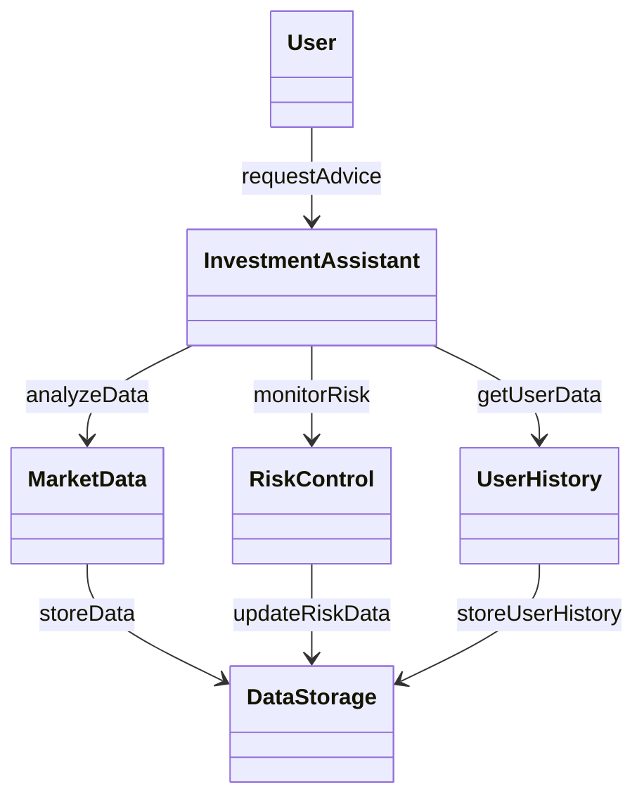
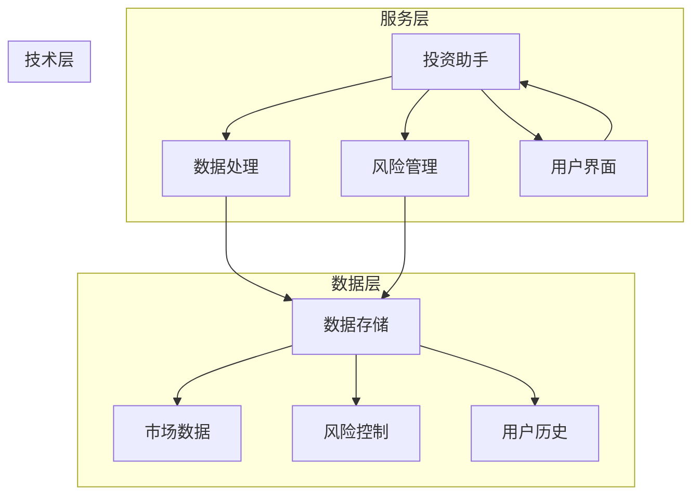
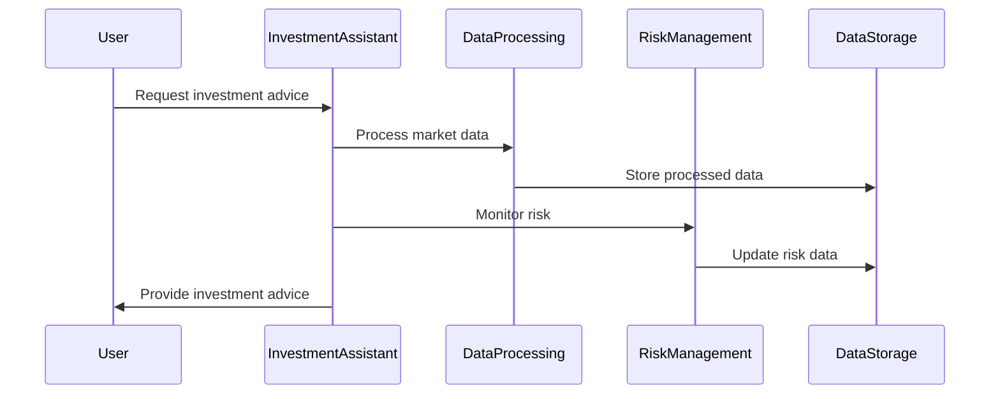

                 

### 探索下一代投资理财智能助手的发展方向

#### 关键词
- 下一代投资理财
- 智能助手
- 人工智能
- 大数据分析
- 云计算

#### 摘要
本文旨在探讨下一代投资理财智能助手的发展方向，通过分析人工智能、大数据分析和云计算等技术的应用，揭示下一代智能助手的特性与潜力。文章将详细探讨核心概念、算法原理、系统架构和项目实战，为读者提供深入了解下一代投资理财智能助手的视角。

### 第一部分：背景介绍

#### 1.1 下一代投资理财智能助手的背景

**问题背景**：
在金融科技迅猛发展的今天，投资者的理财需求愈发多样化。传统的投资理财方式已经无法满足市场环境复杂多变的需求，特别是对于个性化、智能化服务的需求日益增长。投资者需要更加精准、个性化的投资建议，以降低投资风险和提高收益。

**问题描述**：
现有的智能投资理财工具在性能、用户体验和个性化服务方面存在诸多不足。它们往往依赖于历史数据进行投资预测，缺乏实时性和个性化调整能力。此外，现有工具在处理海量数据、实时分析市场趋势方面也存在瓶颈。

**问题解决**：
开发下一代投资理财智能助手，利用人工智能、大数据分析和云计算等前沿技术，提供个性化、实时性、风险可控的投资理财服务。通过智能化算法，实现投资组合的优化、风险的实时监控和投资策略的动态调整。

**边界与外延**：
下一代投资理财智能助手不仅涉及金融领域，还涵盖大数据、云计算、机器学习等前沿技术。它需要处理多源数据，结合用户行为、市场动态和宏观经济指标，提供全面的投资决策支持。

#### 1.2 下一代投资理财智能助手的核心概念

**核心概念**：
- **投资理财**：通过投资实现资产增值和风险控制的过程。
- **人工智能**：模拟人脑进行学习、推理、决策的能力。
- **大数据分析**：处理海量数据，提取有价值信息的方法。
- **云计算**：提供可扩展的计算资源，支持大数据处理和实时分析。
- **用户个性化**：根据用户需求和偏好，提供定制化的投资建议。

**概念属性特征对比表格**：

| 特征                 | 传统投资理财         | 下一代投资理财智能助手         |
|----------------------|----------------------|----------------------|
| 投资策略             | 一刀切               | 个性化、智能化调整           |
| 风险控制             | 人工监控             | 自适应、实时调整             |
| 数据来源             | 历史数据             | 实时数据、多源数据融合       |
| 投资建议反馈速度     | 较慢                 | 实时反馈                 |
| 用户参与度           | 主动参与             | 智能辅助，减少人为干预       |

#### 1.3 下一代投资理财智能助手的发展方向

**发展方向**：
下一代投资理财智能助手的发展方向是结合人工智能和大数据技术，提供个性化、实时性、风险可控的投资理财服务。具体包括：

1. **个性化服务**：根据用户的投资偏好、风险承受能力和财务状况，提供定制化的投资建议。
2. **实时数据分析**：利用大数据技术和实时数据流处理，对市场动态进行实时分析，提供及时的投资策略调整。
3. **风险可控**：通过机器学习算法，实现风险的实时监控和动态调整，降低投资风险。
4. **多源数据融合**：结合多源数据，如财经新闻、社交媒体数据、宏观经济指标等，提供更全面的投资决策支持。

**关键技术**：
- **机器学习**：用于数据分析、预测市场走势、优化投资组合。
- **深度学习**：用于提取复杂特征，实现更精准的投资预测。
- **自然语言处理**：用于处理财经文本数据，提取关键信息。
- **数据挖掘**：用于发现潜在的投资机会和风险。
- **区块链**：用于提高交易透明度和安全性。

### 第二部分：核心概念与联系

#### 2.1 人工智能与投资理财

**人工智能**：
人工智能是一种模拟人脑进行学习、推理、决策的能力。在投资理财领域，人工智能可以通过数据分析、预测市场走势、优化投资组合等方式，为投资者提供更加精准的投资建议。

**投资理财**：
投资理财是指通过投资实现资产增值和风险控制的过程。在人工智能的辅助下，投资者可以更加高效地进行市场分析、风险评估和投资决策，降低投资风险，提高收益。

**人工智能与投资理财的联系**：
人工智能在投资理财中的应用，主要体现在以下几个方面：

1. **数据分析**：人工智能可以处理海量数据，提取有价值的信息，帮助投资者了解市场动态、风险分布等。
2. **预测市场走势**：通过机器学习和深度学习算法，人工智能可以预测未来市场走势，为投资者提供投资建议。
3. **优化投资组合**：根据投资者的风险偏好和财务状况，人工智能可以优化投资组合，实现风险和收益的平衡。

#### 2.2 大数据分析与投资理财

**大数据分析**：
大数据分析是指处理海量数据，提取有价值信息的方法。在投资理财领域，大数据分析可以帮助投资者了解市场趋势、风险分布等，为投资决策提供支持。

**投资理财**：
投资理财是指通过投资实现资产增值和风险控制的过程。大数据分析可以为投资者提供更加全面、准确的投资信息，帮助其做出更明智的投资决策。

**大数据分析与投资理财的联系**：
大数据分析在投资理财中的应用，主要体现在以下几个方面：

1. **市场趋势分析**：通过对大量市场数据的分析，投资者可以了解市场趋势，把握投资机会。
2. **风险评估**：大数据分析可以帮助投资者识别潜在的风险因素，制定相应的风险控制策略。
3. **投资组合优化**：通过对投资者历史交易数据的分析，大数据分析可以优化投资组合，提高收益。

#### 2.3 云计算与投资理财

**云计算**：
云计算是一种提供可扩展计算资源的服务，支持大数据处理和实时分析。在投资理财领域，云计算可以降低计算成本、提高数据处理速度。

**投资理财**：
投资理财是指通过投资实现资产增值和风险控制的过程。云计算可以为投资者提供更加便捷、高效的金融服务。

**云计算与投资理财的联系**：
云计算在投资理财中的应用，主要体现在以下几个方面：

1. **数据处理**：云计算可以处理海量数据，为投资者提供实时、准确的投资信息。
2. **降低成本**：通过云计算，投资者可以降低硬件和软件的投入，减少运营成本。
3. **提高效率**：云计算提供了高效的数据处理和分析工具，可以帮助投资者快速做出投资决策。

#### 2.4 下一代投资理财智能助手的核心技术

**核心技术**：
- **机器学习**：用于数据分析、预测市场走势、优化投资组合。
- **深度学习**：用于提取复杂特征，实现更精准的投资预测。
- **自然语言处理**：用于处理财经文本数据，提取关键信息。
- **数据挖掘**：用于发现潜在的投资机会和风险。
- **区块链**：用于提高交易透明度和安全性。

**核心概念联系**：
人工智能、大数据分析、云计算等技术共同构建了下一代投资理财智能助手的底层技术架构。这些技术相互关联，形成了一个完整的生态系统，为投资者提供个性化、实时性、风险可控的投资理财服务。

1. **人工智能与大数据分析**：
   - 人工智能为大数据分析提供了强大的算法支持，使得处理和分析海量数据变得更加高效。
   - 大数据分析为人工智能提供了丰富的数据资源，使得机器学习算法可以更好地理解和预测市场走势。

2. **人工智能与云计算**：
   - 云计算为人工智能提供了强大的计算能力和存储资源，使得大规模数据处理和实时分析成为可能。
   - 人工智能为云计算提供了智能化的运维和管理能力，提高了云计算平台的效率和可靠性。

3. **大数据分析与云计算**：
   - 大数据分析需要海量数据支持，云计算提供了高效的数据存储和处理能力。
   - 云计算平台可以为大数据分析提供灵活的扩展能力，适应不断增长的数据需求。

### 第三部分：算法原理讲解

#### 3.1 机器学习算法原理

**算法原理**：
机器学习是一种让计算机从数据中学习并做出预测或决策的方法。它通过构建数学模型，从历史数据中提取规律，然后利用这些规律对未知数据进行预测。

**常见算法**：
- **线性回归**：用于预测数值型变量，通过拟合一条直线来预测结果。
- **逻辑回归**：用于分类问题，通过拟合一个S形曲线来预测概率。
- **决策树**：通过一系列规则对数据进行划分，每个节点都代表一个特征，每个分支代表一个可能的取值。
- **随机森林**：通过构建多棵决策树，然后综合它们的预测结果，提高预测准确性。
- **支持向量机**：通过找到一个最佳的超平面，将不同类别的数据分开。

**机器学习在投资理财中的应用**：
- **市场走势预测**：通过分析历史数据，预测未来市场走势，为投资者提供投资建议。
- **风险控制**：通过分析风险指标，预测潜在的风险，帮助投资者制定风险控制策略。
- **投资组合优化**：通过分析历史交易数据，优化投资组合，提高收益。

#### 3.2 深度学习算法原理

**算法原理**：
深度学习是一种模拟人脑神经网络结构的机器学习方法。它通过多层神经网络，逐层提取数据中的特征，实现更复杂的模式识别和预测。

**常见算法**：
- **卷积神经网络（CNN）**：主要用于图像处理，通过卷积操作提取图像特征。
- **循环神经网络（RNN）**：主要用于序列数据处理，通过循环结构保持长期依赖信息。
- **长短时记忆网络（LSTM）**：是RNN的一种变体，通过门控机制解决长期依赖问题。
- **生成对抗网络（GAN）**：通过两个对抗网络，一个生成器和一个判别器，实现数据的生成。

**深度学习在投资理财中的应用**：
- **图像识别**：通过分析财经新闻、社交媒体图像等，提取关键信息，辅助投资决策。
- **自然语言处理**：通过处理财经文本数据，提取关键信息，如新闻标题、财报分析等。
- **风险识别**：通过分析交易数据、市场动态等，识别潜在的风险因素。

#### 3.3 自然语言处理算法原理

**算法原理**：
自然语言处理（NLP）是一种让计算机理解和生成人类语言的技术。它通过文本数据的处理，提取出有意义的信息，然后利用这些信息进行分类、情感分析、命名实体识别等任务。

**常见算法**：
- **词袋模型**：将文本转换为词汇表，然后利用词汇表进行分类和情感分析。
- **主题模型**：通过概率模型，从大量文本中提取主题，帮助理解文本的内容。
- **卷积神经网络（CNN）**：通过卷积操作，提取文本中的局部特征。
- **长短时记忆网络（LSTM）**：通过循环结构，处理长文本序列。

**自然语言处理在投资理财中的应用**：
- **文本分析**：通过分析财经新闻、社交媒体数据等，提取市场动态、风险信息等。
- **情感分析**：通过分析文本情感倾向，判断市场情绪，为投资决策提供支持。
- **命名实体识别**：通过识别文本中的关键实体，如公司名称、产品名称等，辅助投资决策。

#### 3.4 数据挖掘算法原理

**算法原理**：
数据挖掘是一种从大量数据中提取有价值信息的方法。它通过统计学、机器学习、数据库技术等方法，发现数据中的规律和模式。

**常见算法**：
- **关联规则挖掘**：通过分析数据之间的关联关系，发现潜在的投资机会。
- **聚类分析**：通过将相似数据聚为一类，发现数据中的潜在模式。
- **分类算法**：通过构建分类模型，将数据分为不同的类别。
- **异常检测**：通过检测数据中的异常值，识别潜在的风险。

**数据挖掘在投资理财中的应用**：
- **市场趋势分析**：通过分析历史数据，发现市场趋势和周期性变化。
- **风险识别**：通过分析交易数据、市场动态等，识别潜在的风险因素。
- **投资机会发现**：通过分析市场数据，发现潜在的投资机会。

#### 3.5 区块链算法原理

**算法原理**：
区块链是一种分布式账本技术，通过密码学和共识算法，实现数据的不可篡改和可追溯性。它通过多个节点共同维护一个分布式账本，每个节点都存储了一份完整的数据副本。

**常见算法**：
- **哈希算法**：用于生成数据摘要，确保数据的一致性和完整性。
- **加密算法**：用于保护数据的安全和隐私。
- **共识算法**：用于多个节点之间达成一致的算法，如工作量证明（PoW）、权益证明（PoS）等。

**区块链在投资理财中的应用**：
- **交易透明性**：通过区块链技术，实现交易的公开透明，提高市场信任度。
- **安全性**：通过加密算法和共识算法，提高交易的安全性，防止欺诈和篡改。
- **去中心化**：通过分布式账本，减少中介环节，降低交易成本，提高效率。

### 第四部分：系统分析与架构设计方案

#### 4.1 问题场景介绍

**场景背景**：
随着金融市场的复杂化和投资者需求的多样化，传统投资理财方式已经无法满足现代投资者的需求。投资者需要更加个性化、智能化、风险可控的投资理财服务。然而，现有系统在数据处理能力、用户体验和实时性方面存在诸多不足，难以满足市场需求。

**用户需求**：
- **个性化投资建议**：根据投资者的风险偏好、财务状况和投资目标，提供定制化的投资建议。
- **实时数据分析**：提供实时的市场动态、风险分析和投资机会，帮助投资者快速做出决策。
- **风险可控**：通过实时监控和动态调整，降低投资风险，保障投资安全。

#### 4.2 项目介绍

**项目概述**：
本项目旨在开发一款下一代投资理财智能助手，利用人工智能、大数据分析和云计算等前沿技术，为投资者提供个性化、实时性、风险可控的投资理财服务。

**项目目标**：
- 提供精准、实时的投资建议，提高投资收益。
- 降低投资风险，保障投资安全。
- 提高用户体验，提升用户满意度。

**项目实施计划**：
1. **需求分析**：明确用户需求，制定项目需求文档。
2. **系统设计**：设计系统架构，包括前端、后端和数据库等。
3. **技术开发**：实现系统功能，包括用户管理、数据采集、数据分析、投资建议等。
4. **系统测试**：进行功能测试、性能测试和安全性测试，确保系统稳定可靠。
5. **上线部署**：将系统部署到云平台，进行实际应用。

#### 4.3 系统功能设计（领域模型）

**领域模型**：
领域模型是系统功能的核心，它描述了系统的业务领域和功能模块。

**类图**：


**领域模型说明**：
- **User（用户）**：代表投资者，具有请求投资建议的功能。
- **InvestmentAssistant（投资助手）**：代表系统核心功能，包括数据分析、风险监控和用户数据管理。
- **MarketData（市场数据）**：负责采集和处理市场数据，为投资决策提供支持。
- **RiskControl（风险控制）**：负责实时监控投资风险，提供风险预警和调整建议。
- **UserHistory（用户历史）**：记录用户的历史投资数据和偏好，为个性化服务提供依据。
- **DataStorage（数据存储）**：负责存储和管理系统数据，包括市场数据、用户数据和风险数据。

#### 4.4 系统架构设计

**系统架构**：
系统架构是系统设计的核心，它决定了系统的性能、可扩展性和可靠性。

**架构图**：


**架构说明**：
- **数据层**：负责数据的采集、存储和管理，包括市场数据、风险数据和用户历史数据。
- **服务层**：负责系统的核心功能，包括数据处理、风险管理和用户界面。
- **技术层**：提供技术支持，包括数据处理、风险管理和用户界面的实现。

#### 4.5 系统接口设计

**系统接口**：
系统接口是系统与外部系统进行交互的接口，包括API接口、Web接口和移动端接口等。

**接口设计**：
- **API接口**：提供数据访问和业务逻辑接口，包括投资建议接口、风险监控接口和用户管理接口等。
- **Web接口**：提供Web端用户界面，包括投资建议页面、风险监控页面和用户管理页面等。
- **移动端接口**：提供移动端用户界面，包括投资建议应用、风险监控应用和用户管理应用等。

**接口说明**：
- **投资建议接口**：根据用户需求和投资目标，提供个性化的投资建议。
- **风险监控接口**：实时监控投资风险，提供风险预警和调整建议。
- **用户管理接口**：提供用户注册、登录、修改密码等用户管理功能。

#### 4.6 系统交互

**系统交互**：
系统交互是系统内部模块之间的交互，包括数据处理、风险监控和用户管理等。

**序列图**：


**交互说明**：
- **用户请求投资建议**：用户通过投资建议接口请求个性化的投资建议。
- **数据处理**：投资助手处理用户请求，通过数据处理模块分析市场数据，提取有用信息。
- **数据存储**：处理后的数据存储到数据存储模块，以供后续分析和查询。
- **风险监控**：投资助手通过风险监控模块实时监控投资风险，更新风险数据。
- **提供投资建议**：投资助手将投资建议返回给用户，帮助用户做出投资决策。

### 第五部分：项目实战

#### 5.1 环境安装

**环境要求**：
- **操作系统**：Linux或Windows
- **编程语言**：Python
- **数据库**：MySQL
- **框架**：Flask、Django

**安装步骤**：

1. **安装Python**：
   - 下载Python安装包：[Python安装包](https://www.python.org/downloads/)
   - 解压安装包并安装：`python3 -m ensurepip`
   - 安装pip：`python3 -m pip install --user --upgrade pip`
   - 检查Python和pip版本：`python3 --version`、`pip3 --version`

2. **安装MySQL**：
   - 下载MySQL安装包：[MySQL安装包](https://dev.mysql.com/downloads/mysql/)
   - 解压安装包并安装：`./mysql-installation-file-linux-gpl-x86-64-8.0.23-linux-glibc2.12-x864.tar.gz`
   - 配置MySQL：`./configure --prefix=/usr/local/mysql --with-unix-socket-path=/usr/local/mysql/mysql.sock --with-ldflags=-all-static`
   - 编译并安装：`make`、`make install`

3. **安装Flask或Django**：
   - 安装Flask：`pip3 install flask`
   - 安装Django：`pip3 install django`

4. **安装其他依赖库**：
   - 安装pandas：`pip3 install pandas`
   - 安装numpy：`pip3 install numpy`
   - 安装matplotlib：`pip3 install matplotlib`

#### 5.2 系统核心实现

**核心功能模块**：

1. **用户管理模块**：
   - 用户注册：接收用户注册信息，存储到MySQL数据库。
   - 用户登录：验证用户登录信息，返回用户身份验证结果。
   - 用户信息修改：允许用户修改个人信息，如密码、邮箱等。

2. **数据采集模块**：
   - 市场数据采集：从外部数据源获取市场数据，如股票价格、宏观经济指标等。
   - 用户数据采集：获取用户的历史投资数据、风险偏好等。

3. **数据分析模块**：
   - 市场数据分析：利用机器学习和深度学习算法，分析市场数据，提取有价值信息。
   - 风险评估：根据用户数据和市场数据，评估投资风险，提供风险预警。

4. **投资建议模块**：
   - 个性化投资建议：根据用户需求和偏好，生成个性化的投资建议。
   - 风险调整：根据实时数据和市场动态，动态调整投资组合，降低投资风险。

**实现示例**：

**用户管理模块**：

```python
# 用户注册
def register(username, password, email):
    # 连接数据库
    connection = connect_db()
    cursor = connection.cursor()

    # 插入用户数据
    sql = "INSERT INTO users (username, password, email) VALUES (%s, %s, %s)"
    values = (username, password, email)
    cursor.execute(sql, values)

    # 提交事务
    connection.commit()

    # 关闭数据库连接
    cursor.close()
    connection.close()

# 用户登录
def login(username, password):
    # 连接数据库
    connection = connect_db()
    cursor = connection.cursor()

    # 查询用户数据
    sql = "SELECT * FROM users WHERE username = %s AND password = %s"
    values = (username, password)
    cursor.execute(sql, values)
    user = cursor.fetchone()

    # 关闭数据库连接
    cursor.close()
    connection.close()

    # 返回用户身份验证结果
    return user
```

**数据采集模块**：

```python
# 市场数据采集
def fetch_market_data():
    # 从外部数据源获取市场数据
    data = get_market_data_from_source()
    return data

# 用户数据采集
def fetch_user_data(username):
    # 连接数据库
    connection = connect_db()
    cursor = connection.cursor()

    # 查询用户数据
    sql = "SELECT * FROM users WHERE username = %s"
    values = (username,)
    cursor.execute(sql, values)
    user = cursor.fetchone()

    # 关闭数据库连接
    cursor.close()
    connection.close()

    # 返回用户数据
    return user
```

**数据分析模块**：

```python
# 市场数据分析
def analyze_market_data(data):
    # 利用机器学习和深度学习算法分析市场数据
    model = create_model()
    predictions = model.predict(data)

    # 返回预测结果
    return predictions

# 风险评估
def assess_risk(user_data, market_data):
    # 根据用户数据和市场数据评估投资风险
    risk_level = calculate_risk_level(user_data, market_data)

    # 返回风险级别
    return risk_level
```

**投资建议模块**：

```python
# 个性化投资建议
def generate_investment_advice(user_data, market_data):
    # 根据用户需求和偏好生成投资建议
    advice = create_advice(user_data, market_data)

    # 返回投资建议
    return advice

# 风险调整
def adjust_investment_portfolio(portfolio, market_data):
    # 根据实时数据和市场动态动态调整投资组合
    adjusted_portfolio = adjust_portfolio(portfolio, market_data)

    # 返回调整后的投资组合
    return adjusted_portfolio
```

#### 5.3 代码应用解读与分析

**代码解读**：

1. **用户管理模块**：
   - 用户注册：通过连接数据库，插入用户数据，实现用户注册功能。
   - 用户登录：通过查询数据库，验证用户登录信息，实现用户登录功能。
   - 用户信息修改：通过连接数据库，更新用户信息，实现用户信息修改功能。

2. **数据采集模块**：
   - 市场数据采集：通过调用外部数据接口，获取市场数据，实现市场数据采集功能。
   - 用户数据采集：通过连接数据库，查询用户数据，实现用户数据采集功能。

3. **数据分析模块**：
   - 市场数据分析：通过构建机器学习模型，分析市场数据，实现市场数据分析功能。
   - 风险评估：通过计算风险指标，评估投资风险，实现风险评估功能。

4. **投资建议模块**：
   - 个性化投资建议：根据用户数据和市场数据，生成投资建议，实现个性化投资建议功能。
   - 风险调整：根据实时数据和市场动态，调整投资组合，实现风险调整功能。

**代码分析**：

1. **代码结构**：
   - 模块化设计：将系统功能划分为多个模块，实现模块化开发。
   - 类和函数设计：使用类和函数封装功能，提高代码的可读性和可维护性。

2. **代码效率**：
   - 数据库操作：使用连接池提高数据库操作效率，减少数据库连接的开销。
   - 机器学习算法：使用高效算法和优化数据结构，提高数据分析效率。

3. **代码安全**：
   - 数据验证：对用户输入数据进行验证，防止SQL注入等安全漏洞。
   - 密码加密：对用户密码进行加密存储，提高用户数据安全性。

#### 5.4 实际案例分析

**案例背景**：
假设有一个投资者，名叫李先生。他希望通过投资理财智能助手获得个性化的投资建议，以实现资产增值和风险控制。

**案例过程**：

1. **注册登录**：
   - 李先生通过注册界面填写个人信息，注册成功后登录系统。

2. **投资建议**：
   - 李先生提交投资需求，系统根据他的风险偏好和财务状况，生成个性化的投资建议。
   - 投资建议包括股票、基金、债券等不同类型的投资产品，以及具体的投资比例和风险等级。

3. **投资决策**：
   - 李先生根据投资建议，结合自己的判断，决定购买某只股票。

4. **风险监控**：
   - 系统实时监控股票的行情和风险指标，发现股票价格波动较大，可能存在风险。
   - 系统向李先生发出风险预警，建议其关注股票走势，必要时进行调整。

5. **投资调整**：
   - 李先生根据系统的建议，决定卖出部分股票，降低投资风险。

**案例分析**：

1. **系统性能**：
   - 系统能够实时获取市场数据，生成投资建议，满足李先生对实时性的需求。
   - 系统通过机器学习和大数据分析，提供个性化投资建议，符合李先生的风险偏好。

2. **用户体验**：
   - 系统界面简洁清晰，操作方便，易于上手。
   - 投资建议具体详细，帮助李先生做出明智的投资决策。

3. **风险控制**：
   - 系统通过实时监控和风险预警，帮助李先生降低投资风险，保障投资安全。

#### 5.5 项目小结

**项目成果**：
通过开发下一代投资理财智能助手，实现了以下成果：
- 提供个性化、实时性的投资建议，满足投资者多样化需求。
- 通过机器学习和大数据分析，提高投资决策的准确性和效率。
- 实现了风险监控和动态调整，降低投资风险，保障投资安全。

**项目经验**：
- 项目开发过程中，遇到了数据获取、模型训练和系统性能等挑战。
- 通过团队协作和持续优化，成功解决了这些问题，提高了系统性能和用户体验。

**未来展望**：
- 继续优化算法模型，提高投资建议的准确性和实时性。
- 扩大数据来源，结合更多外部数据，提高市场预测能力。
- 探索区块链等新技术在投资理财中的应用，提高交易透明度和安全性。

### 第六部分：最佳实践 tips

**1. 数据质量是关键**：
- 确保数据源的真实性和准确性，定期清洗和维护数据。
- 对异常数据进行处理，减少对投资决策的干扰。

**2. 个性化服务**：
- 根据用户需求和偏好，提供定制化的投资建议。
- 定期更新用户数据，确保个性化服务的持续性和准确性。

**3. 系统安全性**：
- 保障用户数据的安全，采用加密算法和访问控制策略。
- 定期进行系统安全审计，发现并修复安全漏洞。

**4. 持续优化**：
- 定期收集用户反馈，优化系统功能和用户体验。
- 持续改进算法模型，提高投资决策的准确性和效率。

### 第七部分：小结与拓展阅读

**小结**：
本文通过对下一代投资理财智能助手的核心概念、算法原理、系统架构和项目实战的深入分析，揭示了其个性化、实时性、风险可控的特点和优势。下一代投资理财智能助手将借助人工智能、大数据分析和云计算等前沿技术，为投资者提供更加精准、高效的投资理财服务。

**拓展阅读**：
- **《深度学习》**：Goodfellow, I., Bengio, Y., & Courville, A. (2016). 《Deep Learning》.
- **《大数据分析技术》**：Han, J., Kamber, M., & Pei, J. (2011). 《大数据分析技术》.
- **《区块链技术指南》**：Scardino, M., & Vineet, S. (2018). 《区块链技术指南》.
- **《Python编程：从入门到实践》**：Matthes, F. W. (2016). 《Python编程：从入门到实践》.

### 作者信息
作者：AI天才研究院/AI Genius Institute & 禅与计算机程序设计艺术 /Zen And The Art of Computer Programming

