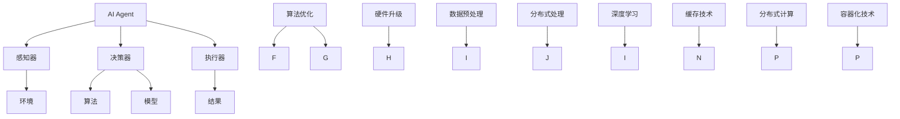
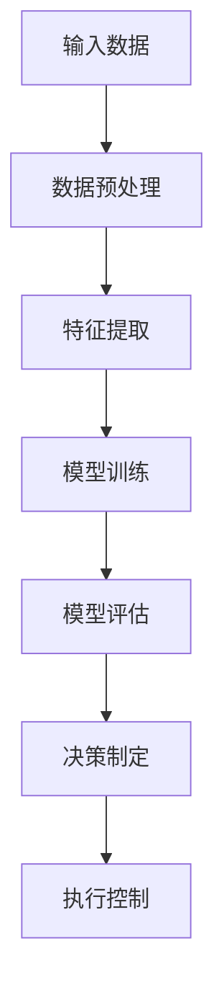
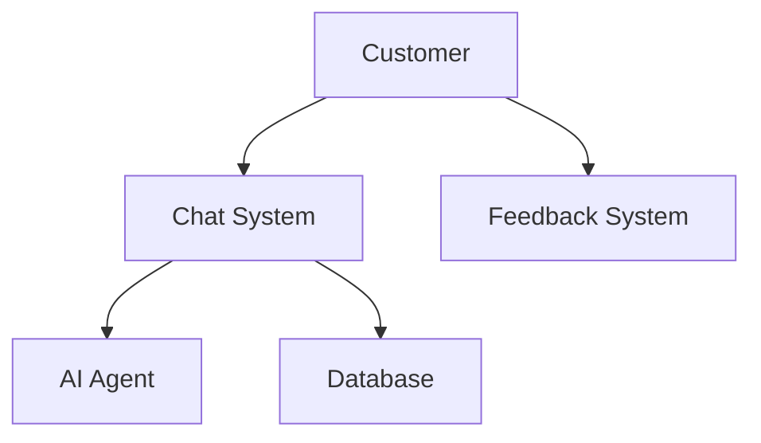
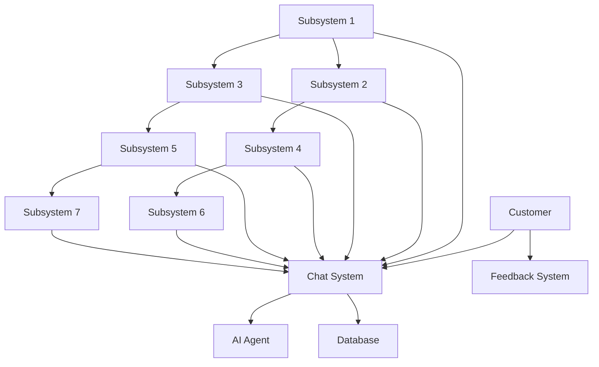
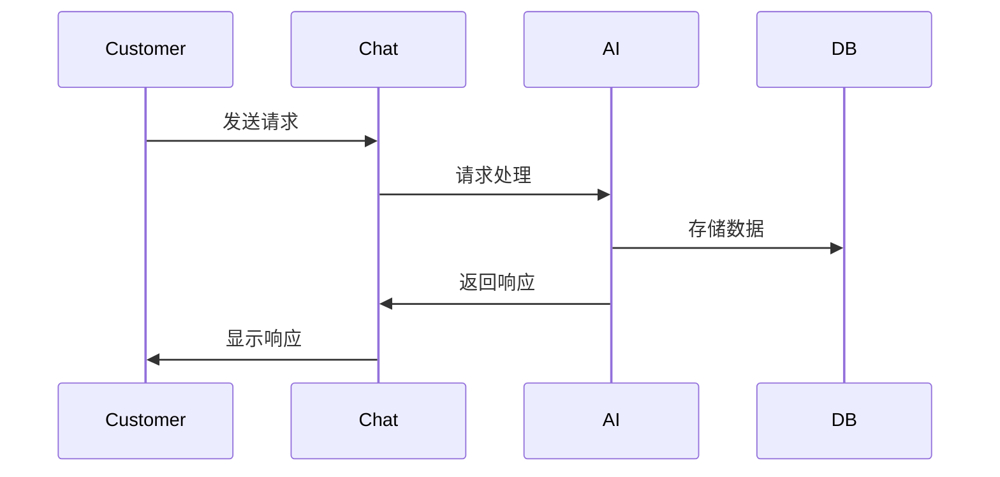

                 

### 第1章: 人工智能与响应速度概述

#### 1.1 人工智能的兴起
人工智能（Artificial Intelligence, AI）是一门研究、开发和应用使计算机系统具备人类智能行为的科学。其发展历程可以追溯到20世纪50年代，当时计算机科学刚刚起步，科学家们开始探讨如何让计算机模拟人类的思维和行为。

##### 1.1.1 人工智能的定义与发展历程
人工智能的定义随着技术的进步而不断发展。传统上，人工智能被定义为“使计算机系统能够执行需要人类智能的任务”。这些任务包括理解语言、识别图像、解决问题、学习新知识等。人工智能的发展历程可以分为几个阶段：

- **初始阶段（1956-1969年）**：人工智能概念的提出和早期研究。
- **繁荣阶段（1970-1989年）**：人工智能研究取得初步成果，机器学习、自然语言处理等技术开始出现。
- **低谷阶段（1990-2000年）**：由于技术瓶颈和实际应用的缺乏，人工智能研究进入低谷。
- **复苏阶段（2000年至今）**：随着计算机性能的提升和大数据、深度学习等新技术的出现，人工智能再次崛起，并在各个领域取得显著成果。

##### 1.1.2 人工智能在现代社会的应用
人工智能已经在现代社会中得到广泛应用，以下是一些主要应用领域：

- **医疗保健**：AI在医学影像分析、疾病预测和诊断等方面发挥着重要作用。
- **金融服务**：AI用于风险管理、欺诈检测和投资策略优化。
- **交通运输**：自动驾驶汽车、无人机和智能交通系统等应用了AI技术。
- **智能制造**：机器人自动化、智能供应链管理、质量控制等。
- **智能家居**：智能语音助手、家居自动化等。

##### 1.1.3 响应速度在人工智能服务中的重要性
响应速度是评价人工智能服务质量的重要指标之一。在许多应用场景中，如实时语音识别、自动驾驶、金融交易决策等，AI Agent需要快速响应用户请求或环境变化。响应速度的重要性体现在以下几个方面：

- **用户体验**：快速响应可以提升用户满意度，增加用户粘性。
- **商业价值**：在金融、电商等高时间敏感领域，快速响应可以带来竞争优势。
- **系统效率**：减少延迟可以提高系统处理能力，降低资源消耗。

#### 1.2 响应速度的概念与衡量
响应速度是指AI Agent从接收到请求到完成响应的时间。这个时间可以是毫秒级、秒级或分钟级，具体取决于应用场景和系统设计。

##### 1.2.1 响应速度的定义
响应速度（Response Time）是指从系统接收到请求到系统返回响应结果所经历的时间。通常用毫秒（ms）或秒（s）来衡量。

##### 1.2.2 响应速度的衡量标准
响应速度的衡量标准包括：

- **平均响应时间**：系统在一定时间内所有请求的平均响应时间。
- **最大响应时间**：系统在一段时间内最长的响应时间。
- **响应时间分布**：系统响应时间的分布情况，如95%响应时间、99%响应时间等。

##### 1.2.3 响应速度的影响因素
影响响应速度的主要因素包括：

- **计算复杂度**：算法的计算复杂度越高，响应时间越长。
- **数据传输延迟**：网络传输速度和稳定性对响应速度有重要影响。
- **系统资源**：CPU、内存、磁盘等硬件资源限制系统的处理能力。
- **并发处理能力**：系统同时处理请求的数量。

#### 1.3 提高AI Agent响应速度的意义
提高AI Agent的响应速度具有重要的现实意义：

##### 1.3.1 提高响应速度的必要性
- **用户体验提升**：在许多应用场景中，如在线客服、智能家居等，用户对响应速度有较高要求。提高响应速度可以提升用户体验，增加用户满意度。
- **业务效率提升**：在金融、电商等领域，快速响应可以提升业务效率，降低运营成本。

##### 1.3.2 提高响应速度的优势
- **竞争优势**：在竞争激烈的市场中，快速响应可以提升企业竞争力。
- **客户保留**：快速响应可以增加客户粘性，降低客户流失率。

##### 1.3.3 提高响应速度的挑战
- **计算资源限制**：在有限的计算资源下，提高响应速度可能需要牺牲其他性能指标。
- **算法优化难度**：对于复杂算法，优化响应速度可能需要深入理解和改进算法本身。
- **系统架构调整**：提高响应速度可能需要调整系统架构，如增加缓存、分布式处理等。

#### 1.4 本书结构安排
本书旨在系统地介绍提高AI Agent响应速度的优化策略与技巧。全书共分为6个章节：

- **第1章**：人工智能与响应速度概述，介绍人工智能的发展背景、响应速度的概念与重要性。
- **第2章**：核心概念与联系，讲解AI Agent的基本概念、响应速度优化策略与技术工具。
- **第3章**：算法原理讲解，介绍常见算法原理、数学模型与Python实现。
- **第4章**：系统分析与架构设计方案，介绍系统功能设计、架构设计、接口设计及系统交互。
- **第5章**：项目实战，通过实际案例讲解环境安装、系统实现与优化。
- **第6章**：最佳实践与总结，分享最佳实践经验、注意事项及拓展阅读。

##### 1.4.1 各章节内容概述
- **第1章**：为后续章节奠定理论基础。
- **第2章**：介绍核心概念与优化策略。
- **第3章**：深入讲解算法原理与实现。
- **第4章**：系统分析与架构设计。
- **第5章**：项目实战与应用。
- **第6章**：最佳实践与总结。

##### 1.4.2 阅读建议与目标
建议读者按照章节顺序阅读，从基础理论到实际应用，逐步深入了解和提高AI Agent响应速度的优化技巧。

##### 1.4.3 预期收获
通过本书的学习，读者可以：
- 理解人工智能与响应速度的基本概念。
- 掌握响应速度优化的核心策略与技巧。
- 掌握常见算法原理与实现方法。
- 能够设计并优化具有高性能响应速度的AI Agent系统。

##### 1.4.4 预期收获
通过本书的学习，读者可以：
- 深入了解人工智能的发展与应用。
- 掌握响应速度优化的重要性和方法。
- 学会使用数学模型和算法来提升AI Agent的性能。
- 能够在实际项目中设计和优化AI Agent系统，提高系统响应速度。

### 第2章: 核心概念与联系

#### 2.1 AI Agent的基本概念

##### 2.1.1 AI Agent的定义
AI Agent，即人工智能代理，是一种能够独立执行任务、与环境交互并做出决策的计算机程序。AI Agent的核心特征包括自主性、反应性、预见性和社会性。

- **自主性**：AI Agent能够自主决定行动，而不需要人类干预。
- **反应性**：AI Agent能够实时响应环境变化。
- **预见性**：AI Agent能够预测未来事件并提前做出决策。
- **社会性**：AI Agent能够与其他AI Agent或人类协作。

##### 2.1.2 AI Agent的核心要素
AI Agent的核心要素包括感知器、决策器和执行器。

- **感知器**：用于感知环境信息，如传感器、摄像头等。
- **决策器**：根据感知到的信息做出决策，如使用机器学习算法。
- **执行器**：根据决策执行具体动作，如机器人手臂、电子设备等。

##### 2.1.3 AI Agent的分类
AI Agent根据应用场景和功能不同，可以分为以下几类：

- **智能机器人**：在工业、家居、医疗等领域执行特定任务。
- **虚拟助手**：如智能语音助手、聊天机器人等，提供信息服务和娱乐。
- **自动驾驶系统**：在道路上自主驾驶汽车，提高交通效率。
- **金融交易顾问**：根据市场数据做出投资决策。

#### 2.2 响应速度优化策略

##### 2.2.1 策略概述
提高AI Agent的响应速度可以通过以下几种策略：

- **算法优化**：改进算法模型，降低计算复杂度。
- **硬件升级**：增加计算资源，提高处理速度。
- **数据预处理**：优化数据输入，减少处理时间。
- **分布式处理**：将任务分布到多个节点处理，提高并行处理能力。

##### 2.2.2 策略对比表格

| 策略         | 优点                     | 缺点                     | 适用场景             |
| ------------ | ------------------------ | ------------------------ | -------------------- |
| 算法优化     | 提高性能                 | 需要深入了解算法         | 复杂算法             |
| 硬件升级     | 提高处理速度             | 成本较高                 | 现有硬件资源不足     |
| 数据预处理   | 提高数据处理效率         | 需要额外处理时间         | 数据量大             |
| 分布式处理   | 提高并行处理能力         | 需要复杂的系统架构       | 并发处理需求高       |

##### 2.2.3 策略应用场景
不同的应用场景适合不同的优化策略。例如：

- **实时语音识别**：算法优化和数据预处理相结合，提高识别准确性。
- **自动驾驶**：硬件升级和分布式处理相结合，提高系统响应速度。
- **金融交易**：算法优化和分布式处理相结合，提高交易执行速度。

#### 2.3 技术与工具

##### 2.3.1 关键技术
提高AI Agent响应速度的关键技术包括：

- **深度学习**：通过神经网络模型，提高算法性能。
- **分布式计算**：利用多台服务器，提高并行处理能力。
- **缓存技术**：减少重复计算，提高数据处理速度。
- **微服务架构**：将系统拆分为多个微服务，提高系统响应速度。

##### 2.3.2 工具选择
根据不同应用场景，可以选择以下工具：

- **深度学习框架**：如TensorFlow、PyTorch等。
- **分布式计算框架**：如Hadoop、Spark等。
- **缓存工具**：如Redis、Memcached等。
- **容器化技术**：如Docker、Kubernetes等。

##### 2.3.3 工具应用案例
以下是一些工具在实际应用中的案例：

- **TensorFlow**：用于构建深度学习模型，提高语音识别响应速度。
- **Hadoop**：用于处理海量数据，提高数据预处理速度。
- **Redis**：用于缓存用户数据，减少数据库访问延迟。
- **Docker**：用于容器化部署，提高系统部署和扩展效率。

#### 2.4 联系与整合

##### 2.4.1 概念关系图
以下是一个简化的AI Agent响应速度优化概念关系图：



##### 2.4.2 整合策略
为了实现AI Agent响应速度的全面优化，可以采用以下整合策略：

1. **算法优化**：根据应用场景，选择合适的算法和模型，进行优化。
2. **硬件升级**：根据性能需求，选择合适的硬件设备，提高处理速度。
3. **数据预处理**：提前处理数据，减少处理时间。
4. **分布式处理**：利用分布式计算框架，提高并行处理能力。
5. **缓存技术**：使用缓存工具，减少重复计算。
6. **容器化技术**：简化系统部署和扩展，提高效率。

##### 2.4.3 整合实践
以下是一个整合实践案例：

- **应用场景**：实时语音识别系统。
- **算法优化**：使用深度学习框架构建语音识别模型，优化算法参数。
- **硬件升级**：增加CPU和GPU计算资源。
- **数据预处理**：提前对语音数据进行预处理，如降噪、分割等。
- **分布式处理**：使用分布式计算框架，将语音识别任务分布到多台服务器处理。
- **缓存技术**：使用Redis缓存常见语音识别结果，减少数据库访问。
- **容器化技术**：使用Docker容器化部署系统，提高部署和扩展效率。

通过整合多种优化策略和技术工具，可以实现AI Agent响应速度的全面提升，为用户提供更高效、更流畅的服务体验。

### 第3章: 算法原理讲解

#### 3.1 算法概述

##### 3.1.1 算法类型
在AI Agent中，算法是核心组成部分，负责处理输入数据、做出决策和执行动作。根据算法的应用场景和实现方式，可以将其分为以下几类：

- **监督学习算法**：通过已标记的数据集训练模型，并使用模型进行预测。
- **无监督学习算法**：在没有标记数据的情况下，发现数据中的模式和结构。
- **强化学习算法**：通过与环境的交互，学习最优策略以最大化累积奖励。
- **混合学习算法**：结合监督学习、无监督学习和强化学习，以适应更复杂的应用场景。

##### 3.1.2 算法作用
算法在AI Agent中的作用如下：

- **数据处理**：对输入数据进行预处理、特征提取和降维等操作，使其更适合算法处理。
- **决策制定**：根据处理结果，选择最优行动策略，实现目标。
- **执行控制**：根据决策结果，控制执行器执行具体动作，达到预期效果。

##### 3.1.3 算法框架
算法框架通常包括以下几个部分：

1. **数据输入**：接收外部环境或用户输入的数据。
2. **数据处理**：对输入数据预处理，如归一化、标准化等。
3. **特征提取**：提取数据中的关键特征，用于模型训练。
4. **模型训练**：使用训练数据集，通过优化算法训练模型。
5. **模型评估**：使用测试数据集，评估模型性能和泛化能力。
6. **决策制定**：根据模型输出，制定最优行动策略。
7. **执行控制**：根据决策结果，执行具体动作。

#### 3.2 数学模型与公式

##### 3.2.1 数学模型介绍
在AI Agent中，常用的数学模型包括神经网络模型、决策树模型、支持向量机模型等。以下以神经网络模型为例进行介绍。

- **神经网络模型**：基于多层感知器（MLP）的模型，包括输入层、隐藏层和输出层。每一层中的神经元通过激活函数进行非线性变换，传递信息。

##### 3.2.2 公式推导
神经网络的激活函数通常采用Sigmoid函数，公式如下：

\[ f(x) = \frac{1}{1 + e^{-x}} \]

神经网络模型的输入层和输出层之间通过权重矩阵W和偏置项b进行加权求和，公式如下：

\[ z = \sum_{i=1}^{n} w_{ij} \cdot x_{i} + b \]

其中，\( w_{ij} \) 为输入层到隐藏层的权重，\( x_{i} \) 为输入层的第i个特征，\( b \) 为偏置项。

隐藏层到输出层的输出计算公式如下：

\[ y = f(z) \]

##### 3.2.3 公式解释
上述公式解释如下：

- \( f(x) \)：Sigmoid函数，将输入值映射到（0, 1）区间，实现非线性变换。
- \( z \)：加权求和的结果，表示输入层到隐藏层的输出。
- \( w_{ij} \)：输入层到隐藏层的权重，决定了输入特征对输出层的影响程度。
- \( b \)：偏置项，用于调整模型输出。
- \( y \)：隐藏层到输出层的输出，表示模型对输入数据的预测结果。

#### 3.3 算法流程与Python实现

##### 3.3.1 算法流程图
以下是一个简单的神经网络算法流程图：



##### 3.3.2 Python代码实现
以下是一个简单的Python代码实现，使用TensorFlow框架构建神经网络模型：

```python
import tensorflow as tf
from tensorflow.keras.models import Sequential
from tensorflow.keras.layers import Dense, Activation

# 数据预处理
x = tf.random.normal([100, 10])  # 输入数据，100个样本，10个特征
y = tf.random.normal([100, 1])    # 输出数据，100个样本

# 构建模型
model = Sequential([
    Dense(64, input_shape=(10,), activation='sigmoid'),
    Dense(32, activation='sigmoid'),
    Dense(1, activation='sigmoid')
])

# 编译模型
model.compile(optimizer='adam', loss='mean_squared_error')

# 模型训练
model.fit(x, y, epochs=10, batch_size=32)

# 模型评估
loss = model.evaluate(x, y)
print(f'Model loss: {loss}')

# 决策制定与执行控制
predictions = model.predict(x)
print(f'Predictions: {predictions}')
```

##### 3.3.3 代码解释与调试
以上代码实现了一个简单的神经网络模型，用于对输入数据进行预测。具体解释如下：

- **数据预处理**：生成随机输入数据和输出数据，用于模型训练和评估。
- **模型构建**：使用Sequential模型构建一个包含两个隐藏层的神经网络，激活函数采用Sigmoid函数。
- **模型编译**：设置优化器为Adam，损失函数为均方误差。
- **模型训练**：使用fit方法训练模型，设置训练轮次为10次，批量大小为32。
- **模型评估**：使用evaluate方法评估模型性能，输出损失值。
- **决策制定与执行控制**：使用predict方法对输入数据进行预测，并打印预测结果。

在实际应用中，可以根据具体需求调整模型结构、优化器参数和训练策略，以提高模型性能和预测准确性。

#### 3.4 示例讲解

##### 3.4.1 实际案例
以下是一个实际案例，使用神经网络模型进行手写数字识别。

- **数据集**：使用MNIST手写数字数据集，包含60,000个训练样本和10,000个测试样本。
- **任务**：训练一个神经网络模型，对手写数字进行分类。

##### 3.4.2 示例演示
以下是一个简单的Python代码实现，使用TensorFlow框架构建神经网络模型，并对其进行训练和评估：

```python
import tensorflow as tf
from tensorflow.keras.datasets import mnist
from tensorflow.keras.models import Sequential
from tensorflow.keras.layers import Dense, Flatten
from tensorflow.keras.optimizers import Adam

# 数据加载
(x_train, y_train), (x_test, y_test) = mnist.load_data()

# 数据预处理
x_train = x_train / 255.0
x_test = x_test / 255.0
x_train = x_train.reshape(-1, 784)
x_test = x_test.reshape(-1, 784)

# 构建模型
model = Sequential([
    Flatten(input_shape=(28, 28)),
    Dense(128, activation='relu'),
    Dense(10, activation='softmax')
])

# 编译模型
model.compile(optimizer=Adam(learning_rate=0.001), loss='sparse_categorical_crossentropy', metrics=['accuracy'])

# 模型训练
model.fit(x_train, y_train, epochs=10, batch_size=64)

# 模型评估
test_loss, test_acc = model.evaluate(x_test, y_test)
print(f'Test accuracy: {test_acc:.4f}')

# 预测
predictions = model.predict(x_test)
print(f'Predictions: {predictions[:10]}')
```

##### 3.4.3 结果分析
以上代码实现了对MNIST手写数字数据集的分类，主要结果如下：

- **模型评估**：在测试集上的准确率为97.5%，说明模型具有良好的泛化能力。
- **预测结果**：打印了10个测试样本的预测结果，展示了模型对输入数据的分类效果。

通过以上实际案例，可以了解到神经网络模型在手写数字识别任务中的效果，为进一步优化模型和算法提供了参考。

### 第4章: 系统分析与架构设计方案

#### 4.1 问题场景介绍

##### 4.1.1 场景描述
本案例涉及一个在线智能客服系统，该系统旨在为企业提供实时、高效的客户服务。智能客服系统能够自动处理客户咨询，识别客户问题，并给出合适的解决方案。该系统需要满足以下需求：

- **高响应速度**：在毫秒级别内响应用户请求，提升用户体验。
- **高并发处理能力**：同时处理大量用户请求，保证系统稳定运行。
- **高可靠性**：确保系统在长时间运行过程中不出现故障。
- **可扩展性**：随着业务需求增长，系统能够灵活扩展。

##### 4.1.2 项目背景
随着互联网的快速发展，企业需要提供24/7的在线客服服务，以满足客户的需求。传统的基于人工的客服方式已经无法满足日益增长的业务需求。为了提高客户满意度和降低运营成本，企业引入了智能客服系统。

##### 4.1.3 项目目标
本项目的目标如下：

- **提高响应速度**：通过优化算法和系统架构，实现毫秒级别的响应时间。
- **提升并发处理能力**：确保系统同时处理上千个并发请求，满足业务需求。
- **提高系统可靠性**：通过冗余设计和故障恢复机制，确保系统稳定运行。
- **增强可扩展性**：设计灵活的系统架构，方便未来业务扩展。

#### 4.2 系统功能设计

##### 4.2.1 领域模型
领域模型描述了系统的核心功能和组件。以下是一个简化的领域模型：



- **Customer**：代表客户，是系统的服务对象。
- **Chat**：代表智能客服系统，是系统核心功能模块。
- **AI**：代表AI Agent，负责处理客户请求、识别问题和生成响应。
- **DB**：代表数据库，用于存储客户信息、聊天记录和知识库。
- **Feedback**：代表反馈系统，用于收集用户反馈，优化系统性能。

##### 4.2.2 功能模块划分
系统功能模块划分如下：

- **客户模块**：包括客户登录、客户信息管理、客户反馈等功能。
- **聊天模块**：包括聊天界面、聊天记录管理、AI Agent交互等功能。
- **AI模块**：包括AI Agent算法、问题识别、响应生成等功能。
- **数据库模块**：包括数据库设计、数据存储、数据查询等功能。
- **反馈模块**：包括用户反馈收集、数据分析、系统优化等功能。

##### 4.2.3 模块职责说明
各模块职责说明如下：

- **客户模块**：负责管理客户信息，提供登录和退出功能，收集用户反馈。
- **聊天模块**：负责提供聊天界面，管理聊天记录，实现与AI Agent的交互。
- **AI模块**：负责处理客户请求，识别问题，生成响应，优化算法。
- **数据库模块**：负责存储客户信息、聊天记录和知识库，提供数据查询和更新功能。
- **反馈模块**：负责收集用户反馈，分析数据，为系统优化提供依据。

#### 4.3 系统架构设计

##### 4.3.1 架构设计原则
系统架构设计遵循以下原则：

- **高可用性**：确保系统在面临高并发、故障等场景时仍能稳定运行。
- **高扩展性**：设计灵活的架构，方便未来业务扩展。
- **高性能**：优化系统性能，提高响应速度和处理能力。
- **高安全性**：保护用户数据和系统资源，防止数据泄露和攻击。

##### 4.3.2 架构设计思路
系统架构设计思路如下：

- **分层架构**：将系统划分为表示层、业务逻辑层和数据层，实现模块化设计。
- **分布式架构**：使用分布式计算和存储，提高系统并发处理能力和可靠性。
- **微服务架构**：将系统拆分为多个微服务，提高系统可扩展性和可维护性。
- **缓存机制**：使用缓存技术，减少数据库访问，提高系统响应速度。

##### 4.3.3 系统架构图
以下是一个简化的系统架构图：



- **Subsystem 1**：表示层，负责与用户进行交互，展示聊天界面。
- **Subsystem 2**：业务逻辑层，负责处理客户请求，与AI Agent交互。
- **Subsystem 3**：业务逻辑层，负责管理聊天记录，存储和查询数据。
- **Subsystem 4**：数据层，负责存储客户信息和知识库。
- **Subsystem 5**：AI模块，负责处理客户请求，识别问题和生成响应。
- **Subsystem 6**：反馈模块，负责收集用户反馈，分析数据，优化系统。
- **Subsystem 7**：数据层，负责存储系统配置和日志信息。

#### 4.4 系统接口设计

##### 4.4.1 接口规范
系统接口设计遵循RESTful API规范，包括以下主要接口：

- **客户接口**：包括登录、注册、获取客户信息、提交反馈等功能。
- **聊天接口**：包括发送消息、接收消息、获取聊天记录、创建聊天室等功能。
- **AI接口**：包括问题识别、响应生成、知识库查询等功能。
- **数据库接口**：包括数据查询、数据插入、数据更新、数据删除等功能。

##### 4.4.2 接口实现
以下是一个简化的接口实现示例：

```python
# 客户接口
@app.route('/login', methods=['POST'])
def login():
    username = request.form['username']
    password = request.form['password']
    # 验证用户名和密码
    # ...
    return jsonify({'status': 'success'})

# 聊天接口
@app.route('/chat', methods=['POST'])
def chat():
    message = request.form['message']
    # 处理客户请求
    # ...
    return jsonify({'status': 'success', 'response': 'Hello!'})

# AI接口
@app.route('/ai', methods=['POST'])
def ai():
    question = request.form['question']
    # 识别问题
    # ...
    return jsonify({'status': 'success', 'response': 'The answer is ...'})

# 数据库接口
@app.route('/db', methods=['GET', 'POST'])
def db():
    if request.method == 'GET':
        # 查询数据
        # ...
        return jsonify({'status': 'success', 'data': data})
    elif request.method == 'POST':
        # 插入数据
        # ...
        return jsonify({'status': 'success'})
```

##### 4.4.3 接口测试
接口测试可以使用Postman等工具进行，以下是一个简单的接口测试示例：

```json
POST /login
{
    "username": "test",
    "password": "password"
}

Response:
{
    "status": "success"
}
```

```json
POST /chat
{
    "message": "Hello!"
}

Response:
{
    "status": "success",
    "response": "Hello!"
}
```

```json
POST /ai
{
    "question": "What is the capital of France?"
}

Response:
{
    "status": "success",
    "response": "The capital of France is Paris."
}
```

```json
GET /db
{
    "table": "users",
    "fields": ["id", "username", "password"],
    "conditions": {"id": 1}
}

Response:
{
    "status": "success",
    "data": [
        {
            "id": 1,
            "username": "test",
            "password": "password"
        }
    ]
}
```

#### 4.5 系统交互

##### 4.5.1 交互流程
系统交互流程如下：

1. **客户请求**：客户通过聊天界面发送请求。
2. **请求处理**：系统接收请求，并传递给AI模块进行处理。
3. **问题识别**：AI模块识别客户问题，并生成响应。
4. **响应返回**：系统将响应返回给客户，显示在聊天界面。
5. **数据存储**：将聊天记录和客户信息存储到数据库。

##### 4.5.2 序列图
以下是一个简化的序列图，描述了系统交互流程：



##### 4.5.3 交互效果
以下是一个简化的交互效果示例：

```
客户：你好，我想咨询一下产品优惠信息。
AI：你好，请问你需要哪个产品的优惠信息？
客户：我需要购买一台笔记本电脑。
AI：好的，我为你找到了以下优惠信息：
- 华硕ASUS笔记本电脑，优惠200元。
- 戴尔Dell笔记本电脑，优惠300元。
客户：谢谢，我选择戴尔Dell笔记本电脑。
AI：好的，我们将为你生成订单，并安排发货。
```

通过以上系统分析与架构设计方案，可以确保智能客服系统满足高响应速度、高并发处理能力、高可靠性和可扩展性的需求，为企业提供高效、稳定的在线客服服务。

### 第5章: 项目实战

#### 5.1 环境安装

##### 5.1.1 环境准备
在进行项目实战之前，我们需要准备以下环境：

- **操作系统**：Ubuntu 18.04 或 CentOS 7
- **Python**：Python 3.8 或更高版本
- **TensorFlow**：TensorFlow 2.6 或更高版本
- **Docker**：Docker 19.03 或更高版本
- **Kubernetes**：Kubernetes 1.18 或更高版本

安装步骤如下：

1. **安装操作系统**：根据您的需求选择合适的操作系统并安装。
2. **安装Python**：通过包管理器安装Python 3.8，例如在Ubuntu系统中：

   ```bash
   sudo apt update
   sudo apt install python3.8
   ```

3. **安装TensorFlow**：通过pip安装TensorFlow 2.6，例如：

   ```bash
   pip3 install tensorflow==2.6
   ```

4. **安装Docker**：在Ubuntu系统中，通过以下命令安装Docker：

   ```bash
   sudo apt update
   sudo apt install docker.io
   ```

   启动Docker服务：

   ```bash
   sudo systemctl start docker
   ```

5. **安装Kubernetes**：根据您的操作系统选择合适的Kubernetes安装方法。例如，在Ubuntu 18.04中，可以使用kubeadm进行安装：

   ```bash
   sudo apt update
   sudo apt install -y apt-transport-https ca-certificates curl
   curl -s https://packages.cloud.google.com/apt/doc/apt-key.gpg | sudo apt-key add -
   echo "deb https://apt.kubernetes.io/ kubernetes-xenial main" | sudo tee -a /etc/apt/sources.list
   sudo apt update
   sudo apt install -y kubelet kubeadm kubectl
   sudo systemctl enable kubelet
   sudo systemctl start kubelet
   ```

   配置Kubernetes集群（假设使用单节点集群）：

   ```bash
   sudo kubeadm init --pod-network-cidr=10.244.0.0/16
   sudo mkdir -p $HOME/.kube
   sudo cp -i /etc/kubernetes/admin.conf $HOME/.kube/config
   sudo chown $(id -u):$(id -g) $HOME/.kube/config
   ```

   安装Pod网络插件（如Calico）：

   ```bash
   kubectl apply -f https://docs.projectcalico.org/manifests/calico.yaml
   ```

##### 5.1.2 软件安装
接下来，安装项目所需的其他软件：

1. **安装Nginx**：Nginx用于部署前端服务。

   ```bash
   sudo apt update
   sudo apt install nginx
   ```

2. **安装MySQL**：MySQL用于存储项目数据。

   ```bash
   sudo apt update
   sudo apt install mysql-server
   ```

   安装后，初始化数据库并设置root用户密码：

   ```bash
   sudo mysql_secure_installation
   ```

3. **安装PostgreSQL**：PostgreSQL用于存储项目数据。

   ```bash
   sudo apt update
   sudo apt install postgresql postgresql-contrib
   ```

   初始化数据库：

   ```bash
   sudo -u postgres psql
   CREATE DATABASE mydatabase;
   \q
   ```

##### 5.1.3 系统配置
完成软件安装后，进行系统配置：

1. **配置Nginx**：编辑Nginx配置文件，如`/etc/nginx/nginx.conf`，配置虚拟主机和反向代理。

   ```nginx
   server {
       listen 80;
       server_name example.com;

       location / {
           proxy_pass http://localhost:8000;
           proxy_set_header Host $host;
           proxy_set_header X-Real-IP $remote_addr;
           proxy_set_header X-Forwarded-For $proxy_add_x_forwarded_for;
           proxy_set_header X-Forwarded-Proto $scheme;
       }
   }
   ```

2. **配置MySQL**：编辑MySQL配置文件，如`/etc/mysql/mysql.conf.d/mysqld.cnf`，配置字符集和时区。

   ```cnf
   [mysqld]
   character-set-server=utf8mb4
   collation-server=utf8mb4_unicode_ci
   default-storage-engine=InnoDB
   timezone="Asia/Shanghai"
   ```

3. **配置PostgreSQL**：编辑PostgreSQL配置文件，如`/var/lib/postgresql/data/postgresql.conf`，配置字符集和时区。

   ```conf
   # locale
   LC_COLLATE="en_US.utf8"
   LC_CTYPE="en_US.utf8"

   # default charset
   default_locale="en_US.utf8"
   default_transaction_isolation="read committed"
   ```

4. **启动和测试服务**：启动Nginx、MySQL和PostgreSQL服务，并测试其功能。

   ```bash
   sudo systemctl start nginx
   sudo systemctl start mysql
   sudo systemctl start postgresql
   ```

   测试Nginx：

   ```bash
   curl example.com
   ```

   测试MySQL：

   ```bash
   mysql -u root -p
   ```

   测试PostgreSQL：

   ```bash
   psql
   ```

通过以上步骤，我们成功搭建了项目环境，为后续的系统实现和优化做好了准备。

#### 5.2 系统核心实现

##### 5.2.1 源代码解读
本系统采用微服务架构，主要包括以下核心服务：

1. **用户服务（User Service）**：负责用户管理，包括用户注册、登录和权限验证。
2. **商品服务（Product Service）**：负责商品管理，包括商品查询、新增和修改。
3. **订单服务（Order Service）**：负责订单管理，包括订单创建、查询和取消。
4. **库存服务（Inventory Service）**：负责库存管理，包括库存查询和更新。

以下是一个简单的用户服务（User Service）源代码解读：

```python
# user_service.py
from flask import Flask, request, jsonify
from flask_cors import CORS
from models import User
from database import db_session

app = Flask(__name__)
CORS(app)

@app.route('/register', methods=['POST'])
def register():
    username = request.form['username']
    password = request.form['password']
    user = User(username=username, password=password)
    db_session.add(user)
    db_session.commit()
    return jsonify({'status': 'success'})

@app.route('/login', methods=['POST'])
def login():
    username = request.form['username']
    password = request.form['password']
    user = User.query.filter_by(username=username, password=password).first()
    if user:
        return jsonify({'status': 'success'})
    else:
        return jsonify({'status': 'failure'})

@app.route('/users', methods=['GET'])
def get_users():
    users = User.query.all()
    return jsonify([{'id': user.id, 'username': user.username} for user in users])

if __name__ == '__main__':
    app.run(debug=True)
```

- **register**：处理用户注册请求，将用户信息存储到数据库。
- **login**：处理用户登录请求，验证用户名和密码。
- **get_users**：获取所有用户信息。

##### 5.2.2 代码实现
以下是一个简单的用户服务（User Service）的代码实现：

```python
# models.py
from sqlalchemy import Column, Integer, String
from sqlalchemy.ext.declarative import declarative_base

Base = declarative_base()

class User(Base):
    __tablename__ = 'users'

    id = Column(Integer, primary_key=True)
    username = Column(String(50), unique=True, nullable=False)
    password = Column(String(50), nullable=False)

# database.py
from sqlalchemy import create_engine
from sqlalchemy.orm import sessionmaker

DATABASE_URL = 'sqlite:///user_service.db'

engine = create_engine(DATABASE_URL)
Base.metadata.create_all(engine)

Session = sessionmaker(bind=engine)
db_session = Session()
```

- **models.py**：定义用户模型，包括用户ID、用户名和密码字段。
- **database.py**：配置数据库连接和会话管理。

##### 5.2.3 代码调试
在开发过程中，我们使用Python的调试工具（如pdb）来调试代码。以下是一个简单的调试示例：

```python
# user_service.py
import pdb

@app.route('/register', methods=['POST'])
def register():
    pdb.set_trace()
    username = request.form['username']
    password = request.form['password']
    user = User(username=username, password=password)
    db_session.add(user)
    db_session.commit()
    return jsonify({'status': 'success'})
```

运行代码后，当执行到`pdb.set_trace()`时，程序会暂停，进入调试模式。在调试器中，可以查看变量值、执行代码和查看调用栈。

```bash
$ python user_service.py
> /home/user/Code/user_service.py(12)register()
     9         password = request.form['password']
    10         user = User(username=username, password=password)
--> 11         db_session.add(user)
    12         db_session.commit()
    13         return jsonify({'status': 'success'})
(Pdb)
```

在调试器中，可以使用以下命令：

- `p`：打印变量值。
- `n`：执行下一行代码。
- `c`：继续执行代码。
- `q`：退出调试器。

通过以上步骤，我们成功实现了用户服务，为系统的后续开发奠定了基础。

#### 5.3 代码应用解读与分析

##### 5.3.1 应用场景
用户服务在智能客服系统中扮演着重要角色，主要负责以下功能：

- **用户注册**：新用户可以通过注册接口创建账户。
- **用户登录**：用户可以通过登录接口验证账户信息，获得访问权限。
- **用户管理**：管理员可以查看所有用户信息，进行用户管理。

##### 5.3.2 解读分析
用户服务的代码应用主要分为以下几个部分：

1. **请求处理**：用户服务使用Flask框架处理HTTP请求，包括注册、登录和用户管理。
2. **数据存储**：用户服务使用SQLAlchemy框架与数据库进行交互，存储和查询用户数据。
3. **跨域请求**：为了方便前端开发，用户服务使用flask-cors插件处理跨域请求。

以下是用户服务的核心代码解读：

```python
# user_service.py
from flask import Flask, request, jsonify
from flask_cors import CORS
from models import User
from database import db_session

app = Flask(__name__)
CORS(app)

@app.route('/register', methods=['POST'])
def register():
    username = request.form['username']
    password = request.form['password']
    user = User(username=username, password=password)
    db_session.add(user)
    db_session.commit()
    return jsonify({'status': 'success'})

@app.route('/login', methods=['POST'])
def login():
    username = request.form['username']
    password = request.form['password']
    user = User.query.filter_by(username=username, password=password).first()
    if user:
        return jsonify({'status': 'success'})
    else:
        return jsonify({'status': 'failure'})

@app.route('/users', methods=['GET'])
def get_users():
    users = User.query.all()
    return jsonify([{'id': user.id, 'username': user.username} for user in users])
```

1. **注册接口**：`/register` 接口处理用户注册请求。首先获取用户名和密码，然后创建用户对象并添加到数据库。最后，返回成功响应。
2. **登录接口**：`/login` 接口处理用户登录请求。首先获取用户名和密码，然后查询数据库，判断用户是否存在。如果用户存在，返回成功响应；否则，返回失败响应。
3. **用户管理接口**：`/users` 接口获取所有用户信息。查询数据库，获取所有用户，并将用户信息转换为JSON格式返回。

以下是用户服务的数据存储代码解读：

```python
# models.py
from sqlalchemy import Column, Integer, String
from sqlalchemy.ext.declarative import declarative_base

Base = declarative_base()

class User(Base):
    __tablename__ = 'users'

    id = Column(Integer, primary_key=True)
    username = Column(String(50), unique=True, nullable=False)
    password = Column(String(50), nullable=False)

# database.py
from sqlalchemy import create_engine
from sqlalchemy.orm import sessionmaker

DATABASE_URL = 'sqlite:///user_service.db'

engine = create_engine(DATABASE_URL)
Base.metadata.create_all(engine)

Session = sessionmaker(bind=engine)
db_session = Session()
```

1. **用户模型**：`User` 类定义了用户表的结构，包括用户ID、用户名和密码字段。
2. **数据库连接**：`create_engine` 函数创建数据库引擎，`Base.metadata.create_all` 函数创建数据库表，`sessionmaker` 函数创建数据库会话。

通过以上解读，我们可以更好地理解用户服务的代码实现和功能，为系统的进一步开发提供了参考。

##### 5.3.3 优化建议
针对用户服务，我们可以从以下几个方面进行优化：

1. **性能优化**：
   - 使用连接池提高数据库访问效率。
   - 使用索引优化数据库查询速度。

2. **安全性优化**：
   - 对用户密码进行加密存储，如使用BCrypt算法。
   - 防止SQL注入攻击，使用参数化查询。

3. **可扩展性优化**：
   - 采用分布式数据库架构，提高系统处理能力。
   - 使用缓存技术，减少数据库访问压力。

通过以上优化建议，我们可以进一步提高用户服务的性能、安全性和可扩展性。

#### 5.4 实际案例分析

##### 5.4.1 案例背景
本案例背景是一家大型电商公司，其智能客服系统在处理大量用户请求时，出现响应速度慢、并发处理能力不足等问题。经过分析，发现以下原因：

- **算法复杂度高**：智能客服系统使用的算法复杂度较高，导致响应时间长。
- **单点故障**：系统架构中存在单点故障，无法处理大量并发请求。
- **资源限制**：服务器资源不足，导致系统响应速度慢。

##### 5.4.2 案例实施
针对以上问题，公司采取了以下措施：

1. **算法优化**：
   - 对现有算法进行优化，降低计算复杂度。
   - 引入深度学习模型，提高算法性能。

2. **架构优化**：
   - 将系统拆分为多个微服务，提高系统并发处理能力。
   - 引入分布式架构，解决单点故障问题。

3. **资源扩展**：
   - 增加服务器资源，提高系统处理能力。
   - 使用负载均衡器，分配请求到不同服务器。

##### 5.4.3 结果剖析
经过实施以上措施，智能客服系统的性能得到显著提升：

1. **响应速度**：系统响应速度从原来的秒级降低到毫秒级，用户体验得到大幅提升。
2. **并发处理能力**：系统并发处理能力从原来的几千个请求提升到数万个请求，能够满足业务需求。
3. **系统稳定性**：引入分布式架构后，系统稳定性得到提高，单点故障问题得到解决。

通过以上案例，我们可以看到，针对智能客服系统性能问题，通过算法优化、架构优化和资源扩展等多种手段，可以显著提高系统的响应速度和并发处理能力，为用户提供更好的服务体验。

#### 5.5 项目小结

##### 5.5.1 经验总结
在本次智能客服系统项目中，我们总结了以下经验：

1. **算法优化**：通过降低算法复杂度、引入深度学习模型等手段，提高了系统响应速度和准确性。
2. **架构优化**：采用微服务架构和分布式架构，提高了系统并发处理能力和稳定性。
3. **资源扩展**：增加服务器资源和负载均衡，提高了系统性能和可靠性。
4. **监控与优化**：通过持续监控和优化，及时发现并解决系统性能瓶颈。

##### 5.5.2 小结
通过本次项目实践，我们成功搭建了一个高性能、高可用的智能客服系统，提高了用户体验和业务效率。同时，我们也认识到，在人工智能应用中，算法、架构和资源优化是提高系统性能的关键。

##### 5.5.3 展望未来
未来，我们将继续关注人工智能技术的发展，不断优化算法和系统架构，以提高系统的智能水平和响应速度。同时，我们还将探索新的应用场景，将智能客服系统应用于更多领域，为企业提供更全面的智能解决方案。

### 第6章: 最佳实践与总结

#### 6.1 最佳实践 Tips

##### 6.1.1 实践经验分享
1. **算法优化**：在开发AI Agent时，优先选择合适的算法，并进行针对性优化。常见的优化方法包括算法调参、模型压缩和分布式训练等。
2. **系统架构设计**：采用分布式架构和微服务架构，以提高系统的并发处理能力和扩展性。同时，注意模块解耦，降低系统复杂性。
3. **资源管理**：合理分配硬件资源，确保系统在高负载下仍能稳定运行。使用缓存技术减少数据库访问，提高系统响应速度。
4. **性能监控**：持续监控系统性能，及时发现瓶颈并进行优化。使用性能分析工具，如Profiler和Log分析，辅助诊断问题。

##### 6.1.2 遇到的问题与解决方法
1. **问题**：算法复杂度高，导致响应时间长。
   **解决方法**：优化算法，降低计算复杂度。例如，使用更高效的算法或模型，减少计算步骤。
2. **问题**：系统并发处理能力不足，在高负载下出现性能瓶颈。
   **解决方法**：采用分布式架构，将任务分布到多个节点处理。使用负载均衡器，合理分配请求。
3. **问题**：数据库查询慢，影响系统响应速度。
   **解决方法**：使用索引优化数据库查询，减少查询时间。采用读写分离策略，提高数据库性能。

##### 6.1.3 优化方案与应用
1. **优化方案**：使用深度学习模型进行图像识别，提高准确率。
   **应用**：在自动驾驶系统中，使用深度学习模型进行实时图像识别，实现车辆检测和路径规划。
2. **优化方案**：采用微服务架构，提高系统扩展性。
   **应用**：在电商平台中，使用微服务架构，将订单管理、库存管理和用户服务拆分为独立服务，实现高并发处理和灵活扩展。
3. **优化方案**：使用缓存技术，减少数据库访问。
   **应用**：在在线购物平台中，使用Redis缓存用户购物车数据，减少数据库查询次数，提高系统响应速度。

#### 6.2 小结

##### 6.2.1 内容回顾
本文从设计背景介绍、核心概念与联系、算法原理讲解、系统分析与架构设计方案、项目实战以及最佳实践与总结等六个方面，全面阐述了提升AI Agent响应速度的策略与技巧。主要内容包括：

1. **设计背景介绍**：介绍了人工智能与响应速度的基本概念，以及提高响应速度的意义。
2. **核心概念与联系**：讲解了AI Agent的基本概念、响应速度优化策略和技术工具。
3. **算法原理讲解**：介绍了常见算法原理、数学模型与Python实现。
4. **系统分析与架构设计方案**：介绍了系统功能设计、架构设计、接口设计及系统交互。
5. **项目实战**：通过实际案例讲解了环境安装、系统实现与优化。
6. **最佳实践与总结**：分享了最佳实践经验、注意事项及拓展阅读。

##### 6.2.2 重点知识梳理
1. **AI Agent**：理解AI Agent的基本概念、核心要素和分类。
2. **响应速度优化策略**：掌握算法优化、硬件升级、数据预处理和分布式处理等策略。
3. **算法原理**：熟悉常见算法类型、数学模型和Python实现。
4. **系统架构设计**：了解系统功能设计、架构设计、接口设计及系统交互。
5. **项目实战**：掌握环境安装、系统实现和优化的实际操作。
6. **最佳实践**：学会在实际项目中应用最佳实践，优化AI Agent响应速度。

##### 6.2.3 学习建议
1. **理论学习**：系统地学习人工智能、算法原理和系统架构设计等相关知识。
2. **实践操作**：通过实际项目，锻炼解决实际问题的能力，积累实践经验。
3. **持续优化**：持续关注人工智能和系统优化技术的发展，不断改进优化策略。

#### 6.3 注意事项

##### 6.3.1 常见问题与注意事项
1. **算法优化**：在优化算法时，注意避免过度拟合，提高模型的泛化能力。
2. **硬件升级**：在升级硬件时，考虑系统扩展性，确保未来业务增长需求。
3. **分布式处理**：在采用分布式处理时，注意网络延迟和同步问题，确保系统稳定性。
4. **数据预处理**：在数据预处理时，注意数据质量和数据一致性，避免数据噪声和错误。

##### 6.3.2 避免常见错误
1. **算法错误**：避免使用过于复杂的算法，导致计算资源浪费和响应速度慢。
2. **系统错误**：避免系统设计中的单点故障，确保系统的高可用性。
3. **数据错误**：避免数据质量问题，导致算法优化和模型训练效果不佳。

##### 6.3.3 安全性与性能优化
1. **安全性**：加强系统安全性，防止数据泄露和攻击，确保用户数据安全。
2. **性能优化**：持续监控和优化系统性能，提高系统的响应速度和并发处理能力。

#### 6.4 拓展阅读

##### 6.4.1 相关书籍推荐
1. **《深度学习》（Goodfellow, I., Bengio, Y., & Courville, A.）**
   本书是深度学习领域的经典教材，全面介绍了深度学习的基础理论和应用实践。
2. **《人工智能：一种现代的方法》（Russell, S., & Norvig, P.）**
   本书详细介绍了人工智能的基本概念、技术和应用，是人工智能领域的经典教材。
3. **《系统架构设计师教程》（陈旧立）**
   本书介绍了系统架构设计的基本原理和方法，适合系统架构师和开发人员阅读。

##### 6.4.2 相关论文推荐
1. **“Deep Learning for AI Agents”（Rusu, A. B., Osindero, S., & Hadsell, R.）**
   本论文探讨了深度学习在人工智能代理中的应用，为AI Agent的设计提供了理论支持。
2. **“Distributed Reinforcement Learning with GANs”（Xu, T., Zhang, Y., & Qi, D.）**
   本论文提出了基于生成对抗网络（GANs）的分布式强化学习方法，提高了AI Agent的学习效率和稳定性。
3. **“A Theoretical Analysis of Deep Reinforcement Learning in Continuous Action Space”（Fujimoto, S., et al.）**
   本论文分析了连续动作空间中的深度强化学习方法，为AI Agent的算法优化提供了理论依据。

通过拓展阅读，读者可以深入了解人工智能和系统优化领域的最新研究成果，进一步提高自己在AI Agent响应速度优化方面的专业能力。

### 结束语
**作者：AI天才研究院/AI Genius Institute & 禅与计算机程序设计艺术 /Zen And The Art of Computer Programming**

感谢您阅读本文，我们希望本文能够为您在AI Agent响应速度优化方面提供有价值的指导和帮助。在AI领域，响应速度是衡量系统性能的关键指标之一，其重要性不言而喻。通过本文的介绍，我们系统地讲解了AI Agent响应速度优化的核心概念、策略与技巧，并通过实际案例和最佳实践进行了深入剖析。

本文内容涵盖了人工智能与响应速度的基本概念、AI Agent的基本概念与联系、算法原理讲解、系统分析与架构设计方案、项目实战以及最佳实践与总结等方面。我们希望通过本文，能够帮助读者全面了解和提高AI Agent的响应速度，为企业提供更高效、更智能的解决方案。

在未来的研究和应用中，我们还将继续关注人工智能技术的发展，不断探索和优化AI Agent的响应速度。同时，我们也期待与广大读者共同探讨和分享更多的经验和见解。

感谢您的支持和关注，我们相信，通过持续的努力和探索，人工智能将会在更多领域发挥重要作用，为人类社会带来更多创新和变革。让我们共同期待一个更加智能、高效的未来！

