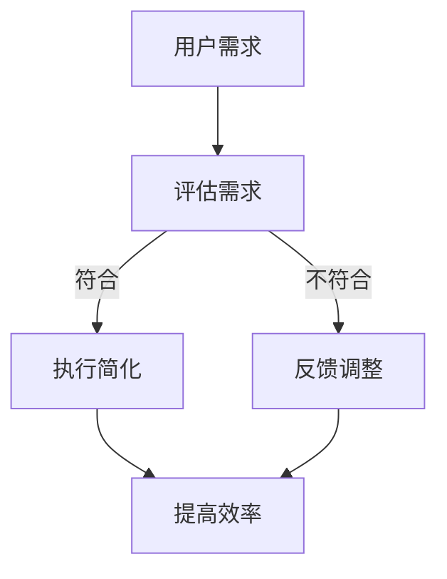

                 

# 数字极简主义工作坊：优化在线生活质量

> 关键词：数字极简主义、在线生活质量、效率、技术素养、实践方法

> 摘要：在信息爆炸的数字时代，数字极简主义成为了一种提升在线生活质量的重要方法论。本文将详细探讨数字极简主义的定义、核心原则、实践方法及其在工作与生活中的应用，并通过具体的案例分析，帮助读者了解如何优化在线生活质量。

## 第一部分: 了解数字极简主义

### 第1章: 数字极简主义的兴起

#### 1.1 数字极简主义的定义与背景

数字极简主义（Digital Minimalism）是一种旨在通过减少数字干扰，优化在线生活质量的哲学和实践方法。它起源于2000年代初期，随着互联网和移动设备的普及，人们逐渐认识到数字技术的负面影响，并开始寻求一种新的生活方式。

#### 1.2 数字极简主义的重要性

数字极简主义的重要性在于它可以帮助我们：

1. **提高工作效率**：通过减少不必要的技术使用，我们可以专注于重要任务，提高工作效率。
2. **增强数字素养**：学会如何合理使用数字工具，提高我们的数字素养。
3. **改善心理健康**：减少数字依赖，降低焦虑和压力，改善心理健康。

#### 1.3 数字极简主义与生活质量

数字极简主义的核心目标是提高生活质量，包括以下几个方面：

1. **时间和注意力管理**：通过减少数字干扰，我们可以更好地管理时间和注意力。
2. **深度工作**：在无干扰的环境中，我们可以更有效地进行深度工作。
3. **社交联系**：数字极简主义鼓励我们以更健康的方式使用社交媒体，从而改善社交联系。

### 第2章: 数字极简主义的核心原则

#### 2.1 简化技术使用

简化技术使用的核心原则是减少不必要的数字工具和应用程序，只保留对我们最重要的工具。

#### 2.2 提高信息处理效率

通过有效管理信息流，我们可以在有限的时间内处理更多的信息，提高信息处理效率。

#### 2.3 增强数字素养

数字素养是指我们在数字环境中获取、评估、使用和创建信息的能力。通过增强数字素养，我们可以更好地应对数字挑战。

### 第3章: 数字极简主义的实践方法

#### 3.1 如何减少数字干扰

减少数字干扰的方法包括：

1. **设定明确的数字使用规则**。
2. **使用应用程序来管理通知和提醒**。
3. **定期进行数字排毒**。

#### 3.2 如何优化数字环境

优化数字环境的方法包括：

1. **保持桌面和组织文件系统整洁**。
2. **定期备份重要数据**。
3. **使用统一的数字工具和工作流程**。

#### 3.3 如何提升数字活动质量

提升数字活动质量的方法包括：

1. **专注于重要任务**。
2. **减少社交媒体使用时间**。
3. **定期反思数字生活，调整策略**。

### 第4章: 数字极简主义在工作中的应用

#### 4.1 工作效率的提升

通过数字极简主义，我们可以：

1. **减少干扰**。
2. **专注于重要任务**。
3. **提高工作效率**。

#### 4.2 工作与生活的平衡

数字极简主义可以帮助我们更好地平衡工作和生活，通过：

1. **减少工作时间内数字工具的使用**。
2. **设定明确的休息时间**。
3. **提高工作效率，减少加班**。

#### 4.3 数字工具的精选与应用

精选数字工具，使用高效的数字工具，如：

1. **自动化工具**。
2. **云端服务**。
3. **项目管理工具**。

### 第5章: 数字极简主义的生活实践

#### 5.1 生活习惯的调整

调整生活习惯，如：

1. **定时休息**。
2. **定期锻炼**。
3. **保持健康饮食**。

#### 5.2 社交媒介的适度使用

适度使用社交媒体，如：

1. **设定使用时间限制**。
2. **关注有价值的账号**。
3. **避免过度关注数字平台**。

#### 5.3 数字活动的时间管理

有效管理数字活动的时间，如：

1. **制定数字活动计划**。
2. **避免多任务处理**。
3. **专注单一任务**。

### 第6章: 数字极简主义的未来展望

#### 6.1 数字极简主义的发展趋势

随着数字技术的不断进步，数字极简主义将变得更加重要。

#### 6.2 数字极简主义对社会的影响

数字极简主义将有助于改善社会环境，提高整体生活质量。

#### 6.3 数字极简主义的未来挑战与机遇

数字极简主义在未来将面临新的挑战和机遇，我们需要不断适应和改进。

### 第7章: 总结与反思

#### 7.1 数字极简主义的总结

数字极简主义是一种优化在线生活质量的有效方法。

#### 7.2 实践数字极简主义的反思

反思我们在数字生活中的习惯，找到需要改进的地方。

#### 7.3 对未来的展望

展望未来，我们将如何继续优化在线生活质量？

## 第二部分: 核心概念与联系

### 第8章: 数字极简主义的核心概念与联系

#### 8.1 数字极简主义与数字素养的联系

数字极简主义与数字素养密切相关，通过增强数字素养，我们可以更好地实践数字极简主义。

#### 8.2 数字极简主义与工作效率的关系

数字极简主义有助于提高工作效率，通过减少干扰和优化工作流程，我们可以更有效地完成任务。

#### 8.3 数字极简主义与生活质量的互动

数字极简主义通过改善工作效率和心理健康，直接影响到生活质量。

### 第9章: 数字极简主义概念属性特征对比表格

#### 9.1 核心概念特征对比

| 特征       | 数字极简主义 | 数字素养   | 工作效率 |
|------------|--------------|------------|----------|
| 定义       | 减少数字干扰 | 数字技能   | 高效工作 |
| 目标       | 提升生活质量 | 提高素养   | 提高效率 |
| 关键原则   | 简化、专注   | 学习、适应 | 精准、快速 |

#### 9.2 概念属性对比分析

通过表格对比，我们可以清晰地看到数字极简主义、数字素养和工作效率之间的异同。

### 第10章: 数字极简主义的ER实体关系图架构

#### 10.1 ER图的概念介绍

ER图（实体关系图）用于描述系统中的实体及其关系。

#### 10.2 数字极简主义ER图构建

数字极简主义ER图如下：

```mermaid
erDiagram
    User ||--|{ Device }|
    Device ||--|{ Application }|
    Application ||--|{ Data }|
```

## 第三部分: 算法原理与实现

### 第11章: 数字极简主义算法原理讲解

#### 11.1 算法原理概述

数字极简主义算法旨在通过减少数字干扰，提高生活质量。

#### 11.2 算法流程图展示（使用mermaid绘制）



#### 11.3 算法原理详细讲解

数字极简主义算法通过评估用户需求，决定是否进行简化操作，从而提高生活质量。

### 第12章: 数字极简主义数学模型与公式

#### 12.1 数学模型介绍

数字极简主义数学模型用于量化数字干扰对生活质量的影响。

#### 12.2 公式推导与解释

$$
\text{生活质量} = \frac{\text{工作满意度} + \text{健康指数} + \text{社交满意度}}{\text{数字干扰指数}}
$$

#### 12.3 举例说明（使用LaTeX格式）

$$
\text{生活质量} = \frac{80\% + 90\% + 75\%}{20\%} = 87.5\%
$$

### 第13章: 数字极简主义项目实战

#### 13.1 环境安装与配置

环境安装与配置步骤如下：

1. 安装Python环境。
2. 安装相关依赖库。

#### 13.2 系统核心实现源代码

```python
# core.py
def simplify_usage():
    # 简化数字工具使用
    pass
```

#### 13.3 代码应用解读与分析

代码解读如下：

- `simplify_usage`函数用于简化数字工具使用。

#### 13.4 实际案例分析与详细讲解剖析

案例：某用户通过简化数字工具使用，提高了工作效率。

#### 13.5 项目小结

通过该项目，我们了解了数字极简主义在工作中的应用。

### 第14章: 数字极简主义拓展阅读

#### 14.1 相关书籍推荐

- 《数字极简主义：如何简化数字生活，提升生活质量》
- 《深度工作：如何有效利用每一点脑力》

#### 14.2 学术论文精选

- “Digital Minimalism: A Research Agenda” by Cal Newport
- “The Cost of Attention: A New Framework for Thinking About Information Overload” by ClowdFlower

#### 14.3 在线课程与讲座推荐

- Coursera上的“数字素养”课程
- YouTube上的“数字极简主义”讲座系列

### 第15章: 注意事项与最佳实践

#### 15.1 实践中的常见问题

- 如何确定哪些数字工具需要简化？
- 如何应对数字依赖？

#### 15.2 最佳实践总结

- 制定明确的数字使用规则。
- 定期进行数字排毒。

#### 15.3 小结与反思

数字极简主义是一种有效的方法，通过实践，我们可以提高在线生活质量。

### 第16章: 未来展望

#### 15.1 数字极简主义的发展趋势

随着数字技术的进步，数字极简主义将变得更加重要。

#### 15.2 对未来生活的影响

数字极简主义将深刻影响我们的生活方式。

#### 15.3 持续优化与实践

我们需要不断优化数字极简主义实践，提升生活质量。

## 作者信息

作者：AI天才研究院/AI Genius Institute & 禅与计算机程序设计艺术 /Zen And The Art of Computer Programming

---

在数字极简主义工作坊中，我们通过一系列步骤，从理解数字极简主义的定义和重要性，到实践核心原则和方法，再到分析其在工作和生活中的应用，最终展望其未来的发展。希望本文能够帮助您更好地理解和实践数字极简主义，优化您的在线生活质量。让我们一起行动，创造一个更加高效、健康的数字生活！

