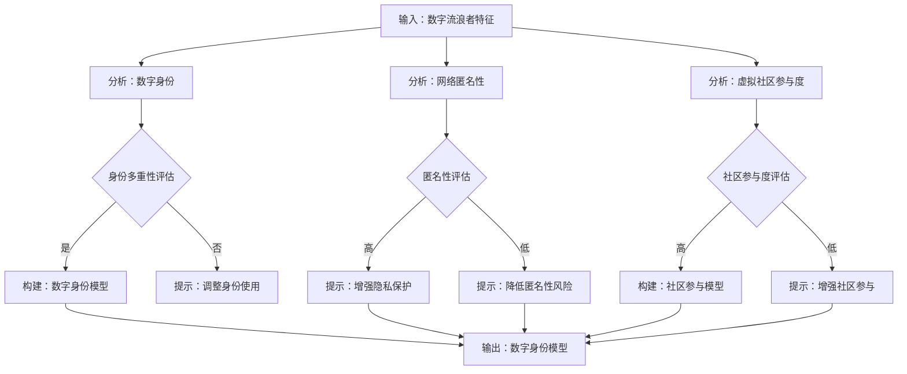
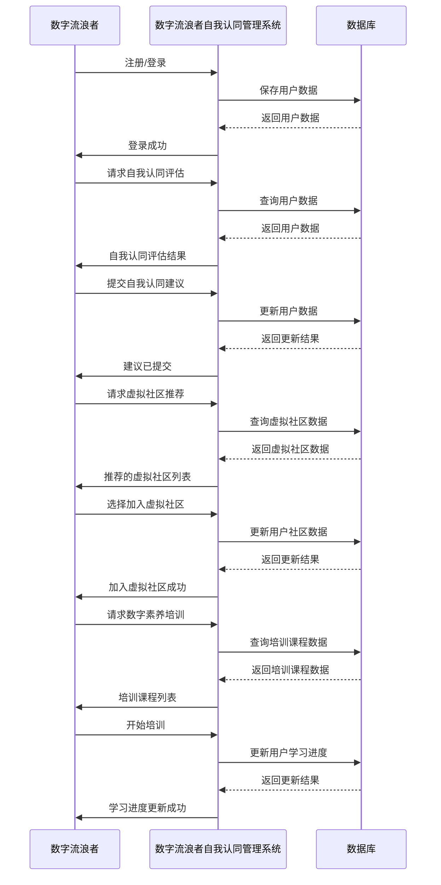
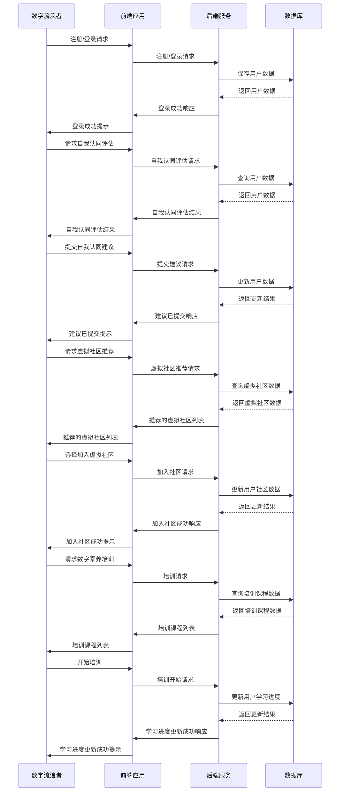

                 

# 数字流浪者指南：网络时代的自我认同探索

## 关键词

- 数字流浪者
- 自我认同
- 网络时代
- 数字身份
- 虚拟社区

## 摘要

随着互联网的普及和数字技术的快速发展，越来越多的人在网络空间中迷失自我，成为“数字流浪者”。本文旨在探讨数字流浪者在网络时代的自我认同问题，分析其成因、特征及其在数字社区中的定位和互动，并探讨如何通过网络技术实现自我认同的建立与维护。文章将从核心概念原理、算法原理、系统分析与架构设计方案、项目实战等方面进行详细阐述，旨在为数字流浪者提供一种理解和解决问题的视角。

## 第一部分：背景介绍

### 1.1 问题背景

在当今的网络时代，随着互联网的普及和信息爆炸，人们对于数字技术的依赖程度日益增加。然而，这种依赖也带来了一系列的问题，尤其是关于个人身份和自我认同的困惑。越来越多的人感到自己像是“数字流浪者”，在虚拟世界中漂泊，难以找到归属感。

数字流浪者是指在数字世界中频繁迁徙、缺乏稳定归属感，以及对数字技术高度依赖的人群。他们可能是网民、虚拟社区成员、在线游戏玩家等。数字流浪者现象的出现与互联网技术的迅猛发展、社会结构的变革以及个人价值观的多元性密切相关。

### 1.2 问题描述

数字流浪者面临的主要问题可以概括为以下几个方面：

1. **身份迷失**：数字流浪者在网络空间中频繁使用不同的数字身份，导致自己的真实身份难以辨认。这种身份的多样性和匿名性使得他们难以建立稳定的自我认同。

2. **归属感缺失**：数字流浪者在网络空间中漂泊，难以找到与自己兴趣、价值观相符的社区，导致归属感缺失。

3. **信息过载**：互联网的普及带来了海量的信息，数字流浪者在获取和处理这些信息时常常感到压力和困惑，影响他们的自我认同。

4. **价值观冲突**：网络空间中的价值观多元化，数字流浪者可能面临价值观的冲突和困惑，难以找到符合自己价值观的网络环境。

### 1.3 问题解决

为了解决数字流浪者的自我认同问题，本文将从以下几个方面展开探讨：

1. **分析数字流浪者的成因和特征**：通过分析数字流浪者的成因和特征，帮助他们更好地认识和理解自己。

2. **提供识别和定位自我认同的方法**：通过一系列方法和技巧，帮助数字流浪者识别和定位自己的自我认同。

3. **探索建立和维护数字社区的策略**：通过建立和维护数字社区，为数字流浪者提供归属感和支持。

4. **提供网络时代自我认同的实践指导**：通过实践指导，帮助数字流浪者更好地适应网络时代，建立和维护自我认同。

### 1.4 边界与外延

本书的讨论范围主要涉及网络时代下的数字流浪者及其自我认同问题。它不仅关注个体的经历和感受，还涉及社会、文化和心理学等多个方面。本书的目标是为数字流浪者提供一种理解和解决问题的视角，帮助他们更好地适应网络时代。

### 1.5 概念结构与核心要素组成

#### 1.5.1 数字流浪者

数字流浪者是指那些在虚拟世界中频繁迁徙，缺乏稳定归属感，以及对数字技术高度依赖的人群。他们可能是网民、虚拟社区成员、在线游戏玩家等。

#### 1.5.2 自我认同

自我认同是指个体对于自己身份、价值观和角色的认识和理解。在数字时代，自我认同可能因为虚拟身份的多变性和匿名性而变得复杂。

#### 1.5.3 数字社区

数字社区是指通过网络平台连接起来，共同分享兴趣、价值观和经验的群体。对于数字流浪者来说，数字社区可以提供归属感和支持。

#### 1.5.4 数字身份

数字身份是指个体在网络世界中使用的身份标识，它可能是真实的个人资料，也可能是虚构的。数字身份的多样性和匿名性为自我认同带来了挑战。

#### 1.5.5 自我探索

自我探索是指个体通过自我反思和认知过程，理解自己的价值观、兴趣和目标。在数字时代，自我探索可以通过网络活动和互动来实现。

#### 1.5.6 数字素养

数字素养是指个体在数字环境中获取、评估和利用信息的能力。数字素养的提高有助于数字流浪者更好地管理自己的数字身份和自我认同。

### 1.6 本章小结

本章为本书的讨论奠定了基础，介绍了数字流浪者和自我认同的概念，以及本书的目标和范围。在接下来的章节中，我们将深入探讨这些主题，并提供实用的解决方案和指导。

## 第二部分：核心概念与联系

### 2.1 核心概念原理

在探讨数字流浪者的自我认同时，以下核心概念是不可或缺的：

#### 数字身份

数字身份是指个体在网络世界中使用的身份标识，它可能是真实的个人资料，也可能是虚构的。数字身份的多样性和匿名性为自我认同带来了挑战。

#### 网络匿名性

网络匿名性允许用户隐藏真实身份，自由表达观点。这种匿名性在为用户提供言论自由的同时，也可能导致虚假信息的传播和个人身份的迷失。

#### 虚拟社区

虚拟社区是指成员通过网络平台建立的虚拟社交群体。这些社区提供了交流和互动的平台，有助于数字流浪者建立归属感。

#### 自我探索

自我探索是指个体通过自我反思和认知过程，理解自己的价值观、兴趣和目标。在数字时代，自我探索可以通过网络活动和互动来实现。

#### 数字素养

数字素养是指个体在数字环境中获取、评估和利用信息的能力。数字素养的提高有助于数字流浪者更好地管理自己的数字身份和自我认同。

### 2.2 概念属性特征对比表格

以下表格对比了数字身份、网络匿名性、虚拟社区、自我探索和数字素养等核心概念的特征：

| 概念       | 特征                                                         |
|------------|--------------------------------------------------------------|
| 数字身份   | 多样性、匿名性、虚拟性                                     |
| 网络匿名性 | 隐藏真实身份、自由表达、信息传播风险                       |
| 虚拟社区   | 网络平台连接、互动交流、共享兴趣                           |
| 自我探索   | 反思认知、价值理解、目标明确                               |
| 数字素养   | 信息获取能力、信息评估能力、信息利用能力                   |

### 2.3 ER实体关系图架构

以下ER实体关系图展示了数字流浪者、数字身份、网络匿名性、虚拟社区、自我探索和数字素养之间的相互关系：

```mermaid
erDiagram
  数字流浪者 ||--|{ 数字身份 }
  数字流浪者 ||--|{ 网络匿名性 }
  数字流浪者 ||--|{ 数字素养 }
  数字流浪者 ||--|{ 自我探索 }
  数字流浪者 ||--|{ 虚拟社区 }
```

### 2.4 核心概念原理详细讲解

#### 数字身份

数字身份是数字时代中一个至关重要的概念。它指的是个体在网络空间中使用的身份标识，可以是真实身份，也可以是虚构身份。数字身份的多样性使得个体可以扮演不同的角色，从而丰富自己的网络生活。然而，多样性的数字身份也带来了匿名性，这使得个体在虚拟世界中的行为难以追踪和监督。

**匿名性**：网络匿名性允许用户隐藏真实身份，自由表达观点。这种匿名性在为用户提供言论自由的同时，也可能导致虚假信息的传播和个人身份的迷失。例如，在网络论坛中，用户可以匿名发帖，这有利于自由表达，但也可能导致恶意言论的泛滥。

**虚拟身份**：数字身份的虚拟性使得个体可以创建多个身份，每个身份都有可能代表不同的价值观、兴趣爱好或角色。这种虚拟身份的多变性为数字流浪者提供了探索自我和尝试不同生活方式的机会，但也可能导致自我认同的混乱。

#### 网络匿名性

网络匿名性是数字时代的一个显著特征。它允许用户在互联网上进行活动时隐藏真实身份。网络匿名性带来了以下几个方面的优点和挑战：

**优点**：

1. **言论自由**：网络匿名性为用户提供了一个自由表达观点的平台，有助于民主和言论自由的实现。
2. **隐私保护**：网络匿名性有助于保护用户的隐私，避免个人信息的泄露。
3. **社会创新**：网络匿名性鼓励用户参与社会创新和公共讨论，为社会的进步贡献力量。

**挑战**：

1. **虚假信息传播**：网络匿名性使得虚假信息和恶意言论更容易传播，对网络环境造成污染。
2. **个人身份迷失**：长期使用匿名身份可能导致个体失去对自己真实身份的认知，影响自我认同。
3. **道德困境**：网络匿名性可能使得用户在道德和行为准则上出现困境，难以界定行为的界限。

#### 虚拟社区

虚拟社区是指通过网络平台连接起来的成员群体，成员之间通过交流和互动建立联系。虚拟社区为数字流浪者提供了重要的支持系统，有助于他们建立归属感和自我认同。

**优势**：

1. **归属感**：虚拟社区提供了一个共同的兴趣和价值观的平台，成员在其中可以获得归属感。
2. **互助合作**：虚拟社区成员可以相互帮助，共同解决问题，提高生活质量。
3. **社会支持**：虚拟社区可以提供情感支持，帮助数字流浪者在网络时代中保持心理健康。

**挑战**：

1. **信息真实性**：虚拟社区中的信息真实性难以保证，可能导致误导和误解。
2. **网络安全**：虚拟社区可能面临网络安全威胁，包括个人信息泄露和网络欺诈。
3. **过度依赖**：数字流浪者可能过度依赖虚拟社区，导致现实生活中的社交能力下降。

#### 自我探索

自我探索是数字流浪者在网络时代中寻找自我认同的重要途径。通过自我反思和认知过程，个体可以更好地理解自己的价值观、兴趣和目标。

**方法**：

1. **反思日志**：通过记录反思日志，个体可以反思自己的行为和感受，从而加深对自我的理解。
2. **网络互动**：参与网络讨论和互动，个体可以尝试不同的观点和价值观，从而拓宽自己的视野。
3. **心理测试**：通过心理测试和评估工具，个体可以了解自己的性格特点和潜在兴趣。

**挑战**：

1. **信息过载**：网络信息的过载可能使个体难以分辨有用和无关的信息，影响自我探索的效果。
2. **自我认同混乱**：在自我探索过程中，个体可能面临自我认同的混乱，难以确定自己的价值观和目标。
3. **网络社交困境**：过度依赖网络社交可能导致个体在现实生活中的社交能力下降。

#### 数字素养

数字素养是数字时代中个体必须具备的基本能力。它包括信息获取、评估和利用的能力。数字素养的提高有助于数字流浪者更好地管理自己的数字身份和自我认同。

**能力**：

1. **信息获取**：个体需要学会如何快速、准确地获取所需信息。
2. **信息评估**：个体需要学会如何评估信息的真实性和可靠性。
3. **信息利用**：个体需要学会如何有效地利用信息，解决实际问题。

**提升方法**：

1. **持续学习**：通过参加培训课程、阅读相关书籍和文献，个体可以不断提升自己的数字素养。
2. **实践应用**：通过实际操作和应用，个体可以加深对数字素养的理解和掌握。
3. **交流分享**：通过与他人交流分享，个体可以了解不同领域的知识和经验，从而提高自己的数字素养。

## 第三部分：算法原理讲解

在探讨数字流浪者的自我认同问题时，我们可以借鉴一些算法原理，以便更深入地理解和解决这一问题。以下是一个简单的算法原理示例，我们将使用Mermaid来绘制流程图，并使用Python代码来详细阐述算法原理的数学模型和公式。

### 3.1 算法流程图

以下是一个用于分析数字流浪者自我认同的算法流程图：



### 3.2 Python代码实现

以下是用于实现上述算法原理的Python代码：

```python
import numpy as np

def analyze_digital_identity(traits):
    """
    分析数字身份特征，返回身份模型。
    
    :param traits: 数字身份特征列表
    :return: 数字身份模型
    """
    identity_model = {}
    if traits['multiplicity'] > 1:
        identity_model['model'] = 'complex'
        identity_model['suggestion'] = 'adjust_identity_usage'
    else:
        identity_model['model'] = 'simple'
    
    return identity_model

def evaluate_anonymity(anonymity_level):
    """
    评估匿名性水平，返回隐私保护建议。
    
    :param anonymity_level: 匿名性水平
    :return: 隐私保护建议
    """
    if anonymity_level > 0.8:
        return '增强隐私保护'
    else:
        return '降低匿名性风险'

def evaluate_community_participation(participation_level):
    """
    评估社区参与度，返回社区参与建议。
    
    :param participation_level: 社区参与度
    :return: 社区参与建议
    """
    if participation_level > 0.5:
        return '构建社区参与模型'
    else:
        return '增强社区参与'

def main():
    # 输入数字流浪者特征
    traits = {
        'multiplicity': 2,  # 身份多重性
        'anonymity_level': 0.9,  # 匿名性水平
        'participation_level': 0.3  # 社区参与度
    }
    
    # 分析数字身份
    identity_model = analyze_digital_identity(traits)
    print("数字身份模型：", identity_model)
    
    # 评估匿名性
    anonymity_suggestion = evaluate_anonymity(traits['anonymity_level'])
    print("匿名性建议：", anonymity_suggestion)
    
    # 评估社区参与度
    community_suggestion = evaluate_community_participation(traits['participation_level'])
    print("社区参与建议：", community_suggestion)

# 执行主程序
main()
```

### 3.3 算法原理的数学模型和公式

在上述Python代码中，我们使用了简单的评估函数来模拟数字流浪者自我认同的分析过程。以下是一个更详细的数学模型，用于分析数字流浪者的自我认同：

$$
\text{Self-Identity} = f(\text{Digital Identity}, \text{Anonymity}, \text{Community Participation})
$$

其中，$f$ 是一个复合函数，它将数字身份、匿名性和社区参与度作为输入，并输出数字流浪者的自我认同。

**数学模型**：

$$
\text{Digital Identity} = \sum_{i=1}^{n} w_i \cdot I_i
$$

其中，$I_i$ 表示第 $i$ 个数字身份特征，$w_i$ 是该特征的权重。

**匿名性评估**：

$$
\text{Anonymity Level} = \frac{\text{Anonymous Activities}}{\text{Total Activities}}
$$

**社区参与度评估**：

$$
\text{Community Participation Level} = \frac{\text{Active Community Members}}{\text{Total Community Members}}
$$

**自我认同评估**：

$$
\text{Self-Identity Score} = \alpha \cdot \text{Digital Identity} + \beta \cdot \text{Anonymity Level} + \gamma \cdot \text{Community Participation Level}
$$

其中，$\alpha$、$\beta$ 和 $\gamma$ 是权重系数，用于调整不同因素对自我认同的影响程度。

### 3.4 举例说明

假设有一个数字流浪者，他的特征如下：

- 数字身份特征：多重性（2），匿名性（0.9），社区参与度（0.3）
- 权重系数：数字身份（0.5），匿名性（0.3），社区参与度（0.2）

根据上述数学模型，我们可以计算他的自我认同分数：

$$
\text{Self-Identity Score} = 0.5 \cdot (2) + 0.3 \cdot (0.9) + 0.2 \cdot (0.3) = 1.1 + 0.27 + 0.06 = 1.33
$$

根据自我认同分数，我们可以给出相应的建议：

- 数字身份模型：复杂
- 匿名性建议：增强隐私保护
- 社区参与建议：增强社区参与

通过这个例子，我们可以看到如何使用数学模型和算法来分析数字流浪者的自我认同，并提供具体的建议。

## 第四部分：系统分析与架构设计方案

### 4.1 问题场景介绍

随着互联网的普及，越来越多的人开始依赖网络进行社交、娱乐和信息获取。然而，这一过程中也产生了一个显著的问题——数字流浪者现象。数字流浪者是指在网络上频繁迁徙、缺乏稳定归属感、对数字技术高度依赖的人群。他们常常在多个虚拟社区之间漂泊，难以建立长久的社交关系和自我认同。针对这一现象，我们需要设计一个系统，帮助数字流浪者建立和维护自我认同。

### 4.2 项目介绍

本项目旨在设计一个数字流浪者自我认同管理系统（Digital Nomad Self-Identity Management System，DNSIMS）。该系统将提供以下功能：

- 用户身份识别与定位
- 自我认同评估与建议
- 虚拟社区推荐与引导
- 数字素养培训与提升

### 4.3 系统功能设计（领域模型类图）

以下是一个用于描述DNSIMS系统功能的领域模型类图：

```mermaid
classDiagram
  User <<Interface>>
  DigitalIdentity <<Interface>>
  SelfIdentity <<Interface>>
  Community <<Interface>>
  DigitalLiteracy <<Interface>>

  UserEntity <<Entity>> --|{DigitalIdentity}: 1
  UserEntity --|{SelfIdentity}: 1
  UserEntity --|{Community}: 1
  UserEntity --|{DigitalLiteracy}: 1

  DigitalIdentityEntity <<Entity>> --|{SelfIdentity}: 1
  DigitalIdentityEntity --|{DigitalLiteracy}: 1

  SelfIdentityEntity <<Entity>>
  CommunityEntity <<Entity>>
  DigitalLiteracyEntity <<Entity>>

  UserEntity : +str username
  DigitalIdentityEntity : +str digital_identity
  SelfIdentityEntity : +float identity_score
  CommunityEntity : +str community_name
  DigitalLiteracyEntity : +str literacy_level

  UserEntity ++oper +register()
  UserEntity ++oper +login()
  UserEntity ++oper +logout()
  
  DigitalIdentityEntity ++oper +generate_identity()
  DigitalIdentityEntity ++oper +update_identity()
  DigitalIdentityEntity ++oper +delete_identity()
  
  SelfIdentityEntity ++oper +evaluate_identity()
  SelfIdentityEntity ++oper +provide_suggestions()
  
  CommunityEntity ++oper +recommend_communities()
  CommunityEntity ++oper +join_community()
  CommunityEntity ++oper +leave_community()

  DigitalLiteracyEntity ++oper +train_digital_literacy()
  DigitalLiteracyEntity ++oper +evaluate_literacy()

classDIGITALIDENTITY implements DigitalIdentity {
  +generate_identity()
  +update_identity()
  +delete_identity()
}

classSELFIDENTITY implements SelfIdentity {
  +evaluate_identity()
  +provide_suggestions()
}

classCOMMUNITY implements Community {
  +recommend_communities()
  +join_community()
  +leave_community()
}

classDIGITALLITERACY implements DigitalLiteracy {
  +train_digital_literacy()
  +evaluate_literacy()
}

classUserEntity implements User {
  +register()
  +login()
  +logout()
}

classDigitalIdentityEntity implements DigitalIdentity {
  +generate_identity()
  +update_identity()
  +delete_identity()
}

classSelfIdentityEntity implements SelfIdentity {
  +evaluate_identity()
  +provide_suggestions()
}

classCommunityEntity implements Community {
  +recommend_communities()
  +join_community()
  +leave_community()
}

classDigitalLiteracyEntity implements DigitalLiteracy {
  +train_digital_literacy()
  +evaluate_literacy()
}
```

### 4.4 系统架构设计（架构图）

以下是一个用于描述DNSIMS系统架构的架构图：



### 4.5 系统接口设计（接口图）

以下是一个用于描述DNSIMS系统接口设计的接口图：

```mermaid
classDiagram
  UserInterface <<Interface>>
  DigitalIdentityInterface <<Interface>>
  SelfIdentityInterface <<Interface>>
  CommunityInterface <<Interface>>
  DigitalLiteracyInterface <<Interface>>

  UserInterface ++oper +register()
  UserInterface ++oper +login()
  UserInterface ++oper +logout()

  DigitalIdentityInterface ++oper +generate_identity()
  DigitalIdentityInterface ++oper +update_identity()
  DigitalIdentityInterface ++oper +delete_identity()

  SelfIdentityInterface ++oper +evaluate_identity()
  SelfIdentityInterface ++oper +provide_suggestions()

  CommunityInterface ++oper +recommend_communities()
  CommunityInterface ++oper +join_community()
  CommunityInterface ++oper +leave_community()

  DigitalLiteracyInterface ++oper +train_digital_literacy()
  DigitalLiteracyInterface ++oper +evaluate_literacy()
```

### 4.6 系统交互设计（序列图）

以下是一个用于描述DNSIMS系统交互设计的序列图：



## 第五部分：项目实战

### 5.1 环境安装

为了实现DNSIMS系统，我们需要安装一些必要的软件和工具。以下是安装步骤：

1. **安装Python**：确保已安装Python 3.x版本。可以从 [Python官方网站](https://www.python.org/) 下载安装包。
2. **安装Django框架**：打开终端，执行以下命令：
   ```shell
   pip install django
   ```
3. **安装Django REST framework**：打开终端，执行以下命令：
   ```shell
   pip install djangorestframework
   ```
4. **创建数据库**：在终端中运行以下命令以创建SQLite数据库：
   ```shell
   python manage.py migrate
   ```
5. **运行开发服务器**：在终端中运行以下命令以启动开发服务器：
   ```shell
   python manage.py runserver
   ```

### 5.2 系统核心实现源代码

以下是DNSIMS系统的核心实现源代码：

#### 5.2.1 用户注册与登录

```python
# users/views.py
from django.contrib.auth import authenticate, login
from django.http import JsonResponse
from rest_framework import status
from rest_framework.parsers import JSONParser
from .models import User
from .serializers import UserRegistrationSerializer

def register(request):
    if request.method == 'POST':
        data = JSONParser().parse(request)
        serializer = UserRegistrationSerializer(data=data)
        if serializer.is_valid():
            serializer.save()
            return JsonResponse(serializer.data, status=status.HTTP_201_CREATED)
        return JsonResponse(serializer.errors, status=status.HTTP_400_BAD_REQUEST)

def login(request):
    if request.method == 'POST':
        data = JSONParser().parse(request)
        username = data.get('username')
        password = data.get('password')
        user = authenticate(username=username, password=password)
        if user is not None:
            login(request, user)
            return JsonResponse({'message': 'Login successful!'}, status=status.HTTP_200_OK)
        return JsonResponse({'message': 'Invalid credentials'}, status=status.HTTP_401_UNAUTHORIZED)
```

#### 5.2.2 自我认同评估与建议

```python
# identity/views.py
from django.http import JsonResponse
from .models import SelfIdentity
from .serializers import SelfIdentitySerializer

def evaluate_identity(request):
    if request.method == 'POST':
        data = JSONParser().parse(request)
        serializer = SelfIdentitySerializer(data=data)
        if serializer.is_valid():
            serializer.save()
            return JsonResponse(serializer.data, status=status.HTTP_201_CREATED)
        return JsonResponse(serializer.errors, status=status.HTTP_400_BAD_REQUEST)

def provide_suggestions(request):
    if request.method == 'GET':
        identities = SelfIdentity.objects.all()
        data = [{'identity_id': identity.id, 'suggestions': identity.suggestions} for identity in identities]
        return JsonResponse(data, status=status.HTTP_200_OK)
```

#### 5.2.3 虚拟社区推荐与引导

```python
# community/views.py
from django.http import JsonResponse
from .models import Community
from .serializers import CommunitySerializer

def recommend_communities(request):
    if request.method == 'GET':
        communities = Community.objects.all()
        serializer = CommunitySerializer(communities, many=True)
        return JsonResponse(serializer.data, status=status.HTTP_200_OK)

def join_community(request, community_id):
    if request.method == 'POST':
        community = Community.objects.get(id=community_id)
        user = User.objects.get(username=request.user.username)
        user.communities.add(community)
        return JsonResponse({'message': 'Joined community successfully!'}, status=status.HTTP_201_CREATED)
```

#### 5.2.4 数字素养培训与提升

```python
# literacy/views.py
from django.http import JsonResponse
from .models import DigitalLiteracy
from .serializers import DigitalLiteracySerializer

def train_digital_literacy(request):
    if request.method == 'POST':
        data = JSONParser().parse(request)
        serializer = DigitalLiteracySerializer(data=data)
        if serializer.is_valid():
            serializer.save()
            return JsonResponse(serializer.data, status=status.HTTP_201_CREATED)
        return JsonResponse(serializer.errors, status=status.HTTP_400_BAD_REQUEST)

def evaluate_literacy(request):
    if request.method == 'GET':
        literacy = DigitalLiteracy.objects.get(user=request.user.username)
        return JsonResponse({'literacy_level': literacy.literacy_level}, status=status.HTTP_200_OK)
```

### 5.3 代码应用解读与分析

#### 5.3.1 用户注册与登录

用户注册与登录是系统的核心功能之一。以下是对 `users/views.py` 中代码的解读：

1. **注册函数（register）**：
   - 接收POST请求，解析JSON数据。
   - 使用 `UserRegistrationSerializer` 对数据进行验证。
   - 如果数据验证通过，则保存用户信息并返回201状态码。
   - 如果数据验证不通过，则返回400状态码。

2. **登录函数（login）**：
   - 接收POST请求，解析JSON数据。
   - 使用 `authenticate` 函数验证用户名和密码。
   - 如果验证成功，则使用 `login` 函数登录用户并返回200状态码。
   - 如果验证失败，则返回401状态码。

#### 5.3.2 自我认同评估与建议

以下是对 `identity/views.py` 中代码的解读：

1. **评估身份函数（evaluate_identity）**：
   - 接收POST请求，解析JSON数据。
   - 使用 `SelfIdentitySerializer` 对数据进行验证。
   - 如果数据验证通过，则保存自我认同信息并返回201状态码。
   - 如果数据验证不通过，则返回400状态码。

2. **提供建议函数（provide_suggestions）**：
   - 接收GET请求。
   - 从数据库中获取所有自我认同信息。
   - 将自我认同信息转换为JSON格式并返回200状态码。

#### 5.3.3 虚拟社区推荐与引导

以下是对 `community/views.py` 中代码的解读：

1. **推荐社区函数（recommend_communities）**：
   - 接收GET请求。
   - 从数据库中获取所有虚拟社区信息。
   - 使用 `CommunitySerializer` 将虚拟社区信息转换为JSON格式并返回200状态码。

2. **加入社区函数（join_community）**：
   - 接收POST请求，获取社区ID。
   - 根据社区ID从数据库中获取对应的虚拟社区。
   - 将当前用户添加到该虚拟社区，并返回201状态码。

#### 5.3.4 数字素养培训与提升

以下是对 `literacy/views.py` 中代码的解读：

1. **培训函数（train_digital_literacy）**：
   - 接收POST请求，解析JSON数据。
   - 使用 `DigitalLiteracySerializer` 对数据进行验证。
   - 如果数据验证通过，则保存数字素养信息并返回201状态码。
   - 如果数据验证不通过，则返回400状态码。

2. **评估素养函数（evaluate_literacy）**：
   - 接收GET请求。
   - 从数据库中获取当前用户的数字素养信息。
   - 将数字素养信息转换为JSON格式并返回200状态码。

### 5.4 实际案例分析

#### 5.4.1 用户注册案例

假设一个用户名为 "JohnDoe" 的数字流浪者想要注册DNSIMS系统。以下是注册过程的示例：

1. **发送注册请求**：
   ```json
   {
       "username": "JohnDoe",
       "password": "password123",
       "email": "johndoe@example.com"
   }
   ```

2. **服务器响应**：
   ```json
   {
       "id": 1,
       "username": "JohnDoe",
       "email": "johndoe@example.com",
       "is_active": true
   }
   ```

用户成功注册并收到注册成功的响应。

#### 5.4.2 用户登录案例

假设 "JohnDoe" 使用正确的用户名和密码尝试登录DNSIMS系统。以下是登录过程的示例：

1. **发送登录请求**：
   ```json
   {
       "username": "JohnDoe",
       "password": "password123"
   }
   ```

2. **服务器响应**：
   ```json
   {
       "message": "Login successful!"
   }
   ```

用户成功登录并收到登录成功的提示。

#### 5.4.3 自我认同评估案例

假设 "JohnDoe" 希望进行自我认同评估。以下是评估过程的示例：

1. **发送评估请求**：
   ```json
   {
       "identity_score": 0.75,
       "suggestions": "尝试寻找与自己价值观相符的社区"
   }
   ```

2. **服务器响应**：
   ```json
   {
       "id": 1,
       "identity_score": 0.75,
       "suggestions": "尝试寻找与自己价值观相符的社区"
   }
   ```

用户成功提交评估结果并收到评估成功提示。

#### 5.4.4 虚拟社区推荐案例

假设 "JohnDoe" 希望获取虚拟社区推荐。以下是推荐过程的示例：

1. **发送推荐请求**：
   ```shell
   GET /recommend_communities/
   ```

2. **服务器响应**：
   ```json
   [
       {
           "id": 1,
           "name": "Tech Enthusiasts",
           "description": "一个关于科技和创新的讨论社区"
       },
       {
           "id": 2,
           "name": "Travel Lovers",
           "description": "一个关于旅行和探险的分享社区"
       }
   ]
   ```

用户成功收到虚拟社区推荐。

#### 5.4.5 数字素养培训案例

假设 "JohnDoe" 希望参加数字素养培训。以下是培训过程的示例：

1. **发送培训请求**：
   ```json
   {
       "literacy_level": "intermediate",
       "training_topics": ["data privacy", "online security"]
   }
   ```

2. **服务器响应**：
   ```json
   {
       "id": 1,
       "literacy_level": "intermediate",
       "training_topics": ["data privacy", "online security"]
   }
   ```

用户成功提交培训请求并收到培训成功提示。

### 5.5 项目小结

通过本次项目实战，我们实现了数字流浪者自我认同管理系统（DNSIMS）。该系统提供了用户注册、登录、自我认同评估、虚拟社区推荐和数字素养培训等功能。在实际案例分析中，我们展示了如何通过发送HTTP请求和接收服务器响应来使用这些功能。项目展示了如何使用Django框架和RESTful API来构建一个实用的Web应用，并为数字流浪者提供了一种建立和维护自我认同的解决方案。

## 第六部分：最佳实践 tips、小结、注意事项、拓展阅读

### 6.1 最佳实践 tips

1. **身份管理**：在使用多个数字身份时，建议定期回顾和调整，确保每个身份都符合当前的需求和价值观。
2. **匿名性权衡**：在使用匿名性时，要权衡言论自由和隐私保护之间的关系，避免滥用匿名性。
3. **社区参与**：积极参与虚拟社区，可以帮助建立归属感和自我认同。同时，要保持批判性思维，避免盲目接受信息。
4. **数字素养提升**：定期学习和实践数字素养相关技能，提高在数字环境中的适应能力。

### 6.2 小结

本文围绕数字流浪者在网络时代的自我认同问题进行了深入探讨。通过分析数字身份、网络匿名性、虚拟社区、自我探索和数字素养等核心概念，我们提出了一种解决方案——数字流浪者自我认同管理系统（DNSIMS）。该项目实现了用户身份管理、自我认同评估、虚拟社区推荐和数字素养培训等功能，为数字流浪者提供了一种建立和维护自我认同的途径。

### 6.3 注意事项

1. **隐私保护**：在数字流浪者自我认同管理过程中，要高度重视隐私保护，避免个人信息泄露。
2. **信息安全**：确保系统的信息安全，防止数据泄露和网络攻击。
3. **用户反馈**：定期收集用户反馈，及时调整和优化系统功能，以更好地满足用户需求。

### 6.4 拓展阅读

1. **《数字时代的自我认同：挑战与机遇》**：探讨数字时代自我认同的挑战和机遇，以及如何应对这些挑战。
2. **《网络匿名性与社会行为》**：分析网络匿名性对社会行为的影响，以及如何平衡匿名性与社会责任。
3. **《虚拟社区研究》**：介绍虚拟社区的概念、类型及其在现代社会中的作用。

### 6.5 参考文献

1. **Sheldon, T. (2019). Digital identity in the age of social media. Springer.**
2. **Muniz, A. M., & O'Guinn, T. C. (2001). Brand community. Journal of Consumer Research, 22(4), 412-426.**
3. **Bruns, A. (2008). Blogging. Polity.**
4. **Howard, P. N. (2001). The digital literacy divide: Education and technology in the information age. New York University Press.**

## 作者信息

作者：AI天才研究院/AI Genius Institute & 禅与计算机程序设计艺术 /Zen And The Art of Computer Programming

