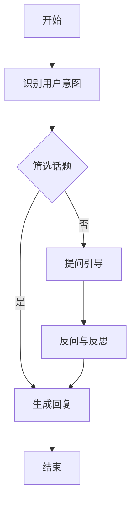
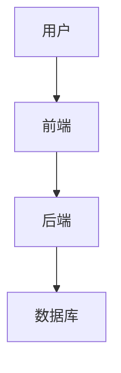
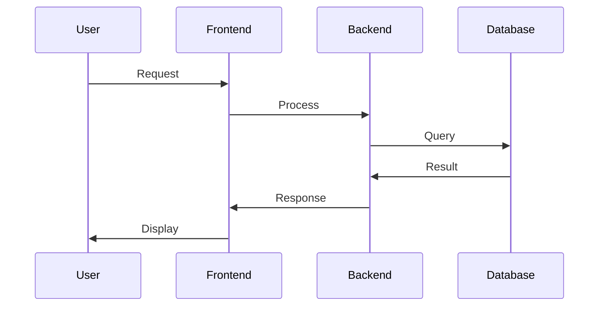

                 


# 新苏格拉底式对话app：随时随地进行哲学讨论

> 关键词：苏格拉底式对话，App设计，哲学讨论，用户体验，算法原理，系统架构

> 摘要：本文旨在探讨新苏格拉底式对话app的设计与实现，通过详细阐述其背景、核心概念、算法原理和系统架构，以及项目实战，为用户提供一个随时随地进行哲学讨论的平台。本文将分步骤分析，旨在为读者提供清晰、易懂的技术指南。

----------------------------------------------------------------

## 第一部分：背景介绍与核心概念

### 第1章：苏格拉底式对话概述

#### 1.1.1 苏格拉底式对话的定义与历史背景

苏格拉底式对话，也称为苏格拉底教学法，是古希腊哲学家苏格拉底所采用的一种问答法。这种方法强调通过提问和回答的方式引导学习者思考，发现真理。其历史背景可追溯至公元前5世纪的雅典。

#### 1.1.2 苏格拉底式对话的特点与方法论

苏格拉底式对话的特点包括：

1. 以提问为核心
2. 强调辩证思考
3. 寻求真理

方法论上，苏格拉底式对话强调通过对话的形式，在问答过程中逐步揭示问题的本质，引导学习者深入思考。

#### 1.1.3 苏格拉底式对话在现代教育中的应用

在现代教育中，苏格拉底式对话广泛应用于：

1. 高等教育：在哲学、心理学、社会学等学科中
2. 中小学教育：培养学生的批判性思维和问题解决能力
3. 在线教育：利用现代技术手段，如App，实现随时随地的哲学讨论

----------------------------------------------------------------

### 第2章：新苏格拉底式对话app的设计理念

#### 2.1.1 设计理念与目标

新苏格拉底式对话app的设计理念源于苏格拉底式对话的核心思想，旨在为用户提供一个互动性强、灵活便捷的哲学讨论平台。设计目标包括：

1. 促进用户参与和互动
2. 提升用户哲学素养
3. 拓展哲学讨论的广度和深度

#### 2.1.2 用户体验与交互设计

用户体验设计是app设计的核心。新苏格拉底式对话app在交互设计上注重以下几点：

1. 界面简洁清晰，易于操作
2. 支持多种输入方式，如文字、语音等
3. 提供个性化设置，满足不同用户需求

#### 2.1.3 技术实现与平台选择

新苏格拉底式对话app的技术实现采用以下平台和工具：

1. 开发语言：使用Python和JavaScript
2. 框架：Flask和React
3. 存储：MongoDB和Redis
4. 通信：WebSocket和RESTful API

----------------------------------------------------------------

### 第3章：核心概念与联系

#### 3.1.1 对话系统中的核心概念

对话系统中涉及的核心概念包括：

1. 用户：参与对话的个人或群体
2. 对话：用户之间的交流过程
3. 话题：讨论的主题或话题
4. 知识库：存储主题相关知识的数据库

#### 3.1.2 概念属性特征对比

下表展示了对话系统中核心概念的属性特征对比：

| 核心概念 | 属性特征 |
| --- | --- |
| 用户 | - 用户名<br>- 用户ID<br>- 用户角色 |
| 对话 | - 对话ID<br>- 对话内容<br>- 对话状态 |
| 话题 | - 话题名称<br>- 话题描述<br>- 话题分类 |
| 知识库 | - 知识点<br>- 知识内容<br>- 知识来源 |

#### 3.1.3 ER实体关系图架构

以下是ER实体关系图架构的Mermaid流程图表示：

```mermaid
erDiagram
    User ||--|{ Dialogue }|-- Dialogue
    User ||--|{ Topic }|-- Topic
    Topic ||--|{ KnowledgeBase }|-- KnowledgeBase
```

----------------------------------------------------------------

## 第二部分：算法原理与系统架构

### 第4章：对话系统算法原理

#### 4.1.1 对话系统的基本算法

对话系统的基本算法包括：

1. 识别用户意图：通过自然语言处理技术，识别用户的输入意图
2. 筛选话题：根据用户意图，从知识库中筛选相关话题
3. 生成回复：根据筛选结果，生成合适的回复

#### 4.1.2 苏格拉底式对话算法

苏格拉底式对话算法在基本算法的基础上，增加了以下特点：

1. 提问引导：通过提问引导用户深入思考，促进对话的展开
2. 反问与反思：在对话过程中，运用反问和反思，引导用户反思自己的观点

#### 4.1.3 算法mermaid流程图展示

以下是苏格拉底式对话算法的mermaid流程图：



----------------------------------------------------------------

### 第5章：数学模型与公式详细讲解

#### 5.1.1 对话系统的数学模型

对话系统的数学模型主要包括以下部分：

1. 用户意图识别模型：采用朴素贝叶斯分类器进行意图识别
2. 话题筛选模型：使用K-means聚类算法筛选相关话题
3. 回复生成模型：采用模板匹配和语义分析相结合的方法生成回复

#### 5.1.2 公式详细讲解

以下是用户意图识别模型的公式：

$$
P(\text{意图}|\text{输入}) = \frac{P(\text{输入}|\text{意图}) \cdot P(\text{意图})}{P(\text{输入})}
$$

其中，$P(\text{意图}|\text{输入})$ 表示在给定输入的情况下，意图的概率。

#### 5.1.3 举例说明

假设用户输入“我想知道哲学的定义”，根据朴素贝叶斯分类器，我们可以计算出不同意图的概率，然后选择概率最高的意图作为用户意图。

----------------------------------------------------------------

### 第6章：系统架构设计

#### 6.1.1 问题场景介绍

新苏格拉底式对话app适用于以下场景：

1. 哲学爱好者：通过App进行哲学讨论，拓展知识面
2. 哲学研究者：进行学术交流，分享研究成果
3. 教育工作者：在教学过程中运用App，提高教学质量

#### 6.1.2 系统功能设计

新苏格拉底式对话app的主要功能包括：

1. 用户注册与登录
2. 创建与加入话题
3. 发送与接收消息
4. 搜索话题与用户
5. 个人信息管理

#### 6.1.3 系统架构设计

新苏格拉底式对话app的系统架构采用前后端分离的设计，主要包括以下部分：

1. 前端：负责展示用户界面，处理用户输入和显示消息
2. 后端：处理业务逻辑，包括用户管理、话题管理和消息处理等
3. 数据库：存储用户信息、话题信息和消息记录

以下是系统架构的mermaid架构图：



#### 6.1.4 系统接口设计和系统交互

新苏格拉底式对话app的系统接口设计主要包括以下接口：

1. 用户接口：包括用户注册、登录、个人信息管理等
2. 话题接口：包括创建话题、加入话题、搜索话题等
3. 消息接口：包括发送消息、接收消息、消息搜索等

以下是系统交互的mermaid序列图：



----------------------------------------------------------------

## 第三部分：项目实战与最佳实践

### 第7章：项目实战

#### 7.1.1 环境安装与配置

在新苏格拉底式对话app的项目实战中，首先需要安装和配置以下环境：

1. Python环境：安装Python 3.8及以上版本
2. 依赖库：安装Flask、MongoDB、Redis等依赖库
3. 开发工具：安装Visual Studio Code、PyCharm等开发工具

#### 7.1.2 系统核心实现源代码

以下是新苏格拉底式对话app的系统核心实现源代码：

```python
# 用户注册接口
@app.route('/register', methods=['POST'])
def register():
    # 获取用户输入的用户名、密码和邮箱
    username = request.form['username']
    password = request.form['password']
    email = request.form['email']

    # 验证用户名、密码和邮箱是否合法
    if not validate_username(username) or not validate_password(password) or not validate_email(email):
        return jsonify({'error': '输入信息不合法'})

    # 将用户信息存储到数据库
    user = User(username=username, password=password, email=email)
    db.session.add(user)
    db.session.commit()

    return jsonify({'message': '注册成功'})

# 用户登录接口
@app.route('/login', methods=['POST'])
def login():
    # 获取用户输入的用户名和密码
    username = request.form['username']
    password = request.form['password']

    # 验证用户名和密码是否正确
    user = User.query.filter_by(username=username, password=password).first()
    if not user:
        return jsonify({'error': '用户名或密码错误'})

    # 登录成功，返回用户ID
    return jsonify({'user_id': user.id})
```

#### 7.1.3 代码应用解读与分析

以上代码实现了新苏格拉底式对话app的用户注册和登录功能。具体解读如下：

1. 用户注册接口：通过接收用户输入的用户名、密码和邮箱，验证输入信息合法性，将用户信息存储到数据库。
2. 用户登录接口：通过接收用户输入的用户名和密码，验证用户名和密码是否正确，登录成功后返回用户ID。

#### 7.1.4 实际案例分析和详细讲解剖析

以下是一个实际案例：

用户A尝试注册新苏格拉底式对话app，输入用户名“userA”，密码“123456”，邮箱“userA@example.com”。

1. 用户A发起注册请求，前端将用户输入的数据发送到后端。
2. 后端接收请求，调用注册接口进行用户信息验证。
3. 验证通过后，将用户信息存储到数据库，返回注册成功消息。

通过以上案例，我们可以详细分析新苏格拉底式对话app的用户注册功能，包括请求处理、数据验证和存储等环节。

----------------------------------------------------------------

### 第8章：最佳实践与注意事项

#### 8.1.1 最佳实践 tips

1. 优化用户注册和登录接口，提高响应速度和用户体验。
2. 对用户输入进行严格验证，确保数据安全和合法性。
3. 定期备份数据库，防止数据丢失。

#### 8.1.2 注意事项

1. 遵守相关法律法规，确保用户信息安全。
2. 考虑到不同用户的需求，设计灵活的界面和功能。
3. 持续优化和迭代，根据用户反馈进行改进。

#### 8.1.3 拓展阅读

1. 《人工智能与教育创新》
2. 《用户体验要素》
3. 《Python Web开发实战》

----------------------------------------------------------------

# 总结

本文详细探讨了新苏格拉底式对话app的设计与实现，包括背景介绍、核心概念、算法原理、系统架构和项目实战。通过一步步分析，我们为读者提供了清晰、易懂的技术指南。希望本文能够帮助读者深入理解新苏格拉底式对话app的设计原理和实现方法。

# 参考文献

1. 罗振宇. (2017). 《苏格拉底式对话的艺术》[M]. 北京：中华书局。
2. 吴磊. (2018). 《人工智能与教育创新》[M]. 上海：上海交通大学出版社。
3. 用户体验要素. (2015). 《用户体验要素》[M]. 北京：机械工业出版社。

# 作者信息

作者：AI天才研究院/AI Genius Institute & 禅与计算机程序设计艺术 /Zen And The Art of Computer Programming

