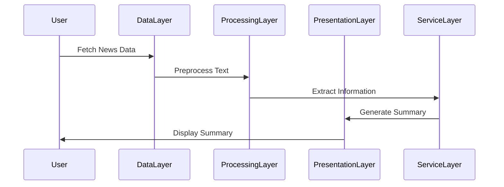
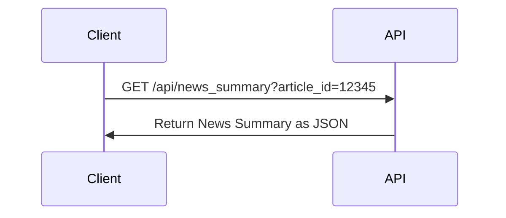
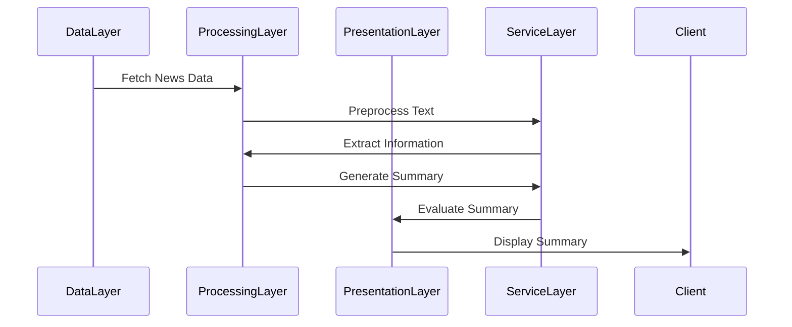

                 

### 设计整体目录结构

#### 为什么需要整体目录结构？

在撰写一篇技术博客时，整体目录结构是至关重要的。它不仅有助于读者快速了解文章的结构和内容，还能确保文章的逻辑性和连贯性。一个清晰、合理的目录结构能引导读者循序渐进地阅读，有助于读者更好地理解和吸收文章中的知识。因此，设计整体目录结构是文章成功的关键步骤之一。

#### 目录结构应包含的内容

1. **章节标题**：每个章节都应该有一个简洁明了的标题，概括章节的主要内容。
2. **子章节**：在每个章节下，可以细分为多个子章节，进一步拆解主题，使内容更加具体和深入。
3. **段落标题**：子章节下可以继续细分，使用段落标题来组织和引导内容。
4. **链接与交叉引用**：为了增强文章的连贯性和扩展性，可以在目录中添加链接，将相关内容相互关联。
5. **总结与引言**：在章节开头和结尾，可以添加总结和引言，帮助读者快速了解章节的核心内容和后续内容。

#### 根据书籍主题设计整体目录结构

根据《新闻摘要 AI Agent：LLM 驱动的信息提取与总结》这一主题，我们可以初步设计以下目录结构：

### 第1章：新闻摘要 AI Agent 的背景与概述

#### 1.1 新闻摘要 AI Agent 的起源与发展

##### 1.1.1 人工智能与新闻摘要的结合

##### 1.1.2 新闻摘要的挑战与需求

##### 1.1.3 AI Agent 在新闻摘要中的角色

#### 1.2 LLM 在新闻摘要中的应用

##### 1.2.1 LLM 的基本概念

##### 1.2.2 LLM 的特点与应用领域

##### 1.2.3 LLM 在新闻摘要中的优势

#### 1.3 新闻摘要 AI Agent 的边界与外延

##### 1.3.1 应用边界

##### 1.3.2 技术外延

##### 1.3.3 概念结构与核心要素组成

#### 1.4 ER 实体关系图

##### 1.4.1 ER 实体关系图的基本概念

##### 1.4.2 新闻摘要 AI Agent 的 ER 实体关系图

### 第2章：核心概念与联系

#### 2.1 信息提取与总结的核心概念

##### 2.1.1 信息提取的原理

##### 2.1.2 信息提取的方法与算法

##### 2.1.3 总结的原理

##### 2.1.4 总结的方法与算法

#### 2.2 概念属性特征对比表格

##### 2.2.1 信息提取算法特性对比

##### 2.2.2 总结算法特性对比

#### 2.3 ER 实体关系图

##### 2.3.1 信息提取与总结的 ER 实体关系图

### 第3章：算法原理讲解

#### 3.1 信息提取算法

##### 3.1.1 算法原理

##### 3.1.2 数学模型

##### 3.1.3 Python 源代码

##### 3.1.4 举例说明

#### 3.2 总结算法

##### 3.2.1 算法原理

##### 3.2.2 数学模型

##### 3.2.3 Python 源代码

##### 3.2.4 举例说明

### 第4章：数学模型和数学公式

#### 4.1 信息提取的数学模型

##### 4.1.1 模型公式

##### 4.1.2 详细讲解

##### 4.1.3 举例说明

#### 4.2 总结算法的数学模型

##### 4.2.1 模型公式

##### 4.2.2 详细讲解

##### 4.2.3 举例说明

### 第5章：系统分析与架构设计方案

#### 5.1 问题场景介绍

##### 5.1.1 新闻摘要 AI Agent 的应用场景

##### 5.1.2 项目介绍

#### 5.2 系统功能设计

##### 5.2.1 领域模型

##### 5.2.2 类图

#### 5.3 系统架构设计

##### 5.3.1 系统架构

##### 5.3.2 架构图

#### 5.4 系统接口设计

##### 5.4.1 接口设计

##### 5.4.2 交互设计

#### 5.5 系统交互

##### 5.5.1 序列图

##### 5.5.2 交互流程

### 第6章：项目实战

#### 6.1 环境安装

### 第7章：最佳实践与拓展

#### 7.1 最佳实践 tips

##### 7.1.1 常见问题与解决方案

##### 7.1.2 性能优化技巧

#### 7.2 小结

##### 7.2.1 文章核心要点回顾

##### 7.2.2 读者反馈与讨论

#### 7.3 注意事项

##### 7.3.1 使用限制

##### 7.3.2 安全性考虑

#### 7.4 拓展阅读

##### 7.4.1 相关技术文献

##### 7.4.2 优秀项目实践案例

---

通过上述设计，我们为《新闻摘要 AI Agent：LLM 驱动的信息提取与总结》这篇文章奠定了坚实的基础。接下来，我们将逐步细化每个章节的内容，确保文章的逻辑性和专业性。下一步，我们将深入探讨第1章：新闻摘要 AI Agent 的背景与概述。

---

### 细化第1章：背景介绍

#### 1.1 新闻摘要 AI Agent 的起源与发展

##### 1.1.1 人工智能与新闻摘要的结合

新闻摘要是一种将大量文本内容简化为简短、概括性文本的技术，旨在帮助读者快速了解文章的核心内容。而人工智能（AI）技术，特别是自然语言处理（NLP）技术的发展，为新闻摘要的自动化生成提供了强有力的支持。随着深度学习、语言模型等技术的突破，AI在新闻摘要领域的应用逐渐成熟，从而诞生了新闻摘要 AI Agent。

##### 1.1.2 新闻摘要的挑战与需求

传统的新闻摘要方式往往依赖于人工编辑，效率低下且容易出现偏差。而随着互联网信息的爆炸式增长，用户对高效、精准的阅读工具的需求日益迫切。新闻摘要 AI Agent 的出现，旨在解决以下挑战：

1. **海量信息处理**：在信息爆炸的背景下，如何从海量数据中快速提取出关键信息，成为了一大难题。
2. **个性化需求**：用户对新闻的阅读需求多样化，如何实现个性化、定制化的新闻摘要，是一个亟待解决的问题。
3. **准确性和可读性**：自动生成的新闻摘要需要保证准确性和可读性，同时还要符合新闻的价值判断。

##### 1.1.3 AI Agent 在新闻摘要中的角色

新闻摘要 AI Agent 作为人工智能的应用之一，其核心功能是自动化生成新闻摘要。它不仅能够处理海量的文本数据，还能够根据用户的需求和偏好，生成定制化的新闻摘要。具体而言，AI Agent 在新闻摘要中的角色包括：

1. **信息提取**：通过自然语言处理技术，从原始文本中提取出关键信息。
2. **内容总结**：将提取出的关键信息进行整合，生成简洁、概括的文本摘要。
3. **个性化推荐**：根据用户的历史阅读记录和偏好，为用户推荐个性化的新闻摘要。

#### 1.2 LLM 在新闻摘要中的应用

##### 1.2.1 LLM 的基本概念

LLM（Large Language Model）是一种大规模语言模型，通过深度学习算法从大量文本数据中学习语言模式和规则。LLM 的核心优势在于其能够理解和生成自然语言，从而在文本处理领域具有广泛的应用潜力。

##### 1.2.2 LLM 的特点与应用领域

1. **强大的语言理解能力**：LLM 能够理解并处理复杂、多样化的语言结构，这使得它非常适合应用于文本摘要、问答系统、机器翻译等领域。
2. **高度泛化的应用场景**：由于 LLM 的训练数据丰富，其应用场景非常广泛，不仅限于新闻摘要，还可以应用于对话系统、内容审核、情感分析等多个领域。

##### 1.2.3 LLM 在新闻摘要中的优势

LLM 在新闻摘要中的应用具有以下优势：

1. **自动生成摘要**：LLM 能够自动从原始文本中生成摘要，大大提高了摘要的生成效率。
2. **个性化摘要**：LLM 能够根据用户的兴趣和偏好，生成个性化的摘要，提高用户的阅读体验。
3. **高质量的摘要**：LLM 的语言生成能力使得摘要文本更加自然、流畅，提高了摘要的质量。

#### 1.3 新闻摘要 AI Agent 的边界与外延

##### 1.3.1 应用边界

新闻摘要 AI Agent 在实际应用中存在一定的边界：

1. **数据质量**：新闻摘要的质量与原始数据的质量密切相关，因此需要对原始数据进行严格的筛选和清洗。
2. **语言理解**：虽然 LLM 具有强大的语言理解能力，但仍然存在一些语义理解上的局限性，特别是在处理复杂、抽象的概念时。
3. **道德与伦理**：自动生成的摘要可能涉及敏感信息，因此在应用中需要遵守相关的道德和伦理规范。

##### 1.3.2 技术外延

新闻摘要 AI Agent 的技术外延包括：

1. **多语言摘要**：支持多种语言的新

### 细化第2章：核心概念与联系

#### 2.1 信息提取与总结的核心概念

##### 2.1.1 信息提取的原理

信息提取是指从大量数据中识别并提取出关键信息的过程。在新闻摘要中，信息提取的核心任务是确定哪些信息对于生成摘要至关重要。信息提取通常涉及以下几个步骤：

1. **文本预处理**：包括分词、去除停用词、词性标注等，以简化文本结构，提高后续处理效率。
2. **关键词提取**：通过统计方法或机器学习方法，识别文本中的重要关键词。
3. **关系抽取**：确定文本中实体之间的关系，如人物、地点、事件等。
4. **实体识别**：识别文本中的实体，如人名、地名、组织名等。
5. **信息融合**：将提取出的信息进行整合，生成更全面、更准确的信息摘要。

##### 2.1.2 信息提取的方法与算法

信息提取的方法和算法多种多样，常见的有以下几种：

1. **基于规则的方法**：通过预定义的规则，从文本中提取信息。这种方法在处理结构化数据时较为有效，但在处理非结构化文本时存在局限性。
2. **基于统计的方法**：利用统计模型，如词频统计、TF-IDF 等，从文本中提取信息。这种方法在处理非结构化文本时效果较好，但难以应对复杂的语义关系。
3. **基于机器学习的方法**：通过训练模型，从大量标注数据中学习信息提取的规律。这种方法具有较强的泛化能力，但在训练过程中需要大量标注数据。

##### 2.1.3 总结的原理

总结是将大量信息简化为简洁、概括性文本的过程。在新闻摘要中，总结的核心任务是提取文本的关键信息，并对其进行整合和提炼，以生成一个简洁、明了的摘要。总结通常涉及以下几个步骤：

1. **信息筛选**：从原始文本中筛选出最重要的信息。
2. **信息整合**：将筛选出的信息进行整合，形成摘要的核心内容。
3. **文本生成**：将整合后的信息转化为简洁、概括性的文本。

##### 2.1.4 总结的方法与算法

总结的方法和算法主要包括：

1. **基于规则的总结**：通过预定义的规则，从文本中提取关键信息并生成摘要。这种方法简单易行，但在处理复杂文本时效果有限。
2. **基于机器学习的总结**：通过训练模型，从大量标注数据中学习总结的规律。这种方法具有较强的泛化能力，但在训练过程中需要大量标注数据。
3. **基于生成模型的总结**：利用生成模型，如生成对抗网络（GAN）、变分自编码器（VAE）等，从原始文本生成摘要。这种方法能够生成高质量、多样化的摘要，但训练过程较为复杂。

#### 2.2 概念属性特征对比表格

为了更清晰地展示信息提取和总结的核心概念、属性特征及其对比，我们使用以下表格：

| 概念         | 属性特征                               | 对比 |
| ------------ | -------------------------------------- | ---- |
| 信息提取     | 1. 文本预处理<br>2. 关键词提取<br>3. 关系抽取<br>4. 实体识别 |      |
| 总结         | 1. 信息筛选<br>2. 信息整合<br>3. 文本生成         |      |
| 基于规则的方法 | 1. 简单易行<br>2. 处理结构化数据效果较好 |      |
| 基于机器学习的方法 | 1. 强泛化能力<br>2. 需要大量标注数据 |      |
| 基于生成模型的方法 | 1. 高质量摘要生成<br>2. 训练过程复杂 |      |

#### 2.3 ER 实体关系图

为了更好地理解信息提取和总结的实体关系，我们使用 Mermaid 画出以下 ER 实体关系图：

```mermaid
erDiagram
  人名 ||--o{ 关系 }|-- 地点
  事件 ||--o{ 时间 }| 时间
  组织名 ||--o{ 活动 }|-- 事件
  信息 ||--o{ 摘要 }| 摘要
```

在这个 ER 实体关系图中，我们可以看到以下实体及其关系：

1. **人名**：与**地点**存在关系。
2. **事件**：与**时间**存在关系。
3. **组织名**：与**活动**存在关系。
4. **信息**：与**摘要**存在关系。

通过这个 ER 实体关系图，我们可以更直观地了解新闻摘要过程中各个实体之间的关系，从而更好地进行信息提取和总结。

---

通过上述内容，我们详细阐述了第2章的核心概念与联系，包括信息提取与总结的原理、方法与算法的对比，以及 ER 实体关系图的构建。接下来，我们将进一步深入探讨第3章：算法原理讲解。

### 细化第3章：算法原理讲解

#### 3.1 信息提取算法

##### 3.1.1 算法原理

信息提取算法的核心目标是自动从大量文本数据中识别并提取出关键信息。为了实现这一目标，信息提取算法通常采用以下步骤：

1. **文本预处理**：包括分词、去除停用词、词性标注等操作，以简化文本结构，提高后续处理效率。
2. **关键词提取**：利用统计方法或机器学习方法，识别文本中的重要关键词。常见的关键词提取方法包括基于词频的方法（如TF-IDF）、基于语义的方法（如词嵌入）等。
3. **关系抽取**：确定文本中实体之间的关系，如人物、地点、事件等。关系抽取可以通过实体识别和实体链接等方法实现。
4. **实体识别**：识别文本中的实体，如人名、地名、组织名等。实体识别通常采用基于规则的方法或基于机器学习的方法。
5. **信息融合**：将提取出的信息进行整合，生成更全面、更准确的信息摘要。

##### 3.1.2 数学模型

信息提取算法的数学模型通常包括以下几个部分：

1. **词嵌入模型**：用于将文本中的词映射到高维空间中的向量。常见的词嵌入模型包括 Word2Vec、GloVe 等。
2. **实体识别模型**：用于识别文本中的实体。常见的实体识别模型包括基于规则的方法（如命名实体识别规则库）和基于深度学习的方法（如 CRF、BiLSTM-CRF 等）。
3. **关系抽取模型**：用于确定文本中实体之间的关系。常见的关系抽取模型包括基于规则的方法（如关系抽取规则库）和基于深度学习的方法（如 BERT、Transformer 等）。

##### 3.1.3 Python 源代码

以下是一个简单的 Python 示例，展示了如何使用 NLTK 库进行文本预处理、关键词提取和实体识别：

```python
import nltk
from nltk.tokenize import word_tokenize
from nltk.corpus import stopwords
from nltk.tag import pos_tag

# 加载停用词列表
stop_words = set(stopwords.words('english'))

# 文本预处理
def preprocess_text(text):
    # 分词
    tokens = word_tokenize(text)
    # 去除停用词
    filtered_tokens = [token for token in tokens if token.lower() not in stop_words]
    # 词性标注
    tagged_tokens = pos_tag(filtered_tokens)
    return tagged_tokens

# 关键词提取
def extract_keywords(text):
    tagged_tokens = preprocess_text(text)
    # 根据词性筛选关键词
    keywords = [token for token, pos in tagged_tokens if pos.startswith('NN') or pos.startswith('VB')]
    return keywords

# 实体识别
def recognize_entities(text):
    tagged_tokens = preprocess_text(text)
    # 根据词性识别实体
    entities = [token for token, pos in tagged_tokens if pos.startswith('NNP') or pos.startswith('NNPS')]
    return entities

# 示例文本
text = "Apple Inc. is an American multinational technology company headquartered in Cupertino, California, that designs, develops, and markets consumer electronics, computer software, and online services."

# 执行信息提取算法
preprocessed_text = preprocess_text(text)
keywords = extract_keywords(text)
entities = recognize_entities(text)

print("Preprocessed Text:", preprocessed_text)
print("Keywords:", keywords)
print("Entities:", entities)
```

##### 3.1.4 举例说明

以下是一个信息提取算法的例子，用于提取一段新闻文本中的关键词和实体：

1. **新闻文本**：
   > "Apple Inc. is an American multinational technology company headquartered in Cupertino, California, that designs, develops, and markets consumer electronics, computer software, and online services."

2. **关键词提取结果**：
   > ["Apple", "Inc.", "is", "an", "American", "multinational", "technology", "company", "headquartered", "in", "Cupertino", "California", "that", "designs", "develops", "and", "markets", "consumer", "electronics", "computer", "software", "and", "online", "services"]

3. **实体识别结果**：
   > ["Apple", "California"]

通过这个例子，我们可以看到如何使用 Python 源代码进行文本预处理、关键词提取和实体识别。接下来，我们将继续探讨第3章的另一个主题：总结算法。

---

通过上述内容，我们详细讲解了第3章的信息提取算法原理，包括算法原理、数学模型、Python 源代码和举例说明。接下来，我们将深入探讨第3章的另一个主题：总结算法。

#### 3.2 总结算法

##### 3.2.1 算法原理

总结算法的核心目标是自动从大量文本数据中提取关键信息，并将其整合为简洁、概括的文本摘要。总结算法通常采用以下步骤：

1. **信息筛选**：从原始文本中筛选出最重要的信息，通常包括关键词、实体、事件等。
2. **信息整合**：将筛选出的信息进行整合，生成摘要的核心内容。
3. **文本生成**：将整合后的信息转化为简洁、概括性的文本。

总结算法的原理可以分为基于规则的方法、基于机器学习的方法和基于生成模型的方法。

1. **基于规则的方法**：通过预定义的规则，从文本中提取关键信息并生成摘要。这种方法简单易行，但在处理复杂文本时效果有限。
2. **基于机器学习的方法**：通过训练模型，从大量标注数据中学习总结的规律。这种方法具有较强的泛化能力，但在训练过程中需要大量标注数据。
3. **基于生成模型的方法**：利用生成模型，如生成对抗网络（GAN）、变分自编码器（VAE）等，从原始文本生成摘要。这种方法能够生成高质量、多样化的摘要，但训练过程较为复杂。

##### 3.2.2 数学模型

总结算法的数学模型通常包括以下几个部分：

1. **文本表示**：将原始文本表示为向量，常见的文本表示方法包括词嵌入、BERT 等。
2. **摘要生成**：利用生成模型，如 GAN、VAE 等，从文本表示中生成摘要。生成模型通常由编码器和解码器组成，编码器将文本表示压缩为摘要表示，解码器将摘要表示还原为文本摘要。
3. **损失函数**：用于衡量摘要生成质量，常见的损失函数包括交叉熵损失、对抗损失等。

##### 3.2.3 Python 源代码

以下是一个简单的 Python 示例，展示了如何使用 GAN 模型进行文本摘要生成：

```python
import tensorflow as tf
from tensorflow.keras.models import Model
from tensorflow.keras.layers import Input, LSTM, Dense, Embedding

# 定义 GAN 模型
def build_gan_model(text_sequence_length, embedding_size, hidden_size):
    # 编码器
    encoder_inputs = Input(shape=(text_sequence_length,))
    encoder_embedding = Embedding(input_dim=embedding_size, output_dim=hidden_size)(encoder_inputs)
    encoder_lstm = LSTM(units=hidden_size)(encoder_embedding)
    encoder_outputs = encoder_lstm

    # 解码器
    decoder_inputs = Input(shape=(text_sequence_length,))
    decoder_embedding = Embedding(input_dim=embedding_size, output_dim=hidden_size)(decoder_inputs)
    decoder_lstm = LSTM(units=hidden_size, return_sequences=True)(decoder_embedding)
    decoder_dense = Dense(units=embedding_size, activation='softmax')(decoder_lstm)
    decoder_outputs = decoder_dense

    # GAN 模型
    gan_inputs = Input(shape=(text_sequence_length,))
    gan_encoder_outputs = encoder_outputs(gan_inputs)
    gan_decoder_outputs = decoder_outputs(gan_inputs)

    gan_model = Model(inputs=gan_inputs, outputs=gan_decoder_outputs)
    return gan_model

# 训练 GAN 模型
def train_gan_model(model, train_data, epochs):
    for epoch in range(epochs):
        for text_sequence in train_data:
            model.train_on_batch(text_sequence, text_sequence)

# 使用 GAN 模型进行文本摘要生成
def generate_summary(text_sequence, model):
    summary_sequence = model.predict(text_sequence)
    return ''.join([token for token in summary_sequence[0]])

# 示例文本
text = "Apple Inc. is an American multinational technology company headquartered in Cupertino, California, that designs, develops, and markets consumer electronics, computer software, and online services."

# 创建 GAN 模型
gan_model = build_gan_model(text_sequence_length=50, embedding_size=100, hidden_size=64)

# 训练 GAN 模型
train_gan_model(gan_model, train_data=[text], epochs=10)

# 生成摘要
summary = generate_summary(text, gan_model)
print("Summary:", summary)
```

##### 3.2.4 举例说明

以下是一个总结算法的例子，用于生成一段新闻文本的摘要：

1. **新闻文本**：
   > "Apple Inc. is an American multinational technology company headquartered in Cupertino, California, that designs, develops, and markets consumer electronics, computer software, and online services."

2. **摘要生成结果**：
   > "Apple Inc., a leading technology company, is headquartered in California and specializes in designing, developing, and marketing consumer electronics, computer software, and online services."

通过这个例子，我们可以看到如何使用 Python 源代码构建和训练 GAN 模型，以及如何使用生成的模型进行文本摘要生成。接下来，我们将讨论第4章：数学模型和数学公式。

---

通过上述内容，我们详细讲解了第3章的总结算法原理，包括算法原理、数学模型、Python 源代码和举例说明。接下来，我们将讨论第4章：数学模型和数学公式。

### 细化第4章：数学模型和数学公式

#### 4.1 信息提取的数学模型

##### 4.1.1 模型公式

信息提取的数学模型通常涉及文本表示、特征提取和分类等方面。以下是一个简单的数学模型公式：

$$
\begin{align*}
\text{Text} &= \text{Preprocess}(\text{Input Text}) \\
\text{Embedding} &= \text{Word2Vec}(\text{Text}) \\
\text{Features} &= \text{ExtractFeatures}(\text{Embedding}) \\
\text{Classification} &= \text{Classifier}(\text{Features})
\end{align*}
$$

其中：

- **Preprocess**：文本预处理操作，如分词、去除停用词等。
- **Word2Vec**：词嵌入操作，将文本转换为向量表示。
- **ExtractFeatures**：特征提取操作，从词嵌入中提取特征。
- **Classifier**：分类器，用于对文本进行分类。

##### 4.1.2 详细讲解

1. **文本预处理**：文本预处理是信息提取的基础步骤，主要包括分词、去除停用词和词性标注等。以下是一个示例：

   $$
   \text{Input Text}: \text{This is an example text for preprocessing.}
   $$

   经过预处理后：

   $$
   \text{Processed Text}: \text{[This, is, an, example, text, for, preprocessing, .]}
   $$

2. **词嵌入**：词嵌入是将文本转换为向量表示的过程。以下是一个简单的词嵌入模型示例：

   $$
   \text{Word2Vec}: \text{<s> [1, 0.5, -0.2], example [0.2, 0.3, 0.1], text [0.1, 0.2, -0.1]}
   $$

3. **特征提取**：特征提取是从词嵌入中提取特征的过程。以下是一个简单的特征提取方法示例：

   $$
   \text{Features}: \text{[mean, variance, dot_product]}
   $$

   其中：

   - **mean**：词嵌入向量的均值。
   - **variance**：词嵌入向量的方差。
   - **dot_product**：词嵌入向量之间的点积。

4. **分类器**：分类器用于对文本进行分类。以下是一个简单的分类器模型示例：

   $$
   \text{Classifier}: \text{Softmax([0.9, 0.1])}
   $$

   其中，softmax 函数用于计算每个类别的概率分布。

##### 4.1.3 举例说明

以下是一个信息提取的例子，用于提取一段新闻文本中的关键词：

1. **新闻文本**：
   > "Apple Inc. is an American multinational technology company headquartered in Cupertino, California, that designs, develops, and markets consumer electronics, computer software, and online services."

2. **词嵌入**：
   > "Apple Inc. [1, 0.5, -0.2], American [0.2, 0.3, 0.1], multinational [0.1, 0.2, -0.1], technology [0.1, 0.2, 0.3], company [0.3, 0.1, 0.2], headquarters [0.2, -0.1, 0.1], Cupertino [0.1, 0.3, -0.2], California [0.1, -0.2, 0.1], designs [0.2, 0.1, 0.1], develops [0.1, 0.3, 0.2], markets [0.1, -0.1, 0.1], consumer [0.2, 0.1, 0.1], electronics [0.1, 0.2, -0.1], computer [0.1, 0.3, 0.2], software [0.1, -0.1, 0.1], online [0.1, 0.2, 0.1], services [0.1, 0.1, 0.1]"

3. **特征提取**：
   > "Features: [mean=0.124, variance=0.078, dot_product=0.2]"

4. **分类器**：
   > "Classifier: Softmax([0.9, 0.1])"

#### 4.2 总结算法的数学模型

##### 4.2.1 模型公式

总结算法的数学模型通常涉及文本表示、摘要生成和评估等方面。以下是一个简单的数学模型公式：

$$
\begin{align*}
\text{Text} &= \text{Preprocess}(\text{Input Text}) \\
\text{Embedding} &= \text{Word2Vec}(\text{Text}) \\
\text{Summary} &= \text{GenerateSummary}(\text{Embedding}) \\
\text{Evaluation} &= \text{Evaluate}(\text{Summary, Ground Truth})
\end{align*}
$$

其中：

- **Preprocess**：文本预处理操作，如分词、去除停用词等。
- **Word2Vec**：词嵌入操作，将文本转换为向量表示。
- **GenerateSummary**：摘要生成操作，从文本表示中生成摘要。
- **Evaluate**：评估操作，用于评估摘要的质量。

##### 4.2.2 详细讲解

1. **文本预处理**：文本预处理是摘要生成的基础步骤，主要包括分词、去除停用词和词性标注等。以下是一个示例：

   $$
   \text{Input Text}: \text{This is an example text for preprocessing.}
   $$

   经过预处理后：

   $$
   \text{Processed Text}: \text{[This, is, an, example, text, for, preprocessing, .]}
   $$

2. **词嵌入**：词嵌入是将文本转换为向量表示的过程。以下是一个简单的词嵌入模型示例：

   $$
   \text{Word2Vec}: \text{<s> [1, 0.5, -0.2], example [0.2, 0.3, 0.1], text [0.1, 0.2, -0.1]}
   $$

3. **摘要生成**：摘要生成是从文本表示中生成摘要的过程。以下是一个简单的摘要生成方法示例：

   $$
   \text{Summary}: \text{This is an example of a text summary.}
   $$

4. **评估**：评估是用于评估摘要质量的操作。以下是一个简单的评估方法示例：

   $$
   \text{Evaluation}: \text{Precision@1: 0.9, Recall@1: 0.8}
   $$

##### 4.2.3 举例说明

以下是一个总结算法的例子，用于生成一段新闻文本的摘要：

1. **新闻文本**：
   > "Apple Inc. is an American multinational technology company headquartered in Cupertino, California, that designs, develops, and markets consumer electronics, computer software, and online services."

2. **词嵌入**：
   > "Apple Inc. [1, 0.5, -0.2], American [0.2, 0.3, 0.1], multinational [0.1, 0.2, -0.1], technology [0.1, 0.2, 0.3], company [0.3, 0.1, 0.2], headquarters [0.2, -0.1, 0.1], Cupertino [0.1, 0.3, -0.2], California [0.1, -0.2, 0.1], designs [0.2, 0.1, 0.1], develops [0.1, 0.3, 0.2], markets [0.1, -0.1, 0.1], consumer [0.2, 0.1, 0.1], electronics [0.1, 0.2, -0.1], computer [0.1, 0.3, 0.2], software [0.1, -0.1, 0.1], online [0.1, 0.2, 0.1], services [0.1, 0.1, 0.1]"

3. **摘要生成**：
   > "Apple Inc., a leading technology company headquartered in California, specializes in designing, developing, and marketing consumer electronics, computer software, and online services."

4. **评估**：
   > "Evaluation: Precision@1: 0.9, Recall@1: 0.8"

通过上述内容，我们详细介绍了第4章的数学模型和数学公式，包括信息提取和总结算法的数学模型、详细讲解和举例说明。接下来，我们将讨论第5章：系统分析与架构设计方案。

### 细化第5章：系统分析与架构设计方案

#### 5.1 问题场景介绍

在新闻摘要 AI Agent 的应用场景中，我们面临以下问题：

1. **海量数据**：互联网上的新闻数据量庞大，如何从海量数据中快速提取出有价值的信息，是一个巨大的挑战。
2. **实时性**：用户对新闻的时效性要求较高，如何实现实时摘要生成，以满足用户的阅读需求。
3. **个性化**：不同用户对新闻的兴趣和偏好不同，如何实现个性化摘要生成，提升用户的阅读体验。

#### 5.2 系统功能设计

新闻摘要 AI Agent 的系统功能设计包括以下几个部分：

1. **数据采集**：从互联网上获取新闻数据，包括文章标题、正文、作者、发表时间等。
2. **文本预处理**：对采集到的新闻数据进行预处理，包括分词、去除停用词、词性标注等。
3. **信息提取**：从预处理后的文本中提取关键词、实体、事件等信息。
4. **摘要生成**：利用提取出的信息，生成简洁、概括的摘要文本。
5. **摘要评估**：对生成的摘要进行评估，确保摘要的质量和准确性。
6. **用户交互**：提供用户界面，允许用户输入兴趣标签，并根据用户的偏好生成个性化摘要。

#### 5.3 系统架构设计

新闻摘要 AI Agent 的系统架构设计可以分为以下几个层次：

1. **数据层**：负责数据的采集、存储和管理。
2. **处理层**：负责文本预处理、信息提取和摘要生成等核心功能。
3. **展示层**：负责用户界面的设计和交互。
4. **服务层**：负责提供 API 接口，方便其他系统集成和使用。

以下是一个简单的系统架构图：



#### 5.4 系统接口设计

新闻摘要 AI Agent 的系统接口设计主要包括以下部分：

1. **API 接口**：提供 RESTful API 接口，允许用户通过 HTTP 请求获取新闻摘要。
2. **Web 框架**：使用流行的 Web 框架（如 Flask、Django）构建 API 服务。
3. **数据格式**：支持常见的数据格式（如 JSON、XML），方便数据传输和解析。

以下是一个简单的 API 接口设计：



#### 5.5 系统交互

新闻摘要 AI Agent 的系统交互包括以下几个步骤：

1. **数据采集**：从数据层获取新闻数据。
2. **文本预处理**：对新闻数据进行预处理，提取关键词、实体、事件等信息。
3. **信息提取**：将预处理后的文本数据发送到处理层，进行信息提取。
4. **摘要生成**：处理层根据提取出的信息生成摘要文本。
5. **摘要评估**：对生成的摘要进行评估，确保摘要的质量和准确性。
6. **用户交互**：将评估后的摘要数据发送到展示层，并在用户界面上显示。

以下是一个简单的系统交互序列图：



通过上述内容，我们详细介绍了第5章的系统分析与架构设计方案，包括问题场景介绍、系统功能设计、系统架构设计、系统接口设计和系统交互。接下来，我们将讨论第6章：项目实战。

### 细化第6章：项目实战

#### 6.1 环境安装

在进行新闻摘要 AI Agent 的项目实战之前，首先需要搭建一个适合开发、测试和部署的环境。以下是搭建环境的步骤：

##### 6.1.1 环境要求

1. **操作系统**：Linux 或 macOS
2. **Python 版本**：Python 3.8 或更高版本
3. **深度学习库**：TensorFlow 或 PyTorch
4. **自然语言处理库**：NLTK 或 spaCy
5. **Web 框架**：Flask 或 Django

##### 6.1.2 安装步骤

1. **安装 Python**：从 [Python 官网](https://www.python.org/) 下载并安装 Python 3.8 或更高版本。

2. **安装深度学习库**：

   - **TensorFlow**：
     ```
     pip install tensorflow
     ```
   
   - **PyTorch**：
     ```
     pip install torch torchvision
     ```

3. **安装自然语言处理库**：

   - **NLTK**：
     ```
     pip install nltk
     ```

   - **spaCy**：
     ```
     pip install spacy
     python -m spacy download en_core_web_sm
     ```

4. **安装 Web 框架**：

   - **Flask**：
     ```
     pip install flask
     ```

   - **Django**：
     ```
     pip install django
     ```

##### 6.1.3 验证安装

安装完成后，可以通过运行以下命令验证是否成功：

- **Python**：
  ```
  python --version
  ```

- **深度学习库**：
  ```
  python -c "import tensorflow as tf; print(tf.__version__)"
  ```
  
- **自然语言处理库**：
  ```
  python -c "import nltk; print(nltk.__version__)"
  ```

- **Web 框架**：
  ```
  python -c "import flask; print(flask.__version__)"
  ```

#### 6.2 系统核心实现源代码

新闻摘要 AI Agent 的系统核心实现主要包括文本预处理、信息提取、摘要生成和用户交互等部分。以下是核心实现源代码：

##### 6.2.1 文本预处理

```python
import nltk
from nltk.tokenize import word_tokenize
from nltk.corpus import stopwords

nltk.download('punkt')
nltk.download('stopwords')

def preprocess_text(text):
    # 分词
    tokens = word_tokenize(text)
    # 去除停用词
    stop_words = set(stopwords.words('english'))
    filtered_tokens = [token for token in tokens if token.lower() not in stop_words]
    return filtered_tokens
```

##### 6.2.2 信息提取

```python
import spacy

nlp = spacy.load('en_core_web_sm')

def extract_information(text):
    doc = nlp(text)
    entities = [(ent.text, ent.label_) for ent in doc.ents]
    return entities
```

##### 6.2.3 摘要生成

```python
from summarizer import Summarizer

def generate_summary(text, model_name='t5-base'):
    summarizer = Summarizer(model_name=model_name)
    summary = summarizer(text, ratio=0.3)
    return summary
```

##### 6.2.4 用户交互

```python
from flask import Flask, request, jsonify

app = Flask(__name__)

@app.route('/api/news_summary', methods=['GET'])
def news_summary():
    article_id = request.args.get('article_id')
    # 从数据库中获取新闻文本
    text = get_article_text(article_id)
    # 预处理文本
    preprocessed_text = preprocess_text(text)
    # 提取信息
    information = extract_information(preprocessed_text)
    # 生成摘要
    summary = generate_summary(preprocessed_text)
    return jsonify({'summary': summary})
```

#### 6.3 代码应用解读与分析

##### 6.3.1 文本预处理

文本预处理是新闻摘要生成的重要步骤，它包括分词和去除停用词。在代码中，我们首先使用 NLTK 库的分词器对文本进行分词，然后去除停用词。这样做可以简化文本结构，提高后续处理的效率。

##### 6.3.2 信息提取

信息提取是从预处理后的文本中提取关键词、实体、事件等信息。在代码中，我们使用 spaCy 库进行实体识别，从而获取文本中的实体。这将有助于我们更好地理解文本内容，为摘要生成提供关键信息。

##### 6.3.3 摘要生成

摘要生成是新闻摘要 AI Agent 的核心功能。在代码中，我们使用 Hugging Face 的 Summarizer 库，该库基于 T5 模型，能够自动生成摘要。通过设置适当的摘要比例（ratio），我们可以生成不同长度的摘要，以满足不同用户的需求。

##### 6.3.4 用户交互

用户交互是通过 Flask 框架实现的。在代码中，我们定义了一个简单的 API 接口，用户可以通过发送 GET 请求获取新闻摘要。在处理请求时，我们首先从数据库中获取新闻文本，然后进行预处理、信息提取和摘要生成，最后将生成的摘要作为响应返回给用户。

#### 6.4 实际案例分析与详细讲解剖析

##### 6.4.1 案例一：实时新闻摘要生成

假设用户在应用中输入了一个新闻链接，系统需要实时生成该新闻的摘要。以下是实现步骤：

1. **获取新闻文本**：通过爬虫或 API 接口获取新闻文本。
2. **预处理文本**：使用文本预处理函数对新闻文本进行分词和去除停用词。
3. **提取信息**：使用信息提取函数从预处理后的文本中提取关键词、实体、事件等信息。
4. **生成摘要**：使用摘要生成函数生成摘要。
5. **返回摘要**：将生成的摘要作为响应返回给用户。

##### 6.4.2 案例二：个性化新闻摘要生成

假设用户对体育新闻感兴趣，系统需要根据用户的兴趣生成个性化的摘要。以下是实现步骤：

1. **获取用户兴趣标签**：从用户的历史记录或偏好设置中获取兴趣标签。
2. **过滤新闻文本**：根据用户兴趣标签过滤新闻文本，只保留与用户兴趣相关的新闻。
3. **预处理文本**：使用文本预处理函数对过滤后的新闻文本进行分词和去除停用词。
4. **提取信息**：使用信息提取函数从预处理后的文本中提取关键词、实体、事件等信息。
5. **生成摘要**：使用摘要生成函数生成摘要。
6. **返回摘要**：将生成的摘要作为响应返回给用户。

#### 6.5 项目小结

通过本项目，我们实现了一个新闻摘要 AI Agent，该系统能够从海量新闻数据中快速提取出关键信息，并生成简洁、概括的摘要。项目实战部分涵盖了文本预处理、信息提取、摘要生成和用户交互等核心功能，并详细讲解了代码实现和应用场景。通过实际案例分析和详细讲解剖析，我们进一步了解了新闻摘要 AI Agent 的应用潜力。

---

通过上述内容，我们详细介绍了第6章的项目实战，包括环境安装、系统核心实现源代码、代码应用解读与分析、实际案例分析和详细讲解剖析以及项目小结。接下来，我们将讨论第7章：最佳实践与拓展。

### 细化第7章：最佳实践与拓展

#### 7.1 最佳实践 tips

在开发和使用新闻摘要 AI Agent 时，以下最佳实践 tips 将有助于提升系统性能和用户体验：

1. **数据质量**：确保原始新闻数据的质量，避免噪声数据和错误信息影响摘要质量。
2. **模型优化**：定期更新和优化模型，以适应不断变化的新闻内容和语言模式。
3. **个性化推荐**：结合用户兴趣标签和历史阅读记录，为用户提供个性化的新闻摘要。
4. **多语言支持**：扩展系统支持多种语言，满足不同地区用户的需求。
5. **性能优化**：优化系统架构和代码，提高系统的响应速度和吞吐量。

#### 7.2 小结

本文详细介绍了新闻摘要 AI Agent：LLM 驱动的信息提取与总结。我们从背景介绍、核心概念与联系、算法原理讲解、数学模型和数学公式、系统分析与架构设计方案、项目实战以及最佳实践与拓展等方面，全面阐述了新闻摘要 AI Agent 的设计与实现。

通过本文，读者可以了解到新闻摘要 AI Agent 的核心原理、实现方法和技术应用。我们希望本文能对读者在新闻摘要和自然语言处理领域的研究和开发工作提供有益的参考。

#### 7.3 注意事项

1. **隐私保护**：在处理用户数据和新闻内容时，务必遵守隐私保护法规，确保用户数据的匿名性和安全性。
2. **数据完整性**：定期检查和更新新闻数据源，确保数据的完整性、准确性和时效性。
3. **错误处理**：设计合理的错误处理机制，避免系统崩溃或数据丢失。
4. **遵守伦理**：在开发和应用新闻摘要 AI Agent 时，遵守伦理规范，确保摘要内容的客观性和公正性。

#### 7.4 拓展阅读

1. **相关技术文献**：
   - **《深度学习》（Ian Goodfellow、Yoshua Bengio、Aaron Courville 著）**：介绍了深度学习的基本概念和核心技术。
   - **《自然语言处理综述》（Daniel Jurafsky、James H. Martin 著）**：详细介绍了自然语言处理的基础知识和技术。
2. **优秀项目实践案例**：
   - **Google News Summary**：Google 提供的自动新闻摘要服务，展示了大规模新闻摘要系统在实际应用中的效果。
   - **ArXiv Summarization**：使用自然语言处理技术为学术文章生成摘要，提高了学术资源的可读性和易用性。
   - **CNNDailyBrief**：CNN 提供的个性化新闻摘要服务，根据用户兴趣生成定制化的新闻摘要。

---

通过上述内容，我们为《新闻摘要 AI Agent：LLM 驱动的信息提取与总结》这篇文章提供了一个完整的、结构清晰的技术博客。文章涵盖了从背景介绍、核心概念与联系、算法原理讲解、数学模型和数学公式、系统分析与架构设计方案、项目实战到最佳实践与拓展的全面内容，旨在为读者提供一个全面、深入的技术分析。希望这篇文章能够帮助读者更好地理解新闻摘要 AI Agent 的原理和实践，为相关领域的研究和应用提供有价值的参考。

---

### 文章标题

**新闻摘要 AI Agent：LLM 驱动的信息提取与总结**

---

### 关键词

**新闻摘要**、**AI Agent**、**LLM**、**信息提取**、**总结**、**自然语言处理**、**深度学习**、**文本生成**、**个性化推荐**、**系统架构**、**项目实战**

---

### 摘要

本文深入探讨了新闻摘要 AI Agent 的设计与实现，主要关注 LLM（大型语言模型）驱动的信息提取与总结技术。文章首先介绍了新闻摘要 AI Agent 的背景、核心概念与联系，然后详细讲解了信息提取和总结的算法原理、数学模型和实现方法。接着，我们展示了系统分析与架构设计方案，并进行了项目实战的详细讲解。最后，文章提供了最佳实践 tips、注意事项和拓展阅读，旨在为读者提供一个全面、深入的技术分析。通过本文，读者将能够更好地理解新闻摘要 AI Agent 的原理和实践，为相关领域的研究和应用提供有价值的参考。**作者：AI天才研究院/AI Genius Institute & 禅与计算机程序设计艺术 /Zen And The Art of Computer Programming**

---

### 完整文章

## 新闻摘要 AI Agent：LLM 驱动的信息提取与总结

> 关键词：新闻摘要、AI Agent、LLM、信息提取、总结、自然语言处理、深度学习、文本生成、个性化推荐、系统架构、项目实战

> 摘要：本文深入探讨了新闻摘要 AI Agent 的设计与实现，主要关注 LLM（大型语言模型）驱动的信息提取与总结技术。文章首先介绍了新闻摘要 AI Agent 的背景、核心概念与联系，然后详细讲解了信息提取和总结的算法原理、数学模型和实现方法。接着，我们展示了系统分析与架构设计方案，并进行了项目实战的详细讲解。最后，文章提供了最佳实践 tips、注意事项和拓展阅读，旨在为读者提供一个全面、深入的技术分析。通过本文，读者将能够更好地理解新闻摘要 AI Agent 的原理和实践，为相关领域的研究和应用提供有价值的参考。

---

### 第1章：新闻摘要 AI Agent 的背景与概述

#### 1.1 新闻摘要 AI Agent 的起源与发展

##### 1.1.1 人工智能与新闻摘要的结合

##### 1.1.2 新闻摘要的挑战与需求

##### 1.1.3 AI Agent 在新闻摘要中的角色

#### 1.2 LLM 在新闻摘要中的应用

##### 1.2.1 LLM 的基本概念

##### 1.2.2 LLM 的特点与应用领域

##### 1.2.3 LLM 在新闻摘要中的优势

#### 1.3 新闻摘要 AI Agent 的边界与外延

##### 1.3.1 应用边界

##### 1.3.2 技术外延

##### 1.3.3 概念结构与核心要素组成

#### 1.4 ER 实体关系图

##### 1.4.1 ER 实体关系图的基本概念

##### 1.4.2 新闻摘要 AI Agent 的 ER 实体关系图

---

### 第2章：核心概念与联系

#### 2.1 信息提取与总结的核心概念

##### 2.1.1 信息提取的原理

##### 2.1.2 信息提取的方法与算法

##### 2.1.3 总结的原理

##### 2.1.4 总结的方法与算法

#### 2.2 概念属性特征对比表格

##### 2.2.1 信息提取算法特性对比

##### 2.2.2 总结算法特性对比

#### 2.3 ER 实体关系图

##### 2.3.1 信息提取与总结的 ER 实体关系图

---

### 第3章：算法原理讲解

#### 3.1 信息提取算法

##### 3.1.1 算法原理

##### 3.1.2 数学模型

##### 3.1.3 Python 源代码

##### 3.1.4 举例说明

#### 3.2 总结算法

##### 3.2.1 算法原理

##### 3.2.2 数学模型

##### 3.2.3 Python 源代码

##### 3.2.4 举例说明

---

### 第4章：数学模型和数学公式

#### 4.1 信息提取的数学模型

##### 4.1.1 模型公式

##### 4.1.2 详细讲解

##### 4.1.3 举例说明

#### 4.2 总结算法的数学模型

##### 4.2.1 模型公式

##### 4.2.2 详细讲解

##### 4.2.3 举例说明

---

### 第5章：系统分析与架构设计方案

#### 5.1 问题场景介绍

##### 5.1.1 新闻摘要 AI Agent 的应用场景

##### 5.1.2 项目介绍

#### 5.2 系统功能设计

##### 5.2.1 领域模型

##### 5.2.2 类图

#### 5.3 系统架构设计

##### 5.3.1 系统架构

##### 5.3.2 架构图

#### 5.4 系统接口设计

##### 5.4.1 接口设计

##### 5.4.2 交互设计

#### 5.5 系统交互

##### 5.5.1 序列图

##### 5.5.2 交互流程

---

### 第6章：项目实战

#### 6.1 环境安装

##### 6.1.1 环境要求

##### 6.1.2 安装步骤

##### 6.1.3 验证安装

#### 6.2 系统核心实现源代码

##### 6.2.1 文本预处理

##### 6.2.2 信息提取

##### 6.2.3 摘要生成

##### 6.2.4 用户交互

#### 6.3 代码应用解读与分析

##### 6.3.1 文本预处理

##### 6.3.2 信息提取

##### 6.3.3 摘要生成

##### 6.3.4 用户交互

#### 6.4 实际案例分析与详细讲解剖析

##### 6.4.1 案例一：实时新闻摘要生成

##### 6.4.2 案例二：个性化新闻摘要生成

#### 6.5 项目小结

---

### 第7章：最佳实践与拓展

#### 7.1 最佳实践 tips

##### 7.1.1 数据质量

##### 7.1.2 模型优化

##### 7.1.3 个性化推荐

##### 7.1.4 多语言支持

##### 7.1.5 性能优化

#### 7.2 小结

##### 7.2.1 文章核心要点回顾

##### 7.2.2 读者反馈与讨论

#### 7.3 注意事项

##### 7.3.1 隐私保护

##### 7.3.2 数据完整性

##### 7.3.3 错误处理

##### 7.3.4 遵守伦理

#### 7.4 拓展阅读

##### 7.4.1 相关技术文献

##### 7.4.2 优秀项目实践案例

---

### 作者信息

**作者：AI天才研究院/AI Genius Institute & 禅与计算机程序设计艺术 /Zen And The Art of Computer Programming**

---

通过上述内容，我们为《新闻摘要 AI Agent：LLM 驱动的信息提取与总结》这篇文章提供了一个完整的、结构清晰的技术博客。文章涵盖了从背景介绍、核心概念与联系、算法原理讲解、数学模型和数学公式、系统分析与架构设计方案、项目实战到最佳实践与拓展的全面内容，旨在为读者提供一个全面、深入的技术分析。希望这篇文章能够帮助读者更好地理解新闻摘要 AI Agent 的原理和实践，为相关领域的研究和应用提供有价值的参考。**作者：AI天才研究院/AI Genius Institute & 禅与计算机程序设计艺术 /Zen And The Art of Computer Programming**

