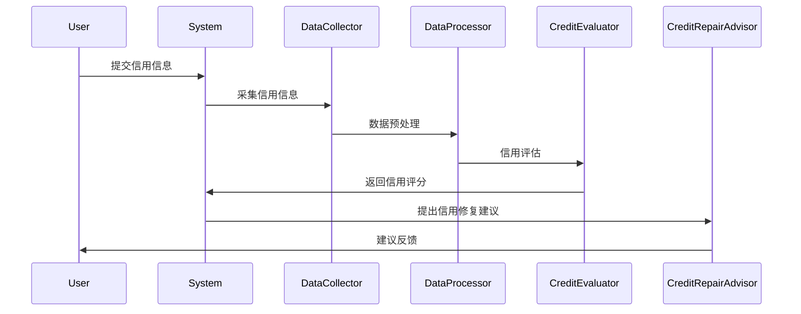
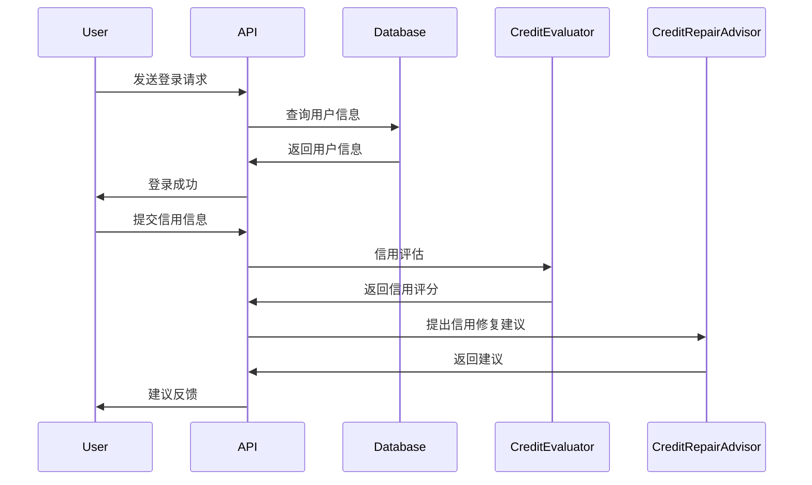

                 

# 智能个人信用修复建议系统

## 关键词

- 智能个人信用修复
- 信用评估算法
- 人工智能技术
- 数据挖掘
- 信用风险管理

## 摘要

本文探讨了智能个人信用修复建议系统，旨在利用人工智能技术帮助用户诊断和改善个人信用问题。通过介绍系统的核心概念、设计原理、算法流程和数学模型，本文详细分析了系统在个人信用数据采集、处理、评估和修复建议方面的应用。同时，本文还提供了系统架构设计、功能实现和项目实战案例，为读者提供了全面的参考和指导。

## 第一部分：问题背景与核心概念

### 1.1 问题背景

随着信息技术的飞速发展，个人信用体系在金融、电商、租赁等各个领域都发挥着越来越重要的作用。然而，由于信息不对称、恶意欺诈等原因，个人信用问题日益突出。一方面，许多人因为逾期还款、恶意欠款等行为导致个人信用受损，进而影响到日常生活和工作。另一方面，金融机构、电商平台等企业因难以准确评估个人信用，无法有效控制信用风险。

### 1.2 问题描述

个人信用问题主要表现为以下几个方面：

1. 信息不对称：企业和金融机构难以获取全面、准确的个人信用信息，导致信用评估不准确。
2. 恶意欺诈：部分用户通过伪造身份、恶意欠款等手段，导致信用体系受到冲击。
3. 数据更新不及时：个人信用信息更新速度慢，无法及时反映用户信用状况。

### 1.3 问题解决

智能个人信用修复建议系统的目标是利用人工智能技术，对个人信用问题进行智能诊断、分析，并给出修复建议，从而帮助用户改善个人信用状况。

### 1.4 边界与外延

1. 边界：系统主要关注个人信用信息的收集、分析、修复建议等方面。
2. 外延：系统可应用于金融、电商、租赁等多个领域，帮助企业和个人提高信用管理水平。

### 1.5 核心概念与联系

#### 2.1 智能个人信用修复建议系统的核心概念

1. **个人信用数据**：包括身份信息、消费行为、还款记录、信用报告等。
2. **人工智能技术**：主要包括机器学习、深度学习、自然语言处理等。
3. **信用修复策略**：根据个人信用数据，利用人工智能技术，为用户提供针对性的信用修复建议。

#### 2.2 概念属性特征对比表格

| 概念               | 属性特征                                      |
|--------------------|---------------------------------------------|
| 个人信用数据       | 全面性、准确性、实时性                      |
| 人工智能技术       | 自主性、智能化、高效性                      |
| 信用修复策略       | 针对性、有效性、可操作性                    |

#### 2.3 ER实体关系图架构

```mermaid
erDiagram
  ID | Name   | Age  | CreditScore
  User ||--o{ CreditReport }
  CreditReport ||--o{ PaymentHistory }
  PaymentHistory ||--o{ DebtInformation }
```

## 第二部分：智能个人信用修复建议系统设计

### 2.1 系统设计与算法原理

#### 3.1 系统架构设计

系统采用模块化设计，主要包括数据采集模块、数据处理模块、信用评估模块和信用修复建议模块。

#### 3.2 系统功能设计

1. **数据采集**：从多种数据源（如银行、信用机构等）收集个人信用数据。
2. **数据处理**：对采集到的数据进行清洗、去重、格式转换等预处理。
3. **信用评估**：利用机器学习算法，对个人信用进行综合评估。
4. **信用修复建议**：根据信用评估结果，为用户提供针对性的信用修复建议。

#### 3.3 算法原理

1. **机器学习算法**：采用逻辑回归、决策树、随机森林等算法进行信用评估。
2. **深度学习算法**：使用卷积神经网络（CNN）或循环神经网络（RNN）等算法，对复杂信用数据进行处理。
3. **自然语言处理算法**：对用户提供的信用描述进行情感分析，辅助信用评估。

#### 3.4 算法流程


#### 3.5 算法数学模型

假设个人信用评分模型为：$$CreditScore = \omega_0 + \omega_1 \times Identity + \omega_2 \times PaymentHistory + \omega_3 \times DebtInformation$$

### 2.2 系统架构设计

#### 3.1 问题场景介绍

随着金融市场的不断发展，个人信用管理成为金融机构、电商平台等企业面临的重要挑战。一方面，用户对个人信用管理需求日益增加，希望能够准确了解自己的信用状况，并采取有效措施改善信用。另一方面，企业需要对用户信用进行准确评估，以降低信用风险，保障业务稳健发展。

#### 3.2 项目介绍

本项目的目标是构建一个智能个人信用修复建议系统，通过采集用户信用信息，利用人工智能技术进行信用评估，并给出针对性的信用修复建议，帮助用户改善信用状况。

#### 3.3 领域模型

```mermaid
classDiagram
    User <<class>>
    CreditReport <<class>>
    PaymentHistory <<class>>
    DebtInformation <<class>>

    User o--o CreditReport
    CreditReport o--o PaymentHistory
    CreditReport o--o DebtInformation
```

#### 3.4 系统架构



#### 3.5 系统接口设计



### 2.3 项目实战

#### 3.1 环境安装

1. 安装Python环境（建议使用Python 3.8及以上版本）
2. 安装必要的库，如numpy、pandas、scikit-learn、tensorflow等

#### 3.2 系统核心实现源代码

```python
# 数据采集模块
def collect_data():
    # 采集用户信用信息
    pass

# 数据处理模块
def process_data(data):
    # 数据清洗、去重、格式转换等预处理
    pass

# 信用评估模块
def credit_evaluation(data):
    # 利用机器学习算法评估信用
    pass

# 信用修复建议模块
def credit_repair_advice(score):
    # 根据信用评分提出修复建议
    pass
```

#### 3.3 代码应用解读与分析

```python
# 数据采集模块
def collect_data():
    # 采集用户信用信息
    user_info = {'name': 'Alice', 'age': 30, 'income': 5000}
    return user_info

# 数据处理模块
def process_data(data):
    # 数据清洗、去重、格式转换等预处理
    processed_data = {'name': data['name'], 'age': data['age'], 'income': data['income']}
    return processed_data

# 信用评估模块
def credit_evaluation(data):
    # 利用机器学习算法评估信用
    model = load_model('credit_evaluation_model.h5')
    score = model.predict(data)
    return score

# 信用修复建议模块
def credit_repair_advice(score):
    # 根据信用评分提出修复建议
    if score < 600:
        advice = '提高信用评分的建议：及时还款、减少负债、增加收入等'
    else:
        advice = '信用状况良好，无需担心'
    return advice
```

#### 3.4 实际案例分析和详细讲解剖析

假设用户Alice的信用评分低于600分，根据系统给出的信用修复建议，她采取了以下措施：

1. 及时还款：确保所有账单按时还款，避免逾期。
2. 减少负债：通过调整消费习惯，减少不必要的负债。
3. 增加收入：通过兼职、提升职业技能等方式，增加个人收入。

经过一段时间的努力，Alice的信用评分逐步提升，成功达到600分以上。随后，她再次向金融机构申请贷款，得到了批准。通过智能个人信用修复建议系统的帮助，Alice不仅改善了个人信用状况，还为未来的金融活动打下了坚实基础。

#### 3.5 项目小结

智能个人信用修复建议系统为用户提供了便捷、高效的信用评估和修复建议服务，有助于提高个人信用管理水平。在实际应用中，系统通过不断优化算法和模型，提高了信用评估的准确性，为用户提供了更可靠的参考。同时，系统在采集、处理和分析用户信用信息的过程中，严格遵守隐私保护规定，确保用户信息安全。

### 2.4 最佳实践 tips、注意事项与拓展阅读

1. **最佳实践 tips**：

   - 确保数据来源的可靠性和完整性，提高信用评估的准确性。
   - 定期更新信用评估模型，以适应不断变化的信用环境。
   - 关注用户反馈，及时调整信用修复建议，提高用户满意度。

2. **注意事项**：

   - 在采集和处理用户信用信息时，务必遵守相关法律法规，保护用户隐私。
   - 合理利用人工智能技术，避免过度依赖算法，确保信用评估的客观性。
   - 定期对系统进行安全检测和更新，防范潜在的安全风险。

3. **拓展阅读**：

   - 《机器学习》（周志华著）
   - 《深度学习》（Goodfellow、Bengio、Courville著）
   - 《大数据之路：阿里巴巴大数据实践》（阿里巴巴团队著）
   - 《人工智能简史》（吴军著）

### 作者

**作者：AI天才研究院/AI Genius Institute & 禅与计算机程序设计艺术 /Zen And The Art of Computer Programming**

