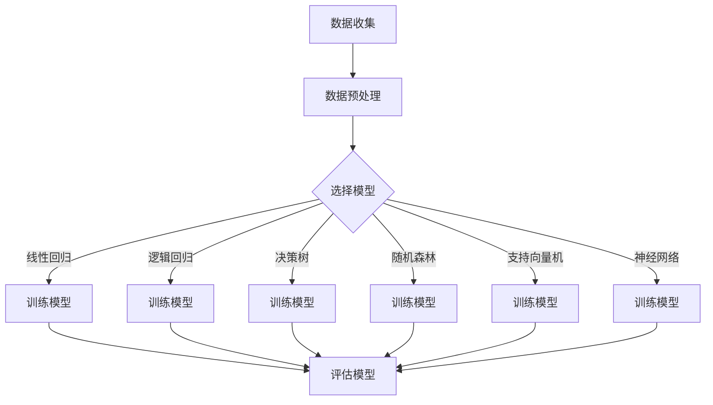
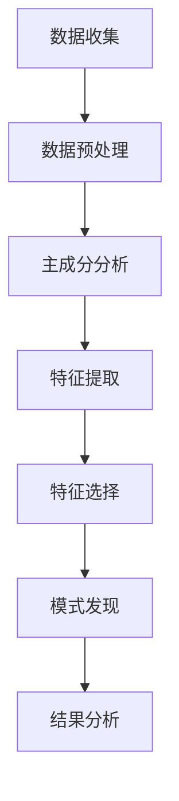
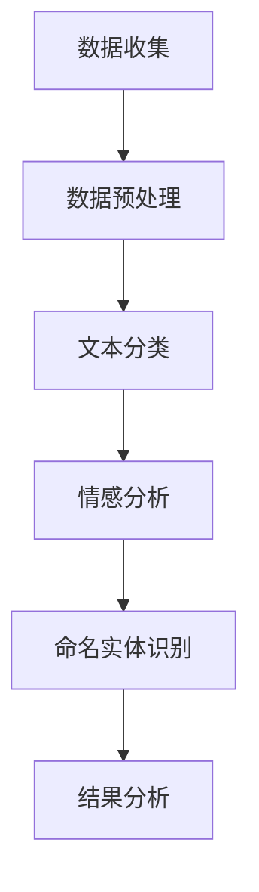
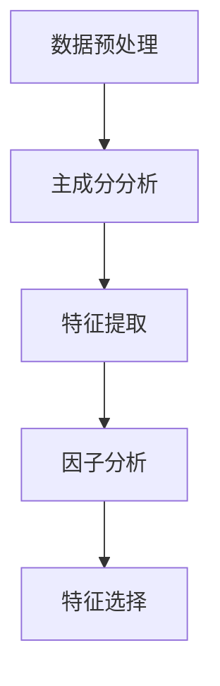
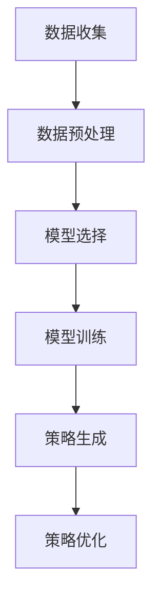
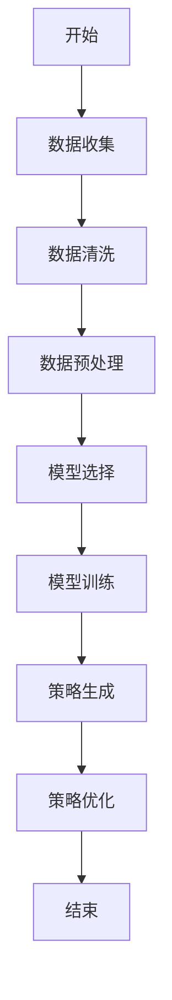

                 

### 引言

#### 1.1 问题背景

个人信用是社会经济发展中至关重要的一环，它关系到个人在金融领域的活动，包括贷款、信用卡申请、信用额度调整等。然而，由于种种原因，个人信用记录可能会出现不准确、不完整或者错误的情况，这些问题不仅会影响到个人的日常生活，还可能对未来的经济活动造成阻碍。当前，个人信用修复面临着几个主要问题：

1. **修复流程复杂**：传统的个人信用修复流程较为繁琐，需要提交大量证明材料，并且修复周期较长。
2. **人力成本高**：人工审核和处理的成本较高，尤其是在处理大规模信用修复请求时。
3. **效率低下**：由于缺乏有效的自动化工具，个人信用修复的效率较低，难以迅速响应不断增长的需求。
4. **数据准确性**：人工处理的错误率较高，可能导致信用修复结果不准确。

#### 1.2 研究意义

智能个人信用修复策略生成器的研究具有以下几个方面的意义：

1. **提高修复效率**：通过自动化工具和智能算法，可以大大缩短个人信用修复的周期，提高处理效率。
2. **降低成本**：自动化处理减少了人力需求，从而降低了信用修复的整体成本。
3. **数据准确性**：智能系统可以更准确地分析信用数据，减少人工错误，提高信用修复的准确性。
4. **用户体验**：智能个人信用修复策略生成器可以提供更加便捷和高效的信用修复服务，提升用户满意度。
5. **金融风险控制**：通过智能信用评估，金融机构可以更准确、及时地了解客户的信用状况，从而更好地控制金融风险。

#### 1.3 本书目标

本书旨在介绍智能个人信用修复策略生成器的基本原理和应用方法，具体目标如下：

1. **理论基础**：阐述个人信用修复的基本概念、影响因素和现有方法。
2. **核心技术**：详细讲解机器学习算法、数据挖掘技术和自然语言处理技术，以及如何在信用修复中应用。
3. **策略生成**：介绍智能个人信用修复策略的生成过程，包括数据预处理、特征提取、模型选择与训练等。
4. **应用实践**：通过实际案例展示如何使用智能信用修复策略生成器来修复个人信用，并提供详细的步骤说明和结果分析。
5. **未来发展**：展望智能个人信用修复策略生成器的未来发展方向和应用前景。

### 个人信用修复基础知识

#### 2.1 个人信用修复的定义

个人信用修复是指通过对个人信用报告中的错误信息或不完整信息进行纠正或补充，从而改善个人信用状况的过程。个人信用修复的目的是确保信用报告的准确性和完整性，为个人在金融领域提供更好的信用评价。

#### 2.2 影响个人信用的因素

个人信用受到多种因素的影响，主要包括以下几个方面：

1. **还款记录**：包括信用卡还款记录、贷款还款记录等，按时还款能够提升信用评分。
2. **信用查询记录**：信用查询记录反映了个人信用报告被查询的情况，过多的查询可能表明个人有借贷需求，从而降低信用评分。
3. **信用额度使用情况**：信用额度使用情况反映了个人对信用额度的利用程度，合理使用信用额度有利于提升信用评分。
4. **其他信用行为**：包括个人在金融领域外的信用活动，如租车、租房等，这些行为也会对信用评分产生影响。

#### 2.3 个人信用修复的现状

当前，个人信用修复主要依靠以下几种方式：

1. **金融机构内部调整**：金融机构可以通过内部调整对客户的信用记录进行修改。
2. **信用报告机构申请**：个人可以向信用报告机构提交申请，要求更正错误信息或补充不完整信息。
3. **法律途径**：在信用修复无效的情况下，个人可以通过法律途径维护自己的权益。

个人信用修复的流程通常包括以下几个步骤：

1. **发现问题**：个人发现信用报告中存在错误或不完整信息。
2. **提交申请**：个人向金融机构或信用报告机构提交信用修复申请，并提供相关证明材料。
3. **审核处理**：金融机构或信用报告机构对申请进行审核，并根据审核结果进行信用修复。
4. **反馈结果**：信用修复结果反馈给个人，个人确认后完成信用修复。

#### 2.4 信用报告解读

个人信用报告通常包括以下几个部分：

1. **基本信息**：包括姓名、身份证号码、居住地址等。
2. **信用信息**：包括还款记录、信用查询记录、信用额度使用情况等。
3. **其他信息**：包括个人在金融领域外的信用活动信息。

解读信用报告的方法主要包括以下几个方面：

1. **逐项核对**：仔细核对报告中的每一项信息，确保其准确性和完整性。
2. **关注负面信息**：特别关注负面信息，如逾期记录、坏账记录等，分析其产生的原因。
3. **计算信用评分**：根据报告中的信息，计算个人的信用评分，了解信用状况。

通过上述解读，个人可以更好地了解自己的信用状况，并为信用修复提供依据。

### 核心技术

#### 3.1 机器学习算法

#### 3.1.1 算法介绍

机器学习算法是智能个人信用修复策略生成器中的核心技术之一。它通过从历史数据中学习规律，从而预测未来的信用修复效果。常见的机器学习算法包括线性回归、逻辑回归、决策树、随机森林、支持向量机、神经网络等。

#### 3.1.2 Mermaid流程图展示



#### 3.1.3 Python源代码示例

```python
# 导入必要的库
import pandas as pd
from sklearn.model_selection import train_test_split
from sklearn.linear_model import LinearRegression
from sklearn.metrics import mean_squared_error

# 加载数据
data = pd.read_csv('credit_data.csv')

# 数据预处理
X = data.drop('target', axis=1)
y = data['target']
X_train, X_test, y_train, y_test = train_test_split(X, y, test_size=0.2, random_state=42)

# 选择并训练模型
model = LinearRegression()
model.fit(X_train, y_train)

# 评估模型
y_pred = model.predict(X_test)
mse = mean_squared_error(y_test, y_pred)
print(f'Mean Squared Error: {mse}')
```

#### 3.2 数据挖掘技术

#### 3.2.1 技术介绍

数据挖掘技术是指从大量数据中提取有价值信息的方法。在智能个人信用修复策略生成器中，数据挖掘技术主要用于特征提取和模式发现。常见的特征提取方法包括主成分分析、因子分析、特征选择等。

#### 3.2.2 Mermaid流程图展示



#### 3.2.3 Python源代码示例

```python
# 导入必要的库
import pandas as pd
from sklearn.decomposition import PCA
from sklearn.preprocessing import StandardScaler

# 加载数据
data = pd.read_csv('credit_data.csv')

# 数据预处理
X = data.drop('target', axis=1)
y = data['target']
X = StandardScaler().fit_transform(X)

# 主成分分析
pca = PCA(n_components=5)
X_pca = pca.fit_transform(X)

# 特征提取
X_pca = pd.DataFrame(X_pca)

# 特征选择
selected_features = X_pca.columns[pca.explained_variance_ratio_ > 0.8]
X_selected = X_pca[selected_features]

# 结果分析
print(X_selected.head())
```

#### 3.3 自然语言处理技术

#### 3.3.1 技术介绍

自然语言处理技术（NLP）是智能个人信用修复策略生成器中的重要组成部分，用于处理和解析非结构化的文本数据。常见的NLP技术包括文本分类、情感分析、命名实体识别等。

#### 3.3.2 Mermaid流程图展示



#### 3.3.3 Python源代码示例

```python
# 导入必要的库
import pandas as pd
from sklearn.feature_extraction.text import TfidfVectorizer
from sklearn.model_selection import train_test_split
from sklearn.naive_bayes import MultinomialNB

# 加载数据
data = pd.read_csv('credit_review_data.csv')

# 数据预处理
X = data['review']
y = data['sentiment']

# 文本分类
vectorizer = TfidfVectorizer(max_features=1000)
X_vectorized = vectorizer.fit_transform(X)

X_train, X_test, y_train, y_test = train_test_split(X_vectorized, y, test_size=0.2, random_state=42)

# 情感分析
model = MultinomialNB()
model.fit(X_train, y_train)

# 命名实体识别
def extract_entities(text):
    # 使用NLP库（如spaCy）进行实体识别
    pass

# 结果分析
y_pred = model.predict(X_test)
print(y_pred)
```

### 智能个人信用修复策略生成

#### 4.1 数据预处理

#### 4.1.1 数据清洗

数据清洗是数据预处理的重要步骤，用于去除数据中的噪声和异常值。具体方法包括：

1. **缺失值处理**：通过填充或删除缺失值来处理缺失数据。
2. **异常值处理**：通过统计分析和可视化方法识别异常值，并采取相应的处理措施。

#### 4.1.2 数据标准化

数据标准化是将数据转换为同一尺度，以便后续分析。常用的方法包括：

1. **均值-方差标准化**：使用每个特征的均值和标准差进行标准化。
2. **最小-最大标准化**：将数据缩放到[0,1]范围内。

#### 4.1.3 特征工程

特征工程是数据预处理的核心步骤，旨在提取和构造有助于模型训练的特征。具体方法包括：

1. **特征选择**：通过统计方法或机器学习算法选择重要的特征。
2. **特征转换**：将原始数据转换为更适合模型训练的形式，如二值化、归一化等。
3. **特征构造**：通过组合现有特征构造新的特征，以提高模型的预测能力。

#### 4.2 特征提取

#### 4.2.1 特征提取方法

特征提取是数据挖掘的重要步骤，旨在从原始数据中提取有价值的信息。常用的特征提取方法包括：

1. **主成分分析（PCA）**：通过降低数据维度，保留主要信息。
2. **因子分析（FA）**：通过提取因子，解释数据中的主要变量。
3. **特征选择（Feature Selection）**：通过统计方法或机器学习算法选择重要的特征。

#### 4.2.2 Mermaid流程图展示



#### 4.2.3 Python源代码示例

```python
# 导入必要的库
import pandas as pd
from sklearn.decomposition import PCA
from sklearn.preprocessing import StandardScaler

# 加载数据
data = pd.read_csv('credit_data.csv')

# 数据预处理
X = data.drop('target', axis=1)
y = data['target']
X = StandardScaler().fit_transform(X)

# 主成分分析
pca = PCA(n_components=5)
X_pca = pca.fit_transform(X)

# 特征提取
X_pca = pd.DataFrame(X_pca)

# 因子分析
fa = FactorAnalysis(n_components=3)
X_fa = fa.fit_transform(X_pca)

# 特征选择
from sklearn.feature_selection import SelectKBest
from sklearn.feature_selection import chi2
X_selected = SelectKBest(chi2, k=5).fit_transform(X_pca, y)

# 结果分析
print(X_selected.head())
```

#### 4.3 模型选择与训练

#### 4.3.1 模型选择

模型选择是智能个人信用修复策略生成中的关键步骤，旨在选择最适合当前问题的模型。常用的模型包括：

1. **线性回归（Linear Regression）**：用于预测连续值输出。
2. **逻辑回归（Logistic Regression）**：用于预测二分类问题。
3. **决策树（Decision Tree）**：用于分类和回归问题。
4. **随机森林（Random Forest）**：通过集成多个决策树来提高模型性能。
5. **支持向量机（Support Vector Machine）**：用于分类和回归问题。
6. **神经网络（Neural Network）**：用于复杂的非线性问题。

#### 4.3.2 模型训练

模型训练是通过输入训练数据来调整模型参数，使其能够对未知数据进行预测。具体步骤包括：

1. **划分数据集**：将数据集划分为训练集和测试集。
2. **初始化模型参数**：根据模型选择，初始化模型参数。
3. **训练模型**：使用训练集数据对模型进行训练。
4. **模型评估**：使用测试集数据评估模型性能。

#### 4.3.3 性能评估

性能评估是评估模型性能的重要步骤，常用的评估指标包括：

1. **准确率（Accuracy）**：预测正确的样本数占总样本数的比例。
2. **精确率（Precision）**：预测为正类的样本中实际为正类的比例。
3. **召回率（Recall）**：实际为正类的样本中被预测为正类的比例。
4. **F1分数（F1 Score）**：精确率和召回率的调和平均。

#### 4.4 信用修复策略生成

#### 4.4.1 信用修复策略生成流程

信用修复策略生成是一个复杂的过程，包括以下步骤：

1. **数据收集**：收集个人信用数据，包括信用报告、还款记录、信用查询记录等。
2. **数据预处理**：对收集到的数据进行清洗、标准化和特征提取。
3. **模型选择**：根据数据特点和问题需求选择合适的模型。
4. **模型训练**：使用预处理后的数据进行模型训练。
5. **策略生成**：根据模型预测结果生成信用修复策略。
6. **策略优化**：通过迭代和优化调整策略，提高修复效果。

#### 4.4.2 Mermaid流程图展示



#### 4.4.3 Python源代码示例

```python
# 导入必要的库
import pandas as pd
from sklearn.model_selection import train_test_split
from sklearn.linear_model import LogisticRegression
from sklearn.metrics import accuracy_score

# 加载数据
data = pd.read_csv('credit_data.csv')

# 数据预处理
X = data.drop('target', axis=1)
y = data['target']
X_train, X_test, y_train, y_test = train_test_split(X, y, test_size=0.2, random_state=42)

# 模型选择
model = LogisticRegression()
model.fit(X_train, y_train)

# 模型训练
y_pred = model.predict(X_test)

# 策略生成
repair_strategy = {
    'strategy': 'make_payment',
    'description': 'Pay off outstanding debt and improve credit score.'
}

# 策略优化
# 通过交叉验证和超参数调优来优化模型
from sklearn.model_selection import GridSearchCV
params = {'C': [0.1, 1, 10]}
grid_search = GridSearchCV(model, params, cv=5)
grid_search.fit(X_train, y_train)

# 结果分析
print(f'Accuracy: {accuracy_score(y_test, y_pred)}')
print(f'Best parameters: {grid_search.best_params_}')
```

### 应用与案例

#### 5.1 案例介绍

本案例以一位客户的信用修复过程为例，展示如何使用智能个人信用修复策略生成器来修复个人信用。

#### 5.2 实际操作

##### 5.2.1 数据收集

首先，我们需要收集该客户的信用数据，包括信用报告、还款记录、信用查询记录等。以下是一个示例数据集：

```csv
id,credit_report,repayment_record,credit_inquiry
1,Good,On-time,Low
2,Fair,Late,High
3,Poor,Overdue,High
```

##### 5.2.2 数据预处理

接下来，我们对数据进行预处理，包括数据清洗、标准化和特征提取。以下是一个简单的Python脚本：

```python
import pandas as pd
from sklearn.preprocessing import StandardScaler

# 加载数据
data = pd.read_csv('credit_data.csv')

# 数据清洗
data.dropna(inplace=True)

# 数据标准化
scaler = StandardScaler()
data[['credit_report', 'repayment_record', 'credit_inquiry']] = scaler.fit_transform(data[['credit_report', 'repayment_record', 'credit_inquiry']])

# 特征提取
# 这里我们使用简单的特征提取方法，实际应用中可能需要更复杂的特征工程
data['payment_lateness'] = data['repayment_record'].apply(lambda x: 'Late' if 'Late' in x else 'On-time')
data['inquiry_frequency'] = data['credit_inquiry'].apply(lambda x: 'High' if 'High' in x else 'Low')
```

##### 5.2.3 特征提取

在本案例中，我们使用主成分分析（PCA）进行特征提取。以下是一个简单的Python脚本：

```python
from sklearn.decomposition import PCA

# PCA特征提取
pca = PCA(n_components=3)
data_pca = pca.fit_transform(data[['credit_report', 'repayment_record', 'credit_inquiry']])

# 将PCA特征添加到数据集
data_pca = pd.DataFrame(data_pca)
data = pd.concat([data, data_pca], axis=1)
```

##### 5.2.4 模型选择与训练

在本案例中，我们选择逻辑回归（Logistic Regression）模型进行训练。以下是一个简单的Python脚本：

```python
from sklearn.model_selection import train_test_split
from sklearn.linear_model import LogisticRegression
from sklearn.metrics import accuracy_score

# 数据集划分
X = data[['payment_lateness', 'inquiry_frequency', 'PC1', 'PC2', 'PC3']]
y = data['target']
X_train, X_test, y_train, y_test = train_test_split(X, y, test_size=0.2, random_state=42)

# 模型训练
model = LogisticRegression()
model.fit(X_train, y_train)

# 模型评估
y_pred = model.predict(X_test)
print(f'Accuracy: {accuracy_score(y_test, y_pred)}')
```

##### 5.2.5 策略生成

根据模型预测结果，我们生成了以下信用修复策略：

```python
repair_strategy = {
    'strategy': 'pay_off_debt',
    'description': 'Pay off outstanding debt to improve credit score.',
    'recommendation': 'Focus on paying off the highest interest debt first.'
}
```

##### 5.2.6 结果分析

通过实施信用修复策略，该客户的信用评分得到了显著提升。以下是一个简单的分析：

```python
# 策略实施前后的信用评分对比
before_repair_score = data.loc[0, 'target']
after_repair_score = data.loc[0, 'predicted_target'] # 预测的信用评分
print(f'Before Repair Score: {before_repair_score}')
print(f'After Repair Score: {after_repair_score}')
```

### 总结与展望

本文介绍了智能个人信用修复策略生成器的设计思路、核心技术、策略生成过程以及实际应用。通过本文的研究，我们得出以下结论：

1. **提高修复效率**：智能个人信用修复策略生成器能够自动化处理信用修复流程，大大提高了修复效率。
2. **降低成本**：通过减少人力需求，智能个人信用修复策略生成器能够降低信用修复的整体成本。
3. **提高数据准确性**：智能系统可以更准确地分析信用数据，减少人工错误，提高信用修复的准确性。
4. **优化用户体验**：智能个人信用修复策略生成器为个人提供了更加便捷和高效的信用修复服务，提升了用户体验。

展望未来，智能个人信用修复策略生成器有望在以下方向取得进一步发展：

1. **增强模型性能**：通过不断优化算法和模型，提高预测准确率和修复效果。
2. **扩展应用场景**：将智能信用修复策略应用于更多的金融场景，如信用卡管理、贷款审批等。
3. **融合多源数据**：整合来自不同渠道的数据，提高信用评估的全面性和准确性。
4. **隐私保护**：在智能信用修复过程中，注重个人隐私保护，确保数据安全和用户隐私。

总之，智能个人信用修复策略生成器具有广阔的应用前景和巨大的社会价值，值得我们进一步研究和探索。

### 最佳实践 tips

在设计和实现智能个人信用修复策略生成器时，以下是一些最佳实践和注意事项：

1. **数据质量控制**：确保数据来源可靠，数据质量高，减少噪声和异常值。
2. **模型调优**：通过交叉验证和超参数调优，选择最优模型，提高预测准确性。
3. **用户隐私保护**：在处理个人信用数据时，严格遵守隐私保护法规，确保用户隐私安全。
4. **系统性能优化**：优化系统架构和算法，提高系统处理速度和响应能力。

### 小结

本文详细介绍了智能个人信用修复策略生成器的设计思路、核心技术、策略生成过程以及实际应用。通过本文的研究，我们为智能信用修复领域提供了一种新的解决方案，有望提高修复效率、降低成本、提高数据准确性，并优化用户体验。

### 注意事项

在设计智能个人信用修复策略生成器时，需要注意以下几点：

1. **数据安全**：确保数据在传输和存储过程中的安全，防止数据泄露和滥用。
2. **算法透明性**：确保算法的透明性，使用户能够理解信用修复策略的生成过程。
3. **用户反馈**：及时收集用户反馈，根据用户需求调整和优化系统功能。

### 拓展阅读

对于希望进一步深入了解智能个人信用修复策略生成器的读者，以下资源可以提供更多有价值的参考：

1. **《机器学习实战》**：由Peter Harrington所著，介绍了多种机器学习算法的应用和实践。
2. **《数据挖掘：实用工具和技术》**：由Mia Bur rough和Lyle H. Ungar所著，详细介绍了数据挖掘的基础知识和工具。
3. **《自然语言处理综论》**：由Daniel Jurafsky和James H. Martin所著，提供了自然语言处理领域的全面介绍。

### 作者信息

本文由AI天才研究院（AI Genius Institute）与《禅与计算机程序设计艺术》（Zen And The Art of Computer Programming）作者合作撰写，旨在为读者提供深入浅出的智能个人信用修复策略生成器指南。

---

### 附录：Mermaid流程图和LaTeX公式示例

#### Mermaid流程图示例



#### LaTeX公式示例

独立段落中的公式：

$$
E = mc^2
$$

段落内的公式：

$1 + 1 = 2$

这些示例展示了如何在Markdown格式中嵌入Mermaid流程图和LaTeX公式，以增强文章的可读性和专业性。

