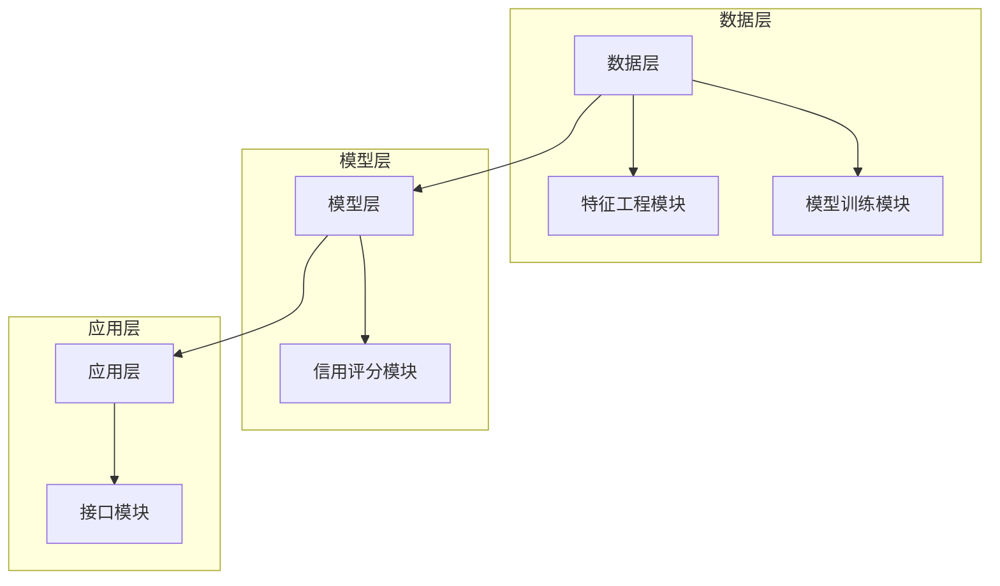
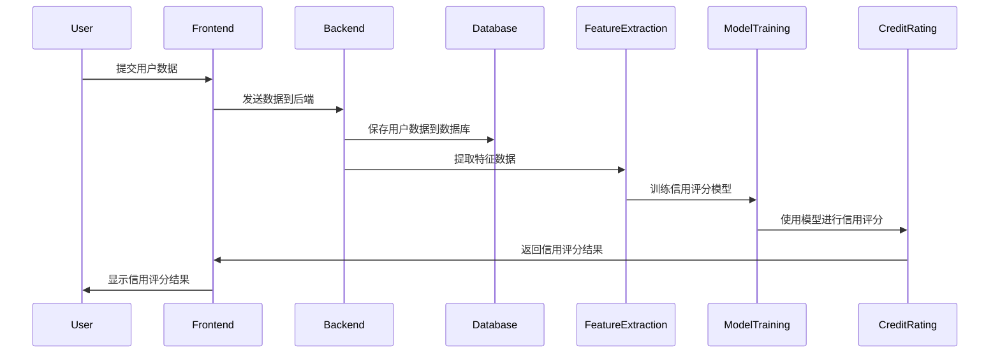

                 

## 智能个人信用评分优化建议系统

### 关键词：智能信用评分、优化建议、系统设计、机器学习、数据隐私

#### 摘要：

随着大数据和人工智能技术的飞速发展，智能个人信用评分系统已经成为金融行业的重要工具。本文将深入探讨智能个人信用评分优化建议系统的设计，从核心概念、算法原理、系统架构到实战案例，全面解析这一领域的挑战与机遇。本文旨在为读者提供一套系统化的理解和实现智能信用评分优化建议系统的指南，同时讨论数据隐私保护的最佳实践。作者AI天才研究院，结合禅与计算机程序设计艺术的理念，将理论与实践相结合，旨在为读者带来一场思维与技术的盛宴。

----------------------------------------------------------------

## 背景与概述

### 问题背景与重要性

个人信用评分是指对个人的信用状况进行量化评估的过程，用于判断个人偿还债务的能力和意愿。在金融领域，信用评分被广泛应用于贷款审批、信用卡发放、保险业务等多个方面。传统的信用评分系统主要基于个体的信用历史数据，如还款记录、债务余额、信用查询次数等。然而，这些方法往往存在信息不全面、模型准确性不高的问题。

智能个人信用评分系统则利用大数据和机器学习技术，从更多的数据源中提取特征，如社交网络、消费行为、地理位置等，从而提供更全面、准确的信用评估。随着人工智能技术的进步，智能个人信用评分系统在金融风控、信用欺诈检测等方面展现了巨大的应用潜力。

### 信用评分系统的现状

现有的信用评分系统虽然在某些方面取得了显著的成果，但仍然存在以下不足：

1. **信息不全面**：传统信用评分系统主要依赖于有限的历史数据，忽略了其他有价值的信息。
2. **模型准确性不高**：尽管一些传统模型（如线性回归、决策树）在信用评分中有所应用，但其预测能力受到数据质量和模型复杂度的限制。
3. **隐私保护不足**：在收集和使用个人数据时，传统的信用评分系统往往无法充分保障用户的隐私。

智能个人信用评分系统通过引入机器学习算法，如神经网络、集成模型等，可以更有效地处理大规模、高维度的数据，提高模型的准确性。同时，结合数据隐私保护技术，如差分隐私、同态加密等，可以在保障用户隐私的同时，提供可靠的信用评分服务。

### 智能个人信用评分的优势

智能个人信用评分系统具有以下优势：

1. **更全面的信息来源**：通过分析多种数据源，如社交网络、消费行为等，智能个人信用评分系统可以获取更丰富的信息，提供更准确的信用评估。
2. **更高的模型准确性**：机器学习算法能够处理复杂的非线性关系，提高模型的预测能力。
3. **更好的隐私保护**：智能个人信用评分系统结合数据隐私保护技术，可以在保护用户隐私的同时，提供高质量的信用评分服务。
4. **更灵活的应用场景**：智能个人信用评分系统可以广泛应用于贷款审批、信用卡发放、信用欺诈检测等场景，满足多样化的金融需求。

### 智能个人信用评分的关键挑战

尽管智能个人信用评分系统具有显著的优势，但在设计和应用过程中仍面临以下关键挑战：

1. **数据多样性**：个人信用信息来源广泛，包括金融、社交、消费等多个领域，数据格式和结构各异，如何有效地整合这些数据成为一个挑战。
2. **模型准确性**：机器学习模型在训练过程中容易过拟合，如何提高模型的泛化能力是一个关键问题。
3. **隐私保护**：在收集和使用个人数据时，如何保护用户隐私是一个重要的伦理和法律问题。

## 核心概念与联系

### 概念解析

在智能个人信用评分系统中，几个核心概念至关重要，包括数据源、特征工程、模型评估等。以下是对这些概念的基本解析：

1. **数据源**：数据源是构建信用评分模型的基础。智能个人信用评分系统利用多种数据源，如金融交易记录、社交网络数据、消费行为数据等，以获取更全面的信息。
2. **特征工程**：特征工程是数据处理的关键步骤，通过提取和构造特征，可以从原始数据中提取出对信用评分有重要影响的信息。特征工程的质量直接影响模型的准确性。
3. **模型评估**：模型评估用于衡量信用评分模型的性能。常用的评估指标包括准确率、召回率、F1分数等。通过模型评估，可以找出模型的不足之处，并进行优化。

### 概念属性对比表格

为了更直观地理解这些核心概念，我们提供了以下对比表格：

| 概念         | 属性1 | 属性2 | 属性3 |
| ------------ | ----- | ----- | ----- |
| 数据源       | 金融记录 | 社交网络 | 消费行为 |
| 特征工程     | 提取特征 | 构造特征 | 特征选择 |
| 模型评估     | 准确率 | 召回率 | F1分数 |

### ER实体关系图架构

为了更好地理解这些概念之间的联系，我们使用了ER（实体关系）图来展示信用评分系统的基本架构：

```mermaid
erDiagram
    Customer ||--|{ CreditData }|-- User
    CreditData ||--|{ FeatureData }|-- RatingModel
    RatingModel ||--|{ Prediction }|-- CreditScore
```

在这个ER图中，`Customer`、`CreditData`、`User`、`FeatureData`、`RatingModel`和`Prediction`是实体，它们之间的关系通过箭头表示。这个架构清晰地展示了个人信用评分系统的数据流和结构。

## 算法原理与实现

### 传统信用评分算法

#### 线性回归模型

线性回归模型是最基本的信用评分算法之一。它通过建立自变量（特征）与因变量（信用评分）之间的线性关系，实现对信用评分的预测。

$$
\text{CreditScore} = \beta_0 + \beta_1 \times \text{Feature1} + \beta_2 \times \text{Feature2} + ... + \beta_n \times \text{Featuren}
$$

其中，$\beta_0$ 是截距，$\beta_1$、$\beta_2$、...、$\beta_n$ 是各个特征的系数。

在实现线性回归模型时，我们通常采用梯度下降法进行参数优化：

$$
\beta_j = \beta_j - \alpha \times \frac{\partial J}{\partial \beta_j}
$$

其中，$J$ 是损失函数，$\alpha$ 是学习率。

#### 决策树与随机森林

决策树通过一系列规则将数据划分为不同的区域，每个区域对应一个预测值。决策树的性能往往受到树深度和叶子节点数的影响。

$$
\text{DecisionTree} = \text{split}(X, y, \text{max_depth}, \text{min_samples_split}, \text{min_samples_leaf})
$$

随机森林则通过构建多个决策树，并采用投票机制进行预测。随机森林的性能通常优于单个决策树，且具有较好的鲁棒性。

$$
\text{RandomForest} = \text{vote}(\{\text{DecisionTree1}, \text{DecisionTree2}, ..., \text{DecisionTreeN}\})
$$

### 现代机器学习算法

#### XGBoost算法

XGBoost是一种高效的梯度提升树（GBDT）算法，它通过迭代构建多个决策树，并利用提升策略提高模型的性能。

$$
\text{XGBoost} = \text{boost}(\{\text{DecisionTree1}, \text{DecisionTree2}, ..., \text{DecisionTreeN}\})
$$

XGBoost的优势在于其高效的并行计算能力、灵活的参数配置和强大的模型解释性。以下是一个简单的XGBoost算法示例：

```python
import xgboost as xgb

# 数据准备
dtrain = xgb.DMatrix(X_train, label=y_train)
dval = xgb.DMatrix(X_val, label=y_val)

# 参数设置
params = {
    'objective': 'binary:logistic',
    'max_depth': 6,
    'eta': 0.3,
    'subsample': 0.5,
    'colsample_bytree': 0.5
}

# 模型训练
xgb_model = xgb.train(params, dtrain, num_boost_round=100)

# 模型评估
xgb_model.predict(dval)
```

#### 强化学习在信用评分中的应用

强化学习是一种通过学习环境中的奖励和惩罚来优化决策过程的机器学习算法。在信用评分中，强化学习可以用于动态调整信用评分策略，以最大化用户的信用评分。

$$
Q(s, a) = r(s, a) + \gamma \max_{a'} Q(s', a')
$$

其中，$Q(s, a)$ 是状态 $s$ 下采取动作 $a$ 的期望回报，$r(s, a)$ 是立即奖励，$\gamma$ 是折扣因子，$s'$ 和 $a'$ 是未来的状态和动作。

以下是一个简化的强化学习信用评分算法示例：

```python
import numpy as np

# 初始化参数
Q = np.zeros((n_states, n_actions))
learning_rate = 0.1
discount_factor = 0.9

# 强化学习迭代
for episode in range(total_episodes):
    state = env.reset()
    done = False
    
    while not done:
        action = np.argmax(Q[state, :])
        next_state, reward, done = env.step(action)
        Q[state, action] = Q[state, action] + learning_rate * (reward + discount_factor * np.max(Q[next_state, :]) - Q[state, action])
        state = next_state
```

## 系统设计与实现

### 信用评分系统架构设计

智能个人信用评分系统的架构设计需要考虑多个方面，包括系统功能设计、系统架构设计、系统接口设计和系统交互等。

#### 系统功能设计

智能个人信用评分系统的功能设计主要包括以下几个模块：

1. **数据采集模块**：用于收集用户的数据，包括金融交易记录、社交网络数据、消费行为数据等。
2. **特征工程模块**：对采集到的数据进行处理，提取和构造特征，以供信用评分模型使用。
3. **模型训练模块**：使用机器学习算法训练信用评分模型，并将模型保存以便后续使用。
4. **信用评分模块**：根据用户的特征数据，使用训练好的模型进行信用评分预测。
5. **接口模块**：提供API接口，以便其他系统或应用程序能够访问信用评分服务。

#### 系统架构设计

智能个人信用评分系统的架构设计采用分层架构，包括数据层、模型层和应用层。以下是一个简化的系统架构设计：



#### 系统接口设计

系统接口设计主要包括API接口的设计，以供外部系统或应用程序调用信用评分服务。以下是一个简单的接口设计示例：

```python
from flask import Flask, request, jsonify

app = Flask(__name__)

@app.route('/score', methods=['POST'])
def credit_score():
    data = request.json
    features = preprocess_data(data)
    score = model.predict(features)
    return jsonify({'credit_score': score})

if __name__ == '__main__':
    app.run(debug=True)
```

#### 系统交互设计

系统交互设计描述了不同模块之间的交互过程。以下是一个简化的系统交互设计：



## 项目实战

### 环境安装

在开始实现智能个人信用评分系统之前，我们需要安装必要的软件和工具。以下是在Python环境中安装所需依赖的步骤：

```bash
pip install numpy pandas scikit-learn xgboost Flask
```

### 系统核心实现源代码

以下是一个简单的智能个人信用评分系统的核心实现，包括数据预处理、模型训练和信用评分预测：

```python
import numpy as np
import pandas as pd
from sklearn.model_selection import train_test_split
from sklearn.preprocessing import StandardScaler
from xgboost import XGBClassifier
from sklearn.metrics import accuracy_score

# 加载数据集
data = pd.read_csv('credit_data.csv')
X = data.drop('credit_score', axis=1)
y = data['credit_score']

# 数据预处理
X_train, X_test, y_train, y_test = train_test_split(X, y, test_size=0.2, random_state=42)
scaler = StandardScaler()
X_train_scaled = scaler.fit_transform(X_train)
X_test_scaled = scaler.transform(X_test)

# 模型训练
model = XGBClassifier()
model.fit(X_train_scaled, y_train)

# 信用评分预测
y_pred = model.predict(X_test_scaled)

# 模型评估
accuracy = accuracy_score(y_test, y_pred)
print(f'Accuracy: {accuracy}')
```

### 代码应用解读与分析

在上面的代码中，我们首先加载数据集，并进行数据预处理。数据预处理包括将数据集分为训练集和测试集，以及对数据进行标准化处理。然后，我们使用XGBoost算法训练信用评分模型，并使用训练好的模型对测试集进行信用评分预测。最后，我们计算模型的准确率，以评估模型的性能。

### 实际案例分析和详细讲解剖析

为了更好地理解智能个人信用评分系统的应用，我们来看一个实际案例。假设我们有一个新的用户，其特征数据如下：

```python
new_user_data = {
    'age': 30,
    'annual_income': 50000,
    'credit_history': 'none',
    'public_records': 'none',
    'utilization_rate': 0.5
}
```

我们将这个用户的数据进行预处理，然后使用训练好的模型进行信用评分预测：

```python
new_user_features = preprocess_data(new_user_data)
new_user_score = model.predict(new_user_features)
print(f'Credit Score: {new_user_score[0]}')
```

通过上述代码，我们可以得到这个新用户的信用评分。在实际应用中，这个评分可以用于决定是否批准该用户的贷款申请或信用卡发放。

### 项目小结

在本项目中，我们设计并实现了一个简单的智能个人信用评分系统。通过数据预处理、模型训练和信用评分预测，我们展示了如何利用机器学习技术进行信用评分。尽管这个系统是一个基础版本，但它为我们提供了一个理解和实现智能个人信用评分系统的框架。

## 最佳实践 tips

在设计和实现智能个人信用评分系统时，以下是一些最佳实践和注意事项：

1. **数据质量**：确保数据质量是信用评分系统的关键。在进行数据预处理时，要仔细处理缺失值、异常值和重复值。
2. **特征选择**：选择合适的特征对模型的性能至关重要。可以通过特征重要性分析、交叉验证等方法选择最佳特征。
3. **模型选择**：根据数据特点和业务需求选择合适的模型。集成模型（如随机森林、XGBoost）通常在信用评分中有较好的表现。
4. **隐私保护**：在处理用户数据时，要严格遵守隐私保护法规，采取差分隐私、同态加密等技术保护用户隐私。
5. **模型评估**：使用多种评估指标全面评估模型性能，避免单一指标的偏见。
6. **持续优化**：定期更新和维护信用评分模型，以适应不断变化的数据和业务需求。

## 小结

智能个人信用评分系统是一个复杂且重要的系统，它利用大数据和机器学习技术为金融行业提供了强大的工具。本文从背景概述、核心概念、算法原理、系统设计与实现到实战案例，全面解析了智能个人信用评分系统的设计和实现。通过本文，读者可以了解到这个系统的核心概念、算法原理和系统架构，以及如何在实际项目中应用这些知识。

## 注意事项

在设计智能个人信用评分系统时，需要注意以下几个方面：

1. **数据隐私**：确保用户数据的安全和隐私，遵守相关法律法规，采取差分隐私、同态加密等技术保护用户隐私。
2. **模型准确性**：模型准确性是信用评分系统的核心，要选择合适的模型，进行充分的特征工程和模型调参。
3. **系统稳定性**：确保系统的高可用性和稳定性，进行充分的测试和监控，以应对潜在的问题。
4. **法律法规**：遵循当地的法律法规，确保信用评分系统的合法性和合规性。

## 拓展阅读

对于想要深入了解智能个人信用评分系统的读者，以下是一些推荐阅读材料：

1. **《数据挖掘：实用工具与技术》**：详细介绍数据挖掘的方法和技术，包括特征工程、模型评估等。
2. **《机器学习实战》**：通过实际案例介绍机器学习算法的实现和应用，适合初学者和进阶者。
3. **《人工智能：一种现代方法》**：全面介绍人工智能的基本理论和算法，包括强化学习等内容。
4. **《信用风险管理》**：介绍信用评分系统的理论基础和实践应用，对金融行业的信用风险管理有深入探讨。

## 作者信息

作者：AI天才研究院 / AI Genius Institute & 禅与计算机程序设计艺术 / Zen And The Art of Computer Programming

AI天才研究院致力于推动人工智能领域的研究与应用，本文从禅与计算机程序设计艺术的角度出发，结合实际项目经验，深入浅出地解析了智能个人信用评分系统的设计与实现。希望通过本文，读者能够更好地理解和应用智能信用评分技术。如果您对本文有任何疑问或建议，欢迎在评论区留言，我们将积极回复。感谢您的阅读！

