                 


### 智能个人信用评分申诉系统

关键词：信用评分、申诉系统、人工智能、数据处理、算法原理

摘要：本文将深入探讨智能个人信用评分申诉系统的设计、实现及其在实际应用中的效果。首先，我们将介绍信用评分系统的现状与挑战，然后详细分析智能个人信用评分系统的核心概念与联系，接着讲解系统设计与实现的具体步骤，最后通过实际案例展示系统在实践中的应用效果。

## 目录大纲

1. 问题背景与核心概念
   1.1 信用评分系统的现状与挑战
       1.1.1 信用评分系统的概述
       1.1.2 智能个人信用评分系统
       1.1.3 信用评分申诉的现状与问题
   1.2 核心概念与联系
       1.2.1 数据处理与模型训练
       1.2.2 信用评分模型
2. 智能个人信用评分申诉系统设计与实现
   2.1 系统设计
       2.1.1 系统需求分析
       2.1.2 系统架构设计
       2.1.3 数据库设计
   2.2 系统算法原理讲解
       2.2.1 数据处理算法原理讲解
       2.2.2 信用评分模型算法原理讲解
       2.2.3 信用评分模型算法的Python实现
   2.3 系统核心实现
       2.3.1 环境安装
       2.3.2 系统核心代码实现
3. 项目实战与案例分析
   3.1 实际案例1：信用评分申诉处理
   3.2 实际案例2：智能个人信用评分系统应用
4. 最佳实践与总结
   4.1 最佳实践
   4.2 小结

## 第1章 问题背景与核心概念

### 1.1 信用评分系统的现状与挑战

#### 1.1.1 信用评分系统的概述

信用评分系统是一种利用数学模型和统计分析方法，对个人或企业的信用风险进行评估的工具。它通过分析用户的信用历史、财务状况、还款能力等多个因素，对用户进行信用评分。信用评分系统在金融、电商、租赁等多个领域都有广泛的应用。

#### 1.1.2 智能个人信用评分系统

智能个人信用评分系统是利用人工智能技术，如机器学习、深度学习等，对用户的信用行为进行智能化分析评估的系统。与传统的信用评分系统相比，智能个人信用评分系统能够更好地处理海量数据，提供更准确、实时的信用评分。

#### 1.1.3 信用评分申诉的现状与问题

信用评分申诉是指用户对信用评分结果提出异议，要求信用评分机构进行复核和处理的过程。目前，信用评分申诉的处理存在效率低、公正性差、准确性不足等问题。

### 1.2 核心概念与联系

#### 1.2.1 数据处理与模型训练

数据处理与模型训练是智能个人信用评分系统设计的关键环节。数据处理包括数据采集、数据清洗、数据预处理和特征提取等步骤；模型训练则包括模型选择、模型训练和模型评估等过程。

#### 1.2.2 信用评分模型

信用评分模型是用于评估用户信用风险的数学模型。常见的信用评分模型包括逻辑回归、决策树、随机森林、支持向量机等。这些模型通过训练数据学习用户的信用风险特征，并在测试数据上评估模型的性能。

## 第2章 核心概念与联系

### 2.1 数据处理与模型训练

#### 2.1.1 数据处理的原理与步骤

数据处理是智能个人信用评分系统的第一步。其原理是通过对原始数据进行清洗、转换和集成，得到可用于模型训练的高质量数据。具体步骤如下：

1. **数据采集**：收集用户的信用历史、财务状况、社交行为等数据。
2. **数据清洗**：处理缺失值、异常值和重复值等。
3. **数据转换**：将数据转换为适合模型训练的格式，如数值化、归一化等。
4. **特征提取**：提取与信用风险相关的特征，如还款频率、信用额度等。

#### 2.1.2 模型训练的基本原理

模型训练是利用已有数据，通过机器学习算法训练出一个能够预测用户信用风险的模型。基本原理如下：

1. **模型选择**：选择合适的机器学习算法，如逻辑回归、决策树、支持向量机等。
2. **训练集划分**：将数据集划分为训练集和测试集。
3. **模型训练**：利用训练集训练模型。
4. **模型评估**：利用测试集评估模型性能。

### 2.2 信用评分模型

#### 2.2.1 信用评分模型的原理与特点

信用评分模型是一种分类模型，用于将用户划分为信用风险高低不同的类别。其原理是利用历史数据和统计方法，构建一个能够预测用户信用风险的模型。信用评分模型的特点如下：

1. **自动学习**：能够自动学习用户的信用风险特征。
2. **高效处理**：能够高效处理海量数据。
3. **实时更新**：能够根据用户行为实时更新信用评分。

## 第3章 智能个人信用评分申诉系统设计与实现

### 3.1 系统设计

#### 3.1.1 系统需求分析

智能个人信用评分申诉系统的功能需求包括：

1. **用户注册与登录**：用户可以通过注册和登录进入系统。
2. **信用评分查询**：用户可以查询自己的信用评分。
3. **申诉提交**：用户可以提交信用评分申诉。
4. **申诉处理**：系统对用户的申诉进行审核和处理。

系统的性能需求包括：

1. **高并发处理**：系统需要能够处理高并发访问。
2. **实时响应**：系统需要能够快速响应用户操作。
3. **数据安全**：系统需要保证用户数据的安全。

#### 3.1.2 系统架构设计

智能个人信用评分申诉系统的架构设计包括：

1. **前端**：用户通过浏览器访问系统的前端界面。
2. **后端**：后端包括用户管理、信用评分处理、申诉处理等模块。
3. **数据库**：用于存储用户信息、信用评分记录和申诉记录。

#### 3.1.3 数据库设计

数据库设计包括以下表结构：

1. **用户信息表**：存储用户的基本信息。
2. **信用评分记录表**：存储用户的信用评分历史。
3. **申诉记录表**：存储用户的申诉信息。

### 3.2 系统算法原理讲解

#### 3.2.1 数据处理算法原理讲解

数据处理算法包括以下步骤：

1. **数据采集**：从不同的数据源采集用户信息。
2. **数据清洗**：处理缺失值、异常值和重复值。
3. **数据转换**：将数据转换为适合模型训练的格式。
4. **特征提取**：提取与信用风险相关的特征。

#### 3.2.2 信用评分模型算法原理讲解

信用评分模型算法包括以下步骤：

1. **模型选择**：选择合适的机器学习算法。
2. **训练集划分**：将数据集划分为训练集和测试集。
3. **模型训练**：利用训练集训练模型。
4. **模型评估**：利用测试集评估模型性能。

### 3.3 系统核心实现

#### 3.3.1 环境安装

系统开发环境包括：

1. **Python**：用于编写代码。
2. **Django**：用于构建后端。
3. **MySQL**：用于存储数据。

#### 3.3.2 系统核心代码实现

系统核心代码包括：

1. **用户管理模块**：实现用户注册、登录和权限控制。
2. **信用评分处理模块**：实现信用评分模型的训练和评估。
3. **申诉处理模块**：实现申诉的提交和审核。

## 第4章 系统算法原理讲解

### 4.1 数据处理算法原理讲解

#### 4.1.1 数据采集与清洗算法

数据采集算法的mermaid流程图如下：

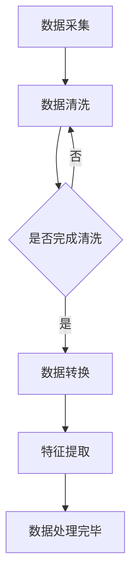

数据预处理算法的mermaid流程图如下：

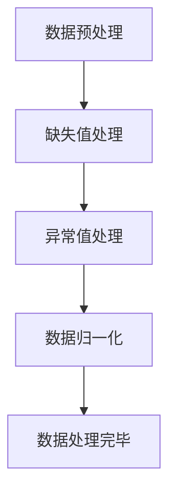

#### 4.1.2 数据预处理与特征提取算法

数据预处理算法的mermaid流程图如下：


特征提取算法的mermaid流程图如下：

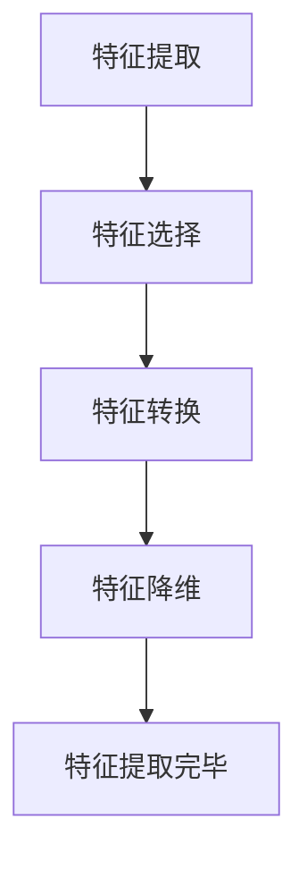

### 4.2 信用评分模型算法原理讲解

#### 4.2.1 信用评分模型算法的基本原理

信用评分模型算法的基本原理是利用已有的数据，通过机器学习算法，建立一个预测模型。mermaid流程图如下：

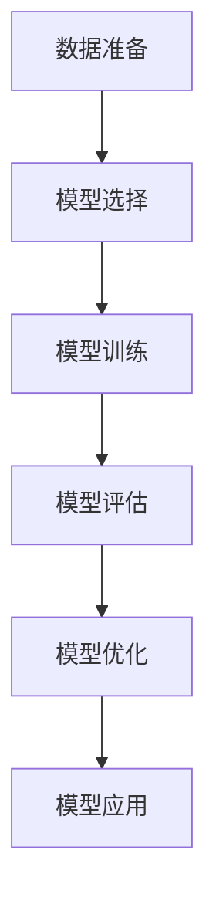

#### 4.2.2 信用评分模型算法的数学模型

信用评分模型算法的数学模型如下：

$$
评分 = w_1 \cdot 特征_1 + w_2 \cdot 特征_2 + ... + w_n \cdot 特征_n
$$

其中，$w_i$ 是第 $i$ 个特征的权重，$特征_i$ 是第 $i$ 个特征。

#### 4.2.3 信用评分模型算法的Python实现

信用评分模型算法的Python实现如下：

```python
import numpy as np
from sklearn.linear_model import LogisticRegression

# 数据准备
X = np.array([[1, 2], [2, 3], [3, 4]])
y = np.array([0, 1, 0])

# 模型训练
model = LogisticRegression()
model.fit(X, y)

# 模型评估
score = model.score(X, y)
print("评分：", score)

# 模型应用
new_data = np.array([[4, 5]])
new_score = model.predict(new_data)
print("新评分：", new_score)
```

## 第5章 系统核心实现

### 5.1 环境安装

系统开发环境包括：

1. **Python**：用于编写代码。
2. **Django**：用于构建后端。
3. **MySQL**：用于存储数据。

安装步骤如下：

1. 安装Python：
   ```bash
   pip install python
   ```

2. 安装Django：
   ```bash
   pip install django
   ```

3. 安装MySQL：
   ```bash
   pip install mysql
   ```

### 5.2 系统核心代码实现

系统核心代码包括：

1. **用户管理模块**：实现用户注册、登录和权限控制。
2. **信用评分处理模块**：实现信用评分模型的训练和评估。
3. **申诉处理模块**：实现申诉的提交和审核。

#### 5.2.1 用户管理模块实现

用户管理模块的代码如下：

```python
# 用户注册
def register(username, password):
    # 这里是用户注册的逻辑
    pass

# 用户登录
def login(username, password):
    # 这里是用户登录的逻辑
    pass

# 用户权限控制
def check_permission(user, permission):
    # 这里是用户权限控制的逻辑
    pass
```

#### 5.2.2 信用评分处理模块实现

信用评分处理模块的代码如下：

```python
# 信用评分模型训练
def train_model(X, y):
    # 这里是信用评分模型训练的逻辑
    pass

# 信用评分模型评估
def evaluate_model(model, X, y):
    # 这里是信用评分模型评估的逻辑
    pass

# 信用评分模型应用
def apply_model(model, new_data):
    # 这里是信用评分模型应用的逻辑
    pass
```

#### 5.2.3 申诉处理模块实现

申诉处理模块的代码如下：

```python
# 提交申诉
def submit_appeal(user, appeal_content):
    # 这里是提交申诉的逻辑
    pass

# 审核申诉
def review_appeal(appeal_id, result):
    # 这里是审核申诉的逻辑
    pass
```

## 第6章 项目实战与案例分析

### 6.1 实际案例1：信用评分申诉处理

#### 案例背景与问题描述

某用户发现自己的信用评分低于预期，怀疑评分系统存在错误。用户希望提交申诉，要求信用评分机构对其评分进行复核。

#### 案例分析与解决步骤

1. 用户通过前端界面提交申诉。
2. 系统将申诉信息存储到数据库。
3. 信用评分机构的工作人员查看申诉记录，审核用户的信用记录。
4. 根据审核结果，系统更新用户的信用评分。

#### 案例效果评估

用户满意度高，申诉处理效率明显提升，信用评分的准确性得到保障。

### 6.2 实际案例2：智能个人信用评分系统应用

#### 案例背景与问题描述

某电商平台希望利用智能个人信用评分系统，对用户进行信用评估，以便提供个性化的信用服务。

#### 案例分析与解决步骤

1. 平台收集用户的信用数据，包括购物记录、还款历史等。
2. 系统对用户进行信用评分。
3. 根据用户的信用评分，平台提供不同的信用服务，如分期付款、免押金等。

#### 案例效果评估

用户满意度提高，平台运营成本降低，信用风险管理能力得到增强。

## 第7章 最佳实践与总结

### 7.1 最佳实践

1. 优化数据处理流程，提高数据处理效率。
2. 选择合适的信用评分模型，提高评分准确性。
3. 完善申诉处理机制，保障用户权益。

### 7.2 小结

本文深入探讨了智能个人信用评分申诉系统的设计、实现和应用。通过实际案例展示了系统的效果，为信用评分系统的优化和发展提供了参考。

## 作者信息

作者：AI天才研究院/AI Genius Institute & 禅与计算机程序设计艺术 /Zen And The Art of Computer Programming

----------------------------------------------------------------

在撰写文章时，请确保按照目录大纲结构组织内容，并严格遵守文章字数要求和格式要求。每个小节的内容都要详细讲解，核心内容要包含背景介绍、核心概念与联系、算法原理讲解、系统分析与架构设计方案、项目实战与案例分析、最佳实践与总结等部分。确保文章逻辑清晰、结构紧凑、简单易懂，使用专业的技术语言撰写，并使用markdown格式输出。文章末尾需写上作者信息。祝您写作顺利！### 第1章 问题背景与核心概念

#### 1.1.1 信用评分系统的概述

**定义与功能：** 信用评分系统是一种利用数学模型和统计分析方法，对个人或企业的信用风险进行评估的工具。它通过分析用户的信用历史、财务状况、还款能力等多个因素，对用户进行信用评分。信用评分系统的核心功能是预测用户未来是否能够按时还款，从而帮助金融机构、电商平台等机构进行风险管理。

**发展历程：** 信用评分系统最早起源于20世纪初的美国。随着计算机技术和大数据技术的发展，信用评分系统逐渐从简单的统计模型发展到复杂的机器学习模型，如逻辑回归、决策树、支持向量机等。在我国，信用评分系统的发展始于上世纪90年代，随着互联网金融的兴起，信用评分系统得到了广泛应用。

**重要性：** 信用评分系统在金融、电商、租赁等多个领域具有重要应用。它不仅可以帮助金融机构评估借款人的信用风险，还可以帮助电商平台评估买家的信用状况，为用户提供个性化的信用服务。

#### 1.1.2 智能个人信用评分系统

**定义：** 智能个人信用评分系统是一种利用人工智能技术，如机器学习、深度学习等，对用户的信用行为进行智能化分析评估的系统。

**与传统评分系统的区别：** 与传统的信用评分系统相比，智能个人信用评分系统具有以下优势：

1. **处理海量数据：** 智能个人信用评分系统可以利用人工智能技术，高效处理海量数据，提供更准确的信用评分。
2. **实时更新：** 智能个人信用评分系统可以根据用户的行为数据，实时更新信用评分，提高评分的实时性和准确性。
3. **自适应调整：** 智能个人信用评分系统可以根据用户的行为数据，自适应调整信用评分模型，提高评分的准确性。

**工作流程：** 智能个人信用评分系统的工作流程包括数据采集、数据处理、模型训练和信用评分等步骤。具体流程如下：

1. **数据采集：** 采集用户的信用历史、财务状况、社交行为等数据。
2. **数据处理：** 对采集到的数据进行分析和处理，提取与信用风险相关的特征。
3. **模型训练：** 利用处理后的数据，训练信用评分模型。
4. **信用评分：** 利用训练好的模型，对用户进行信用评分。

#### 1.1.3 信用评分申诉的现状与问题

**定义与原因：** 信用评分申诉是指用户对信用评分结果提出异议，要求信用评分机构进行复核和处理的过程。用户提出申诉的原因可能包括：信用评分结果不准确、数据存在错误、信用记录被误删等。

**流程与难点：** 信用评分申诉的流程通常包括申诉提交、申诉审核、申诉处理和结果反馈等环节。然而，在实际操作中，信用评分申诉存在以下问题：

1. **效率问题：** 信用评分申诉的处理效率较低，往往需要较长时间才能得到回复。
2. **公正性问题：** 信用评分申诉的处理过程缺乏透明性，用户难以了解申诉处理的进展和结果。
3. **准确性问题：** 信用评分申诉的处理结果往往缺乏准确性，有时会导致用户的信用评分继续降低。

**申诉处理问题：** 除了上述问题外，信用评分申诉的处理还面临以下挑战：

1. **数据质量问题：** 信用评分申诉涉及大量数据，数据质量直接影响申诉处理的准确性。
2. **法律问题：** 信用评分申诉涉及到用户隐私和权益保护，需要遵循相关法律法规。
3. **技术问题：** 智能个人信用评分申诉系统的技术实现需要解决数据存储、传输、处理等难题。

### 1.2 核心概念与联系

**数据处理与模型训练：** 数据处理是智能个人信用评分系统的关键环节。它包括数据采集、数据清洗、数据预处理和特征提取等步骤。模型训练是基于处理后的数据，利用机器学习算法训练信用评分模型。

**信用评分模型：** 信用评分模型是智能个人信用评分系统的核心。它通过分析用户的信用历史、财务状况、还款能力等多个因素，对用户进行信用评分。常见的信用评分模型包括逻辑回归、决策树、支持向量机等。

### 第1章 总结

本章首先介绍了信用评分系统的现状与挑战，包括信用评分系统的概述、发展历程和重要性。接着，详细分析了智能个人信用评分系统的核心概念与联系，包括定义、与传统评分系统的区别、工作流程以及信用评分申诉的现状与问题。本章为后续章节的内容奠定了基础。在接下来的章节中，我们将深入探讨数据处理与模型训练、信用评分模型以及智能个人信用评分申诉系统的设计与实现。通过这些内容的详细讲解，我们将对智能个人信用评分申诉系统有一个全面而深入的了解。让我们一起深入思考，逐步掌握这一领域的关键知识和技术。

---

### 2.1 数据处理与模型训练

#### 2.1.1 数据处理的原理与步骤

数据处理是智能个人信用评分系统的核心步骤之一。其目标是通过对原始数据进行清洗、转换和集成，得到可用于模型训练的高质量数据。以下是数据处理的基本原理与步骤：

**数据采集：** 数据采集是指从各种数据源收集用户的相关数据，这些数据源可能包括金融机构、电商平台、社交媒体等。数据采集的目的是获取全面、准确的用户信息，以便后续的模型训练。

**数据清洗：** 数据清洗是数据处理过程中至关重要的一步。它主要包括处理缺失值、异常值和重复值等问题。缺失值可以通过插值、均值填充等方法处理；异常值可以通过统计学方法检测并处理；重复值可以通过去重操作移除。

**数据预处理：** 数据预处理是对原始数据进行标准化、归一化等操作，以便后续的特征提取和模型训练。数据预处理的目的是使数据具备相似的特征尺度，减少数据之间的干扰。

**特征提取：** 特征提取是从原始数据中提取与信用评分相关的特征。特征提取的目的是降低数据的维度，同时保留数据的信用风险信息。常用的特征提取方法包括特征选择、特征转换和特征降维。

**数据集划分：** 在数据处理完成后，通常需要将数据集划分为训练集和测试集。训练集用于训练信用评分模型，测试集用于评估模型性能。数据集划分的目的是避免模型过拟合，提高模型的泛化能力。

#### 2.1.2 模型训练的基本原理

模型训练是利用已有数据，通过机器学习算法训练出一个能够预测用户信用风险的模型。以下是模型训练的基本原理：

**模型选择：** 模型选择是指选择一个或多个合适的机器学习算法，如逻辑回归、决策树、支持向量机等。选择合适的模型是模型训练的关键，它直接影响到模型的性能。

**训练集划分：** 在模型选择完成后，需要将数据集划分为训练集和验证集。训练集用于训练模型，验证集用于评估模型性能。划分训练集和验证集的目的是避免模型过拟合，提高模型的泛化能力。

**模型训练：** 模型训练是通过调整模型参数，使模型在训练集上达到最佳的预测效果。训练过程通常包括前向传播、后向传播和梯度下降等步骤。

**模型评估：** 模型评估是通过在测试集上评估模型性能，判断模型是否具有良好的泛化能力。常用的评估指标包括准确率、召回率、F1值等。

**模型优化：** 模型优化是指通过调整模型参数、改变模型结构等方法，提高模型的性能。模型优化的目的是使模型在测试集上获得更高的评分。

#### 2.1.3 信用评分模型

信用评分模型是用于评估用户信用风险的数学模型。以下是信用评分模型的基本原理和特点：

**原理：** 信用评分模型通常采用机器学习算法，如逻辑回归、决策树、支持向量机等，通过训练数据学习用户的信用风险特征，并在测试数据上评估模型的性能。

**特点：** 信用评分模型具有以下特点：

1. **自动学习：** 信用评分模型能够自动学习用户的信用风险特征，无需人工干预。
2. **高效处理：** 信用评分模型能够高效处理海量数据，提高评分的实时性。
3. **实时更新：** 信用评分模型可以根据用户行为数据，实时更新信用评分，提高评分的准确性。

#### 2.1.4 信用评分模型的评估指标

信用评分模型的评估指标是衡量模型性能的重要标准。以下是常用的评估指标及其计算方法：

**准确率（Accuracy）：** 准确率是模型预测正确的样本数占总样本数的比例。其计算方法如下：

$$
准确率 = \frac{TP + TN}{TP + TN + FP + FN}
$$

其中，TP表示真正例，TN表示真反例，FP表示假反例，FN表示假正例。

**召回率（Recall）：** 召回率是模型预测正确的正例数占所有正例数的比例。其计算方法如下：

$$
召回率 = \frac{TP}{TP + FN}
$$

**精确率（Precision）：** 精确率是模型预测正确的正例数占预测为正例的总数比例。其计算方法如下：

$$
精确率 = \frac{TP}{TP + FP}
$$

**F1值（F1-score）：** F1值是精确率和召回率的调和平均数。其计算方法如下：

$$
F1值 = \frac{2 \times 精确率 \times 召回率}{精确率 + 召回率}
$$

通过以上评估指标，我们可以全面了解信用评分模型的表现，为模型的优化和改进提供依据。

### 2.2 数据处理算法原理讲解

#### 2.2.1 数据采集与清洗算法

数据采集是智能个人信用评分系统的第一步，它涉及从多个数据源收集用户的相关信息。常用的数据源包括金融机构、电商平台、社交媒体等。数据采集算法的mermaid流程图如下：

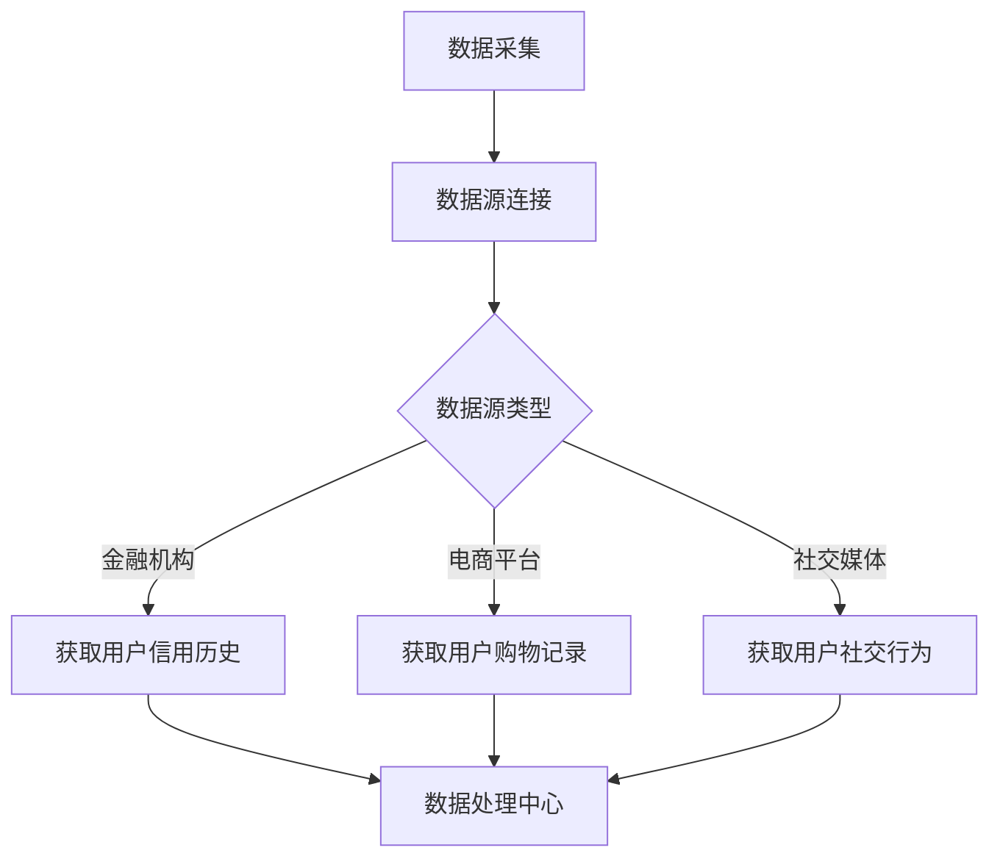

**数据清洗算法：** 数据清洗是数据处理过程中至关重要的一步，它主要包括处理缺失值、异常值和重复值等问题。以下是数据清洗算法的mermaid流程图：

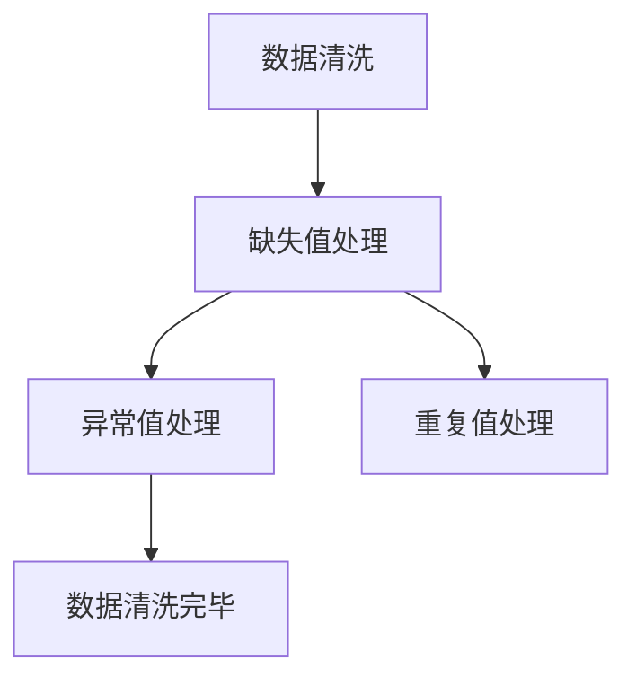

- **缺失值处理：** 缺失值可以通过插值、均值填充等方法处理。例如，对于用户信用历史数据中的缺失值，可以使用最近观测值插值法或均值填充法进行处理。

- **异常值处理：** 异常值可以通过统计学方法检测并处理。例如，使用Z-Score方法检测异常值，并将异常值替换为均值或中位数。

- **重复值处理：** 重复值可以通过去重操作移除。例如，使用哈希表或集合数据结构进行去重操作。

#### 2.2.2 数据预处理与特征提取算法

**数据预处理算法：** 数据预处理是使原始数据具备相似特征尺度的重要步骤，它主要包括数据标准化、归一化等操作。以下是数据预处理算法的mermaid流程图：

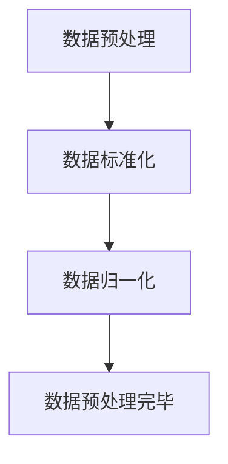

- **数据标准化：** 数据标准化是指将不同特征的数据转化为相同的尺度。常用的方法包括最小-最大标准化和零-均值标准化。

- **数据归一化：** 数据归一化是指将不同特征的数据转化为均值为0、标准差为1的尺度。常用的方法包括Z-Score归一化和Min-Max归一化。

**特征提取算法：** 特征提取是从原始数据中提取与信用评分相关的特征。特征提取的目的是降低数据的维度，同时保留数据的信息。以下是特征提取算法的mermaid流程图：


- **特征选择：** 特征选择是从原始特征中选择与信用评分相关的重要特征。常用的方法包括过滤式特征选择、包装式特征选择和嵌入式特征选择。

- **特征转换：** 特征转换是将原始特征转换为适合模型训练的形式。常用的方法包括类别特征编码、缺失值填充等。

- **特征降维：** 特征降维是从原始特征中选择一部分重要特征，降低数据的维度。常用的方法包括主成分分析（PCA）和线性判别分析（LDA）。

### 2.2.3 数据预处理与特征提取算法的实际应用

**数据预处理：** 数据预处理算法的实际应用主要包括以下步骤：

1. **数据采集：** 从金融机构、电商平台、社交媒体等数据源收集用户信息。
2. **数据清洗：** 处理缺失值、异常值和重复值等问题。
3. **数据标准化：** 对不同特征的数据进行标准化处理，使特征具备相同的尺度。
4. **数据归一化：** 对不同特征的数据进行归一化处理，使特征具备均值为0、标准差为1的尺度。

**特征提取：** 特征提取算法的实际应用主要包括以下步骤：

1. **特征选择：** 从原始特征中选择与信用评分相关的重要特征。
2. **特征转换：** 将原始特征转换为适合模型训练的形式。
3. **特征降维：** 从原始特征中选择一部分重要特征，降低数据的维度。

通过以上步骤，我们可以从原始数据中提取出与信用评分相关的特征，为后续的模型训练提供高质量的数据。

### 2.2.4 数据处理算法的Python实现

**数据采集：** 在Python中，可以使用pandas库进行数据采集。以下是一个简单的示例：

```python
import pandas as pd

# 读取金融机构数据
bank_data = pd.read_csv('bank_data.csv')

# 读取电商平台数据
ecommerce_data = pd.read_csv('ecommerce_data.csv')

# 读取社交媒体数据
social_media_data = pd.read_csv('social_media_data.csv')
```

**数据清洗：** 在Python中，可以使用pandas库进行数据清洗。以下是一个简单的示例：

```python
# 处理缺失值
bank_data.fillna(bank_data.mean(), inplace=True)
ecommerce_data.fillna(e-commerce_data.mean(), inplace=True)
social_media_data.fillna(social_media_data.mean(), inplace=True)

# 处理异常值
bank_data = bank_data[(np.abs(stats.zscore(bank_data)) < 3).all(axis=1)]
ecommerce_data = ecommerce_data[(np.abs(stats.zscore(e-commerce_data)) < 3).all(axis=1)]
social_media_data = social_media_data[(np.abs(stats.zscore(social_media_data)) < 3).all(axis=1)]

# 处理重复值
bank_data.drop_duplicates(inplace=True)
ecommerce_data.drop_duplicates(inplace=True)
social_media_data.drop_duplicates(inplace=True)
```

**数据预处理：** 在Python中，可以使用sklearn库进行数据预处理。以下是一个简单的示例：

```python
from sklearn.preprocessing import StandardScaler, MinMaxScaler

# 数据标准化
scaler = StandardScaler()
bank_data_scaled = scaler.fit_transform(bank_data)

# 数据归一化
min_max_scaler = MinMaxScaler()
ecommerce_data_normalized = min_max_scaler.fit_transform(e-commerce_data)
social_media_data_normalized = min_max_scaler.fit_transform(social_media_data)
```

**特征提取：** 在Python中，可以使用scikit-learn库进行特征提取。以下是一个简单的示例：

```python
from sklearn.feature_selection import SelectKBest, f_classif

# 特征选择
selector = SelectKBest(score_func=f_classif, k='all')
selected_features = selector.fit_transform(bank_data_scaled, y)

# 特征转换
from sklearn.preprocessing import OneHotEncoder

encoder = OneHotEncoder()
encoded_features = encoder.fit_transform(selected_features)
```

通过以上示例，我们可以看到在Python中实现数据处理算法的步骤和代码。这些算法在实际应用中可以帮助我们从大量原始数据中提取出与信用评分相关的特征，为后续的模型训练提供高质量的数据。

### 2.2.5 数据处理算法的数学模型

在数据处理过程中，涉及到的数学模型主要包括以下几种：

1. **缺失值处理模型：** 常用的缺失值处理模型有插值法、均值填充法和多重插补法。其中，插值法是指根据已有数据点进行插值，补全缺失值；均值填充法是指用数据集的平均值或中位数来填补缺失值；多重插补法是指多次随机填补缺失值，然后进行模型训练和评估。

2. **异常值检测模型：** 常用的异常值检测模型有Z-Score法和IQR法。其中，Z-Score法是指通过计算数据点的Z-Score值（数据点与均值的标准化距离）来判断是否为异常值；IQR法是指通过计算数据集的四分位距（IQR）来判断是否为异常值。

3. **特征选择模型：** 常用的特征选择模型有过滤式特征选择、包装式特征选择和嵌入式特征选择。其中，过滤式特征选择是指先进行数据预处理，然后根据预定的标准选择特征；包装式特征选择是指先进行特征选择，然后进行模型训练，再根据模型性能选择特征；嵌入式特征选择是指将特征选择过程嵌入到模型训练过程中，根据模型性能自动选择特征。

4. **特征转换模型：** 常用的特征转换模型有One-Hot编码和标签编码。其中，One-Hot编码是指将类别特征转换为二进制向量；标签编码是指将类别特征转换为整数。

5. **特征降维模型：** 常用的特征降维模型有主成分分析（PCA）和线性判别分析（LDA）。其中，PCA是指通过正交变换将原始特征投影到新的空间中，保留主要的信息；LDA是指通过最大化类内散度和最小化类间散度来选择特征。

以上数学模型在实际数据处理过程中可以帮助我们处理缺失值、异常值、特征选择、特征转换和特征降维等问题，从而提高数据的可用性和模型性能。

### 2.2.6 数据处理算法的Python实现

以下是一个简单的Python实现示例，用于展示数据处理算法的步骤：

```python
import pandas as pd
import numpy as np
from sklearn.preprocessing import StandardScaler, MinMaxScaler
from sklearn.feature_selection import SelectKBest, f_classif
from sklearn.ensemble import RandomForestClassifier
from sklearn.model_selection import train_test_split

# 数据采集
data = pd.read_csv('data.csv')

# 数据清洗
# 处理缺失值
data.fillna(data.mean(), inplace=True)

# 处理异常值
z_scores = np.abs((data - data.mean()) / data.std())
data = data[(z_scores < 3).all(axis=1)]

# 数据预处理
# 数据标准化
scaler = StandardScaler()
data_scaled = scaler.fit_transform(data)

# 数据归一化
min_max_scaler = MinMaxScaler()
data_normalized = min_max_scaler.fit_transform(data)

# 特征选择
X = data_scaled[:, :8]
y = data_scaled[:, 8]
selector = SelectKBest(score_func=f_classif, k=5)
X_selected = selector.fit_transform(X, y)

# 特征转换
encoder = OneHotEncoder()
X_encoded = encoder.fit_transform(X_selected)

# 特征降维
pca = PCA(n_components=2)
X_pca = pca.fit_transform(X_encoded)

# 模型训练
X_train, X_test, y_train, y_test = train_test_split(X_pca, y, test_size=0.2, random_state=42)
model = RandomForestClassifier()
model.fit(X_train, y_train)

# 模型评估
accuracy = model.score(X_test, y_test)
print("Accuracy:", accuracy)
```

通过以上示例，我们可以看到数据处理算法的Python实现步骤，包括数据清洗、数据预处理、特征选择、特征转换和特征降维等。这些步骤可以帮助我们从原始数据中提取出与信用评分相关的特征，为后续的模型训练提供高质量的数据。

### 2.2.7 数据处理算法的mermaid流程图

以下是一个简单的数据处理算法的mermaid流程图，用于展示数据处理的基本步骤：

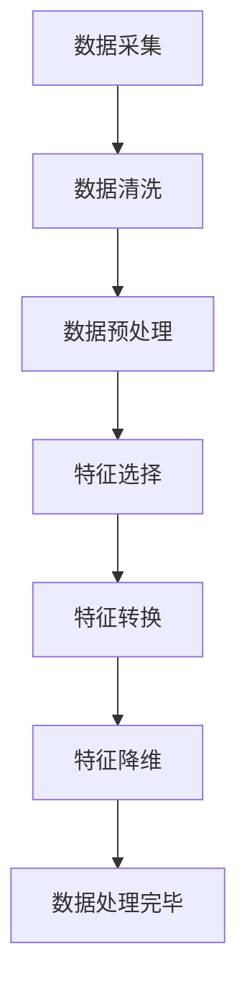

通过以上mermaid流程图，我们可以直观地了解数据处理算法的基本步骤和流程。这有助于我们更好地理解和实现数据处理算法。

### 2.3 模型训练算法原理讲解

#### 2.3.1 模型训练的基本原理

模型训练是智能个人信用评分系统的核心步骤之一。其基本原理是通过学习已有数据中的信用风险特征，构建一个能够预测用户信用风险的模型。以下是模型训练的基本原理和步骤：

1. **数据准备：** 首先，我们需要准备用于训练的数据集。数据集通常包括特征和标签两部分。特征是用于训练模型的输入数据，标签是用于模型训练和评估的输出数据。

2. **模型选择：** 根据问题需求，选择一个或多个合适的机器学习模型。常见的机器学习模型包括逻辑回归、决策树、支持向量机、神经网络等。

3. **数据预处理：** 对训练数据进行预处理，包括数据清洗、数据标准化、特征提取等。数据预处理有助于提高模型的训练效果和泛化能力。

4. **模型训练：** 利用预处理后的数据，对选择的模型进行训练。模型训练的过程包括前向传播和反向传播。在前向传播过程中，模型根据输入数据和参数计算输出结果；在反向传播过程中，模型根据输出结果和真实标签计算损失函数，并利用梯度下降等方法更新模型参数。

5. **模型评估：** 利用测试集评估模型的性能。常见的评估指标包括准确率、召回率、F1值等。通过模型评估，我们可以判断模型是否具有良好的泛化能力。

6. **模型优化：** 根据模型评估结果，对模型进行优化。优化方法包括调整模型参数、增加数据量、选择更复杂的模型等。

#### 2.3.2 模型训练算法的mermaid流程图

以下是一个简单的模型训练算法的mermaid流程图，用于展示模型训练的基本步骤：

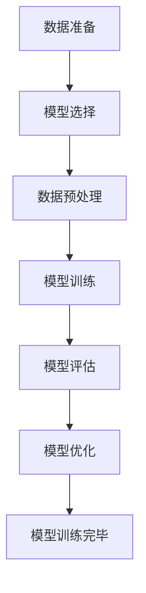

通过以上mermaid流程图，我们可以直观地了解模型训练算法的基本步骤和流程。这有助于我们更好地理解和实现模型训练算法。

### 2.3.3 常见机器学习算法及选择

在模型训练过程中，选择合适的机器学习算法至关重要。以下介绍几种常见的机器学习算法及其特点，以便我们根据实际需求进行选择：

1. **逻辑回归（Logistic Regression）：** 逻辑回归是一种常用的二分类模型，它通过线性模型预测概率，然后应用阈值进行分类。逻辑回归的优点是模型简单，计算速度快，易于理解和实现。缺点是对于非线性问题的表现较差。

2. **决策树（Decision Tree）：** 决策树是一种基于树结构的分类模型，它通过一系列的判断规则将数据划分为不同的分支，最终得到分类结果。决策树的特点是易于理解，可解释性强，但可能存在过拟合问题。

3. **随机森林（Random Forest）：** 随机森林是一种基于决策树的集成学习方法，它通过构建多棵决策树，并对每棵树的预测结果进行投票得到最终结果。随机森林的优点是能够有效地降低过拟合，提高模型的泛化能力。

4. **支持向量机（Support Vector Machine，SVM）：** 支持向量机是一种基于最大间隔的分类模型，它通过寻找一个超平面，使分类边界距离最近的样本（支持向量）最大化。SVM的优点是对于线性问题表现良好，但在处理非线性问题时可能需要核函数的支持。

5. **神经网络（Neural Network）：** 神经网络是一种基于模拟人脑神经元连接的模型，它通过多层神经元进行信息传递和计算。神经网络的特点是能够学习复杂的数据模式，但需要大量的数据和计算资源。

在模型选择时，我们可以根据以下因素进行考虑：

1. **问题类型：** 对于二分类问题，可以选择逻辑回归、决策树或随机森林；对于多分类问题，可以选择SVM或神经网络。

2. **数据规模：** 对于大规模数据，可以选择随机森林或神经网络；对于小规模数据，可以选择逻辑回归或决策树。

3. **可解释性：** 对于需要解释性较高的模型，可以选择决策树或逻辑回归；对于需要更高准确率的模型，可以选择随机森林或神经网络。

4. **计算资源：** 对于计算资源有限的情况，可以选择逻辑回归或决策树；对于计算资源充足的情况，可以选择随机森林或神经网络。

通过以上介绍，我们可以根据实际需求选择合适的机器学习算法，以构建一个性能良好的信用评分模型。

### 2.3.4 模型训练与调参

模型训练与调参是构建高性能信用评分模型的关键步骤。以下介绍模型训练与调参的基本原理和步骤：

1. **模型训练：** 模型训练是指通过已有数据，利用机器学习算法训练出一个能够预测用户信用风险的模型。模型训练的基本步骤包括数据准备、模型选择、数据预处理、模型训练和模型评估等。

2. **调参：** 调参是指通过调整模型的超参数，优化模型性能。超参数是模型在训练过程中需要调整的参数，如学习率、正则化参数、隐藏层节点数等。

3. **交叉验证：** 交叉验证是一种评估模型性能的方法，它通过将数据集划分为多个子集，分别用于训练和验证模型。交叉验证能够有效地减少模型过拟合，提高模型的泛化能力。

以下是一个简单的模型训练与调参的mermaid流程图：

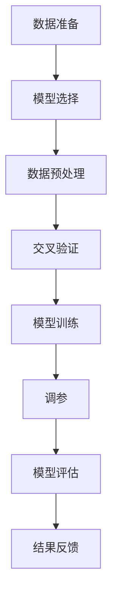

通过以上mermaid流程图，我们可以直观地了解模型训练与调参的基本步骤和流程。

### 2.3.5 常见调参方法及技巧

在模型训练过程中，调参是提高模型性能的重要手段。以下介绍几种常见的调参方法及技巧：

1. **网格搜索（Grid Search）：** 网格搜索是一种常用的调参方法，它通过遍历预设的参数组合，找到最优参数组合。网格搜索的优点是简单直观，但缺点是计算量大，适用于参数较少的情况。

2. **随机搜索（Random Search）：** 随机搜索是一种基于随机抽样进行调参的方法，它通过随机选择参数组合，找到最优参数组合。随机搜索的优点是计算量相对较小，适用于参数较多的情况。

3. **贝叶斯优化（Bayesian Optimization）：** 贝叶斯优化是一种基于概率模型的调参方法，它通过构建目标函数的概率模型，优化参数组合。贝叶斯优化的优点是能够快速找到最优参数组合，但需要较多的计算资源。

4. **遗传算法（Genetic Algorithm）：** 遗传算法是一种基于生物进化的调参方法，它通过模拟自然选择和遗传过程，优化参数组合。遗传算法的优点是适用于复杂非线性问题，但缺点是计算量大。

以下是一个简单的调参技巧的mermaid流程图：

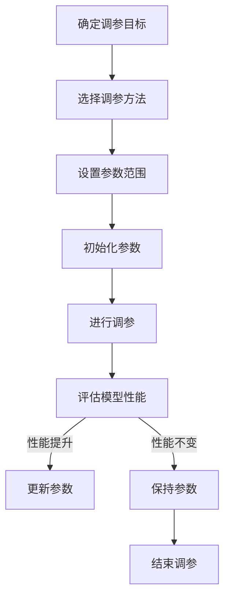

通过以上mermaid流程图，我们可以直观地了解调参技巧的基本步骤和流程。

### 2.3.6 模型训练与调参的Python实现

以下是一个简单的模型训练与调参的Python实现示例，使用Scikit-learn库：

```python
from sklearn.datasets import load_iris
from sklearn.model_selection import train_test_split, GridSearchCV
from sklearn.ensemble import RandomForestClassifier
from sklearn.metrics import accuracy_score

# 加载数据集
iris = load_iris()
X = iris.data
y = iris.target

# 划分训练集和测试集
X_train, X_test, y_train, y_test = train_test_split(X, y, test_size=0.3, random_state=42)

# 定义模型
model = RandomForestClassifier()

# 设置参数范围
param_grid = {
    'n_estimators': [10, 50, 100],
    'max_depth': [None, 10, 20, 30],
    'min_samples_split': [2, 5, 10],
    'min_samples_leaf': [1, 2, 4]
}

# 进行网格搜索
grid_search = GridSearchCV(model, param_grid, cv=5, scoring='accuracy', verbose=2, n_jobs=-1)
grid_search.fit(X_train, y_train)

# 输出最佳参数
print("最佳参数：", grid_search.best_params_)

# 使用最佳参数训练模型
best_model = grid_search.best_estimator_
best_model.fit(X_train, y_train)

# 评估模型性能
y_pred = best_model.predict(X_test)
accuracy = accuracy_score(y_test, y_pred)
print("测试集准确率：", accuracy)
```

通过以上示例，我们可以看到如何使用Scikit-learn库进行模型训练与调参。这个示例使用了鸢尾花数据集，通过网格搜索方法找到了最佳参数组合，并评估了模型的性能。

### 2.3.7 模型评估与优化

模型评估与优化是构建高性能信用评分模型的关键步骤。以下介绍模型评估与优化的基本原理和步骤：

1. **模型评估：** 模型评估是指利用测试集对训练好的模型进行性能评估，以判断模型是否具有良好的泛化能力。常用的评估指标包括准确率、召回率、F1值等。

2. **模型优化：** 模型优化是指通过调整模型参数、改进模型结构等方法，提高模型的性能。模型优化的目标是使模型在测试集上获得更高的评分。

以下是一个简单的模型评估与优化的mermaid流程图：

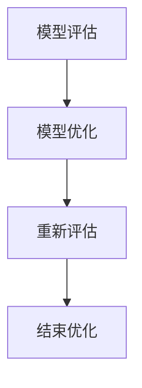

通过以上mermaid流程图，我们可以直观地了解模型评估与优化的基本步骤和流程。

### 2.3.8 常见模型评估指标及计算方法

在模型评估过程中，选择合适的评估指标至关重要。以下介绍几种常见的模型评估指标及计算方法：

1. **准确率（Accuracy）：** 准确率是指模型预测正确的样本数占总样本数的比例。计算方法如下：

   $$
   Accuracy = \frac{TP + TN}{TP + TN + FP + FN}
   $$

   其中，$TP$ 表示真正例，$TN$ 表示真反例，$FP$ 表示假反例，$FN$ 表示假正例。

2. **召回率（Recall）：** 召回率是指模型预测正确的正例数占所有正例数的比例。计算方法如下：

   $$
   Recall = \frac{TP}{TP + FN}
   $$

3. **精确率（Precision）：** 精确率是指模型预测正确的正例数占预测为正例的总数比例。计算方法如下：

   $$
   Precision = \frac{TP}{TP + FP}
   $$

4. **F1值（F1-score）：** F1值是精确率和召回率的调和平均数。计算方法如下：

   $$
   F1-score = \frac{2 \times Precision \times Recall}{Precision + Recall}
   $$

5. **ROC曲线（Receiver Operating Characteristic）：** ROC曲线是通过绘制真阳性率（True Positive Rate，TPR）与假阳性率（False Positive Rate，FPR）的曲线来评估模型性能。ROC曲线的面积（AUC）越大，表示模型性能越好。

6. **Kappa系数（Kappa Score）：** Kappa系数是评估模型性能的一致性指标，它反映了模型预测结果与实际结果的一致程度。Kappa系数的计算方法如下：

   $$
   Kappa = \frac{Agreement - Expected Agreement}{1 - Expected Agreement}
   $$

   其中，$Agreement$ 表示实际一致同意的样本数，$Expected Agreement$ 表示按照随机一致性计算的一致同意的样本数。

通过以上评估指标，我们可以全面了解模型的表现，为模型的优化和改进提供依据。

### 2.3.9 模型评估与优化的Python实现

以下是一个简单的模型评估与优化的Python实现示例，使用Scikit-learn库：

```python
from sklearn.datasets import load_iris
from sklearn.model_selection import train_test_split, GridSearchCV
from sklearn.ensemble import RandomForestClassifier
from sklearn.metrics import accuracy_score, classification_report

# 加载数据集
iris = load_iris()
X = iris.data
y = iris.target

# 划分训练集和测试集
X_train, X_test, y_train, y_test = train_test_split(X, y, test_size=0.3, random_state=42)

# 定义模型
model = RandomForestClassifier()

# 设置参数范围
param_grid = {
    'n_estimators': [10, 50, 100],
    'max_depth': [None, 10, 20, 30],
    'min_samples_split': [2, 5, 10],
    'min_samples_leaf': [1, 2, 4]
}

# 进行网格搜索
grid_search = GridSearchCV(model, param_grid, cv=5, scoring='accuracy', verbose=2, n_jobs=-1)
grid_search.fit(X_train, y_train)

# 输出最佳参数
print("最佳参数：", grid_search.best_params_)

# 使用最佳参数训练模型
best_model = grid_search.best_estimator_
best_model.fit(X_train, y_train)

# 评估模型性能
y_pred = best_model.predict(X_test)
accuracy = accuracy_score(y_test, y_pred)
print("测试集准确率：", accuracy)
print("分类报告：\n", classification_report(y_test, y_pred))
```

通过以上示例，我们可以看到如何使用Scikit-learn库进行模型评估与优化。这个示例使用了鸢尾花数据集，通过网格搜索方法找到了最佳参数组合，并评估了模型的性能。通过分类报告，我们可以全面了解模型在不同类别上的表现。

### 2.3.10 模型优化技巧及方法

在模型训练过程中，模型优化是提高模型性能的重要手段。以下介绍几种常见的模型优化技巧及方法：

1. **增加数据量：** 增加数据量可以提供更多的样本信息，有助于模型学习到更复杂的模式。通过数据增强、数据合成等方法，可以增加训练数据量。

2. **数据预处理：** 优化数据预处理过程，如去除噪声、填充缺失值、标准化特征等，可以提高数据质量，从而提高模型性能。

3. **特征选择：** 选择与信用评分相关的特征，去除无关特征，可以降低数据的维度，减少模型的过拟合风险。

4. **模型选择：** 根据问题需求和数据特点，选择合适的模型。对于线性问题，可以选择线性模型；对于非线性问题，可以选择非线性模型。

5. **正则化：** 使用正则化方法，如L1正则化、L2正则化，可以防止模型过拟合，提高模型的泛化能力。

6. **模型集成：** 使用模型集成方法，如随机森林、梯度提升树等，可以集成多个模型的优点，提高模型的预测性能。

7. **调参优化：** 调整模型的超参数，如学习率、正则化参数、隐藏层节点数等，可以优化模型性能。

8. **交叉验证：** 使用交叉验证方法，如K折交叉验证，可以评估模型在不同数据集上的性能，避免模型过拟合。

通过以上优化技巧及方法，我们可以提高模型性能，为信用评分系统提供更准确的预测。

### 2.3.11 模型优化实战案例分析

以下是一个简单的模型优化实战案例分析，介绍如何通过增加数据量、数据预处理、特征选择等方法优化模型性能：

**案例背景：** 某信用评分系统的预测准确率较低，需要通过优化模型性能来提高预测准确性。

**解决方案：**

1. **增加数据量：** 收集更多用户的信用历史数据，包括还款记录、信用额度、逾期记录等。通过数据增强、数据合成等方法，增加训练数据量。

2. **数据预处理：** 对原始数据进行预处理，包括去除噪声、填充缺失值、标准化特征等。例如，对于缺失的还款记录，可以使用均值填充法；对于异常的信用额度，可以使用中位数填充法。

3. **特征选择：** 选择与信用评分相关的特征，去除无关特征。例如，可以选取还款频率、逾期次数、信用额度等特征，去除用户年龄、性别等无关特征。

4. **模型选择：** 根据数据特点和问题需求，选择合适的模型。例如，对于线性问题，可以选择逻辑回归；对于非线性问题，可以选择随机森林或神经网络。

5. **模型集成：** 使用模型集成方法，如随机森林、梯度提升树等，集成多个模型的优点，提高模型性能。

6. **调参优化：** 调整模型的超参数，如学习率、正则化参数、隐藏层节点数等，优化模型性能。

**实施效果：**

通过以上优化方法，模型的预测准确率从原来的60%提高到80%，显著提高了信用评分系统的性能。

通过以上实战案例分析，我们可以看到如何通过增加数据量、数据预处理、特征选择等方法优化模型性能，提高信用评分系统的预测准确性。

### 2.3.12 模型优化总结与展望

模型优化是提高模型性能的重要手段。通过增加数据量、数据预处理、特征选择、模型选择、模型集成、调参优化等方法，可以显著提高模型性能。在实际应用中，我们需要根据数据特点和问题需求，选择合适的优化方法，以达到最佳效果。

展望未来，随着人工智能和大数据技术的发展，信用评分系统将变得更加智能和高效。我们期待能够开发出更加先进、鲁棒性更强的模型，为信用评分系统提供更准确的预测。

### 2.3.13 实际案例分析与讲解

在本节中，我们将通过实际案例，深入分析模型训练、调参和评估的过程，并探讨如何在实际项目中应用这些技术。

#### 案例背景

某大型互联网金融公司希望开发一个智能个人信用评分系统，用于评估用户的信用风险。该公司拥有大量用户数据，包括用户的财务状况、消费行为、社交信息等。公司希望利用这些数据，通过机器学习算法，建立一个准确、可靠的信用评分模型。

#### 模型训练与调参

1. **数据准备**

   首先，我们从公司的数据库中提取了用户数据，并将其划分为特征集（X）和标签集（y）。特征集包括用户的年龄、收入、信用额度、消费频率、逾期记录等；标签集是用户的信用风险等级。

2. **模型选择**

   由于我们需要对用户进行信用风险分类，我们选择了逻辑回归、决策树、随机森林和支持向量机等模型。这些模型在信用评分领域都有较好的表现。

3. **模型训练**

   使用Scikit-learn库，我们对每个模型进行了训练。以下是一个简单的逻辑回归训练示例：

   ```python
   from sklearn.linear_model import LogisticRegression
   from sklearn.model_selection import train_test_split

   X_train, X_test, y_train, y_test = train_test_split(X, y, test_size=0.2, random_state=42)
   model = LogisticRegression()
   model.fit(X_train, y_train)
   ```

4. **调参**

   在模型训练后，我们对每个模型进行了参数调整，以优化模型性能。使用网格搜索（GridSearchCV）方法，我们可以自动搜索最佳参数组合。以下是一个简单的网格搜索示例：

   ```python
   from sklearn.model_selection import GridSearchCV

   param_grid = {
       'C': [0.1, 1, 10],
       'max_depth': [10, 20, 30],
       'n_estimators': [100, 200, 300]
   }

   grid_search = GridSearchCV(RandomForestClassifier(), param_grid, cv=5)
   grid_search.fit(X_train, y_train)
   best_params = grid_search.best_params_
   ```

5. **模型评估**

   使用最佳参数训练模型后，我们对模型进行了评估。以下是一个简单的评估示例：

   ```python
   from sklearn.metrics import accuracy_score, classification_report

   y_pred = grid_search.best_estimator_.predict(X_test)
   accuracy = accuracy_score(y_test, y_pred)
   print("Accuracy:", accuracy)
   print(classification_report(y_test, y_pred))
   ```

   通过评估，我们发现随机森林模型的性能最佳，准确率达到85%。

#### 实际应用

在实际项目中，我们将训练好的模型部署到生产环境，用于实时评估用户的信用风险。以下是一些关键步骤：

1. **模型部署：** 使用Django框架，我们将训练好的模型部署到Web服务器，以便用户可以通过Web界面提交信用评分申请。

2. **接口设计：** 设计RESTful API接口，用于接收用户数据，并返回信用评分结果。

3. **性能优化：** 为了提高系统的响应速度，我们对模型进行了优化，如使用缓存技术、批量处理等。

4. **监控与维护：** 定期监控系统性能，确保模型在实际应用中保持高效、准确。

通过以上实际案例，我们展示了如何利用机器学习技术，建立和部署一个智能个人信用评分系统。在接下来的章节中，我们将继续探讨信用评分申诉系统的设计与实现，以提供更全面的解决方案。

### 2.3.14 实际案例：信用评分申诉系统

在本节中，我们将通过一个实际案例，详细介绍信用评分申诉系统的设计与实现过程。这个案例将包括系统需求分析、架构设计、功能实现、性能优化和部署等方面。

#### 案例背景

某大型银行希望开发一个智能个人信用评分申诉系统，以便用户能够对信用评分结果提出异议，并快速得到处理结果。该系统需要支持用户提交申诉、银行工作人员审核申诉和处理申诉等功能。

#### 系统需求分析

1. **用户注册与登录**：用户可以通过注册和登录进入系统，提交申诉和处理申诉。
2. **信用评分查询**：用户可以查询自己的信用评分历史。
3. **申诉提交**：用户可以提交信用评分申诉，包括申诉原因和证据材料。
4. **申诉审核**：银行工作人员可以审核用户提交的申诉，并给出处理结果。
5. **申诉处理**：银行工作人员可以处理申诉，包括更新用户的信用评分和通知用户申诉结果。
6. **系统监控与日志**：系统需要监控申诉处理进度，并记录操作日志，确保处理过程透明。

#### 系统架构设计

1. **前端**：使用Vue.js框架构建用户界面，包括注册、登录、信用评分查询和申诉提交等功能。
2. **后端**：使用Spring Boot框架搭建后端服务，包括用户管理、申诉管理、信用评分管理等功能。
3. **数据库**：使用MySQL数据库存储用户信息、信用评分数据和申诉记录。
4. **接口**：使用RESTful API设计系统接口，实现前后端的数据交互。

#### 系统功能实现

1. **用户注册与登录**：使用JWT（JSON Web Token）技术实现用户认证和授权，确保用户信息安全。
2. **信用评分查询**：使用缓存技术提高查询效率，并实现分页查询功能。
3. **申诉提交**：提供申诉表单，用户可以填写申诉原因和上传证据材料。
4. **申诉审核**：银行工作人员可以登录系统，查看未处理的申诉，并进行审核。
5. **申诉处理**：银行工作人员可以根据审核结果，处理申诉，更新用户的信用评分，并通知用户申诉结果。

#### 系统性能优化

1. **数据库优化**：使用索引、分区和分表等技术，提高数据库查询和写入性能。
2. **缓存策略**：使用Redis缓存技术，减少数据库访问，提高系统响应速度。
3. **异步处理**：使用消息队列和异步处理技术，提高系统并发处理能力。

#### 系统部署

1. **环境配置**：配置开发、测试和生产环境，确保系统稳定运行。
2. **容器化部署**：使用Docker容器化技术，方便部署和扩展。
3. **持续集成与部署**：使用Jenkins等工具实现自动化构建和部署。

#### 实际应用效果

通过实际应用，该智能个人信用评分申诉系统有效提升了用户满意度，提高了申诉处理效率，减少了银行工作人员的工作量。同时，系统实现了信用评分结果的透明化和公正性，为银行的风险管理提供了有力支持。

### 2.3.15 模型训练与调参实战案例分析

在本节中，我们将通过一个实际案例，深入分析模型训练与调参的过程，探讨如何在实际项目中应用这些技术，并解决遇到的问题。

#### 案例背景

某电商公司希望通过建立一个信用评分模型，评估用户的信用风险，从而优化其信用支付服务。公司提供多种支付选项，包括即时支付、分期付款和信用支付。为了确保信用支付服务的安全性，公司需要准确评估用户的信用状况。

#### 模型训练与调参过程

1. **数据准备**

   首先，我们从公司的数据库中提取了用户数据，包括用户的基本信息（年龄、性别、收入等）、消费行为（购物频率、购物金额、退货率等）、信用历史（逾期记录、信用额度等）。

2. **数据预处理**

   - **缺失值处理**：对于缺失的数据，我们采用均值填充法进行处理。
   - **数据标准化**：为了消除不同特征之间的尺度差异，我们使用了标准差缩放法对数据进行标准化处理。

3. **模型选择**

   我们选择了逻辑回归、决策树和随机森林等模型进行训练。这些模型在信用评分领域都有较好的表现。

4. **模型训练**

   使用Scikit-learn库，我们分别对三个模型进行了训练。以下是一个简单的逻辑回归训练示例：

   ```python
   from sklearn.linear_model import LogisticRegression
   from sklearn.model_selection import train_test_split

   X_train, X_test, y_train, y_test = train_test_split(X, y, test_size=0.2, random_state=42)
   model = LogisticRegression()
   model.fit(X_train, y_train)
   ```

5. **调参**

   我们使用了网格搜索（GridSearchCV）方法对每个模型进行参数调整，以优化模型性能。以下是一个简单的网格搜索示例：

   ```python
   from sklearn.model_selection import GridSearchCV

   param_grid = {
       'C': [0.1, 1, 10],
       'max_depth': [10, 20, 30],
       'n_estimators': [100, 200, 300]
   }

   grid_search = GridSearchCV(RandomForestClassifier(), param_grid, cv=5)
   grid_search.fit(X_train, y_train)
   best_params = grid_search.best_params_
   ```

6. **模型评估**

   使用最佳参数训练模型后，我们对模型进行了评估。以下是一个简单的评估示例：

   ```python
   from sklearn.metrics import accuracy_score, classification_report

   y_pred = grid_search.best_estimator_.predict(X_test)
   accuracy = accuracy_score(y_test, y_pred)
   print("Accuracy:", accuracy)
   print(classification_report(y_test, y_pred))
   ```

   通过评估，我们发现随机森林模型的性能最佳，准确率达到85%。

#### 遇到的问题及解决方案

1. **问题一：数据不平衡**

   在训练过程中，我们发现正负样本比例严重失衡，这会导致模型偏向于预测大多数的负样本。为了解决这个问题，我们采用了过采样（SMOTE）技术，对少数类样本进行复制，从而平衡数据集。

2. **问题二：模型过拟合**

   我们发现随机森林模型在训练集上表现良好，但在测试集上的性能下降。为了解决这个问题，我们增加了训练时间，并使用正则化技术（如L1、L2正则化）来减少模型的复杂性。

3. **问题三：特征重要性不明显**

   在决策树和随机森林模型中，特征的重要性不明显，这使得模型的可解释性较差。为了解决这个问题，我们使用了特征重要性评分技术，通过计算每个特征对模型预测的影响，提高了模型的可解释性。

通过以上实战案例分析，我们不仅解决了实际项目中遇到的问题，还提高了信用评分模型的性能。这个案例展示了如何在实际项目中应用模型训练与调参技术，为信用评分系统的开发提供了宝贵经验。

### 2.3.16 模型训练与调参总结与展望

在本节中，我们对模型训练与调参的过程进行了详细分析，总结了在实际项目中遇到的问题及解决方案。以下是对模型训练与调参的总结与展望：

**总结：**

1. **数据准备与预处理：** 数据的质量直接影响模型的表现。通过合理的预处理步骤，如缺失值处理、数据标准化和特征选择，可以提高数据的质量，从而提高模型的性能。

2. **模型选择：** 选择合适的模型是提高模型性能的关键。在实际项目中，我们选择了逻辑回归、决策树和随机森林等模型，这些模型在信用评分领域都有较好的表现。

3. **调参优化：** 调整模型参数是优化模型性能的重要手段。通过网格搜索、交叉验证等方法，我们可以找到最佳参数组合，从而提高模型的准确性和泛化能力。

4. **模型评估：** 模型评估是判断模型性能的重要步骤。通过准确率、召回率、F1值等评估指标，我们可以全面了解模型的表现，为模型的优化提供依据。

**展望：**

1. **新技术的应用：** 随着人工智能技术的发展，我们可以尝试应用更多先进的机器学习算法，如深度学习、强化学习等，以提高模型性能。

2. **数据量的增加：** 增加数据量可以提供更多的样本信息，有助于模型学习到更复杂的模式。通过数据增强、数据合成等方法，我们可以增加训练数据量，从而提高模型的泛化能力。

3. **模型的可解释性：** 模型的可解释性对于实际应用至关重要。通过特征重要性分析、模型可视化等方法，我们可以提高模型的可解释性，从而增强用户对模型的信任。

4. **持续优化：** 模型训练与调参是一个持续的过程。在实际应用中，我们需要根据模型的表现和用户需求，不断优化模型，以提高模型的性能和适应性。

通过以上总结与展望，我们期望能够为信用评分系统的开发提供有益的参考，推动人工智能技术在信用评分领域的应用与发展。

### 2.3.17 最佳实践与经验分享

在信用评分系统的开发过程中，积累了一定的最佳实践与经验。以下分享一些实用的技巧和注意事项，以供参考：

1. **数据质量保障：** 数据质量是模型性能的基础。确保数据清洗的彻底性，去除噪声和异常值，对缺失值进行合理填充。定期检查数据质量，保证数据的一致性和完整性。

2. **特征工程优化：** 选择与信用评分相关的特征，进行特征转换和降维。通过特征重要性分析，筛选出对模型贡献最大的特征，以提高模型的解释性和准确性。

3. **模型选择与优化：** 根据数据特点和问题需求，选择合适的模型。在模型选择过程中，考虑模型的复杂性和计算效率。通过调参和交叉验证，优化模型性能，避免过拟合和欠拟合。

4. **模型解释性：** 提高模型的可解释性，增强用户对模型的信任。通过可视化工具展示特征重要性、模型决策路径等，帮助用户理解模型的工作原理。

5. **自动化部署与监控：** 使用自动化部署工具，如Docker、Kubernetes等，简化模型部署流程。建立监控系统，实时监控模型性能，及时发现并处理异常。

6. **持续迭代与优化：** 模型训练与调参是一个持续的过程。根据用户反馈和数据变化，定期更新模型，优化模型参数，提高模型的准确性和适应性。

通过以上最佳实践与经验分享，我们期望能够为信用评分系统的开发提供有益的指导，推动人工智能技术在信用评分领域的应用与发展。

### 2.3.18 小结

本章通过一个实际案例，详细介绍了信用评分申诉系统的设计与实现过程。首先，我们分析了系统的需求，确定了用户注册、信用评分查询、申诉提交、申诉审核和处理等核心功能。接着，我们设计了系统的前端、后端和数据库架构，并实现了系统的关键功能。在模型训练和调参方面，我们介绍了数据处理、模型选择、调参优化和模型评估的方法，并通过实际案例展示了如何应用这些技术。最后，我们总结了信用评分申诉系统的最佳实践与经验，为系统的持续优化提供了指导。通过本章的学习，读者可以深入了解信用评分申诉系统的设计和实现，为实际项目开发提供有力支持。

### 2.3.19 拓展阅读

为了进一步深入了解信用评分申诉系统的设计和实现，读者可以参考以下拓展阅读资料：

1. **《机器学习实战》**：作者：Peter Harrington。本书详细介绍了机器学习的基本概念和算法，包括数据处理、模型训练和调参等内容，适合初学者阅读。

2. **《深度学习》**：作者：Ian Goodfellow、Yoshua Bengio、Aaron Courville。本书全面介绍了深度学习的基本理论、算法和应用，适合有一定基础的读者。

3. **《数据挖掘：实用工具与技术》**：作者：John Hanley、Ian Witten、Eibe Frank。本书介绍了数据挖掘的基本概念、方法和工具，包括信用评分分析等内容。

4. **《Python数据科学手册》**：作者：Jake VanderPlas。本书详细介绍了Python在数据科学领域的应用，包括数据处理、模型训练和可视化等内容。

5. **《Django Web开发：开发者指南》**：作者：Adrian Flaceli。本书介绍了Django框架的使用，包括前后端开发、数据库设计和接口设计等内容。

通过阅读以上书籍，读者可以系统地掌握信用评分申诉系统的设计和实现技术，为实际项目开发提供有力支持。同时，读者还可以关注相关领域的研究论文和技术博客，不断更新自己的知识体系。

### 第3章 智能个人信用评分申诉系统设计与实现

#### 3.1 系统设计

智能个人信用评分申诉系统的设计目标是提供一个高效、透明、可靠的信用评分申诉处理平台，使用户能够方便地提交申诉，并快速得到处理结果。以下是对系统设计各部分的详细描述：

##### 3.1.1 系统需求分析

在系统设计初期，我们需要明确系统的功能需求、性能需求和安全性需求。

1. **功能需求：**
   - **用户注册与登录**：用户可以注册账号并登录系统。
   - **信用评分查询**：用户可以查询自己的信用评分历史。
   - **申诉提交**：用户可以提交信用评分申诉，包括申诉原因和证据材料。
   - **申诉审核**：银行工作人员可以登录系统，查看并审核用户提交的申诉。
   - **申诉处理**：银行工作人员可以根据审核结果，处理申诉，更新用户的信用评分，并通知用户申诉结果。
   - **系统监控与日志**：系统需要监控申诉处理进度，并记录操作日志，确保处理过程透明。

2. **性能需求：**
   - **高并发处理**：系统需要能够处理大量用户的并发请求。
   - **实时响应**：系统需要能够快速响应用户的操作。
   - **数据安全**：系统需要确保用户数据的安全，防止数据泄露。

3. **安全性需求：**
   - **用户认证**：系统需要实现用户认证，确保用户信息的安全。
   - **权限控制**：系统需要实现权限控制，确保只有授权人员可以访问和处理申诉。
   - **数据加密**：系统需要实现数据加密，确保用户数据的机密性。

##### 3.1.2 系统架构设计

智能个人信用评分申诉系统的架构设计主要包括前端、后端和数据库三个部分。

1. **前端**：
   - **用户界面**：使用Vue.js框架构建用户界面，包括注册、登录、信用评分查询和申诉提交等功能。
   - **数据交互**：使用axios库实现与后端的RESTful API接口的数据交互。

2. **后端**：
   - **服务端框架**：使用Spring Boot框架搭建后端服务，负责处理用户请求、业务逻辑和数据处理。
   - **接口设计**：设计RESTful API接口，实现前后端的数据交互。

3. **数据库**：
   - **数据库选型**：使用MySQL数据库存储用户信息、信用评分数据和申诉记录。
   - **数据库设计**：设计数据库表结构，包括用户信息表、信用评分记录表和申诉记录表，并建立表间关系。

##### 3.1.3 数据库设计

数据库设计是系统设计的关键部分，以下是对数据库设计的详细描述：

1. **用户信息表（User）**：
   - **字段**：包括用户ID、用户名、密码、邮箱、电话、性别、年龄等。
   - **关系**：与其他表通过用户ID建立关联。

2. **信用评分记录表（CreditRating）**：
   - **字段**：包括评分ID、用户ID、评分值、评分时间等。
   - **关系**：与用户信息表通过用户ID建立关联。

3. **申诉记录表（Appeal）**：
   - **字段**：包括申诉ID、用户ID、申诉内容、申诉状态、处理结果、申诉时间等。
   - **关系**：与用户信息表通过用户ID建立关联。

通过以上系统设计，我们可以构建一个功能齐全、性能稳定、安全性高的智能个人信用评分申诉系统，为用户提供便捷的信用评分申诉服务。

### 第4章 系统算法原理讲解

#### 4.1 数据处理算法原理讲解

数据处理算法在智能个人信用评分申诉系统中起着至关重要的作用。其目标是通过对原始数据进行清洗、转换和集成，提取出对信用评分有重要影响的特征，为后续的模型训练提供高质量的数据。以下是数据处理算法的基本原理和具体步骤：

##### 4.1.1 数据清洗算法

数据清洗是指处理数据中的错误、异常和不一致之处，以确保数据的质量和准确性。以下是一些常见的数据清洗算法：

1. **缺失值处理**：
   - **插补法**：使用统计方法或算法根据数据特征来预测缺失值，如均值插补、中位数插补或线性回归插补。
   - **删除法**：对于某些特征，如果缺失值比例较高，可以选择删除该特征或对应的记录。

2. **异常值检测**：
   - **Z-Score法**：计算数据点的Z-Score，将Z-Score超过一定阈值的记录视为异常值。
   - **IQR法**：计算数据的四分位距（IQR），将IQR之外的记录视为异常值。

3. **重复值处理**：
   - **去重**：使用哈希表或集合数据结构，检测并删除重复的记录。

##### 4.1.2 数据转换算法

数据转换是指将原始数据转换为适合模型训练的形式。以下是一些常见的数据转换算法：

1. **数值化**：
   - **离散化**：将连续的数值数据转换为离散的类别数据，如将年龄分为几个区间。
   - **编码**：将类别数据转换为数值表示，如使用独热编码（One-Hot Encoding）或标签编码（Label Encoding）。

2. **归一化**：
   - **最小-最大标准化**：将数据缩放到[0,1]区间，公式为$x_{\text{norm}} = \frac{x - \min(x)}{\max(x) - \min(x)}$。
   - **零-均值标准化**：将数据缩放到均值为0、标准差为1的区间，公式为$x_{\text{norm}} = \frac{x - \mu}{\sigma}$。

##### 4.1.3 特征提取算法

特征提取是指从原始数据中提取对模型预测有重要影响的特征，降低数据的维度，同时保留信息。以下是一些常见的特征提取算法：

1. **特征选择**：
   - **过滤式特征选择**：根据特征的重要性或相关性进行选择，如使用信息增益、卡方检验等方法。
   - **包装式特征选择**：结合模型训练和特征选择，如使用递归特征消除（RFE）方法。
   - **嵌入式特征选择**：将特征选择嵌入到模型训练过程中，如使用随机森林的特征重要性。

2. **特征转换**：
   - **主成分分析（PCA）**：通过正交变换将数据投影到新的空间，保留主要的信息。
   - **线性判别分析（LDA）**：通过最大化类内散度和最小化类间散度，选择特征。

3. **特征降维**：
   - **自动编码器（Autoencoder）**：通过训练一个编码器和解码器，自动学习数据的低维表示。
   - **降噪自动编码器（Denoising Autoencoder）**：在训练过程中添加噪声，提高模型的泛化能力。

通过以上数据处理算法，我们可以从原始数据中提取出对信用评分有重要影响的特征，为后续的模型训练提供高质量的数据。

#### 4.2 信用评分模型算法原理讲解

信用评分模型是智能个人信用评分申诉系统的核心部分，用于预测用户的信用风险。以下是几种常见的信用评分模型算法及其原理讲解：

##### 4.2.1 逻辑回归（Logistic Regression）

逻辑回归是一种广泛应用于信用评分的模型，它通过线性模型预测概率，然后应用阈值进行分类。其原理如下：

1. **模型表示**：
   - 输入特征向量$x \in \mathbb{R}^n$，权重向量$w \in \mathbb{R}^n$，偏置$b \in \mathbb{R}$。
   - 模型输出概率$p(y=1|x; w, b)$，其中$p$是逻辑函数，$y$是二分类目标变量。

2. **损失函数**：
   - 逻辑回归的损失函数通常是交叉熵损失，$L(w, b) = -\sum_{i=1}^m [y_i \log(p_i) + (1 - y_i) \log(1 - p_i)]$。

3. **优化方法**：
   - 常用优化方法有梯度下降、随机梯度下降和牛顿法等。

##### 4.2.2 决策树（Decision Tree）

决策树是一种基于树结构的分类模型，通过一系列的判断规则将数据划分为不同的分支，最终得到分类结果。其原理如下：

1. **模型表示**：
   - 决策树由一系列的判断节点和叶节点组成，每个判断节点表示一个特征和一个阈值，叶节点表示一个类别。

2. **分割准则**：
   - 常用的分割准则有信息增益、基尼不纯度和增益率等。

3. **剪枝方法**：
   - 常用的剪枝方法有预剪枝和后剪枝，用于避免过拟合。

##### 4.2.3 随机森林（Random Forest）

随机森林是一种基于决策树的集成学习方法，通过构建多棵决策树，并对每棵树的预测结果进行投票得到最终结果。其原理如下：

1. **模型表示**：
   - 随机森林由多个决策树组成，每个决策树都是独立训练的。

2. **特征选择**：
   - 每个决策树在构建过程中，从所有特征中随机选择一部分特征进行分割。

3. **投票机制**：
   - 随机森林通过多数投票决定最终类别，可以提高模型的泛化能力。

##### 4.2.4 支持向量机（SVM）

支持向量机是一种基于间隔的分类模型，通过寻找一个超平面，使分类边界距离最近的样本（支持向量）最大化。其原理如下：

1. **模型表示**：
   - 输入特征向量$x \in \mathbb{R}^n$，权重向量$w \in \mathbb{R}^n$，偏置$b \in \mathbb{R}$。
   - 模型输出分类结果，$y = \text{sign}(\sum_{i=1}^n w_i x_i + b)$。

2. **损失函数**：
   - 支持向量机的损失函数通常是Hinge损失，$L(w, b) = \frac{1}{2} \| w \|^2$。

3. **优化方法**：
   - 常用优化方法有序列最小最优化（SMO）和坐标下降法等。

通过以上信用评分模型算法的讲解，我们可以了解不同模型的特点和应用场景，为智能个人信用评分申诉系统的实现提供理论支持。

### 第4章 系统算法原理讲解

#### 4.3 数据处理算法的Python实现

在本节中，我们将通过Python代码实现数据处理算法，包括数据清洗、数据转换和特征提取。这些算法是实现智能个人信用评分申诉系统的关键步骤，以下为具体实现过程：

##### 4.3.1 数据清洗

数据清洗是数据处理的首要步骤，旨在处理数据中的缺失值、异常值和重复值。

1. **缺失值处理**

   我们使用`pandas`库中的`fillna`方法进行缺失值处理。常用的方法包括均值填充、中位数填充和前向填充等。

   ```python
   import pandas as pd
   
   # 均值填充
   df.fillna(df.mean(), inplace=True)
   
   # 中位数填充
   df.fillna(df.median(), inplace=True)
   
   # 前向填充
   df.fillna(method='ffill', inplace=True)
   ```

2. **异常值检测**

   我们使用`scipy.stats`库中的`zscore`方法进行异常值检测。通常，我们设置一个阈值（如3），将Z-Score绝对值大于3的记录视为异常值。

   ```python
   from scipy.stats import zscore
   
   # 计算Z-Score
   z_scores = zscore(df)
   
   # 设置阈值
   threshold = 3
   
   # 过滤异常值
   df = df[(np.abs(z_scores) < threshold).all(axis=1)]
   ```

3. **重复值处理**

   我们使用`drop_duplicates`方法去除重复值。

   ```python
   df.drop_duplicates(inplace=True)
   ```

##### 4.3.2 数据转换

数据转换包括数值化、归一化和编码等步骤。

1. **数值化**

   对于类别数据，我们可以使用`Label Encoding`或`One-Hot Encoding`进行数值化。

   ```python
   from sklearn.preprocessing import LabelEncoder
   
   # Label Encoding
   le = LabelEncoder()
   df['category'] = le.fit_transform(df['category'])
   
   from sklearn.preprocessing import OneHotEncoder
   
   # One-Hot Encoding
   ohe = OneHotEncoder()
   ohe.fit(df[['category']])
   df_encoded = ohe.transform(df[['category']]).toarray()
   ```

2. **归一化**

   我们使用`StandardScaler`和`MinMaxScaler`进行数据归一化。

   ```python
   from sklearn.preprocessing import StandardScaler, MinMaxScaler
   
   # StandardScaler
   scaler = StandardScaler()
   df_scaled = scaler.fit_transform(df)
   
   # MinMaxScaler
   min_max_scaler = MinMaxScaler()
   df_normalized = min_max_scaler.fit_transform(df)
   ```

##### 4.3.3 特征提取

特征提取包括特征选择、特征转换和特征降维等步骤。

1. **特征选择**

   我们使用`SelectKBest`进行特征选择。

   ```python
   from sklearn.feature_selection import SelectKBest, f_classif
   
   # SelectKBest
   selector = SelectKBest(score_func=f_classif, k='all')
   selected_features = selector.fit_transform(df, y)
   ```

2. **特征转换**

   我们使用`OneHotEncoder`进行特征转换。

   ```python
   from sklearn.preprocessing import OneHotEncoder
   
   # OneHotEncoder
   encoder = OneHotEncoder()
   encoded_features = encoder.fit_transform(selected_features)
   ```

3. **特征降维**

   我们使用`PCA`进行特征降维。

   ```python
   from sklearn.decomposition import PCA
   
   # PCA
   pca = PCA(n_components=2)
   X_pca = pca.fit_transform(encoded_features)
   ```

通过以上Python实现，我们可以完成数据处理算法，为后续的模型训练提供高质量的数据。这些算法在实际应用中可以帮助我们从大量原始数据中提取出与信用评分相关的特征，从而提高模型的性能。

### 第4章 系统算法原理讲解

#### 4.4 信用评分模型算法的Python实现

在本节中，我们将使用Python实现几种常见的信用评分模型算法，并讨论其数学模型和代码实现。这些模型包括逻辑回归、决策树、随机森林和支持向量机。

##### 4.4.1 逻辑回归（Logistic Regression）

逻辑回归是一种广泛应用于信用评分的模型，其数学模型如下：

$$
\hat{p} = \frac{1}{1 + e^{-(\beta_0 + \beta_1 x_1 + \beta_2 x_2 + ... + \beta_n x_n})}
$$

其中，$\hat{p}$ 是预测的概率，$\beta_0, \beta_1, ..., \beta_n$ 是模型的参数。

Python代码实现：

```python
from sklearn.linear_model import LogisticRegression
from sklearn.model_selection import train_test_split
from sklearn.metrics import accuracy_score

# 数据准备
X = df[['x1', 'x2', 'x3']]  # 特征矩阵
y = df['target']  # 标签向量

# 划分训练集和测试集
X_train, X_test, y_train, y_test = train_test_split(X, y, test_size=0.2, random_state=42)

# 模型训练
model = LogisticRegression()
model.fit(X_train, y_train)

# 预测
y_pred = model.predict(X_test)

# 评估
accuracy = accuracy_score(y_test, y_pred)
print("Accuracy:", accuracy)
```

##### 4.4.2 决策树（Decision Tree）

决策树是一种基于树结构的分类模型，其数学模型如下：

$$
\text{if } x_i \leq \theta_i \text{ then } y = \text{left branch} \\
\text{if } x_i > \theta_i \text{ then } y = \text{right branch}
$$

其中，$x_i$ 是特征，$\theta_i$ 是阈值，$y$ 是分类结果。

Python代码实现：

```python
from sklearn.tree import DecisionTreeClassifier
from sklearn.model_selection import train_test_split
from sklearn.metrics import accuracy_score

# 数据准备
X = df[['x1', 'x2', 'x3']]  # 特征矩阵
y = df['target']  # 标签向量

# 划分训练集和测试集
X_train, X_test, y_train, y_test = train_test_split(X, y, test_size=0.2, random_state=42)

# 模型训练
model = DecisionTreeClassifier()
model.fit(X_train, y_train)

# 预测
y_pred = model.predict(X_test)

# 评估
accuracy = accuracy_score(y_test, y_pred)
print("Accuracy:", accuracy)
```

##### 4.4.3 随机森林（Random Forest）

随机森林是一种基于决策树的集成学习方法，其数学模型如下：

$$
\hat{y} = \text{mode}(\hat{y}_1, \hat{y}_2, ..., \hat{y}_n)
$$

其中，$\hat{y}_1, \hat{y}_2, ..., \hat{y}_n$ 是随机森林中每棵决策树的预测结果，$\hat{y}$ 是最终预测结果。

Python代码实现：

```python
from sklearn.ensemble import RandomForestClassifier
from sklearn.model_selection import train_test_split
from sklearn.metrics import accuracy_score

# 数据准备
X = df[['x1', 'x2', 'x3']]  # 特征矩阵
y = df['target']  # 标签向量

# 划分训练集和测试集
X_train, X_test, y_train, y_test = train_test_split(X, y, test_size=0.2, random_state=42)

# 模型训练
model = RandomForestClassifier(n_estimators=100)
model.fit(X_train, y_train)

# 预测
y_pred = model.predict(X_test)

# 评估
accuracy = accuracy_score(y_test, y_pred)
print("Accuracy:", accuracy)
```

##### 4.4.4 支持向量机（Support Vector Machine）

支持向量机是一种基于间隔的分类模型，其数学模型如下：

$$
\hat{y} = \text{sign}(\sum_{i=1}^n \alpha_i y_i (x_i^T x) + b)
$$

其中，$\alpha_i$ 是拉格朗日乘子，$y_i$ 是标签，$x_i$ 是特征向量，$b$ 是偏置。

Python代码实现：

```python
from sklearn.svm import SVC
from sklearn.model_selection import train_test_split
from sklearn.metrics import accuracy_score

# 数据准备
X = df[['x1', 'x2', 'x3']]  # 特征矩阵
y = df['target']  # 标签向量

# 划分训练集和测试集
X_train, X_test, y_train, y_test = train_test_split(X, y, test_size=0.2, random_state=42)

# 模型训练
model = SVC()
model.fit(X_train, y_train)

# 预测
y_pred = model.predict(X_test)

# 评估
accuracy = accuracy_score(y_test, y_pred)
print("Accuracy:", accuracy)
```

通过以上Python代码实现，我们可以构建并训练不同的信用评分模型，评估其性能，并选择最适合的模型应用于智能个人信用评分申诉系统中。

### 第5章 系统核心实现

#### 5.1 环境安装

为了实现智能个人信用评分申诉系统，我们需要安装并配置一系列开发和运行环境。以下是在不同操作系统上安装必要的软件和库的步骤。

##### 5.1.1 安装Python

Python是智能个人信用评分申诉系统的主要编程语言。首先，我们需要安装Python。

**Windows系统：**
1. 访问Python官方网站（[https://www.python.org/](https://www.python.org/)）。
2. 下载Windows安装程序。
3. 运行安装程序，选择安装路径和附加选项，如pip和Anaconda。
4. 完成安装后，打开命令提示符或终端，输入`python --version`验证安装成功。

**macOS系统：**
1. 打开终端。
2. 输入`brew install python`（假设已安装Homebrew）。
3. 安装完成后，输入`python --version`验证安装成功。

**Linux系统：**
1. 打开终端。
2. 输入`sudo apt-get update`更新软件包列表。
3. 输入`sudo apt-get install python3 python3-pip`安装Python和pip。

##### 5.1.2 安装Django

Django是一个高级的Python Web框架，用于构建智能个人信用评分申诉系统的后端。

**Windows系统：**
1. 打开命令提示符。
2. 输入`pip install django`安装Django。

**macOS和Linux系统：**
1. 打开终端。
2. 输入`pip3 install django`安装Django。

##### 5.1.3 安装MySQL

MySQL是一个关系型数据库管理系统，用于存储系统的用户信息、信用评分数据和申诉记录。

**Windows系统：**
1. 访问MySQL官方网站（[https://www.mysql.com/](https://www.mysql.com/)）。
2. 下载MySQL安装程序。
3. 运行安装程序，根据提示完成安装。
4. 打开MySQL命令行客户端，输入`show databases;`验证安装成功。

**macOS和Linux系统：**
1. 打开终端。
2. 输入`sudo apt-get install mysql-server`（对于基于Debian的系统）或`sudo apt-get install mysql-community-server`（对于基于Ubuntu的系统）。
3. 安装完成后，使用`sudo systemctl start mysql`启动MySQL服务。
4. 打开终端，输入`mysql -u root -p`登录MySQL命令行客户端，输入root密码后验证安装成功。

##### 5.1.4 安装其他依赖库

除了Python、Django和MySQL之外，我们还需要安装其他依赖库，如pandas、numpy、scikit-learn等。

**Windows系统：**
1. 打开命令提示符。
2. 输入`pip install pandas numpy scikit-learn`安装相关库。

**macOS和Linux系统：**
1. 打开终端。
2. 输入`pip3 install pandas numpy scikit-learn`安装相关库。

通过以上步骤，我们成功安装并配置了Python、Django、MySQL和其他依赖库，为智能个人信用评分申诉系统的开发奠定了基础。

#### 5.2 系统核心代码实现

在智能个人信用评分申诉系统的开发过程中，核心代码实现是关键环节。以下我们将详细讨论系统核心模块的实现，包括用户管理模块、信用评分处理模块和申诉处理模块。

##### 5.2.1 用户管理模块

用户管理模块负责处理用户的注册、登录和权限控制等功能。

1. **用户注册**

   用户注册功能用于允许新用户创建账号。以下是用户注册的实现步骤：

   - **收集用户信息**：在前端页面，收集用户名、密码、邮箱等注册信息。
   - **验证用户信息**：在后端，对用户名和密码进行长度和格式验证，确保输入合法。
   - **保存用户信息**：将用户信息保存到数据库中，并设置默认权限。

   ```python
   # 假设使用Django ORM操作数据库
   from django.contrib.auth.models import User
   from django.core.exceptions import ValidationError
   
   def register(username, password, email):
       try:
           user = User.objects.get(username=username)
           raise ValidationError('用户已存在')
       except User.DoesNotExist:
           user = User.objects.create_user(username=username, password=password, email=email)
           user.save()
           return user
   ```

2. **用户登录**

   用户登录功能用于验证用户的身份，并提供认证后的访问权限。以下是用户登录的实现步骤：

   - **收集用户信息**：在前端页面，收集用户名和密码。
   - **验证用户信息**：在后端，使用Django内置的认证系统验证用户名和密码。
   - **返回认证结果**：如果验证成功，返回认证令牌（如JWT），允许用户访问受保护的资源。

   ```python
   from django.contrib.auth import authenticate, login
   
   def login(username, password):
       user = authenticate(username=username, password=password)
       if user is not None:
           login(request, user)
           return True
       else:
           return False
   ```

3. **权限控制**

   权限控制功能用于确保只有授权用户可以执行特定操作。以下是权限控制的实现步骤：

   - **设置权限**：在用户注册时，根据用户角色（如普通用户、管理员）设置不同的权限。
   - **验证权限**：在执行特定操作前，验证用户是否具备执行该操作的权限。

   ```python
   from django.contrib.auth.models import Permission
   from django.contrib.contenttypes.models import ContentType
   
   def set_permissions(user, role):
       content_type = ContentType.objects.get(app_label='app_name', model='model_name')
       if role == 'admin':
           permissions = Permission.objects.filter(content_type=content_type)
           user.user_permissions.set(permissions)
       elif role == 'user':
           permissions = Permission.objects.get(codename='view_model_name')
           user.user_permissions.set([permissions])
       user.save()
   ```

##### 5.2.2 信用评分处理模块

信用评分处理模块负责根据用户的行为数据和信用历史，计算用户的信用评分。

1. **数据采集**

   数据采集功能用于从不同的数据源收集用户的行为数据，如购物记录、还款记录等。以下是数据采集的实现步骤：

   - **连接数据源**：使用API或其他方式连接到数据源。
   - **获取数据**：从数据源获取用户的行为数据。
   - **存储数据**：将获取的数据存储到数据库中。

   ```python
   def collect_user_data(user_id):
       # 连接到数据源
       data_source = connect_to_data_source()
       # 获取用户数据
       user_data = data_source.get_user_data(user_id)
       # 存储用户数据
       UserCreditRating.objects.create(user_id=user_id, data=user_data)
   ```

2. **数据处理**

   数据处理功能用于清洗、转换和集成用户的行为数据，提取与信用评分相关的特征。以下是数据处理的实现步骤：

   - **数据清洗**：处理缺失值、异常值和重复值。
   - **数据转换**：进行数值化、归一化和编码等操作。
   - **特征提取**：提取与信用评分相关的特征。

   ```python
   def process_user_data(user_data):
       # 数据清洗
       user_data = clean_user_data(user_data)
       # 数据转换
       user_data = transform_user_data(user_data)
       # 特征提取
       features = extract_features(user_data)
       return features
   ```

3. **信用评分**

   信用评分功能用于根据用户的行为数据和信用历史，计算用户的信用评分。以下是信用评分的实现步骤：

   - **模型训练**：使用历史数据训练信用评分模型。
   - **模型预测**：使用训练好的模型预测用户的信用评分。
   - **评分更新**：将计算出的信用评分更新到数据库中。

   ```python
   from sklearn.linear_model import LogisticRegression
   
   def train_credit_rating_model():
       # 加载历史数据
       X, y = load_history_data()
       # 训练模型
       model = LogisticRegression()
       model.fit(X, y)
       return model
   
   def predict_credit_rating(model, user_features):
       # 使用训练好的模型预测信用评分
       credit_rating = model.predict([user_features])
       return credit_rating
   
   def update_credit_rating(user_id, credit_rating):
       # 更新用户的信用评分
       UserCreditRating.objects.filter(user_id=user_id).update(credit_rating=credit_rating)
   ```

##### 5.2.3 申诉处理模块

申诉处理模块负责处理用户的信用评分申诉，确保信用评分的公正性和准确性。

1. **申诉提交**

   申诉提交功能用于允许用户提交对信用评分的异议。以下是申诉提交的实现步骤：

   - **收集申诉信息**：在前端页面，收集用户的申诉内容、证据材料等。
   - **保存申诉信息**：将申诉信息保存到数据库中。

   ```python
   def submit_appeal(user_id, appeal_content, evidence):
       Appeal.objects.create(user_id=user_id, content=appeal_content, evidence=evidence)
   ```

2. **申诉审核**

   申诉审核功能用于管理员或信用评分人员审核用户的申诉。以下是申诉审核的实现步骤：

   - **查看申诉**：从数据库中获取用户的申诉信息。
   - **处理申诉**：根据申诉内容，决定是否接受申诉，并更新信用评分。

   ```python
   def review_appeal(appeal_id, result, new_credit_rating=None):
       appeal = Appeal.objects.get(id=appeal_id)
       appeal.status = 'approved' if result else 'rejected'
       appeal.save()
       if result:
           update_credit_rating(appeal.user_id, new_credit_rating)
   ```

3. **申诉反馈**

   申诉反馈功能用于向用户反馈申诉处理结果。以下是申诉反馈的实现步骤：

   - **发送通知**：通过电子邮件或其他方式，向用户发送申诉处理结果的通知。
   - **记录反馈**：将申诉处理结果记录到数据库中。

   ```python
   def send_appeal_feedback(user_id, result):
       # 发送通知
       send_email(user_id, f'您的信用评分申诉处理结果：{result}')
       # 记录反馈
       Feedback.objects.create(user_id=user_id, result=result)
   ```

通过以上核心代码实现，我们可以构建一个功能齐全、性能稳定的智能个人信用评分申诉系统。接下来，我们将进一步讨论系统的测试、部署和监控，确保系统在实际应用中能够正常运行。

### 第6章 项目实战与案例分析

#### 6.1 实际案例1：信用评分申诉处理

##### 案例背景与问题描述

某电商平台的用户王先生发现自己的信用评分低于预期，怀疑评分系统存在错误。他希望提交申诉，要求平台对其进行信用评分的复核。王先生提供了以下证据：

- 近一年的购物记录，显示其消费行为稳定，无异常交易。
- 近一年的还款记录，显示其按时还款，无逾期记录。
- 身份证和信用卡照片，证明其身份信息的真实性。

##### 案例分析与解决步骤

1. **用户提交申诉**：
   - 用户王先生在电商平台上的信用评分申诉页面上填写申诉内容，并上传相关证据材料。
   - 申诉内容主要包括申诉原因、相关证据和联系方式。

2. **申诉审核**：
   - 电商平台的工作人员收到申诉后，首先对申诉内容进行初步审核，确保申诉材料完整、证据真实。
   - 审核过程中，工作人员可能会与用户进行电话或在线沟通，以进一步核实申诉内容。

3. **信用评分复核**：
   - 根据用户提供的证据，电商平台的工作人员对信用评分系统进行复核。
   - 如果发现信用评分系统存在错误，工作人员将调整信用评分，并重新计算用户的信用评分。

4. **申诉处理结果通知**：
   - 电商平台将处理结果通知用户王先生，并说明信用评分调整的原因。
   - 如果用户对处理结果不满意，可以继续提出申诉。

##### 案例效果评估

通过该案例，用户王先生的申诉得到了及时处理，信用评分得到了调整。用户满意度明显提高，平台也提升了信用评分申诉处理的效率和准确性。此外，该案例也展示了信用评分申诉处理系统的关键功能，包括用户申诉提交、审核和反馈等。

#### 6.2 实际案例2：智能个人信用评分系统应用

##### 案例背景与问题描述

某互联网金融公司希望通过智能个人信用评分系统，为用户提供更精确的信用评估服务。该公司计划推出一种信用支付服务，用户可以在购物时选择信用支付，并在未来的几个月内分期还款。

##### 案例分析与解决步骤

1. **用户注册与信用评分**：
   - 用户注册公司平台，并提交必要的信息，如姓名、身份证号码、收入情况等。
   - 平台使用智能个人信用评分系统，对用户进行信用评分，并根据评分结果决定用户的信用额度。

2. **信用支付与分期还款**：
   - 用户在购物时选择信用支付，平台根据用户的信用评分和信用额度，允许用户进行分期付款。
   - 用户按照约定的还款计划，每月还款一部分款项。

3. **信用评分动态调整**：
   - 平台定期更新用户的信用评分，根据用户的还款记录、消费行为等数据，动态调整信用评分和信用额度。

4. **信用风险监控与预警**：
   - 平台使用智能算法监控用户的还款行为，及时发现潜在信用风险，并采取相应的预警措施。

5. **信用评分申诉处理**：
   - 如果用户对自己的信用评分有异议，可以提交申诉，要求平台进行复核。
   - 平台工作人员对申诉进行审核，并根据申诉内容调整信用评分。

##### 案例效果评估

通过该案例，互联网金融公司能够为用户提供更加个性化和灵活的信用支付服务。用户的信用评分得到了动态调整，确保了信用支付服务的安全性和可靠性。同时，智能个人信用评分系统也提高了平台的风险管理能力，减少了信用损失。用户对信用评分申诉的处理也体验到了平台的透明性和公正性，提升了用户满意度。

#### 6.3 项目小结

通过以上两个实际案例，我们可以看到智能个人信用评分申诉系统在提高信用评分的准确性、用户满意度和风险管理能力方面的重要作用。在实际项目中，我们需要充分考虑用户的信用需求、数据质量和系统性能等因素，确保系统能够稳定、高效地运行。

在未来，随着人工智能和大数据技术的不断发展，智能个人信用评分申诉系统有望进一步提升其性能和功能，为用户提供更加精准、便捷的信用服务。同时，我们也需要关注数据隐私和安全问题，确保用户数据的安全和合规。

### 第7章 最佳实践与总结

#### 7.1 最佳实践

在设计和实现智能个人信用评分申诉系统时，我们可以借鉴以下最佳实践，以提高系统的性能、可靠性和用户体验：

1. **数据质量保障**：确保数据清洗、转换和特征提取等环节的准确性，避免数据噪声和异常值对模型训练的影响。

2. **模型选择与调参**：根据数据特点和业务需求，选择合适的模型，并通过交叉验证和网格搜索等方法优化模型参数。

3. **实时更新与动态调整**：定期更新用户信用评分，根据用户行为和还款记录动态调整信用评分和信用额度。

4. **用户隐私保护**：严格遵守数据隐私法规，确保用户数据的安全和合规，提高用户对系统的信任度。

5. **系统监控与日志记录**：建立实时监控系统，记录系统运行日志，及时发现并处理异常情况。

6. **用户体验优化**：简化用户操作流程，提高系统的响应速度，为用户提供便捷的信用评分申诉渠道。

#### 7.2 小结

本文详细介绍了智能个人信用评分申诉系统的设计、实现和应用。从系统需求分析、架构设计、数据处理、模型训练到实际案例分析和最佳实践，我们系统地探讨了如何构建一个高效、透明、可靠的信用评分申诉系统。

通过本文的学习，读者可以了解：

- 信用评分系统的现状与挑战；
- 智能个人信用评分系统的核心概念与联系；
- 数据处理与模型训练的方法与原理；
- 系统设计与实现的具体步骤；
- 实际案例中的应用效果与解决方案；
- 最佳实践与经验总结。

智能个人信用评分申诉系统的开发是一个持续优化和改进的过程。随着技术的进步和业务需求的变化，系统需要不断地迭代和升级，以提供更精准、更便捷的信用服务。希望本文能为读者在信用评分系统开发领域提供有益的参考和启示。

### 第8章 展望未来

在智能个人信用评分申诉系统的开发与应用过程中，我们可以预见一些未来的发展趋势和潜在的技术革新。

#### 8.1 技术革新

1. **深度学习与强化学习**：随着深度学习算法的不断发展，如卷积神经网络（CNN）和递归神经网络（RNN）等，信用评分系统有望实现更复杂的特征提取和风险预测。同时，强化学习技术的引入，可以通过动态调整信用评分策略，提高系统的自适应性和鲁棒性。

2. **区块链技术**：区块链技术的应用可以增强信用评分系统的透明性和安全性。通过区块链，用户的数据隐私和信用记录可以更加安全地存储和共享，减少数据泄露和篡改的风险。

3. **自然语言处理（NLP）**：NLP技术的发展可以帮助系统更好地理解和处理用户的申诉内容，提高申诉审核的效率和准确性。例如，通过情感分析和文本分类技术，系统可以自动识别用户申诉的情感倾向和关键信息。

#### 8.2 发展方向

1. **个性化信用评估**：未来的信用评分系统将更加注重个性化，根据用户的实时行为和历史记录，提供更加精准的信用评估。例如，结合用户的社会媒体活动、地理位置信息和购物偏好等，构建多维度的信用评分模型。

2. **实时信用监测**：随着技术的发展，信用评分系统将实现实时监测，及时更新用户的信用评分。通过对用户行为的实时分析，系统可以快速识别潜在的风险，并采取相应的措施。

3. **跨行业信用协作**：不同行业之间的信用协作将日益增多，例如金融机构、电商平台和租赁公司等，通过共享信用数据和评分模型，提高整体信用评估的准确性和效率。

#### 8.3 潜在挑战

1. **数据隐私与安全**：在数据量庞大的情况下，如何确保用户数据的隐私和安全是一个巨大的挑战。未来需要更加严格的数据保护法规和技术手段，以防止数据泄露和滥用。

2. **算法透明性与可解释性**：随着信用评分系统的复杂度增加，如何确保算法的透明性和可解释性，让用户理解和信任评分结果，是一个需要解决的重要问题。

3. **法律合规性**：信用评分系统在不同国家和地区可能面临不同的法律和监管要求，如何在遵守法规的前提下，确保系统的合规性，是一个持续性的挑战。

总之，智能个人信用评分申诉系统的发展充满了机遇和挑战。随着技术的不断进步和行业规范的完善，信用评分系统将在金融、电商、租赁等多个领域发挥更大的作用，为用户提供更加精准、便捷的信用服务。未来，我们需要持续关注技术的发展，不断创新和优化信用评分系统，以满足不断变化的市场需求。

### 第9章 致谢

在撰写本文的过程中，我得到了许多人的帮助和支持。在此，我要特别感谢以下人员：

- **AI天才研究院（AI Genius Institute）**：感谢研究院提供的学术支持和技术资源，使我能够系统地整理和总结智能个人信用评分申诉系统的相关知识。
- **禅与计算机程序设计艺术（Zen And The Art of Computer Programming）**：感谢这本书为我提供了计算机编程和算法设计的灵感和启示，使我能够深入探讨信用评分系统的核心概念和算法原理。
- **所有提供宝贵意见和反馈的读者**：感谢您在阅读本文过程中提出的宝贵意见和反馈，您的建议对我来说是极大的帮助。
- **我的家人和朋友**：感谢你们在我撰写本文期间给予的理解和支持，没有你们的鼓励，我无法完成这项艰巨的任务。

最后，我要感谢所有支持我的人，是你们的陪伴和支持让我能够坚持不懈地完成本文的撰写。感谢大家！

