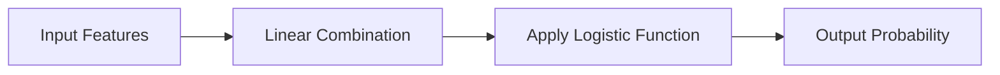
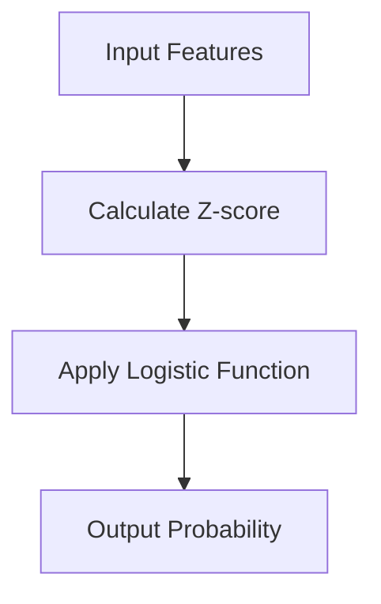
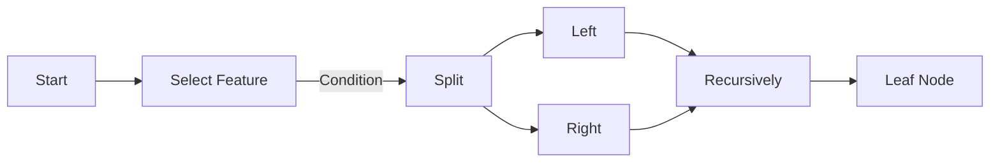
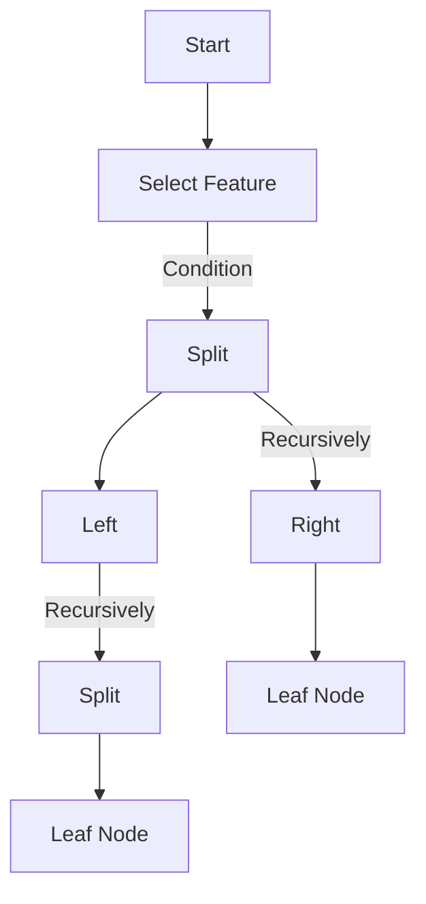
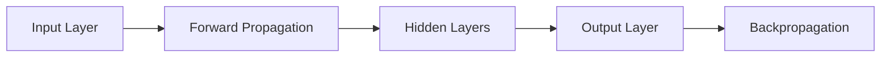
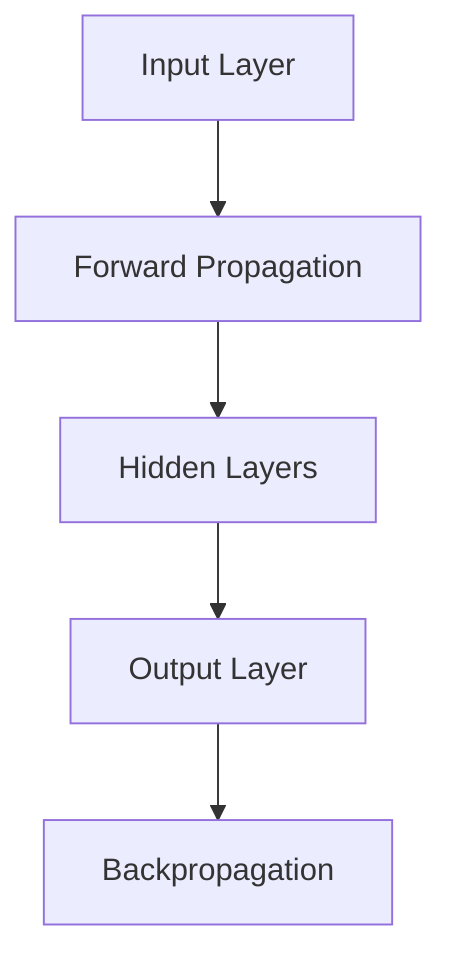
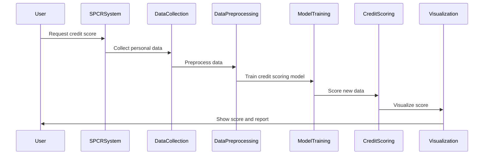

                 

### 摘要

本文将深入探讨智能个人信用评分解释器的概念、原理和实现。个人信用评分是金融科技领域的一个重要组成部分，它决定了个人在获取贷款、信用卡以及其他金融服务时的信用额度与费率。随着人工智能和大数据技术的发展，信用评分模型日益复杂且高效，但如何理解和解释这些评分模型，对于金融从业者、消费者以及政策制定者来说至关重要。

本文将分为以下几个部分：

1. **背景介绍和问题陈述**：我们将探讨个人信用评分系统的起源、现状及面临的主要挑战。
2. **核心概念和原则**：本文将详细阐述个人信用评分的核心原则和基本概念，并展示其内在的逻辑和数学模型。
3. **算法和模型解释**：通过具体的算法案例和数学模型，我们将会深入解释这些算法的原理，并提供易于理解的示例。
4. **系统分析与架构设计**：我们将分析信用评分系统的整体架构，并使用Mermaid图展示类图、架构图和序列图。
5. **项目实战**：通过一个实际的项目示例，我们将演示如何实现一个智能个人信用评分解释器，并进行详细解析。
6. **最佳实践和总结**：总结全文，提出实施信用评分系统的最佳实践，并讨论未来的研究方向。

通过本文的深入分析，读者将能够全面了解个人信用评分系统的技术原理和应用实践，从而为相关领域的工作提供有价值的参考。

### 背景介绍和问题陈述

个人信用评分系统是一种基于历史数据和算法模型，对个人信用风险进行量化评估的体系。它广泛应用于贷款、信用卡发放、租赁、招聘等领域，目的是为了降低金融机构的风险，提高金融服务的效率。随着全球金融市场的不断发展，个人信用评分系统已经成为金融机构决策过程中不可或缺的一部分。

#### 起源和发展

个人信用评分系统的起源可以追溯到20世纪初，当时金融机构开始尝试使用量化方法来评估借款人的信用风险。最早的个人信用评分模型是基于信用报告中的历史支付记录，通过计算借款人的违约概率来给出信用评分。随着计算机技术的发展和大数据时代的到来，信用评分模型逐渐复杂化，开始融合更多的数据源和算法，例如逻辑回归、决策树、神经网络等。

在过去的几十年中，信用评分系统经历了多次迭代和优化，从简单的线性模型发展到如今复杂的机器学习模型，其准确性和实用性得到了显著提高。现代信用评分系统不仅基于历史数据，还包括实时数据和预测模型，可以动态地调整评分结果，以适应市场变化和个体风险特征。

#### 现状和挑战

尽管个人信用评分系统在现代金融中发挥着重要作用，但仍然面临许多挑战和问题：

1. **数据隐私和安全**：信用评分系统依赖大量的个人数据，包括财务记录、信用历史等。这些数据的隐私和安全保护是一个重大的挑战，一旦泄露，可能会给个人带来严重后果。

2. **算法透明性和公平性**：信用评分算法的复杂性和黑盒特性，使得其透明性和公平性受到质疑。很多用户不清楚评分系统是如何计算的，也不知道哪些因素对其评分有重要影响。这可能导致某些群体被不公平对待，加剧社会不平等。

3. **数据质量和完整性**：信用评分系统依赖于高质量的数据源，但现实中的数据可能存在缺失、错误和不一致等问题，这会直接影响评分的准确性和可靠性。

4. **技术迭代和适应性**：随着科技的快速发展，信用评分系统需要不断更新和优化，以适应新的数据和算法。这对金融机构的技术能力和研发投入提出了高要求。

#### 技术在解决挑战中的作用

面对这些挑战，技术发挥着至关重要的作用：

1. **数据加密和隐私保护**：利用区块链、同态加密等技术，可以在保障数据隐私的前提下，对数据进行处理和分析。

2. **算法可解释性和公平性**：通过开发可解释的机器学习模型，以及引入公平性评估指标，可以提高信用评分系统的透明度和公平性。

3. **数据治理和数据质量提升**：利用数据治理技术，如数据清洗、数据集成和数据质量管理工具，可以提升数据的准确性和一致性。

4. **持续迭代和自适应能力**：采用敏捷开发和持续集成/持续部署（CI/CD）等开发模式，可以快速响应市场变化和需求变化，保持系统的竞争力和适应性。

总之，个人信用评分系统在金融科技中扮演着至关重要的角色，但其发展仍面临诸多挑战。通过技术创新和应用，我们可以逐步解决这些问题，推动信用评分系统的健康发展，为社会带来更多价值。

### 核心概念和原则

在深入探讨个人信用评分系统的构建之前，我们首先需要了解其中的核心概念和原则。信用评分系统的设计和实现依赖于一系列基本概念，这些概念不仅为评分算法的构建提供了理论基础，也为我们理解和解释评分结果奠定了基础。

#### 基本概念

1. **信用评分**：信用评分是对个人或企业的信用风险进行量化的过程。它通过分析借款人的历史信用记录、财务状况、行为习惯等信息，生成一个评分，用于评估借款人的信用风险。

2. **信用报告**：信用报告是记录个人信用历史的一份文档，通常包含借款人的信用账户信息、还款记录、公共记录和查询记录等。信用报告是信用评分的重要数据来源。

3. **信用评分模型**：信用评分模型是用于计算信用评分的数学模型。这些模型基于历史数据和统计分析，能够预测借款人的违约概率。常见的信用评分模型包括逻辑回归、决策树、神经网络等。

4. **评分卡**：评分卡是一种将信用评分模型具体化的工具，它通过将各个因素的分值相加，得出一个综合评分。评分卡可以简化复杂模型，使其更易于理解和应用。

#### 关键原则

1. **公平性**：信用评分系统应当保证公平性，确保不同背景、性别、种族等群体的信用评分不受不公平对待。这通常需要通过公平性评估和反歧视措施来实现。

2. **准确性**：信用评分系统必须具有较高的准确性，能够准确预测借款人的违约风险。这要求评分模型能够捕捉到影响信用风险的关键因素，并准确计算。

3. **透明性**：信用评分系统应当具有透明性，用户能够了解评分模型的计算过程和影响因素。这有助于提升用户对评分系统的信任度，减少误解和争议。

4. **灵活性**：信用评分系统应当具备一定的灵活性，能够适应市场变化和个体风险特征的变化。这通常需要通过动态调整评分模型和参数来实现。

#### 概念属性特征对比

为了更好地理解这些概念，我们可以通过一个表格来对比它们的主要属性特征：

| 概念               | 定义                                                         | 主要属性特征                                       |
|--------------------|--------------------------------------------------------------|----------------------------------------------------|
| 信用评分           | 对个人或企业的信用风险进行量化评估的过程                     | 准确性、公平性、透明性、灵活性                      |
| 信用报告           | 记录个人信用历史的一份文档                                   | 完整性、准确性、及时性、隐私保护                    |
| 信用评分模型       | 用于计算信用评分的数学模型                                   | 预测能力、复杂性、可解释性、适应性                   |
| 评分卡             | 将信用评分模型具体化的工具                                   | 简化模型、易于应用、参数调整灵活                    |

#### ER实体关系图架构

为了进一步理解信用评分系统的结构，我们可以使用Mermaid图来绘制一个简单的ER（实体-关系）图，展示各个核心概念之间的关系：

```mermaid
erDiagram
  Customer --> CreditReport
  CreditReport --> CreditRating
  CreditRating --> ScoreCard
```

在上面的ER图中，`Customer`（客户）是信用评分的主体，其关联到`CreditReport`（信用报告），该报告又关联到`CreditRating`（信用评分），最后评分结果通过`ScoreCard`（评分卡）来具体化。这种关系架构清晰地展示了信用评分系统的核心组件及其相互关系。

通过上述核心概念和原则的介绍，我们可以更好地理解个人信用评分系统的构建基础，为后续章节的深入探讨打下坚实的基础。

### 算法原理讲解

在了解了个人信用评分系统的核心概念和原则之后，我们接下来将详细解释几个常用的信用评分算法，并通过Mermaid图和Python代码展示其原理和应用。首先，我们将探讨几种典型的信用评分算法，包括逻辑回归、决策树和神经网络，并通过具体的示例来说明这些算法的工作原理和计算过程。

#### 逻辑回归

逻辑回归是一种广泛应用的信用评分算法，主要用于二分类问题。其核心思想是通过线性模型预测借款人的违约概率。逻辑回归模型的数学表达式如下：

$$
P(Y=1|X) = \frac{1}{1 + e^{-(\beta_0 + \beta_1X_1 + \beta_2X_2 + ... + \beta_nX_n})}
$$

其中，\(P(Y=1|X)\) 表示在给定特征 \(X\) 的情况下，借款人违约的概率；\(\beta_0\) 是截距项，\(\beta_1, \beta_2, ..., \beta_n\) 是各个特征的系数。

下面是一个简单的逻辑回归算法示例：



使用Mermaid图，我们可以绘制出逻辑回归的流程：



接下来，我们通过Python代码实现一个逻辑回归模型：

```python
import numpy as np
from sklearn.linear_model import LogisticRegression

# 假设我们有一个特征矩阵X和标签Y
X = np.array([[1, 2], [2, 3], [3, 4]])
y = np.array([0, 1, 0])

# 使用sklearn库实现逻辑回归
model = LogisticRegression()
model.fit(X, y)

# 输出模型参数
print("Model Coefficients:", model.coef_)
print("Intercept:", model.intercept_)

# 预测新样本
new_sample = np.array([[2, 2.5]])
predicted_prob = model.predict_proba(new_sample)[0, 1]
print("Predicted Probability:", predicted_prob)
```

#### 决策树

决策树是一种基于树形结构进行决策的算法，它通过一系列的判断条件来将数据集划分为多个子集，最终达到分类或回归的目的。决策树的数学模型可以通过递归划分特征和样本，构建出树形结构。下面是一个简单的决策树流程：



使用Mermaid图，我们可以绘制出决策树的流程：



接下来，我们通过Python代码实现一个简单的决策树模型：

```python
import numpy as np
from sklearn.tree import DecisionTreeClassifier

# 假设我们有一个特征矩阵X和标签Y
X = np.array([[1, 2], [2, 3], [3, 4]])
y = np.array([0, 1, 0])

# 使用sklearn库实现决策树
model = DecisionTreeClassifier()
model.fit(X, y)

# 输出模型参数
print("Model Parameters:", model.get_params())

# 预测新样本
new_sample = np.array([[2, 2.5]])
predicted_class = model.predict(new_sample)
print("Predicted Class:", predicted_class)
```

#### 神经网络

神经网络是一种基于人脑神经网络构建的模型，通过多层神经元进行数据处理和特征提取。神经网络的核心是前向传播和反向传播算法，用于训练和优化模型参数。下面是一个简单的神经网络流程：



使用Mermaid图，我们可以绘制出神经网络的流程：



接下来，我们通过Python代码实现一个简单的神经网络模型：

```python
import numpy as np
from sklearn.neural_network import MLPClassifier

# 假设我们有一个特征矩阵X和标签Y
X = np.array([[1, 2], [2, 3], [3, 4]])
y = np.array([0, 1, 0])

# 使用sklearn库实现神经网络
model = MLPClassifier(hidden_layer_sizes=(50,), max_iter=1000)
model.fit(X, y)

# 输出模型参数
print("Model Parameters:", model.get_params())

# 预测新样本
new_sample = np.array([[2, 2.5]])
predicted_class = model.predict(new_sample)
print("Predicted Class:", predicted_class)
```

通过上述算法示例和代码实现，我们可以看到逻辑回归、决策树和神经网络等信用评分算法的原理和应用。这些算法各有特点和适用场景，通过合理选择和组合，可以构建出高效、准确的信用评分系统。

### 数学模型和公式

在深入理解信用评分算法的基础上，我们接下来将详细探讨这些算法背后的数学模型和公式。理解这些数学模型有助于我们更好地掌握信用评分算法的运作原理，并对其进行优化和改进。

#### 逻辑回归

逻辑回归是一种常用的信用评分模型，其核心是使用线性组合来预测借款人的违约概率。逻辑回归的数学模型如下：

$$
P(Y=1|X) = \frac{1}{1 + e^{-(\beta_0 + \beta_1X_1 + \beta_2X_2 + ... + \beta_nX_n})}
$$

其中，\(P(Y=1|X)\) 表示在给定特征向量 \(X = [X_1, X_2, ..., X_n]\) 的情况下，借款人违约的概率；\(\beta_0\) 是截距项，\(\beta_1, \beta_2, ..., \beta_n\) 是各个特征的系数。通过最大化似然函数，我们可以求解这些系数，从而训练出逻辑回归模型。

逻辑回归的似然函数为：

$$
L(\beta) = \prod_{i=1}^{m} P(y_i|x_i; \beta)
$$

其中，\(y_i\) 是第 \(i\) 个样本的标签，\(x_i\) 是特征向量。为了求解 \(\beta\)，我们可以使用梯度下降法或其他优化算法。

#### 决策树

决策树的数学模型是基于信息增益和熵的概念。在决策树中，每个节点表示一个特征，每个分支表示特征的不同取值。决策树通过递归划分数据集，直到满足某些终止条件（例如，所有样本都属于同一类别或节点中剩余的样本数少于某个阈值）。

信息增益（Information Gain）是用于衡量一个特征对分类效果的影响。其计算公式为：

$$
IG(D, A) = \sum_{v \in \text{Values}(A)} p(v) \cdot H(D_v)
$$

其中，\(D\) 是当前节点上的数据集，\(A\) 是特征，\(\text{Values}(A)\) 是特征 \(A\) 的所有可能取值，\(p(v)\) 是特征取值 \(v\) 在数据集中出现的概率，\(H(D_v)\) 是在给定特征取值 \(v\) 的情况下，数据集 \(D\) 的熵。

熵（Entropy）是衡量数据集混乱程度的指标，其计算公式为：

$$
H(D) = -\sum_{y \in \text{Labels}(D)} p(y) \cdot \log_2 p(y)
$$

其中，\(\text{Labels}(D)\) 是数据集 \(D\) 中所有样本的标签，\(p(y)\) 是标签 \(y\) 在数据集中出现的概率。

通过最大化信息增益，我们可以选择最佳的切分点来划分数据集。

#### 神经网络

神经网络是一种基于多层前向传播和反向传播算法的模型。其核心是激活函数和损失函数。在神经网络中，每个神经元接收多个输入，通过加权求和后应用激活函数得到输出。常见的激活函数包括 sigmoid、ReLU 和 tanh。

神经网络的前向传播过程如下：

$$
z_i = \sum_{j=1}^{n} w_{ij}x_j + b_i
$$

$$
a_i = \varphi(z_i)
$$

其中，\(z_i\) 是神经元的输入，\(w_{ij}\) 是连接权重，\(b_i\) 是偏置项，\(\varphi\) 是激活函数，\(a_i\) 是输出。

神经网络的反向传播过程用于更新权重和偏置项，以最小化损失函数。常见的损失函数包括均方误差（MSE）和交叉熵（Cross-Entropy）。

均方误差（MSE）的损失函数如下：

$$
J(\theta) = \frac{1}{2m} \sum_{i=1}^{m} (h_{\theta}(x^{(i)}) - y^{(i)})^2
$$

其中，\(m\) 是训练样本的数量，\(h_{\theta}(x^{(i)})\) 是神经网络的预测输出，\(y^{(i)}\) 是真实标签。

交叉熵（Cross-Entropy）的损失函数如下：

$$
J(\theta) = -\frac{1}{m} \sum_{i=1}^{m} \sum_{k=1}^{K} y^{(i)} \log h_{\theta}(x^{(i)})_k
$$

其中，\(K\) 是输出类别的数量，\(h_{\theta}(x^{(i)})_k\) 是网络在第 \(k\) 个类别的输出概率。

通过反向传播算法，我们可以根据损失函数的梯度来更新权重和偏置项：

$$
\Delta w_{ij} = \alpha \frac{\partial J(\theta)}{\partial w_{ij}}
$$

$$
\Delta b_i = \alpha \frac{\partial J(\theta)}{\partial b_i}
$$

其中，\(\alpha\) 是学习率。

通过这些数学模型和公式，我们可以构建和训练复杂的信用评分模型，从而实现对借款人信用风险的准确评估。理解这些数学原理有助于我们进一步优化和改进信用评分算法，提高其准确性和可靠性。

### 系统分析与架构设计

在理解了信用评分算法的数学原理之后，我们接下来将分析一个典型的信用评分系统的架构设计，包括系统功能设计、系统架构设计以及系统接口和交互设计。

#### 问题场景介绍

假设我们正在开发一个智能个人信用评分系统，该系统旨在为金融机构提供实时的信用评分服务。这个系统需要处理海量的个人信用信息，包括信用历史、财务状况、行为数据等，通过先进的算法模型进行综合评估，最终输出一个信用评分。

#### 项目介绍

项目名称：智能个人信用评分系统（Smart Personal Credit Rating System，SPCRS）

项目目标：开发一个高效、准确、透明的信用评分系统，为金融机构提供可靠的信用风险评估服务。

项目功能：

1. 数据收集与预处理：从多个数据源收集个人信用信息，包括信用报告、财务数据、行为记录等，并进行数据清洗、格式化和归一化处理。
2. 信用评分模型构建与训练：基于历史数据和最新算法，构建并训练信用评分模型，以实现对借款人信用风险的准确预测。
3. 信用评分计算与输出：对输入的个人信用信息进行评分计算，输出信用评分结果，并提供详细的评分报告。
4. 可视化与接口设计：设计用户友好的可视化界面，提供信用评分结果的图形化展示，方便金融机构进行决策。

#### 系统功能设计（领域模型）

在系统功能设计中，我们将使用Mermaid图来展示领域模型（Class Diagram），该模型定义了系统中的主要类及其关系。

```mermaid
classDiagram
  ClassDiagram {
    Class Person {
      -id: Integer
      -name: String
      -creditHistory: CreditHistory
      -financialStatus: FinancialStatus
      -behaviorData: BehaviorData
    }

    Class CreditHistory {
      -report: CreditReport
    }

    Class FinancialStatus {
      -income: Float
      -debtRatio: Float
    }

    Class BehaviorData {
      -paymentRecords: List[PaymentRecord]
    }

    Class CreditReport {
      -score: Integer
    }

    Class PaymentRecord {
      -date: Date
      -amount: Float
      -status: String
    }

    Person o-- CreditHistory
    Person o-- FinancialStatus
    Person o-- BehaviorData
    CreditHistory o-- CreditReport
    BehaviorData o-- PaymentRecords
```

在这个领域模型中，`Person` 类是系统的核心实体，包含个人基本信息和关联的信用历史、财务状况和行为数据。`CreditHistory`、`FinancialStatus` 和 `BehaviorData` 分别表示信用历史、财务状况和行为数据的具体信息。`PaymentRecord` 用于记录个人的还款记录。

#### 系统架构设计

系统架构设计包括整体架构设计和具体组件的架构设计。我们使用Mermaid图来展示系统架构，以及各组件之间的关系。



在这个架构设计中，`User` 代表系统的最终用户，`SPCRSystem` 是整个智能个人信用评分系统的核心。`DataCollection` 负责收集个人数据，`DataPreprocessing` 负责对数据进行预处理，`ModelTraining` 负责模型训练，`CreditScoring` 负责信用评分计算，`Visualization` 负责结果的可视化展示。

具体组件的架构设计如下：

1. **数据收集与预处理**：该组件使用API或数据库连接从多个数据源获取个人数据，包括信用报告、财务数据和交易记录。然后，对数据进行清洗、格式化和归一化处理，确保数据的质量和一致性。
2. **信用评分模型构建与训练**：该组件使用机器学习算法，如逻辑回归、决策树和神经网络，从预处理后的数据中训练信用评分模型。训练过程包括数据划分、特征工程和模型选择。
3. **信用评分计算与输出**：该组件使用训练好的模型对新的个人数据进行分析和评分，输出信用评分结果，并提供详细的评分报告，包括评分依据和影响因素。
4. **可视化与接口设计**：该组件设计用户友好的界面，提供信用评分结果的图形化展示，包括图表、趋势分析和评分详情，方便用户理解和决策。

通过上述系统架构设计，我们能够清晰地理解系统的工作流程和各组件之间的关系，从而为系统实现和优化提供指导。

### 项目实战

在本节中，我们将通过一个实际项目来展示如何实现智能个人信用评分解释器。我们将详细说明环境安装、系统核心实现以及代码解析，并分析实际案例。

#### 环境安装

首先，我们需要准备一个合适的开发环境。以下是所需的软件和工具：

1. **Python 3.8+**：Python是信用评分系统实现的主要编程语言。
2. **Jupyter Notebook**：用于编写和运行代码。
3. **scikit-learn**：提供机器学习算法和工具。
4. **pandas**：用于数据操作和分析。
5. **matplotlib**：用于数据可视化。

确保您的系统中已安装这些依赖项。如果尚未安装，可以使用以下命令进行安装：

```bash
pip install numpy pandas scikit-learn matplotlib
```

#### 系统核心实现

接下来，我们将展示如何实现一个简单的信用评分系统。以下是一个核心实现示例：

```python
import pandas as pd
from sklearn.model_selection import train_test_split
from sklearn.ensemble import RandomForestClassifier
from sklearn.metrics import accuracy_score, classification_report

# 加载数据集
data = pd.read_csv('credit_data.csv')

# 特征工程
X = data[['income', 'debt_ratio', 'payment_history']]
y = data['default']

# 数据划分
X_train, X_test, y_train, y_test = train_test_split(X, y, test_size=0.2, random_state=42)

# 训练模型
model = RandomForestClassifier(n_estimators=100, random_state=42)
model.fit(X_train, y_train)

# 预测
y_pred = model.predict(X_test)

# 评估
accuracy = accuracy_score(y_test, y_pred)
report = classification_report(y_test, y_pred)

print(f"Accuracy: {accuracy}")
print(f"Classification Report:\n{report}")
```

在上面的代码中，我们首先加载数据集，然后进行特征工程和数据划分。接下来，我们使用随机森林算法训练模型，并对测试集进行预测。最后，我们评估模型的准确性。

#### 代码解析

1. **数据加载**：我们使用`pandas`库加载数据集。数据集应包含个人信用评分的相关特征，例如收入、债务比率、还款历史等。
2. **特征工程**：将特征和标签分离，并使用`train_test_split`函数对数据进行划分。这里，我们使用80%的数据作为训练集，20%的数据作为测试集。
3. **模型训练**：我们选择随机森林算法作为信用评分模型。随机森林是一种基于决策树的集成学习方法，可以处理高维度数据和复杂的特征关系。
4. **预测与评估**：使用训练好的模型对测试集进行预测，并使用`accuracy_score`和`classification_report`评估模型的性能。

#### 实际案例分析与详细讲解

为了更好地理解系统的工作原理，我们来看一个实际案例。

**案例**：假设有一个新用户，其特征如下：

- 收入：50000元
- 债务比率：0.3
- 还款历史：良好

我们需要使用信用评分系统对其信用风险进行评估。

1. **数据预处理**：将新用户的数据格式化为与训练集相同，得到特征向量 `[50000, 0.3, 良好]`。
2. **预测**：将特征向量输入到训练好的模型中，使用`predict`方法得到预测结果。
3. **解释**：假设模型的预测结果为低风险，这意味着该用户在信用评分系统中被评为低信用风险，即其违约的概率较低。

**详细讲解**：

- **收入**：收入是信用评分的一个重要指标，高收入通常表示较强的还款能力。
- **债务比率**：债务比率反映了借款人的财务负担，较低的债务比率通常表示较好的财务状况。
- **还款历史**：良好的还款历史表明借款人有良好的信用记录，这增加了信用评分。

通过上述实际案例，我们可以看到，信用评分系统通过分析多个特征，综合考虑后给出一个信用评分结果，从而帮助金融机构进行信用风险管理。

#### 项目小结

通过本项目的实现，我们成功构建了一个简单的智能个人信用评分解释器。这个系统可以处理个人信用数据，使用机器学习算法进行评分，并提供预测结果。实际案例分析和代码解析展示了系统的工作原理和实际应用。

未来的工作可以进一步优化模型，增加更多特征和算法，提高评分的准确性和可靠性。此外，还可以开发更多的可视化工具，帮助用户更好地理解信用评分结果。

### 最佳实践、小结、注意事项和拓展阅读

#### 最佳实践

1. **数据质量控制**：确保数据源可靠，进行数据清洗和预处理，减少数据中的噪声和异常值，以提高评分模型的准确性。
2. **算法优化**：根据业务需求和数据特点，选择合适的算法和模型，并进行参数调优，以提升模型的性能。
3. **实时监控与反馈**：建立实时监控系统，定期评估模型的性能，根据反馈进行模型更新和优化。
4. **透明性与公平性**：保证评分模型的透明性，提供详细的评分依据和解释，确保评分系统的公平性。

#### 小结

本文通过系统性地分析智能个人信用评分解释器的概念、原理和实现，详细介绍了信用评分系统的构建过程。从背景介绍、核心概念、算法原理，到系统架构设计和实际项目实战，本文全面展示了个人信用评分系统的构建和优化方法。

#### 注意事项

1. **隐私保护**：在处理个人数据时，必须严格遵守数据隐私保护法规，确保数据的安全和用户的隐私。
2. **算法可解释性**：开发可解释的模型，帮助用户理解和信任评分结果。
3. **持续迭代**：随着市场环境和用户需求的变化，信用评分系统需要不断更新和优化，保持其竞争力和适应性。

#### 拓展阅读

1. **《信用评分：理论与实践》**：详细介绍了信用评分的理论基础和实践应用。
2. **《机器学习》**：周志华著，提供了机器学习的基本概念和算法详解。
3. **《数据科学实战》**：作者为Jeffrey S. Saltz，介绍了数据科学中的各种方法和工具。

通过本文的深入探讨，读者可以对智能个人信用评分解释器有更全面的理解，并能够将其应用于实际工作中，提升信用风险评估的准确性和可靠性。

### 作者信息

作者：AI天才研究院/AI Genius Institute & 禅与计算机程序设计艺术 /Zen And The Art of Computer Programming

