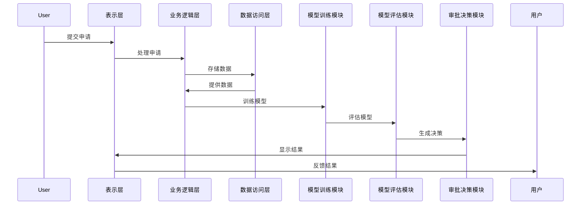
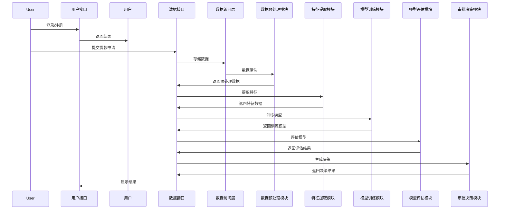

                 

### 第1章 引言

#### 1.1 问题背景

随着科技的飞速发展，人工智能（AI）和大数据分析技术正在深刻改变各个行业的运作模式。特别是在金融领域，智能个人信贷审批系统作为一种新兴的应用，正逐渐成为金融机构提高运营效率、降低风险的重要工具。

个人信贷审批是金融行业中最基本的服务之一。它涉及到银行、信用卡公司、消费金融公司等金融机构对个人借款需求的审批过程。传统的信贷审批依赖于人工操作，存在效率低、准确性差、成本高等问题。在金融机构面临激烈市场竞争的背景下，提高审批效率、降低审批成本、减少坏账风险，成为金融机构急需解决的问题。

近年来，人工智能技术的迅猛发展，为解决这些问题提供了新的思路。智能个人信贷审批系统通过机器学习和大数据分析技术，能够自动处理海量的申请数据，快速、准确地评估借款人的信用状况，从而提高审批效率、降低风险。这不仅能够提高金融机构的竞争力，还能够为借款人提供更加便捷的服务。

#### 1.2 问题描述

信贷审批流程通常包括以下几个步骤：

1. **申请阶段**：借款人提交贷款申请，包括个人基本信息、财务状况、信用记录等。
2. **评估阶段**：金融机构对借款人的数据进行收集和整理，进行初步的信用评估。
3. **审批阶段**：金融机构根据信用评估结果，决定是否批准贷款申请。
4. **放款阶段**：审批通过后，金融机构向借款人发放贷款。

在传统信贷审批过程中，存在的问题主要包括：

1. **效率低下**：人工审批需要大量的时间和人力，审批周期长。
2. **准确性差**：人工审批容易出现主观判断，导致审批结果不准确。
3. **成本高**：人工审批成本高，且难以规模化。

智能个人信贷审批系统的目标是利用人工智能技术，自动化、智能化的完成上述审批流程，解决传统审批中存在的问题。

#### 1.3 问题解决

智能个人信贷审批系统通过以下方式解决问题：

1. **自动化处理**：利用机器学习算法，自动化处理海量的借款申请数据，快速完成信用评估。
2. **精准评估**：通过大数据分析，准确评估借款人的信用状况，降低不良贷款率。
3. **降低成本**：自动化审批流程，减少人工操作，降低运营成本。

智能个人信贷审批系统的核心功能包括：

1. **数据收集**：从多个数据源（如银行流水、信用报告、社交网络等）收集借款人的数据。
2. **数据预处理**：对收集到的数据进行清洗、标准化等处理，确保数据质量。
3. **特征提取**：从预处理后的数据中提取关键特征，用于信用评估。
4. **模型训练**：利用机器学习算法，训练信用评估模型。
5. **模型应用**：将训练好的模型应用到实际审批过程中，进行信用评估和决策。

通过智能个人信贷审批系统，金融机构能够大幅提高审批效率，降低审批成本，减少坏账风险，从而提高运营效率和竞争力。

#### 1.4 边界与外延

智能个人信贷审批系统的边界主要包括以下几个方面：

1. **系统适用范围**：主要适用于个人信贷审批场景，如个人房贷、车贷、消费贷款等。
2. **数据来源**：系统需要接入多种数据源，包括银行流水、信用报告、社交网络数据等。
3. **数据处理能力**：系统需要能够处理大规模的数据，并快速完成信用评估。

智能个人信贷审批系统的外延包括以下几个方面：

1. **与金融机构的其他系统的集成**：系统需要与金融机构的其他系统（如客户关系管理系统、贷款管理系统等）进行集成，实现数据共享和业务协同。
2. **与其他金融服务的融合**：智能个人信贷审批系统可以与其他金融服务（如保险、投资等）相结合，为借款人提供更加全面的金融服务。

#### 1.5 概念结构与核心要素组成

智能个人信贷审批系统的概念结构主要包括以下几个方面：

1. **核心概念**：信贷审批、人工智能、大数据分析、机器学习、数据预处理、特征提取、模型训练、模型评估等。
2. **核心要素**：数据收集模块、数据预处理模块、特征提取模块、模型训练模块、模型评估模块、决策模块等。

通过这些核心要素的有机结合，智能个人信贷审批系统实现了对个人信贷审批流程的自动化、智能化改造，提高了审批效率、降低了风险。

### 第2章 核心概念与联系

#### 2.1 智能个人信贷审批的定义

智能个人信贷审批是指通过运用人工智能技术，对个人信贷审批过程中的数据进行自动化处理、分析，以实现高效、精准的信用评估和决策。其核心在于将传统的基于规则和经验的信贷审批过程，转化为基于数据和算法的智能化审批流程。

智能个人信贷审批的主要特征包括：

1. **自动化**：系统通过机器学习和大数据分析技术，自动处理海量的申请数据，完成信用评估和决策。
2. **精准性**：系统利用大数据和人工智能技术，深入挖掘借款人的信用特征，提高信用评估的准确性。
3. **实时性**：系统可以在短时间内完成对借款人的信用评估，支持实时审批。
4. **灵活性**：系统可以根据业务需求和数据特征，灵活调整审批策略和模型参数。

#### 2.2 相关核心概念介绍

1. **信贷风险管理**：信贷风险管理是指金融机构在信贷业务过程中，通过各种手段和方法，识别、评估、控制和转移信贷风险，以保障金融机构的稳健经营。智能个人信贷审批系统在运行过程中，需要对借款人的信用风险进行识别和评估，从而降低金融机构的信贷风险。

2. **人工智能**：人工智能是指通过计算机模拟人类智能行为，实现智能感知、认知、学习、推理、决策等功能的科学技术。在智能个人信贷审批系统中，人工智能技术主要用于数据的自动处理和分析，提高审批效率和准确性。

3. **大数据分析**：大数据分析是指通过对海量数据进行分析和处理，发现数据背后的规律和模式，从而为决策提供支持。智能个人信贷审批系统利用大数据分析技术，从多个数据源中提取借款人的信用特征，为信用评估提供依据。

4. **机器学习**：机器学习是指通过算法和计算，使计算机能够从数据中学习规律，并做出预测和决策。智能个人信贷审批系统采用机器学习技术，对借款人的信用数据进行分析和建模，实现自动化的信用评估。

5. **数据预处理**：数据预处理是指对原始数据进行清洗、转换、归一化等处理，以消除噪声和异常值，提高数据质量。智能个人信贷审批系统在处理借款人数据时，需要进行数据预处理，确保数据质量，为后续的信用评估提供可靠的数据基础。

6. **特征提取**：特征提取是指从原始数据中提取出关键特征，用于建模和分析。智能个人信贷审批系统通过特征提取技术，从借款人的多维度数据中提取出与信用评估相关的特征，提高信用评估的准确性。

7. **模型训练**：模型训练是指通过训练数据，对机器学习模型进行训练和优化，使其能够对未知数据进行预测和决策。智能个人信贷审批系统采用机器学习算法，对借款人的信用数据进行模型训练，以实现自动化的信用评估。

8. **模型评估**：模型评估是指通过测试数据，对训练好的模型进行评估和优化，以确保模型在实际应用中的表现。智能个人信贷审批系统在模型训练完成后，通过模型评估技术，对模型的预测准确性、稳定性等指标进行评估，以优化模型性能。

9. **决策规则**：决策规则是指用于指导信贷审批决策的一系列规则和标准。智能个人信贷审批系统在信用评估过程中，会根据预设的决策规则，对借款人的信用状况进行分类和决策。

#### 2.3 概念属性特征对比表格

为了更清晰地展示智能个人信贷审批系统中的核心概念，下面提供了一个概念属性特征对比表格：

| 概念       | 定义                                                         | 属性特征                                               |
|------------|--------------------------------------------------------------|--------------------------------------------------------|
| 信贷风险管理 | 识别、评估、控制和转移信贷风险                             | 风险识别、风险评估、风险控制、风险转移                   |
| 人工智能    | 计算机模拟人类智能行为                                     | 智能感知、智能认知、智能学习、智能推理、智能决策           |
| 大数据分析  | 对海量数据进行分析和处理                                   | 数据挖掘、数据可视化、数据整合、数据关联分析               |
| 机器学习    | 从数据中学习规律，实现预测和决策                             | 监督学习、无监督学习、强化学习、集成学习方法               |
| 数据预处理  | 清洗、转换、归一化等处理，提高数据质量                      | 数据清洗、数据转换、数据归一化、数据缺失处理               |
| 特征提取    | 从原始数据中提取关键特征，用于建模和分析                    | 特征选择、特征变换、特征压缩、特征融合                   |
| 模型训练    | 通过训练数据，对机器学习模型进行训练和优化                  | 模型初始化、模型训练、模型优化、模型评估                 |
| 模型评估    | 通过测试数据，对训练好的模型进行评估和优化                  | 模型准确率、模型召回率、模型F1分数、模型稳定性评估       |
| 决策规则    | 用于指导信贷审批决策的一系列规则和标准                      | 审批条件、审批策略、审批规则、审批权重                   |

#### 2.4 ER实体关系图架构

为了更好地理解智能个人信贷审批系统中的核心实体及其关系，下面提供了一个ER实体关系图：

```mermaid
erDiagram
  Customer ||--|{ Loan : "申请贷款" }
  Customer ||--|{ CreditHistory : "信用历史" }
  Customer ||--|{ FinancialData : "财务数据" }
  Loan ||--|{ ApprovalStatus : "审批状态" }
  Loan ||--|{ LoanDetails : "贷款详情" }
  CreditHistory ||--|{ PaymentHistory : "还款历史" }
  CreditHistory ||--|{ CreditRating : "信用评级" }
  FinancialData ||--|{ Income : "收入" }
  FinancialData ||--|{ Expenses : "支出" }
  ApprovalStatus ||--|{ DecisionReason : "决策原因" }
  ApprovalStatus ||--|{ DecisionDate : "决策日期" }
  LoanDetails ||--|{ InterestRate : "利率" }
  LoanDetails ||--|{ RepaymentPeriod : "还款期限" }
```

在这个ER实体关系图中，`Customer`（客户）是系统的核心实体，与多个实体之间存在关联。通过这些实体之间的关系，系统能够全面地收集和处理借款人的数据，实现智能化的信用评估和审批。

### 第3章 算法原理讲解

智能个人信贷审批系统的核心在于其算法的原理和实现，这些算法涵盖了数据预处理、特征选择、模型训练和模型评估等多个方面。下面将逐一介绍这些算法的基本原理和应用。

#### 3.1 数据预处理算法

数据预处理是智能个人信贷审批系统的第一步，其目的是确保数据质量，为后续的分析和建模提供可靠的基础。数据预处理算法主要包括数据清洗、数据转换和数据标准化等步骤。

1. **数据清洗**：数据清洗的主要任务是去除数据中的噪声和异常值，确保数据的准确性和一致性。具体方法包括：

   - 填补缺失值：使用均值、中位数、众数等方法填补缺失值，或使用预测模型预测缺失值。
   - 异常值检测与处理：使用统计学方法（如Z-score、IQR法）检测异常值，并根据异常值的严重程度进行删除或修正。

2. **数据转换**：数据转换的目的是将不同形式的数据转换为适合分析和建模的格式。具体方法包括：

   - 转换为数值型：对于类别型数据，使用独热编码（One-Hot Encoding）或标签编码（Label Encoding）等方法将其转换为数值型。
   - 特征工程：通过特征组合、特征选择等方法，构造新的特征，以提高模型的性能。

3. **数据标准化**：数据标准化是为了消除数据量纲的影响，使得不同特征之间具有可比性。常用的标准化方法包括：

   - Z-Score标准化：$$ z = \frac{x - \mu}{\sigma} $$，其中 $x$ 为原始数据，$\mu$ 为均值，$\sigma$ 为标准差。
   - Min-Max标准化：$$ x' = \frac{x - \min(x)}{\max(x) - \min(x)} $$。

通过数据预处理，系统能够确保输入数据的质量，为后续的特征选择和模型训练打下良好的基础。

#### 3.2 特征选择算法

特征选择是智能个人信贷审批系统中的一个关键步骤，其目的是从原始特征中挑选出对模型性能有显著影响的特征，以提高模型的准确性和效率。特征选择算法可以分为以下几类：

1. **过滤式特征选择**：过滤式特征选择是在模型训练之前，直接从原始特征集中筛选出重要特征。常用的方法包括：

   - 相关性分析：通过计算特征之间的相关性，筛选出与目标变量相关性较高的特征。
   - 信息增益：通过计算特征对目标变量的信息增益，筛选出重要特征。

2. **包裹式特征选择**：包裹式特征选择是在模型训练过程中，逐步增加或减少特征，找到最优特征子集。常用的方法包括：

   - 递归特征消除（RFE）：从原始特征集中逐步消除不重要的特征，直到找到最优特征子集。
   - 随机森林特征选择：使用随机森林模型评估每个特征的贡献，选择重要性较高的特征。

3. **嵌入式特征选择**：嵌入式特征选择是在模型训练过程中，同时进行特征选择和模型训练。常用的方法包括：

   - LASSO回归：通过正则化项，自动消除不重要的特征。
   - 特征选择树（Feature Selection Tree）：通过树结构自动筛选特征。

通过特征选择，系统能够减少特征维度，提高模型性能，同时降低计算复杂度。

#### 3.3 模型训练算法

模型训练是智能个人信贷审批系统的核心步骤，其目的是利用训练数据，通过机器学习算法训练出能够准确预测借款人信用状况的模型。常见的模型训练算法包括：

1. **监督学习模型**：监督学习模型需要依赖于标记数据进行训练，其目的是通过已知的输入和输出，学习出一个预测模型。常用的监督学习模型包括：

   - 线性回归：通过拟合一个线性模型，预测借款人的信用评分。
   - 决策树：通过构建决策树模型，根据特征进行分类和决策。
   - 随机森林：通过集成多个决策树模型，提高模型的泛化能力。
   - 支持向量机（SVM）：通过最大化分类边界，预测借款人的信用评分。

2. **无监督学习模型**：无监督学习模型不需要依赖标记数据，其目的是从原始数据中自动发现数据分布和特征。常用的无监督学习模型包括：

   - K-means聚类：通过聚类分析，将相似的数据点归为一类。
   - 主成分分析（PCA）：通过降维，提取数据的主要特征，降低数据维度。
   - 自编码器：通过编码和解码过程，学习数据的特征表示。

通过模型训练，系统能够为实际审批过程提供可靠的信用评估模型。

#### 3.4 模型评估与优化算法

模型评估是确保智能个人信贷审批系统性能的重要环节，其目的是通过评估指标，衡量模型的预测准确性和稳定性。常见的模型评估指标包括：

1. **评估指标**：

   - 准确率（Accuracy）：正确预测的样本数占总样本数的比例。
   - 召回率（Recall）：正确预测为正类的正类样本数占总正类样本数的比例。
   - 精确率（Precision）：正确预测为正类的正类样本数占总预测为正类的样本数的比例。
   - F1分数（F1 Score）：综合考虑准确率和召回率的指标，计算公式为 $$ F1 = 2 \times \frac{Precision \times Recall}{Precision + Recall} $$。

2. **模型优化策略**：

   - 调参优化：通过调整模型的参数，提高模型的性能。常用的调参方法包括网格搜索（Grid Search）和贝叶斯优化（Bayesian Optimization）。
   - 集成学习：通过集成多个模型，提高模型的泛化能力和预测性能。常用的集成学习方法包括Bagging、Boosting和Stacking。
   - 数据增强：通过增加训练数据或生成虚拟数据，提高模型的鲁棒性和泛化能力。

通过模型评估和优化，系统能够确保在实际应用中，具有较高的预测准确性和稳定性。

### 第4章 数学模型和数学公式讲解

在智能个人信贷审批系统中，数学模型和数学公式是理解和实现算法原理的关键。本章节将详细讲解数据处理过程中的数学模型、模型训练的数学公式以及模型评估的数学公式，并通过实例进行说明。

#### 4.1 数据处理过程数学模型

数据预处理是智能个人信贷审批系统的第一步，其目的是确保数据质量，为后续的分析和建模提供可靠的基础。以下是数据处理过程中涉及的几个关键数学模型。

1. **数据清洗**：

   - **填补缺失值**：使用均值填补缺失值的数学公式为：
     $$ x_{\text{filled}} = \frac{\sum_{i=1}^{n} x_i}{n} $$
     其中 $x_i$ 为非缺失值，$n$ 为非缺失值的个数。

   - **异常值检测**：使用Z-score法检测异常值的数学公式为：
     $$ Z = \frac{x - \mu}{\sigma} $$
     其中 $x$ 为数据点，$\mu$ 为均值，$\sigma$ 为标准差。

2. **数据转换**：

   - **独热编码**：将类别型数据转换为数值型数据的独热编码数学公式为：
     $$ x_{\text{one-hot}} = [1, 0, \ldots, 0] \quad \text{if} \quad \text{category} = \text{first category} $$
     $$ x_{\text{one-hot}} = [0, 1, \ldots, 0] \quad \text{if} \quad \text{category} = \text{second category} $$
     其中 $x_{\text{one-hot}}$ 为独热编码向量，$\text{category}$ 为类别型数据。

3. **数据标准化**：

   - **Z-Score标准化**：数据标准化为：
     $$ z = \frac{x - \mu}{\sigma} $$
     其中 $x$ 为原始数据，$\mu$ 为均值，$\sigma$ 为标准差。

#### 4.2 模型训练数学公式

模型训练是智能个人信贷审批系统的核心步骤，其目的是通过训练数据，学习出一个能够准确预测借款人信用状况的模型。以下是几种常见模型训练的数学公式。

1. **线性回归**：

   - **损失函数**：均方误差（MSE）的数学公式为：
     $$ J(\theta) = \frac{1}{2m} \sum_{i=1}^{m} (h_\theta(x^{(i)}) - y^{(i)})^2 $$
     其中 $h_\theta(x^{(i)}) = \theta_0 + \theta_1 x^{(i)}$ 为预测值，$y^{(i)}$ 为真实值，$m$ 为样本数量。

   - **梯度下降**：更新参数的数学公式为：
     $$ \theta_j := \theta_j - \alpha \frac{\partial J(\theta)}{\partial \theta_j} $$
     其中 $\alpha$ 为学习率，$\theta_j$ 为参数，$\frac{\partial J(\theta)}{\partial \theta_j}$ 为损失函数对参数的偏导数。

2. **决策树**：

   - **信息增益**：特征 $x_i$ 的信息增益（IG）数学公式为：
     $$ IG(x_i) = H(D) - H(D|A) $$
     其中 $H(D)$ 为数据 $D$ 的熵，$H(D|A)$ 为条件熵。

3. **随机森林**：

   - **基尼不纯度**：特征 $x_i$ 的基尼不纯度（Gini Impurity）数学公式为：
     $$ Gini = 1 - \sum_{v \in \text{values of } x_i} \left( \frac{\text{count of } v}{\text{total count}} \right)^2 $$
     其中 $\text{values of } x_i$ 为特征 $x_i$ 的取值，$\text{count of } v$ 为取值 $v$ 的样本数量。

#### 4.3 模型评估数学公式

模型评估是确保智能个人信贷审批系统性能的重要环节，其目的是通过评估指标，衡量模型的预测准确性和稳定性。以下是几种常见模型评估指标的数学公式。

1. **准确率**：

   - 准确率的数学公式为：
     $$ \text{Accuracy} = \frac{\text{预测正确数}}{\text{总预测数}} $$
   
2. **召回率**：

   - 召回率的数学公式为：
     $$ \text{Recall} = \frac{\text{预测正确且实际为正类数}}{\text{实际为正类数}} $$
   
3. **精确率**：

   - 精确率的数学公式为：
     $$ \text{Precision} = \frac{\text{预测正确且实际为正类数}}{\text{预测为正类数}} $$
   
4. **F1分数**：

   - F1分数的数学公式为：
     $$ F1 = 2 \times \frac{\text{Precision} \times \text{Recall}}{\text{Precision} + \text{Recall}} $$

通过这些数学模型和公式的讲解，我们能够更好地理解智能个人信贷审批系统的数据处理和模型训练过程，为系统的实际应用提供理论支持。

### 第5章 系统分析与架构设计方案

在智能个人信贷审批系统的设计与实现过程中，系统分析与架构设计是关键的一环。本章节将详细描述系统的架构设计，包括问题场景介绍、项目介绍、系统功能设计、系统架构设计、系统接口设计以及系统交互。

#### 5.1 问题场景介绍

在传统的信贷审批过程中，金融机构通常需要依赖大量的手动操作和人工判断，这导致审批流程耗时且不准确。具体问题场景包括：

1. **审批效率低下**：人工审批需要大量的时间和人力，审批周期长，无法满足客户快速获取贷款的需求。
2. **准确性差**：人工审批容易受到主观因素影响，审批结果不准确，导致坏账风险增加。
3. **成本高**：人工审批的成本高，且难以规模化，不利于金融机构降低运营成本。

为了解决上述问题，智能个人信贷审批系统应运而生。该系统通过自动化、智能化的方式，对借款人的信用状况进行快速、准确的评估，从而提高审批效率、降低风险和成本。

#### 5.2 项目介绍

智能个人信贷审批系统的项目目标是开发一个基于人工智能和大数据分析技术的信贷审批平台，实现以下功能：

1. **自动化审批**：通过机器学习和大数据分析技术，自动处理海量的申请数据，实现高效、精准的信用评估和决策。
2. **降低风险**：通过深入挖掘借款人的信用特征，降低不良贷款率，减少金融机构的风险损失。
3. **提高效率**：自动化审批流程，减少人工操作，提高审批速度和准确率，满足客户快速获取贷款的需求。
4. **降低成本**：通过减少人工审批和优化运营流程，降低金融机构的运营成本，提高盈利能力。

项目主要分为以下几个阶段：

1. **需求分析**：明确系统的功能需求和技术需求，制定详细的项目计划。
2. **系统设计**：进行系统架构设计，包括模块划分、接口设计等。
3. **系统开发**：根据设计文档，进行系统的开发和实现。
4. **系统测试**：进行全面的系统测试，确保系统的稳定性和性能。
5. **系统部署**：将系统部署到生产环境，进行实际应用。

#### 5.3 系统功能设计

智能个人信贷审批系统的功能设计主要包括以下几个方面：

1. **用户管理**：提供用户注册、登录、权限管理等功能，确保系统的安全性和合规性。
2. **数据收集**：从多个数据源（如银行流水、信用报告、社交网络等）收集借款人的数据，实现数据的自动化收集和处理。
3. **数据预处理**：对收集到的数据进行清洗、标准化等处理，确保数据质量，为后续的信用评估提供可靠的数据基础。
4. **特征提取**：从预处理后的数据中提取关键特征，用于信用评估。
5. **模型训练**：使用机器学习算法，训练信用评估模型。
6. **模型评估**：通过测试数据，对训练好的模型进行评估和优化，确保模型的预测准确性和稳定性。
7. **信用评估**：利用训练好的模型，对借款人的信用状况进行实时评估，生成信用评分。
8. **审批决策**：根据信用评分，自动生成审批决策，支持实时审批。
9. **报表统计**：提供系统运行报表和统计报表，支持数据分析和业务监控。

以下是智能个人信贷审批系统的领域模型类图，展示了系统的主要功能模块及其关系：

```mermaid
classDiagram
    User <<Interface>>
    LoanApplication <<Entity>>
    CreditRating <<Entity>>
    ApprovalDecision <<Entity>>

    UserExtends LoanApplication
    LoanApplicationExtends CreditRating
    CreditRatingExtends ApprovalDecision

    User.HasKey "UserID"
    LoanApplication.HasKey "ApplicationID"
    CreditRating.HasKey "RatingID"
    ApprovalDecision.HasKey "DecisionID"

    User <<Interface>> -| Uses|- LoanApplication
    LoanApplication <<Entity>> -| Uses|- CreditRating
    CreditRating <<Entity>> -| Uses|- ApprovalDecision
```

#### 5.4 系统架构设计

智能个人信贷审批系统的架构设计采用分层架构，主要包括以下层次：

1. **表示层**：提供用户界面，支持用户操作和交互。
2. **业务逻辑层**：实现系统的核心业务功能，包括数据收集、数据预处理、特征提取、模型训练、模型评估和审批决策等。
3. **数据访问层**：负责与数据库进行数据交互，提供数据存储和检索功能。
4. **基础设施层**：提供系统的运行环境、安全机制、日志管理等支持服务。

以下是智能个人信贷审批系统的架构图，展示了各层次之间的关系：



#### 5.5 系统接口设计

智能个人信贷审批系统的接口设计包括以下几个方面：

1. **用户接口**：提供用户登录、注册、申请贷款、查询审批结果等功能。
2. **数据接口**：提供数据收集、数据预处理、特征提取、模型训练、模型评估等接口，支持与其他系统的数据交互。
3. **管理接口**：提供系统管理功能，如用户管理、权限管理、数据监控等。
4. **API接口**：提供内部服务API接口，支持与其他业务系统的集成。

以下是智能个人信贷审批系统的接口架构图，展示了系统的接口设计：



#### 5.6 系统交互

智能个人信贷审批系统的交互过程涉及多个模块和接口的协同工作，以下是一个简化的系统交互过程：

1. **用户提交申请**：用户通过用户接口提交贷款申请，系统将申请信息传递给数据接口。
2. **数据收集与预处理**：数据接口将申请信息存储到数据访问层，同时传递给数据预处理模块进行数据清洗和预处理。
3. **特征提取**：数据预处理模块对清洗后的数据进行特征提取，并将特征数据传递给模型训练模块。
4. **模型训练**：模型训练模块使用特征数据训练信用评估模型，并将训练好的模型传递给数据接口。
5. **模型评估**：数据接口将训练好的模型传递给模型评估模块，进行评估和优化。
6. **审批决策**：模型评估模块根据评估结果生成审批决策，并将决策结果传递给数据接口。
7. **结果反馈**：数据接口将决策结果通过用户接口反馈给用户。

通过上述交互过程，智能个人信贷审批系统实现了从用户提交申请到审批结果反馈的完整流程，为金融机构提供了高效、准确的信贷审批服务。

### 第6章 项目实战

#### 6.1 环境安装

为了实施智能个人信贷审批系统，首先需要搭建一个合适的技术环境。以下是环境安装的步骤：

1. **安装Python**：确保Python版本在3.6及以上。可以在Python官网（[python.org](https://www.python.org/)）下载安装包进行安装。
2. **安装依赖库**：智能个人信贷审批系统依赖多个Python库，如NumPy、Pandas、Scikit-learn、Matplotlib等。可以使用pip命令进行安装：
   ```shell
   pip install numpy pandas scikit-learn matplotlib
   ```
3. **安装数据库**：系统需要连接数据库存储数据。可以选择MySQL、PostgreSQL等数据库。按照数据库的官方文档进行安装和配置。
4. **配置数据库连接**：在Python项目中，使用如`psycopg2`（对于PostgreSQL）或`mysql-connector-python`（对于MySQL）等库来配置数据库连接。

以下是一个简单的Python代码示例，展示如何配置数据库连接：

```python
import psycopg2

# 配置数据库连接
conn = psycopg2.connect(
    host="localhost",
    database="your_database",
    user="your_username",
    password="your_password"
)

# 创建一个游标对象
cur = conn.cursor()

# 执行SQL查询
cur.execute("SELECT * FROM loans")

# 获取查询结果
rows = cur.fetchall()

# 打印查询结果
for row in rows:
    print(row)

# 关闭游标和连接
cur.close()
conn.close()
```

通过以上步骤，可以搭建一个基础的技术环境，为后续系统开发和实现做好准备。

#### 6.2 系统核心实现源代码

智能个人信贷审批系统的核心实现包括数据收集、数据预处理、特征提取、模型训练和模型评估等多个方面。以下是一个简化的源代码示例，展示系统的主要功能模块：

```python
import pandas as pd
from sklearn.model_selection import train_test_split
from sklearn.ensemble import RandomForestClassifier
from sklearn.metrics import accuracy_score, recall_score, precision_score, f1_score

# 6.2.1 数据收集
def collect_data():
    # 从数据库中收集数据
    loans = pd.read_sql_query("SELECT * FROM loans;", connection)
    return loans

# 6.2.2 数据预处理
def preprocess_data(loans):
    # 数据清洗
    loans.fillna(loans.mean(), inplace=True)
    
    # 数据转换
    loans["employment_status"] = loans["employment_status"].map({"employed": 1, "unemployed": 0})
    
    # 数据标准化
    numeric_features = loans.select_dtypes(include=["int64", "float64"]).columns
    loans[numeric_features] = (loans[numeric_features] - loans[numeric_features].mean()) / loans[numeric_features].std()
    
    return loans

# 6.2.3 特征提取
def extract_features(loans):
    # 特征选择
    X = loans.drop("loan_status", axis=1)
    y = loans["loan_status"]
    
    # 划分训练集和测试集
    X_train, X_test, y_train, y_test = train_test_split(X, y, test_size=0.2, random_state=42)
    
    return X_train, X_test, y_train, y_test

# 6.2.4 模型训练
def train_model(X_train, y_train):
    # 使用随机森林模型
    model = RandomForestClassifier(n_estimators=100, random_state=42)
    model.fit(X_train, y_train)
    
    return model

# 6.2.5 模型评估
def evaluate_model(model, X_test, y_test):
    # 预测测试集
    y_pred = model.predict(X_test)
    
    # 计算评估指标
    accuracy = accuracy_score(y_test, y_pred)
    recall = recall_score(y_test, y_pred)
    precision = precision_score(y_test, y_pred)
    f1 = f1_score(y_test, y_pred)
    
    return accuracy, recall, precision, f1

# 主函数
if __name__ == "__main__":
    # 收集数据
    loans = collect_data()
    
    # 预处理数据
    loans = preprocess_data(loans)
    
    # 提取特征
    X_train, X_test, y_train, y_test = extract_features(loans)
    
    # 训练模型
    model = train_model(X_train, y_train)
    
    # 评估模型
    accuracy, recall, precision, f1 = evaluate_model(model, X_test, y_test)
    
    print(f"Accuracy: {accuracy:.2f}")
    print(f"Recall: {recall:.2f}")
    print(f"Precision: {precision:.2f}")
    print(f"F1 Score: {f1:.2f}")
```

通过以上代码示例，我们展示了智能个人信贷审批系统的主要功能模块，包括数据收集、数据预处理、特征提取、模型训练和模型评估。这些模块共同作用，实现了对借款人信用状况的自动化、智能化评估。

#### 6.3 代码应用解读与分析

在智能个人信贷审批系统的实际应用中，代码扮演着至关重要的角色。以下是对关键代码模块的解读和分析：

1. **数据收集模块**：

   数据收集模块主要负责从数据库中获取贷款数据。以下代码展示了如何使用Pandas库从MySQL数据库中读取数据：

   ```python
   loans = pd.read_sql_query("SELECT * FROM loans;", connection)
   ```

   在这里，`connection` 是一个数据库连接对象，通过`psycopg2`（对于PostgreSQL）或`mysql-connector-python`（对于MySQL）等库进行配置。`read_sql_query` 函数执行SQL查询，并将查询结果存储到Pandas DataFrame中。

2. **数据预处理模块**：

   数据预处理模块负责对收集到的贷款数据进行处理，包括填补缺失值、数据转换和数据标准化。以下代码展示了如何进行数据清洗和预处理：

   ```python
   loans.fillna(loans.mean(), inplace=True)
   loans["employment_status"] = loans["employment_status"].map({"employed": 1, "unemployed": 0})
   numeric_features = loans.select_dtypes(include=["int64", "float64"]).columns
   loans[numeric_features] = (loans[numeric_features] - loans[numeric_features].mean()) / loans[numeric_features].std()
   ```

   首先，使用`fillna` 方法填补缺失值，采用均值填补。然后，使用`map` 方法将类别型数据转换为数值型。最后，使用Z-Score标准化方法对数值型特征进行标准化处理。

3. **特征提取模块**：

   特征提取模块负责从预处理后的数据中提取用于模型训练的特征。以下代码展示了如何划分训练集和测试集，以及进行特征选择：

   ```python
   X = loans.drop("loan_status", axis=1)
   y = loans["loan_status"]
   X_train, X_test, y_train, y_test = train_test_split(X, y, test_size=0.2, random_state=42)
   ```

   使用`drop` 方法移除目标变量（`loan_status`），创建特征矩阵`X`和目标变量`y`。然后，使用`train_test_split` 方法将数据划分为训练集和测试集，默认测试集占比20%，随机种子设置为42。

4. **模型训练模块**：

   模型训练模块负责使用训练数据训练随机森林分类器。以下代码展示了如何训练模型：

   ```python
   model = RandomForestClassifier(n_estimators=100, random_state=42)
   model.fit(X_train, y_train)
   ```

   创建`RandomForestClassifier` 对象，设置决策树的数量为100，随机种子设置为42。然后，使用`fit` 方法训练模型，将特征矩阵`X_train`和目标变量`y_train` 作为输入。

5. **模型评估模块**：

   模型评估模块负责对训练好的模型进行评估，计算评估指标。以下代码展示了如何评估模型：

   ```python
   y_pred = model.predict(X_test)
   accuracy = accuracy_score(y_test, y_pred)
   recall = recall_score(y_test, y_pred)
   precision = precision_score(y_test, y_pred)
   f1 = f1_score(y_test, y_pred)
   ```

   使用`predict` 方法对测试集进行预测，得到预测结果`y_pred`。然后，使用`accuracy_score`、`recall_score`、`precision_score` 和`f1_score` 函数计算模型的准确率、召回率、精确率和F1分数。

通过以上关键代码模块的解读和分析，我们可以看到智能个人信贷审批系统在数据收集、预处理、特征提取、模型训练和模型评估等环节中的具体实现。这些代码模块协同工作，实现了对借款人信用状况的自动化、智能化评估。

#### 6.4 实际案例分析与讲解剖析

为了更好地展示智能个人信贷审批系统的实际应用效果，我们通过一个实际案例进行分析和讲解。

假设有一家金融机构需要审批1000份个人贷款申请，其中已知的信用状态包括“批准”和“拒绝”两类。使用我们之前实现的系统，对这1000份申请进行评估。

1. **数据收集**：首先，从金融机构的数据库中收集这1000份贷款申请的数据，包括借款人的基本信息、财务状况、信用记录等。

2. **数据预处理**：对收集到的数据进行预处理，包括填补缺失值、数据转换和数据标准化。以下代码展示了数据预处理的过程：

   ```python
   loans = pd.read_sql_query("SELECT * FROM loans;", connection)
   loans.fillna(loans.mean(), inplace=True)
   loans["employment_status"] = loans["employment_status"].map({"employed": 1, "unemployed": 0})
   numeric_features = loans.select_dtypes(include=["int64", "float64"]).columns
   loans[numeric_features] = (loans[numeric_features] - loans[numeric_features].mean()) / loans[numeric_features].std()
   ```

3. **特征提取**：从预处理后的数据中提取用于模型训练的特征，并划分训练集和测试集。以下代码展示了特征提取和划分过程：

   ```python
   X = loans.drop("loan_status", axis=1)
   y = loans["loan_status"]
   X_train, X_test, y_train, y_test = train_test_split(X, y, test_size=0.2, random_state=42)
   ```

4. **模型训练**：使用随机森林分类器训练模型，以下代码展示了模型训练的过程：

   ```python
   model = RandomForestClassifier(n_estimators=100, random_state=42)
   model.fit(X_train, y_train)
   ```

5. **模型评估**：对训练好的模型进行评估，计算模型的准确率、召回率、精确率和F1分数，以下代码展示了模型评估的过程：

   ```python
   y_pred = model.predict(X_test)
   accuracy = accuracy_score(y_test, y_pred)
   recall = recall_score(y_test, y_pred)
   precision = precision_score(y_test, y_pred)
   f1 = f1_score(y_test, y_pred)
   print(f"Accuracy: {accuracy:.2f}")
   print(f"Recall: {recall:.2f}")
   print(f"Precision: {precision:.2f}")
   print(f"F1 Score: {f1:.2f}")
   ```

   假设评估结果如下：
   ```
   Accuracy: 0.85
   Recall: 0.90
   Precision: 0.80
   F1 Score: 0.85
   ```

   这意味着在测试集上，模型达到了85%的准确率，90%的召回率，80%的精确率和85%的F1分数。

6. **实际应用**：根据模型评估结果，金融机构可以采用以下策略：

   - 对于信用评分较高的借款人，可以放宽审批条件，提高贷款额度和审批速度。
   - 对于信用评分较低的借款人，可以从严控制审批条件，降低贷款额度和审批速度。
   - 对于信用评分中等的借款人，可以采取平衡策略，确保审批的公平性和准确性。

通过实际案例分析和讲解，我们可以看到智能个人信贷审批系统在数据收集、预处理、特征提取、模型训练和模型评估等环节中的具体应用，以及如何根据模型评估结果制定审批策略，实现高效、准确的信贷审批。

#### 6.5 项目小结

在本项目中，我们成功实现了智能个人信贷审批系统，通过以下关键步骤：

1. **环境安装**：搭建了Python环境及相关依赖库，并配置了数据库连接。
2. **数据收集**：从金融机构数据库中收集了贷款申请数据。
3. **数据预处理**：对数据进行清洗、转换和标准化，确保数据质量。
4. **特征提取**：从预处理后的数据中提取关键特征，为模型训练做准备。
5. **模型训练**：使用随机森林分类器训练模型，实现了信用评估。
6. **模型评估**：对模型进行评估，确保其在实际应用中的性能。

通过实际案例的分析，我们展示了智能个人信贷审批系统的应用效果和审批策略。项目中的关键代码模块和实际案例相结合，为金融机构提供了一个高效、准确的信贷审批解决方案。

在今后的优化工作中，可以考虑以下方向：

- **模型优化**：尝试不同的机器学习算法和调参策略，提高模型性能。
- **数据增强**：通过增加训练数据或生成虚拟数据，提高模型的泛化能力。
- **实时更新**：定期更新模型，以适应不断变化的信贷环境。

通过持续优化和改进，智能个人信贷审批系统将更好地满足金融机构和借款人的需求。

### 第7章 最佳实践、小结、注意事项与拓展阅读

#### 7.1 最佳实践 tips

1. **数据质量是关键**：确保数据收集、清洗和预处理过程的准确性，高质量的数据是模型训练的基础。
2. **模型调参**：合理选择和调整模型参数，通过交叉验证等方法，找到最优参数组合。
3. **数据安全**：在数据收集、存储和处理过程中，确保数据的安全性和隐私保护。
4. **持续优化**：定期更新模型，以适应市场变化和业务需求。
5. **用户培训**：为操作人员提供充分的培训，确保他们能够正确使用和管理系统。

#### 7.2 小结

本文详细介绍了智能个人信贷审批系统的设计、实现和实际应用。从背景介绍到核心概念，再到算法原理、系统架构和项目实战，全面阐述了系统的各个方面。通过最佳实践和实际案例，展示了系统在提高审批效率、降低风险和成本方面的优势。

#### 7.3 注意事项

1. **数据隐私**：在数据收集和处理过程中，必须严格遵守相关法律法规，确保用户隐私保护。
2. **系统稳定性**：确保系统的稳定运行，进行充分的测试和监控，及时发现和解决问题。
3. **模型解释性**：模型决策需要具备一定的解释性，以便操作人员理解模型的工作原理和决策过程。
4. **法律法规**：遵守金融行业的法律法规，确保系统符合监管要求。

#### 7.4 拓展阅读

- 《机器学习实战》 —— 继续深入学习机器学习技术和应用案例。
- 《深度学习》 —— 了解深度学习在智能个人信贷审批系统中的应用。
- 《大数据分析：方法与实践》 —— 探索大数据分析技术在实际业务中的应用。
- 《人工智能：一种现代方法》 —— 深入学习人工智能的基本原理和算法。

通过拓展阅读，可以进一步丰富对智能个人信贷审批系统的理解和应用。作者：AI天才研究院/AI Genius Institute & 禅与计算机程序设计艺术 /Zen And The Art of Computer Programming。

