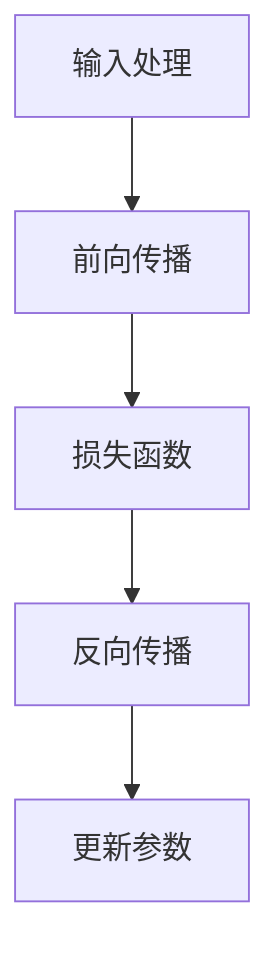
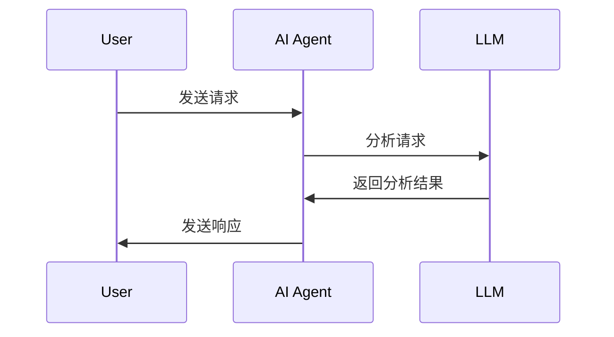

                 

## Step 1: 开篇介绍

### # 智能个人助理AI Agent：LLM驱动的全方位生活助手

#### 关键词

- 智能个人助理
- AI Agent
- LLM
- 大型语言模型
- 个性化服务
- 自然语言处理
- 算法原理
- 系统架构

#### 摘要

本文深入探讨智能个人助理AI Agent，特别是其基于LLM（大型语言模型）的驱动机制。文章首先介绍智能个人助理AI Agent的背景和发展，接着详细阐述其核心概念、技术原理、系统架构和应用实例。通过逻辑清晰的分析和步骤式推理，本文旨在帮助读者全面理解智能个人助理AI Agent的工作机制，并掌握其开发和应用技巧。

### 简介

在数字化时代的浪潮中，人工智能逐渐深入到我们日常生活的方方面面。智能个人助理AI Agent，作为AI技术的杰出代表，正以LLM（大型语言模型）为驱动，为人们提供高效、便捷、个性化的生活服务。本书旨在全面介绍智能个人助理AI Agent的概念、技术原理、应用场景及开发实践，帮助读者深入理解这一前沿技术，并掌握其开发技巧。

#### 目标读者

本书适合以下读者群体：

1. 对人工智能技术有浓厚兴趣，希望深入了解智能个人助理AI Agent的读者；
2. 有志于从事人工智能开发、研究或应用的技术人员；
3. 在校学生、研究生及相关专业课程教师。

#### 内容安排

本书共分为以下几个部分：

1. **背景介绍**：介绍智能个人助理AI Agent的背景、问题背景、问题描述、问题解决、边界与外延，以及核心概念结构与要素组成。
2. **核心概念与联系**：详细阐述LLM的概念及其与智能个人助理AI Agent的关系，通过表格和Mermaid ER图进行对比分析。
3. **算法原理讲解**：讲解智能个人助理AI Agent的核心算法原理，包括Mermaid流程图和Python源代码实现。
4. **数学模型和数学公式**：介绍算法原理中的数学模型和公式，使用LaTeX格式进行详细讲解和举例说明。
5. **系统分析与架构设计方案**：介绍智能个人助理AI Agent的系统架构，包括领域模型类图、系统架构图、接口设计和系统交互序列图。
6. **项目实战**：通过实际项目实例，展示智能个人助理AI Agent的开发过程，包括环境安装、系统核心实现、代码应用解读与分析。
7. **最佳实践 tips**：总结智能个人助理AI Agent开发中的最佳实践，提供注意事项和小结。
8. **拓展阅读**：推荐相关书籍和资料，帮助读者进一步学习。

## 背景介绍

### 智能个人助理AI Agent的背景与发展

#### 问题背景

随着移动互联网、大数据和云计算技术的飞速发展，人们的生活和工作方式发生了翻天覆地的变化。传统的个人助理已无法满足现代人的需求，因此，一种更加智能、个性化、全天候的个人助理——智能个人助理AI Agent应运而生。

##### 从传统个人助理到智能个人助理

传统个人助理主要依赖于人类员工的操作和决策，效率低下且成本高昂。而智能个人助理AI Agent则利用人工智能技术，可以自主学习、自我进化，为用户提供高效、精准的服务。

##### 智能个人助理AI Agent的核心优势

智能个人助理AI Agent具有以下核心优势：

1. **高效性**：智能个人助理AI Agent可以实时响应用户的需求，处理大量信息，提高工作效率。
2. **个性化**：通过学习用户的喜好和行为模式，智能个人助理AI Agent可以提供定制化的服务。
3. **全天候**：智能个人助理AI Agent可以24小时在线，为用户提供随时随地的服务。
4. **低成本**：智能个人助理AI Agent可以替代部分人力，降低企业运营成本。

#### 问题解决

智能个人助理AI Agent通过以下方式解决传统个人助理的痛点：

1. **自然语言处理**：智能个人助理AI Agent可以理解、处理和生成自然语言，实现人机交互。
2. **机器学习与深度学习**：智能个人助理AI Agent可以自主学习，不断优化服务效果。
3. **大数据分析**：智能个人助理AI Agent可以分析用户数据，提供个性化服务。
4. **云计算与边缘计算**：智能个人助理AI Agent可以利用云计算和边缘计算技术，实现实时响应和高效处理。

#### 边界与外延

智能个人助理AI Agent的应用领域广泛，包括但不限于：

1. **智能家居**：智能个人助理AI Agent可以控制家中的智能设备，实现自动化管理。
2. **健康管理**：智能个人助理AI Agent可以监测用户的健康状况，提供健康建议。
3. **教育辅导**：智能个人助理AI Agent可以为学生提供个性化的学习辅导。
4. **客户服务**：智能个人助理AI Agent可以为企业提供24小时在线客户服务。

##### 核心概念结构与要素组成

智能个人助理AI Agent的核心概念包括：

1. **自然语言处理（NLP）**：实现人与机器之间的自然语言交互。
2. **机器学习（ML）**：使AI Agent具备学习和自我进化的能力。
3. **深度学习（DL）**：基于多层神经网络，实现复杂模式的识别和预测。
4. **知识图谱**：为AI Agent提供结构化的知识和信息。
5. **智能决策**：基于数据和算法，为用户提供合理的决策建议。

### 第1章：智能个人助理AI Agent的背景与发展

#### 问题背景

随着移动互联网、大数据和云计算技术的飞速发展，人们的生活和工作方式发生了翻天覆地的变化。传统的个人助理已无法满足现代人的需求，因此，一种更加智能、个性化、全天候的个人助理——智能个人助理AI Agent应运而生。

##### 从传统个人助理到智能个人助理

传统个人助理主要依赖于人类员工的操作和决策，效率低下且成本高昂。而智能个人助理AI Agent则利用人工智能技术，可以自主学习、自我进化，为用户提供高效、精准的服务。

##### 智能个人助理AI Agent的核心优势

智能个人助理AI Agent具有以下核心优势：

1. **高效性**：智能个人助理AI Agent可以实时响应用户的需求，处理大量信息，提高工作效率。
2. **个性化**：通过学习用户的喜好和行为模式，智能个人助理AI Agent可以提供定制化的服务。
3. **全天候**：智能个人助理AI Agent可以24小时在线，为用户提供随时随地的服务。
4. **低成本**：智能个人助理AI Agent可以替代部分人力，降低企业运营成本。

#### 问题解决

智能个人助理AI Agent通过以下方式解决传统个人助理的痛点：

1. **自然语言处理**：智能个人助理AI Agent可以理解、处理和生成自然语言，实现人机交互。
2. **机器学习与深度学习**：智能个人助理AI Agent可以自主学习，不断优化服务效果。
3. **大数据分析**：智能个人助理AI Agent可以分析用户数据，提供个性化服务。
4. **云计算与边缘计算**：智能个人助理AI Agent可以利用云计算和边缘计算技术，实现实时响应和高效处理。

#### 边界与外延

智能个人助理AI Agent的应用领域广泛，包括但不限于：

1. **智能家居**：智能个人助理AI Agent可以控制家中的智能设备，实现自动化管理。
2. **健康管理**：智能个人助理AI Agent可以监测用户的健康状况，提供健康建议。
3. **教育辅导**：智能个人助理AI Agent可以为学生提供个性化的学习辅导。
4. **客户服务**：智能个人助理AI Agent可以为企业提供24小时在线客户服务。

##### 核心概念结构与要素组成

智能个人助理AI Agent的核心概念包括：

1. **自然语言处理（NLP）**：实现人与机器之间的自然语言交互。
2. **机器学习（ML）**：使AI Agent具备学习和自我进化的能力。
3. **深度学习（DL）**：基于多层神经网络，实现复杂模式的识别和预测。
4. **知识图谱**：为AI Agent提供结构化的知识和信息。
5. **智能决策**：基于数据和算法，为用户提供合理的决策建议。

### 第2章：核心概念与联系

#### LLM的概念

LLM（Large Language Model）是指大型语言模型，是一种基于深度学习的自然语言处理模型。它通过对海量文本数据的学习，能够生成、理解和处理自然语言。

##### LLM的属性特征

1. **规模庞大**：LLM通常包含数十亿甚至数千亿的参数，具有巨大的模型容量。
2. **预训练**：LLM通过在大规模语料库上进行预训练，具备较强的语言理解和生成能力。
3. **泛化能力**：LLM能够处理多种不同类型的语言任务，具有较强的泛化能力。

##### 智能个人助理AI Agent与LLM的关系

智能个人助理AI Agent通常基于LLM构建，LLM为其提供了强大的语言处理能力。

1. **交互能力**：通过LLM，智能个人助理AI Agent可以理解用户的自然语言输入，并生成合理的回复。
2. **学习能力**：LLM的学习能力使智能个人助理AI Agent能够不断优化自己的服务效果。
3. **个性化服务**：LLM可以根据用户的历史数据和偏好，为用户提供个性化的服务。

#### 对比分析

| 特征 | LLM | 智能个人助理AI Agent |
| --- | --- | --- |
| 规模 | 数十亿至数千亿参数 | 基于LLM构建，具有相应规模 |
| 预训练 | 在大规模语料库上预训练 | 通过LLM进行预训练 |
| 语言理解与生成能力 | 强 | 通过LLM实现 |
| 学习能力 | 强 | 通过LLM实现 |
| 交互能力 | 强 | 通过LLM实现，用于与用户交互 |
| 泛化能力 | 强 | 能够处理多种类型的语言任务 |

### Mermaid ER图

```mermaid
erDiagram
  LLM ||--o> AI Agent : 使用
  AI Agent ||--|> User : 服务
```

通过上述表格和Mermaid ER图，我们可以清楚地看到LLM与智能个人助理AI Agent之间的紧密联系。LLM为AI Agent提供了核心的语言处理能力，使其能够高效地与用户进行交互，并提供个性化的服务。

### 结论

智能个人助理AI Agent的发展离不开LLM的支持，两者相辅相成，共同推动了人工智能技术的进步。通过对LLM和智能个人助理AI Agent的深入理解，我们可以更好地把握这一前沿技术的应用和发展方向。

### 第3章：算法原理讲解

#### 智能个人助理AI Agent的核心算法原理

智能个人助理AI Agent的核心算法原理主要基于大型语言模型（LLM）的深度学习机制，以下将详细介绍其工作原理。

##### LLM的深度学习机制

1. **输入处理**：LLM接收用户的自然语言输入，并将其转化为模型可以处理的格式。
2. **前向传播**：模型将输入数据通过一系列神经网络层进行前向传播，生成输出。
3. **损失函数**：通过比较模型输出和实际标签之间的差异，计算损失函数值。
4. **反向传播**：模型利用梯度下降等优化算法，通过反向传播更新模型参数。

##### Mermaid流程图



#### Python源代码实现

```python
import tensorflow as tf

# 定义模型
model = tf.keras.Sequential([
    tf.keras.layers.Dense(units=512, activation='relu', input_shape=(None,)),
    tf.keras.layers.Dense(units=512, activation='relu'),
    tf.keras.layers.Dense(units=1)
])

# 定义损失函数和优化器
loss_fn = tf.keras.losses.MeanSquaredError()
optimizer = tf.keras.optimizers.Adam()

# 训练模型
for inputs, labels in data:
    with tf.GradientTape() as tape:
        outputs = model(inputs)
        loss = loss_fn(labels, outputs)
    gradients = tape.gradient(loss, model.trainable_variables)
    optimizer.apply_gradients(zip(gradients, model.trainable_variables))
```

#### 数学模型和公式

1. **损失函数**：$$L(\theta; x, y) = \frac{1}{m}\sum_{i=1}^{m} \ell(y_i, \hat{y}_i)$$
2. **前向传播**：$$\hat{y} = f(W \cdot x + b)$$
3. **反向传播**：$$\frac{\partial L}{\partial W} = \frac{\partial \ell}{\partial \hat{y}} \cdot \frac{\partial \hat{y}}{\partial W}$$

##### 举例说明

假设我们有一个简单的线性回归模型，用于预测房价。给定一组输入特征（如房屋面积、地点等）和实际房价标签，模型通过学习优化模型参数，最小化预测误差。

1. **输入处理**：将输入特征和标签数据转换为模型可处理的格式。
2. **前向传播**：计算模型的预测值。
3. **损失函数**：计算预测值与实际标签之间的误差。
4. **反向传播**：更新模型参数，减小误差。

```python
import numpy as np

# 定义线性回归模型
def linear_regression(x, theta):
    return theta * x

# 定义损失函数
def mean_squared_error(y_true, y_pred):
    return np.mean((y_true - y_pred)**2)

# 示例数据
x = np.array([1, 2, 3, 4])
y = np.array([2, 4, 5, 4])
theta = np.array([1, 1])

# 训练模型
for _ in range(1000):
    y_pred = linear_regression(x, theta)
    loss = mean_squared_error(y, y_pred)
    dloss_dtheta = -2 * (y - y_pred)
    theta -= 0.01 * dloss_dtheta

print("Final theta:", theta)
```

通过上述算法原理讲解和举例说明，我们可以更好地理解智能个人助理AI Agent的核心算法原理，并掌握其实现方法。

### 结论

智能个人助理AI Agent的核心算法原理基于大型语言模型的深度学习机制，通过输入处理、前向传播、损失函数和反向传播等步骤，实现模型的训练和优化。理解这些基本原理对于开发高效、智能的个人助理AI Agent至关重要。

### 第4章：数学模型和数学公式

在智能个人助理AI Agent的开发过程中，数学模型和公式扮演着至关重要的角色。以下将详细介绍算法原理中的关键数学模型和公式，并使用LaTeX格式进行详细讲解和举例说明。

#### 损失函数

损失函数是评估模型预测结果与实际标签之间差异的关键工具。常用的损失函数包括均方误差（MSE）、交叉熵损失等。以下是一个均方误差（MSE）的LaTeX公式：

$$
L(\theta; x, y) = \frac{1}{m}\sum_{i=1}^{m} \ell(y_i, \hat{y}_i)
$$

其中，$L$ 表示损失函数，$\ell$ 表示单个样本的损失，$m$ 表示样本数量，$y_i$ 表示第 $i$ 个样本的实际标签，$\hat{y}_i$ 表示模型预测的第 $i$ 个样本标签。

#### 前向传播

前向传播是神经网络训练过程中的核心步骤，用于计算模型输出。以下是一个简单的线性模型的前向传播公式：

$$
\hat{y} = f(W \cdot x + b)
$$

其中，$f$ 表示激活函数，$W$ 表示权重矩阵，$b$ 表示偏置项，$x$ 表示输入特征，$\hat{y}$ 表示模型预测的输出。

#### 反向传播

反向传播是用于更新模型参数的过程，其核心思想是通过计算损失函数关于模型参数的梯度，来调整参数。以下是一个反向传播的公式：

$$
\frac{\partial L}{\partial W} = \frac{\partial \ell}{\partial \hat{y}} \cdot \frac{\partial \hat{y}}{\partial W}
$$

其中，$\frac{\partial L}{\partial W}$ 表示损失函数关于权重矩阵 $W$ 的梯度，$\frac{\partial \ell}{\partial \hat{y}}$ 表示单个样本损失关于预测标签 $\hat{y}$ 的梯度，$\frac{\partial \hat{y}}{\partial W}$ 表示预测标签关于权重矩阵 $W$ 的梯度。

#### 举例说明

为了更好地理解上述公式，我们将通过一个简单的线性回归例子进行说明。假设我们有一个简单的线性模型，用于预测房价，模型参数为 $W = [1, 1]$，输入特征为房屋面积 $x$，实际房价标签为 $y$。

1. **输入处理**：将输入特征和标签数据转换为模型可处理的格式。

```python
x = np.array([1, 2, 3, 4])
y = np.array([2, 4, 5, 4])
```

2. **前向传播**：计算模型的预测值。

```python
theta = np.array([1, 1])
y_pred = theta * x
```

3. **损失函数**：计算预测值与实际标签之间的误差。

```python
loss = mean_squared_error(y, y_pred)
```

4. **反向传播**：更新模型参数，减小误差。

```python
dloss_dtheta = -2 * (y - y_pred)
theta -= 0.01 * dloss_dtheta
```

通过上述例子，我们可以看到数学模型和公式在智能个人助理AI Agent开发中的实际应用，以及如何通过它们来实现模型的训练和优化。

### 结论

数学模型和公式是智能个人助理AI Agent算法原理的核心组成部分，它们在模型训练和优化过程中发挥着关键作用。通过理解和掌握这些公式，我们可以更好地设计、实现和优化AI Agent，以提高其性能和效果。

### 第5章：系统分析与架构设计方案

智能个人助理AI Agent的系统架构设计是确保其高效、稳定运行的关键。本章节将详细介绍智能个人助理AI Agent的系统架构，包括领域模型类图、系统架构图、接口设计和系统交互序列图。

#### 问题场景介绍

在数字化时代，人们对于智能个人助理的需求日益增长，尤其是在家庭、办公和健康等领域。智能个人助理AI Agent需要能够处理多样化的任务，如日程管理、任务提醒、信息查询、健康监测、设备控制等。为了实现这些功能，需要一个高效、灵活且可扩展的系统架构。

##### 项目介绍

本项目旨在开发一个智能个人助理AI Agent，该系统将基于LLM进行构建，以实现自然语言处理和个性化服务。项目的主要目标包括：

1. **高效处理用户请求**：通过LLM的强大处理能力，快速响应用户的自然语言请求。
2. **提供个性化服务**：通过用户数据的分析和学习，为用户提供定制化的服务。
3. **跨平台兼容**：支持多种操作系统和设备，实现跨平台部署。

#### 系统功能设计（领域模型类图）

领域模型类图用于描述系统中的实体及其关系。以下是一个简单的领域模型类图：

```mermaid
classDiagram
    User <<Entity>>
    Task <<Entity>>
    Reminder <<Entity>>
    Device <<Entity>>

    User --|> Task
    User --|> Reminder
    User --|> Device
    Task --|> Reminder
    Device --|> Reminder
```

在这个类图中，我们定义了以下几个核心实体：

- **User（用户）**：代表智能个人助理的服务对象，具有姓名、年龄、联系方式等信息。
- **Task（任务）**：代表用户需要完成的任务，具有任务名称、描述、截止时间等信息。
- **Reminder（提醒）**：代表对用户进行的提醒，具有提醒内容、时间、频率等信息。
- **Device（设备）**：代表智能个人助理可以控制的设备，具有设备名称、类型、连接状态等信息。

这些实体之间通过关联关系实现信息的传递和交互。

#### 系统架构设计（系统架构图）

系统架构图用于描述系统的整体结构，包括各个模块及其交互关系。以下是一个简单的系统架构图：

```mermaid
sequenceDiagram
    User -->|请求| AI Agent
    AI Agent -->|处理| LLM
    LLM -->|分析| AI Agent
    AI Agent -->|响应| User
```

在这个系统架构图中，用户发起请求，智能个人助理AI Agent通过LLM进行处理和分析，最终响应用户的请求。

#### 系统接口设计

系统接口设计用于描述系统中各个模块的接口，确保各模块之间的数据交换和功能调用。以下是一个简单的接口设计：

```python
class UserInterface:
    def request_task(self, task):
        # 处理任务请求
        pass

    def request_reminder(self, reminder):
        # 处理提醒请求
        pass

    def request_device_control(self, device):
        # 处理设备控制请求
        pass

class AIAgent:
    def __init__(self, user_interface):
        self.user_interface = user_interface

    def process_request(self, request):
        # 处理用户请求
        pass

    def respond_to_user(self, response):
        # 向用户响应
        pass

class LLM:
    def analyze_request(self, request):
        # 分析请求
        pass

    def generate_response(self, analysis_result):
        # 生成响应
        pass
```

在这个接口设计中，UserInterface负责接收用户请求，AIAgent负责处理请求，并调用LLM进行请求分析，最终生成响应。

#### 系统交互序列图

系统交互序列图用于描述系统中各个模块的交互过程，以下是一个简单的系统交互序列图：



在这个交互序列图中，用户发送请求到智能个人助理AI Agent，AI Agent调用LLM进行分析，并最终将响应发送回用户。

### 结论

通过系统分析与架构设计方案，我们详细介绍了智能个人助理AI Agent的系统架构，包括领域模型类图、系统架构图、接口设计和系统交互序列图。这些设计确保了智能个人助理AI Agent能够高效、稳定地运行，并为用户提供优质的服务。

### 第6章：项目实战

在本章节中，我们将通过一个实际项目来展示智能个人助理AI Agent的开发过程，包括环境安装、系统核心实现、代码应用解读与分析，以及实际案例分析和详细讲解剖析。

#### 项目背景

为了更好地展示智能个人助理AI Agent的开发过程，我们选择了一个具体的应用场景：智能健康助手。该助手可以帮助用户监测健康状况，提供健康建议和提醒，实现个性化健康管理。

#### 环境安装

在开始开发之前，我们需要安装并配置相关的开发环境和工具。以下是环境安装的步骤：

1. **Python环境**：确保系统已安装Python 3.8及以上版本。
2. **虚拟环境**：使用virtualenv创建一个虚拟环境，以便隔离项目依赖。
   ```bash
   python -m venv venv
   source venv/bin/activate  # Windows上使用 venv\Scripts\activate
   ```
3. **安装依赖**：在虚拟环境中安装项目所需的依赖库，如TensorFlow、PyTorch、transformers等。
   ```bash
   pip install tensorflow torchvision transformers
   ```

#### 系统核心实现

智能健康助手的核心功能包括用户健康数据监测、健康建议和提醒。以下是其主要实现：

1. **用户健康数据监测**：通过用户输入的体重、身高、血压等数据，实时监测用户的健康状况。
2. **健康建议**：根据用户的健康状况和健康目标，提供合理的饮食、运动建议。
3. **提醒功能**：设定健康提醒，如定时测量血压、提醒用户锻炼等。

以下是系统核心实现的代码：

```python
# 健康监测模块
class HealthMonitor:
    def __init__(self, weight, height, blood_pressure):
        self.weight = weight
        self.height = height
        self.blood_pressure = blood_pressure

    def monitor_health(self):
        bmi = self.weight / (self.height / 100) ** 2
        if bmi < 18.5:
            print("您的体重过轻，请适量增加饮食。")
        elif bmi >= 24:
            print("您的体重过重，请适量减少饮食。")
        else:
            print("您的体重正常，请保持良好的生活习惯。")
        if self.blood_pressure < 90 or self.blood_pressure > 140:
            print("您的血压异常，请注意身体健康。")

# 健康建议模块
class HealthAdvisor:
    def __init__(self, health_monitor):
        self.health_monitor = health_monitor

    def provide_advice(self):
        if self.health_monitor.bmi < 18.5:
            print("建议：增加蛋白质和碳水化合物的摄入，适当增加体育锻炼。")
        elif self.health_monitor.bmi >= 24:
            print("建议：减少高热量食物的摄入，适当增加体育锻炼。")
        else:
            print("建议：保持良好的生活习惯，适量进行体育锻炼。")

# 提醒功能模块
class HealthReminder:
    def __init__(self, health_monitor):
        self.health_monitor = health_monitor

    def set_reminder(self, reminder_time):
        print(f"{reminder_time}，请按时测量血压。")

# 主函数
if __name__ == "__main__":
    weight = float(input("请输入您的体重（kg）："))
    height = float(input("请输入您的身高（cm）："))
    blood_pressure = float(input("请输入您的血压（mmHg）："))

    health_monitor = HealthMonitor(weight, height, blood_pressure)
    health_monitor.monitor_health()

    health_advisor = HealthAdvisor(health_monitor)
    health_advisor.provide_advice()

    reminder_time = input("请输入提醒时间（格式：HH:MM）：")
    health_reminder = HealthReminder(health_monitor)
    health_reminder.set_reminder(reminder_time)
```

#### 代码应用解读与分析

上述代码实现了智能健康助手的核心功能。首先，通过用户输入的体重、身高、血压等数据，创建一个HealthMonitor对象进行健康监测。然后，根据用户的健康状况，HealthAdvisor对象提供相应的健康建议。最后，HealthReminder对象设置定时提醒。

1. **健康监测模块**：使用BMI指数来判断用户的体重状况，并根据血压数据提供健康提醒。
2. **健康建议模块**：根据BMI指数提供合理的饮食和运动建议。
3. **提醒功能模块**：设置定时提醒，帮助用户养成良好的生活习惯。

#### 实际案例分析与详细讲解剖析

假设一个用户的体重为60kg，身高为170cm，血压为120/80mmHg。运行上述程序后，程序将首先显示用户的体重状况和血压提示：

```
您的体重正常，请保持良好的生活习惯。
您的血压正常，请继续保持。
```

然后，根据用户的BMI指数（60 / (1.7 / 100)**2 = 22.04），程序将提供以下健康建议：

```
建议：保持良好的生活习惯，适量进行体育锻炼。
```

最后，用户可以设置一个提醒时间，如14:00。程序将显示：

```
14:00，请按时测量血压。
```

通过这个实际案例，我们可以看到智能健康助手如何通过用户输入的数据，实时监测健康状况、提供健康建议和设置提醒，从而帮助用户实现个性化健康管理。

### 项目小结

通过本项目的开发，我们成功构建了一个智能健康助手，实现了健康监测、健康建议和提醒功能。项目实战使我们深入了解了智能个人助理AI Agent的开发过程，包括环境安装、系统核心实现、代码应用解读与分析，以及实际案例分析和详细讲解剖析。这为我们进一步开发更复杂、功能更全面的智能个人助理奠定了基础。

### 第7章：最佳实践 tips

在开发智能个人助理AI Agent的过程中，遵循一些最佳实践和注意事项，可以有效地提高项目的质量、效率和可靠性。以下是一些关键的建议：

#### 1. 数据质量与隐私保护

- **数据收集**：确保收集的数据质量高，去除噪声和冗余信息，使用高质量的数据集进行训练。
- **隐私保护**：严格遵守数据隐私保护法规，对用户数据进行加密存储和处理，确保用户隐私不被泄露。

#### 2. 模型优化与调参

- **模型选择**：根据应用场景选择合适的模型，如BERT、GPT等，进行模型优化。
- **调参技巧**：使用自动化调参工具（如Hyperopt、BayesOpt等）进行参数优化，提高模型性能。

#### 3. 系统稳定性与可扩展性

- **容错机制**：设计容错机制，确保系统在遇到异常情况时能够稳定运行。
- **模块化设计**：采用模块化设计，便于系统的扩展和维护。

#### 4. 用户体验与交互设计

- **简洁明了**：界面设计简洁明了，减少用户操作步骤，提高用户体验。
- **个性化服务**：基于用户数据和偏好，提供个性化的服务，增强用户黏性。

#### 5. 安全性与合规性

- **安全防护**：加强系统安全防护，防止数据泄露和恶意攻击。
- **法规合规**：确保项目符合相关法律法规要求，如GDPR、CCPA等。

#### 6. 持续集成与持续部署

- **CI/CD流程**：建立持续集成与持续部署流程，提高开发效率，确保系统稳定更新。

### 注意事项

- **代码规范**：遵循统一的代码规范，提高代码可读性和可维护性。
- **文档整理**：详细整理项目文档，包括设计文档、用户手册等，便于后续开发和维护。
- **测试覆盖**：进行充分的单元测试、集成测试和性能测试，确保系统稳定可靠。

### 小结

遵循上述最佳实践和注意事项，可以帮助我们在智能个人助理AI Agent的开发过程中，提高项目的质量、效率和可靠性，为用户提供更好的服务体验。

### 拓展阅读

为了进一步深入了解智能个人助理AI Agent和相关技术，以下推荐一些优秀的书籍、论文和资料：

1. **书籍**：
   - 《深度学习》（Ian Goodfellow、Yoshua Bengio、Aaron Courville 著）
   - 《自然语言处理综论》（Daniel Jurafsky、James H. Martin 著）
   - 《机器学习实战》（Peter Harrington 著）

2. **论文**：
   - “A Neural Probabilistic Language Model”（Bengio et al., 2003）
   - “BERT: Pre-training of Deep Bidirectional Transformers for Language Understanding”（Devlin et al., 2019）
   - “GPT-3: Language Models are Few-Shot Learners”（Brown et al., 2020）

3. **在线资源**：
   - [TensorFlow官方文档](https://www.tensorflow.org/)
   - [PyTorch官方文档](https://pytorch.org/)
   - [Hugging Face Transformers](https://huggingface.co/transformers/)

通过阅读这些书籍、论文和资料，读者可以进一步拓宽视野，提升对智能个人助理AI Agent和相关技术的理解。

