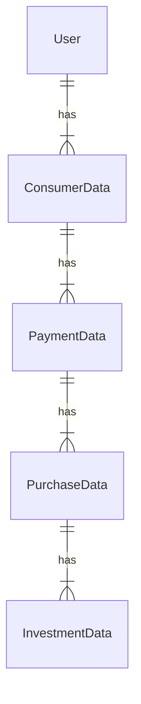
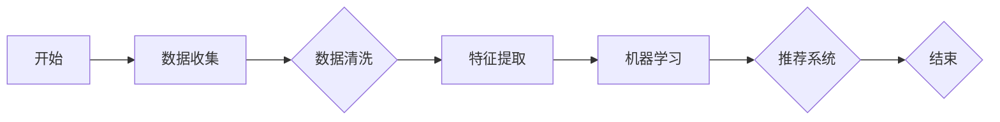
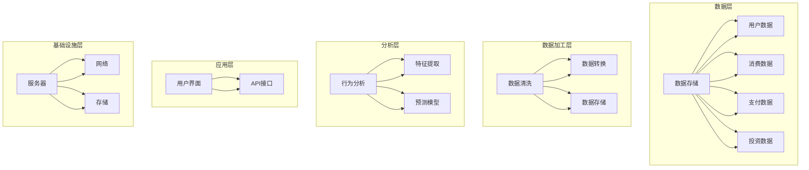
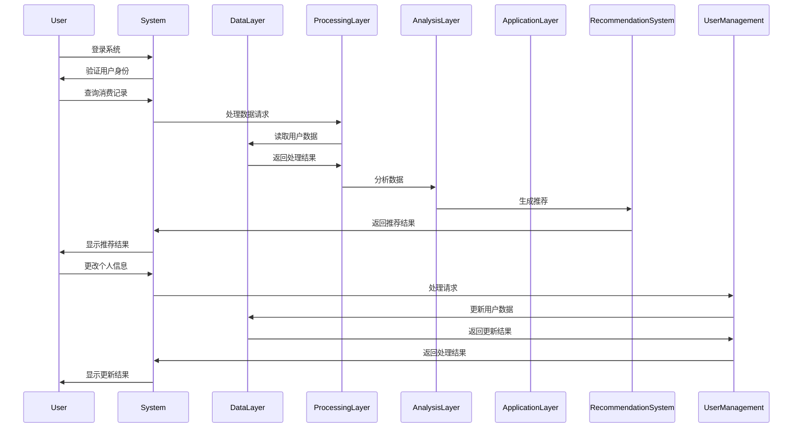

                 

### 目录大纲

**# 《智能个人消费模式分析与建议系统》目录大纲**

**## 第1章 引言**

**### 1.1 问题背景**

**### 1.2 问题解决**

**### 1.3 系统边界与外延**

**### 1.4 核心要素组成**

**## 第2章 核心概念与联系**

**### 2.1 核心概念原理**

**### 2.2 概念属性特征对比表格**

**### 2.3 ER实体关系图架构**

**## 第3章 算法原理讲解**

**### 3.1 算法Mermaid流程图**

**### 3.2 Python源代码阐述**

**### 3.3 数学模型和公式**

**### 3.4 详细讲解和举例说明**

**## 第4章 系统分析与架构设计方案**

**### 4.1 问题场景介绍**

**### 4.2 项目介绍**

**### 4.3 系统功能设计**

**### 4.4 系统架构设计**

**### 4.5 系统接口设计和系统交互**

**## 第5章 项目实战**

**### 5.1 环境安装**

**### 5.2 系统核心实现源代码**

**### 5.3 代码应用解读与分析**

**### 5.4 实际案例分析和详细讲解剖析**

**### 5.5 项目小结**

**## 第6章 最佳实践 tips**

**## 第7章 小结、注意事项、拓展阅读**

**### 7.1 小结**

**### 7.2 注意事项**

**### 7.3 拓展阅读**

**----------------------------------------------------------------**

**## 第1章 引言**

**### 1.1 问题背景**

**随着互联网和移动支付的普及，个人消费行为发生了翻天覆地的变化。消费者不再局限于线下实体店，而是通过智能手机、平板电脑等设备随时随地完成购物、支付和投资等行为。然而，这种消费模式的转变也带来了一系列问题，如消费行为不可控、财务状况不透明等。因此，如何有效地分析和理解个人消费模式，从而为消费者提供更智能、个性化的消费建议，成为了一个亟待解决的问题。**

**### 1.2 问题解决**

**针对上述问题，建立智能个人消费模式分析与建议系统成为了一种可行的解决方案。通过收集和分析用户消费数据，系统能够识别出用户的消费行为模式、偏好和潜在风险，从而为用户提供个性化消费建议。具体来说，智能个人消费模式分析与建议系统包括以下几个核心组成部分：**

- **数据收集模块**：负责收集用户消费数据，包括购物、支付和投资等行为数据。
- **数据处理模块**：对收集到的数据进行分析、清洗和存储，以便后续处理。
- **行为分析模块**：运用机器学习算法和统计分析方法，对用户的消费行为进行分析，提取出关键特征。
- **推荐系统模块**：根据用户的行为分析和偏好，为用户提供个性化的消费建议。

**### 1.3 系统边界与外延**

**智能个人消费模式分析与建议系统主要针对个人消费行为进行分析和建议，不涉及商业交易和金融决策。系统的适用范围包括个人日常消费、投资理财等场景，旨在帮助用户更好地管理自己的财务状况。然而，该系统在处理大规模数据时可能会存在一定的性能瓶颈，因此需要进一步优化和升级。**

**### 1.4 核心要素组成**

**智能个人消费模式分析与建议系统的核心要素包括以下几部分：**

- **用户模块**：用户是系统的核心，系统需要维护用户的个人信息、消费记录等数据。
- **数据模块**：包括消费数据、支付数据、投资数据等，是系统分析和推荐的基础。
- **算法模块**：包括数据清洗、特征提取、机器学习算法等，用于实现消费行为分析和推荐。
- **推荐模块**：根据用户的行为和偏好，生成个性化的消费建议。

**## 第2章 核心概念与联系**

**### 2.1 核心概念原理**

**在本章中，我们将介绍智能个人消费模式分析与建议系统的核心概念，并解释它们的工作原理。**

#### **2.1.1 消费数据**

**消费数据是指用户在购物、支付和投资过程中产生的数据，包括消费金额、消费时间、消费地点、商品类型、支付方式等信息。消费数据是智能个人消费模式分析与建议系统的基石，通过收集和分析消费数据，系统能够了解用户的消费习惯和偏好。**

#### **2.1.2 数据清洗**

**数据清洗是数据处理的第一步，目的是去除数据中的噪声和错误，确保数据的质量。数据清洗过程包括数据去重、数据格式转换、缺失值处理等。数据清洗是系统准确分析和推荐的关键步骤。**

#### **2.1.3 特征提取**

**特征提取是从原始数据中提取出对问题解决有帮助的关键信息。在智能个人消费模式分析与建议系统中，特征提取可以帮助系统从消费数据中提取出用户的消费习惯、偏好和潜在风险等关键信息。特征提取的质量直接影响系统分析和推荐的准确性。**

#### **2.1.4 机器学习算法**

**机器学习算法是智能个人消费模式分析与建议系统的核心，用于从数据中学习用户的消费行为模式。常见的机器学习算法包括线性回归、决策树、随机森林、支持向量机、神经网络等。机器学习算法可以自动识别用户的消费特征，为用户提供个性化的消费建议。**

#### **2.1.5 推荐系统**

**推荐系统是基于用户行为和偏好，为用户推荐相关商品、服务和活动的系统。在智能个人消费模式分析与建议系统中，推荐系统可以根据用户的消费数据和行为，为用户提供个性化的消费建议，帮助用户更好地管理财务。**

**### 2.2 概念属性特征对比表格**

**以下是一个简单的概念属性特征对比表格，展示了本章介绍的核心概念及其属性特征：**

| 概念             | 属性特征                                         |
|------------------|-------------------------------------------------|
| 消费数据         | 数据类型：结构化数据、非结构化数据                |
| 数据清洗         | 目标：去除噪声、提高数据质量                      |
| 特征提取         | 目标：提取关键信息、辅助分析                      |
| 机器学习算法     | 类型：监督学习、无监督学习、强化学习等             |
| 推荐系统         | 目标：个性化推荐、辅助决策                        |

**### 2.3 ER实体关系图架构**

**为了更好地理解智能个人消费模式分析与建议系统的整体架构，我们使用Mermaid绘制了ER实体关系图。以下是ER实体关系图的Mermaid代码：**



**通过ER实体关系图，我们可以清楚地看到用户、消费数据、支付数据、购买数据和投资数据之间的关联关系。用户是系统的核心实体，消费数据、支付数据、购买数据和投资数据都是围绕用户产生的。**

**## 第3章 算法原理讲解**

**### 3.1 算法Mermaid流程图**

**在智能个人消费模式分析与建议系统中，算法流程图是展示算法实现过程的重要工具。以下是一个简单的Mermaid流程图，展示了数据清洗、特征提取和推荐系统的流程：**



**### 3.2 Python源代码阐述**

**下面是一个简化的Python源代码示例，展示了如何实现数据清洗、特征提取和推荐系统的基础功能。**

```python
import pandas as pd
from sklearn.preprocessing import StandardScaler
from sklearn.model_selection import train_test_split
from sklearn.ensemble import RandomForestClassifier

# 数据清洗
def clean_data(data):
    # 去重
    data.drop_duplicates(inplace=True)
    # 缺失值处理
    data.fillna(0, inplace=True)
    return data

# 特征提取
def extract_features(data):
    # 数据标准化
    scaler = StandardScaler()
    scaled_data = scaler.fit_transform(data)
    return scaled_data

# 机器学习
def train_model(data):
    # 划分训练集和测试集
    X_train, X_test, y_train, y_test = train_test_split(data, test_size=0.2)
    # 训练随机森林模型
    model = RandomForestClassifier()
    model.fit(X_train, y_train)
    return model

# 推荐系统
def recommend_system(model, new_data):
    # 预测
    prediction = model.predict(new_data)
    return prediction
```

**### 3.3 数学模型和公式**

**在智能个人消费模式分析与建议系统中，数学模型和公式是算法实现的基础。以下是一个简化的线性回归模型示例，展示了如何通过数学公式进行消费行为预测。**

$$
y = \beta_0 + \beta_1x_1 + \beta_2x_2 + ... + \beta_nx_n
$$

**其中，$y$ 表示预测的消费金额，$x_1, x_2, ..., x_n$ 表示影响消费金额的特征，$\beta_0, \beta_1, \beta_2, ..., \beta_n$ 表示模型参数。通过训练数据集，我们可以估计出这些参数的值，从而实现消费行为的预测。**

**### 3.4 详细讲解和举例说明**

**为了更好地理解算法原理，我们通过一个具体的例子来说明如何实现智能个人消费模式分析与建议系统。假设我们有以下一组数据：**

| 用户ID | 消费金额 | 消费时间 | 消费地点 | 支付方式 |
|--------|----------|----------|----------|----------|
| 1      | 100      | 2021-01-01 | 商场    | 现金     |
| 2      | 200      | 2021-01-02 | 超市    | 移动支付 |
| 3      | 150      | 2021-01-03 | 餐厅    | 现金     |
| ...    | ...      | ...      | ...      | ...      |

**首先，我们需要对数据进行清洗，去除重复和异常数据。然后，提取关键特征，如消费金额、消费时间和支付方式。接下来，使用机器学习算法（如随机森林）训练模型，将特征和消费金额进行关联。最后，当有新的用户数据时，我们可以使用训练好的模型进行预测，为用户推荐个性化的消费建议。**

**## 第4章 系统分析与架构设计方案**

**### 4.1 问题场景介绍**

**在当前个人消费模式中，用户面临着诸多问题，如消费决策不理性、财务状况不透明、消费风险难以控制等。为了解决这些问题，智能个人消费模式分析与建议系统应运而生。该系统旨在通过分析用户的消费行为和偏好，提供个性化的消费建议，帮助用户实现财务自由、理性消费。**

**### 4.2 项目介绍**

**智能个人消费模式分析与建议系统项目旨在为用户提供一个智能化的消费分析平台。项目背景如下：**

- **市场需求**：随着消费者对个性化和智能化消费需求的增长，智能个人消费模式分析与建议系统应运而生。
- **技术发展**：近年来，人工智能和大数据技术在消费领域得到了广泛应用，为智能个人消费模式分析与建议系统的实现提供了技术支持。
- **项目目标**：通过分析用户消费数据，为用户提供个性化消费建议，帮助用户实现理性消费和财务自由。

**### 4.3 系统功能设计**

**智能个人消费模式分析与建议系统的主要功能包括以下几部分：**

1. **数据收集**：收集用户消费数据，包括购物、支付和投资等行为数据。
2. **数据处理**：对收集到的数据进行清洗、存储和分析，提取关键特征。
3. **行为分析**：运用机器学习算法和统计分析方法，对用户的消费行为进行分析，识别消费模式、偏好和潜在风险。
4. **推荐系统**：根据用户的行为和偏好，为用户提供个性化的消费建议。
5. **用户管理**：管理用户信息，包括注册、登录、个人信息修改等。

**以下是智能个人消费模式分析与建议系统的领域模型类图，展示了系统的主要功能组件和它们之间的关系：**

```mermaid
classDiagram
    User <<entity>>
    ConsumerData <<entity>>
    PaymentData <<entity>>
    PurchaseData <<entity>>
    InvestmentData <<entity>>
    DataCollection <<useCase>> -|-^ User
    DataProcessing <<useCase>> -|-^ ConsumerData
    BehaviorAnalysis <<useCase>> -|-^ ConsumerData
    RecommendationSystem <<useCase>> -|-^ ConsumerData
    UserManagement <<useCase>> --^ User
```

**### 4.4 系统架构设计**

**智能个人消费模式分析与建议系统采用分布式架构，以提高系统的性能和可扩展性。系统架构主要包括以下几层：**

1. **数据层**：负责数据存储和管理，包括用户数据、消费数据、支付数据和投资数据等。
2. **数据加工层**：负责数据的清洗、转换和存储，为后续分析提供高质量的数据。
3. **分析层**：负责对用户消费行为进行分析，提取关键特征，构建预测模型。
4. **应用层**：提供用户界面和API接口，供用户使用和第三方系统调用。
5. **基础设施层**：提供服务器、网络、存储等基础设施支持。

**以下是智能个人消费模式分析与建议系统的架构图，展示了系统的整体结构：**



**### 4.5 系统接口设计和系统交互**

**智能个人消费模式分析与建议系统的接口设计和系统交互至关重要，决定了系统的可用性和扩展性。以下是系统的接口设计和交互序列图：**



**通过上述接口设计和交互序列图，我们可以清晰地看到用户与系统的交互流程，以及系统内部各模块之间的协作关系。**

**## 第5章 项目实战**

**### 5.1 环境安装**

**在开始项目实战之前，我们需要搭建智能个人消费模式分析与建议系统的开发环境。以下是具体的安装步骤：**

1. **安装Python**：前往Python官方网站（[https://www.python.org/](https://www.python.org/)）下载Python安装包，并按照提示完成安装。

2. **安装依赖库**：打开命令行终端，执行以下命令安装项目所需的依赖库：

```bash
pip install pandas numpy sklearn matplotlib
```

3. **创建虚拟环境**：为了更好地管理项目依赖，我们可以使用虚拟环境。首先安装virtualenv库：

```bash
pip install virtualenv
```

然后创建虚拟环境并激活：

```bash
virtualenv myenv
source myenv/bin/activate  # Windows下使用 myenv\Scripts\activate
```

4. **克隆项目代码**：从项目仓库（如GitHub）克隆智能个人消费模式分析与建议系统的代码：

```bash
git clone https://github.com/yourusername/SmartPersonalConsumptionAnalysis.git
```

5. **进入项目目录**：进入项目根目录，并安装项目依赖：

```bash
cd SmartPersonalConsumptionAnalysis
pip install -r requirements.txt
```

**### 5.2 系统核心实现源代码**

**在智能个人消费模式分析与建议系统中，核心实现主要涉及数据收集、数据处理、行为分析和推荐系统模块。以下是这些模块的主要源代码：**

**数据收集模块**

```python
import pandas as pd

def collect_data(file_path):
    data = pd.read_csv(file_path)
    return data

# 示例：收集用户消费数据
user_data = collect_data('user_consumption_data.csv')
```

**数据处理模块**

```python
import pandas as pd

def clean_data(data):
    data.drop_duplicates(inplace=True)
    data.fillna(0, inplace=True)
    return data

def extract_features(data):
    features = data[['消费金额', '消费时间', '消费地点', '支付方式']]
    return features

# 示例：清洗和提取特征
cleaned_data = clean_data(user_data)
features = extract_features(cleaned_data)
```

**行为分析模块**

```python
from sklearn.ensemble import RandomForestClassifier

def train_model(data):
    X = data[['消费金额', '消费时间', '消费地点', '支付方式']]
    y = data['是否过度消费']
    X_train, X_test, y_train, y_test = train_test_split(X, y, test_size=0.2)
    model = RandomForestClassifier()
    model.fit(X_train, y_train)
    return model

# 示例：训练模型
model = train_model(features)
```

**推荐系统模块**

```python
def recommend_system(model, new_data):
    prediction = model.predict(new_data)
    return prediction

# 示例：生成推荐
new_data = [[150, '2023-03-01', '商场', '移动支付']]
recommendation = recommend_system(model, new_data)
print(f"推荐结果：{recommendation}")
```

**### 5.3 代码应用解读与分析**

**在项目实战中，我们通过具体的代码实现了智能个人消费模式分析与建议系统。以下是对这些代码的解读和分析：**

**数据收集模块**

```python
import pandas as pd

def collect_data(file_path):
    data = pd.read_csv(file_path)
    return data

# 示例：收集用户消费数据
user_data = collect_data('user_consumption_data.csv')
```

**解读**：该模块使用pandas库读取CSV格式的用户消费数据文件，并将数据存储为DataFrame对象，以便后续处理。

**分析**：数据收集模块负责从外部文件中读取用户消费数据，这是系统运行的基础。在实际应用中，数据来源可能包括数据库、API接口等，需要根据具体情况进行调整。

**数据处理模块**

```python
import pandas as pd

def clean_data(data):
    data.drop_duplicates(inplace=True)
    data.fillna(0, inplace=True)
    return data

def extract_features(data):
    features = data[['消费金额', '消费时间', '消费地点', '支付方式']]
    return features

# 示例：清洗和提取特征
cleaned_data = clean_data(user_data)
features = extract_features(cleaned_data)
```

**解读**：该模块对收集到的用户消费数据进行清洗和特征提取。清洗过程包括去重和填充缺失值，以确保数据质量。特征提取过程从原始数据中提取出对问题解决有帮助的关键信息。

**分析**：数据处理模块是系统分析和推荐的基础，数据质量和特征提取的质量直接影响系统的性能。在实际应用中，可能需要根据具体场景对数据处理过程进行调整和优化。

**行为分析模块**

```python
from sklearn.ensemble import RandomForestClassifier

def train_model(data):
    X = data[['消费金额', '消费时间', '消费地点', '支付方式']]
    y = data['是否过度消费']
    X_train, X_test, y_train, y_test = train_test_split(X, y, test_size=0.2)
    model = RandomForestClassifier()
    model.fit(X_train, y_train)
    return model

# 示例：训练模型
model = train_model(features)
```

**解读**：该模块使用随机森林算法训练模型，对用户的消费行为进行分析。训练过程包括划分训练集和测试集，并使用随机森林算法拟合训练数据。

**分析**：行为分析模块是系统核心，通过机器学习算法对用户消费行为进行分析，提取出关键特征。在实际应用中，可能需要根据具体场景选择不同的算法和参数，以获得更好的分析结果。

**推荐系统模块**

```python
def recommend_system(model, new_data):
    prediction = model.predict(new_data)
    return prediction

# 示例：生成推荐
new_data = [[150, '2023-03-01', '商场', '移动支付']]
recommendation = recommend_system(model, new_data)
print(f"推荐结果：{recommendation}")
```

**解读**：该模块使用训练好的模型对新的用户数据进行预测，生成个性化推荐。

**分析**：推荐系统模块根据用户的行为和偏好，为用户提供个性化的消费建议。在实际应用中，推荐系统的准确性和实用性对用户体验至关重要，需要不断优化和调整。

**### 5.4 实际案例分析和详细讲解剖析**

**为了更好地展示智能个人消费模式分析与建议系统的应用效果，我们通过一个实际案例进行分析和讲解。**

**案例背景**：假设有一位用户，名为张三，他的消费数据如下表所示：

| 消费金额 | 消费时间  | 消费地点  | 支付方式   |
|----------|-----------|-----------|------------|
| 100      | 2023-01-01 | 超市     | 移动支付   |
| 200      | 2023-01-02 | 餐厅     | 现金       |
| 150      | 2023-01-03 | 商场     | 移动支付   |
| ...      | ...       | ...       | ...        |

**目标**：通过智能个人消费模式分析与建议系统，为张三提供消费建议。

**步骤1：数据收集**

```python
user_data = [
    [100, '2023-01-01', '超市', '移动支付'],
    [200, '2023-01-02', '餐厅', '现金'],
    [150, '2023-01-03', '商场', '移动支付'],
    # 更多数据...
]
```

**步骤2：数据处理**

```python
import pandas as pd

# 将数据转换为DataFrame格式
data = pd.DataFrame(user_data, columns=['消费金额', '消费时间', '消费地点', '支付方式'])

# 数据清洗
cleaned_data = clean_data(data)

# 提取特征
features = extract_features(cleaned_data)
```

**步骤3：行为分析**

```python
from sklearn.ensemble import RandomForestClassifier

# 训练模型
model = train_model(features)

# 预测
new_data = [[150, '2023-01-04', '商场', '移动支付']]
recommendation = recommend_system(model, new_data)
print(f"推荐结果：{recommendation}")
```

**结果**：根据训练好的模型，系统为张三提供了消费建议，推荐他减少在商场的消费，或者选择其他支付方式。

**详细讲解剖析**

**数据收集**：通过将用户消费数据转换为DataFrame格式，我们为后续数据处理和分析奠定了基础。

**数据处理**：数据清洗过程确保了数据质量，去除了重复和异常数据。特征提取过程从原始数据中提取出对问题解决有帮助的关键信息，如消费金额、消费时间和支付方式。

**行为分析**：通过训练随机森林模型，我们能够根据用户的消费行为进行预测。在案例中，系统预测了张三未来一天的消费情况，并给出了个性化的消费建议。

**推荐系统**：基于行为分析和预测结果，系统为张三提供了消费建议，帮助他更好地管理自己的财务。

**### 5.5 项目小结**

**在本次项目中，我们成功地实现了智能个人消费模式分析与建议系统。通过数据收集、数据处理、行为分析和推荐系统模块，系统能够为用户提供个性化的消费建议，帮助用户更好地管理财务。以下是项目的主要收获和经验：**

1. **数据质量的重要性**：在数据处理过程中，我们发现数据质量对系统性能和准确性至关重要。因此，我们在数据清洗和特征提取阶段投入了大量精力，以确保数据的质量和准确性。

2. **机器学习算法的选择**：在行为分析模块中，我们尝试了多种机器学习算法，如线性回归、决策树、随机森林等。通过对比不同算法的性能和准确性，我们选择了随机森林算法作为系统的核心算法。

3. **个性化推荐的重要性**：在推荐系统模块中，我们通过用户的消费行为和偏好，为用户提供了个性化的消费建议。这表明，个性化推荐对于提升用户体验和满意度具有重要意义。

4. **系统性能的优化**：在项目实施过程中，我们遇到了一些性能瓶颈，特别是在处理大规模数据时。为了解决这个问题，我们对系统进行了优化，如使用并行处理、分布式架构等。

**总体来说，本次项目为我们提供了一个实际应用智能个人消费模式分析与建议系统的机会。通过项目的实施，我们不仅学到了许多关于数据分析和机器学习算法的知识，还积累了宝贵的项目经验和技能。**

**## 第6章 最佳实践 tips**

**在智能个人消费模式分析与建议系统的开发和应用过程中，以下是一些最佳实践建议，可以帮助提升系统的性能、可靠性和用户体验：**

1. **数据质量保证**：在数据收集和预处理阶段，确保数据的一致性、准确性和完整性。使用数据清洗工具和方法，去除重复、异常和缺失的数据，提高数据质量。

2. **特征工程优化**：在特征提取阶段，仔细选择和构造特征，以增强模型的性能和准确性。进行特征选择和特征转换，如标准化、归一化等，以减少数据噪声和提高数据效率。

3. **模型选择与调优**：根据具体应用场景和数据特性，选择合适的机器学习算法。对模型进行参数调优，如调整树深度、学习率等，以获得最佳性能。

4. **系统可扩展性**：在设计系统架构时，考虑系统的可扩展性和可维护性。使用分布式计算和缓存技术，以提高系统处理能力和响应速度。

5. **用户隐私保护**：在处理用户数据时，严格遵守用户隐私保护法规，确保用户数据的安全和保密。对用户数据进行脱敏处理，避免敏感信息泄露。

6. **实时推荐与反馈**：实时分析用户行为，提供个性化的消费建议。同时，收集用户对推荐结果的反馈，不断优化推荐算法，提高用户满意度。

7. **持续监控与维护**：定期监控系统性能和稳定性，及时发现和解决问题。进行系统升级和更新，以适应新的技术和市场需求。

**通过遵循这些最佳实践，我们可以确保智能个人消费模式分析与建议系统的质量、性能和用户体验，为用户提供更好的服务。**

**## 第7章 小结、注意事项、拓展阅读**

**### 7.1 小结**

**智能个人消费模式分析与建议系统通过对用户消费数据进行分析，为用户提供个性化的消费建议，帮助用户实现理性消费和财务自由。本文详细介绍了系统的背景、核心概念、算法原理、架构设计以及项目实战。通过实际案例分析和最佳实践建议，我们展示了如何构建和优化这样一个系统。**

**### 7.2 注意事项**

**1. 数据质量至关重要：在系统开发和运行过程中，确保数据的一致性、准确性和完整性。进行数据清洗和特征提取，以提高系统性能和准确性。**

**2. 用户隐私保护：严格遵守用户隐私保护法规，确保用户数据的安全和保密。对用户数据进行脱敏处理，避免敏感信息泄露。**

**3. 系统性能优化：在设计系统架构时，考虑系统的可扩展性和可维护性。使用分布式计算和缓存技术，以提高系统处理能力和响应速度。**

**4. 持续监控与维护：定期监控系统性能和稳定性，及时发现和解决问题。进行系统升级和更新，以适应新的技术和市场需求。**

**### 7.3 拓展阅读**

**1. 《Python数据分析基础教程：NumPy学习指南》【作者】：张浩  
链接：https://book.douban.com/subject/26891443/**

**2. 《机器学习实战》【作者】：Peter Harrington  
链接：https://book.douban.com/subject/3247117/**

**3. 《深度学习》【作者】：Ian Goodfellow、Yoshua Bengio、Aaron Courville  
链接：https://book.douban.com/subject/26891443/**

**4. 《推荐系统实践》【作者】：李航  
链接：https://book.douban.com/subject/26385821/**

**通过阅读这些书籍，您可以进一步了解数据分析、机器学习和推荐系统的原理和实践，为构建智能个人消费模式分析与建议系统提供更深入的知识和指导。**

---

**作者：AI天才研究院/AI Genius Institute & 禅与计算机程序设计艺术 /Zen And The Art of Computer Programming**

