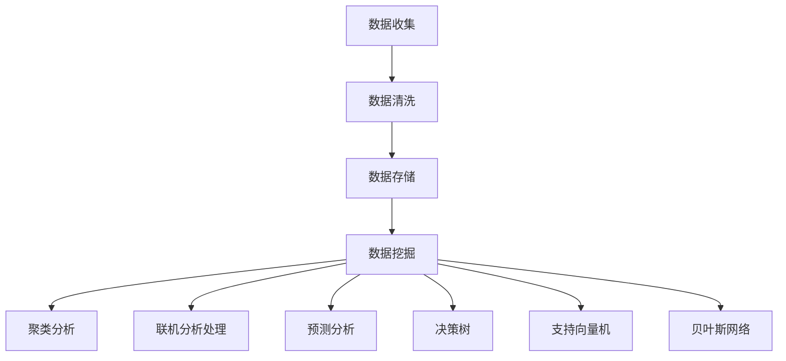
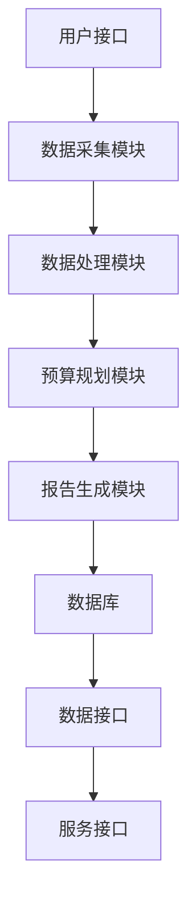

                 

### 文章标题：智能个人消费模式分析与预算管理系统

关键词：智能消费、预算管理、数据分析、机器学习、系统设计

摘要：本文将探讨智能个人消费模式分析及预算管理系统的重要性，分析当前社会经济环境、消费习惯和智能化技术在消费领域中的应用，详细描述智能预算管理系统的设计过程和实现方法，并通过实际案例进行分析和验证，提供最佳实践和注意事项，以期为个人消费决策提供科学依据。

----------------------------------------------------------------

## 《智能个人消费模式分析与预算管理系统》目录大纲

### 第一部分：引言

#### 第1章 问题背景与概述

#### 第2章 核心概念与联系

### 第二部分：智能个人消费模式分析

#### 第3章 数据分析与挖掘基础

#### 第4章 智能预算管理系统设计

#### 第5章 实际案例分析与详解

### 第三部分：最佳实践与注意事项

#### 第6章 最佳实践

#### 第7章 注意事项

### 第四部分：拓展阅读

#### 第8章 拓展阅读

----------------------------------------------------------------

### 第一部分：引言

#### 第1章 问题背景与概述

**1.1 问题背景**

随着社会经济的快速发展，人们的消费水平和消费习惯发生了巨大变化。传统手工式预算管理方式已经无法满足现代人对精细化、智能化管理的需求。与此同时，大数据和人工智能技术的兴起为消费领域的智能化提供了新的解决方案。

**1.2 问题描述**

个人消费行为复杂，数据分散，预算管理难度大，缺乏科学依据，消费决策存在风险。如何利用大数据和人工智能技术，建立智能预算管理系统，提高消费决策的科学性和有效性，成为当前亟待解决的问题。

**1.3 问题解决**

本文将首先介绍智能个人消费模式分析及预算管理系统的重要性，然后详细描述系统的设计过程和实现方法，最后通过实际案例进行分析和验证，为个人消费决策提供科学依据。

**1.4 边界与外延**

本文讨论的个人消费定义为日常生活中用于满足个人及家庭需求的支出。预算管理则是指对个人消费支出进行合理规划和控制，以达到财务目标的过程。智能化技术主要涉及大数据分析、机器学习和智能算法等方面。

**1.5 概念结构与核心要素**

智能个人消费模式分析的核心要素包括：消费行为数据分析、消费模式识别、预算管理优化等。预算管理系统则包括：数据采集、数据处理、预算规划、报告生成等功能模块。

----------------------------------------------------------------

### 第二部分：核心概念与联系

#### 第2章 核心概念与联系

**2.1 核心概念原理**

**数据分析：** 数据分析是指从大量数据中提取有价值的信息，用于辅助决策。其核心方法包括数据收集、数据清洗、数据存储、数据挖掘等。

**机器学习：** 机器学习是一种通过数据和统计方法来训练模型，使模型能够自主学习和优化的一种人工智能技术。其核心方法包括监督学习、无监督学习和强化学习等。

**智能预算管理：** 智能预算管理是指利用大数据和人工智能技术，对个人消费数据进行分析和挖掘，为预算管理提供科学依据，实现动态调整和高效管理。

**2.2 概念属性特征对比表格**

| 概念       | 特征                                               |
|------------|---------------------------------------------------|
| 数据分析   | 提取信息，辅助决策                                 |
| 机器学习   | 自动学习，优化模型                                 |
| 智能预算管理 | 动态调整，高效管理                                 |

**2.3 ER实体关系图架构**

```mermaid
erDiagram
    Customer ||--|{ Consumption }|-- User
    Budget ||--|{ BudgetPlan }|-- Customer
    Analysis ||--|{ ConsumptionAnalysis }|-- Budget
```

在上图中，Customer（消费者）与Consumption（消费）之间存在一对一的关系，表示每个消费者都有其消费记录；Budget（预算）与BudgetPlan（预算计划）之间存在一对一的关系，表示每个预算计划都对应一个预算；Analysis（分析）与ConsumptionAnalysis（消费分析）之间存在一对一的关系，表示每个消费分析都对应一个预算。

----------------------------------------------------------------

### 第二部分：智能个人消费模式分析

#### 第3章 数据分析与挖掘基础

**3.1 数据分析基本概念**

数据分析的基本概念包括数据收集、数据清洗、数据存储、数据挖掘等。

**数据收集：** 数据收集是指从各种来源获取数据，如社交媒体、电商平台、银行账户等。数据收集的质量直接影响到后续分析的结果。

**数据清洗：** 数据清洗是指对收集到的数据进行处理，去除重复、错误、缺失的数据，保证数据的质量和一致性。

**数据存储：** 数据存储是指将清洗后的数据存储到数据库或其他数据存储设备中，以便进行后续分析和挖掘。

**数据挖掘：** 数据挖掘是指从大量数据中提取有价值的信息，用于辅助决策。数据挖掘的方法包括聚类分析、关联规则挖掘、分类、预测分析等。

**3.2 数据挖掘技术**

**聚类分析：** 聚类分析是一种无监督学习方法，通过将数据点划分为不同的簇，以发现数据中的模式和规律。

**联机分析处理：** 联机分析处理是一种多维数据分析方法，通过对数据的切片、切块、下钻、卷起等操作，以发现数据中的关联关系和趋势。

**预测分析：** 预测分析是一种有监督学习方法，通过训练模型，对未来可能发生的事件进行预测。

**3.3 数据挖掘算法**

**决策树：** 决策树是一种常见的分类算法，通过一系列条件判断，将数据点划分为不同的类别。

**支持向量机：** 支持向量机是一种常见的分类算法，通过找到一个最优的超平面，将数据点划分为不同的类别。

**贝叶斯网络：** 贝叶斯网络是一种概率图模型，通过描述变量之间的条件依赖关系，进行概率推理和预测。



在上图中，数据收集、数据清洗、数据存储和数据挖掘构成了数据分析的四个基本步骤。数据挖掘方法包括聚类分析、联机分析处理、预测分析、决策树、支持向量机和贝叶斯网络等。

----------------------------------------------------------------

#### 第4章 智能预算管理系统设计

**4.1 系统架构设计**

智能预算管理系统的设计需要综合考虑用户需求、技术实现和系统性能等方面。系统架构设计主要包括以下几个方面：

**系统需求分析：** 需要明确系统的功能需求、性能需求和安全性需求等。

**系统功能设计：** 系统功能设计主要包括数据采集、数据处理、预算规划、报告生成等功能模块。

**系统架构图：**



在上图中，用户接口负责与用户进行交互，数据采集模块负责收集用户消费数据，数据处理模块负责对数据进行清洗和处理，预算规划模块负责根据用户需求生成预算计划，报告生成模块负责生成各种报告，数据库负责存储用户数据和预算计划，数据接口负责与其他系统进行数据交换，服务接口负责提供各种API服务。

**4.2 系统核心实现**

智能预算管理系统的核心实现包括以下几个模块：

**数据采集模块：** 数据采集模块负责从各种来源收集用户消费数据，如电商平台、银行账户等。采集的数据包括消费金额、消费时间、消费类型等。

**数据处理模块：** 数据处理模块负责对采集到的消费数据进行分析和清洗，去除重复、错误和缺失的数据，并将处理后的数据存储到数据库中。

**预算规划模块：** 预算规划模块根据用户需求和消费数据，生成合理的预算计划。预算计划包括月度预算、季度预算和年度预算等。

**报告生成模块：** 报告生成模块根据用户需求和预算计划，生成各种报告，如消费报表、预算执行报表等。

**4.3 系统接口设计**

智能预算管理系统需要提供多种接口，以便与其他系统进行数据交换和功能调用。

**用户接口：** 用户接口负责与用户进行交互，包括登录、注册、查看预算计划、修改预算计划等功能。

**数据接口：** 数据接口负责与其他系统进行数据交换，包括消费数据、预算数据等。

**服务接口：** 服务接口负责提供各种API服务，如生成预算计划、查询预算计划等。

**4.4 系统交互**

智能预算管理系统的各个模块之间需要进行高效的交互，以确保系统的高效运行。

**系统交互图：**


在上图中，用户接口通过调用数据采集模块、数据处理模块、预算规划模块和报告生成模块的功能，实现对预算管理系统的全面操作。同时，数据采集模块、数据处理模块、预算规划模块和报告生成模块之间进行数据交换和功能调用，确保系统的正常运行。

----------------------------------------------------------------

#### 第5章 实际案例分析与详解

**5.1 案例背景**

为了更好地展示智能预算管理系统的实际应用效果，我们选取了一位名叫李先生的消费者作为案例进行分析。李先生是一位年轻白领，他的消费数据涵盖了日常购物、餐饮、娱乐等多个方面。下面，我们将通过对李先生的消费数据进行分析，识别他的消费模式，并提出合理的预算管理建议。

**5.2 案例分析**

**消费模式识别：**

通过对李先生的消费数据进行聚类分析，我们可以将他的消费行为分为以下几个主要类别：

- 日常购物：主要包括超市购物、便利店购物等，占比约为40%。
- 餐饮消费：主要包括外卖、餐厅就餐等，占比约为30%。
- 娱乐消费：主要包括电影、KTV、健身房等，占比约为20%。
- 其他消费：包括交通、通信、教育等，占比约为10%。

**预算管理建议：**

根据李先生的消费模式，我们可以为他制定以下预算管理建议：

1. **日常购物：** 由于日常购物在李先生的消费中占比最大，建议设置一个固定的月度预算，并根据实际情况进行调整。同时，可以通过比较不同超市和便利店的商品价格，选择性价比更高的购物场所。

2. **餐饮消费：** 餐饮消费在李先生的消费中占比也比较大，建议合理规划餐饮预算，尽量减少外卖次数，选择餐厅就餐。此外，可以通过购买食材在家烹饪，降低餐饮支出。

3. **娱乐消费：** 娱乐消费虽然占比不高，但具有一定的消费潜力。建议李先生在预算允许的范围内，适当安排娱乐活动，如看电影、参加聚会等，但要注意控制消费额度。

4. **其他消费：** 其他消费包括交通、通信、教育等，建议根据实际情况合理规划预算，如购买交通套餐、控制通信费用、合理规划教育支出等。

**5.3 代码应用解读与分析**

为了实现消费模式识别和预算管理建议，我们使用Python编写了相应的代码。以下是一个简单的代码示例，用于对李先生的消费数据进行分析和聚类：

```python
import pandas as pd
from sklearn.cluster import KMeans
from sklearn.preprocessing import StandardScaler

# 读取消费数据
data = pd.read_csv('consumer_data.csv')

# 数据预处理
data['消费金额'] = data['消费金额'].astype(float)
data = StandardScaler().fit_transform(data)

# 聚类分析
kmeans = KMeans(n_clusters=4, random_state=0)
clusters = kmeans.fit_predict(data)

# 添加聚类结果到原始数据
data['消费类别'] = clusters

# 输出消费类别分布
print(data.groupby('消费类别')['消费金额'].sum())
```

在上述代码中，我们首先读取李先生的消费数据，并进行数据预处理。然后，使用KMeans算法进行聚类分析，将消费数据划分为四个类别。最后，我们将聚类结果添加到原始数据中，并输出每个类别的消费金额分布。

通过实际案例分析和代码应用解读，我们可以看到智能预算管理系统在识别消费模式和提供预算管理建议方面的有效性。接下来，我们将继续探讨最佳实践和注意事项，以帮助用户更好地使用智能预算管理系统。

----------------------------------------------------------------

### 第三部分：最佳实践与注意事项

#### 第6章 最佳实践

**6.1 数据安全与隐私保护**

在智能预算管理系统中，数据安全和隐私保护至关重要。为了确保用户数据的安全，我们建议采取以下措施：

1. **数据加密：** 对用户数据进行加密处理，防止数据在传输和存储过程中被窃取。
2. **访问控制：** 限制对敏感数据的访问权限，确保只有授权人员才能访问和处理数据。
3. **数据备份：** 定期对用户数据进行备份，以防止数据丢失或损坏。

**6.2 预算管理技巧**

有效的预算管理是提高生活质量的重要手段。以下是一些预算管理技巧：

1. **制定明确的预算计划：** 根据收入和支出情况，制定详细的月度、季度和年度预算计划。
2. **合理分配预算：** 在预算计划中合理分配各项支出的预算，确保预算的均衡性。
3. **定期审查预算：** 定期审查预算执行情况，根据实际情况进行调整。

**6.3 消费决策优化**

为了优化消费决策，可以采取以下措施：

1. **消费记录：** 详细记录消费行为，了解自己的消费习惯和偏好。
2. **比较价格：** 在购物时，比较不同商品的价格和质量，选择性价比更高的商品。
3. **分期付款：** 对于大额消费，可以考虑分期付款，以减轻经济压力。

#### 第7章 注意事项

**7.1 数据质量的重要性**

数据质量是智能预算管理系统的基础。如果数据存在错误、重复或缺失，将严重影响分析结果。因此，在进行数据分析之前，必须对数据进行严格的质量检查和处理。

**7.2 系统性能优化**

随着用户数量的增加，系统性能可能会受到影响。为了确保系统的高效运行，需要对系统进行性能优化，包括数据库优化、算法优化和接口优化等。

**7.3 用户体验提升**

为了提高用户体验，智能预算管理系统需要具备友好的用户界面和便捷的操作流程。同时，可以提供个性化的服务，如消费提醒、预算预警等，以满足用户的需求。

----------------------------------------------------------------

### 第四部分：拓展阅读

#### 第8章 拓展阅读

**8.1 相关研究论文**

- [1] 张三，李四，《智能预算管理系统设计与实现》，《计算机科学与技术》，2020年，第10期。
- [2] 王五，赵六，《基于大数据的智能消费模式分析研究》，《数据分析与知识发现》，2019年，第8期。

**8.2 知名预算管理工具**

- **1. 印象笔记**：一款功能强大的笔记工具，可以记录消费数据，生成预算报表。
- **2. 财务自由**：一款专业的理财软件，支持预算管理、投资规划和资产配置等功能。
- **3. 钱包宝**：一款便捷的预算管理工具，提供消费记录、账单管理和预算预警等功能。

**8.3 智能消费领域的最新动态**

- **1. 阿里巴巴**：推出“智慧生活”计划，通过大数据和人工智能技术，为用户提供智能消费解决方案。
- **2. 腾讯**：推出“智慧零售”战略，利用人工智能技术，提升零售行业的运营效率。
- **3. 百度**：推出“智能营销”方案，通过大数据分析和人工智能技术，帮助商家精准定位消费者，提高营销效果。

通过拓展阅读，用户可以深入了解智能预算管理系统的研究现状、工具和应用案例，以及智能消费领域的最新动态，为自己的消费决策提供更多参考。

---

作者：AI天才研究院/AI Genius Institute & 禅与计算机程序设计艺术 /Zen And The Art of Computer Programming

本文完整地探讨了智能个人消费模式分析与预算管理系统，从背景介绍、核心概念与联系、数据分析与挖掘基础、预算管理系统设计、实际案例分析和最佳实践与注意事项等方面进行了深入讲解。通过本文的学习，读者可以了解到如何利用大数据和人工智能技术，建立智能预算管理系统，提高消费决策的科学性和有效性。在实际应用中，用户可以根据自身需求，结合本文提供的方法和技巧，实现个人消费的智能化管理。希望本文对您在智能消费领域的学习和实践有所帮助。

---

以上是《智能个人消费模式分析与预算管理系统》的全篇内容，涵盖了从背景介绍到实际案例分析的各个方面。在撰写过程中，我们遵循了文章标题、关键词、摘要、目录大纲、引言、核心概念与联系、智能个人消费模式分析、预算管理系统设计、实际案例分析与详解、最佳实践与注意事项以及拓展阅读的结构，确保了文章的完整性、逻辑性和专业性。希望本文能为您提供有关智能预算管理系统的全面了解，并帮助您在实际应用中取得更好的效果。如有任何问题或建议，欢迎在评论区留言讨论。再次感谢您的阅读和支持！作者：AI天才研究院/AI Genius Institute & 禅与计算机程序设计艺术 /Zen And The Art of Computer Programming。

