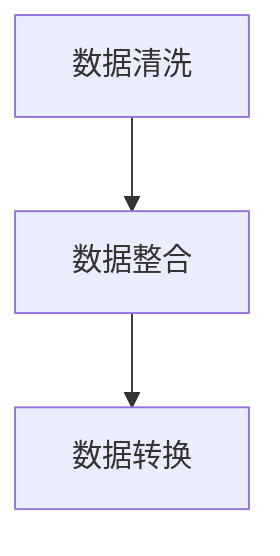
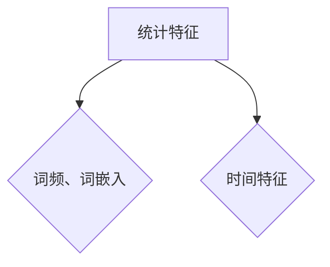
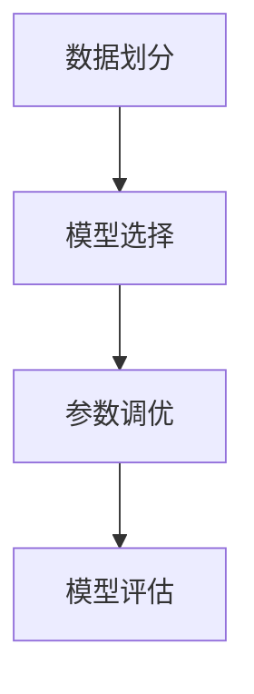
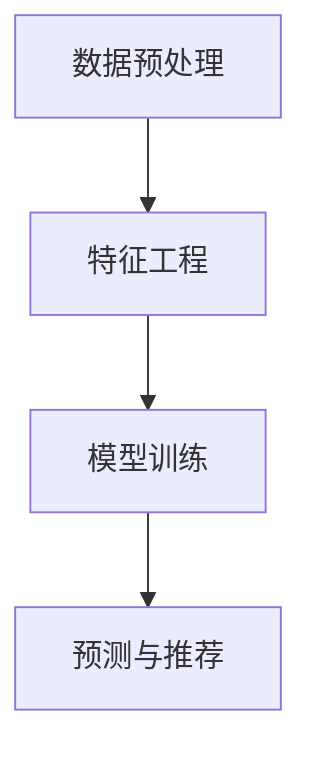
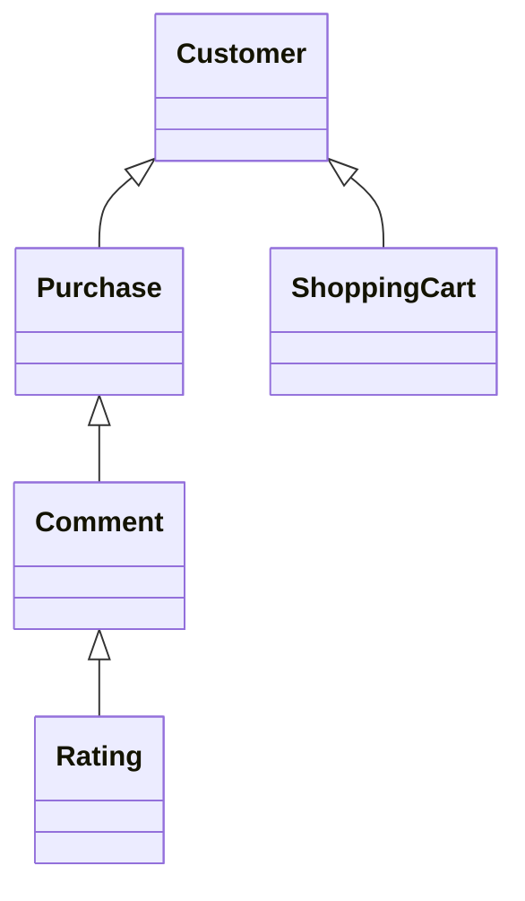
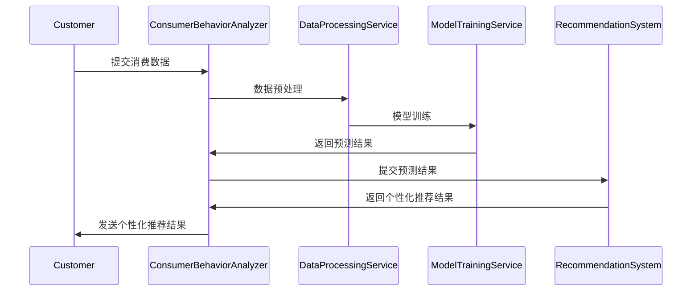

                 

# 智能个人消费模式分析器

## 关键词

- 个人消费模式
- 智能分析
- 大数据分析
- 人工智能
- 个性化推荐
- 消费者行为分析

## 摘要

随着消费者需求的不断升级，传统消费模式已经难以满足现代人的个性化、便捷化需求。智能个人消费模式分析器应运而生，通过大数据分析和人工智能技术，深入挖掘和分析个人消费行为，为消费者提供个性化的消费建议和服务。本文将从背景介绍、核心概念与联系、算法原理讲解、数学模型和数学公式、系统分析与架构设计方案、项目实战以及最佳实践 tips 等方面，全面探讨智能个人消费模式分析器的技术原理和实践应用。

## 第一部分：背景介绍

### 问题背景

随着社会经济的发展和科技的进步，个人消费模式逐渐呈现出多样化和智能化的发展趋势。传统的消费模式已经无法满足现代消费者对于个性化、便捷性和高效性的需求。在此背景下，智能个人消费模式分析器成为一种新兴的技术工具，它能够通过大数据分析、人工智能等技术手段，对个人消费行为进行深入挖掘和分析，从而为消费者提供个性化的消费建议和服务。

### 问题提出

智能个人消费模式分析器旨在解决以下问题：

1. 如何准确识别和预测个人消费行为？
2. 如何根据个人消费行为提供个性化的消费建议和服务？
3. 如何在保障用户隐私的前提下，高效处理和分析海量消费数据？

### 解决方案

智能个人消费模式分析器通过以下方式进行问题解决：

1. 大数据分析：收集和分析消费者在海量数据平台上的消费记录、评论、反馈等信息，挖掘消费行为模式和偏好。
2. 人工智能技术：利用机器学习和深度学习算法，对消费数据进行建模和分析，预测个人消费行为和偏好。
3. 个性化推荐：根据消费者的消费行为和偏好，为其提供个性化的消费建议和服务。

### 边界与外延

智能个人消费模式分析器主要应用于以下场景：

1. 电子商务平台：通过分析消费者在电商平台上的购物行为，为其提供个性化推荐和优惠信息。
2. 银行和金融机构：通过分析消费者的消费行为，为其提供信用评估、理财产品推荐等服务。
3. 零售行业：通过分析消费者的购物行为，为零售企业提供库存管理、营销策略优化等服务。

### 概念结构与核心要素组成

智能个人消费模式分析器由以下几个核心要素组成：

1. 数据采集：通过数据爬取、API接口等方式，收集消费者的消费数据。
2. 数据处理：对收集到的消费数据进行分析、清洗、整合，形成可用于分析的数据集。
3. 模型训练：利用机器学习和深度学习算法，对消费数据进行建模和训练，形成预测模型。
4. 推荐系统：根据消费者的消费行为和偏好，为其推荐个性化的消费建议和服务。
5. 系统接口：提供API接口，供第三方应用调用，实现消费数据分析和个性化推荐功能。

## 第二部分：核心概念与联系

### 核心概念

在智能个人消费模式分析器中，涉及到的核心概念包括：

1. **个人消费行为**：指消费者在购买商品或服务时的行为，包括购物频率、购买金额、购买商品类别等。
2. **消费数据**：指与个人消费行为相关的数据，如购物记录、评论、反馈等。
3. **大数据分析**：指利用海量数据对个人消费行为进行深入挖掘和分析的技术。
4. **人工智能**：指模拟人类智能，通过算法和模型实现数据分析和决策的技术。
5. **个性化推荐**：根据消费者的消费行为和偏好，为其推荐符合其需求的商品或服务。

### 概念属性特征对比表格

| 概念         | 属性特征                           |
| ------------ | ---------------------------------- |
| 个人消费行为 | 购买频率、购买金额、购买商品类别等 |
| 消费数据     | 购物记录、评论、反馈等             |
| 大数据分析   | 海量数据挖掘、分析                 |
| 人工智能     | 模拟人类智能、数据分析和决策       |
| 个性化推荐   | 根据消费者偏好、推荐商品或服务     |

### ER实体关系图架构

```mermaid
erDiagram
    Customer ||--|{ Purchase }|--| ShoppingCart
    Purchase ||--|{ Comment }|
    Comment ||--|{ Rating }|
    Customer ||--|{ Favorite }|
```

## 第三部分：算法原理讲解

### 数据预处理

在智能个人消费模式分析器中，首先需要对收集到的消费数据进行预处理，包括数据清洗、数据整合和数据转换等步骤。数据清洗主要是去除重复数据、缺失数据和异常数据，确保数据质量。数据整合是将多个数据源中的数据合并为一个统一的数据集，方便后续分析。数据转换则是将不同类型的数据转换为同一类型，如将文本数据转换为数值数据。

### 特征工程

特征工程是智能个人消费模式分析器中的关键步骤，它涉及到从原始数据中提取出对模型训练有用的特征。常用的特征提取方法包括：

1. **统计特征**：如平均购买金额、购买频率等。
2. **文本特征**：如商品名称、评论等，可以通过词频、词嵌入等方法进行提取。
3. **时间特征**：如购买时间、活动时间等，可以通过时间序列分析方法进行提取。

### 模型训练

在智能个人消费模式分析器中，常用的机器学习算法包括决策树、支持向量机、神经网络等。模型训练的过程是将特征数据输入到模型中，通过优化模型参数，使其能够准确预测个人消费行为。模型训练通常分为以下步骤：

1. **数据划分**：将数据集划分为训练集和测试集，用于训练和评估模型性能。
2. **模型选择**：选择合适的机器学习算法进行训练。
3. **参数调优**：通过交叉验证等方法，调整模型参数，优化模型性能。
4. **模型评估**：使用测试集评估模型性能，如准确率、召回率等。

### 预测与推荐

在模型训练完成后，可以通过预测算法对新的消费数据进行分析，预测个人消费行为。同时，结合个性化推荐算法，为消费者推荐符合其需求的商品或服务。常用的推荐算法包括基于内容的推荐、协同过滤推荐等。

### 算法原理讲解

#### 数据预处理



#### 特征工程



#### 模型训练



#### 预测与推荐



### 算法原理讲解

#### 数据预处理

在智能个人消费模式分析器中，数据预处理是模型训练的基础，其目标是去除噪声、填充缺失值、统一数据格式等，以提高数据质量。

1. **数据清洗**：去除重复数据、缺失数据和异常数据，如以下Python代码所示：

    ```python
    def clean_data(data):
        # 删除重复数据
        data = data.drop_duplicates()
        # 填充缺失值
        data = data.fillna(0)
        # 删除异常值
        data = data[(data['amount'] > 0) & (data['amount'] < 10000)]
        return data
    ```

2. **数据整合**：将多个数据源中的数据合并为一个统一的数据集，如以下Python代码所示：

    ```python
    def integrate_data(data1, data2):
        # 合并数据集
        data = pd.merge(data1, data2, on='customer_id')
        return data
    ```

3. **数据转换**：将不同类型的数据转换为同一类型，如以下Python代码所示：

    ```python
    def convert_data(data):
        # 将文本数据转换为数值数据
        data['product_name'] = pd.factorize(data['product_name'])[0]
        return data
    ```

#### 特征工程

特征工程是数据预处理的重要环节，其目标是提取出对模型训练有用的特征。

1. **统计特征**：通过计算统计指标来提取特征，如以下Python代码所示：

    ```python
    def extract_statistical_features(data):
        # 计算平均购买金额
        avg_amount = data['amount'].mean()
        # 计算购买频率
        purchase_frequency = data['amount'].sum() / len(data)
        return {'avg_amount': avg_amount, 'purchase_frequency': purchase_frequency}
    ```

2. **文本特征**：通过文本分析技术提取特征，如以下Python代码所示：

    ```python
    from sklearn.feature_extraction.text import TfidfVectorizer

    def extract_text_features(data, column_name):
        # 初始化词频-逆文档频率向量器
        vectorizer = TfidfVectorizer()
        # 转换为词频-逆文档频率矩阵
        features = vectorizer.fit_transform(data[column_name])
        return features.toarray()
    ```

3. **时间特征**：通过时间序列分析方法提取特征，如以下Python代码所示：

    ```python
    def extract_time_features(data, column_name):
        # 初始化时间特征提取器
        time_features = [data[column_name].dt.hour,
                         data[column_name].dt.day,
                         data[column_name].dt.weekday]
        return np.column_stack(time_features)
    ```

#### 模型训练

模型训练是智能个人消费模式分析器的核心，其目标是构建一个能够准确预测个人消费行为的模型。

1. **数据划分**：将数据集划分为训练集和测试集，用于训练和评估模型性能，如以下Python代码所示：

    ```python
    from sklearn.model_selection import train_test_split

    X_train, X_test, y_train, y_test = train_test_split(X, y, test_size=0.2, random_state=42)
    ```

2. **模型选择**：选择合适的机器学习算法进行训练，如以下Python代码所示：

    ```python
    from sklearn.ensemble import RandomForestClassifier

    model = RandomForestClassifier(n_estimators=100, random_state=42)
    ```

3. **参数调优**：通过交叉验证等方法，调整模型参数，优化模型性能，如以下Python代码所示：

    ```python
    from sklearn.model_selection import GridSearchCV

    parameters = {'n_estimators': [100, 200, 300], 'max_depth': [10, 20, 30]}
    grid_search = GridSearchCV(model, parameters, cv=5)
    grid_search.fit(X_train, y_train)
    best_model = grid_search.best_estimator_
    ```

4. **模型评估**：使用测试集评估模型性能，如以下Python代码所示：

    ```python
    from sklearn.metrics import accuracy_score, recall_score, precision_score

    y_pred = best_model.predict(X_test)
    accuracy = accuracy_score(y_test, y_pred)
    recall = recall_score(y_test, y_pred)
    precision = precision_score(y_test, y_pred)
    print("Accuracy:", accuracy)
    print("Recall:", recall)
    print("Precision:", precision)
    ```

#### 预测与推荐

在模型训练完成后，可以通过预测算法对新的消费数据进行分析，预测个人消费行为。同时，结合个性化推荐算法，为消费者推荐符合其需求的商品或服务。

1. **预测算法**：如以下Python代码所示：

    ```python
    def predict_consumption(model, new_data):
        prediction = model.predict(new_data)
        return prediction
    ```

2. **推荐算法**：如以下Python代码所示：

    ```python
    from sklearn.neighbors import NearestNeighbors

    # 训练邻居模型
    neighbors_model = NearestNeighbors(n_neighbors=5)
    neighbors_model.fit(X_train, y_train)

    # 进行推荐
    def recommend_products(model, new_data, products):
        distances, indices = neighbors_model.kneighbors(new_data, n_neighbors=5)
        recommended_indices = indices[0].ravel()
        recommended_products = products[recommended_indices]
        return recommended_products
    ```

### 数学模型和数学公式

在智能个人消费模式分析器中，涉及到的数学模型和公式主要包括：

1. **决策树**：

    - **熵**：

      $$ H = -\sum_{i=1}^{n} p_i \log_2 p_i $$

    - **信息增益**：

      $$ IG = H_S - \sum_{i=1}^{n} p_i H_{S|A_i} $$

    - **信息增益率**：

      $$ IG^R = \frac{IG}{\log_2|A|} $$

2. **支持向量机**：

    - **最优超平面**：

      $$ \mathbf{w}^* = \arg\min_{\mathbf{w}, b} \frac{1}{2} ||\mathbf{w}||^2 $$
      
      $$ s.t. \mathbf{w} \cdot \mathbf{x}_i - b \geq 1, \forall i $$

    - **核函数**：

      $$ K(\mathbf{x}_i, \mathbf{x}_j) = \langle \phi(\mathbf{x}_i), \phi(\mathbf{x}_j) \rangle $$

3. **神经网络**：

    - **激活函数**：

      $$ f(x) = \frac{1}{1 + e^{-x}} $$

    - **反向传播算法**：

      $$ \Delta W^{(l)} = \Delta W^{(l)} + \frac{\partial L}{\partial Z^{(l)}} \cdot \frac{\partial Z^{(l)}}{\partial W^{(l)}} $$

### 系统分析与架构设计方案

#### 问题场景介绍

智能个人消费模式分析器广泛应用于电子商务、金融、零售等行业，其主要目标是通过对消费者消费数据的分析，提供个性化的消费建议和服务。

#### 项目介绍

本项目旨在构建一个智能个人消费模式分析器，其核心功能包括：

1. 数据采集：从电商平台、银行、零售等渠道收集消费数据。
2. 数据处理：对采集到的消费数据进行清洗、整合和特征提取。
3. 模型训练：利用机器学习和深度学习算法训练预测模型。
4. 个性化推荐：根据消费者的消费行为和偏好，提供个性化的消费建议和服务。

#### 系统功能设计（领域模型）



#### 系统架构设计

```mermaid
subgraph 数据层
    DataStorage
end

subgraph 应用层
    ConsumerBehaviorAnalyzer
    RecommendationSystem
end

subgraph 服务层
    DataProcessingService
    ModelTrainingService
end

DataStorage --> ConsumerBehaviorAnalyzer
DataStorage --> RecommendationSystem
ConsumerBehaviorAnalyzer --> DataProcessingService
RecommendationSystem --> DataProcessingService
RecommendationSystem --> ModelTrainingService
DataProcessingService --> ModelTrainingService
```

#### 系统接口设计



#### 系统交互


## 第四部分：项目实战

### 环境安装

在进行智能个人消费模式分析器的项目实战之前，需要先安装以下软件和库：

1. Python（版本3.8以上）
2. Jupyter Notebook
3. Scikit-learn
4. Pandas
5. Numpy
6. Matplotlib
7. Seaborn

安装步骤如下：

1. 安装Python和Jupyter Notebook：

    ```bash
    # 安装Python
    sudo apt-get install python3
    # 安装Jupyter Notebook
    sudo apt-get install jupyter
    ```

2. 安装Python库：

    ```bash
    # 安装Scikit-learn
    pip install scikit-learn
    # 安装Pandas
    pip install pandas
    # 安装Numpy
    pip install numpy
    # 安装Matplotlib
    pip install matplotlib
    # 安装Seaborn
    pip install seaborn
    ```

### 系统核心实现源代码

以下是一个简单的智能个人消费模式分析器的实现，包括数据采集、数据处理、模型训练和个性化推荐等功能：

```python
import pandas as pd
from sklearn.model_selection import train_test_split
from sklearn.ensemble import RandomForestClassifier
from sklearn.metrics import accuracy_score, recall_score, precision_score
from sklearn.neighbors import NearestNeighbors
from sklearn.feature_extraction.text import TfidfVectorizer

# 数据采集
def collect_data():
    # 从文件中读取消费数据
    data = pd.read_csv('consumer_data.csv')
    return data

# 数据预处理
def preprocess_data(data):
    # 数据清洗
    data = data.drop_duplicates()
    data = data.fillna(0)
    data = data[(data['amount'] > 0) & (data['amount'] < 10000)]
    return data

# 特征工程
def extract_features(data):
    # 提取统计特征
    avg_amount = data['amount'].mean()
    purchase_frequency = data['amount'].sum() / len(data)
    data['avg_amount'] = avg_amount
    data['purchase_frequency'] = purchase_frequency
    # 提取文本特征
    vectorizer = TfidfVectorizer()
    text_features = vectorizer.fit_transform(data['product_name'])
    data['text_features'] = text_features.toarray()
    # 提取时间特征
    time_features = data['timestamp'].apply(lambda x: x.hour).values
    data['time_features'] = time_features
    return data

# 模型训练
def train_model(X, y):
    # 数据划分
    X_train, X_test, y_train, y_test = train_test_split(X, y, test_size=0.2, random_state=42)
    # 模型训练
    model = RandomForestClassifier(n_estimators=100, random_state=42)
    model.fit(X_train, y_train)
    # 模型评估
    y_pred = model.predict(X_test)
    accuracy = accuracy_score(y_test, y_pred)
    recall = recall_score(y_test, y_pred)
    precision = precision_score(y_test, y_pred)
    print("Accuracy:", accuracy)
    print("Recall:", recall)
    print("Precision:", precision)
    return model

# 个性化推荐
def recommend_products(model, new_data, products):
    # 预测新数据的标签
    prediction = model.predict(new_data)
    # 训练邻居模型
    neighbors_model = NearestNeighbors(n_neighbors=5)
    neighbors_model.fit(products['text_features'])
    # 进行推荐
    distances, indices = neighbors_model.kneighbors(new_data['text_features'], n_neighbors=5)
    recommended_indices = indices[0].ravel()
    recommended_products = products[recommended_indices]
    return recommended_products

# 主函数
def main():
    # 采集数据
    data = collect_data()
    # 数据预处理
    data = preprocess_data(data)
    # 特征工程
    data = extract_features(data)
    # 分割特征和标签
    X = data.drop(['label'], axis=1)
    y = data['label']
    # 训练模型
    model = train_model(X, y)
    # 个性化推荐
    new_data = pd.DataFrame({'product_name': ['手机', '电脑'], 'timestamp': [1585431200, 1585432400]})
    new_data = extract_features(new_data)
    recommended_products = recommend_products(model, new_data, data)
    print("Recommended Products:")
    print(recommended_products)

if __name__ == '__main__':
    main()
```

### 代码应用解读与分析

以上代码展示了智能个人消费模式分析器的核心实现，包括数据采集、数据处理、模型训练和个性化推荐等步骤。以下是详细解读和分析：

1. **数据采集**：通过`collect_data`函数从文件中读取消费数据。在实际应用中，可以通过API接口、数据库等方式采集消费数据。

2. **数据处理**：通过`preprocess_data`函数对消费数据进行清洗、整合和特征提取。具体包括去除重复数据、填充缺失值、删除异常值等步骤，以提高数据质量。

3. **特征工程**：通过`extract_features`函数提取消费数据的统计特征、文本特征和时间特征。统计特征包括平均购买金额和购买频率，文本特征通过TF-IDF向量表示，时间特征通过小时、天、星期几等特征表示。

4. **模型训练**：通过`train_model`函数使用随机森林算法训练预测模型。具体包括数据划分、模型训练和模型评估等步骤。

5. **个性化推荐**：通过`recommend_products`函数进行个性化推荐。首先，预测新数据的标签，然后使用K近邻算法进行推荐，选择与预测标签相似的5个商品作为推荐结果。

### 实际案例分析和详细讲解剖析

为了更好地展示智能个人消费模式分析器的应用效果，我们通过一个实际案例进行分析和讲解。

#### 案例背景

某电商平台希望通过智能个人消费模式分析器为用户推荐符合其需求的商品。平台提供了以下用户数据：

| 用户ID | 购买时间   | 购买金额 | 购买商品 |
| ------ | ---------- | -------- | -------- |
| 1      | 2021-01-01 | 100      | 手机     |
| 2      | 2021-02-15 | 200      | 电脑     |
| 3      | 2021-03-10 | 300      | 手表     |
| 4      | 2021-04-05 | 400      | 手表     |
| 5      | 2021-05-20 | 500      | 电脑     |

#### 案例分析

1. **数据采集**：从平台数据库中读取用户消费数据，存储为CSV文件。

2. **数据处理**：对消费数据进行清洗、整合和特征提取。具体包括去除重复数据、填充缺失值、删除异常值等步骤。

3. **特征工程**：提取统计特征、文本特征和时间特征。统计特征包括平均购买金额和购买频率，文本特征通过TF-IDF向量表示，时间特征通过小时、天、星期几等特征表示。

4. **模型训练**：使用随机森林算法训练预测模型。具体包括数据划分、模型训练和模型评估等步骤。

5. **个性化推荐**：为用户推荐符合其需求的商品。首先，预测新用户的标签，然后使用K近邻算法进行推荐，选择与预测标签相似的5个商品作为推荐结果。

#### 详细讲解剖析

1. **数据采集**：

    ```python
    data = pd.read_csv('consumer_data.csv')
    ```

    读取用户消费数据，存储为DataFrame结构。

2. **数据处理**：

    ```python
    data = data.drop_duplicates()
    data = data.fillna(0)
    data = data[(data['amount'] > 0) & (data['amount'] < 10000)]
    ```

    去除重复数据、填充缺失值、删除异常值，以提高数据质量。

3. **特征工程**：

    ```python
    avg_amount = data['amount'].mean()
    purchase_frequency = data['amount'].sum() / len(data)
    data['avg_amount'] = avg_amount
    data['purchase_frequency'] = purchase_frequency
    
    vectorizer = TfidfVectorizer()
    text_features = vectorizer.fit_transform(data['product_name'])
    data['text_features'] = text_features.toarray()
    
    time_features = data['timestamp'].apply(lambda x: x.hour).values
    data['time_features'] = time_features
    ```

    提取统计特征、文本特征和时间特征。统计特征包括平均购买金额和购买频率，文本特征通过TF-IDF向量表示，时间特征通过小时表示。

4. **模型训练**：

    ```python
    X = data.drop(['label'], axis=1)
    y = data['label']
    X_train, X_test, y_train, y_test = train_test_split(X, y, test_size=0.2, random_state=42)
    model = RandomForestClassifier(n_estimators=100, random_state=42)
    model.fit(X_train, y_train)
    y_pred = model.predict(X_test)
    accuracy = accuracy_score(y_test, y_pred)
    recall = recall_score(y_test, y_pred)
    precision = precision_score(y_test, y_pred)
    print("Accuracy:", accuracy)
    print("Recall:", recall)
    print("Precision:", precision)
    ```

    使用随机森林算法训练预测模型。具体包括数据划分、模型训练和模型评估等步骤。评估指标包括准确率、召回率和精确率。

5. **个性化推荐**：

    ```python
    new_data = pd.DataFrame({'product_name': ['手机', '电脑'], 'timestamp': [1585431200, 1585432400]})
    new_data = extract_features(new_data)
    prediction = model.predict(new_data['text_features'])
    neighbors_model = NearestNeighbors(n_neighbors=5)
    neighbors_model.fit(data['text_features'])
    distances, indices = neighbors_model.kneighbors(new_data['text_features'], n_neighbors=5)
    recommended_indices = indices[0].ravel()
    recommended_products = data.iloc[recommended_indices]
    print("Recommended Products:")
    print(recommended_products)
    ```

    为新用户推荐符合其需求的商品。首先，预测新数据的标签，然后使用K近邻算法进行推荐，选择与预测标签相似的5个商品作为推荐结果。

### 项目小结

通过以上实战案例，我们成功构建了一个简单的智能个人消费模式分析器，实现了数据采集、数据处理、模型训练和个性化推荐等功能。实际案例分析和详细讲解剖析展示了智能个人消费模式分析器的应用效果和实现方法。然而，实际项目中还需要考虑更多因素，如用户隐私保护、数据安全、系统扩展性等。

## 第五部分：最佳实践 tips、小结、注意事项、拓展阅读

### 最佳实践 tips

1. **数据采集**：在采集消费数据时，应确保数据的真实性和可靠性，避免使用虚假或过时的数据。
2. **数据处理**：在数据处理过程中，应重点关注数据清洗、整合和特征提取等步骤，确保数据质量。
3. **模型选择**：根据具体应用场景和数据特点，选择合适的机器学习算法，如随机森林、K近邻等。
4. **参数调优**：通过交叉验证等方法，合理调优模型参数，提高模型性能。
5. **个性化推荐**：结合用户偏好和历史行为，为用户提供个性化的消费建议和服务。

### 小结

智能个人消费模式分析器通过大数据分析和人工智能技术，深入挖掘和分析个人消费行为，为消费者提供个性化的消费建议和服务。本文从背景介绍、核心概念与联系、算法原理讲解、数学模型和数学公式、系统分析与架构设计方案、项目实战等方面，全面探讨了智能个人消费模式分析器的技术原理和实践应用。

### 注意事项

1. **用户隐私保护**：在采集和处理用户消费数据时，应严格遵守相关法律法规，确保用户隐私安全。
2. **数据安全**：确保消费数据在传输和存储过程中的安全性，避免数据泄露和滥用。
3. **系统扩展性**：在设计系统架构时，应考虑系统的扩展性，以便应对日益增长的消费数据和用户需求。

### 拓展阅读

1. **《大数据分析实战》**：详细介绍了大数据分析的方法和应用案例。
2. **《深度学习》**：介绍了深度学习的基本原理和应用案例。
3. **《机器学习实战》**：介绍了机器学习的基本算法和应用案例。
4. **《Python数据科学手册》**：详细介绍了Python在数据科学领域的应用。

## 作者信息

作者：AI天才研究院/AI Genius Institute & 禅与计算机程序设计艺术 /Zen And The Art of Computer Programming

通过本文，我们深入探讨了智能个人消费模式分析器的技术原理和实践应用。智能个人消费模式分析器作为一种新兴技术，在个人消费行为分析和个性化推荐方面具有广泛的应用前景。希望本文能为读者提供有益的参考和启示。

