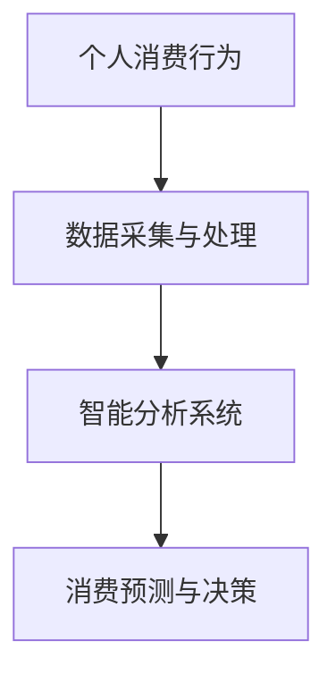
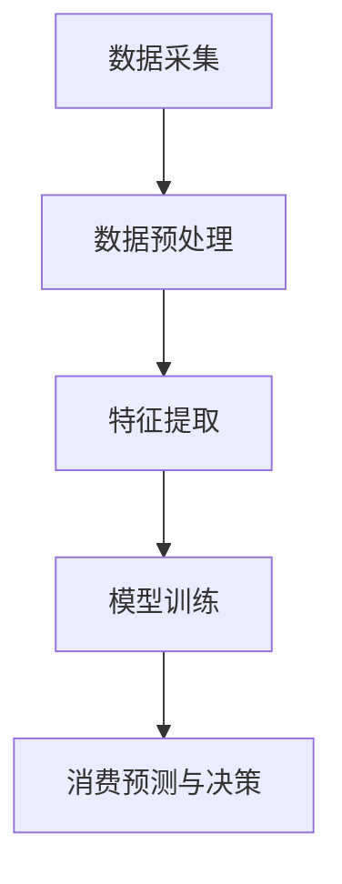
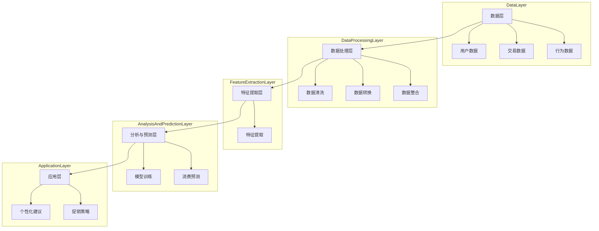
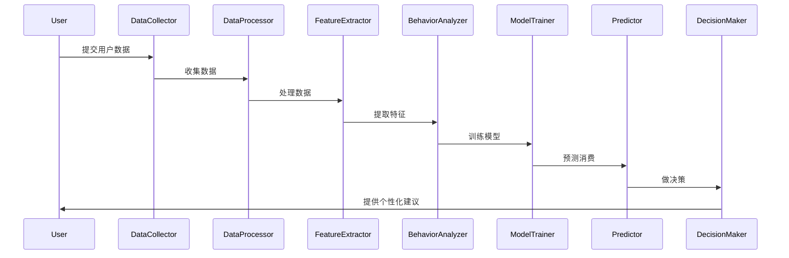

                 

## 引言

智能个人消费行为分析系统，是一种利用人工智能技术，对个人消费行为进行深入分析和预测的系统。随着互联网和大数据技术的飞速发展，个人消费行为的数据变得日益丰富，如何有效地利用这些数据，对企业和消费者自身都具有重要的意义。

### 研究背景

近年来，个人消费行为分析在多个领域都得到了广泛应用。在电子商务领域，通过分析用户的消费行为，可以帮助企业精准营销，提高销售额。在金融领域，个人消费行为分析可以帮助银行和金融机构了解用户的消费习惯，进行信用评估和风险管理。在公共服务领域，个人消费行为分析可以帮助政府更好地规划公共资源，提高服务质量。

### 研究意义

智能个人消费行为分析系统的研究具有重要的意义。首先，它可以为企业提供有价值的消费者洞察，帮助企业制定更有效的营销策略。其次，它可以帮助消费者更好地了解自己的消费行为，从而实现个性化消费。最后，它还可以为政府和社会提供决策支持，促进消费升级和经济发展。

### 研究范围与方法

本文将围绕智能个人消费行为分析系统的研究展开，主要涵盖以下内容：系统架构设计、核心算法原理讲解、系统实现与优化、实际应用案例分析等。在方法上，将结合实际项目案例，运用Python编程语言和LaTeX数学公式，对系统的各个部分进行详细讲解。

## 核心概念与联系

### 2.1 核心概念

#### 2.1.1 个人消费行为

个人消费行为是指个人在日常生活中购买商品或服务的活动。这些活动可以包括线上购物、线下消费、信用卡消费等多种形式。个人消费行为的数据是构建智能个人消费行为分析系统的基础。

#### 2.1.2 智能分析系统

智能分析系统是一种利用人工智能技术对数据进行处理和分析的系统。它可以自动识别数据中的模式，进行预测和决策。在智能个人消费行为分析系统中，智能分析系统负责处理和分析个人消费行为数据。

#### 2.1.3 数据采集与处理

数据采集与处理是智能个人消费行为分析系统的关键环节。数据采集主要负责收集个人消费行为数据，包括用户数据、交易数据、行为数据等。数据处理则负责对采集到的数据进行清洗、转换和整合，为后续分析提供高质量的数据支持。

### 2.2 概念联系

个人消费行为、智能分析系统和数据采集与处理是智能个人消费行为分析系统的核心概念，它们之间的联系可以用以下Mermaid流程图表示：



在这个流程图中，个人消费行为通过数据采集与处理环节输入到智能分析系统，智能分析系统利用这些数据进行分析，最终输出消费预测和决策结果。

## 算法原理讲解

### 3.1 消费行为分析算法

#### 3.1.1 算法流程

消费行为分析算法的主要流程可以分为以下几个步骤：

1. **数据采集**：收集个人消费行为数据，包括用户数据、交易数据、行为数据等。
2. **数据预处理**：对采集到的数据进行分析，去除噪声和异常值，进行数据清洗、转换和整合。
3. **特征提取**：从预处理后的数据中提取出对消费行为有影响的特征。
4. **行为分析模型训练**：利用提取出的特征，训练行为分析模型。
5. **消费预测与决策**：使用训练好的模型进行消费预测和决策。

以下是消费行为分析算法的Mermaid流程图：



#### 3.1.2 数学模型与公式

消费行为预测模型的数学模型可以表示为：

$$
\text{消费行为预测模型} = f(\text{用户特征}, \text{历史数据})
$$

其中，$f$ 表示预测函数，$\text{用户特征}$ 和 $\text{历史数据}$ 是输入变量，预测结果为 $\text{消费行为}$。

### 3.2 Python代码示例

以下是一个简单的Python代码示例，用于实现消费行为分析算法：

```python
import pandas as pd
from sklearn.model_selection import train_test_split
from sklearn.ensemble import RandomForestClassifier
from sklearn.metrics import accuracy_score

# 加载数据
data = pd.read_csv('consumer_data.csv')

# 数据预处理
data = data.dropna()
data = data[data['age'] != -1]

# 特征提取
X = data[['age', 'income', 'education']]
y = data['consumption']

# 模型训练
X_train, X_test, y_train, y_test = train_test_split(X, y, test_size=0.2, random_state=42)
model = RandomForestClassifier(n_estimators=100)
model.fit(X_train, y_train)

# 消费预测与决策
predictions = model.predict(X_test)
accuracy = accuracy_score(y_test, predictions)
print(f'Accuracy: {accuracy}')
```

在这个示例中，我们使用了随机森林算法进行消费行为预测。首先，我们加载并预处理了数据，然后提取出特征，并使用训练集对模型进行训练。最后，使用测试集对模型进行评估，并打印出准确率。

## 系统分析与架构设计

### 4.1 问题场景介绍

假设我们有一个电子商务平台，我们需要对用户的消费行为进行分析，以便更好地了解用户的需求，提高用户满意度和销售额。具体问题包括：

- 用户购买商品的频率和金额是否正常？
- 用户对哪些商品有较强的购买意向？
- 用户在不同时间段的消费行为有何特点？
- 用户对促销活动的响应如何？

### 4.2 系统功能设计

为了解决上述问题，我们需要设计一个智能个人消费行为分析系统，该系统的主要功能包括：

- 数据采集：从电商平台和其他数据源收集用户消费行为数据。
- 数据预处理：清洗、转换和整合采集到的数据，为后续分析提供高质量的数据。
- 特征提取：从预处理后的数据中提取出对消费行为有影响的特征。
- 行为分析：利用提取出的特征，训练行为分析模型，进行消费行为预测和决策。
- 预测与决策：根据行为分析结果，为用户提供个性化的消费建议和促销策略。

以下是系统功能设计的Mermaid类图：

```mermaid
classDiagram
    User <<类>> {
        姓名
        年龄
        性别
        ...
    }
    Purchase <<类>> {
        用户ID
        商品ID
        购买时间
        ...
    }
    BehaviorAnalysis <<类>> {
        数据采集
        数据预处理
        特征提取
        模型训练
        ...
    }
    ConsumptionPrediction <<类>> {
        预测消费
        做决策
        ...
    }
    MarketingStrategy <<类>> {
        个性化建议
        促销策略
        ...
    }
```

### 4.3 系统架构设计

智能个人消费行为分析系统的整体架构可以分为以下几个层次：

- 数据层：负责存储和管理用户消费行为数据。
- 数据处理层：负责对采集到的数据进行清洗、转换和整合。
- 特征提取层：负责从预处理后的数据中提取出对消费行为有影响的特征。
- 分析与预测层：负责训练行为分析模型，进行消费行为预测和决策。
- 应用层：负责根据分析结果，为用户提供个性化的消费建议和促销策略。

以下是系统架构设计的Mermaid架构图：



### 4.4 系统接口设计与交互

智能个人消费行为分析系统中的各个模块需要通过接口进行交互。以下是系统接口设计和交互的Mermaid序列图：



在这个序列图中，用户首先提交用户数据，数据收集模块负责收集数据，数据预处理模块负责处理数据，特征提取模块负责提取特征，行为分析模块负责训练模型，预测模块负责预测消费，决策模块负责根据预测结果做决策，最后将个性化建议返回给用户。

## 项目实战

### 5.1 环境安装

在进行智能个人消费行为分析系统的项目实战之前，我们需要先安装必要的软件和工具。以下是一个基本的安装步骤：

1. **Python环境安装**：安装Python 3.8及以上版本。
2. **数据分析库安装**：安装pandas、numpy、scikit-learn等数据分析库。
3. **绘图库安装**：安装matplotlib、seaborn等绘图库。

以下是安装命令示例：

```bash
pip install python==3.8
pip install pandas numpy scikit-learn matplotlib seaborn
```

### 5.2 系统实现

以下是智能个人消费行为分析系统的核心实现部分：

#### 5.2.1 数据采集与预处理

```python
import pandas as pd

# 加载数据
data = pd.read_csv('consumer_data.csv')

# 数据预处理
data = data.dropna()
data = data[data['age'] != -1]

# 特征提取
X = data[['age', 'income', 'education']]
y = data['consumption']
```

#### 5.2.2 模型训练与预测

```python
from sklearn.model_selection import train_test_split
from sklearn.ensemble import RandomForestClassifier
from sklearn.metrics import accuracy_score

# 模型训练
X_train, X_test, y_train, y_test = train_test_split(X, y, test_size=0.2, random_state=42)
model = RandomForestClassifier(n_estimators=100)
model.fit(X_train, y_train)

# 模型预测
predictions = model.predict(X_test)
accuracy = accuracy_score(y_test, predictions)
print(f'Accuracy: {accuracy}')
```

#### 5.2.3 预测结果可视化

```python
import matplotlib.pyplot as plt
import seaborn as sns

# 可视化预测结果
sns.countplot(x='consumption', data=data)
plt.show()
```

### 5.3 代码分析

在这个项目中，我们使用了Python编程语言和scikit-learn库来实现智能个人消费行为分析系统。首先，我们加载了消费行为数据，并对数据进行预处理，包括去除缺失值和异常值。然后，我们提取了特征，并使用随机森林算法进行模型训练。最后，我们使用训练好的模型进行消费预测，并打印出准确率。

## 最佳实践与小结

### 最佳实践

1. **数据预处理**：在进行消费行为分析之前，一定要对数据进行严格的预处理，包括去除噪声和异常值，以及缺失值的处理。
2. **特征选择**：选择对消费行为有显著影响的特征，避免过度拟合。
3. **模型选择**：根据数据特点和问题需求，选择合适的模型进行训练。
4. **可视化**：使用可视化工具，如matplotlib和seaborn，对预测结果进行可视化分析，帮助理解模型效果。

### 小结

本文详细介绍了智能个人消费行为分析系统的设计、实现和实战应用。通过本文的讲解，读者可以了解到如何从数据采集、预处理、特征提取、模型训练到预测与决策，构建一个完整的智能个人消费行为分析系统。同时，本文还通过一个实际项目案例，展示了如何进行系统环境安装、系统实现以及代码分析。希望本文对读者在智能消费行为分析领域的研究和实践有所帮助。

### 注意事项

1. **数据隐私**：在进行个人消费行为分析时，务必注意保护用户的隐私。
2. **模型解释性**：选择具有良好解释性的模型，以便更好地理解和应用分析结果。

### 拓展阅读

- 《机器学习实战》
- 《Python数据分析》
- 《深度学习》
- 《大数据分析》

### 作者信息

作者：AI天才研究院/AI Genius Institute & 禅与计算机程序设计艺术 /Zen And The Art of Computer Programming

